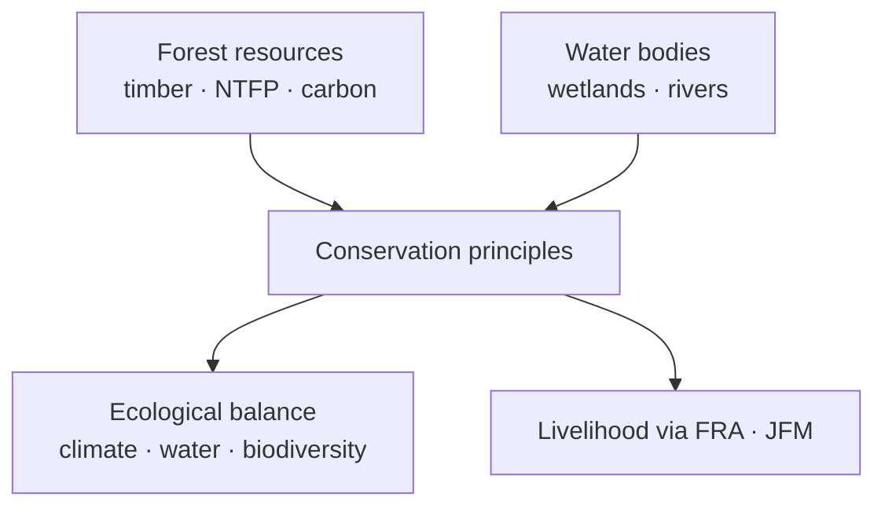

# Forest Resources & Biodiversity Conservation

> GS-1 · Topic 10 · Forest resources, conservation principles, ecological balance (India)

---

## PYQs

| Year | M | Words | Question (EN) | प्रश्न (HI) | ID |
|------|---|-------|---------------|-------------|-----|
| 2025 | 12 | 200 | Examine the forest resources of India and explain the principles of conservation which could be applied to improve the forest wealth of India. | भारत के वन संसाधनों का परीक्षण कीजिये तथा उन संरक्षण सिद्धांतों की समझाइये जिन्हें देश की वन सम्पदा के विकास में प्रयुक्त किया जा सकते है। | Q1 |
| 2024 | 12 | 200 | Biodiversity conservation of forest and water bodies in India is essential to maintain ecological balance. Elucidate in detail. | भारत में वन एवं जल स्रोतों के जैविक विविधता का संरक्षण पारिस्थितिक संतुलन बनाए रखने के लिए आवश्यक है। विस्तार से स्पष्ट कीजिए। | Q2 |

---

## Quick Revision

```
FOREST COVER (ISFR 2023, MoEFCC):
  Total forest + tree cover ~25% land · Forest cover classes: Very Dense · Moderately Dense · Open
  · Tree cover outside forests ( agroforestry, orchards)

TYPES: Tropical evergreen (Western Ghats, NE) · moist/dry deciduous (Madhya Pradesh, Chhattisgarh)
  · thorn (Rajasthan) · montane (Himalaya) · mangrove (Sundarbans, Bhitarkanika) · alpine

BIODIVERSITY HOTSPOTS (4 in India): Himalaya · Indo-Burma (NE) · Western Ghats · Sundaland (Nicobar)

FOREST RESOURCES: Timber · NTFP (tendu, bamboo, mahua) · fuelwood · medicinal plants · carbon sink
  · watershed · tourism · tribal livelihood (FRA 2006)

CONSERVATION PRINCIPLES (2025):
  Sustainable yield · ecosystem approach · participatory (JFM, FRA) · polluter pays
  · precautionary · in-situ (protected areas) + ex-situ (botanical gardens, gene banks)
  · landscape connectivity · invasive species control · fire management

INSTITUTIONS/LAWS: Indian Forest Act 1927 · WPA 1972 · FRA 2006 · CAMPA · NAP 1988 · Green India Mission
  · National Biodiversity Act 2002 · Project Tiger/Elephant · Compensatory afforestation

WATER-FOREST LINK (2024): Catchment protection · recharge · prevent siltation · mangrove-coastal buffer
  · river dolphin, wetland birds · climate regulation

TRAPS: Forest cover ≠ natural forest always (plantations count) | Conservation ≠ only protection — include livelihood
  | FRA vs conservation = integrate not oppose | 33% cover target NAP 1988 — not yet met
```

---

## Content

### Context — forest resources in India

- **Forests** provide **timber, non-timber forest produce (NTFP), biodiversity, carbon sequestration, watershed protection, tourism, and tribal livelihoods** — **critical natural capital**.
- **India State of Forest Report (ISFR 2023, FSI):** **Forest cover ~21.7%**, **tree cover ~2.9%**, **total ~24.6%** of **geographical area** — **below National Forest Policy 1988 target of 33%**.
- **Geographic distribution:** **NE states (Arunachal, Mizoram, Manipur)**, **Madhya Pradesh, Chhattisgarh, Odisha, Maharashtra** lead **forest cover area**; **mangroves, Western Ghats, Himalaya** **high biodiversity value**.
- **South & South-East Asia context:** **Indo-Burma hotspot**, **shared species (elephants, rhinos)**, **Mekong-Ganges delta forests** — **regional deforestation drivers similar (agriculture, infrastructure)**.

### Forest types and resource value

| Forest type | Location | Resources & significance |
|-------------|----------|--------------------------|
| **Tropical evergreen** | **Western Ghats, Andaman, NE** | **High biodiversity, endemic species, hydropower catchments** |
| **Moist deciduous** | **Central India, Odisha, Jharkhand** | **Sal, teak — timber, NTFP, wildlife (tiger reserves)** |
| **Dry deciduous** | **Deccan, Gujarat, UP** | **Hardier species, fuelwood pressure** |
| **Thorn/scrub** | **Rajasthan, Kutch** | **Prosopis, grazing, drought adaptation** |
| **Montane/alpine** | **Himalaya** | **Oak, rhododendron, medicinal plants, snow leopard habitat** |
| **Mangrove** | **Sundarbans, Bhitarkanika, Pichavaram** | **Coastal protection, fisheries, carbon, tiger (Sundarbans)** |
| **Littoral & swamp** | **Coasts, deltas** | **Storm buffer, breeding grounds** |

**NTFP economy:** **Tendu leaves (bidi), bamboo, mahua, lac, honey** — **tribal household income** — **~400 million forest-dependent people** (estimate range used cautiously in exams).

### Biodiversity and protected area network

- **Four biodiversity hotspots** entirely/partly in India — **Western Ghats, Himalaya, Indo-Burma, Sundaland (Nicobar)**.
- **Protected Areas (WPA 1972):** **106+ National Parks**, **567+ Wildlife Sanctuaries**, **Conservation Reserves, Community Reserves**.
- **Flagship programmes:** **Project Tiger (1973)**, **Project Elephant**, **Indian Rhino Vision**.
- **UNESCO Natural World Heritage:** **Kaziranga, Manas, Keoladeo, Sundarbans, Western Ghats, Great Himalayan NP, Nanda Devi** — **exam named entities**.
- **Ex-situ:** **Botanical Survey of India**, **ZSI**, **gene banks (NBPGR)**, **captive breeding**.



### Principles of forest conservation (2025 PYQ)

| Principle | Application in India |
|-----------|---------------------|
| **Sustainable yield** | **Harvest ≤ regeneration** — **working plans (State Forest Departments)** |
| **Ecosystem approach** | **Protect entire landscape — corridors (Kanha-Pench)** |
| **Participatory management** | **Joint Forest Management (JFM), FRA community forest rights** |
| **In-situ conservation** | **Protected areas, ESZ (Eco-Sensitive Zones)** |
| **Ex-situ conservation** | **Botanical gardens, seed banks, zoo breeding** |
| **Polluter/user pays** | **CAMPA from diversion levies for afforestation** |
| **Precautionary principle** | **ESIA before forest clearance (Forest Conservation Act 1980)** |
| **Landscape connectivity** | **Tiger corridors, NE elephant routes** |
| **Fire & invasive control** | **Controlled burns, lantana removal (Western Ghats)** |
| **Climate mitigation** | **REDD+, carbon stock in ISFR carbon pool estimates** |

**National Forest Policy 1988 goals:** **33% forest cover**, **sustainable management**, **tribal symbiosis**, **conservation of biodiversity**.

### Forest & water biodiversity — ecological balance (2024 PYQ)

**Why both essential together:**

1. **Watershed services** — **Forests regulate runoff** — **reduce floods, recharge aquifers** — **Ganga, Cauvery headwaters**.
2. **Sediment control** — **Prevent reservoir siltation (Tehri, Polavaram)** — **cost of deforestation on water infrastructure**.
3. **Aquatic-terrestrial link** — **Riparian forests** — **fish spawning, otters, dolphins**.
4. **Wetland-mangrove systems** — **Sundarbans** — **cyclone buffer + tiger + fisheries** — **integrated conservation unit**.
5. **Climate regulation** — **Forests + wetlands sequester carbon** — **moderate local temperature, rainfall recycling**.
6. **Pollination & pest control** — **Forest patches support ** **agricultural landscape stability**.
7. **Cultural/spiritual values** — **Sacred groves (Meghalaya, Odisha)** — **community conservation**.

**Threats to balance:** **Deforestation, dam fragmentation, pollution, invasive species (water hyacinth), climate change, unsustainable NTFP extraction**.

### Policy and institutional framework

- **Forest Conservation Act 1980** — **Central approval for diversion** — **compensatory afforestation**.
- **CAMPA (Compensatory Afforestation Fund)** — **₹80,000+ crore fund** — **state afforestation, tribal welfare**.
- **Forest Rights Act 2006** — **Individual/community rights** — **integrate conservation with tribal stewardship**.
- **Biological Diversity Act 2002** — **BMCs (Biodiversity Management Committees)**, **ABS benefit sharing**.
- **Green India Mission (NAPCC)** — **forest quality improvement, increase cover**.
- **National Afforestation Programme** — **JFM committees**.

### Contemporary relevance

- **ISFR 2023** — **mangrove increase noted**, **concern in NE shifting cultivation**.
- **COP15 Kunming-Montreal GBF** — **30×30 protection target** — **India commitments**.
- **Project Cheetah (Kuno)** — **reintroduction ecology debate**.
- **Great Nicobar mega-project** — **forest diversion vs biodiversity hotspot tension**.
- **Urban forest (Miyawaki), Nagar Van scheme** — **city ecological balance**.

### Limits and balanced view

- **Plantation monoculture** in **compensatory afforestation** ≠ **biodiverse natural forest**.
- **FRA implementation uneven** — **conservation-livelihood conflict** needs **community-led models (Mendha Lekha)**.
- **33% target** — **quality and connectivity** matter more than **percentage alone**.

---

## Answers

### Q1: Examine forest resources of India and explain principles of conservation to improve forest wealth. (2025, 12M, 200W)

**Introduction:**
> **India's forest resources** — **covering ~25% land (forest + tree cover)** — **supply timber, NTFP, biodiversity, and ecosystem services** but **face degradation pressures** requiring **principled conservation for enhanced forest wealth**.

**Main Points:**
- **Resource Examination — Area & Types** — **Evergreen (Western Ghats, NE), deciduous (Central India), mangrove (Sundarbans), thorn (Rajasthan)** — **ISFR 2023 baseline**.
- **Economic Resources** — **Teak, sal, bamboo, tendu, medicinal plants, ecotourism**.
- **Ecological Services** — **Carbon sink, watershed, wildlife habitat (Project Tiger reserves)**.
- **Principle — Sustainable Yield** — **Working plans, harvest ≤ regeneration**.
- **Principle — Participatory Management** — **JFM, FRA 2006 community forest stewardship**.
- **Principle — In-situ + Ex-situ** — **Protected areas + botanical gardens/gene banks**.
- **Principle — Ecosystem & Landscape** — **Corridors, ESZ, CAMPA compensatory afforestation**.
- **Principle — Precautionary & Polluter Pays** — **Forest Conservation Act 1980 clearance, diversion levies**.

**Keywords (underline in exam):** ISFR · NTFP · FRA 2006 · CAMPA · National Forest Policy 1988 · Biodiversity Hotspot · JFM

**Exam diagram (30 sec):**
```
Forest wealth: timber · NTFP · biodiversity · carbon
Conservation: sustainable · participatory · PA · CAMPA · corridors
```

**Conclusion:**
> **Improving forest wealth** means **quantity + quality + justice** — **conservation principles must ** **integrate tribal livelihoods and watershed health**.

---

### Q2: Biodiversity conservation of forest and water bodies is essential to maintain ecological balance. Elucidate in detail. (2024, 12M, 200W)

**Introduction:**
> **Forests and water bodies** form **interlinked ecosystems** — **biodiversity conservation in both** sustains **hydrological cycles, climate stability, and livelihoods** — **ecological balance cannot be achieved in isolation**.

**Main Points:**
- **Forest Biodiversity Role** — **Species habitat, pollination, genetic reservoir** — **four global hotspots in India**.
- **Water Body Biodiversity** — **Rivers (Ganges dolphin), wetlands (Chilika birds), mangroves (Sundarbans)**.
- **Watershed Linkage** — **Forests regulate runoff, recharge aquifers, reduce siltation**.
- **Climate Regulation** — **Carbon sequestration, local rainfall recycling, temperature moderation**.
- **Disaster Buffer** — **Mangroves/wetlands absorb cyclones; forests prevent landslides**.
- **Food & Livelihood** — **Fisheries, NTFP, agro-ecosystem stability**.
- **Threats** — **Deforestation, pollution, encroachment, dams, invasive species**.
- **Conservation Tools** — **WPA protected areas, Ramsar wetlands, Namami Gange, FRA, Biological Diversity Act**.

**Keywords (underline in exam):** Ecological Balance · Biodiversity Hotspot · Watershed · Ramsar · Mangrove · FRA · In-situ Conservation

**Exam diagram (30 sec):**
```
Forests ←→ Water bodies (hydrology · species)
        ↓
Ecological balance: climate · floods · fisheries · agri
```

**Conclusion:**
> **Integrated forest-water conservation** is **foundation of India's ** **monsoon ecology, disaster resilience, and inclusive development**.

---

### Q3: *Likely variant:* Discuss the role of mangrove ecosystems in India's coastal ecological balance. (—, 8M, 125W)

**Introduction:**
> **Mangroves** — **Sundarbans, Bhitarkanika, Pichavaram, Gulf of Kutch** — **unique tidal forests** **critical for coastal ecological balance**.

**Main Characteristics:**
- **Storm & Surge Buffer** — **Amphan 2020 — less damage where mangroves intact**.
- **Biodiversity** — **Fish nurseries, crabs, Sundarbans tiger, migratory birds**.
- **Sediment Stabilization** — **Reduce coastal erosion, delta accretion**.
- **Carbon Sequestration** — **Blue carbon ecosystem**.
- **Threats** — **Shrimp farming, port development, sea level rise**.
- **Conservation** — **Ramsar, CRZ, mangrove mission, community fishing rights**.

**Keywords (underline in exam):** Mangrove · Sundarbans · Blue Carbon · CRZ · Cyclone Protection · Ramsar

**Exam diagram (30 sec):**
```
Mangrove → buffer surge · nursery fisheries · carbon · erosion control
```

**Conclusion:**
> **Protecting mangroves is ** **cost-effective coastal climate adaptation** for **India's densely populated eastern coast**.

---

## Traps

| Wrong | Correct |
|-------|---------|
| India has 33% forest cover | **~25% total forest+tree (ISFR 2023)** — **33% is policy target** |
| All green cover = natural forest | **Plantations, orchards count in tree cover** |
| Conservation = only strict protection | **Participatory JFM, FRA, sustainable NTFP harvest** |
| FRA anti-conservation | **Community stewardship can strengthen conservation (Mendha Lekha)** |
| Forest conservation unrelated to water | **2024 PYQ integrates both** — **watershed essential** |
| CAMPA optional fund | **Statutory compensatory afforestation mechanism** |
| Biodiversity hotspots = only NE | **Also Western Ghats, Himalaya, Nicobar (Sundaland)** |
| Ex-situ replaces in-situ | **Complementary — PA network primary** |
| Mangroves only Bengal | **Odisha, Tamil Nadu, Gujarat, Maharashtra also** |
| Elucidate = one paragraph | **Detailed dimensions — services, threats, tools, examples** |

---

*Complete.*
