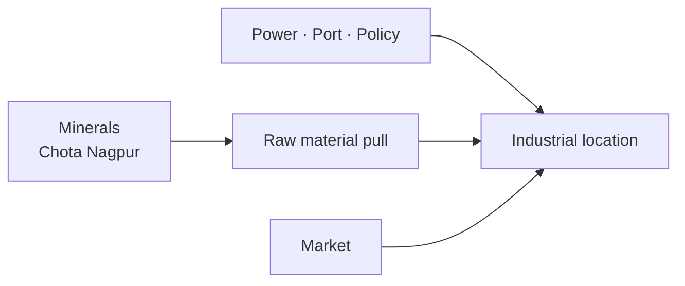

# Minerals & Industrial Location in India

> GS-1 · Topic 10 · Mineral development policy, industrial location factors (India)

---

## PYQs

| Year | M | Words | Question (EN) | प्रश्न (HI) | ID |
|------|---|-------|---------------|-------------|-----|
| 2023 | 12 | — | Discuss India's mineral development policy. | भारत की खनिज विकास नीति की व्याख्या कीजिए। | Q1 |

---

## Quick Revision

```
NATIONAL MINERAL POLICY 2019 (NMP 2019) — replaces 2008
  Objectives: sustainable mining · transparency · private participation · downstream industry
  · regional balance · environmental/social safeguards · critical minerals

MMDR Act 1957 (amended 2015, 2021): Auction regime for major minerals · DMF (District Mineral Foundation)
  · NMET (exploration trust) · decriminalization of minor offences (2023 amendment)

MAJOR MINERALS & ZONES:
  Coal: Jharia/Dhanbad (Jharkhand) · Raniganj (WB) · Singrauli (MP-UP)
  Iron ore: Odisha (Keonjhar, Sundargarh) · Jharkhand · Chhattisgarh · Goa (declining)
  Bauxite: Odisha (Panchpatmali) · Gujarat · AP · Ratnagiri conflicts
  Manganese: Odisha · MP · Balaghat
  Mica: Jharkhand (historical) · Limestone: Rajasthan, MP, AP
  Petroleum: Mumbai High · KG Basin · Assam · Rajasthan (Cairn)
  Uranium: Jaduguda (Jharkhand) · Tummalapalle (AP)

INDUSTRIAL LOCATION FACTORS (Weber/agglomeration):
  Raw material · power · market · transport (ports, rail) · labour · capital
  · government policy (SEZ, PLI, freight corridors) · climate · water

CHOTA NAGPUR PLATEAU = mineral heartland → steel (Jamshedpur Tata) · heavy industry

CONTEMPORARY: Critical minerals policy · lithium auctions (J&K Reasi) · coal gasification
  · PM Gati Shakti · Make in India · auction transparency · mine closure rehabilitation

TRAPS: NMP 2019 ≠ only coal | DMF = local benefit sharing | Location = not raw material alone always
  | Goa iron ore ban lesson — environmental limits | MMDR vs MCR — major vs minor minerals
```

---

## Content

### Context — minerals and industrial geography

- **Minerals** are **non-renewable natural resources** — **foundation for ** **steel, cement, power, electronics, defence** — **India ** **Chota Nagpur plateau** = ** richest mineral belt**.
- **Mining contributes** ~**1.5–2% GDP** directly — **much larger via ** **downstream manufacturing**.
- **South & South-East Asia:** **Indonesia (nickel, coal)**, **Australia (iron ore export to Asia)**, **China (rare earth processing)** — **India positioned as ** **consumer and emerging producer** in **regional supply chains**.
- **Exam focus:** **National Mineral Policy 2019**, **MMDR framework**, **industrial location factors with Indian examples**.

### India's major mineral resources — distribution table

| Mineral | Key regions | Industrial use |
|---------|-------------|----------------|
| **Coal** | **Jharkhand (Jharia), Odisha, Chhattisgarh, MP (Singrauli), WB (Raniganj)** | **Thermal power (~70% electricity historically), steel, cement** |
| **Iron ore** | **Odisha, Jharkhand, Chhattisgarh, Karnataka, Goa** | **Steel (Tata Steel Jamshedpur, Rourkela SAIL, Bhilai)** |
| **Bauxite** | **Odisha, Gujarat, AP, Maharashtra (Ratnagiri)** | **Aluminium (NALCO, Hindalco)** |
| **Manganese** | **Odisha, MP (Balaghat), Karnataka** | **Steel alloy, batteries emerging** |
| **Limestone** | **Rajasthan, MP, Andhra Pradesh** | **Cement industry clusters** |
| **Copper** | **Rajasthan (Khetri), Jharkhand (Singhbhum)** | **Electrical, telecom** |
| **Crude oil/gas** | **Mumbai High, KG Basin (AP), Assam, Rajasthan** | **Refineries (Jamnagar, Panipat), petrochemicals** |
| **Uranium** | **Jaduguda (Jharkhand), Tummalapalle (AP)** | **Nuclear power** |
| **Rare earth / critical** | **Coastal monazite sands (Kerala, Odisha), lithium (Reasi J&K discovery)** | **Electronics, EV batteries, defence** |

### National Mineral Policy 2019 — key features (2023 PYQ)

**Vision:** **Sustainable, transparent, efficient mineral development** for **national growth and local benefit**.

| Pillar | Content |
|--------|---------|
| **Regulatory framework** | **MMDR Act amendments — auction for transparency**, **lease extension rules**, **2023 decriminalization of minor offences** |
| **Exploration** | **NMET (National Mineral Exploration Trust)** — **private investment in exploration** |
| **Local benefit sharing** | **DMF (District Mineral Foundation)** — **30% royalty (coal/lignite) / 10% (others)** for **affected districts** — **PMKKKY guidelines** |
| **Sustainable mining** | **Mine closure plans, star rating of mines, reclamation** |
| **Downstream industry** | **Value addition — steel, aluminium, copper processing** — **reduce raw export (iron ore fines)** |
| **Critical minerals** | **Separate strategy for ** **lithium, cobalt, rare earths** — **EV and renewable energy supply security** |
| **Environmental & social** | **Forest clearance, tribal consent (PESA), rehabilitation** |
| **Private participation** | **Commercial mining coal (2020 reforms)**, **FDI in mining** |

**Contrast with NMP 2008:** **2019 emphasizes ** **auction transparency, DMF, critical minerals, deep-sea mining exploration** — **aligns with Atmanirbhar**.

### MMDR Act and institutional ecosystem

- **Major minerals** under **Central/State auction** — **coal, iron, bauxite, copper, etc.**
- **Minor minerals** — **state control** — **sand mining regulation critical (illegal mining issue)**.
- **IBM (Indian Bureau of Mines)** — **regulation, conservation, export policy for iron ore etc.**
- **GSI (Geological Survey of India)** — **exploration data**.

### Factors responsible for industrial location (syllabus keyword)

**Alfred Weber (least cost)** — **transport cost of raw material vs finished product** — **weight-losing industries near raw materials**.

| Factor | Mechanism | Indian example |
|--------|-----------|----------------|
| **Raw material** | **Bulk-reducing industries locate near mines** | **Steel at Jamshedpur (Tata, iron-coal proximity), Rourkela, Bhilai** |
| **Power/Energy** | **Aluminium smelters need cheap electricity** | **Hirakud (NALCO), Korba** |
| **Market** | **Perishable/bulk products near consumers** | **Cement near construction markets but also near limestone** |
| **Transport** | **Ports for import/export, rail corridors** | **Paradip (Odisha ore export), Jamnagar refinery, Vishakhapatnam steel/petrochemicals** |
| **Labour** | **Skill pools, industrial culture** | **Pune-Mumbai auto, Bengaluru IT (different sector but labour cluster)** |
| **Government policy** | **SEZ, PLI, freight corridors, tax incentives** | **Delhi-Mumbai Industrial Corridor, PLI steel, electronics** |
| **Water availability** | **Steel, textile, paper** | **Hardwar, Kanpur (Ganga), textile Gujarat** |
| **Agglomeration** | **Industry clusters reduce cost** | **Maruti-Suzuki Gurugram ecosystem** |

**Footloose vs tied:** **Electronics assembly more footloose (Noida, Sriperumbudur)** vs **steel tied to minerals**.



### Environmental and social issues

- **Jharia coal fires** — **underground burning decades** — **rehabilitation**.
- **Goa iron ore mining ban** — **illegal mining, environmental degradation**.
- **Niyamgiri bauxite** — **tribal veto under FRA/PESA** — **mining vs rights**.
- **Sand mafia** — **minor mineral governance failure**.
- **Mine closure** — **2024 rules emphasis on ** **progressive reclamation**.

### Contemporary relevance

- **Lithium blocks auction (J&K Reasi, 2024)** — **critical mineral domestic supply**.
- **Coal gasification mission** — **reduce import, cleaner use**.
- **PM Gati Shakti National Master Plan** — **multi-modal connectivity for industry**.
- **PLI schemes** — **steel, specialty steel, electronics** — **location diversification**.
- **Critical Mineral Strategy (MoM 2023)** — **KABIL JV for overseas lithium/cobalt assets**.

### Limits and balanced view

- **Mineral wealth ≠ automatic development** — **governance (DMF utilization varies)**.
- **Location factors ** **evolving** — **renewables reduce coal pull**, **automation reduces labour pull**.
- **Circular economy** — **recycling reduces primary mineral dependence** — **e-waste policy emerging**.

---

## Answers

### Q1: Discuss India's mineral development policy. (2023, 12M)

**Introduction:**
> **National Mineral Policy 2019** guides **sustainable, transparent mineral development** — **replacing 2008 policy** amid **MMDR amendments, auction regime, and critical mineral security needs**.

**Main Points:**
- **Objective — Sustainable Development** — **Mine closure, reclamation, star rating, environmental compliance**.
- **Transparent Allocation** — **MMDR auction system** — **reduce discretion and corruption**.
- **DMF & PMKKKY** — **District Mineral Foundation** — **local affected community development from royalty share**.
- **Exploration Boost** — **NMET funding** — **private sector exploration participation**.
- **Downstream Value Addition** — **Reduce raw ore export; promote steel, aluminium processing**.
- **Critical Minerals Strategy** — **Lithium, cobalt, rare earths for ** **EV and renewable transition**.
- **Commercial Coal Mining** — **2020 reforms — private participation, competition**.
- **Social & Tribal Safeguards** — **Forest clearance, FRA/PESA consent, rehabilitation** — **balance extraction with rights**.

**Keywords (underline in exam):** National Mineral Policy 2019 · MMDR Act · DMF · NMET · Auction · Critical Minerals · Sustainable Mining

**Exam diagram (30 sec):**
```
NMP 2019 → auction · DMF · exploration · downstream · critical minerals
         ↓
Sustainable mineral-led industrial growth
```

**Conclusion:**
> **Effective mineral policy** converts **geological endowment into ** **inclusive growth** — **implementation of DMF and environmental safeguards determines success**.

---

### Q2: *Likely variant:* Explain factors responsible for location of iron and steel industries in India. (—, 12M, 200W)

**Introduction:**
> **Iron and steel** are **weight-losing, power-intensive industries** — **locate considering ** **raw materials, coal, transport, market, and policy**.

**Main Points:**
- **Raw Material Proximity** — **Iron ore + coking coal** — **Jamshedpur (Tata), Rourkela, Bhilai, Durgapur**.
- **Chota Nagpur Plateau** — **Mineral heartland** — **historical cluster logic**.
- **Power Availability** — **Electric arc, continuous casting** — **proximity to thermal/hydel**.
- **Transport & Ports** — **Paradip, Visakhapatnam** — **ore import/export, finished steel dispatch**.
- **Market Access** — **Near industrial corridors (DMIC), construction hubs**.
- **Water Requirement** — **Plant cooling, processing** — **river locations preferred**.
- **Government Policy** — **SAIL public sector expansion, PLI specialty steel**.
- **Changing Factors** — **Pellet plants, imported coking coal** — **some decoupling from coal belt**.

**Keywords (underline in exam):** Weber · Weight-Losing · Chota Nagpur · Coking Coal · Jamshedpur · Port Location · PLI

**Exam diagram (30 sec):**
```
Iron ore + coal + power + port/market
           ↓
Steel plants: Jamshedpur · Rourkela · Bhilai · Vizag
```

**Conclusion:**
> **Steel location reflects ** **least-cost raw material logic modified by ** **ports, policy, and market integration**.

---

### Q3: *Likely variant:* What is DMF and why was it introduced under mineral policy reforms? (—, 8M, 125W)

**Introduction:**
> **District Mineral Foundation (DMF)** — **created under MMDR Amendment 2015** — **channels mining royalty share to ** **mining-affected districts**.

**Main Characteristics:**
- **Legal Mandate** — **MMDR Act** — **trust in each mining district**.
- **Funding** — **10–30% of royalty** — **coal highest share**.
- **Purpose — PMKKKY** — **Drinking water, health, education, livelihood for affected communities**.
- **Local Priority** — **Gram sabha consultation in Scheduled Areas**.
- **Transparency** — **e-Governance, district plans**.
- **Policy Goal** — **Inclusive growth from mineral wealth** — **reduce conflict**.
- **Challenge** — **Underutilization, diversion in some states** — **needs audit**.

**Keywords (underline in exam):** DMF · MMDR Amendment · PMKKKY · Royalty · Mining-Affected Communities

**Exam diagram (30 sec):**
```
Mining royalty → DMF → local development (water · health · skills)
```

**Conclusion:**
> **DMF embodies ** **benefit-sharing principle** — **critical for ** **social licence to mine**.

---

## Traps

| Wrong | Correct |
|-------|---------|
| NMP 2019 only about coal | **All major minerals + critical minerals strategy** |
| All steel plants need both ore and coal adjacent | **Import coking coal, pelletization changes logic** |
| Goa still major iron ore exporter | **Mining restrictions post-illegal mining crackdown** |
| DMF optional CSR | **Statutory under MMDR** |
| Mineral policy ignores environment | **Star rating, closure plans, forest clearance mandatory** |
| Location factors = Weber only | **Add policy, ports, agglomeration, water** |
| Mica still major export today | **Historical — Jharkhand mica; declining prominence** |
| Lithium mining already commercial nationwide | **Reasi discovery — early exploration/auction stage** |
| Private mining banned in India | **Commercial coal mining opened 2020** |
| Chota Nagpur only has coal | **Iron, manganese, copper, bauxite, mica historically** |

---

*Complete.*
