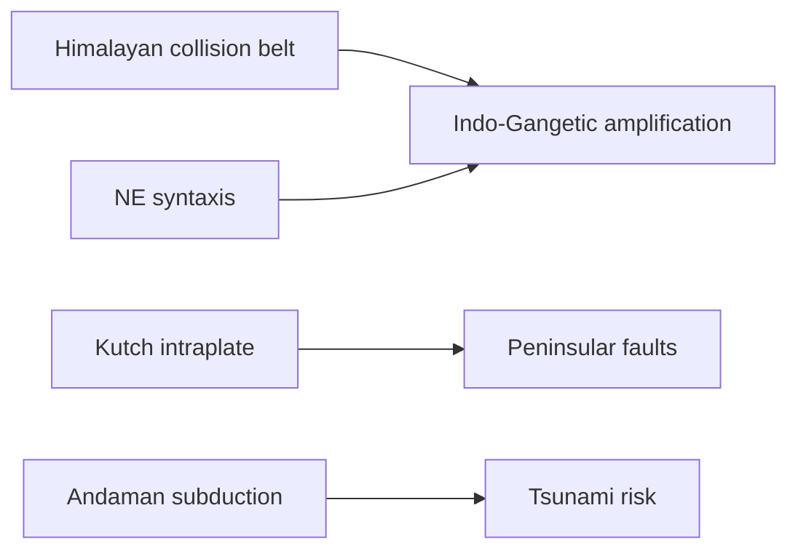

# Earthquakes & Seismic Zones of India

> GS-1 · Topic 11 · Earthquakes, seismic belts, plate tectonics

---

## PYQs

| Year | M | Words | Question (EN) | प्रश्न (HI) | ID |
|------|---|-------|---------------|-------------|-----|
| 2024 | 8 | 125 | Write a note on seismic zones of India. | भारत के भूकंपीय क्षेत्रों पर टिप्पणी लिखिए। | Q1 |
| 2022 | 12 | — | Describe earthquake belts in India. | भारत में भूकंप पेटियों का वर्णन कीजिए। | Q2 |

---

## Quick Revision

```
EARTHQUAKE = Sudden release of energy in crust → seismic waves (P · S · Surface/L)
  Focus (hypocenter) · Epicentre (surface point above focus) · Richter (magnitude) · Mercalli (intensity)

CAUSES: Plate boundaries · fault movement (normal/reverse/strike-slip)
  · isostatic rebound · reservoir-induced · mining · nuclear tests

PLATE CONTEXT (India): Indo-Australian + Eurasian collision → Himalaya
  · transform (Indian Ocean ridge) · subduction (Andaman trench)

INDIA SEISMIC ZONES (BIS/NDMA — 4 zones):
  II Low · III Moderate · IV High · V Very High
  Zone V: Kashmir, Western Himalaya, NE states, Kutch, Andaman-Nicobar
  Zone IV: Delhi, Bihar UP border, Bengal, Gujarat parts, Maharashtra
  Zone II: Stable craton — peninsula interior (parts)

BELTS IN INDIA:
  Himalayan belt (collision) · Indo-Gangetic · NE syntaxis (Shillong plateau)
  · Kutch-Rann · Peninsular (rare — Killari 1993 Latur) · Andaman subduction

MAJOR EVENTS: 2001 Bhuj (Gujarat) · 2005 Kashmir · 2015 Gorkha (Nepal border)
  · 2023 Turkey reminder · 2024 Chamoli not quake — landslide

MITIGATION: NDMA · building codes (IS 1893) · early warning limited · NCS seismograph network
  · tsunami buoys linked for coastal quakes

TRAPS: Zones = hazard map not prediction | Peninsular = stable NOT immune (Latur)
  | Richter ≠ Mercalli | All Himalaya not uniform Zone V | Epicentre ≠ damage always (soft soil Delhi)
```

---

## Content

### Context — earthquakes and India

- **Earthquake** = sudden **release of accumulated strain energy** in Earth's lithosphere, generating **seismic waves** that shake the surface.
- **India** sits at **collision zone** of **Indian Plate** (moving ~5 cm/year north) with **Eurasian Plate** — **Himalayas** and **Indo-Gangetic basin** are **world's most seismically active continental regions** outside Pacific Ring.
- **~59% of India** vulnerable to **moderate-to-severe earthquakes** (NDMA estimate) — **dense population** amplifies **human cost**.
- **UPPCS focus:** **Seismic zonation map**, **earthquake belts**, **causes**, **relation to tsunami/volcanism** (cross-topic).

### Mechanism and measurement

| Term | Meaning |
|------|---------|
| **Focus (hypocenter)** | **Underground origin** of rupture |
| **Epicentre** | **Surface point** directly above focus — news maps use this |
| **Magnitude (Richter/moment Mw)** | **Energy released** — **logarithmic** (Mw 7 = 32× energy of Mw 6) |
| **Intensity (Mercalli)** | **Surface damage effect** — depends on **depth, soil, construction** |
| **Seismic waves** | **P (fastest, push-pull)**, **S (shear)**, **Love/Raleigh (surface — most destructive)** |

**Fault types:** **Normal** (extension), **Reverse/Thrust** (Himalaya — **continental collision**), **Strike-slip** (transform — **San Andreas analogue in parts**).

### Causes of earthquakes (global + India)

- **Plate tectonics** — **primary** — **subduction (Andaman)**, **collision (Himalaya)**, **divergence (Mid-Indian Ocean Ridge)**.
- **Isostatic adjustment** — **post-glacial rebound**, **Himalayan uplift continuing**.
- **Human-induced** — **reservoirs (Koyna debates)**, **mining, fracking**, **dam loading**.
- **Reactivation of ancient faults** — **Peninsular India** — **Killari (Latur) 1993** on **hidden fault**.

### Seismic zones of India (BIS map — exam core)

**Four-zone classification (II–V):**

| Zone | Hazard | Representative regions |
|------|--------|------------------------|
| **V (Very High)** | **MSK IX+ possible** | **J&K, Western Himalaya (Uttarakhand, HP)**, **Central Himalaya**, **NE (Assam, Manipur, Mizoram)**, **Kutch**, **Andaman-Nicobar** |
| **IV (High)** | **Major damage possible** | **Delhi, Chandigarh**, **Bihar–UP border**, **West Bengal**, **parts Gujarat, Maharashtra, Rajasthan** |
| **III (Moderate)** | **Moderate damage** | **Kerala, Goa, Lakshadweep**, **parts MP, Odisha, Andhra** |
| **II (Low)** | **Minor damage** | **Stable craton core** — **parts Karnataka, Tamil Nadu interior, Odisha stable block** |

**Note:** Map **updated periodically** — **micro-zonation** (city-level) refines **Zone IV Delhi** into **local soil amplification** zones.

### Earthquake belts in India (2022 PYQ)

**1. Himalayan Seismic Belt**
- **~2500 km arc** from **Kashmir to Arunachal** — **Indo-Eurasian collision** — **thrust faults (MBT, MCT)**.
- **Shallow-focus earthquakes** — **high intensity** — **2015 Gorkha (Nepal)** affected **Bihar, UP, WB**.

**2. Indo-Gangetic Belt**
- **Thick alluvium** amplifies **ground shaking** — **Lucknow, Patna, Delhi** high **damage risk despite distance from thrust**.
- **Soft soil liquefaction** hazard.

**3. North-East Syntaxis & Shillong Plateau**
- **Complex plate junction** — **high frequency** of **moderate-strong events** — **1897 Shillong (Mw ~8.7)** one of **world's largest**.

**4. Kutch–Rann of Kutch Belt**
- **Intraplate reactivation** — **2001 Bhuj earthquake (Mw 7.7)** — **~20,000 deaths** — ** Gujarat industrial belt**.

**5. Andaman-Nicobar Subduction Zone**
- **India–Burma microplate boundary** — **2004 Sumatra-Andaman Mw 9.1** — **tsunami generation** — **India's island territories**.

**6. Peninsular (Stable Block) Earthquakes**
- **Rare but significant** — **Killari 1993**, **1967 Koyna** — **ancient fault lines** in **Deccan basalt**.



### Effects and Indian examples

- **Primary:** **Ground rupture, landslides (Uttarakhand)**, **liquefaction**.
- **Secondary:** **Fire (1906 San Francisco analogue)**, **dam breach**, **epidemic**, **tsunami (coastal)**.
- **2001 Bhuj:** **Kutch devastation**, **economic loss**, **national building code push**.
- **2005 Kashmir:** **Both sides LoC impact**.

### Contemporary relevance

- **NDMA guidelines**, **IS 1893 (seismic design code)** — **mandatory for public buildings**.
- **National Centre for Seismology (NCS)** — **real-time monitoring**.
- **Early warning:** **Limited for crustal quakes** — **seconds to minutes**; **Japan/Turkey lessons post-2023**.
- **Smart cities — Delhi, Mumbai** — **seismic micro-zonation studies**.
- **Himalayan infrastructure (Char Dham, tunnels)** — **environmental + seismic debate**.

### Limits / balanced view

- **Seismic zoning ≠ prediction** — **when/where exactly** unknown — **preparedness focus**.
- **Peninsular "stable"** misleading — **Latur, Koyna** prove **intraplate risk**.
- **Poor compliance with building codes** in **informal housing** — **main damage driver**, not just geology.

### Major Indian earthquakes — reference table

| Year | Event | Zone | Impact lesson |
|------|-------|------|---------------|
| **1897** | **Shillong** | **NE syntaxis** | **Among largest continental quakes** |
| **1934** | **Bihar-Nepal** | **Himalayan** | **Indo-Gangetic amplification** |
| **1993** | **Killari (Latur)** | **Peninsular** | **Intraplate — stable zone myth broken** |
| **2001** | **Bhuj** | **Kutch** | **Zone V preparedness failure cost** |
| **2005** | **Kashmir** | **Himalayan** | **Cross-border disaster management** |
| **2015** | **Gorkha (Nepal)** | **Himalayan** | **Delhi felt strong shaking — distant thrust** |

### Mitigation framework (exam value-add)

- **Engineering:** **IS 1893 seismic design**, **retrofitting schools/hospitals**, **avoid soft-story buildings**.
- **Institutional:** **NDMA**, **State Disaster Management Authorities**, **building bye-law enforcement**.
- **Community:** **Drills, open spaces, earthquake-resistant housing schemes (PM Awas)**.
- **Science:** **NCS network**, **paleoseismology in Himalaya** for **long-term hazard estimates**.

### Plate tectonics and Indian plate (foundation)

- **Indian Plate** separated from **Gondwana** — **northward drift** — **collided with Eurasia ~50 Ma** — **Himalaya uplift ongoing**.
- **Andaman trench** — **India-Burma microplate subduction** — **different from Himalayan collision** — **tsunamigenic + volcanic arc**.
- **Mid-Indian Ocean Ridge** — **divergent boundary** — **earthquakes along transform offsets**.
- **Three-fold seismicity:** **Collision (Himalaya) + Subduction (Andaman) + Intraplate (Kutch, Latur)** — **explains belt diversity**.

---

## Answers

### Q1: Write a note on seismic zones of India. (2024, 8M, 125W)

**Introduction:**
> **Seismic zoning** classifies India by **expected ground shaking hazard** — **BIS/NDMA four-zone map (II–V)** guides **building codes and disaster planning**.

**Main Characteristics:**
- **Zone V (Very High)** — **Western/Central Himalaya, NE states, Kutch, Andaman-Nicobar** — **MSK IX+ possible**.
- **Zone IV (High)** — **Delhi, Indo-Gangetic cities, parts Gujarat, Bengal, Maharashtra** — **major urban exposure**.
- **Zone III (Moderate)** — **Parts of Deccan coast, MP, Odisha** — **moderate design requirements**.
- **Zone II (Low)** — **Stable craton interiors** — **minimal seismic design**.
- **Basis** — **Historical earthquakes, tectonic setting, fault mapping, soil amplification**.
- **Purpose** — **IS 1893 structural design**, **NDMA mitigation**, **insurance risk**.
- **Limitation** — **Zonation not prediction** — **micro-zonation needed for cities (Delhi soft soil)**.

**Keywords (underline in exam):** Seismic Zone V · Indo-Gangetic · Himalaya · BIS Map · Epicentre · IS 1893

**Exam diagram (30 sec):**
```
Zone V: Himalaya · NE · Kutch · Andaman
Zone IV: Delhi · Gangetic plain · parts Gujarat
Zone II-III: Peninsular stable blocks
```

**Conclusion:**
> **~59% India** is seismically vulnerable — **zoning converts geology into actionable building and preparedness policy**.

---

### Q2: Describe earthquake belts in India. (2022, 12M)

**Introduction:**
> **Earthquake belts** are **linear zones of concentrated seismicity** tied to **plate boundaries and reactivated faults** — India spans **multiple active belts**.

**Main Characteristics:**
- **Himalayan Belt** — **Indo-Eurasian collision** — **2500 km thrust arc** — **Kashmir to Arunachal** — **2015 Gorkha-type events**.
- **Indo-Gangetic Belt** — **Alluvial plain amplifies shaking** — **Delhi, Patna, Lucknow high damage risk**.
- **North-East Syntaxis** — **Shillong Plateau, Assam gap** — **1897 great earthquake region**.
- **Kutch–Rann Belt** — **Intraplate reactivation** — **2001 Bhuj Mw 7.7**.
- **Andaman-Nicobar Subduction** — **India–Burma plate boundary** — **2004 tsunamigenic megathrust**.
- **Peninsular Faults** — **Stable block exceptions** — **Killari 1993, Koyna 1967**.
- **Common Mechanism** — **Continental collision + subduction + hidden intraplate faults**.

**Keywords (underline in exam):** Himalayan Belt · Indo-Gangetic · Shillong Plateau · Kutch · Andaman Trench · Intraplate

**Exam diagram (30 sec):**
```
Himalaya (collision) → Gangetic plain
NE syntaxis · Kutch · Andaman (subduction) · Peninsular faults
```

**Conclusion:**
> India's **multi-belt seismicity** demands **region-specific preparedness** — **Himalayan construction standards ≠ peninsular complacency**.

---

### Q3: *Likely variant:* Explain the relationship between earthquakes, volcanoes, and tsunamis. (—, 12M, 200W)

**Introduction:**
> **Earthquakes, volcanoes, and tsunamis** are **linked through plate tectonics** — **energy release at boundaries** can trigger **one or all three hazards**.

**Main Points:**
- **Common Root — Plate Tectonics** — **Collision, subduction, rifting** generate **earthquakes and magma**.
- **Earthquake → Tsunami** — **Undersea thrust (2004 Sumatra-Andaman Mw 9.1)** displaces **water column**.
- **Volcano → Earthquake** — **Magma movement** causes **volcanic tremors** — **Hawaii, Andaman arc**.
- **Volcano → Tsunami** — **Flank collapse, submarine eruption** — **Krakatoa 1883 analogue**.
- **Not All Linked** — **Intraplate quakes (Latur)** no tsunami; **many quakes no eruption**.
- **India Context** — **Andaman zone** all three risks; **Himalaya** mainly **earthquakes/landslides**.
- **Mitigation** — **Integrated early warning** — **seismographs + tsunami buoys (INCOIS)**.

**Keywords (underline in exam):** Plate Tectonics · Subduction · Megathrust · Tsunamigenic · Andaman · Epicentre

**Exam diagram (30 sec):**
```
Subduction zone → EQ + volcano possible
Undersea thrust EQ → tsunami
```

**Conclusion:**
> **Understanding coupled hazards** is essential for **Indian Ocean rim preparedness** — **single-event cascades**.

---

## Traps

| Wrong | Correct |
|-------|---------|
| Peninsular India has no earthquakes | **Killari 1993, Koyna 1967** — **intraplate faults** |
| Seismic zones predict exact time | **Hazard map for design** — **not forecasting calendar** |
| Richter = damage measure | **Magnitude = energy**; **Mercalli = damage intensity** |
| All Himalaya same risk uniformly | **Zones IV and V vary** — **micro-zonation matters** |
| Epicentre = always max damage | **Soft soil (Delhi, Gangetic)** amplifies **distant quakes** |
| Only Zone V needs building codes | **Zone IV cities (Delhi) huge exposure** |
| Earthquakes always cause tsunamis | Need **undersea vertical displacement** — **shallow thrust** |
| Bhuj 2001 = Himalayan event | **Kutch intraplate belt** — **not collision zone** |
| 2004 tsunami without India impact | **Andaman-Nicobar, Tamil Nadu, Andhra** severely hit |
| Belts = only Himalayan | **Six belts** — **NE, Kutch, Andaman, Peninsular** |

---

*Complete.*
