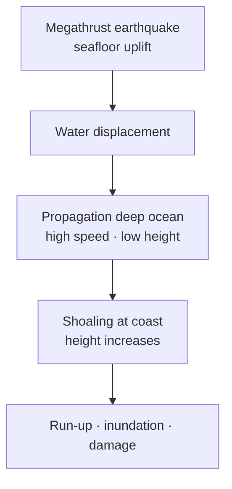

# Tsunami — Characteristics, Causes & Effects

> GS-1 · Topic 11 · Tsunami generation, propagation, Indian Ocean impacts

---

## PYQs

| Year | M | Words | Question (EN) | प्रश्न (HI) | ID |
|------|---|-------|---------------|-------------|-----|
| 2024 | 12 | 200 | Discuss the characteristics, causes and effects of Tsunami with example. | सुनामी की विशेषताओं, कारणों एवं प्रभावों का सविस्तार विवेचन प्रस्तुत कीजिए। | Q1 |
| 2018 | 12 | 200 | How are volcano, earthquake and tsunami related to each other? Highlight all the possible causes for volcanic eruptions. | ज्वालामुखी, भूकम्प और सुनामी आपस में कैसे सम्बद्ध हैं? ज्वालामुखी उद्गार के सम्भावित सभी कारणों पर प्रकाश डालiye। | Q2 |

---

## Quick Revision

```
TSUNAMI = Japanese "harbour wave" — series of long-period ocean waves from water displacement
  NOT wind-driven storm surge (cyclone) | Wavelength 100-500 km · shallow water speeds 700+ km/h

CAUSES: Subduction megathrust EQ (main) · undersea landslide · volcanic collapse · asteroid (rare)
  · submarine volcanic explosion

CHARACTERISTICS: Open ocean — low height (~1 m), ships barely feel | Coastal shoaling — height ↑↑
  · multiple waves · trough may hit first (drawback) · great destructive power

2004 INDIAN OCEAN: Sumatra-Andaman Mw 9.1 · Dec 26 · ~230,000 deaths (global)
  India: Tamil Nadu, Andhra, Puducherry, Andaman-Nicobar · INCOIS established after

PHASES: Generation → propagation (deep ocean) → run-up (coastal flooding) → inundation

EFFECTS: Loss of life · coastal erosion · salinization · ecosystem damage (mangroves/corals)
  · infrastructure · disease · economic (fisheries, tourism)

WARNING: INCOIS · Indian Tsunami Early Warning Centre (Hyderabad) · DART buoys · UNESCO IOC
  · Andaman real-time network

VOLCANO-EQ-TSUNAMI LINK: Subduction zones — magma + seismic + water displacement
  Eruption causes: plate subduction · rifting · hotspot · gas pressure · crustal assimilation

TRAPS: Tsunami ≠ tidal wave | Not all undersea EQ make tsunami | Cyclone surge ≠ tsunami
  | First wave not always biggest | 2004 changed Indian Ocean warning forever
```

---

## Content

### Context — tsunami in physical geography

- **Tsunami** = **series of extremely long-wavelength ocean waves** caused by **sudden displacement of large water volume** — typically **undersea earthquakes**, also **landslides, volcanic collapse, meteorite impact**.
- **Distinct from:** **Storm surge** (cyclone wind-pushed water), **tidal bore**, **ordinary wind waves** (short period).
- **Indian Ocean** historically **under-prepared** until **26 December 2004** — **Sumatra-Andaman megathrust** — **deadliest tsunami in recorded history** (~**230,000 deaths** globally).
- **India affected:** **Tamil Nadu, Andhra Pradesh, Puducherry, Kerala (minor), Andaman-Nicobar Islands** — led to **INCOIS Indian Tsunami Early Warning Centre**.

### Characteristics of tsunami

| Feature | Open ocean | Near coast (shoaling) |
|---------|------------|------------------------|
| **Wave height** | **~0.5–1 m** — **ships may not notice** | **10–30+ m** possible in **run-up zones** |
| **Wavelength** | **100–500 km** | **Compresses** — **wave stacks up** |
| **Speed** | **~800 km/h (deep water)** — **jet-speed** | **Slows** — **energy converts to height** |
| **Period** | **10–60 minutes** between crests | **Multiple waves** over **hours** |
| **Energy** | **Whole water column moves** | **Massive inundation force** |

**Drawback:** **Sea may retreat abnormally before first wave** — **exposes seabed** — **false safety trap**.

**Train of waves:** **First ≠ always largest** — **third or later wave** may be **most destructive**.

### Causes of tsunami

**1. Subduction zone earthquakes (primary — 2004 type)**
- **Megathrust rupture** — **vertical displacement of seafloor** over **large area**.
- **Shallow focus (<70 km)**, **Mw > 7.0** typically — **2004 Mw 9.1** — **1,200 km rupture length**.

**2. Submarine landslides**
- **Earthquake-triggered sediment slide** — **Papua New Guinea 1998**.
- **Volcanic flank collapse**.

**3. Volcanic causes**
- **Krakatoa 1883** — **caldera collapse**.
- **Submarine explosive eruption**.

**4. Meteorite/asteroid impact** — **rare** — **geological record only**.

**What does NOT reliably cause tsunami:** **Deep earthquakes**, **strike-slip faults** (unless **large lateral displacement**), **most continental quakes**.

### 2004 Indian Ocean Tsunami — exam example

- **Origin:** **Off west coast Sumatra** — **India–Burma plate subduction** — **Andaman-Nicobar on same arc**.
- **Timeline:** **Earthquake ~7:58 IST** — **waves hit Andaman within minutes**, **Tamil Nadu ~2–3 hours later** (distance + speed).
- **India impacts:** **~10,000+ Indian deaths**; ** Nagapattinam, Cuddalore, Chennai coast** devastated; **Car Nicobar, Hut Bay** severe in **islands**.
- **Aftermath:** **Indian Tsunami Early Warning System (2007 operational)**, **INCOIS Hyderabad**, **community evacuation drills**.



### Effects of tsunami

**Human and economic**
- **Mass casualties** — **drowning, trauma** — **fishing communities hardest hit**.
- **Displacement** — **temporary camps** — **2004 Nagapattinam rehabilitation**.
- **Infrastructure** — **ports, roads, houses, power** destroyed.
- **Livelihoods** — **fishing boats, nets, salt pans, tourism**.

**Environmental**
- **Coastal erosion and geomorphology change**.
- **Saltwater intrusion** into **farmland, aquifers**.
- **Mangrove/coral damage** — yet **mangroves reduced wave energy** where intact (**Paradox for conservation**).
- **Marine ecosystem disruption**.

**Secondary**
- **Disease outbreaks**, **psychological trauma**, **orphan crises**.

### Volcano, earthquake, tsunami interrelation (2018 PYQ)

**Geological linkage**
- **Plate subduction zones** produce **all three**: **volcanic arc (Andaman)**, **frequent earthquakes**, **tsunamigenic thrusts**.
- **Earthquake triggers tsunami** when **undersea vertical slip** sufficient.
- **Volcanic eruption** causes **local earthquakes (tremors)**; **submarine eruptions/collapse** cause **tsunami**.
- **Not always coupled** — **Himalayan earthquakes** rarely tsunamis (**continental collision, not oceanic subduction**).

**Possible causes of volcanic eruptions (2018 second part)**
- **Subduction — plate melting** produces **andesitic magma** (**Pacific Ring, Andaman arc**).
- **Rifting — divergent boundaries** (**Mid-Ocean Ridge**).
- **Hotspot mantle plumes** (**Hawaii, Reunion — Deccan Traps prehistoric**).
- **Gas pressure (CO₂, H₂O)** — **explosive Plinian eruptions**.
- **Crustal assimilation / magma chamber recharge**.
- **Isostatic unloading** after **glacial retreat** (minor trigger).

### Contemporary relevance

- **INCOIS** — **24×7 monitoring**, **DART buoys**, **SMS/email alerts to coastal states**.
- **UNESCO Intergovernmental Oceanographic Commission (IOC)** — **Indian Ocean Tsunami Warning System** network.
- **Coastal Regulation Zone (CRZ)** — **setback lines**, **no construction in high-risk zones**.
- **Mangrove restoration post-2004** — **Tamil Nadu, Sundarbans model**.
- **Andaman volcanic activity monitoring** — **Barren Island** active volcano — **local hazard awareness**.

### Limits and balanced view

- **Early warning saves lives** but **minutes to hours** — **last-mile evacuation** still challenge.
- **Tsunami ≠ storm surge** — **different preparedness protocols**.
- **Not every coastal earthquake** needs **panic** — **INCOIS assesses tsunamigenic potential**.

### Tsunami warning system in India (post-2004)

| Component | Function |
|-----------|----------|
| **INCOIS (Hyderabad)** | **Indian Tsunami Early Warning Centre** — **24×7 monitoring** |
| **DART buoys** | **Deep-ocean pressure sensors** detect **water column change** |
| **Seismic network** | **Rapid magnitude/location for tsunamigenic assessment** |
| **State bulletins** | **IMD/INCOIS → District Magistrates → sirens/SMS** |
| **Community protocol** | **Coastal evacuation maps, vertical shelters (Odisha model adapted)** |

**Timeline target:** **Warning within 10–20 minutes of earthquake** for **Indian Ocean events** — **evacuation window depends on distance from epicentre**.

### Tsunami vs other coastal hazards (comparison table)

| Hazard | Driver | Warning lead time | India agency |
|--------|--------|-------------------|--------------|
| **Tsunami** | **Seafloor displacement** | **Minutes to hours** | **INCOIS** |
| **Storm surge** | **Cyclone wind/pressure** | **Days (track forecast)** | **IMD** |
| **Coastal flood** | **Heavy rain/river** | **Hours** | **IMD/CWC** |
| **High tide + surge compound** | **Combined** | **Critical during Amphan-type events** | **Joint** |

---

## Answers

### Q1: Discuss the characteristics, causes and effects of Tsunami with example. (2024, 12M, 200W)

**Introduction:**
> **Tsunami** are **long-period ocean waves** from **sudden massive water displacement** — **characteristically low in open ocean, devastating at coast**.

**Main Points:**
- **Characteristics** — **Wavelength 100–500 km**, **open-ocean height ~1 m**, **speed ~800 km/h**; **shoaling raises height** at coast; **multiple wave train**.
- **Causes** — **Subduction megathrust earthquakes (primary)**, **submarine landslides**, **volcanic collapse**, **rare meteorite impact**.
- **Example — 2004 Indian Ocean** — **Sumatra-Andaman Mw 9.1 (Dec 26)** — **India: TN, Andhra, Andaman-Nicobar** — **~10,000+ Indian deaths**.
- **Effects — Human** — **Mass drowning, displacement, fishing community loss**.
- **Effects — Infrastructure** — **Ports, housing, roads destroyed (Nagapattinam, Car Nicobar)**.
- **Effects — Environmental** — **Erosion, salinization, mangrove/coral damage**.
- **Secondary Effects** — **Epidemics, trauma, economic collapse of coastal economy**.
- **Mitigation Post-2004** — **INCOIS early warning**, **coastal drills, CRZ enforcement**.

**Keywords (underline in exam):** Tsunami · Megathrust · Shoaling · 2004 Sumatra · INCOIS · Run-up

**Exam diagram (30 sec):**
```
Undersea EQ → displacement → deep ocean travel → coastal shoaling → inundation
Example: 2004 Indian Ocean
```

**Conclusion:**
> **2004 tragedy** transformed **Indian Ocean from warning void to monitored basin** — **science + evacuation** key to **future resilience**.

---

### Q2: How are volcano, earthquake and tsunami related? Highlight all possible causes for volcanic eruptions. (2018, 12M, 200W)

**Introduction:**
> **Volcanoes, earthquakes, and tsunamis** share **plate boundary settings** — especially **subduction zones** like **Andaman arc** — though **not every event triggers all hazards**.

**Main Points:**
- **Plate Tectonic Nexus** — **Subduction** melts crust → **volcanoes**; **locked plates slip** → **earthquakes**; **undersea thrust** → **tsunami**.
- **Earthquake → Tsunami** — **Vertical seafloor displacement (2004 megathrust)** displaces **water column**.
- **Volcano → Earthquake** — **Magma intrusion** causes **harmonic tremors** — **eruption precursor**.
- **Volcano → Tsunami** — **Caldera/flank collapse, submarine explosion (Krakatoa 1883)**.
- **India Context** — **Andaman-Nicobar**: all three risks; **Himalaya**: mainly **EQ, not tsunami**.
- **Volcanic Eruption Causes — Subduction melting** — **Andesitic arc volcanism**.
- **Volcanic Eruption Causes — Rifting/hotspot** — **MOR, Reunion hotspot (Deccan prehistoric)**.
- **Volcanic Eruption Causes — Gas pressure, magma recharge, crustal assimilation**.

**Keywords (underline in exam):** Subduction · Megathrust · Andaman Arc · Magma · Plate Boundaries · Tsunamigenic

**Exam diagram (30 sec):**
```
Subduction zone
  ├→ Volcano (melt)
  ├→ Earthquake (plate slip)
  └→ Tsunami (if undersea thrust)
```

**Conclusion:**
> **Integrated hazard mapping** at **convergent margins** is essential — **single tectonic event can cascade across all three**.

---

### Q3: *Likely variant:* Distinguish tsunami from cyclone storm surge. (—, 8M, 125W)

**Introduction:**
> **Tsunami** and **storm surge** both **flood coasts** but differ in **origin, warning time, and wave physics**.

**Main Characteristics:**
- **Tsunami Origin** — **Seismic/volcanic water displacement** — **not wind-driven**.
- **Storm Surge Origin** — **Cyclone low pressure + wind push** — **Fani 2019, Amphan 2020**.
- **Tsunami Speed** — **~800 km/h deep ocean** — **crosses basins in hours**.
- **Storm Surge** — **Slower buildup**, **confined to cyclone track**.
- **Warning** — **INCOIS seismic-based** vs **IMD cyclone track**.
- **Duration** — **Tsunami wave train hours** vs **surge tied to cyclone landfall**.
- **Preparedness** — **Different evacuation protocols** — **confusing them kills**.

**Keywords (underline in exam):** Tsunami · Storm Surge · INCOIS · IMD · Cyclone · Megathrust

**Exam diagram (30 sec):**
```
Tsunami = EQ displacement     Storm surge = cyclone wind+pressure
Both flood coast — different cause & warning
```

**Conclusion:**
> **Coastal disaster plans must treat them separately** — **combined cyclone-tsunami rare but possible in Andaman**.

---

## Traps

| Wrong | Correct |
|-------|---------|
| Tsunami = tidal wave | **Not caused by tides** — **tectonic displacement** |
| Tsunami = storm surge | **Cyclone surge is wind-driven** — **different mechanism** |
| All undersea earthquakes cause tsunami | Need **vertical seafloor displacement**, **shallow megathrust** |
| First wave always biggest | **Later waves** may exceed **first crest** |
| Open ocean tsunami looks like big wall | **Low amplitude** — **danger at coast via shoaling** |
| Himalaya quakes cause Indian Ocean tsunami | **Continental collision** — **usually no tsunamigenic displacement** |
| India had tsunami warning before 2004 | **INCOIS system post-2004** |
| Volcanoes always cause tsunami | **Only submarine collapse/explosion** cases |
| Drawback means danger over | **Preceding sea retreat** often **before largest wave** |
| Tsunami only Pacific phenomenon | **2004 Indian Ocean** proved **global all-ocean risk** |

---

*Complete.*
