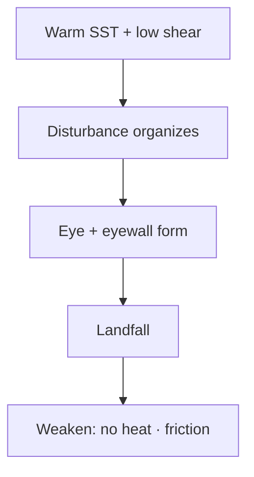

# Cyclones — Tropical & Temperate

> GS-1 · Topic 11 · Tropical cyclones, temperate cyclones, structure, India impact

---

## PYQs

| Year | M | Words | Question (EN) | प्रश्न (HI) | ID |
|------|---|-------|---------------|-------------|-----|
| 2022 | 12 | — | Describe the causes of origin, structure and weather associated with tropical cyclones. | उष्णकटिबंधीय चक्रवातों की उत्पत्ति के कारण, संरचना तथा सम्बद्ध मौसम का वर्णन कीजिए। | Q1 |
| 2023 | 12 | — | Write a short note on temperate cyclones. How it impacts India? | शीत ष्ण चक्रवात पर एक संक्षिप्त टिप्पणी लिखिए। यह भारत को कैसे प्रभावित करता है? | Q2 |
| 2021 | 12 | 200 | What is cyclone? Explain the causes of the origin of temperate cyclones. | चक्रवात क्या है? शीत ष्ण कटिबंधीय चक्रवातों के उत्पत्ति के कारणों की व्याख्या कीजिए। | Q3 |
| 2019 | 8 | 125 | "Tropical cyclones originate on the oceanic parts and as soon as they reach the terrestrial parts, these storms gradually weaken and end." Explain with reasons. | "उष्णकटिबंधीय चक्रवातों की उत्पति सागरीय भागों पर होती है एवं स्थलीय भागों पर पहुँचते ही ये धीरे-धीरे क्षीण होकर खत्म हो जाते हैं।" कारण सहit स्पष्ट करें। | Q4 |

---

## Quick Revision

```
CYCLONE = Large-scale low-pressure system with closed circular winds (general term)
  Tropical = warm-core · over tropics · >32°C SST · Coriolis essential
  Temperate/Extra-tropical = cold-core/warm-front system · mid-latitudes · westerlies belt

TROPICAL CYCLONE FORMATION (Indian Ocean/Bay of Bengal, Arabian Sea):
  Warm SST (≥26-27°C) · low vertical wind shear · Coriolis (not on equator — 5°+ lat)
  · pre-existing disturbance (ITCZ, easterly wave, Madden-Julian Oscillation)
  · high humidity in mid-troposphere

STRUCTURE: Eye (calm, low pressure) · eyewall (strongest winds, heaviest rain)
  · spiral rainbands · warm core aloft · outflow anticyclone at top

WEATHER: Storm surge · torrential rain · gale winds · tornadoes in rainbands
  India names: IMD · Fani 2019 · Amphan 2020 · Yaas 2021 · Biparjoy 2023 · Michaung 2023

WHY WEAKEN OVER LAND:
  Cut off ocean heat/moisture · increased friction · orographic disruption
  · (Exception: if re-enters warm sea — can regenerate)

TEMPERATE CYCLONE (Western Disturbance in India):
  Frontal system — warm moist meets cold dry along subtropical westerly jet
  Origin: Mediterranean/Caspian · travels east via Iran, Afghanistan, Pakistan
  India impact: Winter rain/snow Himalaya · Punjab-Haryana wheat · flash floods
  · cloud cover · temperature drop · sometimes hail

TRAPS: Cyclone ≠ tornado only | BoB more frequent than Arabian Sea (warmer, shallower)
  | WD = temperate cyclone family | Eye ≠ low damage (eyewall worst)
  | Not all landfall = instant death (Amphan maintained some intensity inland)
```

---

## Content

### Context — cyclones and India

- **Cyclone** (general) = **intense atmospheric low-pressure system** with **closed cyclonic (anticlockwise NH) circulation**.
- **India faces two types:** **Tropical cyclones** (**Bay of Bengal, Arabian Sea** — **IMD tracked**) and **Temperate/extra-tropical cyclones** (**Western Disturbances** — **winter rainfall over North India**).
- **Bay of Bengal** = **world's most cyclone-prone basin** relative to **population density** — **Odisha, Andhra, WB, Tamil Nadu, Gujarat (Arabian Sea)** vulnerable.
- **Climate change:** **IMD notes** possible **increasing frequency/intensity of Arabian Sea cyclones**, **rapid intensification** — **contemporary exam hook**.

### Tropical cyclones — formation conditions

| Condition | Why needed |
|-----------|------------|
| **SST ≥ 26–27°C** to **depth ~50 m** | **Latent heat engine** — **warm ocean fuels convection** |
| **Low vertical wind shear** | **Allows vertical stack of heat engine** — **high shear tears vortex** |
| **Coriolis force** | **Organizes rotation** — **rare within ~5° latitude of equator** |
| **Pre-existing disturbance** | **ITCZ, monsoon depression, easterly wave, MJO pulse** |
| **High mid-troposphere humidity** | **Sustains convection without dry air intrusion** |

**Seasonality (North Indian Ocean):** **Pre-monsoon (Apr–Jun)** and **Post-monsoon (Oct–Dec)** peaks — **Bay of Bengal** more active than **Arabian Sea** (**shallower, warmer after monsoon**).

### Structure and weather of tropical cyclones (2022 PYQ)

**Structure**
- **Eye** — **10–50 km diameter**, **calm, clear, lowest pressure**.
- **Eyewall** — **Surrounds eye**, **strongest winds (150–250+ km/h super cyclones)**, **heaviest rainfall**.
- **Spiral rainbands** — **Outer convection bands**, **tornadoes possible**.
- **Warm core** — **Temperature anomaly aloft** — **distinguishes from temperate systems**.

**Associated weather**
- **Gale to hurricane-force winds** — **structural damage**.
- **Torrential rainfall** — **floods, landslides (Western Ghats, Odisha)**.
- **Storm surge** — **Low pressure + wind push** — **coastal inundation** — **1999 Super Cyclone Odisha**, **Amphan 2020 Sundarbans**.
- **River surge + heavy rain** compound **inland flooding**.

**IMD classification (wind speed):**
- **Depression → Deep Depression → Cyclonic Storm → Severe → Very Severe → Extremely Severe → Super Cyclonic Storm**.



### Why tropical cyclones weaken over land (2019 PYQ)

- **Energy cutoff** — **Latent heat from ocean evaporation** stops — **engine shuts down**.
- **Surface friction** — **Land roughness** dissipates **kinetic energy** — **winds drop**.
- **Dry continental air** — **Entrainment** reduces **convection**.
- **Orographic disruption** — **Mountains break circulation** (**Western Ghats weaken Arabian Sea systems hitting Kerala/Karnataka**).
- **Exception:** **Storm crossing narrow land (Odisha)** may **re-intensify if re-entering Bay**; **Amphan** maintained **destructive winds inland** briefly before **rapid decay**.
- **Statement largely true** — **explain nuance** for **8-mark critical comment**.

### Temperate cyclones — origin and India impact (2021, 2023 PYQ)

**Definition:** **Extra-tropical / mid-latitude cyclone** — **forms along ** **polar front** — **cold dry air meets warm moist air** — **wave cyclone model (Norwegian model)**.

**Origin areas affecting India**
- **Mediterranean Sea, Caspian, Red Sea region** — **winter low-pressure cells**.
- **Travel east** along **subtropical westerly jet** over **Iran, Afghanistan, Pakistan** → **Western Disturbance (WD)** hits **North-West India**.

**Formation causes (temperate)**
- **Frontogenesis** — **Strong temperature contrast** along **polar front**.
- **Jet stream disturbance** — **Upper air trough** triggers **surface low**.
- **Coriolis + horizontal gradient** — **Closed circulation develops**.

**Impact on India (Western Disturbances)**
- **Winter precipitation** — **Snow in Himalaya (J&K, HP, Uttarakhand)** — **Siachen, tourism, agriculture timing**.
- **Plains rain** — **Punjab, Haryana, UP, Rajasthan** — **Rabi wheat benefit** — **"lifeblood of north Indian winter crops"**.
- **Cloudy skies** — **Temperature rise at night (blanket effect)**, **cold days**.
- **Hailstorms, thunderstorms** — **Crop damage episodic**.
- **Avalanche trigger** in **heavy snow years**.
- **Flash floods** — **Uttarakhand, J&K** — **2013 Kedarnath involved WD-monsoon interaction (complex)**.

### Comparison table

| Feature | **Tropical cyclone** | **Temperate cyclone (WD)** |
|---------|---------------------|----------------------------|
| **Core** | **Warm** | **Cold/warm fronts** |
| **Season (India)** | **Apr–Jun, Oct–Dec** | **Nov–Feb peak** |
| **Region** | **Coastal BoB, Arabian Sea** | **North, North-West, Himalaya** |
| **Energy source** | **Ocean heat** | **Frontal temperature contrast** |
| **Surge** | **Major storm surge** | **Minimal surge** |

### Contemporary relevance

- **IMD Cyclone Warning Division**, **NDRF evacuation**, **Odisha model** post-**1999 Super Cyclone**.
- **Cyclone Fani (2019)** — **massive pre-emptive evacuation** — **casualty reduction model**.
- **Amphan (2020)** — **Sundarbans**, **Kolkata** — **climate change intensity debate**.
- **Arabian Sea cyclones increasing** — **Cyclone Ockhi 2017**, **Biparjoy 2023 Gujarat landfall**.
- **WD frequency declining trend** (some studies) — **wheat heat stress concern**.

### Limits and balanced view

- **Not all BoB storms hit coast** — ** recurvature to Myanmar/Bangladesh**.
- **Temperate cyclone impact ≠ only Himalaya** — **Punjab wheat belt critical**.
- **Landfall weakening general rule** — **cite exceptions briefly** for **critical marks**.

### Named cyclones — India reference (contemporary)

| Cyclone | Year | Sea | Key impact |
|---------|------|-----|------------|
| **Super Cyclone Odisha** | **1999** | **BoB** | **~10,000 deaths** — **paradigm shift in preparedness** |
| **Phailin** | **2013** | **BoB** | **Mass evacuation success** |
| **Fani** | **2019** | **BoB** | **Odisha model — low casualties** |
| **Amphan** | **2020** | **BoB** | **Sundarbans, Kolkata — climate intensity debate** |
| **Ockhi** | **2017** | **Arabian Sea** | **Kerala-TN fishing fleet tragedy** |
| **Biparjoy** | **2023** | **Arabian Sea** | **Gujarat landfall — Arabian Sea trend** |

**IMD naming:** **Regional RSMC New Delhi** — **rotating names from Indian Ocean rim countries**.

---

## Answers

### Q1: Describe the causes of origin, structure and weather associated with tropical cyclones. (2022, 12M)

**Introduction:**
> **Tropical cyclones** are **warm-core intense low-pressure systems** forming over **tropical oceans (≥26°C SST)** — **Bay of Bengal and Arabian Sea** affect **India seasonally**.

**Main Characteristics:**
- **Origin Causes** — **Warm SST, low vertical wind shear, Coriolis (5°+ lat), pre-existing disturbance, high humidity**.
- **Structure — Eye** — **Calm, low-pressure centre**.
- **Structure — Eyewall** — **Most destructive winds and rainfall band**.
- **Structure — Rainbands** — **Spiral outer convection**, **possible tornadoes**.
- **Warm Core** — **Aloft temperature maximum** — **defines tropical system**.
- **Weather — Winds** — **Gale to super cyclonic speeds (IMD categories)**.
- **Weather — Rainfall** — **Torrential precipitation, inland floods**.
- **Weather — Storm Surge** — **Coastal inundation (1999 Odisha, Amphan 2020)**.

**Keywords (underline in exam):** Warm Core · Eyewall · Storm Surge · SST · Bay of Bengal · IMD

**Exam diagram (30 sec):**
```
Warm ocean → low shear → eye/eyewall
         ↓
Wind + rain + storm surge
```

**Conclusion:**
> **Understanding structure locates maximum risk at eyewall/surge zones** — **basis of IMD warning and NDRF evacuation protocol**.

---

### Q2: Write a short note on temperate cyclones. How it impacts India? (2023, 12M)

**Introduction:**
> **Temperate (extra-tropical) cyclones** form along **polar front** in **mid-latitudes** — **Western Disturbances (WD)** reaching **India from Mediterranean track** bring **critical winter weather**.

**Main Points:**
- **Definition** — **Frontal low-pressure system** — **cold dry + warm moist air interaction**.
- **Origin** — **Mediterranean/Caspian**, **eastward via westerly jet over Iran-Afghanistan-Pakistan**.
- **Structure** — **Warm front, cold front, occluded front** — **Norwegian wave model**.
- **India Impact — Himalayan Snow** — **J&K, HP, Uttarakhand** — **snowpack, avalanches**.
- **India Impact — Rabi Agriculture** — **Punjab, Haryana, UP winter rain** — **wheat moisture benefit**.
- **India Impact — Weather** — **Cloudiness, hailstorms, flash floods, temperature modulation**.
- **Season** — **Nov–Feb peak** — **distinct from tropical cyclone season**.

**Keywords (underline in exam):** Temperate Cyclone · Western Disturbance · Polar Front · Rabi Wheat · Subtropical Jet

**Exam diagram (30 sec):**
```
Mediterranean low → westerly jet → NW India
         ↓
Snow (Himalaya) + winter rain (plains) → wheat
```

**Conclusion:**
> **WDs are India's temperate cyclone family** — **vital for ** **winter crops and Himalayan water recharge**.

---

### Q3: What is cyclone? Explain the causes of the origin of temperate cyclones. (2021, 12M, 200W)

**Introduction:**
> A **cyclone** is a **large-scale atmospheric system with closed cyclonic circulation around a low-pressure centre** — **temperate cyclones** arise from **frontal temperature contrasts in mid-latitudes**.

**Main Points:**
- **Cyclone — General Definition** — **Anticlockwise (NH) wind around low pressure** — **tropical and temperate types differ**.
- **Temperate Cyclone Setting** — **Polar front zone**, **subpolar low belt**, **westerlies**.
- **Frontogenesis** — **Strong horizontal temperature gradient** — **cold polar meets warm tropical air**.
- **Upper Air Trough** — **Jet stream wave** triggers **surface low development**.
- **Coriolis Effect** — **Organizes counterclockwise circulation (NH)**.
- **Moisture Supply** — **Warm sector advection** — **feeds precipitation**.
- **Occlusion** — **Mature stage** — **system eventually fills and dies**.
- **India Link** — **Same process drives Western Disturbances** affecting **North India winter**.

**Keywords (underline in exam):** Cyclone · Temperate Cyclone · Frontogenesis · Polar Front · Western Disturbance · Jet Stream

**Exam diagram (30 sec):**
```
Temp contrast → front → surface low + jet support → WD in India
```

**Conclusion:**
> **Temperate cyclones convert ** **latitudinal energy gradients into weather systems** — **WDs essential for ** **Indian winter hydrology and agriculture**.

---

### Q4: "Tropical cyclones originate on oceanic parts and weaken over land." Explain with reasons. (2019, 8M, 125W)

**Introduction:**
> **Tropical cyclones** are **ocean-heat-driven systems** — **landfall generally causes ** **rapid weakening**, though **brief exceptions exist**.

**Main Points:**
- **Ocean Origin Need** — **SST ≥26°C supplies latent heat** — **engine requires ** **continuous evaporation**.
- **Moisture Cutoff on Land** — **No ocean flux** — **convection collapses**.
- **Surface Friction** — **Land roughness** dissipates **wind energy**.
- **Dry Air Entrainment** — **Continental air** suppresses **thunderstorm maintenance**.
- **Orographic Breakup** — **Ghats, Eastern Ghats** disrupt **symmetric circulation**.
- **Partial Exception** — **Narrow landmass crossing or re-entry to warm sea** — **may persist hours (Amphan)**.
- **Overall Validity** — **Statement substantially correct** — **basis for post-landfall relief focus inland on ** **rain/flood not wind**.

**Keywords (underline in exam):** Latent Heat · SST · Landfall · Surface Friction · Storm Decay · Bay of Bengal

**Exam diagram (30 sec):**
```
Ocean heat → cyclone alive
Land → no heat + friction → weaken (usual)
```

**Conclusion:**
> **Coastal preparedness peak at landfall** — **inland threat shifts to ** **flooding as wind rapidly decays**.

---

## Traps

| Wrong | Correct |
|-------|---------|
| Cyclone = only tropical | **Temperate/extra-tropical cyclones exist** — **WDs in India** |
| Eye has worst damage | **Eyewall** surrounding eye — **maximum winds** |
| Cyclones form on equator | **Coriolis too weak within ~5°** — **need latitude** |
| Arabian Sea never gets cyclones | **Increasing trend** — **Ockhi, Biparjoy** |
| WD only affects mountains | **Punjab-Haryana wheat** critically depend on **WD rain** |
| Storm surge = tsunami | **Wind + pressure driven** — **hours-long**, not **seismic** |
| All landfall instant dissipation | **May persist briefly** — **general rule still valid** |
| Tropical = cold core | **Warm core aloft** — **opposite of temperate** |
| BoB and Arabian Sea equal frequency | **BoB more cyclogenetic** — **warmer, shallower post-monsoon** |
| Pre-monsoon cyclones rare | **Apr–Jun is major season** — **Amphan was post-monsoon Oct-Nov origin** |

---

*Complete.*
