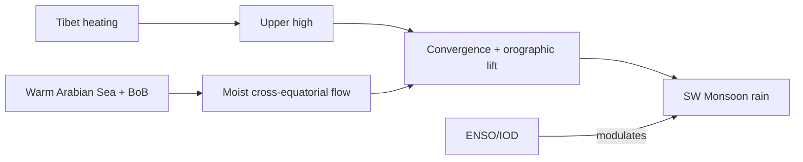

# Monsoon, El Niño, Winds & Related Phenomena

> GS-1 · Topic 11 · Monsoon theories, El Niño, air masses, aeolian landforms, climate-soil-vegetation

---

## PYQs

| Year | M | Words | Question (EN) | प्रश्न (HI) | ID |
|------|---|-------|---------------|-------------|-----|
| 2025 | 8 | 125 | Examine critically the recent theories of the origin of monsoon and discuss the effects of El-nino on monsoon. | मानसून की उत्पति के अभिनव सिद्धांतों का आलोचनात्मक परीक्षण कीजिए तथा मानसून पर एल-निनो के प्रभावों का विवेचन कीजिए। | Q1 |
| 2023 | 12 | — | Discuss the relationship between El Nino and south-west monsoon in India and its impact on agriculture. | भारत में एल नीन और दक्षिण-पश्चिम मानसून के बीच संबंधों की व्याख्या कीजिए और उसके कृषि पर प्रभाव बताइये। | Q2 |
| 2024 | 8 | 125 | Explain the interrelationship between climate, soils and vegetation. | जलवायु, मृदा और वनस्पति के अंतर्संबंधों को स्पष्ट कीजिए। | Q3 |
| 2018 | 12 | 200 | What is an air mass? Describe its chief characteristics. | वायु-पुंज क्या है? इसकी प्रमुख विशेषताओं का उल्लेख कीजिए। | Q4 |
| 2019 | 12 | 200 | Describe the landforms formed by wind erosion and depositional works. | वायु की अपरदनात्मक तथा निक्षेपात्मक क्रिया द्वारा निर्मित भू-आकृतियों का वर्णन कीजिए। | Q5 |
| 2018 | 8 | 125 | Write a note on the Global Warming. | भू-मण्डलीय ऊष्मन पर टिप्पणी लिखिए। | Q6 |

---

## Quick Revision

```
MONSOON = Seasonal reversal of wind (Arabic mausim) — SW summer (Jun-Sep) · NE winter (Oct-Dec)

CLASSICAL THEORIES:
  Halley — thermal (land-sea temp contrast) — incomplete alone
  Ferrel — deflection + thermal
  Flohn — dynamic — Tibet plateau thermal + upper tropospheric high (Tibetan anticyclone)
  Recent/dynamic: cross-equatorial flow · Somali jet · Mascarene high · ITCZ shift
  · Tibetan plateau heating · jet stream position · ENSO modulation

SW MONSOON MECHANISM: Summer — low pressure over heated subcontinent
  → cross-equatorial S-W flow (Somali jet) → picks moisture from Arabian Sea + BoB
  → orographic rain (Western Ghats, Himalaya) · break/active phases (MJO)

EL NINO: Warm eastern Pacific (Peru coast) · Walker circulation weakens
  → shifts convection west→east · Indian Ocean ridge · suppresses SW monsoon India
  La Nina = opposite · often above-normal rain · IOD (Indian Ocean Dipole) modulates

EL NINO AGRI IMPACT: Deficient/delayed monsoon · drought (1987, 2002, 2009, 2015-16)
  · reservoir levels ↓ · kharif sowing delay · MSP procurement stress
  Positive IOD can offset El Nino (1997)

AIR MASS: Large body of uniform temp + humidity (source region: continental/maritime · arctic/tropical)
  cA, cP, mT, mE etc. · fronts form at boundaries · India: mT (Arabian Sea), cT (Thar)

AEOLIAN LANDFORMS:
  Erosion: deflation hollows · ventifacts · yardangs · pedestal rocks · blowouts
  Deposition: sand dunes (barchan, seif, longitudinal) · loess plains

CLIMATE-SOIL-VEGETATION: Climate (temp + rain) → weathering → soil type (laterite, desert, alluvial)
  → vegetation (forest, savanna, desert scrub) — feedback via humus, albedo

GLOBAL WARMING: GHG (CO2, CH4) trap LW radiation · IPCC · India impacts: heatwaves, glacier melt, erratic monsoon

TRAPS: Monsoon ≠ only onshore wind · El Nino ≠ drought always (IOD offset) · Air mass ≠ local breeze
  | SW monsoon ≠ entire India same rain (TN rain-shadow) | GW ≠ only temperature rise
```

---

## Content

### Context — monsoon and Indian climate

- **Monsoon** = **seasonal reversal of wind direction** coupled with **heavy rainfall regime** — **Arabic "mausim" (season)**.
- **Indian economy and society** remain **monsoon-dependent** — **~70% annual rainfall in SW monsoon (Jun–Sep)**, **kharif agriculture**, **reservoirs, hydropower, rural demand**.
- **UPPCS tests:** **Monsoon origin theories (classical + modern)**, **El Niño–monsoon–agriculture chain**, plus **winds/air masses**, **aeolian landforms**, **climate-soil-vegetation**, **global warming**.

### Theories of monsoon origin — classical to recent

| Theory / scholar | Core idea | Limitation |
|------------------|-----------|------------|
| **Halley (1686)** | **Thermal:** **Summer heating → low pressure over India → onshore winds** | **Ignores Coriolis, rotation, upper air** |
| **Ferrel** | **Thermal + Earth's rotation** | **Still incomplete dynamics** |
| **Flohn / Dynamic** | **Tibetan Plateau summer heating** → **upper tropospheric high** → **draws in SW monsoon** | **Needs ocean coupling** |
| **Modern ITCZ shift** | **ITCZ moves north over subcontinent** — **convergence zone = monsoon trough** | **Explains belt of rain** |
| **Cross-equatorial flow** | **Somali jet**, **Mascarene High** drives **low-level cross-equatorial winds** | **Key for onset** |
| **Jet stream role** | **Subtropical westerly jet north of Himalaya in summer** — **Tropical easterly jet over peninsula** | **Explains breaks/active phases** |

**Critical synthesis (2025 PYQ):** **No single theory suffices** — **thermal + dynamic + ocean-atmosphere coupling (ENSO, IOD, MJO)** integrated.



### SW monsoon — operational features

- **Onset:** **Kerala (~1 June IMD)** — **northward in jumps** — **monsoon trough over Indo-Gangetic plain**.
- **Orographic enhancement:** **Western Ghats windward**, **Himalaya southern slopes** — **Cherrapunji/Mawsynram**.
- **Rain shadow:** **Tamil Nadu leeward**, **interior Deccan** — **NE monsoon critical for TN coast**.
- **Active/break spells:** **Madden-Julian Oscillation (MJO)**, **monsoon low/depressions from BoB**.

### El Niño and Indian monsoon (2023, 2025 PYQ)

**El Niño mechanism**
- **Abnormal warming of eastern equatorial Pacific** (normally cold **Peru coast**).
- **Walker circulation weakens** — **convection shifts eastward** — **Indian Ocean subsidence tendency**.
- **Subtropical ridge over Indian Ocean** — **suppresses monsoon convection**.

**Relationship with SW monsoon**
- **Statistical correlation:** **Many El Niño years → deficient monsoon** — **not deterministic**.
- **Counter-examples:** **1997 strong El Niño + strong monsoon** due to **positive Indian Ocean Dipole (IOD)**.
- **La Niña** often associated with **above-normal rainfall** — **2020 La Niña year**.

**Impact on agriculture (2023 PYQ)**
- **Delayed onset / early withdrawal** — **shorter growing season**.
- **Deficient rainfall states** — **Maharashtra, Karnataka, MP, Gujarat** kharif stress.
- **Reservoir storage ↓** — **irrigation curtailment**, **drinking water**.
- **Crop shifts, fodder scarcity**, **inflation (pulses, oilseeds)** — **MSP, insurance (PMFBY) claims rise**.
- **Drought years reference:** **2002, 2009, 2015-16** — **El Niño contribution debated with IOD**.

### Air masses (2018 PYQ)

**Definition:** **Large body of air** with **uniform temperature and humidity** over **source region**, **distinct from surrounding**.

**Classification (Bergeron / tropical-modified)**

| Code | Type | Source | India relevance |
|------|------|--------|-----------------|
| **mT** | **Maritime Tropical** | **Warm oceans** | **Arabian Sea, Bay of Bengal** — **monsoon moisture** |
| **cT** | **Continental Tropical** | **Hot dry land** | **Thar Desert** — **pre-monsoon heat low |
| **cP** | **Continental Polar** | **Cold interiors** | **Rare incursions with WD in extreme north** |
| **mP** | **Maritime Polar** | **Cold oceans** | **Limited direct impact on India** |

**Characteristics (exam list):**
- **Uniformity over hundreds of km**.
- **Source region identity** — **stable or maritime**.
- **Fronts form at boundaries** — **temperate cyclones**.
- **Modifies on trajectory** — **heating, moisture pickup**.

### Aeolian landforms (2019 PYQ)

**Wind erosion (deflation + abrasion)**
- **Deflation hollows / blowouts** — **removal of fine particles** — **Thar Desert**.
- **Ventifacts** — **Faceted, polished rocks** — **sandblasting**.
- **Yardangs** — **Streamlined ridges** — **soft rock eroded** — **Ladakh, Iran type**.
- **Pedestal / mushroom rocks** — **Differential erosion**.
- **Desert pavement** — **Coarse lag left after deflation**.

**Wind deposition**
- **Sand dunes** — **Barchan (crescent, unidirectional wind)**, **Seif (longitudinal)**, **Transverse dunes**, **Parabolic (vegetation stabilized)** — **Thar (Rajasthan), White Sands analogues**.
- **Loess plains** — **Fine silt deposited downwind** — **beyond desert margins** — **Punjab alluvial addition historically debated**.
- **Ripples** — **Small bedforms on dune surfaces**.

### Climate–soil–vegetation interrelationship (2024 PYQ)

| Climate control | Soil outcome | Vegetation outcome |
|-----------------|--------------|-------------------|
| **High temp + rainfall (Equatorial/Wet)** | **Laterite, leaching** | **Tropical evergreen (Western Ghats)** |
| **Monsoon seasonal (Aw/Am)** | **Alluvial, black (Deccan basalt), red** | **Deciduous monsoon forest, savanna** |
| **Semi-arid (BSh/BWh)** | **Desert sandy, saline** | **Xerophytic scrub, thorn forest (Rajasthan)** |
| **Alpine cold (Himalaya)** | **Immature, skeletal** | **Montane, conifer, alpine meadows** |

**Feedback loops:** **Vegetation → humus → soil fertility**; **soil → water retention → vegetation density**; **climate change → upward vegetation shift in Himalaya**.

### Global warming note (2018 PYQ)

- **Enhanced greenhouse effect** — **CO₂, CH₄, N₂O, CFCs** trap **outgoing longwave radiation**.
- **IPCC AR6:** **~1.1°C global rise since pre-industrial** — **accelerating**.
- **India impacts:** **More frequent heatwaves**, **glacier retreat (Himalaya)**, **sea-level rise (Sundarbans)**, **monsoon variability (not uniform decrease)**, **extreme rainfall events**, **cyclone intensification**.
- **Policy:** **Paris Agreement**, **India's Panchamrit (COP26)**, **National Action Plan on Climate Change**, **International Solar Alliance**.

### Contemporary relevance

- **IMD long-range forecast** uses **ENSO, IOD, MJO, snow cover** predictors.
- **Monsoon 2023** — **El Niño year**, **deficient phases** — **agriculture monitoring**.
- **Mission LiFE**, **net-zero 2070 target** — **global warming response**.
- **Thar desertification control** — **aeolian landform stabilization ( shelter belts)**.

### Limits and balanced view

- **El Niño ≠ automatic drought** — **always mention IOD, MJO, internal variability**.
- **Monsoon theories** — **critically examine = strengths + gaps**, not one theory alone.
- **Climate-soil-vegetation** — **human land use** (deforestation, irrigation) **modifies natural cycle**.

### ENSO system — extended comparison (exam table)

| Phase | Pacific condition | Indian monsoon tendency | Agriculture note |
|-------|-------------------|-------------------------|------------------|
| **El Niño** | **Eastern Pacific warm** | **Often deficient SW monsoon** | **Drought risk, insurance claims** |
| **La Niña** | **Eastern Pacific cool** | **Often above-normal rain** | **Flood risk, pest pressure** |
| **Neutral** | **Near normal SST** | **Internal variability dominates** | **Forecast uncertainty higher** |
| **+IOD** | **Western IO warm** | **Can offset El Niño (1997)** | **Saved kharif in strong +IOD years** |
| **−IOD** | **Western IO cool** | **Reinforces monsoon failure with El Niño** | **Compound stress years** |

**Madden-Julian Oscillation (MJO):** **30–60 day tropical pulse** — **explains active/break monsoon spells within season** — **sub-seasonal forecast tool**.

---

## Answers

### Q1: Examine critically recent theories of monsoon origin and discuss El-nino effects on monsoon. (2025, 8M, 125W)

**Introduction:**
> **Indian monsoon** arises from **multi-scale interactions** — **land-ocean thermal contrast, Tibetan plateau, cross-equatorial flow, and ocean-atmosphere oscillations like ENSO**.

**Main Points:**
- **Halley Thermal Theory** — **Summer low over India draws winds** — **valid but incomplete alone**.
- **Dynamic/Flohn Theory** — **Tibetan plateau upper high** — **critical modern component**.
- **Cross-Equatorial Flow / Somali Jet** — **Low-level moisture transport from Southern Hemisphere**.
- **ITCZ Shift & Monsoon Trough** — **Organizes rain belt over subcontinent**.
- **Critical Gap** — **No single theory suffices** — **need coupled ocean-atmosphere model**.
- **El Niño Mechanism** — **Warm eastern Pacific weakens Walker cell** — **Indian Ocean subsidence tendency**.
- **El Niño Effect** — **Often deficient/delayed SW monsoon** — **not deterministic (1997 exception with +IOD)**.

**Keywords (underline in exam):** Dynamic Monsoon · Tibetan Plateau · Somali Jet · El Niño · Walker Circulation · IOD

**Exam diagram (30 sec):**
```
Thermal + Tibet + cross-equatorial moisture → monsoon
El Niño → Walker weak → monsoon suppress (often)
```

**Conclusion:**
> **Integrated dynamic-ocean theory** replaces **pure thermal explanation** — **ENSO monitoring central to IMD forecasting**.

---

### Q2: Discuss El Nino and south-west monsoon relationship and impact on agriculture. (2023, 12M)

**Introduction:**
> **El Niño** (warm eastern Pacific) **modulates Walker circulation**, **often weakening Indian SW monsoon** with **significant kharif agricultural consequences**.

**Main Points:**
- **Mechanism** — **Convection shifts to Pacific** — **Indian Ocean high-pressure tendency** — **reduced monsoon rainfall**.
- **Statistical Link** — **Many El Niño years correlate with deficiency** — **IOD/MJO can offset**.
- **Onset/Withdrawal** — **Delayed onset or early withdrawal** — **shortens crop window**.
- **Geographic Impact** — **Central India, Maharashtra, Karnataka, Gujarat** often **worst affected**.
- **Reservoir & Irrigation** — **Storage decline** — **rabi dependency increases**.
- **Crop Impact** — **Delayed sowing (rice, cotton, soyabean, pulses)** — **yield loss**.
- **Economic Impact** — **Food inflation**, **PMFBY insurance claims**, **rural demand slowdown**.
- **Mitigation** — **IMD forecast, drought-resistant seeds, MSP buffer, MGNREGA**.

**Keywords (underline in exam):** El Niño · SW Monsoon · Walker Circulation · Kharif · IOD · PMFBY · Deficient Monsoon

**Exam diagram (30 sec):**
```
El Niño → weak monsoon → late sowing · low reservoir → yield/income loss
```

**Conclusion:**
> **El Niño is key agricultural risk factor** — **forecast-based adaptation** reduces **food security shocks**.

---

### Q3: Explain interrelationship between climate, soils and vegetation. (2024, 8M, 125W)

**Introduction:**
> **Climate (temperature + precipitation regime)** drives **weathering and soil formation**, which **supports specific vegetation types** — **mutual feedback loop**.

**Main Characteristics:**
- **Climate → Soil** — **High rainfall leaches nutrients (laterite in Western Ghats)**; **aridity forms ** **desert sandy/saline soils (Thar)**.
- **Climate → Vegetation** — **Tropical wet → evergreen**; **monsoon seasonal → deciduous**; **semi-arid → thorn scrub**.
- **Soil → Vegetation** — **Black regur (Deccan) supports cotton**; **alluvial Gangetic → dense agriculture/forests**.
- **Vegetation → Soil** — **Humus from forest litter improves fertility**.
- **Orographic Climate** — **Windward Ghats vs rain-shadow TN** — **contrasting soil-vegetation in same latitude**.
- **Altitude (Himalaya)** — **Climate zonation → soil immaturity → montane/alpine vegetation belts**.
- **Feedback** — **Deforestation alters local climate and soil erosion (Chipko lesson)**.

**Keywords (underline in exam):** Climate · Laterite · Alluvial · Monsoon Forest · Pedogenesis · Vegetation Belts

**Exam diagram (30 sec):**
```
Climate → weathering → soil type → vegetation
         ↑__________________________| (humus feedback)
```

**Conclusion:**
> **Climate-soil-vegetation form inseparable geographic system** — **basis of Indian natural region classification**.

---

### Q4: What is an air mass? Describe its chief characteristics. (2018, 12M, 200W)

**Introduction:**
> An **air mass** is a ** vast body of air** with ** horizontally uniform temperature and humidity**, acquired from its **source region**.

**Main Characteristics:**
- **Source Region Definition** — **Extensive uniform surface (ocean or continent)** — **stable or maritime**.
- **Uniformity** — **Temperature and moisture consistent over ** **hundreds of km**.
- **Classification — mT** — **Maritime Tropical (warm, moist)** — **Arabian Sea monsoon source**.
- **Classification — cT** — **Continental Tropical (hot, dry)** — **Thar heat low**.
- **Classification — cP/mP** — **Polar types** — **Western Disturbance cold sectors (north India)**.
- **Modification** — **Changes while moving** — **heating, moisture gain/loss**.
- **Frontal Boundaries** — **Air mass collision forms ** **fronts — temperate cyclones**.
- **India Context** — **SW monsoon = mT dominance**; **pre-monsoon = cT over northwest**.

**Keywords (underline in exam):** Air Mass · Source Region · mT · cT · Front · Maritime · Continental

**Exam diagram (30 sec):**
```
Source region → uniform air mass → moves → modifies → front at boundary
```

**Conclusion:**
> **Air mass theory explains ** **monsoon moisture supply and winter frontal weather** over **South Asia**.

---

### Q5: Describe landforms formed by wind erosion and depositional works. (2019, 12M, 200W)

**Introduction:**
> **Aeolian processes** in **arid and semi-arid regions** sculpt **erosional landforms through deflation/abrasion** and **depositional dunes/loess**.

**Main Points:**
- **Deflation Hollows / Blowouts** — **Fine particle removal** — **Thar Desert depressions**.
- **Ventifacts** — **Wind-polished rock facets** — **abrasion by sand grains**.
- **Yardangs** — **Streamlined ridges in soft rock** — **wind erosion parallel to prevailing wind**.
- **Pedestal Rocks** — **Differential erosion** — **mushroom shapes**.
- **Sand Dunes — Barchan** — **Crescent, unidirectional wind** — **Rajasthan mobile dunes**.
- **Sand Dunes — Seif/ Longitudinal** — **Parallel to prevailing wind corridors**.
- **Loess Plains** — **Fine silt deposition beyond desert margin** — **fertile when stable**.
- **Desert Pavement** — **Coarse lag after deflation** — **surface armouring**.

**Keywords (underline in exam):** Aeolian · Deflation · Ventifact · Yardang · Barchan · Loess · Thar Desert

**Exam diagram (30 sec):**
```
Wind erosion: deflation · ventifacts · yardangs
Wind deposit: barchan · seif · loess
```

**Conclusion:**
> **Aeolian landforms dominate ** **Indian desert geography (Thar)** — **understanding them aids ** **combating desertification**.

---

### Q6: Write a note on Global Warming. (2018, 8M, 125W)

**Introduction:**
> **Global warming** is **long-term rise in Earth's average surface temperature** due to **enhanced greenhouse effect** from **anthropogenic GHG emissions**.

**Main Points:**
- **Mechanism** — **CO₂, CH₄, N₂O trap outgoing longwave radiation**.
- **Evidence** — **IPCC: ~1.1°C rise since pre-industrial** — **accelerating trend**.
- **India Impacts** — **Heatwaves, Himalayan glacier melt, sea-level rise (Sundarbans)**.
- **Monsoon & Extremes** — **Increased variability**, **heavy rain events**, **drought pockets**.
- **Cyclone Intensification** — **Warmer SST fuels stronger storms**.
- **Policy Response** — **Paris Agreement, Panchamrit, NAPCC, net-zero 2070 pledge**.
- **Mitigation** — **Renewable energy, ISA, energy efficiency, afforestation**.

**Keywords (underline in exam):** Greenhouse Effect · IPCC · CO₂ · Climate Change · Paris Agreement · Net Zero

**Exam diagram (30 sec):**
```
GHG ↑ → trapped heat → warming → extremes + glacier melt + sea level ↑
```

**Conclusion:**
> **Global warming threatens ** **India's water, agriculture, and coasts** — **mitigation-adaptation both urgent**.

---

## Traps

| Wrong | Correct |
|-------|---------|
| Monsoon = only wind reversal | **Wind reversal + seasonal rainfall regime** |
| Halley alone explains monsoon | **Dynamic + ocean coupling needed** — **critically examine** |
| El Niño always causes drought in India | **IOD/MJO can offset** — **1997 example** |
| La Niña = always flood | **Statistical tendency**, **not rule** |
| Air mass = small local breeze | **Continental-scale uniform body** |
| All dunes same shape | **Barchan, seif, transverse** — **wind direction dependent** |
| Loess = sand dunes | **Fine silt**, **different origin/deposition** |
| Climate determines all without human role | **Irrigation, deforestation modify** soil-vegetation |
| Global warming = only temperature | **Extremes, oceans, ice, biology** — **systemic change** |
| SW monsoon brings rain everywhere equally | **Rain shadow (TN interior), spatial variation** |

---

*Complete.*
