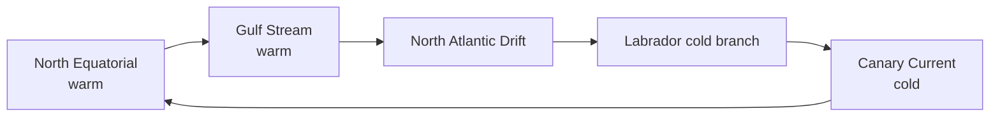

# Ocean Currents — Origin, Atlantic & Indian Ocean

> GS-1 · Topic 11 · Ocean currents, factors, Atlantic currents, India relevance

---

## PYQs

| Year | M | Words | Question (EN) | प्रश्न (HI) | ID |
|------|---|-------|---------------|-------------|-----|
| 2019 | 12 | 200 | Write a systematic essay on the ocean currents of northern Atlantic Ocean with their reasons of origin. | उत्तरी अटलांटिक महासागर की जलधाराओं पर उनके उत्पति के कारण सहित एक क्रमबद्ध लेख लिखिये। | Q1 |
| 2018 | 12 | 200 | Mention the factors responsible for the origins of ocean currents and name the currents of the Atlantic Ocean. | महासागरीय धाराओं की उत्पति के लिए उत्तरदायी कारकों का उल्लेख कीजिए और अन्ध महासागर की जलधाराओं का नाम बताइए। | Q2 |

---

## Quick Revision

```
OCEAN CURRENT = Large-scale persistent horizontal water movement (surface + deep)

FACTORS OF ORIGIN:
  Planetary winds (primary driver) — trade winds · westerlies
  Coriolis deflection (Ekman spiral) · temp/salinity density (thermohaline)
  Earth's rotation · coast shape (deflection, upwelling) · landmass barriers
  Evaporation/precipitation · tides (minor for major currents)

WARM vs COLD: Warm = low→high lat (east coast tropics often) · Cold = high→low (west coast tropics often)
  (Exception: coast geometry modifies — Gulf Stream warm on west Atlantic)

NORTH ATLANTIC GYRE (clockwise):
  North Equatorial Current (warm) → CANARY CURRENT (cold, east) →
  NORTH ATLANTIC DRIFT/Gulf Stream extension (warm, NE Europe) ←
  GULF STREAM (warm, western boundary — US to Europe) ←
  Labrador Current (cold, SW Greenland)

OTHER ATLANTIC: South Equatorial · Brazil Current (warm) · Benguela (cold, SW Africa)
  · Falkland · Antarctic Circumpolar · Equatorial Counter Current

INDIA RELEVANCE: Somali Current (seasonal) · Agulhas · monsoon drift
  · Indian Ocean gyre · affects SST → monsoon · fisheries upwelling (Somalia, Arabian Sea)

THERMOHALINE: Atlantic "conveyor belt" — NADW formation — global climate link

TRAPS: Gulf Stream ≠ same as North Atlantic Drift (connected) | Currents follow wind belts mostly
  | Cold current on west coast of continents (general rule) | Canary = cold not warm
  | Question may ask Atlantic whole vs North Atlantic only — read carefully
```

---

## Content

### Context — ocean currents

- **Ocean currents** = **continuous, directed movement of seawater** — **surface (wind-driven)** and **deep (thermohaline)** — **critical for climate, fisheries, navigation, weather**.
- **Cover ~8% of ocean surface visibly flowing**, but **gyres and deep circulation** move **vast water masses**.
- **India:** **Indian Ocean currents** modulate **Arabian Sea SST**, **Somali Current**, **monsoon onset**, **cyclogenesis**, **marine fisheries**.

### Factors responsible for origin of ocean currents (2018 PYQ)

| Factor | Mechanism |
|--------|-----------|
| **Planetary winds** | **Trade winds push equatorial water west**; **westerlies drive mid-latitudes east** — **primary surface driver** |
| **Coriolis force** | **Deflects currents right (NH), left (SH)** — **forms gyres**, **Ekman transport** |
| **Temperature difference** | **Warm water less dense** — **poleward/equatorward flow components** |
| **Salinity difference** | **Evaporation increases salinity/density** — **Thermohaline circulation** |
| **Earth's rotation** | **Geostrophic balance** — **currents flow along pressure gradients** |
| **Coastline shape** | **Deflects, intensifies boundary currents** — **Gulf Stream pinned by US coast** |
| **Landmass barriers** | **Atlantic vs Pacific gyre separation** — **no continuous circum-equatorial flow in Atlantic** |
| **Upwelling/downwelling** | **Wind-driven divergence** — **Peru (Humboldt), Benguela fisheries** |

**Surface vs deep:** **Wind-driven (to ~400 m)** vs **Thermohaline "global conveyor"** — **Atlantic Deep Water formation** at **Greenland/Nordic seas**.

### North Atlantic Ocean currents — systematic account (2019 PYQ)

**North Atlantic Subtropical Gyre (clockwise in NH)**

**1. North Equatorial Current (warm)**
- **Driven by NE trade winds** — **flows west from Canary/Africa toward Caribbean**.
- **Origin factor:** **Wind drag + Coriolis**.

**2. Gulf Stream (warm — western boundary current)**
- **Most famous warm current** — **originates Gulf of Mexico**, **flows north along ** **US East Coast**.
- **High volume, rapid** — **40–150 km wide** — **warm water transport to higher latitudes**.
- **Factors:** **Wind pile-up in Caribbean**, **coastal constraint**, **Thermohaline contribution**.
- **Climate effect:** **Moderates UK, Norway** — **without it, NW Europe much colder**.

**3. North Atlantic Drift (warm extension)**
- **Continuation of Gulf Stream** past **Grand Banks** — ** splits** — **Norwegian Current branch**.
- **Factors:** **Momentum from Gulf Stream + westerlies**.

**4. Canary Current (cold — eastern boundary current)**
- **Flows south along ** **NW African coast (Canary Islands)**.
- **Cool water from higher latitudes** — **upwelling off Sahara coast**.
- **Factors:** **Trade wind return flow**, **eastern gyre boundary**, **coastal upwelling**.

**5. Labrador Current (cold)**
- **Flows south from ** **Arctic/Greenland** — **cold water along ** **NE North America**.
- **Meets Gulf Stream at Grand Banks** — **dense fog, rich fisheries, Titanic iceberg risk zone**.

**6. North Atlantic Current / Subpolar gyre links**
- **Connects to ** **Nordic seas** — **Atlantic Meridional Overturning Circulation (AMOC)** — **NADW sinks**, **returns south at depth**.



### Full Atlantic Ocean currents (2018 naming PYQ)

**North Atlantic:** Gulf Stream, North Atlantic Drift, Canary, Labrador, North Equatorial, North Atlantic Current.

**South Atlantic:** **South Equatorial Current**, **Brazil Current (warm, east South America)**, **Benguela Current (cold, SW Africa)**, **Falkland Current**, **Antarctic Circumpolar (West Wind Drift)**, **Equatorial Counter Current**.

### Indian Ocean relevance (book-free extension)

- **Somali Current** — **reverses seasonally** with **monsoon** — **strong upwelling during SW monsoon**.
- **Agulhas Current** — **warm western boundary** — **south of Africa**, **Indian Ocean connection**.
- **Monsoon drift** — **seasonal reversal** in **Bay of Bengal, Arabian Sea**.
- **Impact:** **SST anomalies** affect **monsoon**, **Arabian Sea cyclones**, **fisheries (Somalian upwelling = rich tuna)**.

### Contemporary relevance

- **AMOC weakening debates** — ** Greenland melt** — **IPCC climate risk**.
- **Indian Ocean Dipole (IOD)** — **SST gradient between ** **western and eastern Indian Ocean** — **monsoon predictor**.
- **Blue economy** — **currents affect ** **EEZ fisheries, oil spill drift (MV Wakashio Mauritius 2020)**.

### Limits and balanced view

- **Naming varies** — **Gulf Stream vs North Atlantic Drift** — **continuous system**, **different segments**.
- **Not all currents permanent direction** — **Somali, monsoon drift seasonal**.
- **2019 asks North Atlantic specifically** — **don't write only South Atlantic**.

### Global conveyor belt — thermohaline overview

- **North Atlantic Deep Water (NADW)** sinks in **Greenland/Nordic seas** — **high salinity, cold, dense**.
- **Returns south at depth**, **upwells in Pacific/Indian Ocean** — **centuries-long circuit**.
- **AMOC slowdown concern** — **Greenland freshwater input** — **European cooling paradox under global warming**.
- **India link indirect** — **Indian Ocean SST** responds to **global ocean reorganization** — **monsoon teleconnections**.

### Cold vs warm currents — coastal climate rule (global)

| General pattern | NH example | Effect on coast |
|-----------------|------------|-----------------|
| **West coast of continent (trade wind side)** | **Canary (Africa)** | **Often cold/upwelling** — **desert coast (Namib)** |
| **East coast of continent (westerlies side)** | **Gulf Stream (US)** | **Often warm** — **humid/mild** |
| **Exception logic** | **Coast geometry, gyre position** | **India: Somali seasonal current as analogous case study** |

---

## Answers

### Q1: Write a systematic essay on ocean currents of northern Atlantic with reasons of origin. (2019, 12M, 200W)

**Introduction:**
> **North Atlantic Ocean** hosts a **clockwise subtropical gyre** driven by **trade winds, westerlies, Coriolis deflection, and thermohaline processes** — **major currents shape ** **global and European climate**.

**Main Points:**
- **North Equatorial Current (warm)** — **NE trade winds push water west** from **African coast toward Caribbean**.
- **Gulf Stream (warm)** — **Western boundary current** — **Gulf of Mexico origin**, **flows along US east coast** — **wind pile-up + coastal constraint**.
- **North Atlantic Drift (warm)** — **Gulf Stream extension** — **moderates ** **UK, Norway climate**.
- **Canary Current (cold)** — **Eastern boundary return flow** — **trade winds + upwelling off NW Africa**.
- **Labrador Current (cold)** — **Arctic-origin water** southward **along NE North America** — **meets Gulf Stream at Grand Banks**.
- **Coriolis & Gyres** — **Rightward deflection (NH)** organizes **clockwise circulation**.
- **Thermohaline Link** — **NADW formation** in **Nordic seas** — **AMOC global conveyor component**.
- **Systematic Logic** — **Wind-driven surface + density-driven deep** — **integrated Atlantic circulation**.

**Keywords (underline in exam):** Gulf Stream · Canary Current · North Equatorial · Coriolis · Trade Winds · AMOC · Labrador

**Exam diagram (30 sec):**
```
Trades → N. Equatorial → Gulf Stream → N. Atlantic Drift
              ↑                              ↓
         Canary (cold) ←←←←←←←←← Labrador (cold)
```

**Conclusion:**
> **North Atlantic currents** are **wind-thermohaline coupled system** — **Gulf Stream-NAD** **warms Europe**, **Canary-Labrador** **complete gyre balance**.

---

### Q2: Mention factors for origins of ocean currents and name Atlantic currents. (2018, 12M, 200W)

**Introduction:**
> **Ocean currents** originate from **wind stress, Coriolis effect, temperature-salinity density gradients, and coastal geometry** — **Atlantic hosts major named gyre currents**.

**Main Points:**
- **Planetary Winds** — **Trades and westerlies** — **primary surface driver**.
- **Coriolis Force** — **Deflection and gyre formation** — **Ekman transport**.
- **Thermohaline Circulation** — **Salinity-temperature density** — **Atlantic conveyor**.
- **Coastline & Land Barriers** — **Intensify boundary currents (Gulf Stream, Brazil)**.
- **Upwelling** — **Wind divergence** — **Benguela, Canary fisheries**.
- **Atlantic Currents — Gulf Stream, North Atlantic Drift, Canary, Labrador**.
- **Atlantic Currents — North & South Equatorial, Brazil, Benguela, Falkland**.
- **Atlantic Currents — Antarctic Circumpolar, Equatorial Counter Current**.

**Keywords (underline in exam):** Thermohaline · Coriolis · Gulf Stream · Benguela · Brazil Current · Trade Winds

**Exam diagram (30 sec):**
```
Factors: wind · Coriolis · temp/salt · coast
Atlantic: Gulf Stream · Canary · Brazil · Benguela · Equatorial
```

**Conclusion:**
> **Atlantic currents exemplify ** **wind-driven gyres linked to ** **global thermohaline circulation** — **climate and fisheries hinge on them**.

---

### Q3: *Likely variant:* Explain the significance of ocean currents for climate with Indian Ocean examples. (—, 8M, 125W)

**Introduction:**
> **Ocean currents** redistribute **heat globally** — **warming or cooling adjacent continents** — **Indian Ocean currents modulate ** **monsoon and cyclones**.

**Main Characteristics:**
- **Heat Transport** — **Gulf Stream warms Europe analogue; Agulhas carries warm water**.
- **Indian Ocean — Somali Current** — **Seasonal reversal, upwelling** — **SST affects monsoon**.
- **Arabian Sea SST** — **Cyclogenesis and monsoon moisture source**.
- **Upwelling & Fisheries** — **Nutrient-rich cold water** — **Somalian tuna grounds**.
- **IOD** — **East-west SST gradient** — **monsoon rainfall modulator**.
- **Climate Change** — **AMOC/IOD variability** — **extreme weather links**.

**Keywords (underline in exam):** Thermohaline · Somali Current · SST · IOD · Upwelling · Monsoon

**Exam diagram (30 sec):**
```
Currents move heat → coastal climate
Indian Ocean: Somali · monsoon drift → SST → monsoon/cyclone
```

**Conclusion:**
> **Ocean currents are climate system's ** **circulatory system** — **Indian Ocean seasonal currents ** **directly touch Indian agriculture**.

---

## Traps

| Wrong | Correct |
|-------|---------|
| Gulf Stream flows east to west Atlantic | **Generally north/northeast** along **US coast then east as NAD** |
| Canary Current is warm | **Cold eastern boundary current** |
| Only wind causes all currents | **Thermohaline density also critical** — **deep conveyor** |
| Currents cross equator freely in Atlantic | **Equatorial counter-currents and ** **gyre separation** |
| Labrador Current is warm | **Cold Arctic-origin** |
| 2019 essay = whole Atlantic | **North Atlantic specifically** — **focus answer** |
| Brazil Current in North Atlantic | **South Atlantic western boundary** |
| Ocean currents unrelated to India | **Somali, monsoon drift, IOD, SST** — **direct monsoon link** |
| Benguela on east South America | **SW Africa (Namibia)** — **cold current** |
| Coriolis irrelevant near equator | **Weak but gyres organized away from equator** |

---

*Complete.*
