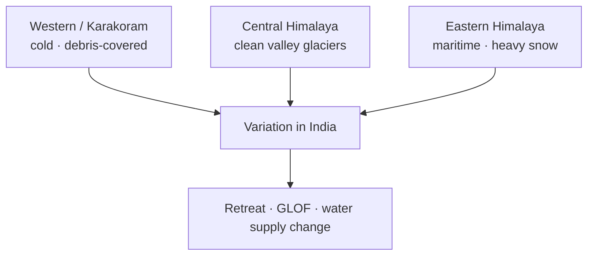

# Glaciers & Glacial Landforms in India

> GS-1 · Topic 11 · Glaciers in India, variations, erosional-depositional landforms

---

## PYQs

| Year | M | Words | Question (EN) | प्रश्न (HI) | ID |
|------|---|-------|---------------|-------------|-----|
| 2025 | 8 | 125 | Examine the variations in nature of glaciers in India. | भारत में हिमनदों की प्रकृति में विभिन्नताओं की समीक्षा कीजिये। | Q1 |
| 2020 | 12 | 200 | Describe the role of Glaciers in shaping the land-forms in high mountain areas. | उच्च पर्वतीय क्षेत्रों में स्थल-रूपों को आकार प्रदान करने में हिमनदों की भूमिका का वर्णन कीजिए। | Q2 |

---

## Quick Revision

```
GLACIER = Persistent body of dense ice on land — formed by accumulation > ablation (snow→firn→glacial ice)

TYPES BY MORPHOLOGY:
  Valley/Alpine — confined to mountain valleys (Himalaya)
  Continental ice sheet — not in India (Greenland/Antarctica analogue only)
  Piedmont — valley glaciers spill to plain (rare)
  Cirque glacier — small, headwall bowl
  Hanging glacier — tributary meets main valley higher (truncated spurs)

INDIA GLACIERS: Himalaya only — ~9,000-10,000+ (GSI/ICIMOD estimates vary)
  Western Himalaya (J&K, HP, Uttarakhand) > Eastern (Sikkim, Arunachal)
  Siachen (longest in Karakoram sector India) · Gangotri (Bhagirathi head) · Milam · Zemu (Sikkim)

VARIATIONS IN NATURE:
  Clean vs debris-covered (moraine mantle insulates — slows melt)
  Surge-type vs normal · maritime (warm-based, high melt) vs continental (cold-based, polar)
  Altitude, aspect (north-facing persist longer in NH) · precipitation regime (western snow vs eastern monsoon-influenced)

EROSIONAL LANDFORMS: Cirque · arête · horn (Matterhorn) · U-shaped valley · hanging valley · truncated spurs
  · roche moutonnée · striations · glacial polish · fiord (drowned U-valley — not India coast)

DEPOSITIONAL: Moraines (lateral, medial, terminal, ground) · drumlins (rare India) · eskers · kames · outwash plain · erratics · till plain

INDIA ZONES: Karakoram/Western Himalaya (cold, dry, debris-covered common) · Central Himalaya (Gangotri)
  · Eastern Himalaya (higher precipitation, maritime influence) · Ladakh cold desert glaciers

CONTEMPORARY: Glacial retreat (Gangotri ~m/yr) · GLOF risk (Chamoli 2021) · HKH climate change
  · NDMA guidelines · ISRO mapping · National Glacier Inventory

TRAPS: Glacier ≠ snowfield always | India has no ice sheets | Debris-covered melts slower at surface
  | All Himalaya glaciers retreating uniformly — spatial variation | Gangotri ≠ only glacier feeding Ganga system
  | Arête/horn need multiple cirques — cite Alpine/Himalayan examples
```

---

## Content

### Context — glaciers in India

- **Glacier** = **accumulated snow compressed to ice** over **years**, flowing **downslope under gravity** — **permanent (or semi-permanent) ice bodies on land**.
- **India has ** **no ice sheets** — only **Himalayan-Karakoram mountain glaciers** — **~9,000–10,000 glaciers** (estimates vary by **GSI, ICIMOD, ISRO**).
- **Critical as ** **"water towers"** — **feed Indus, Ganga, Brahmaputra** systems — **1.3+ billion people downstream depend on melt timing**.
- **Climate change:** **Himalayan glaciers retreating** — **IPCC AR6**, **Indian studies (Gangotri, Dokriani)** — **GLOF (Glacial Lake Outburst Flood) risk rising**.

### Types and variations in nature of glaciers (2025 PYQ)

**By size and setting**

| Type | Characteristics | India examples |
|------|-----------------|----------------|
| **Valley (Alpine) glacier** | **Confined to valley**, **tongue-shaped** | **Gangotri, Milam, Pindari** |
| **Cirque glacier** | **Small bowl at headwall** | **High Himalaya cirques** |
| **Piedmont glacier** | **Valley glacier spreads at mountain foot** | **Rare in India** |
| **Hanging glacier** | **Tributary glacier above main valley** | **Common in ** **steep Himalaya** — **GLOF source** |

**By thermal regime**
- **Cold-based (polar-type)** — **Frozen to bed**, **minimal basal sliding** — **some Karakoram glaciers**.
- **Warm-based (temperate)** — **Basal melting**, **fast flow, erosion** — **lower Himalaya monsoon-influenced**.
- **Karakoram anomaly:** Some glaciers **stable or advancing** (**surge glaciers**) — **unlike general retreat trend**.

**By surface character (2025 variation theme)**
- **Clean ice glaciers** — **Direct solar melt**, **visible blue ice** — **Gangotri snout area**.
- **Debris-covered glaciers** — **Moraine mantle insulates** — **surface melt slower**, **subsurface melt/ice cliffs** — **common in ** **Ladakh, Nanda Devi region**.
- **Surge-type glaciers** — **Periodic rapid advance** — **Karakoram**.

**Regional variations across India**

| Region | Nature | Distinctive features |
|--------|--------|----------------------|
| **Western Himalaya (J&K, HP, Uttarakhand)** | **Large valley glaciers**, **Indus/Ganga headwaters** | **Siachen (Karakoram), Gangotri, Milam** — **mix clean and debris-covered** |
| **Ladakh/Karakoram** | **Cold, arid**, **debris-covered common** | **High altitude, lower precipitation** |
| **Central Himalaya (Garhwal-Kumaon)** | **Monsoon + winter snow** | **Pindari, Kafni, Dokriani** — **retreat well documented** |
| **Eastern Himalaya (Sikkim, Arunachal)** | **Maritime influence**, **heavy snowfall** | **Zemu glacier (Sikkim)** — **largest in India by area (some definitions)** |



### Glacial erosion — landforms (2020 PYQ)

**Erosional processes:** **Plucking (quarrying)**, **abrasion (sandpapering)**, **frost shattering**.

| Landform | Formation | Himalayan relevance |
|----------|-----------|---------------------|
| **Cirque** | **Armchair depression at valley head** | **Glacier birthplace** — **amphitheatre walls** |
| **Arête** | **Sharp ridge between cirques** | **Alpine/Himalayan high ridges** |
| **Horn** | **Pyramidal peak (3+ cirques)** | **Matterhorn analogue peaks** |
| **U-shaped valley** | **Glacier widens/deepens V-valley** | **Yosemite-type cross-section in Himalaya valleys** |
| **Hanging valley** | **Tributary valley floor higher** — **waterfall at confluence** | **Common post-glaciation** |
| **Truncated spurs** | **Interlocking spurs sheared off** | **Straight valley sides** |
| **Roche moutonnée** | **Smooth up-glacier, plucked down-glacier side** | **Bedrock knob** |
| **Striations & polish** | **Abrasion marks on bedrock** | **Evidence of past ice flow direction** |

### Glacial deposition — landforms (2020 PYQ)

| Landform | Description |
|----------|-------------|
| **Moraine** | **Till deposited by glacier** — **lateral (valley sides), medial (tributary join), terminal (snout), ground (beneath)** |
| **Outwash plain** | **Meltwater streams sort sediments** beyond **terminal moraine** |
| **Esker** | **Sinuous ridge from sub-glacial stream deposit** |
| **Kame** | **Irregular mound from ice-contact deposition** |
| **Drumlin** | **Elongated oval hill** — **rare in Himalaya, common ice-sheet terrain** |
| **Erratic** | **Boulder transported far from source** |

**India-specific:** **Terminal moraines dam lakes** — **GLOF risk when ** **proglacial lakes expand (Chorabari, South Lhonak)** — **2023 Sikkim GLOF**.

### Role of glaciers in shaping high mountain landforms (synthesis)

- **Valley cross-profile transformation** — **V → U shape** — **determines ** **modern river gradient, landslide zones**.
- **Over-deepening** — **Future lake basins** — **GLOF hazards**.
- **Sediment supply** — **Moraines feed rivers** — **damming (temporary lakes)**.
- **Post-glacial rebound & isostasy** — **minor in Himalaya vs Pleistocene mid-latitudes**.
- **Tourism & pilgrimage** — **Gangotri, Kedarnath valleys** — **geomorphology shapes ** **human settlement risk (2013 Kedarnath flood)**.

### Contemporary relevance

- **Gangotri glacier retreat** — **~meters per year** — **Ganga base flow concern long-term**.
- **Chamoli disaster (Feb 2021)** — **Rock-ice avalanche** — **not pure GLOF but ** **glacial zone hazard**.
- **Sikkim GLOF (Oct 2023)** — **South Lhonak Lake** — **Teesta III dam damage**.
- **National Mission on Sustaining Himalayan Ecosystem (NMSHE)** — **climate adaptation**.
- **ISRO/NRSC**, **ICIMOD HKH monitoring** — **satellite glacier inventory**.
- **Paris Agreement / net-zero** — **slowing retreat long-term goal**.

### Limits and balanced view

- **Not all Himalayan glaciers retreating uniformly** — **Karakoram surges/stable patches**.
- **Debris cover complicates melt** — **surface looks intact while snout retreats**.
- **Glacial landforms + fluvial/tectonic** — **Himalaya is active orogen** — **don't attribute all landforms to glaciers alone**.

### Important Indian glaciers — named reference

| Glacier | State/Region | River system | Notes |
|---------|--------------|--------------|-------|
| **Siachen** | **Ladakh/Karakoram** | **Nubra → Indus** | **Longest in Karakoram sector** |
| **Gangotri** | **Uttarakhand** | **Bhagirathi → Ganga** | **Retreat monitored; pilgrimage site** |
| **Milam** | **Uttarakhand (Kumaon)** | **Gori Ganga** | **Remote valley glacier** |
| **Pindari** | **Uttarakhand** | **Pindar river** | **Trekking, retreat visible** |
| **Zemu** | **Sikkim** | **Teesta** | **Largest by area (Eastern Himalaya)** |
| **Kolahoi** | **J&K** | **Lidder** | **Western Himalaya** |

**Glacier inventory:** **ISRO/NRSC**, **GSI**, **ICIMOD HKH** publish **snout change, area, mass balance** — **use in contemporary answers**.

---

## Answers

### Q1: Examine the variations in nature of glaciers in India. (2025, 8M, 125W)

**Introduction:**
> **Indian glaciers** exist **only in the Himalaya-Karakoram belt** — **varying in type, thermal regime, surface character, and regional climate setting**.

**Main Points:**
- **Valley vs Cirque vs Hanging** — **Gangotri (large valley)**, **cirque headwalls**, **hanging tributaries (GLOF prone)**.
- **Clean vs Debris-Covered** — **Gangotri clean ice** vs **Ladakh debris-mantle (insulated, slow surface melt)**.
- **Western vs Eastern Himalaya** — **Karakoram cold-arid** vs **Sikkim-Arunachal maritime-heavy snow (Zemu)**.
- **Thermal Regime** — **Cold-based Karakoram** vs **warm-based lower Himalayan temperate glaciers**.
- **Surge Glaciers** — **Karakoram anomaly** — **advance despite global retreat trend**.
- **Size Variation** — **Siachen, Gangotri, Milam, Zemu** — **length and area differ by ** **precipitation and aspect**.
- **Examination Verdict** — **No uniform "Indian glacier"** — **spatial heterogeneity** drives **different melt and hazard profiles**.

**Keywords (underline in exam):** Valley Glacier · Debris-Covered · Gangotri · Karakoram · Zemu · GLOF · Himalayan Glaciers

**Exam diagram (30 sec):**
```
West (debris, cold) | Central (clean valley) | East (maritime snow)
         ↓ variation in melt · retreat · hazard
```

**Conclusion:**
> **Variation demands region-specific monitoring** — **water security and GLOF planning cannot use ** **one-size policy**.

---

### Q2: Describe the role of Glaciers in shaping land-forms in high mountain areas. (2020, 12M, 200W)

**Introduction:**
> **Glaciers** are **powerful geomorphic agents** in **high mountains** — **eroding, transporting, and depositing** material to create **distinctive landform assemblages**.

**Main Points:**
- **Erosion — U-Shaped Valleys** — **Glacier deepens/widens river valleys** — **Himalayan trough form**.
- **Erosion — Cirque, Arête, Horn** — **Headwall amphitheatre, sharp ridges, pyramidal peaks**.
- **Erosion — Truncated Spurs & Hanging Valleys** — **Straight valley sides, waterfall confluences**.
- **Erosion — Roche Moutonnée & Striations** — **Directional bedrock sculpting**.
- **Deposition — Moraines** — **Lateral, medial, terminal** — **dam rivers, create lakes**.
- **Deposition — Outwash Plains & Eskers** — **Meltwater sorting beyond snout**.
- **Post-Glacial Legacy** — **Landforms control ** **modern hazards (GLOF lakes, Kedarnath corridor floods)**.
- **Water Towers** — **Melt feeds rivers** — **geomorphic + hydrological role integrated**.

**Keywords (underline in exam):** U-Shaped Valley · Cirque · Moraine · Arête · Plucking · Abrasion · Outwash Plain

**Exam diagram (30 sec):**
```
Glacier erosion: cirque · U-valley · arête
Glacier deposit: moraine · outwash
→ High mountain landscape
```

**Conclusion:**
> **Glacial geomorphology defines ** **Himalayan terrain and hazard geography** — **retreat modifies ** **processes but legacy landforms persist**.

---

### Q3: *Likely variant:* Discuss glacial retreat in Himalaya and its implications for India. (—, 12M, 200W)

**Introduction:**
> **Himalayan glaciers** are **retreating overall** (with **regional exceptions**) due to **warming** — **affecting water, hazards, and ecosystems**.

**Main Points:**
- **Retreat Evidence** — **Gangotri, Dokriani snout shrinkage** — **ISRO/ICIMOD data**.
- **Karakoram Anomaly** — **Some stable/surging** — **not uniform retreat**.
- **Water Supply** — **Initial melt increase then decline** — **Indus/Ganga base flow long-term risk**.
- **GLOF Risk** — **Proglacial lake expansion (South Lhonak 2023)** — **dam/infrastructure damage**.
- **Alpine Ecosystem** — **Vegetation line shift**, **species habitat change**.
- **Tourism/Pilgrimage** — **Snout access, sacred landscape change**.
- **Policy** — **NMSHE, NDMA GLOF guidelines, early warning systems**.
- **Climate Mitigation Link** — **Net-zero needed to slow ** **long-term loss**.

**Keywords (underline in exam):** Glacial Retreat · GLOF · Gangotri · HKH · Climate Change · Water Towers

**Exam diagram (30 sec):**
```
Warming → retreat ↑ → meltwater change + GLOF risk ↑
```

**Conclusion:**
> **Himalayan glacier change is ** **national water-security issue** — **adaptation and global mitigation ** **both required**.

---

## Traps

| Wrong | Correct |
|-------|---------|
| Glaciers exist in Western Ghats | **Himalaya-Karakoram only** in India |
| India has continental ice sheets | **Valley/cirque type only** |
| All glaciers retreating equally | **Karakoram surge/stable patches** |
| Debris-covered melts faster always | **Insulates surface** — **complex melt dynamics** |
| Gangotri = only glacier in India | **Thousands** — **Zemu, Siachen, Milam, Pindari** |
| Fiords common on Indian coast | **Drowned U-valleys** — **Norway/ Chile analogues**, **not Indian coast feature** |
| Glacial landforms = only erosion | **Moraines, outwash = major depositional role** |
| GLOF = only earthquake cause | **Lake dam failure, avalanche into lake** — **multiple triggers |
| Zemu in Arunachal | **Sikkim (Eastern Himalaya)** |
| Glacier melt = immediate Ganga flood always | **Base flow contribution** — **long-term hydrology issue** |

---

*Complete.*
