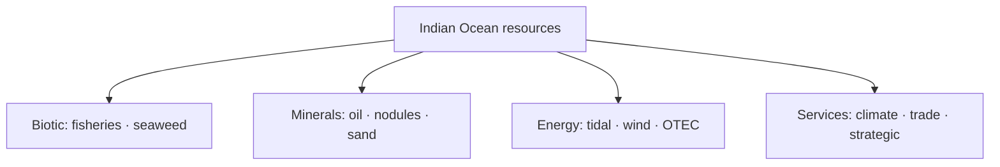

# Oceanic Resources of India & EEZ

> GS-1 · Topic 12 · Ocean resources, uses, energy, ecological problems (Indian Ocean)

---

## PYQs

| Year | M | Words | Question (EN) | प्रश्न (HI) | ID |
|------|---|-------|---------------|-------------|-----|
| 2024 | 8 | 125 | What is the use of oceans for humans? | मनुष्यों के लिए महासागरों का क्या उपयोग है? | Q1 |
| 2023 | 8 | — | 'Oceans are the store-house of resources.' — Write a short note. | 'महासागर संसाधनों का भंडार है।' — संक्षिप्त टिप्पणी लिखिए। | Q2 |
| 2020 | 12 | 200 | Highlight the various ecological problems associated with the exploitation and utilization of resources from the Indian Ocean. | हिंद महासागर के संसाधनों के शोषण और उपयोग से जुड़ी विभिन्न पारिस्थितिकीय समस्याओं पर प्रकाश डालiye। | Q3 |
| 2019 | 12 | 200 | Critically examine the oceanic energy resources and their potentialities on the coast zone of India. | महासागरों में ऊर्जा संसाधन तथा भारत तटीय क्षेत्र में उनकी सम्भावनाओं की समीक्षात्मक व्याख्या कीजिए। | Q4 |

---

## Quick Revision

```
INDIA & INDIAN OCEAN: 7,500+ km coastline · 9 coastal states + UT · 2.4 mn km² EEZ (≈ mainland area)
  · islands: Andaman-Nicobar · Lakshadweep · strategic IOR position

OCEAN USES FOR HUMANS (2024):
  Food (fisheries) · transport/shipping · trade (90%+ global by sea)
  · minerals (offshore oil, polymetallic nodules) · energy ( tidal, wave, OTEC, offshore wind)
  · climate regulation · recreation/tourism · strategic/naval · desalination · carbon sink

RESOURCE STOREHOUSE (2023):
  Biotic: fish, seaweed, mangroves, corals, marine mammals
  Abiotic: oil-gas, sand, tin, gold, manganese nodules, sulphides, salt, freshwater (desal)
  Renewable energy: tidal (Gulf of Kachchh, Gulf of Khambhat) · wave · offshore wind (TN, Gujarat)

OCEANIC ENERGY (2019):
  Offshore oil-gas: Mumbai High · KG Basin · Assam · Rajasthan coast
  Tidal: Gulf of Khambhat highest potential · SWAYAM PRABHA tidal · GIB tidal policy
  Wave, OTEC (Lakshadweep/Kerala concept) · offshore wind (National Offshore Wind Policy 2015)
  Blue economy · Sagarmala

ECOLOGICAL PROBLEMS (2020):
  Overfishing · bottom trawling · pollution (plastic, oil spills — MV Wakashio analogue)
  · coral bleaching · mangrove loss · dredging · port construction · acoustic pollution
  · climate change (SST rise, acidification) · invasive species · deep-sea mining risk

INSTITUTIONS: UNCLOS 1982 · INCOIS · MoEFCC CRZ · National Fisheries Policy · Deep Ocean Mission

TRAPS: EEZ ≠ territorial sea only | Indian Ocean ≠ only BoB+Arabian Sea (includes southern IOR)
  | Energy potential ≠ fully exploited | Blue economy ≠ only fishing | All ocean energy green ≠ true (offshore oil)
```

---

## Content

### Context — India and the Indian Ocean

- **India** has **~7,516 km coastline**, **9 coastal states**, **4,000+ fishing villages**, **Exclusive Economic Zone (EEZ) ~2.4 million km²** — **nearly equal to land area** — **vast oceanic resource base**.
- **Indian Ocean Region (IOR):** **Strategic trade routes (Malacca, Hormuz)**, **monsoon climate**, **biodiversity hotspots** — **India largest littoral state**.
- **Legal framework:** **UNCLOS 1982** — **Territorial sea (12 nm)**, **Contiguous zone (24 nm)**, **EEZ (200 nm)** — **sovereign rights over resources**, **not sovereignty over water column beyond territorial sea**.
- **Policy:** **Blue Economy vision**, **Sagarmala (port-led development)**, **Deep Ocean Mission (2021)**, **PMMSY ( fisheries)**.

### Oceans as storehouse of resources (2023 PYQ theme)

| Category | Resources | Indian examples |
|----------|-----------|-----------------|
| **Biotic** | **Fish, crustaceans, seaweed, plankton** | **Hilsa, mackerel, tuna, shrimp exports** |
| **Mineral — offshore** | **Oil, natural gas, sand, heavy minerals** | **Mumbai High, KG Basin, monazite (Kerala/TN coast)** |
| **Deep-sea minerals** | **Polymetallic nodules (manganese, nickel, cobalt)**, **hydrothermal sulphides** | **Central Indian Ocean Basin — India pioneer investor (1987)** |
| **Energy — renewable** | **Tidal, wave, OTEC, offshore wind** | **Gulf of Khambhat tidal; Gujarat/TN offshore wind** |
| **Water** | **Desalination** | **Chennai, Gujarat coastal plants** |
| **Ecosystem services** | **Carbon sequestration, oxygen, climate regulation** | **Phytoplankton, blue carbon habitats** |

### Uses of oceans for humans (2024 PYQ)

**Economic uses**
- **Fisheries & aquaculture** — **Protein, livelihood (~16 million fishers)**, **export earnings (shrimp)**.
- **Shipping & trade** — **~95% India trade by volume** — **Mumbai, JNPT, Chennai, Visakhapatnam, Kochi ports**.
- **Offshore hydrocarbons** — **Energy security** — **ONGC, Reliance KG fields**.
- **Tourism & recreation** — **Goa, Andaman, Lakshadweep** — **diving, beaches**.
- **Desalination** — **Freshwater for coastal cities**.

**Strategic & scientific**
- **Naval presence** — **IOR security, anti-piracy (Gulf of Aden)**.
- **Ocean research** — **INCOIS, NIOT, Deep Ocean Mission, Samudrayaan (manned submersible)**.
- **Climate regulation** — **Ocean heat sink, monsoon driver**.

**Cultural & social**
- **Coastal communities** — **Fishing festivals, maritime heritage** — **identity tied to sea**.



### Oceanic energy resources — coastal India (2019 PYQ)

**1. Offshore oil and natural gas (most developed)**
- **Mumbai High (1974)** — **Largest offshore field** — **~15% historical domestic oil**.
- **Krishna-Godavari (KG) Basin** — **D6 block (Reliance)** — **major gas supply**.
- **Assam-Arakan fold belt**, **Cauvery basin**, **Rajasthan (Barmer offshore linkage)**.
- **Potential:** **Remaining reserves in EEZ**, **deep-water exploration** — **environmental risk**.

**2. Tidal energy**
- **Gulf of Khambhat (Gujarat)** — **Highest tidal range in India (~8–11 m)** — **Suitable for barrage/tidal stream**.
- **Gulf of Kachchh**, **Sundarbans** — **moderate potential**.
- **Projects:** **Pilot trials**, **policy support under National Electricity Plan** — **not yet commercial scale like France/UK**.

**3. Wave energy**
- **West coast swell (Kerala, Karnataka, Goa)** — **NIOT OTEC/wave pilot off Vizhinjam**.
- **Technology immature commercially** in India.

**4. Ocean Thermal Energy Conversion (OTEC)**
- **Tropical latitudes (Lakshadweep, Kerala)** — **≥20°C surface-deep temperature difference**.
- **NIOT experimental OTEC plant (Kavaratti)** — **demonstration stage**.

**5. Offshore wind**
- **National Offshore Wind Energy Policy (2015)** — **Gujarat (Gulf of Khambhat), Tamil Nadu (Ramanathapuram)** — **GW potential estimates ** **~70 GW (MNRE assessments, evolving)**.
- **Higher cost than onshore** — **faster growth globally**.

**Critical examination (2019):** **High potential but uneven exploitation** — **hydrocarbons dominant**, **renewable ocean energy mostly pre-commercial**, **environmental and regulatory hurdles**, **high capital cost**, **grid connectivity for offshore wind**.

### Ecological problems — Indian Ocean exploitation (2020 PYQ)

| Problem | Cause | Indian Ocean / India example |
|---------|-------|-------------------------------|
| **Overfishing & bycatch** | **Trawlers, IUU fishing** | **BoB hilsa decline, juvenile catch** |
| **Bottom trawling damage** | **Benthic habitat destruction** | **Tamil Nadu, Kerala coastal conflict** |
| **Plastic pollution** | **Land-based waste, microplastics** | **Mumbai, Chennai beaches; open ocean gyres** |
| **Oil & chemical spills** | **Shipping, offshore platforms** | **Ennore 2017, port accidents** |
| **Port/dredging** | **Sagarmala, harbour expansion** | **Sediment plume, mangrove loss** |
| **Coral bleaching** | **SST rise, pollution** | **Gulf of Mannar, Lakshadweep, Andaman** |
| **Mangrove destruction** | **Shrimp farms, tourism, ports** | **East coast wetlands** |
| **Acoustic pollution** | **Sonar, shipping** | **Marine mammal stranding concerns** |
| **Ocean acidification** | **CO₂ absorption** | **Shellfish, coral calcification stress** |
| **Deep-sea mining risk** | **Nodule extraction planned** | **Central Indian Ocean — biodiversity unknown** |
| **Climate change** | **SLR, cyclone intensity** | **Sundarbans, Lakshadweep inundation** |

**Governance responses:** **CRZ 2019**, **Fisheries Management Plans**, **Marine Protected Areas**, **Plastic Waste Management Rules**, **Deep Ocean Mission environmental baseline studies**.

### Contemporary relevance

- **Deep Ocean Mission (₹4,000+ crore)** — **manned submersible Samudrayaan**, **nodule mining technology**, **biodiversity inventory**.
- **Blue Economy 2.0** — **MoES integrated approach** — **fisheries + minerals + renewable + tourism**.
- **Sagarmala** — **port modernization** — **balance with coastal ecology**.
- **India-Norway, IOR partnerships** — **maritime security and sustainable fishing**.
- **Global Plastic Treaty negotiations** — **India position on marine litter**.

### Limits and balanced view

- **Resource potential ≠ unlimited** — **fish stocks finite**, **renewable energy needs ** **scale and grid**.
- **Blue economy must be ** **sustainable blue economy** — **2020 PYQ ecological costs real**.
- **EEZ disputes** — **Maritime boundary with Pakistan, Bangladesh, Myanmar settled variously; Sri Lanka Kachchativu fishing issue**.

---

## Answers

### Q1: What is the use of oceans for humans? (2024, 8M, 125W)

**Introduction:**
> **Oceans** cover **~71% of Earth** — for **humans they provide food, energy, transport, climate stability, and strategic space** — **India's 7,500 km coast makes these uses vital**.

**Main Characteristics:**
- **Food & Livelihood** — **Fisheries, aquaculture, seaweed** — **millions of coastal fishers**.
- **Trade & Transport** — **~95% global trade by sea** — **Indian ports (Mumbai, JNPT, Chennai)**.
- **Energy** — **Offshore oil-gas (Mumbai High, KG Basin), tidal, offshore wind potential**.
- **Minerals** — **Sand, heavy minerals, deep-sea polymetallic nodules**.
- **Climate Regulation** — **Carbon sink, monsoon driver, oxygen production (phytoplankton)**.
- **Tourism & Culture** — **Coastal recreation, maritime heritage**.
- **Strategic & Scientific** — **Naval security, INCOIS research, Deep Ocean Mission**.

**Keywords (underline in exam):** Fisheries · EEZ · Shipping · Offshore Oil · Blue Economy · Climate Regulation

**Exam diagram (30 sec):**
```
Ocean → food · trade · energy · minerals · climate · security
```

**Conclusion:**
> **Oceans are ** **multifunctional life-support and economic systems** — **sustainable use defines India's blue future**.

---

### Q2: 'Oceans are the store-house of resources.' — Write a short note. (2023, 8M)

**Introduction:**
> **Oceans** contain **vast biotic and abiotic resources** — **food, minerals, energy, and ecosystem services** — **justifying the storehouse metaphor**.

**Main Points:**
- **Biotic Resources** — **Fish, crustaceans, marine algae, genetic biodiversity**.
- **Hydrocarbons** — **Offshore oil and natural gas (Mumbai High, KG Basin)**.
- **Minerals** — **Polymetallic nodules (Mn, Ni, Co), heavy mineral sands, salt**.
- **Renewable Ocean Energy** — **Tidal (Gulf of Khambhat), wave, OTEC, offshore wind**.
- **Ecosystem Services** — **Climate regulation, carbon sequestration, coastal protection**.
- **Freshwater** — **Desalination potential for coastal cities**.
- **Caution** — **Storehouse ≠ inexhaustible** — **overexploitation causes ecological collapse**.

**Keywords (underline in exam):** Biotic Resources · Polymetallic Nodules · EEZ · Offshore Hydrocarbons · Tidal Energy · Blue Economy

**Exam diagram (30 sec):**
```
Ocean storehouse:
Biotic | Minerals | Energy | Services
(use sustainably)
```

**Conclusion:**
> **Oceans hold ** **immense resource wealth** — **India's EEZ access demands ** **science-based sustainable extraction**.

---

### Q3: Highlight ecological problems associated with exploitation of Indian Ocean resources. (2020, 12M, 200W)

**Introduction:**
> **Exploitation of Indian Ocean resources** — **fisheries, hydrocarbons, ports, mining** — **generates serious ecological problems** threatening **marine biodiversity and coastal communities**.

**Main Points:**
- **Overfishing & Trawling** — **Stock depletion, bycatch, benthic habitat damage (BoB, Arabian Sea)**.
- **Pollution** — **Plastic microplastics, oil spills (ports), industrial effluents (Ennore-type incidents)**.
- **Coastal Habitat Loss** — **Mangrove and wetland reclamation for ports/shrimp farms**.
- **Coral Degradation** — **Bleaching, sedimentation, destructive fishing (Gulf of Mannar, Lakshadweep)**.
- **Dredging & Port Expansion** — **Sagarmala — turbidity, fish breeding ground loss**.
- **Climate Impacts** — **Sea-level rise, acidification, cyclone intensity on coastal ecosystems**.
- **Deep-Sea Mining Risk** — **Central Indian Ocean nodules — unknown biodiversity impact**.
- **Mitigation Need** — **CRZ, MPAs, fisheries regulation, Deep Ocean Mission baseline studies**.

**Keywords (underline in exam):** Overfishing · Marine Pollution · Coral Bleaching · Mangrove Loss · CRZ · Ocean Acidification

**Exam diagram (30 sec):**
```
Exploitation → overfish · pollute · habitat loss · climate stress
            → need MPAs · CRZ · sustainable blue economy
```

**Conclusion:**
> **Without ecological safeguards**, **short-term resource gains ** **destroy long-term ocean productivity** — **sustainable blue economy imperative**.

---

### Q4: Critically examine oceanic energy resources and their potentialities on India's coast. (2019, 12M, 200W)

**Introduction:**
> **India's coastal zone** hosts **diverse ocean energy resources** — **offshore hydrocarbons (developed), tidal, wave, OTEC, and offshore wind (emerging)** — **potential high but realization uneven**.

**Main Points:**
- **Offshore Oil-Gas — Proven** — **Mumbai High, KG Basin** — **substantial supply but ** **declining fields, deep-water cost**.
- **Tidal Energy — High Potential** — **Gulf of Khambhat/Kachchh** — **limited commercial deployment yet**.
- **Wave Energy — Experimental** — **NIOT pilots (Kerala)** — **technology not scaled**.
- **OTEC — Demonstration** — **Lakshadweep (Kavaratti)** — **tropical suitability, cost barrier**.
- **Offshore Wind — Emerging** — **Gujarat, Tamil Nadu** — **Policy 2015, GW potential, high capital/grid cost**.
- **Critical Limits** — **Environmental impact assessments, fishing conflict, high CAPEX, technology imports**.
- **Policy Enablers** — **National Electricity Plan, green hydrogen linkage, PLI for offshore wind supply chain**.
- **Balanced Verdict** — **Hydrocarbons dominate today**; **renewables critical for ** **long-term blue energy transition**.

**Keywords (underline in exam):** Mumbai High · KG Basin · Tidal Energy · OTEC · Offshore Wind · Gulf of Khambhat · Blue Economy

**Exam diagram (30 sec):**
```
Coastal energy: Oil/Gas (mature) | Tidal/Wave/OTEC/Wind (emerging)
Challenges: cost · environment · grid
```

**Conclusion:**
> **India's ocean energy future** lies in **scaling renewables while ** **managing offshore hydrocarbon decline responsibly**.

---

### Q5: *Likely variant:* Explain India's Exclusive Economic Zone (EEZ) and its resource significance. (—, 8M, 125W)

**Introduction:**
> **EEZ (200 nm under UNCLOS)** gives India **sovereign rights to explore and exploit ** **living and non-living resources** in **~2.4 million km²**.

**Main Characteristics:**
- **Legal Basis** — **UNCLOS 1982** — **not full sovereignty over waters**.
- **Resource Rights** — **Fisheries, oil-gas, minerals, wind energy**.
- **Andaman-Nicobar & Lakshadweep** — **Expand EEZ reach into strategic IOR**.
- **Deep-sea Mining** — **Pioneer investor status in Central Indian Ocean**.
- **Security** — **Naval patrol, anti-piracy, maritime domain awareness**.
- **Challenges** — **IUU fishing, enforcement capacity, ecological sustainability**.

**Keywords (underline in exam):** EEZ · UNCLOS · Sovereign Rights · Deep Ocean Mission · IOR

**Exam diagram (30 sec):**
```
Territorial sea 12nm → EEZ 200nm → resource rights (fish · oil · nodules)
```

**Conclusion:**
> **EEZ is ** **foundation of India's blue economy aspirations** — **requires sustainable governance**.

---

## Traps

| Wrong | Correct |
|-------|---------|
| EEZ = full sovereignty over sea | **Sovereign rights over resources** — **freedom of navigation continues** |
| Ocean energy = only tidal | **Oil-gas dominant; tidal, wind, OTEC, wave all relevant** |
| Indian Ocean = only India's waters | **Shared ocean** — **India largest littoral state in IOR** |
| Oceans inexhaustible | **Overfishing, pollution prove limits** |
| Offshore wind fully operational at scale | **Mostly policy/pilot stage in India** |
| Blue economy = only fisheries | **Minerals, energy, tourism, shipping included** |
| Ecological problems only global | **Ennore spill, trawling conflicts, coral bleaching local** |
| Deep-sea mining already commercial India | **Deep Ocean Mission — R&D and environmental study phase** |
| Mumbai High onshore | **Offshore Arabian Sea** |
| OTEC anywhere in India | **Needs tropical ** **≥20°C surface-deep gradient (Lakshadweep/Kerala best)** |

---

*Complete.*
