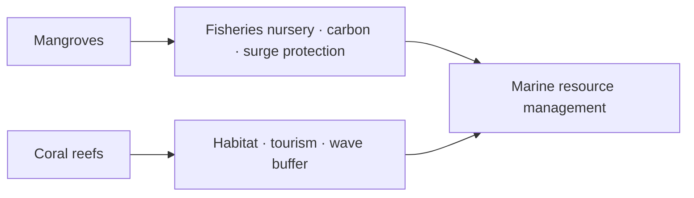

# Mangroves, Coral Reefs & Continental Shelf

> GS-1 · Topic 12 · Marine ecosystems, continental shelf minerals & energy (India)

---

## PYQs

| Year | M | Words | Question (EN) | प्रश्न (HI) | ID |
|------|---|-------|---------------|-------------|-----|
| 2025 | 8 | 125 | How do India's mangroves and coral reefs contribute to marine resource management? | भारत में मैंग्रोव और प्रवाल भित्ति समुद्री संसाधन प्रबन्धन में किस प्रकार योगदान प्रदान करते हैं? | Q1 |
| 2025 | 12 | 200 | "India's continental shelf is a store house of mineral and energy resources". Critically examine this statement with suitable examples. | "भारत का महाद्वीपीय तट खनिज और ऊर्जा का भण्डार है"। उपयुक्त उदाहरणों के साथ इस कथन का आलोचनात्मक परीक्षण कीजिये। | Q2 |

---

## Quick Revision

```
MANGROVES INDIA: ~4,975 km² (ISFR 2023 mangrove cover) · Sundarbans (largest) · Bhitarkanika · Pichavaram
  · Gulf of Kachchh · Andaman · Maharashtra creeks

CORAL REEFS: Gulf of Mannar · Lakshadweep atolls · Andaman-Nicobar · Gulf of Kachchh (patchy)
  · 4 coral reef areas — all on east/west tropical coasts & islands

MARINE RESOURCE MANAGEMENT ROLES:
  Mangroves: nursery grounds · fisheries · blue carbon · storm surge buffer · sediment trap
  · water quality · livelihood (honey, crab, wood sustainably)

  Corals: fish habitat · biodiversity hotspot · tourism/diving · coastal protection (wave energy)
  · indicator of marine health · pharmaceutical genetic resources

CONTINENTAL SHELF: Gentle slope to ~200m (edge of shelf → continental slope)
  India: wide on west (Arabian Sea) · broad on east (BoB) · hydrocarbon basins on shelf-slope

SHELF RESOURCES:
  Oil-gas: Mumbai High · KG · Cauvery · Bombay High basin · Assam shelf
  Heavy minerals: ilmenite, rutile, monazite, zircon (Kerala, TN, Odisha coast)
  Sand, limestone, placer deposits · fishing grounds (upwelling at shelf break)

CRITICAL LIMITS: Not all shelf equally mineral-rich · deep water tech needed · environmental cost
  · coral/mangrove destruction for ports · overfishing on shelf · climate SLR

LAWS: CRZ 2019 · WPA · Mangrove protection in RF · Marine NP (Gulf of Mannar, Mahatma Gandhi MP)
```

---

## Content

### Context — marine ecosystems and continental shelf

- **Marine resource management** = **sustainable use of living and non-living ocean resources** while **protecting ecosystem functions**.
- **Mangroves and coral reefs** are **critical coastal-marine ecosystems** — **nursery, protection, biodiversity** — **not optional luxuries but management infrastructure**.
- **Continental shelf** — **submerged extension of continent to ~200 m depth** — **India's shelf hosts ** **fisheries, oil-gas, placer minerals** — **2025 PYQ critical examination**.
- **India:** **Tropical coastline + islands** — **both ecosystems present** but **under threat from development and climate**.

### Mangroves in India — distribution and features

| Site | State/UT | Significance |
|------|----------|--------------|
| **Sundarbans** | **West Bengal** | **Largest mangrove forest globally; Royal Bengal tiger; UNESCO World Heritage** |
| **Bhitarkanika** | **Odisha** | **Saltwater crocodile, dense mangrove blocks** |
| **Pichavaram** | **Tamil Nadu** | **Backwater mangroves, tourism** |
| **Gulf of Kachchh** | **Gujarat** | **Arid-zone mangroves, marine NP** |
| **Andaman & Nicobar** | **UT** | **Pristine mangrove-coral mosaic** |
| **Mumbai creeks, Goa** | **Maharashtra, Goa** | **Urban pressure, reclamation threats** |

**ISFR 2023:** **Mangrove cover ~4,975 km²** — **increase in some states**, **loss to aquaculture/ports in others**.

### Coral reefs in India

| Reef system | Location | Features |
|-------------|----------|----------|
| **Gulf of Mannar** | **TN– Sri Lanka gap** | **Fringing reefs, Marine NP, 21 islands** |
| **Lakshadweep** | **Arabian Sea atolls** | **Ring reefs, lagoons, low-lying climate vulnerability** |
| **Andaman & Nicobar** | **Bay of Bengal** | **Fringing reefs, high biodiversity post-2004 recovery** |
| **Gulf of Kachchh** | **Gujarat** | **Patchy reefs, extreme salinity/temperature tolerance** |

**Threats:** **Bleaching (1998, 2010, 2016 events)**, **sedimentation, pollution, destructive fishing, tourism damage, climate change**.

### Contribution to marine resource management (2025 PYQ)

**Mangroves — management functions**

1. **Fisheries nursery** — **Juvenile fish, prawns, crabs** — **sustainable catch depends on mangrove health**.
2. **Blue carbon storage** — **Climate mitigation** — **conservation = resource management for carbon credits ( emerging)**.
3. **Coastal protection** — **Reduce cyclone/storm surge damage (Amphan 2020 — Sundarbans lesson)** — **protects ports, aquaculture, human settlements**.
4. **Water quality** — **Filter sediments and nutrients** — **protects seagrass and coral downstream**.
5. **Sediment stabilization** — **Prevent coastal erosion** — **maintains navigable channels**.
6. **Livelihood management** — **Sustainable NTFP (honey, crab, traditional fishing)** — **community-based resource governance**.
7. **Biodiversity reservoir** — **Genetic resource pool** — **resilience against fishery collapse**.

**Coral reefs — management functions**

1. **Fish habitat & productivity** — **25%+ marine species associated with reefs** — **food security**.
2. **Biodiversity hotspot** — **Conservation prioritization (MPAs)** — **resource insurance**.
3. **Coastal wave energy dissipation** — **Natural breakwater** — **reduces shore erosion cost**.
4. **Tourism revenue** — **Managed diving (Andaman, Lakshadweep)** — **alternative to destructive extraction**.
5. **Bio-prospecting** — **Marine genetic resources** — **pharmaceutical potential**.
6. **Monitoring sentinel** — **Reef health indicates overfishing, pollution, SST stress** — **early warning for fisheries management**.
7. **Research & education** — **Marine conservation awareness**.



### Continental shelf — mineral and energy resources (2025 critical examine)

**What is continental shelf?**
- **Gently sloping seabed** from **shore to ~200 m depth** ( **UNCLOS shelf edge definition negotiable up to 350 nm in special cases**).
- **India's shelf:** **Wide western shelf (Arabian Sea)**, **broad eastern shelf (Bay of Bengal)**, **around islands** — **high biological productivity at shelf break upwelling**.

**Mineral and energy resources — examples supporting statement**

| Resource | Shelf / offshore example | Evidence |
|----------|-------------------------|----------|
| **Oil & natural gas** | **Mumbai High (1974)**, **KG Basin**, **Cauvery basin**, **Assam shelf** | **Major domestic production historically** |
| **Heavy mineral placer** | **Ilmenite, rutile, monazite, zircon** — **Kerala, Tamil Nadu, Odisha coasts** | **IREL, beach sand mining (regulated)** |
| **Limestone/sand** | **Coastal construction aggregates** | **CRZ-regulated extraction** |
| **Fisheries** | **Shelf upwelling zones** — **sardine, mackerel** | **Living resource wealth** |
| **Future: offshore wind** | **Gujarat, TN shelf areas** | **Renewable energy potential** |

**Critical limits (must include for 12-mark)**

- **Uneven distribution** — **Not entire shelf hydrocarbon-rich** — **many dry basins, high exploration risk**.
- **Technical & capital intensity** — **Deep-water fields costly (KG deep, ultra-deep)**.
- **Environmental trade-offs** — **Offshore drilling spills, dredging, reef/mangrove damage for ports**.
- **Renewable ocean energy** — **Potential on shelf/coast but ** **not yet storehouse in exploited sense**.
- **Heavy mineral mining** — **Coastal erosion, radiation concerns (monazite), CRZ litigation (Kerala)**.
- **Overfishing on shelf** — **Trawling depletes living resource** — **mismanagement risk**.
- **Climate change** — **SLR submerges shelf ecosystems** — **undermines long-term resource base**.
- **Legal constraints** — **CRZ, MPAs, international seabed rules for beyond EEZ**.

**Balanced verdict:** **Statement substantially true for hydrocarbons and placer minerals** — **but "storehouse" implies easy, unlimited wealth** — **critical examination must stress ** **uneven endowment, ecological cost, and technology gaps**.

### Policy and conservation link

- **CRZ 2019** — **Regulates coastal activity affecting shelf-marine interface**.
- **Marine Protected Areas** — **Gulf of Mannar NP, Mahatma Gandhi Marine NP (Wandoor), Gahirmatha (Odisha turtles)**.
- **Mangrove for Life / MISHTI scheme (2023 budget)** — **mangrove restoration along coast and on islands**.
- **Integrated Coastal Zone Management (ICZM)** — **WB, Odisha, Gujarat projects**.

### Contemporary relevance

- **MISHTI mangrove initiative** — **link to 2025 PYQ management contribution**.
- **Lakshadweep coral stress** — **2024 bleaching reports** — **climate vulnerability**.
- **Great Nicobar project** — **shelf/traffic + mangrove-coral biodiversity conflict**.
- **Offshore wind auctions (SECI)** — **shelf as energy platform evolving**.

### Limits and balanced view

- **Mangrove/coral management ≠ only protection** — **includes sustainable use (community fishing, ecotourism)**.
- **Continental shelf resources** — **geological survey still incomplete** — **Deep Ocean Mission mapping**.

---

## Answers

### Q1: How do India's mangroves and coral reefs contribute to marine resource management? (2025, 8M, 125W)

**Introduction:**
> **Mangroves and coral reefs** are **living coastal infrastructure** — **they regulate fisheries, protect coasts, and store carbon** — **central to sustainable marine resource management in India**.

**Main Characteristics:**
- **Fisheries Nurseries** — **Mangrove creeks (Sundarbans, Bhitarkanika) and reefs (Gulf of Mannar) breed juveniles** — **sustain catches**.
- **Coastal Protection** — **Reduce cyclone surge and erosion (Amphan — Sundarbans buffer)** — **protects ports and aquaculture**.
- **Blue Carbon** — **Mangroves sequester CO₂** — **climate-linked resource management**.
- **Water Quality & Sediment Trap** — **Filter runoff** — **protects downstream reef and seagrass**.
- **Reef Habitat & Biodiversity** — **Fish stocks, tourism (Lakshadweep, Andaman)** — **managed MPAs**.
- **Early Warning System** — **Coral bleaching signals SST stress** — **fisheries/climate adaptation**.
- **Community Livelihoods** — **Sustainable honey, crab, diving** — **participatory management**.

**Keywords (underline in exam):** Mangroves · Coral Reefs · Sundarbans · Gulf of Mannar · Blue Carbon · Marine Protected Area · Fisheries Nursery

**Exam diagram (30 sec):**
```
Mangroves → nursery · carbon · surge shield
Corals → habitat · tourism · wave break
         ↓
Marine resource management
```

**Conclusion:**
> **Protecting mangroves and reefs is ** **operational marine management** — **not optional conservation**.

---

### Q2: "India's continental shelf is a store house of mineral and energy resources." Critically examine with examples. (2025, 12M, 200W)

**Introduction:**
> **India's continental shelf** — **submerged coastal plain to ~200 m depth** — **hosts significant oil-gas, placer minerals, and fisheries** — **partially validating the storehouse claim**, **with important limits**.

**Main Points:**
- **Support — Offshore Hydrocarbons** — **Mumbai High, KG Basin, Cauvery** — **major energy supply examples**.
- **Support — Heavy Mineral Placers** — **Ilmenite, monazite, zircon (Kerala, TN, Odisha)** — **IREL operations**.
- **Support — Shelf Fisheries** — **Upwelling zones** — **protein and export resource (shrimp)**.
- **Support — Emerging Offshore Wind** — **Gujarat, Tamil Nadu shelf** — **renewable energy potential**.
- **Critical — Uneven Distribution** — **Many basins dry or high-risk** — **not uniformly rich**.
- **Critical — Environmental Cost** — **Spills, dredging, mangrove-reef loss for ports/mining**.
- **Critical — Technology & Cost** — **Deep-water extraction expensive** — **renewables pre-commercial scale**.
- **Critical — Overexploitation Risk** — **Trawling, sand mining** — **storehouse degrades without governance (CRZ, MPAs)**.

**Keywords (underline in exam):** Continental Shelf · Mumbai High · KG Basin · Placer Minerals · Offshore Wind · CRZ · EEZ

**Exam diagram (30 sec):**
```
Shelf resources: oil/gas · placer · fish · wind (potential)
Limits: uneven · costly · ecological damage
```

**Conclusion:**
> **Shelf is ** **important mineral-energy repository** — **critical examination demands ** **sustainable, science-based extraction—not unrestrained exploitation**.

---

### Q3: *Likely variant:* Describe major coral reef regions of India and their conservation status. (—, 8M, 125W)

**Introduction:**
> **India's coral reefs** occur in **four major regions** — **Gulf of Mannar, Lakshadweep, Andaman-Nicobar, Gulf of Kachchh** — **all threatened but ** **protected through MPAs and CRZ**.

**Main Characteristics:**
- **Gulf of Mannar** — **Tamil Nadu; Marine NP; fringing reefs, 21 islands**.
- **Lakshadweep** — **Atoll reefs; low islands; high bleaching vulnerability**.
- **Andaman-Nicobar** — **High diversity; recovery post-2004 tsunami**.
- **Gulf of Kachchh** — **Patchy reefs; extreme environment tolerance**.
- **Threats** — **Bleaching, pollution, tourism, sedimentation, climate change**.
- **Conservation** — **Marine NPs, CRZ, coral transplantation pilots, bleaching monitoring**.
- **Management Link** — **Reefs support fisheries and tourism** — **conservation = resource management**.

**Keywords (underline in exam):** Gulf of Mannar · Lakshadweep · Andaman · Coral Bleaching · Marine National Park · CRZ

**Exam diagram (30 sec):**
```
4 reef regions → MPAs + CRZ → protect fisheries · tourism · coast
Threats: bleaching · pollution
```

**Conclusion:**
> **Reef conservation is ** **economic and ecological necessity** for **India's coastal blue economy**.

---

## Traps

| Wrong | Correct |
|-------|---------|
| Mangroves only in Sundarbans | **Also Bhitarkanika, Pichavaram, Kachchh, Andaman** |
| India has Great Barrier Reef scale | **Reefs limited to 4 regions — smaller but significant** |
| Continental shelf = deep ocean mining | **Shelf = to ~200 m; nodules mainly abyssal beyond shelf** |
| Storehouse = unlimited easy extraction | **Critical examine = uneven, costly, ecological limits** |
| Mumbai High on continental slope only | **Shelf-offshore transition zone — exam as shelf resource** |
| Mangroves unrelated to fisheries management | **2025 PYQ core — nursery function** |
| Coral reefs only for tourism | **Fisheries habitat, coastal protection equally important** |
| Placer mining unrestricted | **CRZ, monazite regulations, coastal erosion concerns** |
| Reef bleaching only natural | **Pollution, sediment, SST rise combined** |
| MISHTI unrelated to exam | **Current mangrove restoration — use in answers** |

---

*Complete.*
