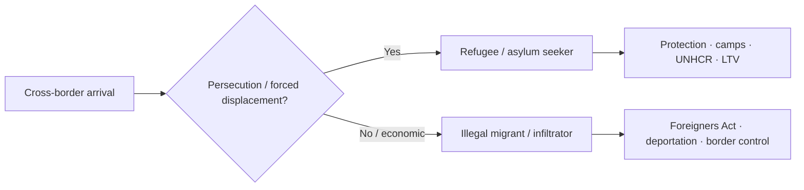

# Refugees & Infiltrators — India & South Asia

> GS-1 · Topic 13.1 · Human migration — refugee problem of the world with focus on India/subcontinent

---

## PYQs

| Year | M | Words | Question (EN) | प्रश्न (HI) | ID |
|------|---|-------|---------------|-------------|-----|
| 2025 | 12 | 200 | Differentiate between refugees and infiltrators. What steps have been taken by the Government of India for the security and assistance of refugees? | शरणार्थियों एवं घुसपैठियों में भेद कीजिए। शरणार्थियों की सुरक्षा और सहायता के लिए भारत सरकार ने कौन-से कदम उठाये हैं? | Q1 |
| 2023 | 8 | — | Throw light on Rohingya refugee in South Asia. | दक्षिण एशिया में रोहिंग्या शरणार्थी पर प्रकाश डालिए। | Q2 |

---

## Quick Revision

```
REFUGEE vs INFILTRATOR (2025):
  Refugee: forced flee · persecution/violence · seeks asylum · int'l protection (1951 Convention)
  Infiltrator: illegal entry · economic/other motive · no asylum claim · violates sovereignty/law

INDIA POSITION: NOT signatory 1951 Refugee Convention · NOT 1967 Protocol
  · governed by: Foreigners Act 1946 · Passport Act 1967 · Registration of Foreigners · FRRO
  · ad hoc "refugee policy" case-by-case · UNHCR limited formal role

MAJOR REFUGEE GROUPS IN INDIA:
  Tibetans (~1959) · Sri Lankan Tamils (1980s–) · Bangladesh 1971 · Afghan (post-Soviet/Taliban)
  · Chakmas (Tripura) · Rohingya (Myanmar) · Nepalese (open border — not refugee category)

ROHINGYA SOUTH ASIA (2023):
  Persecution Rakhine · Aug 2017 exodus · Bangladesh Cox's Bazar (world's largest camp)
  · India ~40,000 est. (Jammu, Hyderabad, Delhi) · Malaysia/Thailand transit
  · India: deportation concerns · SC interim protection · no CAA coverage

GOVT STEPS — SECURITY:
  Border fencing (Bangladesh/Myanmar) · BSF/SSB/Assam Rifles · biometrics · FRRO tracking
  · Foreigners Tribunals (Assam) · NRC discourse · deportation under Foreigners Act
  · CAA 2019 (persecuted minorities from 3 neighbours — NOT Rohingya Muslims)

GOVT STEPS — ASSISTANCE:
  Tibetan Rehabilitation Policy · settlement camps (Dharamshala, Bylakuppe)
  · Sri Lankan Tamil camps (Tamil Nadu) · Long-term visa · work permits (limited groups)
  · UNHCR partner NGOs (health, education for registered refugees)
  · CAA pathway for eligible persecuted minorities

INSTITUTIONS: UNHCR · UN 1951 Convention · IOM · SAARC (limited refugee framework)

TRAPS: India ≠ signatory 1951 Convention | Refugee ≠ all foreigners | CAA ≠ general amnesty
  | Rohingya ≠ covered under CAA | Infiltrator ≠ always security threat (legal distinction matters)
  | Bangladesh 1971 ≠ same as economic migration today
```

---

## Content

### Context — Global refugee crisis and India's position

- **UNHCR (2024 estimates):** **~120+ million forcibly displaced** globally — **conflicts (Ukraine, Sudan, Gaza, Myanmar), climate stress, persecution** — **South Asia hosts large protracted refugee populations**.
- **India:** **Historically generous host** (1971 Bangladesh, Tibetans, Sri Lankan Tamils) but **not a signatory to 1951 Refugee Convention or 1967 Protocol** — **refugees legally treated as "foreigners"** under **Foreigners Act 1946**.
- **Subcontinent lens:** **Partition legacy**, ** porous borders**, **ethnic kinship across boundaries**, **limited regional refugee treaty (SAARC silent on refugees)** — **national security and humanitarian tension**.

### Refugees vs infiltrators (2025 PYQ core)

| Dimension | **Refugee (शरणार्थी)** | **Infiltrator (घुसपैठिया)** |
|-----------|------------------------|----------------------------|
| **Definition** | **Person fleeing persecution, war, or violence** — **well-founded fear** — **cannot return safely** | **Person entering country illegally** — **without authorization** — **often for economic/other gain** |
| **Legal basis** | **1951 UN Refugee Convention** — **asylum, non-refoulement** (India not bound formally) | **Foreigners Act 1946** — **illegal entry = offence** — **deportation powers** |
| **Intent** | **Seek protection/safety** | **Evade border controls** — **may not claim persecution** |
| **Documentation** | **UNHCR refugee card (if registered)** — **asylum seeker status** | **No valid visa/passport** — **often identity-less** |
| **India examples** | **Tibetans (1959), Sri Lankan Tamils, some Afghans, Chakmas** | **Illegal cross-border economic migrants (Bangladesh border, Rohingya without status)** |
| **State response** | **Camp settlement, LTV, assistance (group-specific)** | **Detection, detention, deportation, border pushback** |

**Nuanced point for exam:** **Distinction is legal-intent based** — **not ethnic** — **same border may see asylum seekers and economic migrants** — **India uses security + humanitarian balance**.



### Rohingya refugees in South Asia (2023 PYQ)

**Background**
- **Rohingya** — **Muslim minority in Rakhine State, Myanmar** — **denied citizenship under 1982 Myanmar Citizenship Law** — **stateless**.
- **2017 "clearance operations"** — **mass violence, arson, sexual violence** — **~700,000+ fled to Bangladesh in weeks** — **protracted crisis**.

**Regional distribution**

| Country | Situation |
|---------|-----------|
| **Bangladesh** | **~1 million+ in Cox's Bazar (Kutupalong-Balukhali)** — **world's largest refugee camp** — **monsoon/flood risk, funding strain** |
| **India** | **~40,000 estimated** — **Jammu & Kashmir, Hyderabad, Delhi, Haryana** — **UNHCR registration limited** |
| **Malaysia / Indonesia / Thailand** | **Boat arrivals, detention, trafficking routes** |
| **Myanmar** | **~600,000 Rohingya remain in Rakhine** — **restricted movement, IDP camps** |

**India's policy stance**
- **Not signatory to Refugee Convention** — **Rohingya treated as illegal immigrants**.
- **Security concerns cited:** **radicalization risk, demographic pressure (Jammu), cross-border crime**.
- **Supreme Court (2021 interim):** **No deportation during pendency** — **UNHCR-registered refugees entitled to fair procedure** — **Article 21 applies to all persons**.
- **CAA 2019:** **Does not cover Rohingya** (Muslims from Myanmar not in scope) — **no legal pathway**.

**Humanitarian dimension:** **UNHCR partner NGOs** — **health, education for registered refugees** — **children out of formal school in many states**.

### Government steps — security of refugees and border (2025 PYQ)

**Legal & institutional**
- **Foreigners Act 1946** — **detention, deportation, restriction of movement**.
- **Passport (Entry into India) Act 1967** — **penalizes illegal entry**.
- **Foreigners Regional Registration Office (FRRO)** — **tracking registered foreigners**.
- **CAA 2019 + NRC discourse (Assam)** — **identify illegal immigrants vs persecuted minorities pathway**.

**Border & intelligence**
- **India-Bangladesh border fencing (~90%+ complete in phases)** — **BSF patrol, floodlights, CIBMS (Comprehensive Integrated Border Management System)**.
- **Myanmar border — Assam Rifles, SSB** — **Free Movement Regime (16 km) under review post-2021 coup/migration surge**.
- **Biometric enrolment, e-FRRO portal** — **visa overstay tracking**.

**Specific to refugee security**
- **Camp administration (Tibetan, Sri Lankan Tamil camps)** — **restricted movement zones, police liaison**.
- **Deportation of unregistered migrants** — **bilateral readmission talks (Bangladesh, Myanmar)** — **contested for Rohingya**.

### Government steps — assistance to refugees (2025 PYQ)

| Group | Assistance measures |
|-------|---------------------|
| **Tibetans (since 1959)** | **Tibetan Rehabilitation Policy** — **settlements (Dharamshala, Bylakuppe, Mundgod)** — **Reservation in Tibetan schools (SFF, etc.)** — **Long-Term Visa (LTV)** |
| **Sri Lankan Tamils** | **Refugee camps (Tamil Nadu — Mandapam, etc.)** — **rations, shelter** — **some repatriation programs** |
| **1971 Bangladesh refugees** | **Mass camp relief (8–10 million at peak)** — **eventual citizenship for East Bengali immigrants under Indira- Mujib pact / later agreements** |
| **Afghans, Somalis (small numbers)** | **UNHCR registration** — **NGO health/education** — **LTV case-by-case** |
| **CAA beneficiaries** | **Accelerated citizenship for Hindu, Sikh, Buddhist, Jain, Parsi, Christian from Afghanistan, Bangladesh, Pakistan (persecuted)** |

**Institutional actors:** **Ministry of Home Affairs (foreigners division)**, **Ministry of External Affairs (diplomatic asylum rare)**, **UNHCR India (Delhi)**, **State governments (camp management — TN, Karnataka, HP)**.

### Contemporary relevance

- **Myanmar post-2021 coup** — **renewed displacement** — **India's Act East vs border security dilemma**.
- **Afghanistan (2021 Taliban return)** — **minor influx** — **CAA pathway debated for Hindus/Sikhs**.
- **Global Compact on Refugees (2018)** — **India participated but non-binding**.
- **Climate displacement** — ** Sundarbans, coastal Bangladesh** — **future "refugee" pressure without legal category**.
- **Supreme Court jurisprudence** — **Article 14, 21 for non-citizens** — **limits arbitrary deportation**.

### Limits and balanced view

- **Non-signatory status** gives **flexibility but lacks uniform protection standards** — **ad hoc policy creates inconsistency (Tibetans vs Rohingya)**.
- **Security concerns legitimate** but **humanitarian obligations under constitutional morality (Article 21)**.
- **Infiltration and refugee flows overlap geographically** — **policy must distinguish intent, not religion alone**.
- **South Asia needs regional refugee framework** — **SAARC incapacitated** — **bilateralism dominates**.

---

## Answers

### Q1: Differentiate refugees and infiltrators; Govt steps for security and assistance. (2025, 12M, 200W)

**Introduction:**
> **Refugees flee persecution or war seeking protection; infiltrators enter illegally, typically without asylum claims** — **India hosts both phenomena on its borders but governs them primarily under the Foreigners Act, not the 1951 Refugee Convention**.

**Main Points:**
- **Refugee** — **Forced displacement, well-founded fear, seeks safety** — **examples: Tibetans, Sri Lankan Tamils, Afghans**.
- **Infiltrator** — **Unauthorized border crossing, economic or illegal intent, no protection claim** — **dealt under Foreigners Act**.
- **Security Steps** — **Border fencing (Bangladesh), BSF/Assam Rifles, FRRO tracking, biometrics, Foreigners Tribunals, deportation powers**.
- **Assistance Steps** — **Tibetan Rehabilitation Policy, Tamil refugee camps, LTV, UNHCR-NGO support, CAA for persecuted minorities from three neighbours**.
- **Legal Frame** — **Non-signatory to Refugee Convention** — **Article 21 protection via courts for fair procedure**.

**Keywords (underline in exam):** Refugee · Infiltrator · Foreigners Act 1946 · UNHCR · CAA 2019 · Non-refoulement · LTV

**Exam diagram (30 sec):**
```
Refugee = persecution + protection seeker
Infiltrator = illegal entry + no asylum
India: security (border · FRRO) + selective assistance (Tibetans · CAA)
```

**Conclusion:**
> **India balances sovereignty with selective humanitarianism** — **clear legal differentiation and uniform minimum protection remain policy gaps**.

---

### Q2: Throw light on Rohingya refugee in South Asia. (2023, 8M)

**Introduction:**
> **Rohingya Muslims of Myanmar's Rakhine State face statelessness and persecution** — **2017 exodus made South Asia, especially Bangladesh and India, a major theatre of the crisis**.

**Main Points:**
- **Cause** — **1982 citizenship denial, communal violence, 2017 military operations** — **~700,000+ fled to Bangladesh**.
- **Bangladesh** — **Cox's Bazar mega-camps — world's largest refugee settlement** — **aid dependency, disaster risk**.
- **India** — **~40,000 estimated, clusters in Jammu, Hyderabad** — **illegal immigrant classification, deportation concerns**.
- **Legal/policy** — **India not Refugee Convention signatory; CAA excludes Rohingya; SC interim against arbitrary deportation**.
- **Regional** — **Boat people to Malaysia/Thailand; ASEAN pressure on Myanmar limited**.

**Keywords (underline in exam):** Rohingya · Rakhine · Cox's Bazar · Stateless · UNHCR · CAA · Article 21

**Exam diagram (30 sec):**
```
Myanmar persecution → Bangladesh (1M+) · India (~40k)
Policy: humanitarian crisis vs border security
```

**Conclusion:**
> **Rohingya crisis exposes South Asia's absence of a coherent refugee regime** — **humanitarian burden falls heavily on Bangladesh**.

---

### Q3: *Likely variant:* Examine India's refugee policy — humanitarian vs security. (—, 12M, 200W)

**Introduction:**
> **India is a major refugee host historically but not a party to international refugee law** — **policy oscillates between humanitarian accommodation and border security**.

**Main Points:**
- **Humanitarian track** — **1971 Bangladesh, Tibetan settlements, Sri Lankan camps, NGO-UNHCR support**.
- **Security track** — **Foreigners Act, deportation, border fencing, CAA-NRC discourse**.
- **Inconsistency** — **Group-specific policies (Tibetans generous; Rohingya contested)**.
- **Judicial check** — **Article 21 fair procedure for deportation**.
- **Reform need** — **Domestic refugee law, SAARC cooperation, distinguish economic migration from asylum**.

**Keywords (underline in exam):** 1951 Convention · Foreigners Act · Tibetan Policy · CAA · Article 21 · UNHCR

**Exam diagram (30 sec):**
```
Humanitarian (camps · LTV) ↔ Security (fence · deport)
Need: national asylum law
```

**Conclusion:**
> **A codified refugee policy would reconcile India's humanitarian tradition with sovereign border control**.

---

## Traps

| Wrong | Correct |
|-------|---------|
| India signatory to 1951 Refugee Convention | **Not signatory** — **Foreigners Act governs** |
| Refugee = any foreigner | **Forced displacement + protection need** — **legal category** |
| Infiltrator = only Bangladeshi | **Any illegal entrant** — **nationality-neutral term** |
| CAA covers all refugees | **Only persecuted non-Muslim minorities from Afg/BD/Pak** |
| CAA covers Rohingya | **Rohingya Muslims from Myanmar excluded** |
| UNHCR runs camps in India | **Limited role** — **govt/NGO partner model** |
| All Tibetans are citizens | **Most on LTV/residence permits** — **not automatic citizenship** |
| Rohingya only in Bangladesh | **India, Malaysia, Thailand also host** |
| Refugee policy uniform | **Ad hoc, group-specific (Tibetan Policy vs Rohingya deportation)** |
| Security measures violate all refugee rights | **Courts apply Article 21** — **non-refoulement de facto in some cases** |

---

*Complete.*
