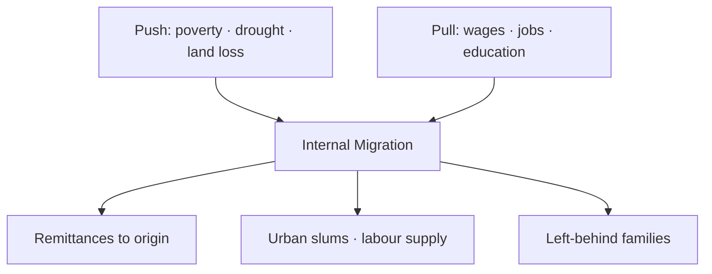

# Internal Migration & Reverse Migration — India

> GS-1 · Topic 13.2 · Internal human migration — causes, consequences, reverse migration (COVID-19 / UP focus)

---

## PYQs

| Year | M | Words | Question (EN) | प्रश्न (HI) | ID |
|------|---|-------|---------------|-------------|-----|
| 2023 | 12 | — | Discuss the causes and consequences of internal human migration in India. | भारत में आंतरिक मानव प्रवास के कारणों एवं परिणामों की व्याख्या कीजिए। | Q1 |
| 2020 | 12 | 200 | What is 'reverse migration'? What was its impact on the economy and social order of Uttar Pradesh during the COVID-19 Lockdown? | 'विपरीत प्रवास' क्या है? COVID-19 लॉकडाउन के दौरान उत्तर प्रदेश की अर्थव्यवस्था और सामाजिक व्यवस्था पर इसका क्या प्रभाव पड़ा? | Q2 |

---

## Quick Revision

```
INTERNAL MIGRATION INDIA (2023):
  Scale: Census 2011 — ~45% Indians migrants (lifetime) · major rural→urban
  Push: poverty · land fragmentation · drought/flood · unemployment · conflict · distress
  Pull: wages · jobs (manufacturing/services) · education · urban amenities
  Types: permanent · seasonal · circular (R→U · R→R · U→U)

CAUSES (structured):
  Economic: agrarian crisis · MNREGA insufficient · wage differential
  Social: marriage · education · caste/network migration
  Environmental: drought (Marathwada) · floods · cyclones · climate stress
  Political/conflict: Naxalism · ethnic violence displacement

CONSEQUENCES:
  + remittances · urban labour supply · cultural exchange · women's agency (some cases)
  − slums · pressure on urban infra · brain drain villages · left-behind children/elderly
  · political (voter portability) · epidemiological (COVID spread vector)

REVERSE MIGRATION (2020):
  Definition: return movement from destination to origin (often crisis-triggered)
  COVID lockdown March 2020: factories shut · no wages/shelter · migrants walked home

UP IMPACT — ECONOMY:
  Sudden remittance collapse (Mumbai/Delhi/Gujarat earnings lost)
  Village wage depression (labour surplus) · MGNREGS demand spike
  Skill Mapping Portal · ODOP · rural employment push · Shramik Special Trains

UP IMPACT — SOCIAL ORDER:
  Quarantine centres · stigma of "virus carriers" · family reunification
  Strain on village food/housing · psychological distress · child education disruption
  Community solidarity + panchayat role · later "son of soil" local job preference discourse

STATES: UP · Bihar · Jharkhand — major OUT-migration · Maharashtra · Delhi · Gujarat — IN-flow
  UP: Gorakhpur · Azamgarh · Bundelkhand · Purvanchal — high outflow belts

INSTITUTIONS: Census migration tables · NITI Aayog · Interstate Migrant Workmen Act 1979
  · One Nation One Ration Card (portable PDS) · e-Shram portal

TRAPS: Internal migration ≠ only rural-urban | Reverse migration ≠ only COVID
  | All migration ≠ distress (also aspirational) | Remittances ≠ always positive net (depends)
  | UP impact ≠ only negative (MGNREGS · local employment later)
```

---

## Content

### Context — Internal migration in India

- **Census 2011:** **~450 million internal migrants** (by place of birth/last residence definitions vary) — **one of world's largest internal migration flows**.
- **Drivers:** **Uneven development**, **agrarian distress**, **urban-industrial growth poles** (Mumbai, Delhi-NCR, Bengaluru, Surat, Pune).
- **Constitutional angle:** **Article 19(1)(d) — right to move freely and reside** — **internal migration is legal unlike cross-border**.
- **Policy gap historically:** **Inter-State Migrant Workmen (Regulation of Employment and Conditions of Service) Act, 1979** — **weak enforcement** — **COVID exposed invisible migrant workforce**.

### Causes of internal migration (2023 PYQ)

**1. Economic push factors**
- **Agricultural stagnation** — **small landholdings, fragmentation, crop failure** — **Bundelkhand, Marathwada drought belts**.
- **Rural unemployment/underemployment** — **disguised unemployment in agriculture**.
- **Debt distress** — **farmer suicides push family members to cities**.
- **Limited non-farm rural jobs** — **despite MGNREGS**.

**2. Economic pull factors**
- **Higher urban wages** — **construction, textiles (Surat), brick kilns, gig economy**.
- **Industrial & service clusters** — **Delhi-NCR, Maharashtra, Gujarat, Karnataka**.
- **IT/services aspirational migration** — **educated youth to Bengaluru, Hyderabad, Pune**.

**3. Social factors**
- **Marriage migration** (predominantly women — patrilocal).
- **Education** — **hostels, coaching hubs (Kota, Delhi)**.
- **Kinship networks** — **chain migration from UP/Bihar villages to specific city slums**.

**4. Environmental & conflict**
- **Floods (Assam, Bihar), cyclones (Odisha), landslides** — **temporary/permanent displacement**.
- **Naxal-affected areas** — **security-driven outmigration**.
- **Climate stress** — **Sundarbans salinity intrusion**.

| Migration type | Pattern | Example |
|----------------|---------|---------|
| **Rural → Urban** | **Permanent/semi-permanent** | **UP/Bihar → Delhi construction** |
| **Rural → Rural** | **Agricultural labour seasonally** | **Bihar → Punjab harvest** |
| **Seasonal/circular** | **Return for sowing/festivals** | **Odisha brick kiln workers** |
| **Urban → Urban** | **Job upgrade** | **Tier-2 to Metro IT jobs** |



### Consequences of internal migration (2023 PYQ)

**Positive**
- **Remittances** — **rural consumption, house construction, education fees** — **UP, Bihar, Odisha remittance-dependent villages**.
- **Urban labour supply** — ** sustains construction, MSME, services** — **lowers urban wage inflation marginally**.
- **Poverty reduction** — **multiplier via earned income**.
- **Social mobility** — **exposure to urban norms, women's workforce participation (though often informal)**.
- **Cultural exchange** — **hybrid identities, festival diffusion**.

**Negative**
- **Urban slums & informal settlements** — **Dharavi-type density, sanitation deficit**.
- **Infrastructure pressure** — **water, transport, housing in metros**.
- **Origin villages** — **"empty villages", ageing population, left-behind children (education/affection deficit)**.
- **Informality & exploitation** — **no contracts, no social security pre-e-Shram**.
- **Health & epidemiology** — **crowded dormitories facilitated COVID spread**.
- **Political economy** — **voter registration portability issues, clientelism in slums**.

**Balanced view:** **Migration is rational household strategy** — **not merely "failure"** — **policy should reduce distress migration while enabling dignified mobility**.

### Reverse migration — concept (2020 PYQ)

**Definition:** **Movement of migrants back from destination to place of origin** — **can be seasonal (normal) or crisis-induced (abnormal)**.

| Type | Trigger | Example |
|------|---------|---------|
| **Seasonal reverse** | **Harvest/festival/agricultural calendar** | **Punjab farm workers return for sowing** |
| **Crisis reverse** | **Lockdown, recession, disaster, xenophobia** | **COVID-19 March–May 2020 exodus** |
| **Retirement return** | **Life-cycle** | **Return to village after urban work life** |

**COVID-19 reverse migration (March–August 2020)**
- **Nationwide lockdown (24 March 2020)** — **factories, construction halted overnight**.
- **~Millions stranded** — **no wages, eviction from dormitories, transport shutdown**.
- **Iconic images:** **Foot march along highways** — **Delhi to UP/Bihar, Mumbai to MP/UP/Odisha**.
- **Government response (delayed then scaled):** **Shramik Special Trains**, ** shelters, food camps**, **bus convoys by states**.

### Impact on Uttar Pradesh — economy (2020 PYQ)

**Immediate shocks**
- **Remittance collapse** — **UP among top remittance-receiving states** — **Purvanchal, Bundelkhand villages dependent on Mumbai/Delhi/Gulf-earning workers** — **sudden income loss**.
- **Labour surplus in villages** — **reverse supply glut depressed local agricultural wages**.
- **MGNREGS demand explosion** — **record person-days needed as fallback**.
- **Urban UP (Noida, Kanpur)** also lost **incoming migrant labour** — **construction stalled**.

**Medium-term policy responses (UP government)**
- **Migrant Skill Mapping / registration portals** — **database for re-employment**.
- **One District One Product (ODOP)** — **local manufacturing push**.
- **Enhanced rural employment schemes** — **MGNREGS, state rural livelihood missions**.
- **Garib Kalyan Rojgar Abhiyan (Centre)** — **125-day employment push in villages**.
- **Atmanirbhar Bharat** — **MSME credit — partial absorption**.

**Structural lesson:** **UP economy dual — sends migrants out, receives them back in crisis** — **need diversified rural non-farm jobs**.

### Impact on Uttar Pradesh — social order (2020 PYQ)

**Social disruption**
- **Quarantine centres at block/district level** — **fear of infection, stigma against returnees as "carriers"**.
- **Family reunification** — **emotional relief but economic burden on household**.
- **Strain on village resources** — **food stocks, housing space, water**.
- **Psychological trauma** — **humiliation of walking home, police enforcement on highways**.
- **Education disruption** — **children returned from city schools mid-term**.

**Social solidarity & governance**
- **Panchayats, local NGOs, gurudwaras/temples** — **food shelters along routes into UP**.
- **Caste/community networks** — **facilitated shelter**.
- **Political discourse shift** — **demands for local job reservation ("sons of soil") in some states post-COVID**.
- **Health system rural stress** — **limited PHC capacity for screening**.

**Gender dimension:** **Women migrants in domestic work lost jobs silently** — **less visible in media exodus**.

### Contemporary relevance

- **One Nation One Ration Card (ONORC)** — **portable PDS for migrants** — **partial fix for welfare exclusion**.
- **e-Shram portal (2021)** — **unorganised worker registration** — **includes migrants**.
- **Labour Codes (2020)** — **Inter-State Migrant Worker provisions consolidated** — **implementation key**.
- **Climate migration** — **Bundelkhand, coastal Odisha** — **future reverse migration cycles**.
- **Post-COVID urban recovery** — **many migrants returned to cities by 2021–22** — **circular pattern resumed**.

### Limits and balanced view

- **Not all migration is distress-driven** — **aspirational mobility should be facilitated, not prevented**.
- **Reverse migration during COVID had temporary benefits (family presence) and costs (income loss)**.
- **UP-specific:** **Population size makes any shock massive in absolute numbers** — **policy must scale**.
- **Data gap:** **No real-time migrant registry pre-COVID** — **planning failure acknowledged nationally**.

---

## Answers

### Q1: Causes and consequences of internal human migration in India. (2023, 12M)

**Introduction:**
> **Internal migration reshapes India's demographic and economic map** — **driven by rural distress and urban opportunity, it produces both remittance-led development and urban crisis**.

**Main Points:**
- **Causes — Push** — **Poverty, land fragmentation, drought/flood, rural unemployment, conflict**.
- **Causes — Pull** — **Higher wages, industrial jobs (Surat, NCR), education, urban amenities**.
- **Types** — **Rural-urban permanent, seasonal (agriculture), circular, marriage migration**.
- **Positive Consequences** — **Remittances, poverty reduction, urban labour supply, social mobility**.
- **Negative Consequences** — **Slums, infra pressure, left-behind villages, informal exploitation, health risks (COVID)**.
- **Policy** — **Inter-State Migrant Workmen Act, ONORC, e-Shram, need portable social security**.

**Keywords (underline in exam):** Push-Pull · Rural-Urban · Remittances · Circular Migration · MGNREGS · Slums · ONORC

**Exam diagram (30 sec):**
```
Push (village distress) + Pull (city wages) → Migration
→ + remittances | − slums · left-behind families
```

**Conclusion:**
> **Migration is India's silent urbanization engine** — **policy must reduce distress while securing dignified migrant rights**.

---

### Q2: Reverse migration — impact on UP economy and social order during COVID lockdown. (2020, 12M, 200W)

**Introduction:**
> **Reverse migration denotes return movement from workplaces to native places** — **COVID-19 lockdown triggered one of history's largest distress reverse migrations into Uttar Pradesh**.

**Main Points:**
- **Definition** — **Crisis-induced return of interstate migrants when destination jobs vanish**.
- **Economy — Negative** — **Remittance collapse, village labour surplus, construction halt, MGNREGS spike**.
- **Economy — Response** — **Shramik trains, skill mapping, ODOP, Garib Kalyan Rojgar, rural employment push**.
- **Social — Strain** — **Quarantine stigma, family reunification burden, PHC stress, education disruption**.
- **Social — Solidarity** — **Panchayat/NGO relief, community kitchens along UP entry routes**.
- **Lesson** — **Invisible migrant workforce needs portable welfare (ONORC, e-Shram)**.

**Keywords (underline in exam):** Reverse Migration · Shramik Special Trains · Remittances · MGNREGS · Quarantine · Skill Mapping · Article 19

**Exam diagram (30 sec):**
```
Lockdown → jobs lost → walk/train home to UP
Economy: − remittances · + MGNREGS demand
Social: stigma + solidarity
```

**Conclusion:**
> **COVID reverse migration exposed UP's dependence on outbound labour** — **diversified local employment is structural imperative**.

---

### Q3: *Likely variant:* Explain types of internal migration in India with examples. (—, 8M, 125W)

**Introduction:**
> **Internal migration in India spans permanent, seasonal, and circular forms** — **each shaped by economic and social logic**.

**Main Points:**
- **Rural → Urban** — **UP/Bihar workers in Delhi-Mumbai construction (permanent/semi-permanent)**.
- **Rural → Rural seasonal** — **Bihar/Odisha labour in Punjab harvest**.
- **Circular** — **Brick kilns, post-harvest return, festival cycles**.
- **Urban → Urban** — **IT sector mobility Bengaluru-Hyderabad**.
- **Marriage migration** — **Predominantly women — demographic redistribution**.

**Keywords (underline in exam):** Seasonal · Circular · Rural-Urban · Chain Migration · Census 2011

**Exam diagram (30 sec):**
```
Types: R→U | R→R seasonal | circular | U→U | marriage
```

**Conclusion:**
> **Recognizing migration types is essential for targeted welfare — one-size policy fails seasonal workers**.

---

## Traps

| Wrong | Correct |
|-------|---------|
| Internal migration = only rural to urban | **Also R→R, U→U, seasonal, circular** |
| All internal migration is distress | **Also aspirational (IT, education)** |
| Reverse migration invented in COVID | **Seasonal return normal; COVID = crisis scale** |
| UP only sends migrants, never receives | **Noida/Kanpur attract migrants; COVID received returnees** |
| Remittances always benefit origin | **Depends on migration cost, debt bondage, left-behind care burden** |
| Shramik trains solved crisis fully | **Partial relief; initial suffering massive** |
| Lockdown impact only economic | **Social stigma, mental health, education equally important** |
| MGNREGS replaces migration | **Supplement, not substitute for urban wages** |
| Inter-State Migrant Act fully enforced | **Historically weak — Labour Codes aim to fix** |
| ONORC solves all migrant welfare | **Health, housing, education portability still gaps** |

---

*Complete.*
