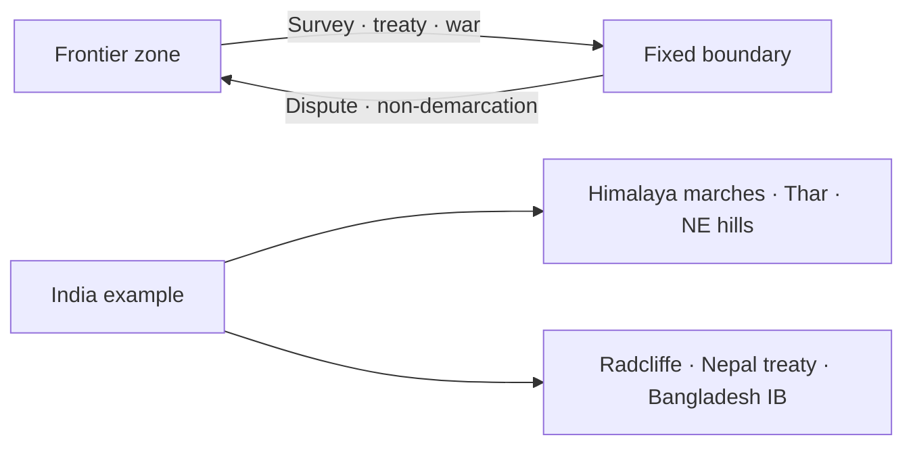

# Frontiers vs Boundaries — Indian Subcontinent

> GS-1 · Topic 14.1 · Frontiers and boundaries with reference to Indian subcontinent

---

## PYQs

| Year | M | Words | Question (EN) | प्रश्न (HI) | ID |
|------|---|-------|---------------|-------------|-----|
| 2025 | 12 | 200 | Differentiate between frontiers and boundaries and present a detailed account on the types of boundaries giving suitable examples from Indian subcontinent. | सीमांत और सीमाओं में अंतर स्पष्ट कीजिए और भारतीय उपमहाद्वीप से उपयुक्त उदाहरण देते हुए सीमाओं के प्रकारों पर विस्तृत विवरण प्रस्तुत कीजिए। | Q1 |
| 2020 | 8 | 125 | Explain the difference between the frontier and the boundary with special reference to India. | भारत के विशेष संदर्भ में सीमांत (फ्रंटियर) और सीमा (बाउंडरी) का अंतर स्पष्ट कीजिए। | Q2 |

---

## Quick Revision

```
FRONTIER vs BOUNDARY:
  Frontier: outer zone · vague · expanding/settling · cultural transition · weak govt control
  Boundary: fixed line · legal · surveyed · sovereign jurisdiction · treaties/maps

INDIA FRONTIERS (2020):
  Himalaya north (Ladakh to Arunachal) · Thar desert west · NE hills · maritime zones
  · colonial legacy still converting frontier → boundary (McMahon, Radcliffe)

TYPES OF BOUNDARIES (2025):
  1. Natural/Physical — mountains, rivers, deserts, forests
  2. Geometric/Artificial — lat/long straight lines (Radcliffe)
  3. Ethnic/Cultural — language/religion (imperfect in South Asia)
  4. Military/fortified — LoC, IB fencing
  5. Maritime — territorial sea, EEZ baselines

INDIAN SUBCONTINENT EXAMPLES:
  Natural: Himalaya (India-China/Nepal) · Himalaya watershed · Rann of Kutch
  River: Radcliffe used rivers (Punjab/Bengal) — Beas, Ravi, Padma distortions
  Geometric: Radcliffe Line (Punjab, Bengal) · Durand Line (Afghan-Pak, 1893)
  Cultural: imperfect — Hindu-Muslim partition line cut through Punjab/Bengal villages
  Military: LoC (1972 Simla) · AGPL (Siachen) · IB fencing Bangladesh
  Maritime: Nine Degree Channel (Lakshadweep-Minicoy) · Sir Creek · EEZ

CONCEPTS: Hartshorne · Spykman · Mackinder · median line · boundary evolution
  · antecedent · subsequent · superimposed · relict

TRAPS: Frontier ≠ only international | Boundary ≠ always peaceful
  | Natural boundary ≠ always stable (rivers shift) | Radcliffe ≠ natural boundary
  | LoC ≠ international boundary (de facto)
```

---

## Content

### Context — Political geography of the subcontinent

- **Indian subcontinent** — **India, Pakistan, Bangladesh, Nepal, Bhutan, Sri Lanka, Maldives, Afghanistan (extended)** — **one of world's most complex boundary systems** born of **empire collapse, partition, decolonization**.
- **India shares land borders with 7 countries** — **~15,000+ km** — **only ~30% naturally demarcated; rest treaty/survey lines**.
- **Core exam concepts:** **Frontier (zone of transition)** vs **Boundary (legal line)** — **India still managing frontier-to-boundary conversion in Himalaya and NE**.

### Frontier vs boundary — conceptual distinction

| Dimension | **Frontier (सीमांत)** | **Boundary (सीमा / बाउंडरी)** |
|-----------|------------------------|-------------------------------|
| **Nature** | **Zone, belt, margin** — **wide transitional area** | **Precise line** on map/ground |
| **Definition** | **Vague, shifting, expanding** | **Legally defined, surveyed, delimited/demarcated** |
| **Function** | **Expansion of settlement, culture, economy** — **"marches"** | **Separates sovereignty, jurisdiction, administration** |
| **Control** | **Weak, porous, overlapping influence** | **Patrolled, fenced, regulated (passports, customs)** |
| **Examples in India** | **Historical NW frontier (now Pakistan), inner Himalaya trade passes, NE tribal belts pre-1873** | **Radcliffe Line, McMahon Line (claimed), India-Nepal treaty boundary, Bangladesh IB** |
| **Geographer** | **Hartshorne — frontier is pre-political geographic zone** | **Boundary is political-legal construct** |

**India-specific nuance (2020 PYQ):**
- **Colonial period:** **British treated NWFP, inner lines (1873), Lushai hills as frontiers** — **Inner Line Permit (ILP) regimes persist (Arunachal, Nagaland, Mizoram)**.
- **Post-1947:** **Partition converted fuzzy cultural frontiers into hard boundaries overnight** — **Radcliffe Line — bloodiest boundary-making in modern history**.
- **Himalayan sector:** **Still frontier-like in Ladakh/Arunachal** — **disputed, un-demarcated LAC vs claimed boundaries**.



### Types of boundaries — with Indian subcontinent examples (2025 PYQ)

#### 1. Natural / physical boundaries

**Based on physiographic features** — **mountains, rivers, deserts, lakes, coasts**.

| Feature | Subcontinent example | Notes |
|---------|---------------------|-------|
| **Mountain/watershed** | **Himalaya — India-Nepal, India-Bhutan (mostly)** | **Ridge lines, passes still strategic (Nathu La, Shipki La)** |
| **Desert** | **Thar — India-Pakistan (Rajasthan-Sindh)** | **Partial barrier; smuggling, infiltration routes** |
| **River** | **Indus system (post-Indus Waters Treaty), Padma-Meghna (Bangladesh)** | **Rivers ** **shift — Chambal, Teesta disputes** |
| **Forest/jungle** | **Sundarbans (India-Bangladesh)** | **Ecological boundary — porous for fishing communities** |
| **Coast/sea** | **Indian Ocean littoral — SL, Maldives separation** | **Maritime boundaries distinct from land** |

**Limitation:** **Natural features ≠ permanent peace** — **Kargil, Siachen show mountain boundaries still contested**.

#### 2. Geometric / artificial boundaries

**Straight lines following latitude, longitude, or arbitrary azimuth** — **no relation to terrain or culture**.

| Example | Details |
|---------|---------|
| **Radcliffe Line (1947)** | **Punjab & Bengal — straight segments on map** — **bisected villages, canals, markets** |
| **Durand Line (1893)** | **British-Afghan — geometric + tribal disregard — Pakistan-Afghanistan dispute continues** |
| **India-Sri Lanka maritime** | **Median lines, historical Kachchativu agreement (1974)** |

**Exam point:** **Most artificial boundaries in South Asia are ** **colonial superimposed** — **subsequent bloodshed**.

#### 3. Ethnic / cultural / linguistic boundaries

**Drawn to separate nationalities, religions, languages** — **rarely clean on ground**.

| Example | Reality |
|---------|---------|
| **1947 Partition line** | **Hindu-Muslim majorities intended — mixed populations, Punjab/Bengal minorities trapped** |
| **Bangladesh (1971)** | **Language (Bengali) + ethnicity separated from West Pakistan — natural-cultural logic** |
| **India-Nepal** | **Shared Hindu culture but ** **sovereign treaty boundary (Sugauli 1816, later maps)** |

**India lesson:** **Cultural frontiers do not automatically become stable boundaries without consent and minority protection**.

#### 4. Military / fortified boundaries

**Demarcated by conflict, ceasefire, fencing, minefields**.

| Example | Status |
|---------|--------|
| **Line of Control (LoC)** | **India-Pakistan in J&K — 1972 Simla Agreement — ceasefire line, not final boundary** |
| **Actual Ground Position Line (AGPL)** | **Siachen Glacier sector** |
| **Line of Actual Control (LAC)** | **India-China — de facto military line, not mutually agreed treaty boundary everywhere** |
| **India-Bangladesh border fencing** | **~90%+ fenced — world's fifth-longest land border** |

#### 5. Maritime boundaries

**Territorial sea (12 nm), contiguous zone, EEZ (200 nm), continental shelf** — **UNCLOS framework**.

| Example | Issue |
|---------|-------|
| **India-Sri Lanka Palk Strait** | **Kachchativu island, fishing rights, IMBL** |
| **India-Pakistan Sir Creek** | **Tidal channel — horizontal vs thalweg boundary dispute** |
| **Nine Degree Channel** | **Separates Lakshadweep from Minicoy — strategic sea lane (see 14.2 file)** |
| **India-Bangladesh maritime** | **2014 PCA award — Bay of Bengal delimitation** |

### Boundary evolution — academic classification (bonus for 12M answer)

| Type | Meaning | Indian example |
|------|---------|----------------|
| **Antecedent** | **Boundary predates significant settlement** | **Rare in dense South Asia; some Himalayan ridgelines** |
| **Subsequent** | **Boundary evolves with settlement** | **NE tribal boundaries gradually formalized** |
| **Superimposed** | **Imposed by external power ignoring geography/culture** | **Radcliffe, Durand, McMahon (1914)** |
| **Relict** | **Old boundary no longer active but leaves cultural imprint** | **Punch-Rawalakot divisions, princely state borders** |

### India's frontier-to-boundary journey

- **Northwest:** **Mughal-Afghan frontier → British NWFP → Durand Line → Radcliffe → fortified IB with Pakistan**.
- **North:** **Tibetan plateau frontier → 1962 war → LAC management, infra race (border roads, tunnels)**.
- **East:** **Ahom-Burma frontier → McMahon Line → Arunachal dispute → NE insurgency corridors**.
- **Maritime:** **From vague fishing ranges to EEZ claims and blue economy**.

### Contemporary relevance

- **Border Infrastructure push** — **BRO roads, Sela Tunnel, Arunachal highways** — **frontier consolidation**.
- **CAA/NRC debates** — **boundary, citizenship, and identity intertwined**.
- **Smart borders** — **CIBMS, laser walls, drones on IB**.
- **Climate change** — **Himalayan glaciers, Sundarbans erosion ** **redrawing effective frontiers**.

### Limits and balanced view

- **No boundary type is inherently stable** — **rivers migrate, populations mix, militaries reposition**.
- **Frontier zones can be creative economic corridors** (border haats NE, India-Nepal open border) **if managed cooperatively**.
- **Over-securitization of boundaries** — **trade costs, divided families (Kashmir, Punjab pre-1965 openness lost)**.

---

## Answers

### Q1: Differentiate frontiers and boundaries; types with Indian subcontinent examples. (2025, 12M, 200W)

**Introduction:**
> **A frontier is a broad transitional zone of expansion and weak control; a boundary is a fixed legal line separating sovereign states** — **South Asia's partition history illustrates painful conversion from frontier to boundary**.

**Main Points:**
- **Frontier vs Boundary** — **Zone vs line; vague vs surveyed; cultural transition vs jurisdiction**.
- **Natural boundaries** — **Himalaya watershed (India-Nepal), Thar desert (India-Pakistan), Sundarbans forests**.
- **Geometric/artificial** — **Radcliffe Line (Punjab/Bengal), Durand Line (Pak-Afghan)**.
- **Ethnic/cultural** — **1947 partition logic; imperfect on ground — minority traps**.
- **Military/fortified** — **LoC (Simla 1972), LAC (India-China), Bangladesh IB fencing**.
- **Maritime** — **Sir Creek, Palk Strait/Kachchativu, Nine Degree Channel, EEZ delimitation**.
- **India context** — **ILP states show lingering frontier governance; BRO infra consolidates boundaries**.

**Keywords (underline in exam):** Frontier · Boundary · Radcliffe Line · Natural · Geometric · LoC · LAC · Superimposed Boundary

**Exam diagram (30 sec):**
```
Frontier (zone) → treaty/survey → Boundary (line)
Types: natural | geometric | ethnic | military | maritime
India: Himalaya · Radcliffe · LoC · Sir Creek
```

**Conclusion:**
> **India manages diverse boundary types born of colonial superimposition** — **stable borders demand legal clarity plus humane cross-border ties**.

---

### Q2: Difference between frontier and boundary — special reference to India. (2020, 8M, 125W)

**Introduction:**
> **In India's geography, frontiers are outer margins like the Himalaya and NE hills where control was historically thin; boundaries are legal lines such as Radcliffe and treaty borders with Nepal and Bangladesh**.

**Main Points:**
- **Frontier** — **Expanding zone, porous, ILP areas (Arunachal, Nagaland), pre-1947 NW marches**.
- **Boundary** — **Delimited sovereignty, maps, passports, customs — Radcliffe, India-Nepal Sugauli line**.
- **India's shift** — **Colonial inner lines → Partition hard borders → ongoing LAC/LoC militarization**.
- **Contrast** — **Open India-Nepal border (cultural frontier elements) vs fenced Bangladesh IB**.

**Keywords (underline in exam):** Frontier · Boundary · Radcliffe · Inner Line · LAC · Sovereignty

**Exam diagram (30 sec):**
```
Frontier = Himalaya/NE transition zone
Boundary = Radcliffe · Nepal treaty · Bangladesh IB
```

**Conclusion:**
> **India still converts Himalayan frontiers into agreed boundaries** — **1962 and 2020 Galwan underline unfinished work**.

---

### Q3: *Likely variant:* What are superimposed boundaries? Give Indian subcontinent examples. (—, 8M, 125W)

**Introduction:**
> **Superimposed boundaries are imposed by external powers without regard to existing settlement or physiography** — **colonial South Asia is the classic case**.

**Main Points:**
- **Definition** — **Forced cartographic line over diverse peoples/terrain**.
- **Examples** — **Radcliffe Line (1947), Durand Line (1893), McMahon Line (1914 Simla)**.
- **Consequences** — **Partition violence, enclaves, cross-border terrorism, refugee flows**.
- **Contrast** — **Antecedent/subsequent boundaries evolve with geography — rare in dense South Asia**.

**Keywords (underline in exam):** Superimposed · Radcliffe · Durand · McMahon · Partition · Decolonization

**Exam diagram (30 sec):**
```
Colonial power draws line → ignores villages/rivers → lasting conflict
```

**Conclusion:**
> **Superimposed boundaries explain much of subcontinental geopolitical tension** — **demarcation without consent fails long-term**.

---

## Traps

| Wrong | Correct |
|-------|---------|
| Frontier = only India-China border | **Any transitional zone — Thar, NE hills, historical NWFP** |
| Boundary always natural in Himalaya | **Much is ** **claimed treaty line (McMahon) vs LAC** — **not fully demarcated** |
| Radcliffe Line is natural boundary | **Artificial/geometric — used some rivers but essentially imposed** |
| LoC = international boundary | **Ceasefire line under Simla — de facto, not de jure final border** |
| River boundaries never change | **Rivers shift — Sir Creek tidal, Teesta, Padma chars dispute** |
| Ethnic boundaries always stable | **Partition shows ** **mixed populations make ethnic lines violent** |
| Maritime boundary = coastline only | **EEZ, continental shelf, channels (Nine Degree) matter** |
| Frontier and boundary mutually exclusive | **Zones can overlap during transition; LAC is frontier-like** |
| All India-Nepal border is open frontier | **Open for people, but ** **legal treaty boundary exists** |
| Durand Line accepted by Afghanistan | **Contested — Pakistan administers, Afghanistan historically rejected** |

---

*Complete.*
