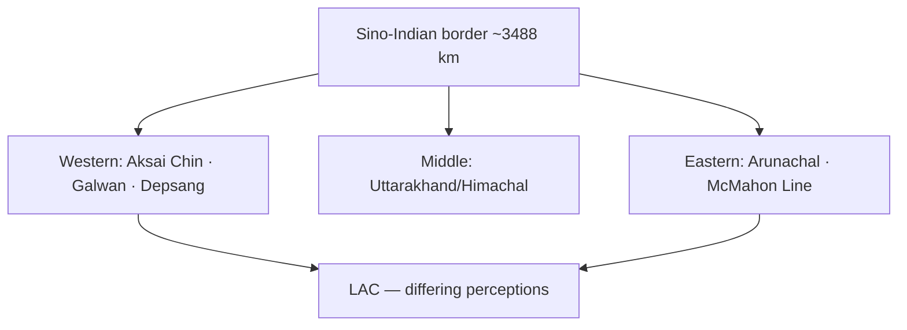
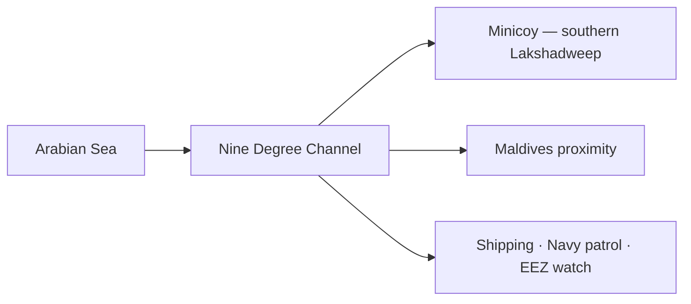

# Sino-Indian Border & Strategic Channels

> GS-1 · Topic 14.2 · Border disputes and strategic maritime channels — Indian subcontinent focus

---

## PYQs

| Year | M | Words | Question (EN) | प्रश्न (HI) | ID |
|------|---|-------|---------------|-------------|-----|
| 2025 | 8 | 125 | Examine the origin, dimensions and implications of Sino-Indian border dispute. | चीन-भारत सीमा विवाद के उद्भव, विस्तार और निहितार्थ का परीक्षण कीजिए। | Q1 |
| 2023 | 8 | — | Write a short note on Nine Number channel and its strategic importance. | नौ नम्बर चैनल के सामरिक महत्व पर एक संक्षिप्त टिप्पणी लिखिए। | Q2 |

---

## Quick Revision

```
SINO-INDIAN DISPUTE ORIGIN (2025):
  Colonial cartography: Johnson Line (1865 Aksai Chin) · McDonald/Macartney Line
  · 1914 McMahon Line (Simla) — Tibet factor · China rejects
  1954 Panchsheel · 1959 Dalai Lama asylum · 1962 War · 1967 Nathu La · 1975 Tulung La

THREE SECTORS:
  Western (Ladakh/Aksai Chin): ~38,000 km² India claims · China controls Aksai Chin · Depsang · Galwan
  Middle (Uttarakhand/Himachal): relatively settled but patrol friction
  Eastern (Arunachal / South Tibet): McMahon Line · Tawang · Asaphila · fish-tail I/II

KEY LINES:
  LAC (Line of Actual Control) — de facto · not mutually agreed maps everywhere
  ≠ IB · ≠ McMahon Line (India claim) · ≠ claim line

POST-1962 DIPLOMACY:
  1993 Agreement · 1996 CBMs · 2005 Political Parameters · Special Representatives (2003+)
  · 2017 Doklam (Bhutan tri-junction) · 2020 Galwan clash · 2022 disengagement phases (partial)

IMPLICATIONS:
  Security: troop buildup · infra race · nuclear backdrop · Pakistan two-front calculus
  Economic: border trade (Nathu La, Lipulekh) limited · investment uncertainty
  Diplomatic: Russia balance · Quad context · BRICS continuity despite friction
  Water: Brahmaputra (Yarlung Tsangpo) · Sutlej · Indus tributaries — data sharing issues

NINE DEGREE CHANNEL (2023):
  Location: 9°N latitude · Arabian Sea · separates Minicoy (southernmost Lakshadweep) from rest
  Width ~200 km · deep-water lane between Lakshadweep atolls and Maldives (Huvadhoo/Kardiva)
  · shipping route Mumbai-Arabian Gulf · Malabar-Suez corridor

STRATEGIC IMPORTANCE:
  Sea lane control · India EEZ surveillance · Androth-Kavaratti-Minicoy chain
  · proximity Maldives (80 nm) — China "String of Pearls" · maritime domain awareness
  · naval patrol · anti-piracy · HADR · submarine transit concern
  · Lakshadweep infra (Minicoy airport, port) — strategic outpost

INSTITUTIONS: WMCC · Special Representatives · ITBP/Army · Indian Navy · Coast Guard · UNCLOS

TRAPS: LAC ≠ agreed boundary | 1962 ≠ only sector | McMahon ≠ accepted by China
  | Nine Degree ≠ Palk Strait | Aksai Chin ≠ Arunachal same dispute type
  | Doklam ≠ in Arunachal (Bhutan tri-junction)
```

---

## Content

### Context — Borders as strategic geography

- **India-China border ~3,488 km (Indian estimate)** — **among longest unsettled borders globally** — **overlaps Himalayan/Tibetan frontier conversion failure**.
- **Maritime chokepoints** around subcontinent — **Nine Degree Channel, Ten Degree Channel, Malacca, Hormuz** — **complement land boundary questions in UPPCS GS-1**.

---

### Sino-Indian border dispute — origin (2025 PYQ)

**Historical roots**

| Phase | Event | Significance |
|-------|-------|--------------|
| **Colonial cartography** | **Johnson Line (1865)** — **Aksai Chin in J&K; McDonald/Macartney lines further north** | **British never unified claim — inherited confusion** |
| **1914 Simla Convention** | **McMahon Line demarcating Tibet-NE India** | **China repudiated — Tibet participation contested** |
| **1950s** | **PRC control of Tibet (1950–51); Panchsheel (1954)** | **India recognized Tibet as part of China — border unsettled** |
| **1959** | **Dalai Lama asylum; Longju/Khizrabe pass clashes** | **Trust collapse** |
| **1962** | **War — Chinese offensives in Aksai Chin & NEFA (Arunachal)** | **Status quo largely frozen post-ceasefire** |
| **Post-1962** | **1967 Nathu La, 1975 Tulung La (Arunachal)** | **Patrol clashes continue episodically** |

**Why dispute persisted**
- **No mutually accepted treaty delimitation** on entire line.
- **Aksai Chin strategically vital to China** (Xinjiang-Tibet highway G219) — **India claims based on Johnson Line**.
- **Eastern sector:** **China claims Arunachal as "South Tibet"** — **especially Tawang (Buddhist monastery link)**.
- **Tibet factor:** **Border tied to Tibet sovereignty and Dalai Lama issue**.

---

### Dimensions — three sectors (2025 PYQ)

#### Western sector (Ladakh / Aksai Chin)

- **Territory:** **India claims ~38,000 km² Aksai Chin; China administers** — **also Depsang Plains, Demchok, Galwan Valley**.
- **LAC segments:** **Multiple differing perceptions** — **patrol points, buffer zones**.
- **2020 Galwan clash:** **First fatalities in 45 years (20 Indian soldiers)** — **changed border management paradigm**.
- **Infrastructure:** **DS-DBO road, bridges, airfields vs Chinese highways, Xiaokang villages**.

#### Middle sector (Uttarakhand, Himachal Pradesh)

- **Relatively quiet** — **Barahoti plains (Uttarakhand) historical grazing disputes**.
- **Less media focus but patrol face-offs occur**.

#### Eastern sector (Arunachal Pradesh)

- **McMahon Line alignment** — **India administers Arunachal; China periodic stapled-visa policy**.
- **Disputed pockets:** **Asaphila, Yangtse, Fish Tail 1 & 2**, **Sumdorong Chu (1987 standoff)**.
- **Cultural:** **Monpa-Buddhist Tawang — symbolic for both sides**.



**Key terminology**

| Term | Meaning |
|------|---------|
| **Claim Line** | **Maximal legal claim on maps** |
| **McMahon Line** | **India's eastern alignment (1914)** |
| **LAC** | **Actual military positions post-1962 — not fully demarcated on ground/maps** |
| **IB** | **Not applicable India-China — no agreed IB** |

---

### Implications (2025 PYQ)

**1. Security & military**
- **Permanent troop deployment, acclimatization regiments, airlift capability**.
- **Nuclear weapons backdrop** — **crisis stability concerns** — **no hotline at tactical level historically weak**.
- **Pakistan dimension** — **two-front collusion fears** — **post-Galwan force reorientation**.
- **CBMs:** **1993, 1996 agreements — patrol norms, flag meetings** — **tested severely 2020**.

**2. Economic & connectivity**
- **Border trade posts (Nathu La, Shipki La, Lipulekh)** — **symbolic volume vs potential**.
- **BCIM corridor stalled** — **trust deficit blocks trans-Himalayan economic integration**.
- **Investment climate in border states affected by uncertainty**.

**3. Diplomatic & geopolitical**
- **Special Representative mechanism (2003)** — **23+ rounds** — **slow progress on framework**.
- **Simultaneous competition & cooperation:** **BRICS, RIC, climate talks continue; Quad adds pressure**.
- **2020–24 disengagement at ** **Galwan, Pangong Tso, Gogra-Hot Springs (partial)** — **Depsang, Demchok pending**.

**4. Environmental & water**
- **Brahmaputra (Yarlung Tsangpo) dam concerns** — **lower riparian anxiety in Assam**.
- **Sutlej, Indus tributaries** — **middle sector glacial sources**.
- **Climate change melting glaciers** — **alters patrol terrain, disaster risk (2023 Sikkim glacial lake outburst)**.

**5. Human & local**
- **Border villages (Chushul, Demchok)** — **dual-use infrastructure, grazing rights curtailed**.
- **Arunachal development vs environmental fragility**.

---

### Nine Degree Channel — geography (2023 PYQ)

**Location & physical character**
- **Nine Degree Channel (also Nine Number Channel)** lies at approximately **9° North latitude** in the **Arabian Sea / Laccadive Sea**.
- **Separates ** **Minicoy Island** (southernmost Lakshadweep) **from the main Lakshadweep archipelago** (Kavaratti, Agatti, Andrott chain to the north).
- **Width roughly 200 km** of open sea — **deep-water passage** between atoll groups.
- **Nearby:** **Maldives (Huvadhoo Atoll / Kardiva Channel)** to the south — **~80 nautical miles from Minicoy**.

**Not to confuse with:**
- **Ten Degree Channel** — **separates Andaman from Nicobar Islands**.
- **Eight Degree Channel** — **Maldives-Mincoy separation (alternative naming in some texts)** — **exam: Nine Degree = Lakshadweep internal separation + approach to Maldives**.

---

### Nine Degree Channel — strategic importance (2023 PYQ)

| Dimension | Importance |
|-----------|------------|
| **Sea lane of communication (SLOC)** | **Mumbai-Kochi-Arabian Gulf shipping routes pass near Lakshadweep chain** — **channel enables north-south naval movement between Arabian Sea sectors** |
| **Maritime surveillance** | **Critical for monitoring surface and sub-surface traffic entering/from ** **Lakshadweep-Maldives gap**** |
| **Lakshadweep defence** | **Minicoy as southern sentinel — airport, potential naval outpost — controls southern approach to India's western island territories** |
| **Maldives proximity** | **Geopolitical competition in IOR — China's Maldives engagement (port, infrastructure) raises Indian Navy patrol priority in channel** |
| **EEZ & fisheries** | **Lakshadweep EEZ ~400,000 km² — illegal fishing, poaching surveillance through channel** |
| **Anti-piracy & HADR** | **Western IOR piracy history — channel part of patrol box; cyclone/disaster response to islands** |
| **Submarine transit** | **Deep water suitable for submerged transit — strategic concern for ASW (anti-submarine warfare) coverage** |
| **Blue economy** | **Security enables sustainable fishing, tourism (Agatti, Bangaram) without external threat** |

**India's responses (context for answer)**
- **Naval bases: INS Dweeprakshak (Kavaratti), patrol craft, MRCC Lakshadweep**.
- **Minicoy helipad/airport upgrades, communication towers**.
- **Mission-based deployments (Op Sankalp off Gulf of Aden linkage via Arabian Sea routes)**.
- **Comprehensive Integrated Maritime Domain Awareness** — **coastal radar chain including islands**.



---

### Other strategic channels (comparative context)

| Channel | Location | Significance |
|---------|----------|--------------|
| **Ten Degree Channel** | **Andaman–Nicobar** | **Connects Bay of Bengal to Andaman Sea — Tri-services ANC HQ Port Blair** |
| **Palk Strait** | **India–Sri Lanka** | **Shallow — Sethusamudram debate; fishing disputes** |
| **Malacca Strait** | **Outside subcontinent but vital** | **~80% Japan/China oil transit — Indian Navy forward presence** |

---

### Contemporary relevance

- **2020 Galwan** — **Ladakh infra permanent; Agnipath-era border regiment reforms**.
- **2023–24 Arunachal naming (standardized toponyms)** — **sovereignty signaling**.
- **2024–25 border trade reopening talks post-COVID closure**.
- **Lakshadweep tourism/infrastructure push (Maldives diplomatic episode 2024)** — **Nine Degree Channel security salience rises**.
- **China's Western Theatre Command vs India's Northern Command alignment**.

### Limits and balanced view

- **Sino-Indian dispute unlikely quick resolution** — **management, not settlement, is realistic near-term**.
- **Economic interdependence ($100bn+ trade) coexists with border friction** — **not pure adversary**.
- **Nine Degree Channel strategic but ** **not a chokepoint like Hormuz** — **importance is IOR surveillance, not global oil gate**.
- **Local island communities depend on safe seas** — **security policy must include livelihoods**.

---

## Answers

### Q1: Origin, dimensions and implications of Sino-Indian border dispute. (2025, 8M, 125W)

**Introduction:**
> **The Sino-Indian border dispute originates in colonial-era cartographic ambiguity and the Tibet question**, **manifesting across western, middle, and eastern Himalayan sectors with enduring strategic implications**.

**Main Points:**
- **Origin** — **Johnson/McMahon lines, 1914 Simla rejection by China, 1959 asylum crisis, 1962 War**.
- **Dimensions** — **Western: Aksai Chin/Galwan; Eastern: Arunachal/McMahon Line; Middle: Uttarakhand pockets**.
- **LAC** — **De facto line, differing perceptions, 2020 Galwan fatalities**.
- **Implications** — **Military buildup, partial disengagement talks, two-front security calculus, stalled BCIM trade**.
- **Non-traditional** — **Brahmaputra water anxiety, climate impacts on glaciated border**.

**Keywords (underline in exam):** LAC · Aksai Chin · McMahon Line · 1962 War · Galwan · Special Representatives · CBMs

**Exam diagram (30 sec):**
```
Origin: colonial maps + Tibet → 1962
Sectors: W (Aksai Chin) · E (Arunachal)
Impact: security · diplomacy · water
```

**Conclusion:**
> **Dispute management through CBMs and SR talks remains imperative** — **unsettled border constrains Asian stability and Indian developmental peripheries**.

---

### Q2: Nine Degree Channel and strategic importance. (2023, 8M)

**Introduction:**
> **The Nine Degree Channel in the Arabian Sea separates Minicoy from the northern Lakshadweep islands**, **forming a strategic maritime gap near the Maldives**.

**Main Points:**
- **Location** — **~9°N latitude, ~200 km open sea between Lakshadweep groups**.
- **SLOC** — **Western shipping routes, Mumbai-Arabian Sea connectivity**.
- **Defence** — **Minicoy southern outpost, naval/coast guard surveillance, EEZ protection**.
- **Geopolitical** — **Maldives proximity, IOR power competition, anti-piracy/HADR**.
- **Sub-surface & fishing control** — **ASW concern, illegal fishing monitoring**.

**Keywords (underline in exam):** Nine Degree Channel · Minicoy · Lakshadweep · EEZ · SLOC · Arabian Sea · Maritime Domain Awareness

**Exam diagram (30 sec):**
```
Lakshadweep north — Nine Degree Channel — Minicoy — near Maldives
→ Navy patrol · shipping · EEZ
```

**Conclusion:**
> **Channel is a ** **maritime sentinel zone for India's western islands** — **vital for IOR security amid growing external presence**.

---

### Q3: *Likely variant:* Line of Actual Control (LAC) vs Line of Control (LoC) — distinguish. (—, 8M, 125W)

**Introduction:**
> **Both are military lines, but LAC separates India-China forces while LoC separates India-Pakistan forces in Jammu & Kashmir**.

**Main Points:**
- **LAC** — **India-China, post-1962 ceasefire, not fully demarcated, Galwan-type clashes**.
- **LoC** — **India-Pakistan, 1972 Simla Agreement, UNMOGIP legacy in PoK context**.
- **Legal status** — **Neither is agreed final international boundary**.
- **Sectors** — **LAC: Ladakh-Arunachal; LoC: J&K only**.

**Keywords (underline in exam):** LAC · LoC · Simla 1972 · 1962 Ceasefire · CBMs

**Exam diagram (30 sec):**
```
LAC = India-China (Himalaya)
LoC = India-Pakistan (J&K)
Both ≠ final boundary
```

**Conclusion:**
> **Confusing the two lines blurs entirely different dispute histories and diplomatic tracks**.

---

## Traps

| Wrong | Correct |
|-------|---------|
| LAC = mutually agreed boundary | **De facto military line — maps differ** |
| McMahon Line accepted by China | **China rejects — claims Arunachal as South Tibet** |
| 1962 war only in one sector | **Chinese offensives in ** **Aksai Chin and NEFA (Arunachal)** |
| Aksai Chin and Arunachal same package deal | **Different sectors, different tactical logic** |
| Doklam in Arunachal | **Bhutan-China-India tri-junction near Sikkim** |
| Nine Degree Channel = Palk Strait | **Arabian Sea Lakshadweep; Palk Strait is India-Sri Lanka** |
| Nine Degree = Ten Degree Channel | **Nine: Lakshadweep-Minicoy; Ten: Andaman-Nicobar** |
| Minicoy part of Maldives | **Indian UT Lakshadweep — near Maldives** |
| Galwan resolved fully | **Partial disengagement; Depsang/Demchok issues remain** |
| Border dispute blocks all trade | **Limited border trade at Nathu La etc. continues episodically** |

---

*Complete.*
