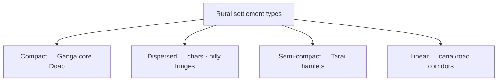

# Rural Settlement Patterns — India & Ganga Plain

> GS-1 · Topic 15.1 · Population and settlements — types and patterns (rural focus)

---

## PYQs

| Year | M | Words | Question (EN) | प्रश्न (HI) | ID |
|------|---|-------|---------------|-------------|-----|
| 2022 | 12 | — | Discuss the factors affecting rural settlement pattern in India. | भारत में ग्रामीण अधिवासों के प्रतिरूप को प्रभावित करने वाले कारकों की विवेचना कीजिए। | Q1 |
| 2021 | 8 | 125 | Discuss the patterns of rural settlements in Gangetic Plain. | गंगा के मैदान में ग्रामीण अधिवासों के प्रतिरूपों की विवेचना कीजिए। | Q2 |
| 2019 | 12 | 200 | Discuss the spatial distribution of types of rural settlements in Ganga Plain. | गंगा मैदान में ग्रामीण अधिवासों के प्रकारों का क्षेत्रीय वितरण की विवेचना कीजिए। | Q3 |
| 2019 | 8 | 125 | Explain the geographical factors which have attracted refugees to settle them in different parts of Uttar Pradesh. | उन भौगोलिक कारकों की व्याख्या कीजिए जिन्होंने शरणार्थियों को उत्तर प्रदेश के विभिन्न भागों में बसने के लिए आकर्षित किया। | Q4 |

---

## Quick Revision

```
RURAL SETTLEMENT = cluster of dwellings where primary occupation agriculture/allied
Types (shape): compact/nucleated · dispersed/scattered · semi-compact · linear (ribbon)

FACTORS INDIA (2022):
  Physical: relief · soil fertility · water (river/well) · climate · drainage
  Economic: crop type · irrigation (canal → linear) · mining/plantations
  Social: caste/joint family · defence · religion (temple-centred nucleus)
  Historical: colonial canal colonies · zamindari estates · railway/road lines

GANGA PLAIN PATTERNS (2021/2019):
  Upper (UP west/Haryana fringe): compact nucleated — fertile Doab, dense population
  Middle (UP-Bihar core): most compact, largest villages — wheat-rice, tube-well
  Lower (Bengal delta): dispersed — waterlogging, chars, embankments
  Tarai/Bhabar fringe: semi-dispersed — forest, drainage issues
  Linear: along Ganga tributaries, canals (Upper Ganga Canal, Eastern Yamuna)

SPATIAL DISTRIBUTION (2019):
  Compact → central alluvial tract (Meerut-Moradabad-Kanpur-Patna belt)
  Semi-compact → transitional margins, rolling Ganga terraces
  Dispersed → flood-prone chars, diara lands, Sundarbans-type eastern fringe
  Linear → road/canal/rail corridors (NCR fringe, Doab canals)

REFUGEE SETTLEMENT IN UP (2019):
  Fertile plain/alluvium — agriculture livelihood (west UP 1947 refugees)
  Canal irrigation colonies — planned peasant resettlement
  Urban-industrial pull — Kanpur, Lucknow, Varanasi
  Border proximity — eastern districts (1971 Bangladesh flows)
  Plain accessibility — no mountain barrier · river water
  Religious/cultural nodes — Varanasi, Ayodhya, Mathura

CONCEPTS: hamlet (dhani) · dispersed in Rajasthan vs Ganga exception
  · nucleated for social cohesion · carrying capacity · site vs situation

TRAPS: Ganga plain ≠ only compact | Dispersed ≠ only hills
  | Linear ≠ only urban | Refugee Q ≠ only Tibetans in UP
  | Settlement pattern ≠ urbanization (different file)
```

---

## Content

### Context — Settlements in human geography

- **Settlement** — **permanent or semi-permanent human habitation** — **rural (primary sector)** vs **urban (secondary/tertiary)**.
- **India ~65% rural population (Census 2011 declining)** — **settlement patterns reflect physical geography + social structure + historical land systems**.
- **Ganga Plain** — **world's densest rural settlement belt** — **UPPCS favourite case study**.

### Types of rural settlements

| Type | Character | Indian example |
|------|-----------|----------------|
| **Compact / nucleated** | **Houses clustered; fields surround village** | **Ganga-Yamuna Doab, Punjab, Kerala pockets** |
| **Dispersed / scattered** | **Farmsteads isolated; one house per holding** | **Meghalaya hills, parts of Kerala, Ganga ** **diara/char** **lands** |
| **Semi-compact** | **Hamlets (toblas/dhanis) cluster loosely** | **Tarai UP, Saurashtra fringes, middle Ganga margins** |
| **Linear / ribbon** | **Stretched along road, canal, river, rail** | **Upper Ganga Canal belt, NH-2 villages, coastal Kerala backwaters** |



### Factors affecting rural settlement pattern in India (2022 PYQ)

**1. Physical / natural factors**
- **Relief** — **Flat alluvium favours compact; hills force dispersion**.
- **Soil fertility** — **Rich khadar/kankar belts support large nucleated villages**.
- **Water availability** — **Riverine (Ganga basin), tank (Deccan), well/tube-well (Punjab-UP)**.
- **Climate & drainage** — **Waterlogged Bengal → dispersed; semi-arid → sparse**.
- **Floods** — **Chars and diara — seasonal dispersion on silt bars**.

**2. Economic factors**
- **Agriculture type** — **Wheat-rice intensive = dense compact; shifting cultivation = scatter**.
- **Irrigation** — **Canal colonies (Ganga Canal 1854) created ** **planned linear and grid settlements****.
- **Plantations/mining** — **Tea (Assam line villages), mica/coal belt patterns**.

**3. Social & cultural factors**
- **Caste & kinship** — **Joint family prefers nucleated defence and shared resources**.
- **Religion** — **Temple/mosque-centred village core**.
- **Security** — **Historical marauding → walled compact villages (Rajasthan forts vs plain openness)**.

**4. Historical & political factors**
- **Zamindari / ryotwari** — **Land tenure shapes field-village geometry**.
- **Colonial infrastructure** — **Railways, canals reorganized habitation linearly**.
- **Land reform & consolidation** — **Alters field size but village site often stable**.

### Rural settlements in Gangetic Plain — patterns (2021 PYQ)

**Physical setting**
- **Young alluvium, flat relief, perennial rivers (Ganga, Yamuna, Ghaghara, Gandak, Kosi)** — **high carrying capacity**.
- **One of highest rural population densities globally** — **UP, Bihar, West Bengal heartland**.

**Dominant pattern: compact nucleated**
- **Fields fan outward; village core has well, pond, temple, panchayat**.
- **Reason:** **Fertile soil, need for cooperative irrigation (synchronised cropping), social cohesion, flood-safe slightly elevated sites (madai)**.

**Regional variations along Ganga**

| Sector | Stretch | Settlement character |
|--------|---------|---------------------|
| **Upper Ganga Plain** | **Uttarakhand plain, west UP Doab** | **Large compact villages; canal-linear offshoots; NCR fringe merging urban** |
| **Middle Ganga Plain** | **East UP, Bihar** | **Very large nucleated villages; highest density; river port ghats (Varanasi, Patna)** |
| **Lower Ganga / Delta** | **West Bengal, Bangladesh fringe** | **Dispersion increases; embankment-linear; chars seasonal** |

**Linear elements in Ganga Plain**
- **Roads (Grand Trunk Road legacy), rail (Howrah-Delhi line), canals (Sarda Sahayak, Eastern Yamuna)** — **ribbon villages, shops, markets**.

### Spatial distribution of settlement types — Ganga Plain (2019 PYQ)

**Compact — core alluvial tract**
- **West UP Doab (Meerut, Muzaffarnagar, Aligarh)** — **wheat-sugarcane, tube-wells**.
- **Awadh-Rohilkhand-Gorakhpur belt** — **dense nucleated habitations**.
- **Bihar plains (Patna, Darbhanga)** — **similar compact morphology**.

**Semi-compact — transitional zones**
- **Tarai-Bhabar (Pilibhit, Kheri, Udham Singh Nagar)** — **forest clearance hamlets**.
- **Ganga terrace edges, slightly undulating Vindhya foothills entering plain**.

**Dispersed — exception zones within plain**
- **Diara and khadar flood tracts** — **seasonal settlement on silt bars**.
- **Waterlogged pockets (north Bihar, Bengal)** — **homesteads on raised plinths scattered**.
- **Recent embankment-protected chars** — **low-density scatter**.

**Linear — infrastructure corridors**
- **Upper Ganga Canal villages (Hardwar-Muradabad belt)**.
- **Highway and industrial corridor Kanpur-Lucknow-NCR**.
- **River ghat settlements stretched along Ganga (Varanasi to Patna)** — **linear riverside morphology**.

**Exam map tip:** **Draw Ganga west→east: compact core widening, dispersion increasing in delta eastward**.

### Geographical factors attracting refugees to UP regions (2019 PYQ)

**Note:** **UP received diverse displaced populations — 1947 Partition refugees, 1971 Bangladesh refugees, Nepalese migrants (open border), smaller Afghan/Rohingya clusters in cities** — **geography explains regional distribution**.

| Region of UP | Geographical pull | Refugee / displaced link |
|--------------|-------------------|--------------------------|
| **West UP (Meerut, Saharanpur, Muzaffarnagar)** | **Fertile Doab, Ganga-Yamuna irrigation, proximity to Delhi-Punjab corridor** | **1947 Punjabi/Hindustani refugees; agricultural resettlement** |
| **Kanpur-Lucknow industrial belt** | **Plain access, rail hub, factory employment** | **Urban refugee rehabilitation, trade skills** |
| **Eastern border districts (Maharajganj, Siddharthnagar, Kheri, Pilibhit)** | **Open Nepal/Tarai interface, forest land availability, sugarcane economy** | **Nepalese migration; 1971 eastern refugee inflows; Tarai settlement** |
| **Religious-cultural centres (Varanasi, Ayodhya, Mathura)** | **River plain habitability + pilgrimage economy** | **Community networks attract co-ethnic/religious displaced groups** |
| **Ganga plain generally** | **Flat land, river water, all-season agriculture vs hills/desert** | **Preferred over Bundelkhand or Vindhya rugged tracts** |

**Push from origin (brief):** **Partition violence, 1971 war, persecution** — **UP's plain geography enabled absorption when combined with kin networks**.

### Contemporary relevance

- **Rurbanization** — **Ganga plain villages near metros morph morphology (G Noida, Varanasi periphery)**.
- **PMGSY roads** — **linear commercial strip development**.
- **Flood climate change** — **dispersion/char settlement risk increasing**.
- **Smart Village / CSC** — **digitizing nucleated village cores**.

### Limits and balanced view

- **Compact ≠ static** — **out-migration hollows some Ganga villages (Purvanchal labour belts)**.
- **Settlement pattern is multi-causal** — **avoid physical determinism alone**.
- **Refugee question is geography + policy** — **not all displacement voluntary settlement**.

---

## Answers

### Q1: Factors affecting rural settlement pattern in India. (2022, 12M)

**Introduction:**
> **Rural settlement patterns — compact, dispersed, linear — result from interplay of physical environment, economy, and social organization**, **nowhere more visible than the Ganga alluvial plain**.

**Main Points:**
- **Physical** — **Relief, soil, water, drainage, flood regime (chars = dispersion)**.
- **Economic** — **Crop intensity, canal irrigation (linear colonies), plantations**.
- **Social** — **Caste, joint family, defence — favour nucleation**.
- **Historical** — **Zamindari, colonial canals/rail, land consolidation**.
- **Regional examples** — **Compact Doab; dispersed Bengal waterlogged; linear Upper Ganga Canal; semi-compact Tarai**.

**Keywords (underline in exam):** Compact · Dispersed · Linear · Nucleated · Irrigation · Alluvium · Canal Colony

**Exam diagram (30 sec):**
```
Physical + Economic + Social → settlement type
India: Ganga compact | hills dispersed | canal linear
```

**Conclusion:**
> **India's rural morphology mirrors its agrarian civilization** — **infrastructure and climate change now reshape traditional patterns**.

---

### Q2: Patterns of rural settlements in Gangetic Plain. (2021, 8M, 125W)

**Introduction:**
> **The Gangetic Plain supports predominantly compact, nucleated rural settlements due to fertile alluvium, dense population, and cooperative agriculture**, **with regional variation from upper Doab to lower delta**.

**Main Points:**
- **Dominant compact pattern** — **Village core + surrounding fields; high population density**.
- **Upper plain** — **Large villages, canal-linear offshoots (west UP)**.
- **Middle plain** — **Largest nucleated settlements (east UP, Bihar)**.
- **Lower/delta fringe** — **Increasing dispersion on chars/waterlogged tracts**.
- **Linear along rivers, GT Road, rail, canals**.

**Keywords (underline in exam):** Gangetic Alluvium · Compact · Nucleated · Diara · Canal Belt · Doab

**Exam diagram (30 sec):**
```
Upper Ganga: compact + canal linear
Middle: largest nucleated villages
Lower: more dispersed (waterlogging)
```

**Conclusion:**
> **Ganga Plain settlements exemplify ** **human adaptation to riverine fertile lowlands** — **among world's densest rural landscapes**.

---

### Q3: Spatial distribution of types of rural settlements in Ganga Plain. (2019, 12M, 200W)

**Introduction:**
> **Types of rural settlements in the Ganga Plain show clear spatial zonation** — **compact nucleated villages dominate the core alluvial tract while semi-compact, dispersed, and linear forms appear at margins and along infrastructure**.

**Main Points:**
- **Compact** — **West-east Doab-Awadh-Bihar core; wheat-rice belt; highest density**.
- **Semi-compact** — **Tarai-Bhabar, terrace margins; hamlet clusters**.
- **Dispersed** — **Diara/char flood tracts, Bengal waterlogged pockets**.
- **Linear** — **Upper Ganga Canal, GT Road, rail corridors, riverside ghats**.
- **Factors** — **Soil, flood, irrigation, historical canal planning explain distribution**.

**Keywords (underline in exam):** Spatial Distribution · Compact · Dispersed · Linear · Tarai · Diara · Upper Ganga Canal

**Exam diagram (30 sec):**
```
Map mental: core=compact | margins=semi/dispersed | canals/roads=linear
West→East along Ganga
```

**Conclusion:**
> **Understanding spatial typology is key to regional planning — floods and infrastructure continue to alter Ganga Plain habitation geography**.

---

### Q4: Geographical factors attracting refugees to different parts of UP. (2019, 8M, 125W)

**Introduction:**
> **Uttar Pradesh's varied geography — especially the fertile Ganga plain, border Tarai, and industrial cities — has attracted refugees and displaced populations to distinct sub-regions**.

**Main Points:**
- **Fertile alluvial plain** — **Agricultural livelihood (west UP 1947 resettlement)**.
- **Canal irrigation zones** — **Peasant colonization capacity**.
- **Urban-industrial plains** — **Kanpur, Lucknow employment for displaced**.
- **Eastern border/Tarai** — **Forest margin, Nepal interface — eastern refugee flows**.
- **River water & flat access** — **Preferred over Bundelkhand rugged tracts**.
- **Cultural-religious centres** — **Varanasi, Ayodhya network effects**.

**Keywords (underline in exam):** Alluvial Plain · Doab · Tarai · Canal Colonies · Partition · 1971 Refugees

**Exam diagram (30 sec):**
```
West UP: Doab agriculture | Kanpur-Lucknow: industry
East border: Tarai | Whole plain: water + flat land
```

**Conclusion:**
> **Geography alone does not explain settlement — but UP's plain heartland has historically enabled refugee absorption when linked to community networks**.

---

## Traps

| Wrong | Correct |
|-------|---------|
| Ganga Plain only has compact settlements | **Dispersed on chars/delta; linear on canals** |
| Dispersed settlements only in hills | **Waterlogged Bengal/diara also dispersed** |
| Linear settlements only urban | **Canal and road ** **rural ribbon villages common** |
| All Indian villages nucleated | **Rajasthan/Kerala contrasts; even within Ganga variation exists** |
| Refugee Q = only Tibetans in UP | **1947 west UP, 1971 east, Nepalese Tarai, urban Afghans** |
| Settlement pattern = same as urbanization | **This is rural morphology; urbanization is demographic shift** |
| Tarai = compact like Doab | **Semi-compact/dispersed due to forest-drainage** |
| Canal colonies = dispersed | **Canal creates ** **linear/planned grid settlements** |
| Ganga settlement unrelated to floods | **Diara/chars are flood-created dispersed forms** |
| Social factors irrelevant | **Caste, joint family strongly favour nucleation in plain** |

---

*Complete.*
