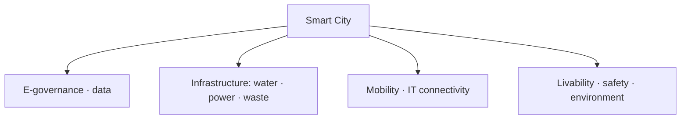

# Smart Cities Mission — India & Eastern UP

> GS-1 · Topic 15.2 · Urbanization — Smart City Mission, characteristics, core infrastructure

---

## PYQs

| Year | M | Words | Question (EN) | प्रश्न (HI) | ID |
|------|---|-------|---------------|-------------|-----|
| 2024 | 8 | 125 | What is smart city? Describe its main characteristics. | स्मार्ट सिटी क्या है? इसकी प्रमुख विशेषताओं का वर्णन कीजिए। | Q1 |
| 2022 | 8 | — | What is 'Smart City Mission'? Discuss the main characteristics of cities of Eastern Uttar Pradesh selected under this scheme. | 'स्मार्ट सिटी मिशन' क्या है? पूर्वी उत्तर प्रदेश में इस योजना हेतु चुने गये नगरों की प्रमुख विशेषताओं की विवेचना कीजिए। | Q2 |
| 2020 | 8 | 125 | What is 'Smart City Mission'? Discuss the main characteristics of cities of Eastern Uttar Pradesh selected under this scheme. | 'स्मार्ट सिटी मिशन' क्या है? पूर्वी उत्तर प्रदेश में इस योजना हेतु चुने गये नगरों की प्रमुख विशेषताओं की विवेचना कीजिए। | Q3 |
| 2018 | 8 | 125 | Enumerate the core infrastructure elements for Smart City development. | स्मार्ट सिटी विकास हेतु मूल अधोसंरचनात्मक तत्व बताए। | Q4 |

---

## Quick Revision

```
SMART CITY MISSION (SCM):
  Launched 25 June 2015 · MoHUA · 100 cities · 5-year mission (extended)
  Goal: sustainable, inclusive cities · quality of life · economic competitiveness
  NOT one-size template — city-specific SPV plans

SELECTION: Challenge rounds (2016–2018) · UP got 12 cities total
  Eastern UP under SCM: Varanasi (Round 1) · Prayagraj/Allahabad (Round 1)
  (Purvanchal core — Gorakhpur NOT selected in SCM)

IMPLEMENTATION MODEL:
  SPV (Special Purpose Vehicle) · PPP · Area-Based Development (ABD) + Pan-City
  ABD: retrofitting · redevelopment · greenfield
  Pan-city: IT connectivity · e-governance for all

CORE INFRA (2018 PYQ — 24 elements grouped):
  Adequate water · electricity · sanitation (individual/group toilets)
  · solid waste management · efficient urban mobility · robust IT connectivity
  · e-governance · citizen participation · safety · health · education
  · identity (heritage/culture) · economy · environment

SMART CITY CHARACTERISTICS (2024):
  Data-driven governance · ICT/IOT · sustainable mobility · clean energy
  · smart utility metering · integrated command centre · livability
  · resilience · inclusive housing · reduced congestion/pollution

VARANASI (Kashi) FEATURES:
  Heritage city · Ganga rejuvenation · Kashi Vishwanath Corridor
  · smart lighting ghats · integrated traffic · tourism e-services
  · waste-to-energy · riverfront development · pilgrimage infrastructure

PRAYAGRAJ FEATURES:
  Kumbh 2019 legacy infra · sangam area development · smart parking
  · water supply augmentation · sewerage · transit for melas
  · religious tourism · flood-resilient planning on Ganga-Yamuna confluence

TRAPS: Smart city ≠ only IT | SCM ≠ 100% new cities | Gorakhpur ≠ SCM city
  | Smart ≠ fully achieved yet — mostly ABD pockets | Pan-city ≠ optional luxury
```

---

## Content

### Context — Urbanization and Smart Cities

- **India urbanizing rapidly** — **~31% urban (2011), projected ~40%+ by 2030** — **cities face water stress, congestion, pollution, informal housing**.
- **Smart City Mission (SCM)** — **flagship urban programme post-AMRUT** — **shift from basic services to ** **integrated, technology-enabled, citizen-centric urbanism****.
- **UP context:** **Most populous state, high urban pressure** — **12 cities selected under SCM** — **Eastern UP focus: Varanasi & Prayagraj**.

### What is a Smart City? (2024 PYQ)

**Definition (conceptual):**
- **A Smart City uses ** **digital technology, data analytics, and sustainable design** to **improve quality of life, optimize resources, and enhance economic opportunities** — **not merely ICT gadgets but ** **integrated urban governance****.

**Main characteristics (2024 PYQ)**

| Characteristic | Explanation |
|----------------|-------------|
| **Citizen-centric governance** | **E-governance, grievance redressal, participatory planning** |
| **ICT & IoT integration** | **Sensors, smart meters, traffic signals, surveillance for management** |
| **Sustainable infrastructure** | **Renewable energy, LED lighting, water recycling, green buildings** |
| **Efficient mobility** | **Intelligent traffic management, public transport, walkability, parking solutions** |
| **Solid waste & water management** | **Segregation, waste-to-energy, 24×7 water, leakage detection** |
| **Safety & resilience** | **Disaster early warning, CCTV, cyber-secure systems, climate adaptation** |
| **Economic vibrancy** | **Smart workforce, tourism, startup zones, heritage economy (Varanasi model)** |
| **Inclusive development** | **Affordable housing, slum redevelopment, universal service access** |



### Smart Cities Mission — overview (2022/2020 PYQ)

**Launch & scope**
- **Announced:** **25 June 2015** — **Ministry of Housing and Urban Affairs (MoHUA)**.
- **Target:** **100 cities** through **City Challenge competition** (rounds 2016–2018).
- **Financing:** **Centre ₹500 crore/city + matching State + convergence (AMRUT, HRIDAY, Swachh Bharat)** — **SPV raises PPP/bonds**.

**Implementation structure**
- **Special Purpose Vehicle (SPV)** — **plan, implement, operate projects**.
- **Two pillars:**
  1. **Area-Based Development (ABD)** — **Retrofitting (old city pockets), Redevelopment (brownfield), Greenfield (new zones)**.
  2. **Pan-City initiative** — **One digital solution for all citizens (e-governance, transport card, utility portal)**.

**Objectives**
- **Improve livability, drive economic growth, enhance sustainability**.
- **Not build new capitals from scratch** — **most Indian smart cities retrofit heritage cores (Varanasi, Prayagraj)**.

### Core infrastructure elements (2018 PYQ)

MoHUA framework lists **24 features** — **grouped for exam as:**

**Essential services**
1. **Adequate water supply** — **24×7, smart metering, leakage control**
2. **Assured electricity** — **Smart grid, solar rooftops, reduced AT&C losses**
3. **Sanitation including solid waste management** — **Door-to-door collection, waste-to-energy, landfill remediation**
4. **Efficient urban mobility and public transport** — **ITS, BRT, last-mile, non-motorized transport**
5. **Affordable housing (especially for poor)** — **PMAY convergence**

**Governance & identity**
6. **Robust IT connectivity and digitalization** — **Fiber backbone, Wi-Fi hotspots**
7. **Good governance especially e-Governance** — **Citizen participation, online services**
8. **Safety and security of citizens especially women, children, elderly**
9. **Health and education** — **Smart clinics, digital classrooms**

**Quality & sustainability**
10. **Mixed land use in area-based development**
11. **Identity and culture** — **Heritage conservation (HRIDAY link)**
12. **Walkability, reduced congestion, reduced pollution**
13. **Safety from disasters (floods, heat)**
14. **Resilience to climate change**

**Exam tip:** **Memorize 5–6 bold headings with one-line explanation each for 125 words answer**.

### Eastern Uttar Pradesh cities under SCM (2022/2020 PYQ)

**Which cities count as "Eastern UP" (Purvanchal)?**
- **Official SCM selections in Purvanchal/eastern belt:** **Varanasi (Round 1, 2016)** and **Prayagraj / Allahabad (Round 1, 2016)**.
- **Note:** **Lucknow, Kanpur, Agra** are **central/western UP** — **do not cite for "Eastern UP" question**.
- **Gorakhpur, Azamgarh, Ballia** — **NOT in SCM 100 list** — **common exam trap**.

#### Varanasi — characteristics under SCM

| Dimension | Features |
|-----------|----------|
| **Identity** | **Ancient heritage/pilgrimage city on Ganga — Kashi Vishwanath Temple Corridor, ghats** |
| **Projects** | **Smart roads, integrated traffic management, smart lighting on ghats, riverfront/assistance to Namami Gange** |
| **Waste & water** | **Solid waste plant, sewerage (Namami Gange convergence), ghat cleanliness** |
| **Tourism & economy** | **Digital tourist information, e-rickshaw integration, heritage walk, craft promotion (Banarasi silk)** |
| **Governance** | **Integrated Command and Control Centre (ICCC), CCTV, grievance app** |
| **Mobility** | **Parking management, congestion reduction in old city core, Kashi Vishwanath access corridor** |

#### Prayagraj (Allahabad) — characteristics under SCM

| Dimension | Features |
|-----------|----------|
| **Identity** | **Sangam city — Kumbh Mela 2019 world-scale urban test** |
| **Projects** | **Water supply augmentation, sewerage treatment, smart roads, riverfront at Sangam** |
| **Kumbh legacy** | **Temporary-to-permanent infra — pontoon bridges experience, crowd management ICT, sanitation at scale** |
| **Mobility** | **Smart parking, traffic plans for melas and daily urban commute** |
| **Environment** | **Ganga-Yamuna pollution abatement, flood-sensitive planning on low-lying confluence zone** |
| **Governance** | **City surveillance, e-governance services, disaster/crowd early warning systems** |

**Comparative point for exam:** **Both are ** **Ganga-front heritage-religious cities** — **SCM focuses on tourism economy + sanitation + traffic in dense old cores**, **not greenfield IT parks alone**.

### Progress, challenges & criticism

- **Implementation slow** — **COVID delays; project cost escalation**.
- **ABD benefits limited pockets** — **whole city not uniformly "smart"**.
- **Gentification risk** — **Old city redevelopment displaces poor**.
- **Data/privacy concerns** — **Surveillance vs civil liberties**.
- **Funding gap** — **SPV revenue models weak in tier-2 religious cities**.

### Contemporary relevance

- **Smart Cities 2.0 / AMRUT 2.0 convergence (2021+)**.
- **National Urban Digital Mission** — **data standards across cities**.
- **Varanasi post-Kashi corridor tourism surge** — **SCM + heritage synergy**.
- **Prayagraj Maha Kumbh 2025 prep** — **smart crowd infra retested**.
- **Climate: Ganga plain heat/flood resilience in SCM plans**.

### Limits and balanced view

- **Smart City ≠ only Wi-Fi and CCTV** — **must deliver water, waste, mobility outcomes**.
- **Eastern UP SCM footprint limited to two cities** — **Purvanchal urban gap (Gorakhpur) remains**.
- **Technology without reform** — **municipal capacity, finance, staffing equally critical**.

---

## Answers

### Q1: What is smart city? Main characteristics. (2024, 8M, 125W)

**Introduction:**
> **A smart city leverages ICT, data, and sustainable urban design to improve livability, governance, and economic efficiency** — **India's Smart Cities Mission adapts this concept to diverse heritage and metro contexts**.

**Main Points:**
- **Citizen-centric e-governance** — **Online services, grievance redressal, participation**.
- **Smart infrastructure** — **24×7 water, assured power, waste segregation, waste-to-energy**.
- **Intelligent mobility** — **Traffic management, public transport integration, reduced congestion**.
- **IT connectivity** — **IoT sensors, smart meters, integrated command centres**.
- **Safety & sustainability** — **CCTV, disaster resilience, green energy, pollution control**.
- **Inclusive & cultural identity** — **Affordable housing, heritage conservation (Varanasi model)**.

**Keywords (underline in exam):** ICT · IoT · E-governance · Sustainable Mobility · Integrated Command Centre · Livability

**Exam diagram (30 sec):**
```
Smart city = tech + governance + infra (water/waste/mobility) + inclusion
```

**Conclusion:**
> **Smart cities aim at ** **efficient, inclusive, and resilient urban life** — **technology is enabler, not substitute for municipal reform**.

---

### Q2/Q3: Smart City Mission + Eastern UP cities characteristics. (2022/2020, 8M, 125W)

**Introduction:**
> **Smart Cities Mission (2015) selects 100 cities for area-based retrofitting and pan-city digital solutions via SPVs** — **in Eastern Uttar Pradesh, Varanasi and Prayagraj exemplify heritage-religious urban smart development**.

**Main Points:**
- **Mission** — **MoHUA, 2015, 100 cities, ABD + pan-city IT, SPV implementation**.
- **Varanasi** — **Ganga ghats, Kashi Vishwanath Corridor, smart lighting/traffic, tourism e-services, waste-water under Namami Gange convergence**.
- **Prayagraj** — **Sangam/Kumbh infra, water-sewerage augmentation, smart parking, crowd management ICT, flood-sensitive confluence planning**.
- **Shared traits** — **Heritage identity, pilgrimage economy, old-city congestion challenge, ICCC governance**.

**Keywords (underline in exam):** SCM · SPV · ABD · Pan-City · Varanasi · Prayagraj · Kumbh · Namami Gange

**Exam diagram (30 sec):**
```
SCM → Eastern UP: Varanasi + Prayagraj
Heritage + Ganga + tourism + sanitation + smart traffic
```

**Conclusion:**
> **Eastern UP smart city projects show ** **culture-led urban modernization** — **scaling beyond pilot areas remains the test**.

---

### Q4: Core infrastructure elements for Smart City development. (2018, 8M, 125W)

**Introduction:**
> **Smart City Mission defines core infrastructure as essential urban systems that ensure livability, sustainability, and economic productivity** — **grouped under services, governance, and environment**.

**Main Points:**
- **Water & electricity** — **Adequate 24×7 supply, smart metering, solar integration**.
- **Sanitation & solid waste** — **Toilets, door-to-door collection, treatment plants**.
- **Urban mobility** — **Efficient public transport, ITS, walkability, parking**.
- **IT & e-governance** — **Digital connectivity, citizen services, transparency**.
- **Health, education, safety** — **Accessible services, disaster resilience, women-child safety**.
- **Identity & environment** — **Heritage preservation, mixed land use, pollution reduction**.

**Keywords (underline in exam):** Water Supply · Sanitation · Solid Waste · Urban Mobility · IT Connectivity · E-governance · Affordable Housing

**Exam diagram (30 sec):**
```
Core: water · power · waste · mobility · IT · safety · housing · environment
```

**Conclusion:**
> **Without these foundational elements, ** **smart branding remains superficial** — **SCM integrates them through SPV-delivered projects**.

---

### Q5: *Likely variant:* Difference between AMRUT and Smart Cities Mission. (—, 8M, 125W)

**Introduction:**
> **AMRUT focuses on basic urban service delivery in 500 cities; SCM targets competitive transformation in 100 selected cities through SPV-led smart solutions**.

**Main Points:**
- **AMRUT** — **Water, sewerage, parks, transport basics — mission-mode service gap filling**.
- **SCM** — **Area-based smart redevelopment + pan-city IT — innovation and competitiveness**.
- **Convergence** — **Same city may use both (Varanasi)** — **complementary not duplicate**.

**Keywords (underline in exam):** AMRUT · SCM · Basic Services · SPV · Area-Based Development

**Exam diagram (30 sec):**
```
AMRUT = basic services (500 cities)
SCM = smart transformation (100 cities)
```

**Conclusion:**
> **India needs ** **both service universalization and smart upgrading** for sustainable urbanization.

---

## Traps

| Wrong | Correct |
|-------|---------|
| Smart city = only IT and Wi-Fi | **Core water, waste, mobility equally mandatory** |
| 100 new cities being built | **Mostly ** **retrofit/redevelop existing cities** |
| Gorakhpur is Smart City | **NOT in SCM list — Varanasi & Prayagraj for Eastern UP** |
| Lucknow counts for Eastern UP Q | **Central UP — cite Varanasi/Prayagraj only** |
| SCM fully completed nationwide | **Many projects delayed/incomplete — partial ABD** |
| Pan-city optional | **Mandatory component alongside ABD** |
| Smart City Mission under Ministry of IT | **MoHUA (Housing & Urban Affairs)** |
| Varanasi SCM only about temple corridor | **Also waste, traffic, ghats, tourism, ICCC** |
| Prayagraj smart city unrelated to Kumbh | **Kumbh 2019 drove major SCM convergence** |
| Core infra excludes health/education | **Included in 24-feature framework** |

---

*Complete.*
