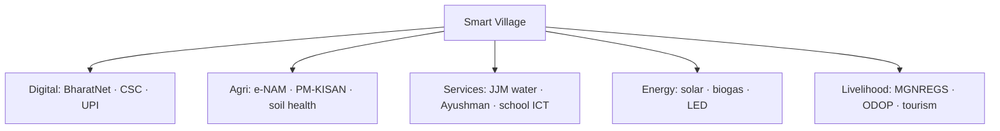

# Smart Villages — India

> GS-1 · Topic 15.3 · Smart villages — concept, features, rural-urban digital integration

---

## PYQs

| Year | M | Words | Question (EN) | प्रश्न (HI) | ID |
|------|---|-------|---------------|-------------|-----|
| 2024 | 12 | 200 | Throw light on the concept of smart village in India and describe the main features of smart village. | भारत में स्मार्ट ग्राम की अवधारणा पर प्रकाश डालिए तथा स्मार्ट ग्राम की प्रमुख विशेषताओं का वर्णन कीजिए। | Q1 |

---

## Quick Revision

```
SMART VILLAGE CONCEPT:
  No single central "Smart Village Mission" like SCM — composite vision
  · Digital India · BharatNet · Common Service Centres (CSCs)
  · Saansad Adarsh Gram Yojana (SAGY) · Rurban Mission (SRUM)
  · PM-KISAN · e-NAM · AgriStack direction · solar/village storage

DEFINITION (exam):
  Technology-enabled, economically vibrant, environmentally sustainable village
  with digital connectivity, quality services, and reduced urban migration pull

MAIN FEATURES (2024):
  Digital connectivity (fiber/BharatNet/Wi-Fi) · CSC/e-governance at doorstep
  · Smart/agri-tech (soil health, drip, drones, e-NAM mandi link)
  · Renewable energy (solar street lights, mini-grids, UJALA)
  · Sanitation (ODF+ · waste management · biogas)
  · Health (Ayushman · telemedicine · sub-centre upgrade)
  · Education (digital classrooms · DIKSHA · skill centres)
  · Roads (PMGSY) · banking (PMJDY · Aadhaar-enabled payments)
  · Water (Jal Jeevan Mission — tap to every household)
  · Livelihood (MGNREGS · ODOP · SHGs · rural haats)

INSTITUTIONS: MoPR · DoAE · MeitY · CSC SPV · State DRDAs · Panchayati Raj

UP LINK: Purvanchal villages · ODOP (Varanasi silk, Kannauj perfume)
  · SVAMITVA (property cards) · Namami Gange village sanitation

TRAPS: Smart village ≠ only Wi-Fi | ≠ opposite of smart city (complementary)
  | No standalone "Smart Village Mission 2015" | SAGY ≠ full smart village alone
  | BharatNet incomplete ≠ concept invalid
```

---

## Content

### Context — Why smart villages?

- **India ~65% rural (2011, declining)** — **urban Smart Cities Mission (2015) risked rural neglect narrative**.
- **Smart Village** — **policy concept bridging ** **Digital India + rural development**** — **reduce digital divide, improve service delivery, stem distress migration**.
- **Unlike SCM:** **No single "Smart Village Mission" with 100-village list** — **convergence of multiple schemes under smart village framework**.

### Concept of smart village in India (2024 PYQ)

**Working definition**
- **A smart village uses ** **digital connectivity and modern infrastructure** to **provide urban-quality services in rural settings** while **preserving agrarian livelihoods and local identity** — **sustainable, inclusive, participatory**.

**Philosophical pillars**
1. **People-centric** — **Panchayat-led planning, SHG participation**.
2. **Technology as enabler** — **Not replacement for agriculture but productivity enhancer**.
3. **Convergence** — **One village, multiple schemes on one platform**.
4. **Complement to smart cities** — **Reduce unnecessary migration; strengthen rurban links**.



### Policy and programme landscape

| Initiative | Smart village link |
|------------|-------------------|
| **Digital India (2015)** | **BharatNet optical fiber to gram panchayats, CSCs as service delivery points** |
| **Common Service Centres (CSCs)** | **One-stop e-governance — certificates, banking, insurance, tele-law in villages** |
| **Saansad Adarsh Gram Yojana (SAGY, 2014)** | **MP adopts village for holistic development model — precursor ideas to smart village** |
| **Shyama Prasad Mukherji Rurban Mission (SRUM)** | **Cluster of villages developed as "rurban" growth centres — smart infra nodes** |
| **Jal Jeevan Mission (2019)** | **Functional household tap connection — core smart utility** |
| **SVAMITVA (2020)** | **Drone mapping property cards — planning & credit access** |
| **PM-WANI (Wi-Fi access)** | **Village data connectivity extension** |
| **Agriculture stack / AgriTech** | **PM-KISAN, soil health card, Kisan drones, e-NAM online mandi** |
| **ODOP / One District One Product** | **Village-level craft/agri value chains (UP: Banarasi silk, Kannauj attar)** |

### Main features of smart village (2024 PYQ)

#### 1. Digital connectivity & e-governance
- **BharatNet fiber to GP, 4G/5G expansion, PM-WANI Wi-Fi hotspots**.
- **CSCs — G2C services: birth/death certificates, PAN, passport apply, bill pay**.
- **UMANG app, DigiLocker, Aadhaar-enabled direct benefit transfer**.
- **Digital panchayat — property tax, grievance, meeting records online**.

#### 2. Smart agriculture & rural economy
- **Soil Health Card, PM-KISAN direct transfer, crop insurance (PMFBY)**.
- **Micro-irrigation (PMKSY), solar pumps, drone spraying (emerging)**.
- **e-NAM — national agriculture market linking village produce to wider mandis**.
- **FPOs (Farmer Producer Organizations), custom hiring centres, agri-extension via KVK apps**.
- **Rural tourism, homestays, ODOP craft clusters**.

#### 3. Energy & environment
- **Solar street lighting, rooftop solar, biogas from cattle waste (GOBARdhan scheme)**.
- **UJJWALA LPG, LED UJALA, energy-efficient pumps**.
- **Solid waste management at GP level, plastic ban enforcement, compost pits**.
- **ODF+ villages under Swachh Bharat Mission — sanitation revolution base layer**.

#### 4. Water & sanitation
- **Jal Jeevan Mission — Har Ghar Jal (tap connection, quality monitoring IoT in advanced pilots)**.
- **Village soak pits, greywater reuse, pond rejuvenation (Amrit Sarovar)**.
- **Community toilets where needed; menstrual hygiene programmes**.

#### 5. Health & education
- **Ayushman Bharat health centres, telemedicine kiosks at CSC/sub-centre**.
- **ASHA/worker digital health stack, vaccine cold chain**.
- **Smart classrooms (DIKSHA portal, digital boards), PM eVIDYA**.
- **Skill India rural centres — plumbing, solar technician, ITES**.

#### 6. Infrastructure & mobility
- **PMGSY all-weather roads, e-mobility pilots (e-rickshaw charging in rurban clusters)**.
- **Housing PMAY-Gramin — pucca houses with electricity connection**.
- **Banking inclusion — BC agents, PMJDY accounts, Aadhaar Payment System**.

#### 7. Governance & social capital
- **Gram Sabha participatory planning, social audit MGNREGS**.
- **SHG-Bank linkage (NRLM), women digital literacy**.
- **Property rights (SVAMITVA) enabling credit and dispute reduction**.

### Smart village vs smart city

| Aspect | Smart Village | Smart City |
|--------|---------------|------------|
| **Focus** | **Agrarian-rural livelihood + services** | **Urban density, mobility, heritage cores** |
| **Mission** | **Converged schemes (no single mission)** | **Dedicated SCM 2015, 100 cities** |
| **Technology** | **Agri-tech, CSC, fiber to GP** | **ICCC, urban ITS, metro integration** |
| **Goal** | **Retain youth, raise rural productivity** | **Global competitiveness, decongest metros** |

### Uttar Pradesh / Ganga plain relevance

- **Purvanchal villages** — **high out-migration; smart village tools (CSC, JJM, PMGSY) target root causes**.
- **ODOP districts** — **Varanasi (silk), Kannauj (perfume), Moradabad (metal craft) — digital marketing + quality certification**.
- **Namami Gange** — **Open defecation free Ganga villages, STPs in towns benefiting riverine hamlets**.
- **SAGY adoption by MPs in UP — model village demonstrations**.

### Contemporary relevance

- **BharatNet Phase III — last-mile fiber push**.
- **AgriStack / digital crop survey** — **farmer registry for smart subsidies**.
- **G20 digital public infrastructure narrative — UPI at village haats**.
- **Climate-smart villages (ICAR-CRIDA concept) — drought-resilient Bundelkhand pilots**.
- **2024 smart village discourse in union/rural budget speeches — convergence emphasis**.

### Challenges & limits

- **Digital divide persists** — **BharatNet delays, low digital literacy among elderly/women**.
- **Scheme fragmentation** — **Without integrated GP plan, "smart" remains patchy**.
- **Power/connectivity reliability** — **Solar helps but maintenance weak**.
- **Risk of cosmetic digitization** — **Wi-Fi board without water/schools is not smart village**.
- **Out-migration** — **Smart village aims to reduce but cannot reverse without local jobs at scale**.

---

## Answers

### Q1: Concept of smart village in India and main features. (2024, 12M, 200W)

**Introduction:**
> **Smart village in India denotes a technology-enabled, service-rich rural community where digital connectivity and modern infrastructure deliver urban-quality governance, health, and livelihood opportunities without abandoning agrarian roots** — **realized through converged schemes rather than a single mission**.

**Main Points:**
- **Concept** — **Digital India + Panchayat Raj + rural development convergence; complement to Smart Cities; reduce divide and distress migration**.
- **Digital connectivity** — **BharatNet, CSCs, PM-WANI, e-governance at doorstep, UPI/DBT**.
- **Smart agriculture** — **PM-KISAN, soil health card, e-NAM, micro-irrigation, FPOs, AgriTech drones**.
- **Water-sanitation-energy** — **Jal Jeevan Mission taps, ODF+, solar street lights, biogas/GOBARdhan**.
- **Health & education** — **Ayushman centres, telemedicine, DIKSHA smart classes, skill centres**.
- **Infrastructure & livelihood** — **PMGSY roads, PMAY-G, SVAMITVA property cards, ODOP crafts, MGNREGS, SHGs**.
- **Governance** — **Gram Sabha participation, social audit, inclusive women-youth digital access**.

**Keywords (underline in exam):** BharatNet · CSC · Jal Jeevan Mission · e-NAM · PM-KISAN · SVAMITVA · ODF+ · Telemedicine · ODOP

**Exam diagram (30 sec):**
```
Smart village pillars:
Digital | Agri | Water/sanitation | Health/education | Roads/livelihood
(scheme convergence at GP level)
```

**Conclusion:**
> **Smart villages aim at ** **sustainable rural transformation** — **success depends on integrated panchayat planning, not isolated Wi-Fi installations**.

---

### Q2: *Likely variant:* Smart village vs Saansad Adarsh Gram Yojana (SAGY). (—, 8M, 125W)

**Introduction:**
> **SAGY is an MP-led holistic village adoption model; smart village is a broader technology-integrated development vision spanning multiple central schemes**.

**Main Points:**
- **SAGY (2014)** — **One village per MP per term; social mobilization, sanitation, education focus**.
- **Smart village** — **Emphasizes digital backbone (BharatNet, CSC), AgriTech, IoT utilities**.
- **Relationship** — **SAGY villages can become smart village pilots through scheme convergence**.
- **Difference** — **SAGY political leadership; smart village technology-service architecture**.

**Keywords (underline in exam):** SAGY · BharatNet · CSC · Convergence · Panchayat

**Exam diagram (30 sec):**
```
SAGY = MP model village (holistic)
Smart village = digital + services convergence (multi-scheme)
```

**Conclusion:**
> **Integrating SAGY social capital with smart village digital infrastructure offers a practical rural upgrade path**.

---

### Q3: *Likely variant:* Role of Common Service Centres in smart villages. (—, 8M, 125W)

**Introduction:**
> **CSCs are the last-mile digital access points making smart village services reachable beyond district headquarters**.

**Main Points:**
- **Services** — **Certificates, banking, insurance, telemedicine, skill training, bill payment**.
- **Reach** — **Lakhs of CSCs across rural India — VLE entrepreneurs**.
- **Smart village link** — **E-governance, financial inclusion, digital literacy hub at GP level**.
- **Challenges** — **Connectivity, VLE viability, quality control**.

**Keywords (underline in exam):** CSC · VLE · Digital India · Last-Mile Delivery · Financial Inclusion

**Exam diagram (30 sec):**
```
Village → CSC → e-governance + banking + telemedicine
```

**Conclusion:**
> **CSCs translate smart village policy into citizen-facing reality at the gram panchayat level**.

---

## Traps

| Wrong | Correct |
|-------|---------|
| Smart Village Mission launched like SCM 2015 | **No standalone mission — ** **convergence concept** |
| Smart village = only internet/Wi-Fi | **Water, health, agri, sanitation equally core** |
| Smart village opposes urbanization | **Complementary — reduces unnecessary migration** |
| SAGY alone equals smart village | **SAGY is one component; smart village needs digital + utilities** |
| BharatNet complete everywhere | **Implementation ongoing — partial coverage reality** |
| Smart village ignores agriculture | **Agri-tech and e-NAM are central features** |
| Only for rich villages | **Aimed at inclusive rural development via DBT/CSC** |
| SVAMITVA unrelated | **Property digitization enables smart planning & credit** |
| ODF not part of smart village | **Sanitation base under Swachh Bharat / ODF+** |
| Smart village only Southern/western states | **National programmes — UP Purvanchal ODOP linkage valid** |

---

*Complete.*
