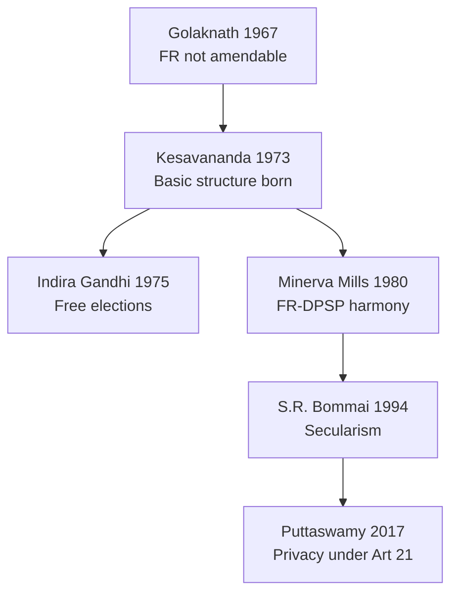

# Indian Constitution — Evolution, Features, Amendments & Basic Structure

> GS-2 · Topic 01 · Historical underpinnings, evolution, features, amendments, significant provisions, basic structure, SC role

---

## PYQs

| Year | M | Words | Question (EN) | प्रश्न (HI) | ID |
|------|---|-------|---------------|-------------|-----|
| 2025 | 12 | 125 | "India's Constituent Assembly was the legal outcome of Parliamentary developments during the Colonial period." Critically examine this statement. | "भारत की संविधान सभा असैनवेतिक काल की संसदीय गतिविधियों का विधिक परिणाम थी।" इस कथन का आलोचनात्मक परीक्षण कीजिए। | Q1 |
| 2025 | 8 | 125 | "Legislature is supreme within its domain, yet it is not sovereign." Examine this statement in the constitutional context with examples. | "विधायिका अपने क्षेत्राधिकार में सर्वोच्च है, तफिर भी वह संप्रभु नहीं है।" इस कथन का उदाहरण सहित संवैधानिक परिप्रेक्ष्य में परीक्षण कीजिए। | Q2 |
| 2024 | 8 | 125 | Write a short note on the composition of the Constituent Assembly. | संविधान सभा की संरचना पर एक संक्षिप्त टिप्पणी लिखिए। | Q3 |
| 2024 | 8 | 125 | How does the Indian Constitution ensure the independence of the judiciary? Discuss the importance of the basic structure doctrine. | भारतीय संविधान न्यायपालिका की स्वतंत्रता कैसे सुनिश्चित करता है? मूल संरचना सिद्धांत के महत्व पर चर्चा कीजिए। | Q4 |
| 2023 | 8 | 125 | Why the Preamble is called the Philosophy of the Indian Constitution? | प्रस्तावना को भारतीय संविधान का दर्शन क्यों कहा जाता है? | Q5 |
| 2023 | 8 | 125 | Why the 42nd Amendment is called a revision of the Indian Constitution? | 42वें भारतीय संशोधन को संविधान का पुनः लेखन क्यों कहा जाता है? | Q6 |
| 2023 | 12 | 200 | Critically examine the increasing powers and role of Prime Minister. How does it impact other institutions? | प्रधानमंत्री की बढ़ती शक्तियों और भूमिका का आलोचनात्मक परीक्षण करें। अन्य संस्थाओं पर इसका कैसे प्रभाव पड़ता है? | Q7 |
| 2022 | 8 | 125 | What are the rights within the ambit of Article 21 of the Indian Constitution? | भारत के संविधान के अनुच्छेद 21 की परिधि में कौन-कौन से अधिकार शामिल हैं? | Q8 |
| 2022 | 12 | 200 | Discuss the evolution and impact of the "Basic structure doctrine" of the Indian Constitution. | भारतीय संविधान के "आधारभूत ढांचा सिद्धांत" के विकास एवं प्रभाव की विवेचना कीजिए। | Q9 |
| 2021 | 8 | 125 | The Preamble of the Constitution affirms the basic features of the Constitution and the promotion of human dignity. Elucidate. | संविधान की उद्देशिका संविधान के आधारभूत लक्षण एवं मानव गरिमा की वृद्धि का प्रतिज्ञान करती है। स्पष्ट कीजिए। | Q10 |
| 2019 | 8 | 125 | The philosophy of Indian Democracy is embodied in the Preamble of the Constitution of India. Explain. | भारतीय लोकतंत्र का दर्शन भारत के संविधान की प्रस्तावना में सन्निहित है। व्याख्या कीजिए। | Q11 |
| 2019 | 12 | 200 | What do you understand by 'Doctrine of Basic Structure'? Analyse its importance for Indian Constitution. | 'आधारभूत ढाँचे का सिद्धांत' से आप क्या समझते हैं? भारतीय संविधान के लिए इसके महत्व का विश्लेषण कीजिए। | Q12 |
| 2019 | 12 | 200 | Examine the Right to Life in the Constitution of India. | भारत के संविधान में जीवन के अधिकार की समीक्षा कीजिए। | Q13 |
| 2018 | 12 | 200 | The action of Indian Government on Article 370 has changed the Status-Quo in Jammu and Kashmir. How will it affect the development in the region? Discuss. | धारा 370 पर भारत सरकार की कार्यवाही ने जम्मू-कश्मीर की यथास्थिति पर परिवर्तन किया है। यह इस क्षेत्र के विकास को किस प्रकार से प्रभावित कर सकता है? चर्चा कीजिए। | Q14 |
| 2018 | 12 | 200 | Examine Right to Equality as a Fundamental Right in the Constitution of India. | भारत के संविधान में समानता के मूलाधिकार की समीक्षा कीजिए। | Q15 |

---

## Quick Revision

```
COLONIAL → CONSTITUTION: 1773 Regulating Act → 1784 Pitt's → 1793/1813/1833 Charters → 1858 Crown rule
  → 1861 Legislative councils → 1892 Indian Councils → 1909 Morley-Minto → 1919 Montagu-Chelmsford
  → 1935 GOI Act (federal blueprint) → 1940 August Offer → 1942 Cripps → 1946 Cabinet Mission
  → 1947 Mountbatten + Indian Independence Act → CA legal child of transfer-of-power sequence

CONSTITUENT ASSEMBLY: Idea 1934 (M.N. Roy) · INC demand 1935 · Nehru 1938 · Cabinet Mission 1946
  Total 389 → 299 after partition | Indirect election by provincial assemblies | Universal adult franchise NOT used
  1st meeting 9 Dec 1946 (Sachchidananda Sinha) · Permanent chairman Rajendra Prasad
  Drafting Committee = Dr. Ambedkar (chair) · Union = Nehru · States = Patel · Advisory = B.N. Rau
  Adopted 26 Nov 1949 · Effective 26 Jan 1950 · 395 Arts (original) · 22 Parts · 8 Schedules (original)

SALIENT FEATURES: Lengthiest written · Blend rigidity/flexibility · Quasi-federal · Parliamentary + responsible govt
  · Integrated judiciary · FR + FD + DPSP · Secular-socialist-democratic-republic (Preamble + 42nd)
  · Single citizenship · Independent institutions (EC, CAG, UPSC)

PREAMBLE: Sovereign Socialist Secular Democratic Republic · Justice (social, economic, political)
  · Liberty (thought, expression, belief, faith, worship) · Equality · Fraternity · 42nd (1976) added Socialist Secular
  · Kesavananda: Preamble amendable but within basic structure · Berubari: not source of power but key to minds of makers

42nd AMENDMENT (1976): "Mini Constitution" — Preamble Socialist/Secular · Art 31C expanded · DPSP primacy clause
  · Art 368 amendment bar raised · Lok Sabha/Rajya Sabha 5→6 years (later reversed by 44th) · Fundamental Duties added (1976 via 42nd, listed in 1979)
  · Courts' review curbed (partially undone by 44th) · Centre strengthened · Emergency-era product

BASIC STRUCTURE (Kesavananda 1973): Parliament cannot destroy identity of Constitution by amendment
  Elements: Supremacy of Constitution · Republican-democratic · Secular · Separation of powers · Federalism
  · Rule of law · Judicial review · FR dignity · Free/fair elections · Art 32 · Limited amending power
  Cases: Golaknath 1967 (FR amend bar — overruled) · Kesavananda 1973 · Minerva Mills 1980 · Indira Gandhi 1975 · S.R. Bommai 1994

SC ROLE: Guardian of Constitution · Art 142 · Judicial review Art 13 · Expanded Art 21 (Maneka, Vishaka, Olga Tellis)
  · Basic structure arbiter · Collegium appointments · PIL (1980s) · Art 370 interpretation (S. 2019–20)

ART 14: Equality before law + equal protection · Reasonable classification · Arbitrariness test (E.P. Royappa, Maneka)
ART 21: Life + personal liberty · Negative + positive rights via SC — dignity, privacy (Puttaswamy), health, environment, speedy trial

LEGISLATURE: Art 245–246 + Sch VII domain supreme BUT bound by FR, DPSP, judicial review, basic structure, constitutional limits
  · Not sovereign like British Parliament — written constitution + judicial review

JUDICIARY INDEPENDENCE: Security of tenure · Salaries from Consolidated Fund · Contempt power · Collegium · Art 124(4) removal hard

ART 370: Temporary special status J&K · Abrogated Aug 2019 (Presidential orders + J&K Reorganisation Act) · UT status
  · Development angle: central schemes, investment, tourism, Ladakh infra — federal integration debate

PM: De facto executive head · Art 74 · Leader of majority · Cabinet dominance · Coordination, foreign policy, appointments
  · Impact: marginalises individual ministers, strengthens PMO, affects President's discretionary space, legislature followership

TRAPS: CA ≠ directly elected · 42nd ≠ only Preamble change · Basic structure ≠ in text · Art 21 ≠ only physical life
  · Legislature ≠ Parliament sovereign · Preamble ≠ enforceable alone · Art 370 repeal ≠ simple majority only debate
```

---

## Content

### Context — what the Constitution is and why colonial lineage matters

The **Indian Constitution** is the **supreme law** of the land — a single written document that creates institutions (Parliament, President, judiciary, Election Commission), distributes power between Union and States, lists citizens' **Fundamental Rights**, and sets the procedure for its own change. It was **adopted on 26 November 1949** and **came into force on 26 January 1950**, replacing colonial sovereignty with a **sovereign democratic republic** where the people, not the Crown or Parliament alone, are the ultimate source of authority.

Understanding this topic requires two linked stories. First, **how British constitutional experiments in India** (1773–1947) created the **legal machinery** — legislative councils, federal blueprints, dominion status — that made a **Constituent Assembly** thinkable and lawful. Second, **how that Assembly and the Constitution it produced broke decisively** from colonial logic — abolishing separate electorates, paramountcy, and restricted franchise — while **borrowing the skeleton** of the **Government of India Act, 1935**. The Constitution is therefore neither a foreign transplant nor a mere continuation of colonial statutes; it is a **transformative republican charter** born through a **legal chain** that it simultaneously superseded. Every subsequent debate — Preamble philosophy, **Article 368** amendments, **basic structure**, **Article 21** expansion, **Article 370** — flows from this founding tension between **continuity and rupture**.

### Colonial constitutional development — Acts, mechanisms, and the road to the Constituent Assembly

British rule did not govern India through one static constitution. It evolved through **Charter Acts** and **Government of India Acts**, each responding to Company crises, Indian nationalism, or war — and each adding a layer of **institutional precedent** that the framers later adapted or rejected.

**Regulating Act, 1773** — The East India Company's territorial expansion and corruption (especially after the **Battle of Plassey, 1757**) forced Parliament to assert control. The Act **centralised administration** under a **Governor-General of Bengal** (first: **Warren Hastings**), created an **Executive Council**, and established the **Supreme Court at Calcutta** — India's first colonial apex court. *Mechanism:* dual authority — Company commercial operations continued, but **Parliament now regulated political administration** — the first step from trading post to governed territory under statutory law.

**Pitt's India Act, 1784** — After Hastings's impeachment, this Act introduced **dual control**: the **Court of Directors** (Company) and a **Board of Control** (British Cabinet). *Mechanism:* the Board could **supervise, revise, and direct** Company policy without daily management — a template for **split executive accountability** that later evolved into **Secretary of State + Governor-General** models.

**Charter Acts (1793, 1813, 1833, 1853)** — These renewed the Company's charter while progressively **widening legislative and administrative reform**. The **1813 Act** allowed **missionary activity** and a **₹1 lakh** annual sum for education — first statutory social obligation. The **1833 Act** made the **Governor-General of Bengal** the **Governor-General of India**, added a **Law Member** to council (helping codification — later the **IPC**), and ended the Company's **commercial monopoly**. The **1853 Act** introduced **open competitive civil service** examinations (Macaulay's merit principle) and extended Company charter by **legislative debate in Parliament** rather than mere renewal. *Why it matters:* each Act **enlarged legislative deliberation** and **centralisation** — habits the Constituent Assembly inherited in institutional form.

**Government of India Act, 1858** — After the **1857 Revolt**, the Crown assumed direct rule. The Act **abolished the East India Company**, transferred assets to the **British Crown**, created the office of **Secretary of State for India** (a Cabinet minister with the **India Council**), and made the **Governor-General** the **Viceroy**. *Mechanism:* India became a **dependency governed by Imperial statute** — the constitutional predecessor to **dominion status** and eventually **republican sovereignty**.

**Indian Councils Act, 1861** — Lord Canning's Act began **legislative devolution**: Viceroy's Executive Council gained **nominated non-official Indian members**; provinces received **legislative powers** through **Governor's Legislative Councils**. *Mechanism:* Indians entered **consultative legislation** without responsible government — a precedent for **representative but not sovereign** bodies like the later **Constituent Assembly's indirect election**.

**Indian Councils Act, 1892** — Expanded councils, introduced **indirect election** elements, and allowed members to discuss **budgets** and address **questions**. *Mechanism:* **functional representation** (landlords, commerce, municipalities) replaced pure nomination — foreshadowing **proportional/indirect** CA election.

**Indian Councils Act, 1909 (Morley-Minto Reforms)** — Introduced **separate electorates** for Muslims (and later extended in practice), enlarged central and provincial legislatures, and allowed **resolutions** on matters of public interest. *Mechanism:* **communal representation by law** — a colonial device the CA **deliberately abolished** in the final Constitution, proving the break from colonial continuity.

**Montagu-Chelmsford Reforms / Government of India Act, 1919** — Implemented **dyarchy** in provinces: subjects divided into **reserved** (Governor + officials — law, police, revenue) and **transferred** (Indian ministers — education, health, local government). The Centre got a **bicameral legislature** (Council of State + Legislative Assembly). The **Montagu Declaration (1917)** promised **"gradual development of self-governing institutions … progressive realisation of responsible government"** — the first official **dominion trajectory**. *Mechanism:* **dual executive at provincial level** — a failed experiment (transferred departments lacked revenue control) but a **laboratory for federal-division thinking** copied in modified form in 1935 and 1950.

**Government of India Act, 1935** — The **longest British constitutional statute on India** and the **primary structural blueprint** for the 1950 Constitution. It provided **provincial autonomy** (dyarchy abolished), a **Federal scheme** (never fully operational — princes did not join), **three legislative lists** (Federal, Provincial, Concurrent — copied in **Schedule VII**), a **Federal Court** (predecessor to the **Supreme Court**), and **Reserve Bank of India** provisions. *Mechanism:* **quasi-federal division of powers** with a **strong Centre** — exactly the model India retained, minus princely paramountcy. Roughly **250 of 395 original Articles** drew from this Act.

**August Offer, 1940** — During WWII, Britain offered **dominion status after the war**, an **expanded Viceroy's Executive Council** with Indian majority, and a **post-war body to frame constitution** — the **Constituent Assembly idea accepted in principle**. *Mechanism:* war bargaining linked **military support** to **future constitution-making** — legal antecedent of the 1946 CA.

**Cripps Mission, 1942** — Sir **Stafford Cripps** proposed **Indian dominion** with right to **secede from Commonwealth**, a **Constitution by Indians** after war, and **immediate Executive Council expansion**. The **Congress rejected** it — demanding immediate **full responsible government** at Centre; the **Muslim League** rejected it — insufficient guarantee for Pakistan. *Mechanism:* failure proved **no constitution without resolving partition and transfer-of-power timing**.

**Cabinet Mission Plan, 1946** — A three-member British Cabinet delegation (**Pethick-Lawrence, Stafford Cripps, A.V. Alexander**) proposed a **Union of India** with **limited Centre** (defence, foreign affairs, communications, currency), **three groups of provinces** (Group B for Muslim-majority northwest, Group C for Bengal-Assam), and a **Constituent Assembly of 389 members**: **292 from British provinces**, **93 from princely states**, **4 from Chief Commissioner provinces** — elected **indirectly** by **provincial assemblies** via **proportional representation** (one seat per roughly **10 lakh** population). *Mechanism:* the CA was **not a revolutionary convention** but a **creature of British constitutional negotiation** — the legal half of the colonial-origin thesis.

**Mountbatten Plan, 1947** — Accepted **partition**; set **15 August 1947** independence for **two dominions**.

**Indian Independence Act, 1947** — The **final colonial statute** creating **India and Pakistan as dominions**, empowering their **Constituent Assemblies** to frame constitutions and legislate until then, and ending **British paramountcy** over princely states. *Mechanism:* the CA became the **dominion's sovereign law-making body** for constitution-framing — legal culmination of parliamentary developments. Yet the CA **used that legal birth** to produce a **republic** (not permanent dominion), **universal adult franchise (Art 326)**, and **Fundamental Rights** — the transformative half that makes the colonial-origin statement **incomplete without critique**.

| Milestone | Mechanism (how it worked) | Legacy for 1950 Constitution |
|-----------|---------------------------|------------------------------|
| **1773 Regulating Act** | Governor-General + Supreme Court under Parliamentary statute | Central executive + apex judiciary template |
| **1919 Dyarchy** | Split provincial executive — reserved vs transferred | Failed experiment; informed later federal design |
| **1935 GOI Act** | Three lists, provincial autonomy, Federal Court | Schedule VII, quasi-federalism, judicial review roots |
| **1946 Cabinet Mission** | 389-member CA, indirect provincial election | CA's legal birth — composition formula |
| **1947 Independence Act** | Dominion CA as constitution-framer | Legal chain ends; republican content begins |


### Constituent Assembly — composition, working, and transformative output

**Origin of the demand** — **M.N. Roy** first proposed a Constituent Assembly in **1934**. The **Indian National Congress** officially demanded one in **1935**. **Jawaharlal Nehru**, in the **Faizpur session (1936)** and more sharply at **Haripura (1938)**, insisted on a CA elected by **universal adult franchise** — a democratic aspiration the actual CA **did not fully meet**. The **Muslim League** initially participated but **boycotted** after the **Direct Action Day (16 August 1946)** violence, leaving many seats vacant.

**Composition and election** — Under the **Cabinet Mission Plan**, total strength was **389**: **292** from British Indian provinces, **93** from princely states, **4** from Chief Commissioner provinces. After **Partition (August 1947)**, membership fell to **299** as Muslim-majority areas left for Pakistan. Members were chosen by **indirect election** — provincial assembly members voted along **proportional representation** (single transferable vote), **not** by direct adult franchise as Nehru wanted. The **Congress held a majority**; the **Muslim League** boycott and slow princely-state participation meant the body was **not fully representative** of all communities at inception, though **284 members** eventually signed the final draft on **26 November 1949**.

**Leadership and committees** — The first meeting was on **9 December 1946** at Constitution Hall, New Delhi; **Sachchidananda Sinha** served as **interim President**; **Dr. Rajendra Prasad** was elected **permanent Chairman**. **B.N. Rau**, Constitutional Adviser, prepared an **initial draft (October 1947)** before committees refined it. Critical committees:

| Committee | Chairperson | Function |
|-----------|-------------|----------|
| **Drafting Committee** | **Dr. B.R. Ambedkar** | Final textual draft — "chief architect" in practice |
| **Union Powers Committee** | **Jawaharlal Nehru** | Division of powers between Union and States |
| **Provincial Constitution Committee** | **Sardar Vallabhbhai Patel** | State constitutional schemes |
| **Advisory Committee on FR, Minorities, Tribal Areas** | **Sardar Patel** | Fundamental Rights and minority safeguards |
| **Steering Committee** | **Rajendra Prasad** | Overall coordination |

**Working method** — The Assembly sat for **eleven sessions** over **two years, eleven months, and eighteen days**. A draft constitution was published in **February 1948** for public comment. Debates were **open, recorded, and voluminous** — Ambedkar's speeches on **social democracy**, **Patel's** on **integration of princely states**, and **Nehru's Objectives Resolution (13 December 1946)** set philosophical direction. The Assembly adopted the Constitution on **26 November 1949**; it contained **395 Articles**, **22 Parts**, and **8 Schedules** (original). **26 January** was chosen as commencement date to honour **Purna Swaraj Day (1930)**.

**Sources and originality** — The CA **borrowed structurally** from the **GOI Act 1935** (federal scheme, lists, office of Governor), the **US** (written FR, judicial review, President as elected head), the **UK** (parliamentary government, cabinet responsibility), **Ireland** (Directive Principles of State Policy), **Canada** (federation with strong centre), and **Australia** (concurrent list, joint sitting). Yet it **rejected** separate electorates, introduced **universal adult franchise**, abolished **untouchability (Art 17)**, and declared India a **Republic** — a **revolutionary break** from colonial constitutional logic despite legal birth under **Cabinet Mission + Independence Act**.

### Salient features — each explained, not merely listed

The Indian Constitution is often called the **world's lengthiest written constitution** because it consolidates **Union, States, and union territories** in one exhaustive document — unlike the US Constitution's brief framework leaving details to statutes. This length reflects **diversity management** — detailed provisions for Scheduled Castes, tribes, languages, emergency, and finance — but also creates **complexity and amendment pressure**.

**Blend of rigidity and flexibility** — **Article 368** creates three amendment routes (detailed below): some changes need only a **simple parliamentary majority** (e.g. altering boundaries under **Art 4**); most need a **special majority** (majority of total membership **plus** two-thirds of members present and voting); changes affecting **federal structure** need special majority **plus ratification by half the States**. This makes the Constitution **more flexible than the US** (where most amendments need super-majority + state ratification) yet **more protected than the UK** (where Parliament is conventionally sovereign).

**Quasi-federalism** — India is **federal in form** (**Schedule VII** lists, **Art 246**, state legislatures, **Art 131** inter-state dispute jurisdiction) but **unitary in spirit** — the Centre retains **residual power (Art 248)**, can legislate on State subjects under **Art 249** (Rajya Sabha resolution), **Art 250** (Emergency), **Art 252** (state-requested Union law), and dismiss state governments under **Art 356** (subject to **S.R. Bommai** judicial review). **Sardar Patel's** integration of princely states and the **strong Centre** design reflect **national unity fears** over pure federalism.

**Parliamentary system with responsible government** — Unlike the US presidential model, India follows the **Westminster pattern**: the **President (Art 52)** is head of state; the **Prime Minister (Art 74–75)** heads the **Council of Ministers** collectively responsible to the **Lok Sabha (Art 75(3))**. The PM must **command majority support** or resign — linking executive survival to legislative confidence.

**Integrated yet independent judiciary** — A **single integrated judicial hierarchy** (**Art 124** Supreme Court, **Art 214** High Courts, subordinate courts) applies **one unified legal system** across States. **Judicial review (Art 13, 32, 226, 227)** lets courts strike down laws violating the Constitution — the **guardian mechanism** for FR and federal balance.

**Fundamental Rights, Directive Principles, and Fundamental Duties** — **Part III (FR)** creates **justiciable** individual liberties enforceable through **Art 32** writs. **Part IV (DPSP)** sets **non-justiciable** socio-economic goals (welfare state, equal pay, village panchayats) guiding legislation. **Part IV-A (Art 51A)** added **ten Fundamental Duties** by the **42nd Amendment (1976)**; the **86th Amendment (2002)** added an **eleventh duty** (parental education obligation for 6–14 age group). Together they form a **rights–duties–welfare triad**.

**Secular state** — The original Preamble did **not** contain the word "Secular" — it was inserted by the **42nd Amendment (1976)**. Secularism in the Indian sense means **state equidistance** from all religions combined with **reform of religious practices** (**Art 25–28**) — affirmed as **basic structure** in **S.R. Bommai (1994)**.

**Single citizenship (Art 5–11)** — Unlike the US dual (state + federal) citizenship, India grants **one citizenship** — reinforcing **national unity** over state sub-nationalism.

**Universal adult franchise (Art 326)** — Every adult citizen votes on equal terms — radical in **1950** when colonial franchise was property- and education-qualified. It realises Preamble **political equality**.

**Independent constitutional bodies** — The **Election Commission (Art 324)**, **Comptroller and Auditor General (Art 148)**, and **UPSC (Art 315)** operate outside direct executive control — ensuring **free elections**, **financial accountability**, and **meritocratic recruitment**.

| Feature | What it means in operation | Why it matters |
|---------|---------------------------|----------------|
| **Lengthiest written** | One document governs Union + States in detail | Unity amid diversity; but heavy amendment load |
| **Quasi-federal** | Division of powers + strong Centre override tools | Holds diverse nation together; risks central dominance |
| **Parliamentary** | PM + Cabinet accountable to Lok Sabha | Responsive government; requires stable majorities |
| **Judicial review** | Courts invalidate unconstitutional law | FR and federalism protection; counter-majoritarian |
| **Art 368 + basic structure** | Amendable but not destructible | Adaptability with identity preservation |

### Preamble — philosophy of the Constitution, each ideal explained

The **Preamble** is the **preface** stating the Constitution's **sources, nature, and objectives**. It declares India a **Sovereign, Socialist, Secular, Democratic, Republic** and resolves to secure **Justice** (social, economic, and political), **Liberty** (of thought, expression, belief, faith, and worship), **Equality** (of status and opportunity), and **Fraternity** (assuring dignity of the individual and unity of the nation).

- **Sovereign** — India is **free from external control** and **internally self-governing** — no British Parliament supremacy. External sovereignty means independent foreign policy; internal sovereignty means law flows from the **Constitution**, not a colonial authority.
- **Socialist** (added **1976, 42nd Amendment**) — Not Soviet-style abolition of private property, but **Indian socialism**: reducing **inequalities in income and status (Art 38)**, public sector in strategic industries, and **welfare legislation** guided by DPSP — Ambedkar's vision of **economic democracy** complementing political democracy.
- **Secular** (added **1976**) — State has **no official religion**; it treats all faiths equally while regulating religious practices for **public order, morality, and health (Art 25–28)**. Distinct from Western **strict separation** — India permits **state intervention in religious social reform** (e.g. abolition of untouchability).
- **Democratic** — Government derives authority from **consent of the governed** through **periodic free elections (Art 326)**, multiparty competition, and **accountability** of executive to legislature.
- **Republic** — Head of state (**President**) is **elected** (indirectly) for a fixed term — not hereditary monarchy. Symbolises **popular sovereignty**.

**Justice — social, economic, political** — **Political justice** = equal political rights (vote, office). **Social justice** = ending caste/gender discrimination (**Art 15–17**, reservations). **Economic justice** = reducing poverty and exploitation — DPSP goals of **living wage, redistribution (Art 39)**. Together they address Ambedkar's warning that **political democracy cannot survive without social and economic democracy**.

**Liberty** — Protects **individual autonomy** against state coercion in thought, speech, religion — operationalised in **Art 19** and **Art 25–28**. Essential for **deliberative democracy** and dissent.

**Equality** — **Formal equality (Art 14)** plus **substantive measures (Art 15–16 reservations)** — not mere identical treatment but **equal citizenship in a hierarchical society**.

**Fraternity** — **Brotherhood across diversity** without forced assimilation — links to **Art 51A(e)** duty to promote harmony and **dignity of women**. Prevents majoritarianism from destroying **unity in diversity**.

**Judicial interpretation** — In **Re Berubari Union (1960)**, the Supreme Court held the Preamble is **"the key to open the minds of the makers"** but **not a source of power** — it cannot override operative articles or justify territorial transfer without legislation. In **Kesavananda Bharati (1973)**, the Court held the Preamble is **part of the Constitution**, **amendable under Art 368**, but amendments must respect **basic structure** — e.g. removing "Secular" or "Democratic" would destroy identity. The Preamble is **generally not independently enforceable** in court — it **orients interpretation** of ambiguous provisions and connects **Part III (FR)**, **Part IV (DPSP)**, and **Part IV-A (duties)** into one philosophical whole.

### Amendment under Article 368 — types, 42nd "Mini Constitution," and 44th rollback

**Article 368** grants Parliament the power to amend the Constitution by adding, varying, or repealing provisions — but this power is **not unlimited** (basic structure doctrine).

**Three amendment types:**

1. **Simple majority** — For matters **outside Art 368** — e.g. admission/establishment of new States (**Art 4** with **Art 2, 3**), creation of legislative councils, Second-Fifth Schedule changes. Same procedure as ordinary legislation.
2. **Special majority** — Majority of **total membership** of each House **plus** majority of **not less than two-thirds of members present and voting** — e.g. **Fundamental Rights**, **DPSP**, **Supreme Court jurisdiction**.
3. **Special majority + ratification by half the States** — For federal core: **election of President**, **extent of Union/State executive and legislative power**, **judiciary (SC/HC)**, **distribution of revenue**, **Art 368 itself**, representation of states in Parliament.

**42nd Constitutional Amendment Act, 1976** — Passed during the **Emergency (1975–77)**, it is called the **"Mini Constitution"** because it altered **59 articles**, **4 schedules**, and the **Preamble** — a **systemic revision**, not a routine tweak:

| Area | What changed | Significance |
|------|--------------|--------------|
| **Preamble** | Inserted **"Socialist"** and **"Secular"** | Identity-level ideological marking |
| **Art 31C** | Expanded immunity — laws giving effect to **Art 39(b)(c)** DPSP shielded from **Art 14, 19** challenge | Shifted FR–DPSP balance toward welfare laws |
| **New DPSP** | **Art 39A** (equal justice/legal aid), **43A** (worker participation), **48A** (environment) | Expanded socio-economic mandate |
| **Art 51A** | **Ten Fundamental Duties** for citizens | New moral obligations — patriotism, environment, scientific temper |
| **Legislative terms** | Lok Sabha/State Assemblies extended from **5 to 6 years** | Emergency-era executive stability |
| **Judicial review** | **Art 368(4–5)** barred courts from reviewing amendments; **Art 31C** widened | Attempted to make Parliament supreme over courts |
| **Centre strengthened** | DPSP given primacy rhetoric over FR in **Art 31C**; Cabinet government emphasis | Federal and rights balance tilted to Centre |

**44th Amendment Act, 1978** — The **post-Emergency corrective** partially **rolled back** the 42nd:

- Restored **5-year terms** for Lok Sabha and State Assemblies (**Art 83, 172**).
- Strengthened **Art 21** during Emergency — no suspension of **right to life and personal liberty** even under **Art 359**.
- Deleted **Art 368(4)** and **368(5)** (court-bar on amendments) — restored **judicial review** of amendments (subject to basic structure).
- Restored balance between **FR and DPSP** — **Minerva Mills (1980)** later struck down parts of expanded **Art 31C** that destroyed **harmonic balance**.

The 42nd/44th pair shows the Constitution's **capacity for both authoritarian drift and self-correction** — central to understanding **amendment politics**.

### Basic Structure Doctrine — case-by-case evolution and impact

The core question: Can Parliament, exercising **Art 368**, amend **Fundamental Rights** out of existence or rewrite the Constitution's identity? The Supreme Court's answer evolved through a **landmark chain**:

| Case | Year | Holding |
|------|------|---------|
| **Shankari Prasad v. Union of India** | 1951 | **FR amendable** under **Art 368**; "law" in **Art 13(2)** does not include constitutional amendments. |
| **Sajjan Singh v. State of Rajasthan** | 1965 | **Affirmed** Shankari Prasad — only **Art 368** procedure binds amendments. |
| **I.C. Golaknath v. State of Punjab** | 1967 | **Overruled** earlier view — **FR not amendable** if amendment **abridges or takes away** rights; **Art 368** is ordinary law. |
| **Kesavananda Bharati v. State of Kerala** | 1973 | **13-judge bench, 7:6** — Parliament can amend **any part** including FR, but **cannot destroy the basic structure/identity** of the Constitution. Response to **24th, 25th, 29th Amendments**. |
| **Indira Gandhi v. Raj Narain** | 1975 | **Free and fair elections**, **rule of law**, **judicial review** = basic structure; struck down **39th Amendment** insulating PM's election from courts. |
| **Minerva Mills v. Union of India** | 1980 | **Harmony between FR and DPSP** is basic structure; **unlimited amending power** (**Art 368(4–5)** from 42nd) **unconstitutional**. |
| **Waman Rao v. Union of India** | 1981 | Basic structure applies **prospectively** from **Kesavananda** date — amendments before **24 April 1973** valid even if they damage structure. |
| **S.R. Bommai v. Union of India** | 1994 | **Secularism** = basic structure; **President's Rule (Art 356)** subject to **judicial review** on constitutional breakdown grounds. |
| **Justice K.S. Puttaswamy v. Union of India** | 2017 | **Privacy** intrinsic to **dignity** under **Art 21** — reinforces FR dignity as basic structure element. |

**Elements frequently identified as basic structure** (non-exhaustive): **Supremacy of the Constitution** · **Sovereign, democratic, republican form** · **Secularism** · **Federalism** · **Separation of powers** · **Rule of law** · **Judicial review** · **Fundamental Rights (especially dignity and equality)** · **Free and fair elections** · **Art 32 (heart and soul — Ambedkar)** · **Limited amending power** · **Independence of judiciary**.

**Impact** — Positively, the doctrine is India's **constitutional firewall** against **Emergency-style over-concentration** — it preserved **judicial review**, **secularism**, and **federal reviewability** when majoritarian politics might erode them. Critics argue it creates **judicial supremacy** over elected branches and an **uncertain, judge-made list** — yet supporters cite **49+ amendments** and **75 years of democratic continuity** as proof of **balanced adaptability**.



### Supreme Court as constitutional evolution engine

Beyond basic structure, the **Supreme Court** is **guardian of the Constitution (Art 124)** through:

- **Judicial review (Art 13, 32, 226)** — Invalidates laws and executive actions violating FR; maintains **Constitution's supremacy** over Parliament and State legislatures.
- **Art 21 expansion** — From **A.K. Gopalan (1950)** narrow "procedure established by law" to **Maneka Gandhi (1978)** requiring **fair, just, reasonable procedure** — importing **due process substance**.
- **Public Interest Litigation (1980s onward)** — **Bandhua Mukti Morcha**, **Olga Tellis**, **Vishaka (1997)** — relaxed locus standi for **marginalised access to justice** and workplace dignity.
- **Art 142** — **Complete justice** power — fills procedural gaps (**Union Carbide/Bhopal** remedial context) without routine legislative substitution.
- **Art 131** — Original jurisdiction in **Centre-State disputes** — federal arbiter.
- **Collegium system** — Evolved from **three judges cases** for **judicial independence** in appointments — contrast with **NJAC struck down (2015)** as violating basic structure of **independent judiciary**.

### Significant provisions — Articles 14, 21, and 370

**Article 14 — Right to Equality** — Guarantees **equality before the law** (British Diceyan concept — absence of special privileges for government) and **equal protection of the laws** (American **14th Amendment** concept — positive duty to treat similarly situated persons alike). The state may classify, but classification must satisfy **reasonable classification**: (**a**) **intelligible differentia** between grouped persons/things, and (**b**) **rational nexus** to the legislative object (**State of West Bengal v. Anwar Ali Sarkar, 1952**). Post-**E.P. Royappa (1974)** and **Maneka Gandhi (1978)**, **arbitrariness** itself violates **Art 14** — the state cannot act capriciously even without explicit discrimination.

**Related equality provisions** — **Art 15** prohibits discrimination on religion, race, caste, sex, place of birth; permits **affirmative action** for women, children, SC/ST, socially backward classes. **Art 16** guarantees **equality of opportunity in public employment** with reservation exceptions. **Art 17** **abolishes untouchability** — enforceable criminal offence — the Constitution's **social revolution clause**. **Art 18** abolishes **hereditary titles** (except military/academic distinctions) — republican equality. **Horizontal application** — **Art 15(2)** and **Art 17** partially reach **private spaces**; the Supreme Court has extended **constitutional morality** through cases like **Sabarimala (2018)** and **Navtej Singh Johar (2018)** on dignity and non-discrimination beyond pure state action.

**Article 21 — Protection of life and personal liberty** — "No person shall be deprived of his life or personal liberty except according to **procedure established by law**." Early jurisprudence (**A.K. Gopalan, 1950**) treated "procedure" as any valid statute. **Maneka Gandhi (1978)** revolutionised it: procedure must be **fair, just, and reasonable** — connecting **Art 14, 19, and 21**. **Francis Coralie Mullin (1981)** held **life** means **life with human dignity**, not animal existence.

**Rights read into Art 21 by the Supreme Court:**

- **Livelihood and shelter** — **Olga Tellis (1985)** — eviction of pavement dwellers without resettlement violates **Art 21**; **Chameli Singh (1996)** — shelter component of right to life.
- **Health and environment** — **Bandhua Mukti Morcha** — bonded labour health; **M.C. Mehta** series — **clean air/water** as life necessities.
- **Speedy trial and legal aid** — **Hussainara Khatoon (1979)** — undertrial prisoners; **legal aid** essential for fair trial.
- **Privacy** — **Puttaswamy (2017, 9-judge bench)** — privacy intrinsic to **dignity and liberty**; governs **Aadhaar, surveillance, data protection**.
- **Education** — **86th Amendment** added **Art 21A** — free compulsory education **6–14 years** — linked to dignified life.
- **Death penalty** — **Bachan Singh (1980)** — death only in **"rarest of rare"** cases; life is the default, death the exception.
- **Dignified death debate** — **Common Cause (2018)** — **passive euthanasia** guidelines and **living wills** within dignity framework.
- **Handcuffing, solitary confinement** — **Sunil Batra**, **D.K. Basu** — procedural safeguards against custodial abuse.

**Art 22** complements **Art 21** with **preventive detention safeguards** — limits on arbitrary arrest beyond FR core.

**Article 370 — Jammu & Kashmir** — Inserted as **"temporary provision"** (marginal note), it granted J&K **special autonomy**: a separate **Constitution (1957)**, its own flag, and restricted Union legislative power — Parliament could legislate on matters in **Union and Concurrent Lists** only with **State Government concurrence** (via **Presidential Order under Art 370(1)**). It embodied **asymmetric federalism** for accession conditions.

**Abrogation (August 2019)** — The Union government used **Presidential Order C.O. 272** (replacing "Constituent Assembly" with "Legislative Assembly" in **Art 370(3)** interpretation) and **C.O. 273**, followed by the **Jammu and Kashmir Reorganisation Act, 2019**, bifurcating the state into **UT of J&K** (with legislature) and **UT of Ladakh** (without legislature). **Art 370** was effectively read down — ending special status and extending **central laws uniformly** (GST, RBI, IPC, welfare schemes).

**Development implications** — Proponents argue integration enables **central schemes** (**Ayushman Bharat, PM Awas Yojana, PMGSY/highways/rail projects**), **private investment**, **tourism revival**, and **Ladakh renewable energy** potential. Critics cite **security disruptions, investor confidence** needs, **internet shutdowns (2019)** hurting economy, and **federal/democratic representation** concerns — sustainable development requires **local institutions** (Assembly elections **2024** restored some voice) and **law-and-order stability**, not legal integration alone.

### Legislature — supreme within its domain, yet not sovereign

**Article 245** empowers Parliament to make laws for the **whole or any part of India**; State legislatures for their states. **Article 246** read with **Schedule VII** allocates subjects across **Union List, State List, and Concurrent List** — within its allotted field, each legislature is **supreme**: courts do not substitute **policy choices** (tax rates, criminal penalties within constitutional bounds) for legislative judgment.

Yet Indian legislatures are **not sovereign** like the **British Parliament** (which can make or unmake any law — no written constitutional limit):

1. **Written Constitution** — **Part III FR**, **Part IV DPSP**, and **Emergency provisions (Part XVIII)** bind law-making.
2. **Judicial review** — **Art 13** voids laws inconsistent with FR; **Art 32/226** provide remedies; **Kesavananda** and **Minerva Mills** limit even **constitutional amendments**.
3. **Federal limits** — States have **exclusive** State List fields; Centre's **Art 249, 250, 252, 356** overrides are **exceptions**, not proof of unlimited central sovereignty.
4. **Constitutional morality and procedure** — **10th Schedule (anti-defection)**, **due process under Art 21**, and **international treaty obligations** constrain raw legislative will.
5. **Basic structure** — Parliament cannot amend itself into **unlimited power** — the **42nd's Art 368(4–5)** was struck down in **Minerva Mills**.

*Example:* Parliament is **supreme** on **defence (Union List)** — it alone declares war and allocates military budget. It is **not sovereign** to suspend **Art 21 life protection** permanently or abolish **judicial review** — those would destroy constitutional identity.

### Independence of the judiciary — constitutional safeguards

| Provision | How it ensures independence |
|-----------|----------------------------|
| **Art 124(2)** | President appoints SC judges after **consultation** — evolved into **Collegium** (judges appoint judges) |
| **Art 124(4)** | Removal only by **impeachment** — proved misbehaviour/incapacity — **special majority** in both Houses — extremely difficult |
| **Art 121** | No parliamentary debate on judge conduct except during **impeachment** — protects bench dignity |
| **Salaries** | Charged on **Consolidated Fund of India** — not subject to **parliamentary vote** — financial insulation |
| **Art 50 (DPSP)** | Directs **separation of judiciary from executive** — independent judicial service |
| **Art 129–130** | SC **contempt power** — upholds authority against intimidation |
| **Art 142** | **Complete justice** — enables effective remedies without routine legislative encroachment |

**Basic structure linkage** — **Kesavananda** and **Minerva Mills** protect **judicial review** and **independence of judiciary** from amendment. The **99th Amendment / NJAC Act** was **struck down (2015)** — Collegium restored as better preserving independence (debated, but current law).

### Prime Minister — growing role and institutional impact

Constitutionally, the **Prime Minister** is **head of government (Art 74–75, 78)** — leader of the **Council of Ministers** who **advises the President**; de facto **chief executive** versus the President's **de jure ceremonial head-of-state** role. The PM must **command majority in Lok Sabha (Art 75(3))** or resign.

**Sources of PM power** — **Electoral majority**, **party leadership**, **Cabinet Committee system** (security, economic, political affairs funnel decisions to PM), **PMO coordination** across ministries, **appointment influence** (Governors, CVC, key commissions), **foreign policy leadership**, and **crisis management**. The **coalition era (1989–2014)** initially **checked PM dominance** through alliance partners and regional parties; **single-party majorities (2014, 2019)** recentralised decision-making in the **PMO**, reinforced by **media and electoral presidentialisation**.

**Impact on other institutions:**

- **President** — Formal **pocket veto** and **discretionary powers (Art 356, 75)** exist, but **real discretion narrows** when PM holds stable majority.
- **Cabinet** — **Collective responsibility (Art 75(3))** remains formal doctrine, but **PM dominance** can reduce **individual minister autonomy** — "PMO-centric" governance.
- **Parliament** — **Anti-defection (10th Schedule)** plus strict **party whips** strengthen **executive control of legislative agenda** — law-making follows PMO priorities.
- **Bureaucracy** — PMO-led **project monitoring** (infrastructure, DBT welfare) improves coordination but risks **over-centralisation**.
- **Judiciary and federal units** — Tension when **majoritarian mandates** meet **judicial review**; **S.R. Bommai** and **GST Council politics** remain checks; **basic structure** buffers authoritarian drift.

**Critical balance** — PM centrality enables **decisive governance** in a diverse nation, but vigilance is needed so **Cabinet, Parliament, and federal diversity** are not reduced to nominal forms.

### Significance and limits — a balanced view

**Significance** — The Constitution is the **operating manual of the world's largest democracy** — it has absorbed **49+ amendments**, survived the **Emergency (1975–77)**, managed **linguistic reorganization**, **coalition politics**, and **regional assertion** through **flexibility (Art 368)** plus **judicial guardrails (basic structure)**. It converted a **colonial subject** into a **rights-bearing republic** with **universal franchise from inception** — historically remarkable.

**Limits and criticism** — (**1**) **Length and complexity** invite frequent amendment and litigation. (**2**) **Colonial carryover** — IPC (1860), police acts, bureaucratic culture — partially unreformed. (**3**) **Basic structure vs parliamentary supremacy** — theoretical tension unresolved; critics see **judicial overreach**, defenders see **democratic preservation**. (**4**) **Money Bill (Art 110)** controversies — bypassing Rajya Sabha. (**5**) **Schedule IX** — land reform immunity from judicial review (post-**I.R. Coelho, 2007** partially narrowed). (**6**) **Pending judicial appointments** and **case backlog** — gap between **independence rhetoric and institutional reality**.

### Contemporary relevance

- **Constitution Day (Samvidhan Divas, 26 November)** — Ministry of Parliamentary Affairs campaigns like **"Hamara Samvidhan, Hamara Swabhiman"** promote **civic constitutional literacy** — linking founding values to everyday citizenship.
- **NEP 2020** — Integrates **constitutional values**, **Fundamental Duties (Art 51A)**, and **democratic participation** into curricula — connecting Preamble philosophy to **education policy**.
- **Digital governance** — **e-Courts**, **National Judicial Data Grid**, **Digital India** — **Art 21 access-to-justice** dimension; **Puttaswamy** privacy framework shapes **Aadhaar and data protection** law.
- **One Nation One Election debate** — Proposed simultaneous polls touch **federal electoral cycles (Art 83, 172)**, **anti-defection dynamics**, and whether alteration affects **basic structure** of **federalism** and **fixed terms**.
- **J&K post-2019** — Expansion of **central sector schemes**, **investment summits**, **Ladakh renewable projects**, **tourism infrastructure** — development narrative contested by **representation and federal integration** debates.
- **Basic structure in live debates** — **103rd Amendment (EWS quota)**, **CAA/NRC challenges**, **tribunal reforms**, **NJAC rejection (2015)** — Supreme Court remains **final interpreter** of constitutional identity.
- **42nd/44th legacy** — FR–DPSP balance still frames **welfare vs liberty** tensions — **surveillance, UAPA scrutiny**, environmental regulation under **Art 21**.

---

## Answers

### Q1: "India's Constituent Assembly was the legal outcome of Parliamentary developments during the Colonial period." Critically examine. (2025, 12M, 125W)

**Introduction:**
> The Constituent Assembly (1946–49) was legally anchored in colonial constitutional law, yet it exercised transformative sovereignty beyond mere continuity of British statutes.

**Main Points:**
- **Colonial legal lineage** — **Cabinet Mission Plan (1946)** and **Indian Independence Act, 1947** created/empowered the CA as the **lawful body** to frame the Constitution.
- **Parliamentary evolution** — Sequence from **1919 Dyarchy**, **1935 GOI Act**, **1940 August Offer**, **1942 Cripps** shows **gradual transfer** of constitution-making authority.
- **Not mere continuation** — CA **rejected paramountcy**, adopted **universal adult franchise** in the final Constitution, and **abolished separate electorate** — breaks colonial logic.
- **Composition limits** — **Indirect election**, **Congress dominance**, **League boycott** — not fully representative of all communities at start.
- **Transformative function** — **Dr. Ambedkar's** Drafting Committee produced a **republican** document, not a dominion patch on **1935 Act** alone.
- **Partition effect** — Membership fell **389 → 299**; new dominion legislatures **validated** CA's work — legal but politically reconfigured.
- **Balanced verdict** — Statement is **partially valid** as **legal outcome**; **incomplete** without acknowledging **revolutionary break** from colonial sovereignty.

**Keywords (underline in exam):** Constituent Assembly · Cabinet Mission · Indian Independence Act 1947 · GOI Act 1935 · Transformative constitution · Colonial continuity

**Exam diagram (30 sec):**
```
Colonial Acts → Cabinet Mission → Independence Act → CA → Constitution 1950
                     ↑ legal chain          ↑ break: sovereignty + FR + republic
```

**Conclusion:**
> The CA was legally born of colonial parliamentary developments but politically and morally founded a sovereign republic — making the statement **half-true** without critical nuance.

---

### Q2: "Legislature is supreme within its domain, yet it is not sovereign." Examine with examples. (2025, 8M, 125W)

**Introduction:**
> In India's written constitutional order, Parliament and State Legislatures enjoy **domain supremacy** under Schedule VII but remain **bounded** by higher constitutional law.

**Main Points:**
- **Domain supremacy** — **Art 245–246** + **Schedule VII** — Parliament supreme on **Union List** (e.g. defence, foreign affairs); states on **State List**.
- **Not sovereign — written limits** — **Fundamental Rights (Part III)** restrict law-making; **Art 13** renders inconsistent laws **void**.
- **Judicial review** — **Art 32/226** — e.g. **Kesavananda**, **Minerva Mills** — courts strike down laws/amendments.
- **Basic structure cap** — Parliament cannot amend Constitution to **destroy its identity** — limits even **Art 368**.
- **Federal bounds** — States' **exclusive** fields; Centre's override (**Art 249, 356**) is **exception**, not unlimited sovereignty.
- **Constitutional morality** — **Anti-defection**, **due process** under **Art 21**, **international treaties** constrain raw legislative will.

**Keywords (underline in exam):** Domain supremacy · Schedule VII · Judicial review · Basic structure · Art 368 · Written constitution

**Exam diagram (30 sec):**
```
Legislature → makes law in its List (supreme)
     ↓ bounded by
FR · Judicial review · Federalism · Basic structure
```

**Conclusion:**
> Indian legislatures are **legally supreme in allotted spheres** but **constitutionally non-sovereign** — unlike the unwritten British Parliament model.

---

### Q3: Write a short note on the composition of the Constituent Assembly. (2024, 8M, 125W)

**Introduction:**
> The Constituent Assembly (1946–49) was constituted under the **Cabinet Mission Plan** to frame India's Constitution through indirect provincial representation.

**Main Characteristics:**
- **Total strength** — Originally **389** (292 provinces + 93 princely states + 4 Chief Commissioner provinces); **299** after **Partition (1947)**.
- **Method of election** — **Indirect** by members of **provincial legislative assemblies** — not direct adult franchise.
- **Proportional representation** — Seats allocated by **population**; one seat per roughly **10 lakh** people formula.
- **Party composition** — **Congress majority**; **Muslim League** boycotted after **Direct Action**; princely states joined unevenly.
- **Leadership** — Chairman **Dr. Rajendra Prasad**; **Drafting Committee** chaired by **Dr. B.R. Ambedkar**.
- **Duration** — First met **9 Dec 1946**; adopted Constitution **26 Nov 1949**; **284 members signed** final draft.
- **Limitation** — Not fully **representative** of all groups initially, yet achieved **broad consensus** post-Partition.

**Keywords (underline in exam):** Cabinet Mission · 389/299 members · Indirect election · Rajendra Prasad · Ambedkar · December 1946

**Exam diagram (30 sec):**
```
Provincial Assemblies → elect → CA (292+93+4)
Partition → 299 | Drafting Committee → Ambedkar
```

**Conclusion:**
> Despite indirect election and Partition, the CA's composition enabled India's **consensus-based constitutional founding**.

---

### Q4: How does the Indian Constitution ensure independence of the judiciary? Discuss importance of basic structure doctrine. (2024, 8M, 125W)

**Introduction:**
> Judicial independence is structurally embedded in Parts III and V, while the **basic structure doctrine** prevents legislative erosion of constitutional identity.

**Main Points:**
- **Security of tenure** — Judges of SC/HC removed only by **impeachment** (**Art 124(4)**) — difficult special majority procedure.
- **Financial independence** — Salaries charged on **Consolidated Fund**; not subject to **parliamentary vote**.
- **Art 121** — Restricts parliamentary criticism of judges except in **impeachment** — protects dignity of bench.
- **Separation from executive** — **Art 50** (DPSP) mandates separate judiciary; **Art 50** + institutional practice.
- **Basic structure importance** — **Kesavananda (1973)** — **judicial review**, **rule of law**, **FR dignity** cannot be amended away.
- **Checks authoritarianism** — **Minerva Mills**, **S.R. Bommai** — prevents **42nd-style** concentration destroying **constitutional balance**.
- **Contemporary role** — Guards **NJAC-type** reforms that compromise **appointments independence**; preserves **Art 32** access.

**Keywords (underline in exam):** Art 124 · Impeachment · Consolidated Fund · Kesavananda · Judicial review · Basic structure

**Exam diagram (30 sec):**
```
Tenure + Salary + Art 121 → Independence
Basic structure → shields review + Art 32 from amendment
```

**Conclusion:**
> Structural safeguards secure day-to-day independence; **basic structure** secures the **long-term survival** of an independent judiciary.

---

### Q5: Why is the Preamble called the Philosophy of the Indian Constitution? (2023, 8M, 125W)

**Introduction:**
> The Preamble encapsulates the **values, objectives, and identity** that permeate the operative text of the Constitution.

**Main Characteristics:**
- **Identity declaration** — **Sovereign, Socialist, Secular, Democratic, Republic** — defines nature of Indian state.
- **Justice trinity** — **Social, economic, political** — mirrors **DPSP** and **Ambedkarite equality** vision.
- **Liberty cluster** — Thought, expression, belief, faith, worship — aligns with **Fundamental Rights**.
- **Equality and fraternity** — **Dignity** and **unity** — bridges **Part III** and **citizenship duties (Art 51A)**.
- **Key to interpretation** — **Berubari**, **Kesavananda** — guides reading of ambiguous articles.
- **Not enforceable alone** — Philosophy orienting **law and institutions**, not standalone justiciable rights.
- **42nd Amendment** — Added **Socialist, Secular** — philosophy updated yet bounded by **basic structure**.

**Keywords (underline in exam):** Philosophy · Justice · Liberty · Equality · Fraternity · Kesavananda · Socialist Secular

**Exam diagram (30 sec):**
```
Preamble → Justice / Liberty / Equality / Fraternity
         ↓ guides
Part III FR · Part IV DPSP · Institutions
```

**Conclusion:**
> The Preamble is the Constitution's **moral compass** — declaring ends that give meaning to its legal means.

---

### Q6: Why is the 42nd Amendment called a revision of the Indian Constitution? (2023, 8M, 125W)

**Introduction:**
> The **42nd Amendment Act, 1976** altered multiple foundational features so extensively that scholars term it a **"Mini Constitution."**

**Main Characteristics:**
- **Preamble change** — Inserted **Socialist** and **Secular** — identity-level revision.
- **Fundamental Duties** — Added **Art 51A** — new chapter of citizen obligations.
- **DPSP expansion** — **Art 39A, 43A, 48A**; widened **Art 31C** — shifted **FR–DPSP balance**.
- **Legislative terms** — Extended **Lok Sabha/Assemblies** to **6 years** (later **44th** restored **5**).
- **Judicial review curbed** — Attempted to insulate amendments and DPSP laws from **court scrutiny** — partly undone.
- **Centre strengthened** — Federal balance tilted toward **Union** during **Emergency** context.
- **Scale of change** — **Wide multi-article overhaul** — not routine amendment but **systemic rewrite**.

**Keywords (underline in exam):** 42nd Amendment · Mini Constitution · Art 51A · Art 31C · Socialist Secular · Emergency 1976

**Exam diagram (30 sec):**
```
42nd → Preamble + Art 51A + Art 31C + terms + review curbs
44th → partial rollback (FR balance, 5-year term)
```

**Conclusion:**
> Its breadth across **identity, rights, duties, and federal-judicial relations** justifies calling the 42nd a **constitutional revision**, not a minor amendment.

---

### Q7: Critically examine increasing powers and role of PM. Impact on other institutions? (2023, 12M, 200W)

**Introduction:**
> The Prime Minister, as **head of government** under **Art 74–75**, has grown from **first among equals** toward **central executive hub** — especially under stable majorities.

**Main Points:**
- **Constitutional base** — **Leader of majority** in Lok Sabha; advises **President**; chairs **Cabinet** and **Cabinet Committees**.
- **PMO expansion** — **Coordination, monitoring, appointment influence** — cross-ministry decision funnel.
- **Electoral presidentialisation** — **Media campaigns** centre on PM candidate — strengthens **personal mandate**.
- **Impact on President** — **Formal head** retains **pocket veto** rarely; **real power** flows to PM in majority eras.
- **Impact on Cabinet** — **Collective responsibility (Art 75(3))** maintained formally; **individual minister discretion** may shrink.
- **Impact on Parliament** — **Anti-defection (10th Schedule)** + **whip** → **executive dominance** over law-making agenda.
- **Impact on bureaucracy/regulators** — **PMO-led project push** (infrastructure, welfare DBT) — efficiency vs **over-centralisation** risk.
- **Critical balance** — **Judiciary/basic structure** and **federal units** remain checks — **S.R. Bommai**, **GST Council** politics.

**Keywords (underline in exam):** Art 74 · PMO · Collective responsibility · Anti-defection · De facto executive · Institutional balance

**Exam diagram (30 sec):**
```
PM (majority) → PMO + Cabinet C'ttees → Parliament followership
              ↓ tension with
President (formal) · Courts · States
```

**Conclusion:**
> PM centrality enhances **decisive governance** but demands vigilance so **Cabinet, Parliament, and federal diversity** are not reduced to nominal forms.

---

### Q8: What are the rights within the ambit of Article 21? (2022, 8M, 125W)

**Introduction:**
> **Article 21** protects **life and personal liberty** against arbitrary state action — expanded by the Supreme Court into a **bundle of dignified existence**.

**Main Characteristics:**
- **Core text** — No deprivation except by **procedure established by law** — **Gopalan → Maneka** evolution to **fair procedure**.
- **Right to live with dignity** — **Maneka Gandhi (1978)**, **Francis Coralie** — life means more than animal existence.
- **Livelihood & shelter** — **Olga Tellis (1985)** — pavement dwellers; **Chameli Singh** — shelter component.
- **Health & clean environment** — **M.C. Mehta** cases — pollution control under **Art 21**.
- **Speedy trial & legal aid** — **Hussainara Khatoon** — undertrial rights; **legal aid** as essential justice.
- **Privacy** — **Puttaswamy (2017)** — intrinsic to **dignity and liberty**.
- **Education** — **Art 21A** (2002 amendment) — **6–14 years** free compulsory education linked to **life with dignity**.

**Keywords (underline in exam):** Art 21 · Maneka Gandhi · Dignity · Privacy · Livelihood · Speedy trial · Art 21A

**Exam diagram (30 sec):**
```
Art 21 → Life + Liberty
       → dignity · health · environment · privacy · trial · education
```

**Conclusion:**
> Art 21 is the Constitution's **dynamic heart** — enabling the SC to read **social and economic dimensions** into **personal liberty**.

---

### Q9: Discuss evolution and impact of Basic Structure Doctrine. (2022, 12M, 200W)

**Introduction:**
> The **basic structure doctrine** (**Kesavananda Bharati, 1973**) holds that Parliament's amending power under **Art 368** cannot destroy the Constitution's **core identity**.

**Main Points:**
- **Evolution** — **Shankari Prasad** (FR amendable) → **Golaknath (1967)** (FR not amendable) → **Kesavananda** (middle path — amend but not destroy identity).
- **Elements** — **Supremacy, democracy, secularism, federalism, rule of law, judicial review, FR dignity, free elections, Art 32**.
- **Indira Gandhi case (1975)** — **Free and fair elections** part of basic structure — struck down **39th Amendment**.
- **Minerva Mills (1980)** — **Harmony FR–DPSP**; unlimited amendment power **unconstitutional** — curbed **42nd**.
- **S.R. Bommai (1994)** — **Secularism** enforced; **President's Rule** subject to **judicial review**.
- **Impact — positive** — Prevented **authoritarian amendments**; preserved **judicial review** and **federal-secular** character.
- **Impact — debate** — Critics say **judicial supremacy** over **elected branches**; supporters cite **democratic longevity**.
- **Contemporary** — Framework for reviewing **CAA, EWS (103rd), tribunal reforms** — SC as **constitutional guardian**.

**Keywords (underline in exam):** Kesavananda · Art 368 · Golaknath · Minerva Mills · Secularism · Judicial review · S.R. Bommai

**Exam diagram (30 sec):**
```
Golaknath → Kesavananda → Minerva / Bommai / Puttaswamy
Amend power OK | Destroy identity NOT OK
```

**Conclusion:**
> The doctrine is India's **constitutional firewall** — enabling **adaptation through amendments** while preventing **suicidal transformation**.

---

### Q10: Preamble affirms basic features and promotion of human dignity. Elucidate. (2021, 8M, 125W)

**Introduction:**
> The Preamble's resolve for **justice, liberty, equality, and fraternity** affirms both **structural features** and **human dignity** as constitutional telos.

**Main Characteristics:**
- **Republican sovereignty** — **Democratic** authority from **people** — basic feature affirmed textually.
- **Secular-socialist identity** — **42nd** words now express **inclusive citizenship** and **welfare orientation**.
- **Justice (social, economic, political)** — Links to **DPSP** and **anti-discrimination (Art 15–17)** — dignity via **material equality**.
- **Liberty** — Protects **autonomy of belief and expression** — dignity of **individual conscience**.
- **Equality** — **Political and legal equality** — foundation for **FR** against **caste, gender, religion** discrimination.
- **Fraternity** — **Dignity of individual** explicitly in **Art 51A** echo; **unity** without **forced assimilation**.
- **Kesavananda link** — Preamble reflects **basic structure** — **dignity** now core to **Art 21** jurisprudence.

**Keywords (underline in exam):** Human dignity · Justice · Fraternity · Basic features · Art 21 · Preamble · Equality

**Exam diagram (30 sec):**
```
Preamble: Justice + Liberty + Equality + Fraternity
                    ↓
         Dignity → Part III + Art 51A + SC Art 21
```

**Conclusion:**
> The Preamble thus **declares** the Constitution's architecture and **elevates human dignity** as the ultimate constitutional purpose.

---

### Q11: Philosophy of Indian Democracy embodied in the Preamble. Explain. (2019, 8M, 125W)

**Introduction:**
> Indian democracy is **constitutional, inclusive, and social** — values explicitly **embodied** in the Preamble's opening resolve.

**Main Characteristics:**
- **Democratic republic** — Power from **people** via **universal franchise (Art 326)** — not hereditary/monarchical rule.
- **Sovereign nation** — **External and internal** self-determination post-1947 — democratic self-rule.
- **Secularism** — State **neutral** in religion — **equal citizenship** regardless of faith.
- **Socialist goal** — **Reduced inequalities** — welfare state via **DPSP** — not laissez-faire democracy alone.
- **Justice dimension** — **Social and economic** democracy complements **political democracy** — Ambedkar's vision.
- **Liberty & dissent** — Protects **opposition, press, belief** — essential to **deliberative democracy**.
- **Fraternity & unity** — **Diversity within unity** — democratic stability across **linguistic-religious pluralism**.

**Keywords (underline in exam):** Democratic republic · Secular · Socialist · Universal franchise · Justice · Fraternity

**Exam diagram (30 sec):**
```
Democracy = Political (vote) + Social (justice) + Economic (DPSP)
Preamble = blueprint for all three
```

**Conclusion:**
> The Preamble defines Indian democracy as **majority rule bounded by dignity, equality, and secular fraternity** — not mere electoral mechanics.

---

### Q12: What is Doctrine of Basic Structure? Analyse its importance. (2019, 12M, 200W)

**Introduction:**
> The **basic structure doctrine** limits **Art 368** — Parliament may amend but cannot **abrogate** the Constitution's **foundational identity**.

**Logical Analysis:**
- **Origin** — **Kesavananda Bharati v. State of Kerala (1973)** — response to **Golaknath** and **24th/29th Amendments** — **7:6** verdict.
- **Definition** — No exhaustive list; **judicial identification** of **essential features** — **supremacy, democracy, secularism, federalism, review, dignity**.
- **Illustrations** — **Indira Gandhi (1975)** — election fairness; **Minerva Mills (1980)** — FR–DPSP harmony; **Bommai (1994)** — secularism.

**Importance:**
- **Prevents authoritarianism** — Blocks **Emergency-era** style constitutional **overwrites (42nd)** from becoming permanent unchecked power.
- **Protects minorities** — **FR and secularism** shield against **majoritarian constitutional amendments**.
- **Federal stability** — Limits **centre-bias amendments** destroying **state autonomy** core.
- **Judicial review preserved** — **Art 32** remains **heart and soul** (**L. Chandra Kumar** spirit).
- **Democratic continuity** — Allows **103rd EWS**, **73rd/74th** type reforms while striking **unlimited amendment claims**.

**Keywords (underline in exam):** Kesavananda · Art 368 · Secularism · Judicial review · Minerva Mills · Constitutional identity

**Exam diagram (30 sec):**
```
Amendment (Art 368) → YES for change
                   → NO if destroys basic structure
```

**Conclusion:**
> The doctrine balances **flexibility and permanence** — indispensable for India's **constitutional democracy** surviving **49+ amendments**.

---

### Q13: Examine Right to Life in the Constitution of India. (2019, 12M, 200W)

**Introduction:**
> The **Right to Life** under **Art 21** is among the most **expanded** fundamental rights — from **negative liberty** to **positive entitlements** via judicial interpretation.

**Main Points:**
- **Constitutional text** — **Part III, Art 21** — protection of **life and personal liberty**; **Art 22** complements **preventive detention** safeguards.
- **Early narrow view** — **A.K. Gopalan (1950)** — formal **procedure** sufficient; **overruled in spirit** by later benches.
- **Maneka Gandhi (1978)** — Procedure must be **fair, just, reasonable** — **due process** substance enters Indian law.
- **Positive dimensions** — **Health (Bandhua Mukti Morcha)**, **environment (M.C. Mehta)**, **education (Art 21A)**, **livelihood (Olga Tellis)**.
- **Death penalty** — **Bachan Singh (1980)** — **rarest of rare** — life as **default**, death as **exception**.
- **Privacy & dignity** — **Puttaswamy (2017)** — **intrinsic to personhood**; impacts **state surveillance and data policies**.
- **Limits** — **Reasonable restrictions** via valid law; **national security, prison discipline** — subject to **proportionality**.

**Keywords (underline in exam):** Art 21 · Maneka Gandhi · Olga Tellis · Puttaswamy · Dignity · Art 21A · Bachan Singh

**Exam diagram (30 sec):**
```
Art 21: Gopalan (narrow) → Maneka (fair process) → Puttaswamy (privacy/dignity)
```

**Conclusion:**
> Right to Life anchors India's **human rights jurisprudence** — making the Constitution a **living guarantee of dignified existence**.

---

### Q14: Art 370 action changed status-quo in J&K. How will it affect development? Discuss. (2018, 12M, 200W)

**Introduction:**
> Abrogation of **Art 370 (2019)** via **Presidential Orders** and **J&K Reorganisation Act** integrated J&K fully with the Union — altering **autonomy, governance, and development pathways**.

**Main Points:**
- **Status change** — **Special status** diluted; **UT of J&K** (with legislature) + **UT of Ladakh** created — **central laws** extended uniformly.
- **Development — potential gains** — Access to **central schemes** (Ayushman Bharat, PM Awas, highways); **private investment** barriers reduced in narrative.
- **Infrastructure & tourism** — **Rail connectivity**, **pilgrimage tourism**, **Ladakh renewable/solar** potential — economic diversification.
- **Governance integration** — Single **GST**, **RBI**, **SEBI** framework — may ease **business environment**.
- **Challenges** — **Security environment**, **investor confidence**, **local participation** concerns; **post-2019 internet shutdowns** affected economy temporarily.
- **Federal/democratic debate** — **Assembly elections (2024)** restore **local voice** — development needs **legitimate local institutions**.
- **Balanced view** — Material progress depends on **employment, education, healthcare**, not **legal integration alone**.

**Keywords (underline in exam):** Art 370 · J&K Reorganisation Act 2019 · UT · Central schemes · Investment · Ladakh · Federal integration

**Exam diagram (30 sec):**
```
Art 370 abrogation → legal integration → schemes + investment
                   → needs peace + local governance for sustainable dev
```

**Conclusion:**
> Legal integration opens **national development tools** for J&K, but **inclusive governance and stability** will determine whether growth is **equitable and lasting**.

---

### Q15: Examine Right to Equality as a Fundamental Right. (2018, 12M, 200W)

**Introduction:**
> **Right to Equality (Arts 14–18)** forms the **non-discrimination core** of Part III — ensuring **equal citizenship** in a hierarchical society.

**Main Points:**
- **Art 14** — **Equality before law** + **equal protection**; prohibits **state arbitrariness** (**Maneka**, **Royappa**).
- **Art 15** — No discrimination on **religion, race, caste, sex, place of birth**; enables **affirmative action** for **SC/ST, women, socially backward**.
- **Art 16** — **Equality of opportunity** in **public employment**; **reservations** constitutionally permitted.
- **Art 17** — **Abolition of untouchability** — enforceable offence — **social revolution** clause.
- **Art 18** — Abolishes **titles** (except military/academic) — republican equality.
- **Reasonable classification** — State may classify if **intelligible differentia** + **rational nexus** — not **class legislation**.
- **Horizontal application debate** — **Art 15(2)**, **17** reach **private spaces** partially; **constitutional morality** extends via **SC** (**Sabari mala, Navtej** contexts).

**Keywords (underline in exam):** Art 14 · Art 15 · Art 16 · Art 17 · Reasonable classification · Equal protection · Untouchability

**Exam diagram (30 sec):**
```
Equality cluster: 14 (general) → 15 (non-discrimination) → 16 (jobs) → 17 (untouchability) → 18 (titles)
```

**Conclusion:**
> Right to Equality transforms **formal legal equality** into **substantive social justice** — central to India's **democratic constitutionalism**.

---

### Q16: *Likely variant:* Salient features of the Indian Constitution. (8M, 125W)

**Introduction:**
> The Indian Constitution combines **borrowed institutions** with **indigenous aspirations** — producing a **unique quasi-federal parliamentary republic**.

**Main Characteristics:**
- **Lengthiest written constitution** — Comprehensive union-state design in **single document**.
- **Quasi-federalism** — Strong **Centre** with **federal features** — **Schedule VII**, **Art 356**.
- **Parliamentary system** — **Responsible government** — PM accountable to **Lok Sabha**.
- **Fundamental Rights + DPSP + Duties** — **Rights-welfare-citizenship** triad.
- **Independent judiciary** — **Judicial review** + **Art 32** writ jurisdiction.
- **Universal adult franchise** — **Art 326** — political equality from inception.
- **Amendability with limits** — **Art 368** + **basic structure** — flexible yet protected.

**Keywords (underline in exam):** Quasi-federal · Parliamentary · Judicial review · FR · DPSP · Art 368 · Basic structure

**Exam diagram (30 sec):**
```
Written + Quasi-federal + Parliamentary + FR/DPSP + Review + Amendability
```

**Conclusion:**
> These features make the Constitution both **adaptable** and **rights-protective** — suited to India's **diverse democracy**.

---

### Q17: *Likely variant:* Role of Supreme Court in evolution of constitutional provisions. (12M, 200W)

**Introduction:**
> The **Supreme Court** is the **guardian of the Constitution** — shaping provisions through **interpretation, basic structure, and PIL**.

**Main Points:**
- **Judicial review** — **Art 13, 32** — invalidates **unconstitutional laws** — maintains **supremacy of Constitution**.
- **Basic structure arbiter** — **Kesavananda, Minerva Mills** — defines **limits of Art 368**.
- **Art 21 expansion** — **Maneka, Olga Tellis, Puttaswamy** — evolved **life, privacy, dignity**.
- **Federal disputes** — **Art 131** original jurisdiction; **S.R. Bommai** on **President's Rule**.
- **PIL jurisdiction** — **1980s expansion** — **access to justice** for **marginalised** (**Bandhua Mukti Morcha**).
- **Art 142** — **Complete justice** — fills procedural gaps (**Union Carbide**, **Bhopal** remedies context).
- **Limits** — **Separation of powers** — courts don't **legislate** routinely; **policy deference** in **resource allocation**.

**Keywords (underline in exam):** Judicial review · Kesavananda · Art 21 · PIL · Art 142 · Basic structure · Guardian of Constitution

**Exam diagram (30 sec):**
```
SC → Review laws · Define basic structure · Expand Art 21 · PIL access
```

**Conclusion:**
> Through **interpretive statesmanship**, the SC has kept the Constitution **living** while preserving its **core identity**.

---

## Traps

| Wrong | Correct |
|-------|---------|
| Constituent Assembly directly elected by adult franchise | **Indirect election** by **provincial assemblies** |
| CA had 389 members when Constitution adopted | **299** after Partition; **389** originally |
| Indian Parliament is sovereign like British Parliament | **Constitution is supreme** — **written limits + judicial review** |
| Basic structure is listed in Art 368 | **Judge-made doctrine** — **Kesavananda (1973)**; not exhaustive textual list |
| Preamble alone is enforceable in court | **Generally not standalone** — guides interpretation; **FR/DPSP** enforceable |
| 42nd Amendment only changed Preamble | **Mini Constitution** — **Art 51A, 31C, terms, review curbs**, etc. |
| Art 21 guarantees only physical survival | Includes **dignity, privacy, livelihood, health, speedy trial** (SC expansion) |
| Golaknath still holds — FR unamendable | **Overruled by Kesavananda** — amend OK if **basic structure preserved** |
| Art 370 abrogation needed simple parliamentary majority only | Done via **constitutional process** — **Presidential orders + Reorganisation Act** — debated legally |
| Secularism always in original Preamble | Added by **42nd Amendment (1976)** |
| Drafting Committee chaired by Nehru | Chaired by **Dr. B.R. Ambedkar** |
| Constitution adopted on 26 January 1950 | **Adopted 26 Nov 1949**; **came into force 26 Jan 1950** |
| Art 14 permits arbitrary state action | Prohibits **arbitrariness** — **Maneka/Royappa** jurisprudence |
| PM is constitutional head of state | **PM = head of government**; **President = head of state** |
| 44th Amendment strengthened Emergency | **44th (1978)** **curbed** Emergency abuse post-1975 |

---

*Complete.*
