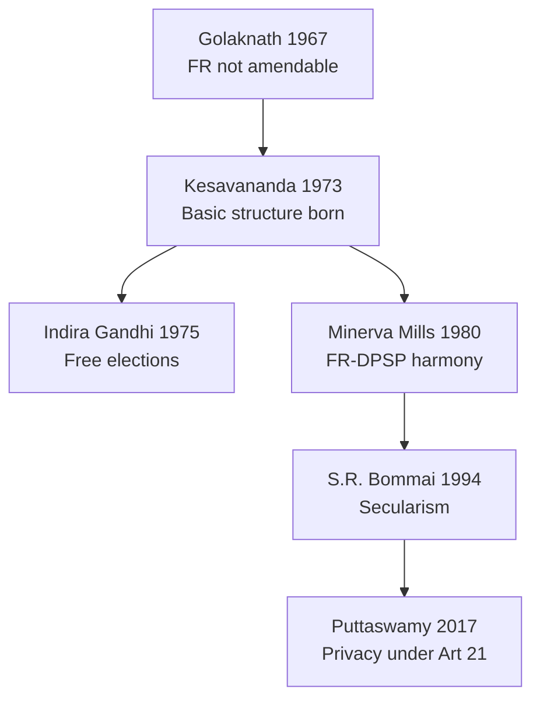

# Indian Constitution — Evolution, Features, Amendments & Basic Structure

> GS-2 · Topic 01 · Historical underpinnings, evolution, features, amendments, significant provisions, basic structure, SC role

---

## PYQs

| Year | M | Words | Question (EN) | प्रश्न (HI) | ID |
|------|---|-------|---------------|-------------|-----|
| 2025 | 12 | 125 | "India's Constituent Assembly was the legal outcome of Parliamentary developments during the Colonial period." Critically examine this statement. | "भारत की संविधान सभा असैनवेतिक काल की संसदीय गतिविधियों का विधिक परिणाम थी।" इस कथन का आलोचनात्मक परीक्षण कीजिए। | Q1 |
| 2025 | 8 | 125 | "Legislature is supreme within its domain, yet it is not sovereign." Examine this statement in the constitutional context with examples. | "विधायिका अपने क्षेत्राधिकार में सर्वोच्च है, तफिर भी वह संप्रभु नहीं है।" इस कथन का उदाहरण सहित संवैधानिक परिप्रेक्ष्य में परीक्षण कीजिए। | Q2 |
| 2024 | 8 | 125 | Write a short note on the composition of the Constituent Assembly. | संविधान सभा की संरचना पर एक संक्षिप्त टिप्पणी लिखिए। | Q3 |
| 2024 | 8 | 125 | How does the Indian Constitution ensure the independence of the judiciary? Discuss the importance of the basic structure doctrine. | भारतीय संविधान न्यायपालिका की स्वतंत्रता कैसे सुनिश्चित करता है? मूल संरचना सिद्धांत के महत्व पर चर्चा कीजिए। | Q4 |
| 2023 | 8 | 125 | Why the Preamble is called the Philosophy of the Indian Constitution? | प्रस्तावना को भारतीय संविधान का दर्शन क्यों कहा जाता है? | Q5 |
| 2023 | 8 | 125 | Why the 42nd Amendment is called a revision of the Indian Constitution? | 42वें भारतीय संशोधन को संविधान का पुनः लेखन क्यों कहा जाता है? | Q6 |
| 2023 | 12 | 200 | Critically examine the increasing powers and role of Prime Minister. How does it impact other institutions? | प्रधानमंत्री की बढ़ती शक्तियों और भूमिका का आलोचनात्मक परीक्षण करें। अन्य संस्थाओं पर इसका कैसे प्रभाव पड़ता है? | Q7 |
| 2022 | 8 | 125 | What are the rights within the ambit of Article 21 of the Indian Constitution? | भारत के संविधान के अनुच्छेद 21 की परिधि में कौन-कौन से अधिकार शामिल हैं? | Q8 |
| 2022 | 12 | 200 | Discuss the evolution and impact of the "Basic structure doctrine" of the Indian Constitution. | भारतीय संविधान के "आधारभूत ढांचा सिद्धांत" के विकास एवं प्रभाव की विवेचना कीजिए। | Q9 |
| 2021 | 8 | 125 | The Preamble of the Constitution affirms the basic features of the Constitution and the promotion of human dignity. Elucidate. | संविधान की उद्देशिका संविधान के आधारभूत लक्षण एवं मानव गरिमा की वृद्धि का प्रतिज्ञान करती है। स्पष्ट कीजिए। | Q10 |
| 2019 | 8 | 125 | The philosophy of Indian Democracy is embodied in the Preamble of the Constitution of India. Explain. | भारतीय लोकतंत्र का दर्शन भारत के संविधान की प्रस्तावना में सन्निहित है। व्याख्या कीजिए। | Q11 |
| 2019 | 12 | 200 | What do you understand by 'Doctrine of Basic Structure'? Analyse its importance for Indian Constitution. | 'आधारभूत ढाँचे का सिद्धांत' से आप क्या समझते हैं? भारतीय संविधान के लिए इसके महत्व का विश्लेषण कीजिए। | Q12 |
| 2019 | 12 | 200 | Examine the Right to Life in the Constitution of India. | भारत के संविधान में जीवन के अधिकार की समीक्षा कीजिए। | Q13 |
| 2018 | 12 | 200 | The action of Indian Government on Article 370 has changed the Status-Quo in Jammu and Kashmir. How will it affect the development in the region? Discuss. | धारा 370 पर भारत सरकार की कार्यवाही ने जम्मू-कश्मीर की यथास्थिति पर परिवर्तन किया है। यह इस क्षेत्र के विकास को किस प्रकार से प्रभावित कर सकता है? चर्चा कीजिए। | Q14 |
| 2018 | 12 | 200 | Examine Right to Equality as a Fundamental Right in the Constitution of India. | भारत के संविधान में समानता के मूलाधिकार की समीक्षा कीजिए। | Q15 |

---

## Quick Revision

```
COLONIAL → CONSTITUTION: 1773 Regulating Act → 1784 Pitt's → 1793/1813/1833 Charters → 1858 Crown rule
  → 1861 Legislative councils → 1892 Indian Councils → 1909 Morley-Minto → 1919 Montagu-Chelmsford
  → 1935 GOI Act (federal blueprint) → 1940 August Offer → 1942 Cripps → 1946 Cabinet Mission
  → 1947 Mountbatten + Indian Independence Act → CA legal child of transfer-of-power sequence

CONSTITUENT ASSEMBLY: Idea 1934 (M.N. Roy) · INC demand 1935 · Nehru 1938 · Cabinet Mission 1946
  Total 389 → 299 after partition | Indirect election by provincial assemblies | Universal adult franchise NOT used
  1st meeting 9 Dec 1946 (Sachchidananda Sinha) · Permanent chairman Rajendra Prasad
  Drafting Committee = Dr. Ambedkar (chair) · Union = Nehru · States = Patel · Advisory = B.N. Rau
  Adopted 26 Nov 1949 · Effective 26 Jan 1950 · 395 Arts (original) · 22 Parts · 8 Schedules (original)

SALIENT FEATURES: Lengthiest written · Blend rigidity/flexibility · Quasi-federal · Parliamentary + responsible govt
  · Integrated judiciary · FR + FD + DPSP · Secular-socialist-democratic-republic (Preamble + 42nd)
  · Single citizenship · Independent institutions (EC, CAG, UPSC)

PREAMBLE: Sovereign Socialist Secular Democratic Republic · Justice (social, economic, political)
  · Liberty (thought, expression, belief, faith, worship) · Equality · Fraternity · 42nd (1976) added Socialist Secular
  · Kesavananda: Preamble amendable but within basic structure · Berubari: not source of power but key to minds of makers

42nd AMENDMENT (1976): "Mini Constitution" — Preamble Socialist/Secular · Art 31C expanded · DPSP primacy clause
  · Art 368 amendment bar raised · Lok Sabha/Rajya Sabha 5→6 years (later reversed by 44th) · Fundamental Duties added (1976 via 42nd, listed in 1979)
  · Courts' review curbed (partially undone by 44th) · Centre strengthened · Emergency-era product

BASIC STRUCTURE (Kesavananda 1973): Parliament cannot destroy identity of Constitution by amendment
  Elements: Supremacy of Constitution · Republican-democratic · Secular · Separation of powers · Federalism
  · Rule of law · Judicial review · FR dignity · Free/fair elections · Art 32 · Limited amending power
  Cases: Golaknath 1967 (FR amend bar — overruled) · Kesavananda 1973 · Minerva Mills 1980 · Indira Gandhi 1975 · S.R. Bommai 1994

SC ROLE: Guardian of Constitution · Art 142 · Judicial review Art 13 · Expanded Art 21 (Maneka, Vishaka, Olga Tellis)
  · Basic structure arbiter · Collegium appointments · PIL (1980s) · Art 370 interpretation (S. 2019–20)

ART 14: Equality before law + equal protection · Reasonable classification · Arbitrariness test (E.P. Royappa, Maneka)
ART 21: Life + personal liberty · Negative + positive rights via SC — dignity, privacy (Puttaswamy), health, environment, speedy trial

LEGISLATURE: Art 245–246 + Sch VII domain supreme BUT bound by FR, DPSP, judicial review, basic structure, constitutional limits
  · Not sovereign like British Parliament — written constitution + judicial review

JUDICIARY INDEPENDENCE: Security of tenure · Salaries from Consolidated Fund · Contempt power · Collegium · Art 124(4) removal hard

ART 370: Temporary special status J&K · Abrogated Aug 2019 (Presidential orders + J&K Reorganisation Act) · UT status
  · Development angle: central schemes, investment, tourism, Ladakh infra — federal integration debate

PM: De facto executive head · Art 74 · Leader of majority · Cabinet dominance · Coordination, foreign policy, appointments
  · Impact: marginalises individual ministers, strengthens PMO, affects President's discretionary space, legislature followership

TRAPS: CA ≠ directly elected · 42nd ≠ only Preamble change · Basic structure ≠ in text · Art 21 ≠ only physical life
  · Legislature ≠ Parliament sovereign · Preamble ≠ enforceable alone · Art 370 repeal ≠ simple majority only debate
```

---

## Content

### Context — why this keyword matters

The **Indian Constitution** (adopted **26 November 1949**, effective **26 January 1950**) is the **supreme law** transforming a colonial subject into a **sovereign democratic republic**. UPPCS GS-II Topic 01 expects mastery of **historical lineage** (1773–1947 Acts → Constituent Assembly), **salient features**, **amendment politics** (especially **42nd**), **Preamble philosophy**, **Fundamental Rights** (Articles **14**, **21**), **Article 370**, **basic structure doctrine**, and the **Supreme Court's** role as constitutional interpreter — all recurring Mains themes (**15 PYQs 2018–2025**).

### Historical underpinnings — colonial constitutional development

British rule in India evolved through **Charter Acts** and **Government of India Acts** that gradually introduced **legislative institutions**, **separation of functions**, and **federal ideas** — the **legal runway** for the **Constituent Assembly** and the 1950 Constitution.

| Year / Act | Significance |
|------------|--------------|
| **Regulating Act, 1773** | First step to **centralise** Company rule; **Supreme Court at Calcutta**; Governor-General of Bengal |
| **Pitt's India Act, 1784** | **Board of Control** + Court of Directors — **dual control** |
| **Charter Acts (1793, 1813, 1833, 1853)** | Expansion of **legislative role**; **1833** — law member in Council; **1853** — open civil services competition |
| **Government of India Act, 1858** | **Crown rule** after 1857; Secretary of State for India |
| **Indian Councils Acts (1861, 1892, 1909)** | **1861** — legislative devolution; **1909 Morley-Minto** — **separate electorates** |
| **Montagu-Chelmsford / GOI Act, 1919** | **Dyarchy** in provinces; **bicameral legislature** at Centre |
| **GOI Act, 1935** | **Provincial autonomy**; **Federal scheme** (never fully operational); **Federal Court**; blueprint for many 1950 provisions |
| **August Offer, 1940** | Dominion status after war; **CA idea accepted in principle** |
| **Cripps Mission, 1942** | Post-war **Constitution by Indians**; rejected — **no immediate transfer** |
| **Cabinet Mission Plan, 1946** | **Single Constituent Assembly**; **389 members** formula; **grouping of provinces** |
| **Mountbatten Plan, 1947** | Partition; **Indian Independence Act, 1947** — **Dominion legislatures as CA** for new dominions |
| **Indian Independence Act, 1947** | **15 August 1947** — dominion status; **Constituent Assembly becomes sovereign law-making body** for framing constitution |

**Critical link (2025 PYQ):** The **Constituent Assembly** was not created in a vacuum — it was the **legal culmination** of **Cabinet Mission (1946)**, **1947 Act**, and decades of **constitutional negotiation** (Montagu Declaration 1917 → 1935 Act). Yet it also **transcended** colonial law by **abolishing paramountcy**, adopting **universal principles**, and **not merely continuing** the 1935 Act — hence the statement is **partially true, critically incomplete**.


### Constituent Assembly — composition and working

**Origin of demand:** **M.N. Roy (1934)** first proposed; **INC (1935)** demanded; **Jawaharlal Nehru (1938, Lucknow)** — constitution by **CA elected on adult franchise**; **Muslim League** initially participated then **boycotted** after **Direct Action (1946)**.

**Composition (1946 plan):**

| Category | Seats |
|----------|-------|
| Provinces (British India) | **292** |
| Princely States | **93** |
| Chief Commissioner provinces | **4** |
| **Total (original)** | **389** |
| **After partition (1947)** | **299** |

- **Election:** **Indirect** — members chosen by **provincial legislative assemblies** (not direct adult franchise as Nehru wanted).
- **Representation:** **Proportional** to population; **Muslim League seats** largely vacant after boycott; **Princely States** joined slowly — **only 93 nominated eventually fewer active**.
- **First meeting:** **9 December 1946** — **Sachchidananda Sinha** (interim chairman); permanent chairman **Dr. Rajendra Prasad**.
- **Major committees:**

| Committee | Chairperson | Role |
|-----------|-------------|------|
| **Drafting Committee** | **Dr. B.R. Ambedkar** | Final draft of Constitution |
| **Union Powers Committee** | **Jawaharlal Nehru** | Centre-state division |
| **Provincial Constitution Committee** | **Sardar Vallabhbhai Patel** | Provincial schemes |
| **Advisory Committee on FR, Minorities** | **Sardar Patel** | Fundamental Rights |
| **Constitutional Adviser** | **B.N. Rau** | Preliminary draft |

- **Timeline:** Draft published **Feb 1948**; **284 members signed** final draft **26 Nov 1949**; **395 Articles**, **22 Parts**, **8 Schedules** (original).
- **Sources borrowed:** **GOI Act 1935** (structural skeleton), **US** (FR, judicial review), **UK** (parliamentary system), **Ireland** (DPSP), **Canada** (federation), **Australia** (concurrent list).
- **Criticism:** Not fully **representative** (no direct election; Partition reduced Muslim representation); dominated by **Congress** — yet achieved **remarkable consensus** across **linguistic, religious, and regional** divides.

### Salient features of the Indian Constitution

| Feature | Explanation |
|---------|-------------|
| **Lengthiest written constitution** | Detailed provisions — single document for union + states |
| **Blend of rigidity and flexibility** | Art **368** — some parts need **special majority + ratification** by half the states |
| **Quasi-federal** | Strong Centre (Art **356**, **249**, **352**) + federal features (Sch **VII**, **VI**) |
| **Parliamentary system** | **Responsible government** — PM accountable to Lok Sabha (Art **75(3)**) |
| **Integrated yet independent judiciary** | **Single integrated hierarchy** — SC (Art **124**), HCs; **judicial review** (Art **13**, **32**, **226**) |
| **Fundamental Rights + Duties + DPSP** | Part **III**, **IV-A**, **IV** — rights, duties (added **1976**), directive principles |
| **Secular state** | **42nd Amendment** inserted "Secular" in Preamble; **S.R. Bommai (1994)** — basic structure |
| **Universal adult franchise** | Art **326** — radical for 1950 vs colonial restricted franchise |
| **Independent constitutional bodies** | **Election Commission** (Art **324**), **CAG** (Art **148**), **UPSC** (Art **315**) |

### Preamble — philosophy of the Constitution

The **Preamble** declares India as **Sovereign, Socialist, Secular, Democratic, Republic** and resolves to secure **Justice** (social, economic, political), **Liberty**, **Equality**, and **Fraternity** — synthesising **French Revolution ideals**, **Gandhian dignity**, and **Ambedkarite social justice**.

- **Berubari Union case (1960):** Preamble is **key to open minds of framers** but **not a source of power**.
- **Kesavananda Bharati (1973):** Preamble shows **basic features**; **amendable** under Art **368** but subject to **basic structure**.
- **42nd Amendment (1976):** Added **"Socialist"** and **"Secular"** — reflects **Indira Gandhi era** ideology; debated as **political insertion** yet now part of **constitutional identity**.
- **Democratic philosophy:** **Political equality** (one person one vote), **rule of law**, **dignity** — links to **FR**, **DPSP**, and **institutional design** (free elections, independent judiciary).

### Amendment process and the 42nd Amendment

**Article 368** — Parliament may amend; types:
1. **Simple majority** — admission of states, creation of new states (Art **4** route).
2. **Special majority** (total + two-thirds present and voting) — most amendments.
3. **Special majority + ratification by half the states** — federal provisions (election of President, distribution of powers, SC/HC, Art **368** itself).

**42nd Constitutional Amendment Act, 1976** ("Mini Constitution" / **constitutional revision**):

| Area | Change |
|------|--------|
| **Preamble** | **Socialist, Secular** added |
| **Directive Principles** | New clauses — **Art 39**, **39A**, **43A**, **48A**; **Art 31C** expanded (laws giving effect to certain DPSPs immune from FR challenge) |
| **Fundamental Duties** | **Art 51A** added (10 duties; later **86th** added 11th) |
| **Parliament & legislatures** | Term extended **5 → 6 years** (reversed by **44th**) |
| **Judiciary** | Curtailed **judicial review** scope (largely restored by **44th**) |
| **Centre-state** | Strengthened **Centre** — "Directive Principles" over **Fundamental Rights** rhetoric in **Art 31C** |
| **Amendment bar** | Declared no court can question constitutional amendments ( struck down in part — **Minerva Mills**) |

**44th Amendment (1978)** — post-Emergency correction: restored **5-year terms**, **Art 21** protection during Emergency narrowed, **Fundamental Rights** balance restored.

### Basic Structure Doctrine — evolution and Supreme Court role

**Problem:** Can Parliament amend **any** part including **Fundamental Rights**?

| Case | Holding |
|------|---------|
| **Shankari Prasad (1951)** | FR amendable under Art **368** |
| **Sajjan Singh (1965)** | Affirmed |
| **Golaknath (1967)** | FR **not amendable** — **overruled** |
| **Kesavananda Bharati (1973)** | Parliament can amend but **cannot destroy basic structure** — **13-judge bench**, **7:6** |
| **Indira Gandhi v. Raj Narain (1975)** | **Free and fair elections**, **rule of law** = basic structure |
| **Minerva Mills (1980)** | **Harmony FR–DPSP**; unlimited amending power **invalid** |
| **Waman Rao (1981)** | Doctrine applies **prospectively** from **Kesavananda** |
| **S.R. Bommai (1994)** | **Secularism** = basic structure — President's Rule reviewable |
| **Puttaswamy (2017)** | **Privacy** part of **dignity** under Art **21** |

**Elements frequently cited as basic structure:** Supremacy of Constitution · Sovereign democratic republic · **Secularism** · **Federalism** · Separation of powers · **Rule of law** · **Judicial review** · **Fundamental Rights** (especially **dignity**, **equality**) · **Free and fair elections** · **Art 32** · **Limited amending power** · **Independence of judiciary**.

**SC as evolution engine:** Beyond **Kesavananda**, the Court **expanded Art 21** (**Maneka Gandhi 1978** — fair procedure; **Olga Tellis 1985** — livelihood; **Vishaka 1997** — workplace safety; **Common Cause** — dignified death debate), read **due process** substance, and guards **constitutional identity** against **majoritarian amendments**.



### Significant provisions — Articles 14, 21, and 370

**Article 14 — Right to Equality (Part III):**
- **Equality before law** (British concept — negative) + **Equal protection of laws** (American — positive).
- **Reasonable classification** permitted — intelligible differentia + rational nexus to object (**State of West Bengal v. Anwar Ali Sarkar**).
- **Arbitrariness test** — **E.P. Royappa (1974)**, **Maneka Gandhi (1978)** — equality attacks **arbitrary state action**.
- Related: Art **15** (non-discrimination), **16** (public employment), **17** (untouchability abolition).

**Article 21 — Protection of life and personal liberty:**
- Text: No deprivation except according to **procedure established by law**.
- **Expanded jurisprudence:** **Right to live with human dignity**, **health**, **clean environment** (**M.C. Mehta**), **speedy trial**, **legal aid**, **privacy** (**Puttaswamy**), **education** (linked with **Art 21A**), ** shelter/livelihood** (**Olga Tellis**), **handcuffing norms**, **death penalty rarest of rare** (**Bachan Singh**).
- **Maneka Gandhi (1978):** Procedure must be **fair, just, reasonable** — bridge to **due process** substance.

**Article 370 — Jammu & Kashmir (historical provision):**
- Inserted **temporary** special autonomy — separate constitution (**1957**), limited Union legislative power without **State concurrence**.
- **Abrogation (August 2019):** **Presidential Orders** (C.O. 272, 273) + **Jammu and Kashmir Reorganisation Act, 2019** — bifurcation into **UT of J&K** (with legislature) and **UT of Ladakh**; **Art 370** effectively read down.
- **Development implications (exam frame):** Integration with **national schemes** (PMGSY, Ayushman Bharat, central investment), **tourism/infrastructure**, **Ladakh renewable energy** potential; debates on **democratic participation**, **investor confidence**, **law-and-order**, **preservation of regional identity**.

### Legislature — supreme in domain, not sovereign

- **Article 245** — Parliament may make laws for whole or part of India; **Art 246** + **Schedule VII** — **Union, State, Concurrent** lists define **domain supremacy**.
- **Within domain**, legislature is **supreme** in law-making (**no court substitutes policy** for tax rates, criminal law design within constitutional limits).
- **Not sovereign** because:
  1. **Written Constitution** limits power (FR, DPSP, emergency provisions).
  2. **Judicial review** — **Art 13**, **32**, **226** — laws can be **struck down**.
  3. **Basic structure** — **constitutional amendments** also limited (**Kesavananda**).
  4. **Federal division** — states have **exclusive** fields; **Art 249**, **250**, **252**, **356** are **exceptions**, not unlimited central sovereignty.
  5. **International obligations** and **constitutional morality** bind law-making.
- **Example:** **Minerva Mills** — Parliament cannot make itself **unlimited amending power**; **Kesavananda** — **42nd** partially trimmed.

### Independence of judiciary — constitutional safeguards

| Provision | Safeguard |
|-----------|-----------|
| **Art 124(2)** | Appointments by **President** after **consultation** ( evolved **Collegium** system) |
| **Art 124(4)** | Removal only by **impeachment** — proved misbehaviour/incapacity — **special majority** |
| **Art 121** | No parliamentary discussion on judge conduct except during impeachment |
| **Salaries** | Charged on **Consolidated Fund of India** — not votable |
| **Art 50** | Separation of judiciary from executive — DPSP mandate |
| **Art 129–130** | SC **contempt** powers — upholds authority |
| **Art 142** | **Complete justice** — fills gaps without encroaching legislative field routinely |

### Prime Minister — growing role and institutional impact

- **Constitutional position:** **Head of government**, **leader of Council of Ministers** (Art **74–75**, **78**); **de facto** chief executive vs **President's de jure** role.
- **Sources of power:** **Majority in Lok Sabha**, **party leadership**, **Cabinet Committee system**, **PMO coordination**, **appointments** (governors, CVC, key commissions), **foreign policy** leadership, **crisis management**.
- **Increasing trend:** **Coalition era** initially checked PM; **single-party majorities (2014, 2019)** recentralised **decision-making in PMO**; **media and electoral presidentialisation**.
- **Impact on institutions:**
  - **President** — formal powers; **real discretion** narrows when PM enjoys stable majority.
  - **Cabinet** — collective responsibility (Art **75(3)**) but **PM dominance** may reduce **individual minister autonomy**.
  - **Parliament** — **anti-defection** (10th Schedule) strengthens **party whips** → **executive control of legislature**.
  - **Bureaucracy** — **PMO** coordinates cross-ministry action; risk of **over-centralisation**.
  - **Judiciary/regulators** — tension when **majoritarian mandates** meet **judicial review** (basic structure buffer).

### Significance and limits — balanced view

- **Significance:** World's **largest democracy's** operating manual; survived **Emergency**, **regionalism**, **coalitions** through **amendability + judicial guardrails**.
- **Limits/criticism:** **Length and complexity**; **colonial carryover** (IPC, police acts); **basic structure** vs **parliamentary supremacy** debate unresolved in theory; **money bill** controversies; **Schedule IX** (land reform immunity) tensions; **pending appointments** stress **judicial independence** rhetoric vs reality.

### Contemporary relevance

- **Constitution Day (Samvidhan Divas):** **26 November** — **Ministry of Parliamentary Affairs** campaign; **"Hamara Samvidhan, Hamara Swabhiman"** — civic constitutional literacy.
- **NEP 2020:** **Constitutional values** in curricula — **Fundamental Duties (Art 51A)**, **citizenship education**, **democratic participation** — links Preamble philosophy to **school/higher education**.
- **Digital governance:** **e-Courts**, **National Judicial Data Grid**, **Digital India** — **Art 21** access-to-justice dimension; **Aadhaar/Puttaswamy** privacy framework shapes **data governance**.
- **One Nation One Election** debate — touches **basic structure** of **federal cycle** and **Art 83/172** terms — exam-ready **constitutional reform** angle.
- **J&K post-2019:** **Central sector schemes** expansion, **investment summits**, **Ladakh renewable projects**, **tourism** — development narrative vs **representation/federal** critique.
- **Basic structure in news debates:** **103rd CAA**, **103rd EWS quota**, **tribunal reforms**, **NJAC struck down (2015)** — SC remains **final interpreter** of constitutional identity.
- **42nd/44th legacy:** Post-1976 **balance FR–DPSP** still frames **welfare legislation** vs **liberty** questions (e.g. **surveillance, UAPA judicial scrutiny**).

---

## Answers

### Q1: "India's Constituent Assembly was the legal outcome of Parliamentary developments during the Colonial period." Critically examine. (2025, 12M, 125W)

**Introduction:**
> The Constituent Assembly (1946–49) was legally anchored in colonial constitutional law, yet it exercised transformative sovereignty beyond mere continuity of British statutes.

**Main Points:**
- **Colonial legal lineage** — **Cabinet Mission Plan (1946)** and **Indian Independence Act, 1947** created/empowered the CA as the **lawful body** to frame the Constitution.
- **Parliamentary evolution** — Sequence from **1919 Dyarchy**, **1935 GOI Act**, **1940 August Offer**, **1942 Cripps** shows **gradual transfer** of constitution-making authority.
- **Not mere continuation** — CA **rejected paramountcy**, adopted **universal adult franchise** in the final Constitution, and **abolished separate electorate** — breaks colonial logic.
- **Composition limits** — **Indirect election**, **Congress dominance**, **League boycott** — not fully representative of all communities at start.
- **Transformative function** — **Dr. Ambedkar's** Drafting Committee produced a **republican** document, not a dominion patch on **1935 Act** alone.
- **Partition effect** — Membership fell **389 → 299**; new dominion legislatures **validated** CA's work — legal but politically reconfigured.
- **Balanced verdict** — Statement is **partially valid** as **legal outcome**; **incomplete** without acknowledging **revolutionary break** from colonial sovereignty.

**Keywords (underline in exam):** Constituent Assembly · Cabinet Mission · Indian Independence Act 1947 · GOI Act 1935 · Transformative constitution · Colonial continuity

**Exam diagram (30 sec):**
```
Colonial Acts → Cabinet Mission → Independence Act → CA → Constitution 1950
                     ↑ legal chain          ↑ break: sovereignty + FR + republic
```

**Conclusion:**
> The CA was legally born of colonial parliamentary developments but politically and morally founded a sovereign republic — making the statement **half-true** without critical nuance.

---

### Q2: "Legislature is supreme within its domain, yet it is not sovereign." Examine with examples. (2025, 8M, 125W)

**Introduction:**
> In India's written constitutional order, Parliament and State Legislatures enjoy **domain supremacy** under Schedule VII but remain **bounded** by higher constitutional law.

**Main Points:**
- **Domain supremacy** — **Art 245–246** + **Schedule VII** — Parliament supreme on **Union List** (e.g. defence, foreign affairs); states on **State List**.
- **Not sovereign — written limits** — **Fundamental Rights (Part III)** restrict law-making; **Art 13** renders inconsistent laws **void**.
- **Judicial review** — **Art 32/226** — e.g. **Kesavananda**, **Minerva Mills** — courts strike down laws/amendments.
- **Basic structure cap** — Parliament cannot amend Constitution to **destroy its identity** — limits even **Art 368**.
- **Federal bounds** — States' **exclusive** fields; Centre's override (**Art 249, 356**) is **exception**, not unlimited sovereignty.
- **Constitutional morality** — **Anti-defection**, **due process** under **Art 21**, **international treaties** constrain raw legislative will.

**Keywords (underline in exam):** Domain supremacy · Schedule VII · Judicial review · Basic structure · Art 368 · Written constitution

**Exam diagram (30 sec):**
```
Legislature → makes law in its List (supreme)
     ↓ bounded by
FR · Judicial review · Federalism · Basic structure
```

**Conclusion:**
> Indian legislatures are **legally supreme in allotted spheres** but **constitutionally non-sovereign** — unlike the unwritten British Parliament model.

---

### Q3: Write a short note on the composition of the Constituent Assembly. (2024, 8M, 125W)

**Introduction:**
> The Constituent Assembly (1946–49) was constituted under the **Cabinet Mission Plan** to frame India's Constitution through indirect provincial representation.

**Main Characteristics:**
- **Total strength** — Originally **389** (292 provinces + 93 princely states + 4 Chief Commissioner provinces); **299** after **Partition (1947)**.
- **Method of election** — **Indirect** by members of **provincial legislative assemblies** — not direct adult franchise.
- **Proportional representation** — Seats allocated by **population**; one seat per roughly **10 lakh** people formula.
- **Party composition** — **Congress majority**; **Muslim League** boycotted after **Direct Action**; princely states joined unevenly.
- **Leadership** — Chairman **Dr. Rajendra Prasad**; **Drafting Committee** chaired by **Dr. B.R. Ambedkar**.
- **Duration** — First met **9 Dec 1946**; adopted Constitution **26 Nov 1949**; **284 members signed** final draft.
- **Limitation** — Not fully **representative** of all groups initially, yet achieved **broad consensus** post-Partition.

**Keywords (underline in exam):** Cabinet Mission · 389/299 members · Indirect election · Rajendra Prasad · Ambedkar · December 1946

**Exam diagram (30 sec):**
```
Provincial Assemblies → elect → CA (292+93+4)
Partition → 299 | Drafting Committee → Ambedkar
```

**Conclusion:**
> Despite indirect election and Partition, the CA's composition enabled India's **consensus-based constitutional founding**.

---

### Q4: How does the Indian Constitution ensure independence of the judiciary? Discuss importance of basic structure doctrine. (2024, 8M, 125W)

**Introduction:**
> Judicial independence is structurally embedded in Parts III and V, while the **basic structure doctrine** prevents legislative erosion of constitutional identity.

**Main Points:**
- **Security of tenure** — Judges of SC/HC removed only by **impeachment** (**Art 124(4)**) — difficult special majority procedure.
- **Financial independence** — Salaries charged on **Consolidated Fund**; not subject to **parliamentary vote**.
- **Art 121** — Restricts parliamentary criticism of judges except in **impeachment** — protects dignity of bench.
- **Separation from executive** — **Art 50** (DPSP) mandates separate judiciary; **Art 50** + institutional practice.
- **Basic structure importance** — **Kesavananda (1973)** — **judicial review**, **rule of law**, **FR dignity** cannot be amended away.
- **Checks authoritarianism** — **Minerva Mills**, **S.R. Bommai** — prevents **42nd-style** concentration destroying **constitutional balance**.
- **Contemporary role** — Guards **NJAC-type** reforms that compromise **appointments independence**; preserves **Art 32** access.

**Keywords (underline in exam):** Art 124 · Impeachment · Consolidated Fund · Kesavananda · Judicial review · Basic structure

**Exam diagram (30 sec):**
```
Tenure + Salary + Art 121 → Independence
Basic structure → shields review + Art 32 from amendment
```

**Conclusion:**
> Structural safeguards secure day-to-day independence; **basic structure** secures the **long-term survival** of an independent judiciary.

---

### Q5: Why is the Preamble called the Philosophy of the Indian Constitution? (2023, 8M, 125W)

**Introduction:**
> The Preamble encapsulates the **values, objectives, and identity** that permeate the operative text of the Constitution.

**Main Characteristics:**
- **Identity declaration** — **Sovereign, Socialist, Secular, Democratic, Republic** — defines nature of Indian state.
- **Justice trinity** — **Social, economic, political** — mirrors **DPSP** and **Ambedkarite equality** vision.
- **Liberty cluster** — Thought, expression, belief, faith, worship — aligns with **Fundamental Rights**.
- **Equality and fraternity** — **Dignity** and **unity** — bridges **Part III** and **citizenship duties (Art 51A)**.
- **Key to interpretation** — **Berubari**, **Kesavananda** — guides reading of ambiguous articles.
- **Not enforceable alone** — Philosophy orienting **law and institutions**, not standalone justiciable rights.
- **42nd Amendment** — Added **Socialist, Secular** — philosophy updated yet bounded by **basic structure**.

**Keywords (underline in exam):** Philosophy · Justice · Liberty · Equality · Fraternity · Kesavananda · Socialist Secular

**Exam diagram (30 sec):**
```
Preamble → Justice / Liberty / Equality / Fraternity
         ↓ guides
Part III FR · Part IV DPSP · Institutions
```

**Conclusion:**
> The Preamble is the Constitution's **moral compass** — declaring ends that give meaning to its legal means.

---

### Q6: Why is the 42nd Amendment called a revision of the Indian Constitution? (2023, 8M, 125W)

**Introduction:**
> The **42nd Amendment Act, 1976** altered multiple foundational features so extensively that scholars term it a **"Mini Constitution."**

**Main Characteristics:**
- **Preamble change** — Inserted **Socialist** and **Secular** — identity-level revision.
- **Fundamental Duties** — Added **Art 51A** — new chapter of citizen obligations.
- **DPSP expansion** — **Art 39A, 43A, 48A**; widened **Art 31C** — shifted **FR–DPSP balance**.
- **Legislative terms** — Extended **Lok Sabha/Assemblies** to **6 years** (later **44th** restored **5**).
- **Judicial review curbed** — Attempted to insulate amendments and DPSP laws from **court scrutiny** — partly undone.
- **Centre strengthened** — Federal balance tilted toward **Union** during **Emergency** context.
- **Scale of change** — **Wide multi-article overhaul** — not routine amendment but **systemic rewrite**.

**Keywords (underline in exam):** 42nd Amendment · Mini Constitution · Art 51A · Art 31C · Socialist Secular · Emergency 1976

**Exam diagram (30 sec):**
```
42nd → Preamble + Art 51A + Art 31C + terms + review curbs
44th → partial rollback (FR balance, 5-year term)
```

**Conclusion:**
> Its breadth across **identity, rights, duties, and federal-judicial relations** justifies calling the 42nd a **constitutional revision**, not a minor amendment.

---

### Q7: Critically examine increasing powers and role of PM. Impact on other institutions? (2023, 12M, 200W)

**Introduction:**
> The Prime Minister, as **head of government** under **Art 74–75**, has grown from **first among equals** toward **central executive hub** — especially under stable majorities.

**Main Points:**
- **Constitutional base** — **Leader of majority** in Lok Sabha; advises **President**; chairs **Cabinet** and **Cabinet Committees**.
- **PMO expansion** — **Coordination, monitoring, appointment influence** — cross-ministry decision funnel.
- **Electoral presidentialisation** — **Media campaigns** centre on PM candidate — strengthens **personal mandate**.
- **Impact on President** — **Formal head** retains **pocket veto** rarely; **real power** flows to PM in majority eras.
- **Impact on Cabinet** — **Collective responsibility (Art 75(3))** maintained formally; **individual minister discretion** may shrink.
- **Impact on Parliament** — **Anti-defection (10th Schedule)** + **whip** → **executive dominance** over law-making agenda.
- **Impact on bureaucracy/regulators** — **PMO-led project push** (infrastructure, welfare DBT) — efficiency vs **over-centralisation** risk.
- **Critical balance** — **Judiciary/basic structure** and **federal units** remain checks — **S.R. Bommai**, **GST Council** politics.

**Keywords (underline in exam):** Art 74 · PMO · Collective responsibility · Anti-defection · De facto executive · Institutional balance

**Exam diagram (30 sec):**
```
PM (majority) → PMO + Cabinet C'ttees → Parliament followership
              ↓ tension with
President (formal) · Courts · States
```

**Conclusion:**
> PM centrality enhances **decisive governance** but demands vigilance so **Cabinet, Parliament, and federal diversity** are not reduced to nominal forms.

---

### Q8: What are the rights within the ambit of Article 21? (2022, 8M, 125W)

**Introduction:**
> **Article 21** protects **life and personal liberty** against arbitrary state action — expanded by the Supreme Court into a **bundle of dignified existence**.

**Main Characteristics:**
- **Core text** — No deprivation except by **procedure established by law** — **Gopalan → Maneka** evolution to **fair procedure**.
- **Right to live with dignity** — **Maneka Gandhi (1978)**, **Francis Coralie** — life means more than animal existence.
- **Livelihood & shelter** — **Olga Tellis (1985)** — pavement dwellers; **Chameli Singh** — shelter component.
- **Health & clean environment** — **M.C. Mehta** cases — pollution control under **Art 21**.
- **Speedy trial & legal aid** — **Hussainara Khatoon** — undertrial rights; **legal aid** as essential justice.
- **Privacy** — **Puttaswamy (2017)** — intrinsic to **dignity and liberty**.
- **Education** — **Art 21A** (2002 amendment) — **6–14 years** free compulsory education linked to **life with dignity**.

**Keywords (underline in exam):** Art 21 · Maneka Gandhi · Dignity · Privacy · Livelihood · Speedy trial · Art 21A

**Exam diagram (30 sec):**
```
Art 21 → Life + Liberty
       → dignity · health · environment · privacy · trial · education
```

**Conclusion:**
> Art 21 is the Constitution's **dynamic heart** — enabling the SC to read **social and economic dimensions** into **personal liberty**.

---

### Q9: Discuss evolution and impact of Basic Structure Doctrine. (2022, 12M, 200W)

**Introduction:**
> The **basic structure doctrine** (**Kesavananda Bharati, 1973**) holds that Parliament's amending power under **Art 368** cannot destroy the Constitution's **core identity**.

**Main Points:**
- **Evolution** — **Shankari Prasad** (FR amendable) → **Golaknath (1967)** (FR not amendable) → **Kesavananda** (middle path — amend but not destroy identity).
- **Elements** — **Supremacy, democracy, secularism, federalism, rule of law, judicial review, FR dignity, free elections, Art 32**.
- **Indira Gandhi case (1975)** — **Free and fair elections** part of basic structure — struck down **39th Amendment**.
- **Minerva Mills (1980)** — **Harmony FR–DPSP**; unlimited amendment power **unconstitutional** — curbed **42nd**.
- **S.R. Bommai (1994)** — **Secularism** enforced; **President's Rule** subject to **judicial review**.
- **Impact — positive** — Prevented **authoritarian amendments**; preserved **judicial review** and **federal-secular** character.
- **Impact — debate** — Critics say **judicial supremacy** over **elected branches**; supporters cite **democratic longevity**.
- **Contemporary** — Framework for reviewing **CAA, EWS (103rd), tribunal reforms** — SC as **constitutional guardian**.

**Keywords (underline in exam):** Kesavananda · Art 368 · Golaknath · Minerva Mills · Secularism · Judicial review · S.R. Bommai

**Exam diagram (30 sec):**
```
Golaknath → Kesavananda → Minerva / Bommai / Puttaswamy
Amend power OK | Destroy identity NOT OK
```

**Conclusion:**
> The doctrine is India's **constitutional firewall** — enabling **adaptation through amendments** while preventing **suicidal transformation**.

---

### Q10: Preamble affirms basic features and promotion of human dignity. Elucidate. (2021, 8M, 125W)

**Introduction:**
> The Preamble's resolve for **justice, liberty, equality, and fraternity** affirms both **structural features** and **human dignity** as constitutional telos.

**Main Characteristics:**
- **Republican sovereignty** — **Democratic** authority from **people** — basic feature affirmed textually.
- **Secular-socialist identity** — **42nd** words now express **inclusive citizenship** and **welfare orientation**.
- **Justice (social, economic, political)** — Links to **DPSP** and **anti-discrimination (Art 15–17)** — dignity via **material equality**.
- **Liberty** — Protects **autonomy of belief and expression** — dignity of **individual conscience**.
- **Equality** — **Political and legal equality** — foundation for **FR** against **caste, gender, religion** discrimination.
- **Fraternity** — **Dignity of individual** explicitly in **Art 51A** echo; **unity** without **forced assimilation**.
- **Kesavananda link** — Preamble reflects **basic structure** — **dignity** now core to **Art 21** jurisprudence.

**Keywords (underline in exam):** Human dignity · Justice · Fraternity · Basic features · Art 21 · Preamble · Equality

**Exam diagram (30 sec):**
```
Preamble: Justice + Liberty + Equality + Fraternity
                    ↓
         Dignity → Part III + Art 51A + SC Art 21
```

**Conclusion:**
> The Preamble thus **declares** the Constitution's architecture and **elevates human dignity** as the ultimate constitutional purpose.

---

### Q11: Philosophy of Indian Democracy embodied in the Preamble. Explain. (2019, 8M, 125W)

**Introduction:**
> Indian democracy is **constitutional, inclusive, and social** — values explicitly **embodied** in the Preamble's opening resolve.

**Main Characteristics:**
- **Democratic republic** — Power from **people** via **universal franchise (Art 326)** — not hereditary/monarchical rule.
- **Sovereign nation** — **External and internal** self-determination post-1947 — democratic self-rule.
- **Secularism** — State **neutral** in religion — **equal citizenship** regardless of faith.
- **Socialist goal** — **Reduced inequalities** — welfare state via **DPSP** — not laissez-faire democracy alone.
- **Justice dimension** — **Social and economic** democracy complements **political democracy** — Ambedkar's vision.
- **Liberty & dissent** — Protects **opposition, press, belief** — essential to **deliberative democracy**.
- **Fraternity & unity** — **Diversity within unity** — democratic stability across **linguistic-religious pluralism**.

**Keywords (underline in exam):** Democratic republic · Secular · Socialist · Universal franchise · Justice · Fraternity

**Exam diagram (30 sec):**
```
Democracy = Political (vote) + Social (justice) + Economic (DPSP)
Preamble = blueprint for all three
```

**Conclusion:**
> The Preamble defines Indian democracy as **majority rule bounded by dignity, equality, and secular fraternity** — not mere electoral mechanics.

---

### Q12: What is Doctrine of Basic Structure? Analyse its importance. (2019, 12M, 200W)

**Introduction:**
> The **basic structure doctrine** limits **Art 368** — Parliament may amend but cannot **abrogate** the Constitution's **foundational identity**.

**Logical Analysis:**
- **Origin** — **Kesavananda Bharati v. State of Kerala (1973)** — response to **Golaknath** and **24th/29th Amendments** — **7:6** verdict.
- **Definition** — No exhaustive list; **judicial identification** of **essential features** — **supremacy, democracy, secularism, federalism, review, dignity**.
- **Illustrations** — **Indira Gandhi (1975)** — election fairness; **Minerva Mills (1980)** — FR–DPSP harmony; **Bommai (1994)** — secularism.

**Importance:**
- **Prevents authoritarianism** — Blocks **Emergency-era** style constitutional **overwrites (42nd)** from becoming permanent unchecked power.
- **Protects minorities** — **FR and secularism** shield against **majoritarian constitutional amendments**.
- **Federal stability** — Limits **centre-bias amendments** destroying **state autonomy** core.
- **Judicial review preserved** — **Art 32** remains **heart and soul** (**L. Chandra Kumar** spirit).
- **Democratic continuity** — Allows **103rd EWS**, **73rd/74th** type reforms while striking **unlimited amendment claims**.

**Keywords (underline in exam):** Kesavananda · Art 368 · Secularism · Judicial review · Minerva Mills · Constitutional identity

**Exam diagram (30 sec):**
```
Amendment (Art 368) → YES for change
                   → NO if destroys basic structure
```

**Conclusion:**
> The doctrine balances **flexibility and permanence** — indispensable for India's **constitutional democracy** surviving **49+ amendments**.

---

### Q13: Examine Right to Life in the Constitution of India. (2019, 12M, 200W)

**Introduction:**
> The **Right to Life** under **Art 21** is among the most **expanded** fundamental rights — from **negative liberty** to **positive entitlements** via judicial interpretation.

**Main Points:**
- **Constitutional text** — **Part III, Art 21** — protection of **life and personal liberty**; **Art 22** complements **preventive detention** safeguards.
- **Early narrow view** — **A.K. Gopalan (1950)** — formal **procedure** sufficient; **overruled in spirit** by later benches.
- **Maneka Gandhi (1978)** — Procedure must be **fair, just, reasonable** — **due process** substance enters Indian law.
- **Positive dimensions** — **Health (Bandhua Mukti Morcha)**, **environment (M.C. Mehta)**, **education (Art 21A)**, **livelihood (Olga Tellis)**.
- **Death penalty** — **Bachan Singh (1980)** — **rarest of rare** — life as **default**, death as **exception**.
- **Privacy & dignity** — **Puttaswamy (2017)** — **intrinsic to personhood**; impacts **state surveillance and data policies**.
- **Limits** — **Reasonable restrictions** via valid law; **national security, prison discipline** — subject to **proportionality**.

**Keywords (underline in exam):** Art 21 · Maneka Gandhi · Olga Tellis · Puttaswamy · Dignity · Art 21A · Bachan Singh

**Exam diagram (30 sec):**
```
Art 21: Gopalan (narrow) → Maneka (fair process) → Puttaswamy (privacy/dignity)
```

**Conclusion:**
> Right to Life anchors India's **human rights jurisprudence** — making the Constitution a **living guarantee of dignified existence**.

---

### Q14: Art 370 action changed status-quo in J&K. How will it affect development? Discuss. (2018, 12M, 200W)

**Introduction:**
> Abrogation of **Art 370 (2019)** via **Presidential Orders** and **J&K Reorganisation Act** integrated J&K fully with the Union — altering **autonomy, governance, and development pathways**.

**Main Points:**
- **Status change** — **Special status** diluted; **UT of J&K** (with legislature) + **UT of Ladakh** created — **central laws** extended uniformly.
- **Development — potential gains** — Access to **central schemes** (Ayushman Bharat, PM Awas, highways); **private investment** barriers reduced in narrative.
- **Infrastructure & tourism** — **Rail connectivity**, **pilgrimage tourism**, **Ladakh renewable/solar** potential — economic diversification.
- **Governance integration** — Single **GST**, **RBI**, **SEBI** framework — may ease **business environment**.
- **Challenges** — **Security environment**, **investor confidence**, **local participation** concerns; **post-2019 internet shutdowns** affected economy temporarily.
- **Federal/democratic debate** — **Assembly elections (2024)** restore **local voice** — development needs **legitimate local institutions**.
- **Balanced view** — Material progress depends on **employment, education, healthcare**, not **legal integration alone**.

**Keywords (underline in exam):** Art 370 · J&K Reorganisation Act 2019 · UT · Central schemes · Investment · Ladakh · Federal integration

**Exam diagram (30 sec):**
```
Art 370 abrogation → legal integration → schemes + investment
                   → needs peace + local governance for sustainable dev
```

**Conclusion:**
> Legal integration opens **national development tools** for J&K, but **inclusive governance and stability** will determine whether growth is **equitable and lasting**.

---

### Q15: Examine Right to Equality as a Fundamental Right. (2018, 12M, 200W)

**Introduction:**
> **Right to Equality (Arts 14–18)** forms the **non-discrimination core** of Part III — ensuring **equal citizenship** in a hierarchical society.

**Main Points:**
- **Art 14** — **Equality before law** + **equal protection**; prohibits **state arbitrariness** (**Maneka**, **Royappa**).
- **Art 15** — No discrimination on **religion, race, caste, sex, place of birth**; enables **affirmative action** for **SC/ST, women, socially backward**.
- **Art 16** — **Equality of opportunity** in **public employment**; **reservations** constitutionally permitted.
- **Art 17** — **Abolition of untouchability** — enforceable offence — **social revolution** clause.
- **Art 18** — Abolishes **titles** (except military/academic) — republican equality.
- **Reasonable classification** — State may classify if **intelligible differentia** + **rational nexus** — not **class legislation**.
- **Horizontal application debate** — **Art 15(2)**, **17** reach **private spaces** partially; **constitutional morality** extends via **SC** (**Sabari mala, Navtej** contexts).

**Keywords (underline in exam):** Art 14 · Art 15 · Art 16 · Art 17 · Reasonable classification · Equal protection · Untouchability

**Exam diagram (30 sec):**
```
Equality cluster: 14 (general) → 15 (non-discrimination) → 16 (jobs) → 17 (untouchability) → 18 (titles)
```

**Conclusion:**
> Right to Equality transforms **formal legal equality** into **substantive social justice** — central to India's **democratic constitutionalism**.

---

### Q16: *Likely variant:* Salient features of the Indian Constitution. (8M, 125W)

**Introduction:**
> The Indian Constitution combines **borrowed institutions** with **indigenous aspirations** — producing a **unique quasi-federal parliamentary republic**.

**Main Characteristics:**
- **Lengthiest written constitution** — Comprehensive union-state design in **single document**.
- **Quasi-federalism** — Strong **Centre** with **federal features** — **Schedule VII**, **Art 356**.
- **Parliamentary system** — **Responsible government** — PM accountable to **Lok Sabha**.
- **Fundamental Rights + DPSP + Duties** — **Rights-welfare-citizenship** triad.
- **Independent judiciary** — **Judicial review** + **Art 32** writ jurisdiction.
- **Universal adult franchise** — **Art 326** — political equality from inception.
- **Amendability with limits** — **Art 368** + **basic structure** — flexible yet protected.

**Keywords (underline in exam):** Quasi-federal · Parliamentary · Judicial review · FR · DPSP · Art 368 · Basic structure

**Exam diagram (30 sec):**
```
Written + Quasi-federal + Parliamentary + FR/DPSP + Review + Amendability
```

**Conclusion:**
> These features make the Constitution both **adaptable** and **rights-protective** — suited to India's **diverse democracy**.

---

### Q17: *Likely variant:* Role of Supreme Court in evolution of constitutional provisions. (12M, 200W)

**Introduction:**
> The **Supreme Court** is the **guardian of the Constitution** — shaping provisions through **interpretation, basic structure, and PIL**.

**Main Points:**
- **Judicial review** — **Art 13, 32** — invalidates **unconstitutional laws** — maintains **supremacy of Constitution**.
- **Basic structure arbiter** — **Kesavananda, Minerva Mills** — defines **limits of Art 368**.
- **Art 21 expansion** — **Maneka, Olga Tellis, Puttaswamy** — evolved **life, privacy, dignity**.
- **Federal disputes** — **Art 131** original jurisdiction; **S.R. Bommai** on **President's Rule**.
- **PIL jurisdiction** — **1980s expansion** — **access to justice** for **marginalised** (**Bandhua Mukti Morcha**).
- **Art 142** — **Complete justice** — fills procedural gaps (**Union Carbide**, **Bhopal** remedies context).
- **Limits** — **Separation of powers** — courts don't **legislate** routinely; **policy deference** in **resource allocation**.

**Keywords (underline in exam):** Judicial review · Kesavananda · Art 21 · PIL · Art 142 · Basic structure · Guardian of Constitution

**Exam diagram (30 sec):**
```
SC → Review laws · Define basic structure · Expand Art 21 · PIL access
```

**Conclusion:**
> Through **interpretive statesmanship**, the SC has kept the Constitution **living** while preserving its **core identity**.

---

## Traps

| Wrong | Correct |
|-------|---------|
| Constituent Assembly directly elected by adult franchise | **Indirect election** by **provincial assemblies** |
| CA had 389 members when Constitution adopted | **299** after Partition; **389** originally |
| Indian Parliament is sovereign like British Parliament | **Constitution is supreme** — **written limits + judicial review** |
| Basic structure is listed in Art 368 | **Judge-made doctrine** — **Kesavananda (1973)**; not exhaustive textual list |
| Preamble alone is enforceable in court | **Generally not standalone** — guides interpretation; **FR/DPSP** enforceable |
| 42nd Amendment only changed Preamble | **Mini Constitution** — **Art 51A, 31C, terms, review curbs**, etc. |
| Art 21 guarantees only physical survival | Includes **dignity, privacy, livelihood, health, speedy trial** (SC expansion) |
| Golaknath still holds — FR unamendable | **Overruled by Kesavananda** — amend OK if **basic structure preserved** |
| Art 370 abrogation needed simple parliamentary majority only | Done via **constitutional process** — **Presidential orders + Reorganisation Act** — debated legally |
| Secularism always in original Preamble | Added by **42nd Amendment (1976)** |
| Drafting Committee chaired by Nehru | Chaired by **Dr. B.R. Ambedkar** |
| Constitution adopted on 26 January 1950 | **Adopted 26 Nov 1949**; **came into force 26 Jan 1950** |
| Art 14 permits arbitrary state action | Prohibits **arbitrariness** — **Maneka/Royappa** jurisprudence |
| PM is constitutional head of state | **PM = head of government**; **President = head of state** |
| 44th Amendment strengthened Emergency | **44th (1978)** **curbed** Emergency abuse post-1975 |

---

*Complete.*
