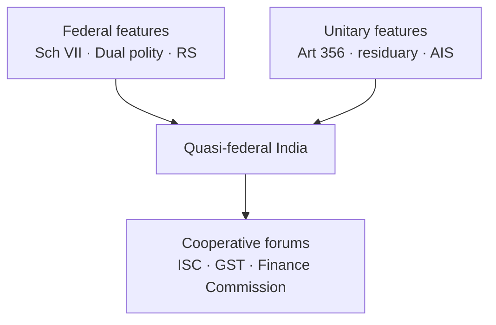
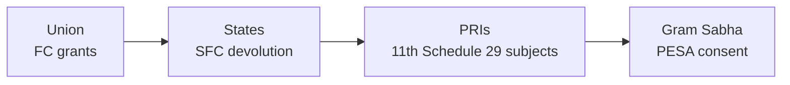

# Federalism — Union, States & Local Devolution

> GS-2 · Topic 02 · Federal structure, Union-State functions, devolution to local levels, challenges

---

## PYQs

| Year | M | Words | Question (EN) | प्रश्न (HI) | ID |
|------|---|-------|---------------|-------------|-----|
| 2025 | 8 | 125 | To what extent is it correct to say that the Inter-State Council can effectively resolve disputes between the Union and the States? Write with suitable examples. | यह कहना कहाँ तक सही है कि अंतर-राज्य परिषद् संघ तथा राज्यों के मध्य विवादों को प्रभावी ढंग से सुलझा सकती है? उपयुक्त उदाहरण सहित लिखिए। | Q1 |
| 2025 | 12 | 125 | How does the provision of legislative powers granted to the Union under the Indian Constitution contribute to the centralized character of India's federal system? Examine. | भारतीय संविधान के अंतर्गत संघ को प्रदान की गई विधायी शक्तियों का प्रावधान भारतीय संघीय प्रणाली के संघ-केंद्रित स्वरूप को किस प्रकार सudृढ़ करता है? परीक्षण कीजिए। | Q2 |
| 2025 | 12 | 125 | Critically analyze the background, key provisions and constitutional, administrative and political implications of the Jammu and Kashmir Reorganization Act, 2019. | जम्मू-कश्मीर पुनर्गठन अधिनियम, 2019 की पृष्ठभूमि, प्रमुख प्रावधानों एवं इसके संवैधानिक, प्रशासनिक और राजनीतिक प्रभावों का समालोचनात्मक विश्लेषण कीजिए। | Q3 |
| 2024 | 12 | 200 | Analyze the statement, "State legislatures are often seen as the voice of the states within India's federal structure." | "राज्य विधान-मंडलों को अक्सर भारत के संघीय ढांचे में राज्यों की आवाज के रूप में देखा जाता है।" — इस कथन का विश्लेषण कीजिए। | Q4 |
| 2023 | 12 | 200 | How does the federal structure in India accommodate the diverse needs and aspirations of different states? Are there any challenges — if yes, how are they addressed? | भारत में संघीय ढाँचा विभिन्न राज्यों की विविध आवश्यकताओं और आकांक्षाओं को कैसे समायोजित करता है? क्या इसके सम्मुख कुछ चुनौतियाँ भी हैं — यदि हाँ, तो उनका समाधान कैसे किया जाता है? | Q5 |
| 2022 | 12 | 200 | The concept of "One nation one election" has its own prospects and limitations in India. Examine. | भारत में "एक राष्ट्र एक चुनाव" की अवधारणा की अपनी संभावनाएं एवं सीमाएं हैं — परीक्षण कीजिए। | Q6 |
| 2021 | 12 | 200 | The structure of the Indian Constitution is federal but its soul is unitary. Elucidate. | 'भारतीय संविधान का ढाँचा संघात्मक है, परंतु इसकी आत्मा एकात्मक है' — स्पष्ट कीजिए। | Q7 |
| 2021 | 12 | 200 | Analyse the problems that have restricted the successes of Panchayati Raj System in India. How far has the 73rd Constitutional Amendment been successful in countering these problems? | भारत में पंचायती राज व्यवस्था की सफलताओं को सीमित करने वाली समस्याओं का विश्लेषण करें। इन समस्याओं का सामना करने में 73वां संविधान संशोधन कितना सफल रहा है? | Q8 |
| 2020 | 8 | 125 | Critically analyse the role of the Inter-State Council in promoting Co-operative Federalism in India. | भारत में सहकारी संघवाद को बढ़ावा देने में अंतर-राज्य परिषद् की भूमिका का आलोचनात्मक परीक्षण कीजिए। | Q9 |

---

## Quick Revision

```
FEDERAL CHARACTER: Dual polity (Centre + States) · Written Constitution · Sch VII division · Supremacy of Constitution
  · Independent judiciary · Bicameralism (Rajya Sabha = states' voice)
  KC Wheare = "Quasi-federal" · Ambedkar = "Unitary with federal features" / "Federal in structure, unitary in spirit"
  Granville Austin = "Cooperative federalism"

UNION LEGISLATIVE CENTRALISATION:
  Sch VII: Union List (97→100 subjects) · State List · Concurrent (47→52)
  Art 246 — Parliament supreme on Union + Concurrent (state law prevails only if assented, else centre prevails on conflict)
  Art 248 + 97 Entry — Residuary powers → UNION
  Art 249 — Rajya Sabha 2/3 → Parliament on State List (national interest)
  Art 250 — During Emergency Parliament on State List
  Art 252 — 2+ states consent → Parliament law for those states
  Art 253 — Treaty obligations override federal division
  Art 356 — President's Rule — state autonomy suspended
  Art 360 — Financial Emergency — centre control

INTER-STATE COUNCIL: Art 263 · PM chair · Created 1990 (V.P. Singh) · Permanent 2006
  Sarkaria (1988) + Punchhi (2010) recommended strengthening
  Functions: dispute resolution, coordination, policy uniformity — BUT advisory, no binding power
  Examples: water (Cauvery via tribunals more effective), GST preceded by council dialogue, NITI/GST Council parallel forums

CO-OPERATIVE FEDERALISM: GST Council (Art 279A) · Finance Commission · NITI Aayog · PM-KISAN joint implementation
COMPETITIVE FEDERALISM: Ease of Doing Business rank · NITI indices · investment summits

ASYMMETRICAL FEDERALISM: Art 370 (historical) · Art 371 A–X (NE, Goa, Sikkim, etc.) · 6th Schedule (autonomous councils)
  J&K Reorganisation Act 2019 → UT J&K (legislature) + UT Ladakh · Art 370 read down via C.O. 272/273

STATE LEGISLATURES AS VOICE: Law on State List · Resolutions · RS members elected by SL · Art 252 consent · block grants debate
  Limits: Art 356 · Governor assent · Money bill centre dominance · concurrent override

ACCOMMODATING DIVERSITY: Linguistic states (1956) · 7th FC · Special category states (historical) · NE councils · DPCO
CHALLENGES: Centre-state friction · Governor politics · fiscal dependency · water border disputes · secessionist/regionalism
  Addressed via: ISC · Inter-state water tribunals · Finance Commission · Zonal councils · Art 263 · SC (S.R. Bommai)

ONOE: Simultaneous Lok Sabha + State Assembly polls
  Pros: cost reduction · policy continuity · less model code paralysis · governance focus
  Cons: constitutional amendments (Art 83, 172) · federal cycle diversity · voter choice dilution · basic structure/federalism debate · premature dissolution sync problem

PANCHAYATI RAJ: 73rd CA 1992 · Part IX · Art 243–243O · 11th Schedule (29 subjects) · Gram Sabha · 3-tier · State Election Commission
  PROBLEMS: 3F crisis — Funds, Functions, Functionaries · State Finance Commissions weak · bureaucratic control · PRI capacity · parallel schemes
  73rd SUCCESS: Constitutional status · regular elections · reservation (SC/ST/women 1/3) · Devolution via PESA 1996 (5th Schedule areas)

LOCAL FINANCE: Art 243H · 243-I (SFC) · 14th FC 42% devolution · 15th FC · tied grants vs untied

TRAPS: India = not pure federation · ISC decisions not binding · RS ≠ only states' house (12 nominated) · 73rd ≠ applied whole India (Meghalaya etc exempt initially)
  ONOE ≠ simple executive order · J&K 2019 ≠ only Art 370 text removal
```

---

## Content

### Context — why federalism matters for UPPCS

India's **federal system** balances **national unity** with **regional diversity** across **28 States** and **8 Union Territories** (post-2023 reorganisation). GS-II Topic 02 tests **Union–State power division**, **centre-tilted legislative design**, **cooperative institutions** (Inter-State Council, GST Council, Finance Commission), **local self-government** (**73rd/74th Amendments**), and live controversies — **J&K Reorganisation (2019)**, **One Nation One Election**, **Inter-State Council effectiveness** — **9 Mains PYQs (2020–2025)**.

### Indian federalism — structure vs "unitary soul"

**Federal features (K.C. Wheare — "quasi-federal"):**
- **Dual polity** — Union and States, each with **constitutional status** (Art **1**, **245–246**).
- **Written Constitution** with **rigid amendment** for federal provisions (Art **368** + state ratification).
- **Division of powers** — **Schedule VII** (Union, State, Concurrent lists).
- **Supremacy of Constitution** — judicial review (**Art 131**, **226**, **32**).
- **Bicameral legislature** — **Rajya Sabha** represents **states** (Art **80** — indirect election by state legislatures).

**Unitary / centralising features (Ambedkar: "Constitution is federal in structure but unitary in spirit"):**
- **Single citizenship** (unlike USA).
- **Single judiciary** — integrated hierarchy.
- **All-India services** (IAS, IPS) — Union control over state administration.
- **Residuary powers with Union** (Art **248**, Entry **97**).
- **Emergency provisions** — **Art 352, 356, 360** tilt power to Centre.
- **Governor** — Union appointee as **Centre's agent** debate.
- **Parliament** can legislate on **State List** under **Art 249, 250, 252, 253**.

| Pure federation (USA) | Indian quasi-federation |
|----------------------|-------------------------|
| Equal state sovereignty | **Asymmetric** state powers (**Art 371**, **6th Schedule**) |
| States have residuary powers | **Union** has residuary powers |
| Dual citizenship possible | **Single citizenship** |
| No state emergency takeover | **Art 356** President's Rule |

**Granville Austin** termed Indian federalism **"cooperative federalism"** — Centre and states must **work together** for governance; **GST Council**, **Finance Commission**, **NITI Aayog** embody this.



### Union legislative powers — centralising the federation

**Article 246** read with **Schedule VII** distributes **subjects**; yet **multiple clauses centralise law-making**:

| Provision | Centralising effect |
|-----------|---------------------|
| **Union List (List I)** | **Defence, foreign affairs, railways, banking, citizenship, atomic energy** — exclusive Parliament domain — widest list |
| **Concurrent List (List III)** | Both legislate; **Art 254** — **central law prevails** on conflict if Parliament law gets **President assent**; state law prevails only if **prior** and **assented**, else **Repugnancy → Centre wins** |
| **Art 248 + Entry 97** | **Residuary powers** — subjects not in any list → **Parliament** (e.g. **AI regulation**, **cyber** debates) |
| **Art 249** | **Rajya Sabha** resolution (**2/3 present and voting**) — Parliament on **State List** for **national interest** (e.g. **COVID-era** debates on health labour) |
| **Art 250** | During **national Emergency (Art 352)** — Parliament on **State List** |
| **Art 252** | **Two or more states** request — Parliament law applicable to consenting states |
| **Art 253** | **International treaty** implementation — Parliament can legislate overriding lists (**Paris Agreement**, **WTO** compliance) |
| **Art 246(1)** | Parliament **extra-territorial** jurisdiction — **foreign affairs** integration |
| **Art 356** | **President's Rule** — state legislative power **suspended** — **S.R. Bommai (1994)** limits misuse |
| **Art 3** | Parliament **creates/bifurcates states** — states consulted but **not consent required** — **central dominance over territorial reorganisation** |

**Examples of centralisation in practice:**
- **GST (101st Amendment, 2017)** — concurrent taxation unified; **GST Council** co-decides rates but **Union weight** in voting.
- **UAPA, IT Act amendments** — national security/digital sovereignty on **Union List** but affect states' law order.
- **Farm laws (2020–21)** — contested as encroaching **State List agriculture** — repealed — shows **federal friction**.

### Inter-State Council (Art 263) — role and limits

**Constitutional basis:** **Article 263** empowers President to establish **Inter-State Council (ISC)** for:
1. **Inquiring** into inter-state disputes.
2. **Discussing** subjects of common interest.
3. **Making recommendations** for **better coordination**.

**History:**
- **First ISC (1950)** under **Constitution** — limited life.
- **Permanent ISC (2006)** — **PM as Chairman**; members include **CMs of all states**, **Union Home Minister**, **6 Union Ministers**, **Governors of states under President's Rule**.
- **Sarkaria Commission (1988)** — strengthen **cooperative federalism**; recommended **active ISC**.
- **Punchhi Commission (2010)** — further **ISC + Art 263** use for **centre-state friction**.

**Strengths / examples:**
- **Dialogue forum** — water, **Aadhaar**, **counter-terrorism**, **NE insurgency** coordination.
- Preceded **policy convergence** — discussions on **VAT→GST** transition.
- **Zonal Councils** (statutory under **States Reorganisation Act, 1956**) — **regional subset** of coordination (**Northern, Southern, Eastern, Western, Central, North-Eastern**).

**Limitations (2025 PYQ core):**
- **Recommendations advisory** — **not binding** on Union or states.
- **No independent dispute resolution power** — **Inter-State Water Disputes Act, 1956** tribunals + **Supreme Court (Art 262, 136)** handle **Cauvery, Krishna, Ravi-Beas** more decisively.
- **Infrequent meetings** — often **crisis-driven**; **2016, 2022** meetings after gaps.
- **Political asymmetry** — PM-chaired forum; **opposition CMs** may see as **unequal power balance**.
- **Cannot override** **Parliament's legislative supremacy** on Union/Concurrent lists.

**Verdict for exams:** ISC **promotes cooperative federalism** and **prevents escalation** but **cannot alone "effectively resolve"** deep structural disputes — needs **binding mechanisms**, **fiscal devolution**, **judicial tribunals**, and **political trust**.

### Co-operative vs competitive federalism

| Type | Mechanism | Example |
|------|-----------|---------|
| **Cooperative** | Shared institutions decide jointly | **GST Council (Art 279A)** — Centre + states vote on tax rates |
| **Cooperative** | Fiscal transfers | **Finance Commission** — **42%** vertical devolution (**14th FC**); **15th FC** 41% (post-J&K/UT change) |
| **Cooperative** | Planning dialogue | **NITI Aayog** — **Governing Council** of CMs |
| **Competitive** | Rankings/incentives | **Ease of Doing Business**, **SDG India Index**, **Aspirational Districts** |
| **Competitive** | Investment outreach | **Vibrant Gujarat**, **UP Investors Summit** — states compete for capital |

### Accommodating diversity — asymmetrical federalism

India accommodates **diverse needs** through **asymmetric provisions**:

| Mechanism | Purpose |
|-----------|---------|
| **Linguistic reorganisation (1956)** | States on **language** — reduced **secessionist linguistic pressure** |
| **6th Schedule (Art 244(2))** | **Autonomous District/Regional Councils** — **Assam, Meghalaya, Tripura, Mizoram** — tribal self-governance |
| **5th Schedule + PESA (1996)** | **Tribal advisory councils**; **Gram Sabha** consent for land alienation |
| **Art 371 A–X** | Special provisions — **Nagaland (A)** — religious/social practices; **Sikkim (371F)**; **Goa (371I)**; **NE states** — protect local laws |
| **Special Category States (historical)** | Higher **plan/grant** ratios — **Himalayan, NE** — now largely subsumed in **14th FC** logic |
| **Union Territories** | Direct **Centre oversight** where **diversity/administration** needs differ — **Delhi (NCT)**, **Puducherry** with assemblies |

**Challenges and responses (2023 PYQ):**

| Challenge | Response mechanism |
|-----------|-------------------|
| **Centre-state legislative overlap** | **ISC**, **Zonal Councils**, **judicial review** |
| **Water disputes** | **Inter-State River Water Disputes Tribunals**; **Supreme Court** |
| **Fiscal dependency** | **Finance Commission** grants; **GST compensation** (2017–2022) |
| **Art 356 misuse** | **S.R. Bommai (1994)** — **floor test**, **judicial review** |
| **Regional aspiration (Telangana)** | **Art 3** reorganisation after **Srikrishna Committee** |
| **Governor–CM conflict** | **Bommai**, **SR Bommai guidelines**; **Punchhi** recommendations |

### State legislatures — voice of the states

State legislatures (**Vidhan Sabha/Vidhan Parishad**) express **regional will** within the federation:

- **Exclusive law-making** on **State List** — **agriculture, police, public health, land** (subject to **Concurrent** overlap and **Art 254**).
- **Rajya Sabha election** — MLAs elect **RS members** — **federal input at Centre**.
- **Art 252 consent** — states invite **Parliament** to legislate uniformly.
- **Resolutions** — e.g. against **central legislation**, demanding **special category**, **NE special status**.
- **Control over state finances** — **budget**, **state GST** implementation via **SGST Act**.
- **Limits:** **Governor** withholds/refer assent; **Art 356** dissolves assembly; **Money Bill** dominance at Centre; **Concurrent list** repugnancy favours **Parliament** with assent.

### Jammu & Kashmir Reorganisation Act, 2019

**Background:**
- **Art 370** granted **temporary special autonomy** — separate constitution (**1957**), limited Union legislative extension without **State concurrence**.
- **2019:** **Presidential Orders C.O. 272 & 273** — **Art 370** effectively read down; **J&K Reorganisation Act, 2019** passed by **Parliament**.

**Key provisions:**
- Bifurcation: **Union Territory of J&K** (with **legislature**) + **Union Territory of Ladakh** (without legislature).
- **Central laws** apply uniformly — **IPC/Ranbir Penal Code** replaced, **RTI, CAG, SC/ST Act**, etc.
- **Delimitation** and **Assembly seats** reconfigured (**114 seats** post-delimitation framework).
- **Statehood** promise — **political debate** ongoing; **2024 Assembly elections** held.

**Constitutional implications:**
- **Federal asymmetry reduced** — move from **special status state** to **UT**.
- **Legal challenges** — **Art 370 abrogation** upheld by **Supreme Court (2023)** with **timeline for elections/statehood**.
- **Basic structure** — **federalism** cited in arguments; Court held **process valid**.

**Administrative implications:**
- **Direct central oversight** in Ladakh; **Lieutenant Governor** system in J&K UT.
- **Central schemes** accelerated — **PMGSY, Ayushman Bharat, railway projects**.
- **Tourism/investment** push — **G20 events in Srinagar (2023)**.

**Political implications:**
- **National integration** narrative vs **local representation** concerns.
- **Pakistan/Kashmir** international dimension; **Article 35A** (struck via order) — **property/residency** rules changed.
- **2024 elections** — **NC–Congress alliance** government — **restoration of statehood** demand.

### One Nation One Election (ONOE)

**Concept:** Synchronise **Lok Sabha** and **State Assembly** elections to a **single cycle** — reduce **frequency of polls**.

**Constitutional backdrop:**
- **Art 83** — Lok Sabha term **5 years** (extendable during Emergency).
- **Art 172** — State Assembly term **5 years**.
- **Art 85/174** — **dissolution** powers — **premature dissolution** desynchronises cycles (since **1967** cycles diverged).

**Prospects:**
- **Reduced election expenditure** — **ECI** estimates massive savings.
- **Less policy paralysis** — **Model Code of Conduct** fewer months.
- **Governance focus** — ministers not **perpetual campaign mode**.
- **High Level Committee (2023, Ram Nath Kovind)** — recommended **implementation roadmap**.

**Limitations:**
- **Constitutional amendments** needed — **sync of terms**, **no-confidence** fallout, **mid-term dissolution** handling.
- **Federal diversity** — states' **political cycles** independent of **national mood** — **voter choice** may **bundle** issues.
- **Anti-defection + coalition** — simultaneous polls favour **national parties** — **regional parties** resist.
- **Basic structure/federalism** debate — **S.R. Bommai** spirit — **state democracy** not subordinate to **national cycle**.
- **Practical:** **Panchayat/urban local** polls also staggered — full sync **complex**.

### Panchayati Raj — 73rd Amendment & local devolution

**Historical:** **Balwant Rai Mehta Committee (1957)** — **democratic decentralisation**; **Ashok Mehta (1978)** after **Janata** phase; **G.V.K. Rao (1985)** — **bureaucracy hijacked development**; **L.M. Singhvi (1986)** — **constitutional status for PRIs**.

**73rd Constitutional Amendment Act, 1992** (effective **1993**):
- **Part IX (Art 243–243O)** + **11th Schedule** — **29 subjects** for PRIs.
- **3-tier system** — **Village, Intermediate (block), District** (states **<20 lakh** population may omit intermediate).
- **Gram Sabha** — **village assembly** — **PESA** strengthens in **Scheduled Areas**.
- **Fixed 5-year term**; **elections within 6 months** if dissolved.
- **Reservation** — **SC/ST** proportional; **women ≥1/3**; **State legislatures** may provide **OBC** reservation (**106th Amendment** debate separate for **women in legislatures**).
- **State Election Commission** — **independent PRI polls**.
- **State Finance Commission (Art 243-I)** every **5 years** — **devolve funds/functions**.

**Problems restricting success (2021 PYQ):**

| Problem | Detail |
|---------|--------|
| **3F crisis** | **Funds, Functions, Functionaries** not fully devolved — **B.K. Committee** highlighted |
| **State control** | **Devolution by state legislation** — uneven (**Karnataka, Kerala** better; others weak) |
| **Parallel structures** | **Line departments**, **MP/MLA LAD funds** bypass PRIs |
| **Capacity** | **Technical staffing** weak — **SFC reports** unimplemented |
| **PESA gap** | **5th Schedule** states slow to **align state laws** with **PESA (1996)** |
| **Exemptions** | **Meghalaya, Nagaland, Mizoram**, **Darjeeling Gorkha Hill Council**, **Nagaland** — **Part IX not applied** or modified |

**73rd Amendment success (balanced):**
- **Constitutional entrenchment** — PRIs **cannot be abolished** casually.
- **Regular elections** in most states — **2.4 lakh+ gram panchayats**.
- **Women's political entry** — **14 lakh+ women representatives**.
- **Legal framework** for **devolution** — but **implementation gap** remains — **"successful structurally, uneven substantively."**



### Finance devolution — Union to states to local

- **Finance Commission (Art 280)** — **vertical** (Union–state share) + **horizontal** (inter-state distribution) devolution.
- **14th FC (2015–20)** — **42%** divisible pool to states — **highest ever**.
- **15th FC (2020–25)** — **41%** (adjusted post **J&K/UT** reorganisation); **grants to local bodies**; **disaster risk** component.
- **GST** — **50:50** IGST split; **compensation cess** ended **2022** — **revenue autonomy** debate.
- **Art 243H** — PRIs may **tax, collect fees** — **limited own revenue** — **dependency on state/FC grants**.

### Contemporary relevance

- **GST Council meetings (2024–25)** — **rate rationalisation**, **casino/online gaming tax** — live **cooperative federalism** test.
- **15th Finance Commission** recommendations — **disaster management grants**, **local body funding** — **post-COVID fiscal federalism**.
- **Kovind Committee ONOE report (2024)** — **constitutional amendments** proposed — **2025 exam angle**.
- **Supreme Court Art 370 judgment (2023)** — **J&K elections by 2024** — **federal asymmetry** jurisprudence settled for now.
- **NITI Aayog SDG Index** — **competitive federalism** ranking states on **health, education, governance**.
- **Digital India / DBT** — **Centre-state IT integration** for **welfare delivery** — **cooperative implementation**.
- **Panchayat empowerment:** **eGramSwaraj**, **SVAMITVA** (property mapping) — **local governance + digital devolution**.
- **Inter-State Council:** Reactivated discussions on ** simultaneous elections**, **NE integration**, **water sharing** — assess **binding vs advisory** gap.

### Limits — balanced view

- **Quasi-federalism** creates **permanent tension** — neither pure **state sovereignty** nor **unitary simplicity**.
- **ISC/GST Council** cannot replace **trust-based politics** — **opposition-ruled states** vs **Union** friction recurring.
- **73rd Amendment** **skeleton strong, flesh weak** — **real decentralisation** needs **SFC enforcement**, **functionary transfer**, **capacity building**.
- **ONOE** may **efficiency-gain** but risks **homogenising** India's **diverse democratic rhythms**.

---

## Answers

### Q1: Inter-State Council can effectively resolve Union–State disputes? (2025, 8M, 125W)

**Introduction:**
> The **Inter-State Council (Art 263)** is India's premier **cooperative federalism forum**, but its **advisory nature** limits effective dispute resolution.

**Main Points:**
- **Advisory mandate** — ISC **recommends** only; **no binding decisions** — states/Union may ignore outcomes.
- **Useful coordination** — **PM-chaired dialogue** prevents escalation on **GST, counter-terrorism, NE policy**.
- **Not a court/tribunal** — **Cauvery, Krishna** disputes resolved via **water tribunals + SC**, not ISC alone.
- **Infrequent meetings** — **gaps 2006–2016** — reactive rather than **institutionalised conflict management**.
- **Power asymmetry** — **Union dominance** — opposition CMs may view as **unequal bargaining**.
- **Partial truth** — Helps **manage friction** and **build consensus**; **cannot fully resolve** structural conflicts.

**Keywords (underline in exam):** Art 263 · Cooperative federalism · Advisory body · Sarkaria Commission · Water tribunals · Non-binding

**Exam diagram (30 sec):**
```
Dispute → ISC (dialogue) → recommendation only
       → Tribunal/SC (water) → binding
```

**Conclusion:**
> ISC is **correct only to a limited extent** — a **confidence-building forum**, not an **effective dispute-resolution authority**.

---

### Q2: Union legislative powers and centralized federal character. (2025, 12M, 125W)

**Introduction:**
> India's federation is **centre-tilted** because **Parliament's legislative domain** is **widened** beyond the Union List through **constitutional exceptions**.

**Main Points:**
- **Union List dominance** — **Defence, foreign policy, banking, railways** — core sovereignty with **Centre**.
- **Residuary powers (Art 248)** — Unlisted subjects (e.g. **cyber, AI**) default to **Parliament** — USA gives these to states.
- **Concurrent List + Art 254** — **Central law prevails** on repugnancy with **President assent** — state autonomy curtailed.
- **Art 249** — **Rajya Sabha** can authorise **State List legislation** for **national interest**.
- **Art 250/352** — **Emergency** enables **Parliament on State List** — **unitary shift**.
- **Art 253** — **Treaty obligation laws** override **federal division** — international commitments centralised.
- **Art 356** — **President's Rule** suspends **state legislative authority** — **federal breakdown mechanism**.

**Keywords (underline in exam):** Schedule VII · Art 248 · Art 249 · Art 254 · Residuary powers · Art 356 · Quasi-federal

**Exam diagram (30 sec):**
```
Union List + Residuary + Concurrent override + Art 249/250/253/356
              → Centre-heavy federation
```

**Conclusion:**
> Legislative design makes India **federal in form** but **decisively centre-capable in law-making** — validating **Ambedkar's "unitary spirit."**

---

### Q3: J&K Reorganisation Act, 2019 — background, provisions, implications. (2025, 12M, 125W)

**Introduction:**
> The **J&K Reorganisation Act, 2019** followed **Art 370** read-down, transforming J&K from a **special-status state** into **two Union Territories**.

**Main Points:**
- **Background** — **Art 370** autonomy; **insurgency**, **integration** debate; **C.O. 272/273 (Aug 2019)**.
- **Key provisions** — **UT J&K** (with legislature) + **UT Ladakh**; **central laws** extended; **35A** invalidated.
- **Constitutional** — **SC upheld (2023)** with **election/statehood timeline**; **asymmetric federalism** reduced.
- **Administrative** — **LG system**, **central schemes** rollout, **Delhi-like** oversight in Ladakh.
- **Political** — **National integration** vs **local representation**; **2024 elections** restored **regional government**.
- **Critical view** — **Federal consent** bypass debate; **development** gains depend on **investment + stability**.

**Keywords (underline in exam):** Art 370 · Reorganisation Act 2019 · UT J&K · Ladakh · C.O. 272 · Asymmetric federalism · SC 2023

**Exam diagram (30 sec):**
```
Art 370 → C.O. 272/273 → Reorg Act → UT J&K + UT Ladakh
                                    → central law uniformity
```

**Conclusion:**
> The Act **legally integrated** J&K with the Union while raising **federalism, democracy, and development** questions still playing out politically.

---

### Q4: State legislatures as voice of states in federal structure. (2024, 12M, 200W)

**Introduction:**
> **State legislatures** are primary **democratic organs** expressing **regional preferences** within India's **quasi-federal** Constitution.

**Main Points:**
- **State List legislation** — **Police, agriculture, health, land** — laws reflecting **local needs**.
- **Rajya Sabha link** — MLAs elect **RS members** — **state interests at Union level**.
- **Art 252 route** — States may request **uniform Parliament law** — **voluntary centralisation**.
- **Budgetary voice** — **State finance bills**, **SGST** framework — ** fiscal federal expression**.
- **Resolutions & dissent** — Criticise **central encroachment** (e.g. **farm laws**, **NE special status**).
- **Limits** — **Governor assent** delays; **Art 356** dissolution; **Concurrent override**; **Money Bill** centre dominance.
- **Not exclusive voice** — **CMs in ISC/GST Council**, **regional parties in LS** also represent states.

**Keywords (underline in exam):** State List · Rajya Sabha · Art 252 · Art 356 · Concurrent List · Regional representation · Governor

**Exam diagram (30 sec):**
```
State Legislature → State laws + RS election + budget
                 ↓ limited by
Art 254 · 356 · Governor · Concurrent override
```

**Conclusion:**
> State legislatures are **important but not sole** "voice of states" — **essential yet constrained** by **central constitutional supremacy**.

---

### Q5: Federal structure accommodates diverse needs — challenges and solutions. (2023, 12M, 200W)

**Introduction:**
> Indian federalism uses **asymmetric design** and **cooperative institutions** to accommodate **diversity**, while **constitutional mechanisms** address recurring **centre-state friction**.

**Main Points:**
- **Linguistic states (1956)** — **Language-based reorganisation** — accommodates **cultural aspirations**.
- **Art 371 A–X, 6th Schedule** — **NE tribal autonomy**, **Nagaland/Sikkim/Goa** special provisions.
- **5th Schedule + PESA** — **Tribal self-governance** via **Gram Sabha** consent.
- **Finance Commission** — **Horizontal devolution** favours **backward, NE, hill states**.
- **GST Council** — **Cooperative decision-making** on **indirect taxes** — shared sovereignty model.
- **Challenges** — **Water disputes**, **Art 356 politics**, **fiscal dependency**, **regionalism**.
- **Solutions** — **ISC/Zonal Councils**, **water tribunals**, **S.R. Bommai**, **Art 3** reorganisation (**Telangana**).

**Keywords (underline in exam):** Asymmetric federalism · Art 371 · 6th Schedule · Finance Commission · GST Council · Cooperative federalism · S.R. Bommai

**Exam diagram (30 sec):**
```
Diversity → 371/6th Schedule/PESA + FC grants
Challenge → water/356/fiscal → ISC/tribunals/Bommai
```

**Conclusion:**
> India **accommodates diversity through flexible federal design**, but **cooperative politics and judicial guardrails** remain essential to **sustain balance**.

---

### Q6: One Nation One Election — prospects and limitations. (2022, 12M, 200W)

**Introduction:**
> **ONOE** proposes synchronising **Lok Sabha and State Assembly** polls — offering **efficiency gains** but facing **constitutional and federal hurdles**.

**Main Points:**
- **Prospects — cost savings** — Reduced **EC expenditure**, **security deployment**, **campaign spending**.
- **Governance continuity** — Shorter **Model Code of Conduct** periods — more **policy implementation time**.
- **Voter turnout** — Single mega-poll may **boost participation** (debated).
- **Limitations — constitutional** — Requires **amending Art 83, 172**, handling **premature dissolution** (**Art 85/174**).
- **Federal concern** — **State cycles** tied to **national mood** — **regional issues diluted**.
- **Political resistance** — **Regional parties** fear **national party advantage**; **coalition instability** if **Lok Sabha falls mid-cycle**.
- **Kovind Committee (2023–24)** — Roadmap proposed but **consensus unfinished** — **basic structure/federalism** scrutiny likely.

**Keywords (underline in exam):** ONOE · Art 83 · Art 172 · Model Code of Conduct · Federalism · Kovind Committee · Simultaneous elections

**Exam diagram (30 sec):**
```
ONOE Pros: cost + governance focus
     Cons: Art 83/172 amend + federal cycle + dissolution sync
```

**Conclusion:**
> ONOE has **real administrative prospects** but **limited political feasibility** without **broad federal consensus and constitutional redesign**.

---

### Q7: Federal structure but unitary soul. (2021, 12M, 200W)

**Introduction:**
> **Dr. Ambedkar** described the Constitution as **federal in structure but unitary in spirit** — combining **regional autonomy** with **national unity mechanisms**.

**Main Points:**
- **Federal structure** — **Dual polity**, **Schedule VII**, **written Constitution**, **RS state representation**, **Art 131** federal disputes.
- **Unitary soul — residuary powers (Art 248)** with **Union** — central **default sovereignty**.
- **Emergency provisions (352, 356, 360)** — **temporary unitary transformation** — **Art 356** most used.
- **Single citizenship, integrated judiciary, All-India Services** — **national integration tools**.
- **Art 249/253/3** — Parliament can **legislate on state subjects**, **create states**, **implement treaties**.
- **Cooperative overlay** — **GST Council, FC** — **federal form** with **strong Centre leadership**.
- **Quote context** — **Not pure federation** like USA — **suited to India's unity-in-diversity**.

**Keywords (underline in exam):** Quasi-federal · Ambedkar · Art 356 · Residuary powers · Single citizenship · Schedule VII · Cooperative federalism

**Exam diagram (30 sec):**
```
Structure: States + Centre (federal)
Soul: Art 356/248/253 + AIS + Emergency (unitary tools)
```

**Conclusion:**
> The phrase captures **India's pragmatic federalism** — **decentralised governance** under a **constitutionally strong Centre**.

---

### Q8: Panchayati Raj problems and 73rd Amendment success. (2021, 12M, 200W)

**Introduction:**
> **Panchayati Raj** aims at **democratic decentralisation**, but **implementation gaps** persist despite the **73rd Amendment (1992)** constitutionalising local governance.

**Main Points:**
- **3F crisis** — **Funds, Functions, Functionaries** not fully transferred — **B.K. Committee** diagnosis.
- **State reluctance** — **Devolution varies** — **Kerala/Karnataka** advanced; many states **weak SFC implementation**.
- **Parallel governance** — **Line departments**, **MLA/MP funds** **bypass PRIs**.
- **Capacity deficit** — **Untrained functionaries**, **low technical staff** at **gram panchayat** level.
- **PESA non-compliance** — **Scheduled Area** states slow to **empower Gram Sabha**.
- **73rd success — constitutional status** — **Part IX + 11th Schedule** — PRIs **mandatory**, **5-year elections**.
- **73rd success — inclusion** — **Women ≥1/3**, **SC/ST reservation** — **14 lakh+ women** in PRIs; **State Election Commissions** institutionalised.

**Keywords (underline in exam):** 73rd Amendment · 11th Schedule · 3F crisis · Gram Sabha · PESA · State Finance Commission · Democratic decentralisation

**Exam diagram (30 sec):**
```
73rd → Part IX + elections + reservation ✓
Gap → Funds/Functions/Functionaries + SFC weak ✗
```

**Conclusion:**
> The **73rd Amendment succeeded structurally** but **partially substantively** — **legal empowerment** achieved; **true devolution** needs **SFC enforcement and capacity**.

---

### Q9: Inter-State Council and cooperative federalism. (2020, 8M, 125W)

**Introduction:**
> The **Inter-State Council (Art 263)** seeks to **institutionalise cooperation** between Centre and states, complementing **competitive federalism** trends.

**Main Points:**
- **Sarkaria/Punchhi legacy** — Recommended **active ISC** to reduce **centre-state distrust**.
- **PM-chaired forum** — **CMs + Union ministers** discuss **shared subjects** — **GST precursor dialogues**.
- **Cooperative federalism** — **Non-binding consensus** on **NE security, river basin planning, Aadhaar integration**.
- **Limitations** — **Advisory only**; **irregular meetings**; **cannot bind** dissenting states.
- **Parallel bodies** — **GST Council (binding vote)** more **effective** on **tax** — ISC **supplement, not substitute**.
- **Critical view** — **Politicisation** when **Centre-state rival parties** — **trust deficit** persists.

**Keywords (underline in exam):** Art 263 · Cooperative federalism · Sarkaria Commission · GST Council · Advisory · PM chairman

**Exam diagram (30 sec):**
```
ISC → dialogue + recommendations (cooperative)
GST Council → binding tax decisions (stronger cooperative)
```

**Conclusion:**
> ISC **promotes cooperative federalism as a dialogue platform** but needs **regularity, binding subsets, and political neutrality** to fulfil its potential.

---

### Q10: *Likely variant:* Centre–State financial relations in India. (12M, 200W)

**Introduction:**
> **Fiscal federalism** determines whether **political autonomy** translates into **real state capacity** — governed by **Finance Commission**, **GST**, and **FC grants to local bodies**.

**Main Points:**
- **Art 280 Finance Commission** — **Vertical/horizontal** devolution from **Union divisible pool**.
- **14th FC — 42%** to states; **15th FC — 41%** post-UT reorganisation — **grants to PRIs/ULBs**.
- **GST (101st Amendment)** — **Pooled indirect tax**; **GST Council** co-decides — **cooperative fiscal model**.
- **State dependency** — **Own tax revenue** limited post-GST; **compensation cess** ended **2022** — **revenue anxiety**.
- **Local devolution** — **Art 243-I SFC** — uneven **PRI funding** — **3F crisis** continues.
- **Disaster/flexible grants** — **15th FC** **disaster risk** component — **post-COVID** cooperative need.

**Keywords (underline in exam):** Finance Commission · 14th FC · 15th FC · GST Council · Fiscal federalism · Art 280 · SFC

**Exam diagram (30 sec):**
```
Divisible pool → FC → States → SFC → PRIs
GST Council → shared indirect tax sovereignty
```

**Conclusion:**
> India's **fiscal federalism is cooperative in design** but **centralised in outcome** — states remain **grant-dependent** with **limited revenue autonomy**.

---

### Q11: *Likely variant:* Competitive federalism in India — significance. (8M, 125W)

**Introduction:**
> **Competitive federalism** incentivises states to **outperform peers** in **governance and investment climate** — complementing **cooperative institutions**.

**Main Characteristics:**
- **NITI Aayog indices** — **SDG India Index**, **Export Preparedness**, **Aspirational Districts** — **rankings drive reform**.
- **Ease of Doing Business** — **State-wise reforms** — **single-window**, **labour law** competition.
- **Investment summits** — **Vibrant Gujarat**, **UP Global Investors Summit** — **capital competition**.
- **Benefits** — **Innovation diffusion**, **citizen-centric reforms**, **accountability**.
- **Limits** — **Rich states advance faster** — **widens regional inequality** without **FC equalisation**.
- **Vs cooperative** — **GST Council/FC** require **collaboration** — **both models coexist**.

**Keywords (underline in exam):** Competitive federalism · NITI Aayog · SDG Index · Ease of Doing Business · Investment summits · Regional inequality

**Exam diagram (30 sec):**
```
Cooperative: GST/FC (joint rules)
Competitive: rankings + investment (state vs state)
```

**Conclusion:**
> Competitive federalism **spurs state-level performance** but must be **balanced by cooperative fiscal equalisation** for **equitable national development**.

---

## Traps

| Wrong | Correct |
|-------|---------|
| India is a pure federation like the USA | **Quasi-federal** — **centre-tilted**; **Wheare/Ambedkar** |
| Inter-State Council decisions are binding | **Advisory only** under **Art 263** — not enforceable |
| Residuary powers belong to states | **Union (Art 248, Entry 97)** — unlike USA |
| 73rd Amendment applies identically nationwide | **Exemptions/modifications** — e.g. **Meghalaya, Nagaland, Mizoram** |
| Rajya Sabha represents only states | **12 nominated members** + **Union territories** representation too |
| ONOE needs only executive notification | Requires **constitutional amendments** (**Art 83, 172**, dissolution sync) |
| Art 370 still operative in original form | **Read down 2019**; **SC upheld 2023** — **UT status** |
| State law always prevails on Concurrent List | **Art 254** — **Parliament law with President assent** prevails on conflict |
| Panchayati Raj devolution complete after 73rd | **3F crisis** persists — **SFC implementation weak** in many states |
| GST ended all centre-state fiscal tension | **Compensation end 2022** renewed **revenue disputes** |
| ISC created only in 2006 | **1950** first; **permanent 2006** |
| Cooperative and competitive federalism are mutually exclusive | **Both operate** — **GST Council** + **NITI rankings** |
| J&K Reorganisation created one UT only | **Two UTs** — **J&K (with legislature)** + **Ladakh** |
| Zonal Councils are constitutional bodies | **Statutory** under **States Reorganisation Act, 1956** — not **Part III** |

---

*Complete.*
