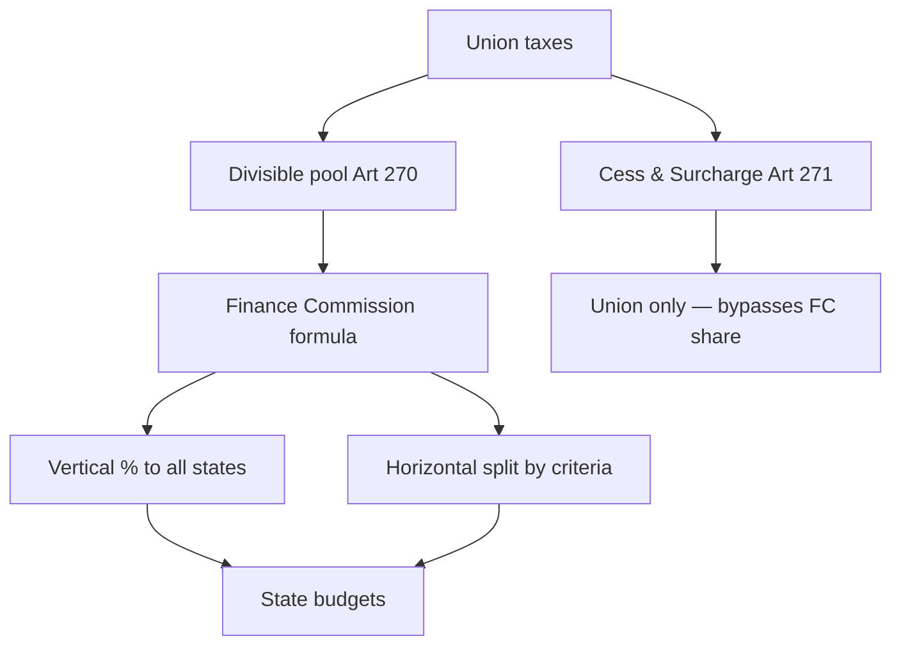

# Finance Commission — Centre–State Financial Relations

> GS-2 · Topic 03 · Role of Finance Commission in Union–State fiscal federalism

---

## PYQs

| Year | M | Words | Question (EN) | प्रश्न (HI) | ID |
|------|---|-------|---------------|-------------|-----|
| 2024 | 12 | 200 | What role can the Finance Commission play in addressing regional disparities in India and what measures has it taken so far? | भारत में क्षेत्रीय असमानताओं को दूर करने में वित्त आयोग क्या भूमिका निभा सकता है और इसने अब तक क्या उपाय किए हैं? | Q1 |
| 2022 | 8 | 125 | Critically examine the role of the Finance Commission in the Centre-State financial relations. | केन्द्र-राज्य वित्तीय सम्बन्धों में वित्त आयोग की भूमिका का समालोचनात्मक परीक्षण कीजिए। | Q2 |
| 2021 | 8 | 125 | Describe the financial relations between the Centre and States in India. | भारत में केंद्र और राज्यों के बीच वित्तीय संबंधों का वर्णन कीजिए। | Q3 |
| 2020 | 12 | 200 | What are the functions of Finance Commission? Examine its emerging role in Fiscal Federalism. | वित्त आयोग के क्या कार्य हैं? राजकोषीय संघवाद में इसकी उभरती भूमिका की समीक्षा कीजिए। | Q4 |

---

## Quick Revision

```
CONSTITUTIONAL BASE: Art 280 — President appoints FC every 5 years (or earlier)
  Qualifications: public affairs + financial expertise · Chairman + 4 members
  Reports → President → Parliament (not binding on govt but conventionally accepted)

FC FUNCTIONS (Art 280): Distribution of net proceeds of taxes between Union & States
  · Principles governing grants-in-aid from Consolidated Fund of India to states
  · Measures to augment Consolidated Fund of a state to supplement resources of Panchayats/Municipalities (73rd/74th)
  · Any matter referred by President in interests of sound finance

CENTRE-STATE FINANCE FRAMEWORK:
  Art 265 — No tax without law
  Art 268 — Stamp duties, etc. (Centre levies, states collect)
  Art 269 — GST on inter-state sale (pre-GST); now Art 269A — IGST
  Art 270 — Taxes in divisible pool (income tax, corporation tax, CGST/SGST share, etc.) — EXcludes cess/surcharge
  Art 271 — Surcharges on certain taxes → wholly for Centre (bypasses devolution)
  Art 275 — Statutory grants (NE, hill states)
  Art 282 — Discretionary grants (Plan/development — now PM-DevINE etc.)
  Art 293 — State borrowing — Centre consent if debt to GOI

DIVISIBLE POOL → FC recommends vertical % to ALL states + horizontal formula among states

VERTICAL DEVOLUTION: Share of states from divisible pool
  12th FC (2005–10): 30.5% → 13th: 32% → 14th: 42% (highest) → 15th: 41% (post J&K UT)

HORIZONTAL DEVOLUTION CRITERIA (15th FC):
  Income distance · Population (2011) · Area · Forest & ecology · Tax & fiscal effort
  Demographic performance · Institutional quality (15th)

REGIONAL DISPARITY TOOLS:
  Income distance (poorer states get more) · Area/forest grants · NE/special grants via Art 275
  Post-devolution revenue deficit grants · Performance grants · Disaster risk grants (15th)
  Grants to local bodies (ULB + PRI tiers)

14th FC HIGHLIGHTS: 42% vertical · Rs 2.87 lakh crore to local bodies · disaster relief reform
15th FC (2020–25): 41% vertical · Rs 8.55 lakh crore to local bodies · 45% population weight
  · Revenue deficit grants to 14 states · Performance-linked grants · Defence/internal security funding from FC pool debate

EMERGING ROLE: Post-GST (101st Amendment) — FC + GST Council dual pillar of fiscal federalism
  GST compensation cess ended 2022 → revenue anxiety → FC gap-filling
  Cess/surcharge proliferation reduces divisible pool → FC relevance vs bypass debate
  NITI Aayog replaced Planning Commission — FC now primary constitutional devolution body
  COVID/post-pandemic — flexible grants, health infrastructure (15th)

CRITICISMS: Recommendations not legally binding · Centre may accept partially
  Cess/surcharge erosion · Delay in FC award implementation · SFC (state level) weak → local devolution gap
  Political economy — richer states subsidise poorer via horizontal formula — friction (GST era)

Vs GST COUNCIL: FC = tax sharing + grants formula · GST Council = rate/structure co-decision (Art 279A)
Vs PLANNING COMMISSION (abolished 2015): FC constitutional; PC was executive — NITI advisory now

TRAPS: FC ≠ RBI · FC ≠ GST Council · FC ≠ NITI · Art 280 ≠ Art 243-I (SFC for local)
  15th FC = 41% not 42% · Cess not in divisible pool · FC report binding? NO — convention only
```

---

## Content

### Context — fiscal federalism and the Finance Commission

**Centre–State financial relations** determine whether India's **political federalism** translates into **real sub-national capacity** to deliver **health, education, agriculture, and local governance**. The **Finance Commission (FC)** — a **constitutional body under Article 280** — is the **primary arbiter** of **tax devolution** and **grants-in-aid**, making it a **high-frequency UPPCS GS-II theme** (**4 PYQs: 2020–2024**).

Unlike the abolished **Planning Commission**, the FC cannot be dissolved by executive fiat — it embodies **cooperative fiscal federalism** alongside the **GST Council (Art 279A)**.

### Constitutional framework — Centre–State finances

India's **federal finance** rests on **assigned taxation powers** (Schedule VII) plus **constitutional articles** on **collection, distribution, borrowing, and grants**.

| Article | Subject |
|---------|---------|
| **Art 265** | No tax without authority of law |
| **Art 268** | Duties levied by Union but **collected and appropriated by states** (e.g. **stamp duties** — pre-GST mix) |
| **Art 269** | Taxes levied and collected by Union but **assigned to states** (legacy taxes; largely subsumed in GST architecture) |
| **Art 269A** | **IGST** on inter-state supply — apportioned per GST law |
| **Art 270** | Taxes on **Union List** levied by Union but shared — **"divisible pool"** basis for FC devolution |
| **Art 271** | **Surcharges** on certain Union taxes — **entire proceeds to Centre** (not shared) |
| **Art 275** | **Statutory grants-in-aid** to states in need (Parliament may legislate; FC recommends principles) |
| **Art 280** | **Finance Commission** — distribution + grants principles |
| **Art 281** | FC report → **President → Parliament** |
| **Art 282** | **Discretionary grants** for public purposes (executive; not FC-mandatory) |
| **Art 293** | **State borrowing** — consent of Centre required if indebted to **Government of India** |
| **Art 243-I / 243-Y** | **State Finance Commissions** for **PRI/ULB** devolution (parallel to FC at state level) |

**Divisible pool (Art 270)** — core of FC work — includes:
- **Income tax** (non-surcharge component)
- **Corporation tax** (non-surcharge)
- **Union duties of excise** (pre-GST legacy framing)
- Post-**101st Amendment (GST)**: share of **GST** as prescribed — **CGST/SGST/IGST** architecture affects pool composition

**Excluded from divisible pool (centralisation lever):**
- **Cesses** for specific purposes (**Road cess, Agriculture Infrastructure Development Cess**, etc.)
- **Surcharges** under **Art 271** — e.g. on income tax for **disaster/health** — **100% Centre retention**
- Debate: **Proliferation of cesses** since **2014** reduces **shareable pool** — states argue **FC devolution % applies to shrinking base**



### Finance Commission — composition and functions

**Article 280** mandates President to constitute FC **every fifth year** (or earlier).

**Composition:** **Chairman + four other members** — chosen for **public affairs experience** and **special knowledge of finance/accounts/administration/economics**. Recent chairpersons: **N.K. Singh (15th)**, **Y.V. Reddy (14th)**, **Vijay Kelkar (13th)**.

**Core functions (Art 280):**
1. **Distribution** of **net proceeds of taxes** between **Union and States** and **allocation among states**.
2. **Principles** governing **grants-in-aid** from **Consolidated Fund of India** to states needing assistance (**Art 275** alignment).
3. **Measures** to augment **state Consolidated Fund** to supplement **Panchayat/Municipality** resources (**73rd/74th Amendment** mandate — added by **97th Amendment, 2011** language clarity).
4. **Any other matter** referred by President in interest of **sound finance**.

**Process:** FC issues **terms of reference (ToR)** from President → **consultations with Centre, states, RBI, stakeholders** → **Report with recommendations** → laid before **Parliament** — **not legally binding** but **strong convention** of acceptance (Centre may **partially implement** — source of **centre-state friction**).

### Vertical and horizontal devolution

**Vertical devolution** — **what share of divisible pool** all states receive collectively:

| FC | Period | Vertical share to states |
|----|--------|--------------------------|
| **12th** | 2005–2010 | **30.5%** |
| **13th** | 2010–2015 | **32%** |
| **14th (Y.V. Reddy)** | 2015–2020 | **42%** — **highest ever** |
| **15th (N.K. Singh)** | 2020–2025 | **41%** — reduced **1%** citing **J&K/UT reorganisation** and **defence/internal security** funding needs |

**Horizontal devolution** — **how the states' pool is split** among **28 states** using **criteria + weights**:

**15th FC horizontal criteria (illustrative weights):**
- **Income distance** — distance from highest per-capita income state (**Haryana** reference) — **45%** — favours **Bihar, UP, Odisha**
- **Population (2011 Census)** — **15%**
- **Area** — **15%** — benefits **Rajasthan, MP, large NE states**
- **Forest & ecology** — **10%** — **Chhattisgarh, Madhya Pradesh, NE**
- **Tax & fiscal effort** — **2.5%**
- **Demographic performance** — **12.5%** — rewards **lower fertility** states (**Kerala, Tamil Nadu**)
- **Institutional quality** — governance metrics

**14th FC** used **2011 population** with **1971 weight controversy** resolved — shifted from **1971** bias to **2011** — **southern states** concern over **demographic penalty/incentive** design.

### Role in addressing regional disparities (2024 PYQ core)

The FC is India's **primary equalisation mechanism** — transferring resources from **fiscally stronger** to **weaker states** without breaking **national tax unity**.

**How FC reduces disparities:**

| Mechanism | Effect |
|-----------|--------|
| **Income distance criterion** | **Poorer per-capita states** (e.g. **Bihar, UP, Jharkhand**) receive **larger horizontal share** |
| **Area & forest weights** | Supports **NE, hill, forest-rich** states with **higher cost of governance/ecological services** |
| **Post-devolution revenue deficit grants** | **15th FC** — grants to **14 states** whose **revenue deficit** persists after tax devolution |
| **Grants to local bodies** | **Targeted tiers** — **gram panchayats** in **backward districts** — **14th FC Rs 2.87 lakh crore**; **15th FC ~Rs 4.36 lakh crore to PRIs + Rs 1.21 lakh crore to ULBs** (total **~Rs 8.55 lakh crore** over award period) |
| **Disaster management grants** | **15th FC** — **separate window** for **disaster risk reduction** — helps **cyclone/flood-prone** coastal and NE states |
| **Performance-linked grants** | Incentivise ** sanitation (ODF+)**, **PM-KISAN DBT quality**, **power sector**, **health infrastructure** — **conditional equalisation** |
| **Special/sector grants** | **Art 275**-type recommendations — **NE, Uttarakhand, Himachal** revenue gap support historically |

**Measures taken so far — commission-wise highlights:**

- **11th FC** — Introduced **debt relief** frameworks for **loss-making power utilities** (state reform era).
- **12th FC** — Linked grants to **fiscal responsibility** legislation (**FRBM** state acts).
- **13th FC** — **GST transition** compensation design inputs; **disaster relief** norms reform post-**14th Finance Commission Act, 2013**.
- **14th FC** — **42% devolution** + **substantial local body grants** + **revenue deficit formula** overhaul — **landmark equalisation push**.
- **15th FC** — **41%** + **COVID-era** flexibility; **health grants** post-pandemic; **defence funding** from FC-assigned resources debate; **2026 Census** population revision deferred in ToR controversy.

**Limits:** FC **cannot fix** disparities alone — **investment climate**, **governance quality**, **human capital**, and **geography** matter; **rich states** argue **horizontal transfers** subsidise ** inefficiency**; **cess bypass** shrinks **effective devolution**.

### Centre–State financial relations — full picture (2021 PYQ)

Beyond FC, centre–state finance includes:

**1. Tax assignment**
- **Union** — **corporation tax, customs, central GST, income tax** (shared), **surcharges/cess**
- **States** — **agriculture income tax** (rare), **state GST**, **stamp duty**, **excise on alcohol**, **motor vehicles tax**, **land revenue**

**2. Tax sharing (FC)** — **Vertical + horizontal** from **divisible pool**

**3. Grants-in-aid**
- **Statutory (Art 275)** — FC-recommended — **revenue gap**, **special states**
- **Discretionary (Art 282)** — **PM programmes**, **CSS matching**, **special packages**

**4. Borrowings**
- **Art 293** — States borrow domestically; **Centre consent** if owing to **GOI**; **state bonds**, **Uday bonds** (power), **GST compensation loans**

**5. GST era (2017+)**
- **101st Amendment** — **dual GST**; **GST Council** decides **rates/exemptions** — **50:50** Centre-state spirit on **SGST/CGST**
- **GST compensation cess (2017–2022)** — protected revenue growth **14%** — ended → **states' revenue anxiety** → **FC role more critical**

**6. Centrally Sponsored Schemes (CSS)**
- **NITI Aayog** rationalisation — **shared funding** — affects **state fiscal space** (beneficiary share)

**7. Local devolution chain**
- **FC → States → State Finance Commissions → PRIs/ULBs** — weak **SFC** = **bottleneck** despite FC local grants

### Emerging role in fiscal federalism (2020 PYQ)

**Historical shift:** **Planning Commission (1950–2015)** allocated **plan grants** — **extra-constitutional** but **politically powerful**. **NITI Aayog (2015)** is **advisory** — **FC became the dominant constitutional devolution institution**.

**Emerging roles:**

| Trend | FC response |
|-------|-------------|
| **GST integration** | FC adjusts for **changed tax structure**; works alongside **GST Council** — dual pillar |
| **Post-compensation era** | **15th FC** revenue deficit grants address **GST revenue shortfall** states |
| **Local governance mandate** | **73rd/74th** — FC **direct grants to PRIs/ULBs** — bypass slow **state pass-through** |
| **Disaster & climate** | **15th FC** **disaster risk grants** — **federal resilience** financing |
| **Performance federalism** | **Outcome-linked grants** — **sanitation, health, power** — **NITI-style incentives via FC** |
| **Defence/internal security (15th ToR debate)** | **Funding from FC divisible pool** for **national security** — **states protested** — shows **FC at centre of union-state bargain** |
| **Cess/surcharge debate** | States demand **inclusion in devolution** or ** cess cap** — FC **ToR** battles reflect **fiscal centralisation** |

**Cooperative vs friction:** FC **institutionalises negotiation** every **5 years** — **16th FC (2025+)** under **Dr. Arvind Panagariya** (chair) — will address **post-COVID debt**, **population Census 2027** base, **climate finance**.

### Criticism — balanced / critical view (2022 PYQ)

**Strengths:**
- **Constitutional legitimacy** — **Art 280** — non-partisan **expert body**
- **Rule-based equalisation** — reduces **ad hoc political grants**
- **Transparency** — published **criteria, weights, state-wise tables**
- **Local body empowerment** — **14th/15th** unprecedented **PRI/ULB** grants

**Weaknesses:**
- **Recommendations not binding** — **Union may cherry-pick** (e.g. **defence funding**, **grant conditions**)
- **Divisible pool erosion** — **cess/surcharge** explosion — **effective devolution** less than **headline 41–42%**
- **Implementation lag** — **Award year vs finance year** mismatch; ** instalment delays**
- **SFC weakness** — FC gives to **states** but **PRIs** depend on **state compliance** — **3F crisis** persists
- **Rich state grievance** — **Tamil Nadu, Karnataka, Maharashtra** — **"tax exporters"** feel **penalised** by **horizontal formula**
- **Cannot address structural inequality alone** — **capital flight**, **private investment gaps** need **non-FC tools**

### Contemporary relevance

- **16th Finance Commission (2024–)** — **Dr. Arvind Panagariya** chair — **ToR** includes **defence, infrastructure, climate** — **state CM resolutions** demanding **fair treatment** — live federal debate.
- **15th FC award (2020–25)** — **COVID supplemental grants**; **health infrastructure** post-pandemic; **disaster grants** for **Himalayan/ coastal states**.
- **GST Council (2024–25)** — **rate rationalisation** after **compensation end** — FC must **fill revenue gaps** for **compensation-dependent states**.
- **PM-DevINE / NE special packages** — **Art 282 discretionary** + **FC statutory** — **dual track** for **regional disparity**.
- **Digital governance & DBT** — **performance grants** tied to **Aadhaar-seeded** delivery — **FC-NITI-Union ministry** convergence.
- **Climate finance** — **15th FC forest/ecology weight** precursor to **green equalisation** in **16th FC** terms.
- **SVAMITVA / eGramSwaraj** — **local revenue mobilisation** complements **FC PRI grants** — **fiscal federalism at last mile**.

---

## Answers

### Q1: FC role in regional disparities + measures taken. (2024, 12M, 200W)

**Introduction:**
> The **Finance Commission (Art 280)** is India's **constitutional equalisation engine**, transferring resources to **fiscally weaker states** through **rule-based devolution and grants**.

**Main Points:**
- **Income distance criterion** — **Horizontal formula** gives **higher share to poorer states** (**Bihar, UP, Odisha**) — core disparity tool.
- **Area & forest weights** — Compensates **large, ecologically sensitive states** (**NE, Chhattisgarh, MP**) for ** governance cost**.
- **Vertical devolution rise** — **14th FC: 42%**; **15th FC: 41%** — expanded **overall state pool** vs earlier commissions.
- **Post-devolution revenue deficit grants** — **15th FC** supports **14 states** still in deficit after tax share.
- **Local body grants** — **14th/15th FC** — **lakhs of crore to PRIs/ULBs** — targets **backward regions** at **last mile**.
- **Disaster & performance grants** — **15th FC** — **cyclone/flood-prone** states + **conditional incentives** for **health, sanitation, power**.
- **Limits** — **Cess bypass**, **non-binding reports**, **SFC bottlenecks** — FC **cannot alone eliminate** disparities.

**Keywords (underline in exam):** Art 280 · Horizontal devolution · Income distance · 14th FC 42% · 15th FC · Revenue deficit grants · Regional equalisation

**Exam diagram (30 sec):**
```
Divisible pool → FC horizontal formula → poorer/larger/forest states get more
              → PRI grants + disaster grants → backward regions
```

**Conclusion:**
> FC has **progressively strengthened equalisation** since **14th/15th awards**, but **full convergence** needs **governance reform, investment, and cess-pool transparency** beyond transfers alone.

---

### Q2: Critically examine FC role in Centre–State financial relations. (2022, 8M, 125W)

**Introduction:**
> The **Finance Commission** mediates **Centre–State fiscal relations** by recommending **tax sharing and grants** under **Art 280**, yet operates within **Union-dominated constraints**.

**Main Points:**
- **Constitutional arbiter** — Recommends **vertical/horizontal** split of **Art 270 divisible pool** — **rule-based federalism**.
- **Grants-in-aid** — **Art 275** principles; **revenue deficit**, **local body**, **disaster grants** — **gap-filling role**.
- **Strength** — **Expert, periodic, transparent criteria** — reduces **pure political discretion** vs **Plan era**.
- **Weakness — non-binding** — **Union may partial accept** — **ToR politics** (e.g. **defence funding** debate).
- **Cess/surcharge erosion** — **Art 271** bypass shrinks **effective devolution** despite **41–42% headline**.
- **GST complement** — Works with **GST Council** post-**101st Amendment** — **dual fiscal federal pillar**.

**Keywords (underline in exam):** Art 280 · Divisible pool · Vertical devolution · Art 275 · Non-binding · Cess surcharge · Fiscal federalism

**Exam diagram (30 sec):**
```
FC → recommends share + grants → Parliament/Union accepts (convention)
Cess/surcharge → bypass FC → Centre retains
```

**Conclusion:**
> FC is **indispensable but incomplete** — **constitutional face of cooperative fiscal federalism**, critically limited by **pool erosion and executive selectivity**.

---

### Q3: Describe financial relations between Centre and States. (2021, 8M, 125W)

**Introduction:**
> **Centre–State financial relations** combine **constitutional tax assignment**, **Finance Commission devolution**, **grants**, **borrowings**, and **GST cooperation**.

**Main Characteristics:**
- **Tax powers** — **Union**: **income tax, corporation tax, customs, CGST**; **States**: **SGST, excise on alcohol, stamp duty, land revenue**.
- **Divisible pool (Art 270)** — Shared taxes — **FC recommends** **vertical %** and **inter-state split**.
- **Grants-in-aid** — **Statutory (Art 275)** via FC; **discretionary (Art 282)** via **Union schemes**.
- **GST architecture** — **101st Amendment**; **GST Council (Art 279A)** — **rate decisions**; **IGST (Art 269A)** sharing.
- **Borrowings** — **Art 293** — state debt; **Centre consent** when owing to **GOI**.
- **Local chain** — **FC → states → State Finance Commissions → PRIs/ULBs**.
- **Cess/surcharge** — **Art 271** — **Centre retains** — not shared with states.

**Keywords (underline in exam):** Art 270 · Art 280 · Art 275 · GST Council · Art 293 · Divisible pool · Art 282

**Exam diagram (30 sec):**
```
Taxes: Union | States | Shared pool (FC)
Plus: Grants 275/282 + GST Council + Borrowing Art 293
```

**Conclusion:**
> India's fiscal federalism is **cooperative but centre-leaning** — **FC devolution** balances **Union tax dominance** with **state spending needs**.

---

### Q4: Functions of FC + emerging role in fiscal federalism. (2020, 12M, 200W)

**Introduction:**
> Under **Art 280**, the **Finance Commission** distributes **tax proceeds** and sets **grant principles**, increasingly central as **Planning Commission ended** and **GST matured**.

**Main Points:**
- **Core functions** — **Tax distribution** Union–States; **grants-in-aid** principles; **PRI/ULB augmentation** measures; **any referred matter**.
- **Composition** — **Chairman + 4 members** — appointed by **President** every **5 years**; report to **Parliament via President**.
- **Emerging role — post-NITI** — **Primary constitutional devolution body** replacing **Plan grant dominance**.
- **GST era partner** — Complements **GST Council** after **compensation cess ended (2022)** — **revenue deficit grants**.
- **Local governance** — **14th/15th FC** — **direct local body grants** — **73rd/74th fiscal empowerment**.
- **Performance federalism** — **Outcome-linked grants** — **health, power, sanitation** — **NITI-style incentives via FC**.
- **New frontiers** — **Disaster/climate grants**, **defence funding ToR debate**, **16th FC (Panagariya)** — **post-COVID debt** equalisation.

**Keywords (underline in exam):** Art 280 · Fiscal federalism · GST Council · 14th FC · 15th FC · PRI grants · NITI Aayog

**Exam diagram (30 sec):**
```
FC functions: Share taxes + grants + local augmentation
Emerging: GST partner + performance grants + disaster/climate
```

**Conclusion:**
> FC's **emerging role** is **constitutional anchor of fiscal federalism** in a **GST-cooperative, post-Plan, performance-oriented** Union–State system.

---

### Q5: *Likely variant:* Vertical vs horizontal devolution — explain with 15th FC. (8M, 125W)

**Introduction:**
> **Finance Commission devolution** has two layers — **vertical** (Union vs all states) and **horizontal** (among individual states).

**Main Characteristics:**
- **Vertical devolution** — **15th FC: 41%** of **divisible pool** to **states as a whole** — down **1%** from **14th FC (42%)**.
- **Horizontal devolution** — Split among **28 states** using **weighted criteria**.
- **Income distance (45%)** — Benefits **low per-capita income states**.
- **Population 2011 (15%)** — Larger states gain absolute share.
- **Area (15%) + Forest (10%)** — **Geographic/ecological compensation**.
- **Demographic performance (12.5%)** — Rewards **population control** states.
- **Combined effect** — **Poorer, larger, forest-rich** states gain; **richer southern states** relatively lose share.

**Keywords (underline in exam):** Vertical devolution · Horizontal devolution · 15th FC · Income distance · Divisible pool · 41%

**Exam diagram (30 sec):**
```
Pool → 41% vertical (all states)
     → horizontal split: income + pop + area + forest + performance
```

**Conclusion:**
> **Vertical devolution sets state share nationally; horizontal devolution operationalises regional equalisation** — heart of **FC disparity policy**.

---

### Q6: *Likely variant:* Finance Commission vs GST Council. (8M, 125W)

**Introduction:**
> Both institutions structure **cooperative fiscal federalism**, but differ in **constitutional basis, function, and binding nature**.

**Main Characteristics:**
- **Finance Commission** — **Art 280**; **tax sharing + grants** from **divisible pool**; report **conventionally accepted**.
- **GST Council** — **Art 279A (101st Amendment)**; **GST rates, exemptions, dispute resolution**; **voting structure** (Centre **1/3**, states **2/3**).
- **FC — periodic (5 years)**; **GST Council — continuous** meetings.
- **FC — equalisation** focus; **GST Council — harmonisation** of **indirect tax**.
- **Overlap post-2017** — **GST changed divisible pool**; **compensation cess (2017–22)** then **FC gap grants**.
- **Complementary** — **GST Council** decides **how much tax**; **FC** decides **how to share** Union-collected revenue.

**Keywords (underline in exam):** Art 280 · Art 279A · GST Council · Divisible pool · Cooperative federalism · 101st Amendment

**Exam diagram (30 sec):**
```
GST Council → rate/structure of GST
FC → share of pool + grants to states
Both → fiscal federalism pillars
```

**Conclusion:**
> **GST Council manages tax design; Finance Commission manages tax distribution** — together they define **modern Indian fiscal federalism**.

---

## Traps

| Wrong | Correct |
|-------|---------|
| Finance Commission is a statutory body | **Constitutional body — Art 280** |
| FC recommendations are legally binding on Union | **Advisory by convention** — Parliament/Union may modify acceptance |
| 15th FC recommended 42% vertical devolution | **41%** (14th FC was **42%**) |
| Cess and surcharge are shared via FC formula | **Excluded** from divisible pool — **Art 271** surcharges to Centre |
| FC distributes all Union taxes | Only **Art 270 divisible pool** — not customs entirely, not all cesses |
| FC = GST Council | **Art 280 vs Art 279A** — sharing vs rate structure |
| FC = NITI Aayog | **FC constitutional**; **NITI advisory** — replaced **Planning Commission** |
| FC handles state-to-PRI devolution directly always | Recommends **grants to local bodies**; **states/SFC** still key pass-through |
| Finance Commission appointed by Parliament | **President appoints** under **Art 280** |
| Art 275 grants need no FC input | FC recommends **principles** for **grants-in-aid** under **Art 275** |
| 13th FC first introduced GST compensation | **GST Council/ Parliament** designed compensation; **13th FC** transition era |
| State Finance Commission = Finance Commission | **Art 243-I SFC** — **state-level** for **PRIs**; FC is **Union-level** |
| Horizontal devolution favours only small states | **Income distance** favours **poor states** (often large — **UP, Bihar**) |

---

*Complete.*
