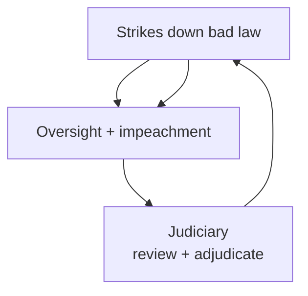
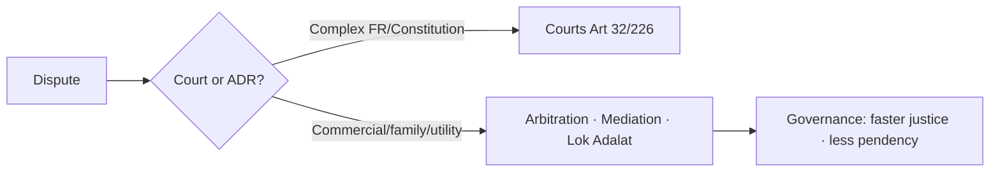

# Separation of Powers, ADR & Dispute Redressal

> GS-2 · Topic 04 · Separation of powers, dispute redressal institutions, ADR, judicial activism, PIL

---

## PYQs

| Year | M | Words | Question (EN) | प्रश्न (HI) | ID |
|------|---|-------|---------------|-------------|-----|
| 2025 | 8 | 125 | How does Alternative Dispute Resolution (ADR) strengthen efficient governance and enhance the effectiveness of the justice delivery system in India? Analyze. | वैकल्पिक विवाद समाधान (ADR) भारत में कुशल शासन को सudृढ़ करने तथा न्याय वितरण प्रणाली की प्रभावशीलता बढ़ाने में किस प्रकार सहायक है? विश्लेषण कीजिए। | Q1 |
| 2023 | 8 | 125 | Mention three demerits of Judicial Activism. | न्यायिक सक्रियता के तीन दोषों का वर्णन कीजिए। | Q2 |
| 2023 | 12 | 200 | What alternative mechanisms of dispute resolution have emerged in recent years? How far have they been effective? | विवादों के समाधान के लिए, हाल के वर्षों में कौन-से वैकल्पिक तंत्र उभरे हैं? वे कितने प्रभावी सिद्ध हुए हैं? | Q3 |
| 2022 | 8 | 125 | "Lok Adalats have acted as a great catalyst for change in the Indian Legal System." Elucidate. | "लोक अदालतों ने भारतीय विधिक प्रणाली में परिवर्तन लाने में उत्प्रेरक की भूमिका निभाई है।" स्पष्ट करें। | Q4 |
| 2020 | 8 | 125 | Explain the concept of Judicial Activism and evaluate its impact on the relationship of Executive and Judiciary in India. | न्यायिक सक्रियतावाद की व्याख्या कीजिए तथा भारत में कार्यपालिका एवं न्यायपालिका के पारस्परिक सम्बन्धों पर इसके प्रभाव का मूल्यांकन कीजिए। | Q5 |
| 2020 | 8 | 125 | 'Article 32 is the soul of the Indian Constitution.' Explain it in brief. | 'अनुच्छेद 32 भारत के संविधान की आत्मा है।' संक्षेप में व्याख्या कीजिए। | Q6 |
| 2020 | 12 | 200 | "Every matter of Public Interest cannot be a matter of Public Interest Litigation." Evaluate. | "लोकहित का प्रत्येक मामला लोकहित वाद का मामला नहीं होता।" मूल्यांकन कीजिए। | Q7 |
| 2018 | 12 | 200 | Write a short note on the emergence and use of alternative dispute redressal mechanisms in India. | भारत में वैकल्पिक विवाद निवारण तंत्रों का उदय एवं प्रयोग पर एक संक्षिप्त टिप्पणी लिखिए। | Q8 |

---

## Quick Revision

```
SEPARATION OF POWERS: Montesquieu — legislative · executive · judiciary separate
India = NOT rigid separation — "checks and balances" + functional overlap
  Legislature: Art 121/212 immunity · law-making · impeachment of judges
  Executive: Art 74 PM/Council · Art 53 President · implements law · appointments
  Judiciary: Art 50 DPSP separate judiciary · judicial review Art 13 · Art 142 complete justice
Overlap: Ordinance Art 123 · delegated legislation · PIL · tribunal adjudication

DISPUTE REDRESSAL INSTITUTIONS:
  Courts: SC (Art 124) · HC · subordinate · Art 131 inter-state · Art 262 water (Parliament may exclude SC)
  Tribunals: Art 323A (admin/service) · Art 323B (tax, land, etc.) — CAT, NGT, NCLT, DRT, RERA authority
  Commissions: NHRC · SHRC · CIC (RTI disputes)
  Ombudsman: Lokpal/Lokayukta (statutory)

ART 32 — DR AMBEDKAR "heart & soul" · FR enforcement · SC + HC Art 226
  Writs: Habeas Corpus · Mandamus · Certiorari · Prohibition · Quo Warranto
  Art 32(4) — suspended during Emergency (Art 359)

ADR TYPES: Arbitration · Conciliation · Mediation · Lok Adalat · Negotiation
Legal Services Authorities Act 1987 — NALSA · SLSA · DLSA · Taluka LS
Arbitration & Conciliation Act 1996 (amended 2015, 2019) — institutional arbitration · fast track
Lok Adalat: Nyaya Panchayat spirit · binding if compromise · no appeal · Permanent Lok Adalat (PLA) — pre-litigation public utility
Mediation Act 2023 — mediated settlement enforceable

JUDICIAL ACTIVISM: Judges fill gaps — expand FR/DPSP · PIL · Vishaka guidelines · Olga Tellis
  Proponents: accountability when executive/legislature fail · rights expansion
  Demerits: overreach · unelected judges make policy · separation breach · backlog from PIL abuse · uncertainty
  Judicial restraint vs overreach — L. Chandra Kumar (tribunal + judicial review core)

PIL: Epistolary jurisdiction — Krishna Iyer, Bhagwati · relaxed locus standi · S.P. Gupta 1981
  Limits: must be genuine public injury · not personal grievance · not mala fide · locus to affected/vigilant citizen
  Abuse: publicity PIL · corporate PIL · delayed dismissal · "every public interest ≠ PIL" (2020 PYQ)

LOK ADALAT IMPACT: 3 crore+ cases settled · pendency reduction · free · informal · catalyst for ADR culture
RECENT ADR: ODR (e-Courts Phase III) · pre-institution mediation (commercial courts) · MSME Samadhan · RERA · consumer commissions · family courts mediation · NALSA awareness

TRAPS: India ≠ US rigid separation · Lok Adalat award = decree if compromise · Art 32 ≠ Art 226 scope
  Judicial activism ≠ judicial review always · PIL ≠ writ for all public issues · Arbitration award appeal limited (Sec 34)
```

---

## Content

### Context — governance, justice, and constitutional balance

**Topic 04** links **Montesquieu's separation of powers** with India's **pragmatic overlap model**, **constitutional dispute forums** (courts, tribunals, commissions), and **Alternative Dispute Resolution (ADR)** as pressure valves on **3.5+ crore pending cases**. UPPCS repeatedly tests **ADR + Lok Adalats**, **judicial activism demerits**, **Art 32**, and **PIL limits** — **8 PYQs (2018–2025)**.

Efficient governance requires **fast, affordable, legitimate dispute resolution** without **judiciary encroaching legislature** or **executive capture of courts**.

### Separation of powers in India

**Doctrine origin:** **Montesquieu (*Spirit of Laws*)** — liberty safe when **legislative, executive, judicial** powers not concentrated in one organ.

**Indian model — not watertight separation:**
- **Constitution** creates **three organs** but permits **controlled overlap** for **efficiency and accountability**.

| Organ | Constitutional base | Core functions |
|-------|---------------------|----------------|
| **Legislature** | Part V/VI — **Parliament, State Legislatures** | Law-making, budget, oversight, **impeachment (Art 124(4))** |
| **Executive** | **Art 53** (President), **Art 74** (PM/Council), **Governor** | Policy, administration, **ordinances (Art 123/213)**, treaties, appointments |
| **Judiciary** | **Art 124** (SC), **Art 214** (HC) | Adjudication, **judicial review (Art 13)**, **Art 142** complete justice |

**Checks and balances:**
- **Judiciary** strikes down **unconstitutional laws** — limits legislature.
- **Legislature** controls **finance**, **impeaches judges**, amends **tribunal jurisdiction**.
- **Executive** appoints **judges (Collegium process)**, issues **ordinances** — subject to **judicial scrutiny** (**R.C. Cooper**, **Krishna Kumar Singh** on ordinances).

**Art 50 (DPSP)** — **Separate judiciary from executive** — not fully achieved historically (collector-magistrate legacy); **post-independence reform** toward separation.

**Immunities preserving separation:**
- **Art 121/212** — No discussion in Parliament/State legislature on **judges' conduct** except impeachment.
- **Art 361** — **President/Governor** immunity from court criminal process (not civil immunity for office acts debate).



### Dispute redressal mechanisms and institutions

**1. Constitutional courts**
- **Supreme Court** — **Art 131** original jurisdiction on **Centre-state/federal disputes**; **Art 132–136** appellate; **Art 32** writs.
- **High Courts** — **Art 226** writs (wider than Art 32 — **any person**, **any rights** including non-FR).
- **Subordinate judiciary** — **district/session courts** — bulk of civil/criminal workload.

**2. Tribunals (specialised ADR-adjacent adjudication)**
- **Art 323A** — **Administrative tribunals** — **Central Administrative Tribunal (CAT)** — service matters.
- **Art 323B** — **Other tribunals** by Parliament/States — **tax, land, labour, elections**.
- Key tribunals: **NGT (2010)** — environment; **NCLT/NCLAT** — companies/insolvency (**IBC 2016**); **DRT** — bank recovery; **RERA authorities** — real estate; **ITAT, CESTAT** — tax.
- **L. Chandra Kumar (1997)** — **Tribunals OK** but **HC/SC judicial review** remains — **basic structure**.

**3. Alternative forums**
- **Consumer commissions** — **Consumer Protection Act, 2019** — **district/state/national** tiers — **quick consumer ADR**.
- **Family courts** — **1984 Act** — **conciliation/mediation** encouraged.
- **MSME Samadhan** — **delayed payment** portal — **online dispute facilitation**.
- **Lokpal/Lokayukta** — **corruption grievance** against public servants — **investigative, not full court substitute**.

**4. Commissions**
- **NHRC/SHRC** — **human rights complaints** — recommendatory.
- **CIC** — **RTI disputes** — quasi-judicial orders.

### Article 32 — soul of the Constitution

**Dr. B.R. Ambedkar** in Constituent Assembly: **"If I was asked to name any particular Article… I would refer to Article 32… the very soul of the Constitution and the very heart of it."**

**Article 32(1)** — Right to move **Supreme Court** for enforcement of **Fundamental Rights**.

**Writs (Art 32 + 226):**

| Writ | Purpose | Example use |
|------|---------|-------------|
| **Habeas Corpus** | Produce detained person | **Illegal detention**, **UAPA** challenges |
| **Mandamus** | Command public duty | **Authority failing statutory duty** |
| **Certiorari** | Quash illegal order | **Tribunal excess of jurisdiction** |
| **Prohibition** | Stop lower court proceeding | **Ultra vires proceedings** |
| **Quo Warranto** | By what authority holding office | **Illegal public office** |

**Significance:**
- **Direct access to SC** — **constitutional guarantee** — distinguishes India from systems needing **ordinary litigation first**.
- **Art 32 itself is FR (Art 32(2))** — cannot be suspended except as **Art 359** during Emergency for specified FR.
- **Art 226 (HC)** — **wider scope** but **Art 32** remains **special FR remedy** — **Kesavananda** included **Art 32** in **basic structure**.

### Alternative Dispute Resolution (ADR) — emergence and framework

**Why ADR emerged:**
- **Court pendency** — **4.5+ crore cases** nationally (2024 estimates) — **decades-long delays** undermine **rule of law and investment**.
- **Cost** — litigation expensive for **poor and MSMEs**.
- **Social capital** — Indian tradition of **panchayat mediation** — modern ADR **institutionalises** informal justice.

**Statutory pillars:**

| Law / institution | Role |
|-------------------|------|
| **Arbitration and Conciliation Act, 1996** (amended **2015, 2019**) | **Binding arbitration**; **conciliation**; **interim relief (Sec 9)**; **fast-track**; **institutional arbitration** (MCI, DIAC) |
| **Legal Services Authorities Act, 1987** | **NALSA** (national), **SLSA/DLSA/TLSA** — **free legal aid** + **Lok Adalats** |
| **Mediation Act, 2023** | **Mediated settlement agreement** enforceable as **court decree**; **Mediation Council of India** |
| **Commercial Courts Act, 2015** (amended **2018**) | **Pre-institution mediation** mandatory for commercial disputes (subject to exceptions) |
| **Section 89 CPC** | Court may refer civil disputes to **ADR** — **arbitration, conciliation, judicial settlement, Lok Adalat** |

**ADR modes compared:**

| Mode | Decision-maker | Binding? | Flexibility |
|------|----------------|----------|-------------|
| **Arbitration** | Arbitrator(s) | **Yes (award)** | High — party-chosen procedure |
| **Mediation** | Mediator facilitates | **If settlement signed** | Highest — voluntary |
| **Conciliation** | Conciliator proposes | **If accepted** | Medium |
| **Lok Adalat** | Bench + parties | **Yes if compromise** — **decree status** | Informal, no court fee |
| **Negotiation** | Parties themselves | If contract | Informal |

### Lok Adalats — catalyst for legal change (2022 PYQ)

**Origin:** **1982 Gujarat experiment** — formalised under **Legal Services Authorities Act, 1987**.

**Features:**
- **Periodic Lok Adalats** + **Daily Permanent Lok Adalats (PLA)** for **public utility services** (transport, postal, telecom, insurance) — **pre-litigation** stage.
- **No court fee**; **free legal aid**; **informal** — parties can speak directly.
- **Compromise decree** — **binding**; **no appeal** against award (**Sec 21(2) LSA Act**).
- **NALSA** coordinates **National Lok Adalat** on single day — **mass disposal** (lakhs of cases per round).

**Impact as "catalyst":**
- **Crores of cases settled** cumulatively — reduces **pendency** without full trial.
- **Changed mindset** — lawyers, judges, public accept **settlement over winner-takes-all**.
- **Gateway to ADR culture** — led to **arbitration reform 2015**, **mediation bill**, **commercial mediation**.
- **Access to poor** — **legal aid + Lok Adalat** synergy — **Article 39A** (equal justice) operationalised.

**Limits:** Works best for **compoundable, negotiable** matters — not ideal for **serious criminal, constitutional, or precedent-setting** cases.

### Judicial activism — concept, impact, demerits

**Judicial activism** — judiciary **proactively interprets** law to **fill governance gaps**, expand **rights**, sometimes **direct policy** when other organs fail.

**Drivers in India:**
- **Expanded locus standi** — **PIL**
- **FR-DPSP gap** — courts give **enforceable content** to rights (**Vishaka 1997** — workplace harassment guidelines before statute)
- **Executive/legislative vacuum** — **environment (M.C. Mehta)**, **right to food/education** jurisprudence

**Impact on Executive–Judiciary relations (2020 PYQ):**
- **Positive:** **Accountability** — **2G, coal block** cancellation cases; **election reforms**; **police reforms (Prakash Singh)** directions.
- **Tension:** **Executive** sees **policy encroachment** — **coal/g telecom spectrum**, **liquor ban on highways**, **Delhi pollution orders** — **separation of powers** friction.
- **Institutional dialogue** — **Memoranda, guidelines** instead of statutes — **legislature sometimes reacts** (e.g. **Vishaka → POSH Act 2013**).

**Three demerits (2023 PYQ — exam-ready):**
1. **Judicial overreach / separation breach** — **Unelected judges** decide **budgetary/administrative** matters lacking **democratic legitimacy** and **technical expertise**.
2. **Policy uncertainty** — **Frequent judicial directions** without **clear statutory basis** confuse **executive implementation** and **investment planning**.
3. **PIL abuse & docket explosion** — **Frivolous/adversarial PILs** burden **SC/HC**, delay **genuine FR cases**, and **weaponise courts** for **publicity or corporate rivalry**.

Related critique: **Collegium opacity** + activism combine to **concentrate power** in judiciary without **accountability mirror**.

### Public Interest Litigation (PIL) — scope and limits

**Evolution:** **1970s–80s** — **Justice V.R. Krishna Iyer**, **Justice P.N. Bhagwati** — **epistolary jurisdiction** (postcard PIL), relaxed **locus standi**.

**Landmark:** **S.P. Gupta v. Union of India (1981)** — **any public-spirited citizen** may approach court for **others unable to litigate**.

**Legitimate PIL subjects:** **Bonded labour, prison reform, environmental degradation, child labour, corruption, disabled rights, sexual harassment (Vishaka)**.

**2020 PYQ evaluation — "Every public interest ≠ PIL":**
- **Not every governance grievance** is **justiciable** — courts reject PIL when **no legal right violated**, **pure policy choice**, or **alternative remedy** exists.
- **Personal disguised as public** — **service matter, private contract, inter-party business rivalry** — dismissed (**Tehseen Poonawalla** guidelines spirit).
- **Mala fide / publicity** — **SC strict filtering (2023–24)** — impose **costs** on **abusers**.
- **Political questions** — **diplomacy, defence procurement nuances** — **limited judicial competence**.
- **Balanced rule:** PIL for **enforceable constitutional/statutory rights** affecting **marginalised or diffuse interests** — not **substitute for legislature** or **media debate**.

**Reforms:** **Master of Roster**, **PIL scrutiny cell**, **deposit for PIL**, **Amicus curiae** discipline.

### ADR — governance and justice delivery (2025 PYQ synthesis)

**Strengthens efficient governance by:**
- **Reducing pendency** — frees **judicial bandwidth** for **constitutional/complex** matters.
- **Ease of doing business** — **commercial arbitration/mediation** (**Singapore Convention** alignment post **2019 amendment**) — **investor confidence**.
- **Welfare delivery** — **Lok Adalat** for **bank loan, insurance, utility** disputes — **financial inclusion**.
- **Social harmony** — **Mediation in family/matrimonial** cases — **preserves relationships** vs adversarial trial.
- **Digital governance** — **ODR**, **e-Lok Adalat**, **MSME Samadhan** — **scalable dispute resolution**.

**Enhances justice delivery by:**
- **Speed** — arbitration **12-month** target (2015 amendment); **Lok Adalat same-day** settlement.
- **Affordability** — **no fee in legal aid/Lok Adalat**; mediation cheaper than trial.
- **Access (Art 39A)** — **NALSA** — **women, SC/ST, workers** reach justice.
- **Party autonomy** — **choose arbitrator/mediator**, venue, procedure.

**Effectiveness limits (2023 PYQ):**
- **Awareness gap** — **rural poor** still **court-centric**.
- **Arbitration cost/delay** — **judicial intervention (Sec 34)** delays; **institutional fee** high in **commercial** cases.
- **Mediation Act 2023** — **early implementation** uneven.
- **Executive non-compliance** with ** tribunal/Lok Adalat awards** in **government litigation** culture.
- **Not substitute** for **criminal justice** or **constitutional adjudication**.



### Contemporary relevance

- **Mediation Act, 2023** — **institutional mediation** push; **court-annexed mediation** expanding in **Delhi, Bombay, Allahabad HC** circuits.
- **e-Courts Phase III** — **ODR integration**, **virtual Lok Adalats** post-COVID — **digital ADR**.
- **Commercial Courts** — **mandatory pre-institution mediation** — **2023–25** caseload diversion data emerging.
- **IBC/NCLT** — **creditor-debtor ADR-style** resolution — **insolvency reform** as **economic dispute redressal**.
- **RERA** — **homebuyer-developer** disputes — **state authorities** as **specialised forum**.
- **SC PIL reform (2024)** — **strict locus**, **costs on frivolous PIL** — implements **"not every public interest = PIL"**.
- **Arbitration Council of India (2019 Act)** — **grading arbitral institutions** — **quality control**.
- **UP context:** **UP Lok Adalat** drives under **UP SLSA** — high **motor accident claims**, **land revenue**, **family** settlements — **state governance exam link**.

### Limits — balanced view

- **Separation of powers** requires **judicial restraint** where **accountability mechanisms** (elections, RTI, Lokpal) suffice.
- **ADR cannot replace** **constitutional courts** for **basic structure, FR, federal disputes**.
- **Tribunalisation** risk — **L. Chandra Kumar** guardrail must hold — **HC supervision** essential.
- **PIL + activism** without **self-restraint** erodes **democratic legitimacy** of judiciary.

---

## Answers

### Q1: ADR strengthens governance and justice delivery — analyze. (2025, 8M, 125W)

**Introduction:**
> **Alternative Dispute Resolution (ADR)** — **arbitration, mediation, conciliation, Lok Adalat** — reduces **court overload** and makes **justice faster, cheaper, and governance-friendly**.

**Main Points:**
- **Pendency reduction** — **Lok Adalats/NALSA** dispose **lakhs** of cases — frees courts for **complex constitutional matters**.
- **Ease of doing business** — **Arbitration Act 1996/2015** — **commercial disputes** resolved faster — **investment climate**.
- **Affordable access (Art 39A)** — **Free legal aid + Lok Adalat** — **poor, MSMEs** not excluded from justice.
- **Governance efficiency** — **Utility/insurance/bank** disputes settled via **Permanent Lok Adalat** — **public service continuity**.
- **Mediation Act 2023** — **Enforceable settlements** — **family/commercial harmony** vs adversarial litigation.
- **Digital ADR** — **ODR, e-Lok Adalat, MSME Samadhan** — **scalable** dispute resolution aligned with **Digital India**.

**Keywords (underline in exam):** ADR · Lok Adalat · NALSA · Mediation Act 2023 · Pendency · Art 39A · Arbitration

**Exam diagram (30 sec):**
```
ADR → speed + cost saving → less pendency → better governance + justice access
```

**Conclusion:**
> ADR **complements courts** — strengthening **efficient governance** by making **justice delivery timely, inclusive, and economy-supporting**.

---

### Q2: Three demerits of Judicial Activism. (2023, 8M, 125W)

**Introduction:**
> **Judicial activism** expands **rights and accountability** but carries **structural risks** for **democracy and separation of powers**.

**Main Characteristics:**
- **Separation of powers breach** — **Unelected judges** enter **policy/budget/administration** — **democratic legitimacy deficit**.
- **Judicial overreach uncertainty** — **Frequent directions** without **statute** — **executive confusion**, **investment instability**.
- **PIL abuse & backlog** — **Frivolous PILs** clog **SC/HC** — delay **genuine Fundamental Rights** enforcement.

**Keywords (underline in exam):** Judicial overreach · Separation of powers · PIL abuse · Democratic legitimacy · Policy uncertainty

**Exam diagram (30 sec):**
```
Activism + → rights/accountability
         − → overreach · PIL abuse · policy confusion
```

**Conclusion:**
> Activism's **demerits** demand **judicial self-restraint** and **strict PIL filters** to preserve **institutional balance**.

---

### Q3: Alternative dispute mechanisms in recent years — effectiveness. (2023, 12M, 200W)

**Introduction:**
> Recent years saw **institutional expansion of ADR** — from **Lok Adalats** to **statutory mediation and ODR** — to tackle **mounting pendency**.

**Main Points:**
- **Mediation Act, 2023** — **Binding mediated agreements**; **Mediation Council of India** — **new national framework**.
- **Commercial Courts (2015/2018)** — **Mandatory pre-institution mediation** — diverts **commercial suits**.
- **Arbitration amendments (2015, 2019)** — **Time-bound awards**, **Arbitration Council of India** — **quality institutions**.
- **Permanent Lok Adalats** — **Pre-litigation** utility disputes — **high settlement rates**, **no appeal**.
- **Sector forums** — **RERA**, **NCLT/IBC**, **consumer commissions**, **MSME Samadhan** — **specialised ADR-like** redressal.
- **e-Courts/ODR** — **Virtual Lok Adalats**, **online mediation** — **post-COVID scaling**.
- **Effectiveness — partial success** — **Crores settled** via Lok Adalat; **arbitration** still faces **Sec 34 delays**; **awareness low** in **rural areas**; **government litigation** culture limits **compliance**.

**Keywords (underline in exam):** Mediation Act 2023 · Lok Adalat · Commercial Courts · NCLT · ODR · Arbitration · RERA

**Exam diagram (30 sec):**
```
Recent: Mediation Act + pre-institution mediation + ODR + PLA
Effective: mass disposal ✓ | rural reach + arb delays ✗
```

**Conclusion:**
> Emerging mechanisms **significantly eased caseload and commercial disputes** but **full effectiveness** needs **awareness, compliance, and affordable arbitration**.

---

### Q4: Lok Adalats as catalyst for change in Indian legal system. (2022, 8M, 125W)

**Introduction:**
> **Lok Adalats (Legal Services Authorities Act, 1987)** transformed Indian dispute culture from **pure adversarial litigation** toward **negotiated justice**.

**Main Characteristics:**
- **Mass disposal** — **National Lok Adalats** settle **lakhs** of cases in a day — **pendency relief**.
- **Binding compromise decree** — **Sec 21 LSA Act** — **no appeal** — **finality and speed**.
- **Zero/low cost** — **No court fee**, **free legal aid** — **access to poor (Art 39A)**.
- **Informal process** — Parties speak directly — **reduces hostility** — especially **family, motor accident, land** disputes.
- **Permanent Lok Adalat** — **Pre-litigation** for **public utilities** — **preventive justice model**.
- **Catalyst effect** — Inspired **Section 89 CPC ADR**, **arbitration reforms**, **mediation statute** — **systemic ADR shift**.

**Keywords (underline in exam):** Lok Adalat · NALSA · Legal Services Authorities Act 1987 · Compromise decree · Art 39A · Pendency

**Exam diagram (30 sec):**
```
Lok Adalat → free + fast + binding → ADR culture → arbitration/mediation reforms
```

**Conclusion:**
> Lok Adalats **catalysed India's shift** toward **inclusive, speedy, settlement-based justice** without replacing **constitutional courts**.

---

### Q5: Judicial Activism — impact on Executive–Judiciary relations. (2020, 8M, 125W)

**Introduction:**
> **Judicial activism** is **proactive judicial interpretation** filling **rights and governance gaps**, reshaping **Executive–Judiciary dynamics** through **PIL and broad FR reading**.

**Main Points:**
- **Accountability tool** — Courts check **executive arbitrariness** — **spectrum, coal, environment** cases — **rule of law strengthened**.
- **Directive governance** — **Prakash Singh (police reforms)**, **pollution orders** — **executive compelled** to act where **inaction persisted**.
- **Tension — overreach** — **Policy/budget domains** — **separation of powers** friction — **executive resentment**.
- **Positive feedback loop** — **Vishaka guidelines → POSH Act 2013** — **activism spurs legislation**.
- **Collegium + activism** — **Power concentration in judiciary** without **electoral accountability** — **balance concern**.

**Keywords (underline in exam):** Judicial activism · PIL · Separation of powers · Executive accountability · Vishaka · Overreach

**Exam diagram (30 sec):**
```
Activism → checks executive + expands FR
         → tension on policy + needs restraint
```

**Conclusion:**
> Activism **improved accountability** but **healthy Executive–Judiciary relations** require **activism with restraint** and **respect for democratic roles**.

---

### Q6: Article 32 is the soul of the Constitution. (2020, 8M, 125W)

**Introduction:**
> **Dr. Ambedkar** called **Article 32** the **"heart and soul"** of the Constitution because it **guarantees direct enforcement of Fundamental Rights**.

**Main Characteristics:**
- **Constitutional remedy** — **Art 32(1)** — move **SC** for **FR enforcement** — **right in itself (Art 32(2))**.
- **Five writs** — **Habeas corpus, Mandamus, Certiorari, Prohibition, Quo warranto** — **swift relief**.
- **Direct access** — No need for **lengthy lower court route** for **FR violations**.
- **Basic structure** — **Kesavananda** — **Art 32** cannot be **destroyed by amendment**.
- **Emergency limit** — **Art 359** may suspend **FR remedy** for specified rights — **exception proves importance**.
- **Contrast Art 226** — **HC writs wider** but **Art 32** is **special FR guarantee** at **apex level**.

**Keywords (underline in exam):** Article 32 · Ambedkar · Fundamental Rights · Writs · Basic structure · Kesavananda

**Exam diagram (30 sec):**
```
FR violated → Art 32 → SC writ → direct constitutional remedy = "soul"
```

**Conclusion:**
> Without **Art 32**, Fundamental Rights risk becoming **paper promises** — hence its **soul** status in **Ambedkar's vision**.

---

### Q7: Every matter of public interest cannot be PIL. Evaluate. (2020, 12M, 200W)

**Introduction:**
> **Public Interest Litigation (PIL)** relaxes **locus standi** for **marginalised rights**, but **not every public grievance** qualifies as **justiciable PIL**.

**Main Points:**
- **PIL test** — Must show **legal/constitutional right violation** affecting **public or disadvantaged class** — **S.P. Gupta (1981)** foundation.
- **Not PIL — pure policy** — **Budget priorities, diplomatic choices** — **political questions** — **legislature/executive domain**.
- **Not PIL — personal interest** — **Service promotions, private contracts** disguised as PIL — **dismissed with costs**.
- **Alternative remedy** — **Statutory tribunals, consumer forums, RTI appeal** exist — **PIL not bypass**.
- **Abuse risks** — **Publicity, corporate rivalry, mala fide** — **burdens SC/HC docket** — **Tehseen Poonawalla-type filtering**.
- **Legitimate PIL** — **Bonded labour, pollution, prison conditions, harassment at workplace (Vishaka)** — **enforceable rights**.
- **SC reform** — **2023–24** — **strict scrutiny, costs, amicus discipline** — **"public interest ≠ PIL"** operationalised.

**Keywords (underline in exam):** PIL · Locus standi · S.P. Gupta · Justiciability · Political question · Abuse · Alternative remedy

**Exam diagram (30 sec):**
```
Public concern → legal FR/statutory right? → YES = PIL
              → policy/personal/mala fide? → NO = reject
```

**Conclusion:**
> PIL is **powerful but narrow** — **constitutional rights enforcement**, not **universal grievance redressal** for **every public interest matter**.

---

### Q8: Emergence and use of ADR in India — short note. (2018, 12M, 200W)

**Introduction:**
> **ADR in India** evolved from **traditional panchayat mediation** to **statutory arbitration, Lok Adalats, and modern mediation law** to address **litigation explosion**.

**Main Points:**
- **Historical emergence** — **1982 Gujarat Lok Adalat** → **Legal Services Authorities Act, 1987** — **NALSA network**.
- **Arbitration & Conciliation Act, 1996** — **International/commercial arbitration** hub ambition; **2015/2019 reforms**.
- **Section 89 CPC** — Courts **refer** civil cases to **ADR modes**.
- **Lok Adalat use** — **Free, informal, binding compromise** — **crores of cases settled**.
- **Permanent Lok Adalat** — **Utility/pre-litigation** disputes — **preventive ADR**.
- **Recent use** — **Commercial mediation**, **family court conciliation**, **RERA/NCLT/consumer forums**, **Mediation Act 2023**.
- **Significance** — **Art 39A equal justice**, **pendency control**, **investment facilitation**.

**Keywords (underline in exam):** ADR · Lok Adalat · Arbitration Act 1996 · NALSA · Section 89 CPC · Mediation Act 2023

**Exam diagram (30 sec):**
```
1987 LSA Act → Lok Adalat | 1996 Arbitration | 2023 Mediation Act → ADR stack
```

**Conclusion:**
> ADR's **emergence and use** mark India's **pragmatic shift** toward **multi-door courthouse** justice without abandoning **constitutional adjudication**.

---

### Q9: *Likely variant:* Explain separation of powers in India. (8M, 125W)

**Introduction:**
> Indian **separation of powers** follows **Montesquieu** in spirit but adopts **functional overlap with checks and balances** — not **US-style rigid separation**.

**Main Characteristics:**
- **Three organs** — **Legislature** (law/budget), **Executive** (implementation), **Judiciary** (adjudication/review).
- **Checks** — **Judicial review (Art 13)**; **impeachment**; **ordinances** subject to **judicial scrutiny**.
- **Art 50 DPSP** — **Separate judiciary from executive** — reform direction.
- **Overlap** — **Delegated legislation**; **tribunals**; **PIL** — **pragmatic cooperation**.
- **Immunities** — **Art 121/212** protect **judicial/legislative** dignity in forums.

**Keywords (underline in exam):** Montesquieu · Checks and balances · Art 50 · Judicial review · Functional overlap · Art 121

**Exam diagram (30 sec):**
```
Legislature ↔ Executive ↔ Judiciary (overlap OK, concentration NOT OK)
```

**Conclusion:**
> India balances **power separation** with **coordination** — preventing **tyranny** without **paralysing governance**.

---

### Q10: *Likely variant:* Five writs under Art 32/226. (8M, 125W)

**Introduction:**
> **Writ jurisdiction (Art 32 — SC; Art 226 — HC)** empowers courts to enforce **rights** through **five prerogative writs**.

**Main Characteristics:**
- **Habeas Corpus** — **Illegal detention** — produce person before court.
- **Mandamus** — **Public authority** fails **legal duty** — command performance.
- **Certiorari** — **Quash** order of **inferior court/tribunal** acting **without jurisdiction**.
- **Prohibition** — **Stop** ongoing **ultra vires proceeding**.
- **Quo Warranto** — Challenge **illegal occupation of public office**.

**Keywords (underline in exam):** Art 32 · Art 226 · Habeas Corpus · Mandamus · Certiorari · Quo Warranto

**Exam diagram (30 sec):**
```
5 writs: HC · MA · CE · PR · QW
Art 32 (FR→SC) | Art 226 (wider→HC)
```

**Conclusion:**
> Writs make **constitutional rights practical** — core of **Art 32 as Constitution's soul**.

---

## Traps

| Wrong | Correct |
|-------|---------|
| India has rigid US-style separation of powers | **Functional overlap + checks and balances** — not watertight |
| Lok Adalat award can always be appealed | **No appeal** against **compromise decree (Sec 21(2) LSA Act)** |
| Art 32 and Art 226 are identical | **Art 32** — **FR only, SC**; **Art 226** — **wider rights, HC** |
| Judicial activism = judicial review | **Review** interprets law; **activism** proactively fills **policy/governance gaps** — often overlaps but distinct |
| Every PIL is maintainable if public interest exists | Must show **legal/constitutional violation** — not **pure policy/personal** grievance |
| Arbitration awards cannot be challenged at all | **Sec 34 Arbitration Act** — **limited grounds** to set aside |
| Mediation settlements were always enforceable before 2023 | **Mediation Act, 2023** formalised **enforceability as decree** nationally |
| Tribunals replace HC/SC entirely | **L. Chandra Kumar** — **Judicial review by HC/SC** remains — **basic structure** |
| ADR can handle all criminal matters | **Serious non-compoundable criminal cases** need **regular courts** |
| Art 32 suspended automatically in Emergency | **Art 359** — President may **suspend FR remedy** for **specified rights only** |
| NALSA only provides legal aid, not Lok Adalat | **NALSA coordinates both legal aid and Lok Adalats** |
| Permanent Lok Adalat handles all pending court cases | **Public utility services** — **pre-litigation/compoundable focus** |
| PIL started in 1950 Constitution text | **Judge-made expansion 1980s** — **S.P. Gupta 1981** landmark |

---

*Complete.*
