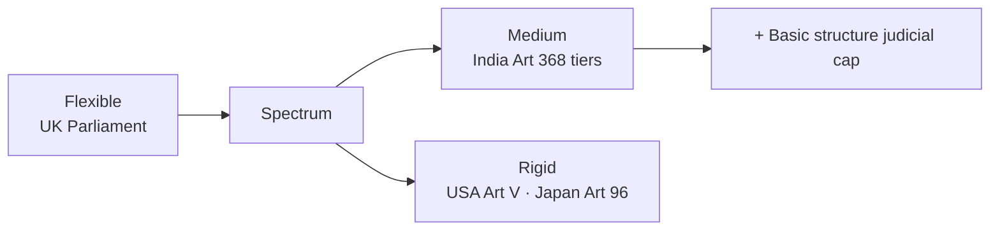

# Comparative Constitutions — India vs Major Democracies

> GS-2 · Topic 05 · Indian constitutional scheme compared with USA, UK, France and modern democracies

---

## PYQs

| Year | M | Words | Question (EN) | प्रश्न (HI) | ID |
|------|---|-------|---------------|-------------|-----|
| 2024 | 12 | 200 | How does the Indian Constitution compare with other modern constitutions in terms of flexibility and rigidity? | लचीलापन और कठोरता के संदर्भ में भारतीय संविधान की तुलना अन्य आधुनिक संविधानों से कैसे की जा सकती है? | Q1 |
| 2018 | 8 | 125 | In what ways does the Indian federal system differ from the federal system in the United States of America (USA)? Explain. | भारत की संघीय व्यवस्था किस प्रकार से अमरीकी (यू.एस.ए.) संघीय व्यवस्था से भिन्न है? व्याख्या करें। | Q2 |

---

## Quick Revision

```
INDIAN CONSTITUTION = SYNTHESIS (Granville Austin "cornerstone of a nation")
  Borrowed: UK (parliamentary, Rule of Law, CABINET) · USA (FR, judicial review, President title)
  · Ireland (DPSP, President election) · Canada (federation, Centre-state) · Australia (concurrent list)
  · Germany (Emergency suspensions spirit) · South Africa (amendment rigidity debate) · USSR (Fundamental Duties idea)

FLEXIBILITY-RIGIDITY SPECTRUM:
  Flexible (easy amend): UK — no written codified constitution — Parliament sovereign — ordinary law amends "constitution"
  Rigid (hard amend): USA — Art V: 2/3 both Houses + 3/4 state legislatures (or constitutional convention)
  India = BLEND (K.C. Wheare / Ivor Jennings): "Flexible rigidity" or "Rigid flexibility"
    Art 368: (1) Simple majority — Art 4 state creation, 2nd Schedule salaries
    (2) Special majority — total membership + 2/3 present & voting — most amendments
    (3) Special + ratification by half states — federal provisions (election President, SC/HC, distribution powers, Art 368)
  106+ amendments vs USA 27 — shows adaptability WITH procedural tiers

USA vs INDIA FEDERALISM:
  USA: Dual/federation of states · Equal state sovereignty · Written · States retain residuary powers (10th Amendment)
  · Dual citizenship (state + national historically nuanced) · Separate state courts + federal courts
  · President = real executive head · Senate equal state representation (2 each)
  · No Article 356 equivalent · Amendment very rigid · Strong state autonomy

  India: Quasi-federal · States NOT equal sovereigns · Union residuary powers (Art 248)
  · Single citizenship · Integrated judiciary (SC apex over all) · PM parliamentary executive
  · Rajya Sabha — population-linked + nominated (not equal states) · Art 356 President's Rule
  · Art 249 Rajya Sabha on State List · Single constitution for Centre + states
  · Amendment easier than USA for many provisions

OTHER COMPARISONS (future PYQs):
  UK: Unwritten · parliamentary sovereignty · constitutional monarchy · no judicial review of Parliament (traditionally)
  France: Semi-presidential (Duverger) · Fifth Republic 1958 · strong President · Constitutional Council
  Germany: Basic Law 1949 · federal · Chancellor parliamentary · Constitutional Court · rigid on federal structure/human dignity
  South Africa: 1996 Constitution — transformative · difficult amend for Bill of Rights (two-thirds + provincial participation)
  Japan: Pacifist Art 9 · rigid amendment (two-thirds Diet + national referendum since 2016)

AMENDMENT COMPARE TABLE (exam):
  India Art 368 tiers | USA Art V super-majority | UK ordinary legislation | France referendum + parliament

TRAPS: India ≠ copy of USA federal · UK has no single written constitution · Indian amendment ≠ always simple majority
  10th Amendment USA = states' residuary NOT India · Rajya Sabha ≠ Senate equality · India 106 amendments ≠ "too rigid"
```

---

## Content

### Context — why comparative constitutionalism matters

UPPCS GS-II **Topic 05** expects students to situate India's **1950 Constitution** within **global democratic design** — not rote foreign lists but **structured comparison** on **federalism, amendment, rights, executive-legislature relations**. Only **2 direct PYQs (2018, 2024)** exist, but the syllabus keyword **"other major democratic countries"** invites **USA, UK, France, Canada, Australia, Germany, South Africa** comparisons — especially **flexibility/rigidity** and **federal models**.

India's constitution is **the world's lengthiest written constitution** — a **synthesis** (**Granville Austin**: *cornerstone of a nation*) adapting foreign ideas to **Indian unity, diversity, and colonial transition**.

### Indian Constitution — borrowed features (comparative map)

| Source country | Features borrowed |
|----------------|-------------------|
| **United Kingdom** | **Parliamentary government**, **Rule of Law**, **legislative procedure**, **single citizenship** concept, **Cabinet system**, **writs** heritage |
| **United States** | **Fundamental Rights**, **judicial review**, **independence of judiciary**, **President** as formal executive title, **impeachment** spirit |
| **Ireland (Eire)** | **Directive Principles of State Policy**, **method of President election**, **Fundamental Duties** (added later — Irish influence debated) |
| **Canada** | **Federation with strong Centre**, **Centre-state relations**, **residuary powers with Centre** (Canada also centre-heavy) |
| **Australia** | **Concurrent List**, **joint sitting** of Parliament idea |
| **Germany (Weimar/Basic Law influence)** | **Emergency provisions** — suspension of rights during crisis (with differences) |
| **USSR (historical)** | Debate on **Fundamental Duties** — **42nd Amendment** |

**Indian originality:** **Universal adult franchise from start**, **quasi-federal + single citizenship + integrated judiciary**, **Part IV-A Duties**, **Schedule IX**, **special status provisions (371)**, **basic structure doctrine (judge-made)**.

### Flexibility and rigidity — conceptual frame

**Flexible constitution:** Amended by **ordinary legislative process** — **no special procedure** — e.g. **United Kingdom** (uncodified — **Parliament legally sovereign** — *A.V. Dicey*).

**Rigid constitution:** Amendment requires **special procedure** harder than ordinary law — e.g. **United States Article V**.

**Indian position — Ivor Jennings / K.C. Wheare:** **"Rigid flexibility"** or **"flexible rigidity"** — **neither wholly flexible nor wholly rigid** — **Art 368** creates **tiers**.

### Indian amendment procedure (Art 368) — detailed

| Type | Procedure | Examples |
|------|-----------|----------|
| **Simple majority** | Ordinary Parliament process | **Admission of states (Art 4)**, **2nd Schedule** emoluments, **Quorum** rules |
| **Special majority** | **Majority of total membership** + **two-thirds of members present and voting** | Most **constitutional amendments** — **42nd, 44th, 101st GST** |
| **Special majority + ratification** | Above + **not less than half the state legislatures** | **Federal provisions** — **election of President**, **Union-state powers (Sch VII)**, **SC/HC**, **Art 368 itself** |

**Over 106 amendments** (2024+) — shows **adaptability** — yet **Kesavananda basic structure** adds **judicial rigidity** — amendments cannot **destroy identity** — **unique Indian layer** absent in **pure textual comparison**.

### Comparison — flexibility & rigidity across democracies

| Country | Amendment mechanism | Flexibility profile |
|---------|---------------------|---------------------|
| **India** | **Art 368** — three tiers; **106+ amendments** | **Medium-flexible** — easier than **USA** for non-federal parts; **basic structure** judicial limit |
| **USA** | **Art V** — **2/3 Congress** + **3/4 states** (or convention route — unused) | **Highly rigid** — only **27 amendments** in **235+ years**; **Bill of Rights** 1791 early |
| **UK** | **No codified constitution** — **statute law** amends constitutional conventions | **Most flexible** — **Parliament supreme** — **Human Rights Act 1998**, **Brexit** via **ordinary legislation** |
| **France** | **Fifth Republic (1958)** — **Parliament** or **referendum** (Art 89) for revision; **presidential** system changes | **Medium** — **referendum** for major shifts (**1962 direct election of President**) |
| **Germany** | **Basic Law Art 79** — **two-thirds Bundestag + Bundesrat**; **eternity clause (Art 79(3))** — **human dignity, federal order, democracy** unamendable | **Rigid on core** — **federal structure protected** |
| **South Africa** | **1996 Constitution** — **two-thirds National Assembly**; **Bill of Rights + federal matters** need **provincial consensus** (super-majority) | **Rigid for rights/federalism** — **transformative constitution** |
| **Japan** | **Art 96** — **two-thirds Diet** + **national referendum** (2016 reform first use pending for Art 9 revision debate) | **Very rigid historically** — **pacifist clause** entrenched politically |
| **Australia** | **Referendum** — **majority of voters nationwide + majority in 4 of 6 states** | **Rigid** — most referendums **fail** |

**2024 PYQ synthesis — India vs others:**
- **More flexible than USA/Japan/Australia** for **routine constitutional updates** (GST, reservations, local government).
- **Less flexible than UK** — **written supremacy** + **special majorities** + **state ratification** for federal matters.
- **Comparable to France/Germany** on **tiered rigidity** but **India amends more frequently** — **political consensus + dominant party phases** drive volume (**42nd, 44th, 73rd, 74th, 101st**).
- **Unique:** **Judicial basic structure** — **post-1973 rigidity** not found in **US text** (though **Marbury** judicial review differs).



### India vs USA — federal system (2018 PYQ core)

Both are **large democracies** with **written constitutions** and **federal labels**, but **federal architecture diverges sharply**.

| Dimension | **India** | **USA** |
|-----------|-----------|---------|
| **Nature of federation** | **Quasi-federal / cooperative** — **strong Centre** | **Dual federation** — **states sovereign** within powers |
| **Constitutional phrase** | **"Union of States" (Art 1)** — **indestructible Union** | **"United States"** — states preceded/federated |
| **Residuary powers** | **Union (Art 248, Entry 97)** | **States (10th Amendment)** — powers not delegated |
| **Citizenship** | **Single citizenship** | **Single national** (state citizenship abolished practically) but **dual sovereignty culture** |
| **Judiciary** | **Single integrated hierarchy** — **SC apex** over **all courts** | **Dual court system** — **federal courts** + **separate state courts** |
| **Executive** | **Parliamentary** — **PM real head**, **President nominal** | **Presidential** — **President real executive** |
| **Upper house** | **Rajya Sabha** — **population/indirect** + **12 nominated** | **Senate** — **2 per state** (equal state representation) |
| **State equality** | **Unequal representation** reflecting **population** | **Equal state voice in Senate** regardless of size |
| **Centre override** | **Art 356 President's Rule**, **Art 249** Rajya Sabha on State List, **Emergency** | **No President's Rule**; **Supremacy Clause** + **Commerce Clause** expand federal power judicially |
| **State boundary change** | **Parliament (Art 3)** — state **consultation** not consent | **Constitutional process** — states not **unilaterally altered** by federal law easily |
| **Amendment rigidity** | **Art 368** — **106+ amendments** | **Art V** — **27 amendments** |
| **Written constitution length** | **Lengthiest** — detailed | **Short** — **7 Articles original** + amendments |

**Explanation bullets for exam:**
1. **USA = coming together federation** (states delegated limited powers); **India = holding together federation** (Centre created states, **Art 3** reorganisation power).
2. **Indian states cannot claim residual sovereignty** — **UPSC favourite trap**.
3. **Integrated judiciary** enables **uniform FR interpretation**; **US federalism** allows **divergent state constitutional rights** (state bills of rights).
4. **Art 356** has **no US equivalent** — **central intervention in state executive/legislature**.
5. **Rajya Sabha ≠ Senate** — **federal equality vs demographic representation**.

### India vs United Kingdom

| Feature | **India** | **UK** |
|---------|-----------|--------|
| **Constitution** | **Written, codified** | **Largely unwritten** — conventions + statutes |
| **Sovereignty** | **Constitution supreme** — **judicial review** | **Parliament sovereign** — **courts cannot strike down primary legislation** (traditionally) |
| **Head of state** | **President** (indirect) | **Monarch** (ceremonial) |
| **Executive** | **Parliamentary PM** | **Parliamentary PM** — **similar fusion of powers** |
| **Amendment** | **Art 368 special process** | **Ordinary Act of Parliament** — **flexible** |
| **Federalism** | **Quasi-federal** | **Unitary devolution** — **Scotland, Wales, NI** — **not federal constitution** |

### India vs France

| Feature | **India** | **France (Fifth Republic)** |
|---------|-----------|----------------------------|
| **System** | **Parliamentary** | **Semi-presidential (Duverger)** — **President + PM** |
| **Executive power** | **PM dominant** | **President strong in foreign/defence**, **PM domestic** |
| **Amendment** | **Art 368** | **Art 89** — **Parliament or referendum** |
| **Constitutional court** | **SC integrated** | **Conseil Constitutionnel** — **prior review of laws** |

### India vs Canada & Australia (federal peers)

- **Canada:** **Centre-heavy federation** like India — **residuary powers with Centre**; **Governor-General** vs **President**; **Charter of Rights 1982** — **judicial review** like India post-**1982**.
- **Australia:** **Concurrent powers** inspired India; **referendum rigidity** — **double majority** — **India easier** to amend non-federal provisions.

### Significance of comparative study

- **Reform debates** — **ONOE, GST, NJAC** — use **foreign models** cautiously — **Indian basic structure** constraint.
- **Federal disputes** — **USA commerce clause expansion** vs **Indian Art 249/356** — different **centralisation paths**.
- **Amendment reform** — **India's frequency** prevents **stagnation** but risks **over-amendment (42nd)** — **Germany/South Africa eternity clauses** offer **rights entrenchment** models.

### Contemporary relevance

- **Basic structure doctrine** — **India-specific** — **no exact US/UK parallel** — **comparative constitutional law** courses cite **Kesavananda** globally.
- **GST (101st)** — **comparative VAT/GST federations** (Canada, Australia, EU) — India chose **GST Council cooperative model**.
- **Brexit (UK)** — showed **flexible constitution advantage/disadvantage** — **no written entrenchment** — contrast **Indian written rigidity**.
- **US Supreme Court Dobbs (2022)** — **federal rights divergence** — India **uniform Art 21** via **integrated judiciary**.
- **South African transformative constitution** — compared to **Indian DPSP + FR** — **socio-economic rights** debate.
- **Japan Art 9 revision debate** — **referendum rigidity** vs **India's Art 368** for **defence reforms**.

### Limits — balanced view

- **Comparison ≠ transplantation** — **Ambedkar** warned against **copy-paste** — Indian **social conditions** require **native design**.
- **Labels misleading** — **UK "unitary"** now **devolved**; **India "federal"** is **quasi** — **functional comparison** beats **textbook labels**.
- **Single PYQ on USA** — exam may pivot to **UK parliamentary** or **amendment rigidity** — file covers **future variants**.

---

## Answers

### Q1: India vs other modern constitutions — flexibility and rigidity. (2024, 12M, 200W)

**Introduction:**
> The Indian Constitution occupies a **middle ground** on the **flexibility–rigidity spectrum** — **Art 368** enables **frequent adaptation** while **special procedures and basic structure** prevent **hasty or destructive change**.

**Main Points:**
- **Indian blend** — **Three amendment tiers (Art 368)** — simple / special / special + **half state ratification** — neither **UK-flexible** nor **US-max-rigid**.
- **More flexible than USA** — **106+ amendments** vs **USA's 27** — **GST (101st), 73rd/74th local govt, 42nd/44th** — **responsive to social change**.
- **Less flexible than UK** — **No parliamentary sovereignty** — **written supremacy** + **judicial review** — **courts + basic structure (Kesavananda)** block **unlimited amendment**.
- **Germany/South Africa comparison** — **Eternity/transformative clauses** entrench **dignity/federalism** — parallel to **India's basic structure** (judge-made).
- **France/Japan** — **Referendum/super-majority** for core change — **India avoids referendum** but uses **state ratification** for **federal provisions**.
- **Australia rigidity** — **Double majority referendum** — **India amends federal features** via **Art 368(2) state ratification** — **different but comparable difficulty** for **Sch VII changes**.
- **Critical balance** — **Flexibility preserved nation-building**; **rigidity protected federalism and FR** — **unique "flexible rigidity."**

**Keywords (underline in exam):** Art 368 · Flexible rigidity · Basic structure · Kesavananda · UK parliamentary sovereignty · USA Art V

**Exam diagram (30 sec):**
```
UK (flexible) ←—— India (Art 368 tiers + basic structure) ——→ USA/Japan (rigid)
```

**Conclusion:**
> India compares as **moderately flexible among modern constitutions** — **more amendable than USA**, **more entrenched than UK**, with **basic structure** as **distinctive judicial rigidity**.

---

### Q2: Indian federal system differs from USA — explain. (2018, 8M, 125W)

**Introduction:**
> Both India and the USA are **federal democracies with written constitutions**, but India is a **quasi-federal "holding together" Union** whereas the USA is a **dual "coming together" federation of sovereign states**.

**Main Characteristics:**
- **Residuary powers** — **India: Union (Art 248)**; **USA: States (10th Amendment)**.
- **Citizenship & courts** — **India: single citizenship, integrated judiciary (SC apex)**; **USA: dual court system (federal + state)**.
- **Executive model** — **India: parliamentary PM**; **USA: presidential President** as **real executive**.
- **Upper house** — **Rajya Sabha (population-weighted)** vs **Senate (2 per state — equal states)**.
- **Centre override** — **India: Art 356 President's Rule, Art 249**; **USA: no equivalent** — **state autonomy stronger**.
- **Amendment & formation** — **India: Art 3** reorganises states; **106+ amendments** — **USA: Art V rigid**, **27 amendments**.
- **Philosophy** — **India: indestructible Union (Art 1)**; **USA: states as coordinate sovereigns** within delegated powers.

**Keywords (underline in exam):** Quasi-federal · Residuary powers · Art 356 · Integrated judiciary · 10th Amendment · Rajya Sabha vs Senate · Holding together

**Exam diagram (30 sec):**
```
USA: states sovereign + residuary + dual courts
India: Union strong + Art 356 + single judiciary + PM system
```

**Conclusion:**
> India's federalism **prioritises national unity and Centre capacity** — **fundamentally different** from **USA's state-sovereignty model**.

---

### Q3: *Likely variant:* Sources of Indian Constitution — country-wise. (8M, 125W)

**Introduction:**
> The Indian Constitution is a **thoughtful synthesis** of **global constitutional experiences**, adapted to **India's diversity and freedom struggle**.

**Main Characteristics:**
- **UK** — **Parliamentary government**, **Rule of Law**, **Cabinet system**, **legislative procedure**.
- **USA** — **Fundamental Rights**, **judicial review**, **written rights enforcement**.
- **Ireland** — **Directive Principles of State Policy**, **Presidential election method**.
- **Canada** — **Strong-centre federation**, **Centre–state relations**.
- **Australia** — **Concurrent List**, **joint sitting** concept.
- **Indian originality** — **Universal adult franchise**, **quasi-federal design**, **Fundamental Duties (42nd)**, **basic structure jurisprudence**.

**Keywords (underline in exam):** Parliamentary · FR · DPSP · Judicial review · Concurrent List · Quasi-federal · Synthesis

**Exam diagram (30 sec):**
```
UK → Parliament | USA → FR + review | Ireland → DPSP
Canada/Australia → federation + concurrent → Indian blend
```

**Conclusion:**
> India **borrowed institutions** but built an **original constitutional scheme** — **not a clone of any single democracy**.

---

### Q4: *Likely variant:* India vs UK — constitutional comparison. (12M, 200W)

**Introduction:**
> **India and UK** share **parliamentary executive** DNA, yet diverge on **writtenness, sovereignty, federalism, and amendment flexibility**.

**Main Points:**
- **Written vs unwritten** — **India: codified supreme constitution**; **UK: statutes + conventions**, **Parliament sovereign**.
- **Judicial review** — **India: courts strike down unconstitutional laws**; **UK: traditional **no review of primary legislation**** (post-**Human Rights Act** — **declaration of incompatibility** only).
- **Head of state** — **India: elected President**; **UK: hereditary monarch (ceremonial)**.
- **Federalism** — **India: quasi-federal Union of States**; **UK: unitary with **devolution** to Scotland/Wales/NI** — not constitutional federation.
- **Amendment** — **India: Art 368** special majorities; **UK: ordinary legislation** — **far more flexible**.
- **Rights** — **India: justiciable FR + DPSP**; **UK: common law + **Human Rights Act 1998**** — **weaker entrenchment**.
- **Similarity** — **Responsible government**, **PM-led executive**, **Westminster-style debate** — **shared parliamentary culture**.

**Keywords (underline in exam):** Parliamentary sovereignty · Written constitution · Judicial review · Art 368 · Devolution · Rule of Law · Responsible government

**Exam diagram (30 sec):**
```
Shared: PM + Parliament culture
Differ: UK flexible/unwritten vs India written/review/basic structure
```

**Conclusion:**
> India **constitutionalised** what the UK leaves to **convention** — **greater rigidity and judicial enforcement**, less **Parliamentary absolutism**.

---

## Traps

| Wrong | Correct |
|-------|---------|
| Indian Constitution copied entirely from USA | **Synthesis** from **UK, USA, Ireland, Canada, Australia** + **Indian innovations** |
| India is as rigid as USA in all amendments | **Only federal provisions** need **state ratification**; many amended by **special majority only** — **106+ amendments** |
| UK has a single written constitution like India | **Largely unwritten** — **statutes + conventions**; **Parliament sovereign** |
| USA and India both give residuary powers to states | **USA: 10th Amendment (states)**; **India: Art 248 (Union)** |
| Rajya Sabha = US Senate | **Senate: equal state representation (2 each)**; **Rajya Sabha: population-linked + nominated** |
| India has dual citizenship like implied US federalism | **Indian Constitution: single citizenship (Part II)** |
| USA has integrated judiciary like India | **USA: separate federal and state court systems** |
| Indian amendment always needs state ratification | **Only specific federal matters** under **Art 368(2)** proviso |
| Basic structure doctrine exists in US Constitution text | **India-specific judge-made doctrine (Kesavananda 1973)** |
| India is a "coming together" federation like USA | **"Holding together"** — **Art 1 Union indestructible**, **Art 3** state creation |
| France and India both pure parliamentary systems | **France: semi-presidential Fifth Republic**; **India: parliamentary** |
| More amendments always mean constitution is too flexible | **Tiered rigidity + basic structure** — **qualitative not just quantitative** measure |

---

*Complete.*
