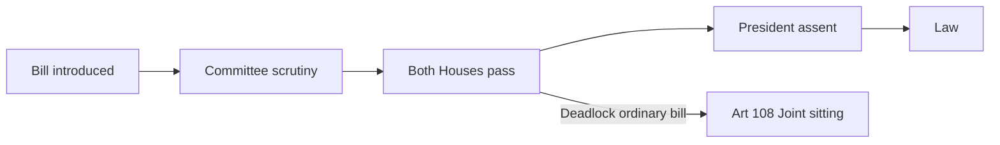

# Parliament & State Legislatures — Structure, Powers & Functioning

> GS-2 · Topic 06 · Parliament, state legislatures, law-making, committees, privileges, executive control

---

## PYQs

| Year | M | Words | Question (EN) | प्रश्न (HI) | ID |
|------|---|-------|---------------|-------------|-----|
| 2025 | 8 | 125 | What role do Joint Parliamentary Committees (JPCs) play in the Indian legislative process? How do they contribute to effective law-making? Analyse. | भारतीय विधायी प्रक्रिया में संयुक्त संसदीय समितियों (JPC) की क्या भूमिका है? वे प्रभावी कानून निर्माण में किस प्रकार योगदान देती हैं? विश्लेषण कीजिए। | Q1 |
| 2024 | 8 | 125 | What are the special legislative powers of the Council of States (Rajya Sabha)? Discuss. | राज्य सभा की विशेष विधायी शक्तियाँ क्या हैं? विवेचना कीजिए। | Q2 |
| 2023 | 12 | 200 | Describe the law-making process in the Legislative Assembly of Uttar Pradesh. | उत्तर प्रदेश की विधान सभा में विधि-निर्माण प्रक्रिया का वर्णन कीजिए। | Q3 |
| 2022 | 12 | 200 | Are the committees considered to be useful for Parliamentary work? Discuss, in this context, the role of the Estimate Committee. | क्या समितियाँ संसदीय कार्यों के लिए उपयोगी मानी जाती हैं? इस संदर्भ में प्राक्कलन समिति की भूमिका की विवेचना कीजिए। | Q4 |
| 2021 | 8 | 125 | Describe the role played by Parliamentary Committees in the functioning of Indian Parliament. | भारतीय संसद के कार्यप्रणाली में संसदीय समितियों की भूमिका का वर्णन करें। | Q5 |
| 2021 | 12 | 200 | Discuss the main methods by which the Parliament of India controls the executive. | उन मुख्य उपायों की विवेचना कीजिए जिनके द्वारा भारतीय संसद कार्यपालिका पर नियंत्रण रखती है। | Q6 |
| 2019 | 8 | 125 | Describe the procedure of creation and abolition of Legislative Council in States. Why did the Andhra Pradesh State Assembly pass a resolution to abolish the State's Legislative Council? | राज्यों में विधान परिषद के सृजन व उन्मूलन की प्रक्रिया का वर्णन कीजिए। आंध्र प्रदेश विधान सभा द्वारा राज्य के विधान परिषद को समाप्त करने का प्रस्ताव लाने के क्या कारण हैं? संक्षेप में बताइए। | Q7 |
| 2018 | 8 | 125 | Describe those special powers of the Council of States (Rajya Sabha) which are not enjoyed by the Lok Sabha, under the Indian Constitution. | राज्यसभा के उन विशिष्ट शक्तियों का वर्णन कीजिए, जो भारतीय संविधान के अंतर्गत लोकसभा को प्राप्त नहीं हैं। | Q8 |

---

## Quick Revision

```
PARLIAMENT (Part V): LS + RS + President (Art 79) — bicameral at Union
  LS: max 552 · 5 years · money bills · confidence · Art 75(3) PM accountability
  RS: max 250 (238 elected + 12 nominated) · 1/3 retire every 2 years · 6 years · permanent house
  President: part of Parliament (Art 79) · assent · ordinance · joint session summon

STATE LEGISLATURE (Part VI): Art 168 — unicameral or bicameral
  Vidhan Sabha (all states) · Vidhan Parishad (LC) — 5 states active: Bihar, MH, Karnataka, Telangana, UP abolished 1988; AP abolished again 2020–21
  UP = unicameral since LC abolished 1988

LAW-MAKING: Introduction → Publication → 1st reading → Committee (optional) → 2nd reading → 3rd reading → other house → President assent
  Money Bill: Art 110 · LS certificate final · RS 14 days only · no joint sitting
  Ordinary · Financial · Constitution Amendment (Art 368) — separate route

RAJYA SABHA SPECIAL (NOT LS):
  Art 249 — 2/3 RS → Parliament on State List (national interest) — 1 year renewable
  Art 312 — 2/3 RS → create new All India Service
  Art 67(e) — Deputy Chairman RS acts when Chairman post vacant (procedural)
  RS represents states + nominated eminent persons (Art 80)

LS DOMINANCE: Money bills · Art 108 joint sitting (RS minority) · No-confidence only LS · Budget primary

COMMITTEES = "Mini-Parliament" · continuous scrutiny · reduce overload
  STANDING: Financial — PAC (audit CAG) · Estimates (economy in estimates) · Public Undertakings
  DRSCs — 24 department-related (1993) · examine bills + demand for grants
  Ad hoc: JPC (equal LS+RS) · RAFA
  ESTIMATES: 30 LS members · NO ministers · oldest continuous 1950 · "economy in expenditure" · Chairman opposition convention since 1967
  JPC: Investigate specific scandal/bill — 2G, Bofors, Data Protection draft scrutiny — consensus law-making

EXECUTIVE CONTROL: Question Hour · Zero Hour · Adjournment · Calling Attention · No-confidence (LS) · Cut motions · Budget vote · Committees · Impeachment · RTI accountability

LEGISLATIVE COUNCIL Art 169: Parliament creates/abolishes if state assembly resolves (special majority) + Parliament law
  AP abolition Jan 2020 resolution — reasons: delay legislation, unnecessary expense, politically dominated, obstruction to govt bills

PRIVILEGES: Art 105/194 — freedom of speech in house · immunity from court for speech/vote · collective/individual

UP ASSEMBLY: 403 seats · Governor · rules similar to Parliament · Gazette · select committee · Governor assent · President if Art 254/304 conflict

TRAPS: RS cannot reject money bill · JPC ≠ standing committee · Estimate ≠ Public Accounts · Joint sitting not for money/amendment bills
  AP LC abolished 1988 originally, recreated 2007, abolition resolution 2020 again · UP unicameral
```

---

## Content

### Context — legislature as heart of parliamentary democracy

**Parliament (Union)** and **State Legislatures** translate **electoral mandates** into **law**, **budget**, and **executive oversight**. UPPCS GS-II Topic 06 tests **structure (LS/RS/Vidhan Sabha/Parishad)**, **law-making stages**, **Rajya Sabha's special federal powers**, **parliamentary committees (JPC, Estimates)**, **executive control**, and **state-specific processes (UP Assembly, Legislative Council)** — **8 PYQs (2018–2025)**.

India follows **Westminster parliamentary model** — **fusion of executive-legislature** at Union and states, modified by **written constitution**, **judicial review**, and **bicameral federalism**.

### Structure of Parliament (Union)

**Article 79** — Parliament = **President + Lok Sabha + Rajya Sabha**.

| House | Composition | Term | Key role |
|-------|-------------|------|----------|
| **Lok Sabha (House of People)** | Max **552** (530 states + 20 UTs + 2 Anglo-Indian nominated — latter abolished **104th Amendment**) | **5 years** (extendable in Emergency) | **Money bills**, **no-confidence**, **primary budget** |
| **Rajya Sabha (Council of States)** | Max **250** (**238 elected** by state assemblies + **12 nominated** by President — Art **80**) | **6 years** — **1/3 retire every 2 years** | **Federal chamber**, **special legislative powers**, **continuity** |
| **President** | Indirect election | **5 years** | **Assent to bills**, **ordinances (Art 123)**, **joint session (Art 108)** |

**Officers:** **LS Speaker** (neutral conduct, casting vote); **RS Chairman** (Vice-President ex-officio); **Deputy Speakers/Chairman**.

**Sessions:** **Budget, Monsoon, Winter** — **not less than twice a year**, **≤6 months gap** (Art **85**).

### Structure of State Legislatures

**Article 168** — Each state has **Governor + Legislature**:
- **Unicameral** — **Vidhan Sabha** only — e.g. **Uttar Pradesh** (since **Legislative Council abolished 1988**), **Punjab, Haryana, Odisha**, most states.
- **Bicameral** — **Vidhan Sabha + Vidhan Parishad (Legislative Council)** — **4 states currently** — **Maharashtra, Karnataka, Bihar, Telangana**; **UP abolished 1988**; **AP abolished 2021**.

**Vidhan Sabha** — **UP: 403 members** (2024 delimitation context); **5-year term**; **real legislative power**.

**Vidhan Parishad** — **Max 1/3 of Sabha strength**; **1/3 retire every 2 years**; **6-year term**; **1/6 nominated** (local bodies, graduates, teachers, Governor nominees); **cannot reject money bills** (3 months delay); **can delay ordinary bills** (4 months).

### Law-making process — Parliament (model for states)

**Stages of a ordinary bill:**

1. **Introduction** — Minister or private member; **prior notice**; **leave of House**.
2. **Publication** — In **Gazette** (if not published earlier).
3. **First reading** — Formal introduction; **no debate on merits** (usually).
4. **Committee stage** — **Select/Joint Committee** or **Department-related Standing Committee (DRSC)** examination — **clause-by-clause** scrutiny.
5. **Second reading** — **General discussion** on principles.
6. **Third reading** — **Vote on bill as a whole**.
7. **Other House** — Repeat stages (RS or LS).
8. **President's assent** — **Art 111** — withhold (rare), return (once), or assent.

**If deadlock:** **Joint sitting (Art 108)** — **Speaker presides** — **simple majority** — **not for Money Bills or Constitutional Amendment Bills**.

**Money Bill (Art 110):**
- **Certificate of Speaker** final ( **Raja Sabha cannot reject**).
- **RS: 14 days** to recommend amendments.
- **Lok Sabha may reject RS suggestions**.

**Constitutional Amendment:** Separate **Art 368** route — not ordinary bill process.



### Law-making in Uttar Pradesh Legislative Assembly (2023 PYQ)

**UP Legislature** = **Governor + Vidhan Sabha** (**unicameral** since **1988** abolition of **Vidhan Parishad**).

**Process (mirrors Parliament with state rules):**

1. **Bill types** — **Government bill** (minister) or **private member bill** (MLA) — latter rarely passed.
2. **Introduction** in **Vidhan Sabha** with **Speaker's permission**; published in **Uttar Pradesh Gazette**.
3. **First reading** — title and object stated.
4. **Reference to Select Committee** (optional) — **public consultation**, **clause scrutiny** — important for **complex bills** (e.g. **UP Revenue Code**, **police bills**).
5. **Second reading** — **debate on principles**; **amendments** proposed.
6. **Third reading** — **final passage** by **majority**.
7. **No second house** — bill sent directly to **Governor (Art 200)**.
8. **Governor's options** — assent, withhold (reserve for President), return with message (once).
9. **President's assent** required if bill affects **High Court powers**, **Election Commission**, **All-India Services**, or **conflicts with Union law (Art 254)**.

**Conduct of business:** **Question Hour**, **Zero Hour**, **Calling Attention**, **Adjournment motions** — **executive accountability** at state level.

**UP-specific note:** Largest **state legislature** by seats — **law-making volume high** — **ordinances (Art 213)** used when assembly not in session — subject to **approval within 6 weeks** of reassembly.

### Rajya Sabha — special legislative powers (2018, 2024 PYQs)

Powers **exclusive to Rajya Sabha** (not enjoyed by Lok Sabha):

| Power | Constitutional basis | Effect |
|-------|---------------------|--------|
| **Legislate on State List** | **Art 249** | **RS resolution by 2/3 members present and voting** — Parliament may make law on **State List** for **national interest** — **valid 1 year**, renewable |
| **Create new All-India Service** | **Art 312** | **2/3 RS majority** — authorises **Parliament** to create e.g. **new AIS cadre** (beyond **IAS, IPS, IFS**) |
| **Continuity of Council of States** | **Art 83(1)** | **Not subject to dissolution** — **one-third renewal** — **federal stability** |

**Additional RS distinction (not "exclusive" but comparative):**
- **12 members nominated** by President — **literature, science, art, social service** — **Art 80(3)** — **LS has no nominated members** (post **104th Amendment**).
- **Representation of states/UTs** — **federal voice** — LS is **population-based** only.

**What LS has that RS lacks:**
- **Money Bill origin and final say (Art 110)**
- **No-confidence motion** against **Council of Ministers (Art 75(3))**
- **Primary control of budget** — **demands voted here first**

**Exam tip:** **2018 PYQ** = powers **RS has, LS doesn't**; **2024 PYQ** = **special legislative powers** — focus **Art 249 + Art 312**.

### Parliamentary committees — role and types

**Why committees?** Parliament cannot **scrutinise every detail** on floor — **committees = "mini-parliaments"** — **expert, bipartisan, continuous** scrutiny (**Dr. L M Singhvi**).

**Classification:**

| Type | Examples | Function |
|------|----------|----------|
| **Standing — Financial** | **Public Accounts Committee (PAC)**, **Estimates Committee**, **Committee on Public Undertakings (COPU)** | **CAG audit**, **economy in spending**, **PSU performance** |
| **Standing — DRSCs** | **24 Department-related Standing Committees (1993)** | **Examine bills**, **demands for grants**, **departmental policy** |
| **Standing — House** | **Business Advisory**, **Rules**, **General Purposes** | **Scheduling**, **procedure** |
| **Ad hoc** | **Joint Parliamentary Committee (JPC)**, **RAFA** | **Specific investigation** or **bill scrutiny** |

**Estimates Committee (2022 PYQ):**
- **Largest standing committee** — **30 members**, **all from Lok Sabha**.
- **Continuous since 1950** — **oldest** financial committee.
- **No ministers** allowed — **independent scrutiny**.
- **Examines budget estimates** — suggests **economies**, **efficiency**, **administrative reform** — **"policy of economy in expenditure"**.
- **Chairman convention** — from **opposition** since **1967** ( **G.V. Mavalankar** tradition spirit).
- **Differs from PAC** — PAC examines **CAG audit reports** ( **post-expenditure**); Estimates examines **proposed expenditure** ( **pre-expenditure efficiency**).

**Joint Parliamentary Committee (JPC) — 2025 PYQ:**
- **Ad hoc** — **equal members from LS and RS** — appointed by **Speaker/Chairman**.
- **Investigates** specific matters — **Bofors (1987)**, **2G spectrum (2011)**, **Personal Data Protection Bill** scrutiny — or **scandals**.
- **Role in legislative process:**
  - **Clause-level examination** of **contentious bills** — **consensus building**.
  - **Stakeholder hearings** — **experts, civil society** — **informed law-making**.
  - **Reduces partisan floor deadlock** — **detailed report** guides **amendments**.
- **Limits:** **Recommendations not binding**; **politicisation** in **scandal probes**; **delay** if **prolonged investigation**.

### Parliament's control over executive (2021 PYQ)

**Methods of control:**

| Method | Mechanism |
|--------|-----------|
| **Question Hour** | **Starred (oral)**, **unstarred (written)**, **short notice** — ministers answer — **daily accountability** |
| **Zero Hour** | **Unscheduled matters** — **immediate public issues** |
| **Adjournment Motion** | **Urgent public importance** — **disrupts business** — **strong censure signal** |
| **Calling Attention Motion** | Minister **explains** urgent matter |
| **Debates** | **Budget**, **President's Address**, **no-confidence**, **matters under Rule 193/184** |
| **Financial control** | **Vote on demands**, **cut motions** (token, policy, economy, amount) — **guillotine** limits time |
| **Committees** | **PAC** pulls up **executive** on **CAG findings**; **DRSCs** examine **policy implementation** |
| **No-confidence motion (LS only)** | **Art 75(3)** — ministry must enjoy **LS confidence** — defeat = **resignation** |
| **Impeachment/removal** | **Judges, President, VP** — **Parliamentary role** |
| **Private members' resolutions** | **Moral pressure** on policy |

**Limits:** **Anti-defection (10th Schedule)** — **party whips** reduce **independent voting**; **single-party majority** weakens **floor scrutiny**; **ordinances (Art 123)** bypass **immediate oversight**.

### Legislative Council — creation and abolition (Art 169)

**Article 169** procedure:
1. **State Assembly** passes resolution by **special majority** — **create or abolish** Legislative Council.
2. **Parliament** passes **Parliamentary law** to give effect — **simple process at Union level** once state resolves.

**States with Vidhan Parishad (evolving):**
- **Maharashtra, Karnataka, Bihar, Telangana** — active.
- **Andhra Pradesh** — **Council recreated 2007**; **Assembly passed abolition resolution (Jan 2020)**; **Parliament passed Repeal Act (2020)** — **Council abolished 2021** — reasons cited:
  - **Delay/obstruction** of **government bills** — **Council rejected/slow-walked** key legislation (e.g. **capital region bills**, **Council of Ministers bills**).
  - **Financial burden** — **maintenance cost** of **second chamber** without **proportionate public benefit**.
  - **Political composition** — **Council dominated by opposition/regional rivals** — seen as **blocking mandate** of **Assembly majority**.
  - **Democratic argument** — **unelected/indirect elements** (graduates/teachers constituencies) — **less representative** than **Sabha**.
- **Exam focus** — **reasons for 2020 resolution**: obstruction, cost, representation — plus **Art 169 two-step procedure**.

**UP relevance:** **UP Vidhan Parishad abolished 1988** — **UP PCS home state** often asks **Assembly-only** law-making.

### Parliamentary privileges (syllabus keyword)

**Article 105 (Parliament)** / **194 (State Legislatures):**
- **Freedom of speech** in house — **subject to rules** and **Art 121/212** limits.
- **Immunity** from court for **anything said or vote cast** in house.
- **Collective privileges** — **publish reports**, **exclude strangers**, **punish breach of privilege**.
- **Individual** — **freedom from arrest** in **civil cases** during sessions (+ **40 days** before/after).
- **44th Amendment** — **salaries/allowances** by law — **reduced arbitrary privilege expansion**.

**Keshava Singh case (1965)** — **HC vs legislature** privilege conflict — **basic structure of parliamentary democracy** balance.

### Contemporary relevance

- **JPC on major bills/scams** — **Data protection**, ** telecom regulation** — **committee scrutiny** vs **fast-track ordinances** debate.
- **New criminal laws (BNS, BNSS, BSA 2023)** — **DRSC scrutiny**, **limited committee time** — **effective law-making** question live.
- **Rajya Sabha Art 249** — rarely used but **exam-ready** for **labour/environment** on State List nationally.
- **AP Legislative Council** — **2020 abolition resolution** — **bicameralism costs** debate in **Telangana, Maharashtra**.
- **UP Assembly** — **403 members**, **2024 elections** — **state law-making** centre stage for **UP PCS**.
- **Estimates/PAC** — **CAG reports on PM-KISAN, MGNREGA** — **committee follow-up** shapes **executive accountability**.
- **Digital Parliament** — **e-Sansad, e-Vidhan** — **committee submissions online** — **transparency in law-making**.

### Limits — balanced view

- **Committee recommendations non-binding** — **government may ignore** DRSC/JPC reports.
- **RS special powers** used **rarely** — **Art 249/312** — **federal friction** if overused.
- **Money bill certification** controversy — **Aadhaar 2017** — **Speaker tag** limits **RS role**.
- **State legislatures** — **Governor delays**, **ordinance route**, **President reference** — **weakens pure legislative autonomy**.

---

## Answers

### Q1: JPC role in legislative process and effective law-making. (2025, 8M, 125W)

**Introduction:**
> **Joint Parliamentary Committees (JPCs)** are **ad hoc bicameral bodies** that **deepen scrutiny** of **bills and investigations**, complementing **floor passage** with **expert consensus-building**.

**Main Points:**
- **Bicameral composition** — **Equal LS + RS members** — **Speaker/Chairman** appoints — **cross-party examination**.
- **Bill scrutiny** — **Clause-by-clause review**, **stakeholder hearings** — improves **draft quality** before **final vote**.
- **Investigative role** — **Scandal probes (2G, Bofors)** — **informs legislative fixes** and **accountability**.
- **Reduces deadlock** — **Detailed committee report** narrows **disputed provisions** — ** smoother floor debate**.
- **Legislative expertise** — **Specialist input** on **technical laws** (data protection, finance) — **evidence-based law-making**.
- **Limits** — **Recommendations not binding**; **politicisation** may **delay** rather than **improve** bills.

**Keywords (underline in exam):** Joint Parliamentary Committee · Ad hoc committee · Bill scrutiny · Bicameral · Stakeholder consultation · Law-making

**Exam diagram (30 sec):**
```
Bill/Scandal → JPC hearings → report → amended law on floor
```

**Conclusion:**
> JPCs **strengthen effective law-making** through **detailed scrutiny and consensus**, though **impact depends on political will** to accept recommendations.

---

### Q2: Special legislative powers of Rajya Sabha. (2024, 8M, 125W)

**Introduction:**
> **Rajya Sabha** is the **federal, continuing chamber** with **two unique legislative powers** under **Articles 249 and 312** not available to **Lok Sabha alone**.

**Main Points:**
- **Art 249 — State List legislation** — **2/3 RS majority** — Parliament may legislate on **State List** for **national interest** — **1-year renewable**.
- **Art 312 — New All-India Service** — **2/3 RS majority** — enables creation of **new AIS** beyond **IAS/IPS/IFS**.
- **Federal representation** — **States/UTs elect RS members** — **legislative voice for sub-national units**.
- **12 nominated members** — **Art 80(3)** — **literature, science, art, social service** expertise.
- **Continuity** — **Permanent house** — **1/3 retire every 2 years** — **stability in law-making**.
- **Contrast LS** — **Money bills, no-confidence** exclusive to **LS** — **RS special powers are federal/ administrative**, not financial.

**Keywords (underline in exam):** Art 249 · Art 312 · State List · All-India Service · Rajya Sabha · National interest · Art 80

**Exam diagram (30 sec):**
```
RS only: Art 249 (State List law) + Art 312 (new AIS)
Both need 2/3 RS majority first
```

**Conclusion:**
> Rajya Sabha's **special legislative powers** embody **Indian federalism** — enabling **national action** without **destroying state lists permanently**.

---

### Q3: Law-making process in UP Legislative Assembly. (2023, 12M, 200W)

**Introduction:**
> **Uttar Pradesh** has a **unicameral legislature (Vidhan Sabha + Governor)** since **1988** — law-making follows **Parliamentary stages** adapted to **state rules**.

**Main Points:**
- **Bill introduction** — **Minister/MLA** introduces with **Speaker's leave**; published in **UP Gazette**.
- **First reading** — **Title and objects** — formal introduction.
- **Committee reference (optional)** — **Select Committee** examines **clauses**, **public input** — critical for **complex bills**.
- **Second reading** — **Debate on principles**; **amendments** moved.
- **Third reading** — **Final vote** on bill as whole — **simple majority** (special majority if constitutionally required).
- **No second chamber** — bill to **Governor (Art 200)** — **assent, withhold, or return once**.
- **President assent** — if bill affects **HC jurisdiction, EC, AIS**, or **Union-state relations (Art 254)**.
- **Ordinance route (Art 213)** — **Governor ordinance** when **Assembly not in session** — must be **approved within 6 weeks** of reassembly.

**Keywords (underline in exam):** Vidhan Sabha · UP unicameral · Three readings · Governor assent · Art 200 · Select Committee · Art 213 ordinance

**Exam diagram (30 sec):**
```
Intro → 1st → Committee? → 2nd → 3rd → Governor → (President if needed) → Act
```

**Conclusion:**
> UP Assembly law-making **mirrors parliamentary democracy** with **403-member scrutiny**, **Governor as constitutional check**, and **no Legislative Council delay**.

---

### Q4: Committees useful for Parliament? Role of Estimates Committee. (2022, 12M, 200W)

**Introduction:**
> **Parliamentary committees** perform **continuous, expert scrutiny** that the **overloaded floor** cannot — the **Estimates Committee** specialises in **economy in public expenditure**.

**Main Points:**
- **Utility of committees** — **Reduce overload**, **bipartisan scrutiny**, **expert reports**, **executive accountability** between sessions.
- **Types** — **Financial (PAC, Estimates, COPU)**, **DRSCs (24)**, **ad hoc JPC** — **"mini-parliament"**.
- **Estimates Committee** — **30 LS members**, **no ministers**, **continuous since 1950**.
- **Mandate** — **Examine budget estimates** — suggest **economies, efficiency, administrative reform** — **pre-expenditure focus**.
- **Chairman convention** — **Opposition MP** since **1967** — **non-partisan scrutiny spirit**.
- **Vs PAC** — PAC examines **CAG post-audit**; Estimates examines **proposed spending efficiency**.
- **Limits** — **Recommendations not binding**; **government majority** may **ignore** suggestions.

**Keywords (underline in exam):** Estimates Committee · PAC · DRSC · Economy in expenditure · 30 members · No ministers · Parliamentary scrutiny

**Exam diagram (30 sec):**
```
Committees → continuous scrutiny
Estimates → proposed spend efficiency | PAC → CAG audit follow-up
```

**Conclusion:**
> Committees are **indispensable for parliamentary work**; **Estimates Committee** uniquely guards **taxpayer money before it is spent**.

---

### Q5: Role of Parliamentary Committees in Parliament functioning. (2021, 8M, 125W)

**Introduction:**
> **Parliamentary committees** extend **legislative oversight** beyond **debates and voting** — enabling **detailed, continuous accountability**.

**Main Characteristics:**
- **Scrutiny of bills** — **DRSCs** examine **legislation** before/after introduction — **clause-level quality**.
- **Budget examination** — **DRSCs** analyse **demands for grants**; **Estimates** suggests **economies**; **PAC** reviews **CAG audit**.
- **Executive oversight** — **PAC, COPU** — **departmental performance**, **PSU losses**.
- **Ad hoc investigation** — **JPC** on **scandals/specific bills** — **informed law-making**.
- **Bipartisan expertise** — **Cross-party membership** — **technical deliberation** away from **electoral rhetoric**.
- **Limitation** — **Time constraints**, **non-binding reports**, **government dominance** in **implementing recommendations**.

**Keywords (underline in exam):** DRSC · PAC · Estimates Committee · JPC · Demands for grants · CAG · Mini-parliament

**Exam diagram (30 sec):**
```
Parliament floor → broad debate
Committees → detailed bills + budget + audit
```

**Conclusion:**
> Committees are the **workhorse of Indian Parliament** — converting **electoral democracy** into **effective scrutiny and law-making**.

---

### Q6: Main methods Parliament controls executive. (2021, 12M, 200W)

**Introduction:**
> Under **Art 75(3)**, the **Council of Ministers is responsible to Lok Sabha** — Parliament uses **multiple tools** to **control executive action**.

**Main Points:**
- **Question Hour** — **Daily oral/written questions** — ministers **accountable** for **departmental acts**.
- **Zero Hour & Calling Attention** — **Urgent public issues** — **immediate executive response**.
- **Adjournment motion** — **Serious matter** — **censure signal** — disrupts normal business.
- **Financial control** — **Budget debate**, **vote on demands**, **cut motions** — **executive cannot spend without approval**.
- **No-confidence motion (LS)** — **Defeat forces ministry resignation** — **strongest political control**.
- **Parliamentary committees** — **PAC/DRSC** expose **implementation failures** via **CAG and departmental evidence**.
- **Debates & resolutions** — **Policy pressure** on **foreign affairs, internal security, legislation**.
- **Limits** — **Anti-defection**, **single-party majority**, **ordinances** reduce **effective daily control**.

**Keywords (underline in exam):** Art 75(3) · Question Hour · No-confidence · Cut motions · PAC · Adjournment motion · Budget control

**Exam diagram (30 sec):**
```
Control: Questions + Budget vote + No-confidence + Committees
Limit: Whip + ordinance + majority govt
```

**Conclusion:**
> Parliament controls executive through **daily questioning, financial veto, confidence sanctions, and committee audit** — **core of responsible government**.

---

### Q7: Creation/abolition of Legislative Council + AP abolition reasons. (2019, 8M, 125W)

**Introduction:**
> **Article 169** allows **creation or abolition** of **State Legislative Council (Vidhan Parishad)** through **state initiative + Parliamentary law**.

**Main Points:**
- **Step 1** — **State Assembly** passes resolution by **special majority** — **create or abolish** Council.
- **Step 2** — **Parliament** enacts **law** to implement — **no state ratification under Art 368** needed.
- **Council features** — **Max 1/3 of Sabha**; **partially elected/indirect/nominated**; can **delay non-money bills** **4 months**.
- **AP abolition resolution (Jan 2020)** — **Newly elected Jagan Mohan Reddy government** — **Council seen obstructing** **Assembly mandate**.
- **Reasons cited** — **Blocked/delayed key bills** (capital/ governance legislation); **financial cost** of **second chamber**; **indirect membership** less **democratically representative**; **political rivalry** — **Council dominated by opposition**.
- **Broader debate** — **Bicameralism vs efficiency** — **UP abolished LC 1988** earlier for similar arguments.

**Keywords (underline in exam):** Art 169 · Legislative Council · Special majority · Andhra Pradesh · Vidhan Parishad · Bicameralism · State Assembly resolution

**Exam diagram (30 sec):**
```
Assembly special majority → Parliament law → LC created/abolished
AP 2020: obstruction + cost + representation → abolition resolution
```

**Conclusion:**
> **Art 169 procedure** balances **federal choice** with **Parliamentary law**; **AP's 2020 resolution** reflected **friction between Council delay and Assembly's popular mandate**.

---

### Q8: Rajya Sabha powers not enjoyed by Lok Sabha. (2018, 8M, 125W)

**Introduction:**
> The Constitution grants **Rajya Sabha exclusive powers** reflecting its **federal, continuing role** — distinct from **Lok Sabha's popular, financial dominance**.

**Main Characteristics:**
- **Art 249** — Authorise **Parliament** to legislate on **State List** (**2/3 RS**) — **not initiatable by LS alone**.
- **Art 312** — Authorise **new All-India Service** — **2/3 RS** prerequisite.
- **Nominated members (Art 80(3))** — **12 eminent persons** — **RS only** — **LS has no equivalent**.
- **Permanent chamber** — **Not dissolved** — **continuity** during **LS dissolution** — **LS lacks this institutional feature**.
- **Not RS exclusive but contrast** — **LS alone**: **Money bills, no-confidence, primary budget initiative**.

**Keywords (underline in exam):** Art 249 · Art 312 · State List · All-India Service · Nominated members · Permanent house · Art 80

**Exam diagram (30 sec):**
```
RS only: Art 249 + Art 312 (both 2/3 RS)
LS only: Money bill + No-confidence
```

**Conclusion:**
> **Art 249 and 312** are the **constitutional core** of **Rajya Sabha's special powers** — **federal safeguards** unavailable to **Lok Sabha**.

---

### Q9: *Likely variant:* Money Bill vs Ordinary Bill — parliamentary procedure. (8M, 125W)

**Introduction:**
> **Money Bills (Art 110)** follow a **Lok Sabha-dominated procedure** protecting **financial supremacy of the directly elected house**.

**Main Characteristics:**
- **Certification** — **Speaker's certificate** under **Art 110(4)** — **final** — defines **Money Bill**.
- **Introduction** — **Only in Lok Sabha** — **RS cannot initiate or amend reject**.
- **Rajya Sabha role** — **14 days** to **recommend amendments** — **LS may reject suggestions**.
- **No joint sitting** — **Art 108** excludes **Money Bills** from **deadlock resolution**.
- **Ordinary bills** — **Both houses equal** (except **deadlock joint sitting**); **RS can delay/reject**.
- **Examples** — **Taxation, Consolidated Fund, appropriation** — **Aadhaar certification controversy** exam link.

**Keywords (underline in exam):** Art 110 · Money Bill · Speaker certificate · 14 days · Lok Sabha supremacy · Art 108 exclusion

**Exam diagram (30 sec):**
```
Money Bill → LS origin → RS 14 days suggest → LS final
Ordinary → both houses + possible Art 108 joint sitting
```

**Conclusion:**
> **Money Bill procedure** embeds **Westminster financial control** — **LS as primary guardian of public purse**.

---

### Q10: *Likely variant:* Parliamentary privileges — significance. (8M, 125W)

**Introduction:**
> **Parliamentary privileges (Art 105/194)** protect **legislative independence** — enabling **free debate and effective oversight** without **external intimidation**.

**Main Characteristics:**
- **Freedom of speech** in house — **subject to rules** — **frank policy criticism**.
- **Immunity** — **No court action** for **speech/vote** in house.
- **Collective powers** — **Exclude strangers**, **punish breach of privilege**, **regulate internal affairs**.
- **Individual protection** — **Arrest immunity** in **civil matters** during session **±40 days**.
- **State legislatures** — **Art 194** parallel privileges for **Vidhan Sabha/Parishad**.
- **Limits** — **44th Amendment**; **courts cannot inquire into proceedings (Art 122/212)** — but **abuse invites reform debate**.

**Keywords (underline in exam):** Art 105 · Art 194 · Freedom of speech · Breach of privilege · Immunity · Art 122

**Exam diagram (30 sec):**
```
Privileges → free speech + immunity + punish breach
Goal → independent oversight of executive
```

**Conclusion:**
> Privileges **secure Parliament's dignity and fearlessness** — essential for **meaningful executive control** in **parliamentary democracy**.

---

## Traps

| Wrong | Correct |
|-------|---------|
| Rajya Sabha can reject Money Bills | **14 days only** — **recommendations** — **LS decides finally** |
| Joint sitting applies to Money Bills | **Art 108 excludes Money Bills** and **constitutional amendments** |
| Estimates Committee includes ministers | **No ministers** — **30 LS members only** |
| Estimates Committee examines CAG audit | **PAC** examines **CAG**; **Estimates** examines **budget estimates/economy** |
| JPC is a permanent standing committee | **Ad hoc** — **specific bill/investigation** |
| Lok Sabha can initiate Art 249 resolution | **Only Rajya Sabha** — **2/3 majority** |
| All states have Legislative Council | **Only 6 historically** — **most states unicameral** — **UP abolished LC 1988** |
| Art 169 abolition needs only state law | **Assembly special majority + Parliament law** |
| Private member bills pass frequently | **Rarely passed** — **government bills dominate** |
| Governor must assent to all state bills | May **reserve for President**, **withhold**, or **return once (Art 200)** |
| RS and LS have equal power on Money Bills | **LS supremacy** — **Speaker certificate final** |
| Parliamentary committee reports are binding | **Recommendations advisory** — **not legally binding** on government |
| UP has Vidhan Parishad | **Abolished 1988** — **unicameral** — **403-member Sabha only** |

---

*Complete.*
