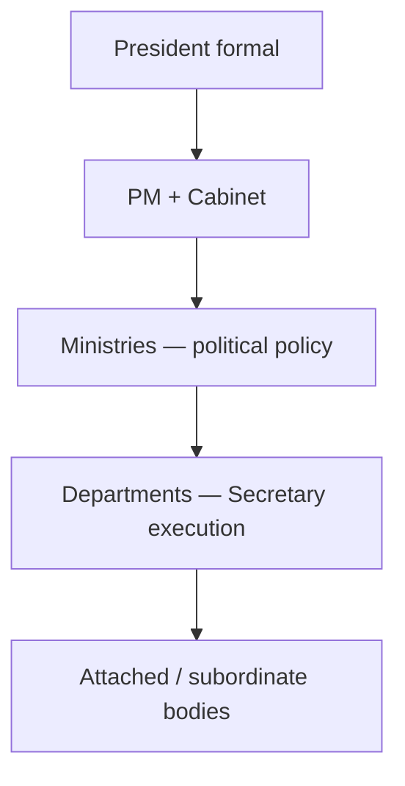

# Executive, Judiciary, PIL & Pressure Groups

> GS-2 · Topic 07 · Executive & judiciary structure, ministries, pressure groups, political parties, PIL

---

## PYQs

| Year | M | Words | Question (EN) | प्रश्न (HI) | ID |
|------|---|-------|---------------|-------------|-----|
| 2025 | 12 | 125 | Public Interest Litigation (PIL) is an important tool for promoting social justice and protecting the rights of marginalized communities. Analyse with suitable examples. | जनहित याचिका (PIL) सामाजिक न्याय को बढ़ावा देने एवं हाशिए पर पड़े समुदायों के अधिकारों की रक्षा करने का महत्त्वपूर्ण साधन है। उपयुक्त उदाहरण सहित विश्लेषण कीजिए। | Q1 |
| 2022 | 8 | 125 | Consider the functions and relations of the Chief Minister and the Governor of State. | राज्य के मुख्यमंत्री और राज्यपाल के कार्यों एवं सम्बन्धों पर विचार कीजिए। | Q2 |
| 2021 | 8 | 125 | Critically examine the impact and role of Political parties in the Indian Political System. | भारतीय राजनीतिक व्यवस्था में राजनीतिक दलों के प्रभाव और भूमिका का समालोचनात्मक परीक्षण कीजिए। | Q3 |

---

## Quick Revision

```
UNION EXECUTIVE (Part V): Art 52–78
  President (Art 53 nominal) · VP · PM + Council of Ministers (Art 74–75) · Cabinet · Attorney General
  PM = de facto head · appointed by President · leader of majority · advises President
  CoM = aids/advises President · collective responsibility Art 75(3) to LS · individual Art 75(2)
  Cabinet = inner CoM · Cabinet Committees · PMO coordinates

MINISTRIES vs DEPARTMENTS:
  Ministry = political head (Minister) · policy · Department = executive head (Secretary) · implementation
  Examples: MHA → Dept of Home; MoEFCC → Forest & Climate Change dept
  Attached/subordinate offices, PSUs, autonomous bodies under ministries

STATE EXECUTIVE (Part VI): Art 153–167
  Governor (Art 153) · CM · CoM · Advocate General
  Governor: President appointee · reserve bills · ordinance Art 213 · President's Rule recommendation · discretionary powers (Art 163)
  CM: real executive · appointed by Governor · leader of majority in Assembly · portfolios · cabinet

CM–GOVERNOR RELATIONS:
  Constitutional: CM advises Governor (Art 163(1)) · Governor bound EXCEPT discretionary
  Discretionary: reserve bill for President · Art 356 recommendation · invite CM when no clear majority
  Friction: opposition states · long pending bills · university VC appointments · "rubber stamp" vs "agent of Centre" debate
  SR Bommai · Rameshwar Prasad · Nabam Rebia — judicial limits on Governor

JUDICIARY STRUCTURE:
  SC Art 124 — 34 judges (incl CJI) · original/appellate/advisory · Art 32 writs · Art 142 · Collegium appointments
  HC Art 214 — each state/UT · Art 226 writs wider · control subordinate judiciary
  Subordinate: district/session · lower courts under HC superintendence Art 235
  Tribunals supplement (NGT, CAT) — HC review retained L. Chandra Kumar

PIL: S.P. Gupta 1981 · epistolary jurisdiction · Krishna Iyer/Bhagwati · relaxed locus standi
  For marginalized: bonded labour, undertrials, pavement dwellers, manual scavenging, tribal forest rights, transgender (NALSA), workplace Vishaka
  Art 32/226 · social justice via FR + DPSP · limits: abuse, mala fide, not every public interest

PRESSURE GROUPS:
  Formal: FICCI, CII, ASSOCHAM · trade unions (INTUC, CITU, BMS) · bar associations · professional bodies
  Informal: social movements (Narmada, RTI, anti-corruption) · caste/religious groups · farmer unions (SKM)
  Role: agenda-setting · lobbying · shaping policy/law · PIL catalyst · protest · electoral pressure via parties
  Limits: unelected influence · capture by elite · opaque funding

POLITICAL PARTIES (10th Schedule):
  Art 324 · RPA 1951 · national/state recognition · ECI symbols
  Role: aggregate interests · government formation · legislative discipline · anti-defection
  Critique: clientelism · dynasty · money power · criminalization (ADR reports) · regional vs national

TRAPS: Governor ≠ elected · CM not appointed by public directly · PIL ≠ all public grievances · Ministry ≠ department same head always
  Collegium ≠ in Constitution text originally · President not mere rubber stamp formally
```

---

## Content

### Context — executive, judiciary, and civil society in governance

GS-II **Topic 07** examines **how laws become lived governance**: the **Union and state executive** (ministries, departments), **judicial hierarchy**, **political parties** and **pressure groups** shaping policy, and **PIL** as **judicial access for the marginalized**. UPPCS asks **PIL + social justice (2025)**, **CM–Governor dynamics (2022)**, and **political parties (2021)** — **3 PYQs** on a **broad syllabus keyword** requiring **full structural coverage**.

### Union executive — structure and functioning

**Constitutional frame (Part V, Arts 52–78):**

| Institution | Role |
|-------------|------|
| **President (Art 53)** | **Formal head** — assent, ordinances (**Art 123**), appointments, **pardon (Art 72)** |
| **Vice-President** | **RS Chairman**; acts as President when office vacant |
| **Prime Minister (Art 74–75)** | **De facto executive** — **leader of CoM**, **advises President** |
| **Council of Ministers** | **Collective responsibility to LS (Art 75(3))**; **individual (Art 75(2))** |
| **Cabinet** | **Inner CoM** — **major decisions**; **Cabinet Committees** (Security, Economic, Political) |
| **Attorney General** | **Government's chief legal adviser** — **not a minister** |

**Functioning:**
- **PM allocates portfolios**; **ministries** frame **policy/budget**; **departments** execute via **secretaries (IAS)**.
- **PMO (Prime Minister's Office)** — **coordination, monitoring, key appointments** — **central hub** in **majority governments**.
- **Cabinet Secretariat** — **agenda, inter-ministerial coordination**, **Cabinet notes**.

### Ministries and departments — organization

**Distinction (exam-critical):**

| | **Ministry** | **Department** |
|---|-------------|----------------|
| **Head** | **Minister (political)** | **Secretary (administrative)** |
| **Function** | **Policy, legislation, budget demand** | **Day-to-day administration** |
| **Example** | **Ministry of Home Affairs (MHA)** | **Department of Home** under MHA |

**Typical hierarchy:**
- **Ministry** → **Department(s)** → **Attached offices** (e.g. **CBI** under MHA) → **Subordinate offices** → **PSUs/autonomous bodies** (e.g. **UIDAI**, **ISRO** under Dept of Space).

**Why it matters:** **Policy failure** often lies at **ministry–department interface**; **reforms** ( **Mission Karmayogi**, ** lateral entry**, **e-office**) target **executive efficiency**.



### State executive — Governor and Chief Minister (2022 PYQ core)

**Governor (Art 153–162):**
- **Appointed by President (Art 155)** — **5-year term** — **Centre's constitutional link** to states.
- **Executive powers** exercised **formally** on **CM/CoM advice (Art 163(1))** except **discretionary** matters.
- **Key functions:** **Appoint CM**, **summon/prorogue Assembly**, **assent/withhold/reserve bills (Art 200)**, **ordinances (Art 213)**, **recommend President's Rule (Art 356)**, **Chancellor** of state universities (often **friction point**).

**Chief Minister (Art 164–167):**
- **Appointed by Governor** — usually **leader of majority** in **Vidhan Sabha**.
- **Real executive head** — **portfolio allocation**, **cabinet**, **state policy**, **advises Governor** on **almost all actions**.
- **Leader of state CoM** — **collective responsibility to Assembly**.

**CM–Governor relations:**

| Aspect | Detail |
|--------|--------|
| **Normal rule** | **Governor bound by CM advice (Art 163(1))** |
| **Discretionary zones** | **Reserve bill for President**; **Art 356** recommendation; **invite CM** when **hung assembly** — **Art 163(2)** non-exhaustive |
| **Friction sources** | **Opposition-ruled states vs Union-appointed Governor**; **pending assent** on bills; **university VC** appointments; **sanction for prosecution** delays |
| **Judicial guardrails** | **S.R. Bommai** — **floor test**; **Rameshwar Prasad (2006)** — **Governor cannot dismiss CM without floor test**; **Nabam Rebia (2016)** — **Governor cannot ** bypass **CM** on **Assembly matters** arbitrarily |

**Balanced view:** Governor is **constitutional lubricant and federal sentinel**, not **alternate executive** — but **political asymmetry** when **Centre and state rival**.

### Judiciary — structure and organization

**Supreme Court (Art 124):**
- **Apex court** — **34 judges** (including **CJI**) — strength fixed by **Parliament**.
- **Jurisdiction:** **Original (Art 131 federal disputes)**, **appellate (Art 132–136)**, **advisory (Art 143)**, **Art 32 writs**.
- **Art 142** — **Complete justice** — **gap-filling orders**.
- **Appointments:** **Collegium system** ( **Judges Cases 1981–1998**, **NJAC struck down 2015**).

**High Courts (Art 214–231):**
- **One per state** ( **common HC** for Punjab-Haryana, **Guwahati** for NE states, etc.).
- **Art 226** — **writ jurisdiction wider than Art 32** — **any person**, **any legal right**.
- **Superintendence over subordinate judiciary (Art 227/235)**.

**Subordinate judiciary:**
- **District & Sessions Judge** hierarchy — **bulk of cases**.
- **Art 50 DPSP** — **separation from executive** — **ongoing reform** ( **All India Judicial Service** debate).

**Functioning challenges:** **Pendency (4.5+ crore)**, **vacancies**, **infrastructure**, **executive–judiciary tension** on **appointments and transfers**.

### Public Interest Litigation — social justice tool (2025 PYQ)

**Evolution:**
- **1970s–80s** — **Justice Krishna Iyer, P.N. Bhagwati** — **epistolary PIL** (letter treated as writ).
- **S.P. Gupta v. Union of India (1981)** — **relaxed locus standi** — **public-spirited citizen** may approach court for **those unable to litigate**.

**Why PIL promotes social justice for marginalized:**

| Domain | Illustrative case / outcome |
|--------|----------------------------|
| **Bonded labour** | **Bandhua Mukti Morcha (1984)** — **court monitoring** of **release and rehabilitation** |
| **Undertrial prisoners** | **Hussainara Khatoon (1979)** — **speedy trial, legal aid** — **Art 21** expansion |
| **Pavement dwellers** | **Olga Tellis (1985)** — **livelihood = life** — **procedural safeguards before eviction** |
| **Manual scavenging** | **Safai Karamchari Andolan PIL** — **directions leading to **2013 Act**** |
| **Tribal forest rights** | **Orissa mining PILs** — **environment + tribal livelihood** balance |
| **Workplace women** | **Vishaka (1997)** — **guidelines → POSH Act 2013** |
| **Transgender rights** | **NALSA (2014)** — **identity, dignity, non-discrimination** |
| **Right to food/education** | **PUCL starvation deaths**; **Unnikrishnan → Art 21A** education |

**Mechanism:** **Art 32 (SC)** / **Art 226 (HC)** — **FR + DPSP** given **enforceable content** without **individual victim filing**.

**Limits:** **Not every public interest = PIL**; **mala fide, publicity, corporate rivalry** rejected; **policy choices** with **no rights violation** non-justiciable; **SC costs on abuse (2023–24)**.

### Pressure groups — formal and informal (syllabus keyword)

**Pressure groups** seek to **influence policy** without necessarily **contesting elections** ( unlike **political parties**).

| Type | Examples | Methods |
|------|----------|---------|
| **Formal — business** | **FICCI, CII, ASSOCHAM** | **Lobbying**, **pre-budget memoranda**, **regulatory consultation** |
| **Formal — labour** | **INTUC, AITUC, CITU, BMS** | **Strikes, negotiations, ILO links** |
| **Formal — professional** | **Bar Council, IMA, farmers' federations** | **Ethics codes, strikes, PIL support** |
| **Informal — social movements** | **Narmada Bachao, RTI movement, Anna movement** | **Protest, media, litigation, law reform** |
| **Informal — identity** | **Religious/caste associations, student unions (ABVP, SFI)** | **Mobilization, electoral pressure via allies** |
| **Farmer unions** | **Samyukta Kisan Morcha (SKM)** | **2020–21 farm law protests** — **policy repeal** |

**Role in polity:**
- **Agenda-setting** — bring **ignored issues** ( **RTI → 2005 Act** ) to **mainstream**.
- **Legislative input** — **standing committee submissions**, **JPC testimony**.
- **PIL catalyst** — **NGOs as petitioners** (**MC Mehta** environment series).
- **Checks executive** — **media + protest + courts** when **Parliament weak**.

**Critique:** **Elite capture** ( **big business** access); **opaque funding**; **disruptive bandhs**; **unelected veto** risk — **legitimacy vs accountability** debate.

### Political parties — role and critique (2021 PYQ)

**Constitutional/statutory frame:**
- **Art 324** — **EC supervises elections**.
- **RPA 1951** — **registration**, **symbols**, **disclosure**.
- **10th Schedule (1985)** — **anti-defection** — **legislative party discipline**.

**Positive roles:**
- **Aggregate diverse interests** into **coherent programmes**.
- **Form governments** — **majority/coalition** — **stable rule**.
- **Link citizens to state** — **membership, campaigns, local branches**.
- **Opposition** — **accountability**, **alternative policy**.

**Critical concerns:**
- **Criminalization** — **ADR reports** — **43%+ MPs with criminal cases** (recent Lok Sabhas — figures vary by election).
- **Money power** — **electoral bonds controversy (SC 2024)** — **transparency**.
- **Dynasty** — **hereditary succession** in **regional/national parties**.
- **Clientelism** — **caste/religion vote banks** — **identity over policy**.
- **Anti-defection** — **stifles internal dissent** — **rubber-stamp MLAs/MPs**.
- **Regional vs national** — **federal balance** but also **fragmentation**, **coalition instability** (pre-2014 era).

### Contemporary relevance

- **PIL and marginalized (2025 angle):** **Manual scavenging compliance**, **forest rights (FRA)**, **disability access**, **prison reforms** — **continuing docket**.
- **Governor–CM flashpoints:** **Kerala, Tamil Nadu, West Bengal, Punjab** — **bill assent delays**; **Supreme Court interventions**.
- **Collegium vs executive:** **Pending HC/SC appointments** — **judiciary independence** vs **transparency**.
- **Farm law repeal (2021):** **Pressure groups + parties** — **informal + formal** influence without **single party ownership**.
- **Electoral bonds judgment (2024):** **Parties' funding** — **transparency reform** pressure.
- **Mission Karmayogi / e-governance:** **Ministry–department capacity** — **executive reform** link.
- **UP context:** **CM–Governor** in **UP**; **state ministries** mirror **Union template** — **UP PCS local hook**.

### Limits — balanced view

- **Executive dominance** ( **strong PM/CM** ) may **reduce cabinet/collegial governance**.
- **PIL overreach** risks **judicial policy-making** — balance with **separation of powers** (see Topic 04).
- **Pressure groups** unelected — need **transparency (FCRA, lobbying regulation debates)**.
- **Parties essential** for **democracy** but **reforms** ( **inner-party democracy, decriminalization, state funding debate** ) remain **unfinished**.

---

## Answers

### Q1: PIL for social justice and marginalized communities — analyse with examples. (2025, 12M, 125W)

**Introduction:**
> **Public Interest Litigation (PIL)**, evolved through **S.P. Gupta (1981)** and **epistolary jurisdiction**, enables **courts to enforce rights** of **those excluded from ordinary litigation**.

**Main Points:**
- **Relaxed locus standi** — **NGOs/public-spirited persons** sue for **bonded labour, prisoners, pavement dwellers** unable to access courts.
- **Bandhua Mukti Morcha (1984)** — **bonded labour release** — **Art 21 + Art 23** enforcement for **marginal workers**.
- **Hussainara Khatoon (1979)** — **undertrial prisoners** — **speedy trial, legal aid** — **poorest beneficiaries**.
- **Olga Tellis (1985)** — **pavement dwellers' livelihood** protected — **procedural justice before eviction**.
- **Vishaka (1997) / NALSA (2014)** — **women at workplace, transgender dignity** — **statutory follow-up (POSH Act)**.
- **Manual scavenging / FRA PILs** — **Dalit/tribal communities** — **court-monitored implementation**.
- **Limits** — **Abuse, frivolous PIL, policy-only grievances** — **SC strict filtering** — yet **net gain for social justice**.

**Keywords (underline in exam):** PIL · S.P. Gupta · Art 32 · Locus standi · Bandhua Mukti Morcha · Olga Tellis · NALSA · Social justice

**Exam diagram (30 sec):**
```
Marginalized → PIL Art 32/226 → SC/HC → FR enforcement + court monitoring
Examples: bonded labour · undertrials · pavement dwellers · NALSA
```

**Conclusion:**
> PIL transforms **constitutional rights into tools for the voiceless** — **indispensable for social justice**, when used **with judicial discipline**.

---

### Q2: Functions and relations of Chief Minister and Governor. (2022, 8M, 125W)

**Introduction:**
> **Chief Minister** is the **real executive head** of the state; **Governor** is the **constitutional head** appointed by **President** — their relationship defines **state governance**.

**Main Points:**
- **CM functions** — **Leader of CoM**, **portfolio allocation**, **policy/advises Governor**, **accountable to Assembly (Art 164–167)**.
- **Governor functions** — **Formal assent to bills**, **ordinances (Art 213)**, **summon Assembly**, **recommend President's Rule**.
- **Normal relation** — **Governor acts on CM advice (Art 163(1))** — **parliamentary system**.
- **Discretionary powers** — **Reserve bill for President**, **Art 356 recommendation**, **CM appointment in hung house**.
- **Friction** — **Assent delays**, **university appointments**, **opposition states vs Centre-appointed Governor**.
- **Judicial limits** — **Bommai, Rameshwar Prasad, Nabam Rebia** — **floor test**, **no arbitrary CM dismissal**.

**Keywords (underline in exam):** Art 163 · Art 200 · Chief Minister · Governor · Discretionary powers · S.R. Bommai · Collective responsibility

**Exam diagram (30 sec):**
```
CM (real executive) → advises → Governor (formal head)
Exception: discretionary · reserve bill · Art 356
```

**Conclusion:**
> CM–Governor relations should be **cooperative constitutionalism** — **advice-based**, with **Governor as federal sentinel, not parallel executive**.

---

### Q3: Impact and role of political parties — critical examination. (2021, 8M, 125W)

**Introduction:**
> **Political parties** are **indispensable intermediaries** in India's **democracy**, aggregating interests and forming governments — yet face **legitimacy and integrity crises**.

**Main Points:**
- **Positive — aggregation** — Convert **diverse demands** into **manifestos and coalitions** — ** governability**.
- **Government formation** — **Majority/coalition** under **Art 75/164** — **link elections to executive**.
- **Legislative discipline** — **Whips, anti-defection (10th Schedule)** — **policy implementation**.
- **Opposition role** — **Accountability**, **alternative programmes**, **debate in Parliament/Assembly**.
- **Critique — criminalization** — **ADR data** — **tainted candidates** weaken **representative ethics**.
- **Money power** — **Opaque funding (electoral bonds debate)** — **policy capture risk**.
- **Dynasty/clientelism** — **Hereditary leadership**, **vote banks** — **merit and ideology diluted**.

**Keywords (underline in exam):** Political parties · Art 324 · RPA 1951 · 10th Schedule · Anti-defection · ECI · Criminalization · Coalition

**Exam diagram (30 sec):**
```
Parties + → aggregation · govt formation · opposition
         − → money · crime · dynasty · whip excess
```

**Conclusion:**
> Parties **sustain democratic polity** but need **transparency, decriminalization, and inner-party democracy** to match **constitutional ideals**.

---

### Q4: *Likely variant:* Union executive — ministries and departments. (8M, 125W)

**Introduction:**
> The **Union executive** implements laws through a **hierarchy of political ministries and administrative departments** headed by **ministers and secretaries**.

**Main Characteristics:**
- **President (Art 53)** — **Formal head**; **PM + CoM (Art 74–75)** — **real power**.
- **Ministry** — **Minister** — **policy, budget, legislation** — e.g. **MHA, MoF, MoEFCC**.
- **Department** — **Secretary (IAS)** — **administration, implementation** under ministry.
- **Attached/subordinate bodies** — **CBI, UIDAI, PSUs** — **specialised delivery**.
- **PMO/Cabinet Secretariat** — **Coordination, monitoring, inter-ministerial alignment**.
- **Collective responsibility (Art 75(3))** — **Cabinet unity** to **Lok Sabha**.

**Keywords (underline in exam):** Council of Ministers · Ministry · Department · PMO · Art 75(3) · Cabinet · Secretary

**Exam diagram (30 sec):**
```
PM → Ministers (policy) → Secretaries (execution) → attached bodies
```

**Conclusion:**
> **Ministries decide direction; departments deliver** — core of **Indian executive functioning**.

---

### Q5: *Likely variant:* Formal vs informal pressure groups in Indian polity. (12M, 200W)

**Introduction:**
> **Pressure groups** influence **policy without seeking office** — **formal associations (FICCI, unions)** and **informal movements (RTI, farmers' protests)** shape **Indian polity** alongside **parties**.

**Main Points:**
- **Formal business groups (FICCI, CII)** — **Budget inputs, regulatory lobbying** — **ease of doing business** agenda.
- **Trade unions (INTUC, CITU, BMS)** — **Labour laws, wages, strikes** — **industrial relations**.
- **Professional bodies (IMA, Bar)** — **Standards, ethics, litigation support**.
- **Informal movements** — **Narmada Bachao, RTI campaign** — **law creation (RTI Act 2005)**.
- **Farmer unions (SKM 2020–21)** — **Mass protest** — **farm laws repealed** — **policy reversal**.
- **PIL partnership** — **NGOs as petitioners** — **environment, human rights**.
- **Limits** — **Elite access, opaque funding, bandh disruption** — **accountability gap**.

**Keywords (underline in exam):** Pressure groups · FICCI · Trade unions · Social movements · SKM · Lobbying · PIL · Agenda-setting

**Exam diagram (30 sec):**
```
Formal: FICCI/unions → lobby Parliament/ministries
Informal: movements → protest + PIL → law reform
```

**Conclusion:**
> Pressure groups **enrich pluralism** but require **transparency** to prevent **unelected capture** of **democratic policy**.

---

## Traps

| Wrong | Correct |
|-------|---------|
| Governor is elected by state people | **Appointed by President (Art 155)** |
| Governor always bound by CM advice | **Discretionary powers (Art 163(2))** — reserve bill, **Art 356** |
| CM is appointed by public directly | **Appointed by Governor** — leader of **Assembly majority** |
| PIL available for every public grievance | Only **legal/constitutional rights violations** — not pure policy |
| Pressure groups contest elections as parties | **Influence policy** — **parties seek office** |
| Ministry and department are same | **Minister (political)** vs **Secretary (administrative)** |
| SC appointed by President alone | **Collegium recommendation** — **Judges Cases** |
| Art 226 narrower than Art 32 | **HC writs wider** — **any legal right**; **Art 32** for **FR at SC** |
| Anti-defection applies to parties in general | **10th Schedule** — **legislators** switching party/office |
| Informal groups have no polity role | **RTI, SKM** show **major informal impact** on law |

---

*Complete.*
