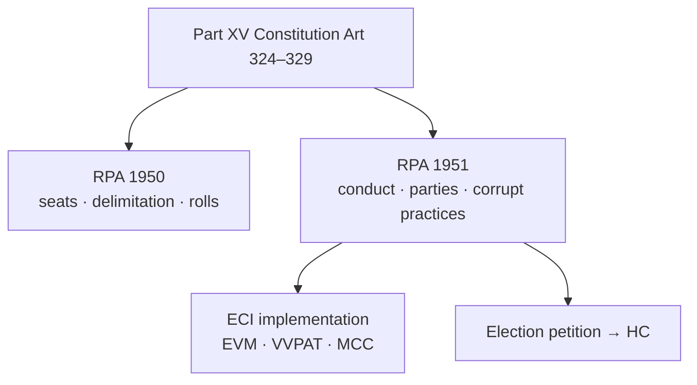

# Representation of the People Act (RPA)

> GS-2 · Topic 08 · Salient features of RPA, electoral bonds, VVPAT, political funding transparency

---

## PYQs

| Year | M | Words | Question (EN) | प्रश्न (HI) | ID |
|------|---|-------|---------------|-------------|-----|
| 2019 | 8 | 125 | Critically examine the main elements of the Representation of People's Act. | जन प्रतिनिधत्व कानून के मुख्य तत्वों का आलोचनात्मक परीक्षण कीजिए। | Q1 |
| 2018 | 8 | 125 | What are electoral bonds? Are they capable of bringing transparency in the political funding system? | चुनावी बांड क्या हैं? क्या यह राजनीतिक वित्त पोषण प्रणाली में पारदर्शिता लाने में सक्षम है? | Q2 |
| 2018 | 8 | 125 | Evaluate the use of VVPAT in the General Election of India. | भारत के आम चुनाव में मतदाता सत्यापन पेपर ऑडिट ट्रायल (VVPAT) के प्रयोग का मूल्यांकन कीजिए। | Q3 |

---

## Quick Revision

```
CONSTITUTIONAL FRAME: Part XV (Art 324–329) · Art 326 adult suffrage · Art 327 Parliament may make law for elections
  Art 324 — superintendence, direction, control of elections → Election Commission of India (ECI)

RPA SUITE:
  RPA 1950 — seat allocation · delimitation framework · electoral rolls principles · parliamentary constituencies
  RPA 1951 — actual conduct — qualification/disqualification · registration of parties · corrupt practices · election petitions · campaign silence · expenditure limits

MAIN ELEMENTS RPA 1951:
  Qualification LS: Art 84 + RPA — citizen · 25 years · registered voter · no office of profit (exceptions)
  Disqualification: S.8 criminal convictions · S.8A disqualification for corrupt practices · S.10 office of profit
  S.29A party registration · S.29B/C party funds
  S.123 corrupt practices — bribery · undue influence · appeal on religion/race · booth capturing · paid news
  S.126 48-hour silence period · S.127 loudspeaker limits
  S.77 election expenditure · S.78 accounts · S.81 limits (amended periodically)
  S.100 grounds for declaring election void — corrupt practice · non-compliance · improper acceptance of nomination
  Election petition — HC (LS/State LS single member) · SC for RS biennial — time-bound

ECI POWERS: Art 324 plenary · MCC (not statutory but enforced) · registration · EVM · VVPAT · observers · SVEEP
EVM: 1982 trial · 2004 phased · 2019 nearly all · VVPAT — voter-verifiable paper trail unit attached to EVM
  VVPAT shows candidate name/symbol for 7 sec · stored for verification · SC 2019: 5 random per assembly segment count

ELECTORAL BONDS (2018 Finance Act):
  Anonymous bearer instrument · SBI only · eligible donors · parties redeem · 15-day validity
  Critique: anonymity · shell companies · quid pro quo · no public disclosure
  SC Association for Democratic Reforms v. Union (Feb 2024) — unconstitutional · violated Art 19(1)(a) right to know · struck down scheme

VVPAT 2024 LS: 100% VVPAT coverage · ~10.5 lakh units · ECI verification protocol · demand for 100% count vs statistical sample debate

OTHER: NOTA 2013 SC · Form 26 asset disclosure · ADR/NGO monitoring · criminalization (S.8 RPA) · decriminalization bills pending

TRAPS: RPA ≠ one Act only (1950+1951) · MCC not in RPA statute · ECI not constitutional body originally but Art 324 · electoral bonds struck down 2024 not 2018 answer only pro side
  VVPAT ≠ full paper ballot · RS elected by MLAs not direct on same VVPAT scale in state RS elections different
```

---

## Content

### Context — electoral law as democratic backbone

Free and fair elections require **constitutional guarantees (Part XV)** plus **detailed statute**. The **Representation of the People Acts, 1950 and 1951 (RPA)** — with **Conduct of Election Rules, 1961** and **ECI instructions** — implement **Art 326 universal adult franchise** and **Art 324 ECI superintendence**. UPPCS tests **RPA elements (2019)**, **electoral bonds transparency (2018)**, and **VVPAT (2018)** — all live after **SC electoral bonds judgment (2024)** and **100% VVPAT in 2024 Lok Sabha polls**.

### Constitutional foundation (Part XV)

| Article | Provision |
|---------|-----------|
| **Art 324** | **ECI** — **superintendence, direction, control** of **elections to Parliament, state legislatures, President/Vice-President** |
| **Art 325** | **No discrimination** in electoral rolls on **religion, race, caste, sex** |
| **Art 326** | **Adult suffrage** — **18+ years** ( **61st Amendment, 1988** ) |
| **Art 327** | **Parliament** may make **law** relating to **elections** |
| **Art 328** | **State legislature** may make **law** for **local elections** (subject to consistency) |
| **Art 329** | **Bars interference by courts** in **electoral matters** except **election petitions** under RPA |

**Election Commission of India (ECI):**
- **Multi-member body** — **Chief Election Commissioner + ECs** — **appointed by President** ( **CEC removal like SC judge** — **Art 324(5)**; **other ECs** — **CEC recommendation** post-law).
- **Plenary power under Art 324** — **Kihoto Hollohan**, **Association for Democratic Reforms (2002)** — **transparency in candidate affidavits**.

### RPA 1950 — delimitation and allocation

**Salient features:**
- **Allocation of seats** to **states/UTs** in **Lok Sabha** and **state legislatures**.
- **Delimitation** of **territorial constituencies** — read with **Delimitation Acts** ( **42nd Amendment froze till 2001 Census**; **84th Amendment extended to 2026**; **Delimitation Commission 2002** last full exercise).
- **Qualification of voters** — **electoral rolls** — **registration, revision, appeals**.
- **Framework** for **Parliamentary constituencies** — **name, extent**.

### RPA 1951 — main elements (2019 PYQ core)

**1. Qualifications and disqualifications for membership**

| Office | Qualification (summary) | Key disqualification |
|--------|-------------------------|----------------------|
| **Lok Sabha** | **Citizen**, **≥25 years**, **registered voter**, **no office of profit** | **S.8** — **conviction** for **specified offences** ( **6 years ban** etc.) |
| **Rajya Sabha** | **≥30 years**, **electoral college** member in state | Same **S.8** framework |
| **State Assembly** | **≥25 years** | **S.8, S.9, S.10** |

**Section 8 RPA** — **criminalization** debate — **ADR** data on **MPs/MLAs with pending/convicted cases** — **Lily Thomas (2013)** — **immediate disqualification on conviction** (no **3-month appeal stay** benefit struck down context).

**2. Registration of political parties (Section 29A)**
- **ECI registration** — **name, symbol** — **national/state party** criteria ( **vote share/seats** ).
- **Sections 29B, 29C** — **contributions**, **accounts**, **audit** obligations.

**3. Corrupt practices (Section 123)**
- **Bribery**, **undue influence**, **appeal to religion/race/caste/community**, **promotion of enmity**, **canvassing near polling stations**, **transport of voters**, **booth capturing**, **paid news** ( **later ECI/legislative recognition** ).
- **Grounds to set aside election (S.100)** if **corrupt practice** by **candidate/agent**.

**4. Campaign regulation**
- **Section 126** — **48-hour silence period** before poll end — **no campaigning**.
- **Section 127** — **loudspeaker restrictions** near polling areas.
- **Model Code of Conduct (MCC)** — **not statutory** but **ECI-enforced** from **1960s** — **moral authority**.

**5. Election expenditure (Sections 77–78, limits in Rules)**
- **Candidates** must **maintain accounts**; **ceiling on spending** ( **revised periodically** — **LS ~Rs 95 lakh–1 crore** range post-amendments — check current notification for exams: **ECI enhanced limits for 2024 LS** ).
- **Star campaigners** — **exempt from individual cap** subject to **party reporting**.

**6. Election petitions and dispute resolution**
- **HC tries petitions** for **LS and state assembly (single-member)** constituencies.
- **Time-bound trial** — **Representatives of People (Amendment) Act 1966** — **3-year limit** spirit.
- **Grounds (S.100)** — **corrupt practice**, **non-compliance with RPA**, **improper nomination acceptance**.

**7. Electoral rolls and conduct**
- **Chief Electoral Officer**, **Returning Officer**, **polling officers** — **Rules 1961**.
- **EVM** — **legalized** — **Parliamentary Act amendments**; **VVPAT** mandate.



### Critical examination of RPA elements (balanced view)

**Strengths:**
- **Comprehensive code** for **world's largest electorate** (~**970 million** registered 2024).
- **Universal franchise** operationalized through **rolls, EVM, VVPAT**.
- **Corrupt practices** defined — **election petitions** as **remedy**.
- **Party registration** enables **ECI oversight**.

**Weaknesses (critical):**
- **Criminalization** — **S.8** allows **pending trial candidates** — **reform bills** pending.
- **Money power** — **expenditure limits** often **breached**; **enforcement weak**.
- **Paid news, social media** — **RPA lag** behind **digital campaigning**.
- **Election petition delay** — **years to decide** — **disqualification comes late**.
- **MCC not legally binding** — **no statutory teeth** for some violations.
- **Political funding opacity** — **electoral bonds era** exposed **systemic flaw** — **2024 SC strike-down**.

### Electoral bonds (2018 PYQ + 2024 law)

**Scheme (2018):** Introduced via **Finance Act 2017** amendments to **RPA, Income Tax Act, Companies Act**.

**Mechanism:**
- **Bearer instrument** sold by **State Bank of India (SBI)** in **January, April, July, October** windows.
- **Eligible donors** — **citizens, companies** ( **foreign source ban** theoretically).
- **Parties** redeem within **15 days** — **only registered parties** getting **≥1% vote** in last election.
- **Anonymity** — **no public disclosure** of **donor identity** to citizens — only **SBI/government** traceability.

**Arguments for (pre-2024 official line):**
- **Digital/clean money** vs **cash**.
- **KYC at bank** — **state knows donor** (not public).

**Arguments against — transparency failure:**
- **Voters' right to know** under **Art 19(1)(a)** — **Association for Democratic Reforms (2002)** line — **bonds defeated transparency**.
- **Shell companies**, **quid pro quo**, **policy capture** without **accountability**.
- **Asymmetric info** — **ruling party** allegedly **knew flows via SBI** — **opposition blind**.

**Supreme Court, Feb 2024 (*Association for Democratic Reforms v. Union*):**
- **Electoral bonds scheme unconstitutional** — **violates freedom of speech and right to information**.
- **Directed SBI** to **disclose details** — **donor-party data published 2024** — **post-mortem transparency**.

**Exam answer (2018 PYQ updated):** **Intended** transparency of **white money** but **failed** on **public accountability** — **2024 SC confirms** — **not capable** of **meaningful political funding transparency**.

### VVPAT — evaluation (2018 PYQ)

**What is VVPAT?**
- **Voter Verifiable Paper Audit Trail** unit — attached to **EVM** — **prints slip** showing **candidate name/symbol** for **~7 seconds** behind **glass** — **voter verifies**, **slip drops in sealed box**.

**Introduction timeline:**
- **2013** — **ECI pilot**; **2019 Lok Sabha** — **VVPAT with all EVMs** ( **ECI phased 100%** goal ).
- **2024 Lok Sabha** — **~10.5 lakh VVPAT units** — **full coverage**.

**Advantages:**
- **Transparency** — voter **confirms vote cast** matches **intent** — reduces **EVM tampering fears**.
- **Audit trail** — **paper record** for **dispute resolution**.
- **Supreme Court (*Subramanian Swamy*, ongoing orders)** — **2019**: **mandatory VVPAT**; **5 random polling stations per assembly segment** — **VVPAT slips counted** to **match EVM** — **statistical verification**.

**Limitations/challenges:**
- **Not full paper ballot** — **only sample verification** ( **5 per segment** ) — activists demand **100% count** — **ECI resists** ( **time, logistics** ).
- **Technical failures** — **VVPAT malfunction** delays (**2019** reports).
- **Storage** — **17C slips** — **environmental/logistical** burden.
- **Trust gap** — **partial verification** may **not satisfy all stakeholders**.

**Overall evaluation:** **Major integrity upgrade** over **standalone EVM** — **2024 scale proves feasibility** — but **verification protocol** remains **debated** between **ECI statistical model** vs **full count advocates**.

### Related electoral reforms (syllabus depth)

- **NOTA (2013 SC — *PUCL*)** — **right not to vote for any candidate** — **symbol on ballot** — **no electoral consequence** ( **winner still highest votes** ) — **symbolic accountability**.
- **Form 26 affidavit** — **assets, criminal cases, education** — **ADR analysis** each election.
- **SVEEP** — **voter education** — **ECI**.
- **One Nation One Election** — separate topic but **RPA amendments** would be needed.

### Contemporary relevance

- **Electoral bonds struck down (2024)** — **reform window** — **state funding debate**, **digital donations with disclosure**.
- **2024 Lok Sabha** — **100% VVPAT**; **ECI app**; **remote voting pilot debates**.
- **Criminal politics** — **Supreme Court 2023 directions** on **S.8 RPA** — **6-year fast-track trial** for **MPs/MLAs** — **implementation uneven**.
- **Paid news & social media** — **ECI MCC extensions** for **digital platforms 2024**.
- **Electoral rolls** — **Special Intensive Revision** debates (**2024–25**) — **disenfranchisement concerns** vs **duplicate removal**.

### Limits — balanced view

- **RPA alone** cannot fix **political culture** — needs **party reform**, **media ethics**, **enforcement**.
- **ECI independence** challenged when **executive appointments**, **transfer controversies** arise.
- **VVPAT** adds **confidence** but **not panacea** for **money power, hate speech, fake news**.

---

## Answers

### Q1: Critically examine main elements of Representation of People's Act. (2019, 8M, 125W)

**Introduction:**
> The **RPA (1950, 1951)** gives **statutory flesh** to **Part XV** — governing **who votes, who contests, how elections run, and how disputes are resolved**.

**Main Points:**
- **RPA 1950** — **Seat allocation, delimitation, electoral rolls** framework for **Parliament/state legislatures**.
- **Qualifications/disqualifications (RPA 1951)** — **age, citizenship, voter registration**; **S.8 criminal conviction bars**.
- **Party registration (S.29A)** — **ECI symbols**, **national/state recognition**, **accountability (29B/C)**.
- **Corrupt practices (S.123)** — **bribery, communal appeal, booth capturing, undue influence** — **election void grounds**.
- **Campaign rules** — **48-hour silence (S.126)**, **expenditure limits (S.77–78)**, **MCC enforcement**.
- **Election petitions (S.100)** — **HC trial** — **remedy against unfair elections**.
- **Critical gaps** — **criminalization, money power, digital campaigning lag, petition delays, MCC non-statutory**.

**Keywords (underline in exam):** RPA 1950 · RPA 1951 · Section 123 · Section 8 · Art 324 · Election petition · Corrupt practices · ECI

**Exam diagram (30 sec):**
```
RPA 1950: seats/rolls | RPA 1951: conduct/parties/corrupt practices → ECI → election petition
```

**Conclusion:**
> RPA is **indispensable but incomplete** — **strong procedural code** needing **reform on crime, money, and speedy justice**.

---

### Q2: What are electoral bonds? Capable of bringing transparency? (2018, 8M, 125W)

**Introduction:**
> **Electoral bonds (2018 scheme)** were **SBI-issued anonymous instruments** for **donating to registered political parties** — ** struck down as unconstitutional in 2024**.

**Main Points:**
- **Mechanism** — **Bearer bond**, **15-day validity**, **redeemable by eligible parties** — **donor identity hidden from public**.
- **Official claim** — **White money**, **KYC at bank**, **alternative to cash**.
- **Transparency failure** — **Voters could not know** **who funded whom** — violates **Art 19(1)(a) right to know** (**ADR precedent**).
- **Shell companies**, **quid pro quo**, **asymmetric information** — **policy capture risk**.
- **SC Feb 2024** — **Scheme unconstitutional** — **mandated disclosure** — **proved opacity harm**.
- **Verdict** — **Not capable** of **meaningful transparency** in **political funding** — **anonymity was fatal flaw**.

**Keywords (underline in exam):** Electoral bonds · SBI · Anonymity · Art 19(1)(a) · ADR · SC 2024 · Political funding · Transparency

**Exam diagram (30 sec):**
```
Donor → bond (anonymous to public) → party
SC 2024: struck down — transparency needs disclosure not secrecy
```

**Conclusion:**
> Electoral bonds **failed transparency test** — **2024 judgment** confirms **democratic funding requires **public accountability**, not **bank-only secrecy**.

---

### Q3: Evaluate use of VVPAT in General Election of India. (2018, 8M, 125W)

**Introduction:**
> **VVPAT (Voter Verifiable Paper Audit Trail)** adds a **paper verification layer to EVMs**, strengthening **voter confidence** in **Indian general elections**.

**Main Points:**
- **Function** — **Slip shows candidate/symbol** for **~7 seconds** — voter **verifies vote** before **sealed storage**.
- **Scale** — **2019 LS near-universal**; **2024 LS 100% VVPAT coverage** (~**10.5 lakh units**).
- **Advantage** — **Deterrence against tampering**; **audit sample** — **SC-ordered 5 slips per assembly segment** matched with **EVM count**.
- **Integrity boost** — **Addresses EVM mistrust** better than **standalone machines**.
- **Limits** — **Not full paper ballot**; **100% slip count** not done — **ECI statistical verification only**.
- **Operational issues** — **Malfunctions, delays**, **storage logistics** — manageable at scale but **not zero-cost**.

**Keywords (underline in exam):** VVPAT · EVM · ECI · Paper audit trail · SC verification · 2024 Lok Sabha · Electoral integrity

**Exam diagram (30 sec):**
```
Vote on EVM → VVPAT slip verify → sealed box
Audit: 5 random/segment (SC) — debate: sample vs 100%
```

**Conclusion:**
> VVPAT **significantly enhances electoral transparency** — **2024 full deployment a milestone** — but **verification protocol** should **evolve toward greater statistical or full audit trust**.

---

### Q4: *Likely variant:* Salient features of RPA — enumerate. (8M, 125W)

**Introduction:**
> **Salient features of RPA** span **two Acts** implementing **constitutional adult franchise** and **ECI-controlled elections**.

**Main Characteristics:**
- **Universal adult franchise (Art 326)** — **18+**, **electoral rolls**, **non-discrimination (Art 325)**.
- **Delimitation and seat allocation (1950 Act)** — **Lok Sabha/state constituencies**.
- **Conduct of elections (1951 Act)** — **nomination, polling, counting, observers**.
- **Political party registration (S.29A)** — **symbols, recognition criteria**.
- **Corrupt practices (S.123)** and **disqualifications (S.8)** — **electoral purity**.
- **Expenditure limits and accounts (S.77–78)** — ** curb money power**.
- **Election petitions (S.100)** — **judicial remedy** in **HC**.

**Keywords (underline in exam):** RPA 1950 · RPA 1951 · Art 326 · Section 123 · Section 29A · Election petition · ECI

**Exam diagram (30 sec):**
```
1950: seats/rolls | 1951: conduct + parties + S.123 + petitions
```

**Conclusion:**
> Together, RPA features form **India's electoral rulebook** — **foundation of representative democracy**.

---

### Q5: *Likely variant:* Role of Election Commission under Art 324. (8M, 125W)

**Introduction:**
> **Article 324** vests **ECI** with **plenary superintendence, direction, and control** over **national and state legislative elections**.

**Main Characteristics:**
- **Independent body** — **CEC removal protection** — **fair election guardian**.
- **Electoral roll preparation** — **revision, SIR, voter registration**.
- **Conduct elections** — **EVM/VVPAT, MCC, observers, counting**.
- **Party registration** — **symbols, national/state status**.
- **Enforcement** — **MCC, expenditure monitoring, paid news panels**.
- **Voter education** — **SVEEP** — **inclusion of marginalized voters**.
- **Limits** — **MCC not statutory**; **needs legislative backup** on **criminalization, funding**.

**Keywords (underline in exam):** Art 324 · ECI · Superintendence · MCC · VVPAT · Electoral rolls · SVEEP

**Exam diagram (30 sec):**
```
Art 324 → ECI → rolls + conduct + MCC + EVM/VVPAT + party reg
```

**Conclusion:**
> ECI under **Art 324** is **democracy's referee** — **effectiveness depends on RPA strength and institutional independence**.

---

## Traps

| Wrong | Correct |
|-------|---------|
| RPA is a single Act | **Two Acts — 1950 and 1951** (+ Conduct of Election Rules 1961) |
| Model Code of Conduct is in RPA statute | **Not statutory** — **ECI evolved guideline** — **moral force** |
| Electoral bonds still valid | **Struck down SC Feb 2024** — **unconstitutional** |
| VVPAT replaces EVM entirely | **VVPAT attaches to EVM** — **electronic vote + paper verify** |
| NOTA can reject all candidates and re-poll | **NOTA symbolic** — **candidate with highest valid votes still wins** |
| Election petitions go to Supreme Court for LS | **High Court** for **LS/Assembly** (single member); **RS biennial to SC** |
| Any citizen can contest without voter registration | Must be **registered voter in constituency** (LS/Assembly) |
| Section 123 only covers bribery | **Multiple corrupt practices** — **religion appeal, booth capture, etc.** |
| 18-year voting age in original Constitution | **61st Amendment 1988** lowered from **21 to 18** |
| Electoral bonds disclosed donor to public | **Anonymous to public** — **key flaw cited by SC 2024** |
| VVPAT means 100% paper count in India | **Sample verification (5/segment)** per **SC orders** — **not full recount** |
| Art 324 covers local body elections only by ECI | **Local elections** — **State Election Commissions (Art 243K)** |

---

*Complete.*
