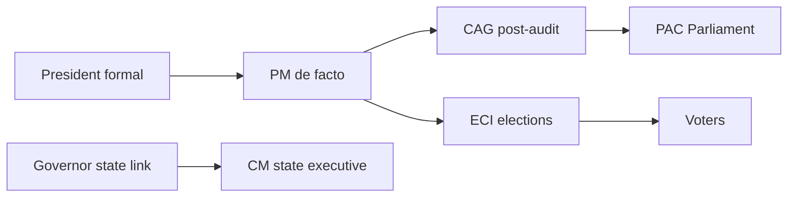

# Constitutional Posts — Appointment, Powers & Responsibilities

> GS-2 · Topic 09 · President, Governor, PM, CAG, ECI, pardoning powers, constitutional office-holders

---

## PYQs

| Year | M | Words | Question (EN) | प्रश्न (HI) | ID |
|------|---|-------|---------------|-------------|-----|
| 2025 | 12 | 125 | "The CAG of India is the supreme authority of India's finance." Critically analyse his functions and position in the light of this statement. | "भारत का नियंत्रक एवं महालेखापरीक्षक (CAG) भारत के वित्त का सर्वोच्च अधिकारी है।" इस कथन के आलोक में उसके कार्यों एवं स्थिति का आलोचनात्मक विश्लेषण कीजिए। | Q1 |
| 2024 | 12 | 200 | What are the implications of the revised appointment process of Election Commission for ensuring its independence? | चुनाव आयोग की स्वतंत्रता सुनिश्चित करने के लिए उसकी संशोधित नियुक्ति प्रक्रिया के निहितार्थ क्या हैं? | Q2 |
| 2023 | 8 | 125 | How is the power of Governor to pardon different from the power of President under Article 72? | भारतीय संविधान के अनुच्छेद 72 के अंतर्गत राष्ट्रपति की क्षमादान का अधिकार राज्यपाल की क्षमादान शक्ति से किस प्रकार भिन्न है? | Q3 |
| 2022 | 12 | 200 | How is the President of India elected? | भारत का राष्ट्रपति कैसे निर्वाचित होता है? | Q4 |
| 2021 | 12 | 200 | Examine the role of the CAG in India as the custodian of public money. | सार्वजनिक धन के संरक्षक के रूप में, भारत में नियंत्रक एवं महालेखा परीक्षक की भूमिका का परीक्षण कीजिए। | Q5 |
| 2020 | 8 | 125 | "The President of India cannot become a dictator." Explain. | "भारत का राष्ट्रपति तानाशाह नहीं बन सकता।" समझाइये। | Q6 |
| 2020 | 12 | 200 | What are the problems faced by the Election Commission at present? Also mention solutions. | एक संस्था के रूप में चुनाव आयोग द्वारा वर्तमान में किन-किन समस्याओं का सामना किया जा रहा है? इसके समाधान का भी उल्लेख कीजिए। | Q7 |
| 2019 | 12 | 200 | Discuss the emerging role of the Prime Minister in India. | भारत में प्रधानमंत्री की उभरती भूमिका का वर्णन कीजिए। | Q8 |
| 2018 | 8 | 125 | Examine the Constitutional Position of the CAG of India. | भारत के नियंत्रक एवं महालेखा परीक्षक की संवैधानिक स्थिति का परीक्षण कीजिए। | Q9 |

---

## Quick Revision

```
CONSTITUTIONAL POSTS: Independent offices insulating governance from partisan capture
  President · VP · PM (not fully "constitutional post" same sense but central) · Governor · CAG · CEC/EC · AG · FC Chairman · UPSC Chairman

PRESIDENT (Art 52–62): Indirect election · Electoral College Art 54 = LS+RS MPs + State/UT MLAs (value weighted)
  Art 55 — proportional representation + STV · Quota system for state vote value
  Term 5 years · Impeachment Art 61 · Art 53 executive power formally · Art 72 pardon (Union, military, death all India)
  NOT dictator: PM+CoM advice Art 74 · ordinance · judicial review · fixed term · impeachment · no discretionary war power like US pre-1976 fully

GOVERNOR (Art 153–161): President appoints Art 155 · pleasure Art 156 · Art 161 pardon STATE offences · NOT military · death sentence subject to Art 72 overlap if affects
  Agent vs constitutional head debate · Bommai limits

CAG (Art 148–151): Appointed by President · 6 years/65 age · removal like SC judge · NOT executive finance controller
  Post-audit · reports to President → Parliament · PAC examines · custodian of PUBLIC PURSE not spender
  Audit Union + States · PSUs · compliance audit · performance audit · 2G/CAG coal reports fame
  "Supreme finance" OVERSTATEMENT — no veto on budget/expenditure

ECI (Art 324): CEC + ECs · plenary election superintendence
  OLD: Executive appointment by President · CEC removal = SC judge level
  NEW: Chief Election Commissioner And Other Election Commissioners Act 2023
  Search Committee (PM, LoP, Minister, CJI nominee) → panel → President appoints from panel with PM, Minister, LoP, CJI nominee committee
  Debate: executive dominance persists · LoP when no clear LoP weak · independence partial improvement vs opaque past

ECI PROBLEMS: MCC not statutory · money power · criminal candidates · staff/deputation from govt · model code digital gap · violence · electoral bonds (struck 2024) · ONOE pressure · insufficient legal powers to de-register parties

PM EMERGING ROLE: Art 74 de facto head · PMO · cabinet committees · presidentialisation of campaigns · single-party majority centralisation · foreign policy · appointments · coordination

VP: RS Chairman · succeeds President · electoral college similar without MLAs in VP election - Art 66 different college (LS+RS only)

TRAPS: CAG controls finance NO — audits after · Governor pardon ≠ all death sentences independent of President · President not directly elected · ECI Act 2023 ≠ CJI sole appointer · PM not constitutional post Part V same line as President but Art 75 central
```

---

## Content

### Context — constitutional posts and institutional integrity

**Constitutional posts** are offices **directly created and protected by the Constitution** — **appointment procedure, tenure, removal, and independence** designed to **insulate critical functions** ( **audit, elections, prosecution advice, union-state link** ) from **ordinary political turnover**. UPPCS Topic 09 clusters **President, Governor, PM, CAG, ECI** — **9 PYQs (2018–2025)** on **powers, appointment reforms, and limits**.

### Overview — major constitutional posts

| Post | Constitutional basis | Appointed by | Independence mechanism |
|------|---------------------|--------------|------------------------|
| **President** | **Art 52–62** | **Electoral College (Art 54)** | **Impeachment (Art 61)**; **fixed term** |
| **Vice-President** | **Art 63–71** | **Electoral College (Art 66)** — **Parliament only** | **RS removal procedure** |
| **Governor** | **Art 153–162** | **President (Art 155)** | **Pleasure (Art 156)** — **weak independence** |
| **CAG** | **Art 148–151** | **President (Art 148)** | **Removal like SC judge (Art 148(1))** |
| **CEC / ECs** | **Art 324** + **Act 2023** | **President on **recommendation committee**** | **CEC removal = SC judge standard** |
| **Attorney General** | **Art 76** | **President** | **Not independent — holds brief for govt** |
| **UPSC Chairman/members** | **Art 316** | **President** | **Removal only by President after inquiry** |

### President — election, powers, non-dictatorship

**Election (Art 54–55) — 2022 PYQ:**

**Electoral College comprises:**
- **Elected members of both Houses of Parliament** ( **not nominated RS members** ).
- **Elected members of state legislative assemblies** + **Delhi, Puducherry MLAs** ( **UTs with assemblies** ).
- **NOT included:** **Nominated members**, **MLCs** (unless elected?), **Legislative Council elected members ARE included** — **MLAs of Vidhan Sabha only** for states.

**Voting method:**
- **Proportional representation** by means of **single transferable vote (STV)**.
- **Secret ballot**.
- **Value of vote** — **MLA vote value** = **State population / (Number of MLAs × 1000)**; **MP vote value** uniform so **total MP value ≈ total MLA value** — **federal balance**.

**Term:** **5 years (Art 56)**; **re-eligible**; **impeachment (Art 61)** — **special majority** for **violation of Constitution**.

**Powers (summary):**
- **Executive (Art 53)** — exercised **on CoM advice (Art 74)** — **real power with PM**.
- **Legislative** — **summon/prorogue Parliament**, **ordinances (Art 123)**, **assent to bills**.
- **Judicial** — **Art 72 pardon**, **reprieve, respite, remission, commute**.
- **Military** — **Supreme Commander** ( **symbolic** ).
- **Diplomatic** — **treaties, ambassadors** on **advice**.

**"Cannot become dictator" (2020 PYQ):**
- **Parliamentary system** — **PM + CoM responsible to LS (Art 75(3))** — **President bound by advice** ( **42nd Amendment clarified**; **44th restored explicit "aid and advice"** ).
- **No direct election** — **lacks personal popular mandate** of **PM**.
- **Ordinance** requires **Parliament approval** — **limited duration**.
- **Judicial review** — **actions ultra vires** struck down.
- **Impeachment** — **accountability**.
- **44th Amendment** — **President must act on CoM advice** — **Savhoru/Kesavananda** context — **not presidential dictatorship model**.

### Governor — appointment and pardoning (Art 161 vs 72)

**Appointment (Art 155–156):** **President appoints**; holds office during **President's pleasure** — **Centre's constitutional representative**.

**Art 161 — Governor's pardoning power:**
- **Suspension, remission, commute** of **sentence** of **person convicted of offence against state law**.
- **Scope:** **State offences** only.

**Art 72 — President's pardoning power:**
- **Union law offences**.
- **All cases of court-martial**.
- **Death sentence** — **any law** ( **Union or State** ) — **President exclusive** for **death penalty** final mercy at **Union level**.

**Key differences (2023 PYQ):**

| Aspect | **President (Art 72)** | **Governor (Art 161)** |
|--------|------------------------|------------------------|
| **Offences** | **Union laws + martial law** | **State laws** |
| **Death sentence** | **Can pardon/commute all death sentences** | **Limited** — **Maru Ram (1980)** — **Governor bound by CoM advice**; **death cases** often **referred/upheld at President level** in practice for **final mercy** |
| **Advice** | **Union CoM (Art 74)** | **State CoM (Art 163)** |
| **Judicial review** | **Epuru Sudhakar (2006)** — **limited review** — **non-arbitrary, relevant material** |

**Epuru Sudhakar / Kehar Singh cases** — **pardon not court appeal** but **not arbitrary**.

### CAG — constitutional position and role (2018, 2021, 2025 PYQs)

**Article 148–151:**

| Feature | Detail |
|---------|--------|
| **Appointment** | **President** by **warrant under hand and seal** |
| **Tenure** | **6 years** or **65 years** age — **whichever earlier** |
| **Removal** | **Same procedure as SC judge** — **proved misbehaviour/incapacity** — **high independence** |
| **Ineligibility** | **Not eligible for office under GOI or state** after retirement |
| **Duties (Art 149)** | **Audit accounts of Union and states** prescribed by **Parliament (CAG DPC Act 1971)** |
| **Reports (Art 151)** | **Submitted to President/Governor** → **placed before Parliament/Assembly** |

**Functions:**
- **Post-audit** of **government expenditure** — **does NOT control purse** or **block spending in advance** — **misnomer "Comptroller"** — **no pre-expenditure approval** like **UK Comptroller General historically**.
- **Compliance audit** — **rules, regulations, propriety**.
- **Performance audit** — **3E: economy, efficiency, effectiveness**.
- **Audit of PSUs, autonomous bodies, local bodies** as assigned.
- **PAC support** — **CAG reports** basis for **Public Accounts Committee** scrutiny — **2G, coal allocation** audits **high profile**.

**"Supreme authority of finance" — critical analysis (2025 PYQ):**
- **Partial truth:** **Supreme audit authority** — **constitutional watchdog** of **public money** — **custodian of public purse** in **accountability sense**.
- **Overstatement:** **Not finance minister**, **not RBI**, **not Parliament** — **no power over **budget formulation**, **taxation**, **borrowings**, **expenditure sanction****.
- **Reports recommendatory** — **implementation depends on **PAC, Parliament, executive****.
- **States audit** — **CAG audits state accounts** but **state executive controls spending**.

**Balanced verdict:** **Supreme auditor**, **not supreme financial executive** — **post-facto guardian** of **public money**.

### Election Commission — independence and reforms

**Art 324** — **ECI** — **superintendence, direction, control** of **elections**.

**Composition:** **Chief Election Commissioner (CEC)** + **Election Commissioners (ECs)** — **multi-member since 1993**.

**Removal:** **CEC** — **like SC judge (Art 324(5))**; **other ECs** — **CEC recommendation** after **2023 Act**.

**Revised appointment — CEC and Other ECs Act, 2023 (2024 PYQ):**

| Stage | Process |
|-------|---------|
| **Search Committee** | **Prime Minister**, **Union Minister**, **Leader of Opposition (or largest opposition party)**, **CJI or nominee** — prepares **panel of 5 names** |
| **Selection Committee** | **PM**, **Minister**, **LoP**, **CJI or nominee** — **appoints CEC/ECs from panel** |
| **President** | **Formal appointing authority** |

**Implications for independence:**

**Positive:**
- **Statutory process** replaces **pure executive appointment** — **more transparent** than **pre-2023 opaque convention**.
- **LoP + CJI nominee** — **some non-executive voice**.
- **Fixed tenure/salary** provisions in **Act** — **security**.

**Concerns:**
- **PM + Minister majority** on **both committees** — **executive dominance** persists.
- **When no recognised LoP** — **weak opposition** representation — **2014–2019, 2024 scenarios**.
- **CJI nominee** not **full collegium** — **limited judiciary role**.
- **Not equivalent to **Judicial Appointments Commission** or **UPSC independence****.

**ECI institutional problems & solutions (2020 PYQ):**

| Problem | Solution direction |
|---------|------------------|
| **MCC not legally binding** | **Statutory MCC**; **fast-track EC tribunals** |
| **Money power, criminal candidates** | **RPA reform S.8**; **fast-track trials**; **public funding debate post-bonds** |
| **Staff on deputation from govt** | **Permanent ECI cadre** |
| **Digital/paid news/social media** | **Amend RPA**; **platform regulation during elections** |
| **Violence, booth capturing** | **Central forces deployment**; **stiffer S.123 penalties** |
| **Insufficient punitive powers** | **Empower ECI to **de-register parties**** statutorily |
| **Model code enforcement delays** | **Special election benches in HCs** |

### Prime Minister — emerging role (2019 PYQ)

- **Art 74–75, 78** — **head of CoM**, **leader of majority**, **principal adviser to President**.
- **Emerging trends:** **PMO expansion** — **policy coordination** bypassing **individual ministries**; **personalized electoral mandates (2014, 2019, 2024)** — **"presidentialisation"** of campaigns while **formally parliamentary**.
- **Cabinet Committees** — **Security, Economic Affairs** chaired by **PM**.
- **Foreign policy**, **major appointments (governors, CVC, key commissions)**, **crisis management**.
- **Impact:** **Centralisation** — **reduced collegial cabinet**; **stronger executive vs legislature** when **single-party majority**; **tension with **federal CMs**, **judiciary**, **regulators****.
- **Critical balance:** **Efficiency vs concentration of power** — **needs institutional checks (Parliament, courts, media)**.



### Contemporary relevance

- **CAG reports 2024–25** — **PM-KISAN, MGNREGA, defence procurement** — **PAC follow-up**.
- **ECI 2024 Lok Sabha** — **100% VVPAT**; **appointment under 2023 Act** — **first cycles under new law**.
- **President election 2022** — **Droupadi Murmu** — **electoral college arithmetic** example.
- **Governor–CM conflicts** — **pardon/ remission politics (Rajiv Gandhi case federal dimensions)** — **Art 72 vs 161** salience.
- **Supreme Court on ECI appointment (2023 directions → 2023 Act)** — **response to **Anoop Baranwal v. Union** litigation**.

### Limits — balanced view

- **Constitutional posts vary in independence** — **CAG/CEC strong**; **Governor/AG weak**.
- **CAG lacks **sword** — **audit without enforcement** — **depends on **PAC/political will****.
- **ECI reforms partial** — **2023 Act** not **full autonomy from executive**.
- **PM centrality** — **democratic mandate** but **risk to **cabinet/federal balance****.

---

## Answers

### Q1: CAG is supreme authority of India's finance — critical analysis. (2025, 12M, 125W)

**Introduction:**
> The **CAG (Art 148–151)** is India's **constitutional auditor** — **supreme in audit accountability**, **not supreme in financial governance**.

**Main Points:**
- **Post-audit role** — **Audits after expenditure** — **no power to approve/block budget** — **not "finance controller"**.
- **Supreme audit jurisdiction** — **Union, states, PSUs** — **compliance + performance audit** — **public money watchdog**.
- **Reports to President/Governor** → **Parliament/PAC** — **transparency**, **not execution**.
- **Independence** — **6-year tenure**, **removal like SC judge** — **fearless reporting (2G, coal audits)**.
- **Overstatement in quote** — **FM, RBI, Parliament** control **policy, tax, borrow, spend** — **CAG examines **propriety** later**.
- **Custodian sense** — **Guardian of public purse** — **accountability**, **not **authority to spend****.

**Keywords (underline in exam):** CAG · Art 148 · Post-audit · PAC · Public purse · Performance audit · Not finance controller

**Exam diagram (30 sec):**
```
Spend (Executive/Parliament) → CAG audit → Report → PAC → accountability
CAG ≠ budget maker/spender
```

**Conclusion:**
> CAG is **supreme audit authority**, **not supreme financial authority** — **critical pillar of **fiscal accountability**, not **fiscal sovereignty**.

---

### Q2: Implications of revised ECI appointment for independence. (2024, 12M, 200W)

**Introduction:**
> The **Chief Election Commissioner and Other Election Commissioners Act, 2023** replaced **opaque executive appointments** with a **statutory Search/Selection Committee** — **mixed implications** for **ECI independence**.

**Main Points:**
- **Statutory framework** — **Art 324** supplemented — **predictable process**, **LoP + CJI nominee participation**.
- **Search Committee** — **Panel of 5** — **reduces arbitrary single-point picks**.
- **Selection Committee** — **PM, Minister, LoP, CJI nominee** — **appoints CEC/ECs** — **President formal order**.
- **Positive** — **More transparent** than **pre-2023 convention**; **fixed tenure/salary security** in **Act**.
- **Concern — executive majority** — **PM + Minister** dominate **both committees** — **partial not full autonomy**.
- **Weak LoP** — **When no recognised LoP**, **opposition underrepresented** — **2014-type scenarios**.
- **Not collegium-level independence** — **Judiciary voice advisory** — **executive still gatekeeper**.
- **Net implication** — **Incremental improvement**, **not constitutional transformation** — **needs **balanced committee** or **JAC model** debate**.

**Keywords (underline in exam):** ECI Act 2023 · Art 324 · Search Committee · Selection Committee · CEC independence · LoP · Anoop Baranwal

**Exam diagram (30 sec):**
```
Search Committee → panel → Selection (PM+Min+LoP+CJI nom) → President appoints CEC/EC
Independence: improved transparency · executive majority remains
```

**Conclusion:**
> Revised process **institutionalises appointments** but **full independence** requires **non-executive majority** or **statutory insulation** beyond **2023 Act**.

---

### Q3: Governor's pardon power vs President under Art 72. (2023, 8M, 125W)

**Introduction:**
> **Art 72 (President)** and **Art 161 (Governor)** grant **mercy jurisdiction** over **different offence domains** with **death sentence asymmetry**.

**Main Characteristics:**
- **President (Art 72)** — **Union law offences**, **court-martial cases**, **death sentences under any law**.
- **Governor (Art 161)** — **State law offences only** — **no martial law jurisdiction**.
- **Death penalty** — **President has **national death mercy** power**; **Governor's death commutation** subject to **federal/coM advice constraints** — **Maru Ram** — **Governor acts on **state CoM advice****.
- **Advice basis** — **President: Union CoM (Art 74)**; **Governor: State CoM (Art 163)**.
- **Judicial review** — **Both subject to **limited review** — **non-arbitrary, relevant material (Epuru Sudhakar)**.
- **Overlap** — **Union offences** even in state → **President**; **pure state crime → Governor**.

**Keywords (underline in exam):** Art 72 · Art 161 · Pardon · Death sentence · State offence · Union offence · Maru Ram

**Exam diagram (30 sec):**
```
State law → Governor Art 161
Union law + martial + all death → President Art 72
Both: CoM advice · limited judicial review
```

**Conclusion:**
> **President's pardon power is wider**, especially on **death and Union/military cases**; **Governor's is **state-specific** mercy power**.

---

### Q4: How is President of India elected? (2022, 12M, 200W)

**Introduction:**
> The **President is elected indirectly** by an **Electoral College** under **Articles 54–55** — balancing **federalism** and **national representation**.

**Main Points:**
- **Electoral College (Art 54)** — **Elected MPs (LS+RS)** + **Elected MLAs of states** + **Delhi/Puducherry MLAs**.
- **Excludes** — **Nominated RS members**, **MLCs not in system** — **MLA = Vidhan Sabha elected**.
- **Voting method** — **Proportional representation + Single Transferable Vote (STV)** — **secret ballot**.
- **Vote value** — **Uniform MP value**; **MLA value proportional to state population** — **parity of state block vs MP block totals**.
- **Quota** — **Candidate needs **quota** to win** — **preferences transferred** — **majority through STV rounds**.
- **Term** — **5 years**; **re-eligible**; **impeachment safeguard (Art 61)**.
- **Significance** — **Indirect election** suits **parliamentary system** — **President symbolic-federal unifier**, **not populist executive like US**.

**Keywords (underline in exam):** Art 54 · Art 55 · Electoral College · STV · Vote value · Indirect election · Federal balance

**Exam diagram (30 sec):**
```
MPs (LS+RS elected) + MLAs → STV ballot → President (5-year term)
MLA vote value ∝ state population
```

**Conclusion:**
> **STV + weighted college** ensures **President reflects **both national and federal units**** without **direct presidential supremacy**.

---

### Q5: CAG as custodian of public money — examine. (2021, 12M, 200W)

**Introduction:**
> **CAG** safeguards **public money** through **independent post-audit** — **constitutional custodian of accountability**, not **custodian of treasury operations**.

**Main Points:**
- **Art 148–151** — **Independent tenure**, **SC-level removal** — **fearless audit**.
- **Audit scope** — **Union/state accounts**, **PSUs**, **autonomous bodies** — **CAG DPC Act 1971**.
- **Compliance audit** — **Legal/regulatory propriety of spending**.
- **Performance audit** — **Economy, efficiency, effectiveness** — **value for money**.
- **Reports to President** → **Parliament** → **PAC examination** — **public scrutiny**.
- **Custodian meaning** — **Protects public purse** by **exposing waste, fraud, irregularities** — **2G/coal examples**.
- **Limits** — **No spending control**; **recommendations not binding** — **executive may ignore** until **PAC/political pressure**.

**Keywords (underline in exam):** CAG · Custodian public money · Art 151 · PAC · Performance audit · Post-audit · Art 148

**Exam diagram (30 sec):**
```
Public spend → CAG audit → PAC/Parliament → corrective action
Custodian = accountability guardian
```

**Conclusion:**
> CAG **custodies public money by auditing and exposing misuse** — **indispensable fiscal watchdog** in **parliamentary democracy**.

---

### Q6: President cannot become dictator — explain. (2020, 8M, 125W)

**Introduction:**
> India's **parliamentary Constitution** distributes **real power to PM/CoM** while **limiting President** through **law and accountability** — preventing **dictatorship**.

**Main Characteristics:**
- **Aid and advice (Art 74)** — **President bound by CoM** — **44th Amendment** — **not independent executive**.
- **PM accountability (Art 75(3))** — **Power flows from **LS majority**, not President alone**.
- **Ordinance limited (Art 123)** — **Parliament must ratify** — **temporary only**.
- **Judicial review** — **Unconstitutional acts void** — **Kesavananda basic structure**.
- **Impeachment (Art 61)** — **Removal for constitutional violation**.
- **No direct mandate** — **Indirect election** — **lacks mass plebiscitary power** of **dictators**.

**Keywords (underline in exam):** Art 74 · Aid and advice · Parliamentary system · Art 61 impeachment · Judicial review · Art 75(3)

**Exam diagram (30 sec):**
```
President formal ← CoM advice ← PM (LS majority)
Checks: impeachment · courts · ordinance limit
```

**Conclusion:**
> **Structural constitutional design** — **not individual virtue** — ensures **President remains head of state, not dictator**.

---

### Q7: ECI problems and solutions. (2020, 12M, 200W)

**Introduction:**
> **ECI (Art 324)** manages **world's largest elections** but faces **legal, logistical, and political headwinds** requiring **institutional strengthening**.

**Main Points:**
- **Problem — MCC not statutory** — **Violations weakly punished** → **Solution: legalise MCC**, **expedited penalties**.
- **Problem — money power & criminalization** — **Solution: RPA reform**, **fast-track MP/MLA cases**, **transparent funding post-bonds strike-down**.
- **Problem — staff on govt deputation** — **Solution: independent ECI cadre**.
- **Problem — digital/paid news/social media** — **Solution: amend RPA**, **ECI- platform protocols**.
- **Problem — violence, intimidation** — **Solution: central forces**, **strengthen S.123 corrupt practices**.
- **Problem — limited party control** — **Solution: statutory **de-registration** powers**.
- **Problem — appointment independence (pre/post 2023 Act)** — **Solution: balanced appointment board**, **CEC removal parity for all ECs**.

**Keywords (underline in exam):** Art 324 · MCC · Money power · Criminalization · ECI cadre · RPA reform · VVPAT

**Exam diagram (30 sec):**
```
Problems: MCC weak · money · crime · staff · digital
Solutions: statute · RPA · cadre · enforcement · funding reform
```

**Conclusion:**
> ECI **needs **legal teeth + autonomous capacity**** to match **scale and stakes** of **Indian democracy**.

---

### Q8: Emerging role of Prime Minister. (2019, 12M, 200W)

**Introduction:**
> **Prime Minister**, as **head of government (Art 74–75)**, has **grown central** to **policy, elections, and governance** — especially under **single-party majorities**.

**Main Points:**
- **Constitutional core** — **Leader of CoM**, **advises President**, **accountable to LS (Art 75(3))**.
- **PMO expansion** — **Cross-ministry coordination**, **monitoring flagship schemes** — **decision funnel**.
- **Presidentialisation of politics** — **Modi/Indira-type campaigns** — **personal mandate narrative** despite **parliamentary form**.
- **Cabinet Committees** — **PM chairs Security, Economic Affairs** — **sets national agenda**.
- **Foreign policy & appointments** — **Summits, governors, key posts** — **executive face of India**.
- **Federal impact** — **Centre-state friction** when **strong PM + same-party states** vs **opposition states**.
- **Critique** — **Over-centralisation**, **cabinet marginalisation**, **weak parliamentary scrutiny** under **anti-defection**.

**Keywords (underline in exam):** Art 74 · PMO · De facto executive · Presidentialisation · Cabinet Committees · Art 75(3) · Centralisation

**Exam diagram (30 sec):**
```
PM → PMO + Cabinet C'ttees → policy centralisation
Democracy check: LS + federal units + courts
```

**Conclusion:**
> PM's **emerging role** drives **efficient leadership** but must stay **within **cabinet, Parliament, federal balance**** to avoid **executive overload**.

---

### Q9: Constitutional position of CAG. (2018, 8M, 125W)

**Introduction:**
> **CAG (Art 148)** is an **independent constitutional officer** — **neither part of executive nor judiciary** — **audit arm of Parliament**.

**Main Characteristics:**
- **Appointment** — **President**; **tenure 6 years/65 age**.
- **Removal** — **Like Supreme Court judge** — **high independence**.
- **Post-retirement bar** — **No GOI/state office** — **conflict prevention**.
- **Duties (Art 149)** — **Audit Union/state accounts** per **Parliamentary law**.
- **Reporting (Art 151)** — **To President/Governor** → **Legislature** — **PAC scrutiny**.
- **Position** — **Guardian of public purse** — **post-audit**, **not policy maker**.

**Keywords (underline in exam):** Art 148 · Art 151 · Independent office · PAC · Six-year tenure · SC-level removal

**Exam diagram (30 sec):**
```
Art 148 CAG → independent → audits → Art 151 report → PAC
```

**Conclusion:**
> CAG occupies **unique constitutional space** — **fearless auditor** supporting **parliamentary control over finance**.

---

### Q10: *Likely variant:* Attorney General vs Advocate General — constitutional roles. (8M, 125W)

**Introduction:**
> **Attorney General (Art 76)** and **Advocate General (Art 165)** are **chief legal advisers** to **Union and state governments** respectively — **not independent constitutional guardians like CAG**.

**Main Characteristics:**
- **AG** — **Appointed by President**, **must be **SC-eligible****, **holds brief for Union** in **courts**.
- **Advocate General** — **State Governor appoints**, **state law officer**.
- **Not a full-time minister** but **participates in Parliament** ( **AG only** ) without **vote**.
- **Role** — **Legal advice**, **represent government litigation** — **neither controls judiciary nor audit**.
- **Difference from CAG/ECI** — **Executive legal arm** — **no independence mandate**.

**Keywords (underline in exam):** Art 76 · Art 165 · Attorney General · Advocate General · Government legal adviser

**Exam diagram (30 sec):**
```
Union → AG Art 76 | State → Adv General Art 165
Both: legal counsel · not independent watchdogs
```

**Conclusion:**
> **AG/Advocate General** serve **government litigation needs** — distinct from **CAG/ECI independence architecture**.

---

## Traps

| Wrong | Correct |
|-------|---------|
| CAG controls and approves expenditure before spending | **Post-audit** role — **no pre-spending veto** |
| President is directly elected by people | **Indirect** — **Electoral College (Art 54)** |
| Governor can pardon military offences | **President Art 72** — **court-martial cases** |
| Governor's death sentence power equals President's | **President has **wider death mercy** jurisdiction** |
| CEC appointed solely by CJI under 2023 Act | **Selection Committee: PM, Minister, LoP, CJI nominee** |
| President can ignore CoM advice routinely | **Bound by Art 74** ( **44th Amendment** ) except **limited zones** |
| CAG is part of Parliament | **Independent constitutional office** — **reports TO Parliament via PAC** |
| ECI Act 2023 removed executive role completely | **PM still chairs selection** — **partial reform** |
| VP elected by same college as President | **Art 66** — **Parliament members only** (no MLAs) |
| PM is not mentioned in Constitution | **Art 75** — **PM appointed by President** — **central to CoM** |
| CAG can re-audit rejected reports bindingly | **Recommendatory** — **PAC/Parliament pursues** |
| Nominated RS members vote in Presidential election | **Excluded from Electoral College** |

---

*Complete.*
