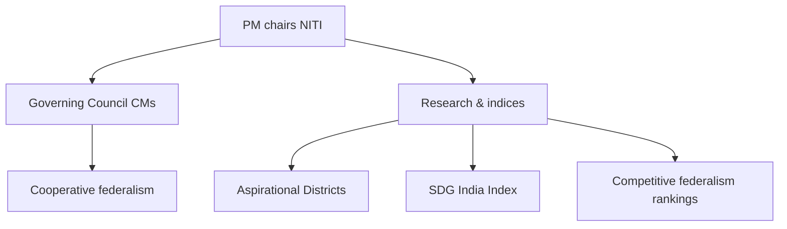

# Statutory, Regulatory & Quasi-Judicial Bodies + NITI Aayog

> GS-2 · Topic 10 · Statutory/regulatory/quasi-judicial institutions, NITI Aayog features and functioning

---

## PYQs

| Year | M | Words | Question (EN) | प्रश्न (HI) | ID |
|------|---|-------|---------------|-------------|-----|
| 2024 | 8 | 125 | Write the role of NITI Aayog in the development of India. | भारत के विकास में नीति आयोग की भूमिका लिखिए। | Q1 |

---

## Quick Revision

```
TYPES:
  Constitutional — Part of Constitution (ECI Art 324, CAG Art 148, UPSC Art 315, FC Art 280)
  Statutory — Created by Act of Parliament (NHRC 1993, Lokpal 2013, NITI Aayog 2015 resolution + executive order, CIC RTI 2005)
  Regulatory — Sector regulators by statute (SEBI, TRAI, RBI, CCI, FSSAI, PFRDA, IRDAI merged into IFSCA partly)
  Quasi-judicial — Adjudicatory powers, hearings, orders like courts but not full judiciary (CIC, Lokpal, CCI, tribunals, consumer commissions)

NITI AAYOG (2015): Replaced Planning Commission · NOT constitutional/statutory body strictly — executive resolution Jan 2015 · PM = Chair · Governing Council = CMs + LGs · CEO + VC + experts
  NO plan grants / financial powers (unlike Planning Commission) · advisory think tank · cooperative + competitive federalism
  Roles: policy inputs · SDG India Index · Aspirational Districts Programme · reform monitoring · state rankings · tech policy (AI, blockchain) · health/education indices · NITI for States · development monitoring · PM's development agenda coordination

PLANNING COMMISSION vs NITI:
  PC: Five-Year Plans · central plan grants · top-down · Finance Minister ex-officio · heavy bureaucracy
  NITI: no FYP binding · no allocation power · bottom-up with states · evidence-based · multi-sector advisory

QUASI-JUDICIAL EXAMPLES:
  CIC/ICs — RTI appeals · penalties · information orders
  NHRC — inquire human rights · recommend · not punish (recommendatory)
  Lokpal/Lokayukta — corruption inquiry · prosecution sanction coordination
  CCI — anti-competition orders · penalties
  Tribunals — NGT environment · CAT service · NCLT companies · DRT banks · RERA real estate
  Consumer commissions — district/state/national · binding orders
  L. Chandra Kumar — HC/SC review of tribunal orders retained

REGULATORY BODIES:
  SEBI — securities · TRAI — telecom · RBI — banking/monetary · CCI — competition · FSSAI — food safety · CERC — electricity tariff
  Features: autonomy · expert members · quasi-legislative (rules) + quasi-judicial (orders) · accountability to Parliament

STATUTORY COMMISSIONS: NCW · NCPCR · NCSC · NCST · National Commission for Minorities · CVC (statute 2003)

FUNCTIONING COMMON THEMES: independence vs executive control · appointment controversies · pendency · recommendatory vs binding powers · overlap with judiciary (tribunal reform debate)

TRAPS: NITI ≠ allocates plan funds · NITI not constitutional · NHRC orders not binding like court · CIC is quasi-judicial · Planning Commission abolished 2014 announcement · NITI CEO ≠ Cabinet rank minister automatically
```

---

## Content

### Context — beyond constitutional offices

While **constitutional posts** (President, CAG, ECI) anchor **basic structure**, India's governance relies heavily on **statutory**, **regulatory**, and **quasi-judicial bodies** to **specialise technical regulation**, ** adjudicate sector disputes**, and **coordinate development policy**. GS-II **Topic 10** culminates the **Polity & Constitution** block with **NITI Aayog** and the **institutional ecosystem** replacing **centralised planning** with **cooperative federalism** and **regulatory state** — **1 direct PYQ (2024)** but **broad syllabus** for **future variants**.

### Classification — types of bodies

| Type | Source of authority | Examples | Typical powers |
|------|---------------------|----------|----------------|
| **Constitutional** | **Constitution** | **ECI, CAG, UPSC, Finance Commission** | **Independent**, **mandated functions** |
| **Statutory** | **Parliament Act** | **NHRC, Lokpal, CIC, NCW, CVC** | **Defined by statute** — vary **binding vs recommendatory** |
| **Regulatory** | **Sectoral Acts** | **SEBI, TRAI, RBI, CCI, FSSAI, CERC** | **Rule-making + enforcement + penalties** |
| **Quasi-judicial** | **Statute (adjudicatory wings)** | **CIC, CCI, tribunals, consumer forums, Lokpal inquiries** | **Hearings, orders, appeals** — **court-like procedure** |
| **Executive-advisory** | **Executive order/resolution** | **NITI Aayog** | **Policy advice** — **no statutory adjudication** |

**Exam distinction:** **Quasi-judicial** = **resolves specific disputes** with **due process**; **Regulatory** = **oversees entire sector** with **rules + enforcement**; overlap common ( **SEBI, CCI** both).

### NITI Aayog — origin, structure, features

**Background:**
- **Planning Commission (1950–2014)** — **Five-Year Plans**, **central plan grants**, **top-down allocation** — **Finance Minister ex-officio member** — **critiqued as **extra-constitutional super-cabinet****.
- **Prime Minister Narendra Modi announced abolition (2014)** — **NITI Aayog established (1 January 2015)** via **executive resolution** — **not a constitutional or standalone statutory body** — **status = **policy think tank of GOI****.

**Structure:**

| Component | Role |
|-----------|------|
| **Chairperson** | **Prime Minister** |
| **Governing Council** | **CMs of all states + LGs of UTs** — **cooperative federalism platform** |
| **Regional Councils** | **Sub-national groupings** for **region-specific issues** |
| **Vice-Chairperson** | **Full-time** ( **Arvind Panagariya, Rajiv Kumar, Suman Bery** — successive) |
| **CEO** | **Full-time administration** |
| **Ex-officio members** | **Union Ministers** |
| **Part-time members** | **Experts** |
| **Special invitees** | **Ministers, experts as needed** |

**Salient features (vs Planning Commission):**

| Planning Commission | **NITI Aayog** |
|---------------------|----------------|
| **Allocates plan funds** to ministries/states | **No financial allocation power** — **advisory only** |
| **Five-Year Plans** binding framework | **No FYP** — **Three-Year Action Agenda**, **Strategy documents**, **SDG alignment** |
| **Top-down targets** | **Competitive + cooperative federalism** — **state rankings** |
| **Heavy bureaucracy** | **Leaner think tank** — **specialists, partnerships** |

### Role of NITI Aayog in India's development (2024 PYQ core)

**1. Policy think tank and reform catalyst**
- **Inputs to Union/states** on **health, education, agriculture, infrastructure, technology**.
- **Reform monitoring** — **labour codes implementation**, **ease of doing business** state rankings.

**2. Cooperative federalism**
- **Governing Council** — **PM + CMs** deliberate **national priorities** without **Planning Commission grant politics**.
- **NITI for States** — **customised policy support** to **state governments**.

**3. Competitive federalism**
- **SDG India Index** — ** ranks states/UTs** on **Sustainable Development Goals** — **peer pressure for performance**.
- **Export Preparedness Index**, **Health Index**, **School Education Quality Index**, **Composite Water Management Index** — **data-driven race to improve**.

**4. Aspirational Districts Programme (ADP) — 2018**
- **115 most backward districts** — **convergence of central/state schemes** — **delta ranking** on **health, education, agriculture, financial inclusion**.
- **Champions of Change**, **Aspirational Blocks Programme** extensions.

**5. SDG localisation**
- **Aligning India 2030 Agenda** — **state SDG indices**, **district monitoring** — **development beyond GDP**.

**6. Technology and innovation policy**
- **AI, blockchain, digital public infrastructure** policy papers — **Atal Innovation Mission (AIM)** under NITI — **startup incubators, Atal Tinkering Labs** in schools.

**7. Centre-state capacity building**
- **Kerala's SDG model**, **healthcare federal dialogue**, **post-COVID recovery coordination**.

**Limits (critical):**
- **No binding power** — **states may ignore recommendations**.
- **No financial carrot** unlike **Planning Commission** — **weaker enforcement**.
- **Overlap with ministries** — **line departments may resist NITI encroachment**.
- **Not accountable to Parliament** as **statutory body** — **transparency concerns**.
- **Critics:** **Elite advisory** without **grassroots mandate** — **needs **statutory backing** for long-term stability** debate.



### Quasi-judicial bodies — features and functioning

**Definition:** Bodies **outside regular judiciary** exercising **judicial powers** — **hear parties**, **record evidence**, **pass orders** — subject to **HC/SC review** ( **L. Chandra Kumar 1997** ).

| Body | Establishing law | Quasi-judicial function |
|------|------------------|-------------------------|
| **Central Information Commission (CIC)** | **RTI Act, 2005** | **Appeals on information denial**; **penalties on PIOs** |
| **Competition Commission (CCI)** | **Competition Act, 2002** | **Anti-cartel orders**, **merger clearance**, **penalties** |
| **Consumer commissions** | **Consumer Protection Act, 2019** | **Binding orders** on **defective goods/services** |
| **Tribunals** — **NGT, CAT, NCLT, DRT, RERA** | **Various Acts** | **Sector dispute resolution** |
| **Lokpal / Lokayukta** | **Lokpal Act, 2013** | **Inquiry into corruption** — **prosecution process link** |
| **Securities Appellate Tribunal (SAT)** | **SEBI Act** | **Appeals against SEBI orders** |

**NHRC note:** **Inquiry and recommend** — **quasi-judicial investigation** but **orders not binding like courts** — **soft quasi-judicial**.

**Functioning pattern:**
- **Complaint/application** → **notice to parties** → **hearing** → **reasoned order** → **appeal to higher tribunal/court**.
- **Challenges:** **Vacancies**, **pendency**, **executive interference in appointments**, **tribunal merger proposals** ( **Finance Act tribunal reforms** controversy).

### Regulatory bodies — features and functioning

**Purpose:** **Independent sector oversight** where **technical complexity** exceeds **generalist ministries**.

| Regulator | Sector | Powers |
|-----------|--------|--------|
| **RBI** | **Banking, monetary policy** | **Licenses, regulation, lender of last resort** |
| **SEBI** | **Securities markets** | **Investor protection, market regulation** |
| **TRAI** | **Telecom** | **Tariffs, spectrum, QoS** |
| **CCI** | **Competition** | **Market dominance, mergers** |
| **FSSAI** | **Food safety** | **Standards, licensing** |
| **CERC/SERCs** | **Electricity** | **Tariff regulation** |
| **PFRDA** | **Pensions (NPS)** | **Pension fund regulation** |

**Common features:**
- **Statutory autonomy** — **appointed by government** but **fixed tenure**, **expertise requirement**.
- **Quasi-legislative** — **subordinate rules/regulations**.
- **Quasi-judicial** — **adjudication**, **penalties**.
- **Accountability** — **Parliament**, **annual reports**, **judicial review**.

**Issues:** **Revolver door**, **regulatory capture**, **overlap** ( **SEBI vs RBI** on certain products), **under-resourcing**.

### Important statutory commissions (non-quasi-judicial emphasis)

- **NCW, NCPCR, NCSC, NCST** — **protect rights** of **women, children, SC, ST** — **inquiry, recommend**, **limited coercive power**.
- **CVC** — **Central Vigilance Commission Act, 2003** — **advisory on integrity** in **administration** — **not prosecution itself**.
- **National Green Tribunal** — **statutory tribunal** with **environmental civil/administrative enforcement**.

### Significance for Indian polity

- **Specialisation** — **Complex economy** needs **expert regulators** beyond **generalist IAS ministries**.
- **Access to justice** — **Tribunals/consumers/CIC** reduce **HC/SC overload**.
- **Federal development** — **NITI model** shifts **planning dialogue** without **grant coercion**.
- **Accountability chain** — **Regulators + CAG + PAC** complement **each other**.

### Contemporary relevance

- **NITI SDG India Index 2023–24** — **state performance** on **2030 targets**.
- **Aspirational Blocks Programme (2023+)** — **extends ADP logic**.
- **Data Governance Framework, AI policy** — **NITI working papers**.
- **Tribunal reforms / New Delhi International Arbitration Centre** — **quasi-judicial ecosystem evolution**.
- **Digital personal data protection** — **Data Protection Board** ( **statutory regulatory-quasi-judicial** ) — **exam angle**.
- **UP link:** **UP ranks in SDG/aspirational indices** — **state development dialogue via NITI**.

### Limits — balanced view

- **NITI without funds** — **soft power only** — **cannot replace **Finance Commission + ministries****.
- **Quasi-judicial proliferation** — **L. Chandra Kumar** insisted **HC supervision** — **basic structure** concern if **tribunals weaken HC**.
- **Regulatory failure** — **IL&FS, PMC Bank** — **RBI accountability** debates.
- **Appointment politics** — **CIC, NHRC, Lokpal vacancies** undermine **independence**.

---

## Answers

### Q1: Role of NITI Aayog in development of India. (2024, 8M, 125W)

**Introduction:**
> **NITI Aayog (2015)** replaced the **Planning Commission** as the **government's premier policy think tank**, steering development through **cooperative and competitive federalism** rather **central plan grants**.

**Main Points:**
- **Advisory policy role** — **Research inputs** on **health, education, agriculture, infrastructure, technology** to **Union and states**.
- **Governing Council (PM + CMs)** — **Cooperative federalism** — **national priorities** with **state participation**.
- **Competitive federalism** — **SDG India Index**, **health/education/water indices** — **rank states**, **drive reform**.
- **Aspirational Districts/Blocks** — **115+ backward districts/blocks** — **convergence of schemes**, **delta ranking**.
- **SDG localisation** — **2030 Agenda** monitoring at **state/district level** — **holistic development metrics**.
- **Atal Innovation Mission** — **startup/tinkering labs** — **human capital and innovation**.
- **Limit** — **No financial allocation power** — **recommendations non-binding** — **soft coordination role**.

**Keywords (underline in exam):** NITI Aayog · Cooperative federalism · Competitive federalism · SDG India Index · Aspirational Districts · Think tank · Governing Council

**Exam diagram (30 sec):**
```
NITI → PM+CMs council + indices/rankings + ADP → policy advice
≠ Planning Commission (no plan grants)
```

**Conclusion:**
> NITI Aayog **shapes India's development agenda** through **evidence, rankings, and federal dialogue** — **complementing**, not **replacing**, **Finance Commission and line ministries**.

---

### Q2: *Likely variant:* NITI Aayog vs Planning Commission. (8M, 125W)

**Introduction:**
> **Planning Commission (1950–2014)** and **NITI Aayog (2015+)** represent **shift from centralised planning to advisory cooperative federalism**.

**Main Characteristics:**
- **Planning Commission** — **Five-Year Plans**, **central plan fund allocation**, **top-down targets**.
- **NITI Aayog** — **No FYP binding**, **no grant powers**, **think tank model**.
- **Federalism** — **PC: Finance Minister central**; **NITI: Governing Council of CMs**.
- **Accountability** — **PC dominated ministries**; **NITI **indices + monitoring**** — **competitive rankings**.
- **Structure** — **PC heavy bureaucracy**; **NITI lean + expert/part-time members**.
- **Common goal** — **National development** — **different instruments**.

**Keywords (underline in exam):** Planning Commission · NITI Aayog · Five-Year Plan · Cooperative federalism · Advisory · No allocation power

**Exam diagram (30 sec):**
```
PC: plans + money (top-down)
NITI: advice + indices (federal dialogue, no grants)
```

**Conclusion:**
> Transition reflects **liberalisation-era governance** — **states as partners**, not **mere plan recipients**.

---

### Q3: *Likely variant:* Quasi-judicial bodies in India — features and examples. (12M, 200W)

**Introduction:**
> **Quasi-judicial bodies** perform **adjudicatory functions** — **hearings and binding/recommendatory orders** — **outside ordinary courts** but **under judicial review**.

**Main Points:**
- **Definition** — **Court-like procedure** without being **full judiciary** — **specialised jurisdiction**.
- **Examples** — **CIC (RTI appeals)**, **CCI (competition orders)**, **consumer commissions**, **NGT, CAT, NCLT, DRT, RERA tribunals**, **Lokpal inquiries**.
- **Powers** — **Summon records**, **pass orders**, **impose penalties** ( **varies by statute** ).
- **CIC** — **Penalties on PIOs**, **information orders** — **transparency enforcement**.
- **Consumer forums** — **Binding relief** — **accessible justice**.
- **Tribunals** — **Sector expertise**, **faster disposal** — **L. Chandra Kumar** — **HC/SC review retained**.
- **Limits** — **Vacancy pendency**, **appointment capture**, **overlap with courts** — **tribunal reform debates**.

**Keywords (underline in exam):** Quasi-judicial · CIC · CCI · Tribunals · NGT · Consumer Protection Act · L. Chandra Kumar · RTI Act

**Exam diagram (30 sec):**
```
Complaint → quasi-judicial body → order → appeal to HC/SC/tribunal hierarchy
Examples: CIC · CCI · NGT · consumer commissions
```

**Conclusion:**
> Quasi-judicial institutions **expand access to specialised justice** — essential in **complex regulatory state** if **independence and HC oversight** are preserved.

---

### Q4: *Likely variant:* Regulatory bodies — role in Indian economy. (8M, 125W)

**Introduction:**
> **Statutory regulators** oversee **specialised sectors** with **technical rule-making and enforcement** — **complementing ministries**.

**Main Characteristics:**
- **Examples** — **RBI (banking)**, **SEBI (securities)**, **TRAI (telecom)**, **CCI (competition)**, **FSSAI (food)**, **CERC (power tariff)**.
- **Quasi-legislative** — **Issue regulations**, **standards**, **licensing norms**.
- **Quasi-judicial** — **Adjudicate violations**, **penalties**, **merger clearances**.
- **Independence** — **Expert boards**, **tenure security** — **investor/consumer confidence**.
- **Accountability** — **Parliament**, **annual reports**, **judicial review**.
- **Challenges** — **Capture**, **overlap**, **under-enforcement** — **PMC Bank, IL&FS lessons**.

**Keywords (underline in exam):** RBI · SEBI · TRAI · CCI · Regulatory body · Quasi-legislative · Sector oversight

**Exam diagram (30 sec):**
```
Ministry (policy) + Regulator (rules + enforce) + Judiciary (review)
SEBI TRAI RBI CCI = sector guardians
```

**Conclusion:**
> Regulators **stabilise markets and protect consumers** — **critical for **ease of doing business** and **public welfare****.

---

## Traps

| Wrong | Correct |
|-------|---------|
| NITI Aayog is a constitutional body | **Executive-created think tank (2015)** — **not in Constitution** |
| NITI allocates Five-Year Plan funds | **No financial powers** — **Planning Commission did** |
| NITI Aayog replaced Finance Commission | **Replaced Planning Commission** — **FC is constitutional (Art 280)** |
| All quasi-judicial orders are binding like SC | **Varies** — **NHRC recommends**; **CIC/consumer orders binding** within statute |
| CIC is a constitutional body | **Statutory** — **RTI Act 2005** |
| Tribunals are outside judicial review | **L. Chandra Kumar** — **HC/SC review** remains |
| Planning Commission still exists | **Abolished 2014** — **NITI from 2015** |
| NITI Governing Council excludes CMs | **All CMs + UTs with legislature** are members |
| Regulators are part of judiciary | **Separate statutory bodies** — **accountable to Parliament** |
| Lokpal is only advisory | **Inquiry/prosecution coordination** — **quasi-judicial elements** under **2013 Act** |
| NITI CEO equals Cabinet Minister automatically | **CEO is administrative head** — **not necessarily Cabinet rank** |
| CCI regulates only private companies | **Also **government dominance/abuse** of dominance** under **Competition Act** |

---

*Complete.*
