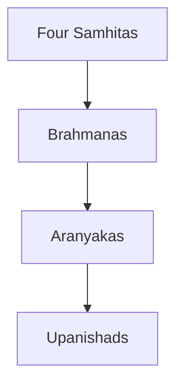

# Gold Standard — Mains PYQ Subtopic File (Lean / Student-Facing)

> **Syllabus map:** `00_SYLLABUS.md`  
> **AI rules:** `prompt.md` (full verification — not shown in student files)

---

## Two layers

| Layer | Who sees it | Purpose |
|-------|-------------|---------|
| **Student file** | You — daily reading | PYQs + Content + Answers + Traps only |
| **AI verification** | Cursor when building | Coverage, solvability, diagram audit — Delivery Report only |

**Do not put checklists, keyword maps, "how to use", cross-links, or meta tables in student files.**

---

## Student file structure (exact order — nothing else)

```markdown
# [Subtopic Name]

> GS-_ · Topic NN · [keyword]

---

## PYQs

| Year | M | Words | Question | HI | ID |
|------|---|-------|----------|-----|-----|

---

## Quick Revision

[code block — raata only; ASCII arrows OK here]

---

## Content

[All facts — bullets + tables]
[Optional: 0–2 mermaid blocks INSIDE Content, after relevant subsection]
[Must contain everything needed to write every PYQ below]

---

## Answers

[See Answer writing rule in prompt.md — topper format mandatory]

---

## Traps

| Wrong | Correct |
|-------|---------|

---

*Complete.*
```

**Maximum sections:** Title → PYQs → Quick Revision → Content → Answers → Traps. **Six blocks total.**  
Diagrams live **inside Content** — never a separate section.

---

## Section rules

### Header (3 lines max)
```markdown
# Mauryan Art & Architecture
> GS-1 · Topic 01 · Mauryan art, architecture, technology
```
No status, solvability, priority, source lists.

### PYQs
- Full question text EN + HI, marks, words, ID
- Source of truth for what file must answer

### Quick Revision
- One code block — definitions, features, examples, traps in shorthand
- Simple ASCII flows OK (`A → B → C`)
- Daily read target: **5–8 min**
- Do **not** put mermaid here — keep plain text for mobile/offline reading

### Content
- **Single section** — merge Background, Definitions, Features, Examples, Significance, Comparisons, Criticism, Method
- Point-wise bullets + tables as needed; no "§360°", no "Layer 3"
- **Depth targets:** simple ≥900 words · medium ≥1200 · rich ≥1500 (see `prompt.md` enrichment rule)
- **Mandatory subsections inside Content:** Context → Core → Tables → Significance → **`### Contemporary relevance`** → Limits
- **Contemporary relevance:** UNESCO/ASI, Art 49 & 51A(f), NEP 2020 IKS, tourism schemes (PRASAD, Swadesh Darshan), living heritage — only **verified stable** facts; no invented news
- **Named density:** ≥15 named entities (sites, rulers, texts, artists) for medium/rich files
- **Book-free rule:** Cover the **full keyword** — not only current PYQs. Include significance, limits, comparisons, named examples, dates, sites so student never needs NCERT/RS Sharma for this subtopic
- Answers must **not introduce facts absent from Content** — every answer point must exist in Content or Quick Revision

### Diagrams (optional — inside Content only)

**When to add (0–2 per file):**

| Use mermaid | Skip |
|-------------|------|
| Layered corpus (Vedic Shruti stack) | Traps, Answers, PYQ table |
| Eastward expansion / process flow | Anything a table already covers |
| Temple/stupa **elevation compare** (Nagara vs Dravida) | Decorative or duplicate ASCII |
| Gurukula / policy / reform **sequence** | Data charts — use table |

**Rules:**
- Place mermaid **immediately after** the subsection it illustrates
- Labels must match text bullets — diagram = memory aid, not extra facts
- Prefer `flowchart TD/LR` or `timeline` — keep ≤15 nodes
- PNG image when **side-by-side elevation** helps (Nagara vs Dravida); save to `assets/` subfolder; link as `` in Content

**Example (inside Content):**
````markdown
### Structure of the Vedic corpus

| Layer | Text type | ...
|-------|-----------|...


````

### Answers (UPPCS topper format — mandatory)
- One block per PYQ from PYQ table + future variants
- **Introduction** (1–2 lines) → **Main Characteristics/Points/Advantages** (labelled bullets) → **Keywords (underline in exam)** → **Exam diagram (30 sec)** ASCII code block → **Conclusion** (1 line)
- **Label rule:** each bullet = **Exam Keyword Label** — one crisp line with proof/example (not narrative sub-topic headers)
- **125W / 8M** → **6–8** labelled points · **200W / 12M** → **7–9** points
- **Keywords line:** 4–7 underline targets (Unity in Diversity, Composite Culture, Art 51A, etc.)
- **Exam diagram:** hand-drawable ASCII tree/flow in code block — NOT mermaid (mermaid = Content only)
- Match heading to directive: Describe → Main Characteristics · Discuss → Main Points · Analyse → Logical Analysis + Illustrations
- No "Opening", "Write these points", "Directive", "Content refs", "Ammunition A1"

### Traps
- **8–14 rows** — wrong statement → correction (more for rich/compare topics)
- No diagrams in Traps

---

## Removed from student files (AI keeps internally)

Do **not** include:

- Syllabus Keyword Map · How to Use · PYQ Coverage Map · Ammunition Bank
- Value-Add · Cross-Links · Exam Intelligence · Prelims Overlap
- Solvability Checklist · Completion Checklist · verbose metadata
- Standalone "Diagrams" or "Visual Aids" section

---

## AI verifies (Delivery Report only)

1. Every PYQ has Answer block
2. Content covers PYQs **and likely future variants** without external book
3. Every fact in Answers appears in Content or Quick Revision
4. Traps ≥ 8 (≥12 for rich topics)
5. Content meets word-count target; **Contemporary relevance** subsection present
6. Diagram count 0–2; if present, labels match Content text
7. Still exactly **6 student sections**

---

## Reference files (lean format)

- `GS-1/01_Art_Culture/01_Mauryan_Art_Architecture.md` — stupa/pillar diagram candidate
- `GS-1/01_Art_Culture/04_Vedic_Literature.md` — corpus + geography diagram candidate
- `GS-1/01_Art_Culture/05_Vedic_Education_System.md` — gurukula flow candidate

---

*End of _GOLD_STANDARD.md*
