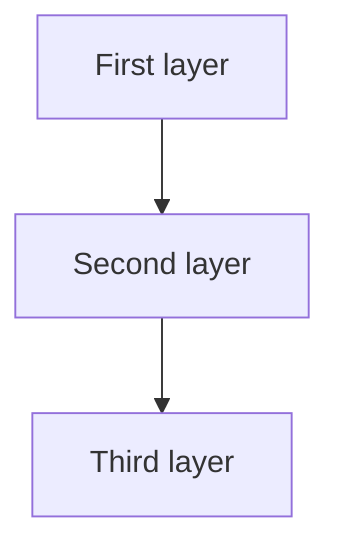

# [Subtopic Name]

> GS-_ · Topic NN · [keyword]

---

## PYQs

| Year | M | Words | Question (EN) | प्रश्न (HI) | ID |
|------|---|-------|---------------|-------------|-----|

---

## Quick Revision

```
[ASCII shorthand — A → B → C chains OK here]
```

---

## Content

[Point-wise facts + tables]

<!-- Optional: 0–2 mermaid blocks below relevant subsection — NOT a separate section -->

<!--

-->

---

## Answers

### Q1: [Exact PYQ] (Year, _M, _W)

**Opening:**
> 

**Write these points:**
- 

**Conclusion:**
> 

---

## Traps

| Wrong | Correct |
|-------|---------|

---

*Complete.*
