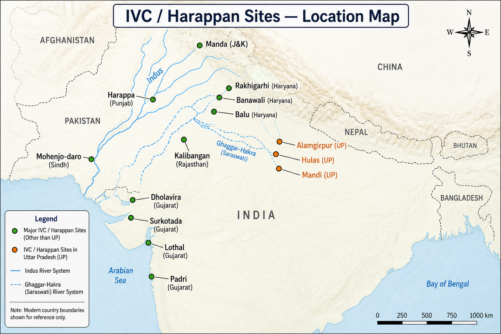

# Topic 2 — Indus Valley Civilization (Harappan Civilization)
### ★ Complete Source of Truth — No other book/notes needed for this topic

> **Covers syllabus:** Indus Valley Civilization | Features of Harappan Civilization | Major Harappan Sites | Archaeological Sites and Excavations | Archaeological Sites of Uttar Pradesh | Major Ports of Ancient India | Harappan Economy | Harappan Trade | Town Planning | Drainage System | Agriculture | Craft Industries | Religion | Script | Seals | Weights and Measures | Dholavira | Rakhigarhi | Lothal Dockyard | Kalibangan | Banawali | Surkotada | Daimabad | Copper Hoard Culture | Ochre Coloured Pottery (OCP)  
> **Sources baked in:** NCERT *Themes in Indian History* I (Ch 1–2), *An Introduction to Indian Art* (Ch 2), RS Sharma, ASI excavation reports, UPPCS/UPSC PYQs  
> **Exam weight:** ★★★ High — site ↔ state, UP sites, dockyard, script/seals, town planning  
> **Last verified:** July 2026

---

## Quick Revision Box — Raata This First

```
IVC CHRONOLOGY:
  Early Harappan ~3300–2600 BCE | Mature Harappan ~2600–1900 BCE | Late Harappan ~1900–1300 BCE
  Discovery: Harappa 1921 (Daya Ram Sahni) | Mohenjo-daro 1922 (R.D. Banerjee) | Sir John Marshall = Director-General ASI

EXTENT (Mature Phase):
  West: Sutkagen-dor (Baluchistan) | East: Alamgirpur (UP) ← eastern boundary ← UPPCS 2023 Q28
  North: Manda (J&K) | South: Daimabad (Maharashtra) | Area ~13 lakh sq km

UP HARAPPAN SITES (★★★):
  Alamgirpur (Meerut) = easternmost | Hulas (Baghpat) | Mandi (Bijnor) ← UPPCS 2018 Q88, 2025 Q87
  TRAP: Rakhigarhi = HARYANA (NOT UP) | Kalibangan/Lothal = NOT UP

PHASES & FEATURES:
  Urban, grid town planning | Burnt bricks (ratio 1:2:4) | Covered drains under every house
  Citadel + Lower Town | Great Bath (Mohenjo-daro) | Granaries | No temples/palaces found
  Script = undeciphered | ~400 signs | Boustrophedon (right-to-left alternating)

SEALS & CRAFTS:
  Steatite seals | Unicorn most common motif | Pashupati (proto-Shiva) seal
  Bead-making (Chanhudaro) | Cotton cultivation (first in world) | Bronze (lost-wax) | Pottery wheel

KEY SITES:
  Dholavira (Gujarat) = water mgmt, signboard, 3 parts, NO standard grid drains
  Lothal (Gujarat) = dockyard + boat models ← UPPCS 2022 Q68 (with Mohenjo-daro)
  Rakhigarhi (Haryana) = largest IVC site in India | Kalibangan (Rajasthan) = ploughed field, fire altars
  Banawali (Haryana) | Surkotada (Gujarat) = horse bones (disputed) | Daimabad (Maharashtra) = bronze chariot

ECONOMY & TRADE:
  Agriculture: wheat, barley, rice, cotton, dates | Double cropping at Kalibangan
  Trade: Mesopotamia (Dilmun/Bahrain), Afghanistan, Rajasthan | Lothal = port
  Weights: binary system (16:1 ratio) | Cubical stone weights

POST-HARAPPAN (syllabus):
  OCP = Ochre Coloured Pottery (Ganga-Yamuna doab, western UP)
  Copper Hoard Culture = anthropomorphs, harpoons, celts (Gangetic plain)
```

### Must-Know Term Comparisons (very frequently asked)

| Term | One-line difference | Hindi |
|------|---------------------|-------|
| **Harappan vs Indus Valley** | Same civilization — named after Harappa (first discovered site) | सिंधु घाटी / हड़प्पा सभ्यता |
| **Early vs Mature Harappan** | Early = pre-urban; Mature = full urban phase with planned cities | प्रारंभिक / परिपक्व हड़प्पा |
| **Citadel vs Lower Town** | Citadel = raised western fortified area; Lower Town = larger eastern residential zone | नगर-दुर्ग / निम्न नगर |
| **Alamgirpur vs Rakhigarhi** | Alamgirpur = easternmost (UP); Rakhigarhi = largest site (Haryana, NOT UP) | आलमगीरपुर / राखीगढ़ी |
| **Lothal vs Dholavira** | Lothal = dockyard/port; Dholavira = water reservoirs, signboard | लोथल / धोलावीरा |
| **Kalibangan vs Mohenjo-daro** | Kalibangan = ploughed field, fire altars, NO drains; Mohenjo-daro = Great Bath, drains | कालीबंगा / मोहनजोदड़ो |
| **Seal vs Script** | Seal = carved steatite artefact; Script = undeciphered writing on seals and pottery | मुद्रा / लिपि |
| **OCP vs Mature Harappan** | OCP = post-decline doab culture; Mature Harappan = urban IVC peak | ओसर रंग की मिट्टी के बर्तन / हड़प्पा |
| **Copper Hoard vs Harappan bronze** | Copper Hoard = isolated copper artefacts in Gangetic plain; Harappan = alloy bronze craft | ताम्र भंडार / कांस्य |
| **Sreni vs Harappan trade** | Sreni = later guild (post-Harappan); Harappan trade = no confirmed guild system | श्रेणी / हड़प्पा व्यापार |

### Memory Tricks

| Trick | Remembers |
|-------|-----------|
| **Sahni 21, Banerjee 22** | Harappa 1921, Mohenjo-daro 1922 |
| **A-H-M = UP trio** | Alamgirpur, Hulas, Mandi = Uttar Pradesh |
| **Rakhigarhi = Haryana NOT UP** | 2025 UPPCS trap — Rakhigarhi is Hisar, Haryana |
| **Lothal = Logistics (port)** | Dockyard Gujarat |
| **Dholavira = Dams** | Water management Kutch |
| **16:1 weights** | Binary Harappan weight system |
| **Unicorn seal** | Most common Harappan seal motif |
| **Great Bath = Mohenjo-daro** | Not Harappa, not Dholavira |
| **Alamgirpur = East end** | Eastern boundary marker |
| **4-3-1-2 (2020 Q12)** | Balu-Haryana, Manda-J&K, Padri-Gujarat, Hulas-UP |

---

## Exam Visuals — High-ROI Images

> **Type priority:** location map → conceptual diagram. Images stored locally (`images/`) so they open offline.

### 1. IVC / Harappan Sites — Location Map



*Raata **site ↔ feature ↔ state**. **Great Bath = Mohenjo-daro** (not Harappa). **UP sites**: Alamgirpur (eastern boundary), Hulas, Mandi. **Rakhigarhi = Haryana** (2025 trap — not UP). **Lothal = Gujarat port**; **Dholavira = Kutch dams**.*
*Source: Study map — generated for UPPCS site-matching*

---

## 2.1 Indus Valley Civilization

### Definitions (learn all — exams pick different ones)

| Source | Definition |
|--------|------------|
| **General** | Bronze Age urban civilization of the Indian subcontinent, flourishing c. 2600–1900 BCE along the Indus and Ghaggar-Hakra river systems |
| **NCERT** | A bronze-age civilisation characterised by urbanism, planned cities, standardized bricks, seals, and undeciphered script — also called Harappan Civilization |
| **Archaeological** | Named after Harappa (first excavated 1921); geographically wider than the Indus valley alone — extends to Gujarat, Haryana, UP, Afghanistan |

### Indus Valley Civilization — How It Works

- The **Indus Valley Civilization (IVC)** is one of three **Bronze Age** urban civilizations globally (with Mesopotamia and Egypt) — Indian subcontinent's first urban culture.
- Also called **Harappan Civilization** after **Harappa** — first site discovered (1921), though Mohenjo-daro is larger.
- **Three phases**: Early Harappan (~3300–2600 BCE) → **Mature Harappan** (~2600–1900 BCE) → Late Harappan (~1900–1300 BCE).
- **Mature phase** = peak urbanism — planned cities, standardized weights, seals, long-distance trade.
- **Geographic spread** ~13 lakh sq km — Pakistan, western India, parts of Afghanistan; **not** confined to modern Indus river alone.
- **Ghaggar-Hakra** (identified with Vedic Saraswati) system hosted many sites — Haryana, Rajasthan belt.
- **Decline** ~1900 BCE — causes debated: climate change, river drying, floods, overexploitation; **no single agreed theory**.
- **No deciphered script** — limits knowledge of political structure, religion, and exact chronology from texts.
- **Contemporary** with Mesopotamian Sumer (~2600 BCE) — trade links evidenced by Harappan seals in Gulf and Mesopotamia.
- **Post-Harappan** cultures (OCP, Painted Grey Ware) emerge in same regions — cultural continuity and change.

> **Exam note:** IVC = **Urban** economy (UPPCS 2020 Q21). Trap: "IVC was pastoral" — that's Rigvedic society in same match-list question.

### Exam Facts (raata)

- Flourished c. **2600–1900 BCE** (Mature phase)
- Named after **Harappa** (Punjab, Pakistan)
- Three phases: Early | Mature | Late Harappan
- Area ~13 lakh sq km
- Contemporary with Mesopotamia
- Decline ~1900 BCE — multi-causal debate
- Also called Harappan Civilization
- Bronze Age — copper + tin alloy technology

### PYQs — Indus Valley Civilization

1. **(UPPCS Prelims 2020, Q21)** Match List-I with List-II: A. Indus Valley Civilization — ?  
   → **4. Urban** (Option D: 4-3-1-2). IVC = urban planned cities.

2. **(UPSC Prelims 2019 — pattern)** The Indus Valley Civilization is primarily associated with which age?  
   → **Bronze Age** — urban, bronze tools, pre-Iron Age.

### Examples (2.1)

| Example | Detail |
|---------|--------|
| **Harappa + Mohenjo-daro** | Two largest early excavated cities |
| **Mesopotamian trade** | Harappan carnelian beads found in Ur |
| **Late Harappan** | Daimabad bronze chariot — terminal phase |

---

## 2.2 Features of Harappan Civilization

### Definitions

| Feature category | Harappan hallmark |
|------------------|-------------------|
| **Urbanism** | Planned cities with citadel, lower town, streets, drains |
| **Standardization** | Uniform brick ratio, weights, seals across 1000+ km |
| **Technology** | Bronze metallurgy, kiln-fired bricks, wheeled pottery |

### Features of Harappan Civilization — How It Works

- **Urban planning** — grid-pattern streets cutting at right angles; world's earliest planned cities.
- **Burnt bricks** — standardized ratio **1:2:4** (thickness:width:length); sun-dried bricks also used in some structures.
- **Citadel** — raised platform on west side (at most sites); possibly administrative/ritual centre.
- **Lower Town** — larger residential area east of citadel; workers' quarters, craft areas.
- **Drainage** — covered brick drains along every street; houses had bathrooms draining into street mains.
- **Great Bath** — large watertight pool at Mohenjo-daro; ritual bathing suspected.
- **Granaries** — brick structures for grain storage (Harappa, Mohenjo-daro).
- **Seals** — steatite seals with animal motifs and script; used for trade/identity marking.
- **Script** — **undeciphered**; ~400 signs; appears on seals, copper tools, pottery.
- **No monumental temples or palaces** found — political/religious organisation still debated (priest-king? merchants?).
- **Egalitarian appearance** — similar house sizes at many sites; no obvious royal tombs (unlike Egypt/Mesopotamia).
- **Peaceful image** — few weapons; but fortifications exist at some sites (Dholavira, Surkotada).

> **Exam note:** Standardization across vast area = hallmark. Trap: "Harappans used iron tools" — Iron Age came later; Harappan = Bronze Age.

### Exam Facts (raata)

- Grid town planning | Burnt bricks 1:2:4
- Citadel + Lower Town layout
- Covered drainage system
- Great Bath — Mohenjo-daro
- Steatite seals with script
- Script undeciphered (~400 signs)
- No temples/palaces identified
- Bronze technology (lost-wax casting)
- Cotton cultivation — earliest evidence in world
- Fortifications at some sites only

### PYQs — Features

1. **(UPSC Prelims 2020 — pattern)** Which is NOT a feature of Harappan civilization?  
   A. Urban planning  B. Iron ploughshare  C. Drainage system  D. Seals  
   → **B — Iron** came later.

2. **(UPSC Prelims 2017 — pattern)** The Great Bath is found at:  
   → **Mohenjo-daro.**

### Examples (2.2)

| Example | Detail |
|---------|--------|
| **Mohenjo-daro** | Great Bath + granary + planned streets |
| **Harappa** | Granary + worker platforms |
| **Standardized weights** | Same ratio found from Afghanistan to Gujarat |

---

## 2.3 Major Harappan Sites

### Major Harappan Sites — How It Works

- **1000+ Harappan sites** identified; ~100 excavated — clustered along rivers (Indus, Ravi, Sutlej, Ghaggar-Hakra, Narmada coast).
- **Pakistan sites**: Harappa (Ravi), Mohenjo-daro (Indus), Chanhudaro (Indus), Sutkagen-dor (Makran coast).
- **India — Gujarat**: Dholavira, Lothal, Surkotada, Rangpur, Rojdi, Padri, Kuntasi.
- **India — Rajasthan**: Kalibangan (Ghaggar), Bagor (overlap Mesolithic), Gilund.
- **India — Haryana**: Rakhigarhi (largest in India), Banawali, Bhirrana, Mitathal.
- **India — Punjab**: Ropar (Sutlej).
- **India — J&K**: Manda (Chenab) — northernmost.
- **India — UP**: Alamgirpur, Hulas, Mandi — eastern extension.
- **India — Maharashtra**: Daimabad — southernmost Mature/Late Harappan.
- **Afghanistan**: Shortughai — lapis lazuli trade link.
- Sites classified: **Regional centres**, **coastal ports**, **outpost stations**, **agricultural villages**.

> **Exam note:** Site ↔ state matching is the **#1 UPPCS question type**. Memorize UP trio (Alamgirpur, Hulas, Mandi) and trap sites (Rakhigarhi = Haryana).

### Major Sites — Complete Table

| # | Site | State/Country | River/Region | Speciality |
|---|------|---------------|--------------|------------|
| 1 | Harappa | Pakistan (Punjab) | Ravi | First discovered 1921; granaries |
| 2 | Mohenjo-daro | Pakistan (Sindh) | Indus | Great Bath; largest excavated |
| 3 | Chanhudaro | Pakistan (Sindh) | Indus | Bead-making factory |
| 4 | Dholavira | Gujarat | Khadir island, Rann | Water management; signboard |
| 5 | Lothal | Gujarat | Bhogavo | Dockyard; bead factory |
| 6 | Surkotada | Gujarat | — | Fortified; horse bones (disputed) |
| 7 | Kalibangan | Rajasthan | Ghaggar | Ploughed field; fire altars |
| 8 | Banawali | Haryana | Ghaggar-Hakra | Pre-Harappan + Harappan |
| 9 | Rakhigarhi | Haryana | Ghaggar-Hakra | Largest IVC site in India |
| 10 | Ropar | Punjab (India) | Sutlej | Northern Indian site |
| 11 | Manda | Jammu & Kashmir | Chenab | Northernmost |
| 12 | Alamgirpur | Uttar Pradesh | Hindon | Easternmost (India) |
| 13 | Hulas | Uttar Pradesh | — | Eastern Harappan |
| 14 | Mandi | Uttar Pradesh | Ramganga | UP Harappan site |
| 15 | Daimabad | Maharashtra | — | Southernmost; bronze chariot |
| 16 | Sutkagen-dor | Pakistan (Baluchistan) | Makran | Westernmost coastal |
| 17 | Shortughai | Afghanistan | Amu Darya basin | Lapis lazuli trade |
| 18 | Lothal | Gujarat | — | Port/dockyard |

### Exam Facts (raata)

- 1000+ sites total; ~100 excavated
- Rakhigarhi = largest in India (Haryana)
- Alamgirpur = easternmost in India (UP)
- Daimabad = southernmost (Maharashtra)
- Sutkagen-dor = westernmost
- Manda = northernmost (J&K)
- Shortughai = Afghanistan trade outpost

### PYQs — Major Harappan Sites

1. **(UPPCS Prelims 2021, Q100)** In which State of India is the Harappan Civilization site Mandi situated?  
   A. Gujarat  B. Haryana  C. Rajasthan  D. Uttar Pradesh  
   → **D — Uttar Pradesh** (Bijnor district).

2. **(UPPCS Prelims 2023, Q28)** The eastern boundary of the Harappan culture is indicated by which of the following?  
   A. Harappa  B. Alamgirpur  C. Rakhigarhi  D. Manda  
   → **B — Alamgirpur** (UP).

### Examples (2.3)

| Example | Detail |
|---------|--------|
| **Rakhigarhi, Haryana** | Largest site — DNA studies ongoing |
| **Alamgirpur, UP** | Eastern boundary marker |
| **Shortughai, Afghanistan** | Lapis trade with IVC |

---

## 2.4 Archaeological Sites and Excavations

### Definitions

| Term | Meaning |
|------|---------|
| **Excavation** | Systematic digging in archaeological layers (strata) to recover material culture |
| **Stratigraphy** | Study of soil layers — deeper = older (law of superposition) |
| **ASI** | Archaeological Survey of India — conducts and regulates excavations |

### Archaeological Sites and Excavations — How It Works

- **Harappa** first excavated **1921** by **Rai Bahadur Daya Ram Sahni** — marked official discovery of IVC.
- **Mohenjo-daro** excavated **1922** by **R.D. Banerjee** (Rakhal Das Banerji) — revealed full urban character.
- **Sir John Marshall** — ASI Director-General; announced IVC as civilization (1924); excavated at Mohenjo-daro.
- **Sir Mortimer Wheeler** — post-Partition excavations at Harappa (1946); introduced stratigraphic methods; dated IVC.
- **N.G. Majumdar** — discovered Chanhudaro (1931); Sindh sites.
- **M.S. Vats** — Harappa excavations 1920s–30s; granary identification.
- **Y.D. Sharma** — Ropar excavations; post-Partition Indian archaeology.
- **R.S. Bisht** — Dholavira excavations (1990s) — water management, signboard.
- **S.R. Rao** — Lothal excavations (1955–62) — dockyard identification.
- **B.B. Lal** — Kalibangan excavations; Mahabharata archaeology; Rakhigarhi re-excavation support.
- **Amalananda Ghosh** — surveyed Gujarat Harappan sites.
- **Carbon-14 dating** revolutionized IVC chronology — pushed dates to 2600 BCE mature phase.
- **Post-2000**: Rakhigarhi DNA studies; Sanauli (UP) Chalcolithic/late Harappan chariot burials (2018).

> **Exam note:** Sahni = Harappa 1921; Banerjee = Mohenjo-daro 1922. Trap: Wheeler discovered IVC — false, he came later (1946 Harappa).

### Exam Facts (raata)

- Daya Ram Sahni — Harappa 1921
- R.D. Banerjee — Mohenjo-daro 1922
- John Marshall — announced IVC 1924
- Mortimer Wheeler — Harappa 1946; stratigraphy
- S.R. Rao — Lothal dockyard excavation
- R.S. Bisht — Dholavira
- B.B. Lal — Kalibangan
- ASI = nodal excavation body
- Stratigraphy = layer dating method

### PYQs — Archaeological Sites and Excavations

1. **(UPSC Prelims 2018 — pattern)** Harappa was discovered in 1921 by:  
   → **Daya Ram Sahni.**

2. **(UPSC Prelims 2016 — pattern)** Mohenjo-daro was excavated by:  
   A. Marshall  B. Wheeler  C. R.D. Banerjee  D. Sahni  
   → **C — R.D. Banerjee (1922).**

### Examples (2.4)

| Example | Detail |
|---------|--------|
| **Marshall's announcement 1924** | IVC recognized as civilization |
| **Wheeler's Harappa 1946** | Post-Partition Indian excavation |
| **Sanauli 2018** | UP — chariot burials (late Harappan/OCP overlap) |

---

## 2.5 Archaeological Sites of Uttar Pradesh

### Archaeological Sites of Uttar Pradesh — How It Works

- **Uttar Pradesh** marks the **eastern extension** of Harappan culture — not the core region but critical for boundary questions.
- **Alamgirpur** (Meerut district, on Hindon river) — **easternmost** Harappan site in India ← **UPPCS 2023 Q28**.
- **Hulas** (Baghpat district) — eastern Harappan settlement; pottery and structures found.
- **Mandi** (Bijnor district, Ramganga) — Harappan site; UPPCS 2021 Q100 confirms **Uttar Pradesh**.
- **Sanauli** (Baghpat) — **Chalcolithic/OCP/Late Harappan** chariot burials (2018); NOT mature Harappan urban but exam-relevant UP site.
- **Kalibangan and Lothal are NOT in UP** — trap in UPPCS 2018 Q88 (only Alamgirpur + Hulas correct).
- **Rakhigarhi is NOT in UP** — it is in **Hisar, Haryana** ← **UPPCS 2025 Q87 trap**.
- UP sites show **Late/eastern Harappan** characteristics — smaller, pottery-dominated, not large urban centres.
- **OCP** (Ochre Coloured Pottery) culture overlaps western UP doab — post-Harappan phase.
- UPPCS disproportionately tests **which sites are/aren't in UP** — negative elimination strategy essential.

> **Exam note:** UPPCS 2025 Q87 — Mandi + Hulas = UP; Rakhigarhi = **NOT UP** (Haryana). Answer **C (1 and 3)**.

### UP Harappan Sites — Complete Table

| # | Site | District (UP) | Feature | Exam tag |
|---|------|---------------|---------|----------|
| 1 | Alamgirpur | Meerut | Easternmost IVC boundary | 2023 Q28 |
| 2 | Hulas | Baghpat | Eastern Harappan habitation | 2018 Q88, 2025 Q87 |
| 3 | Mandi | Bijnor | Ramganga basin site | 2021 Q100, 2025 Q87 |
| 4 | Sanauli | Baghpat | Chariot burials 2018; Late Harappan/OCP | High-yield CA |

### Sites NOT in UP (Trap List)

| Site | Actual location |
|------|-----------------|
| Rakhigarhi | Haryana (Hisar) |
| Kalibangan | Rajasthan |
| Lothal | Gujarat |
| Dholavira | Gujarat |
| Banawali | Haryana |
| Surkotada | Gujarat |

### Exam Facts (raata)

- Alamgirpur = easternmost (Meerut)
- Hulas + Mandi = UP (Baghpat, Bijnor)
- Rakhigarhi = Haryana trap
- 2018 Q88 answer: only Alamgirpur + Hulas (III, IV)
- 2025 Q87 answer: Mandi + Hulas (1 and 3)
- Sanauli = Late Harappan chariots (Baghpat)

### PYQs — Archaeological Sites of Uttar Pradesh

1. **(UPPCS Prelims 2018, Q88)** Which of the following centres related to Indus Valley are situated in Uttar Pradesh? I. Kalibangan II. Lothal III. Alamgirpur IV. Hulas  
   → **D — III and IV only** (Alamgirpur + Hulas). Kalibangan = Rajasthan; Lothal = Gujarat.

2. **(UPPCS Prelims 2025, Q87)** Which IVC sites are in present-day Uttar Pradesh? 1. Mandi 2. Rakhigarhi 3. Hulas  
   → **C — 1 and 3 only.** Rakhigarhi = Haryana.

### Examples (2.5)

| Example | Detail |
|---------|--------|
| **Alamgirpur** | Eastern boundary — UPPCS 2023 |
| **Mandi, Bijnor** | UPPCS 2021 state question |
| **Sanauli chariots** | 2018 discovery, Baghpat UP |

---

## 2.6 Major Ports of Ancient India

### Definitions

| Port type | Meaning |
|-----------|---------|
| **Harappan port** | Coastal/trade settlement with dockyard or anchorage — Lothal, Sutkagen-dor |
| **Entrepot** | Trade transit hub — goods stored and re-exported |

### Major Ports of Ancient India — How It Works

- **Lothal** (Gujarat) — most famous **Harappan dockyard**; artificial basin connected to Sabarmati/Bhogavo river system.
- **Sutkagen-dor** (Makran coast, Baluchistan) — western coastal Harappan port; Arabian Sea trade.
- **Balakot** (Pakistan coast) — Harappan coastal site; shell bangles, fish remains.
- **Allahdino** (near Karachi) — coastal Harappan settlement.
- **Kuntasi** (Gujarat) — coastal manufacturing/trade post.
- **Dholavira** — not a sea port but **inland trade** hub via Rann of Kutch routes.
- **Trade destinations**: **Dilmun** (Bahrain), **Mesopotamia** (Sumer), **Oman**, **Afghanistan** (lapis lazuli).
- **Boat models** found at **Mohenjo-daro and Lothal** ← **UPPCS 2022 Q68**.
- **Later ancient ports** (outside mature Harappan but syllabus "Major Ports of Ancient India"): **Broach/Bharuch** (Gujarat), **Tamralipti** (Bengal), **Kaveripattinam** (Tamil Nadu), **Muziris** (Kerala — Roman trade).
- **2024 UPPCS Q2** (Ancient Economy — Trade): references to **river-ports and entrepots** in early India — applies to Harappan river-craft trade too.
- Harappan port trade goods: carnelian beads, cotton, timber, ivory, copper.

> **Exam note:** Boat models = **Mohenjo-daro + Lothal** (2022 UPPCS). Trap: Dholavira = water management, not dockyard.

### Harappan Ports — Complete Table

| # | Port/Site | Location | Feature |
|---|-----------|----------|---------|
| 1 | Lothal | Gujarat | Artificial dockyard; main port |
| 2 | Sutkagen-dor | Baluchistan (Pakistan) | Western coastal port |
| 3 | Balakot | Pakistan coast | Coastal Harappan |
| 4 | Allahdino | Near Karachi | Coastal settlement |
| 5 | Kuntasi | Gujarat | Coastal trade/manufacturing |
| 6 | Dholavira | Gujarat (Kutch) | Inland trade via Rann routes |

### Exam Facts (raata)

- Lothal = primary Harappan dockyard
- Boat models at Mohenjo-daro + Lothal (2022 Q68)
- Sutkagen-dor = western coastal port
- Trade with Dilmun (Bahrain) and Mesopotamia
- Carnelian beads exported
- Later ports: Bharuch, Tamralipti, Muziris (post-Harappan)

### PYQs — Major Ports

1. **(UPPCS Prelims 2022, Q68)** From which archaeological site of the Indus Valley Civilization are figures or models of boats found?  
   A. Dholavira and Bhagatrav  B. Harappa and Kot Diji  C. Mohenjo-daro and Lothal  D. Kalibangan and Ropar  
   → **C — Mohenjo-daro and Lothal.**

2. **(UPPCS Prelims 2024, Q2)** Consider: 1. References of numerous river-ports in ancient India. 2. Large entrepots of goods and traffic.  
   → **A — Both correct** (Ancient Indian Economy — Trade; applies to Harappan maritime/river trade context).

### Examples (2.6)

| Example | Detail |
|---------|--------|
| **Lothal dockyard** | 218 m × 37 m basin |
| **Sutkagen-dor** | Makran coast trade |
| **Mesopotamian texts** | Reference to Meluhha (likely Harappan region) |

---

## 2.7 Harappan Economy

### Definitions

| Term | Meaning |
|------|---------|
| **Urban economy** | Production, trade, and administration centred in planned cities — IVC hallmark |
| **Mixed economy** | Agriculture + pastoralism + craft production + long-distance trade |
| **Surplus** | Agricultural/grain surplus enabling non-food-producing specialists (craftsmen, traders) |

### Harappan Economy — How It Works

- Harappan economy was **primarily urban** — UPPCS 2020 Q21 maps IVC to "Urban" in match-list.
- **Agriculture** formed the base — wheat, barley, rice, dates, cotton, millets; double cropping at some sites.
- **Pastoralism** — cattle, buffalo, sheep, goat, pig; bullock bones common; no horse consensus (except disputed Surkotada).
- **Craft specialization** — bead-makers (Chanhudaro), potters, bronze-smiths, seal-carvers, brick-makers.
- **Granaries** at Harappa and Mohenjo-daro stored **agricultural surplus** — state/community control suspected.
- **Standardized weights** enabled **trade accounting** — binary 16:1 system across regions.
- **Long-distance trade** — carnelian, lapis lazuli, copper, gold, shell, timber exchanged with Mesopotamia, Afghanistan, Deccan.
- **No coins** — barter and weight-based exchange; seals may have marked goods/ownership.
- **Internal trade** — between Harappan regions via river routes (Indus, Ghaggar-Hakra, Narmada).
- **Decline phase** — de-urbanization; shift to smaller settlements and pastoral economies (Late Harappan).

> **Exam note:** IVC = Urban (2020 Q21). Trap: "Harappans used money economy with coins" — no Harappan coins found.

### Exam Facts (raata)

- Urban planned economy
- Agriculture + crafts + trade combined
- Granaries for surplus storage
- No coins — barter/weight system
- Craft specialization by site (Chanhudaro = beads)
- Cotton production — earliest in world
- Trade with Mesopotamia (Meluhha)
- Bronze (not iron) tools

### PYQs — Harappan Economy

1. **(UPPCS Prelims 2020, Q21)** A. Indus Valley Civilization — 4. Urban  
   → **IVC = Urban** (Option D: 4-3-1-2).

2. **(UPSC Prelims 2018 — pattern)** The economy of the Indus Valley Civilization was:  
   → **Urban and based on agriculture, crafts, and trade.**

### Examples (2.7)

| Example | Detail |
|---------|--------|
| **Harappa granary** | Community grain storage |
| **Chanhudaro** | Specialized bead factory town |
| **Standardized weights** | Trade facilitation across regions |

---

## 2.8 Harappan Trade

### Harappan Trade — How It Works

- Harappan trade was **both internal** (between IVC sites) and **external** (Mesopotamia, Gulf, Afghanistan).
- **Mesopotamian texts** refer to **Meluhha** — widely identified with Harappan region; imports carnelian, ivory, peacocks.
- **Dilmun** (Bahrain) served as **intermediate entrepot** between Meluhha and Sumer.
- **Lothal** and **Sutkagen-dor** functioned as **maritime trade ports** — dockyard and coastal anchorage.
- **Export goods**: carnelian beads, cotton cloth, timber, ivory combs, shell bangles, peacock feathers.
- **Import goods**: lapis lazuli (Afghanistan/Shortughai), copper (Rajasthan/Baluchistan), gold, silver.
- **River routes** — Indus, Ravi, Sutlej, Ghaggar-Hakra used for bulk movement of goods.
- **Seals** likely marked **packages/ownership** in trade — standard motifs aided identification.
- **No Harappan guild (sreni) evidence** — guilds are later (Mauryan/post-Harappan); UPPCS 2018 Q89 tests sreni as foreign trade institution (later period).
- **2024 UPPCS Q2** confirms early India had **river-ports and entrepots** — conceptually fits Harappan trade infrastructure.

> **Exam note:** Meluhha = Harappan region in Mesopotamian records. Trap: "Sreni was Harappan trade guild" — sreni is later institution.

### Exam Facts (raata)

- Meluhha = Mesopotamian name for Harappan region
- Dilmun (Bahrain) = trade intermediary
- Lothal = main port/dockyard
- Exports: carnelian, cotton, ivory
- Imports: lapis lazuli, copper
- Shortughai = Afghanistan trade outpost
- Seals for trade marking
- River + sea routes combined

### PYQs — Harappan Trade

1. **(UPPCS Prelims 2024, Q2)** River-ports and entrepots in early India — both statements correct.

2. **(UPSC Prelims 2017 — pattern)** In the context of Harappan trade, 'Meluhha' refers to:  
   → **The Harappan region** mentioned in Mesopotamian texts.

### Examples (2.8)

| Example | Detail |
|---------|--------|
| **Carnelian beads in Ur** | Mesopotamian import from IVC |
| **Lapis at Shortughai** | Afghan trade link |
| **Lothal dockyard** | Maritime export hub |

---

## 2.9 Town Planning

### Town Planning — How It Works

- Harappan cities follow a **grid-iron pattern** — streets run north-south and east-west, intersecting at right angles.
- **Citadel** (acropolis) — raised mud-brick platform on the **western side** at major sites; fortified with walls and towers.
- **Lower Town** — larger area east of citadel; residential and craft quarters for common people.
- **Streets** varied from **3 m to 10 m** wide; designed for carts and pedestrian traffic.
- **Houses** — mud-brick and burnt-brick; rooms around central courtyard; private wells and bathrooms.
- **Burnt brick ratio** standardized at **1:2:4** — remarkable uniformity across 1000+ km.
- **Public buildings** — Great Bath, granaries, assembly halls (Mohenjo-daro).
- **No monumental royal palace** identified — unlike Egyptian pharaohs or Mesopotamian kings.
- **Dholavira exception** — three distinct sections (citadel, middle town, lower town) without standard grid everywhere.
- **Kalibangan exception** — no sophisticated drainage; different regional planning variant.
- **Fortifications** present at Dholavira, Surkotada, Kalibangan — not all sites equally fortified.

> **Exam note:** Citadel = west; Lower Town = east. Trap: "Every Harappan site had Great Bath" — only Mohenjo-daro.

### Exam Facts (raata)

- Grid pattern streets at right angles
- Citadel (west) + Lower Town (east)
- Brick ratio 1:2:4 standardized
- Houses with courtyard, well, bathroom
- Great Bath — Mohenjo-daro only
- Granaries — Harappa, Mohenjo-daro
- Dholavira = 3-part city plan
- No royal palace found

### PYQs — Town Planning

1. **(UPSC Prelims 2019 — pattern)** Which element of Harappan town planning is found at Mohenjo-daro?  
   → **Great Bath, granary, grid streets, covered drains.**

2. **(UPSC Prelims 2016 — pattern)** The citadel in Harappan cities was usually located on the:  
   → **Western side** of the settlement.

### Examples (2.9)

| Example | Detail |
|---------|--------|
| **Mohenjo-daro** | Classic grid + Great Bath |
| **Dholavira** | Three-section unique plan |
| **Harappa** | Citadel + granary platforms |

---

## 2.10 Drainage System

### Drainage System — How It Works

- Harappan drainage is considered **more advanced than contemporary Mesopotamia and Egypt**.
- **Every house** connected to **street drains** via clay pipes from bathrooms and kitchens.
- **Covered drains** — brick-covered channels along streets; removable covers for maintenance.
- **Soak pits** — jars buried in ground to collect solid waste/sediment; periodic cleaning.
- **Drain gradient** — slopes engineered for gravity flow toward disposal points.
- **Manholes** — inspection chambers at intervals for clearing blockages.
- **Storm water** — separate channels in some areas for rainwater.
- **Mohenjo-daro and Harappa** — best-preserved drainage examples.
- **Kalibangan** — notably **lacks** elaborate drainage — regional variation trap.
- **Dholavira** — sophisticated **water management** (reservoirs) but not standard street drainage system.
- Drainage reflects **municipal-level planning** — collective civic authority existed.

> **Exam note:** Kalibangan = NO standard drainage (trap). Mohenjo-daro = best drainage example.

### Exam Facts (raata)

- Covered brick drains along all streets
- Every house had bathroom + drain connection
- Soak pits for waste sediment
- Manholes for maintenance
- More advanced than contemporary West Asia
- Kalibangan = exception (no elaborate drains)
- Clay pipes from houses to street mains
- Civic-level planning evidence

### PYQs — Drainage System

1. **(UPSC Prelims 2020 — pattern)** The drainage system of the Indus Valley Civilization was:  
   → **Advanced — covered drains, house connections, soak pits.**

2. **(UPSC Prelims 2015 — pattern)** Which Harappan site notably lacks an elaborate drainage system?  
   → **Kalibangan.**

### Examples (2.10)

| Example | Detail |
|---------|--------|
| **Mohenjo-daro** | Best-preserved drain network |
| **Kalibangan** | No standard drainage — exam trap |
| **Soak pit jars** | Sediment collection system |

---

## 2.11 Agriculture

### Agriculture — How It Works

- **Wheat and barley** — primary cereals; dominant at Harappa, Mohenjo-daro, Mehrgarh tradition.
- **Rice** — found at **Lothal** and some Harappan levels; earlier rice from Neolithic Koldihwa (UP, different context).
- **Dates, mustard, cotton** — cotton cultivation at IVC = **earliest in world**.
- **Double cropping** — evidence at **Kalibangan** (rabi + kharif); advanced agricultural calendar.
- **Ploughed field** — **Kalibangan** has preserved furrow marks (fire-altar field) — unique discovery.
- **Irrigation** — no large canals confirmed; probably **well-irrigation** and river flooding reliance.
- **Stone ploughshare** — not found; likely wooden ploughs; terracotta plough models exist.
- **Storage** — granaries for surplus; underground storage pits at farm sites.
- **Domestic animals** for agriculture — bullocks for ploughing; manure for fields.
- **Agricultural decline** linked to Late Harappan phase — possible climate/river change impact.

> **Exam note:** Ploughed field = **Kalibangan only**. Cotton = earliest evidence at IVC.

### Exam Facts (raata)

- Wheat, barley = main crops
- Cotton — earliest cultivation (world)
- Double cropping at Kalibangan
- Ploughed field furrows — Kalibangan
- Rice at Lothal (Harappan context)
- Wooden plough (terracotta models)
- Well irrigation likely
- Granaries for storage

### PYQs — Agriculture

1. **(UPSC Prelims 2018 — pattern)** Evidence of ploughed field has been found at:  
   → **Kalibangan.**

2. **(UPSC Prelims 2014 — pattern)** The Harappan people cultivated:  
   A. Wheat and barley  B. Only rice  C. Maize  D. Tobacco  
   → **A.**

### Examples (2.11)

| Example | Detail |
|---------|--------|
| **Kalibangan furrows** | Only ploughed field evidence |
| **Lothal rice** | Harappan-period rice grains |
| **Cotton threads** | Mehrgarh/IVC textile evidence |

---

## 2.12 Craft Industries

### Craft Industries — How It Works

- **Bead-making** — **Chanhudaro** specialized factory; carnelian, agate, faience beads drilled with precision.
- **Pottery** — wheel-thrown red and black pottery; plain and painted; kiln-fired.
- **Bronze casting** — **lost-wax (cire perdue)** technique; Dancing Girl bronze statuette (Mohenjo-daro).
- **Seal carving** — steatite soft stone; intaglio carving; fired for hardness.
- **Shell working** — bangles, ladles from marine shell (coastal and imported).
- **Ivory and bone** — combs, pins, inlay work.
- **Cotton textile** — spun and woven; spindle whorls common at every site.
- **Faience** — glazed paste jewellery (blue-green); artificial gem substitute.
- **Brick-making** — standardized kiln industry; civic + domestic demand.
- **Terracotta figurines** — mother goddess, toy carts, animals — craft + religious objects.

> **Exam note:** Chanhudaro = **bead factory** (not a full city). Dancing Girl = bronze lost-wax (Mohenjo-daro).

### Exam Facts (raata)

- Chanhudaro = bead-making centre
- Lost-wax bronze casting
- Dancing Girl — Mohenjo-daro bronze
- Pottery wheel — red/black ware
- Steatite seal carving
- Cotton spinning (spindle whorls)
- Shell bangles (Lothal, coastal)
- Faience jewellery production

### PYQs — Craft Industries

1. **(UPSC Prelims 2019 — pattern)** Chanhudaro is known for:  
   → **Bead-making factory/industry.**

2. **(UPSC Prelims 2017 — pattern)** The 'Dancing Girl' figurine is made of:  
   → **Bronze** (lost-wax technique), Mohenjo-daro.

### Examples (2.12)

| Example | Detail |
|---------|--------|
| **Chanhudaro** | Bead workshop debris |
| **Dancing Girl** | 10.5 cm bronze statuette |
| **Faience beads** | Blue-green glazed paste |

---

## 2.13 Religion

### Religion — How It Works

- Harappan religion is **reconstructed from material evidence** — no readable scriptures or temples.
- **Pashupati Seal** (Mohenjo-daro) — seated figure surrounded by animals; identified as **proto-Shiva/Pashupati** (lord of animals).
- **Mother Goddess** — terracotta female figurines with elaborate headdress; fertility cult suspected.
- **Tree worship** — peepal tree motifs on seals; nature reverence.
- **Phallic symbols (linga)** — stone linga-yoni pairs found; fertility symbolism.
- **Water worship** — Great Bath ritual bathing; wells as sacred (possibly).
- **Animal motifs** — unicorn, humped bull, elephant, tiger on seals; bull most sacred animal.
- **Fire altars** — **Kalibangan** has fire pits/altars (not found at all sites); Vedic fire ritual precursor debate.
- **Burial practices** — extended inhumation (north-south); grave goods (pottery, ornaments); no royal tombs.
- **No temple structures** — unlike Mesopotamian ziggurats; religion possibly household/community based.

> **Exam note:** Pashupati seal = proto-Shiva debate. Trap: "Harappan temple found at Mohenjo-daro" — no temple structures identified.

### Exam Facts (raata)

- Pashupati seal — proto-Shiva identification
- Mother Goddess terracottas
- Humped bull = sacred animal
- Unicorn = most common seal motif (mythical)
- Fire altars at Kalibangan
- Great Bath = ritual bathing?
- Extended burial with grave goods
- No temple architecture found
- Tree (peepal) and water worship evidence

### PYQs — Religion

1. **(UPSC Prelims 2018 — pattern)** The Pashupati seal from Mohenjo-daro depicts:  
   → **Seated deity surrounded by animals — proto-Shiva.**

2. **(UPSC Prelims 2016 — pattern)** Fire altars in Harappan context are found at:  
   → **Kalibangan.**

### Examples (2.13)

| Example | Detail |
|---------|--------|
| **Pashupati seal** | Yogi with animals motif |
| **Mother Goddess figurine** | Fertility worship evidence |
| **Kalibangan fire altars** | Ritual fire pits |

---

## 2.14 Script

### Script — How It Works

- Harappan script remains **undeciphered** — primary barrier to reading IVC history from their perspective.
- **~400 distinct signs** — logo-syllabic suspected (mix of word signs and syllables).
- Found on **seals, copper tablets, pottery, bangles** — short inscriptions only (5–10 signs average).
- **Boustrophedon** writing — alternates **right-to-left** and **left-to-right** on each line (like ploughing field).
- **No bilingual inscription** found (unlike Rosetta Stone for Egyptian) — decipherment stalled.
- **Longest inscription** — 26 signs on a Harappa seal; no literary texts (no Harappan Mahabharata equivalent).
- **Dravidian hypothesis** — some scholars link to proto-Dravidian language; **Sanskritic hypothesis** also debated; **no consensus**.
- **Unicode** — Harappan script added to Unicode 5.2 (2009) for scholarly encoding.
- Script appears in **Mature Harappan** phase; fewer in Late Harappan — literacy may have declined.
- Comparison: **Mesopotamian cuneiform** and **Egyptian hieroglyphs** are read; Harappan alone among major Bronze Age scripts remains unread.

> **Exam note:** Script = **undeciphered**. Trap: "Harappan script is Dravidian — proven" — still hypothesis only.

### Exam Facts (raata)

- Undeciphered (~400 signs)
- Boustrophedon direction
- Logo-syllabic suspected
- On seals, pottery, copper tools
- Short inscriptions only (no long texts)
- No bilingual Rosetta equivalent
- Dravidian vs Indo-Aryan debate unresolved
- Unicode encoded for research

### PYQs — Script

1. **(UPSC Prelims 2019 — pattern)** The Harappan script:  
   → **Remains undeciphered; ~400 signs; boustrophedon.**

2. **(UPSC Prelims 2015 — pattern)** Harappan inscriptions are found primarily on:  
   → **Seals and pottery.**

### Examples (2.14)

| Example | Detail |
|---------|--------|
| **Seal inscriptions** | 5–7 signs standard |
| **Copper tablet** | Mohenjo-daro script specimen |
| **Longest 26-sign text** | Harappa |

---

## 2.15 Seals

### Seals — How It Works

- **Seals** are the most distinctive Harappan artefacts — **square/rectangular steatite** tablets (~2–4 cm).
- **Unicorn** (mythical one-horned animal) = **most common motif** — not found in nature; IVC icon.
- **Humped bull** (Bos indicus) — second most common; sacred animal representation.
- **Pashupati/yogi seal** — cross-legged figure with animals; religious significance.
- **Script inscription** above animal motif — short text on every seal.
- **Carving technique** — **intaglio** (recessed design); impressed on wet clay to leave raised image.
- **Purpose** — likely **trade marking**, ownership, ritual amulet, or administrative identification.
- **Seal + sealings** — clay sealings (bullae) found at doors/containers — security/authorization function.
- **Material** — steatite (soft, easy to carve); fired after carving for hardness.
- **Found across IVC** — from Shortughai (Afghanistan) to Daimabad — standardized iconography.

> **Exam note:** Unicorn = most common seal animal (mythical). Trap: "Seals made of copper" — steatite (soft stone).

### Exam Facts (raata)

- Steatite material; intaglio carving
- Unicorn = most common motif
- Humped bull = second common
- Pashupati seal — Mohenjo-daro
- Script above animal on every seal
- Clay sealings (bullae) for packages
- Trade/administrative function
- Standardized across entire civilization

### PYQs — Seals

1. **(UPSC Prelims 2020 — pattern)** The most commonly represented animal on Harappan seals is:  
   → **Unicorn** (mythical one-horned creature).

2. **(UPSC Prelims 2017 — pattern)** Harappan seals were made of:  
   → **Steatite** (soft stone).

### Examples (2.15)

| Example | Detail |
|---------|--------|
| **Unicorn seal** | Classic IVC icon |
| **Pashupati seal** | Religious iconography |
| **Clay sealings** | Package authorization marks |

---

## 2.16 Weights and Measures

### Weights and Measures — How It Works

- Harappan weights show **remarkable standardization** — same system from Afghanistan to Maharashtra.
- **Material** — **chert, jasper, black stone** cubical weights; no metal weights in early Mature phase.
- **Binary system** — ratio **16:1** between successive weight units (e.g. 0.85 g → 13.6 g → 218 g progression).
- **Smallest unit** ~0.85 g; larger multiples standardized — 16× progression.
- **Mohenjo-daro** — most weights found; marketplace/administration use.
- **No coins** — weights used for **barter exchange** accounting.
- **Measures of length** — brick ratio 1:2:4 implies standard measurement system.
- **Graded in decimals** — recent research also notes 5:2 ratios at some sites (supplementary system).
- **Agronomai** trap (UPPCS 2020 Q4) — Mauryan official for **agriculture**, NOT Harappan; but weights system is Harappan hallmark.
- Weights decline in Late Harappan — economic standardization breaks down.

> **Exam note:** Binary **16:1** weight ratio = Harappan hallmark. Trap: "Harappan coins found" — no coins, only weights.

### Exam Facts (raata)

- Cubical stone weights (chert, jasper)
- Binary system: 16:1 ratio
- Standardized across all regions
- No coins — barter economy
- Brick ratio 1:2:4 = length standard
- Mohenjo-daro = most weights found
- Breakdown in Late Harappan phase

### PYQs — Weights and Measures

1. **(UPSC Prelims 2018 — pattern)** The Harappan weight system followed:  
   → **Binary progression (16:1 ratio).**

2. **(UPSC Prelims 2014 — pattern)** Harappan weights were usually made of:  
   → **Chipped stone (chert/jasper) cubes.**

### Examples (2.16)

| Example | Detail |
|---------|--------|
| **16:1 weight sets** | Mohenjo-daro marketplace |
| **Cubical chert weights** | Standard across sites |
| **Brick 1:2:4** | Architectural measurement standard |

---

## 2.17 Dholavira

### Dholavira — How It Works

- **Dholavira** (Khadir island, **Kutch, Gujarat**) — one of the **five largest Harappan cities**.
- Excavated by **R.S. Bisht** (ASI, 1990s) — revealed unique urban planning.
- **Three sections**: citadel (castle), middle town, lower town — unlike standard two-part cities.
- **Water management masterpiece** — 16+ reservoirs; dams; channels harvesting monsoon rain; survived in arid Rann.
- **Signboard** — large inscription board (wood decayed, signs remain) — possibly city name/signage.
- **No standard grid drainage** — relies on water conservation, not street drains like Mohenjo-daro.
- **Stadium/assembly area** — large open space; possibly for markets or rituals.
- **Fortification** — massive stone and mud-brick walls; defensive architecture.
- **Late Harappan cemetery** — ossuary (bone chambers) found — unique burial practice.
- **Coastal trade link** — via Rann of Kutch route to sea (not direct dockyard like Lothal).

> **Exam note:** Dholavira = **water management + signboard** (NOT dockyard). Trap: boat models at Dholavira — answer is Mohenjo-daro + Lothal (2022 Q68).

### Exam Facts (raata)

- Khadir island, Kutch, Gujarat
- R.S. Bisht excavations
- 16+ water reservoirs
- Three-part city (citadel, middle, lower)
- Signboard inscription found
- Fortified walls
- No standard Mohenjo-type drains
- Late Harappan ossuary burials

### PYQs — Dholavira

1. **(UPSC Prelims 2019 — pattern)** Dholavira is famous for:  
   → **Water harvesting system and signboard.**

2. **(UPPCS Prelims 2022, Q68)** Boat models — NOT Dholavira; answer Mohenjo-daro + Lothal.

### Examples (2.17)

| Example | Detail |
|---------|--------|
| **Reservoir system** | Monsoon water harvesting |
| **Signboard** | Large script inscription |
| **Ossuary burial** | Unique Late Harappan practice |

---

## 2.18 Rakhigarhi

### Rakhigarhi — How It Works

- **Rakhigarhi** (Hisar district, **Haryana**) — **largest Harappan site in India** (~350 hectares).
- On **Ghaggar-Hakra** (Saraswati) river system — core Harappan heartland.
- **Five mounds** (Rakhigarhi, Rakhi Shahpur, Rakhi Khas, Rakhi Shahpur Pabi, Rakhi Khas Pabi) — extensive urban spread.
- **DNA studies** (2015–2022) — skeletal DNA suggests **continuity with modern South Asians**; no Steppe ancestry in Mature Harappan samples.
- **Pre-Harappan + Mature Harappan** occupation — long cultural sequence.
- **NOT in Uttar Pradesh** ← **UPPCS 2025 Q87 trap** — students confuse with UP sites.
- **2018 Q88 trap** — Kalibangan listed alongside UP sites; Rakhigarhi not in that question but is **Haryana**.
- **Excavations** — Amarendra Nath (ASI); Haryana government supported renewed digs.
- **Material finds** — terracotta, beads, seals, brick structures, drainage at some mounds.
- Rival to Mohenjo-daro in size — possibly a **regional capital** of Ghaggar-Hakra belt.

> **Exam note:** Rakhigarhi = **Haryana, largest IVC site in India** — NOT UP (2025 Q87 trap).

### Exam Facts (raata)

- Hisar district, Haryana (NOT UP)
- Largest IVC site in India (~350 ha)
- Ghaggar-Hakra (Saraswati) belt
- DNA continuity studies
- Five interconnected mounds
- 2025 Q87 — Rakhigarhi excluded from UP answer
- Pre-Harappan + Mature phases

### PYQs — Rakhigarhi

1. **(UPPCS Prelims 2025, Q87)** Rakhigarhi listed but NOT in UP — trap option. Correct UP sites: Mandi + Hulas.

2. **(UPSC Prelims 2020 — pattern)** The largest Harappan site in India is:  
   → **Rakhigarhi** (Haryana).

### Examples (2.18)

| Example | Detail |
|---------|--------|
| **Hisar, Haryana** | Not UP — key trap |
| **DNA study 2022** | Indigenous continuity evidence |
| **Ghaggar-Hakra belt** | Saraswati hypothesis core zone |

---

## 2.19 Lothal Dockyard

### Lothal Dockyard — How It Works

- **Lothal** (Saragwala village, **Ahmedabad district, Gujarat**) — discovered by **S.R. Rao** (1954–63).
- **Artificial dockyard** — basin **218 m × 37 m** connected to Bhogavo river via inlet channel.
- **Dock gate** — sluice gate controlled water level with tides; ships loaded/unloaded directly.
- **Warehouse structures** — flanking dock; bead-making factory nearby.
- **Boat models** of terracotta found — confirms maritime activity ← **UPPCS 2022 Q68** (with Mohenjo-daro).
- **Shell bangles, fish hooks** — coastal economy evidence.
- **Lower town** — workers' quarters; smaller than Mohenjo-daro but specialized port function.
- **Fire altars** — at Lothal (unlike Kalibangan pattern); ritual + trade port.
- **Decline** — dock silted; trade routes shifted; abandoned ~1900 BCE.
- **Not in UP** — Gujarat trap in site-state questions.

> **Exam note:** Lothal = **dockyard** (Gujarat). Boat models with **Mohenjo-daro** (2022 Q68 answer C).

### Exam Facts (raata)

- Ahmedabad district, Gujarat
- S.R. Rao excavations 1955–62
- Dockyard 218 × 37 m basin
- Connected to Bhogavo river
- Boat models found (2022 Q68)
- Bead-making factory
- Shell working industry
- NOT in Uttar Pradesh

### PYQs — Lothal Dockyard

1. **(UPPCS Prelims 2022, Q68)** Boat models from **Mohenjo-daro and Lothal** — answer C.

2. **(UPSC Prelims 2018 — pattern)** The dockyard of the Indus Valley Civilization has been discovered at:  
   → **Lothal.**

### Examples (2.19)

| Example | Detail |
|---------|--------|
| **Dock basin** | Tidal sluice gate system |
| **Terracotta boat models** | Maritime evidence |
| **Bead factory** | Export craft at port |

---

## 2.20 Kalibangan

### Kalibangan — How It Works

- **Kalibangan** (Hanumangarh district, **Rajasthan**) — on **Ghaggar** (Saraswati) river.
- Excavated by **B.B. Lal** (1961–69) and **B.K. Thapar** — key Ghaggar-Hakra site.
- **Pre-Harappan + Mature Harappan** — shows cultural transition.
- **Ploughed field** — preserved furrow marks with fire altars at field corners — **unique in world archaeology**.
- **Fire altars** — multiple fire pits on platforms; ritual fire worship evidence.
- **No elaborate drainage system** — unlike Mohenjo-daro; regional planning variation.
- **Fortification** — both citadel and lower town walled; bastions and gateways.
- **Bangles of clay** — worn by men and women (terracotta evidence).
- **Flood destruction** — early phase ended by flood; rebuilt in Mature phase.
- **NOT in UP** — Rajasthan; trap in 2018 Q88 (Kalibangan listed as option but not UP).

> **Exam note:** Kalibangan = **ploughed field + fire altars + NO drains**. NOT in UP (2018 Q88 trap).

### Exam Facts (raata)

- Hanumangarh, Rajasthan (NOT UP)
- B.B. Lal excavations
- Ploughed field furrows — unique
- Fire altars on platforms
- No standard drainage system
- Pre-Harappan + Mature phases
- Fortified citadel and lower town
- Ghaggar (Saraswati) river site

### PYQs — Kalibangan

1. **(UPPCS Prelims 2018, Q88)** Kalibangan NOT in UP — only Alamgirpur + Hulas.

2. **(UPSC Prelims 2017 — pattern)** Ploughed field evidence at:  
   → **Kalibangan.**

### Examples (2.20)

| Example | Detail |
|---------|--------|
| **Furrow marks** | World's earliest ploughed field |
| **Fire altars** | Ritual platforms |
| **Flood layer** | Early phase destruction |

---

## 2.21 Banawali

### Banawali — How It Works

- **Banawali** (Fatehabad district, **Haryana**) — Ghaggar-Hakra belt Harappan site.
- **Pre-Harappan (Hakra) + Mature Harappan** — shows continuous occupation.
- **Fortified** — mud-brick fortification walls with bastions.
- **Barley and wheat** — agricultural evidence; granary structures.
- **Terracotta figurines** — bull, female figurines; craft tradition.
- **Seals** — steatite seals with standard Harappan motifs and script.
- **No dockyard or Great Bath** — inland agricultural-cum-administrative centre.
- **Decline** — abandoned in Late Harappan phase with Ghaggar channel shift.
- **Haryana, NOT UP** — grouped with Rakhigarhi in regional geography.
- Smaller than Rakhigarhi but important for **Hakra phase** (pre-Mature) studies.

> **Exam note:** Banawali = **Haryana** (Ghaggar belt). Trap: placing in Rajasthan or UP.

### Exam Facts (raata)

- Fatehabad, Haryana
- Ghaggar-Hakra belt
- Pre-Harappan Hakra phase
- Fortified settlement
- Barley, wheat cultivation
- Standard Harappan seals
- NOT in Uttar Pradesh

### PYQs — Banawali

1. **(UPSC Prelims 2016 — pattern)** Banawali is a Harappan site in:  
   → **Haryana.**

2. **(UPSC Prelims 2014 — pattern)** Pre-Harappan Hakra phase sites include:  
   → **Banawali, Bhirrana (Haryana).**

### Examples (2.21)

| Example | Detail |
|---------|--------|
| **Hakra phase** | Pre-Mature Harappan layer |
| **Fortification** | Mud-brick walls |
| **Ghaggar belt** | With Rakhigarhi, Banawali |

---

## 2.22 Surkotada

### Surkotada — How It Works

- **Surkotada** (Kutch, **Gujarat**) — small but important fortified Harappan site.
- Excavated by **J.P. Joshi** (1972–74) — Gujarat Harappan survey.
- **Horse bones** reported — **controversial**; if confirmed, challenges "no Harappan horse" view; widely debated.
- **Fortification** — stone and mud-brick walls; citadel and residential area.
- **Small settlement** — unlike mega-cities; possibly military/trade outpost in Kutch.
- **Pottery** — standard Late Harappan and Mature Harappan ceramics.
- **Bone tools** — awls, points; craft evidence.
- **Near Kutch coast** — trade link with Dholavira and Lothal network.
- **No dockyard** — unlike Lothal; inland Kutch position.
- **Late Harappan** occupation continues after Mature phase at some levels.

> **Exam note:** Surkotada = **horse bone controversy** (Gujarat). Trap: "horse definitely proven at all IVC sites" — disputed.

### Exam Facts (raata)

- Kutch, Gujarat
- J.P. Joshi excavations
- Horse bones (disputed)
- Fortified small settlement
- Stone + mud-brick walls
- Near Dholavira trade network
- Late Harappan continuation

### PYQs — Surkotada

1. **(UPSC Prelims 2018 — pattern)** Horse bones (controversial) reported from:  
   → **Surkotada** (and some other sites — debated).

2. **(UPSC Prelims 2015 — pattern)** Surkotada is in:  
   → **Gujarat (Kutch).**

### Examples (2.22)

| Example | Detail |
|---------|--------|
| **Horse bone debate** | Archaeozoology controversy |
| **Kutch fort** | Small defended settlement |
| **Gujarat network** | With Dholavira, Lothal |

---

## 2.23 Daimabad

### Daimabad — How It Works

- **Daimabad** (Ahmednagar district, **Maharashtra**) — **southernmost** significant Harappan settlement.
- **Late Harappan** phase site — post-dates Mature urban peak.
- **Bronze chariot** with driver and bullocks found — unique Late Harappan bronze hoard.
- **Wheel symbols** on pottery — possible cultural marker.
- **Smaller settlement** — rural Late Harappan, not Mature urban centre.
- **Jorwe culture overlap** — Chalcolithic Jorwe follows Late Harappan in same region.
- **Marks southern extent** of Harappan cultural influence into Deccan.
- **Pottery** — Late Harappan degenerate forms; fewer seals, simpler crafts.
- **Trade link** — carnelian, copper from northern networks.
- Demonstrates **gradual de-urbanization** rather than sudden collapse at southern fringe.

> **Exam note:** Daimabad = **southernmost + bronze chariot** (Maharashtra). Late Harappan, not Mature peak.

### Exam Facts (raata)

- Ahmednagar, Maharashtra
- Southernmost Harappan site
- Late Harappan phase
- Bronze chariot find (unique)
- Jorwe culture follows
- De-urbanization evidence
- Late pottery forms

### PYQs — Daimabad

1. **(UPSC Prelims 2019 — pattern)** The southernmost extent of Harappan civilization is marked by:  
   → **Daimabad (Maharashtra).**

2. **(UPSC Prelims 2016 — pattern)** Bronze chariot found at:  
   → **Daimabad.**

### Examples (2.23)

| Example | Detail |
|---------|--------|
| **Bronze chariot** | Late Harappan unique find |
| **Maharashtra** | Southern boundary |
| **Jorwe transition** | Post-Harappan Chalcolithic |

---

## 2.24 Copper Hoard Culture

### Copper Hoard Culture — How It Works

- **Copper Hoard Culture** — distinct archaeological horizon of **copper artefacts** in **Gangetic plain** (eastern UP, Bihar, Bengal).
- **Not Mature Harappan urban** — parallel or **post-Harappan** phenomenon (~2000–1500 BCE).
- **Typical objects**: **anthropomorphs** (human-shaped figures), **harpoons**, **swords**, **celts**, **axe-heads**.
- Found in **isolated hoards** (buried deposits) — not from structured city sites.
- **OCP association** — often found with Ochre Coloured Pottery in same regions.
- **Roganpur** (Bihar), **Gungeria** (Madhya Pradesh) — famous hoard finds.
- **Sanauli (UP)** — 2018 chariot burials link Copper Hoard/OCP/Late Harappan traditions in western UP.
- **Technology** — copper (not bronze alloy); single metal, not tin-mixed.
- **Interpretation debate** — pastoral warriors? ritual deposits? late Harappan refugees?
- Syllabus places it in Topic 2 as **post-Harappan transition** culture in doab/Gangetic region.

> **Exam note:** Copper Hoard = **Gangetic plain hoards** (NOT Harappan city culture). Associated with OCP.

### Exam Facts (raata)

- Gangetic plain (eastern UP, Bihar, Bengal)
- Anthropomorphs, harpoons, celts
- Isolated hoard deposits
- Associated with OCP
- Post-Harappan ~2000–1500 BCE
- Copper (not bronze) metal
- Sanauli UP links Late Harappan/Copper Hoard

### PYQs — Copper Hoard Culture

1. **(UPSC Prelims 2018 — pattern)** Copper Hoards in India are found in:  
   → **Gangetic plain** (eastern UP, Bihar).

2. **(UPSC Prelims 2015 — pattern)** Anthropomorphs are associated with:  
   → **Copper Hoard Culture.**

### Examples (2.24)

| Example | Detail |
|---------|--------|
| **Gungeria hoard, MP** | Large copper deposit |
| **Sanauli chariots, UP** | Late Harappan/Copper Hoard overlap |
| **Anthropomorph figures** | Distinctive copper artefacts |

---

## 2.25 Ochre Coloured Pottery (OCP)

### Ochre Coloured Pottery (OCP) — How It Works

- **OCP** — pottery type with **ochre/red wash** on surface; found in **Ganga-Yamuna doab**.
- **Geographic spread** — **western UP, Haryana, Rajasthan** (eastern Punjab fringe) — post-Harappan horizon.
- **Period** — ~**2000–1500 BCE** — after Mature Harappan decline; transitional Chalcolithic.
- **Associated with** — **Copper Hoards** in same regions; OCP people used copper tools.
- **Settlement type** — small rural villages; **no urban planning** like Harappa.
- **Agriculture** — wheat, barley, rice cultivation; domestic animals.
- **Painted Grey Ware (PGW)** follows OCP in doab — later Iron Age culture (brief boundary note: PGW = Topic 14 Miscellaneous, not here).
- **Sanauli, Baghpat (UP)** — OCP/Late Harappan chariot burials connect OCP to western UP specifically.
- **Not a Harappan urban culture** — post-urban rural phase in formerly Harappan-extended zones.
- **Trap**: OCP in **western UP** (doab), distinct from eastern UP Harappan sites (Alamgirpur, Hulas, Mandi).

> **Exam note:** OCP = **Ganga-Yamuna doab** (western UP included). Post-Harappan, not Mature Harappan.

### Exam Facts (raata)

- Ochre/red wash pottery
- Ganga-Yamuna doab distribution
- Western UP, Haryana, Rajasthan
- ~2000–1500 BCE
- Associated with Copper Hoards
- Rural settlements only
- Sanauli UP — OCP/Late Harappan
- Precedes Painted Grey Ware (PGW)

### PYQs — OCP

1. **(UPSC Prelims 2019 — pattern)** OCP culture is found in:  
   → **Ganga-Yamuna doab.**

2. **(UPSC Prelims 2016 — pattern)** OCP is associated with:  
   → **Copper Hoard Culture** in Gangetic doab.

### Examples (2.25)

| Example | Detail |
|---------|--------|
| **Doab villages** | Rural OCP settlements |
| **Sanauli, Baghpat** | Western UP OCP chariots |
| **Copper Hoard pairing** | Same regional horizon |

---

## Consolidated Reference — Everything in One Place

### Discovery & Excavation Timeline

| Year | Event | Archaeologist |
|------|-------|---------------|
| 1921 | Harappa discovered | Daya Ram Sahni |
| 1922 | Mohenjo-daro discovered | R.D. Banerjee |
| 1924 | IVC announced as civilization | John Marshall |
| 1946 | Harappa re-excavation | Mortimer Wheeler |
| 1955–62 | Lothal dockyard | S.R. Rao |
| 1961–69 | Kalibangan | B.B. Lal |
| 1990s | Dholavira | R.S. Bisht |
| 2018 | Sanauli chariots | ASI (Baghpat, UP) |

### UP Focus — Harappan Sites in Uttar Pradesh

| Site | District | Key fact | PYQ |
|------|----------|----------|-----|
| **Alamgirpur** | Meerut | Easternmost IVC (India) | 2023 Q28, 2018 Q88 |
| **Hulas** | Baghpat | Eastern Harappan | 2018 Q88, 2025 Q87, 2020 Q12 |
| **Mandi** | Bijnor | Ramganga basin | 2021 Q100, 2025 Q87 |
| **Sanauli** | Baghpat | Late Harappan/OCP chariots 2018 | CA high-yield |

### Site ↔ State Quick Match (Trap Zone)

| Site | State | Speciality |
|------|-------|------------|
| Dholavira | Gujarat | Water mgmt, signboard |
| Lothal | Gujarat | Dockyard |
| Surkotada | Gujarat | Horse (disputed) |
| Kalibangan | Rajasthan | Ploughed field, fire altars |
| Rakhigarhi | Haryana | Largest in India |
| Banawali | Haryana | Hakra phase |
| Manda | Jammu & Kashmir | Northernmost |
| Alamgirpur | **UP** | Easternmost |
| Hulas | **UP** | Eastern Harappan |
| Mandi | **UP** | Harappan site |
| Daimabad | Maharashtra | Southernmost, chariot |

### Chronology

| Phase | Dates | Character |
|-------|-------|-----------|
| Early Harappan | ~3300–2600 BCE | Pre-urban, regional cultures |
| Mature Harappan | ~2600–1900 BCE | Urban peak |
| Late Harappan | ~1900–1300 BCE | De-urbanization |
| OCP/Copper Hoard | ~2000–1500 BCE | Post-Harappan doab |

---

## Practice Zone — UPPCS Format Questions

**1.** Consider the following:
1. Alamgirpur marks the eastern boundary of Harappan culture in India.
2. Rakhigarhi is located in Uttar Pradesh.

<details><summary>Answer</summary>
**Only 1 correct.** Rakhigarhi = Haryana (2025 Q87 trap).
</details>

**2.** Match List-I with List-II:
A. Lothal — 1. Ploughed field
B. Kalibangan — 2. Dockyard
C. Dholavira — 3. Water reservoirs
D. Mohenjo-daro — 4. Great Bath

<details><summary>Answer</summary>
**A-2, B-1, C-3, D-4**
</details>

**3.** Which IVC sites are in Uttar Pradesh? 1. Mandi 2. Rakhigarhi 3. Hulas 4. Kalibangan

<details><summary>Answer</summary>
**1 and 3 only** (2025 Q87).
</details>

**4.** Assertion (A): The Indus Valley Civilization had an urban economy.
Reason (R): Cities like Mohenjo-daro had grid planning and covered drains.

<details><summary>Answer</summary>
**Both true; R explains A** (2020 Q21 concept).
</details>

**5.** Boat models are found at:

<details><summary>Answer</summary>
**Mohenjo-daro and Lothal** (2022 Q68, answer C).
</details>

**6.** Which is NOT correctly matched?
- A. Daya Ram Sahni — Harappa 1921
- B. S.R. Rao — Lothal
- C. Wheeler — discovered IVC
- D. B.B. Lal — Kalibangan

<details><summary>Answer</summary>
**C — Wheeler did NOT discover IVC** (excavated Harappa 1946 later).
</details>

**7.** Eastern boundary of Harappan culture:

<details><summary>Answer</summary>
**Alamgirpur** (2023 Q28).
</details>

**8.** Consider: 1. Script is deciphered. 2. ~400 signs exist.

<details><summary>Answer</summary>
**Only 2.** Script remains undeciphered.
</details>

**9.** Which pairs are correct? 1. Unicorn — most common seal 2. Steatite — seal material 3. Iron — main Harappan metal

<details><summary>Answer</summary>
**1 and 2 only.** Bronze (not iron) = main metal.
</details>

**10.** Mandi site is in:

<details><summary>Answer</summary>
**Uttar Pradesh** (2021 Q100).
</details>

**11.** Match: A. Rakhigarhi — 1. Gujarat B. Dholavira — 2. Haryana C. Banawali — 3. Kutch

<details><summary>Answer</summary>
**A-2, B-3, C-2** (Rakhigarhi/Banawali = Haryana; Dholavira = Kutch/Gujarat).
</details>

**12.** Kalibangan is famous for:
1. Ploughed field 2. Fire altars 3. Great Bath

<details><summary>Answer</summary>
**1 and 2 only.** Great Bath = Mohenjo-daro.
</details>

**13.** OCP culture is found in:

<details><summary>Answer</summary>
**Ganga-Yamuna doab** (western UP included).
</details>

**14.** Harappan weight system follows:

<details><summary>Answer</summary>
**Binary 16:1 ratio.**
</details>

**15.** Which centres are in UP? I. Kalibangan II. Lothal III. Alamgirpur IV. Hulas

<details><summary>Answer</summary>
**III and IV only** (2018 Q88, answer D).
</details>

**16.** Assertion (A): Kalibangan lacks elaborate drainage.
Reason (R): Regional variations exist in Harappan town planning.

<details><summary>Answer</summary>
**Both true; R explains A.**
</details>

**17.** Southernmost Harappan site:

<details><summary>Answer</summary>
**Daimabad** (Maharashtra).
</details>

**18.** Copper Hoard Culture artefacts include:
1. Anthropomorphs 2. Harpoons 3. Iron swords

<details><summary>Answer</summary>
**1 and 2 only.** Copper (not iron) age.
</details>

**19.** Match archaeologist ↔ site:
A. R.S. Bisht — 1. Lothal
B. S.R. Rao — 2. Dholavira
C. B.B. Lal — 3. Kalibangan

<details><summary>Answer</summary>
**A-2, B-1, C-3**
</details>

**20.** Which is in Gujarat?
- A. Rakhigarhi
- B. Lothal
- C. Alamgirpur
- D. Kalibangan

<details><summary>Answer</summary>
**B — Lothal.**
</details>

**21.** Consider: 1. Cotton was cultivated. 2. Coins were used in trade.

<details><summary>Answer</summary>
**Only 1.** No Harappan coins; weights used.
</details>

**22.** Dholavira is known for:

<details><summary>Answer</summary>
**Water management and signboard** (NOT dockyard).
</details>

**23.** Match Harappan site ↔ state (2020 Q12 pattern):
A. Balu — 1. UP
B. Manda — 2. J&K
C. Padri — 3. Haryana
D. Hulas — 4. Gujarat

<details><summary>Answer</summary>
**A-3, B-2, C-4, D-1** (Option D: 3-2-4-1).
</details>

**24.** Pashupati seal is associated with:

<details><summary>Answer</summary>
**Proto-Shiva / lord of animals** (Mohenjo-daro).
</details>

**25.** Late Harappan bronze chariot found at:

<details><summary>Answer</summary>
**Daimabad.**
</details>

**26.** Which statements are correct?
1. Mature Harappan phase ~2600–1900 BCE.
2. IVC was contemporary with Mesopotamia.

<details><summary>Answer</summary>
**Both correct.**
</details>

**27.** Surkotada is controversial for:

<details><summary>Answer</summary>
**Horse bones** (disputed identification).
</details>

**28.** Sanauli (UP) is famous for:

<details><summary>Answer</summary>
**2018 chariot burials** (Late Harappan/OCP).
</details>

**29.** Great Bath located at:

<details><summary>Answer</summary>
**Mohenjo-daro only.**
</details>

**30.** Assertion (A): OCP is a Mature Harappan urban culture.
Reason (R): OCP settlements are small rural villages in the doab.

<details><summary>Answer</summary>
**A false, R true.** OCP = post-Harappan rural.
</details>

**31.** Largest Harappan site in India:

<details><summary>Answer</summary>
**Rakhigarhi** (Haryana).
</details>

**32.** Chanhudaro specialized in:

<details><summary>Answer</summary>
**Bead-making.**
</details>

**33.** Match port ↔ location:
A. Lothal — 1. Makran
B. Sutkagen-dor — 2. Gujarat

<details><summary>Answer</summary>
**A-2, B-1**
</details>

**34.** Brick standard ratio:

<details><summary>Answer</summary>
**1:2:4** (thickness:width:length).
</details>

**35.** Meluhha in Mesopotamian texts refers to:

<details><summary>Answer</summary>
**Harappan region.**
</details>

**36.** Which is NOT a UP site?
1. Alamgirpur 2. Hulas 3. Surkotada 4. Mandi

<details><summary>Answer</summary>
**3 — Surkotada** (Gujarat).
</details>

**37.** Fire altars found at:

<details><summary>Answer</summary>
**Kalibangan** (and some other sites).
</details>

**38.** Consider: 1. Harappan script is boustrophedon. 2. Long Harappan epics have been found.

<details><summary>Answer</summary>
**Only 1.** No long texts found.
</details>

**39.** Pre-Harappan farming village precursor:

<details><summary>Answer</summary>
**Mehrgarh** (precedes IVC — boundary with Topic 1).
</details>

**40.** IVC decline approximately:

<details><summary>Answer</summary>
**~1900 BCE** (Mature phase ends).
</details>

**41.** Match culture ↔ region:
A. OCP — 1. Gangetic doab
B. Copper Hoard — 2. Same region as OCP
C. Jorwe — 3. Maharashtra

<details><summary>Answer</summary>
**A-1, B-2, C-3**
</details>

**42.** Northernmost Harappan site:

<details><summary>Answer</summary>
**Manda** (Jammu & Kashmir).
</details>

**43.** Assertion (A): Every Harappan city had a Great Bath.
Reason (R): Great Bath is unique to Mohenjo-daro.

<details><summary>Answer</summary>
**A false, R true.**
</details>

**44.** Terracotta boat models — sites:

<details><summary>Answer</summary>
**Mohenjo-daro and Lothal.**
</details>

**45.** Westernmost Harappan port:

<details><summary>Answer</summary>
**Sutkagen-dor** (Makran coast).
</details>

---

## Complete PYQ Bank (Topic 2)

### UPPCS Prelims 2025

**Q87.** Which of the following archaeological sites related to the Indus Valley Civilization are situated in present-day Uttar Pradesh?
1. Mandi  2. Rakhigarhi  3. Hulas

<details><summary>Answer</summary>
**C — 1 and 3 only.** Mandi + Hulas = UP. Rakhigarhi = Haryana (trap).
</details>

### UPPCS Prelims 2023

**Q28.** The eastern boundary of the Harappan culture is indicated by which of the following?

A. Harappa  B. Alamgirpur  C. Rakhigarhi  D. Manda

<details><summary>Answer</summary>
**B — Alamgirpur** (Meerut, UP).
</details>

### UPPCS Prelims 2022

**Q68.** From which archaeological site of the Indus Valley Civilization are figures or models of boats found?

A. Dholavira and Bhagatrav  B. Harappa and Kot Diji  C. Mohenjo-daro and Lothal  D. Kalibangan and Ropar

<details><summary>Answer</summary>
**C — Mohenjo-daro and Lothal.**
</details>

### UPPCS Prelims 2021

**Q100.** In which State of India is the Harappan Civilization site Mandi situated?

A. Gujarat  B. Haryana  C. Rajasthan  D. Uttar Pradesh

<details><summary>Answer</summary>
**D — Uttar Pradesh** (Bijnor).
</details>

### UPPCS Prelims 2020

**Q12.** Match Harappan Site ↔ State: A. Balu B. Manda C. Padri D. Hulas

<details><summary>Answer</summary>
**D — 3-2-4-1** (Balu-Haryana, Manda-J&K, Padri-Gujarat, Hulas-UP).
</details>

**Q21.** A. Indus Valley Civilization — 4. Urban

<details><summary>Answer</summary>
**D — 4-3-1-2.** IVC = Urban economy.
</details>

### UPPCS Prelims 2018

**Q88.** Which IVC centres are in Uttar Pradesh? I. Kalibangan II. Lothal III. Alamgirpur IV. Hulas

<details><summary>Answer</summary>
**D — III and IV only** (Alamgirpur + Hulas).
</details>

### UPPCS Prelims 2024

**Q2.** River-ports and entrepots in early India — both statements correct (Ancient Economy — Trade).

<details><summary>Answer</summary>
**A — Both 1 and 2 correct.**
</details>

---

## Common Traps — Don't Fall For These

1. **Rakhigarhi = Haryana** — NOT UP (2025 Q87, 2023 Q28 distractor).
2. **Alamgirpur = easternmost** — NOT Rakhigarhi (2023 Q28 answer B).
3. **Kalibangan/Lothal NOT in UP** — only Alamgirpur + Hulas (2018 Q88).
4. **Boat models = Mohenjo-daro + Lothal** — NOT Dholavira (2022 Q68).
5. **Dholavira = water/signboard** — NOT dockyard (Lothal = dockyard).
6. **Great Bath = Mohenjo-daro only** — not every site.
7. **Kalibangan = NO drains** — unlike Mohenjo-daro.
8. **Wheeler did NOT discover IVC** — Sahni 1921, Banerjee 1922; Wheeler came 1946.
9. **Script undeciphered** — Dravidian link unproven.
10. **No Harappan coins** — weights only; barter economy.
11. **Unicorn seal most common** — mythical animal, not humped bull.
12. **Mandi = UP** (Bijnor) — 2021 Q100.
13. **Hulas = UP** — NOT Gujarat (2020 Q12 trap pairs Hulas with UP).
14. **OCP = post-Harappan doab** — NOT Mature urban Harappan.
15. **Surkotada horse bones disputed** — not confirmed at all IVC sites.


