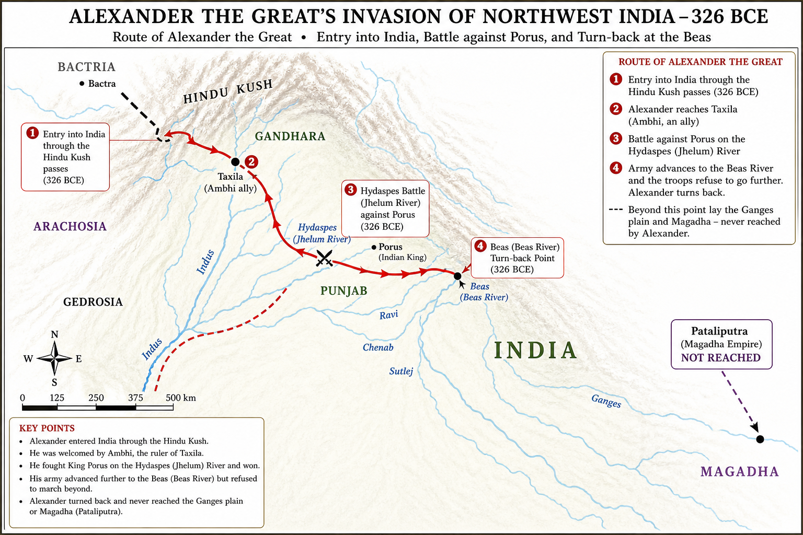

# Topic 6 — Foreign Invasions
### ★ Complete Source of Truth — No other book/notes needed for this topic

> **Covers syllabus:** Greek Invasion | Alexander's Invasion | Persons Accompanying Alexander | Foreign Invasions | Seleucus Nicator | Indo-Greek Kingdom  
> **Sources baked in:** NCERT *Themes in Indian History* I (Ch 4–5), RS Sharma, Arrian/Plutarch (Alexander sources), UPPCS/UPSC PYQs  
> **Exam weight:** ★★★ High — invasion chronology (2023 Q23), Alexander campaign route, Hydaspes/Beas, Seleucus–Chandragupta treaty, Indo-Greek rulers  
> **Last verified:** July 2026

---

## Quick Revision Box — Raata This First

```
FOREIGN INVASION CHRONOLOGY (★★★ 2023 Q23):
  Persians (Achaemenid) → Greeks (Alexander 326 BCE) → Indo-Greeks (2nd c. BCE)
  → Shakas (~1st c. BCE) → Parthians (~1st c. CE) → Kushans (~1st–2nd c. CE)
  UPPCS 2023 Q23 answer: A — Greeks → Sakas → Kushans

ALEXANDER IN INDIA (326 BCE):
  Crossed Indus | Ally = Ambhi (Taxila) | Foe = Porus (Paurava)
  Battle of Hydaspes (Jhelum) — Porus defeated, reinstated as satrap
  Army MUTINY at Hyphasis (Beas) — refused to march against Nanda Magadha
  Turned back — did NOT fight Dhana Nanda | Returned via Indus delta
  Died 323 BCE Babylon — empire divided among generals (Diadochi)

KEY RIVERS (Alexander route):
  Indus (entry) → Hydaspes/Jhelum (battle) → Acesines/Chenab → Hyphasis/Beas (turn-back)

SELEUCUS NICATOR:
  Alexander's general → Seleucid Empire founder
  War with Chandragupta Maurya → Treaty ~303 BCE
  Ceded territories west of Indus + Afghanistan | Got 500 elephants
  Sent Megasthenes as ambassador to Mauryan court

INDO-GREEK KINGDOM:
  Bactria-based | Demetrius I (~180 BCE) | Menander I = Milinda (Milinda Panha)
  Capitals: Taxila, Sagala (Sialkot) | Bilingual Greek-Kharoshthi coins
  Gandhara Greco-Buddhist art | 2023 Q24 — Milinda Panha saint = Nagasena

PERSONS WITH ALEXANDER (exam names):
  Aristobulus (historian) | Nearchus (naval voyage) | Onesicritus (helmsman)
  Ptolemy (memoir) | Seleucus Nicator (later Seleucid king)
```

### Must-Know Term Comparisons (very frequently asked)

| Term | One-line difference | Hindi |
|------|---------------------|-------|
| **Greek Invasion vs Alexander's Invasion** | Greek invasion = broader (Persian-era Greek contact + Macedonian); Alexander = specific 326 BCE Macedonian campaign | यूनानी आक्रमण / सिकंदर का आक्रमण |
| **Hydaspes vs Hyphasis** | Hydaspes (Jhelum) = battle with Porus; Hyphasis (Beas) = mutiny/turn-back point | हाइडेस्पीस / हाइफेसिस |
| **Ambhi vs Porus** | Ambhi (Taxila) = Alexander's ally; Porus (Paurava) = defeated at Hydaspes, then reinstated | अंभि / पोरस |
| **Seleucus vs Indo-Greeks** | Seleucus = Alexander's general, Seleucid western empire; Indo-Greeks = Bactrian-Greek kingdoms IN India (Demetrius, Menander) | सेल्यूकस / इंडो-ग्रीक |
| **Milinda vs Menander** | Same person — Greek name Menander I; Indian/Pali name Milinda (Milinda Panha) | मिलिंद / मेनेंडर |
| **Diadochi vs Satrap** | Diadochi = Alexander's successor generals; Satrap = Persian-style provincial governor Alexander appointed | उत्तराधिकारी / सत्राप |
| **Achaemenid vs Macedonian** | Achaemenid = Persian empire (Darius/Xerxes, 6th–4th c. BCE); Macedonian = Alexander's Greek kingdom | अचेमेनिड / मैसेडोनियन |
| **Indo-Greek vs Indo-Scythian** | Indo-Greek = Hellenistic Greek rulers (Menander); Indo-Scythian = Shaka rulers (Maues, Rudradaman) | इंडो-ग्रीक / इंडो-शक |
| **Gandhara vs Magadha** | Gandhara (Taxila) = Alexander reached; Magadha (Pataliputra) = Alexander never reached | गांधार / मगध |
| **Megasthenes vs Aristobulus** | Megasthenes = Seleucid ambassador, wrote *Indica*; Aristobulus = accompanied Alexander, source for Arrian | मेगस्थनीज / अरिस्टोबुलस |

### Memory Tricks

| Trick | Remembers |
|-------|-----------|
| **G-S-K** | 2023 Q23: Greeks → Shakas → Kushans (answer A) |
| **I-H-B** | Indus entry → Hydaspes battle → Beas turn-back |
| **Ambhi Ally, Porus Fight** | Taxila king helped; Paurava king fought |
| **Beas = Back** | Army mutiny at Beas — Alexander returned |
| **Seleucus 500 Elephants** | Treaty with Chandragupta — elephants for territory |
| **Milinda = Menander** | Indo-Greek king of Milinda Panha |
| **Nagasena = 2023 Q24** | Buddhist saint in Milinda dialogue |
| **323 Babylon Death** | Alexander died 323 BCE — never consolidated India |
| **Demetrius First Indo-Greek** | Major invader ~180 BCE |
| **Taxila = Entry Gate** | Alexander entered India via Taxila region |

---

## Exam Visuals — High-ROI Images

> **Type priority:** location map → conceptual diagram. Images stored locally (`images/`) so they open offline.

### 1. Alexander's Invasion — Route Map (326 BCE)



*Route trap chain: **Taxila** entry (king **Ambhi** ally) → **Hydaspes/Jhelum** battle vs **Porus** → army mutiny at **Beas** → turned back. **Never reached Magadha/Pataliputra**. Died **323 BCE Babylon** — no Indian empire left behind.*
*Source: Study map — generated for UPPCS route-matching*

---

## 6.1 Greek Invasion

### Definitions (learn all — exams pick different ones)

| Term | Meaning |
|------|---------|
| **Greek Invasion** | Series of contacts/invasions from Greek world into northwest India — Achaemenid-era Persian-Greek administration + Macedonian invasion under Alexander |
| **Achaemenid Empire** | Persian empire (c. 550–330 BCE) under Cyrus, Darius, Xerxes — included northwest Indian satrapies |
| **Hellenism** | Spread of Greek language, culture, and political models after Alexander's conquests |

### Greek Invasion — How It Works

- **First Greek contact** with India came through **Achaemenid Persians** — not direct Macedonian invasion yet.
- **Darius I** (~518 BCE) extended Persian empire into **northwest India** — **Gandhara** and **Hindush** (Indus region) became **satrapies** (provinces).
- **Indian soldiers** from Persian-controlled territories fought for Xerxes against Greeks — mentioned by **Herodotus** in Persian Wars.
- Persian rule brought **Aramaic script** influence and administrative models to northwest India.
- **Alexander of Macedon** (son of Philip II) invaded after destroying Achaemenid Persia (330 BCE onwards).
- **Greek invasion proper (Macedonian)** — Alexander crossed **Hindukush** and entered India **326 BCE** during eastward campaign.
- Before Alexander, **northwest India** already knew Greek culture through **Persian-Greek administrative contact** and trade.
- Alexander's invasion was **brief** (~2 years in Indian borderlands) — no permanent Macedonian empire in Gangetic India.
- **Political vacuum** after Alexander's death enabled **Mauryan rise** (Chandragupta) and later **Indo-Greek kingdoms** in Bactria-Gandhara.
- Greek invasion impact: **coins, sculpture, astronomy, political terminology** — foundation for Indo-Greek and Gandhara art.

> **Exam note:** "Greek invasion" in NCERT/syllabus includes **Persian-phase Greek contact** AND **Alexander**. Trap: "First Greeks in India = Alexander only" — Persians brought Greek contacts earlier via satrapies.

### Exam Facts (raata)

- Darius I annexed northwest India ~518 BCE
- Gandhara + Hindush = Persian satrapies
- Herodotus mentions Indian troops in Persian army
- Alexander entered India 326 BCE
- Destroyed Achaemenid Persia before reaching India
- Greek invasion = Persian contact + Macedonian campaign
- No permanent Greek rule in Gangetic plains
- Led to Indo-Greek successor states later

### PYQs — Greek Invasion

1. **(UPPCS Prelims 2023, Q23)** Chronological order of invaders: Greeks — Sakas — Kushans  
   → **A — Greeks → Sakas → Kushans** (Indo-Greeks precede Shakas in full sequence).

2. **(UPSC Prelims 2018 — pattern)** Darius I's Indian provinces included:  
   → **Gandhara and Hindush (Indus region)** — Persian satrapies.

### Examples (6.1)

| Example | Detail |
|---------|--------|
| **Gandhara satrapy** | Persian-administered northwest before Alexander |
| **Herodotus account** | Indian troops at Marathon (490 BCE) |
| **Hindukush crossing** | Alexander's entry route to India |

---

## 6.2 Alexander's Invasion

### Definitions

| Term | Meaning |
|------|---------|
| **Alexander the Great** | Philip II's son; Macedonian king (336–323 BCE); conquered Persian empire and reached India |
| **Battle of Hydaspes** | 326 BCE battle on river Jhelum — Alexander vs King Porus |
| **Hyphasis** | Ancient name for river **Beas** — where Alexander's army mutinied and refused to advance east |

### Alexander's Invasion — How It Works

- **Alexander** invaded India in **326 BCE** — after conquering Persian empire and Bactria.
- Crossed **Indus** — **Ambhi (Omphis)**, king of **Taxila**, **submitted and allied** with Alexander against rival Indian kings.
- Fought **Porus (Purushottama/Paurava)** — ruler of region between Jhelum and Chenab.
- **Battle of Hydaspes** (May **326 BCE**) on river **Hydaspes (Jhelum)** — Porus's **war elephants** fierce resistance; Alexander won tactically.
- Alexander **admired Porus's courage** — reinstated him as **satrap** (governor) with expanded territory under Macedonian suzerainty.
- Advanced to **Hyphasis (Beas)** river — soldiers **mutinied** (exhaustion, monsoon, fear of Nanda Magadha's large army).
- **Coenus** (general) spoke for army — Alexander **turned back** (326 BCE) — **never crossed Beas** into Gangetic heartland.
- **Did NOT fight Dhana Nanda** of Magadha — turned back before reaching Nanda territory.
- Established **satrapies** in Punjab: Porus and others governed under Macedonian control.
- Returned westward — **down Indus** to Arabian Sea; **Nearchus** led naval fleet along coast.
- **Marched through Gedrosia** (Makran desert) — suffered heavy losses.
- **Died 323 BCE** at **Babylon** — Indian territories immediately lost; generals divided empire.

### Alexander's Indian Campaign — Key Events Table

| Year | Event | River/Place |
|------|-------|---------------|
| 327 BCE | Crossed Hindukush into India | Northwest passes |
| 326 BCE | Alliance with Ambhi | Taxila |
| 326 BCE | Battle of Hydaspes | Jhelum (Hydaspes) |
| 326 BCE | Army mutiny | Beas (Hyphasis) |
| 326 BCE | Return via Indus | Indus delta |
| 323 BCE | Alexander's death | Babylon |

> **Exam note:** Alexander turned back at **Beas (Hyphasis)** — NOT Ganga, NOT Yamuna. Trap: "Alexander defeated Nanda army" — he never reached them.

### Exam Facts (raata)

- Invasion year 326 BCE
- Battle of Hydaspes = Jhelum river
- Porus defeated then reinstated
- Ambhi of Taxila = ally
- Mutiny at Beas (Hyphasis)
- Never fought Dhana Nanda
- Died 323 BCE Babylon
- Satrapies in Punjab only

### PYQs — Alexander's Invasion

1. **(UPPCS Prelims 2023, Q23)** Greeks first among Greeks–Sakas–Kushans sequence — Alexander era Greek invasion.  
   → **A — Greeks first.**

2. **(UPSC Prelims 2019 — pattern)** Alexander's army turned back at which river?  
   → **Hyphasis (Beas).** Not Ganga.

### Examples (6.2)

| Example | Detail |
|---------|--------|
| **Hydaspes battle** | Porus's elephants vs Macedonian phalanx |
| **Beas mutiny** | Soldiers refused to fight Nanda Magadha |
| **Taxila alliance** | Ambhi welcomed Alexander |

---

## 6.3 Persons Accompanying Alexander

### Definitions

| Term | Meaning |
|------|---------|
| **Diadochi** | "Successors" — Alexander's generals who divided his empire after 323 BCE |
| **Companion (Hetairoi)** | Macedonian elite cavalry — Alexander's inner military circle |

### Persons Accompanying Alexander — Complete Table

| Person | Role | Significance for India |
|--------|------|------------------------|
| **Aristobulus** | Engineer and historian on campaign | Source for Arrian's *Anabasis* — descriptions of Indian customs |
| **Nearchus** | Naval commander | Led fleet from **Indus mouth to Persian Gulf** (326–325 BCE) |
| **Onesicritus** | Chief helmsman | Recorded Indian observations in voyage accounts |
| **Ptolemy I** | General; later Pharaoh of Egypt | Wrote memoir used by Arrian — battle details |
| **Seleucus Nicator** | Infantry officer | Later founded **Seleucid empire**; fought/treatied with Chandragupta |
| **Callisthenes** | Official historian (nephew of Aristotle) | Executed by Alexander — did not complete India account |
| **Hephaestion** | Closest friend and general | Died 324 BCE before Alexander — not in India return |
| **Coenus** | General | Spoke for army at Beas mutiny — persuaded Alexander to turn back |
| **Aristotle** | Alexander's tutor | Did NOT accompany campaign — educated Alexander in Greek philosophy/science |
| **Ambhi (Omphis)** | Indian ally | King of Taxila — provided troops and supplies |
| **Porus** | Indian opponent-turned-ally | Fought at Hydaspes; later satrap under Alexander |

### Persons Accompanying Alexander — How It Works

- Alexander's campaign records survive through **secondary sources** — primarily **Arrian** and **Plutarch** (using lost primary accounts).
- **Aristobulus** and **Ptolemy** — most important eyewitness sources for Indian campaign details.
- **Nearchus** commanded **Indus-to-sea voyage** — proved river-sea connection; vital for logistics and geographic knowledge.
- **Onesicritus** interviewed Indian **gymnosophists** (naked philosophers) — Greek accounts of Indian asceticism.
- **Seleucus Nicator** was junior officer in Alexander's army — rose to power after 323 BCE partition.
- **Coenus** led mutiny delegation at **Beas** — historically decisive in stopping eastward advance.
- **Aristotle** taught Alexander **Homer, science, politics** — influence on Alexander's view of Eastern kings as equals/rivals.
- **Callisthenes** criticized Alexander's **proskynesis** (Persian court ritual) — executed 327 BCE.
- **Indian allies**: **Ambhi (Taxila)** and later **Porus** provided local knowledge, troops, and administrative continuity.
- **Megasthenes** did NOT accompany Alexander — came later as **Seleucid ambassador** to Chandragupta's court.

> **Exam note:** **Aristotle did NOT accompany** Alexander to India — common trap. **Nearchus** = naval commander on Indus. **Megasthenes** = post-Alexander Seleucid envoy.

### Exam Facts (raata)

- Aristobulus = historian-engineer on campaign
- Nearchus = Indus-to-sea naval voyage
- Onesicritus = helmsman, Indian observations
- Ptolemy = memoir source for Arrian
- Seleucus = Alexander's officer, later Seleucid king
- Coenus = Beas mutiny spokesman
- Aristotle = tutor only, not on campaign
- Megasthenes = later ambassador, not with Alexander

### PYQs — Persons Accompanying Alexander

1. **(UPSC Prelims 2018 — pattern)** Who commanded Alexander's fleet on the Indus?  
   → **Nearchus.**

2. **(UPSC Prelims 2016 — pattern)** Which of the following accompanied Alexander to India?  
   A. Aristotle  B. Megasthenes  C. Aristobulus  D. Kautilya  
   → **C — Aristobulus.** Aristotle and Megasthenes did not accompany.

### Examples (6.3)

| Example | Detail |
|---------|--------|
| **Nearchus voyage** | Indus mouth to Persian Gulf 326–325 BCE |
| **Arrian's Anabasis** | Compiled from Aristobulus + Ptolemy |
| **Coenus at Beas** | Key speech ending eastward march |

---

## 6.4 Foreign Invasions

### Definitions

| Term | Meaning |
|------|---------|
| **Foreign Invasions (Ancient India)** | Series of invasions from northwest: Persians, Greeks, Indo-Greeks, Shakas, Parthians, Kushans |
| **Northwest Gateway** | Khyber/Bolan passes — entry route for Central Asian and West Asian invaders into Indian subcontinent |

### Foreign Invasions — How It Works

- Indian subcontinent faced **repeated northwest invasions** from **6th century BCE to 3rd century CE** — shaped politics, trade, art, and coinage.
- **1. Achaemenid Persians** (~518–330 BCE) — first imperial power to absorb **Gandhara/Indus** into a trans-regional empire.
- **2. Macedonian Greeks (Alexander)** (326 BCE) — military campaign; brief satrapal control in Punjab; no Gangetic conquest.
- **3. Seleucid (Seleucus Nicator)** (~305–303 BCE) — conflict with **Chandragupta Maurya**; treaty ceded eastern territories; **Megasthenes** embassy.
- **4. Indo-Greeks (Bactrian Greeks)** (~2nd–1st century BCE) — **Demetrius I, Menander (Milinda), Apollodotus** — ruled Gandhara-Punjab from Bactria base.
- **5. Shakas (Indo-Scythians)** (~1st century BCE–1st century CE) — **Maues, Rudradaman, Nahapana** — displaced Indo-Greeks in west India.
- **6. Parthians (Pahlavas)** (~1st century CE) — **Gondophares** — brief rule in northwest.
- **7. Kushans** (~1st–3rd century CE) — **Kujula Kadphises, Kanishka** — large empire; Gandhara art peak.
- **UPPCS 2023 Q23** tests subset: **Greeks → Sakas → Kushans** = **Answer A** (Indo-Greeks fit before Shakas in full sequence).
- Each invasion wave brought **new coin types, art styles, and administrative titles** — cumulative Hellenistic + Central Asian synthesis.
- **Mauryas and Guptas** were indigenous empires between/around these foreign waves — not themselves foreign invasions.

### Foreign Invasions — Chronology Table

| Order | Invader | Period | Key figure |
|-------|---------|--------|------------|
| 1 | Achaemenid Persians | 6th–4th c. BCE | Darius I, Xerxes |
| 2 | Macedonian Greeks | 326 BCE | Alexander |
| 3 | Seleucid Greeks | 4th–3rd c. BCE | Seleucus Nicator |
| 4 | Indo-Greeks | 2nd–1st c. BCE | Menander (Milinda) |
| 5 | Shakas (Scythians) | 1st c. BCE–1st c. CE | Maues, Rudradaman |
| 6 | Parthians (Pahlavas) | 1st c. CE | Gondophares |
| 7 | Kushans | 1st–3rd c. CE | Kanishka |

> **Exam note:** **2023 Q23 answer = A (Greeks — Sakas — Kushans).** Trap: "Kushans before Shakas" — Shakas came first. Trap: "Greeks last" — Greeks were earliest of these three.

### Exam Facts (raata)

- Northwest = invasion gateway
- 2023 Q23: Greeks → Sakas → Kushans (A)
- Persians first (Achaemenid)
- Alexander 326 BCE
- Indo-Greeks before Shakas
- Kushans last of the three in Q23
- Each wave brought coins + art influence
- Mauryas/Guptas = indigenous empires

### PYQs — Foreign Invasions

1. **(UPPCS Prelims 2023, Q23)** With reference to invaders in Ancient India, correct chronological order?  
   A. Greeks — Sakas — Kushans  B. Greeks — Kushans — Sakas  C. Sakas — Greeks — Kushans  D. Sakas — Kushans — Greeks  
   → **A — Greeks → Sakas → Kushans.**

2. **(UPSC Prelims 2019 — pattern)** Arrange: Indo-Greeks, Kushans, Shakas — earliest to latest:  
   → **Indo-Greeks → Shakas → Kushans.**

### Examples (6.4)

| Example | Detail |
|---------|--------|
| **2023 Q23** | Direct chronology MCQ |
| **Khyber Pass** | Main invasion route |
| **Gandhara** | Repeatedly conquered frontier zone |

---

## 6.5 Seleucus Nicator

### Definitions

| Term | Meaning |
|------|---------|
| **Seleucus Nicator** | Alexander's general; founder of **Seleucid Empire** (312 BCE); "Nicator" = Victor |
| **Treaty with Chandragupta** | Peace settlement ~303/305 BCE — territory exchange and diplomatic marriage alliance |

### Seleucus Nicator — How It Works

- **Seleucus I Nicator** — one of **Alexander's infantry officers**; received **Babylon** in partition of empire (323 BCE).
- Built **Seleucid Empire** stretching from **Anatolia to Bactria** — largest of Diadochi kingdoms.
- **Invaded India** (~305 BCE) to reclaim Alexander's eastern satrapies — clashed with **Chandragupta Maurya**.
- **War inconclusive** — Seleucus faced Mauryan strength (Chandragupta's army included **war elephants**).
- **Treaty (~303 BCE)** — Seleucus ceded **eastern Afghanistan, Baluchistan, and regions west of Indus** to Chandragupta.
- Chandragupta gave **500 war elephants** to Seleucus — elephants used in Seleucid wars in West Asia.
- **Diplomatic alliance** — Seleucus's daughter **Helena (Helen)** reportedly married Chandragupta (sources: Appian, Strabo).
- **Megasthenes** sent as **Seleucid ambassador** to **Pataliputra** — wrote ***Indica*** describing Mauryan court, society, administration.
- Seleucus consolidated west; **Mauryas controlled India** — defined early boundary of Indian empire.
- Seleucus assassinated **281 BCE** — Seleucid empire continued but Indian territories permanently with Mauryas.

### Seleucus–Chandragupta Treaty — Key Terms

| Seleucus gave | Chandragupta gave |
|---------------|------------------|
| Territories west of Indus (Arachosia, Paropamisadae, Gedrosia) | 500 war elephants |
| Diplomatic recognition of Mauryan sovereignty | Marriage alliance (Helena) |
| Ambassador Megasthenes to Mauryan court | Peace on northwest frontier |

> **Exam note:** Seleucus **lost** Indian territories to Chandragupta — NOT conquered India. Trap: "Seleucus ruled Magadha" — false. **Megasthenes** = ambassador after treaty.

### Exam Facts (raata)

- Alexander's general → Seleucid founder
- Fought Chandragupta Maurya ~305 BCE
- Treaty ~303 BCE
- Ceded territories west of Indus
- Received 500 elephants
- Helena marriage alliance
- Megasthenes ambassador
- Killed 281 BCE

### PYQs — Seleucus Nicator

1. **(UPSC Prelims 2019 — pattern)** Seleucus Nicator ceded which to Chandragupta?  
   → **Territories west of Indus + eastern Afghanistan.**

2. **(UPSC Prelims 2017 — pattern)** Megasthenes was ambassador of:  
   → **Seleucus Nicator** to Chandragupta's court.

### Examples (6.5)

| Example | Detail |
|---------|--------|
| **Megasthenes' Indica** | Source on Mauryan Pataliputra |
| **500 elephants** | Mauryan military asset in treaty |
| **Helena marriage** | Indo-Hellenistic diplomatic link |

---

## 6.6 Indo-Greek Kingdom

### Definitions

| Term | Meaning |
|------|---------|
| **Indo-Greek Kingdom** | Hellenistic Greek states ruling parts of northwest India (2nd–1st century BCE) from Bactrian base |
| **Bactria** | Region north of Hindukush (modern Afghanistan) — springboard for Indo-Greek expansion into India |
| **Milinda Panha** | Pali Buddhist text — dialogue between King **Milinda (Menander)** and monk **Nagasena** |

### Indo-Greek Kingdom — How It Works

- After Alexander and Seleucid withdrawal, **Greco-Bactrian kingdom** emerged in **Bactria** (~3rd–2nd century BCE).
- **Demetrius I** (~180 BCE) — first major Indo-Greek king to invade and rule **northwest India** extensively.
- **Menander I (Milinda)** — most famous Indo-Greek ruler; capital **Sagala (Sialkot)**; patron of Buddhism.
- ***Milinda Panha*** — philosophical dialogue: King Milinda questions **Nagasena** on Buddhist doctrine ← **UPPCS 2023 Q24: saint = Nagasena**.
- Indo-Greek coins — **bilingual inscriptions** (Greek + Kharoshthi/Prakrit) — key archaeological evidence.
- Rulers: **Apollodotus I, Antialcidas, Strato I, Hippostratos** — controlled Punjab, Gandhara, parts of Rajasthan/Gujarat.
- **Heliodorus pillar** (Besnagar, MP) — Indo-Greek ambassador **Antialcidas** era; **Bhagavata (Vasudeva)** worship inscription.
- **Gandhara art** — Greco-Buddhist sculpture fusion; Buddha in Greek-style drapery; Mediterranean facial features.
- Indo-Greeks displaced by **Shakas** from northwest (~1st century BCE) — preceded Kushan rise.
- Legacy: **Hellenistic art + Indian religion** synthesis; numismatic evidence for chronology.

### Major Indo-Greek Rulers — Table

| Ruler | Period (approx.) | Notes |
|-------|------------------|-------|
| **Demetrius I** | ~200–180 BCE | First major Indian conquest |
| **Menander I (Milinda)** | ~165–130 BCE | Milinda Panha; Buddhist patron |
| **Apollodotus I** | ~180–160 BCE | Coinage in Gandhara |
| **Antialcidas** | ~115–95 BCE | Heliodorus pillar connection |
| **Strato I** | ~130–110 BCE | Eastern Punjab rule |

> **Exam note:** **Milinda = Menander** (same Indo-Greek king). 2023 Q24 answer = **Nagasena**. Trap: "Milinda Panha saint = Nagarjuna" — Nagarjuna was later Mahayana philosopher.

### Exam Facts (raata)

- Bactria = base region
- Demetrius I first major invader
- Menander = Milinda
- Milinda Panha — Nagasena (2023 Q24)
- Bilingual Greek-Kharoshthi coins
- Sagala (Sialkot) capital
- Gandhara Greco-Buddhist art
- Displaced by Shakas ~1st c. BCE

### PYQs — Indo-Greek Kingdom

1. **(UPPCS Prelims 2023, Q24)** *Milind Panho* dialogue saint was: A. Nagarjun  B. Nagbhatt  C. Nagasena  D. Kumaril Bhatt  
   → **C — Nagasena.** King Milinda = Indo-Greek Menander.

2. **(UPPCS Prelims 2023, Q23)** Indo-Greeks precede Shakas in invasion chronology.  
   → **Greeks (including Indo-Greeks) before Shakas.**

### Examples (6.6)

| Example | Detail |
|---------|--------|
| **Milinda Panha** | Menander-Nagasena Buddhist debate |
| **Gandhara Buddha head** | Greco-Roman style sculpture |
| **Bilingual coins** | Greek king name + Kharoshthi script |

---

## Consolidated Reference — Everything in One Place

### Foreign Invasion Chronology (Master List)

| # | Invader | Period | Key name |
|---|---------|--------|----------|
| 1 | Achaemenid Persians | 518–330 BCE | Darius I |
| 2 | Macedonian Greeks | 326 BCE | Alexander |
| 3 | Seleucid | 4th–3rd c. BCE | Seleucus Nicator |
| 4 | Indo-Greeks | 2nd–1st c. BCE | Menander (Milinda) |
| 5 | Shakas | 1st c. BCE–1st c. CE | Rudradaman |
| 6 | Parthians | 1st c. CE | Gondophares |
| 7 | Kushans | 1st–3rd c. CE | Kanishka |

**2023 Q23 subset: Greeks → Sakas → Kushans = A**

### Alexander's Indian Route

| Stage | River (ancient = modern) | Event |
|-------|--------------------------|-------|
| Entry | Indus | Crossed into India |
| Alliance | — | Taxila (Ambhi) |
| Battle | Hydaspes = Jhelum | Defeated Porus |
| Turn-back | Hyphasis = Beas | Army mutiny |
| Exit | Indus delta | Nearchus naval voyage |

### UP Focus — Foreign Invasions & Uttar Pradesh

| Point | Detail |
|-------|--------|
| **Alexander's limit** | Stopped at **Beas** — never entered modern **UP heartland** (Ganga-Yamuna doab) |
| **Magadha untouched** | Dhana Nanda's empire (Bihar/eastern UP border) — Alexander never fought |
| **Eastern UP mahajanapadas** | Kosala, Kashi, Vatsa (Kaushambi) — outside Alexander's campaign zone |
| **Later Indo-Greeks** | Ruled **Gandhara-Punjab** — not eastern UP |
| **Heliodorus pillar** | **Besnagar (Vidisha), MP** — Indo-Greek connection to Bhagavatism; near UP border region |
| **Exam trap** | "Alexander conquered Kaushambi/Kashi" — **FALSE** |

### Important Dates

| Event | Date |
|-------|------|
| Darius I Indian satrapies | ~518 BCE |
| Alexander's Indian invasion | 326 BCE |
| Battle of Hydaspes | 326 BCE |
| Mutiny at Beas (Hyphasis) | 326 BCE |
| Alexander's death | 323 BCE |
| Seleucus–Chandragupta treaty | ~303 BCE |
| Demetrius I Indo-Greek expansion | ~180 BCE |
| Menander (Milinda) reign | ~165–130 BCE |

---

## Practice Zone — UPPCS Format Questions

**1.** Chronological order of invaders (2023 Q23): Greeks, Sakas, Kushans

<details><summary>Answer</summary>
**A — Greeks → Sakas → Kushans.**
</details>

**2.** Consider the following about Alexander's retreat:
1. Army mutinied at Hyphasis (Beas).
2. Soldiers feared the powerful Nanda army ahead.
3. Alexander crossed the Ganga before turning back.

<details><summary>Answer</summary>
**1 and 2 only.** He never crossed the Ganga.
</details>

**3.** Consider:
1. Battle of Hydaspes was fought on the Jhelum.
2. Porus was killed in the battle.
3. War elephants were used in the battle.

<details><summary>Answer</summary>
**1 and 3 only.** Porus was defeated but reinstated — not killed.
</details>

**4.** Consider: 1. Ambhi of Taxila allied with Alexander. 2. Porus was reinstated after Hydaspes.

<details><summary>Answer</summary>
**Both correct.**
</details>

**5.** Milinda Panha saint (2023 Q24):

<details><summary>Answer</summary>
**Nagasena (C).** King = Menander (Milinda).
</details>

**6.** Seleucus Nicator gave which to Chandragupta?

<details><summary>Answer</summary>
**Territories west of Indus + eastern Afghanistan (in exchange for 500 elephants).**
</details>

**7.** Who commanded Alexander's Indus fleet?

<details><summary>Answer</summary>
**Nearchus.**
</details>

**8.** Consider: 1. Aristotle accompanied Alexander to India. 2. Aristobulus accompanied Alexander.

<details><summary>Answer</summary>
**Only 2 correct.** Aristotle was tutor only.
</details>

**9.** Assertion (A): Alexander never fought Dhana Nanda.
Reason (R): His army mutinied at Beas and refused to advance.

<details><summary>Answer</summary>
**Both true; R explains A.**
</details>

**10.** First Persian contact with northwest India:

<details><summary>Answer</summary>
**Darius I (~518 BCE) — Gandhara/Hindush satrapies.**
</details>

**11.** Indo-Greek king in Milinda Panha:

<details><summary>Answer</summary>
**Menander I (Milinda).**
</details>

**12.** Match: A. Hydaspes — 1. Beas  B. Hyphasis — 2. Jhelum

<details><summary>Answer</summary>
**A-2, B-1** (Hydaspes=Jhelum, Hyphasis=Beas).
</details>

**13.** Which are correctly matched?
1. Seleucus — Alexander's general  2. Megasthenes — accompanied Alexander  3. Coenus — Beas mutiny

<details><summary>Answer</summary>
**1 and 3 only.** Megasthenes came later as ambassador.
</details>

**14.** Consider invasion order: 1. Indo-Greeks before Shakas. 2. Kushans after Shakas.

<details><summary>Answer</summary>
**Both correct** (matches 2023 Q23 logic).
</details>

**15.** Alexander died at:

<details><summary>Answer</summary>
**Babylon, 323 BCE.**
</details>

**16.** Demetrius I is associated with:

<details><summary>Answer</summary>
**Indo-Greek kingdom — first major Indian expansion.**
</details>

**17.** Assertion (A): Greek invasion began only with Alexander.
Reason (R): Achaemenid Persians had already absorbed northwest Indian satrapies.

<details><summary>Answer</summary>
**A false, R true** — Persian phase preceded Alexander.
</details>

**18.** Bilingual Indo-Greek coins use:

<details><summary>Answer</summary>
**Greek + Kharoshthi (Prakrit).**
</details>

**19.** Which is NOT an Alexander campaign river?
A. Indus  B. Jhelum  C. Ganga  D. Beas

<details><summary>Answer</summary>
**C — Ganga.** Alexander never reached Ganga.
</details>

**20.** 500 war elephants exchanged in treaty between:

<details><summary>Answer</summary>
**Chandragupta Maurya and Seleucus Nicator.**
</details>

**21.** Consider: 1. Porus used war elephants at Hydaspes. 2. Alexander conquered Magadha.

<details><summary>Answer</summary>
**Only 1 correct.**
</details>

**22.** Gandhara art reflects:

<details><summary>Answer</summary>
**Greco-Buddhist fusion (Indo-Greek cultural legacy).**
</details>

**23.** Arrange chronologically:
A. Alexander  B. Menander  C. Kanishka

<details><summary>Answer</summary>
**Alexander → Menander → Kanishka.**
</details>

**24.** Taxila king who allied with Alexander:

<details><summary>Answer</summary>
**Ambhi (Omphis).**
</details>

**25.** Consider: 1. Milinda = Menander. 2. Milinda Panha saint = Nagarjuna.

<details><summary>Answer</summary>
**Only 1 correct.** Saint = Nagasena.
</details>

**26.** Seleucid ambassador who wrote *Indica*:

<details><summary>Answer</summary>
**Megasthenes.**
</details>

**27.** Which pairs are correctly matched?
1. Onesicritus — helmsman  2. Ptolemy — later Pharaoh  3. Kautilya — Alexander's general

<details><summary>Answer</summary>
**1 and 2 only.**
</details>

**28.** Alexander entered India in:

<details><summary>Answer</summary>
**326 BCE.**
</details>

**29.** Assertion (A): Indo-Greeks ruled from Bactria base.
Reason (R): Bactria lies north of Hindukush.

<details><summary>Answer</summary>
**Both true; R explains A.**
</details>

**30.** Foreign invasions entered India primarily through:

<details><summary>Answer</summary>
**Northwest passes (Khyber, Bolan, Hindukush).**
</details>

**31.** Consider: 1. Shakas displaced Indo-Greeks. 2. Greeks came before Shakas in 2023 Q23 order.

<details><summary>Answer</summary>
**Both correct.**
</details>

**32.** Alexander's primary Indian source historians:

<details><summary>Answer</summary>
**Aristobulus and Ptolemy** (via Arrian).
</details>

**33.** Which is correctly matched?
A. Sagala — Indo-Greek capital  B. Pataliputra — Alexander's capital  C. Taxila — Porus's capital

<details><summary>Answer</summary>
**A only.** Pataliputra = Mauryan; Taxila = Ambhi.
</details>

**34.** Consider UP-specific statements:
1. Alexander reached Varanasi. 2. Alexander stopped before Gangetic heartland.

<details><summary>Answer</summary>
**Only 2 correct.**
</details>

**35.** Treaty of Seleucus-Chandragupta approximately:

<details><summary>Answer</summary>
**303 BCE** (also cited as 305 BCE).
</details>

**36.** Assertion (A): Indo-Greeks issued bilingual coins.
Reason (R): Their rule spanned Greek and Indian cultural zones.

<details><summary>Answer</summary>
**Both true; R explains A.**
</details>

**37.** Which statements about foreign invasions are correct?
1. Achaemenid Persians preceded Alexander.
2. Kushans came before Shakas.
3. Indo-Greeks ruled Gandhara region.

<details><summary>Answer</summary>
**1 and 3 only.** Shakas before Kushans (2023 Q23).
</details>

---

## Complete PYQ Bank (Topic 6)

### UPPCS Prelims 2023

**Q23.** With reference to the invaders in Ancient India, which one of the following is the correct chronological order?

A. Greeks — Sakas — Kushans  
B. Greeks — Kushans — Sakas  
C. Sakas — Greeks — Kushans  
D. Sakas — Kushans — Greeks

<details><summary>Answer</summary>
**A — Greeks → Sakas → Kushans.**
</details>

**Q24.** *Milind Panho* is in the form of a dialogue between King Milind and a Buddhist saint. The concerned saint was—

A. Nagarjun  B. Nagbhatt  C. Nagasena  D. Kumaril Bhatt

<details><summary>Answer</summary>
**C — Nagasena.** King Milind = Indo-Greek Menander.
</details>

### UPSC Pattern (Concept Overlap)

**Pattern — Hyphasis:** Alexander turned back at Beas (Hyphasis), not Ganga.

**Pattern — Megasthenes:** Seleucid (not Alexander) ambassador to Chandragupta.

**Pattern — Hydaspes:** Jhelum river battle with Porus (326 BCE).

---

## Common Traps — Don't Fall For These

1. **2023 Q23 answer = A** — Greeks → Sakas → Kushans (NOT Kushans before Shakas).
2. **Beas (Hyphasis) = turn-back** — NOT Ganga, NOT Yamuna.
3. **Hydaspes = Jhelum** — battle with Porus; do not confuse with Beas.
4. **Alexander never fought Nanda/Dhana Nanda** — mutiny before reaching Magadha.
5. **Ambhi = ally**; **Porus = fought then reinstated** — do not swap.
6. **Aristotle did NOT accompany** Alexander — tutor only.
7. **Megasthenes = Seleucid ambassador** — NOT Alexander's companion.
8. **Milinda = Menander** — Indo-Greek king; saint = **Nagasena** (2023 Q24), NOT Nagarjuna.
9. **Seleucus LOST Indian territory** to Chandragupta — did not conquer Magadha.
10. **Alexander died 323 BCE Babylon** — Indian conquests not consolidated.
11. **Persian (Darius) preceded Alexander** — Greek invasion ≠ only Alexander.
12. **Indo-Greeks before Shakas** — in full and 2023 Q23 subset logic.
13. **Alexander did NOT reach UP heartland** — stopped at Beas; Kashi/Kaushambi untouched.
14. **500 elephants** went from Chandragupta TO Seleucus — not reverse.
15. **Taxila = Ambhi** — NOT Porus's kingdom.
