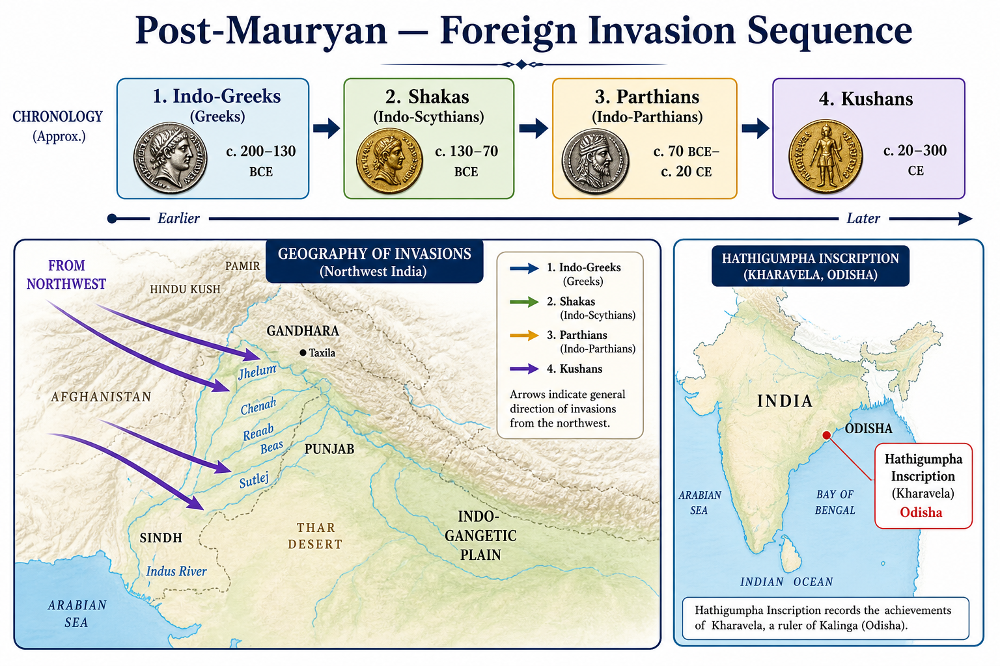
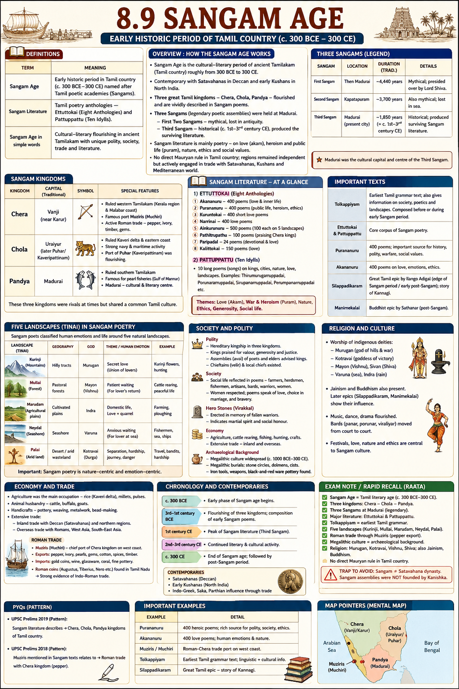

# Topic 8 — Post-Mauryan India
### ★ Complete Source of Truth — No other book/notes needed for this topic

> **Covers syllabus:** Post-Mauryan Period | Satavahana Rulers | South Indian History | Indo-Greeks | Shakas | Parthians | Kushanas | Kanishka | Sangam Age  
> **Sources baked in:** NCERT *Themes in Indian History* I (Ch 4–5), RS Sharma, Hathigumpha/Junagarh/Nasik epigraphy, Sangam literature, UPPCS/UPSC PYQs  
> **Exam weight:** ★★★ High — invasion chronology (2023 Q23), South India ruler-dynasty match (2025 Q121), Satavahana (2021 Q52), Hathigumpha/Kharavela (2018 Q16), Indo-Greek Milinda (2023 Q24)  
> **Last verified:** July 2026

---

## Quick Revision Box — Raata This First

```
POST-MAURYAN CHRONOLOGY (185 BCE → 3rd c. CE):
  185 BCE — Pushyamitra Shunga kills Brihadratha (Mauryan end)
  Shungas (185–73 BCE) → Kanvas (73–28 BCE) | Kharavela (Kalinga)
  Indo-Greeks (2nd–1st c. BCE) → Shakas (1st c. BCE–1st c. CE) → Parthians → Kushanas (1st–3rd c. CE)

2023 Q23: Greeks → Sakas → Kushans = A

INVASION WAVE ORDER:
  Indo-Greeks (Menander/Milinda) BEFORE Shakas BEFORE Kushans
  Parthians (Gondophares) between Shakas and Kushans (brief)

SATAVAHANA (Deccan):
  Capital: Pratishthana (Paithan) + Amaravati | Gautamiputra Satakarni = greatest
  2021 Q52: Prakrit patrons + public arts = BOTH correct
  Defeated Shaka Nahapana | Amaravati art, Karla chaitya

SHAKAS: Maues (first) | Rudradaman — Junagarh + Nasik inscriptions
  Defeated by Gautamiputra Satakarni

KUSHANS: Kujula Kadphises → Vima Kadphises → Kanishka (greatest)
  Capital Purushapura (Peshawar) | Mathura second capital
  Kanishka = 4th Buddhist Council | Shaka era 78 CE (tradition)

SANGAM AGE (c. 300 BCE–300 CE | Tamilakam south of Krishna-Tungabhadra):
  Muvendar = Chera (bow) + Chola (tiger) + Pandya (fish) — NOT Pallava/Rashtrakuta
  Madurai = Pandya capital + Sangam poetic assemblies (3 legendary; 3rd = extant texts)
  Literature: Tamil | Melkannakku (Ettuttokai 8 + Pattuppattu 10) | Tolkappiyam (grammar)
  Themes: Akam (love) | Puram (war/heroism) | Tinai = 5 landscapes (kurinji→palai)
  Rulers: Karikala Chola (Kaveri embankment, Puhar) | Senguttuvan Chera (Roman trade)
  Ports: Muziris/Muchiri (Chera) | Kaveripattinam/Puhar (Chola) | Korkai (Pandya pearls)
  Roman trade 1st c. CE | Arikamedu archaeology | Yavanas (foreigners) in poems
  ADMIN: vendan + vari (land tax) + Sungam (customs) | Nadu + Ur + Velir chiefs
  Chera = Muziris customs/pepper | Chola = Kaveri vari + Karikala irrigation + navy
  Pandya = Madurai court + Korkai pearl monopoly + Sangam patronage
  Trap: Karikala ≠ Rajaraja I | Sangam ≠ Satavahana dynasty | texts ≠ Mauryan admin manual

2025 Q121 RULER ↔ DYNASTY (★★★):
  Mahendravarman I = Pallava (2) | Kadungon = Pandya (4)
  Amoghavarsha I = Rashtrakuta (1) | Rajaraja I = Chola (3)
  Answer B = 2-4-1-3

KEY INSCRIPTIONS:
  Hathigumpha = Kharavela (2018 Q16) | Ayodhya = Pushyamitra Shunga Ashwamedha (2018 Q91)
  Junagarh/Nasik = Rudradaman (Shaka)
```

### Must-Know Term Comparisons (very frequently asked)

| Term | One-line difference | Hindi |
|------|---------------------|-------|
| **Indo-Greek vs Indo-Scythian (Shaka)** | Indo-Greek = Hellenistic Greek rulers (Menander); Indo-Scythian = Central Asian Shaka rulers (Rudradaman) | इंडो-ग्रीक / इंडो-शक |
| **Shaka vs Kushan** | Shakas earlier (~1st c. BCE); Kushans later and larger empire (Kanishka, 1st–2nd c. CE) | शक / कुषाण |
| **Shunga vs Satavahana** | Shunga = north India post-Mauryan (Magadha); Satavahana = Deccan dynasty (Andhra) | शुंग / सातवाहन |
| **Kharavela vs Rudradaman** | Kharavela = Chedi/Kalinga king (Hathigumpha); Rudradaman = Shaka Kshatrapa (Junagarh) | खारवेल / रुद्रदामन |
| **Milinda vs Kanishka** | Milinda = Indo-Greek Buddhist patron; Kanishka = Kushan Buddhist patron + 4th Council | मिलिंद / कनिष्क |
| **Parthian vs Shaka** | Parthians (Pahlavas) = Gondophares brief northwest rule; Shakas = longer Indo-Scythian presence | पार्थियन / शक |
| **Sangam vs Satavahana** | Sangam = Tamil literary/cultural age in deep south; Satavahana = political dynasty in Deccan | संगम / सातवाहन |
| **Gautamiputra Satakarni vs Kanishka** | Gautamiputra = Satavahana, defeated Shakas; Kanishka = Kushan emperor, different era/region | गौतमीपुत्र / कनिष्क |
| **Prakrit vs Sanskrit (Satavahana)** | Satavahanas patronized **Prakrit** (common speech); Sanskrit for court Brahmanical texts | प्राकृत / संस्कृत |
| **Gandhara art vs Amaravati art** | Gandhara = Greco-Buddhist (northwest/Kushan); Amaravati = native Andhra Buddhist art (Satavahana) | गांधार कला / अमरावती कला |
| **Mahendravarman I vs Rajaraja I** | Mahendravarman I = Pallava (7th c., Mamallapuram); Rajaraja I = Chola (11th c., Thanjavur temple) | महेन्द्रवर्मन / राजराज प्रथम |
| **Kadungon vs Amoghavarsha** | Kadungon = Pandya revival founder (~6th c.); Amoghavarsha I = Rashtrakuta (9th c., Kannada literature) | कडुंगों / अमोघवर्ष |
| **Karikala vs Rajaraja I** | Karikala = Sangam-era Chola (~2nd c. CE, Kaveri embankment); Rajaraja I = imperial medieval Chola (11th c., Thanjavur) | करिकाल / राजराज प्रथम |
| **Akam vs Puram (Sangam)** | Akam = inner/love poetry; Puram = outer/war, kingship, public duty | अकम् / पुरम् |
| **Sangam Chola vs Imperial Chola** | Sangam Cholas (Karikala) = early historic Tamilakam; imperial Cholas (Rajaraja) = 9th c. revival — different eras | संगम चोल / साम्राज्य चोल |
| **Muvendar vs Satavahana** | Muvendar = three crowned Tamil kings (Chera-Chola-Pandya); Satavahana = north Deccan Andhra dynasty — contemporaries, not same polity | मुवेन्दर / सातवाहन |

### Memory Tricks

| Trick | Remembers |
|-------|-----------|
| **G-S-K** | 2023 Q23: Greeks → Shakas → Kushans |
| **185 Shunga** | Mauryan end → Pushyamitra |
| **Hathi = Kharavela** | 2018 Q16 Hathigumpha |
| **Ayodhya = Shunga Yajna** | 2018 Q91 Pushyamitra Ashwamedha |
| **2021 Both Satavahana** | Prakrit + public arts |
| **Milinda = Menander** | 2023 Q24 Indo-Greek |
| **Maues First Shaka** | Earliest Indo-Scythian king |
| **Kanishka = Kushan peak** | 4th Buddhist Council |
| **3 Sangam Kingdoms** | Chera-Chola-Pandya (Muvendar) |
| **Bow-Tiger-Fish** | Chera bow | Chola tiger | Pandya fish — dynasty emblems |
| **Akam-Puram** | Love vs war themes in Sangam poetry |
| **Karikala ≠ Rajaraja** | Sangam Chola vs imperial Chola trap |
| **Muziris = Chera** | Roman pepper port on Kerala coast |
| **Purushapura = Peshawar** | Kushan capital |
| **2025 B 2413** | Mahendravarman-Pallava; Kadungon-Pandya; Amoghavarsha-Rashtrakuta; Rajaraja-Chola |

---

## Exam Visuals — High-ROI Images

> **Type priority:** location map → conceptual diagram. Images stored locally (`images/`) so they open offline.

### 1. Post-Mauryan — Foreign Invasion Sequence (Conceptual)



*Raata **chronology ↔ region**. **2023 Q23**: Greeks → Shakas → Kushans (answer A). **Hathigumpha = Odisha** (Udayagiri) — **Kharavela**, NOT Ashoka (**2018 Q16**). **Pushyamitra Shunga 185 BCE** = Mauryan end; **Ayodhya Ashwamedha** inscription.*
*Source: Study diagram — generated for UPPCS chronology & location*

---

## 8.1 Post-Mauryan Period

### Definitions (learn all — exams pick different ones)

| Term | Meaning |
|------|---------|
| **Post-Mauryan Period** | Era after Mauryan collapse (~185 BCE) to rise of Guptas (~320 CE) — political fragmentation + foreign invasions |
| **Shunga Dynasty** | Founded by **Pushyamitra Shunga** who overthrew last Mauryan king Brihadratha (185 BCE) |
| **Painted Grey Ware (PGW)** | Archaeological culture marking post-Mauryan north Indian settlements |

### Post-Mauryan Period — How It Works

- **Mauryan empire collapsed 185 BCE** — last king **Brihadratha** killed by his general **Pushyamitra Shunga**.
- **Shunga dynasty (185–73 BCE)** — ruled **eastern/north India** (Magadha, UP regions); **Brahmanical revival** — performed **Ashwamedha yajnas**.
- **Ayodhya inscription** records **two Ashwamedha sacrifices** by **Pushyamitra Shunga** ← **UPPCS 2018 Q91 answer C**.
- **Kanva dynasty (73–28 BCE)** — succeeded Shungas; minor dynasty; limited territorial control.
- **Political fragmentation** — no pan-Indian empire until Guptas; regional kingdoms rose independently.
- **Foreign invasion wave** began: **Indo-Greeks → Shakas → Parthians → Kushans** ← **2023 Q23: Greeks → Sakas → Kushans**.
- **Kharavela of Kalinga** — powerful eastern king; **Hathigumpha inscription** (Odisha) — contemporary with late Mauryas/early post-Mauryan.
- **Economic shift** — long-distance Mauryan state trade reduced; **guild (shreni) autonomy** increased; **Roman trade** with south and west grew.
- **Material culture** — **PGW (Painted Grey Ware)** in north; **Satavahanas** in Deccan; **coinage proliferation** (Indo-Greek, Shaka, Kushan types).
- **Religious developments** — Buddhism spread south and abroad; **Mahayana** emerging; Brahmanism resurged under Shungas.

### Post-Mauryan Political Timeline

| Period | Dynasty/Phase | Region |
|--------|---------------|--------|
| 185–73 BCE | Shunga | Magadha, eastern UP |
| 73–28 BCE | Kanva | Limited north India |
| 2nd–1st c. BCE | Indo-Greeks | Northwest |
| 1st c. BCE–1st c. CE | Shakas | Western/central India |
| 1st–3rd c. CE | Kushans | Northwest to Gangetic plain |
| 1st c. BCE–3rd c. CE | Satavahana | Deccan (parallel) |

> **Exam note:** **2018 Q91 = Ayodhya inscription** (Shunga Ashwamedha) — NOT Hathigumpha (that's Kharavela). **2023 Q23** invasion order tested here.

### Exam Facts (raata)

- Mauryan end 185 BCE
- Pushyamitra Shunga founder
- Ayodhya inscription — Shunga Ashwamedha (2018 Q91)
- Kanva dynasty 73–28 BCE
- Political fragmentation till Guptas
- Greeks → Shakas → Kushans (2023 Q23)
- Kharavela — Hathigumpha
- PGW culture in north India

### PYQs — Post-Mauryan Period

1. **(UPPCS Prelims 2023, Q23)** Chronological order: Greeks — Sakas — Kushans  
   → **A — Greeks → Sakas → Kushans.**

2. **(UPPCS Prelims 2018, Q91)** Two Ashwamedha yajnas of Pushyamitra Shunga recorded in:  
   A. Sarnath  B. Besnagar  C. Ayodhya  D. Hathigumpha  
   → **C — Ayodhya inscription.**

### Examples (8.1)

| Example | Detail |
|---------|--------|
| **185 BCE coup** | Pushyamitra ends Mauryan dynasty |
| **2018 Q91** | Ayodhya-Shunga Ashwamedha link |
| **2023 Q23** | Foreign invasion chronology |

---

## 8.2 Satavahana Rulers

### Definitions

| Term | Meaning |
|------|---------|
| **Satavahana Dynasty** | Deccan/Andhra ruling house (c. 1st century BCE–3rd century CE) — also called **Andhra dynasty** |
| **Gautamiputra Satakarni** | Greatest Satavahana king — defeated Shaka ruler Nahapana |

### Satavahana Rulers — How It Works

- **Satavahanas** ruled **Deccan and parts of central/western India** — bridge between north post-Mauryan chaos and southern kingdoms.
- **Founder**: **Simuka** (traditional ~230 BCE or 1st century BCE — dates debated).
- **Capitals**: **Pratishthana (Paithan, Maharashtra)** and **Amaravati (Andhra Pradesh)** — dual administrative centres.
- **Gautamiputra Satakarni** — most powerful ruler; **Nasik inscription** praises his victories over **Shakas (Western Kshatrapas)**.
- **Defeated Nahapana** (Shaka Kshatrapa) — recovered territories in western India.
- **Prakrit language patrons** — Satavahanas nurtured **Prakrit** (not Sanskrit) for inscriptions and literature ← **2021 Q52 statement 1 (correct)**.
- **Public art flourished** — **Amaravati stupa**, **Karla chaitya**, **Nasik caves** — art for public worship/display ← **2021 Q52 statement 2 (correct)**.
- **Coins**: portrait coins of rulers; bilingual legends (Prakrit-Andhra/Tamil influences).
- **Trade**: controlled routes between north and south; **Roman trade** — spices, textiles exported.
- **Administrative titles**: **Raja**, **Maharaja**, **Dakshinapathapati** (lord of southern path).
- **Decline** ~3rd century CE — succeeded by **Ikshvakus** (Andhra) and later **Vakatakas/Pallavas** in different regions.

### Major Satavahana Rulers — Table

| Ruler | Significance |
|-------|--------------|
| **Simuka** | Founder |
| **Satakarni I** | Early expansion |
| **Gautamiputra Satakarni** | Defeated Shakas; greatest king |
| **Vasishthiputra Pulamavi** | Son; continued rule |
| **Yajna Sri Satakarni** | Performed vedic sacrifices |
| **Vijaya Satakarni** | Later ruler |

> **Exam note:** **2021 Q52 = Both statements correct** (Prakrit + public arts). Trap: "Satavahanas patronized Sanskrit primarily" — they favored **Prakrit**.

### Exam Facts (raata)

- Deccan/Andhra dynasty
- Capitals: Paithan + Amaravati
- Gautamiputra Satakarni = greatest
- Defeated Shaka Nahapana
- Prakrit patrons (2021 Q52)
- Public art — Amaravati, Karla (2021 Q52)
- Roman trade connections
- Also called Andhra dynasty

### PYQs — Satavahana Rulers

1. **(UPPCS Prelims 2021, Q52)** Satavahana: 1. Nurturers of Prakrit  2. Public arts encouraged  
   → **Both 1 and 2 correct** (options garbled in source paper; standard answer = both true).

2. **(UPSC Prelims 2019 — pattern)** Gautamiputra Satakarni defeated:  
   → **Shaka Kshatrapa Nahapana.**

### Examples (8.2)

| Example | Detail |
|---------|--------|
| **Amaravati stupa** | Satavahana Buddhist public art |
| **Nasik inscription** | Gautamiputra's Shaka victory |
| **2021 Q52** | Prakrit + public arts both true |

---

## 8.3 South Indian History

### Definitions

| Term | Meaning |
|------|---------|
| **South Indian History (ancient)** | Political and cultural developments in peninsula below Vindhyas — Chera, Chola, Pandya, Kalinga, Satavahana zones |
| **Megalithic Culture** | Iron-age burial monuments (dolmens, cists) across Deccan and south India |

### South Indian History — How It Works

- Ancient south India **not unified** — multiple kingdoms: **Chera** (Kerala), **Chola** (Tamil Nadu), **Pandya** (deep south), plus **Kalinga** (Odisha) on eastern coast.
- **Kharavela** — **Chedi dynasty** king of **Kalinga** — ruled early 1st century BCE (or 2nd century BCE per debates).
- **Hathigumpha inscription** (Udayagiri, Odisha) — primary source on **Kharavela** — military campaigns, Jain patronage, repairs of Kalinga after Ashoka ← **UPPCS 2018 Q16 answer A (Kharvela)**.
- **Kharavela** — patron of **Jainism**; excavated caves; defeated **Satavahanas** temporarily; retrieved Jain image from Greeks.
- **Three Tamil kingdoms** (Chera, Chola, Pandya) — described in **Sangam literature** — see §8.9.
- **Megalithic burials** — iron weapons, black-and-red ware — evidence of **Iron Age** culture before historic dynasties.
- **Roman trade** — **Muziris** (Kerala), **Kaveripattinam** — pepper, pearls, textiles exported; Roman gold coins found in south.
- **Satavahanas** controlled northern Deccan — linked south to Gangetic trade routes.
- **No Mauryan direct rule** over deep south — Ashoka's edicts at edges (Karnataka, Odisha) but Tamil region largely independent.
- **Language zones**: Tamil (south), Telugu/Prakrit (Andhra-Satavahana), Kannada emerging later.
- **Later historic dynasties** (post-Sangam) tested in UPPCS matching — **Pallava, Pandya, Chola, Rashtrakuta** (2025 Q121).
- **Mahendravarman I** — **Pallava** king (~7th century CE); patron of **Mamallapuram/Mahabalipuram** rock-cut architecture; author *Mattavilasa Prahasana*.
- **Kadungon** — **Pandya** king who **revived Pandya power** (~6th century CE) after Kalabhra interregnum; not to confuse with Sangam-era Pandyas.
- **Amoghavarsha I** — greatest **Rashtrakuta** emperor (~9th century CE); capital **Manyakheta**; patron of **Kannada** (*Kavirajamarga*); Jain leanings.
- **Rajaraja I** — imperial **Chola** king (~985–1014 CE); built **Brihadeshwara Temple, Thanjavur**; naval expeditions; not Sangam Chola.
- **2025 Q121 answer = B (2-4-1-3)** — A→2 Pallava, B→4 Pandya, C→1 Rashtrakuta, D→3 Chola.
- **Trap** — Rajaraja I is **Chola**, not Pallava; Mahendravarman is **Pallava**, not Chola; Amoghavarsha is **Rashtrakuta**, not Chola.

### Ruler ↔ Dynasty Match Table (2025 Q121)

| Ruler | Dynasty | Period (approx.) | Key association |
|-------|---------|------------------|-----------------|
| **Mahendravarman I** | **Pallava** | 7th c. CE | Mamallapuram; *Mattavilasa Prahasana* |
| **Kadungon** | **Pandya** | 6th c. CE | Pandya revival after Kalabhra |
| **Amoghavarsha I** | **Rashtrakuta** | 9th c. CE | Manyakheta; Kannada *Kavirajamarga* |
| **Rajaraja I** | **Chola** | 10th–11th c. CE | Brihadeshwara Temple, Thanjavur |

### Ancient South Indian Kingdoms — Table

| Kingdom | Region | Key evidence |
|---------|--------|--------------|
| **Chera** | Kerala/west coast | Sangam poems; Roman trade Muziris |
| **Chola** | Tamil Nadu (Kaveri) | Sangam literature; later imperial Cholas separate |
| **Pandya** | Deep south (Madurai) | Sangam texts; pearl fisheries |
| **Kalinga** | Odisha | Kharavela Hathigumpha inscription |
| **Satavahana** | Deccan link | Bridges north-south |

> **Exam note:** **2018 Q16 Hathigumpha = Kharavela** — NOT Ashoka, Harsha, or Kanishka. **2025 Q121 = B (2-4-1-3)** — four-ruler dynasty match; trap: swapping Chola and Pallava rulers.

### Exam Facts (raata)

- 2025 Q121 = B (2-4-1-3) ruler-dynasty match
- Mahendravarman I = Pallava
- Kadungon = Pandya revival
- Amoghavarsha I = Rashtrakuta
- Rajaraja I = Chola (Brihadeshwara)

- Chera-Chola-Pandya = three Tamil kingdoms
- Kharavela = Kalinga (Chedi dynasty)
- Hathigumpha inscription (2018 Q16)
- Kharavela = Jain patron
- Megalithic culture in Deccan/south
- Roman trade — Muziris, pepper
- Satavahanas link Deccan
- Tamil Sangam describes early kingdoms

### PYQs — South Indian History

1. **(UPPCS Prelims 2025, Q121)** Match List-I (Ruler) with List-II (Dynasty):  
   A. Mahendravarman I  B. Kadungon  C. Amoghavarsha I  D. Rajaraja I  
   → 1. Rashtrakuta  2. Pallava  3. Chola  4. Pandya  
   → **B — 2, 4, 1, 3.**

2. **(UPPCS Prelims 2018, Q16)** Hathigumpha inscription information about which king?  
   A. Kharvela  B. Ashok  C. Harshavardhan  D. Kanishka  
   → **A — Kharvela (Kharavela of Kalinga).**

3. **(UPSC Prelims 2018 — pattern)** Kharavela belonged to:  
   → **Kalinga (Chedi dynasty); Hathigumpha inscription.**

### Examples (8.3)

| Example | Detail |
|---------|--------|
| **2025 Q121** | Four-ruler dynasty matching |
| **Hathigumpha, Odisha** | Kharavela's campaigns and Jainism |
| **Rajaraja I Brihadeshwara** | Chola, not Pallava trap |

---

## 8.4 Indo-Greeks

### Definitions

| Term | Meaning |
|------|---------|
| **Indo-Greeks** | Hellenistic Greek kingdoms ruling northwest and parts of north India (2nd–1st century BCE) |
| **Bactria** | Region north of Hindukush — springboard for Indo-Greek expansion |

### Indo-Greeks — How It Works

- **Indo-Greek kingdoms** emerged from **Greco-Bactrian** state after Seleucid/Mauryan withdrawal from northwest.
- **Demetrius I** (~180 BCE) — first major Indo-Greek invader of northwest India.
- **Menander I (Milinda)** — most famous Indo-Greek king; ruled **Gandhara-Punjab**; Buddhist patron.
- ***Milinda Panha*** — dialogue between **King Milinda (Menander)** and monk **Nagasena** ← **UPPCS 2023 Q24: saint = Nagasena**.
- **Bilingual coins** — Greek + Kharoshthi/Prakrit — key archaeological evidence for Indo-Greek rule.
- **Capitals**: **Taxila**, **Sagala (Sialkot)** — urban centres of Hellenistic-Indian culture.
- **Gandhara art** begins — Greco-Buddhist sculpture fusion — Buddha in Greek-style drapery.
- **Heliodorus pillar** (Besnagar) — Indo-Greek ambassador **Antialcidas** era — Bhagavata worship.
- **Decline** — Indo-Greeks displaced by **Shakas** from northwest (~1st century BCE).
- **Precede Shakas** in invasion chronology ← **2023 Q23: Greeks before Sakas**.

### Major Indo-Greek Rulers — Table

| Ruler | Period (approx.) | Notes |
|-------|------------------|-------|
| **Demetrius I** | ~200–180 BCE | First major Indian expansion |
| **Menander I (Milinda)** | ~165–130 BCE | Milinda Panha; Buddhist patron |
| **Apollodotus I** | ~180–160 BCE | Gandhara coins |
| **Antialcidas** | ~115–95 BCE | Heliodorus pillar |
| **Strato I** | ~130–110 BCE | Eastern Punjab |

> **Exam note:** **Milinda = Menander** (Indo-Greek). 2023 Q24 saint = **Nagasena**, NOT Nagarjuna. Indo-Greeks = "Greeks" in 2023 Q23 chronology.

### Exam Facts (raata)

- Bactria-based Greek kingdoms
- Demetrius I first major invader
- Menander = Milinda (2023 Q24)
- Milinda Panha — Nagasena
- Bilingual Greek-Kharoshthi coins
- Gandhara Greco-Buddhist art
- Precede Shakas (2023 Q23)
- Taxila, Sagala capitals

### PYQs — Indo-Greeks

1. **(UPPCS Prelims 2023, Q24)** *Milind Panho* saint: A. Nagarjun  B. Nagbhatt  C. Nagasena  D. Kumaril Bhatt  
   → **C — Nagasena.** King Milinda = Indo-Greek Menander.

2. **(UPPCS Prelims 2023, Q23)** Greeks first in Greeks–Sakas–Kushans order.  
   → **A — Indo-Greeks precede Shakas.**

### Examples (8.4)

| Example | Detail |
|---------|--------|
| **Milinda Panha** | Menander-Nagasena dialogue |
| **Gandhara Buddha head** | Greco-Roman style |
| **Bilingual coins** | Greek + Kharoshthi evidence |

---

## 8.5 Shakas

### Definitions

| Term | Meaning |
|------|---------|
| **Shakas (Indo-Scythians)** | Central Asian nomadic people who invaded and ruled western/central India (~1st century BCE–1st century CE) |
| **Western Kshatrapas** | Shaka satrap (governor) rulers of western India — Nahapana, Rudradaman, Castana |

### Shakas — How It Works

- **Shakas** entered India through **northwest passes** after Indo-Greek decline — **Indo-Scythian** rulers.
- **Maues (Moga)** — first Shaka king in India (~80 BCE) — established rule in Gandhara-Punjab.
- **Western Kshatrapas** — Shaka satraps ruled **Gujarat, Maharashtra, Malwa, Rajasthan** — semi-independent of central power.
- **Nahapana** — powerful Kshatrapa; defeated by **Gautamiputra Satakarni** (Nasik inscription evidence).
- **Rudradaman I** — most famous Shaka Kshatrapa (~130–150 CE) — **Junagarh (Girnar) inscription** and **Nasik inscription**.
- **Junagarh inscription** — Rudradaman's Sanskrit prose — repairs of Sudarshana lake; no Ashoka/ Chandragupta mention as predecessors.
- **Nasik inscription** — Rudradaman's achievements; also Gautamiputra's victory over Nahapana on same site (different periods).
- **Shakas before Kushans** ← **2023 Q23 answer: Greeks → Sakas → Kushans**.
- **Administrative title**: **Kshatrapa** (satrap/governor) — derived from Persian administrative term.
- **Coins**: Shaka rulers issued silver and copper coinage; influenced Gupta coinage later.
- **Defeated by**: Satavahanas (west) and later absorbed/replaced by **Kushans** (northwest).

### Major Shaka Rulers — Table

| Ruler | Region | Key evidence |
|-------|--------|--------------|
| **Maues (Moga)** | Northwest | First Shaka king in India |
| **Nahapana** | Western India | Defeated by Gautamiputra Satakarni |
| **Rudradaman I** | Malwa/Gujarat | Junagarh + Nasik inscriptions |
| **Castana** | Western Kshatrapa founder line | Kardamaka dynasty |

> **Exam note:** **Rudradaman = Shaka** (Junagarh inscription) — NOT Kharavela (Hathigumpha). **2023 Q23**: Shakas come **after Greeks, before Kushans**.

### Exam Facts (raata)

- Indo-Scythians from Central Asia
- Maues = first Shaka king in India
- Western Kshatrapas in west India
- Rudradaman — Junagarh inscription
- Nahapana defeated by Gautamiputra
- Shakas before Kushans (2023 Q23)
- Kshatrapa = governor title
- Replaced by Kushans in northwest

### PYQs — Shakas

1. **(UPPCS Prelims 2023, Q23)** Order: Greeks — Sakas — Kushans  
   → **A — Shakas after Greeks, before Kushans.**

2. **(UPSC Prelims 2019 — pattern)** Rudradaman's inscription found at:  
   → **Junagarh (Girnar), Gujarat.**

### Examples (8.5)

| Example | Detail |
|---------|--------|
| **Junagarh inscription** | Rudradaman's Sanskrit prose |
| **Gautamiputra vs Nahapana** | Nasik inscription victory |
| **Maues coins** | Earliest Shaka numismatic evidence |

---

## 8.6 Parthians

### Definitions

| Term | Meaning |
|------|---------|
| **Parthians (Pahlavas)** | Indo-Parthian rulers who briefly controlled northwest India (~1st century CE) |
| **Gondophares** | Most prominent Indo-Parthian king — associated with Christian tradition of St. Thomas |

### Parthians — How It Works

- **Parthians (Pahlavas)** — branch of **Indo-Parthian** movement; entered India after Shakas established in west.
- **Gondophares** (~19–45 CE) — best-known Indo-Parthian ruler; ruled **Gandhara, Punjab, Sind**.
- **Takht-i-Bahi** and **Taxila** region — Indo-Parthian archaeological remains.
- **Christian tradition** — **St. Thomas** (apostle) said to have visited **Gondophares' court** in India — Gondophares coins as evidence cited.
- **Brief rule** — Indo-Parthians soon absorbed into or displaced by **Kushan expansion** under Kujula Kadphises.
- **Chronology position**: after **Shakas**, roughly contemporary with early **Kushans** — between Shaka and Kushan dominance in northwest.
- **Coins**: Gondophares issued drachms with Greek legends — Hellenistic continuity.
- **Administrative legacy** — satrap system continued from Shaka-Parthian into Kushan governance.
- **Limited Gangetic penetration** — Parthians mainly northwest frontier rulers.
- **Sources**: coins, archaeological sites; less inscriptional evidence than Shakas or Kushans.

> **Exam note:** **Gondophares = Parthian (Pahlava)** king — NOT Shaka, NOT Kushan. Brief northwest rule before Kushan peak.

### Exam Facts (raata)

- Indo-Parthians = Pahlavas
- Gondophares most famous ruler
- ~1st century CE northwest India
- Gandhara-Taxila region
- St. Thomas tradition at court
- Brief rule before Kushans
- Greek-style coinage
- Between Shaka and Kushan phases

### PYQs — Parthians

1. **(UPSC Prelims 2018 — pattern)** Gondophares was:  
   → **Indo-Parthian (Pahlava) king.**

2. **(UPSC Prelims 2016 — pattern)** Indo-Parthians ruled primarily in:  
   → **Northwest India (Gandhara region).**

### Examples (8.6)

| Example | Detail |
|---------|--------|
| **Gondophares coins** | Indo-Parthian numismatic evidence |
| **Takht-i-Bahi** | Indo-Parthian/Kushan era monastery |
| **St. Thomas legend** | Gondophares court connection |

---

## 8.7 Kushanas

### Definitions

| Term | Meaning |
|------|---------|
| **Kushanas** | Nomadic people who built empire across northwest India, Afghanistan, Central Asia (1st–3rd century CE) |
| **Yuezhi** | Original Central Asian group from which Kushan clan emerged |

### Kushanas — How It Works

- **Kushans** descended from **Yuezhi** nomads — displaced Shakas/Parthians in northwest.
- **Kujula Kadphises** (~30–80 CE) — founder who unified Kushan clans; conquered Gandhara, Punjab.
- **Vima Kadphises** — son; expanded empire; issued **gold coins**; title **"Shaonanoshao"** (King of kings).
- **Kanishka** — greatest Kushan emperor — see §8.8.
- **Empire extent**: **Central Asia to Varanasi/Mathura** — controlled Silk Road trade.
- **Capitals**: **Purushapura (Peshawar)** primary; **Mathura** second capital in India.
- **After Shakas** in chronology ← **2023 Q23: Kushans last among Greeks-Shakas-Kushans**.
- **Religious tolerance** — patronized Buddhism, Hinduism, Zoroastrianism; **Gandhara and Mathura art** flourished.
- **Coins**: gold dinaras; bilingual inscriptions (Greek, Bactrian, Sanskrit/Kharoshthi) — finest ancient Indian coinage.
- **Decline** ~3rd century CE — Sassanian pressure; replaced by **Guptas** in Gangetic plain.

### Kushan Rulers — Table

| Ruler | Period (approx.) | Notes |
|-------|------------------|-------|
| **Kujula Kadphises** | ~30–80 CE | Founder |
| **Vima Kadphises** | ~80–100 CE | Gold coins; expansion |
| **Kanishka** | ~127–150 CE | Greatest; 4th Buddhist Council |
| **Huvishka** | ~150–190 CE | Continued empire |
| **Vasudeva I** | ~190–230 CE | Last great Kushan |

> **Exam note:** **Kushans = last in 2023 Q23 trio** (after Greeks and Shakas). Trap: "Kushans before Shakas" — wrong order.

### Exam Facts (raata)

- Yuezhi origin
- Kujula Kadphises founder
- Kanishka greatest ruler
- Capital Purushapura (Peshawar)
- Mathura second capital
- After Shakas (2023 Q23)
- Silk Road trade control
- Gold coinage; Gandhara art peak

### PYQs — Kushanas

1. **(UPPCS Prelims 2023, Q23)** Greeks — Sakas — Kushans chronological order  
   → **A — Kushans last of the three.**

2. **(UPSC Prelims 2019 — pattern)** Kushan capital:  
   → **Purushapura (Peshawar).**

### Examples (8.7)

| Example | Detail |
|---------|--------|
| **Kushan gold dinaras** | Finest ancient Indian coins |
| **Mathura art** | Kushan-era Buddha sculptures |
| **Silk Road** | Kushan control of trans-Asian trade |

---

## 8.8 Kanishka

### Definitions

| Term | Meaning |
|------|---------|
| **Kanishka** | Greatest Kushan emperor; patron of Buddhism, art, and trade |
| **Shaka Era** | Calendar era traditionally attributed to Kanishka's accession — **78 CE** (used in Indian chronology) |

### Kanishka — How It Works

- **Kanishka** (~127–150 CE) — most powerful **Kushan emperor**; empire at maximum extent.
- **Started Shaka Samvat (era)** — traditionally **78 CE** — still referenced in Indian calendars (debated attribution).
- **Fourth Buddhist Council** held in **Kashmir** (Kundalvana region) under Kanishka — **Sarvastivada** canon finalized.
- **Patron of Buddhism** — stupas, monasteries, Buddha images in **Gandhara and Mathura styles**.
- **Capital**: **Purushapura (Peshawar)** — Kanishka's stupa (Chinese pilgrims Fa Xian, Xuanzang described it).
- **Religious tolerance** — also honored Greek, Persian, Hindu deities on coins.
- **Trade expansion** — Kushan control of **Silk Road** brought prosperity; **Roman, Chinese** contacts.
- **Military campaigns** — extended Kushan power into **Gangetic plain** (Mathura region).
- **Succession**: **Huvishka, Vasudeva** continued dynasty after Kanishka.
- **NOT the Hathigumpha king** ← trap with 2018 Q16 option D (Kanishka).

> **Exam note:** Kanishka ≠ Kharavela (2018 Q16 trap option D). **Shaka era 78 CE** traditionally linked to Kanishka. **4th Buddhist Council** in Kashmir under Kanishka.

### Exam Facts (raata)

- Greatest Kushan emperor
- Shaka era 78 CE (traditional)
- 4th Buddhist Council Kashmir
- Patron of Gandhara-Mathura art
- Capital Purushapura
- Sarvastivada canon finalized
- Silk Road trade peak
- NOT Hathigumpha king (2018 trap)

### PYQs — Kanishka

1. **(UPPCS Prelims 2018, Q16)** Hathigumpha is NOT about Kanishka — option D is trap.  
   → **Correct king = Kharavela (A).**

2. **(UPSC Prelims 2019 — pattern)** Fourth Buddhist Council under:  
   → **Kanishka (Kashmir).**

### Examples (8.8)

| Example | Detail |
|---------|--------|
| **Kanishka stupa, Peshawar** | Described by Chinese pilgrims |
| **Shaka Samvat 78 CE** | Traditional Kanishka era start |
| **4th Buddhist Council** | Kashmir; Sarvastivada |

---

## 8.9 Sangam Age


### Definitions

| Term | Meaning |
|------|---------|
| **Sangam Age** | Early historic period in **Tamilakam** (c. 300 BCE–300 CE) — named after Tamil poetic academies (Sangams) at Madurai |
| **Tamilakam** | Ancient Tamil country — region **south of Krishna and Tungabhadra** (modern TN, Kerala, parts of Karnataka) |
| **Sangam Literature** | Earliest surviving **classical Tamil** corpus — anthologies, grammar, ethics; primary source for south Indian polity, society, economy |
| **Muvendar** | "Three crowned kings" — **Chera, Chola, Pandya** — core political trio of Sangam Tamilakam |
| **Melkannakku / Kilkanakku** | **Major (18)** narrative/heroic works vs **Minor (18)** didactic/ethics works in Tamil literary tradition |
| **Akam / Puram** | **Inner** (love, emotions) vs **outer** (war, kingship, public duty) — twin thematic divisions of Sangam poetry |
| **Tinai** | Five ecological **landscapes** in Tolkappiyam — kurinji, mullai, marudam, neydal, palai — each with deity, flora, occupation |
| **Hero stones (Virakkal)** | Megalithic/Sangam memorial stones for warriors who died protecting cattle, tribe, or kingdom |
| **Vari / Sungam** | **Vari** = land/agricultural revenue; **Sungam (Sulka)** = customs/toll on trade (especially port traffic) |
| **Velir** | Feudatory **hill/plain chieftains** subordinate to Muvendar kings — local administration in border districts |
| **Nadu / Ur** | **Nadu** = territorial division; **Ur** = village — basic rural administrative units in Sangam polity |

### Sangam Age — How It Works

- **Sangam** = assembly/academy of **Tamil poets and scholars**, traditionally under **Pandya patronage** at **Madurai** — cultural-literary age contemporary with **Satavahanas** and early **Kushans** (not same dynasty).
- **Period**: roughly **300 BCE–300 CE** in **Tamilakam** — early historic phase when **writing, state, iron agriculture, coinage, and classical Tamil literature** converge.
- **Megalithic → Sangam transition** — iron-age **burial monuments** (dolmens, cists) and **hero stones** precede state formation; Sangam era adds **urban ports, Tamil-Brahmi inscriptions, Roman trade goods** (Arikamedu, Keeladi).
- **Three Sangams (Muchchangam)** — later tradition claims three assemblies over millennia; **first two legendary**; **third Sangam (~1st–3rd c. CE)** linked to extant poetry. Historians accept **one important Madurai assembly** under Pandyas; poems composed over centuries, **compiled c. 300–600 CE**.
- **Three kingdoms (Muvendar)**: **Chera** (west/Kerala), **Chola** (Kaveri/east), **Pandya** (Madurai/south) — fought each other but shared Tamil culture; poets moved between courts.
- **Ashokan rock edicts** mention **Cholas, Pandyas, Keralaputras (Cheras), Satyaputras** — corroborates literary references; **no direct Mauryan rule** over deep Tamil region.
- **Satavahana overlap** — north Deccan empire (c. 1st c. BCE–2nd c. CE) shared **Roman trade routes** across Krishna-Tungabhadra divide — **contemporary, not identical** with Sangam polity.

### Megalithic → Sangam Transition — Table

| Phase | Period (approx.) | Features | Archaeological markers |
|-------|------------------|----------|------------------------|
| **Megalithic** | c. 1000 BCE–300 BCE | Iron tools, burial culture, pastoral-agricultural chiefdoms | Dolmens, cists across TN/Kerala; **hero stones** precursor |
| **Early historic / Sangam** | c. 300 BCE–300 CE | State formation, urban ports, classical Tamil poetry | **Arikamedu**, Puhar, **Keeladi**, Tamil-Brahmi, Roman amphorae, coin hoards |

### Three Sangams — Tradition vs History

| Sangam | Location (tradition) | Surviving texts |
|--------|---------------------|-----------------|
| **First** | Madurai | None — legendary |
| **Second** | Kapadapuram | Only **Tolkappiyam** |
| **Third** | Madurai (again) | Bulk of extant Sangam anthologies |

> **Exam note:** Long chronology (9990 years, 8598 poets) is **historically exaggerated** — accept **Madurai assembly under Pandyas** as core fact.

### Sangam Literature — Classification

| Group | Tamil name | Contents | Key examples |
|-------|------------|----------|--------------|
| **Eight Anthologies** | **Ettuttokai** | Short poems — love, war, nature | **Purananuru** (400 heroic poems), **Akananuru**, Kurunthogai, Narrinai |
| **Ten Idylls** | **Pattuppattu** | Long poems praising kings, cities, battles | **Pattinappalai** (Puhar port), Maduraikkanchi, Mullaippattu |
| **Grammar** | — | Phonetics, poetics, literary theory | **Tolkappiyam** (earliest Tamil grammar — Tamil equivalent of Panini) |
| **Ethics** | Kilkanakku (minor) | Didactic couplets on virtue, polity, love | **Tirukkural** (1330 couplets — Aram, Porul, Inbam; called **Tamil Veda**) |
| **Epics (later edge)** | — | Narrative prose-poetry | **Silappadikaram** (Jain, Kannagi/Madurai); **Manimekalai** (Buddhist sequel) |

### Literary Themes — Akam, Puram, and Tinai

- **Akam (aham)** — subjective/inner — love, emotions, personal relationships; idealised heroes and heroines.
- **Puram** — objective/outer — war, heroism, kingship, generosity, public duty.
- **Tinai (five landscapes)** — from **Tolkappiyam**:

| Landscape | Region | Associated deity / life |
|-----------|--------|-------------------------|
| **Kurinji** | Hills | Murugan; hunting |
| **Mullai** | Pastoral forest | Cattle, shepherds |
| **Marudam** | Agricultural plains | Paddy cultivation |
| **Neydal** | Coastal | Fishing, salt |
| **Palai** | Arid/wasteland | Warrior life, separation |

- Over **470 poets** — kings, merchants, **women poets** (Avvaiyar, Kakkaipadiniyar) — not only court bards; mainly **2nd century CE onward** composition, oral transmission, later compilation.

### Muvendar — Rulers, Capitals, and Specialities

| Kingdom | Emblem | Capital / key centre | Famous ruler | Speciality |
|---------|--------|----------------------|--------------|------------|
| **Chera** | Bow | Vanji/Karur; port **Muziris (Muchiri)** | **Senguttuvan** | West coast; **Roman pepper trade**; Pattini cult |
| **Chola** | Tiger | **Uraiyur**; port **Puhar (Kaveripattinam)** | **Karikala** (~2nd c. CE) | Kaveri delta; **Kaveri embankment**; navy; cotton from Uraiyur |
| **Pandya** | Fish (carp) | **Madurai**; port **Korkai** | **Nedunjeliyan** | Sangam patron; **pearl fisheries**; southern tip |

- Collectively **Muvendar** — core trio tested in prelims; **Pallava, Rashtrakuta, imperial Chola** are **later** dynasties (see §8.3, 2025 Q121).
- **Karikala Chola** — built **Kallanai/Kaveri embankment**, developed **Puhar** as major port — **NOT Rajaraja I** (imperial Chola, 11th c.) ← major trap.
- **Senguttuvan Chera** — **Roman trade**, Pattini/Kannagi cult links; "Red Chera" in tradition.
- **Coinage** — Pandya, Chola, Chera issued coins (elephant, fish, bow symbols) — evidence of monetised exchange alongside barter.

### Muvendar Administration — Common Framework

All three kingdoms shared a **hereditary monarchy** model — simpler than Mauryan/Gupta bureaucracy, but with clear **king → chiefs → village** hierarchy reflected in Sangam texts.

| Element | Detail |
|---------|--------|
| **Kingship** | **Hereditary monarchy** — king called **vendan / ko / mannan / arasan**; rule legitimized by **Puram** praise poetry and military success |
| **Succession** | **Primogeniture** (eldest son) generally; occasional disputes between royal branches |
| **Central court** | Royal capital — **Madurai** (Pandya), **Uraiyur** (Chola), **Vanji/Karur** (Chera); court poets, priests, generals attended king |
| **Revenue** | **Vari** — land tax from paddy fields; **Sungam/Sulka** — customs at ports and trade routes; tolls on market towns |
| **Local rule** | Kingdom divided into **Nadu** (districts) and **Ur** (villages); **Velir** chieftains held subordinate territories on behalf of crown |
| **Army** | Four wings — **infantry (padai), cavalry (kuthirai), elephants (yanai), chariots (ther)**; **navy** strongest under Cholas |
| **Assemblies** | **Avai / Manram** — village or town assemblies for local disputes and community matters; king remained supreme |
| **Justice** | King as **final judge** — **Silappadikaram** (Pandya Madurai) and **Purananuru** (Nedunjeliyan) show royal courts; no separate elaborate judiciary like later periods |
| **Officials (from texts)** | **Senapati/Enadi** (generals), **Orrar** (spies), **Anthanar/Purohita** (priests), **Vanigar** (merchants — also trade revenue) |

> **Exam note:** Sangam administration = **regional hereditary monarchy + vari/sungam revenue + velir chiefs + village assemblies** — **NOT** Mauryan provincial governor system (no kumara-mahamatra, no detailed Mauryan admin in Sangam texts).

### Chera Administration

| Aspect | Chera detail |
|--------|--------------|
| **Territory** | **Western Ghats + Kerala coast** — hill tracts, forest belts, pepper-growing lowlands, Malabar coast |
| **Capitals / centres** | **Vanji (Karur)** — inland capital; **Muziris (Muchiri)** — chief **Roman trade port** and customs hub |
| **Revenue base** | **Pepper, spices, ivory, pearls, timber** export; **Sungam** (customs) on **Yavana** (Roman/foreign) merchants at Muziris — major state income |
| **Administration style** | **Maritime-trade oriented** — port officials collected tolls; hill **Velir** chiefs managed forest/hill **Nadu**; less dense agrarian bureaucracy than Chola delta |
| **Army** | Infantry + hill warriors; **bow emblem** on coins; **Senguttuvan** led northern expedition (Himalayan legend in **Silappadikaram**) — shows military reach |
| **Special feature** | **Roman gold inflow** — customs revenue from overseas trade; Chera kings patronized poets describing **Muziris** prosperity |
| **Famous king** | **Senguttuvan** — "Red Chera"; strengthened west-coast trade administration; linked to **Pattini/Kannagi** cult |

### Chola Administration

| Aspect | Chola detail |
|--------|--------------|
| **Territory** | **Kaveri river delta** — most fertile agrarian zone of Tamilakam; Chola heartland = rice bowl of south |
| **Capitals / centres** | **Uraiyur** — inner capital, **cotton/textile centre**; **Puhar (Kaveripattinam)** — **port capital**, trade and navy hub |
| **Revenue base** | **Vari** from **paddy** cultivation; cotton weaving revenue from **Uraiyur**; port customs at **Puhar**; internal market tolls |
| **Administration style** | **Most organized agrarian administration** of Muvendar — **irrigation management** central to state; **Pattinappalai** describes bustling Puhar markets, warehouses, foreign ships under royal oversight |
| **Irrigation works** | **Karikala** built **Kallanai (Grand Anicut)** on Kaveri — **~160 km embankment** for flood control and irrigation — hallmark of Chola **water administration** |
| **Army & navy** | **Strongest navy** among Muvendar — Chola **padai + kalam (fleet)** controlled Coromandel coast; **tiger emblem** on coins; four-fold land army plus maritime force |
| **Special feature** | **State interest in Kaveri delta agriculture** — land revenue (vari) from wet paddy fields = main treasury; urban craft guilds at Uraiyur under royal patronage |
| **Famous king** | **Karikala** (~2nd c. CE) — Kaveri embankment, Puhar port development, naval power — **NOT Rajaraja I** (imperial Chola, 11th c.) |

### Pandya Administration

| Aspect | Pandya detail |
|--------|--------------|
| **Territory** | **Deep south** — Madurai region, far southern tip of peninsula; pearl coast and southern trade routes |
| **Capitals / centres** | **Madurai** — royal capital + **Sangam academy centre**; **Korkai** — ancient **pearl fishery port** |
| **Revenue base** | **Pearl fisheries** (state-controlled at Korkai), salt, paddy, spices; customs on southern coastal trade |
| **Administration style** | **Court-centred polity** — Pandyas **patronized Sangam poets** at Madurai; royal justice emphasized in literature; **fish emblem** on coins |
| **Sangam patronage** | **Third Sangam** tradition linked to **Madurai under Pandyas** — poets assembled at royal court; king rewarded bards with **gold, land, titles** |
| **Justice** | **Royal court at Madurai** — **Nedunjeliyan** praised in **Purananuru** for fair judgment; **Silappadikaram** shows Pandya king's court and trial of Kovalan — key source on **Pandya judicial administration** |
| **Army** | Land forces + control of southern ports; defended against Chera-Chola rivals; pearl-guard posts on coast |
| **Special feature** | **Pearl monopoly** — Korkai pearl divers under royal regulation; pearl export = major Pandya revenue distinct from Chera pepper or Chola paddy |
| **Famous king** | **Nedunjeliyan** — Sangam patron; just king in Purananuru; defeated Chola/Chera rivals in poems |

### Muvendar Administration — Comparison Table (★ exam favourite)

| Feature | **Chera** | **Chola** | **Pandya** |
|---------|-----------|-----------|------------|
| **Emblem** | Bow | Tiger | Fish (carp) |
| **Main capital** | Vanji/Karur | Uraiyur | Madurai |
| **Main port** | Muziris | Puhar (Kaveripattinam) | Korkai |
| **Revenue focus** | Pepper/spice **customs** (Sungam) | **Paddy vari** + cotton + port tolls | **Pearl fisheries** + salt + court trade |
| **Admin strength** | **Maritime trade** administration | **Agrarian + irrigation** administration | **Court + Sangam** patronage; pearl monopoly |
| **Army highlight** | Hill/west-coast forces | **Navy + Kaveri land army** | Southern coastal defence |
| **Famous ruler** | Senguttuvan | Karikala | Nedunjeliyan |
| **Key text evidence** | Roman trade poems; Silappadikaram | Pattinappalai (Puhar) | Purananuru; Silappadikaram (Madurai court) |

### Polity, Society, and Religion

- **Shared social structure** (Tolkappiyam) — **arasar** (ruling class), **anthanar** (priests), **vanigar** (merchants), **vellalar** (agriculturists); subordinate chieftains (**velir**, **maravar**).
- **Hero stones (Virakkal / Nadukal)** — memorials linking megalithic warrior cult to Sangam **Puram** heroism.
- **Women** — patriarchal norms but **women poets** and participation in trade/poetry (Avvaiyar etc.).
- **Religion** — indigenous worship of **Murugan, Kotravai, Vel, Shiva, Vishnu**; **Jainism and Buddhism** present (Silappadikaram = Jain; Manimekalai = Buddhist); Brahmanization increases from **4th century CE** onward.
- **Economy** — rice agriculture, tank/river irrigation (strongest under Chola); crafts — weaving, metalwork, **shipbuilding**; internal + Indian Ocean trade.

### Ports, Trade, and Archaeology — Table

| Place | Kingdom | Role | Exam link |
|-------|---------|------|-----------|
| **Muziris (Muchiri)** | Chera | Roman trading station; pepper, pearls | Periplus; Sangam + Roman gold coins on Kerala coast |
| **Puhar (Kaveripattinam)** | Chola | Major commercial hub | Described in **Pattinappalai** |
| **Korkai** | Pandya | Pearl trade port | Deep south fisheries |
| **Madurai** | Pandya | Capital; Sangam centre | Third Sangam tradition |
| **Uraiyur** | Chola | Cotton/textile centre | High-demand cotton exports |
| **Arikamedu** (near Pondicherry) | Chola contact zone | Roman trade archaeology | Mediterranean amphorae, glass beads, Arretine pottery |
| **Keeladi** (Sivaganga, TN) | Sangam-era urban | ASI excavations | Tamil-Brahmi, urban structures, beads — pushes back urbanisation evidence |

- **Roman trade** peaked **1st–3rd century CE** — exports: **pepper, spices, cotton, gems, pearls**; imports: gold, wine, pottery.
- **Yavanas** (foreigners/Greeks-Romans) mentioned in Sangam poems — overseas merchants at Tamil ports.
- **Foreign corroboration**: **Megasthenes** knew Pandyas; **Periplus of the Erythraean Sea** (1st c. CE) names **Muziris, Nelcynda**; **Pliny, Ptolemy** reference south Indian trade.
- **Tamil-Brahmi inscriptions** (2nd–1st c. BCE) — earliest Tamil writing; mainly Madurai region.

> **Exam note:** Sangam = **Tamil literary-cultural age** in deep south — **NOT Satavahana dynasty** (Deccan Andhra). Traps: "Sangam assemblies founded by Kanishka" — **false**; "Sangam texts describe Mauryan provincial administration" — **false**; **Karikala ≠ Rajaraja I**; **Chera = customs/trade admin | Chola = irrigation/agrarian admin | Pandya = pearl + court admin**.

### Exam Facts (raata)

- Tamilakam c. 300 BCE–300 CE (south of Krishna-Tungabhadra)
- Muvendar = Chera-Chola-Pandya (bow-tiger-fish emblems)
- Three Sangams at Madurai (legend; third = extant texts)
- Tolkappiyam = earliest Tamil grammar; Tirukkural = Tamil Veda
- Ettuttokai (8) + Pattuppattu (10) = core anthologies
- Akam (love) vs Puram (war); Tinai = five landscapes
- Karikala Chola = Kaveri embankment, Puhar — NOT Rajaraja
- Muziris = Chera Roman trade port (pepper)
- Arikamedu = Roman trade archaeology
- Yavanas = foreigners in Sangam texts
- Megalithic burials → hero stones → Sangam states
- Ashokan edicts mention Tamil kingdoms
- Satavahana overlap contemporary — not same polity
- Sangam literature in Tamil — NOT Mauryan admin manual
- **Admin:** hereditary monarchy (vendan) + **vari** (land tax) + **Sungam** (customs)
- **Chera admin** = Muziris customs + pepper trade (Senguttuvan)
- **Chola admin** = Kaveri **vari** + Karikala irrigation + navy (Pattinappalai/Puhar)
- **Pandya admin** = Madurai court + Korkai **pearl monopoly** (Nedunjeliyan)
- Local units: **Nadu** (district) + **Ur** (village); **Velir** = feudatory chiefs

### PYQs — Sangam Age

1. **(UPPCS Mains 2024 — pattern)** Salient features of Sangam period culture:  
   → **Literature (Tamil anthologies, Tolkappiyam, Tirukkural), Muvendar polity, Roman maritime trade, society (hero stones, occupational groups), religion (Murugan, Jain/Buddhist presence), archaeological corroboration (Arikamedu, Tamil-Brahmi).**

2. **(UPSC Prelims 2019 — pattern)** Sangam literature describes:  
   → **Chera, Chola, Pandya kingdoms of Tamil country.**

3. **(UPSC Prelims 2018 — pattern)** Muziris mentioned in Sangam texts relates to:  
   → **Roman trade with Chera kingdom (pepper) on Kerala coast.**

4. **(UPSC Prelims — pattern)** Karikala is associated with:  
   → **Sangam-era Chola; Kaveri embankment; Puhar/Kaveripattinam — NOT imperial Chola Rajaraja.**

5. **(Practice zone Q28 pattern)** Sangam literature is primarily Tamil; does NOT describe Mauryan provincial administration:  
   → **Only statement 1 correct.**

### Examples (8.9)

| Example | Detail |
|---------|--------|
| **Purananuru** | 400 heroic Tamil poems — Puram war/kingship theme |
| **Pattinappalai** | Vivid portrait of Chola port Puhar — trade, foreign ships |
| **Tolkappiyam** | Earliest Tamil grammar; Tinai landscape system |
| **Tirukkural** | 1330 ethical couplets by Tiruvalluvar |
| **Muziris/Muchiri** | Roman-Chera trade port; pepper export |
| **Karikala Chola** | Kaveri embankment; Sangam Chola irrigation admin — trap vs Rajaraja |
| **Nedunjeliyan Pandya** | Royal justice at Madurai; Purananuru + Silappadikaram |
| **Senguttuvan Chera** | Muziris Roman trade; west-coast customs administration |
| **Arikamedu** | Archaeological proof of Roman trade with Tamil ports |
| **Hero stones (Virakkal)** | Megalithic-Sangam warrior memorials |

---

## Consolidated Reference — Everything in One Place

### Foreign Invasion Chronology (Master)

| Order | Invader | Period | Key figure |
|-------|---------|--------|------------|
| 1 | Indo-Greeks | 2nd–1st c. BCE | Menander (Milinda) |
| 2 | Shakas | 1st c. BCE–1st c. CE | Rudradaman |
| 3 | Parthians | ~1st c. CE | Gondophares |
| 4 | Kushans | 1st–3rd c. CE | Kanishka |

**2023 Q23 subset: Greeks → Sakas → Kushans = A**

### Key Inscriptions — Complete Table

| Inscription | Ruler | Dynasty/Group | Location |
|-------------|-------|---------------|----------|
| **Hathigumpha** | Kharavela | Kalinga/Chedi | Odisha (2018 Q16) |
| **Ayodhya** | Pushyamitra Shunga | Shunga | UP (2018 Q91) |
| **Junagarh (Girnar)** | Rudradaman | Shaka Kshatrapa | Gujarat |
| **Nasik** | Gautamiputra / Rudradaman | Satavahana / Shaka | Maharashtra |
| **Heliodorus pillar** | Antialcidas era | Indo-Greek | Besnagar, MP |

### UP Focus — Post-Mauryan India & Uttar Pradesh

| Point | Detail |
|-------|--------|
| **Shunga dynasty** | Ruled **Magadha and eastern UP** after Mauryas — Ayodhya inscription (2018 Q91) |
| **Ayodhya** | Pushyamitra Shunga's Ashwamedha yajnas recorded here — UP site |
| **Mathura** | **Kushan second capital** — extensive Kushan art/archaeology in UP |
| **Indo-Greeks/Shakas** | Primarily **northwest** — limited direct rule over eastern UP heartland |
| **Sangam/Satavahana** | South/Deccan — not UP regions |
| **Hathigumpha** | Odisha (Kalinga) — not UP but exam-critical post-Mauryan source |
| **Exam trap** | "Kanishka ruled from Ayodhya" — Kushan capital was **Purushapura**; Mathura was secondary |

### Sangam Age — Master Reference

| Category | Key facts |
|----------|-----------|
| **Period & region** | c. 300 BCE–300 CE; **Tamilakam** (south of Krishna-Tungabhadra) |
| **Polity** | **Muvendar** — Chera (bow), Chola (tiger), Pandya (fish) |
| **Sangams** | Poetic assemblies at **Madurai** under Pandya patronage; 3 legendary; extant texts from 3rd tradition |
| **Literature** | Tamil — **Ettuttokai** (8) + **Pattuppattu** (10); **Tolkappiyam** (grammar); **Tirukkural** (ethics) |
| **Themes** | **Akam** (love) | **Puram** (war) | **Tinai** (5 landscapes) |
| **Key rulers** | **Karikala** (Chola) | **Senguttuvan** (Chera) | **Nedunjeliyan** (Pandya) |
| **Ports** | **Muziris** (Chera) | **Puhar/Kaveripattinam** (Chola) | **Korkai** (Pandya pearls) |
| **Admin focus** | **Customs/Sungam** — pepper trade | **Vari + irrigation** — Kaveri paddy | **Pearl monopoly** — Madurai court |
| **Trade** | **Roman trade** 1st–3rd c. CE; pepper, cotton, pearls; **Yavanas** in texts |
| **Archaeology** | **Arikamedu** (Roman amphorae) | **Keeladi** (Tamil-Brahmi urban) | Megaliths + **hero stones** |
| **Religion** | Murugan, Kotravai, Shiva, Vishnu; Jainism, Buddhism |
| **Major traps** | Karikala ≠ Rajaraja | Sangam ≠ Satavahana | Texts ≠ Mauryan admin | Kanishka ≠ Sangam founder |

### Important Dates

| Event | Date |
|-------|------|
| Mauryan dynasty ends | 185 BCE |
| Pushyamitra Shunga coup | 185 BCE |
| Shunga dynasty | 185–73 BCE |
| Kanva dynasty | 73–28 BCE |
| Indo-Greek peak (Menander) | ~165–130 BCE |
| Shaka entry (Maues) | ~80 BCE |
| Gautamiputra Satakarni | ~1st–2nd century CE |
| Kanishka reign | ~127–150 CE |
| Shaka era (traditional) | 78 CE |
| 4th Buddhist Council | Kanishka era, Kashmir |
| Sangam Age (approx.) | c. 300 BCE–300 CE |
| Roman trade peak with Tamilakam | 1st–3rd century CE |

---

## Practice Zone — UPPCS Format Questions

> **Answers hidden** — click *Show answer* under each question to reveal.

**Q1.** Match List-I with List-II and choose the correct answer using the code given below:

List-I (Ruler)
A. Mahendravarman I
B. Kadungon
C. Amoghavarsha I
D. Rajaraja I

List-II (Dynasty)
1. Rashtrakuta
2. Pallava
3. Chola
4. Pandya

Options:
A. 4 2 3 1
B. 2 4 1 3
C. 2 4 3 1
D. 4 2 1 3

<details>
<summary>Show answer</summary>

**Ans: B — 2, 4, 1, 3** (2025 Q121). Mahendravarman = Pallava; Kadungon = Pandya; Amoghavarsha = Rashtrakuta; Rajaraja = Chola.

</details>

**Q2.** With reference to the invaders in Ancient India, which one of the following is the correct chronological order?

Options:
A. Greeks — Sakas — Kushans
B. Greeks — Kushans — Sakas
C. Sakas — Greeks — Kushans
D. Sakas — Kushans — Greeks

<details>
<summary>Show answer</summary>

**Ans: A — Greeks → Sakas → Kushans** (2023 Q23). Indo-Greeks earliest; Kushans latest of the three.

</details>

**Q3.** Hathigumpha inscription provides information about which king?

Options:
A. Kharvela
B. Ashok
C. Harshavardhan
D. Kanishka

<details>
<summary>Show answer</summary>

**Ans: A — Kharvela** (2018 Q16). Kalinga/Chedi king — NOT Ashoka, Harsha, or Kanishka.

</details>

**Q4.** *Milind Panho* is in the form of a dialogue between King Milind and a Buddhist saint. The concerned saint was—

Options:
A. Nagarjun
B. Nagbhatt
C. Nagasena
D. Kumaril Bhatt

<details>
<summary>Show answer</summary>

**Ans: C — Nagasena** (2023 Q24). King Milind = Indo-Greek Menander. Nagarjuna is a later Mahayana philosopher.

</details>

**Q5.** Two Ashwamedha yajnas of Pushyamitra Shunga are recorded in the inscription at:

Options:
A. Sarnath
B. Besnagar
C. Ayodhya
D. Hathigumpha

<details>
<summary>Show answer</summary>

**Ans: C — Ayodhya** (2018 Q91). Hathigumpha = Kharavela, not Shunga.

</details>

**Q6.** Consider the following statements about the Satavahanas:

1. They were nurturers of Prakrit language.
2. They encouraged public arts.

Select the correct answer from the code given below:

Options:
A. Only 1
B. Only 2
C. Both 1 and 2
D. Neither 1 nor 2

<details>
<summary>Show answer</summary>

**Ans: C — Both 1 and 2** (2021 Q52). Trap: "Satavahanas used Sanskrit primarily" — they patronized Prakrit.

</details>

**Q7.** Consider the following statements:

1. Indo-Greeks preceded Shakas in the invasion chronology.
2. Kushans preceded Shakas in the invasion chronology.

Select the correct answer from the code given below:

Options:
A. Only 1
B. Only 2
C. Both 1 and 2
D. Neither 1 nor 2

<details>
<summary>Show answer</summary>

**Ans: A — Only 1.** Shakas came before Kushans — statement 2 is false.

</details>

**Q8.** Given below are two statements, one labelled as Assertion (A) and the other as Reason (R):

Assertion (A): Kanishka is known from the Hathigumpha inscription.

Reason (R): Hathigumpha records Kharavela's reign in Kalinga.

Select the correct answer from the code given below:

Options:
A. Both (A) and (R) are true and (R) is the correct explanation of (A)
B. Both (A) and (R) are true, but (R) is not the correct explanation of (A)
C. (A) is true, but (R) is false
D. (A) is false, but (R) is true

<details>
<summary>Show answer</summary>

**Ans: D — A false, R true.** Hathigumpha = Kharavela, not Kanishka (Kushan emperor).

</details>

**Q9.** Which of the following pairs is **NOT** correctly matched?

Options:
A. Amaravati art — Satavahana
B. Gandhara art — Kushan/Indo-Greek
C. Hathigumpha — Rudradaman
D. Junagarh — Rudradaman

<details>
<summary>Show answer</summary>

**Ans: C — NOT correct.** Hathigumpha = **Kharavela** (Kalinga). Junagarh = Rudradaman (Shaka).

</details>

**Q10.** Match List-I with List-II:

List-I (Ruler)
A. Menander
B. Kanishka

List-II (Dynasty)
1. Kushan
2. Indo-Greek

Options:
A. 1 2
B. 2 1
C. 2 2
D. 1 1

<details>
<summary>Show answer</summary>

**Ans: B — 2, 1.** Menander = Milinda (Indo-Greek); Kanishka = Kushan.

</details>

**Q11.** Gautamiputra Satakarni is famous for defeating the Shaka ruler:

Options:
A. Nahapana
B. Rudradaman
C. Maues
D. Gondophares

<details>
<summary>Show answer</summary>

**Ans: A — Nahapana.** Rudradaman was a later powerful Shaka — Junagarh inscription. Maues = first Shaka king.

</details>

**Q12.** The capital of the Kushan empire was:

Options:
A. Purushapura (Peshawar)
B. Taxila
C. Paithan
D. Madurai

<details>
<summary>Show answer</summary>

**Ans: A — Purushapura.** Taxila = Indo-Greek centre; Paithan = Satavahana; Madurai = Pandya.

</details>

**Q13.** Sangam Age literature describes which three Tamil kingdoms?

Options:
A. Chera, Chola, Pandya
B. Pallava, Chola, Rashtrakuta
C. Satavahana, Chera, Pandya
D. Chola, Yadava, Hoysala

<details>
<summary>Show answer</summary>

**Ans: A — Chera, Chola, Pandya.** Pallava/Rashtrakuta are later — not Sangam core trio.

</details>

**Q14.** Consider the following statements:

1. Pushyamitra Shunga founded the Shunga dynasty in 185 BCE.
2. Shungas performed Ashwamedha sacrifices recorded at Ayodhya.

Select the correct answer from the code given below:

Options:
A. Only 1
B. Only 2
C. Both 1 and 2
D. Neither 1 nor 2

<details>
<summary>Show answer</summary>

**Ans: C — Both correct.** 185 BCE coup ends Mauryas; Ayodhya inscription records two Ashwamedhas.

</details>

**Q15.** The Fourth Buddhist Council was held under:

Options:
A. Ashoka
B. Kanishka
C. Harshavardhana
D. Menander

<details>
<summary>Show answer</summary>

**Ans: B — Kanishka** (Kashmir). First Council = Ajatashatru; Third = Ashoka.

</details>

**Q16.** Given below are two statements:

Assertion (A): Milinda was an Indo-Greek king.

Reason (R): *Milinda Panha* records his dialogue with Nagasena.

Select the correct answer from the code given below:

Options:
A. Both (A) and (R) are true and (R) is the correct explanation of (A)
B. Both (A) and (R) are true, but (R) is not the correct explanation of (A)
C. (A) is true, but (R) is false
D. (A) is false, but (R) is true

<details>
<summary>Show answer</summary>

**Ans: A — Both true; R explains A.** Milinda = Menander I (Indo-Greek).

</details>

**Q17.** Which pairs are correctly matched?

1. Hathigumpha — Kharavela
2. Ayodhya — Pushyamitra Shunga
3. Junagarh — Gautamiputra Satakarni

Select the correct answer from the code given below:

Options:
A. 1 and 2 only
B. 2 and 3 only
C. 1 and 3 only
D. 1, 2 and 3

<details>
<summary>Show answer</summary>

**Ans: A — 1 and 2 only.** Junagarh = **Rudradaman** (Shaka), not Gautamiputra.

</details>

**Q18.** Mahendravarman I is associated with which dynasty?

Options:
A. Pallava
B. Chola
C. Pandya
D. Rashtrakuta

<details>
<summary>Show answer</summary>

**Ans: A — Pallava** (2025 Q121). Mamallapuram rock-cut architecture. Trap: confusing with Rajaraja I (Chola).

</details>

**Q19.** Consider the following about post-Mauryan foreign invasions:

1. Indo-Greeks preceded Shakas.
2. Parthians (Gondophares) appeared between Shakas and Kushans.

Select the correct answer from the code given below:

Options:
A. Only 1
B. Only 2
C. Both 1 and 2
D. Neither 1 nor 2

<details>
<summary>Show answer</summary>

**Ans: C — Both correct.** Full sequence: Indo-Greeks → Shakas → Parthians → Kushans.

</details>

**Q20.** Maues is regarded as:

Options:
A. The first Shaka king in India
B. Founder of the Kushan empire
C. Last Mauryan ruler
D. Greatest Satavahana king

<details>
<summary>Show answer</summary>

**Ans: A — First Shaka king.** Kujula Kadphises = Kushan founder; Brihadratha = last Mauryan.

</details>

**Q21.** Roman trade port **Muziris** mentioned in Sangam texts is associated with:

Options:
A. Chera region (Kerala coast)
B. Satavahana capital Paithan
C. Kushan Purushapura
D. Kalinga Udayagiri

<details>
<summary>Show answer</summary>

**Ans: A — Chera region.** Pepper and gold coin finds on west coast.

</details>

**Q22.** Which of the following is **NOT** correctly matched?

Options:
A. Rajaraja I — Chola dynasty
B. Amoghavarsha I — Rashtrakuta dynasty
C. Kadungon — Pallava dynasty
D. Mahendravarman I — Pallava dynasty

<details>
<summary>Show answer</summary>

**Ans: C — NOT correct.** Kadungon = **Pandya** revival king (2025 Q121 trap).

</details>

**Q23.** Given below are two statements:

Assertion (A): Satavahanas were called the Andhra dynasty.

Reason (R): They ruled the Deccan/Andhra region.

Select the correct answer from the code given below:

Options:
A. Both (A) and (R) are true and (R) is the correct explanation of (A)
B. Both (A) and (R) are true, but (R) is not the correct explanation of (A)
C. (A) is true, but (R) is false
D. (A) is false, but (R) is true

<details>
<summary>Show answer</summary>

**Ans: A — Both true; R explains A.** Also called Andhra dynasty in sources.

</details>

**Q24.** Kharavela patronized which religion according to Hathigumpha inscription?

Options:
A. Jainism
B. Buddhism
C. Brahmanism
D. Ajivika only

<details>
<summary>Show answer</summary>

**Ans: A — Jainism.** Excavated caves; retrieved Jain image from Greeks.

</details>

**Q25.** Consider statements on 2023 Q23 invasion order:

1. Greeks are earliest among Greeks, Sakas, and Kushans.
2. Kushans are latest among Greeks, Sakas, and Kushans.
3. Sakas are latest among Greeks, Sakas, and Kushans.

Select the correct answer from the code given below:

Options:
A. 1 and 2 only
B. 2 and 3 only
C. 1 and 3 only
D. 1, 2 and 3

<details>
<summary>Show answer</summary>

**Ans: A — 1 and 2 only.** Sakas are **middle**, not latest — statement 3 false.

</details>

**Q26.** Mathura was an important artistic centre for which empire?

Options:
A. Kushan (second capital)
B. Mauryan (only capital)
C. Satavahana (western capital)
D. Indo-Greek (southern capital)

<details>
<summary>Show answer</summary>

**Ans: A — Kushan.** Famous Kushan Buddha sculptures from Mathura school.

</details>

**Q27.** Amoghavarsha I belonged to:

Options:
A. Rashtrakuta dynasty
B. Pallava dynasty
C. Chola dynasty
D. Satavahana dynasty

<details>
<summary>Show answer</summary>

**Ans: A — Rashtrakuta** (2025 Q121). Patron of Kannada *Kavirajamarga*; capital Manyakheta.

</details>

**Q28.** Consider the following:

1. Sangam literature is primarily in Tamil.
2. Sangam texts describe detailed Mauryan provincial administration.

Select the correct answer from the code given below:

Options:
A. Only 1
B. Only 2
C. Both 1 and 2
D. Neither 1 nor 2

<details>
<summary>Show answer</summary>

**Ans: A — Only 1.** Sangam = Tamil poetry on Chera-Chola-Pandya — not Mauryan admin manual.

</details>

**Q29.** Given below are two statements:

Assertion (A): Post-Mauryan period saw no foreign invasions.

Reason (R): Indo-Greeks, Shakas, and Kushans invaded northwest India.

Select the correct answer from the code given below:

Options:
A. Both (A) and (R) are true and (R) is the correct explanation of (A)
B. Both (A) and (R) are true, but (R) is not the correct explanation of (A)
C. (A) is true, but (R) is false
D. (A) is false, but (R) is true

<details>
<summary>Show answer</summary>

**Ans: D — A false, R true.** Post-Mauryan = peak foreign invasion era (2023 Q23).

</details>

**Q30.** Rajaraja I is associated with:

Options:
A. Chola dynasty and Brihadeshwara Temple, Thanjavur
B. Pallava dynasty and Mamallapuram
C. Pandya dynasty and Madurai revival
D. Rashtrakuta dynasty and Manyakheta

<details>
<summary>Show answer</summary>

**Ans: A — Chola** (2025 Q121). Trap B = Mahendravarman I (Pallava), not Rajaraja.

</details>

---

## Complete PYQ Bank (Topic 8)

> **Answers hidden** — click *Show answer* under each question to reveal.

### UPPCS Prelims 2025

**Q121.** Match List-I with List-II and choose the correct answer using the code given below:

List-I (Ruler)
A. Mahendravarman I
B. Kadungon
C. Amoghavarsha I
D. Rajaraja I

List-II (Dynasty)
1. Rashtrakuta
2. Pallava
3. Chola
4. Pandya

Options:
A. 4 2 3 1
B. 2 4 1 3
C. 2 4 3 1
D. 4 2 1 3

<details>
<summary>Show answer</summary>

**Ans: B — 2, 4, 1, 3.**

</details>

### UPPCS Prelims 2023

**Q23.** With reference to invaders in Ancient India, correct chronological order?
A. Greeks — Sakas — Kushans  B. Greeks — Kushans — Sakas  C. Sakas — Greeks — Kushans  D. Sakas — Kushans — Greeks

<details>
<summary>Show answer</summary>
**A — Greeks → Sakas → Kushans.**
</details>

**Q24.** *Milind Panho* dialogue saint was: A. Nagarjun  B. Nagbhatt  C. Nagasena  D. Kumaril Bhatt

<details>
<summary>Show answer</summary>
**C — Nagasena.** King Milinda = Indo-Greek Menander.
</details>

### UPPCS Prelims 2021

**Q52.** Satavahana: 1. Nurturers of Prakrit  2. Public arts encouraged

<details>
<summary>Show answer</summary>
**Both 1 and 2 correct.**
</details>

### UPPCS Prelims 2018

**Q16.** Hathigumpha inscription information about which king?
A. Kharvela  B. Ashok  C. Harshavardhan  D. Kanishka

<details>
<summary>Show answer</summary>
**A — Kharvela (Kharavela).**
</details>

**Q91.** Two Ashwamedha yajnas of Pushyamitra Shunga recorded in:
A. Sarnath  B. Besnagar  C. Ayodhya  D. Hathigumpha

<details>
<summary>Show answer</summary>
**C — Ayodhya inscription.**
</details>

### UPSC Pattern (Concept Overlap)

**Pattern — Junagarh:** Rudradaman Shaka inscription.

**Pattern — Kanishka:** 4th Buddhist Council; Shaka era 78 CE.

**Pattern — Sangam:** Chera-Chola-Pandya (Muvendar); Tamil literature; Akam-Puram; Karikala; Muziris Roman trade; Karikala ≠ Rajaraja.

---

## Common Traps — Don't Fall For These

1. **2023 Q23 = A** — Greeks → Sakas → Kushans (NOT Kushans before Shakas).
2. **2018 Q16 Hathigumpha = Kharavela** — NOT Ashoka, Harsha, or Kanishka (option D trap).
3. **2018 Q91 Ayodhya = Shunga** — NOT Hathigumpha (that's Kharavela).
4. **2021 Q52 Satavahana = Both correct** — Prakrit + public arts.
5. **2023 Q24 Milinda saint = Nagasena** — NOT Nagarjuna.
6. **Milinda = Menander** — Indo-Greek, NOT Kushan.
7. **Rudradaman = Shaka** (Junagarh) — NOT Satavahana.
8. **Kanishka ≠ Hathigumpha** — Kushan emperor vs Kalinga king Kharavela.
9. **Sangam = Tamil south** — NOT Satavahana Deccan dynasty.
10. **Karikala = Sangam Chola** — NOT Rajaraja I (imperial Chola, 11th c.).
11. **Muziris = Chera port** — NOT Satavahana Paithan or Kushan Purushapura.
12. **Sangam texts ≠ Mauryan administration** — Tamil poetry on Muvendar, not north Indian admin manual.
13. **Tolkappiyam = Tamil grammar** — NOT Sanskrit Vedanga.
14. **Gondophares = Parthian** — NOT Shaka or Indo-Greek.
15. **Pushyamitra Shunga 185 BCE** — starts post-Mauryan period.
16. **Gautamiputra defeated Nahapana** — Shaka Kshatrapa, not Indo-Greek.
17. **Kushan capital = Purushapura** — Mathura is second capital, not primary.
18. **Indo-Greeks before Shakas before Kushans** — full invasion sequence.
19. **Ayodhya inscription in UP** — Shunga Ashwamedha; exam-relevant UP site.
20. **2025 Q121 = B (2-4-1-3)** — Mahendravarman=Pallava; Kadungon=Pandya; Amoghavarsha=Rashtrakuta; Rajaraja=Chola.
21. **Rajaraja I ≠ Pallava** — imperial Chola; Mahendravarman = Pallava trap.
22. **Kadungon = Pandya revival** — NOT Pallava or Chola.
