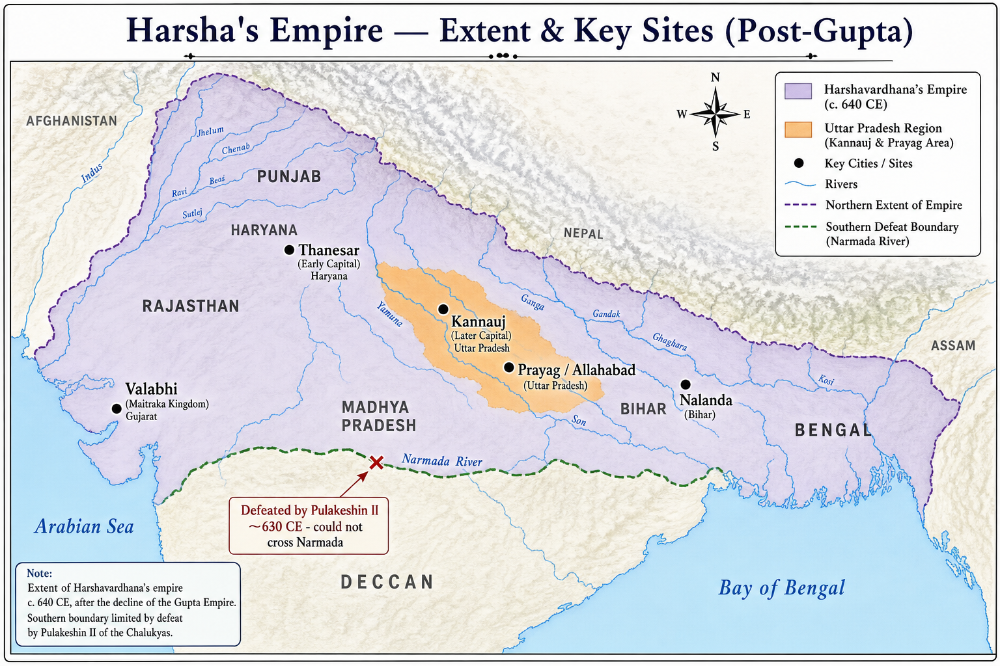

# Topic 10 — Post-Gupta Period
### ★ Complete Source of Truth — No other book/notes needed for this topic

> **Covers syllabus:** Post-Gupta Age | Harshavardhana | Administration of Harsha | Policies of Harshavardhana | Banabhatta | Harshacharita | Hiuen Tsang  
> **Sources baked in:** NCERT *Themes in Indian History* I (Ch 7–8), RS Sharma, Bana's *Harshacharita*, Hiuen Tsang's *Si-Yu-Ki*, Aihole inscription (Pulakeshin II), UPPCS/UPSC PYQs  
> **Exam weight:** ★★ Medium-High — Hiuen Tsang chronology (2024 Q149), Harsha–Pulakeshin trap, Kannauj capital, Bana–Harshacharita matching  
> **Last verified:** July 2026

---

## Quick Revision Box — Raata This First

```
POST-GUPTA AGE (~550–647 CE):
  Gupta collapse ~mid-6th c. CE | Hun invasions (Toramana, Mihirakula)
  Regional kingdoms: Maukharis (Kannauj), Pushyabhutis (Thanesar), Maitrakas (Valabhi)
  No pan-Indian empire until Harsha briefly reunites north India

HARSHAVARDHANA (606–647 CE) — LAST GREAT ANCIENT NORTH INDIAN RULER:
  Pushyabhuti dynasty of Thanesar (Haryana)
  Father: Prabhakaravardhana | Mother: Yasomati
  Brother: Rajyavardhana (killed by Gauda king Shashanka)
  Sister: Rajyashri (Maukhari queen, imprisoned by Shashanka)
  Harsha avenged Rajyavardhana → conquered Kannauj → united Thanesar + Kannauj
  Capital: Thanesar (early) → Kannauj (later) ← UP exam trap

POLICIES & LIMITS:
  Digvijaya (conquest) across north India, Bengal, Gujarat
  Defeated by Pulakeshin II (Chalukya) ~630 CE — Narmada = southern boundary
  Aihole inscription: Pulakeshin "drove back Harsha who descended like Ganga"
  Buddhist patron — Kannauj assembly 643 CE (Hiuen Tsang account)
  Tax relief in famine; wanted to give all revenue to charity (Bana)

ADMINISTRATION:
  Continued Gupta-Mauryan bureaucratic titles
  Mahasandhivigrahika (foreign minister) | Uparika (provincial governor)
  Feudatory system — samanta-like subordinates
  Less centralized than Mauryas; land grants to Brahmans continued

SOURCES FOR HARSHA:
  Banabhatta — court poet | Harshacharita (Sanskrit prose biography)
  Hiuen Tsang (Xuanzang) — Si-Yu-Ki / Buddhist Records of Western World
  Banskhera + Madhuban copper plate inscriptions

HIUEN TSANG (★★★ 2024 Q149):
  Chinese Buddhist pilgrim | India visit 630–644 CE
  Studied at Nalanda under Shilabhadra | 8 years in Harsha's realm
  2024 Q149 order: Fa-Hien (4) → Hiuen Tsang (3) → I-Tsing (1) → Al-Biruni (2) = B
  Trap: Fa-Hien = Gupta/Chandragupta II era — NOT Harsha

UP FOCUS:
  Kannauj = Harsha's later capital (modern UP)
  Prayag (Allahabad) — assemblies, charity
  Shravasti region — Banabhatta's home (Pritikuta)
  Thanesar = Haryana (NOT UP) — early Harsha capital
```

### Must-Know Term Comparisons (very frequently asked)

| Term | One-line difference | Hindi |
|------|---------------------|-------|
| **Post-Gupta vs Gupta** | Post-Gupta = fragmentation after Gupta fall (~550 CE); Gupta = imperial golden age (~320–550 CE) | उत्तर-गुप्त / गुप्त |
| **Harsha vs Chandragupta II** | Harsha = 7th c. Pushyabhuti ruler of Kannauj; Chandragupta II = 4th c. Gupta Vikramaditya | हर्ष / चंद्रगुप्त द्वितीय |
| **Thanesar vs Kannauj** | Thanesar = Harsha's early capital (Haryana); Kannauj = later imperial capital (UP) | थanesar / कन्नौज |
| **Banabhatta vs Kalidasa** | Bana = Sanskrit prose (*Harshacharita*, *Kadambari*); Kalidasa = Sanskrit poetry/drama (Gupta era) | बाणभट्ट / कालिदास |
| **Harshacharita vs Si-Yu-Ki** | Harshacharita = Bana's Sanskrit kavya on Harsha; Si-Yu-Ki = Hiuen Tsang's Chinese travel account | हर्षचरित / सी-यू-की |
| **Fa-Hien vs Hiuen Tsang** | Fa-Hien (~399–414 CE) = Gupta period; Hiuen Tsang (~630s CE) = Harsha period | फाह्यान / ह्वेन त्सांग |
| **Pulakeshin II vs Harsha** | Pulakeshin II = Chalukya king who stopped Harsha at Narmada; Harsha = north Indian conqueror | पुलकेशिन द्वितीय / हर्ष |
| **Maukhari vs Pushyabhuti** | Maukhari = Kannauj kingdom (Grihavarman); Pushyabhuti = Thanesar dynasty (Harsha's family) | मौखरी / पुष्यभूति |
| **Shashanka vs Pulakeshin** | Shashanka = Gauda (Bengal) king who killed Rajyavardhana; Pulakeshin = Deccan barrier to Harsha | शशांक / पुलकेशिन |
| **Hiuen Tsang vs I-Tsing** | Hiuen Tsang = 7th c., Harsha's court; I-Tsing = late 7th c., after Harsha, Nalanda student | ह्वेन त्सांग / इ-त्सिंग |

### Memory Tricks

| Trick | Remembers |
|-------|-----------|
| **606 Harsha** | Harsha ascended ~606 CE after Rajyavardhana's death |
| **647 End** | Harsha died ~647 CE — empire fragmented immediately |
| **2024 B 4312** | Traveller order: Fa-Hien → Hiuen Tsang → I-Tsing → Al-Biruni |
| **Narmada = No further** | Pulakeshin II stopped Harsha at Narmada |
| **Bana = Biography** | Banabhatta wrote Harshacharita |
| **Si-Yu = Seen India** | Hiuen Tsang's travel record Si-Yu-Ki |
| **Thanesar then Kannauj** | Capital shift Haryana → UP |
| **Shashanka = Sister's enemy** | Killed brother, imprisoned sister Rajyashri |
| **2018 Q16 trap** | Hathigumpha = Kharavela, NOT Harsha |
| **8 years Xuanzang** | Hiuen Tsang spent ~8 years under Harsha |

---

## Exam Visuals — High-ROI Images

> **Type priority:** location map → conceptual diagram. Images stored locally (`images/`) so they open offline.

### 1. Harsha's Empire — Extent & Key Sites Map



*Raata **capital ↔ location**: **Thanesar = Haryana** (early); **Kannauj = UP** (later capital). **Narmada** = southern limit — **Pulakeshin II** defeated Harsha (~630 CE, Aihole inscription). **Nalanda** = Hiuen Tsang studied here. **Prayag** = assemblies/charity.*
*Source: Study map — generated for UPPCS location-matching*

---

## 10.1 Post-Gupta Age

### Definitions (learn all — exams pick different ones)

| Term | Meaning |
|------|---------|
| **Post-Gupta Age** | Period after Gupta imperial collapse (~mid-6th century CE) till Harsha's death (647 CE) — political fragmentation then brief reunification |
| **Maukhari Dynasty** | Ruling house of **Kannauj** before Harsha — Grihavarman married Harsha's sister Rajyashri |
| **Pushyabhuti Dynasty** | Ruling family of **Thanesar** (Haryana) — Harshavardhana's dynasty |

### Post-Gupta Age — How It Works

- **Gupta empire weakened** in 6th century CE — **Hun invasions** (Toramana, Mihirakula) and internal feudatory revolts broke central control.
- **Last great Gupta rulers** (Budhagupta, Vishnugupta) could not hold full empire — **regional kingdoms** emerged independently.
- **North India fragmented** into: **Maukharis (Kannauj)**, **Pushyabhutis (Thanesar)**, **Maitrakas (Valabhi, Gujarat)**, **Gaudas (Bengal)**, later **Chalukyas (Deccan)**.
- **No pan-Indian empire** existed between Gupta collapse and **Harshavardhana's rise (~606 CE)**.
- **Economic continuity** — guild trade, Buddhist monasteries (Nalanda peak), land-grant economy continued from Gupta era.
- **Cultural transition** — Gupta art/literature traditions persisted; **Bana's prose kavya** and **Hiuen Tsang's records** mark literary high point of post-Gupta phase.
- **Religious landscape** — Buddhism still patronized by rulers; Hindu Puranic traditions expanding; Jainism active in west/south.
- **Political cause of Harsha's rise** — assassination of **Rajyavardhana** by **Shashanka (Gauda)** created vacuum Harsha filled through military revenge and Kannauj annexation.
- **Harsha's death (647 CE)** ended last ancient pan-north-Indian empire — **immediate fragmentation** followed; no successor unified Kannauj empire.
- **Historical significance** — bridge between **Gupta golden age** and **medieval regional kingdoms** (Pratiharas, Palas, Rashtrakutas later fought over Kannauj).

### Post-Gupta Regional Kingdoms — Table

| Kingdom | Region | Ruler (relevant) | Link to Harsha |
|---------|--------|------------------|----------------|
| **Pushyabhuti** | Thanesar (Haryana) | Prabhakaravardhana → Harsha | Harsha's own dynasty |
| **Maukhari** | Kannauj (UP) | Grihavarman | Rajyashri's husband; kingdom merged |
| **Gauda** | Bengal | Shashanka | Killed Rajyavardhana; Harsha's enemy |
| **Maitraka** | Valabhi (Gujarat) | Dhruvasena II | Harsha's ally (married sister to him) |
| **Chalukya** | Deccan (Badami) | Pulakeshin II | Defeated Harsha at Narmada |

> **Exam note:** Post-Gupta ≠ immediately Harsha — there was a **fragmented interregnum** after Gupta fall. Trap: "Harsha was a Gupta ruler" — FALSE (Pushyabhuti dynasty).

### Exam Facts (raata)

- Gupta collapse ~550 CE
- Hun invasions weakened Guptas
- Regional kingdoms: Maukhari, Pushyabhuti, Maitraka, Gauda
- Harsha reunified north India ~606 CE
- Harsha died 647 CE — empire ended
- Bridge Gupta age → medieval regional states
- Nalanda flourished in post-Gupta period
- Land-grant economy continued

### PYQs — Post-Gupta Age

1. **(UPPCS Prelims 2024, Q149)** Arrange foreign travellers: 1. I-Tsing  2. Al-Biruni  3. Hiuen Tsang  4. Fa-Hien  
   → **B — 4, 3, 1, 2** (Fa-Hien = Gupta/post-Gupta transition; Hiuen Tsang = Harsha era — chronological anchor for this period).

2. **(UPSC pattern)** Which period followed the decline of Gupta imperial power before Harsha's unification?  
   → **Political fragmentation with regional kingdoms (Maukhari, Pushyabhuti, etc.).**

### Examples (10.1)

| Example | Detail |
|---------|--------|
| **Maukhari–Pushyabhuti merger** | Harsha united Thanesar + Kannauj kingdoms |
| **647 CE fragmentation** | No successor held Harsha's empire |
| **2024 Q149** | Hiuen Tsang dates post-Gupta/Harsha phase |

---

## 10.2 Harshavardhana

### Definitions (learn all — exams pick different ones)

| Term | Meaning |
|------|---------|
| **Harshavardhana** | Pushyabhuti ruler (r. ~606–647 CE) who briefly unified much of north India; last great ancient emperor of the north |
| **Rajyavardhana** | Harsha's elder brother — killed by **Shashanka of Gauda** |
| **Rajyashri** | Harsha's sister — married Maukhari king **Grihavarman**; imprisoned by Shashanka |

### Harshavardhana — How It Works

- **Harshavardhana** belonged to **Pushyabhuti dynasty** of **Thanesar** (modern Haryana, near Kurukshetra).
- **Father Prabhakaravardhana** and mother **Yasomati** — Prabhakaravardhana assumed imperial titles before death.
- **606 CE** — Harsha ascended after elder brother **Rajyavardhana** was treacherously killed by **Shashanka** (Gauda/Bengal king).
- **Sister Rajyashri** — married **Grihavarman** (Maukhari king of Kannauj); after Grihavarman's death, Shashanka imprisoned her — Harsha rescued her.
- **Military campaigns** — defeated Shashanka (partially; Shashanka's death later removed Bengal threat), conquered **Kannauj**, extended control over **Punjab, UP, Bihar, Bengal, Odisha, Gujarat** regions.
- **Capital shift** — early rule from **Thanesar**; later **Kannauj** became principal imperial capital.
- **Titles** — **Paramabhattaraka**, **Maharajadhiraja**, **Siladitya** (used in some records).
- **Religious profile** — early Shiva devotee (Yasomati's influence); later strong **Buddhist patron** under Hiuen Tsang's influence; tolerant of multiple faiths.
- **Death ~647 CE** — without heir; empire disintegrated; **Arunashva** (brief successor) could not hold unity.
- **Historical assessment** — **last pan-north-Indian ruler of ancient period**; medieval tripartite struggle for Kannauj followed centuries later.

### Harsha Family & Succession — Table

| Person | Role |
|--------|------|
| **Prabhakaravardhana** | Father; Pushyabhuti king of Thanesar |
| **Yasomati** | Mother |
| **Rajyavardhana** | Elder brother; killed by Shashanka |
| **Harshavardhana** | Ruler 606–647 CE |
| **Rajyashri** | Sister; Maukhari queen |
| **Shashanka** | Gauda enemy who killed Rajyavardhana |

> **Exam note:** **2018 Q16 trap** — Hathigumpha inscription = **Kharavela** (centuries earlier), NOT Harshavardhan. Harsha has **Banskhera/Madhuban copper plates** and **Bana/Hiuen Tsang** as sources.

### Exam Facts (raata)

- Pushyabhuti dynasty, Thanesar
- Ruled ~606–647 CE
- Brother Rajyavardhana killed by Shashanka
- Sister Rajyashri — Maukhari queen
- United Thanesar + Kannauj
- Capital: Thanesar → Kannauj
- Last great ancient north Indian emperor
- Died 647 CE without stable successor

### PYQs — Harshavardhana

1. **(UPPCS Prelims 2018, Q16)** Hathigumpha inscription source for which king?  
   A. Kharvela  B. Ashok  C. Harshavardhan  D. Kanishka  
   → **A — Kharavela.** Option C is deliberate trap — Harsha is NOT Hathigumpha king.

2. **(UPSC pattern)** Who was the last great Hindu emperor of ancient India who ruled from Kannauj?  
   → **Harshavardhana.**

### Examples (10.2)

| Example | Detail |
|---------|--------|
| **606 CE accession** | After Rajyavardhana's assassination |
| **Kannauj capital** | Modern UP — exam location trap |
| **2018 Q16** | Harsha listed as wrong Hathigumpha option |

---

## 10.3 Administration of Harsha

### Definitions (learn all — exams pick different ones)

| Term | Meaning |
|------|---------|
| **Mahasandhivigrahika** | Chief minister for foreign affairs / war-and-peace — continued Gupta-era title |
| **Uparika** | Provincial governor over large territorial divisions |
| **Bhandagaradhikarana** | Treasury/finance department |

### Administration of Harsha — How It Works

- Harsha's administration **inherited Gupta bureaucratic structure** — not as centralized as Mauryas but more organized than contemporary regional kings.
- **King** remained supreme — personal supervision of major policy; Hiuen Tsang notes Harsha's **accessibility to officials** and subjects.
- **Provincial governance** — empire divided into large units under **Uparikas** (governors) — feudatory kings also administered sub-regions.
- **Mahasandhivigrahika** — handled diplomacy and military alliances (e.g., with Maitrakas of Valabhi against common enemies).
- **Treasury (Bhandagaradhikarana)** — revenue from land tax, trade tolls, feudatory tribute; Harsha considered donating **entire revenue** for charity (per Bana).
- **Feudatory system** — subordinate rulers (samanta-type) acknowledged Harsha's overlordship — **less direct control** than Mauryan rajukas.
- **Land grants** — Brahmanical agrahara grants continued — local autonomy in granted villages.
- **Judicial administration** — king as highest court; Hiuen Tsang praised **relative fairness** and road safety in Harsha's realm.
- **Army organization** — large standing force with war elephants (Hiuen Tsang mentions **30,000+ elephants** in imperial array — likely exaggeration but indicates military might).
- **Local administration** — village headmen (gramika-type officials) managed rural affairs under higher officials.
- **Administrative weakness** — empire depended heavily on **Harsha's personal charisma** — collapsed quickly after his death showing **institutional fragility**.

### Harsha's Key Officials — Table

| Office | Function |
|--------|----------|
| **Mahasandhivigrahika** | Foreign relations, treaties, war policy |
| **Uparika** | Provincial governor |
| **Rajasthaniya** | Royal herald / court protocol officer |
| **Bhandagaradhikarana** | Treasury and revenue accounts |
| **Mahapratihara** | Palace guard chief / chamberlain |

> **Exam note:** Trap — "Harsha invented entirely new administrative system" — FALSE; he **continued Gupta titles** (Uparika, Sandhivigrahika). Compare Mauryan **Rajuka** separately.

### Exam Facts (raata)

- Continued Gupta administrative titles
- Uparika = provincial governor
- Mahasandhivigrahika = foreign minister
- Feudatory samanta-type subordinates
- Treasury = Bhandagaradhikarana
- Land grants to Brahmans continued
- Hiuen Tsang praised road safety
- Empire collapsed after Harsha's death — personal rule weakness

### PYQs — Administration of Harsha

1. **(UPPCS Prelims 2024, Q149)** Hiuen Tsang visited during whose administrative era?  
   → **Harshavardhana's** — his *Si-Yu-Ki* describes Harsha's governance, charity, and official accessibility.

2. **(UPSC pattern)** Which Gupta-era provincial title continued under Harsha for governors?  
   → **Uparika.**

### Examples (10.3)

| Example | Detail |
|---------|--------|
| **Uparika system** | Provincial divisions under governors |
| **Hiuen Tsang account** | Praised Harsha's benevolent administration |
| **647 CE collapse** | Shows over-reliance on personal rule |

---

## 10.4 Policies of Harshavardhana

### Definitions (learn all — exams pick different ones)

| Term | Meaning |
|------|---------|
| **Digvijaya** | Policy of military conquest/subjugation of neighboring kings — Harsha pursued this across north India |
| **Aihole Inscription** | Chalukya record of **Pulakeshin II** claiming victory over Harsha who tried to cross the Narmada |
| **Kannauj Assembly (643 CE)** | Religious gathering convened by Harsha — described by Hiuen Tsang |

### Policies of Harshavardhana — How It Works

- **Expansionist policy** — Harsha undertook **digvijaya** to avenge family enemies and build empire after 606 CE.
- **Shashanka campaign** — primary early goal; weakened Gauda power in Bengal/eastern regions (Shashanka died ~637 CE).
- **Western campaigns** — extended influence into **Punjab, Rajasthan, Gujarat** (allied with Maitrakas through marriage diplomacy).
- **Southern limit** — attempted Deccan expansion but **Pulakeshin II (Chalukya)** defeated him **~630 CE** near **Narmada**.
- **Aihole inscription** — Pulakeshin boasted Harsha "descended from Himalayas like Ganga but was driven back" — **Narmada became effective southern boundary**.
- **Buddhist patronage** — built stupas/viharas; convened **Kannauj religious assembly (643 CE)** — scholars of Mahayana, Hinayana, Hinduism, Jainism invited (per Chinese account).
- **Charity policy** — distributed wealth every 5 years at **Prayag** assemblies; Hiuen Tsang witnessed massive alms-giving.
- **Tax relief** — remitted taxes during drought/famine — populist welfare measure noted by Bana and Hiuen Tsang.
- **Diplomatic marriages** — sister **Rajyasri** married **Dhruvasena II (Maitraka)** to secure western alliance.
- **Religious tolerance** — though Buddhist patron, did not suppress Hindu/Jain worship; personal shift from Shaivism to Buddhism over reign.
- **Policy failure** — could not permanently conquer Deccan or Bengal fully — empire remained **north-centric** with porous southern/eastern frontiers.

### Harsha's Military High & Low Points

| Event | Outcome |
|-------|---------|
| Campaign vs Shashanka | Avenged Rajyavardhana; weakened Gauda |
| Kannauj annexation | United Maukhari + Pushyabhuti territories |
| Narmada campaign vs Pulakeshin II | **Defeat** — southern expansion blocked |
| Eastern Odisha/Kalinga campaigns | Partial success — feudatories established |

> **Exam note:** **Pulakeshin II vs Harsha** is the most-tested policy trap — Harsha did NOT conquer Deccan. **Narmada = limit**. Do not confuse with **Battle of Kannauj (1540 CE)** — Sher Shah vs Humayun (medieval).

### Exam Facts (raata)

- Digvijaya expansion policy
- Avenged Rajyavardhana vs Shashanka
- Defeated by Pulakeshin II at Narmada (~630 CE)
- Aihole inscription records Chalukya victory
- Kannauj assembly 643 CE
- Prayag charity every 5 years
- Buddhist patronage under Harsha
- Tax relief during famine

### PYQs — Policies of Harshavardhana

1. **(UPSC pattern)** Who stopped Harshavardhana's southward expansion at the Narmada?  
   → **Pulakeshin II (Chalukya)** — confirmed by Aihole inscription.

2. **(UPPCS Prelims 2024, Q149)** Hiuen Tsang attended Harsha's assembly at:  
   → **Kannauj (643 CE)** — within Harsha's policy of Buddhist patronage and religious debate.

### Examples (10.4)

| Example | Detail |
|---------|--------|
| **Aihole inscription** | Pulakeshin II victory over Harsha |
| **643 CE Kannauj assembly** | Multi-religious convocation |
| **Prayag charity** | Hiuen Tsang eyewitness account |

---

## 10.5 Banabhatta

### Definitions (learn all — exams pick different ones)

| Term | Meaning |
|------|---------|
| **Banabhatta (Bana)** | Sanskrit poet and **court biographer** of Harshavardhana — pioneer of Sanskrit prose kavya |
| **Pritikuta** | Bana's home region near **Shravasti** (eastern UP) — mentioned in *Harshacharita* |

### Banabhatta — How It Works

- **Banabhatta** (c. 7th century CE) was **Harsha's court poet** (Asthana kavi) and **Brahmin scholar**.
- Born in **Pritikuta** village near **Shravasti** (Uttar Pradesh) — family had Vedic scholarly tradition.
- Father **Chitrabhanu** and mother **Rajadevi** — Bana initially lived as wandering scholar before Harsha's patronage.
- **Harsha discovered Bana** through reputation — appointed him court poet; Bana became chief literary figure of reign.
- **Literary pioneer** — developed **Sanskrit prose kavya** (ornate prose romance/biography) as major genre distinct from Gupta poetry.
- **Two major works**: ***Harshacharita*** (Harsha's biography) and ***Kadambari*** (romance novel).
- **Historical value** — despite poetic exaggeration, *Harshacharita* provides **earliest detailed Sanskrit narrative** of Harsha's family, accession, and campaigns.
- **Style** — long compound sentences, vivid imagery, embedded sub-stories — influenced later Sanskrit prose writers.
- **Relationship with Harsha** — Bana portrays Harsha as ideal monarch; also records court life, ministers, and military events.
- **Death** — Bana died before completing *Kadambari*; son **Bhushanabhatti** (or Pulinda) completed it per tradition.

> **Exam note:** Trap — "Kalidasa was Harsha's court poet" — FALSE. **Kalidasa = Gupta (Chandragupta II)**; **Bana = Harsha**.

### Bana vs Other Authors — Table

| Author | Patron | Major Work |
|--------|--------|------------|
| **Banabhatta** | Harshavardhana | *Harshacharita*, *Kadambari* |
| **Kalidasa** | Chandragupta II (Gupta) | *Abhijnanashakuntalam*, *Meghaduta* |
| **Hiuen Tsang** | (Chinese pilgrim, not court poet) | *Si-Yu-Ki* |

### Exam Facts (raata)

- Harsha's court poet
- From Pritikuta near Shravasti (UP)
- Pioneer of Sanskrit prose kavya
- Wrote Harshacharita + Kadambari
- Kadambari completed by Bhushanabhatti
- Brahmin scholar background
- Not same era as Kalidasa

### PYQs — Banabhatta

1. **(UPSC pattern)** Who was the court poet of Harshavardhana who wrote his biography?  
   → **Banabhatta (Bana).**

2. **(UPSC pattern)** Banabhatta belonged to which region?  
   → **Pritikuta near Shravasti (eastern UP).**

### Examples (10.5)

| Example | Detail |
|---------|--------|
| **Court appointment** | Harsha patronized Bana as Asthana kavi |
| **Shravasti connection** | UP link via Bana's birthplace |
| **Prose kavya pioneer** | New Sanskrit literary form |

---

## 10.6 Harshacharita

### Definitions (learn all — exams pick different ones)

| Term | Meaning |
|------|---------|
| **Harshacharita** | Sanskrit prose **kavya** by Banabhatta narrating Harshavardhana's genealogy, accession, and early campaigns |
| **Kadambari** | Bana's romantic prose novel — parallel literary work, not strict history |

### Harshacharita — How It Works

- ***Harshacharita*** (Deeds of Harsha) is **Banabhatta's biography-cum-kavya** of Harshavardhana — composed in **Sanskrit prose**.
- Structured in **eight ucchvasas (kandas/chapters)** — only **first four** contain reliably historical narrative; later chapters incomplete or more fanciful.
- **Book I (Ucchvasa 1)** — Bana's own autobiography and family background — rare author self-introduction in Sanskrit literature.
- **Genealogy** — traces Pushyabhuti lineage from ancestors to Prabhakaravardhana.
- **Rajyavardhana's death** — narrates Shashanka's treachery and Harsha's grief — key source for succession crisis.
- **Harsha's accession** — describes military preparations and early conquests with poetic embellishment.
- **Historical method** — mixes **fact + courtly exaggeration** — must be cross-checked with **Hiuen Tsang** and inscriptions.
- ***Kadambari*** — Bana's other masterpiece; **romance story** of Kadambari and Chandrapida — **not historical text** but exam-distinguished from Harshacharita.
- **Literary significance** — established **prose kavya** as prestigious genre; model for later biographical writings.
- **Preservation** — complete enough to be **primary Sanskrit source** on Harsha where inscriptions are sparse.

### Harshacharita vs Other Sources — Table

| Source | Type | Value for Harsha |
|--------|------|------------------|
| **Harshacharita** | Sanskrit prose kavya | Genealogy, accession, campaigns (poetic) |
| **Si-Yu-Ki (Hiuen Tsang)** | Chinese travelogue | Administration, religion, assemblies |
| **Banskhera/Madhuban plates** | Copper inscriptions | Grants, titles |
| **Aihole inscription** | Chalukya record | Harsha's defeat at Narmada |

> **Exam note:** *Harshacharita* = **Harsha's biography**; *Kadambari* = **romance novel** (same author Bana). Trap: "Harshacharita is a Gupta-period text" — it is **Harsha/Bana 7th century**.

### Exam Facts (raata)

- Written by Banabhatta
- Sanskrit prose kavya (biography)
- Eight ucchvasas — first four historically valuable
- Opens with Bana's autobiography
- Covers Rajyavardhana's death, Harsha's rise
- Cross-check with Hiuen Tsang
- Kadambari = romance (same author)
- Primary Sanskrit source on Harsha

### PYQs — Harshacharita

1. **(UPSC pattern)** *Harshacharita* describes the life of which ruler?  
   → **Harshavardhana.**

2. **(UPSC pattern)** Which work is Banabhatta's romantic prose novel (not biography)?  
   → **Kadambari.**

### Examples (10.6)

| Example | Detail |
|---------|--------|
| **Ucchvasa 1** | Bana's own life story |
| **Shashanka narrative** | Rajyavardhana assassination account |
| **Cross-verification** | Used with Si-Yu-Ki for Harsha history |

---

## 10.7 Hiuen Tsang

### Definitions (learn all — exams pick different ones)

| Term | Meaning |
|------|---------|
| **Hiuen Tsang (Xuanzang)** | Chinese Buddhist pilgrim who visited India **630–644 CE** during Harsha's reign |
| **Si-Yu-Ki** | *Records of the Western Regions* — Hiuen Tsang's account of India, Central Asia, Buddhism |
| **Shilabhadra** | Nalanda monastery head who taught Hiuen Tsang |

### Hiuen Tsang — How It Works

- **Hiuen Tsang** (Chinese: **Xuanzang**, ~602–664 CE) was a **Buddhist monk-scholar** from Tang China.
- Left China **629 CE** — traveled through Central Asia, reached **India 630 CE** (crossed Hindu Kush).
- Studied at **Nalanda Mahavihara** under **Shilabhadra** — stayed ~15 years total in India subcontinent.
- **Spent ~8 years in Harsha's dominions** — witnessed administration, assemblies, charity festivals.
- **Met Harshavardhana** at **Kannauj** — became close; Harsha honored him with royal escort and resources.
- **Kannauj assembly (643 CE)** — Hiuen Tsang recorded multi-religious debate convened by Harsha.
- **Prayag assembly** — described Harsha's **quinquennial charity** — distributed enormous wealth to Buddhist monks, Brahmans, Jains.
- ***Si-Yu-Ki* (Xiyu Ji)** — invaluable record of **Indian geography, monasteries, customs, politics** of 7th century.
- **Returned to China 645 CE** — translated Buddhist texts; emperor Taizong patronized his translation project.
- **Historical reliability** — generally accurate on institutions (Nalanda, Sarnath, Mathura); numbers sometimes exaggerated (army elephants, monastery students).
- **Chronology trap** — Hiuen Tsang = **Harsha era**; **Fa-Hien = Gupta (~400 CE)**; **I-Tsing = post-Harsha (~675 CE)**; **Al-Biruni = medieval (11th c.)**.

### Foreign Travellers Chronology — Table

| Traveller | Period | Ruler/Era | Key Text |
|-----------|--------|-----------|----------|
| **Fa-Hien** | ~399–414 CE | Chandragupta II (Gupta) | *Fo Guo Ji* |
| **Hiuen Tsang** | ~630–644 CE | Harshavardhana | *Si-Yu-Ki* |
| **I-Tsing** | ~671–695 CE | Post-Harsha | *Memoirs of Eminent Monks* |
| **Al-Biruni** | ~1017–1030 CE | Mahmud Ghazni | *Kitab-ul-Hind* |

> **Exam note:** **UPPCS 2024 Q149 = B (4, 3, 1, 2)** — Fa-Hien earliest, then Hiuen Tsang, I-Tsing, Al-Biruni last. Memory: **"FHIA" → 4-3-1-2**.

### Exam Facts (raata)

- Chinese Buddhist pilgrim
- India visit 630–644 CE
- Studied at Nalanda under Shilabhadra
- 8 years in Harsha's realm
- Si-Yu-Ki = main account
- Kannauj assembly 643 CE eyewitness
- Prayag charity description
- 2024 Q149 chronology: 4,3,1,2
- NOT same period as Fa-Hien

### PYQs — Hiuen Tsang

1. **(UPPCS Prelims 2024, Q149)** Arrange in ascending chronological order: 1. I-Tsing  2. Al-Biruni  3. Huentsang (Hiuen Tsang)  4. Fahyan (Fa-Hien)  
   → **B — 4, 3, 1, 2** (Fa-Hien → Hiuen Tsang → I-Tsing → Al-Biruni).

2. **(UPPCS Prelims 2018, Q16)** Hathigumpha inscription — Harshavardhan option:  
   → **Wrong option C** — confirms Harsha is NOT associated with Hathigumpha (Kharavela is correct).

### Examples (10.7)

| Example | Detail |
|---------|--------|
| **2024 Q149** | Traveller chronology — Hiuen Tsang after Fa-Hien |
| **Nalanda study** | 15 years in India; Shilabhadra as teacher |
| **Kannauj 643 CE** | Assembly recorded in Si-Yu-Ki |

---

## Consolidated Reference — Everything in One Place

### Important Dates — Post-Gupta & Harsha

| Date / Period | Event |
|---------------|-------|
| **~550 CE** | Gupta imperial collapse accelerates |
| **~606 CE** | Harshavardhana ascends after Rajyavardhana's death |
| **~630 CE** | Pulakeshin II defeats Harsha at Narmada |
| **~637 CE** | Death of Shashanka (Gauda) |
| **643 CE** | Kannauj religious assembly (Hiuen Tsang) |
| **~647 CE** | Death of Harshavardhana — empire fragments |
| **630–644 CE** | Hiuen Tsang's stay in India |

### Sources on Harsha — Complete List

| Source | Author | Type |
|--------|--------|------|
| **Harshacharita** | Banabhatta | Sanskrit prose biography |
| **Kadambari** | Banabhatta | Sanskrit prose romance |
| **Si-Yu-Ki** | Hiuen Tsang | Chinese travelogue |
| **Banskhera copper plate** | — | Land grant inscription |
| **Madhuban copper plate** | — | Land grant inscription |
| **Aihole inscription** | Pulakeshin II | Enemy account of Harsha's defeat |

### Harsha's Officials & Titles

| Term | Meaning |
|------|---------|
| **Paramabhattaraka** | Supreme overlord title |
| **Maharajadhiraja** | King of kings |
| **Mahasandhivigrahika** | Foreign minister |
| **Uparika** | Provincial governor |

### UP Focus — Post-Gupta Period

| Element | Detail |
|---------|--------|
| **Kannauj** | Harsha's later imperial capital — modern UP |
| **Prayag (Prayagraj)** | Charity assemblies; Hiuen Tsang witness |
| **Shravasti region** | Banabhatta's Pritikuta birthplace |
| **Thanesar** | Early Harsha capital — **Haryana, NOT UP** |
| **Nalanda** | Hiuen Tsang studied here (Bihar, border of Harsha's influence) |

### Foreign Travellers — Exam Chronology Card

| Order | Traveller | Century | Era |
|-------|-----------|---------|-----|
| 1st | **Fa-Hien** | 5th CE | Gupta |
| 2nd | **Hiuen Tsang** | 7th CE | Harsha |
| 3rd | **I-Tsing** | 7th CE | Post-Harsha |
| 4th | **Al-Biruni** | 11th CE | Medieval |

---

## Practice Zone — UPPCS Format Questions

**1.** Consider the following about the Post-Gupta age:
1. The Gupta empire collapsed abruptly in the 3rd century CE.
2. Regional kingdoms like Maukharis and Pushyabhutis emerged before Harsha's unification.

<details><summary>Answer</summary>
**Only 2 correct.** Gupta collapse was ~6th century CE, not 3rd.
</details>

**2.** Who killed Harsha's elder brother Rajyavardhana?

<details><summary>Answer</summary>
**Shashanka (Gauda king of Bengal).**
</details>

**3.** Assertion (A): Harsha's capital was always Kannauj from the start of his reign.
Reason (R): Harsha initially ruled from Thanesar before shifting to Kannauj.

<details><summary>Answer</summary>
**A false, R true.**
</details>

**4.** Match:
1. Banabhatta  a. Si-Yu-Ki
2. Hiuen Tsang  b. Harshacharita
3. Pulakeshin II  c. Aihole inscription

<details><summary>Answer</summary>
**1-b, 2-a, 3-c.**
</details>

**5.** Consider:
1. Hiuen Tsang visited India during Harsha's reign.
2. Fa-Hien visited India during Harsha's reign.

<details><summary>Answer</summary>
**Only 1 correct.** Fa-Hien = Gupta era (~400 CE).
</details>

**6.** Harsha's southern expansion was stopped at which river?

<details><summary>Answer</summary>
**Narmada** (by Pulakeshin II).
</details>

**7.** Which is NOT correctly matched?
A. Harshacharita — Banabhatta
B. Si-Yu-Ki — Hiuen Tsang
C. Hathigumpha — Harshavardhana
D. Aihole inscription — Pulakeshin II

<details><summary>Answer</summary>
**C** — Hathigumpha = Kharavela (2018 Q16 trap).
</details>

**8.** Arrange chronologically:
A. Gupta collapse  B. Harsha's accession  C. Hiuen Tsang's arrival

<details><summary>Answer</summary>
**Gupta collapse → Harsha's accession (606) → Hiuen Tsang (630).**
</details>

**9.** Consider about Harsha's administration:
1. Uparika was a provincial governor.
2. Harsha created entirely new offices unknown to Guptas.

<details><summary>Answer</summary>
**Only 1 correct.** Harsha continued Gupta titles.
</details>

**10.** Kannauj assembly of 643 CE is associated with:

<details><summary>Answer</summary>
**Harsha and Hiuen Tsang's account.**
</details>

**11.** Assertion (A): Harsha was the last great ruler to unify much of north India in the ancient period.
Reason (R): After his death in 647 CE, no ancient ruler rebuilt a similar pan-north-Indian empire.

<details><summary>Answer</summary>
**Both true; R explains A.**
</details>

**12.** Banabhatta was born near:

<details><summary>Answer</summary>
**Shravasti (Pritikuta) — eastern UP.**
</details>

**13.** Consider traveller chronology (2024 Q149 pattern):
1. Fa-Hien came before Hiuen Tsang.
2. Al-Biruni came before I-Tsing.

<details><summary>Answer</summary>
**Only 1 correct.** Al-Biruni (11th c.) came after I-Tsing (7th c.).
</details>

**14.** Which work is a romance novel, not biography?

<details><summary>Answer</summary>
**Kadambari** (by Banabhatta).
</details>

**15.** Harsha's father was:

<details><summary>Answer</summary>
**Prabhakaravardhana (Pushyabhuti king of Thanesar).**
</details>

**16.** Consider:
1. Nalanda flourished during Harsha's period.
2. Hiuen Tsang studied at Nalanda under Shilabhadra.

<details><summary>Answer</summary>
**Both correct.**
</details>

**17.** Pulakeshin II belonged to which dynasty?

<details><summary>Answer</summary>
**Chalukya (Badami).**
</details>

**18.** Which capital is in modern Uttar Pradesh?

<details><summary>Answer</summary>
**Kannauj** (Thanesar is in Haryana).
</details>

**19.** Assertion (A): Bana and Kalidasa were contemporaries at Harsha's court.
Reason (R): Kalidasa belonged to the earlier Gupta period.

<details><summary>Answer</summary>
**A false, R true.**
</details>

**20.** Harsha's policy of quinquennial charity is described at:

<details><summary>Answer</summary>
**Prayag assemblies (Hiuen Tsang).**
</details>

**21.** Consider Post-Gupta kingdoms:
1. Maukharis ruled from Kannauj.
2. Pushyabhutis ruled from Thanesar.

<details><summary>Answer</summary>
**Both correct.**
</details>

**22.** How many ucchvasas of Harshacharita have major historical value?

<details><summary>Answer</summary>
**First four (of eight).**
</details>

**23.** I-Tsing visited India:

<details><summary>Answer</summary>
**After Harsha's death (~671 CE onwards).**
</details>

**24.** Consider:
1. Harsha patronized Buddhism in later reign.
2. Harsha suppressed Hinduism completely.

<details><summary>Answer</summary>
**Only 1 correct.** Harsha was tolerant; did not suppress Hinduism.
</details>

**25.** 2024 Q149 correct order of travellers:

<details><summary>Answer</summary>
**B — 4, 3, 1, 2** (Fa-Hien, Hiuen Tsang, I-Tsing, Al-Biruni).
</details>

**26.** Assertion (A): Aihole inscription glorifies Harsha's Deccan conquest.
Reason (R): Pulakeshin II claimed to have repulsed Harsha at the Narmada.

<details><summary>Answer</summary>
**A false, R true.**
</details>

**27.** Rajyashri was:

<details><summary>Answer</summary>
**Harsha's sister; Maukhari queen imprisoned by Shashanka.**
</details>

**28.** Consider administration:
1. Mahasandhivigrahika handled foreign affairs.
2. Bhandagaradhikarana was the treasury.

<details><summary>Answer</summary>
**Both correct.**
</details>

**29.** Hiuen Tsang's account of India is called:

<details><summary>Answer</summary>
**Si-Yu-Ki (Records of Western Regions).**
</details>

**30.** Which event happened last?

<details><summary>Answer</summary>
**Harsha's death (~647 CE)** — after Kannauj assembly (643) and Hiuen Tsang's departure (644).
</details>

**31.** Consider UP-specific:
1. Kannauj was Harsha's imperial capital in UP.
2. Thanesar is located in Uttar Pradesh.

<details><summary>Answer</summary>
**Only 1 correct.** Thanesar = Haryana.
</details>

**32.** Who completed Banabhatta's *Kadambari*?

<details><summary>Answer</summary>
**Bhushanabhatti (son/tradition).**
</details>

---

## Complete PYQ Bank (Topic 10)

### UPPCS Prelims 2024

**Q149.** Arrange foreign travellers chronologically: 1. I-Tsing  2. Al-Biruni  3. Huentsang (Hiuen Tsang)  4. Fahyan (Fa-Hien)

<details><summary>Answer</summary>
**B — 4, 3, 1, 2** (Fa-Hien → Hiuen Tsang → I-Tsing → Al-Biruni).
</details>

### UPPCS Prelims 2018

**Q16.** Hathigumpha inscription — information about which king?  
A. Kharvela  B. Ashok  C. Harshavardhan  D. Kanishka

<details><summary>Answer</summary>
**A — Kharavela.** Harshavardhan (C) is trap option.
</details>

### UPSC Pattern (Concept Overlap)

**Pattern — Last ancient north Indian emperor:** Harshavardhana from Kannauj.

**Pattern — Narmada barrier:** Pulakeshin II stopped Harsha.

**Pattern — Bana's works:** Harshacharita = biography; Kadambari = romance.

---

## Common Traps — Don't Fall For These

1. **2024 Q149 = B (4,3,1,2)** — Fa-Hien earliest; Al-Biruni latest.
2. **2018 Q16 Hathigumpha = Kharavela** — NOT Harshavardhan (option C trap).
3. **Fa-Hien ≠ Harsha era** — Fa-Hien = Gupta/Chandragupta II (~400 CE).
4. **Thanesar = Haryana** — NOT Uttar Pradesh; Kannauj = UP.
5. **Pulakeshin II stopped Harsha** — Narmada limit; Harsha did NOT conquer Deccan.
6. **Kalidasa ≠ Harsha's court** — Kalidasa = Gupta; Bana = Harsha.
7. **Harshacharita ≠ Kadambari** — biography vs romance (same author).
8. **Battle of Kannauj (1540)** = Sher Shah vs Humayun — NOT Harsha (medieval trap).
9. **Hiuen Tsang ≠ I-Tsing chronology** — Hiuen Tsang earlier (630s); I-Tsing later (670s).
10. **Harsha died 647 CE** — empire ended immediately; no ancient successor unified north India.

---
