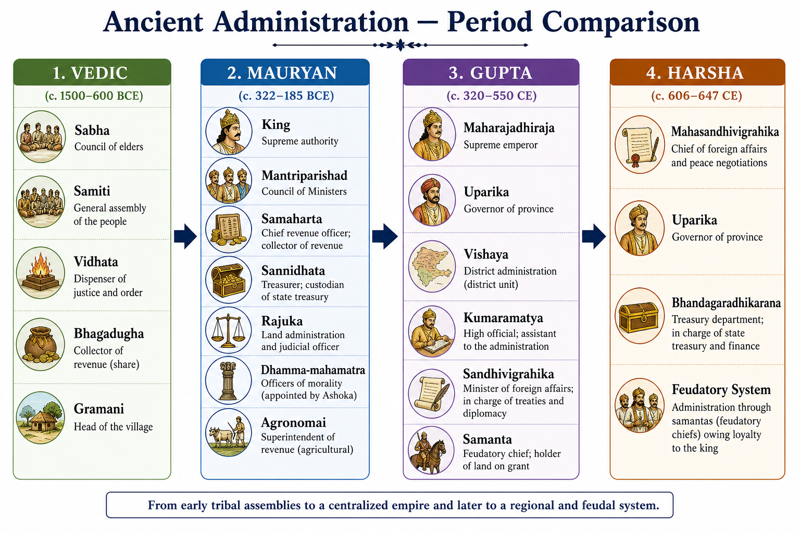
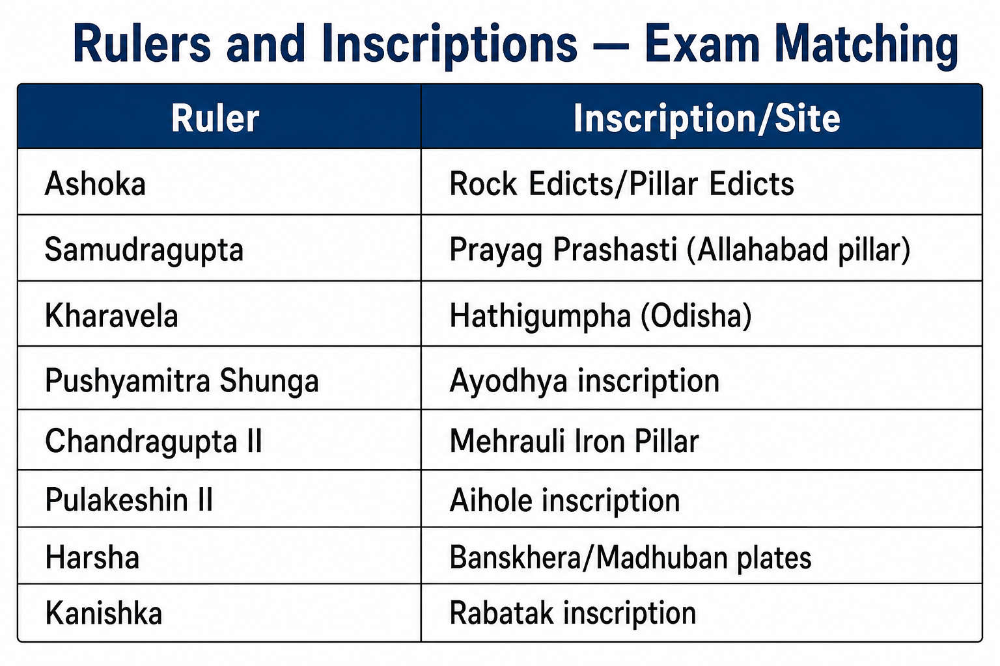

# Topic 11 — Ancient Indian Administration
### ★ Complete Source of Truth — No other book/notes needed for this topic

> **Covers syllabus:** Ancient Rulers | Titles of Ancient Rulers | Rulers and their Inscriptions | Ancient Administration  
> **Sources baked in:** NCERT *Themes in Indian History* I–II, Kautilya's *Arthashastra*, Megasthenes' *Indica*, Ashokan edicts, Gupta/Harsha inscriptions, UPPCS/UPSC PYQs  
> **Exam weight:** ★★★ High — ruler↔inscription matching (2018 Q87, 2022 Q87), officials (2020 Q4 Agronomai, 2023 Q26 Bhagadugha, 2024 Q20 Dhamma-mahamatra)  
> **Last verified:** July 2026

---

## Quick Revision Box — Raata This First

```
ANCIENT RULERS — DYNASTY CHAIN:
  Magadha: Bimbisara → Ajatashatru → Nandas → Chandragupta Maurya (322 BCE)
  Maurya: Chandragupta → Bindusara → Ashoka → decline (185 BCE)
  Post-Mauryan: Pushyamitra Shunga | Kharavela | Kanishka | Gautamiputra Satakarni
  Gupta: Chandragupta I → Samudragupta → Chandragupta II → Skandagupta
  Post-Gupta: Harshavardhana (606–647 CE) — last pan-north-Indian ruler

TITLES (★★★ traps):
  Vedic: Rajan (chief) | Maharajadhiraja (great king)
  Ashoka: Devanampiya Piyadasi (beloved of gods)
  Bindusara: Amitraghata (slayer of foes)
  Samudragupta: Digvijaya (conqueror of quarters)
  Chandragupta II: Vikramaditya
  Gupta/Harsha: Paramabhattaraka, Maharajadhiraja

RULER ↔ INSCRIPTION (★★★):
  Ashoka — Rock/Pillar Edicts | Samudragupta — Prayag Prashasti (Allahabad pillar)
  Kharavela — Hathigumpha (NOT Harsha — 2018 Q16)
  Pushyamitra Shunga — Ayodhya inscription (2018 Q91)
  Chandragupta II — Mehrauli Iron Pillar | Pulakeshin II — Aihole
  2018 Q87: Samudragupta south kings = 3-1-4-2 (C)
  2022 Q87 NOT matched: Jivitagupta II — Deva Barnark (C)

ADMINISTRATION BY PERIOD:
  VEDIC: Sabha (elders), Samiti (tribal assembly), Bhagadugha (revenue — 2023 Q26)
  MAURYAN: Samaharta (revenue), Sannidhata (treasury), Rajuka (land/judicial)
           Dhamma-mahamatra (2024 Q20) | Agronomai (2020 Q4 — revenue)
  GUPTA: Uparika (province), Vishaya (district), Sandhivigrahika (foreign minister), Samanta
  HARSHA: Mahasandhivigrahika, Uparika, Bhandagaradhikarana (treasury)

SOURCES ON RULERS:
  2023 Q29: Vishnu Purana has Mauryan info = Only 1 (TRUE)
  Vayu Purana on Gupta governance = FALSE (statement 2 trap)
```

### Must-Know Term Comparisons (very frequently asked)

| Term | One-line difference | Hindi |
|------|---------------------|-------|
| **Sabha vs Samiti** | Sabha = council of elders/nobles; Samiti = larger tribal assembly of people | सभा / समिति |
| **Bhagadugha vs Rajuka** | Bhagadugha = Vedic revenue collector; Rajuka = Mauryan land revenue/judicial officer | भागदुघ / राजुक |
| **Samaharta vs Sannidhata** | Samaharta = Mauryan revenue collector; Sannidhata = treasurer who stores revenue | समाहर्ता / संनिधाता |
| **Agronomai vs Samaharta** | Agronomai = Greek term (Megasthenes) for revenue official; Samaharta = Indian term for same function | एग्रोनोमाई / समाहर्ता |
| **Uparika vs Rajuka** | Uparika = Gupta/Harsha provincial governor; Rajuka = Mauryan district-level officer | उपरिक / राजुक |
| **Sandhivigrahika vs Mahasandhivigrahika** | Sandhivigrahika = Gupta foreign minister; Mahasandhivigrahika = Harsha's foreign minister | संधिविग्रहिक / महासंधिविग्रहिक |
| **Samanta vs Mahasamanta** | Samanta = feudatory chief under Gupta/Harsha; Mahasamanta = higher feudatory rank | सामन्त / महासामन्त |
| **Dhamma-mahamatra vs Rajuka** | Dhamma-mahamatra = Ashoka's moral welfare officers; Rajuka = revenue/judicial land officer | धम्म-महामात्र / राजुक |
| **Devanampiya vs Maharajadhiraja** | Devanampiya Piyadasi = Ashoka's edict title; Maharajadhiraja = king of kings (Gupta/Harsha) | देवानंप्रिय / महाराजाधिराज |
| **Prayag Prashasti vs Hathigumpha** | Prayag Prashasti = Samudragupta (Gupta); Hathigumpha = Kharavela (Kalinga, post-Mauryan) | प्रयाग प्रशस्ति / हाथीगुम्फा |

### Memory Tricks

| Trick | Remembers |
|-------|-----------|
| **2020 Q4 = D** | Agronomai = revenue management |
| **2023 Q26 = D** | Bhagadugha = revenue collector |
| **2024 Q20 = A** | Both Rahulovada + Dhamma-mahamatra 14th year |
| **2018 Q87 = C** | Samudragupta south match 3-1-4-2 |
| **2022 Q87 = C** | Jivitagupta II — Deva Barnark NOT matched |
| **2018 Q91 = C** | Pushyamitra Ashwamedha = Ayodhya inscription |
| **2018 Q16 = A** | Hathigumpha = Kharavela (Harsha trap) |
| **2023 Q29 = A** | Only 1 — Vishnu Purana Maurya |
| **S-S-R** | Mauryan revenue chain: Samaharta → Sannidhata → Rajuka |
| **U-V-K-S** | Gupta admin: Uparika → Vishaya → Kumaramatya → Samanta |

---

## Exam Visuals — High-ROI Images

> **Type priority:** location map → conceptual diagram. Images stored locally (`images/`) so they open offline.

### 1. Ancient Administration — Period Comparison (Conceptual)



*Raata **period ↔ official ↔ function**. **Vedic**: Bhagadugha (revenue). **Mauryan**: Samaharta, Rajuka, Dhamma-mahamatra. **Gupta**: Uparika, Sandhivigrahika, Samanta. **Harsha**: continued Gupta titles. **2020 Q4** Agronomai = revenue; **2023 Q26** Bhagadugha = revenue.*
*Source: Study diagram — generated for UPPCS admin comparison*

### 2. Rulers ↔ Inscriptions — Exam Matching Chart



*Core **ruler↔inscription** visual. **2018 Q16**: Hathigumpha ≠ Harsha (Kharavela). **2018 Q91**: Ayodhya = Pushyamitra. **2018 Q87**: Samudragupta south kings. **2022 Q87**: Jivitagupta II — Deva Barnark = wrong pair.*
*Source: Study chart — generated for UPPCS inscription matching*

---

## 11.1 Ancient Rulers

### Definitions (learn all — exams pick different ones)

| Term | Meaning |
|------|---------|
| **Ancient Ruler** | Sovereign or paramount chief exercising political authority in Indian subcontinent before ~750 CE Islamic incursions |
| **Dynasty** | Line of hereditary rulers from same family/house (Maurya, Gupta, Pushyabhuti) |
| **Feudatory** | Subordinate ruler acknowledging overlord's suzerainty while ruling own territory |

### Ancient Rulers — How It Works

- **Ancient Indian polity** evolved from **tribal chieftaincies** (Vedic rajan) to **centralized empires** (Maurya, Gupta) to **feudatory imperial systems** (later Gupta, Harsha).
- **Magadha-based rulers** dominated north Indian imperial history — Bimbisara, Chandragupta Maurya, Ashoka, Chandragupta I, Samudragupta, Harsha all Magadha-linked.
- **Pre-imperial phase** (~6th–4th c. BCE): **Mahajanapada kings** — Bimbisara/Ajatashatru (Haryanka), Mahapadma Nanda (first empire-builder before Mauryas).
- **First pan-Indian empire**: **Chandragupta Maurya (322 BCE)** — overthrew Nandas; extended to northwest under Bindusara and Ashoka.
- **Ashoka (268–232 BCE)** — peak Mauryan territorial extent; **Dhamma governance** model; last great Mauryan before decline.
- **Post-Mauryan regional rulers**: **Pushyamitra Shunga** (Magadha), **Kharavela** (Kalinga), **Kanishka** (Kushan), **Gautamiputra Satakarni** (Deccan).
- **Gupta imperial restoration** (~320 CE): **Chandragupta I** founded; **Samudragupta** conquered; **Chandragupta II** cultural peak; **Skandagupta** fought Huns.
- **Harshavardhana (606–647 CE)** — last ancient ruler to unify much of **north India**; Pushyabhuti dynasty of Thanesar/Kannauj.
- **Sources identifying rulers**: **inscriptions** (most reliable), **coins**, **Puranas** (genealogies — 2023 Q29), foreign accounts (Megasthenes, Fa-Hien, Hiuen Tsang), literary texts (Bana, Kalidasa).

### Major Ancient Rulers — Chronological Table

| Period | Dynasty | Key Rulers | Capital |
|--------|---------|------------|---------|
| 6th–4th c. BCE | Haryanka/Nanda | Bimbisara, Ajatashatru, Mahapadma Nanda | Rajgir, Pataliputra |
| 4th–2nd c. BCE | Maurya | Chandragupta, Bindusara, Ashoka | Pataliputra |
| 2nd c. BCE–3rd c. CE | Shunga/Kushan/Satavahana | Pushyamitra, Kharavela, Kanishka, Gautamiputra Satakarni | Pataliputra, Purushapura, Paithan |
| 4th–6th c. CE | Gupta | Chandragupta I, Samudragupta, Chandragupta II, Skandagupta | Pataliputra, Ujjain |
| 7th c. CE | Pushyabhuti | Harshavardhana | Thanesar → Kannauj |

> **Exam note:** **2023 Q29 = A (Only 1)** — Vishnu Purana contains Mauryan dynasty information; statement 2 (Vayu Purana on Gupta governance) is unreliable trap.

### Exam Facts (raata)

- Magadha = imperial heartland across Maurya, Gupta, Harsha
- Chandragupta Maurya founded first pan-Indian empire 322 BCE
- Ashoka = peak Mauryan; Dhamma policy
- Samudragupta = Gupta military conqueror
- Chandragupta II = Vikramaditya cultural peak
- Harsha = last great ancient north Indian emperor
- Puranas = genealogical source (Vishnu Purana — Mauryas)
- Inscriptions most reliable for ruler identification

### PYQs — Ancient Rulers

1. **(UPPCS Prelims 2023, Q29)** Puranas: 1. Mauryan info in Vishnu Purana  2. Vayu Purana on Gupta governance  
   → **A — Only 1 correct.**

2. **(UPPCS Prelims 2018, Q87)** Samudragupta's contemporary south kings: A-Dhananjaya B-Nilaraja C-Ugrasena D-Vishnugopa — 1-Avamukta 2-Kanchi 3-Kusthalpura 4-Palaka  
   → **C — 3-1-4-2** (Dhananjaya-Kusthalpura, Nilaraja-Avamukta, Ugrasena-Palaka, Vishnugopa-Kanchi).

### Examples (11.1)

| Example | Detail |
|---------|--------|
| **2023 Q29** | Vishnu Purana as Mauryan source |
| **Magadha continuity** | Maurya → Gupta → Harsha imperial base |
| **2018 Q87** | Samudragupta's south Indian contemporaries |

---

## 11.2 Titles of Ancient Rulers

### Definitions (learn all — exams pick different ones)

| Term | Meaning |
|------|---------|
| **Rajan** | Vedic term for tribal chief/king — early form of sovereignty |
| **Maharajadhiraja** | "King of kings" — imperial title used by Guptas and Harsha |
| **Devanampiya Piyadasi** | Ashoka's edict title — "Beloved of the Gods, who regards all with affection" |
| **Chakravartin** | Ideal universal monarch whose chariot wheels roll unimpeded in all directions |

### Titles of Ancient Rulers — How It Works

- **Vedic period titles** were modest — **rajan** (chief), **samrat** (emperor concept emerging in later Vedic texts), **ekarat** (sole ruler).
- **Ashokan titles** on inscriptions: **Devanampiya** (beloved of gods) + **Piyadasi** (looks on all with affection) — used instead of name "Ashoka" in most edicts until Maski/Gurjara discoveries.
- **Bindusara** known as **Amitraghata** (slayer of foes/amitraghata) in Greek accounts — maintained empire without major expansion.
- **Chandragupta Maurya** — no special epithet preserved; Greek accounts call him **Sandrokottos**.
- **Samudragupta** assumed **Maharajadhiraja** and performed **Ashvamedha** — claimed **digvijaya** (conquest of quarters) in Prayag Prashasti.
- **Chandragupta II** took **Vikramaditya** (sun of valor) — defeated Shakas; literary golden age under this title.
- **Gupta standard imperial titles**: **Paramabhattaraka** (most devout), **Maharajadhiraja**, **Parameshvara**, **Prithvi-vallabha** (beloved of earth).
- **Harsha** used **Siladitya**, **Paramabhattaraka**, **Maharajadhiraja** — Buddhist-era imperial titles.
- **Feudatory titles**: **Samanta**, **Mahasamanta**, **Raja**, **Maharaja** — subordinate rulers under Gupta/Harsha.
- **Title inflation pattern** — as empires grew, rulers accumulated **multiple honorifics** on inscriptions and coins to assert legitimacy over feudatories.

### Ruler ↔ Title — Complete Matching Table

| Ruler | Title/Epithet | Period |
|-------|---------------|--------|
| **Vedic chiefs** | Rajan, Samrat | Rigvedic–Later Vedic |
| **Ashoka** | Devanampiya Piyadasi | Mauryan |
| **Bindusara** | Amitraghata | Mauryan |
| **Samudragupta** | Maharajadhiraja, Digvijaya conqueror | Gupta |
| **Chandragupta II** | Vikramaditya, Paramabhattaraka | Gupta |
| **Skandagupta** | Maharajadhiraja (Hun-warrior) | Gupta |
| **Harshavardhana** | Siladitya, Maharajadhiraja | Post-Gupta |
| **Kanishka** | Devaputra (son of god), Caesar | Kushan |
| **Gautamiputra Satakarni** | Dakshinapathapati (lord of south) | Satavahana |

> **Exam note:** Trap — "Vikramaditya was Samudragupta's title" — FALSE. **Vikramaditya = Chandragupta II**; Samudragupta = **digvijaya/Maharajadhiraja**.

### Exam Facts (raata)

- Rajan = Vedic king
- Devanampiya Piyadasi = Ashoka on edicts
- Amitraghata = Bindusara
- Maharajadhiraja = Gupta/Harsha imperial title
- Vikramaditya = Chandragupta II only
- Digvijaya = Samudragupta's conquest policy
- Paramabhattaraka = Gupta devotional title
- Chakravartin = universal monarch ideal
- Samanta = feudatory under empire

### PYQs — Titles of Ancient Rulers

1. **(UPPCS Prelims 2018, Q87)** Samudragupta's contemporaries — tests knowledge of Samudragupta as **Maharajadhiraja** and digvijaya conqueror among south Indian **rajas**.  
   → **C — 3-1-4-2.**

2. **(UPSC pattern)** Which title appears on Ashokan inscriptions instead of his personal name?  
   → **Devanampiya Piyadasi.**

### Examples (11.2)

| Example | Detail |
|---------|--------|
| **Maski edict** | Revealed "Ashoka" = Devanampiya Piyadasi |
| **Vikramaditya trap** | Chandragupta II, not Samudragupta |
| **Maharajadhiraja** | Used on Gupta coins and Harsha plates |

---

## 11.3 Rulers and their Inscriptions

### Definitions (learn all — exams pick different ones)

| Term | Meaning |
|------|---------|
| **Inscription (epigraph)** | Writing carved/etched on stone, metal, or clay — primary archaeological source for ancient rulers |
| **Prashasti** | Sanskrit eulogy/inscription praising a king's achievements (e.g., Prayag Prashasti) |
| **Edict** | Official proclamation — Ashokan Dhamma messages on rocks/pillars |

### Rulers and their Inscriptions — How It Works

- **Inscriptions** are the most reliable **primary sources** for ancient rulers — provide names, dates, conquests, grants, and titles directly from the period.
- **Ashokan edicts** — **14 Major Rock Edicts**, **2 Special Rock Edicts**, **Minor Rock Edicts**, **Pillar Edicts I–VII** — spread across India, Pakistan, Afghanistan, Nepal.
- **Maski Minor Rock Edict** — first revealed name **"Ashoka"** linked to **Devanampiya Piyadasi**.
- **Rock Edict XIII** — Kalinga war account; **Rock Edict XII** — religious synthesis (**2022 Q54 answer B**).
- **Samudragupta's Prayag Prashasti** — composed by **Harishena**; inscribed on **Allahabad pillar** (with Ashokan edicts on same pillar).
- **Hathigumpha inscription** — **Kharavela** of Kalinga (Odisha, Udayagiri) — NOT Ashoka, Harsha, or Kanishka (**2018 Q16 = A Kharavela**).
- **Ayodhya inscription** — records **two Ashwamedha sacrifices** by **Pushyamitra Shunga** (**2018 Q91 = C Ayodhya**).
- **Nasik inscription** of **Gautamiputra Satakarni** — praises victories over Shakas and claims **99 feudatories**.
- **Junagarh Rock Inscription** — **Rudradaman I** (Shaka Kshatrapa) — Sanskrit prose; repairs Sudarshana lake.
- **Aihole inscription** — **Pulakeshin II** — records defeat of **Harshavardhana** at Narmada.
- **Mehrauli Iron Pillar** — Gupta-era (traditionally linked to **Chandragupta II**) — rust-resistant metallurgy.
- **2022 Q87 trap** — **Jivitagupta II — Deva Barnark** is **NOT** correctly matched (answer **C**).

### Master Ruler ↔ Inscription Table (complete — no etc.)

| Ruler | Inscription / Edict | Location | Period |
|-------|---------------------|----------|--------|
| **Ashoka** | Major Rock Edicts I–XIV | Gujarat, MP, Karnataka, Odisha, etc. | Mauryan |
| **Ashoka** | Pillar Edicts I–VII | Delhi-Meerut, Allahabad, Lauriya | Mauryan |
| **Ashoka** | Minor Rock Edicts (Maski, Brahmagiri) | Karnataka | Mauryan |
| **Samudragupta** | Prayag Prashasti | Allahabad pillar (UP) | Gupta |
| **Chandragupta II** | Mehrauli Iron Pillar inscription | Delhi | Gupta |
| **Skandagupta** | Bhitari pillar inscription | Ghazipur (UP) | Gupta |
| **Kharavela** | Hathigumpha inscription | Udayagiri, Odisha | Post-Mauryan |
| **Pushyamitra Shunga** | Ayodhya inscription | Ayodhya (UP) | Post-Mauryan |
| **Rudradaman I** | Junagarh rock inscription | Gujarat | Shaka Kshatrapa |
| **Gautamiputra Satakarni** | Nasik inscription (cave 3) | Maharashtra | Satavahana |
| **Kanishka** | Rabatak inscription | Afghanistan | Kushan |
| **Pulakeshin II** | Aihole inscription | Karnataka | Chalukya |
| **Harshavardhana** | Banskhera copper plate | — | Post-Gupta |
| **Harshavardhana** | Madhuban copper plate | — | Post-Gupta |
| **Ishanavarman** | Harha stone inscription | — | Later Gupta/Maukhar |
| **Sarvavarman** | Gaya copper plate | Bihar | Later Gupta |
| **Ishwaravarman** | Jaunpur stone inscription | Jaunpur (UP) | Later Gupta |

> **Exam note:** **2018 Q16** — Hathigumpha = **Kharavela** only; Harshavardhan (C) is trap. **2018 Q91** — Pushyamitra = **Ayodhya**, NOT Hathigumpha/Sarnath.

### Exam Facts (raata)

- Ashoka = most widespread inscriptions (edicts)
- Maski revealed Ashoka's name
- Prayag Prashasti = Samudragupta on Allahabad pillar
- Hathigumpha = Kharavela (2018 Q16)
- Ayodhya = Pushyamitra Shunga (2018 Q91)
- 2022 Q87 = Jivitagupta II — Deva Barnark wrong
- 2018 Q87 south kings = 3-1-4-2
- Rock Edict XII = religious synthesis (2022 Q54)
- Mehrauli pillar = Gupta (Chandragupta II)
- Aihole = Pulakeshin II vs Harsha

### PYQs — Rulers and their Inscriptions

1. **(UPPCS Prelims 2018, Q16)** Hathigumpha inscription — which king?  
   A. Kharvela  B. Ashok  C. Harshavardhan  D. Kanishka  
   → **A — Kharavela.** C is deliberate trap.

2. **(UPPCS Prelims 2022, Q87)** NOT correctly matched:  
   A. Ishanavarman — Harha  B. Sarvavarman — Gaya  C. Jivitagupta II — Deva Barnark  D. Ishwaravarman — Jaunpur  
   → **C — Jivitagupta II — Deva Barnark** is the wrong pair.

3. **(UPPCS Prelims 2018, Q91)** Two Ashwamedha yajnas of Pushyamitra Shunga recorded in:  
   A. Sarnath  B. Besnagar  C. Ayodhya  D. Hathigumpha  
   → **C — Ayodhya inscription.**

### Examples (11.3)

| Example | Detail |
|---------|--------|
| **2018 Q16** | Hathigumpha ≠ Harsha trap |
| **Allahabad pillar** | Ashoka + Samudragupta on same pillar |
| **2022 Q87** | Gupta inscription matching trap |

---

## 11.4 Ancient Administration

### Definitions (learn all — exams pick different ones)

| Term | Meaning |
|------|---------|
| **Ancient Administration** | System of governance — officials, assemblies, revenue, provinces — across Vedic to Harsha periods |
| **Saptanga** | Kautilya's seven limbs of state — swamin, amatya, janapada, durga, kosha, bala, mitra |
| **Arthashastra** | Kautilya's treatise on Mauryan statecraft — comprehensive administrative manual |

### Ancient Administration — How It Works

- **Vedic administration** was **tribal-democratic** — king (rajan) limited by assemblies; no standing bureaucracy.
- **Vedic assemblies**: **Sabha** (council of elders/privileged), **Samiti** (general tribal assembly), **Vidhata** (deliberative body for distribution/ritual).
- **Vedic officials**: **Purohita** (priest-adviser), **Senani** (army chief), **Gramani** (village headman), **Bhagadugha** (revenue/share collector) — **2023 Q26 answer D**.
- **Mauryan administration** = **highly centralized** — Kautilya's **Arthashastra** + Megasthenes' *Indica* describe detailed bureaucracy.
- **Mauryan revenue chain**: **Samaharta** (collects revenue) → **Sannidhata** (treasurer) → **Rajuka** (land measurement, revenue assessment, local judicial functions).
- **Agronomai** — Greek term Megasthenes used for **revenue/agricultural management official** — **2020 Q4 answer D (revenue management)**.
- **Mauryan provinces** called **janapadas** governed by **Kumara** (princes) or **Ayukta** (appointed governors) — Ashoka was Kumara of Ujjain/Takshashila.
- **Ashoka's Dhamma administration** — appointed **Dhamma-mahamatras** in **14th regnal year** to propagate moral law — **2024 Q20 both statements correct (A)**.
- **Gupta administration** = **less centralized** — **feudatory samanta system** grew; land grants (brahmadeya) created autonomous pockets.
- **Gupta provincial system**: **Bhukti** (province) under **Uparika** → **Vishaya** (district) under **Kumaramatya/Ayuktaka** → village under **Gramika**.
- **Gupta special officer**: **Sandhivigrahika** — minister of war-and-peace/foreign affairs.
- **Harsha's administration** continued Gupta model — **Mahasandhivigrahika**, **Uparika**, **Bhandagaradhikarana** (treasury); more feudatory-dependent than Mauryas.
- **Evolution pattern**: Vedic (tribal assemblies) → Mauryan (centralized bureaucracy) → Gupta/Harsha (feudatory decentralization with grant economy).

### Administration Comparison — Complete Table

| Feature | Vedic | Mauryan | Gupta | Harsha |
|---------|-------|---------|-------|--------|
| **Polity type** | Tribal chiefdom | Centralized empire | Feudatory empire | Feudatory empire |
| **Assembly** | Sabha, Samiti | Mantriparishad (council) | Mantriparishad | Mantriparishad |
| **Revenue officer** | Bhagadugha | Samaharta, Agronomai | Uparika-level collection | Uparika |
| **Treasury** | — | Sannidhata | Bhandagaradhikarana-type | Bhandagaradhikarana |
| **Land officer** | Gramani | Rajuka | Kumaramatya (district) | Rajuka-type |
| **Foreign affairs** | — | — | Sandhivigrahika | Mahasandhivigrahika |
| **Moral/welfare** | Purohita (ritual) | Dhamma-mahamatra | — | Buddhist patronage |
| **Provincial head** | — | Kumara/Ayukta | Uparika | Uparika |
| **Feudatory** | — | Rare | Samanta | Samanta-type |

### Mauryan Officials — Complete List

| Official | Function |
|----------|----------|
| **Samaharta** | Chief revenue collector of entire state |
| **Sannidhata** | Chief treasurer; stores revenue in treasury |
| **Rajuka** | Land measurement, revenue assessment, judicial duties in districts |
| **Agronomai** | Revenue/agricultural management (Megasthenes' Greek term) |
| **Dhamma-mahamatra** | Moral welfare officers appointed by Ashoka (14th regnal year) |
| **Antapala** | Border fort commander |
| **Pradeshika** | Head of district administration |
| **Mahamatra** | Senior executive officer (various departments) |

> **Exam note:** **2020 Q4 = D** (Agronomai = revenue). Trap: Agronomai = "weight and measurement" — that was a different Mauryan function (standardization), not Agronomai's primary role per Megasthenes.

### Exam Facts (raata)

- Vedic: Sabha, Samiti, Bhagadugha (2023 Q26)
- Mauryan: Samaharta, Sannidhata, Rajuka
- Agronomai = revenue (2020 Q4)
- Dhamma-mahamatra = Ashoka 14th year (2024 Q20)
- Gupta: Uparika, Sandhivigrahika, Samanta
- Harsha: Mahasandhivigrahika, feudatory system
- Arthashastra = Kautilya's admin manual
- Centralized Maurya → feudatory Gupta/Harsha

### PYQs — Ancient Administration

1. **(UPPCS Prelims 2020, Q4)** Agronomai during Mauryan age related to:  
   A. Weight and measurement  B. Administrative management  C. Construction of roads  D. Revenue management  
   → **D — Revenue management.**

2. **(UPPCS Prelims 2023, Q26)** Bhagadugha during Vedic administration was:  
   A. Messenger  B. Chief Officer of Forests  C. Chief Officer of Gambling  D. Revenue Collector  
   → **D — Revenue Collector.**

3. **(UPPCS Prelims 2024, Q20)** Ashoka: 1. Dhamma from Rahulovada-sutta  2. Dhamma-mahamatras in 14th regnal year  
   → **A — Both 1 and 2 correct.**

### Examples (11.4)

| Example | Detail |
|---------|--------|
| **2020 Q4** | Agronomai = Mauryan revenue |
| **2023 Q26** | Bhagadugha = Vedic revenue |
| **2024 Q20** | Dhamma-mahamatra = Ashokan welfare admin |

---

## Consolidated Reference — Everything in One Place

### Ruler ↔ Inscription Quick-Match (Exam Card)

| Ruler | Inscription | Trap to Avoid |
|-------|-------------|---------------|
| Ashoka | Rock/Pillar Edicts | NOT Hathigumpha |
| Samudragupta | Prayag Prashasti | NOT Chandragupta II |
| Kharavela | Hathigumpha | NOT Harsha (2018 Q16) |
| Pushyamitra Shunga | Ayodhya | NOT Hathigumpha (2018 Q91) |
| Chandragupta II | Mehrauli Iron Pillar | NOT Samudragupta |
| Pulakeshin II | Aihole | Records Harsha's defeat |
| Jivitagupta II | — | NOT Deva Barnark (2022 Q87) |

### Official ↔ Period Quick-Match

| Official | Period | Function |
|----------|--------|----------|
| Bhagadugha | Vedic | Revenue collector |
| Samaharta | Mauryan | Chief revenue collector |
| Agronomai | Mauryan | Revenue (Greek term) |
| Rajuka | Mauryan | Land/revenue/judicial |
| Dhamma-mahamatra | Mauryan (Ashoka) | Moral welfare |
| Uparika | Gupta/Harsha | Provincial governor |
| Sandhivigrahika | Gupta | Foreign minister |
| Mahasandhivigrahika | Harsha | Foreign minister |
| Samanta | Gupta/Harsha | Feudatory chief |

### Important PYQ Answers — Consolidated

| Year | Q# | Answer | Topic |
|------|-----|--------|-------|
| 2020 | Q4 | D — Agronomai = revenue | Mauryan official |
| 2023 | Q26 | D — Bhagadugha = revenue | Vedic official |
| 2023 | Q29 | A — Only 1 (Vishnu Purana-Maurya) | Ruler source |
| 2024 | Q20 | A — Both Ashoka statements | Dhamma-mahamatra |
| 2018 | Q16 | A — Kharavela | Inscription |
| 2018 | Q87 | C — 3-1-4-2 | Samudragupta matching |
| 2018 | Q91 | C — Ayodhya | Shunga inscription |
| 2022 | Q54 | B — Rock Edict XII | Ashoka edict |
| 2022 | Q87 | C — Jivitagupta-Deva Barnark | NOT matched |

### UP Focus — Ancient Administration

| Element | Detail |
|---------|--------|
| **Ayodhya inscription** | Pushyamitra Shunga Ashwamedha (2018 Q91) |
| **Allahabad/Prayagraj pillar** | Ashokan edicts + Samudragupta Prayag Prashasti |
| **Jaunpur inscription** | Ishwaravarman (2022 Q87 pair D) |
| **Bhitari pillar** | Skandagupta (Ghazipur, UP) |
| **Kannauj** | Harsha's capital — post-Gupta imperial admin centre |
| **Kushinagar/Sarnath** | Ashokan pillars and Buddhist admin centres in UP region |

---

## Practice Zone — UPPCS Format Questions

**1.** Consider: 1. Bhagadugha collected revenue in Vedic period. 2. Rajuka performed similar functions in Mauryan period.

<details><summary>Answer</summary>
**Both correct** — revenue administration continuity across periods.
</details>

**2.** Agronomai during Mauryan age was related to:

<details><summary>Answer</summary>
**Revenue management** (2020 Q4 = D).
</details>

**3.** Assertion (A): Hathigumpha inscription provides information about Harshavardhana.
Reason (R): Hathigumpha records Kharavela's achievements in Kalinga.

<details><summary>Answer</summary>
**A false, R true** (2018 Q16).
</details>

**4.** Match:
1. Samudragupta  a. Hathigumpha
2. Kharavela  b. Prayag Prashasti
3. Pushyamitra  c. Ayodhya inscription

<details><summary>Answer</summary>
**1-b, 2-a, 3-c.**
</details>

**5.** Which is NOT correctly matched?
A. Ishanavarman — Harha  B. Jivitagupta II — Deva Barnark  C. Sarvavarman — Gaya  D. Ishwaravarman — Jaunpur

<details><summary>Answer</summary>
**B** (2022 Q87 = C in original — Jivitagupta II pair is wrong).
</details>

**6.** Consider about Ashoka's administration:
1. Dhamma-mahamatras appointed in 14th regnal year.
2. Dhamma definition drawn from Rahulovada-sutta.

<details><summary>Answer</summary>
**Both correct** (2024 Q20 = A).
</details>

**7.** Vikramaditya was the title of:

<details><summary>Answer</summary>
**Chandragupta II** (not Samudragupta).
</details>

**8.** Samudragupta's south king matching (2018 Q87): Dhananjaya = ?

<details><summary>Answer</summary>
**Kusthalpura (3).**
</details>

**9.** Assertion (A): Vedic administration had no revenue officials.
Reason (R): Bhagadugha collected the king's share during Vedic period.

<details><summary>Answer</summary>
**A false, R true.**
</details>

**10.** Gupta provincial governor was called:

<details><summary>Answer</summary>
**Uparika.**
</details>

**11.** Consider Puranas as sources:
1. Vishnu Purana has Mauryan dynasty information.
2. Vayu Purana is reliable for Gupta governance details.

<details><summary>Answer</summary>
**Only 1 correct** (2023 Q29 = A).
</details>

**12.** Devanampiya Piyadasi on inscriptions refers to:

<details><summary>Answer</summary>
**Ashoka.**
</details>

**13.** Which official handled foreign affairs in Gupta administration?

<details><summary>Answer</summary>
**Sandhivigrahika.**
</details>

**14.** Consider Mauryan revenue chain:
1. Samaharta collects revenue.
2. Sannidhata stores it in treasury.

<details><summary>Answer</summary>
**Both correct.**
</details>

**15.** Pushyamitra Shunga's Ashwamedha recorded at:

<details><summary>Answer</summary>
**Ayodhya** (2018 Q91 = C).
</details>

**16.** Assertion (A): Mauryan administration was more centralized than Gupta.
Reason (R): Gupta period saw growth of samanta feudatories and land grants.

<details><summary>Answer</summary>
**Both true; R explains A.**
</details>

**17.** Sabha and Samiti belonged to:

<details><summary>Answer</summary>
**Vedic administration.**
</details>

**18.** Rock Edict XII of Ashoka deals with:

<details><summary>Answer</summary>
**Religious synthesis** (2022 Q54 = B).
</details>

**19.** Which pairs are correctly matched?
1. Samaharta — Mauryan revenue  2. Bhagadugha — Vedic revenue  3. Samanta — Mauryan feudatory

<details><summary>Answer</summary>
**1 and 2 only.** Samanta = Gupta/Harsha feudatory.
</details>

**20.** Harsha's foreign minister was:

<details><summary>Answer</summary>
**Mahasandhivigrahika.**
</details>

**21.** Consider UP-specific:
1. Ayodhya inscription = Pushyamitra Shunga.
2. Jaunpur stone inscription = Ishwaravarman.

<details><summary>Answer</summary>
**Both correct** (2022 Q87 pair D).
</details>

**22.** Arrange periods by increasing centralization (then decentralization):
A. Gupta  B. Vedic  C. Mauryan

<details><summary>Answer</summary>
**Vedic (least) → Mauryan (most centralized) → Gupta (decentralized feudatory).**
</details>

**23.** Which edict revealed Ashoka's personal name?

<details><summary>Answer</summary>
**Maski Minor Rock Edict.**
</details>

**24.** Consider: 1. Arthashastra describes Mauryan administration. 2. Megasthenes describes Mauryan administration.

<details><summary>Answer</summary>
**Both correct** — Kautilya (Indian) + Megasthenes (Greek ambassador).
</details>

**25.** Vishnugopa was king of:

<details><summary>Answer</summary>
**Kanchi** (2018 Q87 — pair D-2).
</details>

**26.** Assertion (A): Agronomai managed road construction in Mauryan empire.
Reason (R): Agronomai was Megasthenes' term for revenue management official.

<details><summary>Answer</summary>
**A false, R true** (2020 Q4).
</details>

**27.** Dhamma-mahamatra were appointed by:

<details><summary>Answer</summary>
**Ashoka (14th regnal year).**
</details>

**28.** Which is correctly matched?
A. Prayag Prashasti — Samudragupta  B. Hathigumpha — Harsha  C. Ayodhya — Ashoka

<details><summary>Answer</summary>
**A only.**
</details>

**29.** Consider Gupta administration:
1. Bhukti = province.
2. Vishaya = district.

<details><summary>Answer</summary>
**Both correct.**
</details>

**30.** 2018 Q87 full code A-B-C-D:

<details><summary>Answer</summary>
**C — 3-1-4-2.**
</details>

---

## Complete PYQ Bank (Topic 11)

### UPPCS Prelims 2024

**Q20.** Ashoka: 1. Dhamma from Rahulovada-sutta  2. Dhamma-mahamatras in 14th regnal year

<details><summary>Answer</summary>
**A — Both 1 and 2 correct.**
</details>

### UPPCS Prelims 2023

**Q26.** Bhagadugha during Vedic administration was:

<details><summary>Answer</summary>
**D — Revenue Collector.**
</details>

**Q29.** Puranas: 1. Mauryan info in Vishnu Purana  2. Vayu Purana on Gupta governance

<details><summary>Answer</summary>
**A — Only 1 correct.**
</details>

### UPPCS Prelims 2022

**Q54.** Rock Edict of Ashoka on religious synthesis:

<details><summary>Answer</summary>
**B — Rock Edict XII.**
</details>

**Q87.** NOT correctly matched: A. Ishanavarman—Harha  B. Sarvavarman—Gaya  C. Jivitagupta II—Deva Barnark  D. Ishwaravarman—Jaunpur

<details><summary>Answer</summary>
**C — Jivitagupta II — Deva Barnark.**
</details>

### UPPCS Prelims 2020

**Q4.** Agronomai during Mauryan age related to:

<details><summary>Answer</summary>
**D — Revenue management.**
</details>

### UPPCS Prelims 2018

**Q16.** Hathigumpha inscription — which king?  
A. Kharvela  B. Ashok  C. Harshavardhan  D. Kanishka

<details><summary>Answer</summary>
**A — Kharvela.**
</details>

**Q87.** Samudragupta's south kings: A-Dhananjaya B-Nilaraja C-Ugrasena D-Vishnugopa — 1-Avamukta 2-Kanchi 3-Kusthalpura 4-Palaka

<details><summary>Answer</summary>
**C — 3-1-4-2.**
</details>

**Q91.** Pushyamitra Shunga's two Ashwamedha yajnas recorded in:

<details><summary>Answer</summary>
**C — Ayodhya inscription.**
</details>

### UPSC Pattern (Concept Overlap)

**Pattern — Saptanga:** Kautilya's seven limbs of Mauryan state.

**Pattern — Samanta:** Gupta feudatory administration.

**Pattern — Chakravartin:** Universal monarch ideal vs actual titles.

---

## Common Traps — Don't Fall For These

1. **2020 Q4 = D** — Agronomai = revenue management, NOT weight/measurement.
2. **2023 Q26 = D** — Bhagadugha = revenue collector, NOT messenger/forests/gambling.
3. **2018 Q16 = A** — Hathigumpha = Kharavela; Harshavardhan (C) is trap.
4. **2018 Q91 = C** — Pushyamitra Ashwamedha = Ayodhya; NOT Hathigumpha/Sarnath.
5. **2022 Q87 = C** — Jivitagupta II — Deva Barnark is NOT correctly matched.
6. **2018 Q87 = C** — Samudragupta south kings = 3-1-4-2.
7. **2024 Q20 = A** — Both Ashoka Dhamma statements correct.
8. **2023 Q29 = A** — Only Vishnu Purana-Maurya statement; Vayu Purana-Gupta is trap.
9. **Vikramaditya = Chandragupta II** — NOT Samudragupta or Harsha.
10. **Prayag Prashasti = Samudragupta** — NOT Chandragupta II or Ashoka alone.
11. **Samanta = Gupta/Harsha feudatory** — NOT Mauryan official.
12. **2022 Q54 = B** — Rock Edict XII = religious synthesis (not XIII Kalinga).

---
