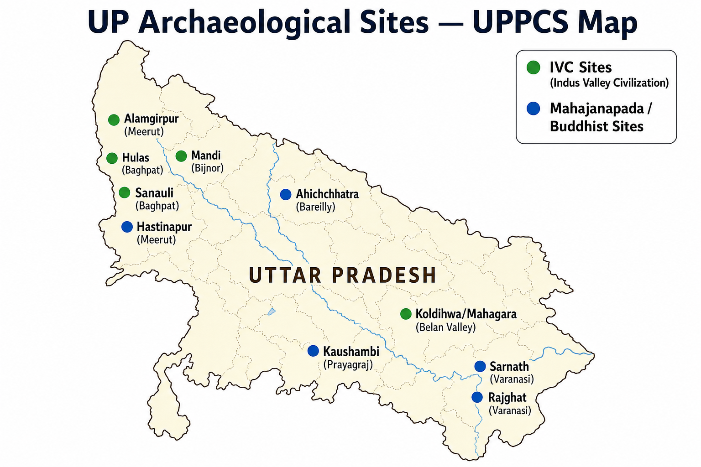
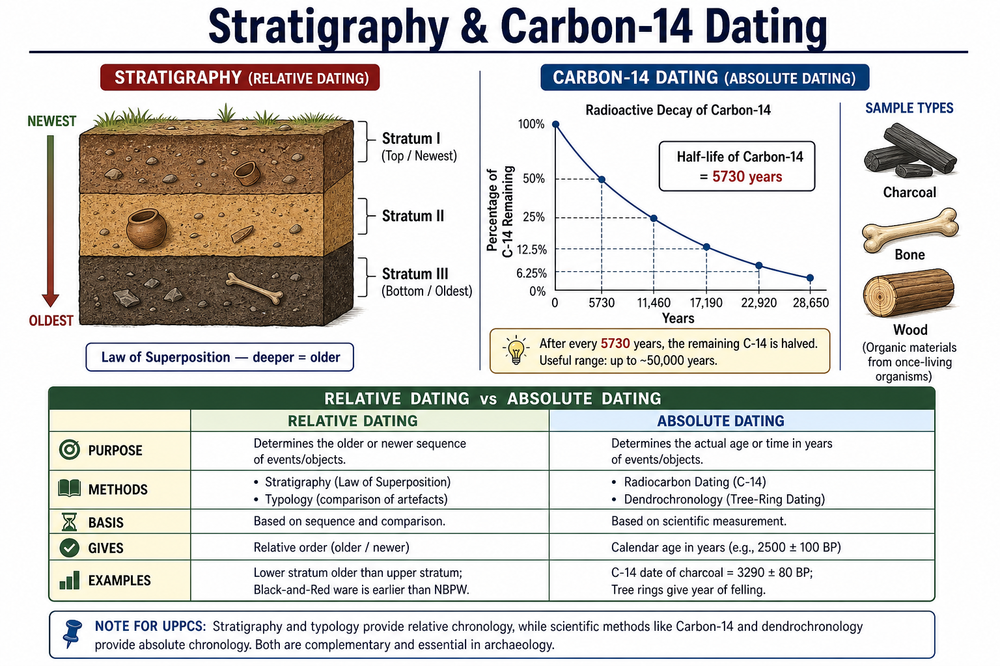

# Topic 13 — Archaeology
### ★ Complete Source of Truth — No other book/notes needed for this topic

> **Covers syllabus:** Archaeological Sites | Excavations | Archaeological Sites of Uttar Pradesh | ASI | Carbon Dating | Stratigraphy  
> **Sources baked in:** NCERT *Themes in Indian History* I (Ch 1–2), RS Sharma, ASI publications, excavation reports (Harappa, Sanauli, Kaushambi), UPPCS/UPSC PYQs  
> **Exam weight:** ★★★ High — site ↔ state matching (2023 Q27, 2020 Q12), UP IVC trio (2025 Q87, 2018 Q88, 2021 Q100), archaeologist traps (2020 Q10 Wakankar)  
> **Last verified:** July 2026

---

## Quick Revision Box — Raata This First

```
ARCHAEOLOGY CORE:
  Archaeology = study of past human societies through material remains (artefacts, structures, layers)
  Excavation = systematic digging in strata | Stratigraphy = layer study (deeper = older)
  Relative dating = stratigraphy + typology | Absolute dating = C-14 (organic only)

UP IVC TRIO (★★★):
  Alamgirpur (Meerut) = easternmost IVC in India ← 2023 Q28
  Hulas (Baghpat) + Mandi (Bijnor) = UP Harappan ← 2018 Q88, 2025 Q87, 2021 Q100
  Rakhigarhi = HARYANA (NOT UP) ← 2025 Q87 trap

2023 Q27 SITE MATCH (Answer A):
  Nevasa → Maharashtra (3) | Isampur → Karnataka (4)
  Didwana → Rajasthan (1) | Gudiyam Cave → Tamil Nadu (2)

2020 Q12 HARAPPAN MATCH (Answer D = 3-2-4-1):
  Balu → Haryana | Manda → J&K | Padri → Gujarat | Hulas → UP

ASI:
  Founded 1861 | Alexander Cunningham = first DG
  Marshall (1902–28) = IVC announcement 1924
  Wheeler = post-Partition Harappa 1946; stratigraphic grid method
  HQ: 24 Tilak Marg, New Delhi (NOT Lucknow)

C-14 DATING:
  Willard Libby (1949 Nobel) | Half-life ~5730 years
  Works on organic material only (charcoal, bone, wood) — NOT stone/metal
  Range ~50,000 years max | Revolutionized IVC chronology (~2600 BCE mature phase)

KEY ARCHAEOLOGISTS:
  Wakankar → Bhimbetka 1957–58 (2020 Q10 = C)
  Sahni → Harappa 1921 | Banerjee → Mohenjo-daro 1922
  Wheeler ≠ IVC discoverer (came 1946)

UP NON-IVC SITES:
  Sarnath (Varanasi) | Kaushambi (Prayagraj) | Hastinapur (Meerut)
  Ahichchhatra (Bareilly) | Sanauli chariots 2018 (Baghpat)
  Koldihwa/Mahagara (Belan Valley, UP)
```

### Must-Know Term Comparisons (very frequently asked)

| Term | One-line difference | Hindi |
|------|---------------------|-------|
| **Archaeological site vs excavation** | Site = location with remains; excavation = active scientific digging at that site | पुरातात्विक स्थल / उत्खनन |
| **Stratigraphy vs typology** | Stratigraphy = layer sequence (relative age); typology = artefact style change over time | स्तरिकी / प्रकारिकी |
| **Relative vs absolute dating** | Relative = older/younger only (layers); absolute = calendar years (C-14, dendrochronology) | सापेक्ष / निरपेक्ष कालनिर्धारण |
| **Rock shelter vs cave** | Rock shelter = natural overhang (Bhimbetka); cave = hollow (natural or carved) | शैल आश्रय / गुफा |
| **Alamgirpur vs Rakhigarhi** | Alamgirpur = easternmost IVC (UP); Rakhigarhi = largest IVC (Haryana, NOT UP) | आलमगीरपुर / राखीगढ़ी |
| **Hulas vs Lothal** | Hulas = eastern Harappan site (UP); Lothal = dockyard port (Gujarat) | हुलास / लोथल |
| **Mandi vs Manda** | Mandi = Harappan site (UP, Bijnor); Manda = Harappan site (Jammu & Kashmir) | मंडी / मांडा |
| **Marshall vs Wheeler** | Marshall = announced IVC 1924, DG ASI; Wheeler = post-1947 Harappa, grid stratigraphy | मार्शल / व्हीलर |
| **Wakankar vs Sankalia** | Wakankar = Bhimbetka discoverer 1957–58; Sankalia = Deccan prehistory (Langhnaj etc.) | वाकणकर / संकलिया |
| **C-14 vs thermoluminescence** | C-14 = organic samples; TL = fired pottery/minerals — different material limits | कार्बन-14 / तापप्रकाश |

### Memory Tricks

| Trick | Remembers |
|-------|-----------|
| **A-H-M = UP IVC** | Alamgirpur, Hulas, Mandi = Uttar Pradesh |
| **Rakhigarhi = Haryana** | 2025 Q87 trap — never mark as UP |
| **2023 Q27 = A** | Nevasa-MH, Isampur-KA, Didwana-RJ, Gudiyam-TN |
| **2020 Q12 = D** | 3-2-4-1 (Balu-HR, Manda-J&K, Padri-GJ, Hulas-UP) |
| **2020 Q10 = C** | Wakankar = Bhimbetka |
| **2018 Q88 = D** | Only Alamgirpur + Hulas in UP |
| **2025 Q87 = C** | Mandi + Hulas (1 and 3) |
| **Deep = Old** | Law of superposition — bottom layer oldest |
| **C-14 = Carbon life** | Organic only; 5730-year half-life |
| **Cunningham 1861** | ASI birth year + first DG |

---

## Exam Visuals — High-ROI Images

> **Type priority:** location map → conceptual diagram. Images stored locally (`images/`) so they open offline.

### 1. Archaeological Sites of Uttar Pradesh — Location Map



*Raata **site ↔ district ↔ period**. **IVC**: Alamgirpur (Meerut, eastern boundary), Hulas (Baghpat), Mandi (Bijnor). **2025 Q87 trap**: Rakhigarhi = **Haryana**. **Sanauli** (Baghpat) = 2018 chariot burials. **Kaushambi** = Vatsa capital; **Sarnath** = Buddhist + Ashokan pillar.*
*Source: Study map — generated for UPPCS UP site matching*

### 2. Stratigraphy & Carbon-14 Dating — Conceptual Diagram



*Raata **method ↔ what it dates**. **Stratigraphy** = relative dating (deeper layer = older). **C-14** = absolute dating of **organic** samples only; half-life **~5730 years**. Trap: C-14 cannot date **stone tools or metal** directly.*
*Source: Study diagram — generated for UPPCS archaeology concepts*

---

## 13.1 Archaeological Sites

### Definitions (learn all — exams pick different ones)

| Term | Meaning |
|------|---------|
| **Archaeological Site** | Any location where physical evidence of past human activity survives — settlements, burials, factories, rock art, mounds |
| **Mound (Tila/Tell)** | Artificial hill formed by successive habitation layers — e.g., Harappa mound, Hastinapur tila |
| **Surface Survey** | Walking and recording artefacts on ground without digging — locates sites for excavation |
| **Provenance** | Exact find-spot of an artefact — critical for dating and cultural attribution |

### Archaeological Sites — How It Works

- **Archaeology** reconstructs past societies from **material culture** — pottery, tools, bones, buildings, pollen, DNA — not from written records alone (especially for pre-3000 BCE India).
- Sites are classified by **cultural period** (Paleolithic, Mesolithic, Neolithic, Chalcolithic, Harappan, Early Historic, Medieval) and **geographic zone** (Ganga plain, Deccan, northwest, coastal).
- **Settlement sites** yield habitation floors, hearths, post-holes; **burial sites** yield grave goods (Sanauli chariots); **factory sites** yield workshop debris (Chanhudaro bead-making).
- **Rock shelters** (Bhimbetka, Adamgarh) differ from **limestone caves** (Ajanta) — UPPCS tests natural vs carved distinction.
- **Site reports** published by ASI/Universities are primary evidence — location, strata, artefact list, C-14 dates.
- **Multi-period sites** show **cultural continuity or replacement** — Hastinapur has PGW + early historic layers; Kaushambi has Mauryan through Gupta.
- **Destroyed/reburied sites** survive as **mounds** in Indo-Gangetic alluvium — reason most ancient cities look like "hills" today.
- **Underwater/coastal sites** (Dwarka offshore, Poompuhar) expand maritime archaeology — complement to land sites.
- **DNA/aDNA analysis** from skeletal remains (Rakhigarhi 2015–22) now supplements traditional artefact typology.

> **Exam note:** UPPCS favourite = **site ↔ present state** matching (2023 Q27, 2020 Q12). Memorize **state first**, then cultural label.

### Major Archaeological Sites by Period (India-wide)

| # | Site | State | Period / Culture | Exam Tag |
|---|------|-------|------------------|----------|
| 1 | Bhimbetka | Madhya Pradesh | Paleolithic–Medieval rock art | Wakankar 2020 Q10 |
| 2 | Nevasa | Maharashtra | Paleolithic (Pravara basin) | 2023 Q27 |
| 3 | Isampur | Karnataka | Lower Paleolithic Acheulian | 2023 Q27 |
| 4 | Didwana | Rajasthan | Paleolithic (Thar fringe) | 2023 Q27 |
| 5 | Gudiyam Cave | Tamil Nadu | Paleolithic cave | 2023 Q27 |
| 6 | Mehrgarh | Pakistan (Balochistan) | Neolithic–Chalcolithic precursor to IVC | Pre-Harappan |
| 7 | Harappa | Pakistan (Punjab) | Mature Harappan | Sahni 1921 |
| 8 | Mohenjo-daro | Pakistan (Sindh) | Mature Harappan | Banerjee 1922 |
| 9 | Dholavira | Gujarat | Mature + Late Harappan | Water management |
| 10 | Lothal | Gujarat | Harappan port/dockyard | NOT UP |
| 11 | Rakhigarhi | Haryana | Largest IVC site | NOT UP trap |
| 12 | Alamgirpur | Uttar Pradesh | Easternmost IVC (India) | 2023 Q28 |
| 13 | Hastinapur | Uttar Pradesh | PGW + early historic | Kuru capital |
| 14 | Kaushambi | Uttar Pradesh | Mauryan–Gupta urban | Vatsa capital |
| 15 | Sarnath | Uttar Pradesh | Buddhist + Mauryan pillar | Lion Capital |
| 16 | Arikamedu | Puducherry | Indo-Roman trade | Coastal factory |
| 17 | Nagarjunakonda | Andhra Pradesh | Ikshvaku Buddhist | River valley |
| 18 | Sanauli | Uttar Pradesh | Late Harappan/OCP chariots 2018 | Baghpat UP |

### Exam Facts (raata)

- Archaeological site = physical evidence of past human activity
- 2023 Q27 tests Paleolithic/prehistoric site ↔ state matching
- Bhimbetka = MP (not UP) — Wakankar 1957–58
- Isampur = Karnataka; Gudiyam = Tamil Nadu
- Rakhigarhi = Haryana — largest IVC, NOT in UP
- Multi-period mounds common in Ganga plain

### PYQs — Archaeological Sites

1. **(UPPCS Prelims 2023, Q27)** Match List-I with List-II:
   - (A) Nevasa — (B) Isampur — (C) Didwana — (D) Gudiyam Cave
   - 1. Rajasthan  2. Tamil Nadu  3. Maharashtra  4. Karnataka  
   → **A — A-(3), B-(4), C-(1), D-(2).** Nevasa = Maharashtra; Isampur = Karnataka; Didwana = Rajasthan; Gudiyam Cave = Tamil Nadu.

2. **(UPPCS Prelims 2020, Q10)** Which Indian archaeologist first visited Bhimbetka Caves and discovered prehistoric significance of rock paintings?  
   A. Madho Swaroop Vatsa  B. H.D. Sankalia  C. V.S. Wakankar  D. V.N. Mishra  
   → **C — V.S. Wakankar (1957–58).** Vatsa = Harappan; Sankalia = other prehistoric work.

3. **(UPPCS Prelims 2022, Q68)** From which archaeological site of the Indus Valley Civilization are figures or models of boats found?  
   A. Dholavira and Bhagatrav  B. Harappa and Kot Diji  C. Mohenjo-daro and Lothal  D. Kalibangan and Ropar  
   → **C — Mohenjo-daro and Lothal.** Key archaeological finds from excavations.

### Examples (13.1)

| Example | Why exam-relevant |
|---------|-------------------|
| **Nevasa, Maharashtra** | 2023 Q27 List-I site — Pravara river Palaeolithic |
| **Gudiyam Cave, Tamil Nadu** | 2023 Q27 — Palaeolithic cave near Chennai |
| **Alamgirpur, UP** | Eastern boundary IVC — repeated UPPCS trap |

---

## 13.2 Excavations

### Definitions (learn all — exams pick different ones)

| Term | Meaning |
|------|---------|
| **Excavation** | Controlled removal of soil in layers to expose and record structures and artefacts in situ |
| **Trial Trench** | Small initial cut to judge site's depth and cultural sequence before full dig |
| **In situ** | Artefact found in original deposited position — preserves stratigraphic context |
| **Site Report** | Published excavation record — trench maps, layer descriptions, finds catalogue, dates |

### Excavations — How It Works

- **Excavation destroys context while revealing it** — only **systematic, recorded** digging is scientifically valid; looting removes provenance.
- **Pre-excavation steps**: survey → permission (ASI/State Archaeology) → grid layout → trial trench.
- **Wheeler-Kenyon method** (balk-and-grid) — vertical **balks** left between trenches to read **stratigraphy**; introduced rigorously in Indian archaeology by **Mortimer Wheeler** (Harappa 1946).
- **Horizontal excavation** exposes single culture layer (e.g., one habitation floor); **vertical excavation** cuts through all periods for chronology.
- **Recording tools**: trench maps, photographs, section drawings, artefact bag labels with **locus/stratum number**.
- **Key Indian excavations timeline**: Harappa **1921** (Sahni) → Mohenjo-daro **1922** (Banerjee) → IVC announced **1924** (Marshall) → Harappa re-dig **1946** (Wheeler) → Lothal **1955–62** (S.R. Rao) → Dholavira **1990s** (R.S. Bisht) → Sanauli **2018** (ASI, Baghpat).
- **Post-Partition shift**: major IVC cities in Pakistan; Indian archaeology focused on **Gujarat, Haryana, Punjab (India), UP, Rajasthan** border sites.
- **Underwater/marine excavation** at Dwarka, Poompuhar — complements land digs for port history.
- **Scientific analyses** on excavation finds: C-14, thermoluminescence, XRF on pottery, aDNA on bone.

> **Exam note:** Trap — **"Wheeler discovered IVC"** = FALSE. Wheeler excavated Harappa **1946**; discovery credit = **Sahni 1921 + Banerjee 1922** under **Marshall**.

### Major Excavations & Archaeologists (Master Table)

| Year | Site | Archaeologist | Significance |
|------|------|---------------|--------------|
| 1861–62 | Sarnath, Sanchi, Bodh Gaya | Alexander Cunningham | Early systematic Buddhist site surveys; ASI founded |
| 1921 | Harappa | Daya Ram Sahni | First major IVC excavation |
| 1922 | Mohenjo-daro | R.D. Banerjee | Revealed urban IVC character |
| 1924 | — | John Marshall (DG, ASI) | Announced "Indus Civilization" to world |
| 1946 | Harappa | Mortimer Wheeler | Stratigraphic dating; post-Partition |
| 1955–62 | Lothal | S.R. Rao | Dockyard identification |
| 1957–58 | Bhimbetka | V.S. Wakankar | Prehistoric rock art discovery |
| 1961–69 | Kalibangan | B.B. Lal | Pre-Harappan + Harappan ploughed field |
| 1990s | Dholavira | R.S. Bisht | Water reservoirs, signboard |
| 2015–22 | Rakhigarhi | Amarendra Nath / ASI | Largest IVC; aDNA studies |
| 2018 | Sanauli | ASI (SK Manjul) | Copper chariot burials; Late Harappan/OCP, UP |

### Exam Facts (raata)

- Sahni = Harappa 1921; Banerjee = Mohenjo-daro 1922
- Marshall announced IVC 1924 — DG ASI 1902–1928
- Wheeler = grid stratigraphy; Harappa 1946
- S.R. Rao = Lothal dockyard excavation
- Wakankar = Bhimbetka 1957–58
- Sanauli 2018 = ASI Baghpat UP chariot burials
- In situ context = scientific value of excavation

### PYQs — Excavations

1. **(UPPCS Prelims 2020, Q10)** Wakankar discovered Bhimbetka's prehistoric significance — see §13.1 for full question.  
   → **C — V.S. Wakankar.**

2. **(UPSC Prelims 2016 — pattern)** Mohenjo-daro was excavated by:  
   A. Marshall  B. Wheeler  C. R.D. Banerjee  D. Sahni  
   → **C — R.D. Banerjee (1922).** Marshall was DG; Wheeler came later.

### Examples (13.2)

| Example | Why exam-relevant |
|---------|-------------------|
| **Harappa 1921 — Sahni** | First IVC excavation — chronology trap vs Wheeler |
| **Sanauli 2018 — ASI** | Recent UP excavation — chariots, OCP/Late Harappan |
| **Kalibangan — B.B. Lal** | Ploughed field + fire altars — Rajasthan, NOT UP |

---

## 13.3 Archaeological Sites of Uttar Pradesh

### Definitions (learn all — exams pick different ones)

| Term | Meaning |
|------|---------|
| **Archaeological Sites of UP** | Prehistoric through early historic locations in present Uttar Pradesh with excavated/remains evidence |
| **Eastern IVC Extension** | Harappan settlements on eastern fringe — Alamgirpur, Hulas, Mandi |
| **Doab Sites** | Ganga–Yamuna interfluve centres — Kaushambi, Hastinapur, Koldihwa |

### Archaeological Sites of Uttar Pradesh — How It Works

- **UP lies in the Ganga plain core** — rich **multi-period** sites from Neolithic through Gupta-Buddhist layers.
- **IVC eastern sites (★★★)**: **Alamgirpur** (Meerut, Hindon) = **easternmost** Harappan culture marker in India ← **2023 Q28 answer B**.
- **Hulas** (Baghpat) — eastern Harappan habitation; appears in **2018 Q88, 2025 Q87, 2020 Q12**.
- **Mandi** (Bijnor, Ramganga) — UP Harappan site ← **2021 Q100 answer D (Uttar Pradesh)**.
- **Trap trio to reject for UP**: **Rakhigarhi (Haryana), Kalibangan (Rajasthan), Lothal (Gujarat)** — appear as wrong options in UPPCS.
- **Sanauli** (Baghpat, 2018) — **copper chariot burials** with antenna swords; Late Harappan/OCP overlap — high-yield current excavation.
- **Neolithic/Chalcolithic UP**: **Koldihwa, Mahagara** (Belan Valley, Allahabad/Prayagraj district) — rice evidence; **Lalitpur** microliths.
- **Early Historic/Mahajanapada**: **Kaushambi** (Vatsa capital), **Hastinapur** (Kuru), **Ahichchhatra** (Panchala, Bareilly), **Shravasti** (Kosala), **Kampilya** (Panchala).
- **Buddhist/Mauryan UP**: **Sarnath** (first sermon site + Ashokan Lion Capital pillar), **Kushinagar** (Mahaparinirvana — now separate district but culturally Purvanchal), **Rajghat** (Varanasi ancient rampart).
- **Prayagraj/Allahabad region**: **Kosam pillar** (Gupta inscription on Ashokan pillar) — archaeological-artefact crossover.
- **Western UP vs eastern UP**: IVC sites cluster **west/east UP** (Meerut, Baghpat, Bijnor); PGW/OCP stronger in **doab/western UP**.

> **Exam note:** **2018 Q88 = D (III, IV only)** — Alamgirpur + Hulas. **2025 Q87 = C (1 and 3)** — Mandi + Hulas; Rakhigarhi is trap. Never assume "biggest IVC site = UP."

### Complete UP Archaeological Sites Table

| # | Site | District / Region | Period | Key Find / Exam Tag |
|---|------|-------------------|--------|---------------------|
| 1 | Alamgirpur | Meerut | Mature Harappan | Easternmost IVC India — 2023 Q28 |
| 2 | Hulas | Baghpat | Harappan | 2018 Q88, 2025 Q87, 2020 Q12 |
| 3 | Mandi | Bijnor | Harappan | 2021 Q100, 2025 Q87 |
| 4 | Sanauli | Baghpat | Late Harappan/OCP | Chariot burials 2018 |
| 5 | Koldihwa | Prayagraj (Belan) | Neolithic | Early rice evidence |
| 6 | Mahagara | Prayagraj (Belan) | Neolithic | Belan Valley culture |
| 7 | Kaushambi | Prayagraj | Mauryan–Gupta | Vatsa mahajanapada capital |
| 8 | Hastinapur | Meerut | PGW + early historic | Kuru capital mound |
| 9 | Ahichchhatra | Bareilly | PGW + early historic | Panchala capital |
| 10 | Sarnath | Varanasi | Mauryan–Gupta Buddhist | Lion Capital pillar |
| 11 | Rajghat | Varanasi | Early historic | Ancient Kashi rampart |
| 12 | Shravasti | Shravasti | Buddhist | Kosala capital (Sahet-Mahet) |
| 13 | Kampilya | Farrukhabad | Mahajanapada | Panchala associated |
| 14 | Atranjikhera | Etah (UP border) | PGW | Painted Grey Ware |

### IVC Sites — UP vs Non-UP (Trap Shield)

| Site | Present State | In UP? |
|------|---------------|--------|
| Alamgirpur | Uttar Pradesh | ✅ Yes |
| Hulas | Uttar Pradesh | ✅ Yes |
| Mandi | Uttar Pradesh | ✅ Yes |
| Rakhigarhi | Haryana | ❌ No — 2025 trap |
| Kalibangan | Rajasthan | ❌ No — 2018 trap |
| Lothal | Gujarat | ❌ No — 2018 trap |
| Balu | Haryana | ❌ No — 2020 Q12 |
| Manda | Jammu & Kashmir | ❌ No — 2020 Q12 (not Mandi) |
| Padri | Gujarat | ❌ No — 2020 Q12 |

### Exam Facts (raata)

- UP IVC trio: Alamgirpur, Hulas, Mandi
- Alamgirpur = eastern boundary of Harappan culture (India)
- 2018 Q88: only III (Alamgirpur) + IV (Hulas)
- 2025 Q87: statements 1 (Mandi) + 3 (Hulas) correct
- 2021 Q100: Mandi = Uttar Pradesh
- Rakhigarhi = Haryana — largest IVC
- Sanauli 2018 = Baghpat chariot burials
- Kaushambi = Vatsa capital excavations

### PYQs — Archaeological Sites of Uttar Pradesh

1. **(UPPCS Prelims 2025, Q87)** Which IVC sites are in present-day Uttar Pradesh? 1. Mandi  2. Rakhigarhi  3. Hulas  
   → **C — 1 and 3 only.** Mandi + Hulas = UP. Rakhigarhi = Haryana.

2. **(UPPCS Prelims 2018, Q88)** Which IVC centres are in Uttar Pradesh? I. Kalibangan  II. Lothal  III. Alamgirpur  IV. Hulas  
   → **D — III and IV only.**

3. **(UPPCS Prelims 2021, Q100)** In which State is Harappan site Mandi situated?  
   A. Gujarat  B. Haryana  C. Rajasthan  D. Uttar Pradesh  
   → **D — Uttar Pradesh (Bijnor).**

4. **(UPPCS Prelims 2023, Q28)** Eastern boundary of Harappan culture indicated by:  
   A. Harappa  B. Alamgirpur  C. Rakhigarhi  D. Manda  
   → **B — Alamgirpur (UP).**

5. **(UPPCS Prelims 2020, Q12)** Match Harappan Site ↔ State: A. Balu  B. Manda  C. Padri  D. Hulas → 1. UP  2. J&K  3. Haryana  4. Gujarat  
   → **D — 3-2-4-1** (Balu-Haryana, Manda-J&K, Padri-Gujarat, Hulas-UP).

### Examples (13.3)

| Example | Why exam-relevant |
|---------|-------------------|
| **Alamgirpur, Meerut** | Easternmost IVC — 2023 Q28 |
| **Mandi, Bijnor** | UP Harappan — 2021 Q100, 2025 Q87 |
| **Sanauli, Baghpat** | 2018 ASI chariots — UP current excavation |

---

## 13.4 ASI (Archaeological Survey of India)

### Definitions (learn all — exams pick different ones)

| Term | Meaning |
|------|---------|
| **ASI** | Archaeological Survey of India — apex body under Ministry of Culture for archaeological research, excavation, conservation |
| **Director-General (DG)** | Head of ASI — Cunningham first DG (1861); Marshall oversaw IVC discovery |
| **Protected Monument** | Site declared under Ancient Monuments and Archaeological Sites and Remains Act (AMASR) — ASI maintains |
| **Circles** | Regional ASI offices (e.g., Agra Circle, Lucknow Circle) managing field operations |

### ASI — How It Works

- **Founded 1861** by **Lord Canning** (Viceroy) with **Alexander Cunningham** as **first Director-General** — systematic survey of Buddhist stupas, pillars, coins.
- **Cunningham's contribution**: identified **Sarnath Lion Capital**, mapped **Bharhut/Sanchi**; used **Chinese pilgrim accounts** (Fa-Hien, Xuanzang) to locate sites.
- **Reorganization 1902** — ASI became permanent scientific department; **John Marshall** appointed DG → led **Harappa/Mohenjo-daro** excavations.
- **Marshall era (1902–1928)** — announced **Indus Valley Civilization (1924)**; conservation of **Taj Mahal, Sanchi, Ajanta** began under modern principles.
- **Mortimer Wheeler** — DG ASI **1944–1948**; brought **British stratigraphic grid method**; excavated **Harappa 1946**, **Taxila**, **Arikamedu**.
- **Post-Independence**: ASI divided into **Circles** (Agra, Patna, Jaipur, Lucknow, etc.) — each oversees excavations and monument upkeep in states.
- **Functions today**: grant excavation licences; maintain **3,600+ protected monuments**; publish **Indian Archaeology — A Review** annually; run museums (e.g., Sarnath Museum).
- **Headquarters**: **24 Tilak Marg, New Delhi** — trap: **not Lucknow** (Lucknow has State Museum/State Archaeology Dept, not ASI HQ).
- **Legal framework**: **AMASR Act 1958** (amended 2010) — regulates digging near protected sites; **Antiquities and Art Treasures Act 1972** — export control.
- **State vs Central**: ASI = Union; **State Department of Archaeology** (e.g., UP State Archaeology) handles state-level sites — both can excavate with permissions.

> **Exam note:** Cunningham = **1861 + first DG**. Marshall = **IVC announcement 1924**. Trap: **"ASI HQ at Lucknow"** — false; HQ is **New Delhi**.

### ASI Directors-General (High-Yield)

| DG | Tenure | Key Contribution |
|----|--------|------------------|
| **Alexander Cunningham** | 1861–1888 (founding phase) | First systematic surveys; ASI establishment |
| **John Marshall** | 1902–1928 | IVC discovery announcement 1924 |
| **Rai Bahadur Daya Ram Sahni** | Excavator (not DG) | Harappa 1921 |
| **Mortimer Wheeler** | 1944–1948 | Stratigraphic excavation method; Harappa 1946 |
| **B.B. Lal** | DG 1968–1972 | Mahabharata archaeology; Kalibangan |

### Exam Facts (raata)

- ASI established 1861
- Alexander Cunningham = first DG
- Marshall = IVC announced 1924
- Wheeler = grid stratigraphy + Harappa 1946
- HQ = 24 Tilak Marg, New Delhi
- AMASR Act 1958 protects monuments
- Lucknow Circle exists but HQ ≠ Lucknow

### PYQs — ASI

1. **(UPSC Prelims 2015 — pattern)** The Archaeological Survey of India was founded in:  
   A. 1858  B. 1861  C. 1902  D. 1924  
   → **B — 1861.** 1902 = reorganization; 1924 = IVC announcement.

2. **(UPSC Prelims 2014 — pattern)** Who among the following was the first Director-General of ASI?  
   A. John Marshall  B. Alexander Cunningham  C. Mortimer Wheeler  D. B.B. Lal  
   → **B — Alexander Cunningham.**

### Examples (13.4)

| Example | Why exam-relevant |
|---------|-------------------|
| **Cunningham at Sarnath, 1835–36** | Early survey locating Lion Capital |
| **Marshall — IVC 1924** | ASI's greatest discovery announcement |
| **Sanauli dig — ASI 2018** | Recent high-profile UP excavation |

---

## 13.5 Carbon Dating

### Definitions (learn all — exams pick different ones)

| Term | Meaning |
|------|---------|
| **Carbon Dating (Radiocarbon Dating)** | Absolute dating method using decay of Carbon-14 isotope in organic material |
| **C-14 (Radiocarbon)** | Radioactive isotope of carbon absorbed by living organisms from atmosphere; decays after death |
| **Half-life** | Time for half the C-14 in a sample to decay — **~5730 years** for radiocarbon |
| **BP (Before Present)** | Scientific date convention — "present" = 1950 CE (pre-bomb standard) |

### Carbon Dating — How It Works

- Living plants/animals maintain equilibrium **C-14/C-12 ratio** by exchanging carbon with atmosphere.
- At **death**, C-14 intake stops; **radioactive decay** begins — measure remaining C-14 to estimate age.
- **Willard Libby** developed method (1940s); won **Nobel Prize 1949** — revolutionized archaeology worldwide.
- **Half-life ~5730 ± 40 years** — after 5730 years, half original C-14 remains; after 11,460 years, quarter remains.
- **Effective range**: roughly **100 to 50,000 years** — ideal for Upper Paleolithic through early historic; less reliable near limits.
- **Sample types**: **charcoal, wood, bone, shell, cloth, seeds** — must be **organic**; **stone, metal, fired brick** cannot be C-14 dated directly.
- **Calibration**: raw C-14 years converted via **calibration curve** (tree-ring data) to calendar years — e.g., 3000 BP may calibrate to ~1200 BCE.
- **IVC impact**: C-14 dates on charcoal pushed mature Harappan phase to **c. 2600–1900 BCE** — replaced earlier guesses.
- **Limitations**: **contamination** (modern carbon), **old wood effect** (reused timber), **marine reservoir effect** (seafood diet skew), **atomic bomb carbon** post-1950.
- **Alternatives for non-organic**: **thermoluminescence (TL)** for pottery; **potassium-argon** for volcanic rock; **dendrochronology** for tree-ring calendar dating.

> **Exam note:** Trap — **"C-14 dates stone tools"** = FALSE. Stone can only be dated **indirectly** if organic material found **in same layer**.

### Dating Methods Comparison

| Method | Material Dated | Age Range | Type |
|--------|----------------|-----------|------|
| **Stratigraphy** | Layers | Relative only | Relative |
| **Typology** | Artefact style | Relative sequence | Relative |
| **Carbon-14** | Organic (bone, charcoal) | ~100–50,000 years | Absolute |
| **Dendrochronology** | Tree rings | Up to ~12,000 years | Absolute |
| **Thermoluminescence** | Fired pottery/minerals | ~1,000–500,000 years | Absolute |
| **Potassium-Argon** | Volcanic rock | Millions of years | Absolute |

### Exam Facts (raata)

- Libby — Nobel 1949 for radiocarbon dating
- C-14 half-life ~5730 years
- Organic material only — not stone/metal
- Range ~50,000 years maximum
- IVC chronology refined by C-14
- BP = Before Present (1950 baseline)
- Contamination = major error source

### PYQs — Carbon Dating

1. **(UPSC Prelims 2018 — pattern)** Carbon dating is used to determine the age of:  
   A. Only rocks  B. Only organic materials  C. Only metals  D. All materials  
   → **B — Only organic materials.**

2. **(UPSC Prelims 2012 — pattern)** Radiocarbon dating technique was developed by:  
   A. Willard Libby  B. Darwin  C. Wheeler  D. Marshall  
   → **A — Willard Libby.**

### Examples (13.5)

| Example | Why exam-relevant |
|---------|-------------------|
| **Charcoal from Harappan hearth** | Standard C-14 sample for IVC dates |
| **Bhimbetka organic pigment layers** | Dating rock shelter occupation |
| **Sanauli wooden coffins/chariots** | Recent C-14 demand for OCP/Late Harappan |

---

## 13.6 Stratigraphy

### Definitions (learn all — exams pick different ones)

| Term | Meaning |
|------|---------|
| **Stratigraphy** | Study of soil/rock layers (strata) in excavation — foundation of archaeological chronology |
| **Law of Superposition** | In undisturbed sequence, **lower layers are older**, upper layers younger |
| **Stratum (Strata)** | Single distinguishable layer — e.g., Stratum I (top), Stratum II, Stratum III (bottom) |
| **Sterile Layer** | Deposit without human artefacts — marks abandonment or natural event between occupations |

### Stratigraphy — How It Works

- **Relative dating backbone** — before C-14, archaeologists dated by **layer order** + **pottery typology**.
- **Law of Superposition** — if Stratum III lies below Stratum II, Stratum III is older (unless disturbed by pits/rodents).
- **Cultural strata** — each habitation phase leaves **distinct pottery, ash, floor** — e.g., PGW layer above OCP layer at Hastinapur.
- **Wheeler-Kenyon balk method** — trenches separated by **vertical balks** showing **clean section** of all layers side-by-side.
- **Harris Matrix** — diagram showing **logical relationships** between layers (which cuts which) — prevents dating errors from intrusion pits.
- **Intrusive features** — **post-holes, burial pits, robber trenches** cut through older layers — must be identified or chronology reverses.
- **Natural strata** — flood silt, volcanic ash — can seal archaeological layers (useful marker horizons).
- **Typology linked to stratigraphy** — if **Northern Black Polished Ware (NBPW)** always above **PGW** in Ganga plain, pottery type confirms layer age.
- **Superposition limits** — **bioturbation** (roots, worms), **ploughing**, **modern pits** disturb order — excavation must record disturbances.
- **Combined approach today** — stratigraphy gives **relative sequence**; C-14 from specific stratum gives **absolute calendar date** for that phase.

> **Exam note:** **"Deeper = older"** holds only in **undisturbed** deposits. Trap: **intrusive burial** can place younger objects below older ones.

### Stratigraphy vs Other Relative Methods

| Method | Principle | Example |
|--------|-----------|---------|
| **Superposition** | Lower layer = older | Stratum III below Stratum II |
| **Association** | Objects in same layer = same age | Pottery + seal in one floor |
| **Cross-dating** | Link to dated culture elsewhere | IVC seal in stratified Gulf site |
| **Typology** | Style evolution over time | PGW → NBPW sequence in doab |

### Exam Facts (raata)

- Stratigraphy = study of layers
- Law of superposition — deeper = older (if undisturbed)
- Wheeler introduced rigorous section drawing in India
- Relative dating — no calendar year alone
- Combine with C-14 for absolute dates
- Intrusive pits can violate superposition
- Harris Matrix maps layer relationships

### PYQs — Stratigraphy

1. **(UPSC Prelims 2016 — pattern)** In archaeological excavation, the principle that lower deposits are earlier than those above is called:  
   A. Law of Superposition  B. Uniformitarianism  C. Natural Selection  D. Typology  
   → **A — Law of Superposition.**

2. **(UPSC Prelims 2019 — pattern)** Stratigraphy is primarily used for:  
   A. Absolute dating of metals  B. Relative dating through layer sequence  C. Chemical analysis of bones  D. Underwater excavation only  
   → **B — Relative dating through layer sequence.**

### Examples (13.6)

| Example | Why exam-relevant |
|---------|-------------------|
| **Hastinapur PGW strata** | Classic Ganga plain layer sequence |
| **Harappa Wheeler sections** | Post-1946 stratigraphic standard |
| **Kaushambi Mauryan layers** | Multi-period UP site reading |

---

## Consolidated Reference

### UP Focus — Archaeology & Uttar Pradesh

| Element | UP-specific detail |
|---------|-------------------|
| **IVC sites** | Alamgirpur (Meerut), Hulas (Baghpat), Mandi (Bijnor) — only these three for UP IVC |
| **Recent excavation** | Sanauli 2018 (Baghpat) — chariot burials, ASI |
| **Neolithic** | Koldihwa, Mahagara — Belan Valley (Prayagraj) |
| **Mahajanapada capitals** | Kaushambi (Vatsa), Hastinapur (Kuru), Ahichchhatra (Panchala) |
| **Buddhist/Mauryan** | Sarnath (Lion Capital), Kushinagar, Shravasti |
| **Trap sites (NOT UP)** | Rakhigarhi (Haryana), Kalibangan (Rajasthan), Lothal (Gujarat) |
| **Mandi vs Manda** | Mandi = UP (Bijnor); Manda = Jammu & Kashmir |
| **ASI in UP** | Lucknow Circle; Sarnath Museum — but ASI HQ = New Delhi |
| **District focus** | Meerut, Baghpat, Bijnor, Prayagraj, Varanasi, Bareilly |

### Important Dates & Numbers

| Date / Number | Event |
|---------------|-------|
| **1861** | ASI founded; Cunningham first DG |
| **1902** | ASI reorganization; Marshall becomes DG |
| **1921** | Harappa excavation — Sahni |
| **1922** | Mohenjo-daro excavation — Banerjee |
| **1924** | Marshall announces Indus Valley Civilization |
| **1946** | Wheeler excavates Harappa — stratigraphic method |
| **1949** | Willard Libby Nobel Prize — radiocarbon dating |
| **1957–58** | Wakankar discovers Bhimbetka |
| **5730 years** | C-14 half-life (approx.) |
| **2018** | Sanauli chariot burials excavated (Baghpat, UP) |

### Archaeologist ↔ Site Quick Match

| Archaeologist | Site / Role |
|---------------|-------------|
| Alexander Cunningham | ASI founder; Sarnath survey |
| Daya Ram Sahni | Harappa 1921 |
| R.D. Banerjee | Mohenjo-daro 1922 |
| John Marshall | DG ASI; IVC 1924 |
| Mortimer Wheeler | Harappa 1946; stratigraphy |
| V.S. Wakankar | Bhimbetka 1957–58 |
| S.R. Rao | Lothal dockyard |
| B.B. Lal | Kalibangan; DG ASI |
| R.S. Bisht | Dholavira |
| SK Manjul / ASI team | Sanauli 2018 |

---

## Practice Zone — UPPCS Format Questions

> **Answers hidden** — click *Show answer* under each question to reveal.

**Q1.** Consider the following statements about Harappan sites in Uttar Pradesh (2025 Q87):

1. Mandi (Bijnor) is a Harappan site in UP.
2. Rakhigarhi is a Harappan site in Uttar Pradesh.
3. Hulas (Baghpat) is a Harappan site in UP.

Select the correct answer from the code given below:

Options:
A. 1 and 2 only
B. 2 and 3 only
C. 1 and 3 only
D. 1, 2 and 3

<details>
<summary>Show answer</summary>

**Ans: C — 1 and 3 only** (2025 Q87). Mandi + Hulas = UP Harappan. **Rakhigarhi = Haryana** (largest IVC — NOT UP trap).

</details>

**Q2.** Match List-I with List-II (2023 Q27):

List-I (Site)
A. Nevasa
B. Isampur
C. Didwana
D. Gudiyam Cave

List-II (State)
1. Rajasthan
2. Tamil Nadu
3. Maharashtra
4. Karnataka

Options:
A. A-(3), B-(4), C-(1), D-(2)
B. A-(4), B-(3), C-(2), D-(1)
C. A-(3), B-(1), C-(4), D-(2)
D. A-(1), B-(2), C-(3), D-(4)

<details>
<summary>Show answer</summary>

**Ans: A — A-(3), B-(4), C-(1), D-(2)** (2023 Q27 = A). Nevasa-Maharashtra; Isampur-Karnataka; Didwana-Rajasthan; Gudiyam-Tamil Nadu.

</details>

**Q3.** Which Indian archaeologist first visited Bhimbetka and discovered the prehistoric significance of rock paintings?

Options:
A. Madho Swaroop Vatsa
B. H.D. Sankalia
C. V.S. Wakankar
D. V.N. Mishra

<details>
<summary>Show answer</summary>

**Ans: C — V.S. Wakankar (1957–58)** (2020 Q10). Bhimbetka rock shelters, Madhya Pradesh — Paleolithic to medieval rock art.

</details>

**Q4.** Consider the following statements about Alamgirpur:

1. Alamgirpur (Meerut) is the easternmost Harappan site in India.
2. Alamgirpur is located in Uttar Pradesh.

Select the correct answer from the code given below:

Options:
A. Both 1 and 2
B. Neither 1 nor 2
C. Only 1
D. Only 2

<details>
<summary>Show answer</summary>

**Ans: A — Both correct** (2023 Q28). Eastern boundary marker of IVC in India; Meerut district, UP.

</details>

**Q5.** Given below are two statements:

Assertion (A): Carbon-14 dating can directly determine the age of Harappan stone tools and copper artefacts.

Reason (R): Carbon-14 dating works only on organic material such as charcoal, bone, and wood.

Select the correct answer from the code given below:

Options:
A. Both (A) and (R) are true and (R) is the correct explanation of (A)
B. Both (A) and (R) are true, but (R) is not the correct explanation of (A)
C. (A) is true, but (R) is false
D. (A) is false, but (R) is true

<details>
<summary>Show answer</summary>

**Ans: D — A false, R true.** C-14 cannot date stone/metal directly — only organic samples from same stratigraphic layer.

</details>

**Q6.** Match List-I with List-II:

List-I (Archaeologist)
A. V.S. Wakankar
B. Daya Ram Sahni
C. R.D. Banerjee
D. Sir John Marshall

List-II (Contribution)
1. Announced IVC to world (1924) as ASI Director-General
2. Bhimbetka rock shelter discovery (1957–58)
3. Harappa excavation (1921)
4. Mohenjo-daro excavation (1922)

Options:
A. 2-3-4-1
B. 3-4-2-1
C. 2-4-3-1
D. 1-2-3-4

<details>
<summary>Show answer</summary>

**Ans: A — 2-3-4-1.** Wakankar-Bhimbetka; Sahni-Harappa 1921; Banerjee-Mohenjo-daro 1922; Marshall-IVC announcement 1924.

</details>

**Q7.** Consider the following statements about stratigraphy:

1. The law of superposition states that lower/deeper strata are generally older.
2. Stratigraphy provides relative dating (older/younger) but not absolute calendar years by itself.

Select the correct answer from the code given below:

Options:
A. Both 1 and 2
B. Neither 1 nor 2
C. Only 1
D. Only 2

<details>
<summary>Show answer</summary>

**Ans: A — Both correct.** Relative dating via layer sequence; absolute dates need C-14, dendrochronology, etc.

</details>

**Q8.** Given below are two statements:

Assertion (A): Rakhigarhi is the largest Indus Valley Civilization site and is located in Uttar Pradesh.

Reason (R): Rakhigarhi is in Haryana, while Mandi and Hulas are confirmed Harappan sites in UP.

Select the correct answer from the code given below:

Options:
A. Both (A) and (R) are true and (R) is the correct explanation of (A)
B. Both (A) and (R) are true, but (R) is not the correct explanation of (A)
C. (A) is true, but (R) is false
D. (A) is false, but (R) is true

<details>
<summary>Show answer</summary>

**Ans: D — A false, R true** (2025 Q87 trap). Rakhigarhi = Haryana (largest IVC); UP trio = Alamgirpur, Hulas, Mandi.

</details>

**Q9.** Match List-I with List-II (2020 Q12 Harappan site-state):

List-I (Site)
A. Balu
B. Manda
C. Padri
D. Hulas

List-II (State)
1. Uttar Pradesh
2. Jammu & Kashmir
3. Haryana
4. Gujarat

Options:
A. 3-2-4-1
B. 2-3-1-4
C. 4-1-3-2
D. 1-4-2-3

<details>
<summary>Show answer</summary>

**Ans: A — 3-2-4-1** (2020 Q12 = D). Balu-Haryana; Manda-J&K; Padri-Gujarat; Hulas-UP. Trap: Manda ≠ Mandi.

</details>

**Q10.** Consider the following statements about Carbon-14 dating:

1. Willard Libby developed C-14 dating (Nobel Prize 1949).
2. The half-life of Carbon-14 is approximately 5730 years.

Select the correct answer from the code given below:

Options:
A. Both 1 and 2
B. Neither 1 nor 2
C. Only 1
D. Only 2

<details>
<summary>Show answer</summary>

**Ans: A — Both correct.** C-14 revolutionized IVC chronology (~2600 BCE mature phase); range ~50,000 years max.

</details>

**Q11.** Given below are two statements:

Assertion (A): Bhimbetka rock shelters are located in Uttar Pradesh.

Reason (R): Bhimbetka is in Madhya Pradesh and was discovered by V.S. Wakankar in 1957–58.

Select the correct answer from the code given below:

Options:
A. Both (A) and (R) are true and (R) is the correct explanation of (A)
B. Both (A) and (R) are true, but (R) is not the correct explanation of (A)
C. (A) is true, but (R) is false
D. (A) is false, but (R) is true

<details>
<summary>Show answer</summary>

**Ans: D — A false, R true** (2020 Q10). Bhimbetka = MP, NOT UP; Wakankar = discoverer of prehistoric rock art significance.

</details>

**Q12.** Match List-I with List-II (UP archaeological sites):

List-I (Site)
A. Kaushambi
B. Sarnath
C. Hastinapur
D. Sanauli

List-II (Significance)
1. Vatsa mahajanapada capital; Mauryan-Gupta layers
2. Buddhist site + Ashokan pillar; Lion Capital origin
3. PGW + early historic; Kuru capital tradition
4. 2018 chariot burials (Baghpat, UP)

Options:
A. 1-2-3-4
B. 2-1-4-3
C. 4-3-2-1
D. 1-4-2-3

<details>
<summary>Show answer</summary>

**Ans: A — 1-2-3-4.** Kaushambi-Vatsa; Sarnath-Buddhist/Ashoka; Hastinapur-Kuru/PGW; Sanauli-chariots 2018 Baghpat.

</details>

**Q13.** Consider the following statements about the Archaeological Survey of India:

1. ASI was founded in 1861 under Alexander Cunningham as first Director-General.
2. Sir John Marshall announced the Indus Valley Civilization to the world in 1924.

Select the correct answer from the code given below:

Options:
A. Both 1 and 2
B. Neither 1 nor 2
C. Only 1
D. Only 2

<details>
<summary>Show answer</summary>

**Ans: A — Both correct.** Cunningham 1861; Marshall DG 1902–28 — IVC announcement after Sahni/Banerjee excavations.

</details>

**Q14.** Sir Mortimer Wheeler is associated with:

Options:
A. Discovering Bhimbetka (1957–58)
B. Post-1947 Harappa excavations and grid stratigraphy method
C. First Harappa excavation (1921)
D. Founding ASI in 1861

<details>
<summary>Show answer</summary>

**Ans: B — Post-1947 Harappa + grid method.** Wheeler ≠ IVC discoverer (came 1946); Sahni/Banerjee = 1921–22.

</details>

**Q15.** Which site is the easternmost Harappan culture marker in India?

Options:
A. Rakhigarhi
B. Alamgirpur
C. Lothal
D. Kalibangan

<details>
<summary>Show answer</summary>

**Ans: B — Alamgirpur (Meerut, UP)** (2023 Q28). NOT Rakhigarhi (Haryana, largest but western/northwest of Alamgirpur's eastern boundary role).

</details>

**Q16.** Mandi (Harappan site) is located in which UP district?

Options:
A. Meerut
B. Baghpat
C. Bijnor
D. Varanasi

<details>
<summary>Show answer</summary>

**Ans: C — Bijnor** (2025 Q87, 2021 Q100). UP IVC trio: Alamgirpur (Meerut), Hulas (Baghpat), Mandi (Bijnor).

</details>

**Q17.** A rock shelter differs from a carved cave because:

Options:
A. Rock shelter is always man-made
B. Rock shelter is a natural overhang; caves may be natural or carved
C. Caves cannot contain prehistoric paintings
D. Rock shelters exist only in Uttar Pradesh

<details>
<summary>Show answer</summary>

**Ans: B — Natural overhang vs hollow cave.** Bhimbetka = rock shelters (natural); Ajanta = carved caves — UPPCS tests this distinction.

</details>

**Q18.** Hulas is a Harappan site in:

Options:
A. Haryana
B. Rajasthan
C. Uttar Pradesh (Baghpat district)
D. Gujarat

<details>
<summary>Show answer</summary>

**Ans: C — UP (Baghpat).** Appears in 2018 Q88, 2020 Q12, 2025 Q87 — eastern Harappan habitation in UP.

</details>

**Q19.** Thermoluminescence (TL) dating is useful for dating:

Options:
A. Organic charcoal exclusively
B. Fired pottery and certain minerals (not organic material)
C. Only metal coins
D. Living plant tissue only

<details>
<summary>Show answer</summary>

**Ans: B — Fired pottery/minerals.** Complements C-14 (organic only); different material limits.

</details>

**Q20.** 2018 Q88 asked which Harappan sites are in UP — the correct pair was:

Options:
A. Rakhigarhi and Kalibangan
B. Lothal and Dholavira
C. Harappa and Mohenjo-daro
D. Alamgirpur and Hulas only

<details>
<summary>Show answer</summary>

**Ans: D — Alamgirpur and Hulas** (2018 Q88). Mandi added in later questions; Rakhigarhi = Haryana trap.

</details>

**Q21.** Excavation at Harappa was first undertaken by:

Options:
A. R.D. Banerjee
B. Daya Ram Sahni (1921)
C. V.S. Wakankar
D. Mortimer Wheeler

<details>
<summary>Show answer</summary>

**Ans: B — Daya Ram Sahni (1921).** Banerjee = Mohenjo-daro 1922; Marshall announced IVC 1924 based on both.

</details>

**Q22.** The law of superposition in stratigraphy means:

Options:
A. Upper layers are always older than lower layers
B. In undisturbed deposits, lower layers were deposited before upper layers
C. All layers are exactly the same age
D. Stone tools cannot be found in any layer

<details>
<summary>Show answer</summary>

**Ans: B — Lower = older in undisturbed sequence.** Foundation of relative dating; "Deep = Old" mnemonic.

</details>

**Q23.** ASI headquarters is located at:

Options:
A. Lucknow, Uttar Pradesh
B. 24 Tilak Marg, New Delhi
C. Sarnath, Varanasi
D. Bharatpur, Rajasthan

<details>
<summary>Show answer</summary>

**Ans: B — 24 Tilak Marg, New Delhi.** NOT Lucknow (common UP trap).

</details>

**Q24.** Isampur (2023 Q27) is a Paleolithic site in:

Options:
A. Maharashtra
B. Karnataka
C. Tamil Nadu
D. Rajasthan

<details>
<summary>Show answer</summary>

**Ans: B — Karnataka.** Lower Paleolithic Acheulian site; 2023 Q27 List-I match B-(4).

</details>

**Q25.** Gudiyam Cave (2023 Q27) is located in:

Options:
A. Karnataka
B. Maharashtra
C. Tamil Nadu
D. Madhya Pradesh

<details>
<summary>Show answer</summary>

**Ans: C — Tamil Nadu.** Paleolithic cave near Chennai; 2023 Q27 pair D-(2).

</details>

**Q26.** Which dating method provides absolute calendar years from organic samples?

Options:
A. Typology alone
B. Stratigraphy alone
C. Carbon-14 (radiocarbon) dating
D. Surface survey only

<details>
<summary>Show answer</summary>

**Ans: C — Carbon-14.** Absolute dating; stratigraphy/typology = relative (older/younger only).

</details>

**Q27.** Manda (Harappan site) should NOT be confused with Mandi (UP) because:

Options:
A. Both are in the same district
B. Manda is in Jammu & Kashmir; Mandi is in Bijnor, UP
C. Manda is in Gujarat; Mandi is in Rajasthan
D. Both are Paleolithic rock art sites

<details>
<summary>Show answer</summary>

**Ans: B — Manda = J&K; Mandi = Bijnor UP** (2020 Q12 trap). Similar names — different states and sites.

</details>

**Q28.** Nevasa (2023 Q27) is associated with:

Options:
A. Paleolithic site in Maharashtra (Pravara basin)
B. Harappan dockyard in Gujarat
C. Mauryan pillar at Sarnath
D. Gupta gold coin hoard at Bayana

<details>
<summary>Show answer</summary>

**Ans: A — Paleolithic, Maharashtra.** 2023 Q27 pair A-(3); Pravara river basin prehistoric site.

</details>

**Q29.** Multi-period archaeological mounds (tilas) in the Ganga plain often indicate:

Options:
A. Single-period occupation only
B. Successive habitation layers showing cultural continuity or replacement
C. Natural hills with no human activity
D. Modern construction exclusively

<details>
<summary>Show answer</summary>

**Ans: B — Successive habitation layers.** Hastinapur, Kaushambi show PGW + early historic + later periods in stratified mounds.

</details>

**Q30.** Didwana (2023 Q27) is a prehistoric site in:

Options:
A. Thar fringe of Rajasthan
B. Meerut district of UP
C. Malabar coast of Kerala
D. Brahmagiri hills of Karnataka

<details>
<summary>Show answer</summary>

**Ans: A — Rajasthan (Thar fringe).** Paleolithic site; 2023 Q27 pair C-(1).

</details>

---


## Complete PYQ Bank (Topic 13)

> **Answers hidden** — click *Show answer* under each question to reveal.


### UPPCS Prelims 2025

**Q87.** Which IVC sites are in present-day Uttar Pradesh? 1. Mandi  2. Rakhigarhi  3. Hulas

<details>
<summary>Show answer</summary>
**C — 1 and 3 only.** Mandi + Hulas = UP. Rakhigarhi = Haryana trap.
</details>

### UPPCS Prelims 2023

**Q27.** Match: (A) Nevasa (B) Isampur (C) Didwana (D) Gudiyam Cave ↔ 1. Rajasthan 2. Tamil Nadu 3. Maharashtra 4. Karnataka

<details>
<summary>Show answer</summary>
**A — A-(3), B-(4), C-(1), D-(2).**
</details>

**Q28.** Eastern boundary of Harappan culture indicated by: A. Harappa  B. Alamgirpur  C. Rakhigarhi  D. Manda

<details>
<summary>Show answer</summary>
**B — Alamgirpur (UP).**
</details>

### UPPCS Prelims 2021

**Q100.** Harappan site Mandi is in which State? A. Gujarat  B. Haryana  C. Rajasthan  D. Uttar Pradesh

<details>
<summary>Show answer</summary>
**D — Uttar Pradesh (Bijnor).**
</details>

### UPPCS Prelims 2020

**Q10.** Bhimbetka prehistoric significance discovered by: A. Madho Swaroop Vatsa  B. H.D. Sankalia  C. V.S. Wakankar  D. V.N. Mishra

<details>
<summary>Show answer</summary>
**C — V.S. Wakankar (1957–58).**
</details>

**Q12.** Match: A. Balu  B. Manda  C. Padri  D. Hulas ↔ 1. UP  2. J&K  3. Haryana  4. Gujarat

<details>
<summary>Show answer</summary>
**D — 3-2-4-1** (Balu-Haryana, Manda-J&K, Padri-Gujarat, Hulas-UP).
</details>

### UPPCS Prelims 2018

**Q88.** IVC centres in Uttar Pradesh? I. Kalibangan  II. Lothal  III. Alamgirpur  IV. Hulas

<details>
<summary>Show answer</summary>
**D — III and IV only** (Alamgirpur + Hulas).
</details>

### UPPCS Prelims 2022

**Q68.** From which IVC archaeological sites are boat figures/models found?

<details>
<summary>Show answer</summary>
**C — Mohenjo-daro and Lothal.**
</details>

### UPSC Pattern (Concept Overlap)

**Pattern — C-14:** Organic material only; Libby Nobel 1949.

**Pattern — Superposition:** Lower stratum = older in undisturbed deposits.

**Pattern — ASI:** Founded 1861; Cunningham first DG; Marshall IVC 1924.

---

## Common Traps — Don't Fall For These

1. **Rakhigarhi = Haryana** — NOT UP (2025 Q87 trap statement 2).
2. **Alamgirpur = easternmost IVC** — NOT Rakhigarhi (2023 Q28 answer B).
3. **2018 Q88 = only Alamgirpur + Hulas** — Kalibangan/Lothal wrong.
4. **Mandi (UP) ≠ Manda (J&K)** — 2020 Q12 tests both names.
5. **Hulas = UP** — NOT Gujarat (2020 Q12 pairs Hulas with UP = option 1).
6. **Wakankar = Bhimbetka** — NOT Sankalia/Vatsa (2020 Q10).
7. **Wheeler did NOT discover IVC** — Sahni 1921 + Banerjee 1922; Wheeler came 1946.
8. **Marshall announced IVC 1924** — he did not excavate Harappa first.
9. **C-14 = organic only** — cannot date stone tools or metal directly.
10. **Stratigraphy = relative dating** — not calendar years alone.
11. **ASI HQ = New Delhi** — NOT Lucknow (Lucknow has Circle/Museum only).
12. **Isampur = Karnataka** — NOT Tamil Nadu (2023 Q27 trap option D-(3) for Isampur).
13. **Bhimbetka = MP** — discovered by Wakankar; not a UP site.
14. **Sanauli = Baghpat UP** — do not confuse with Sarnath (Varanasi).
15. **Balu = Haryana** — 2020 Q12; not Rajasthan or UP.

---
