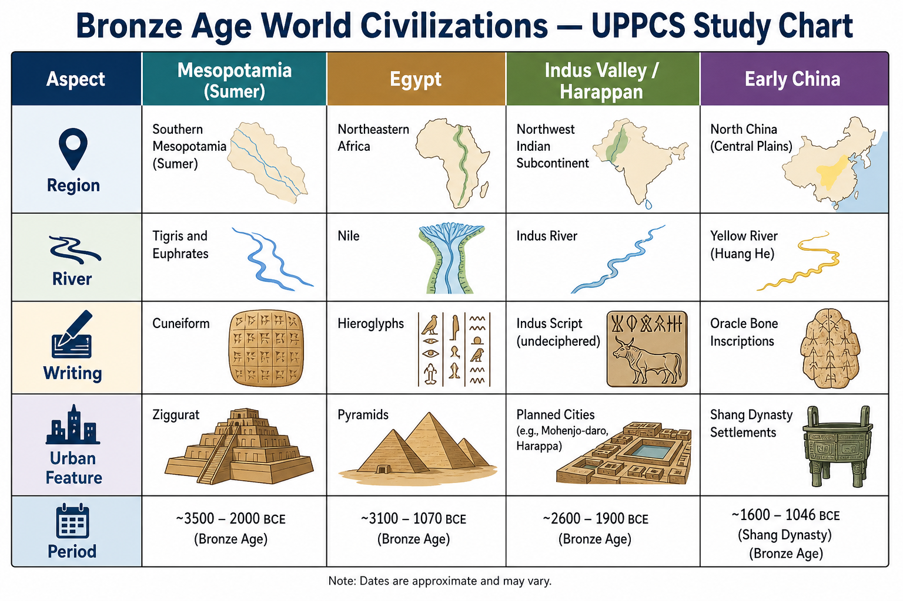
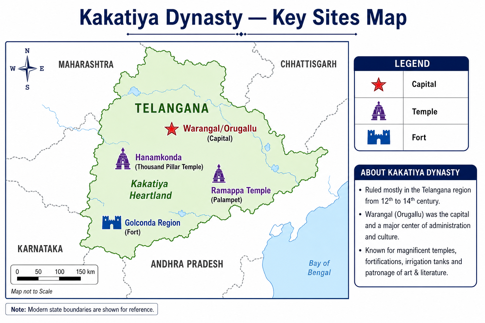

# Topic 14 — Ancient India Miscellaneous
### ★ Complete Source of Truth — No other book/notes needed for this topic

> **Covers syllabus:** World Civilizations | Civilizations and their Characteristics | Puranas | Materialist Thinkers | Kakatiya Dynasty | Major Rulers of Kakatiya Dynasty | Achievements of Kakatiya Dynasty  
> **Sources baked in:** NCERT *Themes in Indian History* I–II, RS Sharma, standard world history references, Puranic studies, Telangana/Kakatiya state archaeology, UPPCS/UPSC PYQs  
> **Exam weight:** ★★ Medium-High — Puranas as source (2023 Q29), Kakatiya capital Warangal (2019 Q90), Shriparvatiya-Ikshvakus (2020 Q2), world ethnic-group matching (2020 Q80)  
> **Last verified:** July 2026

---

## Quick Revision Box — Raata This First

```
BRONZE AGE WORLD TRIO (with IVC):
  Mesopotamia (Sumer) — Tigris-Euphrates | cuneiform | ziggurat | city-states
  Egypt — Nile | pharaoh | pyramids | hieroglyphs
  Indus/Harappan — planned cities | seals | drainage | Meluhha trade
  China (Shang) — Yellow River | oracle bones | bronze ritual vessels

PURANAS (★★★ 2023 Q29):
  18 Mahapuranas + 18 Upapuranas
  Panchalakshana: Sarga, Pratisarga, Vamsha, Manvantara, Vamshanucharita
  Vishnu Purana = Mauryan dynasty info (TRUE — Only 1 correct)
  Vayu Purana = Gupta governance details (FALSE trap)
  2020 Q2: Shriparvatiya in Puranas = Ikshvakus (Nagarjunakonda)

CHARVAKA / MATERIALIST:
  Lokayata/Brihaspatya school | Perception (pratyaksha) ONLY pramana
  No soul, no karma, no rebirth | Hedonist ethics | Extinct school

KAKATIYA DYNASTY (12th–14th c. CE):
  Capital = Warangal (Orugallu) ← 2019 Q90 (Kaktiya ↔ 1)
  Region = Telangana | Period ~1163–1323 CE
  Rulers: Prola II → Ganapatideva → Rudramadevi → Prataparudra II
  Achievements: Thousand Pillar Temple, Ramappa Temple (UNESCO 2021), tank irrigation
  Fall: Malik Kafur / Alauddin Khalji captured Warangal (1323)

2019 Q90 MATCH (Answer B = 2-3-4-1):
  Pallava → Kanchi (2) | Pandya → Madura (3)
  Yadava → Devagiri (4) | Kakatiya → Warangal (1)
```

### Must-Know Term Comparisons (very frequently asked)

| Term | One-line difference | Hindi |
|------|---------------------|-------|
| **Mesopotamia vs Egypt** | Mesopotamia = Tigris-Euphrates city-states, cuneiform; Egypt = Nile unified kingdom, hieroglyphs | मेसोपोटामिया / मिस्र |
| **Harappan vs Mesopotamian cities** | Harappan = grid town planning + drainage; Mesopotamian = ziggurat temple-centred | हड़प्पा नगर / मेसोपोटामियन नगर |
| **Mahapurana vs Upapurana** | Mahapurana = 18 major texts (5 traits); Upapurana = 18 minor/supplementary Puranas | महापुराण / उपपुराण |
| **Vishnu Purana vs Vayu Purana** | Vishnu Purana has usable Mauryan genealogy (2023 Q29); Vayu Purana NOT reliable for Gupta governance | विष्णु पुराण / वायु पुराण |
| **Charvaka vs Vedanta** | Charvaka = materialist, perception-only; Vedanta = Brahman ultimate reality, Vedic orthodoxy | चार्वाक / वेदांत |
| **Charvaka vs Buddhism** | Charvaka denies soul/rebirth; Buddhism accepts karma and rebirth (not materialist) | चार्वाक / बौद्ध |
| **Kakatiya vs Yadava** | Kakatiya capital Warangal (Telangana); Yadava capital Devagiri/Daulatabad (Maharashtra) | काकतीय / यादव |
| **Ganapatideva vs Rudramadevi** | Ganapatideva = peak Kakatiya expansion; Rudramadevi = famous female monarch (granddaughter) | गणपतिदेव / रुद्रमादेवी |
| **Warangal vs Devagiri** | Warangal = Kakatiya capital; Devagiri = Yadava capital (2019 Q90 trap swap) | वारंगल / देवगिरी |
| **Shriparvatiya vs Vakataka** | Shriparvatiya in Puranas = Ikshvakus of Nagarjunakonda; Vakatakas ruled Vidarbha-Deccan | श्रीपर्वतीय / वाकाटक |

### Memory Tricks

| Trick | Remembers |
|-------|-----------|
| **2023 Q29 = A** | Only 1 — Vishnu Purana has Mauryas |
| **2020 Q2 = B** | Shriparvatiya = Ikshvakus |
| **2019 Q90 = B** | 2-3-4-1 dynasty-capital match |
| **Warangal = Kakatiya** | Not Yadava, not Pallava |
| **C-4-M-E-C** | Bronze Age: China, Mesopotamia, Egypt, (Harappan) Civilization cluster |
| **5 P's of Purana** | Sarga, Pratisarga, Vamsha, Manvantara, Vamshanucharita |
| **Charvaka = 1 sense** | Only pratyaksha pramana |
| **G-R-P fall order** | Ganapatideva peak → Rudramadevi → Prataparudra defeated 1323 |
| **Ramappa UNESCO 2021** | Kakatiya temple heritage |
| **Vayu trap** | Vayu Purana ≠ Gupta governance manual |

---

## Exam Visuals — High-ROI Images

> **Type priority:** comparison chart → location map. Images stored locally (`images/`) so they open offline.

### 1. Bronze Age World Civilizations — Comparison Chart



*Raata **civilization ↔ river ↔ script ↔ feature**. **Mesopotamia** = cuneiform + ziggurat. **Egypt** = Nile + hieroglyphs + pyramids. **Harappan** = planned cities + seals + Meluhha. **China (Shang)** = Yellow River + oracle bones. All **Bronze Age** (~3000–1500 BCE).*
*Source: Study chart — generated for UPPCS world civilization matching*

### 2. Kakatiya Dynasty — Key Sites Map



*Raata **dynasty ↔ capital ↔ monument**. **Kakatiya capital = Warangal (Orugallu)** — **2019 Q90**. **Thousand Pillar Temple** = Hanamkonda. **Ramappa Temple** = Palampet (UNESCO 2021). Trap: **Devagiri = Yadava**, not Kakatiya.*
*Source: Study map — generated for UPPCS dynasty-capital PYQs*

---

## 14.1 World Civilizations

### Definitions (learn all — exams pick different ones)

| Term | Meaning |
|------|---------|
| **World Civilization** | Complex society with urban centres, surplus agriculture, craft specialization, writing/administration, and cultural continuity |
| **Bronze Age Civilization** | Culture using bronze metallurgy with urban or state-level organization (~4th–2nd millennium BCE globally) |
| **City-State** | Independent urban polity with surrounding territory — typical of Mesopotamian Sumer |
| **River Valley Civilization** | Early civilization centred on major river systems enabling irrigation agriculture |

### World Civilizations — How It Works

- **Civilization** implies **surplus food** → **specialized crafts** → **urban centres** → **writing/administration** → **cultural institutions** (temples, law, art).
- **Four early Old World cores** tested in exams: **Mesopotamia, Egypt, Indus Valley, China (Shang)** — all Bronze Age riverine cultures.
- **Mesopotamia (Sumer/Akkad/Babylon)** — **Tigris-Euphrates** floodplain; **cuneiform** script on clay tablets; **ziggurat** temples; city-states like **Ur, Uruk, Babylon**.
- **Ancient Egypt** — **Nile** monoculture; **pharaonic** divine kingship; **pyramids** and tombs; **hieroglyphic** script; strong centralized bureaucracy.
- **Indus Valley (Harappan)** — **Indus-Ghaggar** system; **planned grid cities** (Mohenjo-daro, Harappa); **undeciphered script**; trade partner **Meluhha** in Mesopotamian records.
- **Early China (Shang dynasty)** — **Yellow River (Huang He)**; **oracle bone** script (earliest Chinese writing); bronze **ritual vessels**; ancestor worship state ideology.
- **New World civilizations** (Maya, Aztec, Inca) — later/separate trajectory; maize-based agriculture; no contact with Old World Bronze Age trio.
- **Greek-Roman** civilizations emerge **later** (Iron Age/classical) — democracy/philosophy (Greece), law/engineering (Rome) — distinct exam bucket from Bronze Age.
- **Inter-civilization contact** — Harappan **seal** in Mesopotamia; **lapis lazuli** from Afghanistan in IVC; **no evidence** Harappans copied Egyptian pyramids.

> **Exam note:** Trap — **"Harappan script is read like Egyptian hieroglyphs"** — Harappan script remains **undeciphered**. Bronze Age trio = Mesopotamia + Egypt + Harappan (standard NCERT framing).

### Major Old World Civilizations (Complete Table)

| # | Civilization | River/Region | Script | Signature Feature | Approx. Period |
|---|--------------|--------------|--------|-------------------|----------------|
| 1 | **Sumer/Mesopotamia** | Tigris-Euphrates | Cuneiform | Ziggurat, Code of Hammurabi | c. 3500–539 BCE |
| 2 | **Ancient Egypt** | Nile | Hieroglyphs | Pyramids, pharaonic state | c. 3100–30 BCE |
| 3 | **Harappan (IVC)** | Indus-Ghaggar | Indus script (undeciphered) | Planned cities, Great Bath | c. 2600–1900 BCE |
| 4 | **Shang China** | Yellow River | Oracle bone script | Bronze ding vessels | c. 1600–1046 BCE |
| 5 | **Minoan (Crete)** | Mediterranean | Linear A (undeciphered) | Palace of Knossos | c. 2700–1450 BCE |
| 6 | **Mycenaean Greece** | Greek mainland | Linear B (early Greek) | Fortified citadels | c. 1600–1100 BCE |
| 7 | **Persian (Achaemenid)** | Iran plateau | Cuneiform/Aramaic | Royal road, satrap system | c. 550–330 BCE |
| 8 | **Roman** | Mediterranean | Latin | Law, engineering, republic-empire | c. 753 BCE–476 CE |

### Exam Facts (raata)

- Bronze Age Old World core four: Mesopotamia, Egypt, Indus, China (Shang)
- Mesopotamia = cuneiform + ziggurat + city-states
- Egypt = Nile + pharaoh + pyramids + hieroglyphs
- Harappan = planned drainage cities + Meluhha trade name
- Shang China = oracle bones + bronze rituals
- Harappan script still undeciphered
- Greek-Roman = later classical, not Bronze Age core

### PYQs — World Civilizations

1. **(UPPCS Prelims 2020, Q80)** Match List-I (Ethnic Group) with List-II (Country): A. Jews  B. Teda  C. Beja  D. Lur → 1. Egypt  2. Iran  3. Libya  4. Israel  
   → **C — 4-1-3-2** (Jews-Israel, Teda-Egypt, Beja-Libya, Lur-Iran). Tests world geography-ethnicity linkage.

2. **(UPSC Prelims 2014 — pattern)** The area known as 'Garden of Eden' in Bible is generally identified with:  
   A. Egypt  B. Mesopotamia  C. India  D. China  
   → **B — Mesopotamia** (Tigris-Euphrates region).

### Examples (14.1)

| Example | Why exam-relevant |
|---------|-------------------|
| **Ur, Mesopotamia** | Classic Sumerian city-state with ziggurat |
| **Meluhha in Sumerian texts** | Harappan trade link with Mesopotamia |
| **Oracle bones, Anyang** | Shang China earliest readable Chinese writing |

---

## 14.2 Civilizations and their Characteristics

### Definitions (learn all — exams pick different ones)

| Term | Meaning |
|------|---------|
| **Civilizational Characteristics** | Defining traits: geography, technology, political form, religion, art, writing, economic base |
| **Urban Revolution** | Transition from village farming to walled cities with administrative elite (Childe's criteria adapted in NCERT) |
| **Theocratic State** | Political authority fused with temple priesthood — early Mesopotamia |
| **Hydraulic Civilization** | State power built on large-scale irrigation management — Nile, Mesopotamia, possibly Harappan |

### Civilizations and their Characteristics — How It Works

- **Geography shapes civilization** — river floods deposit silt (fertile surplus) but require **coordination** (canals, dikes) → strong administration.
- **Mesopotamian characteristics** — **poly-city state** competition; **temple economy**; **cuneiform** for accounts/law; **bronze + wheel + plough**; frequent warfare and empire cycles (Sargon, Hammurabi, Assyria, Babylon).
- **Egyptian characteristics** — **Nile regularity** enabled **stable unified monarchy**; **divine pharaoh**; **afterlife-focused** tomb culture (pyramids, mummification); **less urban fragmentation** than Mesopotamia.
- **Harappan characteristics** — **standardized bricks/weights**; **urban planning** (grid, covered drains); **no monumental temples/palaces** found; **peaceful image** (few weapons); **trade-oriented** economy.
- **Chinese (Shang) characteristics** — **ancestor cult**; **bronze ritual sets** for elite burials; **oracle bone divination** tied to kingship; **chariot warfare** technology.
- **Writing as civilization marker** — administration, religion, literature preserved; but **Indus script** unreadable limits political history reconstruction.
- **Religion patterns** — Mesopotamia (polytheism, enuma elish); Egypt (Ra, Osiris, ma'at order); Harappan (proto-Shiva Pashupati seal?, mother goddess); Shang (Di + ancestors).
- **Decline patterns differ** — Egypt: continuity through dynasties; Mesopotamia: conquest replacement; Harappan: **de-urbanization** (~1900 BCE) with environmental + economic causes debated.
- **Comparative trap** — civilizations are **not identical stages** — different political forms (pharaoh vs city-state vs Harappan corporate groups).

> **Exam note:** Multi-statement questions test **one wrong characteristic** — e.g., "Harappan had ziggurats" = FALSE; "Egypt depended on Nile inundation" = TRUE.

### Civilization Characteristics — Comparison Matrix

| Trait | Mesopotamia | Egypt | Harappan (IVC) | Shang China |
|-------|-------------|-------|----------------|-------------|
| **River** | Tigris-Euphrates | Nile | Indus-Ghaggar | Yellow River |
| **Political form** | City-states → empires | Unified pharaonic state | City centres, unclear kings | Kings + clans |
| **Writing** | Cuneiform (read) | Hieroglyphs (read) | Indus script (unread) | Oracle bones (read) |
| **Monument** | Ziggurat | Pyramid | Great Bath, granaries | Bronze vessels |
| **Economy** | Temple + trade | Nile grain surplus | Agri + craft + trade | Agri + bronze elite |
| **Religion** | Polytheistic pantheon | Divine pharaoh, afterlife | Unresolved (Pashupati?) | Ancestors + Di |

### Exam Facts (raata)

- River surplus = foundation of all four Bronze cores
- Mesopotamia = city-state fragmentation + cuneiform law
- Egypt = Nile unity + divine kingship + pyramids
- Harappan = urban planning + standardization + trade
- Shang = ancestor worship + oracle bone writing
- Harappan decline = de-urbanization ~1900 BCE
- Compare traits — do not assume identical political forms

### PYQs — Civilizations and their Characteristics

1. **(UPSC Prelims 2016 — pattern)** Consider Harappan civilization:
   1. It had contact with Mesopotamia.
   2. It was contemporary with Egyptian Old Kingdom.  
   → **Both correct** — Bronze Age trade + chronology overlap.

2. **(UPSC Prelims 2013 — pattern)** Which civilization first developed urban life on Indian soil?  
   A. Vedic  B. Harappan  C. Gupta  D. Mauryan  
   → **B — Harappan** — first urban civilization in India.

### Examples (14.2)

| Example | Why exam-relevant |
|---------|-------------------|
| **Code of Hammurabi** | Mesopotamian law as civilizational trait |
| **Great Bath, Mohenjo-daro** | Harappan public hydraulics vs Egyptian/Mesopotamian monuments |
| **Mummification** | Distinctive Egyptian afterlife characteristic |

---

## 14.3 Puranas

### Definitions (learn all — exams pick different ones)

| Term | Meaning |
|------|---------|
| **Puranas** | Genre of Sanskrit texts with mythology, cosmology, genealogy (vamsha), pilgrimage (tirtha), and dharmashastra material |
| **Mahapurana** | One of **18 major Puranas** traditionally ascribed five characteristics (panchalakshana) |
| **Upapurana** | **18 minor/supplementary** Puranas — regional or sectarian focus |
| **Panchalakshana** | Five traits of Mahapurana: **Sarga** (creation), **Pratisarga** (dissolution), **Vamsha** (genealogy), **Manvantara** (cosmic cycles), **Vamshanucharita** (royal dynasties) |

### Puranas — How It Works

- **Puranas** are **post-Vedic** encyclopaedic texts — mostly compiled **Gupta period onward** (4th–10th century CE) though preserving older oral genealogies.
- **18 Mahapuranas** grouped by deity orientation: **Brahma (1), Vishnu (6), Shiva (6), miscellaneous (5)** — exam may test counts.
- **Historical value** — Puranas contain **royal genealogies** (Solar/Lunar dynasties, Mauryas, Andhras) but mixed with **mythology** — must cross-check with inscriptions.
- **Vishnu Purana** — contains **Mauryan dynasty information** ← **2023 Q29 statement 1 = TRUE**.
- **Vayu Purana** (and Vishnu in parts) lists **Gupta genealogy** but **does NOT reliably document Gupta administrative system** ← **2023 Q29 statement 2 = FALSE trap**.
- **Puranas as smriti** — secondary to Vedas; used for **popular Hindu practice**, temple lore, vrata-katha (fasting stories).
- **Regional Purana names** — **Bhagavata Purana** (Krishna); **Shiva Purana**; **Markandeya Purana** (Devi Mahatmya); **Agni Purana** (weapons/architecture); **Skanda Purana** (largest, pilgrimage).
- **2020 Q2 — Shriparvatiya** — Puranas call **Ikshvakus of Nagarjunakonda** (Andhra) **Shriparvatiya** rulers (Sriparvata = Nagarjunakonda hill).
- **Purana Qila (Delhi)** — medieval fort name only; **NOT a Purana text** — trap unrelated to this section.
- **Criticism by historians** — Puranic king-lists have **inflated reign lengths** and **duplicated names** — use as **supplementary** source only.

> **Exam note:** **2023 Q29 answer = A (Only 1)**. Statement 2 is the classic trap — Vayu Purana does **not** provide dependable Gupta governance details.

### 18 Mahapuranas (Complete List)

| # | Purana | Deity Orientation |
|---|--------|-------------------|
| 1 | Brahma Purana | Brahma |
| 2 | Padma Purana | Vishnu |
| 3 | Vishnu Purana | Vishnu |
| 4 | Shiva Purana | Shiva |
| 5 | Bhagavata Purana | Vishnu (Krishna) |
| 6 | Narada Purana | Vishnu |
| 7 | Markandeya Purana | Vishnu/Devi |
| 8 | Agni Purana | Vishnu |
| 9 | Bhavishya Purana | Brahma/Vishnu |
| 10 | Brahmavaivarta Purana | Krishna |
| 11 | Linga Purana | Shiva |
| 12 | Varaha Purana | Vishnu |
| 13 | Skanda Purana | Shiva (largest) |
| 14 | Vamana Purana | Vishnu |
| 15 | Kurma Purana | Vishnu |
| 16 | Matsya Purana | Vishnu |
| 17 | Garuda Purana | Vishnu |
| 18 | Brahmanda Purana | Brahma |

### Puranas as Historical Sources (High-Yield)

| Purana / Text | Historical Use | Reliability |
|---------------|----------------|-------------|
| **Vishnu Purana** | Mauryan dynasty genealogy | Moderate — 2023 Q29 confirms use |
| **Vayu Purana** | Gupta genealogy | Low for governance/administration |
| **Matsya Purana** | Ancient geography, tirthas | Moderate for culture |
| **Bhagavata Purana** | Krishna cult history | Religious, not political chronology |
| **Puranic king lists** | Dynastic sequence | Cross-check with epigraphy |

### Exam Facts (raata)

- 18 Mahapuranas + 18 Upapuranas
- Panchalakshana = five defining traits
- Vishnu Purana has Mauryan info (2023 Q29)
- Vayu Purana Gupta governance = FALSE trap
- Shriparvatiya = Ikshvakus (2020 Q2)
- Puranas compiled mainly Gupta era onward
- Genealogy useful but myth-mixed — verify with inscriptions

### PYQs — Puranas

1. **(UPPCS Prelims 2023, Q29)** With reference to the Puranas, which statement is correct?  
   1. Mauryan dynasty information in Vishnu Purana.  
   2. Vayu Purana throws light on Gupta system of governance.  
   → **A — Only 1.** Statement 2 is unreliable trap.

2. **(UPPCS Prelims 2020, Q2)** The rulers of which dynasty are called 'Shriparvatiya' in Puranas?  
   A. Vakatakas  B. Ikshvakus  C. Shakas  D. Kharavelas  
   → **B — Ikshvakus** (Nagarjunakonda Andhra dynasty on Sriparvata hill).

### Examples (14.3)

| Example | Why exam-relevant |
|---------|-------------------|
| **Vishnu Purana Maurya list** | 2023 Q29 direct hit |
| **Ikshvakus = Shriparvatiya** | 2020 Q2 Puranic dynastic name |
| **Skanda Purana** | Largest Purana — pilgrimage encyclopaedia |

---

## 14.4 Materialist Thinkers

### Definitions (learn all — exams pick different ones)

| Term | Meaning |
|------|---------|
| **Materialist Thinkers** | Philosophers who regard **matter/nature** as primary reality — deny or minimize soul, god, afterlife |
| **Charvaka (Lokayata)** | Ancient Indian **materialist/nastika** school — perception-only epistemology |
| **Nastika** | "Not orthodox" — rejects Vedic authority (Buddhism, Jainism, Ajivika, Charvaka) |
| **Brihaspatya** | Alternative name for Charvaka — linked to sage **Brihaspati** (tradition says author) |

### Materialist Thinkers — How It Works

- **Indian philosophy** is mostly **spiritual/idealist** (Vedanta, Sankhya, Buddhism) — **Charvaka/Lokayata** is the major **materialist exception**.
- **Charvaka epistemology** — **only Pratyaksha (direct perception)** is valid **pramana** (means of knowledge); **inference (anumana) rejected** — "can't prove fire from smoke logically."
- **Metaphysics** — **four elements** (earth, water, fire, air); **consciousness arises from matter** (body like intoxication — mind from fermented grain analogy).
- **No soul (atman)** — self is **body-mind complex**; death = **complete annihilation**.
- **No karma, no rebirth, no heaven/hell** — ethics derived from **worldly pleasure** (hedonism); famous quote: *"While life remains, happy be; no debt for ghee when life is gone."*
- **Ethics** — pleasure is highest good; **intelligent hedonism** (avoid pain that outweighs pleasure) in some versions.
- **Extinct school** — no Charvaka texts survive intact; known through **Buddhist/Jain/Mimamsa polemics** (Sarvasiddhanta Samgraha, Madhavacharya's doxographies).
- **Ajivika contrast** — Ajivikas are **fatalists** (niyati determines all), **not materialists**; founded by **Gosala Makkhaliputta**.
- **Buddhist/Jain critique** — Charvakas called worst sinners for undermining moral restraint; yet historically important as **rationalist critique** of ritualism.
- **Modern relevance** — Charvaka represents **empiricist strand** in Indian thought — comparable loosely to Greek atomists (Democritus) but distinct.

> **Exam note:** Trap — **"Buddhism is materialist"** = FALSE (Buddha accepted karma/rebirth). **"Charvaka accepted inference"** = FALSE (perception only).

### Indian Philosophical Schools — Nastika vs Astika

| School | Type | Key Belief | Materialist? |
|--------|------|------------|--------------|
| **Charvaka** | Nastika | Perception only; no soul | **Yes** |
| **Buddhism** | Nastika | Karma, no-self (anatta) | No |
| **Jainism** | Nastika | Karma, soul liberation | No |
| **Ajivika** | Nastika | Fatalism (niyati) | No |
| **Nyaya-Vaisheshika** | Astika | Logic + atoms; Vedic | No (not materialist ethics) |
| **Vedanta** | Astika | Brahman ultimate reality | No |

### Exam Facts (raata)

- Charvaka = main Indian materialist school
- Lokayata = Brihaspatya = Charvaka
- Perception (pratyaksha) only valid pramana
- No soul, karma, rebirth, heaven
- Pleasure (hedonism) as ethics
- Texts lost — known from opponents' accounts
- Ajivika = fatalist, not materialist
- Buddhism denies Vedas but accepts rebirth

### PYQs — Materialist Thinkers

1. **(UPSC Prelims 2019 — pattern)** Charvaka school accepts only one pramana. Which?  
   A. Perception  B. Inference  C. Testimony  D. Comparison  
   → **A — Perception (pratyaksha) only.**

2. **(UPSC Prelims 2017 — pattern)** Which nastika school denies the existence of soul and rebirth?  
   A. Buddhism  B. Jainism  C. Charvaka  D. Ajivika  
   → **C — Charvaka.**

### Examples (14.4)

| Example | Why exam-relevant |
|---------|-------------------|
| **Charvaka "no debt for ghee"** | Famous hedonist quote in exams |
| **Body-intoxication analogy** | Consciousness-from-matter argument |
| **Madhavacharya's Sarvadarshanasamgraha** | Source preserving Charvaka fragments |

---

## 14.5 Kakatiya Dynasty

### Definitions (learn all — exams pick different ones)

| Term | Meaning |
|------|---------|
| **Kakatiya Dynasty** | Medieval Telugu dynasty ruling **Warangal/Telangana** region (~12th–14th century CE) |
| **Orugallu** | Sanskrit/Telugu name for **Warangal** — Kakatiya capital ("one stone" fort) |
| **Shriparvata** | Sacred hill — unrelated to Kakatiya; Ikshvaku region (do not confuse with Kakatiya) |

### Kakatiya Dynasty — How It Works

- **Kakatiyas** emerged as **feudatories of Western Chalukyas** — rose to independence in **12th century CE**.
- **Core territory** — **Telangana** (Warangal, Karimnagar, Nalgonda) — **NOT Uttar Pradesh**; exams test **Deccan geography**.
- **Capital** — **Warangal (Orugallu)** with **Hanamkonda** as early secondary capital ← **2019 Q90: Kakatiya ↔ Warangal (1)**.
- **Timeline** — c. **1163–1323 CE**; peak under **Ganapatideva** and **Rudramadevi**; ended with **Prataparudra II**.
- **Political model** — **nayankara system** (feudatory chiefs) supporting central Kakatiya authority; **fort-network** across hills.
- **Conflict with Delhi Sultanate** — **Alauddin Khalji's** general **Malik Kafur** raided Warangal (**1310** tribute); final fall **1323** when **Ghiasuddin Tughlaq/Ulugh Khan** captured Prataparudra.
- **2022 Q59 / 2025 Q30** — Warangal appears in **Alauddin Khalji conquest chronology** — connects to Kakatiya defeat (medieval overlap).
- **2018 Q96 trap** — **"Warangal — Ramchandra Dev"** is **NOT correctly matched** — Warangal = **Kakatiya** rulers (Ganapatideva/Rudramadevi/Prataparudra), not Ramchandra Dev.
- **Cultural identity** — Telugu-speaking rulers patronizing **Telugu + Sanskrit**; Shaivite temple architecture flourished.
- **Succession** — Ganapatideva made daughter **Rudramadevi** successor (rare female monarch) — strengthened legitimacy.

> **Exam note:** **Kakatiya capital = Warangal** — trap swaps with **Devagiri (Yadava)** or **Kanchi (Pallava)** in matching questions (2019 Q90).

### Kakatiya vs Contemporary Deccan Dynasties

| Dynasty | Capital | Region | Period (approx.) |
|---------|---------|--------|------------------|
| **Kakatiya** | Warangal (Orugallu) | Telangana | 12th–14th c. CE |
| **Yadava (Seuna)** | Devagiri (Daulatabad) | Maharashtra | 12th–14th c. CE |
| **Hoysala** | Dwarasamudra (Halebidu) | Karnataka | 11th–14th c. CE |
| **Pallava** | Kanchi (Kanchipuram) | Tamil Nadu | 3rd–9th c. CE |
| **Pandya** | Madura (Madurai) | Tamil Nadu | Ancient–medieval |

### Exam Facts (raata)

- Kakatiya capital = Warangal (Orugallu)
- Region = Telangana (not UP)
- Period ~1163–1323 CE
- 2019 Q90: Kakatiya → Warangal
- Feudatories of Chalukyas initially
- Fell to Delhi Sultanate 1323
- Warangal ≠ Ramchandra Dev (2018 Q96 trap)
- Nayankara feudatory system

### PYQs — Kakatiya Dynasty

1. **(UPPCS Prelims 2019, Q90)** Match dynasties ↔ capitals: A. Pallava  B. Pandya  C. Yadava  D. Kaktiya → 1. Warangal  2. Kanchi  3. Madura  4. Devagiri  
   → **B — 2-3-4-1** (Pallava-Kanchi, Pandya-Madura, Yadava-Devagiri, Kakatiya-Warangal).

2. **(UPPCS Prelims 2018, Q96 — pattern)** Which pair is NOT correctly matched? **B. Warangal — Ramchandra Dev** — wrong; Warangal = Kakatiya rulers.

### Examples (14.5)

| Example | Why exam-relevant |
|---------|-------------------|
| **Warangal Fort** | Kakatiya capital citadel |
| **Malik Kafur raid 1310** | Delhi-Kakatiya conflict |
| **2019 Q90 matching** | Direct dynasty-capital PYQ |

---

## 14.6 Major Rulers of Kakatiya Dynasty

### Definitions (learn all — exams pick different ones)

| Term | Meaning |
|------|---------|
| **Prola II** | Kakatiya ruler who consolidated independence from Chalukyas (late 12th c.) |
| **Ganapatideva** | Greatest Kakatiya expander — built empire across Telugu country |
| **Rudramadevi** | Kakatiya queen who ruled as **Rudradeva** (1263–1295/96) |
| **Prataparudra II** | Last major Kakatiya ruler — defeated by Delhi Sultanate 1323 |

### Major Rulers of Kakatiya Dynasty — How It Works

- **Prola II (c. 1110–1157 CE)** — early Kakatiya chief; **feudatory → sovereign** transition begins; fortified **Hanamkonda**.
- **Mahadeva** — brief rule; succeeded by daughter's son **Ganapatideva**.
- **Ganapatideva (c. 1199–1262 CE)** — **greatest Kakatiya conqueror**; extended rule from **Godavari to Krishna**; built **Warangal fort** expansions; **patron of temples**; later abdicated for daughter.
- **Rudramadevi (c. 1263–1295/96)** — ruled as **Rudradeva** (male royal name for administration); **one of few female monarchs** in Indian history; **Marco Polo** reportedly mentions Andhra ruled by a queen (debated link).
- **Prataparudra II (c. 1296–1323 CE)** — faced **repeated Delhi Sultanate invasions**; paid tribute after Malik Kafur raid; **final defeat 1323** — legend of self-sacrifice on Narmada/persecution in Persian accounts.
- **Succession innovation** — Ganapatideva nominated **daughter over sons** — unusual but stabilized dynasty.
- **Military organization** — **horse archers + fort garrisons**; Kakatiya **thoranas** (four ornamental gates) symbolize royal power.
- **Religious patronage** — **Shaivite** primarily; also Vaishnavite grants; **Thousand Pillar Temple** credited to Rudradeva/Rudramadevi era.
- **Administrative continuity** — **nayankara** chiefs collected revenue and supplied troops — precursor to Vijayanagara amaranayaka system.
- **Dynastic end** — after 1323, Telangana passed to **Delhi**, later **Bahmani**, then **Qutb Shahi** (Golconda).

> **Exam note:** **Rudramadevi** is the **most asked Kakatiya ruler** — female monarch + Thousand Pillar Temple era. Trap: **"Prataparudra founded Kakatiya dynasty"** — he was the **last**, not founder.

### Kakatiya Rulers — Chronology Table

| # | Ruler | Period (approx.) | Key Fact |
|---|-------|------------------|----------|
| 1 | Prola II | fl. 12th c. | Independence from Chalukyas |
| 2 | Mahadeva | d. 1198 | Short reign |
| 3 | **Ganapatideva** | c. 1199–1262 | Maximum territorial expansion |
| 4 | **Rudramadevi** | c. 1263–1295/96 | Female monarch (Rudradeva title) |
| 5 | **Prataparudra II** | c. 1296–1323 | Last ruler; defeated 1323 |

### Exam Facts (raata)

- Ganapatideva = greatest Kakatiya expander
- Rudramadevi = female ruler (Rudradeva name)
- Prataparudra II = last Kakatiya king
- Prola II = early independence phase
- Ganapatideva abdicated for Rudramadevi
- Defeated by Delhi Sultanate 1323
- Marco Polo queen reference (debated)

### PYQs — Major Rulers of Kakatiya Dynasty

1. **(UPPCS Prelims 2019, Q90)** Kakatiya capital Warangal — dynasty-ruler association tested via capital match. Rulers above explain who held Warangal.

2. **(UPSC Prelims 2018 — pattern)** Rudramadevi belonged to which dynasty?  
   A. Chola  B. Kakatiya  C. Hoysala  D. Pandya  
   → **B — Kakatiya.**

### Examples (14.6)

| Example | Why exam-relevant |
|---------|-------------------|
| **Ganapatideva's abdication** | Rudramadevi succession |
| **Prataparudra II tribute 1310** | Delhi Sultanate pressure |
| **Rudramadevi as Rudradeva** | Female kingship title practice |

---

## 14.7 Achievements of Kakatiya Dynasty

### Definitions (learn all — exams pick different ones)

| Term | Meaning |
|------|---------|
| **Thousand Pillar Temple** | 12th-century **Shaivite** temple at **Hanamkonda** — star-shaped platform, intricate carving |
| **Ramappa Temple** | Kakatiya temple at **Palampet** — **UNESCO World Heritage Site 2021** ("floating bricks") |
| **Kakatiya Thorana** | Four ornamental **gateways** of Warangal fort — icon of Telangana |
| **Tank Irrigation** | Kakatiya **reservoir/lake system** (Ramappa Lake, Pakhal Lake) for agriculture |

### Achievements of Kakatiya Dynasty — How It Works

- **Temple architecture** — Kakatiya style = **lighter sandstone, intricate bracket figures, cruciform plans, sandbox foundations** absorbing earthquakes.
- **Thousand Pillar Temple (Rudreshwara/Rudradeva Temple)** — **Hanamkonda**; triple shrine (Shiva, Surya, Vishnu); **1213 CE** inscription tradition; named for numerous carved pillars.
- **Ramappa Temple (Rudreshwara, Palampet)** — built **1213 CE** under **Recharla Rudra** (general of Ganapatideva); famous **"floating bricks"** (low-density porous clay); **UNESCO WHS 2021**.
- **Warangal Fort + Thoranas** — massive **laterite/stone** fortifications; **four Kakatiya Thoranas** (Eastern, Western, Southern, Northern gates) — state emblem of Telangana.
- **Irrigation engineering** — **Ramappa Lake** (Pakhal variant) fed fields; **chain tank system** across Telangana hills — sustainable rain-fed agriculture model.
- **Art & craft** — **bronze icons**, **terracotta**, **temple jewellery** traditions; **Perini Shivatandavam** dance linked to Kakatiya military culture.
- **Literary patronage** — **Telugu** gained court status alongside Sanskrit; **Nannaya** (Andhra Mahabharata) emerged in adjacent cultural zone.
- **Trade** — access to **Golconda diamond** hinterland (later famous); routes connecting **east coast** and **Deccan interior**.
- **Administrative achievement** — **nayankara feudatory** system balanced local autonomy with royal control — model for later Deccan states.
- **Legacy** — Kakatiya monuments = **major heritage tourism**; Ramappa UNESCO raised global profile; Warangal thorana on Telangana state logo.

> **Exam note:** **Ramappa Temple = UNESCO 2021** — high-yield current-static crossover. Trap: **"Thousand Pillar Temple is at Warangal fort"** — it is at **Hanamkonda**, not inside fort.

### Kakatiya Achievements — Master Table

| # | Achievement | Location | Significance |
|---|-------------|----------|--------------|
| 1 | Thousand Pillar Temple | Hanamkonda | Star-shaped Kakatiya architecture |
| 2 | Ramappa Temple | Palampet | UNESCO WHS 2021; floating bricks |
| 3 | Warangal Fort | Warangal | Capital defence |
| 4 | Kakatiya Thoranas | Warangal gates | Four ornamental gateways |
| 5 | Ramappa/Pakhal Lakes | Telangana | Tank irrigation system |
| 6 | Nayankara administration | Regional | Feudatory governance model |
| 7 | Shaivite temple complexes | Telangana | Religious patronage |
| 8 | Telugu court culture | Regional | Literary emergence support |

### Exam Facts (raata)

- Thousand Pillar Temple = Hanamkonda
- Ramappa Temple = UNESCO 2021 (Palampet)
- Floating bricks = Ramappa engineering
- Kakatiya Thoranas = Warangal four gates
- Tank irrigation = Ramappa/Pakhal lakes
- Temple style = sandbox foundation + bracket figures
- Golconda diamond region in hinterland
- Perini dance linked to Kakatiya era

### PYQs — Achievements of Kakatiya Dynasty

1. **(UPSC Prelims 2021 — pattern)** Ramappa Temple, recently in news, is located in:  
   A. Karnataka  B. Telangana  C. Andhra Pradesh  D. Maharashtra  
   → **B — Telangana** (Palampet, Kakatiya monument; UNESCO 2021).

2. **(UPPCS Prelims 2022, Q59 — context)** Warangal in Alauddin Khilji's conquest order — reflects Kakatiya capital's strategic importance before 1323 fall.

### Examples (14.7)

| Example | Why exam-relevant |
|---------|-------------------|
| **Ramappa Temple UNESCO 2021** | Latest exam-current static |
| **Kakatiya Thorana emblem** | Telangana state symbol |
| **Thousand Pillar star shrine** | Architecture identification |

---

## Consolidated Reference

### Important Dates & Numbers

| Date / Number | Event |
|---------------|-------|
| **c. 2600 BCE** | Mature Harappan contemporary with Mesopotamia/Egypt |
| **c. 3100 BCE** | Early Dynastic Egypt unification |
| **c. 3500 BCE** | Sumerian city-states rise |
| **c. 1600 BCE** | Shang dynasty China (oracle bones) |
| **Gupta era onward** | Major Purana compilation/redaction |
| **1163–1323 CE** | Kakatiya dynasty approximate span |
| **1213 CE** | Ramappa/Thousand Pillar Temple tradition |
| **1263–1295/96 CE** | Rudramadevi reign |
| **1310 CE** | Malik Kafur raid on Warangal |
| **1323 CE** | Fall of Prataparudra II; Kakatiya end |
| **2021 CE** | Ramappa Temple UNESCO World Heritage Site |
| **18 + 18** | Mahapuranas + Upapuranas count |

### Dynasty ↔ Capital Master Match (Deccan + South)

| Dynasty | Capital | PYQ Tag |
|---------|---------|---------|
| Pallava | Kanchi (Kanchipuram) | 2019 Q90 |
| Pandya | Madura (Madurai) | 2019 Q90 |
| Yadava | Devagiri (Daulatabad) | 2019 Q90 |
| Kakatiya | Warangal (Orugallu) | 2019 Q90 |
| Chola | Thanjavur (later Gangaikonda) | Common trap |
| Hoysala | Halebidu/Dwarasamudra | Karnataka |
| Vijayanagara | Hampi | Later period |

### UP Focus — Topic 14

| Element | Note |
|---------|------|
| **Kakatiya region** | Telangana — **not UP**; no UPPCS district trap |
| **Puranas** | Compiled in Sanskrit cultural centres including North India; Vishnu Purana Maurya link useful for all-India history |
| **Charvaka** | Pan-Indian philosophical school — no regional capital |
| **World civilizations** | Compare with **Harappan** (includes UP sites Alamgirpur) — cross-topic fact only |
| **Exam strategy** | Topic 14 = **matching + statement traps**, not UP geography |

---

## Practice Zone (Topic 14)

**1.** 2023 Q29 — Puranas: 1. Vishnu Purana has Mauryan info  2. Vayu Purana documents Gupta governance

<details><summary>Answer</summary>
**A — Only 1 correct.**
</details>

**2.** Bronze Age civilizations include:
1. Mesopotamia  2. Vedic India  3. Egypt  4. Harappan

<details><summary>Answer</summary>
**1, 3, 4 only.** Vedic = later Iron Age.
</details>

**3.** Kakatiya capital was:

<details><summary>Answer</summary>
**Warangal (Orugallu).**
</details>

**4.** Charvaka accepts which pramana?

<details><summary>Answer</summary>
**Perception (pratyaksha) only.**
</details>

**5.** Match: A. Mesopotamia — 1. Nile  B. Egypt — 2. Tigris-Euphrates  C. Harappan — 3. Indus

<details><summary>Answer</summary>
**A-2, B-1, C-3.**
</details>

**6.** Assertion (A): Vayu Purana is primary source for Gupta administration.
Reason (R): Puranas mix genealogy with mythology and later interpolation.

<details><summary>Answer</summary>
**A false, R true** (2023 Q29 logic).
</details>

**7.** Shriparvatiya rulers in Puranas refer to:

<details><summary>Answer</summary>
**Ikshvakus** (2020 Q2 = B).
</details>

**8.** 2019 Q90 — Kakatiya capital code:

<details><summary>Answer</summary>
**1 = Warangal** (Answer B overall: 2-3-4-1).
</details>

**9.** Ramappa Temple is famous for:

<details><summary>Answer</summary>
**Kakatiya architecture + UNESCO 2021 + floating bricks.**
</details>

**10.** Which is NOT a Mahapurana trait (Panchalakshana)?
A. Sarga  B. Pratisarga  C. Pranayama  D. Vamsha

<details><summary>Answer</summary>
**C — Pranayama** (yoga term, not Puranic trait).
</details>

**11.** Consider materialist philosophy:
1. Charvaka denies rebirth.
2. Buddhism is a materialist school.

<details><summary>Answer</summary>
**Only 1 correct.**
</details>

**12.** Ganapatideva is known for:

<details><summary>Answer</summary>
**Maximum Kakatiya territorial expansion.**
</details>

**13.** Mesopotamian writing system:

<details><summary>Answer</summary>
**Cuneiform.**
</details>

**14.** Match dynasties (2019 Q90): A. Pallava  B. Pandya  C. Yadava  D. Kakatiya → 1. Warangal  2. Kanchi  3. Madura  4. Devagiri

<details><summary>Answer</summary>
**B — 2-3-4-1.**
</details>

**15.** Assertion (A): Harappan script has been fully deciphered.
Reason (R): Indus script differs from known scripts and corpus is short.

<details><summary>Answer</summary>
**A false, R true.**
</details>

**16.** Rudramadevi ruled as:

<details><summary>Answer</summary>
**Kakatiya monarch (Rudradeva administrative title).**
</details>

**17.** How many Mahapuranas?

<details><summary>Answer</summary>
**18.**
</details>

**18.** Consider world civilizations:
1. Egyptian civilization depended on Nile inundation.
2. Mesopotamia was a unified empire from the start.

<details><summary>Answer</summary>
**Only 1 correct.** Mesopotamia began as city-states.
</details>

**19.** Prataparudra II is associated with:

<details><summary>Answer</summary>
**Last Kakatiya ruler; defeated 1323.**
</details>

**20.** Charvaka is also called:

<details><summary>Answer</summary>
**Lokayata / Brihaspatya.**
</details>

**21.** Thousand Pillar Temple is at:

<details><summary>Answer</summary>
**Hanamkonda** (not Ramappa, not Delhi).
</details>

**22.** 2020 Q80 ethnic match — Jews belong to:

<details><summary>Answer</summary>
**Israel (4).**
</details>

**23.** Which pair is NOT correct?
A. Warangal — Kakatiya  B. Devagiri — Yadava  C. Warangal — Ramchandra Dev  D. Kanchi — Pallava

<details><summary>Answer</summary>
**C — Warangal-Ramchandra Dev** (2018 Q96 pattern).
</details>

**24.** Consider Puranas:
1. They contain Panchalakshana elements.
2. They are contemporary with Rigveda composition.

<details><summary>Answer</summary>
**Only 1 correct.** Puranas are later compilations.
</details>

**25.** Shang China is known for:

<details><summary>Answer</summary>
**Oracle bone script.**
</details>

**26.** Kakatiya Thoranas are:

<details><summary>Answer</summary>
**Four ornamental gateways of Warangal fort.**
</details>

**27.** Assertion (A): Charvaka accepted Vedic sacrifice as essential.
Reason (R): Charvaka rejected Vedic authority as nastika school.

<details><summary>Answer</summary>
**A false, R true.**
</details>

**28.** Ikshvakus are called Shriparvatiya because:

<details><summary>Answer</summary>
**They ruled Sriparvata (Nagarjunakonda) region.**
</details>

**29.** Arrange Kakatiya rulers chronologically:
A. Rudramadevi  B. Prola II  C. Prataparudra II  D. Ganapatideva

<details><summary>Answer</summary>
**Prola II → Ganapatideva → Rudramadevi → Prataparudra II.**
</details>

**30.** Egyptian civilization writing:

<details><summary>Answer</summary>
**Hieroglyphs.**
</details>

---

## Complete PYQ Bank (Topic 14)

### UPPCS Prelims 2023

**Q29.** Puranas: 1. Mauryan info in Vishnu Purana  2. Vayu Purana on Gupta governance

<details><summary>Answer</summary>
**A — Only 1.** Vishnu Purana-Maurya true; Vayu-Gupta governance false.
</details>

### UPPCS Prelims 2020

**Q2.** Rulers called 'Shriparvatiya' in Puranas — which dynasty? A. Vakatakas  B. Ikshvakus  C. Shakas  D. Kharavelas

<details><summary>Answer</summary>
**B — Ikshvakus** (Nagarjunakonda).
</details>

**Q80.** Match ethnic groups ↔ countries: A. Jews  B. Teda  C. Beja  D. Lur → 1. Egypt  2. Iran  3. Libya  4. Israel

<details><summary>Answer</summary>
**C — 4-1-3-2.**
</details>

### UPPCS Prelims 2019

**Q90.** Match dynasties ↔ capitals: A. Pallava  B. Pandya  C. Yadava  D. Kaktiya → 1. Warangal  2. Kanchi  3. Madura  4. Devagiri

<details><summary>Answer</summary>
**B — 2-3-4-1.** Kakatiya = Warangal.
</details>

### UPPCS Prelims 2018

**Q96.** Which pair NOT correctly matched? **B. Warangal — Ramchandra Dev**

<details><summary>Answer</summary>
**B** — Warangal = Kakatiya rulers, not Ramchandra Dev.
</details>

### UPSC Pattern (Concept Overlap)

**Pattern — Charvaka:** Perception-only pramana; denies soul/rebirth.

**Pattern — Ramappa Temple:** Telangana; Kakatiya; UNESCO 2021.

**Pattern — Bronze Age trio:** Mesopotamia, Egypt, Harappan contemporary urban cultures.

---

## Common Traps — Don't Fall For These

1. **2023 Q29 = A** — Only Vishnu Purana-Maurya; Vayu-Gupta governance is **false**.
2. **Vayu Purana ≠ Gupta administration manual** — genealogy yes, governance details no.
3. **2020 Q2 = Ikshvakus** — Shriparvatiya; NOT Vakatakas or Kharavelas.
4. **2019 Q90 = B** — Kakatiya → Warangal (1); Devagiri → Yadava (4).
5. **Warangal ≠ Ramchandra Dev** — 2018 Q96 trap; Warangal = Kakatiya.
6. **Devagiri = Yadava** — NOT Kakatiya capital.
7. **Kanchi = Pallava** — do not assign to Kakatiya.
8. **Charvaka = perception only** — rejects inference, soul, rebirth.
9. **Buddhism is NOT materialist** — accepts karma/rebirth.
10. **Harappan script undeciphered** — unlike Egyptian hieroglyphs.
11. **Mesopotamia started as city-states** — not unified from beginning.
12. **Puranas are post-Vedic** — not Rigveda-contemporary.
13. **Thousand Pillar Temple = Hanamkonda** — not inside Warangal fort.
14. **Prataparudra = last Kakatiya** — NOT founder.
15. **Purana Qila Delhi ≠ Purana texts** — unrelated medieval fort name.

---
