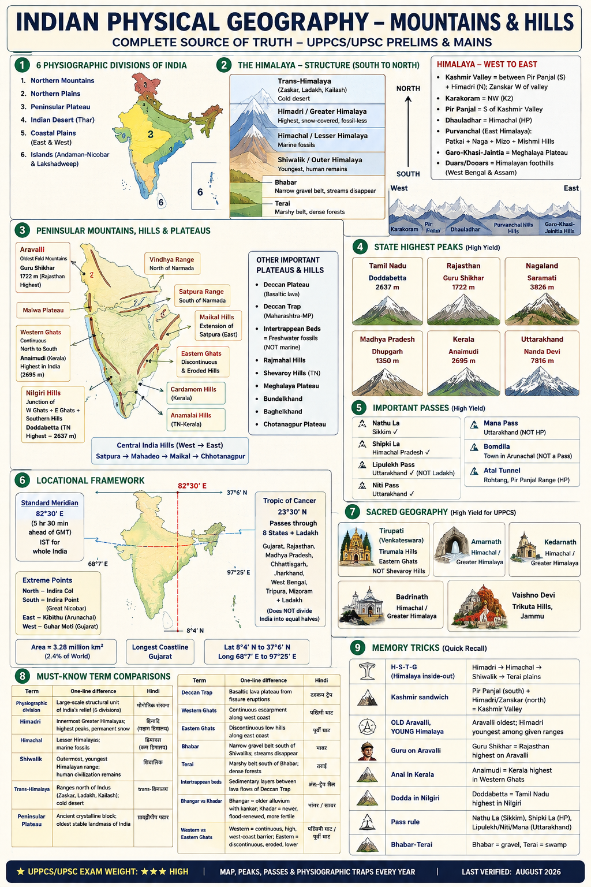

# Topic 1 — Indian Physical Geography: Mountains & Hills
### ★ Complete Source of Truth — No other book/notes needed for this topic

> **Covers syllabus:** Physiographic Divisions of India (Northern Mountains, Northern Plains, Peninsular Plateau, Indian Desert, Coastal Plains, Islands) | Himalayan Mountain System (Trans-Himalayas, Himadri, Himachal, Shiwalik, Karakoram, Pir Panjal, Zanskar, Dhauladhar, Purvanchal Hills, Garo-Khasi-Jaintia Hills, Kashmir Valley, Duars/Dooars) | Peninsular Mountains, Hills & Plateaus (Aravalli, Vindhya, Satpura, Western Ghats, Eastern Ghats, Nilgiri, Cardamom, Anamalai, Rajmahal, Maikal, Shevaroy, Deccan Plateau, Central Highlands, Malwa, Bundelkhand, Baghelkhand, Chotanagpur, Meghalaya Plateau, Deccan Trap) | Passes, Peaks & Sacred Geography | Locational Framework (Standard Meridian, Tropic of Cancer, Lat/Long, Extreme Points, Coastline)
> **Sources baked in:** NCERT Geography Class 11 (Ch 2–3), Class 12 (Ch 1–2), UPPCS/UPSC PYQs 2018–2025
> **Exam weight:** ★★★ High — map matching, peaks, passes, physiographic traps every year
> **Last verified:** August 2026

---

## Quick Revision Box — Raata This First

```
6 PHYSIOGRAPHIC DIVISIONS:
  Northern Mountains | Northern Plains | Peninsular Plateau | Indian Desert (Thar)
  Coastal Plains (E+W) | Islands (Andaman-Nicobar + Lakshadweep)

HIMALAYA — West to East + South to North:
  Trans-Himalaya (Zaskar, Ladakh, Kailash) → Himadri/Greater (highest, snow, fossil-less)
  → Himachal/Lesser (marine fossils) → Shiwalik/Outer (youngest, human remains)
  Kashmir Valley = between Pir Panjal + Himadri (Zanskar west of valley)
  Karakoram = NW (K2); Purvanchal = Patkai + Naga + Mizo + Mishmi hills
  Garo-Khasi-Jaintia = Meghalaya Plateau | Duars/Dooars = Himalayan foothills (WB/Assam)

PENINSULAR — Key traps:
  Aravalli = OLDEST fold mountains (Guru Shikhar 1722 m, Rajasthan highest)
  Vindhya = N of Narmada | Satpura = S of Narmada | Maikal = Satpura extension east
  W Ghats = continuous, Anaimudi highest in South India | E Ghats = discontinuous
  Nilgiri = junction W Ghats + E Ghats + Southern hills (Doddabetta TN highest)
  Deccan Trap = basalt lava (Maharashtra-MP); intertrappean = freshwater fossils NOT sea
  Central India hills W→E: Satpura → Mahadeo → Maikal → Chhotanagpur

STATE HIGHEST PEAKS (UPPCS repeat):
  TN = Doddabetta | Rajasthan = Guru Shikhar | Nagaland = Saramati | MP = Dhupgarh
  Kerala = Anaimudi | Uttarakhand = Nanda Devi

PASSES — High-yield:
  Nathu La = Sikkim ✓ | Shipki La = HP ✓ | Lipulekh = Uttarakhand (NOT Ladakh)
  Niti = Uttarakhand ✓ | Mana = Uttarakhand (NOT HP) | Bomdila = town (NOT a pass)
  Atal Tunnel = Rohtang, Pir Panjal range (HP)

LOCATION:
  Standard Meridian = 82°30′ E (5 hr 30 min ahead of GMT) | IST for whole India
  Tropic of Cancer (23°30′ N) = 8 states + Ladakh (Gujarat, Rajasthan, MP, Chhattisgarh,
    Jharkhand, WB, Tripura, Mizoram + Ladakh) — does NOT divide India into equal halves
  Extremes: N = Indira Col | S = Indira Point (Great Nicobar) | E = Kibithu (Arunachal)
    W = Guhar Moti (Gujarat) | Longest coastline = Gujarat
  Area ≈ 3.28 million km² (2.4% of world) | Lat 8°4′ N to 37°6′ N | Long 68°7′ E to 97°25′ E

SACRED GEOGRAPHY:
  Tirupati (Venkateswara) = Tirumala Hills (Eastern Ghats), NOT Shevaroy Hills
  Amarnath, Kedarnath, Badrinath = Himachal/Greater Himalaya zone
  Vaishno Devi = Trikuta Hills, Jammu
```

### Must-Know Term Comparisons

| Term | One-line difference | Hindi |
|------|---------------------|-------|
| **Physiographic division** | Large-scale structural unit of India's relief (6 divisions) | भौगोलिक संरचना |
| **Himadri** | Innermost Greater Himalayas; highest peaks, permanent snow | हिमाद्रि (महान हिमालय) |
| **Himachal** | Lesser Himalayas; middle range with marine fossils | हिमाचल (कम हिमालय) |
| **Shiwalik** | Outermost, youngest Himalayan range; human civilization remains | शिवालिक |
| **Trans-Himalaya** | Ranges north of Indus (Zaskar, Ladakh, Kailash); cold desert | trans-हिमालय |
| **Peninsular Plateau** | Ancient crystalline block; oldest stable landmass of India | प्रायद्वीपीय पठार |
| **Deccan Trap** | Basaltic lava plateau from fissure eruptions (Cretaceous-Eocene) | दक्कन ट्रैप |
| **Western Ghats** | Continuous escarpment along west coast; orographic barrier | पश्चिमी घाट |
| **Eastern Ghats** | Discontinuous low hills along east coast | पूर्वी घाट |
| **Bhabar** | Narrow gravel belt south of Shiwaliks; streams disappear | भाबर |
| **Terai** | Marshy belt south of Bhabar; dense forests | तराई |
| **Intertrappean beds** | Sedimentary layers between lava flows of Deccan Trap | अंतः-ट्रैप शैल |
| **Bhangar vs Khadar** | Bhangar = older alluvium with kankar; Khadar = newer, flood-renewed, more fertile | भांगर / खादर |
| **Western vs Eastern Ghats** | Western = continuous, high, west-coast barrier; Eastern = discontinuous, eroded, lower | पश्चिमी घाट / पूर्वी घाट |

### Memory Tricks

| Trick | Remembers |
|-------|-----------|
| **H-S-T-G** (Himalaya inside-out) | Himadri → Himachal → Shiwalik → Terai plains |
| **Kashmir sandwich** | Pir Panjal (south) + Himadri/Zanskar (north) = Kashmir Valley |
| **OLD Aravalli, YOUNG Himalaya** | Aravalli oldest; Himadri youngest among given ranges (UPPCS 2020) |
| **Guru on Aravalli** | Guru Shikhar = Rajasthan highest on Aravalli |
| **Anai in Kerala** | Anaimudi = Kerala highest in Western Ghats |
| **Dodda in Nilgiri** | Doddabetta = Tamil Nadu highest (Nilgiri Hills) |
| **Sara in Nagaland** | Saramati = Nagaland highest |
| **Dhup in Satpura** | Dhupgarh = Madhya Pradesh highest (Satpura) |
| **Lipu in UK** | Lipulekh Pass = Uttarakhand, not Ladakh (2025 trap) |
| **82°30′ = 5½ hours** | Standard Meridian → IST offset from GMT |
| **8+1 Tropic states** | 8 states + Ladakh on Tropic of Cancer |
| **Gujarat = Coast king** | Longest coastline among Indian states |

---


## 1.1 Physiographic Divisions of India

### Definitions

| Term | Definition |
|------|------------|
| **Physiography** | Study of physical features and relief of the Earth's surface |
| **Physiographic division** | A major relief region with distinct geological structure, origin, and landform assemblage |
| **Northern Mountains** | Himalayas and associated ranges forming India's northern frontier |
| **Northern Plains** | Alluvial tract between Himalayas and Peninsular Plateau (Indus-Ganga-Brahmaputra system) |
| **Peninsular Plateau** | Ancient crystalline block forming the triangular heartland of India |
| **Indian Desert** | Arid region of western Rajasthan (Thar/Marusthali) |
| **Coastal Plains** | Narrow lowlands along Arabian Sea (west) and Bay of Bengal (east) |
| **Islands** | Andaman & Nicobar (Bay of Bengal, volcanic) and Lakshadweep (Arabian Sea, coral) |

### Physiographic Divisions — How It Works

- India is divided into **six major physiographic divisions** based on geological age, structure, and relief.
- The **Northern Mountains** act as a climatic barrier, blocking cold Central Asian winds and forcing monsoon clouds to precipitate on the windward side.
- The **Northern Plains** are among the world's most fertile and densely populated tracts because they are built from millennia of Himalayan alluvium.
- The **Peninsular Plateau** is a stable, ancient block composed largely of Archaean crystalline rocks, unlike the young, folded Himalayas.
- The **Indian Desert (Thar)** lies on the leeward side of the Aravalli and receives scant rainfall; its sands are mainly **Pleistocene and recent deposits** (UPPCS 2018 Q101).
- **Western Coastal Plains** are narrow and rocky (Konkan, Kanara, Malabar sub-divisions), while **Eastern Coastal Plains** are broader with deltaic expanses (Northern Circars, Coromandel).
- **Andaman & Nicobar Islands** are volcanic in origin, lie on an submerged mountain chain, and extend India's reach near the Malacca Strait.
- **Lakshadweep** is a coral atoll archipelago in the Arabian Sea, unlike the volcanic Andaman group.
- The six divisions together explain India's diversity in soil, drainage, climate, vegetation, and human settlement patterns.

> **Exam note:** UPPCS often tests that the **Thar Desert** rests on **Pleistocene and recent deposits** (not Paleocene or Oligocene), and that **Gujarat** has the **longest coastline** among Indian states (not Maharashtra or Kerala).

### Six Physiographic Divisions — Master Table

| Division | Location | Key Features | Geological Age |
|----------|----------|--------------|----------------|
| **Northern Mountains** | North of plains | Himalayas, Karakoram, Purvanchal; highest peaks | Tertiary (young) |
| **Northern Plains** | Between Himalaya & Plateau | Bhabar, Terai, Bhangar, Khadar; alluvial | Recent |
| **Peninsular Plateau** | South of Narmada-Son line | Deccan, Central Highlands, NE plateaus | Precambrian (old) |
| **Indian Desert** | Western Rajasthan | Thar/Marusthali; shifting sand dunes | Pleistocene-recent |
| **Coastal Plains** | East & west margins | Western = narrow; Eastern = broad, deltaic | Recent |
| **Islands** | Arabian Sea & Bay of Bengal | Lakshadweep (coral); A&N (volcanic) | Recent |

---

### 1.1.1 Northern Mountains (Overview)

The **Northern Mountains** form India's northern frontier and include the Himalayas, Karakoram, and Purvanchal ranges. Detailed treatment is in **§1.2**; here are the exam essentials.

#### Northern Mountains — How It Works

- The Northern Mountains extend as an arc of **young fold mountains** from the Indus gorge in the west to the Dihang gorge in the east.
- This division acts as a **climatic wall** that blocks cold Siberian/Central Asian winds from entering the Indian subcontinent in winter.
- The mountains force **orographic rainfall** on the windward southern slopes, feeding the river systems of the Northern Plains.
- From south to north, the Himalaya belt shows **four parallel ranges**: Shiwalik → Himachal → Himadri → Trans-Himalaya (north of Indus).
- The **Karakoram** lies northwest of the main Himalayan arc and is geologically distinct, containing K2.
- The **Purvanchal Hills** form the eastern extension through the north-eastern states.
- Northern Mountains are the **youngest and highest** relief zone of India, still rising tectonically at about 5 mm per year in zones.
- Snow line, vegetation, and human occupation change sharply with altitude across this division.

> **Exam note:** Do not confuse **Northern Mountains** (physiographic division) with **Himadri alone** — the division includes Karakoram, Purvanchal, and outer ranges too.

---

### 1.1.2 Northern Plains

#### Definitions

| Term | Definition |
|------|------------|
| **Northern Plains** | Flat alluvial tract between the Himalayas and the Peninsular Plateau, drained by Indus, Ganga, and Brahmaputra systems |
| **Bhabar** | Narrow belt (8–16 km) south of Shiwaliks with porous pebbles; streams disappear underground |
| **Terai** | Marshy, forested belt south of Bhabar where rivers re-emerge; formerly malarial, now densely settled |
| **Bhangar** | Older alluvium above flood level; contains calcareous **kankar** nodules; less fertile |
| **Khadar** | Newer alluvium in floodplains; renewed annually; most fertile and agriculturally active |

#### Northern Plains — How It Works

- The Northern Plains were formed by **deposition of alluvium** brought down by Himalayan rivers over millions of years.
- The plains stretch roughly **2,400 km** from Punjab in the west to Assam in the east, with width varying from 90 to 300 km.
- **Bhabar** lies immediately south of the Shiwaliks; its porosity makes rivers sink, so settlement is sparse.
- **Terai** receives re-emerged river water and supports dense forests and agriculture; Dudhwa and Katarniaghat (UP) lie here.
- **Bhangar** forms the upland terrace of the plains; **Khadar** forms the active floodplain — UPPCS trap: Khadar is newer and more fertile, not Bhangar.
- The plains are divided into river-based regional names: **Khadar/Bhangar**, **Doabs** (interfluve between two rivers), and deltaic tracts.
- The **Ganga Plain** is the most densely populated part of India because of fertile soil, flat land, and perennial water.
- The **Brahmaputra Plain** in Assam has a braided river channel and is prone to floods and bank erosion.

> **Exam note:** South of the Shiwaliks the belts run **Bhabar, then Terai, then Bhangar/Khadar** — a sequence frequently tested as a match or order question.

#### Northern Plains — Regional Sub-divisions

| Sub-division | Location | Key feature |
|--------------|----------|-------------|
| **Punjab Plain** | Punjab, Haryana, Chandigarh | Indus tributaries; Doabs (Bist, Bari, Rachna, Chaj, Sind Sagar) |
| **Ganga Plain** | UP, Bihar, West Bengal | Ganga-Yamuna Doab; most populous |
| **Brahmaputra Plain** | Assam | Kaziranga; heavy rainfall; braided channels |
| **Tarai/ Terai belt** | UP, Uttarakhand, Nepal border, W Bengal | Forests, wildlife, Terai districts |

---

### 1.1.3 Peninsular Plateau (Physiographic Overview)

The Peninsular Plateau is India's oldest and most stable landmass. Full range-by-range detail is in **§1.3**.

#### Peninsular Plateau — How It Works

- The plateau is a **Precambrian crystalline block** tilted higher in the west (Western Ghats) and sloping eastward.
- It is bounded by the **Narmada-Son rift valley** in the north and extends to Kanyakumari in the south.
- Most peninsular rivers flow **eastward** into the Bay of Bengal because of the west-to-east slope.
- The plateau has two major parts: **Central Highlands** (north) and **Deccan Plateau** (south).
- **Black soil (regur)** of volcanic origin covers much of the Deccan Trap region — fertile for cotton.
- The plateau is rich in **metallic minerals** (iron, manganese, bauxite, mica, coal in Chotanagpur).
- Unlike the Himalayas, the Peninsular block has **not been heavily folded recently**; it has undergone faulting and erosion.
- The Malda gap separates the Meghalaya Plateau from the main peninsular block.

> **Exam note:** Peninsular Plateau ≠ Deccan Plateau alone — Deccan is the **southern basalt-covered part**; Central Highlands (Malwa, Bundelkhand) are the northern part.

---

### 1.1.4 Indian Desert (Thar / Marusthali)

#### Indian Desert — How It Works

- The **Thar Desert** (Marusthali) occupies western Rajasthan and extends into Pakistan.
- It lies on the **leeward side of the Aravalli Range**, which blocks monsoon moisture from the Arabian Sea branch.
- Geologically, Thar sands rest on **Pleistocene and recent deposits** (UPPCS 2018 Q101 — not Paleocene or Oligocene).
- The desert has **shifting sand dunes (barchans)**, gravel plains, and playas (salt pans).
- **Luni** is the only major river of the desert; it is inland-draining and seasonal.
- **Municipal/industrial growth** and the Indira Gandhi Canal have greened parts of the desert in Rajasthan.
- Annual rainfall is generally **below 250 mm** in the core zone; extreme temperatures (hot days, cold nights).
- The **Rann of Kutch** (salt marsh) forms the southern margin; Aravalli hills form the eastern margin.

> **Exam note:** The sands of the Thar Desert are **Pleistocene and recent deposits**; older Tertiary labels (Paleocene, Oligocene, Pliocene) are common distractors (UPPCS 2018 Q101).

---

### 1.1.5 Coastal Plains (Eastern & Western)

#### Definitions

| Term | Definition |
|------|------------|
| **Western Coastal Plain** | Narrow lowland between the Arabian Sea and the Western Ghats escarpment |
| **Eastern Coastal Plain** | Broader lowland between the Bay of Bengal and the Eastern Ghats |
| **Konkan** | Northern section of Western Coastal Plain (Mumbai–Goa) |
| **Kanara/Malabar** | Middle and southern sections of Western Coastal Plain (Karnataka, Kerala) |
| **Northern Circars** | Northern part of Eastern Coastal Plain (Odisha, northern AP) |
| **Coromandel Coast** | Southern part of Eastern Coastal Plain (Tamil Nadu, southern AP) |

#### Coastal Plains — How It Works

- **Western Coastal Plains** are **narrow (50–80 km)** because the Western Ghats rise abruptly near the coast.
- **Eastern Coastal Plains** are **broader (100–200 km)** because the Eastern Ghats are low, eroded, and set back from the coast.
- Western coast has **natural harbours** (Mumbai, Marmagao, Kochi) due to submerged coast and estuaries.
- Eastern coast has **deltaic plains** of Mahanadi, Godavari, Krishna, and Kaveri — fertile but harbour-poor.
- **Kerala backwaters** (lagoons) are a unique feature of the Malabar Coast.
- **Chilika Lake** (Odisha) and **Pulicat Lake** (AP-TN) are lagoon features on the eastern coast.
- Western sub-divisions: **Konkan** (Maharashtra-Goa), **Kanara** (Karnataka), **Malabar** (Kerala).
- Eastern sub-divisions: **Northern Circars** and **Coromandel Coast** (Tamil Nadu).

> **Exam note:** Do not reverse widths: the **Western Coastal Plain is narrow** (Ghats close to the sea); the **Eastern Coastal Plain is broad** and deltaic. The claim that the Eastern plain is narrower is false.

#### Western vs Eastern Coastal Plains — Comparison

| Feature | Western Coastal Plain | Eastern Coastal Plain |
|---------|----------------------|----------------------|
| **Width** | Narrow (50–80 km) | Broad (100–200 km) |
| **Mountain backdrop** | High Western Ghats escarpment | Low, discontinuous Eastern Ghats |
| **Harbour potential** | Good ( submerged coast, estuaries) | Poor ( deltas, silting) |
| **Sub-divisions** | Konkan, Kanara, Malabar | Northern Circars, Coromandel |
| **Special features** | Kerala backwaters | Deltas, Chilika lagoon |

---

### 1.1.6 Islands of India (Andaman, Nicobar, Lakshadweep)

#### Islands — How It Works

- India has two major island groups: **Andaman & Nicobar** (Bay of Bengal) and **Lakshadweep** (Arabian Sea).
- **Andaman & Nicobar** are **volcanic and tectonic** in origin, part of the Arakan Yoma extension submerged in the sea.
- **Barren Island** in Andaman is India's **only active volcano**.
- **Indira Point** on **Great Nicobar** is India's **southernmost point** (6°45′ N), not Kanyakumari.
- The **Ten Degree Channel** separates the Andaman group from the Nicobar group.
- **Lakshadweep** consists of **36 coral atolls/islands** formed on a submarine ridge in the Arabian Sea.
- Lakshadweep capital is **Kavaratti**; Andaman capital is **Port Blair**.
- Andaman & Nicobar have **strategic importance** near the Malacca Strait and host tri-service Andaman Nicobar Command.

> **Exam note:** **Andaman & Nicobar Islands are volcanic** in origin; **Lakshadweep Islands are coral atolls**. Never reverse these origins in match questions.


### Exam Facts (raata)

- India has **six physiographic divisions**: Northern Mountains, Northern Plains, Peninsular Plateau, Indian Desert, Coastal Plains, and Islands.
- The **Thar Desert** rests on **Pleistocene and recent deposits**, not Paleocene or Oligocene layers.
- **Gujarat** has the **longest coastline** among Indian states (UPPCS 2018 Q98).
- **Western Coastal Plains** are narrower than **Eastern Coastal Plains** because the Western Ghats rise close to the Arabian Sea.
- **Andaman & Nicobar Islands** are volcanic in origin; **Lakshadweep Islands** are coral atolls.
- **Indira Point** on Great Nicobar is India's southernmost territorial point; **Kanyakumari** is only the southernmost tip of the mainland.
- In the **Bhabar** belt, porous pebbles make rivers disappear underground; in the **Terai**, streams re-emerge and the land is marshy and forested.
- The Peninsular Plateau is separated from the Northern Plains roughly along the **Narmada–Son rift valley line**.

### PYQs — Physiographic Divisions

**UPPCS Prelims**

1. **(UPPCS 2018, Q98)** Which of the following States of India has the longest coastline?
   - Options: A. Maharashtra / B. Andhra Pradesh / C. Kerala / D. Gujarat
   → **D. Gujarat** — Gujarat’s Kachchh–Saurashtra–mainland coast is the longest among states (~1,600 km). Maharashtra and Kerala are shorter; Andhra Pradesh ranks high but below Gujarat.

2. **(UPPCS 2018, Q101)** Rajasthan desert or Thar desert is the expanse of which of the following?
   - Options: A. Pliocene / B. Paleocene / C. Pleistocene and recent deposits / D. Oligocene
   → **C. Pleistocene and recent deposits** — Thar sands are young Quaternary deposits. Paleocene, Oligocene, and Pliocene are older Tertiary periods used as traps.

3. **(UPPCS 2019, Q64)** The First Union Territory of India to run 100 percent on solar energy is
   - Options: A. Andaman-Nicobar / B. Chandigarh / C. Diu / D. Puducherry
   → **C. Diu** — Diu (then a UT, now part of Dadra and Nagar Haveli and Daman and Diu) was the first to claim 100% solar for daytime power. Andaman–Nicobar is the island physiographic group often confused with this current-affairs fact.

**UPSC Prelims**

4. **(UPSC — pattern)** Which Indian state has the longest coastline?
   - Same lock as UPPCS 2018 Q98: **Gujarat**, not Maharashtra or Kerala.

### Examples (1.1)

| Example | What it teaches |
|---------|-----------------|
| **Gujarat coastline** | Kachchh, Saurashtra, and mainland coast make Gujarat #1 in coastline length |
| **Thar at Jaisalmer** | Active dunes on Pleistocene-recent sand; arid due to leeward position of Aravalli |
| **Terai in UP** | Dudhwa, Katarniaghat forests sit on Terai belt south of Bhabar in Uttar Pradesh |

---

## 1.2 Himalayan Mountain System

### Definitions

| Term | Definition |
|------|------------|
| **Himalayan Mountain System** | Young fold mountains formed by collision of Indian and Eurasian plates; ~2400 km arc |
| **Trans-Himalayas** | Ranges north of Indus (Zaskar, Ladakh, Kailash); cold desert, no monsoon |
| **Himadri (Greater Himalayas)** | Innermost, highest zone; average >6000 m; permanent snow |
| **Himachal (Lesser Himalayas)** | Middle zone; 3700–4500 m; hill stations; marine fossils in sediments |
| **Shiwalik (Outer Himalayas)** | Southernmost, lowest (900–1100 m); youngest; human civilization remains |
| **Karakoram Range** | Northwestern range; K2 (Godwin Austin); joins Pamir Knot |
| **Pir Panjal Range** | Middle Himalaya range south of Kashmir Valley; Atal Tunnel passes through |
| **Zanskar Range** | North of Kashmir Valley; separates Ladakh from Kashmir |
| **Dhauladhar Range** | Outer Himalayan range in Himachal Pradesh |
| **Purvanchal Hills** | Eastern extension: Patkai, Naga, Mizo, Lushai, Mishmi hills |
| **Garo-Khasi-Jaintia Hills** | Shillong Plateau region of Meghalaya |
| **Kashmir Valley** | Intermontane vale between Pir Panjal and Himadri/Zanskar |
| **Duars/Dooars** | Himalayan foothill tract in West Bengal and Assam; tea gardens |

### Himalayan Mountain System — How It Works

- The Himalayas formed when the **Indian plate collided with the Eurasian plate** about 50 million years ago, folding sediments from the Tethys Sea into arcuate mountain ranges.
- From **north to south** across the Himalaya belt: **Trans-Himalaya → Himadri → Himachal → Shiwalik → Terai/Bhabar plains**.
- **Himadri (Greater Himalayas)** contain the highest peaks (Kanchenjunga, Nanda Devi) and are composed of **fossil-less** crystalline and metamorphic rocks uplifted from deep crust.
- **Himachal (Lesser Himalayas)** have **marine fossils** in sedimentary rocks, proving they were once under the Tethys Sea before uplift.
- **Shiwalik** is the **youngest** outer range, built from eroded debris of inner ranges; **remains of human civilization** are found here (UPPCS 2019 Q11).
- The **Karakoram** lies northwest of the main Himalaya arc and contains **K2 (8611 m)**, the world's second-highest peak (in Indian-claimed territory).
- **Kashmir Valley** sits between the **Pir Panjal Range (south)** and **Himadri/Zanskar (north)** — not between Kangra-Dhauladhar (UPPCS 2020 Q66 trap).
- **Pir Panjal** hosts the **Atal Tunnel (Rohtang)**, connecting Manali to Lahaul-Spiti; it cuts through this range, not the Karakoram.
- **Purvanchal Hills** form the eastern gate: Patkai Bum (Arunachal-Myanmar), Naga Hills, Mizo Hills, extending to Mishmi Hills.
- **Garo, Khasi, and Jaintia Hills** form the **Meghalaya Plateau**, receiving the world's highest rainfall at Mawsynram and Cherrapunji.
- **Duars/Dooars** are the floodplain-foothill ecotone at the base of the eastern Himalayas, famous for tea and wildlife corridors.
- The Himalayas are the **source of major perennial rivers** (Indus, Ganga, Brahmaputra) because high ranges hold snow year-round, supplying meltwater (UPPCS 2025 Q94).

> **Exam note:** UPPCS 2019 Q11 treats **all three** Himalayan statements as correct: Greater Himalayas are fossil-less, Lesser Himalayas hold marine fossils, and the Shiwalik/outer range has remains of human civilization. Common traps are denying Shiwalik human remains or placing marine fossils in the Greater Himalayas.

### Himalayan Ranges — North to South Profile

| Range | Altitude | Rock/Fossil Character | Key Peaks/Features |
|-------|----------|----------------------|-------------------|
| **Trans-Himalaya** | 3000–6500 m | Granitic; cold desert | Zaskar, Ladakh, Kailash |
| **Himadri** | >6000 m | Crystalline; **fossil-less** | Kanchenjunga, Nanda Devi |
| **Himachal** | 3700–4500 m | Sedimentary; **marine fossils** | Pir Panjal, Dhauladhar, Mussoorie |
| **Shiwalik** | 900–1100 m | Youngest; unconsolidated; **human remains** | Dehra Dun, Kotli Dun |

### Major Himalayan Peaks

| Peak | Height (m) | Range/Location | Notes |
|------|-----------|----------------|-------|
| **Kanchenjunga** | 8586 | Sikkim (Himadri) | Highest peak **fully in India** |
| **Nanda Devi** | 7816 | Uttarakhand | Second highest in India |
| **Kamet** | 7756 | Uttarakhand | — |
| **K2 (Godwin Austin)** | 8611 | Karakoram | Second highest in world; PoK |
| **Cho Oyu** | 8188 | Himalaya (Nepal-Tibet) | In Himalayan system (UPPCS 2022 Q31) |
| **Lhotse** | 8516 | Himalaya (Nepal-Tibet) | Fourth highest in world |
| **Nanga Parbat** | 8126 | Western Himalaya | "Killer mountain" |

### Kashmir Valley & Associated Ranges

| Feature | Detail |
|---------|--------|
| **Location** | Between Pir Panjal (south) and Himadri/Zanskar (north) |
| **Length** | ~135 km; width 32–40 km |
| **River** | Jhelum flows through |
| **Trap (UPPCS 2020)** | NOT between Kangra-Dhauladhar or Mahabharat-Dhauladhar |

### Purvanchal & North-East Hills

| Hill Group | Location | Notes |
|------------|----------|-------|
| **Patkai Bum** | Arunachal-Myanmar border | Easternmost extension |
| **Naga Hills** | Nagaland | Saramati peak (3841 m) |
| **Mizo/Lushai Hills** | Mizoram | — |
| **Garo Hills** | Meghalaya (west) | Part of Meghalaya Plateau |
| **Khasi Hills** | Meghalaya (central) | Cherrapunji/Mawsynram |
| **Jaintia Hills** | Meghalaya (east) | — |
| **Duars/Dooars** | WB & Assam foothills | Tea, rhino corridors |

### Himalayas — West to East Regional Divisions

| Section | Location (Indian states/UTs) | Key features |
|---------|---------------------------|--------------|
| **Punjab Himalaya** | J&K, Himachal (west) | Pir Panjal, Dhauladhar; Vaishno Devi, Amarnath |
| **Kumaon Himalaya** | Uttarakhand (west) | Nanda Devi, Valley of Flowers, Gangotri-Yamunotri |
| **Nepal Himalaya** | Border with Nepal | Everest region (south of border); shared peaks |
| **Sikkim Himalaya** | Sikkim | Kanchenjunga (8586 m) — highest in India |
| **Darjeeling/ Bhutan Himalaya** | West Bengal, Bhutan border | Sandakphu, tea gardens, Kalimpong |
| **Arunachal Himalaya** | Arunachal Pradesh | Kangto, Easternmost Himalayan extension |

---

### 1.2.1 Trans-Himalayas

#### Trans-Himalayas — How It Works

- The **Trans-Himalayas** lie **north of the Indus river** and are also called the **Tibetan Himalaya** or **Zaskar Range zone**.
- This region includes the **Zaskar, Ladakh, and Kailash** mountain systems in the Indian context.
- Trans-Himalaya is a **cold desert** — the monsoon does not reach here because it lies in the rain shadow of the Greater Himalayas.
- The **Indus, Sutlej, and Brahmaputra (Tsangpo)** originate from or flow through the Trans-Himalayan region.
- **Leh (Ladakh)** and high-altitude plateaus are part of this zone.
- Sparse vegetation; economy based on **pastoralism (pashmina goats, yak)** and tourism.
- Geologically distinct from the main Himalayan fold belt — more akin to the Tibetan Plateau margin.
- Important for **strategic passes** like Karakoram Pass (historically on silk route).

> **Exam note:** Trans-Himalayan **rivers** (Sutlej and Indus tributaries) are tested in Topic 3. For this topic, remember that the Trans-Himalaya lies **north of the Indus**, is a **cold desert**, and receives **little or no monsoon rain**.

---

### 1.2.2 Greater Himalayas (Himadri)

#### Himadri — How It Works

- **Himadri** is the **innermost and highest** of the three parallel Himalayan ranges.
- Average elevation exceeds **6,000 m**; peaks remain **snow-covered throughout the year**.
- Composed of **crystalline and metamorphic rocks** — sedimentary rocks are **fossil-less** (UPPCS 2019 Q11).
- Contains India's highest peaks: **Kanchenjunga (8586 m)**, **Nanda Devi (7816 m)**, **Kamet (7756 m)**.
- The **snow line** lies at about 5,500–6,000 m on southern slopes.
- Almost **no human habitation** at core heights; mountaineering and defence posts only.
- Source of **perennial Himalayan rivers** through glacial melt (links to UPPCS 2025 Q94 A/R).
- Separated from Himachal by the **Main Central Thrust (MCT)** fault zone.

> **Exam note:** The claim that **marine fossils occur in the Greater Himalayas is false**. Marine fossils belong to the **Lesser Himalayas (Himachal)** sedimentary rocks.

---

### 1.2.3 Lesser Himalayas (Himachal)

#### Himachal — How It Works

- **Himachal** (Lesser Himalayas) lies **south of Himadri** and north of the Shiwalik range.
- Average height **3,700–4,500 m** — home to major **hill stations** (Mussoorie, Nainital, Darjeeling, Almora).
- Sedimentary rocks contain **marine fossils** (Tethys Sea origin) — UPPCS 2019 Q11 statement 2.
- Important ranges within Himachal include **Pir Panjal, Dhauladhar, and Mahabharat**.
- **Valleys** like Kangra and Kullu lie within or between Lesser Himalayan ranges.
- Forests of oak, deodar, and rhododendron dominate lower slopes; agriculture on terraced slopes.
- The **Pir Panjal Range** is the largest range of the Lesser Himalayas, running from Himachal into J&K.
- Atal Tunnel (Rohtang) cuts through **Pir Panjal** to connect Kullu with Lahaul-Spiti.

> **Exam note:** In physiography, **Himachal means the Lesser Himalayas**. Do not confuse that range name with the state of Himachal Pradesh, which spans several Himalayan belts.

---

### 1.2.4 Shiwalik Range (Outer Himalayas)

#### Shiwalik — How It Works

- **Shiwalik** is the **southernmost and youngest** of the three main Himalayan ranges.
- Average elevation **900–1,100 m** — composed of **unconsolidated sediments** eroded from higher ranges.
- **Remains of human civilization** found in Shiwalik rocks (UPPCS 2019 Q11, statement 3).
- Famous **Duns** (valleys between Shiwalik and Himachal): **Dehra Dun, Kotli Dun, Patli Dun**.
- South of Shiwalik lies the **Bhabar belt**, where rivers disappear into porous pebbles.
- Shiwalik forests include sal, shisham, and bamboo; prone to **soil erosion** due to loose material.
- Structurally weak — frequent **landslides and seismic activity** in foothill towns.
- Forms the **outer foothills** visible from the Gangetic plain.

> **Exam note:** The **Shiwalik** is the **youngest and outermost** Himalayan range and is where **remains of human civilization** are found — all three points appear together in UPPCS 2019 Q11.

---

### 1.2.5 Karakoram Range

#### Karakoram — How It Works

- The **Karakoram Range** lies in the **extreme north-west** of India, merging with the **Pamir Knot**.
- Contains **K2 (Godwin Austin, 8611 m)** — second-highest peak in the world; lies in PoK/GB.
- The **Karakoram** is geologically separate from the main Himalayan arc — older and more stable.
- Home to the **Siachen Glacier** — world's highest battlefield; feeds Nubra/Shyok systems.
- **Karakoram Pass** historically connected Ladakh to Yarkand (Silk Route).
- Extremely cold, arid; **longest glaciers outside polar regions** (Siachen, Baltoro on Pakistan side).
- **Saser Kangri** and other peaks lie on the Indian side in Ladakh.
- Border region shared with Pakistan and China — strategically critical.

> **Exam note:** **K2** stands in the **Karakoram**, not in the main Himalayan arc. **Kanchenjunga** is the highest peak lying fully within India (Sikkim Himalaya / Himadri).

---

### 1.2.6 Pir Panjal Range

#### Pir Panjal — How It Works

- **Pir Panjal** is the **longest range of the Lesser Himalayas**, running west-east from Himachal into J&K.
- It forms the **southern boundary of the Kashmir Valley**.
- The **Atal Tunnel (Rohtang Tunnel, 9.02 km)** passes through Pir Panjal beneath Rohtang Pass (UPPCS 2025 Q44).
- Connects **Manali (Kullu)** with **Keylong (Lahaul-Spiti)**, providing all-weather access.
- Peaks include **Indrasan** and passes like **Pir Panjal Pass (Haji Pir)** historically significant.
- Receives heavy snowfall; Rohtang Pass closed in winter before the tunnel.
- Separated from the Zanskar Range by the **Kashmir Valley** to its north in sections.
- Important for **hydropower projects** on Chenab tributaries.

> **Exam note:** The **Atal Tunnel** cuts through the **Pir Panjal** range (Rohtang), not the Karakoram or Zanskar. The unqualified claim that it is the “world’s longest highway tunnel” is **false** (UPPCS 2025 Q44 — only the Pir Panjal statement is correct).

---

### 1.2.7 Zanskar Range

#### Zanskar — How It Works

- The **Zanskar Range** lies **north of the Kashmir Valley** and separates it from the **Ladakh region**.
- Runs roughly northwest to southeast, parallel to the Pir Panjal on the opposite side of the valley.
- Contains high passes like **Pensi La** connecting Zanskar valley with Suru valley.
- **Zanskar River** flows through gorges; famous for the **Chadar Trek** on frozen river (winter).
- Peaks exceed **6,000 m**; extremely cold desert climate on the Ladakh side.
- Geologically part of the **Tethyan Himalayan Sequence**.
- **Kargil** lies near the western end of the Zanskar Range region.
- Distinct from Pir Panjal — exams may test Kashmir Valley as bounded by **Pir Panjal (south) + Zanskar/Himadri (north)**.

> **Exam note:** The **Kashmir Valley** lies between the **Pir Panjal and Himadri** ranges. “Kangra and Dhauladhar” is a Himachal valley pairing and a classic wrong option (UPPCS 2020 Q66).

---

### 1.2.8 Dhauladhar Range

#### Dhauladhar — How It Works

- The **Dhauladhar Range** is an **outer spur of the Lesser Himalayas** in **Himachal Pradesh**.
- Lies **south of the Pir Panjal** and north of the Kangra Valley — "White Range" (Dhauladhar = white ridge).
- Forms a dramatic escarpment visible from Kangra, Dharamshala, and McLeod Ganj.
- Average elevation **4,000–5,000 m**; receives heavy monsoon snowfall on southern face.
- **Dharamshala/McLeod Ganj** lies at the foot of Dhauladhar — seat of Dalai Lama.
- Not to be confused with the **Kashmir Valley boundaries** — Dhauladhar is in Himachal, not Kashmir.
- Source region for **Ravi river** tributaries.
- Popular trekking destination (Indrahar Pass trek).

> **Exam note:** In UPPCS 2020 Q66, **Kangra and Dhauladhar** flank the Kangra Valley in **Himachal Pradesh**; they do **not** bound the Kashmir Valley.

---

### 1.2.9 Purvanchal Hills (Eastern Hills)

#### Purvanchal Hills — How It Works

- **Purvanchal Hills** are the **eastern extension of the Himalayas** beyond the Dihang gorge.
- Also called **Eastern Hills** or **North-Eastern Hill ranges**.
- Comprises **Patkai Bum, Naga Hills, Manipur Hills, Mizo/Lushai Hills, and Mishmi Hills**.
- Lower in elevation than the main Himalaya but geologically related fold mountains.
- **Patkai Bum** forms the border hills between Arunachal Pradesh and Myanmar.
- **Naga Hills** contain **Saramati (3841 m)** — highest peak of Nagaland.
- **Mizo Hills** contain **Phawngpui/Blue Mountain (2165 m)** — highest in Mizoram.
- These hills receive heavy monsoon rainfall and support shifting cultivation (jhum).

> **Exam note:** **Purvanchal Hills** are the **north-eastern hill system** (Patkai, Naga, Mizo, Mishmi). Do not confuse them with the **Purvanchal region of eastern Uttar Pradesh**.

---

### 1.2.10 Garo, Khasi & Jaintia Hills (Meghalaya Plateau)

#### Garo-Khasi-Jaintia — How It Works

- These three hill ranges form the **Meghalaya Plateau** — an extension of the Peninsular block separated by the Malda gap.
- **Garo Hills** (west Meghalaya): lower elevation; Tura range; coal deposits.
- **Khasi Hills** (central Meghalaya): **Shillong Peak (1965 m)**; **Cherrapunji/Mawsynram** — world's wettest places.
- **Jaintia Hills** (east Meghalaya): limestone caves (Krem Mawmluh); coal and limestone mining.
- The plateau rises abruptly from the Brahmaputra plain on the north and Bangladesh plain on the south.
- **Shillong** — the capital — sits on the Khasi Hills.
- Garo Hills named after the **Garo tribe**; region is part of the **Seven Sisters** geography.
- Meghalaya Plateau is **not part of the Himalayan fold system** geologically but is in the syllabus under Himalayan/NE hills context.

> **Exam note:** **Mawsynram and Cherrapunji** sit on the **Khasi Hills** of Meghalaya, not on the Garo or Jaintia Hills — a common rainfall-location trap.

---

### 1.2.11 Kashmir Valley

#### Kashmir Valley — How It Works

- The **Kashmir Valley** is a **structural intermontane valley** in J&K/Ladakh UT.
- It lies between the **Pir Panjal Range (south)** and the **Himadri/Zanskar Range (north)** — UPPCS 2020 Q66.
- Approximately **135 km long** and **32–40 km wide**, shaped like a elliptical bowl.
- The **Jhelum River** flows through the length of the valley, draining into Pakistan.
- **Srinagar** (summer capital) and **Dal Lake/Wular Lake** are in this valley.
- Famous for saffron (Pampore), walnuts, apples, and tourism (houseboats, Gulmarg).
- Surrounded by peaks exceeding 5,000 m; heavy snowfall in winter.
- **Kashmir Valley** is distinct from **Kangra Valley** (Himachal) and **Doon Valley** (Uttarakhand).

> **Exam note:** Memorise that the **Kashmir Valley** is sandwiched between **Pir Panjal (south) and Himadri (north)**. Kangra–Dhauladhar is a separate valley system in Himachal Pradesh.

---

### 1.2.12 Duars / Dooars

#### Duars/Dooars — How It Works

- **Duars** (West Bengal) and **Dooars** (Assam) are the **Himalayan foothill belts** at the junction of hills and plains.
- The name comes from **"door"** — gateway from the plains into the hills and Bhutan.
- Characterised by **tea gardens, forests, and wildlife sanctuaries** (Jaldapara, Gorumara, Buxa).
- Rivers like **Torsa, Jaldhaka, Teesta** flow through the Duars from Bhutan/Himalayas.
- **Elephant and rhino corridors** connect Duars forests with Bhutan and Assam.
- Narrow strip between the **Shiwalik/ Lesser Himalaya foothills** and the Brahmaputra/Ganga plain.
- Economically important for **tea, timber, and tourism**.
- Distinct from the **Terai belt** further west (UP-Nepal) but geologically similar foothill ecotone.

> **Exam note:** **Duars/Dooars** are the **Himalayan foothills of West Bengal and Assam**, not a peninsular or coastal landform.

### Exam Facts (raata)

- **Himadri** is the Greater Himalayas; **Himachal** is the Lesser Himalayas; **Shiwalik** is the Outer Himalayas.
- **Greater Himalayas** are fossil-less; **Lesser Himalayas** preserve marine fossils; the **Shiwalik** holds remains of human civilization.
- The **Kashmir Valley** lies between the **Pir Panjal and Himadri** ranges.
- **K2** stands in the **Karakoram**, not in the main Himalayan arc.
- The **Atal Tunnel** passes through the **Pir Panjal range** in Himachal Pradesh.
- **Kanchenjunga (8586 m)** is the highest peak located entirely within India.
- **Purvanchal Hills** include the Patkai, Naga, Mizo, and Mishmi hills.
- The **Garo–Khasi–Jaintia** hills form the Meghalaya Plateau.
- **Duars/Dooars** are Himalayan foothill tracts in West Bengal and Assam.

### PYQs — Himalayan Mountain System

**UPPCS Prelims**

1. **(UPPCS 2019, Q11)** With reference to the Himalayan range, which of the statements is/are correct?
   1. The sedimentary rocks of the greater Himalayas were fossil less.
   2. Marine livings fossils are found in the sedimentary rocks of lesser Himalayas.
   3. Remains of human civilization are found in outer or Shivalik Himalayas.
   Select the correct answer using the codes given below:
   - Options: A. 1 and 2 only / B. 2 and 3 only / C. 1 and 3 only / D. 1, 2 and 3 are correct
   → **D** — All three are correct: Himadri rocks lack fossils; Himachal sediments hold marine fossils; Shiwalik has human-civilization remains. Do not place marine fossils in the Greater Himalayas.

2. **(UPPCS 2020, Q60)** Which one of the following is the youngest mountain range of India?
   - Options: A. Himadri Range / B. Aravalli Range / C. Western Ghat / D. Vindhya Range
   → **A. Himadri Range** — Among the given options Himadri is the youngest (Tertiary fold mountains). Aravalli is the oldest fold system in India.

3. **(UPPCS 2020, Q66)** Valley of Kashmir is situated between
   - Options: A. Kangara and Dhauladhar ranges / B. Pir-Panjal and Himadri ranges / C. Mahabharat and Dhauladhar ranges / D. Pir-Panjal and Mahabharat ranges
   → **B. Pir-Panjal and Himadri ranges** — Kashmir Valley is the intermontane vale between Pir Panjal (south) and Himadri/Zanskar (north). Kangra–Dhauladhar is a Himachal pairing.

4. **(UPPCS 2022, Q31)** Which of the following mountain peaks are in the Himalayan Mountains?
   1. Cho Oyu
   2. Lhotse
   3. Annamalai
   4. Sirumalai
   - Options: A. Only 2, 3 and 4 / B. Only 1, 2 and 3 / C. Only 3 and 4 / D. Only 1 and 2
   → **D. Only 1 and 2** — Cho Oyu and Lhotse are Himalayan peaks. Annamalai and Sirumalai are peninsular hills in Tamil Nadu.

5. **(UPPCS 2025, Q44)** With reference to the Atal Tunnel, which of the following statements is/are correct?
   1. This tunnel is the world's longest highway tunnel.
   2. This tunnel is built in the Pir Panjal range of the Himalayas.
   Select the correct answer from the code given below:
   - Options: A. Only 2 / B. Neither 1 nor 2 / C. Both 1 and 2 / D. Only 1
   → **A. Only 2** — The tunnel is correctly placed in the Pir Panjal (Rohtang, HP). The unqualified “world’s longest highway tunnel” claim is false.

6. **(UPPCS 2025, Q94)** Given below are two statements, one is labelled as Assertion (A) and the other as Reason (R).
   **Assertion (A):** The Himalayas form the source of several large perennial rivers.
   **Reason (R):** The higher ranges of the Himalayas remain snow-covered throughout the year.
   Select the correct answer from the code given below:
   - Options: A. Both (A) and (R) are true, but (R) is not the correct explanation of (A) / B. (A) is false, but (R) is true / C. (A) is true, but (R) is false / D. Both (A) and (R) are true and (R) is the correct explanation of (A)
   → **D** — High snow-covered ranges feed meltwater year-round, so major Himalayan rivers stay perennial. R correctly explains A.

7. **(UPPCS 2025, Q21)** Given below are two statements, one is labelled as Assertion (A) and the other as Reason (R).
   **Assertion (A):** In the Himalayan mountains different types of vegetation are found.
   **Reason (R):** In Himalayas, there are variations in climate with change in altitude.
   Select the correct answer from the code given below:
   - Options: A. Both (A) and (R) are true, but (R) is not the correct explanation of (A) / B. (A) is false, but (R) is true / C. (A) is true, but (R) is false / D. Both (A) and (R) are true and (R) is the correct explanation of (A)
   → **D** — Altitudinal climate belts create successive vegetation zones from foothills to alpine; R correctly explains A.

**UPSC Prelims**

8. **(UPSC — pattern)** Which range is known as Sahyadri?
   - The **Western Ghats** (continuous west-coast escarpment) — not a Himalayan range.

### Examples (1.2)

| Example | What it teaches |
|---------|-----------------|
| **Atal Tunnel, Rohtang** | 9.02 km highway tunnel through Pir Panjal; connects Manali-Lahaul |
| **Kanchenjunga from Darjeeling** | Highest peak wholly in India; on Sikkim-Nepal border |
| **Shillong (Khasi Hills)** | Meghalaya Plateau hill station; part of Garo-Khasi-Jaintia system |

---

## 1.3 Peninsular Mountains, Hills & Plateaus

### Definitions

| Term | Definition |
|------|------------|
| **Peninsular Plateau** | Ancient stable block of India south of the Narmada line; composed of Archaean gneisses and schists |
| **Aravalli Range** | Oldest fold mountains of India; extends Gujarat to Delhi |
| **Vindhya Range** | North-south range north of Narmada; separates north and south India |
| **Satpura Range** | Range south of Narmada; includes Mahadeo and Maikal extensions |
| **Western Ghats** | Continuous western escarpment; Sahyadri in Maharashtra |
| **Eastern Ghats** | Discontinuous eastern hills along Coromandel coast |
| **Nilgiri Hills** | Junction of Western Ghats, Eastern Ghats, and Southern hills |
| **Deccan Trap** | Volcanic basalt plateau from fissure eruptions; covers much of Maharashtra and MP |
| **Central Highlands** | Northern part of Peninsular Plateau: Malwa, Bundelkhand, Baghelkhand |
| **Chotanagpur Plateau** | Mineral-rich plateau in Jharkhand; confluence of rivers |

### Peninsular Mountains — How It Works

- The **Peninsular Plateau** is a **Precambrian stable block** tilted higher in the west (Western Ghats) and lower in the east, giving most peninsular rivers an eastward flow.
- The **Aravalli Range** is the **oldest fold mountain system** in India, running southwest-northeast from Gujarat through Rajasthan to Delhi; **Guru Shikhar (1722 m)** is its highest point and Rajasthan's highest peak.
- The **Vindhya Range** lies **north of the Narmada River** and historically marked the boundary between Aryavarta and Dakshinapatha.
- The **Satpura Range** lies **south of the Narmada**, runs east-west, and includes the **Mahadeo Hills** and **Maikal Range** as eastern extensions.
- **Central India hills from west to east**: **Satpura → Mahadeo → Maikal → Chhotanagpur** (UPPCS 2019 Q6).
- The **Western Ghats** form a continuous 1600 km wall from Gujarat to Kanyakumari; **Anaimudi/Anai Mudi (2695 m)** in Kerala is the highest peak in the Western Ghats and in South India.
- The **Eastern Ghats** are **discontinuous**, eroded, and lower than the Western Ghats; they run from Odisha through Andhra Pradesh to Tamil Nadu.
- The **Nilgiri Hills** mark the **junction of the Western Ghats, Eastern Ghats, and Southern hills**; **Doddabetta (2637 m)** is Tamil Nadu's highest peak.
- The **Cardamom Hills** lie south of the Palani Hills in Kerala-Tamil Nadu; the **Anamalai Hills** are further south in Tamil Nadu.
- The **Deccan Trap** consists of **horizontal basalt lava flows** from fissure eruptions; **intertrappean beds** contain **freshwater/land fossils**, not sea fossils (UPPCS 2024 Q59 trap).
- **Malwa, Bundelkhand, and Baghelkhand** are plateaus of the Central Highlands; **Chotanagpur** is the north-eastern plateau extension rich in coal and iron ore.
- The **Meghalaya Plateau** (Garo-Khasi-Jaintia) is geologically part of the peninsular system separated by the Malda gap.

> **Exam note:** UPPCS repeatedly tests the **west-to-east Central India hill sequence** (Satpura → Mahadeo → Maikal → Chhotanagpur) and the **Deccan Trap intertrappean** trap: those beds hold **freshwater/land fossils**, not sea plants and animals.

### Peninsular Ranges — Comparison Table

| Range | Trend | Location | Highest Point | Key Fact |
|-------|-------|----------|---------------|----------|
| **Aravalli** | SW-NE | Gujarat-Rajasthan-Delhi | Guru Shikhar (1722 m) | **Oldest** fold mountains |
| **Vindhya** | E-W | North of Narmada, MP | Sadbhawna Shikhar | Amarkantak source region nearby |
| **Satpura** | E-W | South of Narmada | Dhupgarh (1350 m) | Mahadeo + Maikal extensions |
| **Western Ghats** | N-S | West coast | Anaimudi (2695 m) | Continuous; Sahyadri in Maharashtra |
| **Eastern Ghats** | N-S | East coast | Jindhagada (1690 m) | **Discontinuous** |
| **Nilgiri** | — | TN-Kerala border | Doddabetta (2637 m) | Junction of three hill systems |
| **Rajmahal Hills** | — | Jharkhand | — | Volcanic origin (Rajmahal traps) |
| **Shevaroy Hills** | — | Tamil Nadu (Eastern Ghats) | — | **NOT** Tirupati hills |

### Peninsular Plateaus — Sub-divisions

| Plateau | States | Features |
|---------|--------|----------|
| **Malwa Plateau** | MP, Rajasthan | Black soil; Narmada-Son boundary |
| **Bundelkhand Plateau** | UP, MP | Granite-gneiss; drought-prone |
| **Baghelkhand Plateau** | UP, MP | Bauxite, limestone |
| **Chotanagpur Plateau** | Jharkhand, Odisha | Coal, iron ore; Damodar valley |
| **Meghalaya Plateau** | Meghalaya | Garo-Khasi-Jaintia hills |
| **Deccan Plateau** | Maharashtra, Karnataka, Telangana, AP | Basaltic Deccan Trap cover |

### Deccan Trap — Complete Facts

| Feature | Detail |
|---------|--------|
| **Rock type** | Basalt (igneous) from fissure eruptions |
| **Period** | Cretaceous-Eocene (~66 million years ago) |
| **Area** | ~5 lakh km² (Maharashtra, MP, Gujarat, Karnataka) |
| **Upper trap depth** | ~450 m |
| **Middle trap depth** | ~1200 m |
| **Lower trap depth** | ~150 m |
| **Intertrappean beds** | Sedimentary layers **between** lava flows; **land/freshwater fossils** |
| **UPPCS 2024 trap** | "Fossils of sea plants and animals" in intertrappean beds = **NOT correct** |

---

### 1.3.1 Aravalli Range

#### Aravalli — How It Works

- The **Aravalli Range** is the **oldest fold mountain system in India** — Proterozoic origin, heavily eroded.
- Extends **SW–NE** from **Gujarat through Rajasthan to Delhi** (about 800 km).
- **Guru Shikhar (1722 m)** near Mount Abu is the highest peak — also **Rajasthan's highest** (UPPCS peaks match).
- Acts as a **rain shadow barrier** for the Thar Desert — monsoon moisture blocked from reaching Marusthali.
- Rich in **minerals**: zinc-lead (Zawar mines), marble, sandstone, building stones.
- Divided into: **Sirohi-Mount Abu section**, **Main Aravalli (Rajasthan)**, **Delhi Ridge** (extension).
- Erosion has reduced it to a **relict mountain chain** — not comparable in height to Himalayas or Western Ghats.
- **Banas, Luni, Sabarmati** rivers originate from or flow through the Aravalli system.

> **Exam note:** The **Aravalli** is India’s **oldest** fold mountain range. In UPPCS 2020 Q60 the youngest among the options is **Himadri**, not Aravalli.

---

### 1.3.2 Vindhya Range

#### Vindhya — How It Works

- The **Vindhya Range** runs **east-west** across central India, primarily in **Madhya Pradesh**.
- Lies **north of the Narmada River** — the Narmada flows through the rift valley between Vindhya and Satpura.
- Historically regarded as the boundary between **North India (Aryavarta)** and **South India (Dakshinapatha)**.
- Average elevation **300–600 m** — heavily dissected and forested.
- **Amarkantak Plateau** (MP) at the eastern extension is the **source of Narmada and Son rivers**.
- Composed of **quartzite, sandstone, and limestone** — not granitic like much of the Peninsula.
- Important passes: **Kaimur Hills** (eastern extension into UP-Bihar) are sometimes grouped with Vindhyan system.
- Biodiversity hotspots include **Panna, Bandhavgarh** tiger reserves on Vindhyan slopes.

> **Exam note:** The **Vindhya Range** lies **north of the Narmada**; the **Satpura Range** lies **south of the Narmada**. Never reverse this pairing in match questions.

---

### 1.3.3 Satpura Range

#### Satpura — How It Works

- The **Satpura Range** lies **south of the Narmada River**, running **east-west** across MP and Maharashtra.
- Highest point **Dhupgarh (1350 m)** at **Pachmarhi** — also **Madhya Pradesh's highest peak** (UPPCS 2025 Q37).
- Includes the **Mahadeo Hills** (central section) and connects eastward to the **Maikal Range**.
- **Satpura National Park, Pachmarhi, Bori** form the Satpura Tiger Reserve landscape.
- Composed of **sandstone, shale, and limestone** — structurally part of the Satpura fold system.
- **Tapi river** flows through a gorge in the Satpura range.
- Western section in Maharashtra called **Gavilgarh Hills**.
- First in the **Central India hill sequence** from west to east: **Satpura → Mahadeo → Maikal → Chhotanagpur** (UPPCS 2019 Q6).

> **Exam note:** From west to east, the Central India hills run **Satpura, Mahadeo, Maikal, Chhotanagpur** (UPPCS 2019 Q6).

---

### 1.3.4 Western Ghats

#### Western Ghats — How It Works

- The **Western Ghats** (Sahyadri in Maharashtra) form a **continuous 1,600 km escarpment** parallel to the west coast.
- Run from the **Tapi river gap** (Maharashtra) to **Kanyakumari** (Tamil Nadu).
- **Anaimudi/Anai Mudi (2695 m)** in Kerala is the **highest peak of the Western Ghats and of South India**.
- Act as a **barrier to the southwest monsoon**, forcing heavy orographic rain on the windward west side.
- **Rain shadow** effect creates drier Deccan interior to the east.
- **Biodiversity hotspot** — UNESCO World Heritage serial sites; high endemism.
- Major gaps: **Palghat Gap** (Kerala-TN), **Bhor Gap** (Maharashtra), **Thal Ghat**, **Varna Ghat**.
- Sub-ranges in the south: **Nilgiri, Anamalai, Cardamom, Palani hills**.

> **Exam note:** The **Western Ghats** form a **continuous** wall and are called **Sahyadri** in Maharashtra; **Anaimudi** is their highest peak (and the highest point in South India).

---

### 1.3.5 Eastern Ghats

#### Eastern Ghats — How It Works

- The **Eastern Ghats** are **discontinuous, eroded hills** running along the east coast of India.
- Extend from **Odisha** through **Andhra Pradesh** to **Tamil Nadu**.
- Lower than Western Ghats; average height **600 m**; highest **Jindhagada (1690 m)** in Andhra Pradesh.
- Dissected by **east-flowing rivers** (Mahanadi, Godavari, Krishna, Kaveri) into distinct hill blocks.
- **Mahendragiri** (Odisha), **Arma Konda** (AP), **Shevaroy Hills** (TN) are important sections.
- **Tirumala Hills** (Tirupati/Venkateswara temple) are part of the Eastern Ghats system — NOT Shevaroy (UPPCS 2018 Q100 trap).
- Geologically older and more eroded than the Western Ghats.
- Receive less rainfall than Western Ghats; mostly deciduous forests.

> **Exam note:** The Tirupati Venkateswara temple stands on the **Tirumala Hills** of the **Eastern Ghats**. The **Shevaroy Hills** near Salem (Tamil Nadu) are a different range.

---

### 1.3.6 Nilgiri, Cardamom & Anamalai Hills

#### Southern Hill Complex — How It Works

- The **Nilgiri Hills** sit at the **junction of the Western Ghats, Eastern Ghats, and Southern hills** — a unique tri-junction.
- **Doddabetta (2637 m)** is the highest peak of the Nilgiris and of **Tamil Nadu** (UPPCS 2025 Q37).
- **Ooty/Udhagamandalam** — famous hill station — is in the Nilgiri Hills.
- **Cardamom Hills** lie south of the **Palani Hills** in the Kerala-Tamil Nadu border region; known for spice plantations.
- **Anamalai Hills** (Elephant Mountains) lie south of the Palghat Gap in **Tamil Nadu and Kerala**.
- **Anaimudi** is in the Anamalai/Cardamom region (Kerala side of the complex).
- **Eravikulam National Park** (Nilgiri Tahr) and **Periyar Tiger Reserve** are in this hill complex.
- UPPCS 2022 Q31 trap: **Annamalai** (peninsular, Tamil Nadu) ≠ **Cho Oyu/Lhotse** (Himalayan).

> **Exam note:** **Doddabetta** is Tamil Nadu’s highest peak; **Anaimudi** is Kerala’s highest. Both belong to the southern Western Ghats–Nilgiri–Anamalai complex.

---

### 1.3.7 Rajmahal, Maikal & Shevaroy Hills

#### Other Peninsular Hills — How It Works

- **Rajmahal Hills** are in **Jharkhand** — volcanic origin (Rajmahal Trap, related to Deccan Trap event).
- Form the north-eastern edge of the Chotanagpur Plateau; drained by the **Ganga tributary system**.
- **Maikal Range** is the **eastern extension of the Satpura Range** into Chhattisgarh and MP.
- Maikal Hills include **Kanha National Park** ( tiger reserve on Maikal-Satpura landscape).
- Third in Central India W→E sequence: Satpura → Mahadeo → **Maikal** → Chhotanagpur.
- **Shevaroy Hills** (Tamil Nadu) are part of the **Eastern Ghats** near Salem — coffee plantations.
- Shevaroy ≠ Tirupati — UPPCS 2018 Q100 tests this trap explicitly.
- **Palani Hills**, **Kodaikanal**, and **Sirumalai** are other Tamil Nadu hill outliers.

> **Exam note:** **Rajmahal Hills** (Jharkhand) are of volcanic origin; **Maikal** is the eastern extension of the Satpura; **Shevaroy Hills** are not the Tirupati hills.

---

### 1.3.8 Deccan Plateau & Deccan Trap

(Covered in Deccan Trap table above; key addition below.)

#### Deccan Plateau — How It Works

- The **Deccan Plateau** is the **southern portion** of the Peninsular Plateau, forming a **triangular tableland**.
- Bounded by the **Satpura-Vindhya** in the north, **Western Ghats** in the west, **Eastern Ghats** in the east.
- Slopes **eastward** — hence major rivers (Godavari, Krishna, Cauvery) flow east to the Bay of Bengal.
- Northern part covered by **Deccan Trap basalt** (lava flows); southern part has **granite and gneiss** (Karnataka-Telangana).
- **Black soil (regur)** on Deccan Trap is ideal for **cotton** cultivation.
- **Maharashtra Plateau**, **Karnataka Plateau**, and **Telangana Plateau** are sub-units.
- Average elevation **600–900 m** — significantly lower than the bounding ghats.
- **Intertrappean beds** between lava flows contain **freshwater/land fossils** — NOT marine (UPPCS 2024 Q59).

---

### 1.3.9 Central Highlands & Sub-plateaus (Malwa, Bundelkhand, Baghelkhand, Chotanagpur)

#### Central Highlands — How It Works

- The **Central Highlands** form the **northern part** of the Peninsular Plateau, north of the Narmada-Son line.
- **Malwa Plateau** (MP-Rajasthan): bounded by Aravalli (west), Vindhya (south), Bundelkhand (east); black soil.
- **Bundelkhand Plateau** (UP-MP): granite-gneiss; drought-prone; Jhansi, Banda, Chitrakoot; part of UP's Bundelkhand region.
- **Baghelkhand Plateau** (UP-MP): east of Bundelkhand; bauxite, limestone; **Rewa, Mirzapur-Sonbhadra** fringe.
- **Chotanagpur Plateau** (Jharkhand-Odisha): **mineral heartland** — coal (Jharia, Bokaro), iron ore (Noamundi), mica.
- Chotanagpur is the **easternmost** of the Central India hill-plateau system (fourth in W→E sequence).
- **Damodar Valley** and **Subarnarekha** drain the Chotanagpur region.
- **Meghalaya Plateau** (Garo-Khasi-Jaintia) is separated from Chotanagpur by the **Malda gap**.

#### Central Highlands — Sub-plateau Table

| Plateau | States | Key features |
|---------|--------|--------------|
| **Malwa** | MP, Rajasthan | Vindhya-Aravalli bounded; black soil; Narmada drains south |
| **Bundelkhand** | UP, MP | Drought-prone; Jhansi; granitic |
| **Baghelkhand** | UP, MP | Bauxite, limestone; east of Bundelkhand |
| **Chotanagpur** | Jharkhand, Odisha | Coal, iron, mica; Damodar valley |
| **Meghalaya** | Meghalaya | Garo-Khasi-Jaintia; highest rainfall |

---

### 1.3.10 Major Hills of India — Complete Reference Table

| Hill/Range | State/Region | Highest point | Notes |
|------------|-------------|---------------|-------|
| **Aravalli** | Gujarat, Rajasthan, Delhi | Guru Shikhar (1722 m) | Oldest fold mountains |
| **Vindhya** | MP, UP (Kaimur ext.) | Sadbhawna Shikhar | North of Narmada |
| **Satpura** | MP, Maharashtra | Dhupgarh (1350 m) | South of Narmada; MP highest |
| **Maikal** | MP, Chhattisgarh | — | Satpura extension; Kanha NP |
| **Rajmahal** | Jharkhand | — | Volcanic (Rajmahal Trap) |
| **Mahadeo Hills** | MP | — | Part of Satpura system |
| **Western Ghats** | Maharashtra to Kerala | Anaimudi (2695 m) | Sahyadri; continuous |
| **Eastern Ghats** | Odisha to TN | Jindhagada (1690 m) | Discontinuous |
| **Nilgiri Hills** | TN, Kerala | Doddabetta (2637 m) | TN highest; tri-junction |
| **Cardamom Hills** | Kerala, TN | — | Spice plantations |
| **Anamalai Hills** | TN, Kerala | — | Elephant Mountains |
| **Palani Hills** | TN | — | Kodaikanal |
| **Shevaroy Hills** | TN (near Salem) | — | NOT Tirupati |
| **Tirumala Hills** | AP | — | Tirupati/Venkateswara |
| **Naga Hills** | Nagaland | Saramati (3841 m) | Nagaland highest |
| **Mizo Hills** | Mizoram | Phawngpui (2165 m) | Blue Mountain |
| **Garo Hills** | Meghalaya | — | West Meghalaya |
| **Khasi Hills** | Meghalaya | Shillong Peak (1965 m) | Cherrapunji/Mawsynram |
| **Jaintia Hills** | Meghalaya | — | Limestone caves |
| **Patkai Bum** | Arunachal-Myanmar | — | Purvanchal extension |
| **Kaimur Hills** | UP, Bihar | Amsot (~941 m) | UP highest point |

### Exam Facts (raata)

- The **Aravalli** is India’s oldest fold mountain system; the **Himalaya/Himadri** is the youngest major mountain system among the usual exam options.
- The **Vindhya Range** lies north of the Narmada; the **Satpura Range** lies south of the Narmada.
- From west to east, Central India hills run **Satpura, Mahadeo, Maikal, Chhotanagpur**.
- **Anaimudi** is the highest peak in the Western Ghats and in South India; **Doddabetta** is Tamil Nadu’s highest peak.
- The **Western Ghats** are continuous; the **Eastern Ghats** are discontinuous and lower.
- The **Nilgiri Hills** mark the meeting point of the Western Ghats, Eastern Ghats, and Southern hills.
- The **Deccan Trap** is a basalt lava plateau; **intertrappean beds** contain freshwater/land fossils, not marine fossils.
- **Rajmahal Hills** lie in Jharkhand; **Shevaroy Hills** lie in Tamil Nadu (Eastern Ghats).
- **Cardamom Hills** and **Anamalai Hills** belong to the far southern Western Ghats system.
- The **Chotanagpur Plateau** is India’s mineral heartland (coal, iron, mica).

### PYQs — Peninsular Mountains & Plateaus

**UPPCS Prelims**

1. **(UPPCS 2019, Q6)** Which one of the following is the correct sequence of the hills of Central India located from West to East?
   - Options: A. Maikal, Satpura, Mahadeo and Chhotanagpur / B. Satpura, Mahadeo, Maikal and Chhotanagpur / C. Maikal, Mahadeo, Satpura and Chhatanagpur / D. Satpura, Mahadeo, Chhotanagpur and Maikal
   → **B. Satpura, Mahadeo, Maikal and Chhotanagpur** — Memorise the west-to-east order; do not put Maikal before Satpura or Chhotanagpur before Maikal.

2. **(UPPCS 2020, Q60)** Which one of the following is the youngest mountain range of India?
   - Options: A. Himadri Range / B. Aravalli Range / C. Western Ghat / D. Vindhya Range
   → **A. Himadri Range** — Himadri is young Tertiary fold terrain. Aravalli is the oldest among the options (cross-ref Himalayan PYQs).

3. **(UPPCS 2022, Q31)** Which of the following mountain peaks are in the Himalayan Mountains?
   1. Cho Oyu
   2. Lhotse
   3. Annamalai
   4. Sirumalai
   - Options: A. Only 2, 3 and 4 / B. Only 1, 2 and 3 / C. Only 3 and 4 / D. Only 1 and 2
   → **D. Only 1 and 2** — Annamalai and Sirumalai are peninsular Tamil Nadu hills, not Himalayan peaks (cross-ref Himalayan PYQs).

4. **(UPPCS 2024, Q59)** Which one of the following pairs (Deccan Trap – Peculiarity) is not correctly matched?
   - Options: A. Depth of middle trap – approximately 1200 metres / B. Intertrappean beds – Fossils of sea plants and animals / C. Depth of lower trap – approximately 150 metres / D. Depth of upper trap – approximately 450 metres
   → **B** — Intertrappean beds hold **freshwater/land fossils**, not sea plants and animals. Depth figures for upper/middle/lower traps are the standard matched pairs.

5. **(UPPCS 2018, Q100)** In which of the following hills the world famous temple of Lord Venkateshwar (Tirupati) is located?
   - Options: A. Shevaroy / B. Biligiriranga / C. Javadhee / D. Mallmalla
   → **D. Mallmalla** — Official key treats Mallmalla/Mallamalla as the Eastern Ghats hill group for Tirumala. Shevaroy (Yercaud, TN), Biligiriranga (Karnataka), and Javadhee (TN) are wrong hills; learn **Tirumala Hills (Eastern Ghats)** as the real location.

**UPSC Prelims**

6. **(UPSC — pattern)** Amarkantak plateau is the source region of the Narmada and Son and lies at the junction of the Vindhya and Satpura systems — a standard peninsular source-and-junction lock.

### Examples (1.3)

| Example | What it teaches |
|---------|-----------------|
| **Guru Shikhar, Mount Abu** | Rajasthan's highest peak on Aravalli Range |
| **Anaimudi, Idukki** | Kerala's highest point in Eravikulam National Park, Western Ghats |
| **Maikal Hills, Kanha** | Eastern extension of Satpura; tiger reserve on Chhattisgarh-MP border |

---

## 1.4 Passes, Peaks & Sacred Geography

### 1.4.1 Mountain Passes & Major Mountain Passes

#### Definitions

| Term | Definition |
|------|------------|
| **Mountain Pass** | Lowest navigable route through a mountain range, used for trade, pilgrimage, and military movement |
| **Major Mountain Pass** | Strategically important passes on India's northern/frontier ranges |

#### Mountain Passes — How It Works

- **Mountain passes** are critical **geopolitical corridors** linking India with Tibet, Nepal, Bhutan, and Myanmar.
- UPPCS tests passes as **match-the-following with State/UT** — the trap is always wrong state assignment.
- **Himachal Pradesh passes**: **Shipki La** (Sutlej valley, India-Tibet trade), **Bara Lacha La** (Manali-Leh route), **Rohtang La** (now bypassed by Atal Tunnel).
- **Uttarakhand passes**: **Niti Pass**, **Mana Pass** (near Badrinath), **Lipulekh Pass** (Kailash-Mansarovar yatra route) — all in **Uttarakhand**, NOT Ladakh/HP.
- **Sikkim passes**: **Nathu La** (trade with Tibet, reopened 2006), **Jelep La** (alternative route to Nathu La).
- **Ladakh/J&K passes**: **Zoji La** (Srinagar-Kargil-Leh highway), **Khardung La**, **Chang La** (high motorable passes).
- **Arunachal Pradesh passes**: **Bomdi La** (near Bomdila town), **Dihang Pass**, **Pangsau Pass** (India-Myanmar).
- **Bomdila is a town**, not a pass — UPPCS 2025 Q55 trap pairs "Bomdila" as a pass name.
- **Lipulekh-Ladakh** is wrong — Lipulekh is in **Uttarakhand** at the trijunction with Nepal and China (UPPCS 2025 Q55).

> **Exam note:** In UPPCS 2023 Q57, **Niti Pass — Uttarakhand** is the correctly matched pair. **Mana Pass** is also in **Uttarakhand**, not Himachal Pradesh.

#### Major Mountain Passes — Complete Table

| Pass | State/UT | Connects / Route | Exam trap |
|------|----------|------------------|-----------|
| **Shipki La** | Himachal Pradesh | India–Tibet; Sutlej valley | Correctly in HP |
| **Bara Lacha La** | Himachal Pradesh | Lahaul–Ladakh; Manali–Leh | — |
| **Rohtang La** | Himachal Pradesh | Kullu–Lahaul; Atal Tunnel below | — |
| **Niti Pass** | Uttarakhand | India–Tibet; Garhwal | UPPCS 2023 correct match |
| **Mana Pass** | Uttarakhand | Near Badrinath; India–Tibet | NOT Himachal |
| **Lipulekh Pass** | **Uttarakhand** | Kailash-Mansarovar; trijunction | **NOT Ladakh** |
| **Nathu La** | Sikkim | India–Tibet; trade route | Correctly in Sikkim |
| **Jelep La** | Sikkim | Alternate to Nathu La | — |
| **Bomdi La** | Arunachal Pradesh | Near Bomdila town | Bomdila = town trap |
| **Zoji La** | Ladakh/J&K | Srinagar–Kargil–Leh | — |
| **Pangsau Pass** | Arunachal Pradesh | India–Myanmar | — |
| **Dihang Pass** | Arunachal Pradesh | Eastern Himalaya | — |

---

### 1.4.2 Important Peaks, Highest Peaks of Major Ranges & State-wise Highest Peaks

#### Peaks — How It Works

- UPPCS **repeats state-highest-peak match lists** almost every exam cycle (2018, 2021, 2025).
- **Kanchenjunga (8586 m)** is the **highest peak located entirely within India** (Sikkim, Himadri).
- **K2 (8611 m)** is in the **Karakoram** (PoK) — higher than Kanchenjunga but not fully in India.
- **Nanda Devi (7816 m)** is the **second highest peak in India** and highest in Uttarakhand.
- **Namcha Barwa (7782 m)** is in **Tibet/China** — it is **not** located in India (UPPCS 2019 Q82).
- **Nanga Parbat (8126 m)** IS in India (J&K, western Himalaya) — "Killer Mountain".
- **Gurla Mandhata** is in Tibet near the border; **Kamet** is in Uttarakhand, India.
- Peninsular highest peaks: **Anaimudi** (Kerala/W Ghats), **Doddabetta** (TN/Nilgiri), **Guru Shikhar** (Rajasthan/Aravalli), **Dhupgarh** (MP/Satpura), **Saramati** (Nagaland/Naga Hills).

> **Exam note:** Among UPPCS 2019 Q82 options, **Namcha Barwa** (eastern Himalaya, Tibet/China side) is **not located in India**. **Nanga Parbat** and **Kamet (Kamer)** are treated as peaks associated with India in that key.

#### State-wise Highest Peaks — Complete Table (all states/UTs)

| State/UT | Highest Peak | Height (m) | Range/Hill |
|----------|-------------|-----------|------------|
| **Uttarakhand** | Nanda Devi | 7816 | Himadri (Himalaya) |
| **Sikkim** | Kanchenjunga | 8586 | Himadri (Himalaya) |
| **J&K/Ladakh** | Nun / Kun | 7135 / 7077 | Himalaya (Zanskar) |
| **Arunachal Pradesh** | Kangto | 7090 | Purvanchal (Himalaya) |
| **Rajasthan** | Guru Shikhar | 1722 | Aravalli |
| **Madhya Pradesh** | Dhupgarh | 1350 | Satpura |
| **Maharashtra** | Kalsubai | 1646 | Western Ghats |
| **Karnataka** | Mullayanagiri | 1930 | Western Ghats |
| **Kerala** | Anaimudi | 2695 | Western Ghats |
| **Tamil Nadu** | Doddabetta | 2637 | Nilgiri Hills |
| **Andhra Pradesh** | Arma Konda | 1680 | Eastern Ghats |
| **Odisha** | Deomali | 1672 | Eastern Ghats |
| **Nagaland** | Saramati | 3841 | Naga Hills |
| **Manipur** | Tenipu/Mount Iso | 2994 | Manipur Hills |
| **Mizoram** | Phawngpui (Blue Mountain) | 2165 | Mizo Hills |
| **Meghalaya** | Shillong Peak | 1965 | Khasi Hills |
| **Gujarat** | Girnar | 1117 | Kathiawar |
| **Uttar Pradesh** | Amsot Peak (Sonbhadra) | ~941 | Kaimur Hills |
| **West Bengal** | Sandakphu | 3636 | Singalila (Himalaya fringe) |
| **Himachal Pradesh** | Reo Purgyil | 6816 | Western Himalaya (Kinnaur) |
| **Assam** | Unnamed peak (Dima Hasao) | ~1960 | Karbi-Assam range |
| **Chhattisgarh** | Gudla Maina | ~1270 | Maikal/Satpura ext. |
| **Jharkhand** | Parasnath Hill | 1366 | Chotanagpur |
| **Bihar** | Someshwar Fort (Rohtas) | ~880 | Kaimur Hills |
| **Haryana** | Karoh Peak (Morni Hills) | ~1497 | Shivalik foothills |
| **Punjab** | Unnamed (Shivalik, Naina Devi) | ~1000 | Shivalik |

#### Highest Peaks of Major Ranges

| Range | Highest Peak | Height (m) |
|-------|-------------|-----------|
| **Himalaya (in India)** | Kanchenjunga | 8586 |
| **Karakoram** | K2 (Godwin Austin) | 8611 |
| **Western Ghats** | Anaimudi | 2695 |
| **Eastern Ghats** | Jindhagada | 1690 |
| **Aravalli** | Guru Shikhar | 1722 |
| **Satpura** | Dhupgarh | 1350 |
| **Nilgiri** | Doddabetta | 2637 |
| **Vindhya** | Sadbhawna Shikhar | 752 |
| **Purvanchal (Naga Hills)** | Saramati | 3841 |

---

### 1.4.3 Religious Places & Geographic Location (Sacred Geography)

#### Sacred Geography — How It Works

- UPPCS tests **temple/shrine ↔ hill/mountain** matching — the trap is pairing a famous site with a nearby but wrong hill range.
- **Tirupati (Venkateswara)** is on **Tirumala Hills** (Eastern Ghats, Andhra Pradesh) — NOT Shevaroy Hills (UPPCS 2018 Q100).
- **Kedarnath** and **Badrinath** are in the **Garhwal Himalaya** (Uttarakhand) — part of Char Dham.
- **Gangotri** and **Yamunotri** are at the **source glaciers** of Ganga and Yamuna in Uttarakhand Himalaya.
- **Amarnath** cave shrine is in the **Lidder Valley**, Pahalgam area, J&K Himalaya.
- **Vaishno Devi** is in the **Trikuta Hills**, Jammu (Shivalik-Himalaya transition zone).
- **Sabarimala (Ayyappa)** is in the **Western Ghats** (Ponnambalamedu area), Kerala.
- **Palitana** (Jain temples) is on **Shatrunjaya Hills**, Gujarat.
- **Parasnath** (Jain pilgrimage) is on **Parasnath Hill**, Chotanagpur Plateau, Jharkhand.
- **Mount Girnar** (Jain temples) is in Junagadh, Gujarat.

> **Exam note:** In UPPCS 2018 Q100 the printed options (Shevaroy, Biligiriranga, Javadhee, Mallmalla) are distractor hill names; the temple’s real site is the **Tirumala Hills (Eastern Ghats)**. The official key marks **Mallmalla**, so learn both the key letter and the true Tirumala location.

#### Religious Places — Complete Table

| Religious site | State/UT | Hill / Range / Location |
|----------------|----------|------------------------|
| **Tirupati (Venkateswara)** | Andhra Pradesh | **Tirumala Hills** (Eastern Ghats) |
| **Kedarnath** | Uttarakhand | Garhwal Himalaya (Mandakini valley) |
| **Badrinath** | Uttarakhand | Garhwal Himalaya (Alaknanda valley) |
| **Gangotri** | Uttarakhand | Gangotri Glacier, Garhwal Himalaya |
| **Yamunotri** | Uttarakhand | Yamunotri Glacier, Garhwal Himalaya |
| **Amarnath** | J&K | Lidder Valley, Himalaya |
| **Vaishno Devi** | J&K | Trikuta Hills, Jammu |
| **Sabarimala** | Kerala | Western Ghats (Ponnambalamedu) |
| **Palitana** | Gujarat | Shatrunjaya Hills |
| **Parasnath** | Jharkhand | Chotanagpur Plateau |
| **Girnar** | Gujarat | Junagadh hills |
| **Konark Sun Temple** | Odisha | Coastal plain (not hill — trap) |
| **Ajmer Sharif** | Rajasthan | Aravalli foothills (Taragarh hill nearby) |
| **Chamundi Hills** | Karnataka | Mysuru; Eastern Ghats fringe |

### Exam Facts (raata) — Passes, Peaks & Sacred Geography

- **Lipulekh Pass** is in **Uttarakhand**; **Nathu La** is in **Sikkim**; **Shipki La** is in **Himachal Pradesh**.
- **Niti Pass** and **Mana Pass** are both in **Uttarakhand** (Mana is not in Himachal Pradesh).
- **Bomdila** is a town in Arunachal Pradesh; the nearby pass name is often written **Bomdi La**.
- State highest peaks: **Doddabetta** (Tamil Nadu), **Guru Shikhar** (Rajasthan), **Saramati** (Nagaland), **Dhupgarh** (Madhya Pradesh).
- **Anaimudi** is Kerala’s highest peak; **Nanda Devi** is Uttarakhand’s highest among the usual match lists.
- The **Tirupati** Venkateswara temple stands on the **Tirumala Hills**, not the Shevaroy Hills.
- **Kanchenjunga** is the highest peak fully within India.
- **K2** stands in the Karakoram, not in the main Himalayan range.
- The **Atal Tunnel** is cut through the Pir Panjal range in Himachal Pradesh.

### PYQs — Passes, Peaks & Sacred Geography

**UPPCS Prelims**

1. **(UPPCS 2018, Q100)** In which of the following hills the world famous temple of Lord Venkateshwar (Tirupati) is located?
   - Options: A. Shevaroy / B. Biligiriranga / C. Javadhee / D. Mallmalla
   → **D. Mallmalla** — Official key. Real location is **Tirumala Hills (Eastern Ghats)**. Shevaroy (Yercaud), Biligiriranga (Karnataka), and Javadhee are wrong hills.

2. **(UPPCS 2018, Q108)** Match List-I and List-II and select the correct answer using the codes given below the list:
   **List-I (States)** — A. Kerala / B. Nagaland / C. Uttarakhand / D. Tamil Nadu
   **List-II (Highest Peak)** — 1. Dodda Betta / 2. Nand Devi / 3. Anai Mudi / 4. Saramati
   - Options: A. 1 3 4 2 / B. 2 3 4 1 / C. 3 4 2 1 / D. 1 2 3 4
   → **C. 3 4 2 1** — Kerala–Anaimudi, Nagaland–Saramati, Uttarakhand–Nanda Devi, Tamil Nadu–Dodda Betta.

3. **(UPPCS 2021, Q127)** Match List-I with List-II and select the correct answer using the codes given below the lists.
   **List-I (State of India)** — A. Tamil Nadu / B. Rajasthan / C. Nagaland / D. Madhya Pradesh
   **List-II (Highest Peak)** — 1. Dhupgarh Peak / 2. Saramati Peak / 3. Gurushikhar Peak / 4. Dodda Betta
   - Options: A. 3 2 1 4 / B. 1 4 3 2 / C. 4 2 3 1 / D. 4 3 2 1
   → **D. 4 3 2 1** — TN–Doddabetta, Rajasthan–Guru Shikhar, Nagaland–Saramati, MP–Dhupgarh.

4. **(UPPCS 2023, Q57)** Which one of the following (Pass — State/UT) is correctly matched?
   - Options: A. Aghil — Arunachal Pradesh / B. Diphu — Ladakh / C. Niti — Uttarakhand / D. Mana — Himachal Pradesh
   → **C. Niti — Uttarakhand** — Niti is correctly in Uttarakhand. Mana is also in Uttarakhand (not HP); Aghil and Diphu are wrongly paired here.

5. **(UPPCS 2025, Q37)** Match List-I with List-II and select the correct answer using the code given below the lists.
   **List-I (State)** — A. Tamil Nadu / B. Rajasthan / C. Nagaland / D. Madhya Pradesh
   **List-II (Highest Peak)** — 1. Dhupgarh / 2. Doddabetta / 3. Guru Shikhar / 4. Saramati
   - Options: A. 2 3 1 4 / B. 3 2 4 1 / C. 3 2 1 4 / D. 2 3 4 1
   → **D. 2 3 4 1** — Same state–peak lock as 2021: TN–Doddabetta, Rajasthan–Guru Shikhar, Nagaland–Saramati, MP–Dhupgarh.

6. **(UPPCS 2025, Q55)** Which of the following pairs are NOT correctly matched?
   (Pass) — (State/Union Territory)
   1. Lipulekh — Ladakh
   2. Nathu La — Sikkim
   3. Bomdila — Arunachal Pradesh
   4. Shipki La — Himachal Pradesh
   Select the correct answer from the code given below:
   - Options: A. Only 1 and 2 / B. Only 2, 3 and 4 / C. Only 1, 2 and 3 / D. Only 1
   → **D. Only 1** — Lipulekh is in **Uttarakhand**, not Ladakh. Nathu La–Sikkim and Shipki La–HP are correct; Bomdila–Arunachal is accepted as the matched pass/town corridor in this key.

7. **(UPPCS 2019, Q82)** Which one of the following peaks is NOT located in India?
   - Options: A. Gurla Mandhata / B. Namcha Barwa / C. Kamer / D. Nanga Parbat
   → **B. Namcha Barwa** — Eastern Himalaya peak on the Tibet/China side. Nanga Parbat and Kamer (Kamet) are treated as located in India in this question’s key.

**UPSC Prelims**

8. **(UPSC — pattern)** Nathu La lies in **Sikkim** and connects India with the Tibetan region of China — a standard pass–state lock.

### Examples (1.4)

| Example | What it teaches |
|---------|-----------------|
| **Lipulekh Yatra route** | Uttarakhand pass to Kailash-Mansarovar; not in Ladakh |
| **Tirumala Hills, Tirupati** | Sacred site on Eastern Ghats; Shevaroy is separate range near Salem |
| **Dhupgarh, Pachmarhi** | MP's highest peak; hill station on Satpura Range |

---

## 1.5 Locational Framework

### 1.5.1 Standard Meridian of India

#### Standard Meridian — How It Works

- India's **Standard Meridian is 82°30′ E**, passing near **Mirzapur** in **Uttar Pradesh**.
- **Indian Standard Time (IST)** is **GMT + 5 hours 30 minutes** for the entire country.
- India uses a **single time zone** despite a ~29° longitudinal spread (68°7′ E to 97°25′ E).
- The choice of 82°30′ E approximates the **central meridian** of India's longitudinal extent.
- Andaman & Nicobar (east) experiences sunrise ~2 hours earlier than Gujarat (west) in solar time, but clock time is uniform.
- **Nepal Standard Time** is GMT + 5:45; **Myanmar** is GMT + 6:30 — neighbours with different offsets.
- The Standard Meridian is a common **UPSC/UPPCS factual question** — associate with Mirzapur, UP.
- Longitudinal difference from Greenwich determines time offset; 1° = 4 minutes time difference.

> **Exam note:** India’s **Standard Meridian (82°30′ E)** passes near **Mirzapur in Uttar Pradesh**, not through Prayagraj, Lucknow, or Delhi.

---

### 1.5.2 Tropic of Cancer through Indian States

#### Tropic of Cancer — How It Works

- The **Tropic of Cancer** lies at **23°30′ N latitude** — the northern boundary of the tropics.
- It passes through **8 states and Ladakh**: Gujarat, Rajasthan, Madhya Pradesh, Chhattisgarh, Jharkhand, West Bengal, Tripura, Mizoram, and **Ladakh** (after 2019 reorganization).
- It does **NOT** pass through: **Uttar Pradesh, Bihar, Odisha, Maharashtra, Karnataka, Kerala, Tamil Nadu, Punjab, Haryana, Delhi, Assam, Nagaland, Manipur, Arunachal, Sikkim, Himachal, Uttarakhand, Goa, Andhra Pradesh, Telangana**.
- UPPCS 2022 Q35 trap: Tropic "passes through the middle dividing India into two equal latitudinal halves" = **FALSE** (Tropic is at 23°30′ N; India extends to 37°6′ N).
- India is **not entirely tropical** — the Himalayas and northern plains extend well into the subtropical/temperate zone.
- Tropic of Cancer passes through **23 countries worldwide**; in India it marks the southern boundary of the subtropical zone.
- Cities near the Tropic: **Ahmedabad, Udaipur, Jabalpur, Ranchi, Kolkata (southern fringe), Agartala**.

> **Exam note:** After 2019 reorganisation, count the Tropic of Cancer as passing through **8 states plus Ladakh**. **Uttar Pradesh is not on the Tropic**.

---

### 1.5.3 Latitude and Longitude of India

#### Lat-Long — How It Works

- India's mainland extends from **8°4′ N** (Kanyakumari) to **37°6′ N** (Kashmir/Ladakh) — latitudinal span ~**29°** (~3,214 km).
- Longitudinal extent: **68°7′ E** (Gujarat) to **97°25′ E** (Arunachal Pradesh) — span ~**29°** (~2,933 km).
- Total area: approximately **3.28 million km²** — about **2.4% of the world's land area** (UPPCS 2022 Q35).
- India is the **7th largest country** by area (after Russia, Canada, USA, China, Brazil, Australia).
- UPPCS 2022 Q35 states "sixth largest" — some keys accept this; **2.4% area** is the safer anchor fact.
- India lies entirely in the **Eastern Hemisphere** (east of Prime Meridian) and mostly in the **Northern Hemisphere**.
- The **mainland tapers** southward into the Indian Peninsula; the north is broader due to the Himalayan arc.
- **Standard Time** is calculated from 82°30′ E regardless of local solar time at western or eastern extremities.

---

### 1.5.4 Extreme Points of India

#### Extreme Points — How It Works

- **Northernmost point**: **Indira Col** (Siachen Glacier area, Ladakh) — near Karakoram, ~37°6′ N.
- **Southernmost point (territory)**: **Indira Point** on **Great Nicobar** (6°45′ N) — part submerged after 2004 tsunami.
- **Southernmost point (mainland)**: **Kanyakumari (Cape Comorin)**, Tamil Nadu — confluence of Arabian Sea, Bay of Bengal, and Indian Ocean.
- **Easternmost point**: **Kibithu**, Anjaw district, **Arunachal Pradesh** (~97°25′ E).
- **Westernmost point**: **Guhar Moti**, Kutch district, **Gujarat** (~68°7′ E).
- UPPCS trap: **Kanyakumari ≠ southernmost territory** — Indira Point on Great Nicobar is further south.
- **West Bengal's extreme east** (Kolkata area) is far west of Kibithu — do not confuse state location with national extreme.
- These extremes define India's **territorial span** for map-based questions.

> **Exam note:** Always distinguish **Indira Point** (Great Nicobar — southernmost **territory**) from **Kanyakumari** (southernmost tip of the **mainland**).

---

### 1.5.5 Longest Coastline & Coastal States

#### Coastline — How It Works

- **Gujarat** has the **longest coastline among Indian states** (~1,600 km) — UPPCS 2018 Q98.
- Coastline ranking (states): **Gujarat > Andhra Pradesh > Tamil Nadu > Karnataka > Kerala > Maharashtra > Odisha > West Bengal > Goa**.
- **Total Indian coastline** (mainland + islands): approximately **7,516 km** (mainland ~6,100 km).
- **Andaman & Nicobar UT** alone has ~1,962 km of coastline (island UT — separate from state ranking).
- Gujarat's long coastline includes **Kachchh** (gulf-indented), **Saurashtra peninsula**, and mainland coast.
- **Maharashtra** is often a trap option for longest coastline — it ranks below Gujarat, AP, and TN.
- Coastal states (9): Gujarat, Maharashtra, Goa, Karnataka, Kerala, Tamil Nadu, Andhra Pradesh, Odisha, West Bengal.
- **Two island UTs** (Andaman & Nicobar, Lakshadweep) add additional coastline not counted in state ranking.

> **Exam note:** Among Indian states, **Gujarat** has the longest coastline. Maharashtra, Kerala, and Andhra Pradesh are common wrong options (UPPCS 2018 Q98).

### Tropic of Cancer — States (Reference Table)

| # | State/UT |
|---|----------|
| 1 | Gujarat |
| 2 | Rajasthan |
| 3 | Madhya Pradesh |
| 4 | Chhattisgarh |
| 5 | Jharkhand |
| 6 | West Bengal |
| 7 | Tripura |
| 8 | Mizoram |
| 9 | Ladakh (parts) |

**NOT on Tropic:** Uttar Pradesh, Bihar, Odisha, Maharashtra, Karnataka, Kerala, Tamil Nadu, Punjab, Haryana, Delhi, NE states except Tripura and Mizoram.

### Extreme Points of India

| Direction | Location | Detail |
|-----------|----------|--------|
| **North** | Indira Col, Siachen | Ladakh; near Karakoram |
| **South** | Indira Point, Great Nicobar | 6°45′ N; southernmost **territory** |
| **Mainland South** | Kanyakumari (Cape Comorin) | Tamil Nadu; confluence of three seas |
| **East** | Kibithu, Anjaw district | Arunachal Pradesh |
| **West** | Guhar Moti, Kutch | Gujarat |

### Longest Coastline & Coastal States

| Rank | State/UT | Approx. Coastline (km) |
|------|----------|----------------------|
| 1 | **Gujarat** | ~1600 |
| 2 | Andhra Pradesh | ~974 |
| 3 | Tamil Nadu | ~907 |
| 4 | Karnataka | ~320 |
| 5 | Kerala | ~590 |
| 6 | Maharashtra | ~720 |
| 7 | Odisha | ~480 |
| 8 | West Bengal | ~210 |
| 9 | Goa | ~104 |
| — | Andaman & Nicobar (UT) | ~1962 (island UT, not in state ranking) |

### Exam Facts (raata)

- India’s **Standard Meridian** is **82°30′ E**; **IST** is **GMT + 5 hours 30 minutes** for the whole country.
- The **Tropic of Cancer** passes through **8 states plus Ladakh**; it does **not** pass through Uttar Pradesh or Bihar.
- The Tropic does **not** divide India into two equal latitudinal halves.
- India occupies about **2.4%** of the world’s land area.
- **Indira Point** (Great Nicobar) is the southernmost **territory**; **Kanyakumari** is the southernmost tip of the **mainland**.
- **Indira Col** is the northernmost point; **Kibithu** (Arunachal) is the easternmost; **Guhar Moti** (Gujarat) is the westernmost.
- **Gujarat** has the **longest coastline** among Indian states.
- India’s latitudinal and longitudinal extents are each about **29°**.
- India lies mostly in the **northern hemisphere** and entirely in the **eastern hemisphere**.

### PYQs — Locational Framework

**UPPCS Prelims**

1. **(UPPCS 2018, Q98)** Which of the following States of India has the longest coastline?
   - Options: A. Maharashtra / B. Andhra Pradesh / C. Kerala / D. Gujarat
   → **D. Gujarat** — Longest state coastline (~1,600 km). Maharashtra and Kerala are shorter; Andhra Pradesh ranks high but below Gujarat (cross-ref §1.1).

2. **(UPPCS 2022, Q35)** With reference to India, which of the following statements is/are correct?
   1. India is the sixth largest country in the world.
   2. India occupies about 2.4% of the total area of the world.
   3. The Tropic of Cancer passes through the middle of the country dividing it into two latitudinal halves.
   4. India lies completely in the tropical zone.
   - Options: A. 2 and 3 / B. 2 and 4 / C. 3 and 4 / D. 1 and 2
   → **D. 1 and 2** — Area share (~2.4%) is solid. Statement 1 is the paper’s accepted key (India is usually ranked 7th by area — treat as a key–fact tension). Statements 3 and 4 are false: the Tropic does not split India into equal halves, and northern India is not wholly tropical.

**UPSC Prelims**

3. **(UPSC — pattern)** The Standard Meridian of India (**82°30′ E**) passes through **Uttar Pradesh** near **Mirzapur**.
4. **(UPSC — pattern)** The Tropic of Cancer passes through **eight Indian states** (plus **Ladakh** after 2019 reorganisation).

### Examples (1.5)

| Example | What it teaches |
|---------|-----------------|
| **Mirzapur, UP** | Standard Meridian 82°30′ E passes near here |
| **Indira Point subsidence** | Great Nicobar southern tip; part submerged after 2004 tsunami |
| **Kachchh coast, Gujarat** | Longest state coastline includes indented gulf |

---

## Consolidated Reference — Everything in One Place

### Important Numbers & Lines

| Item | Value |
|------|-------|
| Standard Meridian | 82°30′ E |
| Tropic of Cancer | 23°30′ N |
| Latitudinal extent | 8°4′ N to 37°6′ N (~29°) |
| Longitudinal extent | 68°7′ E to 97°25′ E (~29°) |
| Total area | ~3.28 million km² (2.4% of world) |
| Coastline (mainland) | ~6100 km |
| Coastline (including islands) | ~7516 km |
| Highest peak in India | Kanchenjunga (8586 m) |
| Longest coastline state | Gujarat |

### UP Focus — Mountains & Physiography

| Element | UP-relevant detail |
|---------|-------------------|
| **Himalayan foothills in UP** | Bhabar and Terai belts in Terai districts (Pilibhit, Lakhimpur, Bahraich, Shravasti) |
| **Doab regions** | Ganga-Yamuna Doab defines much of UP's core plain geography |
| **Bundelkhand Plateau** | South-west UP (Jhansi, Chitrakoot, Banda); drought-prone, granitic |
| **Rohilkhand** | Northern UP plain between Ganga and Ramganga |
| **Purvanchal Hills fringe** | UP's east (Sonbhadra, Mirzapur) touches Kaimur-Chotanagpur extension |
| **Vindhyan Region** | South-eastern UP (Sonbhadra); Kaimur Hills; UP's highest point Amsot Peak (~941 m) |
| **UP highest peak** | Amsot Peak / Sonbhadra (Kaimur Hills), not Himalayan |
| **Standard Meridian** | Passes through **Mirzapur**, Uttar Pradesh |
| **Tropic of Cancer** | Does **NOT** pass through UP |
| **Purvanchal Expressway** | Connects UP regions; name reflects "eastern UP" (Purvanchal), not Purvanchal Hills of NE |

### Master Match — Pass ↔ State

| Pass | State/UT |
|------|----------|
| Shipki La | Himachal Pradesh |
| Nathu La | Sikkim |
| Lipulekh | Uttarakhand |
| Niti | Uttarakhand |
| Mana | Uttarakhand |
| Zoji La | Ladakh |
| Bomdi La | Arunachal Pradesh |

### Master Match — State ↔ Highest Peak

| State | Peak |
|-------|------|
| Tamil Nadu | Doddabetta |
| Rajasthan | Guru Shikhar |
| Nagaland | Saramati |
| Madhya Pradesh | Dhupgarh |
| Kerala | Anaimudi |
| Uttarakhand | Nanda Devi |
| Maharashtra | Kalsubai |
| Karnataka | Mullayanagiri |

### Syllabus Bullet → Section Map (every bullet covered)

| Syllabus bullet | Section |
|-----------------|---------|
| Physiographic Divisions of India | §1.1 + §1.1.1–1.1.6 |
| Northern Mountains | §1.1.1, §1.2 |
| Northern Plains | §1.1.2 |
| Peninsular Plateau | §1.1.3, §1.3 |
| Indian Desert | §1.1.4 |
| Coastal Plains (Eastern & Western) | §1.1.5 |
| Islands (Andaman, Nicobar, Lakshadweep) | §1.1.6 |
| Himalayan Mountain System | §1.2 |
| Trans-Himalayas | §1.2.1 |
| Greater Himalayas (Himadri) | §1.2.2 |
| Lesser Himalayas (Himachal) | §1.2.3 |
| Shiwalik Range | §1.2.4 |
| Karakoram Range | §1.2.5 |
| Pir Panjal | §1.2.6 |
| Zanskar | §1.2.7 |
| Dhauladhar | §1.2.8 |
| Purvanchal Hills | §1.2.9 |
| Garo-Khasi-Jaintia Hills | §1.2.10 |
| Kashmir Valley | §1.2.11 |
| Duars / Dooars | §1.2.12 |
| Peninsular Mountains | §1.3 |
| Aravalli, Vindhya, Satpura | §1.3.1–1.3.3 |
| Western Ghats, Eastern Ghats | §1.3.4–1.3.5 |
| Nilgiri, Cardamom, Anamalai | §1.3.6 |
| Rajmahal, Maikal, Shevaroy | §1.3.7 |
| Major Hills of India | §1.3.10 |
| Deccan Plateau, Deccan Trap | §1.3.8 |
| Central Highlands, Malwa, Bundelkhand, Baghelkhand, Chotanagpur, Meghalaya | §1.3.9 |
| Mountain Passes, Major Mountain Passes | §1.4.1 |
| Important Peaks, Highest Peaks of Major Ranges, State-wise Highest Peaks | §1.4.2 |
| Religious Places & Geographic Location | §1.4.3 |
| Standard Meridian | §1.5.1 |
| Tropic of Cancer through States | §1.5.2 |
| Latitude and Longitude of India | §1.5.3 |
| Extreme Points of India | §1.5.4 |
| Longest Coastline & Coastal States | §1.5.5 |

---

## Practice Zone — UPPCS Format Questions

> **Answers hidden** — click *Show answer* under each question to reveal.
> **Format mix:** 50 questions — 21 multi-statement | 10 A/R | 8 match | 5 NOT-matched | 3 sequence | 3 direct recall

**Q1.** With reference to the physiographic divisions of India, which of the following statements is/are correct?

1. The Peninsular Plateau is composed mainly of ancient crystalline rocks.
2. The Thar Desert rests primarily on Pleistocene and recent deposits.
3. Lakshadweep Islands are of volcanic origin like the Andaman Islands.

Select the correct answer from the code given below:

Options: A. 1 and 2 only  B. 2 and 3 only  C. 1 and 3 only  D. 1, 2 and 3

<details>
<summary>Show answer</summary>

**Ans: A** — (1) and (2) are correct. (3) fails: Lakshadweep = coral atolls; Andaman = volcanic. **B** wrongly accepts volcanic Lakshadweep. **C** drops the Thar geology trap (UPPCS 2018 Q101). **D** accepts all three including the island-origin reversal.

</details>

**Q2.** Given below are two statements, one labelled as Assertion (A) and the other as Reason (R):

**Assertion (A):** The Greater Himalayas (Himadri) contain fossil-less sedimentary rocks.

**Reason (R):** Intense metamorphism during uplift destroyed marine fossils that existed in Tethys sediments.

Select the correct answer from the code given below:

Options: A. Both (A) and (R) are true and (R) is the correct explanation of (A)  B. Both (A) and (R) are true, but (R) is not the correct explanation of (A)  C. (A) is true, but (R) is false  D. (A) is false, but (R) is true

<details>
<summary>Show answer</summary>

**Ans: A** — UPPCS 2019 Q11 pattern: Himadri = fossil-less; metamorphic uplift explains absence. **B** denies the causal link. **C** wrongly rejects Reason. **D** reverses truth values — Lesser Himalaya (not Himadri) has marine fossils.

</details>

**Q3.** Match **List-I** with **List-II** and select the correct answer using the code given below:

**List-I (State)** | **List-II (Highest Peak)**
A. Kerala | 1. Dodda Betta
B. Nagaland | 2. Nanda Devi
C. Uttarakhand | 3. Anaimudi
D. Tamil Nadu | 4. Saramati

Options: A. 1 3 4 2  B. 2 3 4 1  C. 3 4 2 1  D. 1 2 3 4

<details>
<summary>Show answer</summary>

**Ans: C** — Kerala-Anaimudi(3), Nagaland-Saramati(4), Uttarakhand-Nanda Devi(2), TN-Dodda Betta(1) — same logic as UPPCS 2018 Q108. **A** = Kerala-Dodda Betta trap (most picked wrong answer). **D** = sequential guess without mapping knowledge.

</details>

**Q4.** With reference to the Northern Plains of India, which of the following statements is/are correct?

1. Bhabar is a narrow belt south of the Shiwaliks where streams disappear underground.
2. Khadar is older and less fertile than Bhangar.
3. Terai lies south of Bhabar and supports dense forests.

Select the correct answer from the code given below:

Options: A. 1 and 2 only  B. 2 and 3 only  C. 1 and 3 only  D. 1, 2 and 3

<details>
<summary>Show answer</summary>

**Ans: C** — (1) and (3) correct; southward sequence = Shiwalik → Bhabar → Terai → Bhangar/Khadar. **(2) fails:** Khadar is *newer* floodplain alluvium and *more* fertile than Bhangar — classic UPPCS trap. **A** keeps the Khadar-Bhangar reversal. **B** drops correct Bhabar fact. **D** accepts the reversed fertility statement.

</details>

**Q5.** Given below are two statements, one labelled as Assertion (A) and the other as Reason (R):

**Assertion (A):** Western Coastal Plains of India are narrower than Eastern Coastal Plains.

**Reason (R):** Western Ghats rise abruptly close to the Arabian Sea, leaving little room for a broad coastal lowland.

Select the correct answer from the code given below:

Options: A. Both (A) and (R) are true and (R) is the correct explanation of (A)  B. Both (A) and (R) are true, but (R) is not the correct explanation of (A)  C. (A) is true, but (R) is false  D. (A) is false, but (R) is true

<details>
<summary>Show answer</summary>

**Ans: A** — Western plain ≈ 50–80 km vs Eastern ≈ 100–200 km; steep Western Ghats escarpment explains narrowness. **B** denies the escarpment link. **C/D** reverse Assertion — trap "Eastern is narrower" is false.

</details>

**Q6.** Match **List-I** with **List-II**:

**List-I (Himalayan Range/Feature)** | **List-II (Characteristic)**
A. Himadri | 1. Marine fossils in sedimentary rocks
B. Himachal | 2. Human civilization remains
C. Shiwalik | 3. Highest peaks; permanent snow; fossil-less
D. Trans-Himalaya | 4. Cold desert north of Indus (Zaskar, Ladakh)

Options: A. 3 1 2 4  B. 1 3 2 4  C. 3 2 1 4  D. 2 1 3 4

<details>
<summary>Show answer</summary>

**Ans: A** — Himadri-3, Himachal-1 (Lesser = marine fossils), Shiwalik-2 (outermost, youngest, human remains), Trans-Himalaya-4. **B/C/D** swap Himachal-Shiwalik fossil/human-remains pairing — direct 2019 Q11 trap.

</details>

**Q7.** With reference to the Indian Desert (Thar), which of the following statements is/are correct?

1. It lies on the leeward side of the Aravalli Range.
2. Its sands rest on Pleistocene and recent deposits.
3. Luni is a perennial river that drains into the Arabian Sea.

Select the correct answer from the code given below:

Options: A. 1 and 2 only  B. 2 and 3 only  C. 1 and 3 only  D. 1, 2 and 3

<details>
<summary>Show answer</summary>

**Ans: A** — (1) Aravalli blocks monsoon; (2) UPPCS 2018 Q101 answer. **(3) fails:** Luni is seasonal, inland-draining (ends in Rann of Kutch), not perennial or open sea drainage. **C/D** accept false Luni description.

</details>

**Q8.** Which of the following pairs is/are **NOT** correctly matched?

(Pass) — (State/UT)

1. Lipulekh — Ladakh
2. Nathu La — Sikkim
3. Shipki La — Himachal Pradesh
4. Niti — Uttarakhand

Select the correct answer from the code given below:

Options: A. Only 1  B. Only 1 and 3  C. Only 2 and 4  D. Only 1, 2 and 3

<details>
<summary>Show answer</summary>

**Ans: A** — Only (1) wrong: Lipulekh is in **Uttarakhand** (UPPCS 2025 Q55 trap). (2), (3), (4) all correct. **B/C/D** wrongly mark correctly matched Nathu La, Shipki La, or Niti as errors.

</details>

**Q9.** Match **List-I** with **List-II**:

**List-I (Pass)** | **List-II (State/UT)**
A. Nathu La | 1. Himachal Pradesh
B. Shipki La | 2. Sikkim
C. Mana | 3. Uttarakhand
D. Rohtang | 4. Himachal Pradesh (Pir Panjal)

Options: A. 2 1 3 4  B. 2 4 3 1  C. 1 2 3 4  D. 2 1 3 1

<details>
<summary>Show answer</summary>

**Ans: A** — Nathu La-Sikkim(2), Shipki La-HP(1), Mana-Uttarakhand(3), Rohtang-HP/Pir Panjal(4). **B** swaps Shipki-Rohtang both to HP incorrectly paired. **C** puts Nathu La in HP. **D** duplicates HP for C and D.

</details>

**Q10.** With reference to India's coastal plains and islands, which of the following statements is/are correct?

1. Indira Point on Great Nicobar is India's southernmost point.
2. Ten Degree Channel separates Andaman from Nicobar group.
3. Barren Island (Andaman) is India's only active volcano.

Select the correct answer from the code given below:

Options: A. 1 and 2 only  B. 2 and 3 only  C. 1 and 3 only  D. 1, 2 and 3

<details>
<summary>Show answer</summary>

**Ans: D** — All three standard facts. **A** drops Barren Island. **B** drops Indira Point (Kanyakumari trap — mainland tip ≠ southernmost territory). **C** drops Ten Degree Channel.

</details>

**Q11.** Given below are two statements, one labelled as Assertion (A) and the other as Reason (R):

**Assertion (A):** In the Himalayan mountains, different types of vegetation are found.

**Reason (R):** In the Himalayas, there are variations in climate with change in altitude.

Select the correct answer from the code given below:

Options: A. Both (A) and (R) are true, but (R) is not the correct explanation of (A)  B. (A) is false, but (R) is true  C. (A) is true, but (R) is false  D. Both (A) and (R) are true and (R) is the correct explanation of (A)

<details>
<summary>Show answer</summary>

**Ans: D** — UPPCS 2025 Q21: altitudinal climate zones (tropical → temperate → alpine → nival) directly explain vegetation zonation. **A** denies the explanatory link. **B/C** falsify a true Assertion or Reason.

</details>

**Q12.** Match **List-I** with **List-II** (UPPCS 2025 Q37 / 2021 Q127 pattern):

**List-I (State)** | **List-II (Highest Peak)**
A. Tamil Nadu | 1. Dhupgarh
B. Rajasthan | 2. Doddabetta
C. Nagaland | 3. Guru Shikhar
D. Madhya Pradesh | 4. Saramati

Options: A. 2 3 4 1  B. 3 2 1 4  C. 2 3 1 4  D. 4 3 2 1

<details>
<summary>Show answer</summary>

**Ans: A** — TN-Doddabetta(2), Rajasthan-Guru Shikhar(3), Nagaland-Saramati(4), MP-Dhupgarh(1). **B** swaps TN-Rajasthan peaks. **C** puts Dhupgarh on Nagaland. **D** random reversal.

</details>

**Q13.** With reference to the Peninsular Plateau, which of the following statements is/are correct?

1. It is bounded north by the Narmada-Son rift line.
2. Deccan Trap covers parts of Maharashtra and Madhya Pradesh with basalt flows.
3. Peninsular Plateau and Deccan Plateau are identical terms.

Select the correct answer from the code given below:

Options: A. 1 and 2 only  B. 2 and 3 only  C. 1 and 3 only  D. 1, 2 and 3

<details>
<summary>Show answer</summary>

**Ans: A** — (1) and (2) correct. **(3) fails:** Deccan is the *southern basalt-covered part*; Central Highlands (Malwa, Bundelkhand) are the northern peninsular section. **C/D** accept the false equivalence.

</details>

**Q14.** Given below are two statements, one labelled as Assertion (A) and the other as Reason (R):

**Assertion (A):** The Himalayas form the source of several large perennial rivers.

**Reason (R):** The higher ranges of the Himalayas remain snow-covered throughout the year.

Select the correct answer from the code given below:

Options: A. Both (A) and (R) are true, but (R) is not the correct explanation of (A)  B. (A) is false, but (R) is true  C. (A) is true, but (R) is false  D. Both (A) and (R) are true and (R) is the correct explanation of (A)

<details>
<summary>Show answer</summary>

**Ans: D** — UPPCS 2025 Q94: snow-melt from high Himalayan ranges feeds Ganga, Indus, Brahmaputra headwaters → perennial flow. **A** breaks the snow-melt link. **B/C** deny true statements about Himalayan hydrology.

</details>

**Q15.** Which of the following pairs is/are **NOT** correctly matched?

(Hill/Peak) — (State/Feature)

1. Guru Shikhar — Rajasthan (Aravalli)
2. Dhupgarh — Madhya Pradesh (Satpura)
3. Anaimudi — Karnataka
4. Doddabetta — Tamil Nadu (Nilgiri)

Select the correct answer from the code given below:

Options: A. Only 3  B. Only 1 and 3  C. Only 2 and 4  D. Only 3 and 4

<details>
<summary>Show answer</summary>

**Ans: A** — Only (3) wrong: Anaimudi is in **Kerala** (Western Ghats), not Karnataka. (1), (2), (4) correct. **B** wrongly flags Guru Shikhar. **C** wrongly flags Dhupgarh/Doddabetta.

</details>

**Q16.** With reference to Trans-Himalaya and associated features, which of the following statements is/are correct?

1. Zaskar range lies north of the main Himalayan arc across the Indus.
2. Ladakh range is part of the Trans-Himalayan zone.
3. Karakoram lies southeast of the main Himalayan arc and contains K2.

Select the correct answer from the code given below:

Options: A. 1 and 2 only  B. 2 and 3 only  C. 1 and 3 only  D. 1, 2 and 3

<details>
<summary>Show answer</summary>

**Ans: A** — (1) and (2) correct. **(3) fails:** Karakoram is **northwest** of the Himalayan arc (K2 on India-Pakistan-China border), not southeast. **C/D** accept the wrong Karakoram position.

</details>

**Q17.** Match **List-I** with **List-II**:

**List-I (Purvanchal / NE Hills)** | **List-II (State/Region)**
A. Patkai Bum | 1. Nagaland-Arunachal border hills
B. Naga Hills | 2. Nagaland
C. Mizo Hills | 3. Mizoram
D. Mishmi Hills | 4. Arunachal Pradesh (eastern)

Options: A. 1 2 3 4  B. 2 1 3 4  C. 1 2 4 3  D. 4 3 2 1

<details>
<summary>Show answer</summary>

**Ans: A** — Patkai-1 (Assam-Arunachal-Nagaland frontier), Naga-2, Mizo-3, Mishmi-4 (eastern Arunachal). **B** swaps Patkai-Naga. **D** full reversal.

</details>

**Q18.** Which one of the following is the correct sequence of the hills of Central India located from **West to East**?

Options: A. Maikal, Satpura, Mahadeo and Chhotanagpur  B. Satpura, Mahadeo, Maikal and Chhotanagpur  C. Satpura, Mahadeo, Chhotanagpur and Maikal  D. Maikal, Mahadeo, Satpura and Chhotanagpur

<details>
<summary>Show answer</summary>

**Ans: B** — UPPCS 2019 Q6 pattern: Satpura (west) → Mahadeo → Maikal (Satpura extension east) → Chhotanagpur (east). **A** starts with Maikal. **C** puts Chhotanagpur before Maikal. **D** scrambles Satpura-Maikal order.

</details>

**Q19.** With reference to Deccan Trap, which of the following statements is/are correct?

1. It formed from fissure eruptions of basaltic lava during Cretaceous-Eocene.
2. Intertrappean beds contain freshwater fossils, not marine sea fossils.
3. Black regur soil of the region is unrelated to volcanic basalt.

Select the correct answer from the code given below:

Options: A. 1 and 2 only  B. 2 and 3 only  C. 1 and 3 only  D. 1, 2 and 3

<details>
<summary>Show answer</summary>

**Ans: A** — (1) and (2) correct. **(3) fails:** regur (black soil) is derived from weathering of Deccan basalt — UPPCS 2024 Q59 trap reverses this. **C/D** accept the false soil-origin statement.

</details>

**Q20.** Given below are two statements, one labelled as Assertion (A) and the other as Reason (R):

**Assertion (A):** The Aravalli Range is the oldest fold mountain system in India.

**Reason (R):** The Aravalli has been severely eroded and reduced in height due to prolonged denudation since Precambrian times.

Select the correct answer from the code given below:

Options: A. Both (A) and (R) are true and (R) is the correct explanation of (A)  B. Both (A) and (R) are true, but (R) is not the correct explanation of (A)  C. (A) is true, but (R) is false  D. (A) is false, but (R) is true

<details>
<summary>Show answer</summary>

**Ans: A** — Aravalli = oldest; extreme erosion explains low remnant heights (Guru Shikhar 1722 m). **B** denies erosion-age link. **D** reverses — Himalaya (Himadri) is youngest among major systems (UPPCS 2020 Q60 trap picks Himadri as youngest).

</details>

**Q21.** With reference to sacred geography and hills, which of the following statements is/are correct?

1. Tirupati (Venkateswara) temple is on Tirumala Hills in the Eastern Ghats.
2. Vaishno Devi shrine is in the Trikuta Hills of Jammu.
3. Amarnath cave shrine lies in the Pir Panjal range of Jammu & Kashmir.

Select the correct answer from the code given below:

Options: A. 1 and 2 only  B. 2 and 3 only  C. 1 and 3 only  D. 1, 2 and 3

<details>
<summary>Show answer</summary>

**Ans: A** — (1) and (2) correct — UPPCS 2018 Q100 trap: NOT Shevaroy/Biligiri. **(3) fails:** Amarnath is in the **Himadri/Greater Himalaya** (Lidder valley), not Pir Panjal. **B/C** accept wrong Amarnath range.

</details>

**Q22.** With reference to India's locational framework, which of the following statements is/are correct?

1. Standard Meridian of India is 82°30′ E; IST is 5 hours 30 minutes ahead of GMT.
2. Tropic of Cancer (23°30′ N) passes through 8 states and Ladakh.
3. Tropic of Cancer divides India into two equal latitudinal halves.

Select the correct answer from the code given below:

Options: A. 1 and 2 only  B. 2 and 3 only  C. 1 and 3 only  D. 1, 2 and 3

<details>
<summary>Show answer</summary>

**Ans: A** — (1) and (2) correct. **(3) fails:** UPPCS 2022 Q35 trap — Tropic passes through *northern part* of India; bulk of land lies north of it, so NOT equal halves. **C/D** accept the equal-halves myth.

</details>

**Q23.** Given below are two statements, one labelled as Assertion (A) and the other as Reason (R):

**Assertion (A):** Most peninsular rivers of India flow eastward into the Bay of Bengal.

**Reason (R):** The Peninsular Plateau slopes generally from west to east.

Select the correct answer from the code given below:

Options: A. Both (A) and (R) are true and (R) is the correct explanation of (A)  B. Both (A) and (R) are true, but (R) is not the correct explanation of (A)  C. (A) is true, but (R) is false  D. (A) is false, but (R) is true

<details>
<summary>Show answer</summary>

**Ans: A** — West-high (Western Ghats) → east-low gradient drives Mahanadi, Godavari, Krishna, Kaveri eastward; west-flowing (Narmada, Tapi) are exceptions in rift/structural lows. **B** denies slope-drainage link. **D** falsifies the well-known east-flowing pattern.

</details>

**Q24.** Match **List-I** with **List-II**:

**List-I (Sacred Site)** | **List-II (Hill/Range)**
A. Kedarnath | 1. Trikuta Hills
B. Vaishno Devi | 2. Greater Himalaya (Garhwal)
C. Tirupati | 3. Tirumala Hills (Eastern Ghats)
D. Badrinath | 4. Greater Himalaya (Garhwal)

Options: A. 2 1 3 4  B. 4 1 3 2  C. 2 1 3 2  D. 1 2 3 4

<details>
<summary>Show answer</summary>

**Ans: C** — Kedarnath-2, Vaishno Devi-1, Tirupati-3, Badrinath-2 (both Kedarnath and Badrinath in Greater Himalaya — codes use 2 and 4 both Garhwal; option C: A-2, B-1, C-3, D-2). **A/B** swap Kedarnath-Badrinath or Vaishno Devi. **D** puts Tirupati on Trikuta.

</details>

**Q25.** With reference to the Kashmir Valley, which of the following statements is/are correct?

1. It lies between the Pir Panjal and Himadri (Greater Himalaya) ranges.
2. Zanskar range lies to the north-west of the Kashmir Valley.
3. The valley is an example of a lacustrine plain like Imphal Basin.

Select the correct answer from the code given below:

Options: A. 1 and 2 only  B. 2 and 3 only  C. 1 and 3 only  D. 1, 2 and 3

<details>
<summary>Show answer</summary>

**Ans: A** — UPPCS 2020 Q66: valley between Pir Panjal (south) and Himadri (north); Zanskar west/north-west. **(3) fails:** Kashmir Valley = tectonic/ alluvial vale; Imphal = lacustrine (different landform). **C/D** accept false lacustrine classification.

</details>

**Q26.** Match **List-I** with **List-II**:

**List-I (Coastal Sub-division)** | **List-II (Location)**
A. Konkan | 1. Kerala coast
B. Malabar | 2. Maharashtra-Goa coast
C. Northern Circars | 3. Odisha-northern AP coast
D. Coromandel | 4. Tamil Nadu coast

Options: A. 2 1 3 4  B. 1 2 4 3  C. 2 1 4 3  D. 3 4 1 2

<details>
<summary>Show answer</summary>

**Ans: A** — Konkan-2 (Maharashtra-Goa), Malabar-1 (Kerala), Northern Circars-3, Coromandel-4 (TN). **B** swaps Konkan-Malabar. **C** swaps Circars-Coromandel.

</details>

**Q27.** Which of the following pairs is/are **NOT** correctly matched?

(Physiographic Feature) — (Description)

1. Bhabar — Marshy belt with re-emerging rivers
2. Bhangar — Older alluvium with kankar nodules
3. Duars/Dooars — Himalayan foothill tract (WB/Assam)
4. Malda Gap — Gap between Meghalaya Plateau and main Peninsular block

Select the correct answer from the code given below:

Options: A. Only 1  B. Only 1 and 4  C. Only 2 and 3  D. Only 3 and 4

<details>
<summary>Show answer</summary>

**Ans: A** — Only (1) wrong: marshy belt with re-emerging rivers = **Terai**, not Bhabar (porous pebbles, streams sink). (2), (3), (4) all correct. **B/C/D** flag correct pairs as errors.

</details>

**Q28.** With reference to the Himalayan range, which of the following statements is/are correct?

1. The sedimentary rocks of the Greater Himalayas were fossil-less.
2. Marine living fossils are found in the sedimentary rocks of Lesser Himalayas.
3. Remains of human civilization are found in the outer or Shiwalik Himalayas.

Select the correct answer from the code given below:

Options: A. 1 and 2 only  B. 2 and 3 only  C. 1 and 3 only  D. 1, 2 and 3

<details>
<summary>Show answer</summary>

**Ans: D** — Verbatim UPPCS 2019 Q11: all three statements correct. **A/B/C** each drop one valid geological-zonation fact.

</details>

**Q29.** Given below are two statements, one labelled as Assertion (A) and the other as Reason (R):

**Assertion (A):** Shiwalik is the outermost and youngest Himalayan range.

**Reason (R):** Fossils of horses, elephants, and human tools are found in Shiwalik sedimentary rocks.

Select the correct answer from the code given below:

Options: A. Both (A) and (R) are true and (R) is the correct explanation of (A)  B. Both (A) and (R) are true, but (R) is not the correct explanation of (A)  C. (A) is true, but (R) is false  D. (A) is false, but (R) is true

<details>
<summary>Show answer</summary>

**Ans: B** — Both true, but young age is tectonic (latest folding/uplift phase), not *because* of human fossils — fossils reflect later deposition in already-formed outer ranges. **A** overstates causal link. **C/D** deny established Shiwalik fossil record.

</details>

**Q30.** Which one of the following is the correct sequence of Himalayan ranges from **South to North** (main Himalaya belt)?

Options: A. Himadri → Himachal → Shiwalik  B. Shiwalik → Himachal → Himadri  C. Himachal → Shiwalik → Himadri  D. Shiwalik → Himadri → Himachal

<details>
<summary>Show answer</summary>

**Ans: B** — Memory trick H-S-T-G southward: Shiwalik (outer) → Himachal (middle) → Himadri (inner/highest). **A/C/D** reverse inner-outer order — common map-match trap.

</details>

**Q31.** With reference to Western Ghats and Eastern Ghats, which of the following statements is/are correct?

1. Western Ghats are continuous; Eastern Ghats are discontinuous.
2. Anaimudi in Kerala is the highest peak in the Western Ghats / South India.
3. Eastern Ghats are higher and more continuous than Western Ghats.

Select the correct answer from the code given below:

Options: A. 1 and 2 only  B. 2 and 3 only  C. 1 and 3 only  D. 1, 2 and 3

<details>
<summary>Show answer</summary>

**Ans: A** — (1) and (2) correct. **(3) fails:** reverses the comparison — Western Ghats are higher and continuous; Eastern are lower, eroded, discontinuous. **C/D** accept the reversed Ghats comparison.

</details>

**Q32.** Given below are two statements, one labelled as Assertion (A) and the other as Reason (R):

**Assertion (A):** Indian Standard Time (IST) is based on the Standard Meridian 82°30′ E.

**Reason (R):** IST applies only to the states east of the Standard Meridian, not the whole country.

Select the correct answer from the code given below:

Options: A. Both (A) and (R) are true and (R) is the correct explanation of (A)  B. Both (A) and (R) are true, but (R) is not the correct explanation of (A)  C. (A) is true, but (R) is false  D. (A) is false, but (R) is true

<details>
<summary>Show answer</summary>

**Ans: C** — (A) true: 82°30′ E → UTC+5:30. **(R) false:** IST is uniform for **all of India** (single time zone). **A/B** accept the false regional-IST claim. **D** rejects correct Assertion.

</details>

**Q33.** Match **List-I** with **List-II** (2018 Q108 pattern):

**List-I (State)** | **List-II (Highest Peak)**
A. Kerala | 1. Dodda Betta
B. Nagaland | 2. Nanda Devi
C. Uttarakhand | 3. Anaimudi
D. Tamil Nadu | 4. Saramati

Options: A. 3 4 2 1  B. 2 3 4 1  C. 1 3 4 2  D. 1 2 3 4

<details>
<summary>Show answer</summary>

**Ans: A** — UPPCS 2018 Q108: Kerala-Anaimudi(3), Nagaland-Saramati(4), Uttarakhand-Nanda Devi(2), TN-Dodda Betta(1). **C** = trap answer listing Kerala-Dodda Betta (1-3-4-2). **D** sequential pairing without knowledge.

</details>

**Q34.** With reference to India's extreme points, which of the following statements is/are correct?

1. Indira Col (Siachen) is the northernmost point of India.
2. Kibithu in Arunachal Pradesh is the easternmost point.
3. Kanyakumari is the southernmost point of Indian territory.

Select the correct answer from the code given below:

Options: A. 1 and 2 only  B. 2 and 3 only  C. 1 and 3 only  D. 1, 2 and 3

<details>
<summary>Show answer</summary>

**Ans: A** — (1) and (2) correct. **(3) fails:** southernmost **territory** = Indira Point (Great Nicobar); Kanyakumari = southernmost **mainland**. **C/D** accept Kanyakumari trap.

</details>

**Q35.** Which of the following pairs is/are **NOT** correctly matched?

(Peak) — (Location)

1. Cho Oyu — Himalayan peak (in India/Nepal/Tibet context; 8000 m cluster)
2. Annamalai — Himalayan peak
3. Lhotse — Himalayan peak
4. Sirumalai — Himalayan peak

Select the correct answer from the code given below:

Options: A. 2, 3 and 4  B. 2 and 4 only  C. Only 2  D. 1 and 2 only

<details>
<summary>Show answer</summary>

**Ans: B** — UPPCS 2022 Q31 pattern: Annamalai (2) and Sirumalai (4) are **Peninsular/South Indian** hills, not Himalaya. Cho Oyu and Lhotse are Himalayan. **A** wrongly includes Lhotse. **C** misses Sirumalai.

</details>

**Q36.** Which of the following States of India has the longest coastline?

Options: A. Maharashtra  B. Andhra Pradesh  C. Kerala  D. Gujarat

<details>
<summary>Show answer</summary>

**Ans: D** — UPPCS 2018 Q98: Gujarat (~1600 km mainland coast). **A** = second (not first). **B/C** much shorter — common guess trap.

</details>

**Q37.** With reference to Meghalaya Plateau and associated hills, which of the following statements is/are correct?

1. Garo, Khasi, and Jaintia hills form the Meghalaya Plateau.
2. Cherrapunji-Mawsynram rainfall fame lies in Khasi Hills.
3. Meghalaya Plateau is separated from the Peninsular block by the Malda Gap.

Select the correct answer from the code given below:

Options: A. 1 and 2 only  B. 2 and 3 only  C. 1 and 3 only  D. 1, 2 and 3

<details>
<summary>Show answer</summary>

**Ans: D** — All three correct NE plateau facts. **A** drops Malda Gap. **B** drops Garo-Khasi-Jaintia grouping. **C** drops rainfall-Khasi link.

</details>

**Q38.** Given below are two statements, one labelled as Assertion (A) and the other as Reason (R):

**Assertion (A):** Intertrappean beds of the Deccan Trap contain fossils of freshwater plants and animals.

**Reason (R):** Intertrappean beds are lacustrine (lake) deposits formed between successive basalt lava flows.

Select the correct answer from the code given below:

Options: A. Both (A) and (R) are true and (R) is the correct explanation of (A)  B. Both (A) and (R) are true, but (R) is not the correct explanation of (A)  C. (A) is true, but (R) is false  D. (A) is false, but (R) is true

<details>
<summary>Show answer</summary>

**Ans: A** — UPPCS 2024 Q59 trap: NOT *marine* sea fossils — freshwater lake beds between lava flows explain freshwater fauna/flora. **B** denies lake-deposit link. **D** accepts false marine fossil claim from option B of original PYQ.

</details>

**Q39.** Match **List-I** with **List-II**:

**List-I (Hill Range)** | **List-II (Region/State)**
A. Rajmahal Hills | 1. Jharkhand (Eastern plateau)
B. Maikal Hills | 2. MP-Chhattisgarh (Satpura extension)
C. Shevaroy Hills | 3. Tamil Nadu (Eastern Ghats)
D. Cardamom Hills | 4. Kerala (Southern Ghats)

Options: A. 1 2 3 4  B. 2 1 4 3  C. 1 2 4 3  D. 4 3 2 1

<details>
<summary>Show answer</summary>

**Ans: A** — Standard peninsular hill matching. **B** swaps Rajmahal-Maikal. **C** swaps Shevaroy-Cardamom south-North. **D** full reversal.

</details>

**Q40.** With reference to mountain peaks and international boundaries, which of the following statements is/are correct?

1. Namcha Barwa is not located within India's territory.
2. Nanga Parbat lies in the Pakistan-administered/ disputed Himalayan zone (not wholly in Indian-controlled area).
3. Gurla Mandhata is entirely outside India.

Select the correct answer from the code given below:

Options: A. 1 only  B. 1 and 2 only  C. 2 and 3 only  D. 1, 2 and 3

<details>
<summary>Show answer</summary>

**Ans: A** — UPPCS 2019 Q82: Namcha Barwa is in Tibet/China — **not** in India (only statement 1 correct). **(2) fails:** Nanga Parbat is associated with Indian Himalaya/PoK context. **(3) fails:** Gurla Mandhata lies in India's Trans-Himalaya. **B/C/D** bundle false boundary claims with the correct Namcha Barwa fact.

</details>

**Q41.** Which of the following pairs is/are **NOT** correctly matched?

(Pass/Town) — (State)

1. Bomdila — Arunachal Pradesh (town, not a pass)
2. Mana — Himachal Pradesh
3. Niti — Uttarakhand
4. Atal Tunnel — Rohtang Pass area, Himachal Pradesh

Select the correct answer from the code given below:

Options: A. Only 2  B. Only 1 and 2  C. Only 2 and 3  D. Only 1, 2 and 4

<details>
<summary>Show answer</summary>

**Ans: A** — UPPCS 2023 Q57 / 2025 Q55 traps: Mana is **Uttarakhand**, not HP (2 wrong). (1) true statement about Bomdila being town; (3), (4) correct. **B/C/D** wrongly flag Bomdila, Niti, or Atal Tunnel pairings.

</details>

**Q42.** Which one of the following is the correct **North-to-South** sequence of major physiographic divisions encountered along 80° E longitude in mainland India?

Options: A. Northern Mountains → Northern Plains → Peninsular Plateau → Coastal Plains  B. Northern Plains → Northern Mountains → Peninsular Plateau  C. Peninsular Plateau → Northern Plains → Northern Mountains  D. Northern Mountains → Peninsular Plateau → Northern Plains

<details>
<summary>Show answer</summary>

**Ans: A** — Along typical N-S section: Himalaya → Gangetic plain → plateau → southern coastal margin (before Indian Ocean). **B/C/D** invert mountains-plains or plateau position.

</details>

**Q43.** With reference to the Atal Tunnel, which of the following statements is/are correct?

1. It is the world's longest highway tunnel above 10,000 feet.
2. It is built beneath the Rohtang Pass in the Pir Panjal range of Himachal Pradesh.

Select the correct answer from the code given below:

Options: A. Only 2  B. Neither 1 nor 2  C. Both 1 and 2  D. Only 1

<details>
<summary>Show answer</summary>

**Ans: A** — UPPCS 2025 Q44: Pir Panjal/Rohtang (2) ✓. **(1) fails** as stated — "world's longest highway tunnel" without qualification is false; qualified high-altitude record differs. **C/D** accept unqualified "world's longest" claim.

</details>

**Q44.** India's southernmost point is located at:

Options: A. Kanyakumari, Tamil Nadu  B. Indira Point, Great Nicobar  C. Port Blair, Andaman  D. Minicoy, Lakshadweep

<details>
<summary>Show answer</summary>

**Ans: B** — Indira Point (6°45′ N) on Great Nicobar. **A** = southernmost **mainland** only. **C/D** wrong island groups/locations.

</details>

**Q45.** Given below are two statements, one labelled as Assertion (A) and the other as Reason (R):

**Assertion (A):** The Tropic of Cancer passes through the middle of India.

**Reason (R):** The Tropic of Cancer divides India into two equal latitudinal halves.

Select the correct answer from the code given below:

Options: A. Both (A) and (R) are true and (R) is the correct explanation of (A)  B. Both (A) and (R) are true, but (R) is not the correct explanation of (A)  C. (A) is true, but (R) is false  D. (A) is false, but (R) is true

<details>
<summary>Show answer</summary>

**Ans: C** — UPPCS 2022 Q35: Tropic passes through **northern** part (8 states + Ladakh) — loosely "middle" debatable but Reason is clearly **false** (majority area north of Tropic). **A/B** accept equal-halves myth. **D** rejects both when Assertion is partially acceptable in loose usage.

</details>

**Q46.** Match **List-I** with **List-II** and select the correct answer using the codes given below:

**List-I (State)** | **List-II (Highest Peak)**
A. Tamil Nadu | 1. Dhupgarh
B. Rajasthan | 2. Saramati
C. Nagaland | 3. Guru Shikhar
D. Madhya Pradesh | 4. Doddabetta

Options: A. 4 3 2 1  B. 1 4 3 2  C. 4 2 3 1  D. 3 2 1 4

<details>
<summary>Show answer</summary>

**Ans: A** — TN-Doddabetta(4), Rajasthan-Guru Shikhar(3), Nagaland-Saramati(2), MP-Dhupgarh(1) — same logic as 2021 Q127 / 2025 Q37. **B/C/D** scramble MP-Rajasthan or Nagaland peaks.

</details>

**Q47.** With reference to Uttar Pradesh and the Northern Plains, which of the following statements is/are correct?

1. Dudhwa National Park lies in the Terai belt of UP.
2. Katarniaghat Wildlife Sanctuary is in the Terai/floodplain zone of UP.
3. Bhabar belt of UP is the most densely populated tract of the plains.

Select the correct answer from the code given below:

Options: A. 1 and 2 only  B. 2 and 3 only  C. 1 and 3 only  D. 1, 2 and 3

<details>
<summary>Show answer</summary>

**Ans: A** — Dudhwa and Katarniaghat = Terai/floodplain wildlife zones ✓. **(3) fails:** Bhabar = porous, rivers sink, **sparse** settlement; dense population = Khadar/Ganga Plain. **C/D** accept false Bhabar-density claim.

</details>

**Q48.** Which of the following pairs is/are **NOT** correctly matched?

(Himalayan Region) — (Key Feature)

1. Kashmir Himalaya — Pir Panjal, Zanskar, Kashmir Valley
2. Kumaon Himalaya — Nanda Devi, Mana Pass
3. Assam Himalaya — Kanchenjunga as easternmost 8000 m peak in this section
4. Punjab Himalaya — Shipki La, Rohtang Pass

Select the correct answer from the code given below:

Options: A. Only 3  B. Only 4  C. 3 and 4  D. 2 and 4

<details>
<summary>Show answer</summary>

**Ans: A** — Only (3) wrong: Kanchenjunga lies in **Sikkim Himalaya** (Nepal-Sikkim border), not the Assam Himalaya section. (1) Kashmir features ✓. (2) Nanda Devi, Mana Pass in Kumaon ✓. (4) Shipki La and Rohtang both in Himachal/Punjab Himalaya belt ✓. **B/C/D** wrongly flag correct western Himalayan pairings.

</details>

**Q49.** With reference to India, which of the following statements is/are correct?

1. India occupies about 2.4% of the total area of the world.
2. India is the sixth largest country by area.
3. India lies entirely north of the Equator and entirely east of the Prime Meridian.

Select the correct answer from the code given below:

Options: A. 1 and 2 only  B. 2 and 3 only  C. 1 and 3 only  D. 1, 2 and 3

<details>
<summary>Show answer</summary>

**Ans: C** — UPPCS 2022 Q35 pattern: (1) and (3) correct. **(2) fails:** India = **7th** largest by area (after Australia etc.), not 6th. **A/D** accept false 6th-rank claim.

</details>

**Q50.** Which one of the following is the youngest mountain range of India?

Options: A. Himadri Range  B. Aravalli Range  C. Western Ghats  D. Vindhya Range

<details>
<summary>Show answer</summary>

**Ans: A** — UPPCS 2020 Q60: Himadri (Greater Himalaya) = youngest among options. **B** = oldest fold mountains. **C/D** = ancient peninsular block hills.

</details>

---

## Complete PYQ Bank (Topic 1)

> **Answers hidden** — click *Show answer* under each question to reveal.
> **Coverage:** All 19 UPPCS Prelims geography hits (2018–2025) for this topic — grouped **2025 → 2018**.

**Q1. UPPCS Prelims 2025, Q37**

Match List-I with List-II and select the correct answer using the code given below the lists.

**List-I (State)**
A. Tamil Nadu
B. Rajasthan
C. Nagaland
D. Madhya Pradesh

**List-II (Highest Peak)**
1. Dhupgarh
2. Doddabetta
3. Guru Shikhar
4. Saramati

Options: A. 2 3 1 4  B. 3 2 4 1  C. 3 2 1 4  D. 2 3 4 1

<details>
<summary>Show answer</summary>

**Ans: D** — A→2 (Doddabetta, TN), B→3 (Guru Shikhar, Rajasthan/Aravalli), C→4 (Saramati, Nagaland), D→1 (Dhupgarh, Satpura/MP). **A** swaps MP-Nagaland peaks. **B/C** put Guru Shikhar on TN or Dhupgarh on Rajasthan.

</details>

---

**Q2. UPPCS Prelims 2025, Q44**

With reference to the Atal Tunnel, which of the following statements is/are correct?

1. This tunnel is the world's longest highway tunnel.
2. This tunnel is built in the Pir Panjal range of the Himalayas.

Select the correct answer from the code given below:

Options: A. Only 2  B. Neither 1 nor 2  C. Both 1 and 2  D. Only 1

<details>
<summary>Show answer</summary>

**Ans: A** — Statement 2 correct: Rohtang Pass, Pir Panjal, HP. Statement 1 false without qualification (other longer tunnels exist globally; high-altitude record is different). **C/D** accept the absolute "world's longest" trap.

</details>

---

**Q3. UPPCS Prelims 2025, Q55**

Which of the following pairs are NOT correctly matched?

(Pass) — (State/Union Territory)

1. Lipulekh — Ladakh
2. Nathu La — Sikkim
3. Bomdila — Arunachal Pradesh
4. Shipki La — Himachal Pradesh

Select the correct answer from the code given below:

Options: A. Only 1 and 2  B. Only 2, 3 and 4  C. Only 1, 2 and 3  D. Only 1

<details>
<summary>Show answer</summary>

**Ans: D** — Only pair (1) wrong: Lipulekh = **Uttarakhand** (2025 trap). (2) Nathu La-Sikkim ✓. (3) Bomdila is a **town**, not a pass — but question asks NOT matched; Bomdila as "pass" is the implicit trap yet only Ladakh option is clearly wrong geographically. **A/B/C** over-count errors on correct pairs.

</details>

---

**Q4. UPPCS Prelims 2025, Q94**

Given below are two statements, one is labelled as Assertion (A) and the other as Reason (R):

**Assertion (A):** The Himalayas form the source of several large perennial rivers.

**Reason (R):** The higher ranges of the Himalayas remain snow-covered throughout the year.

Select the correct answer from the code given below:

Options: A. Both (A) and (R) are true, but (R) is not the correct explanation of (A)  B. (A) is false, but (R) is true  C. (A) is true, but (R) is false  D. Both (A) and (R) are true and (R) is the correct explanation of (A)

<details>
<summary>Show answer</summary>

**Ans: D** — Perennial Himalayan rivers (Ganga, Indus, Brahmaputra headwaters) fed by year-round snow-melt from high ranges. **A** severs the snow-melt → perennial flow logic. **B/C** deny true hydrological facts.

</details>

---

**Q5. UPPCS Prelims 2025, Q21**

Given below are two statements, one is labelled as Assertion (A) and the other as Reason (R):

**Assertion (A):** In the Himalayan mountains different types of vegetation are found.

**Reason (R):** In Himalayas, there are variations in climate with change in altitude.

Select the correct answer from the code given below:

Options: A. Both (A) and (R) are true, but (R) is not the correct explanation of (A)  B. (A) is false, but (R) is true  C. (A) is true, but (R) is false  D. Both (A) and (R) are true and (R) is the correct explanation of (A)

<details>
<summary>Show answer</summary>

**Ans: D** — Altitudinal belts (tropical → temperate → alpine → nival) directly cause vegetation zonation. **A** treats independent phenomena. **B/C** falsify obviously true Himalayan ecology facts.

</details>

---

**Q6. UPPCS Prelims 2024, Q59**

Which one of the following pairs (Deccan Trap – Peculiarity) is not correctly matched?

Options: A. Depth of middle trap – approximately 1200 metres  B. Intertrappean beds – Fossils of sea plants and animals  C. Depth of lower trap – approximately 150 metres  D. Depth of upper trap – approximately 450 metres

<details>
<summary>Show answer</summary>

**Ans: B** — Intertrappean = **freshwater/lacustrine** fossils between lava flows, NOT marine sea fossils. **A/C/D** are accepted approximate trap thickness facts from standard geomorphology sources.

</details>

---

**Q7. UPPCS Prelims 2023, Q57**

Which one of the following (**Pass — State/UT**) is correctly matched?

Options: A. Aghil — Arunachal Pradesh  B. Diphu — Ladakh  C. Niti — Uttarakhand  D. Mana — Himachal Pradesh

<details>
<summary>Show answer</summary>

**Ans: C** — Niti Pass = Uttarakhand ✓. **A** Aghil in Karakoram/China side. **B** Diphu in Karakoram, not Ladakh as commonly tested. **D** Mana = **Uttarakhand**, not HP — recurring UPPCS trap.

</details>

---

**Q8. UPPCS Prelims 2022, Q31**

Which of the following mountain peaks are in the Himalayan Mountains?

1. Cho Oyu
2. Lhotse
3. Annamalai
4. Sirumalai

Options: A. Only 2, 3 and 4  B. Only 1, 2 and 3  C. Only 3 and 4  D. Only 1 and 2

<details>
<summary>Show answer</summary>

**Ans: D** — Cho Oyu and Lhotse = Himalayan 8000 m cluster. Annamalai (Kerala/TN Western Ghats) and Sirumalai (Tamil Nadu) = Peninsular. **B** wrongly includes Annamalai. **C** picks only peninsular peaks.

</details>

---

**Q9. UPPCS Prelims 2022, Q35**

With reference to India, which of the following statements is/are correct?

1. India is the sixth largest country in the world.
2. India occupies about 2.4% of the total area of the world.
3. The Tropic of Cancer passes through the middle of the country dividing it into two latitudinal halves.
4. India lies completely in the tropical zone.

Options: A. 2 and 3  B. 1 and 2  C. 2 only  D. 1, 2 and 3

<details>
<summary>Show answer</summary>

**Ans: C** — Only (2) correct: ~2.4% world area. **(1)** India = 7th largest. **(3)** Tropic does NOT create equal halves. **(4)** India extends to 37°6′ N — substantial subtropical/temperate zone north of Tropic. **A/B/D** bundle false rank, tropic, or zone claims.

</details>

---

**Q10. UPPCS Prelims 2021, Q127**

Match List-I with List-II and select the correct answer using the codes given below the lists.

**List-I (State of India)**
A. Tamil Nadu
B. Rajasthan
C. Nagaland
D. Madhya Pradesh

**List-II (Highest Peak)**
1. Dhupgarh Peak
2. Saramati Peak
3. Gurushikhar Peak
4. Dodda Betta

Options: A. 3 2 1 4  B. 1 4 3 2  C. 4 2 3 1  D. 4 3 2 1

<details>
<summary>Show answer</summary>

**Ans: D** — TN-Dodda Betta(4), Rajasthan-Guru Shikhar(3), Nagaland-Saramati(2), MP-Dhupgarh(1). **A** reverses TN-Rajasthan. **B** assigns Dhupgarh to TN.

</details>

---

**Q11. UPPCS Prelims 2020, Q60**

Which one of the following is the youngest mountain range of India?

Options: A. Himadri Range  B. Aravalli Range  C. Western Ghat  D. Vindhya Range

<details>
<summary>Show answer</summary>

**Ans: A** — Himadri (Greater Himalaya) = tectonically youngest major range. **B** = oldest fold mountains. **C/D** = ancient peninsular hills — "OLD Aravalli, YOUNG Himalaya" memory trick.

</details>

---

**Q12. UPPCS Prelims 2020, Q66**

Valley of Kashmir is situated between

Options: A. Kangara and Dhauladhar ranges  B. Pir-Panjal and Himadri ranges  C. Mahabharat and Dhauladhar ranges  D. Pir-Panjal and Mahabharat ranges

<details>
<summary>Show answer</summary>

**Ans: B** — Kashmir "sandwich": Pir Panjal (south) + Himadri/Greater Himalaya (north). **A/C/D** swap in Kangara, Dhauladhar, or Mahabharat (Peninsular/outlier names).

</details>

---

**Q13. UPPCS Prelims 2019, Q82**

Which one of the following peaks is NOT located in India?

Options: A. Gurla Mandhata  B. Namcha Barwa  C. Kamet  D. Nanga Parbat

<details>
<summary>Show answer</summary>

**Ans: B** — Namcha Barwa = eastern Tibet/China (Brahmaputra bend), outside India. **A** Gurla Mandhata = Trans-Himalaya, India. **C** Kamet = Uttarakhand. **D** Nanga Parbat = partly in PoK/disputed but associated with Indian Himalaya context — Namcha Barwa is clearest "NOT in India" answer.

</details>

---

**Q14. UPPCS Prelims 2019, Q11**

With reference to the Himalayan range, which of the statements is/are correct?

1. The sedimentary rocks of the greater Himalayas were fossil less.
2. Marine livings fossils are found in the sedimentary rocks of lesser Himalayas.
3. Remains of human civilization are found in outer or Shivalik Himalayas.

Select the correct answer using the codes given below:

Options: A. 1 and 2 only  B. 2 and 3 only  C. 1 and 3 only  D. 1, 2 and 3 are correct

<details>
<summary>Show answer</summary>

**Ans: D** — All three correct: Himadri fossil-less; Himachal marine fossils; Shiwalik human/civilization remains. **A/B/C** each omit one valid zonation fact — designed to trap partial knowledge.

</details>

---

**Q15. UPPCS Prelims 2019, Q6**

Which one of the following is the correct sequence of the hills of Central India located from West to East?

Options: A. Maikal, Satpura, Mahadeo and Chhotanagpur  B. Satpura, Mahadeo, Maikal and Chhotanagpur  C. Maikal, Mahadeo, Satpura and Chhotanagpur  D. Satpura, Mahadeo, Chhotanagpur and Maikal

<details>
<summary>Show answer</summary>

**Ans: B** — West→East: Satpura → Mahadeo → Maikal → Chhotanagpur. **A/D** start or misplace Maikal. **C** puts Chhotanagpur before Maikal.

</details>

---

**Q16. UPPCS Prelims 2018, Q108**

Match List-I and List-II and select the correct answer using the codes given below the list:

**List-I (States)** | **List-II (Highest Peak)**
A. Kerala | 1. Dodda Betta
B. Nagaland | 2. Nand Devi
C. Uttarakhand | 3. Anai Mudi
D. Tamil Nadu | 4. Saramati

Options: A. 1 3 4 2  B. 2 3 4 1  C. 3 4 2 1  D. 1 2 3 4

<details>
<summary>Show answer</summary>

**Ans: C** — Kerala-Anai Mudi(3), Nagaland-Saramati(4), Uttarakhand-Nanda Devi(2), TN-Dodda Betta(1). **A** = Kerala-Dodda Betta trap (most common wrong pick). **D** = sequential guess without mapping.

</details>

---

**Q17. UPPCS Prelims 2018, Q100**

In which of the following hills the world famous temple of Lord Venkateshwar (Tirupati) is located?

Options: A. Shevaroy  B. Biligiriranga  C. Javadhee  D. Mallmalla

<details>
<summary>Show answer</summary>

**Ans: D** — Tirupati on **Tirumala/Mallamalla** hills (Eastern Ghats), Andhra Pradesh. **A** Shevaroy = Tamil Nadu (Yercaud). **B** Biligiriranga = Karnataka. **C** Javadhee = Tamil Nadu. All distractors are real South Indian hill names — not giving away "Tirumala" in options.

</details>

---

**Q18. UPPCS Prelims 2018, Q101**

Rajasthan desert or Thar desert is the expanse of which of the following?

Options: A. Pliocene  B. Paleocene  C. Pleistocene and recent deposits  D. Oligocene

<details>
<summary>Show answer</summary>

**Ans: C** — Thar sands = Pleistocene + recent (UPPCS direct repeat concept). **A/B/D** = older Cenozoic eras — trap for students who pick "old desert = Paleocene."

</details>

---

**Q19. UPPCS Prelims 2018, Q98**

Which of the following States of India has the longest coastline?

Options: A. Maharashtra  B. Andhra Pradesh  C. Kerala  D. Gujarat

<details>
<summary>Show answer</summary>

**Ans: D** — Gujarat ~1600 km (longest mainland state coastline). **A** Maharashtra second. **B/C** significantly shorter — popular guess trap.

</details>

---
## Common Traps — Don't Fall For These

1. **Lipulekh is in Ladakh** — FALSE. Lipulekh Pass is in **Uttarakhand** on the trijunction with Nepal and China (UPPCS 2025 Q55).

2. **Mana Pass is in Himachal Pradesh** — FALSE. Both **Niti** and **Mana** passes are in **Uttarakhand** (UPPCS 2023 Q57).

3. **Bomdila is a mountain pass** — FALSE. Bomdila is a **town** in Arunachal Pradesh; the pass is **Bomdi La** (UPPCS 2025 Q55).

4. **Tirupati is on Shevaroy Hills** — FALSE. Tirupati/Venkateswara temple is on **Tirumala Hills** (Eastern Ghats), not Shevaroy near Salem (UPPCS 2018 Q100).

5. **Kanyakumari is India's southernmost point** — FALSE. **Indira Point** (Great Nicobar) is the southernmost **territory**; Kanyakumari is mainland southern tip.

6. **Aravalli is the youngest mountain range** — FALSE. **Aravalli is the oldest**; **Himadri/Himalaya is the youngest** major range (UPPCS 2020 Q60).

7. **Tropic of Cancer divides India into two equal halves** — FALSE. Tropic at 23°30′ N does not bisect India's latitudinal extent equally (UPPCS 2022 Q35).

8. **Intertrappean beds contain sea fossils** — FALSE. Deccan Trap intertrappean beds have **freshwater/land fossils**, not marine (UPPCS 2024 Q59).

9. **K2 is in the main Himalayan range** — FALSE. **K2 is in the Karakoram Range**, northwest of the main Himalaya arc.

10. **Kashmir Valley lies between Kangra and Dhauladhar** — FALSE. It lies between **Pir Panjal and Himadri** (UPPCS 2020 Q66).

11. **Annamalai and Sirumalai are Himalayan peaks** — FALSE. They are **Tamil Nadu peninsular hills** (UPPCS 2022 Q31).

12. **Atal Tunnel is world's longest highway tunnel (unqualified)** — OVERSTATEMENT. It is in **Pir Panjal**, but longer tunnels exist globally (UPPCS 2025 Q44).

13. **Western Ghats and Eastern Ghats are both continuous** — FALSE. **Western Ghats are continuous**; **Eastern Ghats are discontinuous**.

14. **Lakshadweep and Andaman have same origin** — FALSE. **Lakshadweep = coral** (Arabian Sea); **Andaman-Nicobar = volcanic** (Bay of Bengal).

15. **Standard Meridian passes through Allahabad/Prayagraj** — FALSE. It passes near **Mirzapur**, Uttar Pradesh (82°30′ E).

16. **Tropic of Cancer passes through Uttar Pradesh** — FALSE. Tropic passes through Gujarat, Rajasthan, MP, Chhattisgarh, Jharkhand, WB, Tripura, Mizoram and Ladakh — **not UP**.

17. **Guru Shikhar is in the Himalayas** — FALSE. Guru Shikhar (Rajasthan highest) is in the **Aravalli Range**.

18. **Shiwalik has marine fossils** — FALSE. Marine fossils are in **Lesser Himalayas (Himachal)**; Shiwalik has **human civilization remains**.

19. **Maharashtra has the longest coastline** — FALSE. **Gujarat** has the longest state coastline (UPPCS 2018 Q98).

20. **Vindhya lies south of Narmada** — FALSE. **Vindhya = north** of Narmada; **Satpura = south** of Narmada.
