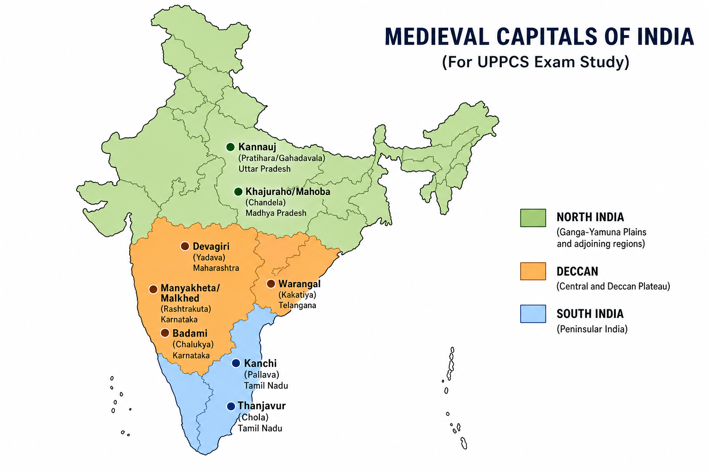
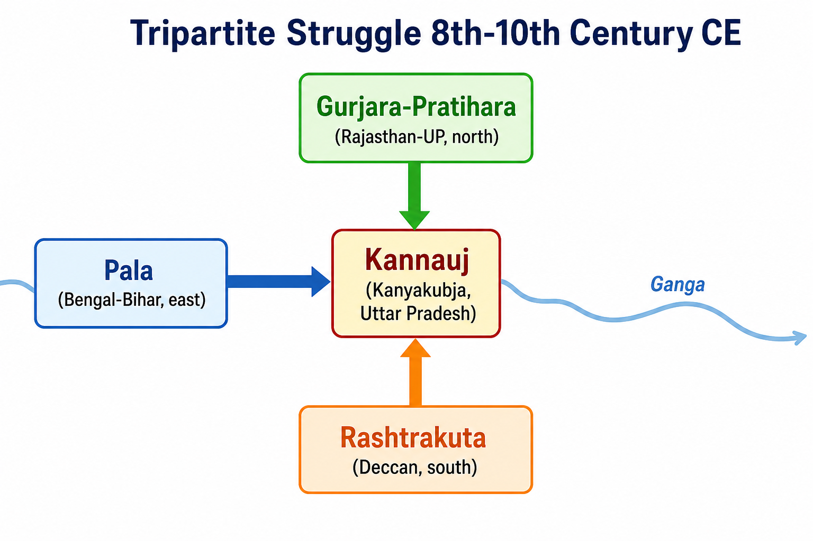

# Topic 1 — Early Medieval India (Regional Kingdoms)
### ★ Complete Source of Truth — No other book/notes needed for this topic

> **Covers syllabus:** Early Medieval India | Major Dynasties of South India | Major Rulers of South India | Pallava Dynasty | Chalukya Dynasty | Western Chalukyas | Rashtrakuta Dynasty | Chola Empire | Chola Administration | Chola Local Self-Government | Chola Naval Power | Gurjara-Pratihara Dynasty | Tripartite Struggle for Kannauj | Pala Dynasty | Sena Dynasty | Paramara Dynasty | Chandela Dynasty | Gahadavala Dynasty | Kalachuri Dynasty | Hoysala Dynasty | Kakatiya Dynasty | Yadava Dynasty | Medieval Names of Cities of Uttar Pradesh  
> **Sources baked in:** NCERT *Themes in Indian History Part II*, RS Sharma *Medieval India*, export notes (Three Empires, Chola Empire, Age of Conflict), UPPCS/UPSC PYQs 2018–2025  
> **Exam weight:** ★★★ High — dynasty-capital-ruler matching, temple chronology, Chola A/R, Sena chronology, UP city medieval names  
> **Last verified:** July 2026

---

## Syllabus Coverage Map

| # | Syllabus bullet (`00_Syllabus.md`) | § Section | What must be inside |
|---|-----------------------------------|-----------|---------------------|
| 1 | Early Medieval India | 1.1 | Period 750–1200 CE; post-Harsha fragmentation; feudalism; regional polities |
| 2 | Major Dynasties of South India | 1.2 | Complete dynasty overview table (Pallava, Chola, Chalukya, Rashtrakuta, Pandya, Chera, Hoysala, Kakatiya, Yadava) |
| 3 | Major Rulers of South India | 1.2 | Ruler ↔ dynasty ↔ capital master table |
| 4 | Pallava Dynasty | 1.3 | Kanchi capital; Mahendravarman I; Shore Temple; Pallava-Chalukya conflict |
| 5 | Chalukya Dynasty | 1.4 | Badami/Vatapi; Pulakeshin II; Aihole inscription; defeat of Harsha |
| 6 | Western Chalukyas | 1.4 | Kalyani capital; Later Chalukyas vs Cholas |
| 7 | Rashtrakuta Dynasty | 1.5 | Manyakheta; Amoghavarsha; Kailasa Ellora; Tripartite participant |
| 8 | Chola Empire | 1.6 | Vijayalaya; Rajaraja I; Rajendra I; Brihadishwara; Ganga expedition |
| 9 | Chola Administration | 1.7 | Mandalam → Valanadu → Nadu → Village; land revenue; army |
| 10 | Chola Local Self-Government | 1.8 | Ur, Sabha/Mahasabha; committees; tank committee; lottery tenure |
| 11 | Chola Naval Power | 1.9 | Sri Lanka, Maldives, Kadaram; Bay of Bengal = Chola Lake; China embassies |
| 12 | Gurjara-Pratihara Dynasty | 1.10 | Bhinmal → Kannauj; Mihir Bhoja; Nagabhatta I vs Arabs |
| 13 | Tripartite Struggle for Kannauj | 1.11 | Pala + Pratihara + Rashtrakuta; Dharmapala; Mihir Bhoja; Indra III |
| 14 | Pala Dynasty | 1.12 | Gopala founder; Dharmapala; Nalanda/Vikramashila; Buddhism |
| 15 | Sena Dynasty | 1.13 | Hemant → Vijaya → Ballal → Lakshman; Bengal; Bakhtiyar 1204 |
| 16 | Paramara Dynasty | 1.14 | Malwa; Dhara capital; Bhoja I; Rajasekhara |
| 17 | Chandela Dynasty | 1.15 | Bundelkhand; Khajuraho; Mahoba; Kannauj proximity |
| 18 | Gahadavala Dynasty | 1.16 | Kannauj + Banaras; Govind Chandra; Jay Chandra vs Prithviraj |
| 19 | Kalachuri Dynasty | 1.17 | Jabalpur region; Tripuri; Gangeyadeva; conflict with Paramaras |
| 20 | Hoysala Dynasty | 1.18 | Halebid; Vishnuvardhana; Vesara architecture; Hoysalesvara |
| 21 | Kakatiya Dynasty | 1.19 | Warangal/Orugallu; Rudramadevi; Ganapati Deva |
| 22 | Yadava Dynasty | 1.20 | Devagiri/Daulatabad; Singhana; Ramachandra |
| 23 | Medieval Names of Cities of Uttar Pradesh | 1.21 | Kannauj, Ayodhya/Saketa, Kashi/Varanasi, Mahoba, Kalanjar |

---

## How to Use This File

1. **First read:** Skim Syllabus Coverage Map → read §1.1–1.2 for period frame → study one regional block (South §1.3–1.9 OR North §1.10–1.17 OR Deccan §1.18–1.20) per sitting.
2. **Raata order:** Quick Revision Box → Must-Know Term Comparisons → Consolidated Reference (dynasty-capital-ruler table) → Common Traps.
3. **UPPCS drill:** Match List-I/II from Practice Zone + Complete PYQ Bank — dynasty-capital and ruler-dynasty pairs repeat every 2–3 years.
4. **Self-test gate:** You should answer UPPCS 2025 Q121 (Mahendravarman-Pallava, Kadungon-Pandya, Amoghavarsha-Rashtrakuta, Rajaraja-Chola) without opening notes.
5. **Revision cycle:** Day 1 = South dynasties + temples; Day 2 = North tripartite + Rajput states; Day 3 = Chola admin/navy + UP city names; Day 4 = 40 Practice Zone questions.

---

## How UPPCS Tests This Topic

| Pattern | What they ask | Your prep focus |
|---------|---------------|-----------------|
| **Match dynasty ↔ capital** | Pallava-Kanchi, Yadava-Devagiri, Kakatiya-Warangal | §1.2 master table; UPPCS 2019 Q90 |
| **Match ruler ↔ dynasty** | Mahendravarman-Pallava, Rajaraja-Chola | §1.2–1.6; **UPPCS 2025 Q121** |
| **Temple chronology** | Shore → Brihadishwara → Gangaikondacholapuram | §1.3, §1.6; UPPCS 2018 Q15 |
| **Assertion–Reason (Chola)** | More Chola info because temple-wall inscriptions | §1.6, §1.7; UPPCS 2020 Q8 |
| **Ruler chronology** | Sen: Hemant → Vijaya → Ballal → Lakshman | §1.13; UPPCS 2024 Q3 |
| **UP medieval city names** | Kannauj, Kashi, Ayodhya, Mahoba in Rajput context | §1.21 + UP Focus table |
| **NOT correctly matched** | One wrong capital in a list of four | Negative matching drill in Practice Zone |

> **2025 overlap (Q121):** Mahendravarman I = **Pallava**; Kadungon = **Pandya** revival ruler; Amoghavarsha I = **Rashtrakuta**; Rajaraja I = **Chola**. Code **B (2 4 1 3)**.

---

## Quick Revision Box — Raata This First

```
EARLY MEDIEVAL FRAME (750–1200 CE):
  Post-Harsha fragmentation | No pan-India empire | Regional kingdoms + feudal samantas
  North = Tripartite (Pala + Pratihara + Rashtrakuta) for Kannauj | South = Pallava-Chalukya-Rashtrakuta-Chola cycle

SOUTH INDIA — DYNASTY ↔ CAPITAL (★★★):
  Pallava → Kanchi (Kanchipuram) | Mahendravarman I, Narasimhavarman I (Vatapikonda)
  Chalukya (Early) → Badami/Vatapi | Pulakeshin II (defeated Harsha; Aihole inscription)
  Western Chalukya (Later) → Kalyani | Conflict with Cholas over Vengi + Tungabhadra doab
  Rashtrakuta → Manyakheta (Malkhed) | Dantidurga founder | Amoghavarsha I (814–878, 64-yr reign)
  Chola → Tanjore/Thanjavur → Gangaikondacholapuram | Vijayalaya founder (850 CE)
  Pandya → Madurai | Kadungon = revival (~6th c.) ← 2025 Q121
  Hoysala → Halebid/Dvarasamudra | Vishnuvardhana | Hoysalesvara temple
  Kakatiya → Warangal (Orugallu) | Rudramadevi, Ganapati Deva
  Yadava → Devagiri (Daulatabad) | Singhana, Ramachandra

NORTH & EAST — KEY RULERS:
  Pala → Gopala (founder, elected) | Dharmapala (Kannauj) | Devapala (peak) | Nalanda + Vikramashila
  Pratihara → Nagabhatta I (vs Arabs) | Mihir Bhoja/Adivaraha (Kannauj ~836) | Best cavalry (Al-Masudi)
  Sena → Hemant → Vijaya → Ballal → Lakshman (UPPCS 2024 Q3: D = 3 4 1 2)
  Paramara → Malwa, Dhara | Bhoja I (scholar-king) | Rajasekhara (poet at Mahipala court)
  Chandela → Bundelkhand, Khajuraho | Mahoba | Dhanga, Vidyadhara
  Gahadavala → Kannauj + Banaras | Govind Chandra (greatest) | Jay Chandra (vs Prithviraj)
  Kalachuri → Tripuri (near Jabalpur) | Gangeyadeva, Karna

CHOLA ADMIN & NAVY (★★★):
  Hierarchy: King → Mandalam → Valanadu → Nadu → Village
  Ur = village assembly | Sabha/Mahasabha = Brahmana agrahara assembly | Tank Committee = irrigation
  Navy: Maldives, Sri Lanka, Kadaram (Kedah), Malaya; Bay of Bengal = "Chola Lake"
  Brihadishwara (Tanjore, 1010, Rajaraja I) | Gangaikondacholapuram (Rajendra I) | Shore Temple (Pallava ~7th c.)

TEMPLE CHRONOLOGY (UPPCS 2018 Q15):
  Shore Temple Mahabalipuram (Pallava ~725) → Brihadishwara (1010) → Gangaikondacholapuram (~1025) → Sapt Pagoda
  Trap: Brihadishwara BEFORE Gangaikondacholapuram (father Rajaraja → son Rajendra)

TRIPARTITE STRUGGLE:
  Palas (Bengal-Bihar) + Pratiharas (Rajasthan-UP) + Rashtrakutas (Deccan) fought for Kannauj (8th–10th c.)
  Dharmapala occupied Kannauj | Mihir Bhoja recovered it | Indra III (Rashtrakuta) sacked Kannauj 915–918

UP MEDIEVAL CITY NAMES:
  Kannauj = Kanyakubja (Harsha's capital; tripartite prize) | Ayodhya = Saketa
  Varanasi = Kashi/Banaras/Avimukta | Mahoba = Chandela capital (Bundelkhand, UP)
  Kalanjar = Chandela fort (Banda district, UP) | Banaras = Gahadavala secondary capital
```

### Must-Know Term Comparisons (very frequently asked)

| Term | One-line difference | Hindi |
|------|---------------------|-------|
| **Early Medieval India** | Period ~750–1200 CE after Harsha — regional kingdoms, land grants, feudal samantas | प्रारंभिक मध्यकालीन भारत |
| **Tripartite Struggle** | Pala + Gurjara-Pratihara + Rashtrakuta contest for Kannauj supremacy | त्रिपक्षीय संघर्ष (कन्नौज) |
| **Pallava vs Chola** | Pallava = Kanchi, pre-9th c. Tamil power; Chola = Tanjore-based empire from Vijayalaya (850 CE) | पल्लव / चोल |
| **Early vs Western Chalukya** | Early = Badami/Vatapi (6th–8th c.); Western/Later = Kalyani (10th–12th c., Rashtrakuta successors) | प्राचीन चालुक्य / पश्चिमी चालुक्य |
| **Ur vs Sabha** | Ur = general village assembly; Sabha/Mahasabha = Brahmana agrahara assembly with greater autonomy | उर / सभा |
| **Nadu vs Mandalam** | Nadu = basic Chola unit (group of villages); Mandalam = province (empire had 4) | नाडु / मंडलम |
| **Gahadavala vs Pratihara** | Both held Kannauj region; Gahadavalas 11th–12th c. Rajput kingdom; Pratiharas 8th–10th c. imperial power | गहड़वाल / गुर्जर-प्रतिहार |
| **Chandela vs Paramara** | Chandela = Bundelkhand/Khajuraho; Paramara = Malwa/Dhara | चंदेल / परमार |
| **Devagiri vs Warangal** | Devagiri = Yadava capital (Maharashtra); Warangal = Kakatiya capital (Telangana) | देवगिरी / वारंगल |
| **Kannauj vs Kashi** | Kannauj = political sovereignty symbol (tripartite); Kashi = religious-cultural centre (Gahadavala) | कन्नौज / काशी |
| **Shore Temple vs Brihadishwara** | Shore = Pallava structural temple (~7th c., Mahabalipuram); Brihadishwara = Chola Rajaraja I (1010, Tanjore) | शोर मंदिर / बृहदीश्वर |
| **Adivaraha vs Gangaikondachola** | Adivaraha = title of Mihir Bhoja (Pratihara); Gangaikondachola = title of Rajendra I (Chola) | आदिवराह / गंगैकोंडचोल |

### Memory Tricks

| Trick | Remembers |
|-------|-----------|
| **P-C-R-C loop** | Pallava → Chalukya → Rashtrakuta → Chola (South India power rotation) |
| **PPP for Kannauj** | **P**ala + **P**ratihara + **P**… Rashtrakuta (Tripartite three empires) |
| **H-V-B-L Sena** | **H**emant → **V**ijaya → **B**allal → **L**akshman (2024 Q3 order) |
| **Ma-Ka-Am-Ra (2025)** | **Ma**hendravarman-Pallava, **Ka**dungon-Pandya, **Am**oghavarsha-Rashtrakuta, **Ra**jaraja-Chola |
| **Shore → Big → Bigger** | Shore Temple (7th) → Brihadishwara (1010) → Gangaikondacholapuram (1025) |
| **Gopala = Elected** | Only major founder elected by nobles (Pala) |
| **Bhoja = Two kings** | Mihir Bhoja (Pratihara) ≠ Bhoja I (Paramara) — both called Bhoja, different dynasties |
| **K-W-D-M capitals** | **K**anchi-Pallava, **W**arangal-Kakatiya, **D**evagiri-Yadava, **M**adurai-Pandya (2019 Q90) |
| **Chola Lake** | Bay of Bengal after Rajendra's naval campaigns |
| **Vatapikonda** | Narasimhavarman I captured Vatapi (642) — Pallava title |

---

## Exam Visuals — High-ROI Images

> **Type priority:** location map → conceptual diagram. Images stored locally (`images/`) so they open offline.

### 1. Early Medieval Regional Kingdoms — Location Map



*Raata **dynasty ↔ capital** pairs — **UPPCS 2019 Q90**: Pallava-Kanchi, Yadava-Devagiri, Kakatiya-Warangal, Pandya-Madura. **UPPCS 2025 Q121**: ruler-dynasty four-match.*
*Source: Study map — generated for UPPCS capital-matching*

### 2. Tripartite Struggle — Conceptual Diagram



*Three empires fought for **Kannauj** (UP) — symbol of sovereignty after Harsha. **Dharmapala** (Pala) occupied it; **Mihir Bhoja** (Pratihara) recovered; **Indra III** (Rashtrakuta) sacked it 915–918 CE.*
*Source: Study diagram — tripartite struggle for UPPCS*


---

## 1.1 Early Medieval India

### Definitions (learn all — exams pick different ones)

| Source | Definition |
|--------|------------|
| **General** | Phase of Indian history from ~750 CE to ~1200 CE marked by regional kingdoms, land grants, and feudal decentralization after the collapse of the Gupta-Harsha imperial order |
| **NCERT / Standard** | "Early Medieval" = transition from ancient empires to regional states; agriculture expands via Brahmanical land grants; no single pan-India ruler after Harsha (647 CE) |
| **Political (exam use)** | Period when **samantas** (feudatories) grew powerful; village committees weakened; tripartite struggle and Rajput states emerged in north; Chola maritime empire in south |

### Early Medieval India — How It Works

- **Timeline anchor:** Begins roughly **750 CE** (post-Harsha) and ends ~**1200 CE** when Turkish invasions transform north Indian politics — overlaps Delhi Sultanate foundation.
- **Why "medieval"?** Historians mark break from ancient when **centralized empires** (Gupta, Harsha) give way to **regional kingdoms** with feudal structure.
- **Geographical power bases:** North = Ganga valley + Gujarat + Malwa; South = Kaveri/Krishna/Godavari deltas; both needed **irrigation** and **trade routes** for revenue.
- **Land grant revolution:** Rulers gave **Brahmanical agrahara grants** (tax-free villages) — expanded cultivation but created **landed elite** and peasant burdens.
- **Feudalization process:** **Samantas**, **bhogapatis**, **nad-gavundas** rose as hereditary intermediaries — central authority weakened over time.
- **No pan-India empire:** Unlike Guptas, no early medieval dynasty controlled full subcontinent — even tripartite powers fought each other, not unified rule.
- **Continuity with ancient:** Sanskrit learning, temple culture, varna framework, and guild trade continued — change was **political-administrative**, not total break.
- **Arab/traveler accounts:** Sulaiman (9th c., on Palas), Al-Masudi (10th c., on Pratiharas/Rashtrakutas) — external evidence for three-empire rivalry.
- **South vs North pattern:** South saw **Pallava-Chalukya-Rashtrakuta-Chola** cycle; North saw **Pala-Pratihara-Rashtrakuta tripartite** then **Rajput regional states**.
- **UP relevance:** **Kannauj** (tripartite prize), **Varanasi/Kashi** (Gahadavala), **Bundelkhand/Khajuraho** (Chandela) — all in modern Uttar Pradesh or border zones.

> **Exam note:** Early Medieval ≠ Delhi Sultanate. Sultanate begins **1206 CE** — this topic ends at Rajput/Turkish transition (~1192 Tarain). Trap: calling Mihir Bhoja a "Sultan."

### Exam Facts (raata)

- Early Medieval period ≈ **750–1200 CE**
- Post-Harsha = political fragmentation across India
- Key north theme = **Tripartite Struggle for Kannauj** (Pala, Pratihara, Rashtrakuta)
- Key south theme = **Chola maritime empire** + Pallava-Chalukya conflict
- Feudalization = rise of **samantas** weakening village autonomy
- Land grants to Brahmins = agricultural expansion + new landlord class
- Sulaiman (Arab) described Pala kingdom as **Ruhma/Dharma**
- Al-Masudi called Pratihara kingdom **Al-Juzr (Gurjara)**
- No single ruler matched Gupta extent in this period

### PYQs — Early Medieval India

1. **(UPPCS Prelims 2025, Q121 — pattern overlap)** Match List-I (Ruler) with List-II (Dynasty): Mahendravarman I, Kadungon, Amoghavarsha I, Rajaraja I.  
   → **B (2 4 1 3)** — all four are early medieval regional rulers; frame tests dynasty identification across south and Deccan.

2. **(UPPCS Prelims 2023, Q — Geography cross-over)** With reference to Kannauj: "Ram Ganga River joins the Ganga at Kannauj."  
   → **Only 1 correct** — Kannauj's geographic importance reinforces why dynasties fought for it (tripartite context).

### Examples (1.1)

| Example | What it teaches |
|---------|-----------------|
| **Kannauj, UP** | Symbol of sovereignty after Harsha — tripartite struggle centre |
| **Belan Valley (UP)** | Not early medieval — trap if mixed with ancient sites; UP has Kannauj/Kashi instead |
| **Manyakheta (Karnataka)** | Rashtrakuta capital — Deccan power in tripartite politics |

---

## 1.2 Major Dynasties of South India + Major Rulers

### Definitions

| Term | Meaning |
|------|---------|
| **Major Dynasties of South India** | Pallava, Chalukya (Early + Western), Rashtrakuta, Chola, Pandya, Chera, Hoysala, Kakatiya, Yadava — regional powers controlling Tamil, Karnataka, Andhra, Maharashtra belts |
| **Major Rulers** | King whose inscriptions/temples define dynasty peak — matched to capital in UPPCS match-list questions |

### Major Dynasties — How It Works

- **Pallavas (575–897 CE approx.):** Kanchi capital; controlled northern Tamil Nadu + southern Andhra; famous for **Mahabalipuram** rock-cut and Shore Temple architecture.
- **Early Chalukyas (543–757 CE):** Badami/Vatapi capital; Pulakeshin II stopped Harsha's Deccan advance; conflicted with Pallavas over Krishna-Tungabhadra doab.
- **Rashtrakutas (753–972 CE):** Manyakheta/Malkhed capital; overthrew Chalukyas 757 CE; participated in **tripartite struggle**; built **Kailasa temple, Ellora**.
- **Cholas (850–1279 CE):** Vijayalaya captured Tanjore 850 CE; imperial peak under **Rajaraja I** and **Rajendra I**; navy dominated Bay of Bengal.
- **Pandyas (Madurai):** Ancient dynasty; **Kadungon** revived Pandya power ~6th century — UPPCS 2025 Q121 pairs Kadungon with Pandya.
- **Cheras (Kerala):** Malabar coast trade; Chola conflicts destroyed Chera navy at Trivandrum under Rajaraja I.
- **Western Chalukyas / Later Chalukyas (973–1189 CE):** Kalyani capital; successors after Rashtrakuta fall; chronic war with Cholas over Vengi and Tungabhadra doab.
- **Hoysala (1026–1343 CE):** Dvarasamudra/Halebid; **Vishnuvardhana**; Vesara (mixed Nagara-Dravida) architecture; Hoysalesvara temple.
- **Kakatiya (1083–1323 CE):** Warangal/Orugallu; **Rudramadevi** (woman ruler); fortifications, tank irrigation.
- **Yadava (1187–1317 CE):** Devagiri (later **Daulatabad**); Marathi language development; defeated by Alauddin Khalji 1296, finally Delhi Sultanate 1317.

> **Exam note:** UPPCS loves **capital matching** — full table below. **2019 Q90 answer B (2 3 4 1)**: Pallava-2-Kanchi, Pandya-3-Madura, Yadava-4-Devagiri, Kakatiya-1-Warangal.

### Complete Dynasty — Capital — Region — Key Rulers Table

| Dynasty | Capital(s) | Region / State | Key Rulers (chronological) |
|---------|------------|----------------|------------------------------|
| **Pallava** | Kanchipuram (Kanchi) | North Tamil Nadu, south Andhra | Simhavishnu, Mahendravarman I, Narasimhavarman I (Vatapikonda), Narasimhavarman II (Rajasimha), Nandivarman II |
| **Early Chalukya** | Badami (Vatapi) | Karnataka, Maharashtra | Pulakeshin I, Kirtivarman I, Pulakeshin II, Vikramaditya I, Vikramaditya II |
| **Eastern Chalukya** | Vengi | Coastal Andhra | Vishnuvardhana (branch of Pulakeshin II) |
| **Rashtrakuta** | Manyakheta (Malkhed) | Maharashtra, Karnataka, Malwa | Dantidurga, Krishna I, Govinda III, Amoghavarsha I, Indra III, Krishna III |
| **Chola** | Thanjavur (Tanjore); Gangaikondacholapuram | Tamil Nadu, parts Sri Lanka, Maldives | Vijayalaya, Aditya I, Parantaka I, Rajaraja I, Rajendra I, Rajadhiraja, Kulottunga I |
| **Pandya** | Madurai | South Tamil Nadu | Kadungon, Arikesari, Rajasimha II, Maravarman Sundara Pandya |
| **Chera** | Muziris/Vanjikkarai region | Kerala | Perumchottu, Kulasekhara Alvar period rulers |
| **Western Chalukya** | Kalyani | Karnataka | Tailapa II, Vikramaditya VI, Someshvara I |
| **Hoysala** | Belur, Halebid (Dvarasamudra) | Karnataka | Vishnuvardhana, Ballala II, Narasimha I |
| **Kakatiya** | Warangal (Orugallu) | Telangana | Prola II, Ganapati Deva, Rudramadevi, Prataparudra II |
| **Yadava** | Devagiri (Daulatabad) | Maharashtra | Bhillama V, Singhana II, Ramachandra |

### Ruler — Dynasty Quick-Match (UPPCS high-yield)

| Ruler | Dynasty | Famous for |
|-------|---------|------------|
| Mahendravarman I | Pallava | Jain patron turned Shaiva; Mamalla; Mahabalipuram |
| Pulakeshin II | Early Chalukya | Defeated Harsha; Aihole inscription |
| Amoghavarsha I | Rashtrakuta | 64-year reign; Kannada poetics; peace over war |
| Rajaraja I | Chola | Brihadishwara Temple 1010; Maldives conquest |
| Rajendra I | Chola | Ganga expedition 1022; Gangaikondacholapuram |
| Kadungon | Pandya | Early medieval Pandya revival ruler |
| Vishnuvardhana | Hoysala | Vaishnava patron; freed from Chalukya overlordship |
| Rudramadevi | Kakatiya | Ruled as Rudradeva; woman monarch |
| Singhana | Yadava | Peak Yadava power; literature patron |

### Exam Facts (raata)

- Pallava capital = **Kanchi** | Pandya capital = **Madurai** | Yadava = **Devagiri** | Kakatiya = **Warangal**
- Mahendravarman I = **Pallava** | Kadungon = **Pandya** | Amoghavarsha I = **Rashtrakuta** | Rajaraja I = **Chola**
- Early Chalukya capital = **Badami/Vatapi** | Western Chalukya = **Kalyani**
- Rashtrakuta capital = **Manyakheta (Malkhed)**
- Chola founder = **Vijayalaya** (850 CE, captured Tanjore)
- Pulakeshin II = stopped **Harsha** at Narmada
- Chalukyas claimed **Ayodhya origin** (legendary link to UP)

### PYQs — Major Dynasties & Rulers

1. **(UPPCS Prelims 2019, Q90)** Match List-I (Dynasty) with List-II (Capital): A. Pallava B. Pandya C. Yadava D. Kaktiya — 1. Warangal 2. Kanchi 3. Madura 4. Devagiri.  
   → **B (2 3 4 1).** Only trap: Kakatiya-Warangal (not Kanchi).

2. **(UPPCS Prelims 2025, Q121)** Match List-I (Ruler) List-II (Dynasty): A. Mahendravarman I B. Kadungon C. Amoghavarsha I D. Rajaraja I — 1. Rashtrakuta 2. Pallava 3. Chola 4. Pandya.  
   → **B (2 4 1 3).** Kadungon-Pandya is the subtle pair many miss.

### Examples (1.2)

| Example | What it teaches |
|---------|-----------------|
| **Kanchipuram, TN** | Pallava capital — UPPCS matches with Pallava dynasty |
| **Devagiri/Daulatabad, MH** | Yadava capital — later Muhammad bin Tughlaq shifted capital here |
| **Warangal, Telangana** | Kakatiya capital — fort gates (Kirti Torana) still stand |


---

## 1.3 Pallava Dynasty

### Definitions

| Term | Meaning |
|------|---------|
| **Pallava** | Tamil word meaning "creeper/twig" — dynasty ruling Kanchi region from ~6th–9th century CE |
| **Tondaimandalam** | Pallava core territory — northern Tamil Nadu |
| **Vatapikonda** | Title of Narasimhavarman I — "conqueror of Vatapi (Badami)" |

### Pallava Dynasty — How It Works

- **Capital:** **Kanchipuram (Kanchi)** — centre of Vedic learning, silk, and temple architecture in Tamil Nadu.
- **Founder line:** **Simhavishnu** established Pallava power; dynasty peaked under **Mahendravarman I** and **Narasimhavarman I**.
- **Mahendravarman I (600–630 CE):** Author of **Mattavilasa Prahasana**; initially Jain, converted to Shaivism; built Mahabalipuram monuments; patron of arts.
- **Pallava-Chalukya rivalry:** Fought Early Chalukyas for **Krishna-Tungabhadra doab** — fertile strategic belt.
- **Narasimhavarman I (630–668 CE):** Captured **Vatapi (Badami)** in **642 CE**; title **Vatapikonda**; founded Mamallapuram (Mahabalipuram).
- **Architecture — Mahabalipuram:** **Seven Rathas** (rock-cut monoliths), **Shore Temple** (~725 CE, structural), Arjuna's Penance — UNESCO World Heritage.
- **Kailasanatha Temple, Kanchi:** Early **Dravida** style structural temple — 8th century Pallava work.
- **Decline:** Pallavas weakened by Rashtrakuta and Chola rise; **Vijayalaya Chola** captured Tanjore 850 CE from Pallava feudatory status.
- **Inscriptions:** Pallava copper plates shifted from Prakrit to Sanskrit; land grants to Brahmins expanded cultivation.
- **UPPCS link:** **Mahendravarman I ↔ Pallava** (2025 Q121); **Pallava ↔ Kanchi** (2019 Q90).

> **Exam note:** Shore Temple = **Pallava** (7th–8th c.), NOT Chola. Brihadishwara = Chola. Trap: assigning Shore Temple to Cholas.

### Pallava Rulers Table

| Ruler | Period (approx.) | Key achievement |
|-------|------------------|-----------------|
| Simhavishnu | 575–600 CE | Founded Pallava imperial line |
| Mahendravarman I | 600–630 CE | Mahabalipuram; Jain-Shaiva convert; UPPCS 2025 Q121 |
| Narasimhavarman I (Mamalla) | 630–668 CE | Captured Vatapi 642; Shore Temple phase |
| Narasimhavarman II (Rajasimha) | 695–722 CE | Shore Temple completion |
| Nandivarman II | 731–796 CE | Faced Rashtrakuta pressure |

### Exam Facts (raata)

- Pallava capital = **Kanchi (Kanchipuram)**
- "Pallava" = creeper/twig (Tamil)
- Mahendravarman I = Pallava (2025 Q121)
- Narasimhavarman I captured **Vatapi 642 CE** — title Vatapikonda
- Shore Temple = **Mahabalipuram**, Tamil Nadu — Pallava
- Seven Rathas = rock-cut, Mahabalipuram
- Kailasanatha Temple = Kanchi, early Dravida style
- Pallavas defeated by rising **Cholas** under Vijayalaya (~850 CE)

### PYQs — Pallava

1. **(UPPCS Prelims 2025, Q121)** Mahendravarman I matched with which dynasty?  
   → **Pallava (2).** Contemporary of Pulakeshin II; built Mahabalipuram complex.

2. **(UPPCS Prelims 2018, Q15 — chronology)** Shore temple of Mahabalipuram appears in temple chronology list — earliest of the Chola-Pallava temple sequence.  
   → **Shore Temple first (~7th c.)** before Brihadishwara (1010) and Gangaikondacholapuram (~1025).

### Examples (1.3)

| Example | Detail |
|---------|--------|
| **Mahabalipuram, TN** | Pallava port + Shore Temple — UPPCS temple chronology |
| **Kanchipuram, TN** | Pallava capital — 2019 Q90 match |
| **Badami, Karnataka** | Vatapi — captured by Narasimhavarman I from Chalukyas |

---

## 1.4 Chalukya Dynasty + Western Chalukyas

### Definitions

| Term | Meaning |
|------|---------|
| **Early Chalukyas** | Dynasty with capital at **Badami (Vatapi)** — 6th–8th century Deccan power |
| **Western Chalukyas (Later Chalukyas)** | Successor dynasty at **Kalyani** after Rashtrakuta fall — 10th–12th century |
| **Aihole Inscription** | Pulakeshin II's prashasti by Ravikirti — key source for Early Chalukya history |

### Chalukya — How It Works

- **Early Chalukya capital:** **Badami (Vatapi)** in Karnataka — cave temples and fort capital.
- **Pulakeshin II (609–642 CE):** Greatest Early Chalukya ruler; **Aihole inscription** (Ravikirti); defeated **Harsha** on Narmada — blocked north Indian expansion into Deccan.
- **Branch creation:** Created **Eastern Chalukya** line at **Vengi** (Andhra) — later conflict zone with Cholas.
- **Pallava wars:** Pulakeshin II initially beat Pallavas; **Narasimhavarman I** reversed this — captured Vatapi 642 CE.
- **Vikramaditya II (733–745 CE):** Captured Kanchi three times; routed Pallavas 740 CE — last great Early Chalukya victory.
- **End of Early Chalukyas:** **757 CE** — overthrown by **Dantidurga (Rashtrakuta)**.
- **Western Chalukyas:** Emerged **973 CE** under **Tailapa II** after Rashtrakuta collapse; capital **Kalyani**.
- **Chola conflict:** Western Chalukyas fought Cholas over **Vengi**, **Tungabhadra doab**, and northwest Karnataka — no decisive winner; both exhausted.
- **Architecture:** **Aihole** (~70 temples), **Badami** cave temples, **Pattadakal** (UNESCO) — fusion of Nagara and Dravida styles.
- **Legend:** Chalukyas claimed descent from **Ayodhya** — symbolic link to UP (Agnikula legend lists Chalukya/Solanki among fire-born clans).

> **Exam note:** **Early Chalukya = Badami** | **Western Chalukya = Kalyani**. Trap: mixing Vatapi with Kalyani. Pulakeshin II ≠ Vikramaditya VI (different Chalukya branches/eras).

### Early vs Western Chalukya Comparison

| Feature | Early Chalukya | Western Chalukya |
|---------|----------------|------------------|
| Capital | Badami (Vatapi) | Kalyani |
| Peak ruler | Pulakeshin II | Vikramaditya VI |
| Period | 543–757 CE | 973–1189 CE |
| End | Overthrown by Rashtrakutas | Weakened by Hoysalas, Yadavas, Delhi Sultanate |
| Main rival | Pallavas | Cholas |

### Exam Facts (raata)

- Early Chalukya capital = **Badami/Vatapi**
- Pulakeshin II defeated **Harsha** — Narmada battle
- Aihole inscription = **Ravikirti** on Pulakeshin II
- Narasimhavarman I captured Vatapi **642 CE**
- Early Chalukyas ended **757 CE** (Rashtrakuta Dantidurga)
- Western Chalukya capital = **Kalyani**
- Pattadakal = UNESCO site — Chalukya architecture
- Chalukyas linked to **Ayodhya origin** legend

### PYQs — Chalukya

1. **(UPPCS Prelims 2018, Q15)** Temple chronology includes monuments from Chalukya-Chola-Pallava world; Shore Temple (Pallava) predates Chola Brihadishwara.  
   → Chronology tests knowing which dynasty built which temple style.

2. **(UPSC Prelims 2014 — pattern)** Pulakeshin II is associated with victory over which north Indian ruler?  
   → **Harsha.** Narmada became informal boundary between north and Deccan empires.

### Examples (1.4)

| Example | Detail |
|---------|--------|
| **Badami, Karnataka** | Early Chalukya capital — cave temple complex |
| **Pattadakal, Karnataka** | UNESCO — Virupaksha temple built by Chalukya queen Lokmahadevi |
| **Ayodhya, UP** | Legendary Chalukya origin claim — UP-relevant trap in Agnikula legend |

---

## 1.5 Rashtrakuta Dynasty

### Definitions

| Term | Meaning |
|------|---------|
| **Rashtrakuta** | Deccan dynasty (753–972 CE) — capital Manyakheta; participated in tripartite struggle |
| **Manyakheta** | Modern Malkhed, Karnataka — Rashtrakuta capital |
| **Balhara** | Al-Masudi's term for Rashtrakuta emperor — "greatest king in India" |

### Rashtrakuta Dynasty — How It Works

- **Founder:** **Dantidurga** overthrew Early Chalukyas **757 CE** and established Rashtrakuta power at **Manyakheta**.
- **Territorial extent:** Northern Maharashtra, Karnataka, Gujarat, Malwa at peak — controlled key Deccan trade routes.
- **Krishna I:** Built **Kailasa Temple, Ellora** — monolithic rock-cut Shiva temple; architectural masterpiece.
- **Govinda III (793–814 CE):** Defeated Nagabhatta II (Pratihara); campaigns against Kerala, Pandya, Chola, Pallava.
- **Amoghavarsha I (814–878 CE):** **64-year reign**; preferred literature/religion over war; wrote **Kavirajamarga** (early Kannada poetics); UPPCS 2025 Q121 pairs him with Rashtrakuta.
- **Tripartite role:** Rashtrakutas fought Palas and Pratiharas for **Kannauj** — **Indra III** sacked Kannauj 915–918 CE defeating Mahipala.
- **Krishna III (934–963 CE):** Last great ruler; defeated Chola **Parantaka I** (949 CE); reached Rameshwaram; built victory pillar.
- **Religious tolerance:** Patronized Shaivism, Vaishnavism, Jainism; allowed Muslim settlements and mosques in their ports.
- **Decline:** **972 CE** — capital Manyakheta sacked; empire replaced by Western Chalukyas.
- **Administration:** Provinces called **rashtra** (governor = rashtrapati); visaya = district; feudatory system similar to north Indian samantas.

> **Exam note:** **Amoghavarsha I = Rashtrakuta** (2025 Q121). Trap: confusing with Amoghavarsha as Rashtrakuta vs **Bhoja** (Paramara) — both scholars, different dynasties.

### Rashtrakuta Rulers Table

| Ruler | Period | Key fact |
|-------|--------|----------|
| Dantidurga | 753–757 CE | Founder; ended Early Chalukyas |
| Krishna I | 756–774 CE | Kailasa temple, Ellora |
| Govinda III | 793–814 CE | Defeated Pratiharas and southern kings |
| Amoghavarsha I | 814–878 CE | 64-year reign; Kannada literature |
| Indra III | 915–927 CE | Sacked Kannauj; tripartite peak |
| Krishna III | 934–963 CE | Defeated Chola Parantaka I |

### Exam Facts (raata)

- Rashtrakuta founder = **Dantidurga**
- Capital = **Manyakheta (Malkhed)**
- Amoghavarsha I = **Rashtrakuta** (2025 Q121)
- Kailasa temple, Ellora = **Krishna I**
- Indra III sacked **Kannauj 915–918 CE**
- Al-Masudi called Rashtrakuta king **Balhara/Vallabharaja**
- End = **972 CE** (Manyakheta burnt)
- Chandrobalabbe (Amoghavarsha's daughter) administered **Raichur doab**

### PYQs — Rashtrakuta

1. **(UPPCS Prelims 2025, Q121)** Amoghavarsha I → which dynasty?  
   → **Rashtrakuta (1).** 64-year reign; Kannada Kavirajamarga.

2. **(UPPCS Prelims 2019, Q90 — indirect)** While Q90 tests south capitals, Rashtrakuta Manyakheta often appears as distractor in other match questions.  
   → Manyakheta ≠ Kanchi/Warangal/Devagiri/Madurai — know to eliminate.

### Examples (1.5)

| Example | Detail |
|---------|--------|
| **Ellora, Maharashtra** | Kailasa temple — Krishna I (Rashtrakuta) |
| **Malkhed, Karnataka** | Manyakheta — Rashtrakuta capital |
| **Kannauj, UP** | Indra III (Rashtrakuta) sacked it — tripartite link to UP |

---

## 1.6 Chola Empire

### Definitions

| Term | Meaning |
|------|---------|
| **Chola Empire** | Tamil imperial state from ~850 CE; peak 985–1044 under Rajaraja I and Rajendra I |
| **Imperial Cholas** | Vijayalaya line — distinct from early Sangam-age Chola references |
| **Brihadishwara (Rajarajesvaram)** | Shiva temple at Tanjore completed 1010 CE — Rajaraja I |

### Chola Empire — How It Works

- **Founder:** **Vijayalaya Chola** — feudatory of Pallavas; captured **Tanjore (Thanjavur) 850 CE**.
- **Expansion:** **Aditya I** defeated Pallavas; **Parantaka I** expanded but lost to Rashtrakuta Krishna III (949 CE).
- **Recovery:** After Rashtrakuta fall (972 CE), Cholas re-emerged as dominant south Indian power.
- **Rajaraja I (985–1014 CE):** Conquered **Madurai** (Pandyas), **northern Sri Lanka**, **Maldives**, Maldive islands; built **Brihadishwara Temple (1010 CE)** at Tanjore.
- **Rajendra I (1014–1044 CE):** Completed Sri Lanka conquest; **Ganga expedition 1022 CE** — marched through Kalinga to Bengal; assumed title **Gangaikondachola**; built new capital **Gangaikondacholapuram**.
- **Inscriptions:** Cholas engraved **historical narratives on temple walls** — reason we know more about Cholas than predecessors (UPPCS 2020 Q8).
- **Southeast Asia:** Naval expedition against **Srivijaya** (1025 CE) — Kadaram (Kedah) conquered; controlled Bay of Bengal trade.
- **Decline:** 13th century — weakened by **Pandyas**, **Hoysalas**, **Kakatiyas**, **Yadavas**; destroyed by **Delhi Sultanate** early 14th century.
- **Architecture:** Dravida style — vimana, gopuram, mandapa; **Bronze Nataraja** icons reached artistic peak.
- **UPPCS link:** **Rajaraja I ↔ Chola (2025 Q121)**; temple chronology Brihadishwara + Gangaikondacholapuram (2018 Q15).

> **Exam note:** **2020 Q8 answer A** — Both A and R true; R correctly explains A. Chola temple inscriptions = primary historical source. Trap: saying R is false.

### Chola Rulers — Key Timeline

| Ruler | Period | Achievement |
|-------|--------|-------------|
| Vijayalaya | 850–871 CE | Captured Tanjore; founder |
| Aditya I | 871–907 CE | Defeated Pallavas |
| Rajaraja I | 985–1014 CE | Brihadishwara 1010; Maldives; UPPCS 2025 |
| Rajendra I | 1014–1044 CE | Ganga expedition; Gangaikondacholapuram |
| Rajadhiraja | 1044–1052 CE | Died fighting Western Chalukyas |
| Kulottunga I | 1070–1122 CE | Combined Chola-Vengi lines |

### Exam Facts (raata)

- Chola founder = **Vijayalaya** (850 CE, Tanjore)
- Rajaraja I built **Brihadishwara Temple 1010 CE**
- Rajendra I = **Gangaikondachola**; Ganga expedition **1022 CE**
- Rajaraja I = **Chola** (2025 Q121)
- Chola inscriptions on **temple walls** = rich historical source (2020 Q8)
- Bay of Bengal called **"Chola Lake"**
- Sri Lanka under Chola ~**50 years** under Rajendra I
- Chola embassies to China: **1016, 1033, 1077 CE**

### PYQs — Chola Empire

1. **(UPPCS Prelims 2020, Q8)** Assertion: We have much more information about Cholas than predecessors. Reason: Chola rulers had inscriptions on temple walls narrating victories.  
   → **A — Both true; R explains A.** Copper plates + temple walls = Chola historiography.

2. **(UPPCS Prelims 2018, Q15)** Arrange: Brihadishwara, Gangaikondacholapuram, Shore Temple, Sapt Pagoda.  
   → **Answer D (IV, III, I, II).** Core Indian sequence: Shore (~7th c.) → Brihadishwara (1010) → Gangaikondacholapuram (~1025). **Brihadishwara BEFORE Gangaikonda** — Rajaraja before Rajendra.

### Examples (1.6)

| Example | Detail |
|---------|--------|
| **Thanjavur, TN** | Brihadishwara Temple — Rajaraja I, 1010 CE |
| **Gangaikondacholapuram, TN** | Rajendra I's capital + temple |
| **Kedah (Malaysia)** | Kadaram — Chola naval conquest under Rajendra I |

---

## 1.7 Chola Administration

### Definitions

| Term | Meaning |
|------|---------|
| **Mandalam** | Chola provincial division — empire divided into **4 mandalams** |
| **Valanadu** | Chola administrative unit — group of nadus |
| **Nadu** | Basic Chola territorial unit — cluster of villages with kinship links |
| **Variyam** | Committee system in village assemblies |

### Chola Administration — How It Works

- **King:** Supreme authority — **Maharajadhiraja**; undertook royal tours to supervise provinces directly.
- **Council of ministers:** Assisted king in civil, military, and revenue affairs — appointments often from trusted families.
- **Administrative hierarchy:** **King → Mandalam (province) → Valanadu → Nadu → Village** — UPPCS tests this chain.
- **Provincial governors:** Often **princes of royal family** — ensured loyalty but could rebel (later period weakness).
- **Army three limbs:** **Elephants, cavalry, infantry** — infantry mainly spear-armed; bodyguards sworn to protect king.
- **Navy:** Separate wing under administration — not just military but trade protection (see §1.9).
- **Land revenue:** **Land survey** conducted to fix assessment; primary state income from agriculture on Kaveri delta.
- **Other revenue:** Trade tolls, professional taxes, war booty — temples also held revenue-free lands.
- **Official payment:** Many officials paid through **revenue-bearing land assignments** (similar to iqta precursor) — feudal tendency grew over time.
- **Justice:** King = supreme judge; village assemblies handled local disputes (see §1.8).
- **Feudal decay:** Later Chola period — **urar** (hereditary rights) and central interference reduced village autonomy.

> **Exam note:** Administrative order = **Mandalam → Valanadu → Nadu → Village** (NOT reverse). Basic unit = **Nadu**, not mandalam.

### Chola Administrative Units Table

| Unit | Officer / Head | Function |
|------|------------------|----------|
| Mandalam | Viceroy (often prince) | Province |
| Valanadu | Perundaram/Variyapperumakkal | Group of nadus |
| Nadu | Naduvirukkai | Village cluster |
| Village | Ur/Kurram | Local unit |

### Exam Facts (raata)

- Chola hierarchy: **Mandalam → Valanadu → Nadu → Village**
- Basic unit = **Nadu**
- 4 **mandalams** in Chola empire
- Army: elephants + cavalry + infantry
- Land survey for **revenue assessment**
- Revenue sources: land tax, trade tolls, professional taxes, booty
- Provincial governors often **royal princes**
- Officials paid via **land assignments**
- Later period = feudal weakening of central control

### PYQs — Chola Administration

1. **(UPPCS Prelims 2020, Q8)** Chola inscriptions on temple walls — administration and victories recorded alongside religious grants.  
   → Inscriptions document officials, land grants, and military events — admin source.

2. **(UPSC Prelims 2013 — pattern)** The Chola administrative unit "nadu" refers to:  
   → **A cluster of villages** — basic territorial unit below valanadu.

### Examples (1.7)

| Example | Detail |
|---------|--------|
| **Kaveri delta, TN** | Core revenue base — irrigation + land tax |
| **Uttaramerur inscription** | Famous Chola village assembly rules (near Kanchi) |
| **Thanjavur** | Administrative heart of Chola empire |

---

## 1.8 Chola Local Self-Government

### Definitions

| Term | Meaning |
|------|---------|
| **Ur** | General village assembly in Chola system — all eligible villagers |
| **Sabha / Mahasabha** | Assembly in **Brahmana villages (agraharas)** — higher autonomy |
| **Agrahara** | Brahman settlement on tax-free land grant — sabha-managed |
| **Variyam** | Executive committee selected from assembly |

### Chola Local Self-Government — How It Works

- **Village as unit:** Basic self-governing cell — managed local resources, disputes, and irrigation without daily central interference.
- **Ur assembly:** Open to qualified villagers in non-Brahmana villages — decided local affairs by collective meeting.
- **Sabha/Mahasabha:** In **agrahara** villages — Brahmana landowners dominated; greater fiscal and judicial autonomy from crown.
- **Committee selection:** **Lottery (kudavolai)** or rotation — members chosen from property-owning educated elites.
- **Tenure:** Committee members retired every **3 years** — prevented permanent oligarchy (in theory).
- **Variyam committees:** Specialized panels — **revenue (vari)**, **law & order (eri variyam)**, **tank/irrigation (tank variyam)**, **temple (devadana variyam)**.
- **Tank Committee:** Most exam-tested — managed **irrigation water distribution**, tank maintenance, sluice operation in Kaveri-dependent villages.
- **Mahasabha powers:** Could distribute new lands, levy local taxes, raise village loans, and manage temple/endowment lands.
- **Uttaramerur inscriptions:** Detail qualifications — age, property, literacy requirements for committee membership.
- **Limitation:** Growth of **feudal intermediaries** and central land assignments gradually reduced village autonomy by late Chola period.

> **Exam note:** **Ur ≠ Sabha**. Ur = general village; Sabha = Brahmana agrahara assembly. Tank committee = irrigation — most distinctive Chola local feature.

### Chola Village Committees Table

| Committee | Function |
|-----------|----------|
| Samvatsara Variyam | Annual/general administration |
| Eri Variyam | Tank and irrigation management |
| Thotta Variyam | Garden/grove maintenance |
| Pon Variyam | Gold/jewel temple accounts |
| Puravu Variyam | External/foreign affairs of village |

### Exam Facts (raata)

- **Ur** = general village assembly
- **Sabha/Mahasabha** = Brahmana agrahara assembly
- Committee selection = **lottery/rotation**
- Tenure = **3 years**
- **Tank committee** manages irrigation water
- Uttaramerur inscription = committee rules
- Qualifications = education + property ownership
- Finest medieval **local self-government** system in India
- Decline due to **feudalization**

### PYQs — Chola Local Self-Government

1. **(UPPCS Prelims 2020, Q8 — linked)** Temple inscriptions record village grants — evidence of local institutions tied to temple economy.  
   → Sabha/ur assemblies managed temple lands locally.

2. **(UPSC Mains pattern — Prelims overlap)** Chola village assemblies used which selection method?  
   → **Lottery (kudavolai)** from eligible candidates — rotation every 3 years.

### Examples (1.8)

| Example | Detail |
|---------|--------|
| **Uttaramerur, TN** | Inscription on village committee constitution |
| **Kaveri delta agraharas** | Sabha-managed Brahmana villages |
| **Eri (tank) system, TN** | Tank variyam controlled water sharing |

---

## 1.9 Chola Naval Power

### Definitions

| Term | Meaning |
|------|---------|
| **Chola Navy** | Maritime force dominating Bay of Bengal 10th–11th century — trade protection + conquest |
| **Chola Lake** | Name given to **Bay of Bengal** during Chola naval supremacy |
| **Kadaram** | Kedah (Malaysia) — target of Rajendra I's 1025 naval campaign |

### Chola Naval Power — How It Works

- **Strategic motive:** Control **Indian Ocean trade** — spices, ivory, textiles to Southeast Asia and China; remove piracy/rivals.
- **Sri Lanka:** Rajaraja I invaded; Rajendra I completed conquest — crown and royal insignia captured; ~50 years Chola control.
- **Maldives:** Rajaraja I conquered through naval expedition — secured western sea lanes.
- **Srivijaya conflict:** Rajendra I **1025 CE** — naval attack on **Srivijaya empire** (Sumatra/Malay) after trade obstruction.
- **Kadaram (Kedah):** Conquered in same expedition — Malay Peninsula bases secured.
- **Bay of Bengal:** Effectively Chola-controlled lake — called **"Chola Lake"** in period sources.
- **China connection:** Embassies sent **1016, 1033, 1077 CE** — 1077 embassy of 70 merchants received huge Chinese copper cash grant.
- **Shipbuilding:** Coromandel and Malabar coasts — large vessels; Tamil **Manigramam** and **Nanadesi** merchant guilds backed naval-commercial ops.
- **Decline of Indian maritime supremacy:** Later centuries — Arab and Chinese shipping with compass technology reduced Indian dominance.
- **Legacy:** First Indian empire to project ** sustained naval power beyond subcontinent** — model for later Vijayanagara/ Maratha limited naval efforts.

> **Exam note:** Kadaram = **Kedah (Malaysia)**, not Karnataka. "Chola Lake" = **Bay of Bengal**. Rajendra I (not Rajaraja) led 1025 Srivijaya/Kadaram expedition.

### Chola Naval Achievements Table

| Target | Ruler | Outcome |
|--------|-------|---------|
| Sri Lanka | Rajaraja I, Rajendra I | Northern + full island control |
| Maldives | Rajaraja I | Annexed |
| Srivijaya/Kadaram | Rajendra I (1025) | Conquered Kedah, Sumatra sites |
| China trade | Rajendra/Kulottunga | Embassies 1016, 1033, 1077 |

### Exam Facts (raata)

- Bay of Bengal = **"Chola Lake"**
- Kadaram = **Kedah, Malaysia**
- Rajendra I naval expedition = **1025 CE** against Srivijaya
- Maldives conquered by **Rajaraja I**
- China embassies: **1016, 1033, 1077 CE**
- Manigramam + Nanadesi = merchant guilds supporting trade
- First large-scale **Indian naval empire**
- Decline = Arab/Chinese shipping competition

### PYQs — Chola Naval Power

1. **(UPPCS Prelims 2018, Q15 — context)** Chola temples (Brihadishwara, Gangaikondacholapuram) built from wealth of trade + conquest including naval campaigns.  
   → Temple chronology linked to imperial peak under Rajaraja/Rajendra.

2. **(UPSC Prelims 2016 — pattern)** The term "Chola Lake" referred to:  
   → **Bay of Bengal** during Chola maritime dominance.

### Examples (1.9)

| Example | Detail |
|---------|--------|
| **Bay of Bengal** | "Chola Lake" — trade route to Southeast Asia |
| **Kedah, Malaysia** | Kadaram — Rajendra I 1025 campaign |
| **Nagapattinam, TN** | Chola port — Buddhist monastery link with Srivijaya |


---

## 1.10 Gurjara-Pratihara Dynasty

### Definitions

| Term | Meaning |
|------|---------|
| **Gurjara-Pratihara** | North Indian dynasty (8th–10th century) — originated from Gurjara pastoral/warrior community; ruled Rajasthan, UP, MP belt |
| **Pratihara** | "Doorkeeper" — one of four Agnikula clans in Rajput legend |
| **Adivaraha** | Title of **Mihir Bhoja** — Vishnu devotee; appears on coins |

### Gurjara-Pratihara — How It Works

- **Origin:** Most historians link to **Gurjara** people; early centre **Bhinmal (Rajasthan)**.
- **Nagabhatta I (730–756 CE):** Resisted **Arab expansion** from Sind; united Rajput clans against external threat.
- **Nagabhatta II:** Revived power; defeated **Dharmapala (Pala)** near Mongyr (Munger) — Bihar/eastern UP contested zone.
- **Mihir Bhoja / Bhoja I (836–885 CE):** Greatest Pratihara ruler; recovered **Kannauj ~836 CE**; made it capital; title **Adivaraha**.
- **Military strength:** **Best cavalry in India** per Al-Masudi — horses imported from Arabia, Central Asia, Khurasan.
- **Mahendrapala I (885–908 CE):** Extended empire to Magadha and north Bengal; inscriptions in Kathiawar, east Punjab, Awadh.
- **Tripartite role:** Fought **Palas** (east) and **Rashtrakutas** (south) for Kannauj — see §1.11.
- **Culture:** **Rajasekhara** — Sanskrit poet at **Mahipala's** court; Kanauj school of architecture; maths/medical texts to Baghdad.
- **Decline:** **Indra III (Rashtrakuta)** sacked Kannauj 915–918; **Krishna III** invasion 963 CE — rapid collapse.
- **Successor states:** Paramaras (Malwa), Chandellas (Bundelkhand), Chauhans (Rajasthan) — former Pratihara feudatories.

> **Exam note:** **Mihir Bhoja = Pratihara** (NOT Paramara Bhoja). **Adivaraha** = Mihir Bhoja. Best cavalry = Pratihara per Al-Masudi.

### Pratihara Rulers Table

| Ruler | Period | Key achievement |
|-------|--------|-----------------|
| Nagabhatta I | 730–756 CE | Arab resistance |
| Nagabhatta II | 805–833 CE | Defeated Dharmapala |
| Mihir Bhoja (Adivaraha) | 836–885 CE | Kannauj capital; empire peak |
| Mahendrapala I | 885–908 CE | Magadha + Awadh expansion |
| Mahipala | 912–931 CE | Patron of Rajasekhara; lost Kannauj to Indra III |

### Exam Facts (raata)

- Early centre = **Bhinmal (Rajasthan)**
- Mihir Bhoja recovered **Kannauj ~836 CE**
- Title **Adivaraha** = Mihir Bhoja
- Best **cavalry** in India (Al-Masudi)
- Nagabhatta I resisted **Arabs**
- Rajasekhara = poet at **Mahipala's** court
- Decline after **Indra III** sacked Kannauj (915–918)
- Al-Masudi called kingdom **Al-Juzr (Gurjara)**

### PYQs — Gurjara-Pratihara

1. **(UPPCS Prelims 2025, Q121 — tripartite context)** Amoghavarsha (Rashtrakuta) fought Pratiharas for Kannauj supremacy.  
   → Tripartite third party; Indra III later sacked Kannauj.

2. **(UPSC Prelims 2018 — pattern)** Mihir Bhoja was a ruler of which dynasty?  
   → **Gurjara-Pratihara.** Title Adivaraha; Kannauj capital.

### Examples (1.10)

| Example | Detail |
|---------|--------|
| **Kannauj, UP** | Pratihara capital under Mihir Bhoja — tripartite prize |
| **Bhinmal, Rajasthan** | Early Pratihara centre |
| **Awadh region, UP** | Mahendrapala I inscriptions — UP territorial link |

---

## 1.11 Tripartite Struggle for Kannauj

### Definitions

| Term | Meaning |
|------|---------|
| **Tripartite Struggle** | Tripartite = three-party — **Pala**, **Gurjara-Pratihara**, **Rashtrakuta** fought for control of Kannauj (8th–10th century) |
| **Kannauj (Kanyakubja)** | City in modern UP — symbol of imperial sovereignty after Harsha's death |
| **Dharmapala's darbar** | Dharmapala held grand assembly at Kannauj after occupation — feudatories attended |

### Tripartite Struggle — How It Works

- **Three contestants:** **Palas** (Bengal-Bihar), **Pratiharas** (Rajasthan-north India), **Rashtrakutas** (Deccan) — none could permanently hold all rivals down.
- **Why Kannauj?** Harsha's former capital; control of **upper Ganga valley**; rich agriculture; strategic trade position on Ganga — **UP's most contested medieval city**.
- **Dharmapala (Pala):** Entered struggle; **occupied Kannauj**; held darbar with Punjab, Rajasthan feudatories — peak Pala political prestige.
- **Pratihara revival:** **Nagabhatta II** defeated Dharmapala near **Mongyr**; Mihir Bhoja permanently shifted capital to **Kannauj ~836 CE**.
- **Rashtrakuta intervention:** **Govinda III** defeated Nagabhatta II; **Indra III (915–918 CE)** **sacked and devastated Kannauj**, defeating Mahipala (Pala).
- **No permanent winner:** Kannauj changed hands multiple times — symbol rotated among empires without lasting unity.
- **Arab observers:** **Sulaiman** (9th c.) noted Palas had largest army (50,000 elephants); constant wars among three powers.
- **Al-Masudi (915–16 CE):** Visited Gujarat; described Pratihara empire as vast (1,80,000 villages); Rashtrakuta king as **Balhara** — greatest in India.
- **End of tripartite:** All three empires declined by 10th–11th century — replaced by **Rajput regional kingdoms** (Gahadavala at Kannauj, Paramaras, Chandellas).
- **UP relevance:** Entire struggle centred on **Kannauj district, UP** — Ram Ganga joins Ganga near Kannauj (geography PYQ 2023).

> **Exam note:** Tripartite = **Pala + Pratihara + Rashtrakuta ONLY** — not Chola, not Sena. Indra III (Rashtrakuta) sacked Kannauj — not Mihir Bhoja.

### Tripartite Key Events Table

| Event | Ruler | Dynasty | Outcome |
|-------|-------|---------|---------|
| Kannauj occupied | Dharmapala | Pala | Pala prestige peak |
| Mongyr battle | Nagabhatta II vs Dharmapala | Pratihara vs Pala | Pratihara revival |
| Kannauj as capital | Mihir Bhoja | Pratihara | ~836 CE |
| Kannauj sacked | Indra III | Rashtrakuta | 915–918 CE devastation |

### Exam Facts (raata)

- Three powers = **Pala, Pratihara, Rashtrakuta**
- Prize city = **Kannauj (UP)**
- Dharmapala (Pala) first major occupier
- Mihir Bhoja made Kannauj **Pratihara capital**
- Indra III **sacked Kannauj 915–918**
- Sulaiman = Arab account on **Palas**
- Al-Masudi = account on **Pratiharas and Rashtrakutas**
- Struggle period ≈ **8th–10th century CE**
- Succeeded by **Rajput states** (Gahadavala at Kannauj)

### PYQs — Tripartite Struggle

1. **(UPPCS Prelims 2023 — Geography)** Ram Ganga joins Ganga at Kannauj — geographic anchor for why city mattered.  
   → **Statement 1 correct** — Kannauj's river confluence = strategic location.

2. **(UPSC Prelims 2017 — pattern)** The tripartite struggle for Kannauj involved which dynasties?  
   → **Palas, Gurjara-Pratiharas, Rashtrakutas.**

### Examples (1.11)

| Example | Detail |
|---------|--------|
| **Kannauj, UP** | Core of tripartite struggle — modern Kannauj district |
| **Munger (Mongyr), Bihar** | Battle site — Nagabhatta II vs Dharmapala |
| **Malkhed, Karnataka** | Rashtrakuta base — Indra III's Kannauj raid origin |

---

## 1.12 Pala Dynasty

### Definitions

| Term | Meaning |
|------|---------|
| **Pala** | Ruling dynasty of **Bengal and Bihar** (8th–12th century) — last major Buddhist patron dynasty in eastern India |
| **Gopala** | Founder — **elected king** by nobles to end anarchy (not born royal) |
| **Ruhma/Dharma** | Sulaiman's name for Pala kingdom |

### Pala Dynasty — How It Works

- **Founder Gopala (~750 CE):** Elected by local chiefs after period of anarchy — **only major medieval founder chosen by assembly**, not hereditary birth alone.
- **Territory:** Dominated **Bengal and Bihar** mid-8th to mid-9th century; sometimes held **Varanasi**.
- **Dharmapala (770–810 CE):** Most important early Pala ruler; tripartite struggle; occupied **Kannauj**; revived **Nalanda**; founded **Vikramashila** university.
- **Devapala (810–850 CE):** Peak Pala power — conquered Assam (Pragjyotishpur), parts of Odisha, Nepal; Sailendra (Java) requested monastery at Nalanda.
- **Military:** Largest elephant corps among contemporaries — Sulaiman noted **50,000 elephants** (likely exaggeration but shows reputation).
- **Buddhism:** Great patrons — built viharas; **Santarakshita** and **Dipankara Atisha** linked to Tibet-Buddhist transmission.
- **Religious tolerance:** Also supported Shaivism, Vaishnavism; land grants to Brahmins expanded cultivation.
- **Trade:** Active with Southeast Asia — Burma, Malaya, Java, Sumatra; gold/silver inflow.
- **Decline:** Weakened by Pratihara-Rashtrakuta pressure; **Mahipala** revived briefly; replaced in Bengal by **Senas** (11th–12th c.).
- **Destruction:** **Bakhtiyar Khalji** destroyed Nalanda and Vikramashila (early 13th c.) — after Pala-Sena rule ended.

> **Exam note:** Gopala = **elected founder**. Dharmapala = **Nalanda revival + Vikramashila foundation**. Do NOT confuse Vikramashila (Pala, Bihar) with Vikramaditya (Chalukya ruler name).

### Pala Rulers Table

| Ruler | Period | Key achievement |
|-------|--------|-----------------|
| Gopala | ~750–770 CE | Elected founder; unified Bengal |
| Dharmapala | 770–810 CE | Kannauj; Nalanda; Vikramashila |
| Devapala | 810–850 CE | Peak expansion; Sailendra relations |
| Mahipala | ~988–1038 CE | Late revival; patron of arts |
| Govindapala | ~1043–1055 CE | Last significant Pala |

### Exam Facts (raata)

- Founder = **Gopala (elected ~750 CE)**
- Dharmapala revived **Nalanda**; founded **Vikramashila**
- Devapala = **peak** Pala power
- Sulaiman called kingdom **Ruhma/Dharma**
- 50,000 elephants claim (Sulaiman)
- Dipankara **Atisa** = Pala-Tibet Buddhism link
- Territory = **Bengal + Bihar** (+ sometimes Varanasi)
- Replaced by **Sena dynasty** in Bengal

### PYQs — Pala

1. **(UPPCS Prelims 2024, Q3 — contrast)** Sen replaced Pala power in Bengal — know succession after Palas.  
   → Sen chronology follows Pala decline in east.

2. **(UPSC Prelims 2015 — pattern)** Vikramashila Mahavihara was founded by:  
   → **Dharmapala (Pala dynasty).**

### Examples (1.12)

| Example | Detail |
|---------|--------|
| **Nalanda, Bihar** | Revived by Dharmapala — Pala Buddhist centre |
| **Vikramashila, Bihar** | Dharmapala foundation — hilltop on Ganga bank |
| **Varanasi, UP** | Occasionally under Pala influence — east UP connection |

---

## 1.13 Sena Dynasty

### Definitions

| Term | Meaning |
|------|---------|
| **Sena** | Dynasty ruling **Bengal** (11th–13th century) — claimed Karnataka/Brahmana origin; replaced Palas |
| **Samanta Sena** | Founder of Sena power in Bengal region |
| **Lakshman Sena** | Last great Sena ruler — defeated by Bakhtiyar Khalji 1204 CE |

### Sena Dynasty — How It Works

- **Origin:** Senas came from **Karnataka/feudatory background** — entered Bengal as Palas weakened; claimed Kshatriya status.
- **Hemanta Sena:** Early Sena ruler — begins the chronology chain tested in UPPCS 2024 Q3.
- **Vijaya Sena:** Expanded Sena power; defeated Palas; consolidated **Bengal and part of Bihar**.
- **Ballal Sena:** Patron of literature; compiled **Danasagara** (on gifts); strengthened Brahmanical orthodoxy in Bengal.
- **Lakshman Sena:** Last major ruler; court patronized **Jayadeva** (Gita Govinda); capital **Nadia (Navadwip)**.
- **Chronology (UPPCS 2024 Q3):** **Hemant → Vijaya → Ballal → Lakshman** — answer **D (3 4 1 2)**.
- **Defeat:** **Muhammad Bakhtiyar Khalji** captured **Nadia 1204 CE** — disguised as horse merchant; Lakshmana Sena fled — beginning of Turkish Bengal.
- **Administration:** Followed Pala models; land grants to Brahmins; promoted Sanskrit learning.
- **Religion:** Strong **Vaishnavism** and Brahmanical revival; less Buddhist patronage than Palas.
- **Legacy:** Sena period = cultural flowering in Bengal before Delhi Sultanate absorption.

> **Exam note:** **2024 Q3 answer D (3 4 1 2)** — Hemant(3) → Vijaya(4) → Ballal(1) → Lakshman(2). Trap: reversing Ballal and Lakshman.

### Sena Rulers — Chronological Order

| Order | Ruler | Key fact |
|-------|-------|----------|
| 1 | Hemanta Sena | Earliest in UPPCS chronology Q |
| 2 | Vijaya Sena | Defeated Palas; expansion |
| 3 | Ballal Sena | Dana-sagara; orthodoxy |
| 4 | Lakshman Sena | Jayadeva patron; fell to Bakhtiyar 1204 |

### Exam Facts (raata)

- Sena region = **Bengal** (replaced Palas)
- Chronology: **Hemant → Vijaya → Ballal → Lakshman** (2024 Q3, answer D)
- Lakshman Sena capital = **Nadia**
- Jayadeva (Gita Govinda) at **Lakshman Sena's** court
- Defeated by **Bakhtiyar Khalji 1204 CE**
- Ballal Sena wrote **Danasagara**
- Less Buddhist, more **Vaishnava/Brahmanical** than Palas
- Lakshman Sena fled Nadia — Turkish rule in Bengal began

### PYQs — Sena

1. **(UPPCS Prelims 2024, Q3)** Arrange Sen rulers: Ballal Sen, Lakshman Sen, Hemant Sen, Vijaya Sen — ascending chronological order.  
   → **D (3 4 1 2)** — Hemant → Vijaya → Ballal → Lakshman.

2. **(UPPCS Prelims 2022 — Medieval History pattern)** Lakshmana Sena was ruler defeated when Nadia was captured by:  
   → **Muhammad Bakhtiyar Khalji (1204 CE).**

### Examples (1.13)

| Example | Detail |
|---------|--------|
| **Nadia (Navadwip), WB** | Lakshman Sena capital — Bakhtiyar 1204 capture |
| **Bengal region** | Sena replaced Pala — east India medieval focus |
| **Jayadeva** | Gita Govinda poet — Lakshman Sena patronage |

---

## 1.14 Paramara Dynasty

### Definitions

| Term | Meaning |
|------|---------|
| **Paramara** | Rajput dynasty ruling **Malwa** (central India) — capital **Dhara**; Agnikula legend clan |
| **Bhoja I** | Scholar-king of Paramaras — patron of arts, sciences, Sanskrit literature |
| **Rajasekhara** | Sanskrit poet/dramatist — court of **Mahipala (Pratihara)**, sometimes confused with Paramara context |

### Paramara Dynasty — How It Works

- **Region:** **Malwa** (western Madhya Pradesh) — capital **Dhara** (also **Mandu** later in medieval period).
- **Origin:** One of four **Agnikula** clans (Pratihara, Chalukya/Solanki, Paramara, Chauhan) — legend of fire-born Kshatriyas from Mount Abu.
- **Upendra / Nagabhatta (Paramara line):** Early rulers establishing Malwa base as Pratihara feudatories then independent.
- **Munja (974–995 CE):** Military expansionist; conflict with **Chalukyas and Rashtrakutas**; ultimately killed in campaign.
- **Bhoja I (1010–1055 CE):** Greatest Paramara ruler — scholar-king; wrote **Samarangana Sutradhara** (architecture/mechanics), **Yoga-Sara Samuccaya**; patronized poets and scientists.
- **Conflict:** Fought **Chalukyas of Gujarat**, **Chandelas**, and **Kalachuris** for territory — chronic Malwa-Bundelkhand rivalry.
- **Culture:** Dhara and **Ujjain** centres of Sanskrit learning; **Hemachandra** (Gujarat Jain scholar) contemporary of Paramara era.
- **Decline:** Weakened by **Chalukya Bhima I** defeat of Bhoja; later rulers could not match Bhoja's stature.
- **Trap:** **Bhoja I (Paramara)** ≠ **Mihir Bhoja (Pratihara)** — both called Bhoja, different dynasties and regions.

> **Exam note:** Paramara capital = **Dhara (Malwa)**. Bhoja I = **Paramara scholar-king**. Mihir Bhoja = **Pratihara** — never swap.

### Paramara Rulers Table

| Ruler | Period | Key achievement |
|-------|--------|-----------------|
| Upendra | ~800 CE | Early Paramara establishment |
| Munja | 974–995 CE | Expansion; military campaigns |
| Bhoja I | 1010–1055 CE | Scholar-king; Samarangana Sutradhara |
| Udayaditya | 1055–1080 CE | Son of Bhoja; continued patronage |
| Naravarman | 1098–1134 CE | Later Paramara ruler |

### Exam Facts (raata)

- Paramara capital = **Dhara (Malwa)**
- Bhoja I = **Paramara** (NOT Pratihara)
- Bhoja wrote **Samarangana Sutradhara**
- Agnikula clan = Paramara + Pratihara + Chauhan + Chalukya
- Region = **Malwa (MP)**
- Munja = expansionist predecessor of Bhoja
- Rival of **Chandelas** and **Kalachuris**
- Ujjain = learning centre in Paramara orbit

### PYQs — Paramara

1. **(UPSC Prelims 2012 — pattern)** Bhoja I, the scholar-king, belonged to which dynasty?  
   → **Paramara of Malwa.**

2. **(UPPCS Prelims 2019 — indirect trap)** Match questions may use Dhara as distractor — Dhara = Paramara, not Pallava/Chola.  
   → Eliminate wrong dynasty-capital pairs.

### Examples (1.14)

| Example | Detail |
|---------|--------|
| **Dhara, MP** | Paramara capital — Bhoja I court |
| **Ujjain, MP** | Learning centre — Paramara-Malwa cultural zone |
| **Mount Abu legend** | Agnikula origin — Paramara as fire-born clan |

---

## 1.15 Chandela Dynasty

### Definitions

| Term | Meaning |
|------|---------|
| **Chandela** | Rajput dynasty of **Bundelkhand** (MP-UP border) — famous for **Khajuraho temples** |
| **Bundelkhand** | Region including parts of **UP (Jhansi, Mahoba) and MP** — Chandela core territory |
| **Nagara style** | North Indian temple architecture — Khajuraho = peak example |

### Chandela Dynasty — How It Works

- **Region:** **Bundelkhand** — strategic buffer between Malwa (Paramaras), Kannauj powers, and Rajput doab states.
- **Capital:** **Kalinjar** (fort, Banda district **UP**) and **Mahoba** (UP) — both UP-relevant sites.
- **Origin:** Chandela chiefs rose as feudatories; **Nannuka** considered founder of independent Chandela line (~9th century).
- **Yasovarman (925–950 CE):** Early expansion; laid foundation for temple-building era.
- **Dhanga (950–1002 CE):** Major expansion; fought **Pratiharas** and **Rashtrakutas**; patronized Khajuraho temples.
- **Ganda / Vidyadhara:** Resisted **Mahmud of Ghazni** — Vidyadhara fought Ghazni's 1018–1019 campaigns in Bundelkhand.
- **Khajuraho temples:** Built by Chandelas — **Kandariya Mahadeva**, **Lakshmana**, **Visvanatha**, **Parsvanatha** — peak Nagara architecture with sculpture.
- **Mahmud's raids:** Kalinjar attacked 1019; Somnath raid 1025 separate — Chandelas survived as regional power despite Ghazni raids.
- **Decline:** Weakened by **Chahamanas (Chauhans)** and later Delhi Sultanate; Bundelkhand eventually absorbed.
- **UP focus:** **Khajuraho (MP)** but dynasty linked to **Mahoba, Kalinjar (UP)** — UPPCS tests Bundelkhand-UP connection.

> **Exam note:** Khajuraho = **Chandela** (NOT Paramara or Pratihara). Kalinjar fort = **Banda, UP**. Mahoba = Chandela capital in **UP**.

### Chandela Rulers Table

| Ruler | Period | Key achievement |
|-------|--------|-----------------|
| Nannuka | ~831 CE | Founder of Chandela line |
| Yasovarman | 925–950 CE | Early expansion |
| Dhanga | 950–1002 CE | Khajuraho temple building |
| Ganda | 1019–1035 CE | Resisted Ghazni |
| Vidyadhara | 1035–1050 CE | Defeated Ghazni's forces at Kalinjar |

### Exam Facts (raata)

- Chandela region = **Bundelkhand**
- Khajuraho temples = **Chandela** dynasty
- Capitals/forts = **Kalinjar, Mahoba** (UP)
- Dhanga = major temple patron
- Vidyadhara resisted **Mahmud of Ghazni**
- Architecture = **Nagara style** peak
- Kandariya Mahadeva = Khajuraho temple
- Declined before **Delhi Sultanate** expansion

### PYQs — Chandela

1. **(UPPCS Prelims 2019 — Subtopic)** Which temple group is called "Khajuraho of Vidarbha"? — tests knowing real Khajuraho = Chandela (Bundelkhand, not Vidarbha).  
   → Real Khajuraho = **Chandela, Bundelkhand** — trap if matched to wrong region.

2. **(UPSC Prelims 2014 — pattern)** Khajuraho temples were built by:  
   → **Chandela rulers.**

### Examples (1.15)

| Example | Detail |
|---------|--------|
| **Khajuraho, MP** | Chandela temples — UNESCO WHS |
| **Mahoba, UP** | Chandela capital — Bundelkhand, UP |
| **Kalinjar fort, Banda UP** | Chandela stronghold — Ghazni raid target |

---

## 1.16 Gahadavala Dynasty

### Definitions

| Term | Meaning |
|------|---------|
| **Gahadavala (Gahadvala)** | Rajput dynasty ruling **Kannauj and Banaras** (11th–12th century) — succeeded tripartite powers in doab |
| **Govind Chandra** | Greatest Gahadavala ruler — territory Mongyr to Delhi |
| **Jay Chandra (Jai Chandra)** | Last major ruler — rival of **Prithviraj Chauhan**; killed at Chandawar 1194 |

### Gahadavala Dynasty — How It Works

- **Region:** **Eastern UP and Bihar doab** — controlled strategic **Kannauj** after Pratihara collapse.
- **Capitals:** **Kannauj** (political) and **Banaras/Varanasi** (religious-economic) — dual capital significance for UP.
- **Chandradeva (~1090 CE):** Founded independent Gahadavala power at Kannauj.
- **Govind Chandra (~1114–1154 CE):** Greatest ruler — territory **Mongyr (Bihar) to Delhi**; Persian sources called him greatest ruler of Hindustan; defended doab against Ghaznavids.
- **Jay Chandra:** Succeeded Govind Chandra; conflict with **Prithviraj Chauhan** (Chahamana) over territory and status.
- **Battle of Chandawar (1194 CE):** **Muhammad Ghori** defeated and killed **Jay Chandra** — Kannauj fell; Turkish rule extended into Ganga valley.
- **Cultural role:** Patronized **Sanskrit learning** at Banaras; maintained Kannauj's prestige as sovereignty symbol.
- **Kannauj after Gahadavalas:** Absorbed into Delhi Sultanate sphere — never regained imperial status.
- **UP relevance:** **Kannauj + Varanasi** both in UP — highest priority UP Rajput dynasty for UPPCS.

> **Exam note:** Govind Chandra = **greatest Gahadavala**. Jay Chandra killed at **Chandawar 1194** (NOT Tarain). Rival = **Prithviraj Chauhan**, not Mihir Bhoja.

### Gahadavala Rulers Table

| Ruler | Period | Key achievement |
|-------|--------|-----------------|
| Chandradeva | ~1090–1100 CE | Founder at Kannauj |
| Madanapala | ~1100–1114 CE | Consolidation |
| Govind Chandra | ~1114–1154 CE | Peak — Mongyr to Delhi |
| Vijay Chandra | ~1154–1170 CE | Intermediate ruler |
| Jay Chandra | ~1170–1194 CE | Killed by Ghori at Chandawar |

### Exam Facts (raata)

- Gahadavala capitals = **Kannauj + Banaras (UP)**
- Govind Chandra = **greatest** ruler (Mongyr to Delhi)
- Jay Chandra rival = **Prithviraj Chauhan**
- Jay Chandra killed **1194 CE** at **Chandawar** by Muhammad Ghori
- Succeeded **Pratiharas** at Kannauj
- Persian sources praised **Govind Chandra**
- Territory included **eastern UP, doab, part Bihar**
- End = Turkish conquest of Ganga valley

### PYQs — Gahadavala

1. **(UPPCS Prelims 2023 — Geography)** Kannauj mentioned — Gahadavalas held this UP city after tripartite era.  
   → Link Kannauj geographically and historically to Gahadavala rule.

2. **(UPSC Prelims 2018 — pattern)** Who among the following ruled over Kannauj before Muhammad Ghori's invasion?  
   → **Gahadavalas (Jay Chandra).**

### Examples (1.16)

| Example | Detail |
|---------|--------|
| **Kannauj, UP** | Gahadavala political capital — post-tripartite |
| **Varanasi/Banaras, UP** | Gahadavala religious-economic centre |
| **Chandawar (near Kannauj)** | 1194 — Jay Chandra vs Muhammad Ghori |

---

## 1.17 Kalachuri Dynasty

### Definitions

| Term | Meaning |
|------|---------|
| **Kalachuri** | Dynasty name shared by **two branches** — Chedi/Kalachuri of **Tripuri (near Jabalpur, MP)** and later rulers in Karnataka (distinct) |
| **Tripuri** | Modern Tewar near **Jabalpur, MP** — Kalachuri capital |
| **Gangeyadeva** | Powerful Kalachuri ruler — contemporary of Chandelas and Paramaras |

### Kalachuri Dynasty — How It Works

- **Region:** **Chedi country** — Narmada valley, Jabalpur region (MP); bordered Bundelkhand (Chandelas) and Malwa (Paramaras).
- **Capital:** **Tripuri (Tewar)** near Jabalpur — not in UP but neighbours UP Bundelkhand zone.
- **Kokkala I (~850 CE):** Founded major Kalachuri line at Tripuri.
- **Gangeyadeva (~1019–1041 CE):** Expanded Kalachuri power; fought **Chandelas** and **Paramaras**; allied sometimes with Chalukyas.
- **Karna (~1041–1073 CE):** Son of Gangeyadeva; continued expansion; conflict with Bhoja (Paramara) and Lakshmi-Karna period tensions.
- **Yashah-Karna / Lakshmi-Karna:** Later rulers — maintained Tripuri as power centre.
- **Conflict matrix:** Kalachuris vs **Paramaras** (Malwa west) vs **Chandelas** (Bundelkhand north) — three-way central India rivalry.
- **Temple patronage:** Kalachuris built Shiva temples at **Marichi** and **Chausath Yogini** (Bhedaghat) near Jabalpur.
- **Decline:** Weakened by **Chandelas** and later **Gond** and Delhi Sultanate pressures.
- **Trap:** **Kalachuri of Tripuri (MP)** ≠ Kalachuri of Karnataka (12th century Haihaya line) — syllabus refers to central Indian Kalachuris linked to Rajput age.

> **Exam note:** Kalachuri capital = **Tripuri (Jabalpur, MP)**. Gangeyadeva = key ruler. Do not confuse with **Kalachuri of Karnataka** (Hoysala contemporaries).

### Kalachuri Rulers (Tripuri Branch) Table

| Ruler | Period | Key achievement |
|-------|--------|-----------------|
| Kokkala I | ~850–890 CE | Founded Tripuri line |
| Yuvaraja I | ~890–915 CE | Consolidation |
| Gangeyadeva | ~1019–1041 CE | Major expansion; multi-front wars |
| Karna | ~1041–1073 CE | Peak Kalachuri power |
| Yashah-Karna | ~1073–1125 CE | Later rule |
| Lakshmi-Karna | ~1125–1155 CE | Decline phase |

### Exam Facts (raata)

- Kalachuri capital = **Tripuri (near Jabalpur, MP)**
- Gangeyadeva = key **Kalachuri** ruler
- Region = **Chedi / Narmada valley**
- Rivals = **Paramaras** (Malwa) + **Chandelas** (Bundelkhand)
- Chausath Yogini temple = **Bhedaghat** (Kalachuri patronage)
- Kokkala I = founder of Tripuri line
- Part of **Rajput age** central India matrix
- Not to confuse with Karnataka Kalachuris

### PYQs — Kalachuri

1. **(UPSC Prelims 2011 — pattern)** Tripuri (modern Tewar) was the capital of:  
   → **Kalachuris of Chedi.**

2. **(UPPCS Prelims 2025, Q121 — regional context)** Central India Rajput kingdoms (Paramara, Chandela, Kalachuri) coexist with tripartite successors — map geography together.  
   → Kalachuri = Jabalpur region, not south India match list.

### Examples (1.17)

| Example | Detail |
|---------|--------|
| **Jabalpur, MP** | Tripuri/Kalachuri capital region |
| **Bhedaghat, MP** | Chausath Yogini — Kalachuri temple |
| **Bundelkhand border** | Kalachuri-Chandela conflict zone near UP |


---

## 1.18 Hoysala Dynasty

### Definitions

| Term | Meaning |
|------|---------|
| **Hoysala** | Kannada dynasty (1026–1343 CE) — capital **Dvarasamudra (Halebid)**; Vesara architecture |
| **Vesara style** | Mixed **Nagara + Dravida** temple architecture — Hoysala speciality |
| **Vishnuvardhana** | Hoysala ruler who freed kingdom from Chalukya overlordship (~1108 CE) |

### Hoysala Dynasty — How It Works

- **Region:** **Karnataka** — Bellur, Halebid, Somanathapura temple belt.
- **Origin myth:** Named after **Hoysala** (sala = kill tiger legend) — folk founding story.
- **Feudatory rise:** Initially under **Western Chalukyas**; **Vishnuvardhana** declared independence ~1108 CE after Chalukya weakness.
- **Vishnuvardhana:** Converted from Jainism to **Vaishnavism** (Ramanuja influence); built Chennakesava temple at **Belur**.
- **Ballala II:** Expanded against **Pandyas** and **Cholas**; Hoysala power peak in early 13th century.
- **Architecture:** **Hoysalesvara temple (Halebid)** — finest Vesara example; star-shaped platform; hyper-detailed sculpture (dance, music, war, daily life).
- **Somanathapura:** **Kesava temple** (1268 CE) — intact Hoysala monument.
- **Religion:** Patronized **Vaishnavism** and Jainism; Kannada literature flourished (Pampa tradition continued).
- **Decline:** **Malik Kafur** (Delhi Sultanate) invaded south 1311 CE — weakened Hoysalas; absorbed by Vijayanagara successors.
- **Relation to Cholas:** Coexistence then rivalry — Hoysalas rose as Cholas declined in 13th century.

> **Exam note:** Hoysala capital = **Halebid (Dvarasamudra)**. Hoysalesvara = **Halebid**, NOT Tanjore. Vesara = mixed style trap in architecture questions.

### Hoysala Rulers Table

| Ruler | Period | Key achievement |
|-------|--------|-----------------|
| Nripa Kama II | ~970–999 CE | Early Hoysala chief |
| Vishnuvardhana | ~1108–1152 CE | Independence; Belur temple |
| Ballala II | ~1173–1220 CE | Peak expansion |
| Narasimha II | ~1220–1235 CE | Somanathapura patronage |
| Veera Ballala III | ~1292–1343 CE | Last ruler; faced Delhi raids |

### Exam Facts (raata)

- Hoysala capital = **Halebid (Dvarasamudra)**
- Vishnuvardhana = independence from **Western Chalukyas**
- **Hoysalesvara temple** = Halebid — finest Vesara
- Belur = **Chennakesava temple** (Vishnuvardhana)
- Vesara = **Nagara + Dravida mix**
- Region = **Karnataka**
- Decline = **Malik Kafur 1311** raid
- Rose as **Chola power declined**

### PYQs — Hoysala

1. **(UPSC Prelims 2019 — pattern)** Hoysalesvara Temple is located at:  
   → **Halebid, Karnataka.**

2. **(UPPCS Prelims 2018, Q15 — architecture context)** Hoysala temples postdate Shore Temple and Chola great temples in chronology.  
   → Hoysalesvara = 12th century — after Chola Brihadishwara (1010).

### Examples (1.18)

| Example | Detail |
|---------|--------|
| **Halebid, Karnataka** | Hoysalesvara temple — Vesara architecture |
| **Belur, Karnataka** | Chennakesava — Vishnuvardhana |
| **Somanathapura, Karnataka** | Kesava temple — intact Hoysala |

---

## 1.19 Kakatiya Dynasty

### Definitions

| Term | Meaning |
|------|---------|
| **Kakatiya** | Telugu dynasty (1083–1323 CE) — capital **Warangal (Orugallu)**; fortification and tank irrigation |
| **Orugallu** | Telugu name for **Warangal** — Kakatiya capital |
| **Rudramadevi** | Kakatiya queen who ruled as **Rudradeva** — rare woman monarch |

### Kakatiya Dynasty — How It Works

- **Region:** **Telangana/Andhra** — Warangal, Hanamkonda twin-city capital complex.
- **Prola II (~1116–1157 CE):** Established Kakatiya independence from **Western Chalukyas**.
- **Ganapati Deva (~1199–1262 CE):** Greatest Kakatiya ruler — expanded to coastal Andhra; built **Warangal fort** (four ornamental gates — Kirti Torana).
- **Rudramadevi (~1262–1289 CE):** Succeeded Ganapati; ruled as king **Rudradeva** in inscriptions; defeated **Yadavas** and **Pandyas**.
- **Prataparudra II (~1289–1323 CE):** Last ruler — defeated by **Alauddin Khalji's** general Malik Kafur (1310) and finally by **Ghiasuddin Tughlaq** (1323).
- **Administration:** **Nayankara system** — feudatory chiefs (nayaks) granted territory for military service — precursor to Vijayanagara nayankara.
- **Irrigation:** Tank construction (**ramappa tank**, **laknavaram tank**) — agricultural base of Kakatiya prosperity.
- **Architecture:** **Thousand Pillar Temple, Hanamkonda**; Warangal fort gateways; Chalukyan influence in early phase.
- **UPPCS link:** **Kakatiya ↔ Warangal** (2019 Q90 answer: Kakatiya-1-Warangal in code B as 4th pair).

> **Exam note:** Kakatiya capital = **Warangal ONLY** (not Devagiri/Kanchi). Rudramadevi = **woman ruler** — high-yield fact.

### Kakatiya Rulers Table

| Ruler | Period | Key achievement |
|-------|--------|-----------------|
| Prola II | ~1116–1157 CE | Independence from Chalukyas |
| Rudra I | ~1158–1195 CE | Early expansion |
| Ganapati Deva | ~1199–1262 CE | Peak; Warangal fort |
| Rudramadevi | ~1262–1289 CE | Woman ruler as Rudradeva |
| Prataparudra II | ~1289–1323 CE | Last; fell to Delhi Sultanate |

### Exam Facts (raata)

- Kakatiya capital = **Warangal (Orugallu)**
- 2019 Q90: Kakatiya = **Warangal (1)**
- Rudramadevi ruled as **Rudradeva**
- Ganapati Deva = peak Kakatiya ruler
- **Thousand Pillar Temple** = Hanamkonda
- Nayankara = **feudatory admin system**
- Fell to **Delhi Sultanate 1323 CE**
- Tank irrigation = Kakatiya speciality

### PYQs — Kakatiya

1. **(UPPCS Prelims 2019, Q90)** Kakatiya matched with which capital?  
   → **Warangal (1)** in answer **B (2 3 4 1)**.

2. **(UPSC Prelims 2020 — pattern)** Rudramadevi was a ruler of:  
   → **Kakatiya dynasty.**

### Examples (1.19)

| Example | Detail |
|---------|--------|
| **Warangal, Telangana** | Kakatiya capital — fort gates |
| **Hanamkonda, Telangana** | Thousand Pillar Temple |
| **Ramappa tank, Telangana** | Kakatiya irrigation engineering |

---

## 1.20 Yadava Dynasty

### Definitions

| Term | Meaning |
|------|---------|
| **Yadava (Seuna)** | Marathi-speaking dynasty (1187–1317 CE) — capital **Devagiri (Daulatabad)** |
| **Devagiri** | Fortified capital in Maharashtra — later renamed **Daulatabad** by Delhi Sultans |
| **Singhana II** | Peak Yadava ruler — literature and military patronage |

### Yadava Dynasty — How It Works

- **Region:** **Maharashtra** — Deccan plateau; controlled key route between north and south India.
- **Bhilsama V (~1173–1192 CE):** Founded independent Yadava (Seuna) kingdom at Devagiri.
- **Singhana II (~1200–1247 CE):** Peak Yadava power — patronized **Marathi** and Sanskrit literature; military strength across Deccan.
- **Ramachandra (~1271–1311 CE):** Ruled during **Alauddin Khalji** invasion; paid tribute after defeat **1296 CE**.
- **Capital Devagiri:** Massive fort — later **Muhammad bin Tughlaq** shifted Delhi capital here temporarily (**1327 CE**) — outside this topic but famous trap link.
- **Culture:** Marathi vernacular developed at Yadava court; **Hemadri** (minister) compiled **Chaturvarga Chintamani** (Dharma-shastra).
- **Conflict:** Fought **Kakatiyas**, **Hoysalas**, and **Pandyas** — part of 13th-century south Indian multi-kingdom warfare.
- **End:** **1317 CE** — Delhi Sultanate under **Ghiasuddin Tughlaq** finally destroyed Yadava kingdom.
- **UPPCS link:** **Yadava ↔ Devagiri** (2019 Q90).

> **Exam note:** Yadava capital = **Devagiri (Daulatabad)** — NOT Warangal (Kakatiya) or Kanchi (Pallava). 2019 Q90 code **B (2 3 4 1)**.

### Yadava Rulers Table

| Ruler | Period | Key achievement |
|-------|--------|-----------------|
| Bhillama V | ~1173–1192 CE | Founder at Devagiri |
| Singhana II | ~1200–1247 CE | Peak power; literature |
| Krishna | ~1247–1260 CE | Intermediate |
| Mahadeva | ~1260–1271 CE | Pre-Ramachandra |
| Ramachandra | ~1271–1311 CE | Alauddin Khalji defeat 1296 |
| Harapaladeva | ~1311–1317 CE | Last ruler |

### Exam Facts (raata)

- Yadava capital = **Devagiri (Daulatabad)**
- 2019 Q90: Yadava = **Devagiri (4)**
- Singhana II = peak Yadava ruler
- Alauddin Khalji defeated Yadavas **1296 CE**
- End = **1317 CE** (Delhi Sultanate)
- Marathi literature patronage at court
- Hemadri = famous **Yadava minister**
- Also called **Seuna dynasty**

### PYQs — Yadava

1. **(UPPCS Prelims 2019, Q90)** Yadava dynasty capital?  
   → **Devagiri (4)** — answer B (2 3 4 1).

2. **(UPSC Prelims 2016 — pattern)** Devagiri was the capital of:  
   → **Yadavas.**

### Examples (1.20)

| Example | Detail |
|---------|--------|
| **Daulatabad/Devagiri, MH** | Yadava capital fort |
| **Marathi literature** | Developed under Yadava patronage |
| **Delhi Sultanate link** | Alauddin 1296 raid — transition to Sultanate topic |

---

## 1.21 Medieval Names of Cities of Uttar Pradesh

### Definitions

| Term | Meaning |
|------|---------|
| **Medieval names** | Historical names of modern UP cities used in inscriptions, Persian accounts, and Rajput-era sources |
| **Kanyakubja** | Ancient/medieval name for **Kannauj** |
| **Saketa** | Ancient name for **Ayodhya** |

### Medieval UP City Names — How It Works

- **Kannauj (Kanyakubja / Mahodaya):** Harsha's capital earlier; **tripartite struggle prize**; **Gahadavala capital** (Govind Chandra, Jay Chandra); Ram Ganga joins Ganga here — **UPPCS geography + history overlap**.
- **Ayodhya (Saketa / Kosala capital tradition):** Ancient association; **Chalukyas claimed Ayodhya origin** (legendary); medieval religious centre under various north Indian powers.
- **Varanasi (Kashi / Banaras / Avimukta / Anandakanana):** **Gahadavala secondary capital**; premier Shaiva learning centre; Rajghat archaeological layers span ancient to medieval.
- **Mahoba (Medieval capital of Chandelas):** In **Bundelkhand, UP** — Chandela power centre alongside Kalinjar; Alha-Udal legends associated with Chandela-Chahamana conflicts.
- **Kalinjar (fort, not city but exam-tested):** **Banda district, UP** — Chandela fort; Mahmud of Ghazni attacked 1019; Vidyadhara's resistance base.
- **Prayag (Prayagraj):** Sangam centre — medieval pilgrimage; not a dynasty capital but UPPCS geography pairs with doab history.
- **Mathura:** Temple city — attacked in **Mahmud of Ghazni's Kannauj raid route (1018)**; Krishna cult centre.
- **Kanauj vs Kashi distinction:** Kannauj = **political sovereignty symbol**; Kashi = **religious-cultural capital** — Gahadavalas held both.
- **Awadh/Ayodhya region:** Pratihara inscriptions in **Awadh** (Mahendrapala I) — UP medieval political geography.
- **Modern UP trap:** Students confuse **Kannauj (UP)** with **Kanchi (TN)** — phonetic similarity — highest-frequency UPPCS trap.

> **Exam note:** **Kannauj = UP** (tripartite, Gahadavala) | **Kanchi = Tamil Nadu** (Pallava). Never swap in match-list questions.

### Medieval Name ↔ Modern City Table (Uttar Pradesh)

| Modern city (UP) | Medieval / ancient names | Dynasty / context |
|------------------|---------------------------|-------------------|
| **Kannauj** | Kanyakubja, Mahodaya | Tripartite struggle; Gahadavala capital |
| **Ayodhya** | Saketa | Kosala tradition; Chalukya origin legend |
| **Varanasi** | Kashi, Banaras, Avimukta | Gahadavala capital; Shaiva learning |
| **Mahoba** | — (medieval capital name same) | Chandela capital, Bundelkhand |
| **Kalinjar** | Kalinjara (fort) | Chandela stronghold, Banda district |
| **Prayagraj** | Prayag | Pilgrimage; doab geography |
| **Mathura** | Madhura (north) | Ghazni raid route 1018 |
| **Lucknow region (Awadh)** | Awadh, Lakshmanavati (later) | Pratihara inscriptions; later Nawabi (outside this topic) |

### Exam Facts (raata)

- Kannauj medieval name = **Kanyakubja**
- Ayodhya = **Saketa**
- Varanasi = **Kashi/Banaras**
- Mahoba = **Chandela capital (UP)**
- Kalinjar fort = **Banda, UP** (Chandela)
- Gahadavala held **Kannauj + Banaras**
- Tripartite fought for **Kannauj (UP)**
- Trap: **Kannauj ≠ Kanchi**

### PYQs — Medieval UP City Names

1. **(UPPCS Prelims 2023 — Geography)** Ram Ganga joins Ganga at **Kannauj** — correct statement linking UP geography to medieval political importance.  
   → **Only 1 correct.**

2. **(UPPCS Prelims 2019, Q90 — trap)** Pallava capital is **Kanchi (TN)**, NOT Kannauj (UP) — negative matching skill.  
   → Kannauj appears only with north Indian dynasties (Pratihara, Gahadavala, tripartite).

### Examples (1.21)

| Example | Detail |
|---------|--------|
| **Kannauj, UP** | Kanyakubja — tripartite + Gahadavala |
| **Varanasi, UP** | Kashi — Gahadavala religious capital |
| **Mahoba, UP** | Chandela capital — Bundelkhand |

---

## Consolidated Reference — Everything in One Place

### Chronology Table — Early Medieval India

| Period / Event | Date (approx.) | Significance |
|----------------|----------------|--------------|
| Post-Harsha fragmentation | 647 CE onward | Early medieval begins |
| Gopala founds Pala dynasty | ~750 CE | Elected king; Bengal unified |
| Dantidurga overthrows Chalukyas | 757 CE | Rashtrakuta rise |
| Dharmapala occupies Kannauj | ~790s CE | Tripartite begins |
| Mihir Bhoja captures Kannauj | ~836 CE | Pratihara capital shift |
| Vijayalaya captures Tanjore | 850 CE | Imperial Chola begins |
| Amoghavarsha I reign | 814–878 CE | Rashtrakuta cultural peak |
| Rajaraja I reign | 985–1014 CE | Brihadishwara 1010 |
| Rajendra I Ganga expedition | 1022 CE | Gangaikondachola title |
| Indra III sacks Kannauj | 915–918 CE | Rashtrakuta tripartite peak |
| Mahmud Ghazni raids Kannauj | 1018 CE | Mathura-Kannauj destruction |
| Sena chronology peak | 11th–12th c. | Hemant→Vijaya→Ballal→Lakshman |
| Battle of Chandawar | 1194 CE | Jay Chandra (Gahadavala) killed |
| Bakhtiyar captures Nadia | 1204 CE | Lakshman Sena defeated |
| Malik Kafur south raids | 1311 CE | Hoysala/Kakatiya weakened |
| Yadava kingdom ends | 1317 CE | Delhi Sultanate |

### Dynasty — Capital — Founder/Ruler Master Table (Complete)

| Dynasty | Capital | Founder / Key ruler | Region |
|---------|---------|---------------------|--------|
| Pallava | Kanchi | Simhavishnu; Mahendravarman I | Tamil Nadu |
| Early Chalukya | Badami (Vatapi) | Pulakeshin II | Karnataka |
| Eastern Chalukya | Vengi | Branch of Pulakeshin II | Andhra |
| Rashtrakuta | Manyakheta | Dantidurga; Amoghavarsha I | Maharashtra/Karnataka |
| Chola | Thanjavur | Vijayalaya; Rajaraja I; Rajendra I | Tamil Nadu |
| Pandya | Madurai | Kadungon | Tamil Nadu |
| Chera | Vanji/Muziris region | Chera line rulers | Kerala |
| Western Chalukya | Kalyani | Tailapa II | Karnataka |
| Hoysala | Halebid (Dvarasamudra) | Vishnuvardhana | Karnataka |
| Kakatiya | Warangal (Orugallu) | Prola II; Rudramadevi | Telangana |
| Yadava | Devagiri | Bhillama V; Singhana II | Maharashtra |
| Pala | Monghyr/Vikrampur region | Gopala; Dharmapala | Bengal-Bihar |
| Gurjara-Pratihara | Kannauj (later); Bhinmal (early) | Nagabhatta I; Mihir Bhoja | Rajasthan-UP-MP |
| Sena | Nadia | Hemanta Sen; Lakshman Sen | Bengal |
| Paramara | Dhara | Upendra; Bhoja I | Malwa (MP) |
| Chandela | Kalinjar, Mahoba | Nannuka; Dhanga | Bundelkhand (UP-MP) |
| Gahadavala | Kannauj, Banaras | Chandradeva; Govind Chandra | Eastern UP |
| Kalachuri (Chedi) | Tripuri | Kokkala I; Gangeyadeva | MP (Jabalpur) |

### UP Focus — Early Medieval Uttar Pradesh (Mandatory)

| Element | Detail | PYQ / trap link |
|---------|--------|-----------------|
| **Kannauj** | Tripartite struggle centre; Gahadavala capital; Kanyakubja | 2023 Geography Q — Ram Ganga confluence |
| **Varanasi (Kashi)** | Gahadavala religious capital; Shaiva learning | Medieval name matching |
| **Ayodhya (Saketa)** | Chalukya origin legend link | Ancient-medieval name pair |
| **Mahoba** | Chandela capital — Bundelkhand, UP | Chandela ≠ Chalukya trap |
| **Kalinjar** | Chandela fort — Banda district, UP | Ghazni 1019 raid |
| **Awadh region** | Pratihara inscriptions (Mahendrapala I) | North India admin |
| **Bundelkhand** | Chandela core — spans UP-MP border | Khajuraho-Mahoba-Kalinjar triangle |
| **Trap: Kannauj vs Kanchi** | Kannauj = UP (north); Kanchi = TN (Pallava) | 2019 Q90, 2025 Q121 |
| **Gahadavala** | Only major UP-based Rajput dynasty in syllabus | Jay Chandra 1194 Chandawar |
| **Doab cities** | Mathura, Kannauj on Ghazni/Ghori invasion routes | Transition to Sultanate |

### Important Dates

| Item | Date |
|------|------|
| Pulakeshin II defeats Harsha | ~618 CE |
| Narasimhavarman captures Vatapi | 642 CE |
| Gopala founds Pala dynasty | ~750 CE |
| Dantidurga establishes Rashtrakuta | 757 CE |
| Mihir Bhoja takes Kannauj | ~836 CE |
| Vijayalaya captures Tanjore | 850 CE |
| Brihadishwara Temple completed | 1010 CE |
| Rajendra I Ganga expedition | 1022 CE |
| Indra III sacks Kannauj | 915–918 CE |
| Mahmud Ghazni raids Kannauj | 1018 CE |
| Chola naval expedition (Kadaram) | 1025 CE |
| Sena: Lakshman defeated (Nadia) | 1204 CE |
| Battle of Chandawar (Jay Chandra) | 1194 CE |
| Rashtrakuta empire ends | 972 CE |

### Temple — Dynasty — Chronology Table

| Temple | Dynasty | Ruler | Date (approx.) |
|--------|---------|-------|----------------|
| Shore Temple, Mahabalipuram | Pallava | Narasimhavarman II | ~725 CE |
| Kailasanatha, Kanchi | Pallava | Nandivarman II | 8th c. |
| Brihadishwara, Tanjore | Chola | Rajaraja I | 1010 CE |
| Gangaikondacholapuram Temple | Chola | Rajendra I | ~1025 CE |
| Hoysalesvara, Halebid | Hoysala | Vishnuvardhana/Ballala II | 12th c. |
| Kandariya Mahadeva, Khajuraho | Chandela | Dhanga | ~1000 CE |
| Kailasa Temple, Ellora | Rashtrakuta | Krishna I | 8th c. |


---

## Practice Zone — UPPCS Format Questions

> **Answers hidden** — click *Show answer* under each question to reveal.

**Q1.** With reference to the Tripartite Struggle, which of the following statements is/are correct?

1. It was fought among the Palas, Gurjara-Pratiharas, and Rashtrakutas for control of Kannauj.
2. The Cholas were the fourth major participant in the struggle.

Select the correct answer from the code given below:

Options:
A. Only 1
B. Only 2
C. Both 1 and 2
D. Neither 1 nor 2

<details>
<summary>Show answer</summary>

**Ans: A — Only 1.** Tripartite = exactly three dynasties. Cholas fought in south, not for Kannauj tripartite.

</details>

**Q2.** Match List-I (Ruler) with List-II (Dynasty):

| List-I | List-II |
|--------|---------|
| A. Mahendravarman I | 1. Rashtrakuta |
| B. Kadungon | 2. Pallava |
| C. Amoghavarsha I | 3. Chola |
| D. Rajaraja I | 4. Pandya |

Options:
A. 2 4 1 3
B. 2 4 3 1
C. 4 2 1 3
D. 1 2 3 4

<details>
<summary>Show answer</summary>

**Ans: A (2 4 1 3)** — UPPCS 2025 Q121 pattern. Mahendravarman-Pallava, Kadungon-Pandya, Amoghavarsha-Rashtrakuta, Rajaraja-Chola.

</details>

**Q3.** Given below are two statements:

Assertion (A): We have much more historical information about the Cholas than about their predecessors in the Tamil region.

Reason (R): Chola rulers recorded historical narratives of their victories on temple walls through inscriptions.

Options:
A. Both (A) and (R) are true and (R) is the correct explanation of (A)
B. Both (A) and (R) are true but (R) is not the correct explanation of (A)
C. (A) is true but (R) is false
D. (A) is false but (R) is true

<details>
<summary>Show answer</summary>

**Ans: A** — UPPCS 2020 Q8. Temple-wall inscriptions + copper plates explain richer Chola historiography.

</details>

**Q4.** Arrange the following Sen rulers of Bengal in ascending chronological order:

1. Ballal Sen
2. Lakshman Sen
3. Hemant Sen
4. Vijaya Sen

Options:
A. 4, 3, 2, 1
B. 2, 1, 4, 3
C. 1, 2, 3, 4
D. 3, 4, 1, 2

<details>
<summary>Show answer</summary>

**Ans: D (3 4 1 2)** — UPPCS 2024 Q3. Hemant → Vijaya → Ballal → Lakshman.

</details>

**Q5.** Match List-I (Dynasty) with List-II (Capital):

| List-I | List-II |
|--------|---------|
| A. Pallava | 1. Warangal |
| B. Pandya | 2. Kanchi |
| C. Yadava | 3. Madura |
| D. Kakatiya | 4. Devagiri |

Options:
A. 2 1 4 3
B. 2 3 4 1
C. 1 2 3 4
D. 2 4 3 1

<details>
<summary>Show answer</summary>

**Ans: B (2 3 4 1)** — UPPCS 2019 Q90. Pallava-Kanchi, Pandya-Madura, Yadava-Devagiri, Kakatiya-Warangal.

</details>

**Q6.** Arrange the following temples in chronological order:

1. Brihadishwara temple
2. Gangaikondacholapuram temple
3. Shore temple of Mahabalipuram
4. Sapt Pagoda

Options:
A. 3, 1, 2, 4
B. 1, 2, 4, 3
C. 3, 2, 1, 4
D. 4, 3, 1, 2

<details>
<summary>Show answer</summary>

**Ans: D (4, 3, 1, 2)** — UPPCS 2018 Q15 key. Sapt Pagoda (IV) → Shore Temple (III) → Brihadishwara (I, 1010) → Gangaikondacholapuram (II, ~1025). Trap: swapping Brihadishwara and Gangaikondacholapuram (Rajaraja before Rajendra).

</details>

**Q7.** With reference to Chola local self-government, consider the following:

1. Ur was the general village assembly.
2. Sabha or Mahasabha functioned in Brahmana agrahara villages.

Which is/are correct?

Options:
A. Only 1
B. Only 2
C. Both 1 and 2
D. Neither 1 nor 2

<details>
<summary>Show answer</summary>

**Ans: C — Both 1 and 2.** Ur = general village; Sabha = agrahara Brahmana assembly with greater autonomy.

</details>

**Q8.** Which of the following pairs is **NOT** correctly matched?

Options:
A. Mihir Bhoja — Gurjara-Pratihara
B. Bhoja I — Paramara
C. Dharmapala — Pala
D. Mahendravarman I — Chola

<details>
<summary>Show answer</summary>

**Ans: D** — Mahendravarman I was **Pallava**, not Chola. Others are correct dynasty-ruler pairs.

</details>

**Q9.** Assertion (A): Kannauj was the most contested city in early medieval north India.

Reason (R): Kannauj symbolized imperial sovereignty in the Ganga doab after Harsha's empire.

Options:
A. Both (A) and (R) true; R explains A
B. Both true; R does not explain A
C. A true; R false
D. A false; R true

<details>
<summary>Show answer</summary>

**Ans: A** — Tripartite + Gahadavala history confirms both; R correctly explains why Kannauj was fought over.

</details>

**Q10.** Which Chola administrative units are arranged in correct hierarchical order (top to bottom)?

Options:
A. Nadu → Valanadu → Mandalam → Village
B. Mandalam → Valanadu → Nadu → Village
C. Mandalam → Nadu → Valanadu → Village
D. Valanadu → Mandalam → Nadu → Village

<details>
<summary>Show answer</summary>

**Ans: B** — King → Mandalam (province) → Valanadu → Nadu → Village.

</details>

**Q11.** With reference to the Pala dynasty, which statement(s) is/are correct?

1. Gopala was elected king by local chiefs.
2. Dharmapala founded Vikramashila university.

Select the correct code:

Options:
A. Only 1
B. Only 2
C. Both 1 and 2
D. Neither 1 nor 2

<details>
<summary>Show answer</summary>

**Ans: C — Both correct.** Gopala = elected founder; Dharmapala = Nalanda revival + Vikramashila foundation.

</details>

**Q12.** The Bay of Bengal was sometimes called "Chola Lake" because:

Options:
A. Cholas renamed it officially in treaties with China
B. Chola naval power dominated its trade routes and coasts
C. Cholas built a artificial lake connecting to the bay
D. Pallavas first used this term before the Cholas

<details>
<summary>Show answer</summary>

**Ans: B** — Rajaraja/Rajendra naval conquests (Sri Lanka, Maldives, Kadaram) made Bay of Bengal a Chola-controlled trade zone.

</details>

**Q13.** Match List-I (Monument) with List-II (Dynasty):

| List-I | List-II |
|--------|---------|
| A. Khajuraho temples | 1. Rashtrakuta |
| B. Kailasa temple, Ellora | 2. Chandela |
| C. Hoysalesvara temple | 3. Hoysala |
| D. Shore Temple | 4. Pallava |

Options:
A. 2 1 3 4
B. 1 2 3 4
C. 2 1 4 3
D. 4 2 1 3

<details>
<summary>Show answer</summary>

**Ans: A (2 1 3 4)** — Khajuraho-Chandela, Ellora-Rashtrakuta, Halebid-Hoysala, Shore-Pallava.

</details>

**Q14.** Which medieval name correctly matches a modern Uttar Pradesh city?

Options:
A. Saketa — Kannauj
B. Kanyakubja — Kannauj
C. Avimukta — Ayodhya
D. Mahodaya — Varanasi

<details>
<summary>Show answer</summary>

**Ans: B** — Kanyakubja/Mahodaya = Kannauj. Saketa = Ayodhya. Avimukta/Kashi = Varanasi.

</details>

**Q15.** Consider the following about Rashtrakutas:

1. Amoghavarsha I had a reign of about 64 years.
2. Their capital was Manyakheta (Malkhed).

Which is/are correct?

Options:
A. Only 1
B. Only 2
C. Both 1 and 2
D. Neither 1 nor 2

<details>
<summary>Show answer</summary>

**Ans: C — Both correct.** Amoghavarsha = 814–878 CE; Manyakheta = Rashtrakuta capital.

</details>

**Q16.** Who among the following captured Vatapi (Badami) in 642 CE?

Options:
A. Pulakeshin II
B. Narasimhavarman I
C. Vikramaditya II
D. Rajaraja I

<details>
<summary>Show answer</summary>

**Ans: B — Narasimhavarman I (Pallava).** Title Vatapikonda. Pulakeshin II was the Chalukya ruler defeated.

</details>

**Q17.** Which of the following is **NOT** correctly matched? (City — Dynasty association)

Options:
A. Mahoba — Chandela
B. Dhara — Paramara
C. Halebid — Kakatiya
D. Tripuri — Kalachuri

<details>
<summary>Show answer</summary>

**Ans: C** — Halebid = **Hoysala** capital. Warangal = Kakatiya.

</details>

**Q18.** Assertion (A): The Sena dynasty replaced Pala power in Bengal.

Reason (R): Lakshman Sena was defeated by Bakhtiyar Khalji at Nadia in 1204 CE.

Options:
A. Both true; R explains A
B. Both true; R does not explain A
C. A true; R false
D. A false; R true

<details>
<summary>Show answer</summary>

**Ans: B** — A is true (Senas followed Palas). R describes Sena **end**, not replacement of Palas — R does not explain A.

</details>

**Q19.** Govind Chandra, called the greatest ruler of Hindustan in some Persian sources, belonged to which dynasty?

Options:
A. Gurjara-Pratihara
B. Gahadavala
C. Chandela
D. Paramara

<details>
<summary>Show answer</summary>

**Ans: B — Gahadavala.** Ruled Kannauj and Banaras; territory Mongyr to Delhi at peak.

</details>

**Q20.** With reference to early medieval south India, consider:

1. Pulakeshin II defeated Harsha on the Narmada.
2. Vijayalaya Chola captured Tanjore in about 850 CE.

Which is/are correct?

Options:
A. Only 1
B. Only 2
C. Both 1 and 2
D. Neither 1 nor 2

<details>
<summary>Show answer</summary>

**Ans: C — Both correct.** Pulakeshin II (Chalukya) stopped Harsha; Vijayalaya founded imperial Chola line at Tanjore.

</details>

**Q21.** The tank committee (eri variyam) in Chola villages primarily managed:

Options:
A. Temple jewellery accounts
B. Irrigation water distribution
C. Foreign trade licenses
D. Army recruitment

<details>
<summary>Show answer</summary>

**Ans: B** — Tank/eri variyam = irrigation management in Kaveri-dependent villages.

</details>

**Q22.** Match List-I (University/Site) with List-II (Patron dynasty):

| List-I | List-II |
|--------|---------|
| A. Vikramashila | 1. Pala |
| B. Nalanda (revival) | 2. Pala |
| C. Kanchi learning centre | 3. Pallava |
| D. Dhara scholarly court | 4. Paramara |

Options:
A. 1 2 3 4
B. 2 1 3 4
C. 1 1 3 4
D. 1 2 4 3

<details>
<summary>Show answer</summary>

**Ans: C (1 1 3 4)** — Both Vikramashila and Nalanda revival under Palas; Kanchi-Pallava; Dhara-Paramara (Bhoja I).

</details>

**Q23.** Which ruler assumed the title **Gangaikondachola** after marching to the Ganga?

Options:
A. Rajaraja I
B. Rajendra I
C. Vijayalaya
D. Parantaka I

<details>
<summary>Show answer</summary>

**Ans: B — Rajendra I (1022 CE).** Built Gangaikondacholapuram as new capital. Rajaraja built Brihadishwara.

</details>

**Q24.** Consider the following statements about medieval UP cities:

1. Kashi is a medieval name for Varanasi.
2. Kannauj was the capital of the Gahadavalas.

Which is/are correct?

Options:
A. Only 1
B. Only 2
C. Both 1 and 2
D. Neither 1 nor 2

<details>
<summary>Show answer</summary>

**Ans: C — Both correct.** Kashi/Banaras = Varanasi; Kannauj = Gahadavala political capital (with Banaras).

</details>

**Q25.** Who sacked Kannauj in 915–918 CE during the tripartite struggle?

Options:
A. Dharmapala
B. Mihir Bhoja
C. Indra III
D. Govind Chandra

<details>
<summary>Show answer</summary>

**Ans: C — Indra III (Rashtrakuta).** Defeated Mahipala (Pala); devastated Kannauj.

</details>

**Q26.** Rudramadevi ruled over which dynasty?

Options:
A. Kakatiya
B. Yadava
C. Hoysala
D. Pandya

<details>
<summary>Show answer</summary>

**Ans: A — Kakatiya.** Ruled as Rudradeva; Warangal capital; woman monarch.

</details>

**Q27.** Given below are two statements:

Assertion (A): The Shore Temple at Mahabalipuram belongs to the Pallava period.

Reason (R): The Brihadishwara Temple was built by Rajaraja I of the Chola dynasty.

Options:
A. Both true; R explains A
B. Both true; R does not explain A
C. A true; R false
D. A false; R true

<details>
<summary>Show answer</summary>

**Ans: B** — Both facts true but unrelated — R does not explain A (different dynasties/periods).

</details>

**Q28.** Which among the following was **NOT** a capital of the Gurjara-Pratiharas at different stages?

Options:
A. Bhinmal
B. Kannauj
C. Manyakheta
D. None — all were associated with Pratiharas

<details>
<summary>Show answer</summary>

**Ans: C — Manyakheta** was Rashtrakuta capital, not Pratihara. Bhinmal = early; Kannauj = Mihir Bhoja onward.

</details>

**Q29.** With reference to the Yadava dynasty:

1. Their capital was Devagiri.
2. Singhana II was a prominent Yadava ruler.

Which is/are correct?

Options:
A. Only 1
B. Only 2
C. Both 1 and 2
D. Neither 1 nor 2

<details>
<summary>Show answer</summary>

**Ans: C — Both correct.** Devagiri/Daulatabad; Singhana II = peak Yadava patron.

</details>

**Q30.** The Agnikula legend associates Paramaras with which broader medieval development?

Options:
A. Rajputization and Kshatriya legitimization
B. Bhakti movement in Tamil Nadu
C. Turkish cavalry tactics
D. Chola naval expansion

<details>
<summary>Show answer</summary>

**Ans: A** — Paramaras one of four Agnikula clans (Pratihara, Chalukya, Paramara, Chauhan) — Rajput origin myth.

</details>

**Q31.** Which Chola naval conquest is correctly matched?

Options:
A. Maldives — Rajendra I
B. Kadaram — Rajaraja I
C. Maldives — Rajaraja I
D. Sri Lanka — Vijayalaya only

<details>
<summary>Show answer</summary>

**Ans: C** — Maldives = Rajaraja I. Kadaram/Kedah = Rajendra I (1025). Sri Lanka = Rajaraja started, Rajendra completed.

</details>

**Q32.** Match medieval names (List-I) with modern UP cities (List-II):

| List-I | List-II |
|--------|---------|
| A. Kanyakubja | 1. Ayodhya |
| B. Saketa | 2. Kannauj |
| C. Kashi | 3. Varanasi |
| D. — (Chandela capital) | 4. Mahoba |

Options:
A. 2 1 3 4
B. 1 2 3 4
C. 2 1 4 3
D. 3 2 1 4

<details>
<summary>Show answer</summary>

**Ans: A (2 1 3 4)** — Kanyakubja-Kannauj, Saketa-Ayodhya, Kashi-Varanasi, Mahoba-Chandela.

</details>

**Q33.** Consider the following about Kalachuris:

1. Their capital was Tripuri near Jabalpur.
2. Gangeyadeva was an important Kalachuri ruler.

Which is/are correct?

Options:
A. Only 1
B. Only 2
C. Both 1 and 2
D. Neither 1 nor 2

<details>
<summary>Show answer</summary>

**Ans: C — Both correct.** Tripuri = Kalachuri (Chedi) capital; Gangeyadeva = major expansionist ruler.

</details>

**Q34.** Which pair is correctly matched?

Options:
A. Adivaraha — Bhoja I (Paramara)
B. Adivaraha — Mihir Bhoja (Pratihara)
C. Gangaikondachola — Rajaraja I
D. Vatapikonda — Pulakeshin II

<details>
<summary>Show answer</summary>

**Ans: B** — Adivaraha = Mihir Bhoja (Pratihara). Gangaikondachola = Rajendra I. Vatapikonda = Narasimhavarman I.

</details>

**Q35.** Assertion (A): Early Chalukyas and Western Chalukyas used the same capital city.

Reason (R): Early Chalukyas ruled from Badami while Western Chalukyas ruled from Kalyani.

Options:
A. Both true; R explains A
B. Both true; R does not explain A
C. A true; R false
D. A false; R true

<details>
<summary>Show answer</summary>

**Ans: D** — A is false (different capitals). R is true — Badami vs Kalyani proves A wrong.

</details>

**Q36.** Hemadri, compiler of Chaturvarga Chintamani, served which dynasty?

Options:
A. Yadava
B. Kakatiya
C. Sena
D. Pala

<details>
<summary>Show answer</summary>

**Ans: A — Yadava** minister under Ramachandra period; Marathi/Sanskrit scholar-official.

</details>

**Q37.** With reference to Chandela dynasty, which statement(s) is/are correct?

1. Khajuraho temples were built under their patronage.
2. Kalinjar fort is in Bundelkhand (Uttar Pradesh).

Select the correct code:

Options:
A. Only 1
B. Only 2
C. Both 1 and 2
D. Neither 1 nor 2

<details>
<summary>Show answer</summary>

**Ans: C — Both correct.** Chandelas = Khajuraho Nagara architecture; Kalinjar in Banda district, UP.

</details>

**Q38.** Which event occurred **last** chronologically?

Options:
A. Indra III sacks Kannauj
B. Rajendra I's Ganga expedition
C. Vijayalaya captures Tanjore
D. Gopala founds Pala dynasty

<details>
<summary>Show answer</summary>

**Ans: B — Rajendra I Ganga expedition (1022 CE).** Indra III = 915–918; Vijayalaya = 850; Gopala = ~750.

</details>

**Q39.** The basic territorial unit of Chola administration was:

Options:
A. Mandalam
B. Valanadu
C. Nadu
D. Rashtra

<details>
<summary>Show answer</summary>

**Ans: C — Nadu** (group of villages). Mandalam = province; rashtra = Rashtrakuta term.

</details>

**Q40.** Which of the following cities is **NOT** located in modern Uttar Pradesh?

Options:
A. Kannauj
B. Mahoba
C. Kanchi
D. Kalinjar (fort area)

<details>
<summary>Show answer</summary>

**Ans: C — Kanchi (Kanchipuram)** is in Tamil Nadu — Pallava capital. UP trap: Kannauj vs Kanchi sound similarity.

</details>

---

## Complete PYQ Bank (Topic 1)

> **Answers hidden** — click *Show answer* under each question to reveal.

**Q1. UPPCS Prelims 2018, Q15**

Arrange the following temples in a chronological order and select the correct answer from the codes given below:

I. Brihdishwar temple  
II. Gangaikonda cholapuram temple  
III. Shore temple of Mahabalipuram  
IV. Sapt pagoda  

Options:
A. I, II, IV, III  
B. II, I, III, IV  
C. III, II, I, IV  
D. IV, III, I, II  

<details>
<summary>Show answer</summary>

**Ans: D (IV, III, I, II)** — Earliest: Sapt Pagoda & Shore Temple (Mahabalipuram, Pallava ~7th c.) → Brihadishwara (1010, Rajaraja I) → Gangaikondacholapuram (~1025, Rajendra I). **Core trap:** Brihadishwara before Gangaikondacholapuram — never swap Rajaraja/Rajendra temples.

</details>

**Q2. UPPCS Prelims 2019, Q90**

Match **List-I** (Ruling Dynasties) with **List-II** (Capitals) and select the correct answer:

A. Pallava — 1. Warangal  
B. Pandya — 2. Kanchi  
C. Yadava — 3. Madura  
D. Kaktiya — 4. Devagiri  

Options:
A. 2 1 4 3  
B. 2 3 4 1  
C. 1 2 3 4  
D. 2 4 3 1  

<details>
<summary>Show answer</summary>

**Ans: B (2 3 4 1)** — Pallava-Kanchi, Pandya-Madura, Yadava-Devagiri, Kakatiya-Warangal.

</details>

**Q3. UPPCS Prelims 2020, Q8**

Given below are two statements, one labelled as Assertion (A) and the other as **Reason (R):**

**Assertion (A):** We have much more information about Cholas than their predecessors.  
**Reason (R):** The Chola rulers adopted the practice of having inscriptions written on the walls of temples giving a historical narrative of their victories.

Options:
A. Both (A) and (R) are true and (R) is the correct explanation of (A)  
B. Both (A) and (R) are true but (R) is not the correct explanation of (A)  
C. (A) is true but (R) is false  
D. (A) is false but (R) is true  

<details>
<summary>Show answer</summary>

**Ans: A** — Chola temple-wall inscriptions + copper plates = richest historical records among Tamil dynasties.

</details>

**Q4. UPPCS Prelims 2024, Q3**

Arrange the following Sen rulers of Bengal in ascending chronological order:

1. Ballal Sen  
2. Lakshman Sen  
3. Hemant Sen  
4. Vijaya Sen  

Options:
A. 4, 3, 2, 1  
B. 2, 1, 4, 3  
C. 1, 2, 3, 4  
D. 3, 4, 1, 2  

<details>
<summary>Show answer</summary>

**Ans: D (3 4 1 2)** — Hemant Sen → Vijaya Sen → Ballal Sen → Lakshman Sen.

</details>

**Q5. UPPCS Prelims 2025, Q121**

Match List-I (Ruler) with List-II (Dynasty) and choose the correct answer:

List-I: A. Mahendravarman I | B. Kadungon | C. Amoghavarsha I | D. Rajaraja I  
List-II: 1. Rashtrakuta | 2. Pallava | 3. Chola | 4. Pandya  

Options:
A. 4 2 3 1  
B. 2 4 1 3  
C. 2 4 3 1  
D. 4 2 1 3  

<details>
<summary>Show answer</summary>

**Ans: B (2 4 1 3)** — Mahendravarman-Pallava, Kadungon-Pandya, Amoghavarsha-Rashtrakuta, Rajaraja-Chola.

</details>

---

## Common Traps — Don't Fall For These

1. **Kannauj vs Kanchi** — Kannauj = **UP** (tripartite, Gahadavala); Kanchi = **Tamil Nadu** (Pallava). Phonetic trap in match lists (2019 Q90, 2025 Q121).
2. **Mihir Bhoja vs Bhoja I** — Mihir Bhoja = **Gurjara-Pratihara** (Adivaraha); Bhoja I = **Paramara** of Malwa (scholar-king).
3. **Brihadishwara vs Gangaikondacholapuram order** — Brihadishwara (**1010**, Rajaraja I) comes **before** Gangaikondacholapuram (**~1025**, Rajendra I) — 2018 Q15 chronology trap.
4. **Shore Temple dynasty** — Shore Temple = **Pallava** (Mahabalipuram), NOT Chola.
5. **Tripartite fourth party trap** — Only **Pala + Pratihara + Rashtrakuta** — Cholas NOT in Kannauj struggle.
6. **Sena chronology** — Order = **Hemant → Vijaya → Ballal → Lakshman** (2024 Q3 answer D) — not alphabetical.
7. **Yadava vs Kakatiya capitals** — Devagiri = **Yadava**; Warangal = **Kakatiya** — swap is common wrong option (2019 Q90).
8. **Gopala election** — Pala founder **elected**, not born king — unique among major dynasties.
9. **Mahendravarman dynasty** — Mahendravarman I = **Pallava**, not Chola (2025 Q121).
10. **Kadungon** — **Pandya** revival ruler, not Pallava or Chola (2025 Q121).
11. **Manyakheta capital** — **Rashtrakuta**, not Pratihara or Chalukya.
12. **Khajuraho builders** — **Chandela** (Bundelkhand), not Paramara or Pratihara.
13. **Early vs Western Chalukya capitals** — Badami ≠ Kalyani — same name "Chalukya," different eras.
14. **Ur vs Sabha** — Ur = general village; Sabha = **Brahmana agrahara** only — not interchangeable.
15. **Kalinjar location** — **Banda district, UP** (Chandela) — not MP; Mahoba also UP Chandela capital.
16. **Indra III vs Mihir Bhoja at Kannauj** — Indra III **sacked** Kannauj (915–918); Mihir Bhoja **held** it as capital (~836).
17. **Jay Chandra battle** — Killed at **Chandawar (1194)** by Ghori — NOT Tarain (Prithviraj, 1192).
18. **Devagiri later name** — Devagiri = later **Daulatabad** — Yadava capital before Delhi Sultanate shift.

