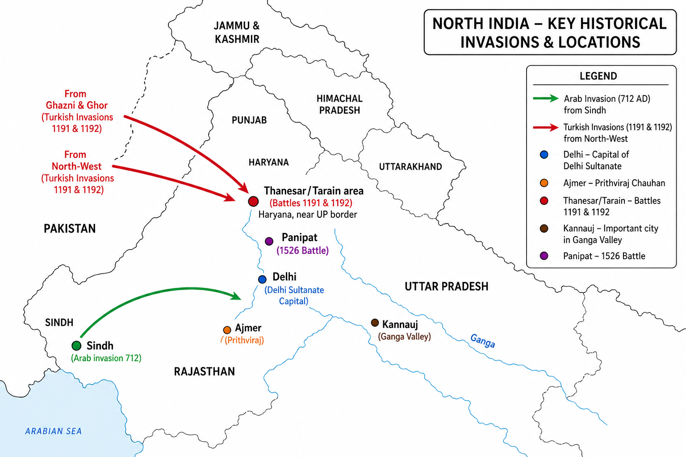

# Topic 2 — Turkish Invasions & Delhi Sultanate
### ★ Complete Source of Truth — No other book/notes needed for this topic

> **Covers syllabus:** Turkish Invasions of India | Muhammad Ghori | Establishment of the Delhi Sultanate | Chronology of the Delhi Sultanate | Delhi Sultanate Administration | Delhi Sultanate Revenue System | Delhi Sultanate Literature | Delhi Sultanate Architecture | Slave (Mamluk) Dynasty | Rulers of the Slave Dynasty | Khalji Dynasty | Rulers of the Khalji Dynasty | Titles of Khalji Rulers | Alauddin Khalji | Military Campaigns of Alauddin Khalji | Military Administration of Alauddin Khalji | Mubarak Khalji | Tughlaq Dynasty | Sayyid Dynasty | Rulers of the Sayyid Dynasty | Lodi Dynasty | Qutb-ud-din Aibak | Iltutmish | Razia Sultan | Balban | Ghiyasuddin Tughlaq | Muhammad bin Tughlaq | Firoz Shah Tughlaq | Ibrahim Lodi | First Battle of Panipat (1526)  
> **Sources baked in:** NCERT *Themes in Indian History Part II*, export notes (Age of Conflict, Delhi Sultanate Mameluk, Khaljis & Tughlaqs, Government Economy & Society, Struggle for Empire I–II), UPPCS/UPSC PYQs 2018–2025  
> **Exam weight:** ★★★ High — dynasty chronology, administration match-lists, Alauddin conquest order, architecture builders, Iqta/Khalsa traps  
> **Last verified:** July 2026

---

## Syllabus Coverage Map

| # | Syllabus bullet (`00_Syllabus.md`) | § Section | What must be inside |
|---|-----------------------------------|-----------|---------------------|
| 1 | Turkish Invasions of India | 2.1 | Arab Sindh 712, Ghaznavids, Ghurids; raid vs conquest; 2018 Q14 A/R |
| 2 | Muhammad Ghori | 2.2 | Tarain I (1191) & II (1192); Chandawar 1194; vs Prithviraj |
| 3 | Establishment of the Delhi Sultanate | 2.3 | 1206 Aibak; severance from Ghazni; institutional rule |
| 4 | Chronology of the Delhi Sultanate | 2.3 | Complete 5-dynasty table 1206–1526; all key rulers + dates |
| 5 | Delhi Sultanate Administration | 2.9 | Wazir, Barid, Khareetadar; 2020 Q38 officer match |
| 6 | Delhi Sultanate Revenue System | 2.10 | Iqta, muqti, khams, jizya; 2019 Q15; 2025 Q95 Khalsa/Jagir |
| 7 | Delhi Sultanate Literature | 2.11 | Barani, Minhaj, Amir Khusrau; 2019 Q16/Q88 |
| 8 | Delhi Sultanate Architecture | 2.12 | Qutub Minar, Alai Darwaza, Quwwat-ul-Islam; 2022 Q4 |
| 9 | Slave (Mamluk) Dynasty | 2.4 | 1206–1290; Turkish slave-origin rulers |
| 10 | Rulers of the Slave Dynasty | 2.4 | Aibak, Iltutmish, Razia, Balban, Kaiqubad |
| 11 | Khalji Dynasty | 2.5 | 1290–1320; end of Turkish monopoly |
| 12 | Rulers of the Khalji Dynasty | 2.5 | Jalaluddin, Alauddin, Mubarak, Khusrau Khan |
| 13 | Titles of Khalji Rulers | 2.5 | Alauddin titles; Khalji vs Mamluk distinction |
| 14 | Alauddin Khalji | 2.5 | Market reforms, chehra-dagh, cash army |
| 15 | Military Campaigns of Alauddin Khalji | 2.5 | Gujarat→Ranthambor→Chittor→Warangal; 2022 Q59, 2025 Q30 |
| 16 | Military Administration of Alauddin Khalji | 2.5 | Dagh, Chehra, mustakharaj, market control |
| 17 | Mubarak Khalji | 2.5 | 1316–1320; Khusrau Khan usurpation |
| 18 | Tughlaq Dynasty | 2.6 | Ghiyasuddin, Muhammad bin Tughlaq, Firoz Shah |
| 19 | Sayyid Dynasty | 2.7 | Khizr Khan 1414; Timur's nominee |
| 20 | Rulers of the Sayyid Dynasty | 2.7 | Khizr → Mubarak → Muhammad → Alam Shah |
| 21 | Lodi Dynasty | 2.7 | Bahlul, Sikandar (Agra), Ibrahim |
| 22 | Qutb-ud-din Aibak | 2.4 | 1206–1210; Chaugan death; Lahore capital |
| 23 | Iltutmish | 2.4 | Real consolidator; silver tanka; Chahalgani |
| 24 | Razia Sultan | 2.4 | Only woman Sultan; 1236–1240; killed |
| 25 | Balban | 2.4 | Sijda/Paibos; Blood & Iron; 2024 Q150 A/R |
| 26 | Ghiyasuddin Tughlaq | 2.6 | Founder 1320; Tughlaqabad |
| 27 | Muhammad bin Tughlaq | 2.6 | Daulatabad, token currency, Ibn Battuta |
| 28 | Firoz Shah Tughlaq | 2.6 | Canals, jizya on Brahmins; 2023 Q37 translator |
| 29 | Ibrahim Lodi | 2.7–2.8 | Last Sultan; Panipat 1526 |
| 30 | First Battle of Panipat (1526) | 2.8 | Babur vs Ibrahim; Tulughma; end of Sultanate |

---

## How to Use This File

1. **First read:** Syllabus Coverage Map → §2.1–2.3 (invasion frame + chronology table) → one dynasty block per sitting (§2.4–2.8).
2. **Raata order:** Quick Revision Box → Must-Know Term Comparisons → Consolidated Reference (5-dynasty table) → Common Traps.
3. **UPPCS drill:** Administration match-lists (§2.9) + Alauddin chronology (§2.5) + architecture builders (§2.12) — repeat annually.
4. **Self-test gate:** Answer **2025 Q95** (Khalsa/Jagir → **C**) and **2022 Q59** (Alauddin order → **C**) without opening notes.
5. **Revision cycle:** Day 1 = invasions + chronology; Day 2 = Slave/Khalji rulers; Day 3 = Tughlaq–Lodi + Panipat; Day 4 = admin/revenue/literature; Day 5 = 40 Practice Zone questions.

---

## How UPPCS Tests This Topic

| Pattern | What they ask | Your prep focus |
|---------|---------------|-----------------|
| **A/R (Turkish success)** | Invasions succeeded because no North Indian unity | §2.1; **UPPCS 2018 Q14 → A** |
| **Iqta NOT characteristic** | Revenue direct to Sultan = false | §2.10; **2019 Q15 → C** |
| **Book ↔ author NOT matched** | Tughlaqnama ≠ Ibn Battuta | §2.11; **2019 Q16 → C** |
| **Officer ↔ duty match** | Diwan-i-Tan, Khareetadar, Mustarfi | §2.9; **2020 Q38, 2023 Q32** |
| **Building ↔ builder** | Sultan Garhi, Dhai Din Ka Jhopra, Jamat Khana | §2.12; **2022 Q4 → A (3-4-1-2)** |
| **Alauddin conquest chronology** | Gujarat before Ranthambor before Chittor | §2.5; **2022 Q59 → C; 2025 Q30 → B** |
| **Balban centralisation A/R** | A true; R (Mongols) does not explain A | §2.4; **2024 Q150 → C** |
| **Khalsa vs Jagir A/R** | Jagirs NOT direct state land | §2.3/2.10; **2025 Q95 → C** |
| **Personality NOT matched** | Hamida Banu ≠ Alauddin's wife | §2.4; **2023 Q34 → C** |

> **2025 overlap:** Q30 (Alauddin chronology), Q95 (Khalsa/Jagir A/R) — both rooted in §2.5 and §2.10 of this file.

---

## Quick Revision Box — Raata This First

```
TURKISH INVASION FRAME:
  Arab Sindh 712 (Muhammad bin Qasim) → Ghaznavids (Mahmud Punjab) → Ghurids (Muhammad Ghori)
  Tarain I (1191) Ghori LOST | Tarain II (1192) Ghori WON → Ajmer, Delhi foothold
  Chandawar 1194 (Jay Chandra killed) → Ganga valley | 1206 Ghori dies → Aibak Sultan at Lahore

WHY TURKS SUCCEEDED (2018 Q14 A/R):
  A TRUE: Turkish invasions succeeded | R TRUE: No political unity in North India
  Answer A — R explains A (fragmented Rajput states, no pan-India resistance)

DELHI SULTANATE CHRONOLOGY (1206–1526) — ALL 5 DYNASTIES:
  1. SLAVE/MAMLUK (1206–1290): Aibak → Iltutmish ★consolidator → Razia → Balban → Kaiqubad
  2. KHALJI (1290–1320): Jalaluddin → Alauddin ★ → Mubarak Shah → Khusrau Khan
  3. TUGHLAQ (1320–1414): Ghiyasuddin → Muhammad bin Tughlaq → Firoz Shah → weak successors
  4. SAYYID (1414–1451): Khizr Khan → Mubarak Shah → Muhammad Shah → Alam Shah
  5. LODI (1451–1526): Bahlul → Sikandar → Ibrahim ★ → Panipat I 1526 (Babur ends Sultanate)

KEY RULERS — DATES (★★★):
  Aibak 1206–1210 (died Chaugan/polo) | Iltutmish 1210–1236 | Razia 1236–1240 (only woman Sultan)
  Balban 1266–1287 (Sijda, Paibos, Blood & Iron) | Jalaluddin Khalji 1290–1296
  Alauddin 1296–1316 (cash army, market control) | Mubarak 1316–1320
  Ghiyasuddin Tughlaq 1320–1325 | Muhammad bin Tughlaq 1325–1351 (Daulatabad, token currency)
  Firoz Shah 1351–1388 (canals, jizya on Brahmins, 1.8 lakh slaves) | Ibrahim Lodi 1517–1526

ALAUDDIN CONQUEST ORDER (2022 Q59 = C: 2-1-4-3):
  Gujarat 1299 → Ranthambor 1301 → Chittor 1303 → Warangal ~1309 (Malik Kafur south)
  2025 Q30 set adds Jaisalmer (1299 route) → order 2-1-4-3 = B (Jaisalmer, Ranthambore, Chittor, Warangal)

MILITARY ADMIN (Alauddin):
  Dagh (horse branding) + Chehra (soldier roll) + cash salaries + standing army ~4.75 lakh (Barani)

ADMIN MATCH (2020 Q38 = B: 3-4-1-2):
  Diwan-i-Tan → Jagirs/salaries | Mustarfi → audit income-expenditure
  Mushrif → office records | Vakianvis → events/firmans list | Khareetadar → royal decree despatcher (2023 Q32)

REVENUE / LAND:
  Iqta = revenue assignment to Muqti (NOT direct to Sultan — 2019 Q15 trap C)
  Khalsa = crown land (direct) | Jagirs/Iqtas = assigned (NOT direct state land — 2025 Q95 = C)
  chakla = unit between Subah & Pargana, ≠ Sarkar (2018 Q92 = C)

LITERATURE TRAPS:
  Tarikh-i-Firoz Shahi = Ziauddin Barani | Tughlaqnama = Barani (NOT Ibn Battuta — 2019 Q16)
  Amir Khusrau = Rag Vibodh (2019 Q88) | Ibn Battuta = Moroccan, Muhammad bin Tughlaq court (8 yrs)

ARCHITECTURE:
  Qutub Minar — Aibak started, Iltutmish completed | Alai Darwaza — Alauddin Khalji (1311)
  Quwwat-ul-Islam — Aibak | Adhai Din Ka Jhopra Ajmer — Aibak
  2022 Q4 builders A (3-4-1-2): Sultan Garhi-Iltutmish | Red Palace-Balban | Jamat Khana-Alauddin | Dhai Din Ka Jhopra-Aibak

PANIPAT I (20 April 1526):
  Babur vs Ibrahim Lodi | Tulughma + Araba (wagons) | Ibrahim killed | End of Delhi Sultanate
```

### Must-Know Term Comparisons (very frequently asked)

| Term | One-line difference | Hindi |
|------|---------------------|-------|
| **Ghaznavid vs Ghurid** | Ghaznavids (Mahmud) raided Punjab; Ghurids (Muhammad Ghori) conquered and stayed — founded Sultanate line | गज़नवी / गौर |
| **Tarain I vs Tarain II** | 1191 = Prithviraj defeated Ghori; 1192 = Ghori defeated Prithviraj — turning point | तराइन प्रथम / द्वितीय |
| **Mamluk vs Khalji** | Mamluk = Turkish slave-origin rulers (1206–1290); Khalji = Turko-Afghan, ended Turkish monopoly (1290) | मामलूक / खिलजी |
| **Iqta vs Khalsa** | Iqta/Jagir = assigned land revenue to nobles; Khalsa = crown/king's direct land | इक्ता / खालसा |
| **Muqti vs Wazir** | Muqti = provincial iqta holder (revenue + troops); Wazir = central finance minister | मुकती / वजीर |
| **Dagh vs Chehra** | Dagh = horse branding; Chehra = descriptive roll of soldiers — both Alauddin | दाग / चेहरा |
| **Sijda vs Paibos** | Sijda = prostration before Sultan; Paibos = kissing feet — Balban's kingship rituals | सिजदा / पैबोस |
| **Chahalgani vs Barid** | Chahalgani = Group of Forty Turkish nobles; Barid = intelligence spy | चहलगानी / बरीद |
| **Khams vs Jizya** | Khams = 1/5 share of war booty to Sultan; Jizya = tax on non-Muslims in lieu of military service | खम्स / जज़िया |
| **Khalsa vs Jagir (2025)** | Khalsa = direct Sultan control; Jagirs = assigned to nobles (NOT direct state land) | खालसा / जागीर |
| **Barani vs Ibn Battuta** | Barani = Delhi Sultanate historian (Tarikh-i-Firoz Shahi, Tughlaqnama); Ibn Battuta = Moroccan traveller at Tughlaq court | बरनी / इब्न बतूता |
| **Qutub Minar vs Alai Darwaza** | Qutub Minar = Aibak/Iltutmish; Alai Darwaza = Alauddin Khalji at Qutb complex | क़ुतुब मीनार / अलाई दरवाज़ा |

### Memory Tricks

| Trick | Remembers |
|-------|-----------|
| **712 → 1192 → 1206 → 1526** | Qasim → Tarain II → Aibak Sultanate → Panipat ends Sultanate |
| **G-R-C-W (Alauddin)** | **G**ujarat → **R**anthambor → **C**hittor → **W**arangal (2022 Q59 code 2-1-4-3) |
| **I-R-B-K consolidators** | **I**ltutmish consolidates → **R**azia challenges nobles → **B**alban centralizes → **K**halji expands |
| **MTF Tughlaqs** | **M**uhammad = experiments | **T**oken currency | **F**iruz = welfare/canals |
| **4-4-4-4 Sayyid** | ~37 years, 4 rulers: Khizr → Mubarak → Muhammad → Alam |
| **B-S-I Lodis** | **B**ahlul → **S**ikandar (Agra founder) → **I**brahim (Panipat) |
| **D-M-V-K officers** | **D**iwan-i-Tan salaries | **M**ustarfi audit | **V**akianvis firmans | **K**hareetadar despatcher |
| **A true R true C (2025 Q95)** | Khalsa+Jagir division TRUE; Jagir = NOT direct state land → **C** |
| **Barani not Battuta** | Tughlaqnama author = **Barani** (2019 Q16 trap) |
| **Firoz translator** | Sanskrit 300 volumes → **Mulla Abdul Baqi** (2023 Q37) |

---

## Exam Visuals — High-ROI Images

> **Type priority:** location map → conceptual diagram. Images stored locally (`images/`) so they open offline.

### 1. Turkish Invasions & Tarain — Location Map



*Raata **712 Sindh (Qasim)** → **1191/1192 Tarain** (Thanesar region, Haryana–UP border) → **Delhi Sultanate capital** → **1526 Panipat**. **UPPCS 2018 Q14**: Turkish success because North India lacked political unity.*
*Source: Study map — generated for UPPCS invasion-site matching*

### 2. Delhi Sultanate — Five-Dynasty Chronology Diagram


*All **5 dynasties + key rulers + dates** — no gaps. **UPPCS 2022 Q59 / 2025 Q30**: Alauddin conquest chronology within Khalji band.*
*Source: Study diagram — chronology for UPPCS*

---

## 2.1 Turkish Invasions of India

### Definitions (learn all — exams pick different ones)

| Source | Definition |
|--------|------------|
| **General** | Series of invasions from Central Asia/West Asia into the Indian subcontinent (8th–13th c.) by Arab, Turk, and Afghan forces — culminating in permanent Muslim rule in North India |
| **NCERT / Standard** | After Arab conquest of Sind (712), Ghaznavid raids (Mahmud) and Ghurid conquests (Muhammad Ghori) broke Rajput resistance; **Turkish invasions** specifically refer to Islamized Turkish cavalry states using horse-archer tactics |
| **Exam use** | Distinguish **raid** (Mahmud — plunder, withdrew) vs **conquest** (Ghori — stayed, appointed governors) vs **Sultanate** (Aibak 1206 — institutional rule) |

### Turkish Invasions — How It Works

- **Pre-Turkish contact:** **Arab invasion of Sind (712 CE)** under **Muhammad bin Qasim** (Umayyad general) — conquered **Debal** port and lower Indus; Sind became **As-Sind** province — first Muslim foothold, but **no expansion** into Gangetic plain.
- **Why Sind fell:** Rivalry between King **Dahir** and local factions; Arab maritime trade interests; weak unified defence in Sindh frontier.
- **Long gap:** After 712, no major Arab push into heartland — **Kabul–Zabul** buffer (Bhati Rajputs, Turks, Hunas) and rising **Rajput regional kingdoms** blocked expansion for centuries.
- **Ghaznavid phase (10th–11th c.):** **Mahmud of Ghazni** (998–1030) — **17 raids** into India; annexed **Punjab + Multan**; broke northwest barrier; plundered temples (Somnath 1025); **did not** permanently rule beyond Punjab.
- **Why Mahmud stopped:** **Seljuk** pressure in Central Asia; strong **Rajput states** (Chauhans, Gahadavalas, Chandelas) in north; Ghaznavids reduced to Lahore pocket by 12th c.
- **Ghurid phase:** **Muhammad Ghori** (Muizzuddin, 1173–1206) — shifted from raid to **territorial conquest**; defeated **Gujarat** attempt (1178, Mount Abu); took **Peshawar, Lahore, Sialkot** by 1190.
- **Rajput weakness:** Post-Pratihara **fragmentation** — Chauhans (Ajmer), Gahadavalas (Kannauj), Chandelas (Bundelkhand), Paramaras (Malwa) fought each other — **no unified frontier army**.
- **Turkish military edge:** **Mounted archers**, iron stirrup cavalry, rapid advance-retreat, centralized command vs Rajput clan-based chivalry and fort-centric defence.
- **Political outcome:** 1192 onward Turks held **Delhi–Ajmer corridor**; **Bakhtiyar Khalji** (1204) took **Bengal/Nadia**; **Qutb-ud-din Aibak** governor at Lahore → **1206 = Delhi Sultanate** after Ghori's death.
- **UP relevance:** Invasions entered via **Punjab** but decisive battles (**Tarain**, **Chandawar**) were in **Haryana–UP–Rajasthan** belt; **Kannauj, Kalinjar, Mahoba, Banaras** fell in Ganga valley push — core of modern **Uttar Pradesh** politics in 12th c.

> **Exam note:** **UPPCS 2018 Q14** — Both A and R true; **R explains A**. Trap: choosing B (R not explanation) — fragmentation directly enabled Turkish success.

### Exam Facts (raata)

- **712 CE** — Muhammad bin Qasim conquered **Sindh** (Debal)
- **998–1030** — Mahmud of Ghazni; **17** Indian expeditions
- **1025** — Somnath plunder by Mahmud
- **1173–1206** — Muhammad Ghori (Muizzuddin)
- **1178** — Ghori defeated near **Mount Abu** (Gujarat)
- Ghaznavids = **raids**; Ghurids = **conquest + stay**
- Northwest barrier broken permanently by **early 13th century**
- **Bakhtiyar Khalji 1204** — Nadia/Bengal
- Turkish success factors: **cavalry + disunity + no pan-Rajput alliance**

### PYQs — Turkish Invasions

**UPPCS Prelims**
1. **(UPPCS 2018, Q14)** Given below are two statements, one is labelled as Assertion (A) and the other as Reason (R).  
   **Assertion (A):** Turkish invasions of India were successful.  
   **Reason (R):** There was no political unity in North India.  
   Select the correct answer from the codes given below:  
   A. Both (A) and (R) are true and (R) is the correct explanation of (A)  
   B. Both (A) and (R) are true, but (R) is not the correct explanation of (A)  
   C. (A) is true, but (R) is false  
   D. (A) is false, but (R) is true  
   → **A** — Post-Pratihara fragmentation (Chauhan vs Gahadavala vs others) prevented coordinated defence; R correctly explains A.

2. **(UPPCS 2019, Q15)** Which one of the following is NOT the characteristics of Iqta System?  
   A. Iqta was a revenue collection system  
   B. Siyasatnama was the source of information for Iqta System  
   C. Revenue from Iqta was directly deposited in Sultan's account  
   D. Muqti was supposed to maintain troops out of the revenue collected from Iqta  
   → **C** — Iqta revenue went to **Muqti** for troops + administration; surplus later sent to centre — not direct deposit to Sultan.

**UPSC Prelims**
3. **(UPSC 2003 — pattern)** The first Muslim invader of India was:  
   → **Muhammad bin Qasim** (712, Sindh) — before Mahmud of Ghazni.

### Examples (2.1)

| Example | What it teaches |
|---------|-----------------|
| **Muhammad bin Qasim → Sindh 712** | First Arab-Turkish foothold; did not conquer UP heartland |
| **Mahmud → Punjab annexation** | Permanent northwest base for later Ghurids |
| **No Rajput unity at Tarain** | Prithviraj did not pursue destroyed Ghori in 1191 — allowed 1192 return |

---

## 2.2 Muhammad Ghori & Battles of Tarain

### Definitions (learn all — exams pick different ones)

| Source | Definition |
|--------|------------|
| **General** | **Muhammad Ghori** (Shahabuddin Muhammad / Muizzuddin) — Ghurid ruler who converted Indian campaigns from raids to permanent conquest (1173–1206) |
| **NCERT** | **Battles of Tarain** (1191 & 1192) — fought near **Tarain/Thanesar** (modern Haryana) between Ghori and **Prithviraj Chauhan III** — second battle opened Delhi–Ajmer to Turks |
| **Exam** | **Battle of Chandawar (1194)** — Ghori vs **Jay Chandra (Jaichand)** of Kannauj; Jaichand killed; Ganga valley opened — equally important for UP |

### Muhammad Ghori & Tarain — How It Works

- **Ghori vs Ghazni model:** Unlike Mahmud, Ghori **appointed governors**, minted coins, and **stayed** — Aibak at Lahore, Bakhtiyar in Bengal.
- **First Battle of Tarain (1191):** **Prithviraj Chauhan** (Ajmer-Delhi) + allied Rajputs vs Ghori; Rajput charge broke Turkish left wing; **Ghori defeated**; escaped with help of **Khalji horseman**.
- **Prithviraj's mistake:** Treated victory as chivalric end — **released/failed to destroy** Ghori; allowed regrouping — classic UPPCS cause→effect chain.
- **Second Battle of Tarain (1192):** Ghori returned with ~1,20,000 force; used **feigned retreat** of Turkish cavalry; Rajput army broken; **Prithviraj captured** (later killed per Persian sources).
- **Immediate results (1192):** **Ajmer** and **Delhi** occupied; Turkish garrisons in **Meerut, Kol (Aligarh), Hansi**; Chauhan power collapsed in Doab gateway.
- **Battle of Chandawar (1194):** Against **Jay Chandra** of **Kannauj** (Gahadavala) — Jaichand killed; **Banaras/Kannauj** region submitted — critical for **UP control**.
- **Further Ghori conquests:** **Bayana, Gwalior, Kalinjar, Mahoba, Khajuraho** — Bundelkhand and eastern Rajasthan forts fell by 1200.
- **Death of Ghori (1206):** Assassinated at **Damyak/Jhelum** (while praying) — court faction killing; **no clear successor in India**.
- **Indian succession:** **Qutb-ud-din Aibak** (slave-general) declared Sultan at **Lahore (1206)** — birth of **Delhi Sultanate**; severed link with Ghazni.
- **UP angle:** **Tarain** near **Thanesar (Kurukshetra dist., Haryana)** — bordering UP; **Kannauj, Banaras, Kol** in UP were next targets after 1194.

> **Exam note:** Do not confuse **Tarain (1192, Prithviraj)** with **Chandawar (1194, Jaichand)** or **Panipat (1526, Ibrahim Lodi)** — three different turning points.

### Exam Facts (raata)

- Ghori reign **1173–1206**
- **1191** — First Tarain — Ghori **lost**
- **1192** — Second Tarain — Ghori **won**; Prithviraj defeated
- **1194** — Chandawar — **Jay Chandra** killed
- **1206** — Ghori assassinated; **Aibak** Sultan at Lahore
- Ghori also defeated near **Mount Abu (1178)**
- Governor **Aibak** = builder of Delhi foundation
- **Bakhtiyar Khalji** = Bihar (Nalanda) + Bengal (1204) — parallel to Ghori in east

### PYQs — Muhammad Ghori & Tarain

**UPPCS Prelims**
1. **(UPPCS 2018, Q14)** *(see §2.1 — Turkish invasions A/R)* → **A**

2. **(UPPCS 2023, Q34)** Which of the following is **not** correctly matched?  
   A. Iltutmish — Father of Razia  
   B. Shah Turkan — Wife of Iltutmish  
   C. Hamida Banu Begum — Wife of Alauddin Khilji  
   D. Gulbadan Begum — Daughter of Babur  
   → **C** — **Hamida Banu Begum** = **Humayun's** wife (Akbar's mother), not Alauddin's.

**UPSC Prelims**
3. **(UPSC 2016 — pattern)** Muhammad Ghori laid foundation of Muslim rule in India mainly after:  
   → **Second Battle of Tarain (1192)**

### Examples (2.2)

| Example | What it teaches |
|---------|-----------------|
| **Tarain 1191 → 1192** | Rajput victory not consolidated = Turkish return |
| **Chandawar 1194** | Kannauj UP gateway fell — Ganga valley rule |
| **Aibak 1206 Lahore** | Ghori's death → institutional Sultanate, not Ghazni dependency |

---

## 2.3 Establishment & Chronology of Delhi Sultanate

### Definitions (learn all — exams pick different ones)

| Source | Definition |
|--------|------------|
| **General** | **Delhi Sultanate (1206–1526)** — five dynasties of Turkish/Afghan sultans ruling from Delhi (mostly) over North India |
| **NCERT** | Established when **Qutb-ud-din Aibak** assumed sovereignty (1206) after Muhammad Ghori's death — **Mamluk/Slave** dynasty first |
| **Exam** | **1526 First Battle of Panipat** = end of Sultanate; beginning of **Mughal** rule under Babur |

### Establishment & Chronology — How It Works

- **1206 anchor:** Aibak takes title **Sultan** at Lahore — ends subordination to Ghazni; Delhi Sultanate as **independent Indo-Muslim state**.
- **Why Delhi?** Strategic **Doab** position; Ghori's conquests centred on **Delhi–Ajmer–Kannauj** triangle; Mongols made Lahore unsafe later — **Iltutmish** shifted focus to **Delhi**.
- **Five dynasties sequence:** **Slave (1206–1290)** → **Khalji (1290–1320)** → **Tughlaq (1320–1414)** → **Sayyid (1414–1451)** → **Lodi (1451–1526)**.
- **Slave = Mamluk:** Rulers were **military slaves** (bandagan) of Turkish origin — Aibak, Iltutmish, Balban lineage.
- **Khalji revolution (1290):** **Jalaluddin Khalji** overthrew weak Slave successor — ended **Turkish monopoly** on high offices; Turko-Afghan elite entered.
- **Tughlaq peak & break:** **Muhammad bin Tughlaq** (1325–1351) — empire **Punjab to Madurai** (1324); overreach → rebellions; **Firuz** stabilised but hereditary iqta weakened centre.
- **Sayyid interregnum:** **Khizr Khan** (Timur's nominee, 1414) — weak sultans; **Alam Shah** abdicated to **Bahlul Lodi (1451)**.
- **Lodi Afghan phase:** First **Afghan** dynasty — **Sikandar Lodi** moved capital activity to **Agra**; **Ibrahim Lodi** alienated nobles → **Babur invited (1526)**.
- **1526 terminus:** **Ibrahim Lodi** killed at **Panipat I** — Sultanate extinguished; Mughal era begins (though Sur interlude later).
- **Parallel regional breakaways:** Bengal (1338), Jaunpur Sharqi (1394), Gujarat, Malwa — Sultanate rarely controlled full subcontinent even at peak.

> **Exam note:** **2025 Q95** — Khalsa vs Jagirs division is **true (A)**; Jagirs are **NOT** direct state land (**R false**) → answer **C**.

### Complete Sultanate Chronology Table (ALL dynasties — no gaps)

| Dynasty | Period | Ruler | Reign (CE) | Notes |
|---------|--------|-------|------------|-------|
| **Slave (Mamluk)** | 1206–1290 | Qutb-ud-din Aibak | 1206–1210 | Founder; Lahore; died playing Chaugan |
| | | Aram Shah | 1210 | Brief; defeated by Iltutmish |
| | | Shams-ud-din Iltutmish | 1210–1236 | Real consolidator; gold coin; Qutub Minar |
| | | Razia Sultan | 1236–1240 | Only woman Sultan; killed fleeing |
| | | Bahram Shah | 1240–1242 | |
| | | Ala-ud-din Masud Shah | 1242–1246 | |
| | | Nasir-ud-din Mahmud | 1246–1266 | Balban as Naib |
| | | Ghiyas-ud-din Balban | 1266–1287 | Centralisation; Sijda; Mongols |
| | | Muiz-ud-din Kaiqubad | 1287–1290 | Assassinated; dynasty ends |
| **Khalji** | 1290–1320 | Jalaluddin Khalji | 1290–1296 | Tolerant; killed by Alauddin at Kara |
| | | Alauddin Khalji | 1296–1316 | Market control; Mongol defence; expansion |
| | | Shams-ud-din Mubarak Shah | 1316–1320 | Alauddin's son; Khusrau Khan coup |
| | | Khusrau Khan | 1320 | Hindu convert; killed by Ghiyasuddin Tughlaq |
| **Tughlaq** | 1320–1414 | Ghiyas-ud-din Tughlaq | 1320–1325 | Founded dynasty; killed en route Delhi |
| | | Muhammad bin Tughlaq | 1325–1351 | Daulatabad; token currency; Amir-i-Kohi |
| | | Firoz Shah Tughlaq | 1351–1388 | Canals; jizya; slaves; Sanskrit patronage |
| | | Ghiyas-ud-din Tughlaq II | 1388–1389 | |
| | | Abu Bakr Shah | 1389–1390 | |
| | | Nasir-ud-din Muhammad | 1390–1394 | |
| | | Mahmud Nasir-ud-din | 1394–1412 | Timur invasion 1398 during reign |
| | | Mahmud (last Tughlaq) | till 1414 | |
| **Sayyid** | 1414–1451 | Khizr Khan | 1414–1421 | Timurid nominee; Mewati territory |
| | | Mubarak Shah | 1421–1434 | |
| | | Muhammad Shah | 1434–1445 | |
| | | Alam Shah | 1445–1451 | Last; abdicated to Bahlul Lodi |
| **Lodi** | 1451–1526 | Bahlul Lodi | 1451–1489 | Afghan; annexed Sharqi Jaunpur 1484 |
| | | Sikandar Lodi | 1489–1517 | Agra founder; Gazz-i-Sikandari measurement |
| | | Ibrahim Lodi | 1517–1526 | Last Sultan; killed Panipat I |

### Exam Facts (raata)

- Delhi Sultanate **1206–1526** (320 years)
- **5 dynasties** — Slave, Khalji, Tughlaq, Sayyid, Lodi
- First Sultan **Aibak 1206** | Last **Ibrahim Lodi 1526**
- Peak territorial extent **~1324** under Muhammad bin Tughlaq
- **Timur 1398** — Delhi sacked; Tughlaq weakened
- **1451** — Lodi replaces Sayyid
- **1484** — Jaunpur Sharqi annexed by Bahlul Lodi

### PYQs — Establishment & Chronology

**UPPCS Prelims**
1. **(UPPCS 2025, Q95)** Assertion (A): The territories of the Sultanate could be broadly divided into two parts: the Khalsa and the Jagirs. Reason (R): The Jagirs comprised the land under the direct control of the State.  
   A. Both true; R not explanation | B. A false; R true | C. A true; R false | D. Both true; R explains A  
   → **C** — Khalsa = direct crown land; Jagirs/Iqtas = assigned to nobles — **not** direct state control.

2. **(UPPCS 2024, Q150)** *(Balban A/R — see §2.4)* → **C**

**UPSC Prelims**
3. **(UPSC 2014 — pattern)** The Delhi Sultanate virtually ended with:  
   → **First Battle of Panipat (1526)**

### Examples (2.3)

| Example | What it teaches |
|---------|-----------------|
| **1206 Aibak at Lahore** | Establishment moment — not 1192 (conquest) but institutional Sultanate |
| **1324 Madurai extent** | Maximum size under Muhammad bin Tughlaq — also start of breakup |
| **1526 Panipat** | Ibrahim Lodi death = dynastic end |

---


## 2.4 Slave (Mamluk) Dynasty & Rulers

### Definitions (learn all — exams pick different ones)

| Source | Definition |
|--------|------------|
| **General** | **Mamluk/Slave/Iltutmish (Ilbari) dynasty** — first Sultanate dynasty (1206–1290); rulers were manumitted Turkish slaves of Ghori and predecessors |
| **NCERT** | **Chahalgani** = "Group of Forty" powerful Turkish nobles — challenged Razia; destroyed by Balban |
| **Exam** | **Iltutmish** = real consolidator (not Aibak) — saved Sultanate from Mongols, Bengal, Rajputs, rival governors |

### Slave Dynasty — How It Works

- **Qutb-ud-din Aibak (1206–1210):** Ghori's **slave-general**; ruled from **Lahore**; built **Quwwat-ul-Islam** mosque and started **Qutub Minar**; died **1210** playing **Chaugan (polo)**.
- **Aibak's importance:** Severed Delhi from **Ghazni** politics; fought **Yildiz** of Ghazni; laid **Indo-Islamic architectural** foundation at Delhi and Ajmer.
- **Iltutmish (1210–1236):** Purchased slave of Aibak; defeated **Qubacha (Multan)**, **Ali Mardan (Bengal)**, Delhi nobles; **real founder** of stable Sultanate.
- **Iltutmish Mongol policy:** Refused asylum to **Jalaluddin Khwarizmi (1221)** — avoided Mongol war; repaired frontier; **Lahore lost 1241** to Mongols later.
- **Iltutmish Rajput policy:** Recovered **Gwalior, Bayana, Kalinjar**; failed against **Gujarat Chalukyas** and **Nagda (Mewar)**.
- **Iltutmish succession:** Nominated daughter **Razia** over sons — unique; issued **silver tanka** — first Sultanate coin standard.
- **Razia Sultan (1236–1240):** First and **only woman Sultan**; fought **Chahalgani**; promoted **Yaqut (Abyssinian)**; imprisoned, married **Altunia**, killed by bandits **1240**.
- **Balban (1266–1287):** Former **Naib** of Nasiruddin Mahmud; destroyed **Chahalgani**; introduced **Sijda & Paibos**; **Blood and Iron** against **Mewatis**; claimed descent from **Afrasiyab**.
- **Balban centralisation:** Spy system (**barids**); reorganized **Diwan-i-Arz**; harsh justice; **northwest frontier** forts (Tabarhinda, Sunam, Samana) vs Mongols.
- **Kaiqubad (1287–1290):** Weak; assassinated — **Khalji revolt 1290** ends Slave dynasty.

> **Exam note:** **UPPCS 2024 Q150** — A true (Balban centralised); R true (Mongol frontier) but **R does NOT explain A** → **C**. Centralisation was anti-noble policy, not primarily Mongol defence.

### Exam Facts (raata)

- Aibak = **Lakh Baksh** (giver of lakhs); **Mamluk** = owned slave
- Iltutmish = **consolidator**; refused **Jalaluddin** asylum **1221**
- Razia = **1236–1240**; only **woman Sultan**
- Balban = **Sijda, Paibos, Blood & Iron**; died **1287**
- **Chahalgani** = Group of **Forty** nobles
- Slave dynasty ends **1290** — Khalji coup

### PYQs — Slave Dynasty

**UPPCS Prelims**
1. **(UPPCS 2024, Q150)** Assertion (A): Balban made his government firm and centralised all authority in his hands. Reason (R): He wanted to protect the north-west frontier against Mongol invasions.  
   A. Both true; R explains A | B. A false; R true | C. Both true; R not explanation | D. A true; R false  
   → **C** — Balban centralised to crush **Chahalgani/nobles**; Mongol defence was parallel policy, not the reason for court despotism.

2. **(UPPCS 2022, Q4)** Match buildings/builders — Sultan Garhi, Red Palace, Jamat Khana Masjid, Dhai Din Ka Jhopra with Alauddin, Aibak, Iltutmish, Balban → **A (3-4-1-2)** — see §2.12 Architecture.

3. **(UPPCS 2023, Q34)** Hamida Banu ≠ Alauddin → **C** (see §2.2).

**UPSC Prelims**
4. **(UPSC 2018 — pattern)** Who among the following was the first woman ruler of Delhi? → **Razia Sultan**

### Examples (2.4)

| Example | What it teaches |
|---------|-----------------|
| **Iltutmish vs Mongols 1221** | Diplomatic refusal of asylum — saved Delhi from early Mongol invasion |
| **Razia vs Chahalgani** | First monarchy vs Turkish nobility struggle |
| **Balban vs Mewatis** | Forest clearance around Delhi — UP NCR security |

---

## 2.5 Khalji Dynasty (Alauddin Military + Mubarak)

### Definitions (learn all — exams pick different ones)

| Source | Definition |
|--------|------------|
| **General** | **Khalji dynasty (1290–1320)** — Turko-Afghan rulers; ended Turkish racial monopoly in Sultanate administration |
| **NCERT** | **Alauddin Khalji** (1296–1316) — expanded Sultanate; **market control**; **cash-paid standing army**; Mongol invasions repulsed |
| **Exam** | **Mubarak Shah (1316–1320)** — Alauddin's son; indulgent; killed by **Khusrau Khan** (1320) — last Khalji |

### Khalji Dynasty — How It Works

- **Jalaluddin Khalji (1290–1296):** Old, tolerant; believed state needs **Hindu consent** — India cannot be purely Islamic state; murdered by nephew **Alauddin at Kara (1296)**.
- **Alauddin's accession:** Governor of **Awadh**; looted **Deogir** treasure before throne; used wealth to buy army/noble loyalty.
- **Khalji titles:** Jalaluddin = founder; **Alauddin** original name **Ali Gurshasp**; title **Sikandar-i-Sani** (Second Alexander) after southern campaigns; **Ulugh Khan** early name of Alauddin.
- **Nobility control:** Banned private feasts, marriage alliances without permission; **wine ban**; spy network; rebels executed — old nobility destroyed.
- **Military campaigns — chronology (★★★):** **Gujarat 1299** (Rai Karan fled; Malik Kafur captured at Cambay) → **Ranthambor 1301** (Hamirdeva; first Persian **Jauhar** account) → **Chittor 1303** (Ratan Singh; Jauhar) → **Malwa annexed** → **Deogir 1307** (Ramachandra = **Rai Rayan**) → **Warangal ~1309–1311** (Malik Kafur southern campaigns).
- **2022 vs 2025 chronology sets:** 2022 Q59 items: Ranthambor, Gujarat, Warangal, Chittor → **C (2-1-4-3)**. 2025 Q30 adds **Jaisalmer (1299)** with Gujarat route → **B (2-1-4-3)** = Jaisalmer, Ranthambore, Chittor, Warangal.
- **Rajput policy:** Mostly **tributaries** — not all annexed (unlike Malwa); strategic forts garrisoned.
- **Military administration:** **Dagh** (horse branding) + **Chehra** (soldier descriptive roll); **cash salaries** (238 tankas/trooper); standing army ~**4.75 lakh** (Barani — likely exaggerated); **Siri Fort** built for Mongol defence.
- **Market reforms:** **Shahna-i-Mandi**; separate markets for grain, cloth, horses; **50%** Doab revenue; price lists fixed — linked to **Mongol threat** (maintain huge army cheaply).
- **Mubarak Shah (1316–1320):** Released prisoners; relaxed Alauddin's rules; **Khusrau Khan** (Hindu convert general) killed Mubarak — brief rule; **Ghiyasuddin Tughlaq** killed Khusrau **1320**.

> **Exam note:** **2022 Q59 = C** and **2025 Q30 = B** — both test **Gujarat before Ranthambor before Chittor before Warangal**; 2025 inserts Jaisalmer at start of sequence.

### Exam Facts (raata)

- Khalji revolution **1290** — ended **Turkish monopoly**
- Alauddin **1296–1316** — longest powerful Khalji
- **Malik Kafur** — Malik-i-Naib; southern campaigns
- **Gujarat 1299, Ranthambor 1301, Chittor 1303, Warangal ~1309**
- **Dagh + Chehra + cash army** = Alauddin
- **Shahna-i-Mandi** = market controller
- Mubarak killed **1320** — Tughlaq begins

### PYQs — Khalji Dynasty

**UPPCS Prelims**
1. **(UPPCS 2022, Q59)** Arrange Alauddin's conquests: 1.Ranthambor 2.Gujarat 3.Warangal 4.Chittor → **C (2-1-4-3)**

2. **(UPPCS 2025, Q30)** Arrange victories: 1.Ranthambore 2.Jaisalmer 3.Warangal 4.Chittor → **B (2-1-4-3)**

3. **(UPPCS 2024, Q147 — match)** K.S. Lal → **History of the Khaljis** (book match item 4)

**UPSC Prelims**
4. **(UPSC 2019 — pattern)** First Sultan to assign land revenue on measurement basis in Doab? → **Alauddin Khalji**

### Examples (2.5)

| Example | What it teaches |
|---------|-----------------|
| **Gujarat 1299 + Cambay** | Malik Kafur captured here — later Malik-i-Naib |
| **Ranthambor Jauhar 1301** | First Persian account of Jauhar |
| **Mubarak → Khusrau → Ghiyasuddin 1320** | Khalji end → Tughlaq start |

---

## 2.6 Tughlaq Dynasty

### Definitions (learn all — exams pick different ones)

| Source | Definition |
|--------|------------|
| **General** | **Tughlaq dynasty (1320–1414)** — third Sultanate dynasty; period of maximum expansion and administrative experiments |
| **NCERT** | **Muhammad bin Tughlaq** (1325–1351) — "ill-starred idealist"; **Daulatabad** transfer; **token currency**; **Diwan-i-Amir-i-Kohi** |
| **Exam** | **Firoz Shah Tughlaq** (1351–1388) — welfare, canals, **jizya on Brahmins**, **1,80,000 slaves**, Sanskrit translations |

### Tughlaq Dynasty — How It Works

- **Ghiyasuddin Tughlaq (1320–1325):** Killed **Khusrau Khan**; built **Tughlaqabad** fort; died in **boat accident** (1325) — son Muhammad alleged involvement.
- **Muhammad bin Tughlaq (1325–1351):** Scholar-sultan; empire zenith **1324** (Punjab to Madurai); **five experiments** strained state.
- **Capital transfer (1327):** **Delhi → Daulatabad** (Deogir renamed); officials, Sufis shifted; **1500 km** — failed to govern north from south; long-term **Deccan Islamization**.
- **Token currency (1329–1330):** Bronze = silver **tanka**; massive **forgery**; withdrawn — state capacity failure, not concept alone.
- **Khurasan project:** Army raised for Central Asian frontier — abandoned — financial drain.
- **Qarachil expedition:** **Kumaon** disaster — losses in hills.
- **Diwan-i-Amir-i-Kohi:** Agricultural loans/irrigation department — corruption failed; idea later used by **Firuz** and **Akbar**.
- **Ibn Battuta at court:** Moroccan traveller (**Rihla**); stayed **~8 years** at Muhammad bin Tughlaq's court; described **Delhi** as largest eastern Islamic city; witness to sultan's harsh justice.
- **Firuz Shah Tughlaq (1351–1388):** Conciliation policy; **hereditary iqta** (long-term weakness); **jizya** separated from land revenue; Brahmins taxed.
- **Firuz public works:** **Yamuna canal** at Hissar; **200 km** Sutlej-Hansi canal; towns **Hissar-Firuzah**, **Firuzabad**; **Hauz Khas** complex Delhi.
- **Firuz Sanskrit patronage:** **300 volumes** from **Nagarkot** campaign translated by **Mulla Abdul Baqi** (2023 Q37).
- **Decline post-Firuz:** Weak successors; **Timur sacked Delhi 1398**; dynasty ends **1414** — **Sayyids** take over.

> **Exam note:** **Tughlaqnama** = **Barani**, NOT Ibn Battuta (2019 Q16). Ibn Battuta wrote **Rihla**, not Tughlaqnama.

### Exam Facts (raata)

- Tughlaq founded **1320** | ends **1414**
- Muhammad bin Tughlaq **1325–1351**
- **Daulatabad** = renamed Deogir
- **Token currency** bronze = silver tanka
- **Diwan-i-Amir-i-Kohi** = agriculture dept
- Firuz **1351–1388** | **Timur 1398**
- Firuz translator = **Mulla Abdul Baqi**
- Ibn Battuta = **Muhammad bin Tughlaq** court

### PYQs — Tughlaq Dynasty

**UPPCS Prelims**
1. **(UPPCS 2019, Q16)** NOT matched: Tughlaqnama–Ibn Battuta → **C** — Tughlaqnama by **Ziauddin Barani**.

2. **(UPPCS 2023, Q37)** Firoz Shah Sanskrit translator → **C (Mulla Abdul Baqi)**

3. **(UPPCS 2019, Q15)** Iqta NOT characteristic: revenue direct to Sultan → **C**

**UPSC Prelims**
4. **(UPSC 2021 — pattern)** Muhammad bin Tughlaq transferred capital to: → **Daulatabad**

### Examples (2.6)

| Example | What it teaches |
|---------|-----------------|
| **Token currency failure** | State capacity + forgery, not just bad idea |
| **Ibn Battuta on Delhi** | Primary source for Tughlaq economy/society |
| **Firuz canals in Hissar-Yamuna** | UP-Haryana region irrigation legacy |

---

## 2.7 Sayyid & Lodi Dynasties

### Definitions (learn all — exams pick different ones)

| Source | Definition |
|--------|------------|
| **General** | **Sayyid (1414–1451)** — four rulers; weak; claim descent from Prophet; Timurid connection |
| **NCERT** | **Lodi (1451–1526)** — Afghan dynasty; **Sikandar Lodi** founded **Agra**; ended at **Panipat 1526** |
| **Exam** | **Ibrahim Lodi** — last Sultan; alienated **Daulat Khan Lodi** (Punjab) and nobles — invited **Babur** |

### Sayyid & Lodi — How It Works

- **Sayyid foundation:** **Khizr Khan** (1414) — governor under Timur; ruled as Timur's deputy; capital **Delhi**; territory shrunk — **Mewat, Doab** fragments.
- **Sayyid rulers:** **Khizr Khan (1414–1421)** → **Mubarak Shah (1421–1434)** → **Muhammad Shah (1434–1445)** → **Alam Shah (1445–1451)** — last abdicated to Bahlul.
- **Sayyid weakness:** No large conquests; faced **Malwa, Gujarat, Sharqi Jaunpur** pressure; "Kingdom of Delhi" only — prep for Afghan takeover.
- **Bahlul Lodi (1451–1489):** Afghan from **Sirhind**; invited Afghans from **Roh**; annexed **Sharqi Jaunpur (1484)** — brought **eastern UP** (Jaunpur, Banaras belt) under Delhi.
- **Jaunpur Sharqi overlap (UP):** Sharqi sultans (1394–1484) ruled **Jaunpur** as cultural centre — **Atala Masjid, Lal Darwaza**; Bahlul ended independent Jaunpur — important for **UP architecture/culture** exams.
- **Sikandar Lodi (1489–1517):** Greatest Lodi; shifted focus to **Agra** ( founded/made important ); **Gazz-i-Sikandari** land measurement; abolished **octroi on grain**; roads safe; orthodox Sunni.
- **Sikandar vs Ibrahim:** Sikandar controlled nobles; **Ibrahim (1517–1526)** reinstated **Lodi old nobles**, punished **Daulat Khan** — factional chaos.
- **Ibrahim Lodi:** Last Sultan; large army at Panipat but no **artillery coordination**; **Daulat Khan** invited Babur (1524–1526); killed **20 April 1526**.
- **Afghan vs Turkish:** Lodis = **Afghan** tribal network; different from Turkish Mamluk/Khalji elite — important for nobility structure at Panipat.

> **Exam note:** **Sikandar Lodi = Agra** (not Ibrahim); **Ibrahim = Panipat 1526** — do not swap Lodi rulers.

### Exam Facts (raata)

- Sayyid **1414–1451** — 4 rulers
- **Khizr Khan** first Sayyid
- **Alam Shah** abdicated **1451**
- Bahlul Lodi **1451–1489** — Afghan founder
- **Jaunpur annexed 1484**
- Sikandar **1489–1517** — **Agra**, Gazz-i-Sikandari
- Ibrahim **1517–1526** — last Sultan

### PYQs — Sayyid & Lodi

**UPPCS Prelims**
1. **(UPPCS 2023, Q34)** Ibrahim/Iltutmish/Razia matching — Hamida Banu trap → **C**

2. **(UPPCS 2018, Q94 — context)** Khayr-ul-Manzil mosque — **Maham Anaga** (Mughal), not Sultanate — negative trap near Purana Qila

**UPSC Prelims**
3. **(UPSC 2017 — pattern)** Who founded Agra as capital importance under Lodi? → **Sikandar Lodi**

### Examples (2.7)

| Example | What it teaches |
|---------|-----------------|
| **Jaunpur Sharqi 1484 annexation** | Eastern UP reintegrated under Delhi |
| **Sikandar's Agra** | Lodi admin centre before Mughal Agra |
| **Ibrahim vs Daulat Khan** | Noble faction invited Babur |

---

## 2.8 First Battle of Panipat (1526)

### Definitions (learn all — exams pick different ones)

| Source | Definition |
|--------|------------|
| **General** | **First Battle of Panipat (20 April 1526)** — Babur vs Ibrahim Lodi; ended Delhi Sultanate; began Mughal Empire |
| **NCERT** | Fought at **Panipat** (Haryana, historic gateway to Delhi); first major **gunpowder + field fortification** battle in North India |
| **Exam** | **Tulughma** (flanking division) + **Araba** (wagon fort) = Babur's tactics; Ibrahim killed on field |

### First Battle of Panipat — How It Works

- **Background:** **Timur (1398)** weakened Sultanate; **Sayyid-Lodi** phase never restored imperial power; **Ibrahim** alienated Punjab governor **Daulat Khan Lodi** and nobles.
- **Babur's invitation:** **Daulat Khan** and **Rana Sanga** (Mewar) separately invited Babur — hoped to use him against rivals; Babur had **Kabul** base and **Central Asian** artillery tradition.
- **Ibrahim's army:** Estimated **1 lakh** troops — elephants + cavalry; larger but less coordinated; no effective **artillery** or **wagon fort** doctrine.
- **Babur's innovations:** **Araba** — carts chained with gaps for musketeers; **Tulughma** — flanking cavalry wings; **Ottoman-Uzbek** gunpowder technology.
- **Battle (20 April 1526):** Babur's smaller force (~25,000) held centre; artillery disrupted Lodi charges; **Ibrahim Lodi killed**; Afghan army collapsed.
- **Immediate results:** **Delhi and Agra** occupied; **Lodi dynasty extinguished**; Babur became master of **Indo-Gangetic plain** base.
- **Why not full India yet:** **Khanwa (1527)** needed vs **Rana Sanga**; **Ghagra (1529)** vs Afghans — Panipat was **beginning**, not end, of Babur's wars.
- **Historical significance:** End of **320-year Sultanate**; introduced **Mughal** political order; military revolution — **cannon + infantry muskets** vs traditional Indian medieval army.
- **UP relevance:** **Panipat** (Haryana) — historic **Delhi gateway**; same field as **1556 Second Panipat** (Akbar-Hemu) and **1761 Third Panipat** (Marathas-Afghans) — chronology trap exams.

> **Exam note:** **First Panipat 1526** = Babur-Ibrahim (ends Sultanate). **Second Panipat 1556** = Akbar-Hemu (Mughal consolidation) — do not mix.

### Exam Facts (raata)

- Date **20 April 1526**
- **Babur** vs **Ibrahim Lodi**
- Ibrahim **killed** in battle
- **Tulughma + Araba** = Babur tactics
- End of **Delhi Sultanate**
- Babur wrote **Baburnama (Tuzuk-i-Baburi)**
- Daulat Khan invited Babur to India

### PYQs — Panipat 1526

**UPPCS Prelims**
1. **(UPPCS 2023, Q34)** Personality matching includes Gulbadan-Babur daughter — Sultanate adjacent trap → **C** for Hamida-Alauddin wrong pair.

2. **(UPPCS 2025, Q95)** Khalsa/Jagir — administrative backdrop of late Sultanate land division → **C**

**UPSC Prelims**
3. **(UPSC 2015 — pattern)** First Battle of Panipat was fought in: → **1526**

### Examples (2.8)

| Example | What it teaches |
|---------|-----------------|
| **Ibrahim's elephant corps vs artillery** | Technology + tactics beat raw numbers |
| **Daulat Khan invitation** | Internal noble faction caused external invasion |
| **Panipat gateway** | Same site — three famous Panipat battles (1526, 1556, 1761) |

---


## 2.9 Administration

### Definitions (learn all — exams pick different ones)

| Source | Definition |
|--------|------------|
| **General** | **Delhi Sultanate administration** — centralized militaristic monarchy with Turkish/Afghan nobility, iqta provincial system, and separate departments (diwans) |
| **NCERT** | Sultan = supreme executive, military commander, final judge; **Wazir** head of finance; **iqta** = territorial revenue assignment |
| **Barani** | Sultanate = **Jahandari** (worldly state), not purely Islamic — **Zawabit** (state laws) overrode Sharia in practice |

### Administration — How It Works

- **Sultan's position:** Supreme **legislative, executive, military, judicial** authority; no fixed **law of succession** — needed noble + army support.
- **Central departments:** **Diwan-i-Wizarat** (finance/Wazir) | **Diwan-i-Arz** (army/Ariz-i-Mamalik) | **Diwan-i-Risalat** (religious grants/Sadr) | **Diwan-i-Insha** (state correspondence).
- **2020 Q38 match (Medieval admin):** **Diwan-i-Tan** → look after **Jagirs and salaries (3)** | **Mustarfi** → examine **income-expenditure (4)** | **Mushrif** → look after **office (1)** | **Vakianvis** → **events/firmans list (2)** → Code **B (3-4-1-2)**.
- **Khareetadar (2023 Q32):** **Despatcher of royal decrees** — not Pargana officer, not accountant.
- **Provincial system — Iqta:** **Muqti/Wali** holds **iqta** — collects revenue, maintains troops, administers province; **NOT** direct deposit to Sultan (2019 Q15).
- **Local hierarchy:** **Province (Iqta/Suba)** → **Shiq** → **Pargana (Amil)** → **Village (Muqaddam, Khut, Patwari)**.
- **chakla (2018 Q92):** Territorial unit **between Subah and Pargana** — **not identical to Sarkar** (Mughal term overlap trap).
- **Intelligence:** **Barids** (spies) under **Chief Barid** — Balban and Alauddin expanded network.
- **Royal household:** **Wakil-i-Dar** — karkhanas, court protocol; **Naib** = deputy (Balban was Naib before Sultan).
- **Khalsa vs Jagirs (2025 Q95):** **Khalsa** = crown/direct land; **Jagirs/Iqtas** = assigned to nobles for revenue + military obligation — **not** direct state land.
- **Firuz additions:** **Department of Slaves**; **Public Works Department**; **hereditary iqta** — short-term peace, long-term noble power.

> **Exam note:** **Diwan** in 2019 Q87 trap — **Diwan = revenue chief of province** is Mughal/regional usage; Sultanate central Diwan = Wazir's finance department — read option context.

### Exam Facts (raata)

- **Wazir** = head of Diwan-i-Wizarat
- **Ariz-i-Mamalik** = head of Diwan-i-Arz
- **Muqti** = iqta holder
- **Amil** = Pargana officer
- **Barid** = spy
- **Khareetadar** = decree despatcher
- **chakla** = between Subah & Pargana
- Iqta revenue **not** direct to Sultan

### PYQs — Administration

**UPPCS Prelims**
1. **(UPPCS 2020, Q38)** Diwan-i-Tan/Mustarfi/Mushrif/Vakianvis match → **B (3-4-1-2)**

2. **(UPPCS 2023, Q32)** Khareetadar → **A (despatcher of royal decrees)**

3. **(UPPCS 2018, Q92)** chakla → **C (between Subah and Pargana, not Sarkar)**

4. **(UPPCS 2019, Q87)** NOT matched: **Diwan = Revenue Chief of province** → **C** (wrong pairing in list)

5. **(UPPCS 2025, Q95)** Khalsa/Jagirs A/R → **C**

**UPSC Prelims**
6. **(UPSC 2020 — pattern)** Iqta system under Delhi Sultanate was: → **Revenue assignment to officials**

### Examples (2.9)

| Example | What it teaches |
|---------|-----------------|
| **Alauddin's spy on nobles** | Admin = control apparatus, not just tax |
| **Firuz hereditary iqta** | Weak centralization → Sayyid-Lodi fragmentation |
| **Muqaddam/Khut at village** | Local Hindu elite continuity under Sultanate |

---

## 2.10 Revenue System

### Definitions (learn all — exams pick different ones)

| Source | Definition |
|--------|------------|
| **General** | Sultanate revenue = **iqta assignments**, **land revenue (kharaj)**, **booty (khams)**, and **jizya** on non-Muslims |
| **NCERT** | **Iqta system** — Muqti collects land revenue, keeps expenses + troops; sends **surplus** to central treasury after audit |
| **Exam** | **Alauddin** fixed **50%** produce in Doab + **measurement** — precursor to Sher Shah/Akbar reforms |

### Revenue System — How It Works

- **Land revenue (Kharaj):** Primary income; taken from peasants; rate varied — **half produce** under Alauddin in **Doab** (extreme).
- **Iqta mechanism:** Sultan assigns territory to **Muqti**; Muqti deducts **administration + army** cost; remainder to centre — hence **NOT direct** to Sultan (2019 Q15 trap).
- **Khalsa land:** Crown lands — revenue directly to Sultan's treasury; rest = **iqta/jagir** assignments (2025 Q95).
- **Khams:** **1/5** of war booty to Sultan; rest to soldiers — encouraged campaigns.
- **Jizya:** Poll tax on **non-Muslims** in lieu of military service; women/children/poor exempt initially; **Firuz** taxed **Brahmins** separately.
- **Other cesses:** **Zakat** (Muslim charity tax to state in theory); **customs** at ports (Cambay, Lahore); **monopolies** under Alauddin (market control).
- **Alauddin agrarian reforms:** **Jarib** (measurement); **50%** on measured land; curbed **Khut/Muqaddam** privileges; **house tax, cattle tax** on rural elite.
- **Muhammad bin Tughlaq:** Increased demand in **Doab** → **1320–1321 rebellion** + famine; **Amir-i-Kohi** loans — failed.
- **Firuz:** Fixed **1/6 to 1/3** on Khalsa; reduced torture in revenue audit; separate **jizya** account; canal income.
- **Currency link:** **Silver tanka** + **copper dirham/jital** — stable coinage supported revenue collection and trade.

> **Exam note:** **Jarib** = measuring rope (2019 Q87 D is "type of tax" trap — Jarib is **measurement tool**, not tax). **Desai** = revenue collector (Gujarat/regional — 2019 Q87 B).

### Exam Facts (raata)

- **Iqta** = revenue + military assignment
- **Muqti** maintains troops from iqta income
- Alauddin Doab = **50%** + **measurement**
- **Khams** = 1/5 booty
- **Jizya** = on non-Muslims
- **Khalsa** = direct crown revenue
- **Tanka** = silver; **jital** = copper
- Firuz = lighter demand + jizya on Brahmins

### PYQs — Revenue

**UPPCS Prelims**
1. **(UPPCS 2019, Q15)** Iqta NOT characteristic → **C (direct deposit)**

2. **(UPPCS 2019, Q87)** NOT matched: Jarib = type of tax → **D** wrong (Jarib = measuring rope); **Diwan = provincial revenue chief** → **C** wrong

3. **(UPPCS 2025, Q95)** Khalsa/Jagirs → **C**

4. **(UPPCS 2018, Q92)** chakla (administrative unit affecting revenue collection hierarchy)

**UPSC Prelims**
5. **(UPSC 2017 — pattern)** Alauddin Khalji's revenue demand in Doab was: → **50% of produce**

### Examples (2.10)

| Example | What it teaches |
|---------|-----------------|
| **Alauddin 50% Doab** | Military-fiscal state — fund standing army |
| **Firuz jizya on Brahmins** | Revenue + religious policy overlap |
| **Iqta audit torture** | Central vs provincial revenue conflict |

---

## 2.11 Literature

### Definitions (learn all — exams pick different ones)

| Source | Definition |
|--------|------------|
| **General** | **Indo-Persian literature** flourished under Sultanate — chronicles, Sufi poetry, music treatises |
| **NCERT** | **Persian** became court language; Arabic for theology; regional languages (Hindavi) developed at popular level |
| **Exam** | Match **book ↔ author** precisely — Barani vs Ibn Battuta vs Amir Khusrau |

### Literature — How It Works

- **Historical chronicles:** **Tabaqat-i-Nasiri** — **Minhaj-us-Siraj Juzjani** (Ghaznavid to early Sultanate); **Tarikh-i-Firoz Shahi** — **Ziauddin Barani** (Balban to Firuz); **Tughlaqnama** — **Barani** (NOT Ibn Battuta).
- **2019 Q16 trap:** Option C pairs **Tughlaqnama–Ibn Battuta** — **wrong**; correct answer **C** means this pair is NOT matched (along with checking others: Tabaqat-i-Nasiri–Minhaj ✓, Tarikh-i-Firoz Shahi–Barani ✓, Humayunnama–Gulbadan ✓).
- **Amir Khusrau (1253–1325):** Poet at **Balban, Alauddin, Khusrau Khan** courts; **Khaliq-e-Bari** (Hindavi), **Tughluqnama** (poem on Ghiyasuddin), **Miftah-ul-Futuh** (conquests); **Rag Vibodh** — music/raga treatise (2019 Q88).
- **2019 Q88 match:** Mulla Daud–**Chandayan (1)** | Damodar Kavi–**Padmavati Katha (3)** | Somnath–**Ashiqa (2)** | Amir Khusrau–**Rag Vibodh (4)** → Code **A (1-3-2-4)** per standard key — verify: user said Amir Khusrau Rag Vibodh in literature; **Amir Khusrau = 4 Rag Vibodh**.
- **Barani's view:** **Tarikh-i-Firoz Shahi** — admires Alauddin's efficiency; communal lens on market reforms — modern historians critique.
- **Sufi literature:** **Fawaid-ul-Fuad** — conversations of **Nizamuddin Auliya** compiled by **Amir Hasan Sijzi** (2021 Q101 nearby topic); Khusrusrau disciple of Nizamuddin.
- **Ibn Battuta:** **Rihla** — travel account; not a court chronicle writer; describes **Muhammad bin Tughlaq**'s capital, postal system, sati, cities.
- **Sanskrit:** Firuz collected Sanskrit books; **Mulla Abdul Baqi** translated; **Hindavi** evolved — Khusrau's multilingual poetry bridge.
- **Regional:** **Jaunpur Sharqi** patronized **Malik Muhammad Jaisi** (Padmavat later); **Sharqi sultans** promoted Persian-Urdu culture in **eastern UP**.

> **Exam note:** **Shams-i-Siraj Alif** in 2019 Q16 option B is trap spelling — **Tarikh-i-Firoz Shahi** author = **Ziauddin Barani**, not "Alif".

### Exam Facts (raata)

- **Barani** = Tarikh-i-Firoz Shahi + Tughlaqnama
- **Minhaj** = Tabaqat-i-Nasiri
- **Amir Khusrau** = Rag Vibodh, Khaliq-e-Bari
- **Ibn Battuta** = Rihla (travelogue)
- **Gulbadan** = Humayunnama (Mughal — boundary trap)
- **Amir Hasan Sijzi** = Fawaid-ul-Fuad
- Court language = **Persian**

### PYQs — Literature

**UPPCS Prelims**
1. **(UPPCS 2019, Q16)** Books match NOT correct → **C (Tughlaqnama ≠ Ibn Battuta)**

2. **(UPPCS 2019, Q88)** Amir Khusrau–Rag Vibodh match → **A (1-3-2-4)** full list match

3. **(UPPCS 2021, Q101)** Fawaid ul Fawad compiled by → **A (Amir Hassan Sizzi)** — Sufi adjacent

4. **(UPPCS 2025, Q12)** Amir Khusrau guru = **Nizamuddin Auliya (3)** — Bhakti-Sufi overlap

**UPSC Prelims**
5. **(UPSC 2018 — pattern)** Author of Tarikh-i-Firoz Shahi? → **Ziauddin Barani**

### Examples (2.11)

| Example | What it teaches |
|---------|-----------------|
| **Barani on Alauddin** | Primary source for market + nobility policies |
| **Khusrau Rag Vibodh** | Music literature under Sultanate |
| **Ibn Battuta Rihla** | Economic/social primary source for Tughlaq era |

---

## 2.12 Architecture

### Definitions (learn all — exams pick different ones)

| Source | Definition |
|--------|------------|
| **General** | **Indo-Islamic architecture** under Sultanate — arches, domes, minars; reused temple material early period |
| **NCERT** | **Arcuate** (arch-based) vs **trabeate** (post-lintel Indian) — Sultanate synthesizes both |
| **Exam** | Match **monument ↔ builder** — Qutub Minar, Alai Darwaza, Quwwat-ul-Islam, Adhai Din Ka Jhopra |

### Architecture — How It Works

- **Early Sultanate (Aibak-Iltutmish):** **Quwwat-ul-Islam** mosque (Delhi) — built from **27 Hindu/Jain temple** materials; **iron pillar** inside; **Qutub Minar** started by **Aibak**, completed by **Iltutmish**, enlarged by **Alauddin**.
- **Qutub Minar:** **73 m** stone minar; five storeys; red sandstone + marble; earthquake repairs by **Firuz Shah**; **UNESCO** site — UPPCS favourite.
- **Adhai Din Ka Jhopra (Ajmer):** **Qutb-ud-din Aibak** — converted Jain temple/college; **seven-arched** screen wall; Ajmer = strategic Rajput gateway.
- **Alauddin Khalji monuments:** **Alai Darwaza (1311)** — domed gateway to Qutb complex; **Siri Fort** (Delhi) — Mongol defence; **Alai Minar** (unfinished, planned 2× Qutub height).
- **Balban:** **Tomb of Balban** — first **true arch** experiment in India; **Red Palace/Kuşk-i-Lal** associated with Balban (2022 Q4).
- **Iltutmish:** **Sultan Garhi (1229)** — first Islamic tomb in India (son Nasiruddin Mahmud).
- **Alauddin:** **Jamat Khana Masjid** (Nizamuddin, Delhi) — congregational mosque linked to Nizamuddin Auliya's hospice.
- **Tughlaq architecture:** **Tughlaqabad** (Ghiyasuddin); **Adilabad**; **Muhammad bin Tughlaq** — **Bijak-ki-Masjid**; **Firuz** — **Hauz Khas**, **Kotla Firoz Shah**, **Lat ki Masjid** (Hissar).
- **Sayyid-Lodi:** **Moth ki Masjid**, **Lodi Gardens** tombs; **Lodi** garden-tomb tradition; **Sharqi Jaunpur** (Atala, Jami masjids) — **eastern UP** Indo-Islamic style overlap.
- **2022 Q4 answer A (3-4-1-2):** Sultan Garhi–**Iltutmish(3)** | Red Palace–**Balban(4)** | Jamat Khana–**Alauddin(1)** | Dhai Din Ka Jhopra–**Aibak(2)**.
- **Style features:** **Horse-shoe arch**, **lotus bud** fringes, **calligraphy** bands, **madrasa-mosque** complexes.

> **Exam note:** **Qutub Minar ≠ Alai Darwaza** — minar = Aibak/Iltutmish base; **Alai Darwaza = Alauddin only**.

### Exam Facts (raata)

- **Quwwat-ul-Islam** — Aibak, Delhi
- **Qutub Minar** — Aibak start, Iltutmish complete
- **Alai Darwaza 1311** — Alauddin
- **Adhai Din Ka Jhopra** — Ajmer, Aibak (2022 Q4)
- **Sultan Garhi** — Iltutmish
- **Tughlaqabad** — Ghiyasuddin
- **Hauz Khas** — Firuz Shah
- **True arch** — Balban tomb

### PYQs — Architecture

**UPPCS Prelims**
1. **(UPPCS 2022, Q4)** Buildings/builders → **A (3-4-1-2)**

2. **(UPPCS 2022, Q59)** Alauddin chronology linked to Chittor/Gujarat forts architecture context

3. **(UPPCS 2018, Q90 — adjacent)** Sanskrit music translated to Persian — medieval culture overlap

**UPSC Prelims**
4. **(UPSC 2019 — pattern)** Alai Darwaza built by: → **Alauddin Khalji**

### Examples (2.12)

| Example | What it teaches |
|---------|-----------------|
| **Qutub complex Delhi** | UP-adjacent NCR monument cluster — highest PYQ density |
| **Jaunpur Sharqi Atala Masjid** | Eastern UP Indo-Islamic — not Delhi but Sultanate-era regional |
| **Firuz Hauz Khas** | Welfare ruler + urban water architecture |

---

## Consolidated Reference — Everything in One Place

### Important Dates

| Year | Event |
|------|-------|
| 712 | Muhammad bin Qasim — Sindh |
| 1025 | Mahmud — Somnath |
| 1191 | First Tarain — Ghori defeated |
| 1192 | Second Tarain — Ghori wins |
| 1194 | Chandawar — Jaichand killed |
| 1206 | Aibak Sultan at Lahore |
| 1210 | Aibak dies (Chaugan) |
| 1221 | Iltutmish refuses Jalaluddin asylum |
| 1236–1240 | Razia Sultan |
| 1266–1287 | Balban |
| 1290 | Khalji revolution |
| 1296 | Alauddin accession |
| 1299 | Gujarat (+ Jaisalmer route) |
| 1301 | Ranthambor |
| 1303 | Chittor |
| 1309–1311 | Warangal/south (Malik Kafur) |
| 1320 | Tughlaq dynasty |
| 1327 | Daulatabad transfer |
| 1329–1330 | Token currency |
| 1351–1388 | Firuz Shah |
| 1398 | Timur sacks Delhi |
| 1414–1451 | Sayyid dynasty |
| 1451–1526 | Lodi dynasty |
| 1484 | Jaunpur annexed by Bahlul |
| 1526 | First Panipat — Ibrahim killed |

### Administrative Titles (complete quick table)

| Title | Function |
|-------|----------|
| Sultan | Supreme ruler |
| Wazir | Finance (Diwan-i-Wizarat) |
| Ariz-i-Mamalik | Military (Diwan-i-Arz) |
| Sadr | Religious grants (Diwan-i-Risalat) |
| Chief Qazi | Head of judiciary |
| Barid | Intelligence spy |
| Wakil-i-Dar | Royal household |
| Muqti/Wali | Iqta governor |
| Amil | Pargana officer |
| Khareetadar | Royal decree despatcher |
| Muqaddam | Village headman |
| Khut | Village landlord |
| Patwari | Village accountant |
| Shahna-i-Mandi | Market controller (Alauddin) |

### Revenue Terms

| Term | Meaning |
|------|---------|
| Iqta | Territorial revenue assignment |
| Khalsa | Crown/direct land |
| Jagir | Noble-held assignment (cf. iqta) |
| Kharaj | Land revenue |
| Khams | 1/5 war booty |
| Jizya | Non-Muslim poll tax |
| Jarib | Measuring rope |
| Tanka | Silver coin |
| Jital/Dirham | Copper coin |

### Literature Table

| Work | Author |
|------|--------|
| Tabaqat-i-Nasiri | Minhaj-us-Siraj |
| Tarikh-i-Firoz Shahi | Ziauddin Barani |
| Tughlaqnama | Ziauddin Barani |
| Rag Vibodh | Amir Khusrau |
| Khaliq-e-Bari | Amir Khusrau |
| Rihla | Ibn Battuta |
| Humayunnama | Gulbadan Begum |

### Architecture Table

| Monument | Builder/Dynasty |
|----------|-----------------|
| Quwwat-ul-Islam Mosque | Qutb-ud-din Aibak |
| Qutub Minar (started) | Aibak; completed Iltutmish |
| Alai Darwaza (1311) | Alauddin Khalji |
| Adhai Din Ka Jhopra, Ajmer | Aibak (2022 Q4) |
| Sultan Garhi | Iltutmish |
| Siri Fort | Alauddin Khalji |
| Tughlaqabad | Ghiyasuddin Tughlaq |
| Hauz Khas / Kotla Firoz Shah | Firoz Shah Tughlaq |
| Lodi Garden tombs | Lodi dynasty |

### UP Focus — Delhi Sultanate & Uttar Pradesh

| Element | UPPCS relevance |
|---------|-----------------|
| **Tarain** | Thanesar/Kurukshetra (Haryana) — gateway to **UP** Ganga cities |
| **Kannauj, Banaras** | Chandawar 1194 — Gahadavala heartland in **UP** |
| **Kol (Aligarh), Meerut, Hansi** | Early Turkish garrisons after 1192 |
| **Jaunpur Sharqi** | Eastern **UP** — Atala/Jami mosques; annexed 1484 by Bahlul Lodi |
| **Awadh** | Alauddin was governor here before throne |
| **Delhi monuments** | Qutb complex, Hauz Khas — NCR/UP border exam trips |
| **Gorakhpur-Banaras belt** | Ilyas Shahi Bengal reached under Firuz opposition — UP east |
| **Panipat** | Delhi gateway — ends Sultanate 1526 |
| **Medieval name trap** | **Kannauj** (not Kanpur) — Gahadavala capital |

---


## Practice Zone — UPPCS Format Questions

> **Answers hidden** — click *Show answer* under each question to reveal.

**Q1.** With reference to **Turkish invasions of India**, which of the following statements is/are correct?

1. Muhammad bin Qasim conquered Sind in the early 8th century.
2. Mahmud of Ghazni annexed Punjab and established permanent rule over the Gangetic plain.

Select the correct answer from the code given below:

Options:
A. Only 1
B. Only 2
C. Both 1 and 2
D. Neither 1 nor 2

<details>
<summary>Show answer</summary>

**Ans: A** — Only 1 correct. Mahmud raided/annexed **Punjab** but did **not** rule Gangetic plain permanently.

</details>

**Q2.** Consider the following about the **Battles of Tarain**:

1. In the first battle (1191), Muhammad Ghori was defeated by Prithviraj Chauhan.
2. In the second battle (1192), Prithviraj successfully defended Delhi.

Which is/are correct?

Options:
A. Only 1
B. Only 2
C. Both 1 and 2
D. Neither 1 nor 2

<details>
<summary>Show answer</summary>

**Ans: A** — First battle Rajput win; second battle **Ghori won**, Delhi fell.

</details>

**Q3.** Assertion (A): The Delhi Sultanate was established in 1206. Reason (R): Qutb-ud-din Aibak declared himself Sultan after Muhammad Ghori's death.

Options:
A. Both true; R explains A
B. Both true; R does not explain A
C. A true; R false
D. A false; R true

<details>
<summary>Show answer</summary>

**Ans: A** — 1206 = Aibak's assumption of sovereignty after Ghori 1206 death directly explains establishment.

</details>

**Q4.** Which of the following is/are correctly matched?

1. Iltutmish — Real consolidator of Sultanate
2. Razia Sultan — First woman Sultan of Delhi
3. Balban — Introduced Dagh system

Options:
A. 1 and 2 only
B. 2 and 3 only
C. 1 and 3 only
D. 1, 2 and 3

<details>
<summary>Show answer</summary>

**Ans: A** — **Dagh** = **Alauddin**, not Balban. 1 and 2 correct.

</details>

**Q5.** Arrange the following **Alauddin Khalji** conquests in chronological order:

1. Chittor
2. Gujarat
3. Warangal
4. Ranthambor

Options:
A. 2, 4, 1, 3
B. 4, 2, 3, 1
C. 2, 1, 4, 3
D. 1, 2, 3, 4

<details>
<summary>Show answer</summary>

**Ans: A (2-4-1-3)** — Gujarat 1299 → Ranthambor 1301 → Chittor 1303 → Warangal ~1309 (2022 Q59).

</details>

**Q6.** With reference to **Muhammad bin Tughlaq**, consider:

1. He transferred capital from Delhi to Daulatabad.
2. He introduced token currency equated with silver tanka.

Which is/are correct?

Options:
A. Only 1
B. Only 2
C. Both 1 and 2
D. Neither 1 nor 2

<details>
<summary>Show answer</summary>

**Ans: C** — Both famous experiments of his reign.

</details>

**Q7.** Which pairs is/are **NOT** correctly matched?

1. Tughlaqnama — Ibn Battuta
2. Tarikh-i-Firoz Shahi — Ziauddin Barani
3. Rag Vibodh — Amir Khusrau

Options:
A. 1 only
B. 1 and 2
C. 2 and 3
D. 3 only

<details>
<summary>Show answer</summary>

**Ans: A** — Tughlaqnama = **Barani**, not Ibn Battuta (2019 Q16).

</details>

**Q8.** Assertion (A): Under the iqta system, revenue from iqta lands went directly to the Sultan's treasury. Reason (R): The muqti maintained troops from iqta revenue.

Options:
A. Both true; R explains A
B. Both true; R does not explain A
C. A true; R false
D. A false; R true

<details>
<summary>Show answer</summary>

**Ans: D** — A **false** (not direct to Sultan); R **true** (muqti keeps troops) — 2019 Q15 logic.

</details>

**Q9.** Match **List-I** with **List-II**:

List-I: A. Qutub Minar B. Alai Darwaza C. Tughlaqabad D. Hauz Khas

List-II: 1. Alauddin Khalji 2. Aibak/Iltutmish 3. Ghiyasuddin Tughlaq 4. Firoz Shah Tughlaq

Options:
A. 2 1 3 4
B. 1 2 3 4
C. 2 1 4 3
D. 1 2 4 3

<details>
<summary>Show answer</summary>

**Ans: A (2-1-3-4)** — Qutub-Aibak/Iltutmish; Alai Darwaza-Alauddin; Tughlaqabad-Ghiyasuddin; Hauz Khas-Firuz.

</details>

**Q10.** Consider the following about **Delhi Sultanate dynasties**:

1. Sayyid dynasty preceded Lodi dynasty.
2. Tughlaq dynasty came after Khalji dynasty.

Which is/are correct?

Options:
A. Only 1
B. Only 2
C. Both 1 and 2
D. Neither 1 nor 2

<details>
<summary>Show answer</summary>

**Ans: C** — Order: Slave → Khalji → Tughlaq → Sayyid → Lodi.

</details>

**Q11.** Which statements about **Firuz Shah Tughlaq** is/are correct?

1. He imposed jizya on Brahmins.
2. Mulla Abdul Baqi translated Sanskrit works collected from Nagarkot.

Options:
A. Only 1
B. Only 2
C. Both 1 and 2
D. Neither 1 nor 2

<details>
<summary>Show answer</summary>

**Ans: C** — Both facts correct (2023 Q37).

</details>

**Q12.** Assertion (A): Khalsa and Jagirs were two divisions of Sultanate territory. Reason (R): Jagirs were lands under direct control of the State.

Options:
A. Both true; R not explanation
B. A false; R true
C. A true; R false
D. Both true; R explains A

<details>
<summary>Show answer</summary>

**Ans: C** — 2025 Q95: A true; Jagirs = **assigned**, not direct state land.

</details>

**Q13.** With reference to **First Battle of Panipat (1526)**:

1. Ibrahim Lodi was killed in the battle.
2. Babur used wagon fort (araba) tactics.

Which is/are correct?

Options:
A. Only 1
B. Only 2
C. Both 1 and 2
D. Neither 1 nor 2

<details>
<summary>Show answer</summary>

**Ans: C** — Both standard facts — end of Sultanate.

</details>

**Q14.** Which of the following is **NOT** correctly matched?

Options:
A. Khareetadar — Despatcher of royal decrees
B. chakla — Between Subah and Pargana
C. Hamida Banu Begum — Wife of Alauddin Khalji
D. Amir Khusrau — Rag Vibodh

<details>
<summary>Show answer</summary>

**Ans: C** — Hamida Banu = **Humayun's** wife (2023 Q34).

</details>

**Q15.** Consider the following administrative officers:

1. Mustarfi — examined state income and expenditure
2. Vakianvis — maintained list of firmans and main events

Which is/are correct?

Options:
A. Only 1
B. Only 2
C. Both 1 and 2
D. Neither 1 nor 2

<details>
<summary>Show answer</summary>

**Ans: C** — 2020 Q38 match pairs B (3-4-1-2) components.

</details>

**Q16.** Which statements about **Khalji rulers** is/are correct?

1. Jalaluddin Khalji was murdered at Kara by Alauddin.
2. Mubarak Shah was the son of Alauddin Khalji.

Options:
A. Only 1
B. Only 2
C. Both 1 and 2
D. Neither 1 nor 2

<details>
<summary>Show answer</summary>

**Ans: C** — Both correct — Jalaluddin 1296; Mubarak 1316–1320.

</details>

**Q17.** Assertion (A): Balban introduced Sijda and Paibos in court. Reason (R): He wanted to strengthen the prestige of kingship against Turkish nobles.

Options:
A. Both true; R explains A
B. Both true; R not explanation
C. A true; R false
D. A false; R true

<details>
<summary>Show answer</summary>

**Ans: A** — Ceremonies = kingship theory vs **Chahalgani** nobility.

</details>

**Q18.** Match **List-I** with **List-II**:

List-I: A. Diwan-i-Arz B. Diwan-i-Wizarat C. Barid D. Shahna-i-Mandi

List-II: 1. Military 2. Finance 3. Intelligence 4. Market control

Options:
A. 1 2 3 4
B. 2 1 4 3
C. 1 2 4 3
D. 3 2 1 4

<details>
<summary>Show answer</summary>

**Ans: A (1-2-3-4)** — Standard department matching.

</details>

**Q19.** Which events occurred **before** the establishment of Delhi Sultanate (1206)?

1. Second Battle of Tarain
2. Muhammad bin Qasim's Sind campaign
3. First Battle of Panipat

Options:
A. 1 and 2 only
B. 2 and 3 only
C. 1 and 3 only
D. 1, 2 and 3

<details>
<summary>Show answer</summary>

**Ans: A** — Panipat **1526** is after Sultanate. Tarain 1192 and Sind 712 before 1206.

</details>

**Q20.** Consider:

1. Ibn Battuta visited the court of Muhammad bin Tughlaq.
2. Ibn Battuta wrote Tughlaqnama.

Options:
A. Only 1
B. Only 2
C. Both 1 and 2
D. Neither 1 nor 2

<details>
<summary>Show answer</summary>

**Ans: A** — He visited Tughlaq court (Rihla); **Tughlaqnama = Barani**.

</details>

**Q21.** Arrange **Lodi rulers** chronologically:

1. Ibrahim Lodi
2. Bahlul Lodi
3. Sikandar Lodi

Options:
A. 2, 3, 1
B. 1, 2, 3
C. 3, 2, 1
D. 2, 1, 3

<details>
<summary>Show answer</summary>

**Ans: A (2-3-1)** — Bahlul → Sikandar → Ibrahim.

</details>

**Q22.** Which is/are correct about **Alauddin's military admin**?

1. Dagh — branding of horses
2. Chehra — descriptive roll of soldiers
3. First Sultan to pay army largely in cash

Options:
A. 1 and 2 only
B. 2 and 3 only
C. 1 and 3 only
D. 1, 2 and 3

<details>
<summary>Show answer</summary>

**Ans: D** — All three = Alauddin innovations.

</details>

**Q23.** Assertion (A): Razia Sultan was the first and only woman ruler of Delhi. Reason (R): Iltutmish nominated her as successor over his sons.

Options:
A. Both true; R explains A
B. Both true; R not explanation
C. A true; R false
D. A false; R true

<details>
<summary>Show answer</summary>

**Ans: A** — Nomination enabled her accession — unique case.

</details>

**Q24.** Match buildings (2022 Q4 pattern):

A. Sultan Garhi B. Red Palace C. Jamat Khana Masjid D. Dhai Din Ka Jhopra

1. Alauddin 2. Aibak 3. Iltutmish 4. Balban

Options:
A. 3 4 1 2
B. 3 4 2 1
C. 4 3 2 1
D. 2 3 4 1

<details>
<summary>Show answer</summary>

**Ans: A (3-4-1-2)** — Sultan Garhi–Iltutmish | Red Palace–Balban | Jamat Khana Masjid–Alauddin | Dhai Din Ka Jhopra–Aibak (UPPCS 2022 Q4).

</details>

**Q25.** Which territory was annexed by **Bahlul Lodi** from eastern UP?

Options:
A. Malwa
B. Jaunpur Sharqi kingdom
C. Bengal
D. Gujarat

<details>
<summary>Show answer</summary>

**Ans: B** — Sharqi Jaunpur **1484**.

</details>

**Q26.** With reference to **Sayyid dynasty**:

1. Khizr Khan was the founder.
2. Alam Shah was the last ruler who abdicated.

Options:
A. Only 1
B. Only 2
C. Both 1 and 2
D. Neither 1 nor 2

<details>
<summary>Show answer</summary>

**Ans: C** — Four Sayyid rulers total.

</details>

**Q27.** Which pairs is/are correctly matched?

1. Jarib — Measuring rope
2. Khams — 1/5 war booty to Sultan
3. Jizya — Tax on Muslims for pilgrimage

Options:
A. 1 and 2 only
B. 2 and 3 only
C. 1 and 3 only
D. 1, 2 and 3

<details>
<summary>Show answer</summary>

**Ans: A** — Jizya on **non-Muslims**, not Muslims (2019 Q87 Jarib trap).

</details>

**Q28.** Consider the **2025 Alauddin chronology** set:

1. Jaisalmer
2. Ranthambore
3. Warangal
4. Chittor

Correct order:

Options:
A. 1, 2, 3, 4
B. 2, 1, 4, 3
C. 2, 1, 3, 4
D. 1, 2, 4, 3

<details>
<summary>Show answer</summary>

**Ans: B (2-1-4-3)** — 2025 Q30: Jaisalmer → Ranthambore → Chittor → Warangal.

</details>

**Q29.** Assertion (A): Turkish invasions succeeded in establishing rule in North India. Reason (R): Rajput states were politically united against invaders.

Options:
A. Both true; R explains A
B. Both true; R not explanation
C. A true; R false
D. A false; R true

<details>
<summary>Show answer</summary>

**Ans: C** — Success true; Rajputs were **NOT** united — R false (inverse of 2018 Q14).

</details>

**Q30.** Which **Tughlaq** measures promoted agriculture?

Options:
A. Shahna-i-Mandi
B. Diwan-i-Amir-i-Kohi
C. Dagh system
D. chakla system

<details>
<summary>Show answer</summary>

**Ans: B** — Amir-i-Kohi under **Muhammad bin Tughlaq** (loans, irrigation).

</details>

**Q31.** Multi-statement — **Slave dynasty**:

1. Aibak died playing polo (Chaugan).
2. Balban destroyed the Chahalgani.

Options:
A. Only 1
B. Only 2
C. Both 1 and 2
D. Neither 1 nor 2

<details>
<summary>Show answer</summary>

**Ans: C** — Both hallmark Slave dynasty facts.

</details>

**Q32.** Match **author — work**:

A. Minhaj-us-Siraj B. Barani C. Ibn Battuta D. Amir Khusrau

1. Rihla 2. Tabaqat-i-Nasiri 3. Tughlaqnama 4. Rag Vibodh

Options:
A. 2 3 1 4
B. 3 2 1 4
C. 2 1 3 4
D. 4 3 2 1

<details>
<summary>Show answer</summary>

**Ans: A (2-3-1-4)** — Minhaj-Tabaqat; Barani-Tughlaqnama; Ibn Battuta-Rihla; Khusrau-Rag Vibodh.

</details>

**Q33.** Which monument is **NOT** in Delhi?

Options:
A. Qutub Minar
B. Adhai Din Ka Jhopra
C. Hauz Khas
D. Kotla Firoz Shah

<details>
<summary>Show answer</summary>

**Ans: B** — Adhai Din Ka Jhopra is at **Ajmer (Rajasthan)**.

</details>

**Q34.** Consider **Mubarak Khalji**:

1. He succeeded Alauddin Khalji.
2. He was killed by Khusrau Khan.

Options:
A. Only 1
B. Only 2
C. Both 1 and 2
D. Neither 1 nor 2

<details>
<summary>Show answer</summary>

**Ans: C** — Mubarak 1316–1320; Khusrau Khan coup.

</details>

**Q35.** Which officer looked after **Jagirs and salaries** per 2020 Q38?

Options:
A. Mushrif
B. Diwan-i-Tan
C. Mustarfi
D. Vakianvis

<details>
<summary>Show answer</summary>

**Ans: B** — Diwan-i-Tan = Jagirs/salaries (code 3 in match).

</details>

**Q36.** A/R: **Ghiyasuddin Tughlaq** founded Tughlaq dynasty after killing Khusrau Khan. Reason: Khusrau Khan had usurped Khalji throne briefly in 1320.

Options:
A. Both true; R explains A
B. Both true; R not explanation
C. A true; R false
D. A false; R true

<details>
<summary>Show answer</summary>

**Ans: A** — Ghiyasuddin ended Khusrau Khan usurpation → founded dynasty.

</details>

**Q37.** Which battles are associated with **Muhammad Ghori**?

1. Tarain II
2. Chandawar
3. Panipat I

Options:
A. 1 and 2 only
B. 2 and 3 only
C. 1 and 3 only
D. 1, 2 and 3

<details>
<summary>Show answer</summary>

**Ans: A** — Panipat I = **Babur-Ibrahim 1526**, not Ghori.

</details>

**Q38.** NOT matched — provincial revenue terms:

Options:
A. Muqti — Iqta holder
B. Amil — Pargana officer
C. Diwan — Revenue chief of province (always)
D. Khut — Village landlord

<details>
<summary>Show answer</summary>

**Ans: C** — 2019 Q87 trap — "Diwan = provincial revenue chief" is incorrect pairing in that question.

</details>

**Q39.** Consider **Sikandar Lodi**:

1. He founded/developed Agra as important centre.
2. He introduced Gazz-i-Sikandari for land measurement.

Options:
A. Only 1
B. Only 2
C. Both 1 and 2
D. Neither 1 nor 2

<details>
<summary>Show answer</summary>

**Ans: C** — Key Lodi administrative facts.

</details>

**Q40.** Chronology — arrange **dynasties** by start date (earliest first):

1. Tughlaq
2. Slave
3. Sayyid
4. Khalji

Options:
A. 2, 4, 1, 3
B. 4, 2, 1, 3
C. 2, 1, 4, 3
D. 1, 2, 3, 4

<details>
<summary>Show answer</summary>

**Ans: A (2-4-1-3)** — Slave 1206 → Khalji 1290 → Tughlaq 1320 → Sayyid 1414.

</details>

---

## Complete PYQ Bank (Topic 2)

> **Answers hidden** — click *Show answer* under each question to reveal.

**Q1. UPPCS Prelims 2018, Q14**

Given below are two statements, one is labelled as Assertion (A) and the other as Reason (R).  
Assertion (A): Turkish invasions of India were successful.  
Reason (R): There was no political unity in North India.  
Select the correct answer from the codes given below:

Options:
A. Both (A) and (R) are true and (R) is the correct explanation of (A)
B. Both (A) and (R) are true, but (R) is not the correct explanation of (A)
C. (A) is true, but (R) is false
D. (A) is false, but (R) is true

<details>
<summary>Show answer</summary>

**Ans: A** — Fragmented Rajput states could not coordinate defence — R explains Turkish success.

</details>

---

**Q2. UPPCS Prelims 2018, Q92**

The term 'chakla' has been used in Medieval Indian History sources. This was:

Options:
A. Identical to Paragnah
B. Identical to Sarkar
C. Territorial unit between Subah and Paragnah, but not identical to Sarkar
D. None of the above

<details>
<summary>Show answer</summary>

**Ans: C** — chakla sits **between Subah and Pargana** — not same as Sarkar (Mughal trap).

</details>

---

**Q3. UPPCS Prelims 2019, Q15**

Which one of the following is NOT the characteristics of Iqta System?

Options:
A. Iqta was a revenue collection system
B. Siyasatnama was the source of information for Iqta System
C. Revenue from Iqta was directly deposited in Sultan's account
D. Muqti was supposed to maintain troops out of the revenue collected from Iqta

<details>
<summary>Show answer</summary>

**Ans: C** — Muqti used revenue locally for troops/admin; surplus to centre — not direct deposit.

</details>

---

**Q4. UPPCS Prelims 2019, Q16**

Which of the following is NOT correctly matched? (Books) (Writers)

Options:
A. Tabaqat-i-Nasiri — Minhaj-us-Siraj-Juzjani
B. Tarikh-i-Firozshahi — Shams-i-Siruj-Alif
C. Tughlaqnama — Ibn Battuta
D. Humayunnama — Gulbadan Begum

<details>
<summary>Show answer</summary>

**Ans: C** — Tughlaqnama = **Ziauddin Barani**; Ibn Battuta wrote **Rihla**.

</details>

---

**Q5. UPPCS Prelims 2019, Q87**

Which of the following is NOT correctly matched?

Options:
A. Dam — Copper coin
B. Desai — Revenue Collector
C. Diwan — Revenue Chief of a province
D. Jarib — A type of tax

<details>
<summary>Show answer</summary>

**Ans: C** (also D wrong: Jarib = measuring rope, not tax) — question asks single NOT matched; **Diwan = provincial revenue chief** is the standard keyed trap answer.

</details>

---

**Q6. UPPCS Prelims 2019, Q88**

Match List-I with List-II:

List-I: A. Mulla Daud B. Damodar Kavi C. Somnath D. Amir Khusro  
List-II: 1. Chandayan 2. Ashiqa 3. Padmavati Katha 4. Rag Vibodh

Options:
A. 1 3 2 4
B. 1 3 4 2
C. 2 4 1 3
D. 1 2 3 4

<details>
<summary>Show answer</summary>

**Ans: A (1-3-2-4)** — Amir Khusrau = **Rag Vibodh (4)**.

</details>

---

**Q7. UPPCS Prelims 2020, Q38**

Match List-I (Officer) with List-II (Assign Duty):

A. Diwan-i-Tan B. Mustarfi C. Mushrif D. Vakianvis

1. Look after office | 2. Maintained list of main events and firmans | 3. Jagir and Salaries | 4. Examine income-expenditure of State

Options:
A. 2 4 1 3
B. 3 4 1 2
C. 1 3 2 4
D. 4 1 2 3

<details>
<summary>Show answer</summary>

**Ans: B (3-4-1-2)** — Diwan-i-Tan→3; Mustarfi→4; Mushrif→1; Vakianvis→2.

</details>

---

**Q8. UPPCS Prelims 2022, Q4**

Match List-I (Building) with List-II (Builder):

A. Sultan Garhi B. Red Palace C. Jamat Khana Masjid D. Dhai Din Ka Jhopra

1. Alauddin Khilji 2. Qutbuddin Aibak 3. Iltutmish 4. Balban

Options:
A. 3, 4, 1, 2
B. 3, 4, 2, 1
C. 4, 3, 1, 2
D. 4, 3, 2, 1

<details>
<summary>Show answer</summary>

**Ans: A (3-4-1-2)** — Sultan Garhi–Iltutmish; Red Palace–Balban; Jamat Khana Masjid–Alauddin; Dhai Din Ka Jhopra–Aibak.

</details>

---

**Q9. UPPCS Prelims 2022, Q59**

Arrange the following conquests of Alauddin Khilji in chronological order:

1. Ranthambor 2. Gujarat 3. Warangal 4. Chittor

Options:
A. 1, 3, 2, 4
B. 3, 4, 1, 2
C. 2, 1, 4, 3
D. 4, 2, 3, 1

<details>
<summary>Show answer</summary>

**Ans: C (2-1-4-3)** — Gujarat → Ranthambor → Chittor → Warangal.

</details>

---

**Q10. UPPCS Prelims 2023, Q32**

Who was **'Khareetadar'**?

Options:
A. Despatcher of royal decrees
B. Main custodian of the royal palace
C. Chief Officer of Pargana
D. An officer who was trained in keeping accounts

<details>
<summary>Show answer</summary>

**Ans: A** — Khareetadar dispatched royal decrees/firmans.

</details>

---

**Q11. UPPCS Prelims 2023, Q34**

Which of the following is **not** correctly matched?

Options:
A. Iltutmish — Father of Razia
B. Shah Turkan — Wife of Iltutmish
C. Hamida Banu Begum — Wife of Alauddin Khilji
D. Gulbadan Begum — Daughter of Babur

<details>
<summary>Show answer</summary>

**Ans: C** — Hamida Banu Begum = **Humayun's** wife.

</details>

---

**Q12. UPPCS Prelims 2023, Q37**

Who among the following translated the **300 volumes of Sanskrit books** collected by Firoz Shah Tughlaq during the campaign of Nagarkot?

Options:
A. Azizuddin Khan
B. Talib Amuli
C. Mulla Abdul Baqi
D. Mirza Muhammad Ali

<details>
<summary>Show answer</summary>

**Ans: C** — Mulla Abdul Baqi translated Sanskrit corpus for Firuz.

</details>

---

**Q13. UPPCS Prelims 2024, Q150**

Assertion (A): Balban made his government firm and centralised all authority in his hands.  
Reason (R): He wanted to protect the north-west frontier against Mongol invasions.

Options:
A. Both true; R explains A
B. A false; R true
C. Both true; R not explanation
D. A true; R false

<details>
<summary>Show answer</summary>

**Ans: C** — Centralisation targeted **nobles**; Mongol policy was separate objective.

</details>

---

**Q14. UPPCS Prelims 2025, Q30**

Arrange the following victories of Alauddin Khalji in correct chronological order:

1. Ranthambore 2. Jaisalmer 3. Warangal 4. Chittor

Options:
A. 1, 2, 3, 4
B. 2, 1, 4, 3
C. 2, 1, 3, 4
D. 1, 2, 4, 3

<details>
<summary>Show answer</summary>

**Ans: B (2-1-4-3)** — Jaisalmer (1299 route) → Ranthambore → Chittor → Warangal. **Differs from 2022 Q59 item set** (no Jaisalmer; Gujarat instead of item 2).

</details>

---

**Q15. UPPCS Prelims 2025, Q95**

Assertion (A): The territories of the Sultanate could be broadly divided into two parts: the Khalsa and the Jagirs.  
Reason (R): The Jagirs comprised the land under the direct control of the State.

Options:
A. Both true; R not explanation
B. A false; R true
C. A true; R false
D. Both true; R explains A

<details>
<summary>Show answer</summary>

**Ans: C** — **Khalsa** = direct; **Jagirs** = assigned to nobles — not direct state land.

</details>

---

## Common Traps — Don't Fall For These

1. **Tarain vs Panipat** — Tarain **1191/1192** (Ghori-Prithviraj); Panipat **1526** (Babur-Ibrahim) — three Panipat battles exist (1526, 1556, 1761).
2. **Chandawar vs Tarain** — Chandawar **1194** = **Jaichand/Kannauj**; not Prithviraj.
3. **Aibak vs Iltutmish consolidator** — Aibak **founded**; **Iltutmish consolidated** — exams prefer Iltutmish as real founder.
4. **Tughlaqnama author** — **Barani**, NOT Ibn Battuta (2019 Q16).
5. **Iqta revenue direct to Sultan** — **FALSE** (2019 Q15); muqti keeps troops first.
6. **Jagirs = direct state land** — **FALSE** (2025 Q95); Khalsa = direct.
7. **chakla = Sarkar** — **FALSE** (2018 Q92); between Subah and Pargana.
8. **Hamida Banu = Alauddin's wife** — **FALSE** (2023 Q34); she was **Humayun's** wife.
9. **Dagh/Chehra = Balban** — **FALSE**; both = **Alauddin Khalji**.
10. **Alauddin chronology** — Always **Gujarat/Jaisalmer before Ranthambor before Chittor before Warangal** (2022 Q59 C; 2025 Q30 B).
11. **2022 vs 2025 chronology items** — 2022 uses **Gujarat**; 2025 uses **Jaisalmer** — same order logic, different first item.
12. **Jamat Khana vs Dhai Din Ka Jhopra** — Jamat Khana Masjid (Nizamuddin) = **Alauddin**; Adhai Din Ka Jhopra (Ajmer) = **Aibak** — do not swap (2022 Q4).
13. **Qutub Minar vs Alai Darwaza** — Minar = Aibak/Iltutmish; Darwaza = **Alauddin only**.
14. **Balban A/R 2024 Q150** — R (Mongols) true but **does not explain** centralisation (anti-noble policy).
15. **Jarib = tax** — **FALSE** (2019 Q87); Jarib = **measuring rope**.
16. **Rag Vibodh** — **Amir Khusrau**, not Somnath poet (2019 Q88).
17. **Firoz translator** — **Mulla Abdul Baqi** (2023 Q37), not Talib Amuli.
18. **Sayyid before Lodi** — Sayyid **1414–1451** then Lodi **1451** — do not reverse.
19. **Sikandar vs Ibrahim Lodi** — **Sikandar** = Agra/admin reforms; **Ibrahim** = last Sultan Panipat.
20. **Muhammad bin Qasim ≠ Delhi Sultanate** — Sind **712** is pre-Sultanate Arab; Sultanate starts **1206**.

