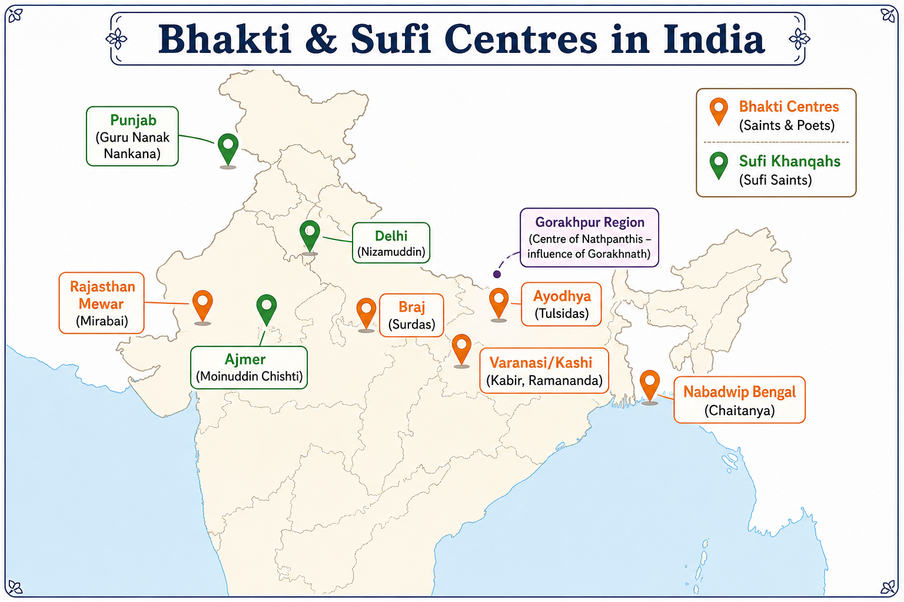
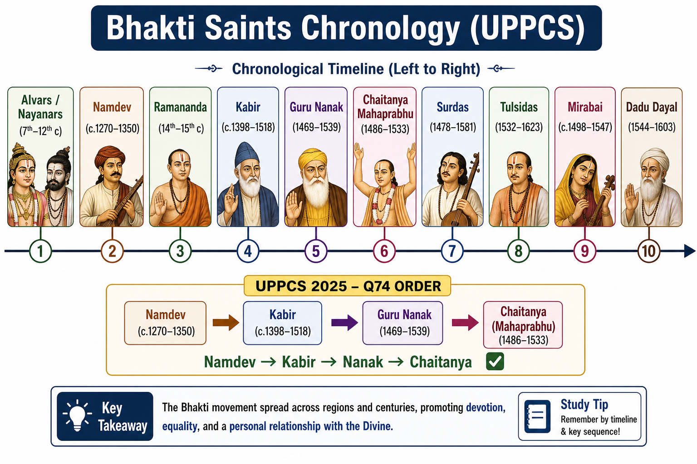

# Topic 4 — Bhakti & Sufi Movements
### ★ Complete Source of Truth — No other book/notes needed for this topic

> **Covers syllabus:** Bhakti Movement | Major Bhakti Saints | Chronology of Bhakti Saints | Indian Saint Tradition | Guru-Shishya Tradition | Tulsidas | Bhakti Period Women Poets | Vedanta Philosophy | Sufi Saints | Nath Sect | Ramananda | Kabir | Guru Nanak | Chaitanya Mahaprabhu | Mirabai | Surdas | Ravidas | Namdev | Dadu Dayal | Nizamuddin Auliya | Moinuddin Chishti | Chishti Order | Suhrawardi Order | Qadiri Order | Naqshbandi Order  
> **Sources baked in:** NCERT *Themes in Indian History Part II*, RS Sharma *Medieval India*, export notes (Cultural Development 1300–1500, Economic & Social Life 800–1200), UPPCS/UPSC PYQs 2018–2025  
> **Exam weight:** ★★★ High — guru–disciple matching (2025 Q12), saint chronology (2025 Q74), Chishti pairs (2020 Q40), Vedanta schools (2022 Q33), Fawaid-ul-Fuad (2021 Q101)  
> **Last verified:** July 2026

---

## Syllabus Coverage Map

| # | Syllabus bullet | § Section | What must be inside |
|---|-----------------|-----------|---------------------|
| 1 | Bhakti Movement | 4.1 | Origins (Alvars/Nayanars); personal devotion; vernacular; anti-ritualism |
| 2 | Major Bhakti Saints | 4.2 | Master saint table — region, deity, language, tradition |
| 3 | Chronology of Bhakti Saints | 4.3 | Timeline Namdev → Kabir → Nanak → Chaitanya → Surdas → Tulsidas |
| 4 | Indian Saint Tradition | 4.2 | Sant parampara; nirguna vs saguna; social reform strand |
| 5 | Guru-Shishya Tradition | 4.4 | Bhakti guru line + Sufi pir–murid silsilah |
| 6 | Tulsidas | 4.9 | Ramcharitmanas (Awadhi); Rama bhakti; UP |
| 7 | Bhakti Period Women Poets | 4.10 | Mirabai; Daya Bai; Sahajobai; Charandasi women |
| 8 | Vedanta Philosophy | 4.11 | Shankara, Ramanuja, Madhva, Nimbarka, Vallabha schools |
| 9 | Sufi Saints | 4.13 | Mysticism; khanqah; sama; major saints table |
| 10 | Nath Sect | 4.12 | Gorakhnath; Nathpanthis; hatha yoga |
| 11 | Ramananda | 4.5 | Prayag–Banaras; Rama worship; lower-caste disciples |
| 12 | Kabir | 4.6 | Nirguna; weaver; Ramananda disciple; Kashi/Maghar |
| 13 | Guru Nanak | 4.7 | 1469–1539; Mardana; householder path; Adi Granth hymns |
| 14 | Chaitanya Mahaprabhu | 4.8 | Gaudiya Vaishnavism; Nabadwip; sankirtan |
| 15 | Mirabai | 4.10 | Mewar; Krishna bhakti; Rajasthani compositions |
| 16 | Surdas | 4.9 | Braj; Sursagar; Vallabhacharya disciple |
| 17 | Ravidas | 4.5 | Cobbler saint; Ramananda disciple; Varanasi |
| 18 | Namdev | 4.5 | Marathi saint; earliest in north-transmission list |
| 19 | Dadu Dayal | 4.9 | Nirguna; Dadu Panth; Nipakhi path |
| 20 | Nizamuddin Auliya | 4.15 | Delhi Chishti; Fawaid-ul-Fuad; Amir Khusrau |
| 21 | Moinuddin Chishti | 4.14 | Ajmer founder; Chishti silsilah in India |
| 22 | Chishti Order | 4.14–4.15 | Poverty; sama; Hindawi; avoid state |
| 23 | Suhrawardi Order | 4.16 | Multan/Punjab; accept state patronage |
| 24 | Qadiri Order | 4.16 | Abdul Qadir Jilani lineage; widespread in India |
| 25 | Naqshbandi Order | 4.16 | Ahmad Sirhindi; orthodox revival; anti-syncretism |

---

## How to Use This File

1. **First read:** Syllabus Coverage Map → §4.3 chronology → §4.4 guru–shishya pairs → one saint block per sitting.
2. **Raata order:** Quick Revision Box → Must-Know Term Comparisons → Consolidated Reference → Common Traps.
3. **UPPCS drill:** **2025 Q12** (disciple–guru) and **Q74** (chronology) without notes; then Practice Zone + PYQ Bank.
4. **Self-test gate:** Match **Amir Khusrau → Nizamuddin**, **Surdas → Vallabhacharya**, **Kabir → Ramananda**, **Mardana → Nanak**.
5. **Revision cycle:** Day 1 = Bhakti origins + chronology; Day 2 = Kabir–Nanak–Chaitanya; Day 3 = Sufi orders + Nizamuddin; Day 4 = 45 Practice questions.

---

## How UPPCS Tests This Topic

| Pattern | What they ask | Your prep focus |
|---------|---------------|-----------------|
| **Disciple ↔ Guru match** | Kabir–Ramananda; Khusrau–Nizamuddin; Surdas–Vallabhacharya | §4.4; **UPPCS 2025 Q12** |
| **Saint chronology** | Namdev → Kabir → Nanak → Chaitanya | §4.3; **UPPCS 2025 Q74** |
| **NOT matched (Sufi)** | Nizamuddin–Multan (wrong — Delhi) | §4.15; **UPPCS 2020 Q40** |
| **Book ↔ saint** | Fawaid-ul-Fuad = Nizamuddin; compiler Amir Hasan Sijzi | §4.15; **UPPCS 2021 Q101** |
| **Vedanta ↔ philosopher** | Ramanuja–Vishishtadvaita; Vallabha–Shuddhadvaita | §4.11; **UPPCS 2022 Q33** |
| **A/R Sufi sama** | Chishti musical assemblies (sama) | §4.14; **UPPCS 2018 Q90** |
| **Nath + Sufi yoga** | Hath Yog — Nathpanthis; some Sufi adoption | §4.12; **UPPCS 2019 Q14** |
| **Women poetess ↔ work** | Gangabai–Ganesh Dev Leela NOT matched | §4.10; **UPPCS 2023 Q39** |

> **2025 overlap (Q12):** Kabir→**Ramananda (2)**; Khusrau→**Nizamuddin (3)**; Surdas→**Vallabhacharya (4)**; Mardana→**Nanak (1)**. Code **C (2-3-4-1)**.  
> **2025 overlap (Q74):** Namdev (3) → Kabir (4) → Nanak (1) → Chaitanya (2). Code **C (3-4-1-2)**.

---

## Quick Revision Box — Raata This First

```
BHAKTI CORE:
  South origins: Nayanars (Shiva) + Alvars (Vishnu) — 7th–12th c. Tamil
  North: Namdev → Ramananda → Kabir → Nanak → Chaitanya → Surdas → Tulsidas
  Two streams: Saguna (personal deity) vs Nirguna (formless Ram/Hari/Allah)

GURU–SHISHYA (★★★ 2025 Q12):
  Kabir → Ramananda | Ravidas → Ramananda | Surdas → Vallabhacharya
  Amir Khusrau → Nizamuddin Auliya | Mardana → Guru Nanak

CHRONOLOGY (★★★ 2025 Q74):
  Namdev (~1270–1350) → Kabir (~15th c.) → Nanak (1469–1539) → Chaitanya (1486–1533)
  Later: Surdas (1478–1581) → Tulsidas (1532–1623) → Dadu Dayal (1544–1603)

SUFI ORDERS:
  Chishti — Ajmer/Delhi; poverty; sama; Moinuddin → Kaki → Farid → Nizamuddin
  Suhrawardi — Multan; accepts state wealth
  Qadiri — Abdul Qadir Jilani tradition
  Naqshbandi — Ahmad Sirhindi; orthodox; opposed syncretism

KEY WORKS:
  Ramcharitmanas — Tulsidas (Awadhi) | Sursagar — Surdas (Braj)
  Amuktamalyada — Krishnadevaraya (NOT this topic) | Kitab-i-Nauras — Ibrahim Adil Shah (NOT this topic)
  Fawaid-ul-Fuad — Nizamuddin conversations (Amir Hasan Sijzi)

VEDANTA (2022 Q33):
  Shankara — Advaita | Ramanuja — Vishishtadvaita | Madhva — Dvaita
  Nimbarka — Dvaitadvaita | Vallabhacharya — Shuddhadvaita

UP LINKS:
  Kabir — Varanasi/Kashi; Maghar (Sant Kabir Nagar district)
  Ramananda — Prayag/Banaras | Tulsidas — Awadhi UP | Surdas — Braj (UP belt)
  Gorakhnath — Nathpanthis (Gorakhpur UP association)
```

### Must-Know Term Comparisons (very frequently asked)

| Term | One-line difference | Hindi |
|------|---------------------|-------|
| **Bhakti vs Sufi mysticism** | Hindu personal devotion to deity/formless Ram vs Islamic love of Allah through pir–murid path | भक्ति / सूफ़ी |
| **Saguna vs Nirguna Bhakti** | Worship of formed deity (Krishna/Rama) vs formless one God (Kabir, Nanak early) | सगुण / निर्गुण |
| **Alvar vs Nayanar** | Vishnu devotees (south) vs Shiva devotees (south) — both early Bhakti | आल्वर / नायनार |
| **Ramananda vs Ramanuja** | North Indian Rama bhakti populariser (Banaras) vs South Vishishtadvaita philosopher | रामानंद / रामानुज |
| **Kabir vs Guru Nanak** | 15th-c. nirguna weaver-saint vs 16th-c. Punjab householder; Nanak founded Sikh line | कबीर / गुरु नानक |
| **Chishti vs Suhrawardi** | Reject wealth/state service vs accept patronage and office | चिश्ती / सुहरावर्दी |
| **Sama vs Qawwali** | Chishti devotional musical gathering; Khusrau linked to qawwali tradition | समा / क़व्वाली |
| **Pir vs Guru** | Sufi spiritual master (silsilah) vs Bhakti/Hindu spiritual preceptor | पीर / गुरु |
| **Advaita vs Vishishtadvaita** | Shankara — world is maya, Brahman alone real vs Ramanuja — soul distinct yet united with God | अद्वैत / विशिष्टाद्वैत |
| **Surdas vs Tulsidas** | Braj Krishna bhakti (Sursagar) vs Awadhi Rama bhakti (Ramcharitmanas) | सूरदास / तुलसीदास |
| **Mirabai vs Andal** | Rajasthan Krishna devotee vs Tamil Alvar woman saint — both women bhakti | मीराबाई / आंडाल |
| **Nathpanthi vs Bhakti sant** | Gorakhnath hatha-yoga ascetic line vs devotional poet-saints — overlap in anti-caste strand | नाथपंथी / संत |

### Memory Tricks

| Trick | Remembers |
|-------|-----------|
| **K-R-S-M (2025 Q12)** | **K**abir–**R**amananda; **K**husrau–**N**izamuddin; **S**urdas–**V**allabhacharya; **M**ardana–**N**anak |
| **3-4-1-2 (2025 Q74)** | **N**amdev(3) → **K**abir(4) → **N**anak(1) → **C**haitanya(2) |
| **Chishti chain A-D** | **A**jmer (Moinuddin) → **D**elhi (Nizamuddin) via Farid |
| **Nizamuddin ≠ Multan** | 2020 Q40 trap — Nizamuddin = **Delhi** |
| **Fawaid = Fuad** | Fawaid-ul-**Fuad** = Nizamuddin; compiler **Amir Hasan Sijzi** (not Khusrau) |
| **Vedanta 4-3-2-1** | **R**amanuja(4)-Vishishtadvaita; **M**adhva(3)-Dvaita; **N**imbarka(2)-Dvaitadvaita; **V**allabha(1)-Shuddhadvaita |
| **Two Farids** | Baba **Farid** (Sufi) ≠ Ibrahim **Adil Shah** (Deccan) |
| **Tulsidas 1574** | Ramcharitmanas ≈ Akbar era — Awadhi not Sanskrit |

---

## Exam Visuals — High-ROI Images

| # | Image | Use when revising |
|---|-------|-------------------|
| 1 | `images/bhakti_sufi_centres_map.png` | Saint ↔ city matching; UP centres |
| 2 | `images/bhakti_saints_chronology.png` | Chronology traps; 2025 Q74 |





---

## 4.1 Bhakti Movement — Origins and Nature

### Definitions

| Term | Meaning |
|------|---------|
| **Bhakti** | Personal **devotional love** toward God — alternative path to salvation besides Vedic ritual and asceticism |
| **Bhakti Movement** | Medieval **popular religious movement** (7th–17th c. peak) stressing devotion, vernacular poetry, social equality |
| **Saguna Bhakti** | Devotion to **God with attributes/form** — Krishna, Rama, Vitthala |
| **Nirguna Bhakti** | Devotion to **formless absolute** — Kabir's Ram/Hari/Allah; Nanak's Ik Onkar |

### Bhakti Movement — How It Works

- **Vedic roots:** Bhakti idea appears in **Upanishads** and **Bhagavad Gita** — but mass movement crystallises in **Tamil country** first.
- **Southern phase (7th–12th c.):** **63 Nayanars** (Shiva) and **12 Alvars** (Vishnu) compose Tamil devotional hymns — temple-centred bhakti.
- **Northward transmission:** South traditions reach north via **scholars, pilgrims, saints** — Ramanuja's theology plus sant poetry fuse in Gangetic plain.
- **Social driver:** **Decline of Rajput political power** and **Brahman ritual monopoly** — lower castes seek direct access to God.
- **Islamic/Sufi influence:** Ideas of **equality, brotherhood, personal God** parallel Sufi humanism — not direct copying but shared social climate.
- **Language shift:** Saints compose in **Marathi, Hindi, Awadhi, Braj, Punjabi, Bengali** — bypasses Sanskrit elite.
- **Anti-ritual strand:** Many sants reject **idol worship, caste, pilgrimage, formal puja/namaz** — stress inner experience.
- **Not one organisation:** **Decentralised sant parampara** — local gurus, no single church — yet shared themes.
- **Mughal outcome:** Bhakti–Sufi synthesis contributes to **Akbar's sulh-i-kul** and **composite culture** — long-term tolerance.

> **Exam note:** Bhakti did **not** start in north with Kabir — **Alvars/Nayanars** are the earliest organised bhakti saints (trap in chronology questions).

### Exam Facts (raata)

- Roots in **Gita/Upanishads**; mass movement from **7th c. South India**.
- **Nayanars** = Shaiva; **Alvars** = Vaishnava.
- **Two streams:** Saguna and Nirguna.
- **Vernacular** poetry central — not Sanskrit-only.
- **Anti-caste** and **anti-ritual** tendencies in many sants.
- **Sufi influence** on equality discourse.
- Spread to north by **13th–15th c.**
- Contributed to **composite culture** under Mughals.
- **Decentralised** — no single institution.

### PYQs — Bhakti Movement

1. **(UPPCS Prelims 2025, Q74)** Arrange: Guru Nanak, Chaitanya, Namdev, Kabir → **C (3-4-1-2)** — tests movement chronology frame.

2. **(UPPCS Prelims 2025, Q12)** Disciple–guru matching across Bhakti–Sufi lines → **C (2-3-4-1)**.

### Examples (4.1)

| Example | Significance |
|---------|--------------|
| **Tevaram hymns (Nayanars)** | Early Tamil Shaiva bhakti |
| **Divya Prabandham (Alvars)** | Early Vishnu bhakti corpus |
| **Kabir's dohas** | Nirguna north Indian peak |

---

## 4.2 Major Bhakti Saints & Indian Saint Tradition

### Definitions

| Term | Meaning |
|------|---------|
| **Indian Saint Tradition** | Line of **sants** — poet-mystics cutting across caste/sect — shared ethical and devotional idiom |
| **Sant Parampara** | Guru–disciple chain transmitting teachings (Kabir panth, Dadu panth, etc.) |
| **Major Bhakti Saints** | High-exam-weight figures from syllabus list — know region, language, guru, work |

### Major Bhakti Saints — How It Works

- **Regional diversity:** Saints active in **Maharashtra, UP, Punjab, Braj, Rajasthan, Bengal** — UPPCS tests **UP-linked** saints heavily.
- **Occupation diversity:** Weavers (**Kabir**), cobblers (**Ravidas**), barbers (**Sena**), royalty (**Mirabai**, **Chaitanya** educated elite) — social inclusivity message.
- **Guru centrality:** Most north sants claim **Ramananda, Vallabhacharya**, or **personal revelation** line — guru legitimises teaching.
- **Nirguna cluster:** **Kabir, Nanak, Dadu Dayal, Ravidas** — formless God vocabulary.
- **Saguna cluster:** **Surdas, Tulsidas, Mirabai, Chaitanya** — Krishna/Rama devotion.
- **Women saints:** **Mirabai**, **Andal** (Alvar), **Daya Bai**, **Sahajobai** — bhakti opened space for women poets.
- **Literary legacy:** Compositions sung in **temples, homes, kirtans** — living oral tradition today.
- **Panth formation:** Posthumous followers form **Kabir Panth, Dadu Panth, Ravidas Panth, Sikh Panth** — institutionalisation after saint's death.
- **Contrast with orthodox Brahmanism:** Sants often **ignored varna rules** for dining and worship — radical for their time.

> **Exam note:** **Major saint ↔ city** — Kabir/Kashi, Nanak/Punjab, Chaitanya/Nabadwip, Mirabai/Mewar, Tulsidas/Ayodhya context.

### Master Table — Major Bhakti Saints

| Saint | Region | Language | Tradition | Guru (if any) | Key work/trait |
|-------|--------|----------|-----------|---------------|----------------|
| **Namdev** | Maharashtra | Marathi | Vithoba/Krishna | — | Earliest in north list |
| **Ramananda** | Prayag–Banaras | Hindi | Rama saguna | Ramanuja line | Opened to all castes |
| **Kabir** | Kashi | Hindi | Nirguna | Ramananda | Dohas; Ram=Allah |
| **Ravidas** | Varanasi | Hindi | Nirguna | Ramananda | Cobbler saint |
| **Guru Nanak** | Punjab | Punjabi | Nirguna/monotheism | Revelation | Mardana companion |
| **Chaitanya** | Bengal | Bengali | Gaudiya Vaishnava | — | Sankirtan Krishna |
| **Surdas** | Braj | Braj Bhasha | Krishna saguna | Vallabhacharya | Sursagar |
| **Tulsidas** | Awadh/UP | Awadhi | Rama saguna | — | Ramcharitmanas |
| **Mirabai** | Mewar (Rajasthan) | Rajasthani/Hindi | Krishna | — | Royal devotee |
| **Dadu Dayal** | Rajasthan/Gujarat | Hindi | Nirguna | — | Dadu Panth |

### Exam Facts (raata)

- **Namdev** — Marathi; among earliest in chronology lists.
- **Ramananda** — opened bhakti to **all castes**; Rama focus.
- **Kabir** — weaver; **Ramananda** disciple.
- **Ravidas** — cobbler; **Ramananda** disciple.
- **Nanak** — **1469–1539**; **Mardana** on rabab.
- **Chaitanya** — **Gaudiya Vaishnavism**; Bengal.
- **Surdas** — blind poet; **Vallabhacharya** disciple.
- **Tulsidas** — **Ramcharitmanas** Awadhi.
- **Mirabai** — Mewar princess; Krishna.
- **Dadu Dayal** — **Nipakhi** non-sectarian path.

### PYQs — Major Saints

1. **(UPPCS 2025 Q12)** Full disciple–guru match → **C**.

2. **(Statement-based)** Ravidas was a disciple of Ramananda and a cobbler by occupation → **True**.

### Examples (4.2)

| Saint | UP/Exam link |
|-------|--------------|
| **Kabir — Varanasi** | Sant Kabir Nagar district (UP) |
| **Tulsidas — Awadhi** | UP literary heartland |
| **Ramananda — Banaras** | UP sacred city |

---

## 4.3 Chronology of Bhakti Saints

### Definitions

| Term | Meaning |
|------|---------|
| **Chronology of Bhakti Saints** | Time order of saints — UPPCS tests **relative sequence**, not always exact birth years |
| **South vs North phase** | Alvars/Nayanars (7th–12th c.) → Namdev → Ramananda line → 15th–16th c. peaks |

### Chronology — How It Works

- **Phase I (7th–12th c.):** **Alvars & Nayanars** in Tamil country — earliest bhakti corpus.
- **Phase II (13th–14th c.):** **Namdev** (Maharashtra, ~1270–1350) — devotion spreads in Marathi.
- **Phase III (14th–15th c.):** **Ramananda** active in Banaras — trains **Kabir, Ravidas** and others.
- **Phase IV (15th c.):** **Kabir** (~1398–1518) — peak nirguna poetry in Kashi.
- **Phase V (late 15th–16th c.):** **Guru Nanak (1469–1539)** and **Chaitanya (1486–1533)** — overlapping generation.
- **Phase VI (16th c.):** **Surdas (1478–1581)**, **Mirabai (~1498–1547)**, **Tulsidas (1532–1623)** — saguna poetry matures.
- **Phase VII (late 16th c.):** **Dadu Dayal (1544–1603)** — Rajasthan nirguna synthesis.
- **Trap logic:** **Namdev before Kabir** always; **Kabir before Nanak** generally; **Nanak & Chaitanya** contemporaries but Nanak **born earlier** (1469 vs 1486).
- **2025 Q74 order:** **3 Namdev → 4 Kabir → 1 Nanak → 2 Chaitanya** — code **C**.

> **Exam note:** Do **not** place **Tulsidas before Kabir** — Tulsidas is **16th–17th c.** (Ramcharitmanas ~1574).

### Chronology Table (exam order)

| Order | Saint | Approx. period |
|-------|-------|----------------|
| 1 | Alvars / Nayanars | 7th–12th c. |
| 2 | Namdev | c. 1270–1350 |
| 3 | Ramananda | 14th–15th c. |
| 4 | Kabir | c. 1398–1518 |
| 5 | Guru Nanak | 1469–1539 |
| 6 | Chaitanya Mahaprabhu | 1486–1533 |
| 7 | Mirabai | c. 1498–1547 |
| 8 | Surdas | 1478–1581 |
| 9 | Tulsidas | 1532–1623 |
| 10 | Dadu Dayal | 1544–1603 |

### Exam Facts (raata)

- Earliest = **Alvars/Nayanars** (south).
- **Namdev** before **Kabir** (2025 Q74).
- **Kabir** before **Nanak**.
- **Nanak** born **1469**; **Chaitanya** **1486**.
- **Tulsidas** later than Kabir/Nanak.
- **Dadu Dayal** late 16th c.

### PYQs — Chronology

1. **(UPPCS 2025 Q74)** Arrange Nanak, Chaitanya, Namdev, Kabir → **C (3-4-1-2)**.

2. **(Statement-based)** Kabir lived before Guru Nanak → **True**.

### Examples (4.3)

| Trap pair | Correct order |
|-----------|---------------|
| Kabir vs Tulsidas | Kabir **first** |
| Namdev vs Ramananda | Namdev **first** |

---

## 4.4 Guru-Shishya Tradition (Bhakti & Sufi)

### Definitions

| Term | Meaning |
|------|---------|
| **Guru-Shishya Parampara** | Oral transmission from **master (guru)** to **disciple (shishya/chela)** — core of bhakti and Sufi learning |
| **Silsilah** | Sufi **spiritual genealogy** — pir → murid → wali succession |
| **Murid** | Sufi disciple bound to **pir** by oath and service |

### Guru-Shishya — How It Works

- **Bhakti model:** Disciple receives **mantra, teaching, legitimacy** from guru — cannot self-authorise as sant.
- **Ramananda line:** **Kabir, Ravidas, Sena, Sadhana** among disciples — **low-caste occupational diversity** deliberate.
- **Vallabhacharya line:** **Surdas** and Pushti Marg followers — **Krishna saguna** theology.
- **Nanak line:** **Mardana** (Muslim rabab-player) as lifelong companion — symbol of **Hindu–Muslim fellowship**.
- **Sufi model:** **Pir–murid** bond stronger than tribal/clan tie — murid serves pir, receives **wazifa** (meditation formula).
- **Khanqah:** Sufi hospice where **disciples live, learn, serve** — also centre of charity.
- **Silsilah names:** **Chishti, Suhrawardi, Qadiri, Naqshbandi** — each chain traced to founding pir.
- **2025 Q12 pairs:** Kabir→Ramananda | Khusrau→Nizamuddin | Surdas→Vallabhacharya | Mardana→Nanak → **C (2-3-4-1)**.
- **Trap:** Amir Khusrau was **disciple of Nizamuddin**, not vice versa — Khusrau was poet, Nizamuddin was pir.

> **Exam note:** **Mardana → Guru Nanak** (not Nanak → Mardana) — Mardana is **disciple/companion**, Nanak is guru.

### Guru–Disciple Master Table (★★★)

| Disciple | Guru | Tradition |
|----------|------|-----------|
| **Kabir** | **Ramananda** | Bhakti nirguna |
| **Ravidas** | **Ramananda** | Bhakti nirguna |
| **Surdas** | **Vallabhacharya** | Pushti Krishna bhakti |
| **Mardana** | **Guru Nanak** | Sikh founding companion |
| **Amir Khusrau** | **Nizamuddin Auliya** | Chishti Sufi |
| **Amir Hasan Sijzi** | Nizamuddin circle | Compiled Fawaid-ul-Fuad |

### Exam Facts (raata)

- Ramananda disciples include **Kabir & Ravidas**.
- **Surdas → Vallabhacharya** (2025 Q12).
- **Khusrau → Nizamuddin** (2025 Q12).
- **Mardana → Nanak** (2025 Q12).
- Sufi = **pir–murid**; Bhakti = **guru–shishya**.
- **Silsilah** = Sufi spiritual chain.

### PYQs — Guru-Shishya

1. **(UPPCS 2025 Q12)** Match List-I/List-II → **C (2-3-4-1)**.

2. **(NOT matched)** Amir Khusrau — disciple of Kabir → **False** — Khusrau's pir was **Nizamuddin**.

### Examples (4.4)

| Pair | Why tested |
|------|------------|
| Kabir–Ramananda | Most repeated UPPCS pair |
| Khusrau–Nizamuddin | Bhakti–Sufi crossover |

---

## 4.5 Ramananda, Namdev & Ravidas

### Definitions

| Term | Meaning |
|------|---------|
| **Ramananda** | 15th-c. **Vaishnava sant** of Banaras — shifted worship to **Rama**, opened gates to all castes |
| **Namdev** | **Marathi** saint (~1270–1350) — Vithoba/Krishna devotion; universalist hymns |
| **Ravidas** | **Chamar/cobbler** saint of Varanasi — disciple of Ramananda; nirguna egalitarianism |

### Ramananda, Namdev & Ravidas — How It Works

- **Namdev:** Tailor/calendar tradition; hymns in **Marathi**; some verses in **Guru Granth Sahib** — shows cross-regional respect.
- **Ramananda:** Born near **Prayag**, worked **Banaras**; follower of **Ramanuja's** Vishishtadvaita but **simplified** for masses.
- **Ramananda's break:** Replaced **Vishnu temple ritual** with **direct Rama bhakti** — no middle priesthood required.
- **Caste openness:** Allowed **women and lower castes** as disciples — revolutionary in Gangetic society.
- **Kabir & Ravidas:** Both **occupational "low" castes** — prove Ramananda's egalitarian practice.
- **Ravidas teachings:** One formless God; rejected **Brahman supremacy**; **Ravidas Panth** continues today.
- **Chronology:** **Namdev → Ramananda → Kabir/Ravidas** — Namdev earliest of this group.
- **Geography:** All linked to **Gangetic sacred belt** — UPPCS favours **Banaras/Kashi** context.

> **Exam note:** **Ravidas = cobbler + Ramananda disciple** — two facts tested together in statement questions.

### Exam Facts (raata)

- **Namdev** — Marathi; Vithoba devotion; pre-Kabir.
- **Ramananda** — Prayag/Banaras; **Rama** bhakti.
- Opened bhakti to **all castes**.
- **Kabir & Ravidas** = Ramananda disciples.
- **Ravidas** = cobbler/charmkar Varanasi.
- Namdev hymns in **Adi Granth**.
- Followed **Ramanuja** philosophically (simplified).

### PYQs — Ramananda / Namdev / Ravidas

1. **(UPPCS 2025 Q12)** Kabir → Ramananda → option **2**.

2. **(UPPCS 2025 Q74)** Namdev earliest in list → position **3** first in sequence.

### Examples (4.5)

| Saint | Occupation / region |
|-------|---------------------|
| Namdev | Tailor; Maharashtra |
| Ravidas | Cobbler; Varanasi (UP) |
| Ramananda | Scholar-sant; Banaras (UP) |

---

## 4.6 Kabir

### Definitions

| Term | Meaning |
|------|---------|
| **Kabir** | 15th-c. **nirguna** sant of **Varanasi** — weaver (julaha) by occupation |
| **Bijak** | Collection of **Kabir's verses** — major compilation of his dohas |

### Kabir — How It Works

- **Life:** Generally placed **15th century** (~1398–1518); born near **Kashi**, died at **Maghar** (tradition says to challenge "die in Kashi" belief).
- **Guru:** Disciple of **Swami Ramananda** — received Rama mantra legend says through clever device.
- **Teachings:** **One God** — calls Him **Ram, Hari, Govind, Allah, Sahib** interchangeably.
- **Rejected:** **Idol worship, caste, thread ceremony, pilgrimage, formal namaz**, temple/mosque ritualism.
- **Accepted:** **Guru, inner experience, honest householder life** — no need for sanyasa.
- **Language:** **Hindi dohas** — short couplets easy to memorise (raata-friendly).
- **Social message:** **Caste has no bearing on salvation** — weaver speaks truth to pandit and pir.
- **Legacy:** **Kabir Panth**; verses in **Adi Granth**; influenced **Dadu Panth** and modern Dalit thought.
- **UP link:** **Sant Kabir Nagar** district (UP); Maghar on UP border — high UPPCS relevance.

> **Exam note:** Kabir ≠ Guru Nanak — Kabir **15th c.**; Nanak **1469+**; both nirguna but **separate persons** (trap: "Kabir founded Sikhism").

### Exam Facts (raata)

- Occupation = **weaver (julaha)**.
- City = **Varanasi/Kashi**; died **Maghar**.
- Guru = **Ramananda**.
- **Nirguna** — formless God.
- Used **Allah and Ram** as names of one God.
- Rejected **idol + caste + ritual**.
- **15th century** — before Nanak.
- **Kabir Panth** + **Adi Granth** preserve verses.
- **Sant Kabir Nagar** (UP district).

### PYQs — Kabir

1. **(UPPCS 2025 Q12)** Kabir → Swami Ramananda → **2**.

2. **(UPPCS 2025 Q74)** Kabir after Namdev, before Nanak → **4** in second position.

### Examples (4.6)

| Example | Detail |
|---------|--------|
| **Maghar (UP)** | Kabir's death place — exam trap vs Kashi |
| **Sant Kabir Nagar** | UP district named after saint |
| **Doha form** | Scannable exam-friendly verse type |

---

## 4.7 Guru Nanak

### Definitions

| Term | Meaning |
|------|---------|
| **Guru Nanak** | Founder of **Sikh tradition** (1469–1539); born **Nankana Sahib** (Ravi river) |
| **Ik Onkar** | **One God** symbol — core of Nanak's monotheism |
| **Mardana** | **Muslim companion** — played **rabab** during Nanak's hymns |

### Guru Nanak — How It Works

- **Birth:** **1469** at **Talwandi (Nankana Sahib)** — Khatri family; Punjab region.
- **Companion:** **Mardana** — lifelong **Hindu–Muslim fellowship** symbol; Mardana = **disciple** (2025 Q12 → Nanak guru **1**).
- **Travels (udasis):** Across **India, Sri Lanka, Mecca, Medina** (tradition) — universal message.
- **Teachings:** **One God, equality, honest living, remembrance of Name (nam simran), service (seva)**.
- **Rejected:** **Caste, idol worship, empty ritual, ascetic escape from duty**.
- **Accepted:** **Householder's life (grihastha)** — middle path between sanyasa and indulgence.
- **Scripture link:** **974 hymns** in **Guru Granth Sahib**; also included **Kabir, Farid, Namdev** verses — syncretic canon.
- **Did not call himself Sikh founder explicitly** — aim was **Hindu–Muslim unity**; institutional Sikhism develops under later Gurus.
- **Death 1539** — before **Tulsidas** completed Ramcharitmanas (~1574).

> **Exam note:** **Mardana → Guru Nanak** in 2025 Q12 — do not reverse; Mardana is **not** guru of Nanak.

### Exam Facts (raata)

- Born **1469**; died **1539**.
- Place = **Nankana Sahib** (Ravi).
- **Mardana** — rabab player; disciple.
- **Udasis** — extensive travels.
- **Householder path** — not ascetic rejection of world.
- **Ik Onkar** — one God.
- Hymns in **Adi Granth**.
- Before **Tulsidas**; contemporary **Chaitanya**.
- Sought **Hindu–Muslim unity**.

### PYQs — Guru Nanak

1. **(UPPCS 2025 Q12)** Mardana → Guru Nanak Dev → **1**.

2. **(UPPCS 2025 Q74)** Nanak before Chaitanya in sequence → **1** third in list.

### Examples (4.7)

| Example | Significance |
|---------|--------------|
| **Mardana–Nanak pair** | 2025 Q12 |
| **Adi Granth inclusion of Kabir/Farid** | Bhakti–Sufi synthesis in scripture |

---

## 4.8 Chaitanya Mahaprabhu

### Definitions

| Term | Meaning |
|------|---------|
| **Chaitanya Mahaprabhu** | Bengali Vaishnava reformer (**1486–1533**) — founder of **Gaudiya Vaishnavism** |
| **Sankirtan** | **Congregational chanting** of Krishna's name — Chaitanya's method |
| **Gaudiya Vaishnavism** | Bengal Krishna bhakti school — later spread via **Rupa/Sanatana Goswami** |

### Chaitanya — How It Works

- **Birth:** **1486** at **Nabadwip** (Bengal) — scholarly youth, then mystical conversion to Krishna devotion.
- **Method:** **Public kirtan/sankirtan** — emotional **bhava** (ecstasy) — democratised devotion beyond temples.
- **Theology:** **Krishna as supreme**; **Radha–Krishna** love symbolism; influenced by **Bhagavata Purana**.
- **Social:** Cut across caste in kirtan gatherings — **Brahman and non-Brahman** participants.
- **Political respect:** **Hussain Shah** (Bengal Sultan) and **Krishnadevaraya** court respected him — shows bhakti–state coexistence.
- **Disciples:** **Rupa Goswami, Sanatana Goswami** systematised theology at **Vrindavan** after Chaitanya.
- **Chronology:** Born **after Nanak (1469)** but died **1533** before Nanak's 1539 — 2025 Q74 places **Chaitanya last (2)** among the four.
- **Language:** **Bengali** compositions — regional literary awakening.

> **Exam note:** Chaitanya = **Krishna saguna Bengal** — not nirguna like Kabir; not Rama like Tulsidas.

### Exam Facts (raata)

- **1486–1533**; **Nabadwip** birth.
- Founder **Gaudiya Vaishnavism**.
- **Sankirtan** movement.
- **Krishna + Radha** bhakti.
- Disciples **Rupa & Sanatana Goswami**.
- Respected by **Bengal Sultan**.
- Last in **2025 Q74** four-saint list.
- **Bengali** language compositions.

### PYQs — Chaitanya

1. **(UPPCS 2025 Q74)** Chaitanya last in Namdev-Kabir-Nanak list → **2**.

2. **(Statement-based)** Chaitanya promoted nirguna formless God only → **False** — **saguna Krishna**.

### Examples (4.8)

| Example | Link |
|---------|------|
| **Nabadwip** | Chaitanya's centre |
| **Vrindavan Goswamis** | Theology after Chaitanya |

---

## 4.9 Surdas, Tulsidas & Dadu Dayal

### Definitions

| Term | Meaning |
|------|---------|
| **Surdas** | Blind **Braj** poet (**1478–1581**) — **Krishna saguna** bhakti; **Sursagar** |
| **Tulsidas** | **Awadhi** poet (**1532–1623**) — **Ramcharitmanas** (~1574) |
| **Dadu Dayal** | **Nirguna** sant (**1544–1603**) — **Dadu Panth**; **Nipakhi** path |

### Surdas, Tulsidas & Dadu — How It Works

- **Surdas:** Disciple of **Vallabhacharya** (Pushti Marg); composed **Sursagar** — Krishna's childhood (**Bal Krishna**) theme in **Braj Bhasha**.
- **Surdas blindness:** Legend says **born blind** — symbol of inner vision; UPPCS links to **Braj region (UP belt)**.
- **Vallabhacharya theology:** **Shuddhadvaita** — Krishna is supreme; grace (pushti) saves — Surdas embodies this poetically.
- **Tulsidas:** Wrote **Ramcharitmanas** in **Awadhi** (~**1574**) during **Akbar's** reign — Rama as **accessible hero-god**.
- **Tulsidas impact:** Made **Ramayana** household text in north India; **humanistic Rama** — duty, family, devotion combined.
- **Tulsidas & caste:** Modified strict caste views vs earlier orthodoxy — **salvation open to all** through Rama-nama.
- **Dadu Dayal:** Rajasthan/Gujarat; **Nipakhi** (= nipun/ skilled) path — **non-sectarian**, beyond Hindu–Muslim labels.
- **Dadu teachings:** **Brahma as supreme**; reject sectarian conflict; simple life and guru devotion.
- **Chronology:** Surdas overlaps Kabir-Nanak era; **Tulsidas later**; **Dadu latest** of this trio.

> **Exam note:** **Surdas → Vallabhacharya** (2025 Q12 option **4**); do not match Surdas to Ramananda.

### Exam Facts (raata)

- **Surdas** — Braj; **Sursagar**; blind poet.
- **Surdas** guru = **Vallabhacharya**.
- **Tulsidas** — **Ramcharitmanas** Awadhi ~1574.
- **Tulsidas** — **Rama saguna**; UP Awadh link.
- **Dadu Dayal** — **Nirguna**; Dadu Panth.
- **Dadu** — Nipakhi non-sectarian path.
- Surdas = **Krishna**; Tulsidas = **Rama**.

### PYQs — Surdas / Tulsidas / Dadu

1. **(UPPCS 2025 Q12)** Surdas → Vallabhacharya → **4**.

2. **(Statement-based)** Ramcharitmanas was written in Sanskrit by Tulsidas → **False** — **Awadhi**.

### Examples (4.9)

| Work | Author | Language |
|------|--------|----------|
| Sursagar | Surdas | Braj |
| Ramcharitmanas | Tulsidas | Awadhi |
| Dadu Panth hymns | Dadu Dayal | Hindi |

---

## 4.10 Mirabai & Bhakti Period Women Poets

### Definitions

| Term | Meaning |
|------|---------|
| **Mirabai (Meera)** | **Rajasthan** princess-devotee (~1498–1547) — **Krishna bhakti**; left royal life |
| **Bhakti Period Women Poets** | Female saints/poetesses — **Mirabai, Andal, Daya Bai, Sahajobai** |
| **Andal** | Only **woman Alvar** — Tamil Krishna devotee (early bhakti) |

### Mirabai & Women Poets — How It Works

- **Mirabai:** Born **Mewar royal family**; married **Bhoj Raj**; defied court to worship **Krishna**; legends of survival attempts.
- **Mirabai compositions:** **Rajasthani/Hindi** padas — **Krishna as lover-god** (madhurya bhava).
- **Social significance:** Woman renouncing **royal duty** for devotion — challenged **patriarchy and Rajput honour codes**.
- **Andal (Alvar):** **7th–9th c.** Tamil — **earliest major woman bhakti voice** in recorded tradition.
- **Daya Bai:** **Charandasi** tradition disciple of **Charandas**; works **Vinay Malika**, **Dayabodh** — 2023 Q39 pair **correct**.
- **Sahajobai:** Disciple of **Charandas** (Delhi); **Sahaj Prakash** — simplicity in devotion — 2023 Q39 pair **correct**.
- **2023 Q39 trap:** **Gangabai — Ganesh Dev Leela** = **NOT matched** (official key **C**).
- **Bhakti opened space:** Women could **sing, compose, lead congregations** — rare in orthodox Vedic ritualism.

> **Exam note:** **2023 Q39** — Daya Bai–Vinay Malika ✓; Sahajobai–Sahaj Prakash ✓; wrong pair = **Gangabai–Ganesh Dev Leela**.

### Women Poets Table

| Poetess | Composition | Tradition |
|---------|-------------|-----------|
| **Andal** | Tiruppavai (Alvar) | Tamil Vaishnava |
| **Mirabai** | Padas to Krishna | Rajasthan saguna |
| **Daya Bai** | Vinay Malika, Dayabodh | Charandasi |
| **Sahajobai** | Sahaj Prakash | Charandasi |

### Exam Facts (raata)

- **Mirabai** — Mewar; Krishna devotee.
- **Andal** — woman **Alvar**.
- **Daya Bai** — Vinay Malika.
- **Sahajobai** — Sahaj Prakash.
- Both Charandasi disciples of **Charandas**.
- 2023 Q39 wrong pair = **Gangabai**.
- Women bhakti = **madhurya** and equality themes.

### PYQs — Women Poets

1. **(UPPCS 2023 Q39)** Poetess–composition NOT matched → **C (Gangabai — Ganesh Dev Leela)**.

2. **(Statement-based)** Mirabai was a devotee of Rama → **False** — **Krishna**.

### Examples (4.10)

| Poetess | Region |
|---------|--------|
| Mirabai | Rajasthan (Mewar) |
| Daya Bai / Sahajobai | Charandasi (north India) |

---

## 4.11 Vedanta Philosophy

### Definitions

| Term | Meaning |
|------|---------|
| **Vedanta** | "End of Vedas" — **Upanishadic philosophy**; six orthodox schools branch from it |
| **Advaita** | **Shankara** — Brahman alone real; world is **maya** |
| **Vishishtadvaita** | **Ramanuja** — soul is part of God; **prapatti** (surrender) |
| **Dvaita** | **Madhvacharya** — **dualism** — God and soul distinct |
| **Dvaitadvaita** | **Nimbarka** — simultaneous unity and difference |
| **Shuddhadvaita** | **Vallabhacharya** — pure non-dualism with Krishna as saguna Brahman |

### Vedanta — How It Works

- **Shankara (8th c.):** **Advaita** — only **Brahman** real; individual soul = Brahman under ignorance; **knowledge (jnana)** liberates.
- **Ramanuja (11th–12th c.):** **Vishishtadvaita** — God has **body/soul of universe**; **bhakti + prapatti** over dry logic; opened to **Shudras**.
- **Madhvacharya (13th c.):** **Dvaita** — **eternal difference** between God, soul, matter — bhakti of **Vishnu** essential.
- **Nimbarka (13th c.):** **Dvaitadvaita** — Radha–Krishna worship; soul both one and different from God.
- **Vallabhacharya (16th c.):** **Shuddhadvaita** — **Krishna is Brahman**; **pushti marg** (grace path) — links to **Surdas**.
- **Bhakti connection:** **Ramananda** popularised **Ramanuja-related** ideas in north; **Vallabhacharya** feeds **Krishna poets**.
- **2022 Q33 match:** Ramanuja→**Vishishtadvaita (4)**; Madhva→**Dvaita (3)**; Nimbarka→**Dvaitadvaita (2)**; Vallabha→**Shuddhadvaita (1)** → **D (4-3-2-1)**.
- **Trap:** Shankara **Advaita** not in that question's list — don't force Shankara into Vallabha's slot.

> **Exam note:** **Vallabhacharya = Shuddhadvaita** — pairs with **Surdas** guru line (2025 Q12 + 2022 Q33).

### Vedanta Schools Table

| Philosopher | School | Key idea |
|-------------|--------|----------|
| **Shankaracharya** | Advaita | Non-dual Brahman; maya |
| **Ramanuja** | Vishishtadvaita | Qualified non-dualism; prapatti |
| **Madhvacharya** | Dvaita | Dualism |
| **Nimbarka** | Dvaitadvaita | Unity + difference |
| **Vallabhacharya** | Shuddhadvaita | Pure non-dual Krishna bhakti |

### Exam Facts (raata)

- **Vedanta** = Upanishadic philosophy.
- **Shankara** — Advaita (8th c.).
- **Ramanuja** — Vishishtadvaita.
- **Madhva** — Dvaita.
- **Nimbarka** — Dvaitadvaita.
- **Vallabhacharya** — Shuddhadvaita.
- 2022 Q33 answer **D (4-3-2-1)**.
- Ramananda linked to **Ramanuja** tradition.

### PYQs — Vedanta

1. **(UPPCS 2022 Q33)** Match philosopher–philosophy → **D (4-3-2-1)**.

2. **(Statement-based)** Vallabhacharya propounded Dvaita → **False** — **Shuddhadvaita** (Madhva = Dvaita).

### Examples (4.11)

| Link | Exam use |
|------|----------|
| Vallabhacharya → Surdas | Guru + philosophy pair |
| Ramanuja → Ramananda | North transmission |

---

## 4.12 Nath Sect (Nathpanthis)

### Definitions

| Term | Meaning |
|------|---------|
| **Nath Sect** | **Shaiva ascetic** movement — **Gorakhnath** as chief figure |
| **Nathpanthis** | Followers practising **hatha yoga**, alchemy, anti-caste ideas |
| **Siddha** | Perfected adept — yogis called Nizamuddin **siddha** in legend |

### Nath Sect — How It Works

- **Origins:** Emerges from **siddha/yogi** traditions — **Gorakhnath** (11th–12th c. tradition) systematises **Nath panth**.
- **Practices:** **Hatha yoga**, **breath control**, **meditation**, **kanphata** (split-ear initiation).
- **Anti-caste strand:** Challenged **Brahman ritual monopoly** — parallel to bhakti egalitarianism.
- **Geography:** Strong in **north India** — **Gorakhpur** (UP) associated with **Gorakhnath** cult site.
- **2019 Q14:** Statement 1 — **Hath Yog practiced by Nathpanthis** → **True**.
- **2019 Q14:** Statement 2 — **Hath Yog technique adopted by Sufis** → **True** (Nizamuddin adopted **yogic breathing** per sources).
- **Answer 2019 Q14:** **C (Both 1 and 2)** — Nath + Sufi crossover on yoga techniques.
- **Relation to Bhakti:** Overlapping **anti-ritual** mood but Nath = **yogic ascetic**; Bhakti = **devotional poetry** — distinct paths, shared social critique.
- **Tantric influence:** Nath literature has **tantric** elements — exams rarely deep-dive; know **Gorakhnath + hatha yoga**.

> **Exam note:** **Nathpanthi ≠ Bhakti sant** — but both rejected caste rigidity; **2019 Q14** tests Nath–Sufi yoga link.

### Exam Facts (raata)

- **Gorakhnath** = chief Nath figure.
- **Hatha yoga** = Nath practice.
- **Kanphata yogis** = Nath initiates.
- **Anti-caste** tendencies.
- **Gorakhpur** UP association.
- Sufis (Nizamuddin) adopted **breathing exercises**.
- 2019 Q14 = **Both statements true**.
- Distinct from **Bhakti kirtan** path.

### PYQs — Nath Sect

1. **(UPPCS 2019 Q14)** Hath Yog — Nathpanthis + Sufis → **C (Both 1 and 2)**.

2. **(Statement-based)** Gorakhnath founded the Chishti order → **False** — **Nath panth**, not Sufi.

### Examples (4.12)

| Example | Link |
|---------|------|
| Gorakhnath Math | Nath centre |
| Nizamuddin "Siddha" title | Nath–Sufi interaction |

---

## 4.13 Sufi Saints — Overview

### Definitions

| Term | Meaning |
|------|---------|
| **Sufi** | Islamic **mystic** seeking direct experience of **Allah** through love, not legalism alone |
| **Khanqah** | Sufi **hospice/centre** for worship, charity, disciple training |
| **Ba-shara** | Sufis following **Sharia** (law) — Chishti, Suhrawardi |
| **Be-shara** | Sufis **outside** strict Sharia — wandering saints |

### Sufi Saints — How It Works

- **Context:** Reaction against **Umayyad luxury** and **dry legalism** — stress **zuhd** (asceticism) and **divine love**.
- **Al-Ghazzali (d.1112):** Reconciled **Sufism with orthodox Islam** — Quran + mysticism.
- **Indian arrival:** Sufis came with **Delhi Sultanate** — **khanqahs** became social welfare centres.
- **Hanafi law:** Turks followed **Hanafi** school — most **liberal** of four Sunni law schools.
- **Pir–murid bond:** Disciple owes **loyalty and service**; pir gives **spiritual instruction**.
- **Sama:** **Musical devotional assembly** — **Chishti** feature — **2018 Q90** Reason cites early Chishti fondness for sama.
- **Similarity to Bhakti:** **Love of God, guru/pir, equality, vernacular** — facilitated **composite culture**.
- **Major Indian saints:** **Moinuddin Chishti, Nizamuddin Auliya, Baba Farid, Bahauddin Zakariya (Suhrawardi)**.
- **Women in Sufi tradition:** **Rabia of Basra** (8th c.) — divine love pioneer (background fact).

> **Exam note:** Sufi ≠ always anti-Sharia — **Ba-shara** orders follow Islamic law while adding mysticism.

### Major Sufi Saints Table

| Saint | Order | Centre |
|-------|-------|--------|
| **Moinuddin Chishti** | Chishti | Ajmer |
| **Qutbuddin Bakhtiyar Kaki** | Chishti | Delhi |
| **Baba Farid** | Chishti | Ajodhan/Pakpattan |
| **Nizamuddin Auliya** | Chishti | Delhi |
| **Nasiruddin Chiragh** | Chishti | Delhi |
| **Bahauddin Zakariya** | Suhrawardi | Multan |
| **Abdul Qadir Jilani** | Qadiri | Baghdad (pan-India spread) |

### Exam Facts (raata)

- Sufis = Islamic **mystics**.
- **Khanqah** = centre.
- **Al-Ghazzali** reconciled Sufism + orthodoxy.
- **Hanafi** law — Turkish preference.
- **Pir–murid** relationship.
- **Sama** = musical gathering.
- Parallel to **Bhakti** in love/equality.
- **Ba-shara vs Be-shara** split.

### PYQs — Sufi Overview

1. **(UPPCS 2018 Q90)** A/R — Sanskrit music translated to Persian + Chishti **sama** → **B (Both true; R not correct explanation)**.

2. **(UPPCS 2020 Q40)** Nizamuddin–Multan NOT matched → **D**.

### Examples (4.13)

| Term | Meaning |
|------|---------|
| Sama | 2018 Q90 Reason |
| Khanqah | Delhi–Ajmer network |

---

## 4.14 Moinuddin Chishti & Chishti Order

### Definitions

| Term | Meaning |
|------|---------|
| **Moinuddin Chishti (Khwaja Garib Nawaz)** | **Founder of Chishti silsilah in India** — settled **Ajmer** c.1192 |
| **Chishti Order** | Most popular **Indian Sufi order** — poverty, sama, Hindawi, distance from sultan |
| **Garib Nawaz** | "Benefactor of the poor" — title of **Moinuddin Chishti** |

### Moinuddin & Chishti Order — How It Works

- **Arrival:** **Khwaja Muinuddin Chishti** came to India **~1192** after Muhammad Ghori's campaigns — settled **Ajmer** (Rajasthan, exam hotspot).
- **Death:** **1236** — dargah at Ajmer remains **major pilgrimage** for Hindus and Muslims.
- **Lineage:** Moinuddin → **Qutbuddin Bakhtiyar Kaki (Delhi)** → **Baba Farid (Ajodhan)** → **Nizamuddin Auliya (Delhi)** → **Nasiruddin Chiragh-i-Delhi**.
- **Chishti principles:** **Absolute poverty**, **no property**, **no state service**, **open kitchen (langar)**, **service to poor**.
- **Language:** Used **Hindawi/Hindi** for masses — not Persian-only elite discourse.
- **Sama controversy:** Some orthodox ulema opposed **music in worship** — Chishtis defended **sama** as path to God.
- **2020 Q40:** **Moinuddin – Ajmer Chishti** = **correctly matched** (option A).
- **Political aloofness:** Refused **sultan court patronage** — moral authority independent of state (idealised).
- **Trap:** **Chishti ≠ Suhrawardi** — Chishti rejects wealth; Suhrawardi accepts state.

> **Exam note:** **Moinuddin = Ajmer** always; **Nizamuddin = Delhi** — never Multan (2020 Q40 trap D).

### Chishti Saints Chain

| Order | Saint | Centre |
|-------|-------|--------|
| 1 | Moinuddin Chishti | Ajmer |
| 2 | Bakhtiyar Kaki | Delhi |
| 3 | Baba Farid | Ajodhan |
| 4 | Nizamuddin Auliya | Delhi |
| 5 | Nasiruddin Chiragh | Delhi |

### Exam Facts (raata)

- **Moinuddin** — Ajmer; **~1192** arrival.
- Died **1236**; **Garib Nawaz**.
- **Chishti** = poverty + sama + Hindawi.
- Avoided **state patronage**.
- Chain through **Kaki, Farid, Nizamuddin**.
- 2020 Q40: A (Moinuddin–Ajmer) **correct**.
- **Langar** tradition at khanqah.

### PYQs — Moinuddin / Chishti

1. **(UPPCS 2020 Q40)** NOT matched → **D (Nizamuddin–Multan)** — Moinuddin–Ajmer is correct.

2. **(UPPCS 2018 Q90)** Chishti **sama** = musical assemblies → Reason **True**.

### Examples (4.14)

| Site | Saint |
|------|-------|
| Ajmer Sharif dargah | Moinuddin Chishti |
| Mehrauli dargah | Bakhtiyar Kaki |

---

## 4.15 Nizamuddin Auliya & Literary Circle

### Definitions

| Term | Meaning |
|------|---------|
| **Nizamuddin Auliya** | Greatest **Delhi Chishti** saint (**1238–1325**) — pupil of **Baba Farid** |
| **Fawaid-ul-Fuad** | Record of **Nizamuddin's conversations** — compiled by **Amir Hasan Sijzi** |
| **Amir Khusrau** | Poet-disciple of Nizamuddin — **Hindavi poetry, qawwali tradition** |

### Nizamuddin — How It Works

- **Life:** Lived **Delhi** — never left city despite sultan pressure; **khanqah at Ghiyaspur** (Delhi).
- **Teachings:** **Love, tolerance, service** — fed hungry during famines; welcomed **Hindus and Muslims**.
- **Yogic influence:** Adopted **breathing exercises** — yogis called him **siddha** — links to **Nath** (2019 Q14).
- **Amir Khusrau:** Chief **murid** — invented **Hindavi** literary forms; associated with **qawwali**; buried near Nizamuddin.
- **Fawaid-ul-Fuad:** **Amir Hasan Sijzi** compiled conversations — **2021 Q101 answer A** (not Khusrau, not Barani).
- **2020 Q40 trap:** **Nizamuddin – Multan** = **WRONG** — Nizamuddin = **Delhi**; Multan = **Suhrawardi (Bahauddin Zakariya)**.
- **2025 Q12:** **Amir Khusrau → Nizamuddin Auliya** → guru code **3**.
- **After death:** **Nasiruddin Chiragh-i-Delhi** succeeded — last great Delhi Chishti of classical line.
- **Impact:** Model for **Akbar-era tolerance** — spiritual authority above sultan.

> **Exam note:** **Fawaid-ul-Fuad compiler = Amir Hasan Sijzi** (2021 Q101) — trap: Amir **Khusrau** (he was poet disciple, not compiler).

### Exam Facts (raata)

- Nizamuddin = **Delhi** (NOT Multan).
- Pupil of **Baba Farid**.
- **1238–1325**.
- **Amir Khusrau** = disciple.
- **Fawaid-ul-Fuad** — Hasan **Sijzi** compiled.
- **Tolerance + langar + sama**.
- Yogic breathing adoption.
- 2025 Q12: Khusrau → Nizamuddin = **3**.

### PYQs — Nizamuddin

1. **(UPPCS 2021 Q101)** Fawaid-ul-Fuad compiler → **A. Amir Hasan Sijzi**.

2. **(UPPCS 2025 Q12)** Amir Khusrau → Nizamuddin → **3**.

### Examples (4.15)

| Work / person | Link |
|---------------|------|
| Fawaid-ul-Fuad | Nizamuddin's malfuzat |
| Amir Khusrau | Chishti poet-murid |

---

## 4.16 Suhrawardi, Qadiri & Naqshbandi Orders

### Definitions

| Term | Meaning |
|------|---------|
| **Suhrawardi Order** | Sufi silsilah founded by **Shihabuddin Suhrawardi** — **Multan/Punjab** base |
| **Qadiri Order** | Traced to **Abdul Qadir Jilani** (Baghdad) — widespread in India |
| **Naqshbandi Order** | **Central Asian** order — **Ahmad Sirhindi** led orthodox revival in Mughal India |

### Suhrawardi, Qadiri & Naqshbandi — How It Works

- **Suhrawardi contrast:** Unlike **Chishti austerity**, Suhrawardis **accepted wealth, state grants, government posts** — closer to sultan courts.
- **Bahauddin Zakariya:** Leading **Suhrawardi** of **Multan** — 2020 Q40 pairs **Multan** with **Suhrawardi**, not Nizamuddin.
- **Region:** **Punjab and Multan** — western frontier Islam synthesis.
- **Qadiri order:** Named after **Abdul Qadir Jilani (Ghaus-ul-Azam)** — **pan-Islamic** appeal; many later Indian saints claim Qadiri initiation.
- **Qadiri feature:** Less political than Suhrawardi in India — broad **middle-class following**.
- **Naqshbandi:** **Silent dhikr** (remembrance); **Baha-ud-din Naqshband** of Bukhara — entered India **Mughal period**.
- **Ahmad Sirhindi (1564–1624):** **Mujaddid Alf-i-Sani** — opposed **pantheistic wahdat-ul-wujud**; demanded **strict Sharia**, **jizya**, separation from Hindu practices.
- **Naqshbandi vs Chishti:** **Chishti = syncretic, music, sama**; **Naqshbandi = orthodox revival, anti-music, anti-tomb worship** (ideologically).
- **Limited Naqshbandi success:** **Jahangir imprisoned Sirhindi**; **Aurangzeb** did not fully adopt successors — yet ideology influenced later ** revivalism**.

> **Exam note:** **Multan = Suhrawardi** | **Delhi = Chishti (Nizamuddin)** — 2020 Q40 core trap.

### Three Orders Comparison Table

| Feature | Suhrawardi | Qadiri | Naqshbandi |
|---------|------------|--------|------------|
| **State patronage** | Accepted | Variable | Mughal court contact |
| **Region** | Multan/Punjab | Pan-India | Central Asia → north India |
| **Key figure (India)** | Bahauddin Zakariya | Abdul Qadir Jilani line | Ahmad Sirhindi |
| **Syncretism** | Moderate | Moderate | **Opposed** syncretism |
| **Music/sama** | Less emphasis | Variable | **Opposed** |

### Exam Facts (raata)

- **Suhrawardi** — Multan/Punjab; accepts **wealth + state**.
- **Chishti vs Suhrawardi** = poverty vs patronage.
- **Qadiri** — Abdul Qadir Jilani lineage.
- **Naqshbandi** — Ahmad **Sirhindi** revivalist.
- Sirhindi opposed **wahdat-ul-wujud**.
- Naqshbandi anti-**sama/music** stance.
- 2020 Q40: Multan ≠ Nizamuddin.

### PYQs — Sufi Orders

1. **(UPPCS 2020 Q40)** Nizamuddin–Multan wrong → **D** (Suhrawardi belongs Multan).

2. **(Statement-based)** Suhrawardis avoided all contact with Delhi Sultanate → **False** — they **accepted** state service.

### Examples (4.16)

| Order | Indian centre |
|-------|---------------|
| Suhrawardi | Multan |
| Chishti | Delhi/Ajmer |
| Naqshbandi | Sirhindi (Punjab) |

---

## Consolidated Reference

### Bhakti Chronology (single line)

**Alvars/Nayanars** → **Namdev** → **Ramananda** → **Kabir** → **Nanak** → **Chaitanya** → **Surdas/Mirabai** → **Tulsidas** → **Dadu Dayal**

### Guru–Disciple Quick Match (2025 Q12)

| Disciple | Guru |
|----------|------|
| Kabir | Ramananda |
| Amir Khusrau | Nizamuddin Auliya |
| Surdas | Vallabhacharya |
| Mardana | Guru Nanak |

### Sufi Saint ↔ Place

| Saint | Place | Order |
|-------|-------|-------|
| Moinuddin Chishti | **Ajmer** | Chishti |
| Nizamuddin Auliya | **Delhi** | Chishti |
| Bahauddin Zakariya | **Multan** | Suhrawardi |
| Baba Farid | Ajodhan | Chishti |

### Vedanta Quick Match (2022 Q33)

| Philosopher | School |
|-------------|--------|
| Ramanuja | Vishishtadvaita (4) |
| Madhvacharya | Dvaita (3) |
| Nimbarka | Dvaitadvaita (2) |
| Vallabhacharya | Shuddhadvaita (1) |

### Important Dates & Works

| Item | Detail |
|------|--------|
| Guru Nanak | 1469–1539 |
| Chaitanya | 1486–1533 |
| Ramcharitmanas | ~1574 (Awadhi) |
| Fawaid-ul-Fuad | Nizamuddin; compiler **Amir Hasan Sijzi** |
| Moinuddin at Ajmer | ~1192 |
| Nizamuddin | 1238–1325 |

### UP Focus — Bhakti & Sufi (Topic 4)

| Element | UPPCS relevance |
|---------|-----------------|
| **Kabir — Varanasi/Kashi** | Core UP saint; **Sant Kabir Nagar** district |
| **Maghar** | Kabir's death place (UP border belt) |
| **Ramananda — Banaras/Prayag** | Gangetic sacred UP cities |
| **Ravidas — Varanasi** | Dalit saint icon; UP city |
| **Tulsidas — Awadhi** | Ramcharitmanas = eastern UP literary tradition |
| **Surdas — Braj** | Mathura-Vrindavan belt (UP) |
| **Gorakhnath / Nathpanthis** | **Gorakhpur** (UP) association |
| **NOT primary UP** | Chaitanya (Bengal), Moinuddin (Ajmer), Nanak (Punjab) — negative matching |
| **2025 Q74 + Q12** | Chronology + guru pairs — highest ROI |

---

## Practice Zone — 45 Questions

**Q1.** Consider the following about the **Bhakti Movement**:

1. It originated exclusively in the Gangetic plain with Kabir.
2. Alvars and Nayanars represent an early phase in south India.

Options: A. Only 1 | B. Only 2 | C. Both 1 and 2 | D. Neither 1 nor 2

<details><summary>Show answer</summary>**Ans: B** — Early phase = **Alvars/Nayanars**; Kabir is later north.</details>

**Q2.** Match List-I / List-II (2025 Q12 pattern):

List-I: A. Kabir | B. Amir Khusrau | C. Surdas | D. Mardana  
List-II: 1. Guru Nanak | 2. Ramananda | 3. Nizamuddin | 4. Vallabhacharya

Options: A. 3-2-4-1 | B. 3-2-1-4 | C. 2-3-4-1 | D. 2-3-1-4

<details><summary>Show answer</summary>**Ans: C (2-3-4-1)**</details>

**Q3.** Arrange chronologically (earliest first): Guru Nanak, Chaitanya, Namdev, Kabir

Options: A. 3-4-1-2 | B. 4-3-1-2 | C. 3-4-2-1 | D. 4-3-2-1

<details><summary>Show answer</summary>**Ans: A** — 2025 Q74.</details>

**Q4.** Assertion (A): Ramananda opened the path of bhakti to all castes. Reason (R): He was influenced by the egalitarian ideas of the Bhakti and Sufi movements.

Options: A. Both true; R explains A | B. Both true; R not explanation | C. A true; R false | D. A false; R true

<details><summary>Show answer</summary>**Ans: A**</details>

**Q5.** Consider the following about **Ramananda's disciples**:

1. Kabir was a weaver disciple.
2. Ravidas was a cobbler disciple.

Options: A. Only 1 | B. Only 2 | C. Both 1 and 2 | D. Neither 1 nor 2

<details><summary>Show answer</summary>**Ans: C**</details>

**Q6.** Consider **Kabir**:

1. He was a weaver from Varanasi.
2. He founded the Sikh religion.

Options: A. Only 1 | B. Only 2 | C. Both 1 and 2 | D. Neither 1 nor 2

<details><summary>Show answer</summary>**Ans: A** — **Nanak** founded Sikh line, not Kabir.</details>

**Q7.** With reference to **Mardana and Guru Nanak**:

1. Mardana played the rabab.
2. Mardana was the guru of Guru Nanak.

Options: A. Only 1 | B. Only 2 | C. Both 1 and 2 | D. Neither 1 nor 2

<details><summary>Show answer</summary>**Ans: A** — Mardana was **disciple**, not guru (2025 Q12 trap).</details>

**Q8.** Consider the following:

1. Chaitanya Mahaprabhu founded Gaudiya Vaishnavism.
2. Chaitanya promoted sankirtan in Bengal.

Options: A. Only 1 | B. Only 2 | C. Both 1 and 2 | D. Neither 1 nor 2

<details><summary>Show answer</summary>**Ans: C**</details>

**Q9.** **Ramcharitmanas** was written in:

Options: A. Sanskrit | B. Awadhi | C. Braj Bhasha | D. Persian

<details><summary>Show answer</summary>**Ans: B**</details>

**Q10.** Consider the following:

1. Surdas was a disciple of Vallabhacharya.
2. Tulsidas wrote the Sursagar.

Options: A. Only 1 | B. Only 2 | C. Both 1 and 2 | D. Neither 1 nor 2

<details><summary>Show answer</summary>**Ans: A** — Sursagar = **Surdas**; Tulsidas = Ramcharitmanas.</details>

**Q11.** Consider **Mirabai**:

1. She was a Krishna devotee from Mewar.
2. She composed only in Persian.

Options: A. Only 1 | B. Only 2 | C. Both 1 and 2 | D. Neither 1 nor 2

<details><summary>Show answer</summary>**Ans: A** — Compositions in **Rajasthani/Hindi**, not Persian-only.</details>

**Q12.** Which pair (poetess — composition) is **NOT** correctly matched?

Options: A. Daya Bai — Vinay Malika | B. Sahajobai — Sahaj Prakash | C. Gangabai — Ganesh Dev Leela | D. Mirabai — Padas to Krishna

<details><summary>Show answer</summary>**Ans: C** — 2023 Q39.</details>

**Q13.** Match philosopher — philosophy (2022 Q33):

List-I: A. Ramanuja | B. Madhvacharya | C. Nimbarka | D. Vallabhacharya  
List-II: 1. Shuddhadvaita | 2. Dvaitadvaita | 3. Dvaita | 4. Vishishtadvaita

Options: A. 2-4-1-3 | B. 3-1-4-2 | C. 1-2-3-4 | D. 4-3-2-1

<details><summary>Show answer</summary>**Ans: D (4-3-2-1)** — 2022 Q33.</details>

**Q14.** **Hath Yog** was practiced by:

Options: A. Nathpanthis only | B. Sufis only | C. Both Nathpanthis and some Sufis | D. Neither

<details><summary>Show answer</summary>**Ans: C** — 2019 Q14.</details>

**Q15.** Consider **Chishti silsilah**:

1. Moinuddin Chishti settled at Ajmer.
2. Nizamuddin Auliya belonged to the Chishti order at Delhi.

Options: A. Only 1 | B. Only 2 | C. Both 1 and 2 | D. Neither 1 nor 2

<details><summary>Show answer</summary>**Ans: C**</details>

**Q16.** Which is **NOT** correctly matched?

Options: A. Moinuddin Chishti — Ajmer | B. Nizamuddin Auliya — Delhi | C. Nizamuddin Auliya — Multan | D. Bahauddin Zakariya — Multan

<details><summary>Show answer</summary>**Ans: C** — 2020 Q40.</details>

**Q17.** **Fawaid-ul-Fuad** records conversations of Nizamuddin Auliya. It was compiled by:

Options: A. Amir Hasan Sijzi | B. Amir Khusrau | C. Ziauddin Barani | D. Abdul Qadir Jilani

<details><summary>Show answer</summary>**Ans: A** — 2021 Q101.</details>

**Q18.** Assertion (A): Sama was a musical devotional gathering among early Chishti sufis. Reason (R): Chishti saints used only Persian and avoided local languages.

Options: A. Both true; R explains A | B. Both true; R not explanation | C. A true; R false | D. A false; R true

<details><summary>Show answer</summary>**Ans: C** — A true; R false — Chishtis used **Hindawi**.</details>

**Q19.** Assertion (A): Early Chishti sufis were fond of musical assemblies called sama. Reason (R): Sanskrit works on music were translated into Persian during the medieval period.

Options: A. Both true; R explains A | B. Both true; R not explanation | C. A true; R false | D. A false; R true

<details><summary>Show answer</summary>**Ans: B** — 2018 Q90.</details>

**Q20.** Consider **Suhrawardi vs Chishti**:

1. Suhrawardis accepted state patronage.
2. Chishti saints ideally avoided sultan courts.

Options: A. Only 1 | B. Only 2 | C. Both 1 and 2 | D. Neither 1 nor 2

<details><summary>Show answer</summary>**Ans: C**</details>

**Q21.** **Naqshbandi** revival in India is associated with:

Options: A. Moinuddin Chishti | B. Ahmad Sirhindi | C. Baba Farid | D. Gorakhnath

<details><summary>Show answer</summary>**Ans: B**</details>

**Q22.** Consider **Guru Nanak**:

1. He was born in 1469.
2. He rejected householder life completely.

Options: A. Only 1 | B. Only 2 | C. Both 1 and 2 | D. Neither 1 nor 2

<details><summary>Show answer</summary>**Ans: A** — Nanak supported **grihastha**.</details>

**Q23.** **Namdev** is associated with which language/tradition?

Options: A. Awadhi Rama bhakti | B. Marathi Vithoba devotion | C. Bengali kirtan | D. Persian Sufi

<details><summary>Show answer</summary>**Ans: B**</details>

**Q24.** **Dadu Dayal** preached:

Options: A. Nipakhi non-sectarian path | B. Gaudiya Vaishnavism | C. Chishti silsilah | D. Advaita Vedanta of Shankara only

<details><summary>Show answer</summary>**Ans: A**</details>

**Q25.** Consider **nirguna saints**:

1. Kabir belongs to the nirguna tradition.
2. Surdas belongs to the nirguna tradition.

Options: A. Only 1 | B. Only 2 | C. Both 1 and 2 | D. Neither 1 nor 2

<details><summary>Show answer</summary>**Ans: A** — Surdas = **saguna** Krishna bhakti.</details>

**Q26.** Match saint — region:

List-I: A. Chaitanya | B. Guru Nanak | C. Kabir | D. Mirabai  
List-II: 1. Mewar | 2. Bengal | 3. Punjab | 4. Kashi

Options: A. A-2, B-3, C-4, D-1 | B. A-3, B-2, C-1, D-4 | C. A-2, B-1, C-3, D-4 | D. A-4, B-3, C-2, D-1

<details><summary>Show answer</summary>**Ans: A**</details>

**Q27.** Consider Vedanta schools:

1. Shankara — Advaita.
2. Vallabhacharya — Dvaita.

Options: A. Only 1 | B. Only 2 | C. Both 1 and 2 | D. Neither 1 nor 2

<details><summary>Show answer</summary>**Ans: A** — Vallabhacharya = **Shuddhadvaita**; Madhva = Dvaita.</details>

**Q28.** **Andal** was:

Options: A. A Chishti saint | B. The only woman Alvar | C. A Naqshbandi pir | D. Disciple of Tulsidas

<details><summary>Show answer</summary>**Ans: B**</details>

**Q29.** **Qadiri order** is traced to:

Options: A. Abdul Qadir Jilani | B. Moinuddin Chishti | C. Gorakhnath | D. Ramananda

<details><summary>Show answer</summary>**Ans: A**</details>

**Q30.** Which is located in **Uttar Pradesh** context?

Options: A. Ajmer dargah of Moinuddin | B. Kabir's Varanasi | C. Nabadwip of Chaitanya | D. Nankana Sahib

<details><summary>Show answer</summary>**Ans: B**</details>

**Q31.** A/R: Kabir used both Ram and Allah for one God. Reason (R): He followed a nirguna monotheistic teaching.

Options: A. Both true; R explains A | B. Both true; R not explanation | C. A true; R false | D. A false; R true

<details><summary>Show answer</summary>**Ans: A**</details>

**Q32.** Chronology — who came **latest**?

Options: A. Kabir | B. Namdev | C. Tulsidas | D. Ramananda

<details><summary>Show answer</summary>**Ans: C**</details>

**Q33.** **Baba Farid's** verses appear in:

Options: A. Ramcharitmanas | B. Adi Granth | C. Fawaid-ul-Fuad | D. Sursagar

<details><summary>Show answer</summary>**Ans: B**</details>

**Q34.** Consider Sufi orders:

1. Chishti saints generally avoided state patronage.
2. Suhrawardis accepted government service.

Options: A. Only 1 | B. Only 2 | C. Both 1 and 2 | D. Neither 1 nor 2

<details><summary>Show answer</summary>**Ans: C**</details>

**Q35.** **Sankirtan** is linked to:

Options: A. Chaitanya | B. Kabir | C. Nizamuddin | D. Shankara

<details><summary>Show answer</summary>**Ans: A**</details>

**Q36.** NOT matched — disciple/guru:

Options: A. Kabir — Ramananda | B. Surdas — Vallabhacharya | C. Amir Khusrau — Nizamuddin | D. Kabir — Nizamuddin

<details><summary>Show answer</summary>**Ans: D**</details>

**Q37.** **Sant Kabir Nagar** district (UP) is named after:

Options: A. Kabir | B. Nanak | C. Ravidas | D. Tulsidas

<details><summary>Show answer</summary>**Ans: A**</details>

**Q38.** Consider **Mirabai and women bhakti**:

1. Mirabai was a Rajput princess.
2. Sahajobai wrote Sahaj Prakash.

Options: A. Only 1 | B. Only 2 | C. Both 1 and 2 | D. Neither 1 nor 2

<details><summary>Show answer</summary>**Ans: C**</details>

**Q39.** **Gorakhnath** is associated with:

Options: A. Chishti order | B. Nathpanthis | C. Qadiri silsilah | D. Gaudiya Vaishnavism

<details><summary>Show answer</summary>**Ans: B**</details>

**Q40.** Which statement about **Tulsidas** is correct?

Options: A. He wrote in Sanskrit | B. He focused on Krishna childhood | C. He composed Ramcharitmanas in Awadhi | D. He was disciple of Ramananda

<details><summary>Show answer</summary>**Ans: C**</details>

**Q41.** **Alvars** were devotees of:

Options: A. Shiva | B. Vishnu | C. Allah | D. Formless nirguna Brahman only

<details><summary>Show answer</summary>**Ans: B**</details>

**Q42.** Consider **Chishti features**:

1. Use of Hindawi for masses.
2. Mandatory sultan court employment.

Options: A. Only 1 | B. Only 2 | C. Both 1 and 2 | D. Neither 1 nor 2

<details><summary>Show answer</summary>**Ans: A**</details>

**Q43.** **Ramanuja** is linked to which school?

Options: A. Dvaita | B. Vishishtadvaita | C. Shuddhadvaita | D. Charvaka

<details><summary>Show answer</summary>**Ans: B**</details>

**Q44.** Match **Sufi order — trait**:

List-I: A. Chishti | B. Naqshbandi | C. Suhrawardi  
List-II: 1. Orthodox revival under Sirhindi | 2. Poverty and sama | 3. State patronage accepted

Options: A. A-2, B-1, C-3 | B. A-1, B-3, C-2 | C. A-3, B-2, C-1 | D. A-2, B-3, C-1

<details><summary>Show answer</summary>**Ans: A**</details>

**Q45.** Which is **correctly** matched?

Options: A. Shankaracharya — Vishishtadvaita | B. Madhvacharya — Dvaita | C. Vallabhacharya — Advaita | D. Nimbarka — Shuddhadvaita

<details><summary>Show answer</summary>**Ans: B**</details>

---

## Complete PYQ Bank (Topic 4)

> **Answers hidden** — click *Show answer* under each question to reveal.

**Q1. UPPCS Prelims 2018, Q90**

Assertion (A): Many Sanskrit works on music were translated into Persian during the medieval period.  
Reason (R): The early chisti sufis were fond of musical assemblies called, 'sama'.  
Select the correct answer:

Options: A. Both true; R explains A | B. Both true; R not explanation | C. A true; R false | D. A false; R true

<details><summary>Show answer</summary>

**Ans: B** — Both statements true; Persian music translations had **broader court/patronage causes** — sama alone is not the direct explanation of A.

</details>

**Q2. UPPCS Prelims 2019, Q14**

With reference to Hath Yog, which statement is/are correct?  
1. Hath Yog was practiced by Nathpanthis.  
2. Hath Yog technique was also adopted by the Sufis.

Options: A. 1 only | B. 2 only | C. Both 1 and 2 | D. Neither 1 nor 2

<details><summary>Show answer</summary>

**Ans: C** — Nathpanthis = hatha yoga; Nizamuddin circle adopted **breathing exercises**.

</details>

**Q3. UPPCS Prelims 2020, Q40**

Which of the following is NOT correctly matched?  
A. Shaikh Moinuddin – Ajmer Chishti | B. Shaikh Burhanuddin – Daulatabad Gharib | C. Shaikh Mohammad – Gulbarga Hussaini | D. Shaikh Nizamuddin – Multan Auliya

<details><summary>Show answer</summary>

**Ans: D** — Nizamuddin = **Delhi** Chishti; Multan = **Suhrawardi** (Bahauddin Zakariya).

</details>

**Q4. UPPCS Prelims 2021, Q101**

The book **Fawaid ul Fawad** is the record of the conversations of Shaikh Nizamuddin Auliya. It was compiled by:

Options: A. Amir Hassan Sizzi | B. Amir Khusro | C. Ziauddin Barni | D. Hasan Nizami

<details><summary>Show answer</summary>

**Ans: A** — **Amir Hasan Sijzi** compiled; Khusrau was poet-disciple, not compiler.

</details>

**Q5. UPPCS Prelims 2022, Q33**

Match List-I (Philosopher) / List-II (Philosophy): A. Ramanuja | B. Madhvacharya | C. Nimbarka | D. Vallabhacharya — 1. Shuddhadvaita | 2. Dvaitadvaita | 3. Dvaita | 4. Vishishtadvaita

Options: A. 2-4-1-3 | B. 3-1-4-2 | C. 1-2-3-4 | D. 4-3-2-1

<details><summary>Show answer</summary>

**Ans: D (4-3-2-1)** — Ramanuja-Vishishtadvaita; Madhva-Dvaita; Nimbarka-Dvaitadvaita; Vallabha-Shuddhadvaita.

</details>

**Q6. UPPCS Prelims 2023, Q39**

Which of the following pairs (Poetess — Composition) is **not** correctly matched?  
A. Daya Bai — Vinay Malika | B. Sahajobai — Sahaj Prakash | C. Gangabai — Ganesh Dev Leela | D. Son Kumari — Poem of Swam Beli

<details><summary>Show answer</summary>

**Ans: C** — Official UPPSC 2023 key; Gangabai–Ganesh Dev Leela is the wrong pair.

</details>

**Q7. UPPCS Prelims 2025, Q12**

Match List-I (Disciple) / List-II (Guru): A. Kabir | B. Amir Khusrau | C. Surdas | D. Mardana — 1. Guru Nanak Dev | 2. Swami Ramananda | 3. Nizamuddin Auliya | 4. Vallabhacharya

Options: A. 3-2-4-1 | B. 3-2-1-4 | C. 2-3-4-1 | D. 2-3-1-4

<details><summary>Show answer</summary>

**Ans: C (2-3-4-1)** — Kabir→Ramananda; Khusrau→Nizamuddin; Surdas→Vallabhacharya; Mardana→Nanak.

</details>

**Q8. UPPCS Prelims 2025, Q74**

Arrange chronologically: 1. Guru Nanak | 2. Chaitanya Mahaprabhu | 3. Namdev | 4. Kabir

Options: A. 3-4-2-1 | B. 4-3-1-2 | C. 3-4-1-2 | D. 4-3-2-1

<details><summary>Show answer</summary>

**Ans: C (3-4-1-2)** — Namdev → Kabir → Nanak → Chaitanya.

</details>

---

## Common Traps — Don't Fall For These

1. **Kabir → Nizamuddin** — **FALSE**; Kabir's guru = **Ramananda** (2025 Q12).
2. **Nizamuddin → Multan** — **FALSE** (2020 Q40); Nizamuddin = **Delhi**.
3. **Moinuddin → Delhi** — **FALSE**; Moinuddin = **Ajmer**.
4. **Fawaid-ul-Fuad compiler = Khusrau** — **FALSE** (2021 Q101); compiler = **Amir Hasan Sijzi**.
5. **Kabir founded Sikhism** — **FALSE**; **Guru Nanak** founded Sikh line.
6. **Mardana was Nanak's guru** — **FALSE**; **Mardana → Nanak** as disciple (2025 Q12).
7. **Surdas → Ramananda** — **FALSE**; Surdas → **Vallabhacharya**.
8. **Tulsidas wrote Sursagar** — **FALSE**; **Surdas** = Sursagar; Tulsidas = **Ramcharitmanas**.
9. **Ramcharitmanas in Sanskrit** — **FALSE** — **Awadhi**.
10. **Chaitanya = nirguna** — **FALSE** — **Krishna saguna** Gaudiya Vaishnavism.
11. **Namdev after Kabir** — **FALSE** chronology (2025 Q74); Namdev **earlier**.
12. **Vallabhacharya = Dvaita** — **FALSE** — **Shuddhadvaita** (Madhva = Dvaita) (2022 Q33).
13. **Shankara in 2022 Q33 list** — Don't assign Shankara to listed options; match **four named philosophers only**.
14. **Gangabai–Ganesh Dev Leela** — **NOT matched** (2023 Q39).
15. **Chishti = state service** — **FALSE**; Chishti avoided court; **Suhrawardi accepted** patronage.
16. **Mirabai = Rama devotee** — **FALSE** — **Krishna** bhakti.
17. **2018 Q90 — R explains A** — **FALSE**; answer **B** (both true, R not correct explanation).
18. **Sama = Haj pilgrimage** — **FALSE** — **musical devotional assembly**.
19. **Alvars = Shaiva** — **FALSE** — Alvars = **Vishnu**; Nayanars = Shiva.
20. **Sant Kabir Nagar** — UP district named for **Kabir**, not Ravidas/Nanak.

