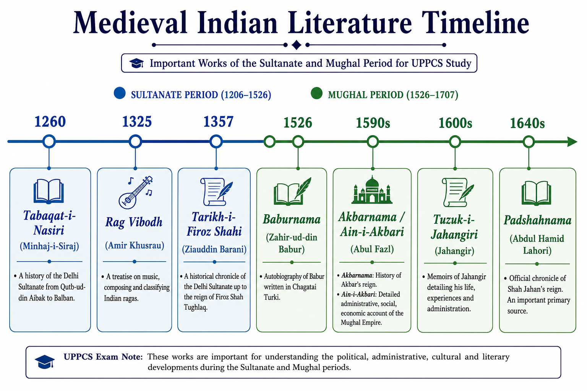

# Topic 5 — Medieval Literature
### ★ Complete Source of Truth — No other book/notes needed for this topic

> **Covers syllabus:** Medieval Literature | Medieval Books and Their Authors | Delhi Sultanate Literature | Sultanate and Mughal Literature | Amir Khusrau | Ziauddin Barani | Tarikh-i-Firoz Shahi | Tabaqat-i-Nasiri | Baburnama | Akbarnama | Ain-i-Akbari | Tuzuk-i-Jahangiri | Padshahnama  
> **Sources baked in:** NCERT *Themes in Indian History Part II*, export notes (Delhi Sultanate II, Cultural Development 1300–1500, Mughal Cultural Developments), UPPCS/UPSC PYQs 2018–2025  
> **Exam weight:** ★★★ High — book↔author NOT matched (2019 Q16), Amir Khusrau↔Rag Vibodh (2019 Q88), Babur Turki memoir (2025 Q3), Abul Fazl chronology (2024 Q132)  
> **Last verified:** July 2026

---

## Syllabus Coverage Map

| # | Syllabus bullet | § Section | What must be inside |
|---|-----------------|-----------|---------------------|
| 1 | Medieval Literature | 5.1 | Persian + Hindavi + regional; court chronicles vs poetry; languages |
| 2 | Medieval Books and Their Authors | 5.2 | Master book↔author table (all syllabus works) |
| 3 | Delhi Sultanate Literature | 5.3 | Minhaj, Barani, Khusrau; Persian historiography |
| 4 | Sultanate and Mughal Literature | 5.4 | Sultanate chronicles → Mughal memoirs & gazetteers |
| 5 | Amir Khusrau | 5.5 | Khamsa, Rag Vibodh, Khaliq-e-Bari; Nizamuddin circle |
| 6 | Ziauddin Barani | 5.6 | Tarikh-i-Firoz Shahi, Tughlaqnama; Jahandari theory |
| 7 | Tarikh-i-Firoz Shahi | 5.7 | Barani; Balban to Firuz; primary Alauddin source |
| 8 | Tabaqat-i-Nasiri | 5.7 | Minhaj-us-Siraj; Ghaznavid to Nasiruddin |
| 9 | Baburnama | 5.8 | Tuzk-e-Babri; Chagatai Turki; memoir classic |
| 10 | Akbarnama | 5.9 | Abul Fazl; narrative history of Akbar |
| 11 | Ain-i-Akbari | 5.9 | Abul Fazl; admin gazetteer — NOT biography |
| 12 | Tuzuk-i-Jahangiri | 5.10 | Jahangir's memoir; Persian; natural history |
| 13 | Padshahnama | 5.11 | Shah Jahan reign; Abdul Hamid Lahori |

---

## How to Use This File

1. **First read:** §5.2 master **book↔author** table → §5.3 Sultanate → §5.4 Mughal transition.
2. **Raata order:** Quick Revision Box → Must-Know Comparisons → Consolidated Reference book table.
3. **UPPCS drill:** **2019 Q16** (Tughlaqnama ≠ Ibn Battuta) and **2019 Q88** (Khusrau = Rag Vibodh) without notes.
4. **Self-test gate:** A/R Babur Turki (2025 Q3) + Abul Fazl death order (2024 Q132).
5. **Revision cycle:** Day 1 = Sultanate authors; Day 2 = Mughal memoirs/gazetteers; Day 3 = 35 Practice questions.

---

## How UPPCS Tests This Topic

| Pattern | What they ask | Your prep focus |
|---------|---------------|-----------------|
| **NOT matched (book↔author)** | Tughlaqnama–Ibn Battuta | §5.6; **UPPCS 2019 Q16 → C** |
| **Match author↔work** | Amir Khusrau–Rag Vibodh | §5.5; **UPPCS 2019 Q88** |
| **A/R language trap** | Babur wrote in Turki; Persian = Mughal court | §5.8; **UPPCS 2025 Q3 → C** |
| **Chronology (Mughal authors)** | Faizi → Mubarak → Abul Fazl → Daniyal | §5.9; **UPPCS 2024 Q132 → B** |
| **Akbarnama vs Ain-i-Akbari** | Biography vs admin gazetteer | §5.9 |
| **Chronicle ↔ period** | Tabaqat-i-Nasiri = early Sultanate | §5.7 |

> **2025 overlap (Q3):** Babur wrote **Tuzk-e-Babri in Chagatai Turki** (A true); Turki was **NOT** official Mughal court language (R false) → **C**.  
> **2024 overlap (Q132):** Faizi (1595) → Sheikh Mubarak (1597) → Abul Fazl murdered (1602) → Daniyal (1604) → **B (3-2-1-4)**.

---

## Quick Revision Box — Raata This First

```
LANGUAGES:
  Sultanate/Mughal court = Persian (official elite)
  Baburnama = Chagatai Turki (NOT Persian — 2025 Q3)
  Hindavi/Hindi = Amir Khusrau, bhakti overlap
  Regional = Awadhi (Tulsidas), Braj (Surdas), Bengali (Chaitanya)

SULTANATE BOOK ↔ AUTHOR (★★★):
  Tabaqat-i-Nasiri — Minhaj-us-Siraj Juzjani
  Tarikh-i-Firoz Shahi — Ziauddin Barani
  Tughlaqnama — Ziauddin Barani (NOT Ibn Battuta — 2019 Q16)
  Taj-ul-Maasir — Hasan Nizami (early Delhi)
  Rag Vibodh — Amir Khusrau (2019 Q88)
  Khamsa, Nuh Sipihr — Amir Khusrau
  Rihla — Ibn Battuta (traveller, NOT Tughlaqnama)

MUghal BOOK ↔ AUTHOR:
  Baburnama (Tuzk-e-Babri) — Babur (Turki)
  Humayunnama — Gulbadan Begum (2019 Q16 pair correct)
  Akbarnama — Abul Fazl (history/biography)
  Ain-i-Akbari — Abul Fazl (admin encyclopaedia)
  Tuzuk-i-Jahangiri — Jahangir (memoir)
  Padshahnama — Abdul Hamid Lahori (Shah Jahan)
  Muntakhab-ut-Tawarikh — Badauni (Akbar critic)

TRAPS:
  Tughlaqnama ≠ Ibn Battuta | Ain-i-Akbari ≠ biography
  Tarikh-i-Firoz Shahi author = Barani (NOT Shams-i-Siraj Alif)
  Amir Khusrau = Sultanate (NOT Akbar court — Tansen was Akbar)
```

### Must-Know Term Comparisons (very frequently asked)

| Term | One-line difference | Hindi |
|------|---------------------|-------|
| **Akbarnama vs Ain-i-Akbari** | Narrative history of Akbar vs administrative/statistical gazetteer — both Abul Fazl | अकबरनामा / आइन-ए-अकबरी |
| **Baburnama vs Akbarnama** | Babur's Turki memoir vs Abul Fazl's Persian Akbar history | बाबरनामा / अकबरनामा |
| **Tarikh vs Tabaqat** | Tarikh = annal/continuous history; Tabaqat = biographical generations ("classes") | तारीख / तबक़ात |
| **Barani vs Ibn Battuta** | Delhi Sultanate historian vs Moroccan traveller (Rihla) | बरनी / इब्न बतूता |
| **Tughlaqnama vs Rihla** | Barani's history of Tughlaqs vs Ibn Battuta's travelogue | तुग़लक़नामा / रिहला |
| **Amir Khusrau vs Tansen** | 13th–14th c. Sultanate poet-musician vs Akbar's dhrupad master | अमीर खुसरो / तानसेन |
| **Tuzuk-i-Jahangiri vs Padshahnama** | Emperor's own memoir vs court historian's Shah Jahan chronicle | तुज़ुक-ए-जहाँगीरी / पादशाहनामा |
| **Persian vs Turki (Mughal)** | Mughal court language vs Babur's mother-tongue memoir only | फ़ारसी / चग़ताई तुर्की |
| **Chronicle vs Masnavi** | Prose history (Barani) vs long poem (Khusrau's Khamsa) | इतिहास ग्रंथ / मसनवी |
| **Humayunnama vs Baburnama** | Gulbadan on Humayun vs Babur's own autobiography | हुमायूंनामा / बाबरनामा |

### Memory Tricks

| Trick | Remembers |
|-------|-----------|
| **M-B-T (Sultanate hist)** | **M**inhaj-Tabaqat, **B**arani-Tarikh/Tughlaqnama, **T**aj-ul-Maasir Hasan Nizami |
| **Barani not Battuta** | 2019 Q16: Tughlaqnama = **Barani** |
| **Khusrau = 4** | 2019 Q88: Amir Khusrau → **Rag Vibodh (4)** |
| **A-F-M-D (2024 Q132)** | **F**aizi → Sheikh **M**ubarak → Abul **F**azl → **D**aniyal = 3-2-1-4 |
| **Turki Babur only** | 2025 Q3: Babur memoir Turki; court = Persian |
| **Ain = Admin** | Ain-i-Akbari = **A**dministration gazetteer |
| **Pad = Shah** | Padshahnama = **Pad**shah Jahan's reign |

---

## Exam Visuals — High-ROI Images

| # | Image | Use when revising |
|---|-------|-------------------|
| 1 | `images/medieval_literature_timeline.png` | Sultanate → Mughal literary chronology |
| 2 | `images/book_author_match_chart.png` | Book↔author drill |




---

## 5.1 Medieval Literature — Overview

### Definitions

| Term | Meaning |
|------|---------|
| **Medieval Indian literature** | Literary production **1206–1707** (Delhi Sultanate through Mughal zenith) — Persian dominant at court; vernacular bhakti/sufi parallel |
| **Persian literature (India)** | Court chronicles, poetry, admin manuals — language of **Sultanate and Mughal elite** |
| **Hindavi** | Early **north Indian vernacular** used by Amir Khusrau — bridge to modern Hindi/Urdu |

### Medieval Literature — How It Works

- **Court patronage drives history:** Sultans and emperors commissioned **chronicles (tarikh)** to legitimise rule — history = political tool.
- **Persian hegemony:** From **Iltutmish to Aurangzeb**, **Persian** was admin and literary lingua franca — Sanskrit continued in temples/Brahman circles.
- **Sultanate phase (1206–1526):** **Minhaj, Barani, Amir Khusrau** — record Delhi kingdoms; mix **history + moral commentary**.
- **Mughal phase (1526–1707):** Shift to **imperial memoirs** (Babur, Jahangir) + **official histories** (Akbarnama, Padshahnama) + **gazetteers** (Ain-i-Akbari).
- **Vernacular explosion:** Parallel **bhakti poetry** (Kabir, Tulsidas, Surdas) — not Persian court lit but exam-linked via **Jayasi's Padmavat**, **Hindavi Khusrau**.
- **Translation movement:** Mughals translated **Mahabharata (Razmnama), Ramayana, Atharva Veda** — Persian kitabkhana projects under **Faizi**.
- **Genre types:** **Tarikh** (annals), **Tabaqat** (generational biographies), **Masnavi** (long poem), **Tazkira** (poet biographies), **Malfuzat** (saint conversations).
- **Women authors:** **Gulbadan Begum** (Humayunnama) — rare female voice in Mughal prose.
- **Source criticality:** Barani's **communal lens** on Alauddin; Badauni's **critical** view of Akbar — read with historian's caution.

> **Exam note:** **Medieval literature ≠ only Persian** — but UPPCS book↔author questions focus heavily on **Persian chronicles and Mughal texts**.

### Exam Facts (raata)

- **Persian** = Sultanate/Mughal court literary language.
- **Sultanate** = chronicles + Sufi poetry.
- **Mughal** = memoirs + gazetteers + illustrated manuscripts.
- **Hindavi** = Khusrau's popular bridge language.
- **Bhakti vernacular** runs parallel (Topic 4 overlap).
- **Translation projects** peak under **Akbar**.
- **Genre:** tarikh, tabaqat, masnavi, malfuzat.
- **Gulbadan** = rare woman historian.
- **Barani/Badauni** = interpret with bias awareness.

### PYQs — Overview

1. **(UPPCS 2019 Q16)** Books NOT matched → **C (Tughlaqnama–Ibn Battuta)**.

2. **(UPPCS 2025 Q3)** Babur Turki memoir A/R → **C**.

### Examples (5.1)

| Phase | Literary hallmark |
|-------|-------------------|
| Delhi Sultanate | Persian tarikh + Khusrau poetry |
| Mughal Akbar | Akbarnama + Ain-i-Akbari + translations |
| Mughal Shah Jahan | Padshahnama |

---

## 5.2 Medieval Books and Their Authors — Master Table

### Definitions

| Term | Meaning |
|------|---------|
| **Medieval Books and Their Authors** | Standard UPPCS matching — one wrong author in a four-option list |
| **Malfuzat** | Compiled discourses of saints (e.g. Fawaid-ul-Fuad — Nizamuddin; Topic 4 overlap) |

### Books and Authors — How It Works

- **UPPCS tests precise pairs** — not "generally Mughal period" but **exact author name spelling** (Minhaj, Barani, Gulbadan).
- **Group 1 — Early Sultanate:** **Hasan Nizami** (*Taj-ul-Maasir*), **Minhaj** (*Tabaqat-i-Nasiri*).
- **Group 2 — Khalji/Tughlaq era:** **Barani** (*Tarikh-i-Firoz Shahi*, *Tughlaqnama*), **Amir Khusrau** (poetry + *Rag Vibodh*).
- **Group 3 — Traveller (not Tughlaqnama author):** **Ibn Battuta** (*Rihla*) — Moroccan at Muhammad bin Tughlaq's court.
- **Group 4 — Mughal memoirs:** **Babur** (*Baburnama/Tuzk-e-Babri*), **Jahangir** (*Tuzuk-i-Jahangiri*), **Gulbadan** (*Humayunnama*).
- **Group 5 — Mughal official history:** **Abul Fazl** (*Akbarnama* + *Ain-i-Akbari*), **Abdul Hamid Lahori** (*Padshahnama*).
- **Group 6 — Critical/contemporary:** **Badauni** (*Muntakhab-ut-Tawarikh* — criticises Akbar's liberal policies).
- **Trap cluster:** Any option pairing **Ibn Battuta with Tughlaqnama** = wrong; **Ain-i-Akbari with Jahangir** = wrong.
- **Cross-topic:** **Kitab-i-Nauras** = Ibrahim Adil Shah II (Deccan — Topic 3); **Ramcharitmanas** = Tulsidas (Topic 4).

> **Exam note:** When two options look wrong (2019 Q16: both B and C wrong), pick the **most frequently tested trap** — **C Tughlaqnama–Ibn Battuta**.

### Complete Book ↔ Author Table (syllabus + PYQ hits)

| Book | Author | Period | Language | Type |
|------|--------|--------|----------|------|
| **Tabaqat-i-Nasiri** | Minhaj-us-Siraj Juzjani | Sultanate | Persian | Tabaqat chronicle |
| **Tarikh-i-Firoz Shahi** | Ziauddin Barani | Sultanate | Persian | Tarikh |
| **Tughlaqnama** | Ziauddin Barani | Sultanate | Persian | Tughlaq history |
| **Taj-ul-Maasir** | Hasan Nizami | Sultanate | Persian | Early Delhi |
| **Rag Vibodh** | Amir Khusrau | Sultanate | Persian/Hindi | Music treatise |
| **Khamsa** | Amir Khusrau | Sultanate | Persian | Five masnavis |
| **Rihla** | Ibn Battuta | Sultanate | Arabic | Travelogue |
| **Baburnama (Tuzk-e-Babri)** | Babur | Mughal | Chagatai Turki | Memoir |
| **Humayunnama** | Gulbadan Begum | Mughal | Persian | Biography |
| **Akbarnama** | Abul Fazl | Mughal | Persian | Official history |
| **Ain-i-Akbari** | Abul Fazl | Mughal | Persian | Admin gazetteer |
| **Tuzuk-i-Jahangiri** | Jahangir | Mughal | Persian | Memoir |
| **Padshahnama** | Abdul Hamid Lahori | Mughal | Persian | Shah Jahan history |
| **Muntakhab-ut-Tawarikh** | Abdul Qadir Badauni | Mughal | Persian | Critical history |

### Exam Facts (raata)

- Master table = **primary revision sheet**.
- **Minhaj** = Tabaqat-i-Nasiri.
- **Barani** = Tarikh + Tughlaqnama.
- **Khusrau** = Rag Vibodh + Khamsa.
- **Ibn Battuta** = Rihla only.
- **Abul Fazl** = Akbarnama + Ain-i-Akbari.
- **Babur** = Turki Baburnama.
- **Lahori** = Padshahnama.
- **Gulbadan** = Humayunnama.

### PYQs — Books & Authors

1. **(UPPCS 2019 Q16)** Full NOT-matched question → **C**.

2. **(UPPCS 2019 Q88)** Khusrau–Rag Vibodh in match list → **A (1-3-2-4)**.

### Examples (5.2)

| Trap pair | Why wrong |
|-----------|-----------|
| Tughlaqnama — Ibn Battuta | Barani wrote Tughlaqnama |
| Ain-i-Akbari — Jahangir | Abul Fazl under Akbar |

---

## 5.3 Delhi Sultanate Literature

### Definitions

| Term | Meaning |
|------|---------|
| **Delhi Sultanate literature** | **Persian** chronicles, Sufi poetry, religious works under **1206–1526** Delhi rulers |
| **Tarikh literature** | Annalistic history — year-by-year or reign-by-reign narrative |
| **Hindavi experiment** | Amir Khusrau's **vernacular poetry** within Persianate court |

### Delhi Sultanate Literature — How It Works

- **Persian as state language:** Turkish/Afghan sultans patronised **Persian** — not Arabic (religious) or Sanskrit (temple) as primary court idiom.
- **Historical purpose:** Chronicles legitimise **new Muslim rulers** in Indian context — link to **Caliph**, cite conquests, judge sultans morally.
- **Minhaj-us-Siraj (Tabaqat-i-Nasiri):** Covers **Ghaznavids to Nasiruddin Mahmud** — among **earliest** Delhi Sultanate sources; completed **1260**.
- **Ziauddin Barani:** **Privileged insider** — writes *Tarikh-i-Firoz Shahi* for **Firuz Shah Tughlaq**; admires **Alauddin Khalji's** efficiency; **communal** interpretations of policies.
- **Amir Khusrau:** Poet + musician at **multiple courts** (Balban, Alauddin, Ghiyasuddin); **Khamsa** (five masnavis), **Nuh Sipihr** (Nine Skies on India), **Khaliq-e-Bari** (Hindavi), **Rag Vibodh**.
- **Hasan Nizami:** *Taj-ul-Maasir* — history of **Qutb-ud-din Aibak to Iltutmish** era.
- **Sufi prose:** *Fawaid-ul-Fuad* (Nizamuddin — compiled by Amir Hasan Sijzi) — bridges literature + religion.
- **Ibn Battuta's Rihla:** Not Sultanate "official history" but **eyewitness** of Tughlaq India — distinct from **Barani's Tughlaqnama**.
- **Sanskrit at Sultanate:** **Firuz Shah** collected Sanskrit books; translations — parallel track to Persian chronicles.

> **Exam note:** Delhi Sultanate literature = **Barani + Minhaj + Khusrau** triangle — highest ROI authors.

### Exam Facts (raata)

- Court language = **Persian**.
- **Minhaj** — earliest major tabaqat chronicle.
- **Barani** — Khalji/Tughlaq insider historian.
- **Khusrau** — poet + musician + Hindavi pioneer.
- **Hasan Nizami** — early Delhi conquests.
- **Ibn Battuta** — traveller, not Tughlaqnama author.
- Sufi **malfuzat** literature grows.
- **Firuz** patronised Sanskrit translation.

### PYQs — Delhi Sultanate Literature

1. **(UPPCS 2019 Q16)** Tughlaqnama trap → **C**.

2. **(UPPCS 2019 Q88)** Sultanate author-work match including Khusrau → **A**.

### Examples (5.3)

| Author | Sultanate role |
|--------|----------------|
| Barani | Alauddin policy source |
| Khusrau | Court poet under Khaljis |

---

## 5.4 Sultanate and Mughal Literature — Transition

### Definitions

| Term | Meaning |
|------|---------|
| **Sultanate and Mughal Literature** | Literary shift from **dynastic chronicles** to **imperial memoirs + gazetteers + translations** |
| **Kitabkhana** | Mughal **manuscript workshop** — illustrated histories |

### Sultanate → Mughal Literature — How It Works

- **Continuity:** Both periods use **Persian** as primary literary language (except Babur's Turki memoir).
- **Break — personal memoir:** **Baburnama** introduces **frank autobiography** — gardens, wine, battles — new genre in Indian Persian tradition.
- **Break — imperial gazetteer:** **Ain-i-Akbari** catalogues **empire as data** — revenue, castes, animals, customs — beyond narrative history.
- **Scale of translation:** Mughal **Akbar/Faizi** projects exceed Sultanate **Firuz Shah** Sanskrit collection — **Razmnama**, **Baburnama Persian translation**.
- **Women's voices:** **Gulbadan Begum** (*Humayunnama*) — Mughal royal women's literature absent in Sultanate chronicles.
- **Critical historiography:** **Badauni** writes secret critique while serving Akbar — Sultanate Barani criticised policies but within single narrative frame.
- **Shah Jahan era:** Return to **formal court chronicle** (*Padshahnama*) after Jahangir's intimate memoir style.
- **Decline phase:** **Aurangzeb** reduced patronage; **Alamgirnama** — later chronicles less creative; regional vernacular rises.
- **Exam boundary:** **Tansen/music** = Topic 6 overlap; **Bhakti poets** = Topic 4 — mention only as parallel vernacular stream.

> **Exam note:** **Babur = Turki** is the key Sultanate→Mughal **language trap** — Mughals did not keep Turki as court language.

### Exam Facts (raata)

- Persian continues under Mughals.
- **Baburnama** = new memoir genre (Turki).
- **Ain-i-Akbari** = new gazetteer genre.
- **Translation peak** under Akbar.
- **Gulbadan** = Mughal women's prose.
- **Badauni** = critical parallel history.
- **Padshahnama** = Shah Jahan formal chronicle.
- Vernacular bhakti runs parallel.

### PYQs — Sultanate & Mughal Transition

1. **(UPPCS 2025 Q3)** Babur Turki vs Persian court → **C**.

2. **(UPPCS 2024 Q132)** Mughal literary circle deaths chronology → **B (3-2-1-4)**.

### Examples (5.4)

| Transition | Example |
|------------|---------|
| Chronicle → Memoir | Barani → Babur |
| Chronicle → Gazetteer | Minhaj → Ain-i-Akbari |

---

## 5.5 Amir Khusrau (1253–1325)

### Definitions

| Term | Meaning |
|------|---------|
| **Amir Khusrau (Amir Khusro)** | **Sultanate poet-musician** — disciple of **Nizamuddin Auliya**; Persian + Hindavi |
| **Khamsa** | **Five masnavis** — Persian long poems (Khusrau's major literary work) |
| **Rag Vibodh** | Khusrau's treatise on **ragas** — 2019 Q88 tested pair |

### Amir Khusrau — How It Works

- **Life:** Born **1253**; served **Balban, Alauddin Khalji, Ghiyasuddin Tughlaq** courts; died **1325** — buried near **Nizamuddin Dargah**, Delhi.
- **Sufi identity:** **Murid of Nizamuddin Auliya** — poetry expresses **divine love**; qawwali/tarana tradition linked to him.
- **Khamsa:** Five masnavis including **Matla-ul-Anwar, Khusrau-o-Shirin** — Persian literary classic modeled on Nizami.
- **Nuh Sipihr (Nine Skies):** Panegyric on **India's climate, languages, culture** — pride in Hindustan within Persian form.
- **Khaliq-e-Bari:** Early **Hindavi** verse — **Khusrau as father of Hindi-Urdu literary synthesis**.
- **Rag Vibodh:** Musicology text — pairs with **2019 Q88** match **D Amir Khusrau – 4 Rag Vibodh**.
- **Historical poems:** **Miftah-ul-Futuh** (Alauddin's conquests), **Tughluq Nama** (poem on Ghiyasuddin — not Barani's prose Tughlaqnama).
- **NOT Mughal:** Khusrau died **200 years before Akbar** — trap: Khusrau = Tansen's contemporary (false).
- **Invention legends:** **Sitar, tabla, qawwali** attributed in folklore — exams may cite "pioneer" without strict archaeology.

> **Exam note:** **2019 Q88** — Amir Khusrau matches **Rag Vibodh (4)**; NOT Padmavati Katha (that's Somnath/other poets in same question).

### Khusrau Works Table

| Work | Type |
|------|------|
| **Khamsa** | Persian masnavi cycle |
| **Nuh Sipihr** | India panegyric |
| **Khaliq-e-Bari** | Hindavi devotional |
| **Rag Vibodh** | Music/raga treatise |
| **Miftah-ul-Futuh** | Historical masnavi |

### Exam Facts (raata)

- **1253–1325**; Delhi Sultanate poet.
- Disciple of **Nizamuddin Auliya**.
- **Khamsa** + **Nuh Sipihr** + **Rag Vibodh**.
- **Khaliq-e-Bari** — Hindavi.
- **NOT Ibn Battuta**; **NOT Barani**.
- **NOT Akbar/Tansen** era.
- 2019 Q88: Khusrau = **Rag Vibodh**.
- Qawwali/tarana association.

### PYQs — Amir Khusrau

1. **(UPPCS 2019 Q88)** Match → Khusrau–Rag Vibodh → **A (1-3-2-4)**.

2. **(UPPCS 2025 Q12 — brief)** Khusrau disciple of **Nizamuddin** — Bhakti-Sufi guru pair overlap.

### Examples (5.5)

| Example | Detail |
|---------|--------|
| Nizamuddin dargah | Khusrau buried nearby |
| Rag Vibodh | 2019 Q88 direct hit |

---

## 5.6 Ziauddin Barani (1285–1357)

### Definitions

| Term | Meaning |
|------|---------|
| **Ziauddin Barani** | **Delhi Sultanate historian** — insider noble; author of **two major tarikhs** |
| **Jahandari** | Barani's concept — Sultanate as **worldly state** balancing Sharia and political realism |
| **Tughlaqnama** | Barani's history of **Tughlaq dynasty** — NOT by Ibn Battuta |

### Ziauddin Barani — How It Works

- **Background:** **Noble family** at Delhi court; close to **Muhammad bin Tughlaq** early reign; disillusioned after failures.
- **Tarikh-i-Firoz Shahi:** Written for **Firuz Shah Tughlaq** — covers **Balban to Firuz**; **primary source** for **Alauddin Khalji's** market reforms and military system.
- **Tughlaqnama:** Dedicated study of **Tughlaqs** — analyses **Muhammad bin Tughlaq's** experiments (token currency, Daulatabad).
- **2019 Q16 trap:** Option **C** pairs **Tughlaqnama – Ibn Battuta** — **Ibn Battuta wrote Rihla** (travel account), visited Tughlaq court **c.1334–1341** but did not author Tughlaqnama.
- **Option B trap:** **Tarikh-i-Firozshahi – Shams-i-Siraj Alif** — wrong author name; correct = **Ziauddin Barani**.
- **Ideology:** **Zawabit** (state laws) can override narrow Sharia — sultan as **worldly ruler (Jahandari)**.
- **Bias:** Hostile to **low-born Khalji rise**; communal tone on Hindus — use critically for exam **facts** not moral judgments.
- **Legacy:** Most important **Delhi Sultanate historian** for UPSC/UPPCS — more tested than Minhaj in "NOT matched" traps.

> **Exam note:** **Barani = Tughlaqnama + Tarikh-i-Firoz Shahi** — memorise as single author two-book pair.

### Exam Facts (raata)

- Author of **Tarikh-i-Firoz Shahi** + **Tughlaqnama**.
- **NOT Ibn Battuta** (2019 Q16).
- **Jahandari** theory of state.
- Primary source on **Alauddin Khalji**.
- Wrote for **Firuz Shah**.
- Noble insider perspective.
- Communal bias — read critically.
- **Shams-i-Siraj Alif** = wrong name trap.

### PYQs — Barani

1. **(UPPCS 2019 Q16)** Tughlaqnama–Ibn Battuta → **C**.

2. **(Statement-based)** Tarikh-i-Firoz Shahi was written by Ziauddin Barani → **True**.

### Examples (5.6)

| Book | Barani content |
|------|----------------|
| Tarikh-i-Firoz Shahi | Alauddin market controls |
| Tughlaqnama | Muhammad bin Tughlaq experiments |

---

## 5.7 Tarikh-i-Firoz Shahi & Tabaqat-i-Nasiri

### Definitions

| Term | Meaning |
|------|---------|
| **Tarikh-i-Firoz Shahi** | Barani's chronicle from **Balban** through early **Firuz Shah** reign |
| **Tabaqat-i-Nasiri** | Minhaj-us-Siraj's **tabaqat** (generational) history to **1260** |

### Tarikh & Tabaqat — How It Works

- **Tabaqat format:** Organises history by **generations/classes (tabaqa)** of rulers and nobles — not pure year annals.
- **Minhaj-us-Siraj Juzjani:** Came from **Ghazni tradition**; served **Nasiruddin Mahmud**; covers **Muizzuddin Muhammad Ghuri to his patron's reign**.
- **Tabaqat-i-Nasiri name:** Named after patron **Sultan Nasiruddin Mahmud** (r.1246–1266).
- **2019 Q16:** **Tabaqat-i-Nasiri – Minhaj-us-Siraj** = **correctly matched** (option A).
- **Tarikh-i-Firoz Shahi scope:** **Balban's** kingship theory, **Alauddin's** reforms, **Tughlaq** troubles, **Firuz's** welfare policies — Barani's eyewitness for later period.
- **Complementary sources:** Minhaj = **earlier Sultanate**; Barani = **mature Sultanate** — together span **1206–~1350**.
- **Language:** Both **Persian** prose — standard for Muslim court historiography in India.
- **Modern value:** Primary evidence for **Delhi Sultanate administration** questions crossing Topics 2 and 5.
- **Trap:** Do not confuse **Tabaqat-i-Nasiri (Minhaj)** with **Tabaqat-i-Akbari (Abul Fazl)** — latter is Mughal (different book).

> **Exam note:** **Minhaj = Tabaqat-i-Nasiri** | **Barani = Tarikh-i-Firoz Shahi** — never swap.

### Comparison Table

| Feature | Tabaqat-i-Nasiri | Tarikh-i-Firoz Shahi |
|---------|------------------|---------------------|
| **Author** | Minhaj-us-Siraj | Ziauddin Barani |
| **Period** | Ghurid → ~1260 | Balban → Firuz Shah |
| **Format** | Tabaqat (classes) | Tarikh (annals) |
| **Patron** | Nasiruddin Mahmud | Firuz Shah Tughlaq |

### Exam Facts (raata)

- **Minhaj** wrote **Tabaqat-i-Nasiri**.
- **Barani** wrote **Tarikh-i-Firoz Shahi**.
- Tabaqat = generational format.
- Tarikh = annal chronicle.
- Minhaj = **earlier** period.
- Barani = **Alauddin** key source.
- Both in **Persian**.
- Don't confuse with **Tabaqat-i-Akbari**.

### PYQs — Tarikh & Tabaqat

1. **(UPPCS 2019 Q16)** Tabaqat-i-Nasiri–Minhaj = correct pair in options → **A is matched** (answer is unmatched **C**).

2. **(UPSC pattern)** Author of Tabaqat-i-Nasiri? → **Minhaj-us-Siraj Juzjani**.

### Examples (5.7)

| Source use | Exam topic |
|------------|------------|
| Barani on Alauddin | Topic 2 admin |
| Minhaj on Ghurids | Topic 2 origins |

---

## 5.8 Baburnama (Tuzk-e-Babri)

### Definitions

| Term | Meaning |
|------|---------|
| **Baburnama (Tuzk-e-Babri / Tuzuk-i-Baburi)** | **Babur's autobiography** — among world's great memoirs |
| **Chagatai Turki** | Babur's **mother tongue** — language of original Baburnama |

### Baburnama — How It Works

- **Author:** **Zahiruddin Muhammad Babur** — founder of Mughal dynasty; wrote candidly about ** battles, gardens, wine, poetry**.
- **Language:** Composed in **Chagatai Turki** — **NOT Persian** originally (2025 Q3 Assertion **true**).
- **2025 Q3 Reason trap:** "**Turki was official language of Mughal Court**" → **False** — **Persian** became Mughal court language; Turki remained Babur's personal literary idiom.
- **Answer 2025 Q3:** **C** — A true, R false.
- **Content:** Covers **Central Asia struggles**, **Panipat 1526**, **Indian observations** ( flora, fauna, Hindustan climate).
- **Later translation:** **Abdur Rahim Khan-i-Khanan** translated into **Persian** — made accessible to Mughal court.
- **Genre significance:** First **intimate royal autobiography** in Indian Muslim tradition — precedes **Jahangir's Tuzuk**.
- **Natural history:** Babur notes **plants, animals** — early scientific observation in Indian context.
- **Trap:** Baburnama ≠ Akbarnama — different author, language, purpose.

> **Exam note:** **Tuzk-e-Babri = Turki** is 2025 direct A/R — do not assume all Mughal books in Persian.

### Exam Facts (raata)

- Author = **Babur**.
- Original language = **Chagatai Turki**.
- Also called **Tuzk-e-Babri**.
- **2025 Q3:** A true, R false → **C**.
- Mughal court language = **Persian** (not Turki).
- Persian translation by **Abdur Rahim**.
- Covers **Panipat**, Central Asia.
- Candid memoir genre pioneer.

### PYQs — Baburnama

1. **(UPPCS 2025 Q3)** A/R Babur Turki → **C**.

2. **(Statement-based)** Baburnama was originally written in Persian → **False**.

### Examples (5.8)

| Fact | Trap |
|------|------|
| Turki original | "All Mughal lit Persian" = false |

---

## 5.9 Akbarnama & Ain-i-Akbari (Abul Fazl)

### Definitions

| Term | Meaning |
|------|---------|
| **Akbarnama** | **Abul Fazl's** official **narrative history** of Akbar's reign (3 volumes) |
| **Ain-i-Akbari** | **Administrative gazetteer** — Book of Akbar's **Institutes/Regulations** |
| **Abul Fazl (1551–1602)** | Akbar's **Navratna**; historian; murdered **1602** |

### Akbarnama & Ain-i-Akbari — How It Works

- **Abul Fazl's role:** Chief ideologue of **Akbar's sulh-i-kul**; brother of **Faizi** (poet laureate); son of **Sheikh Mubarak** (scholar).
- **Akbarnama content:** **Biographical narrative** — Akbar's campaigns, policies, debates; includes **illustrated** manuscript tradition in kitabkhana.
- **Ain-i-Akbari content:** **Five books** — imperial household, army, revenue (**zabt**), provinces, **Indian culture/statistics** — encyclopaedic not narrative.
- **Key distinction:** **Akbarnama = story** | **Ain-i-Akbari = data manual** — UPPCS loves swapping them in options.
- **2024 Q132 chronology:** **Faizi died 1595** → **Sheikh Mubarak 1597** → **Abul Fazl murdered 1602** (on orders linked to **Salim/Jahangir** faction, killer **Bir Singh Bundela**) → **Daniyal 1604** → **B (3-2-1-4)**.
- **Badauni's counter:** *Muntakhab-ut-Tawarikh* — hostile to Abul Fazl's liberal portrayal — written secretly.
- **Illustrations:** **Akbarnama** paintings = high Mughal art (Topic 6/7 overlap brief).
- **Persian prose:** Abul Fazl set **classical Persian style** standard for later Mughal historians.

> **Exam note:** **Ain-i-Akbari ≠ biography** — trap statement in negative questions.

### Akbarnama vs Ain-i-Akbari

| | Akbarnama | Ain-i-Akbari |
|---|-----------|--------------|
| **Type** | Narrative history | Admin encyclopaedia |
| **Focus** | Akbar's life/reign events | Revenue, army, society data |
| **Author** | Abul Fazl | Abul Fazl |
| **Exam trap** | Called "gazetteer" | Called "biography" |

### Exam Facts (raata)

- Both by **Abul Fazl**.
- **Akbarnama** = narrative history.
- **Ain-i-Akbari** = admin gazetteer.
- Abul Fazl murdered **1602**.
- **2024 Q132** order **B (3-2-1-4)**.
- Brother **Faizi** died **1595**.
- Father **Sheikh Mubarak** **1597**.
- **Badauni** = critical counterpart.

### PYQs — Abul Fazl Works

1. **(UPPCS 2024 Q132)** Deaths chronology → **B (3-2-1-4)**.

2. **(Statement-based)** Ain-i-Akbari is the biography of Akbar → **False** — **Akbarnama** is biographical narrative.

### Examples (5.9)

| Work | Wrong label |
|------|-------------|
| Ain-i-Akbari | "Biography" = trap |

---

## 5.10 Tuzuk-i-Jahangiri

### Definitions

| Term | Meaning |
|------|---------|
| **Tuzuk-i-Jahangiri (Jahangirnama)** | **Emperor Jahangir's memoir** — like Baburnama but in **Persian** |
| **Tuzuk** | "Regulations/memoirs" — autobiographical record |

### Tuzuk-i-Jahangiri — How It Works

- **Author:** **Nuruddin Jahangir** himself — personal observations; continued memoir tradition from **Baburnama**.
- **Language:** **Persian** — unlike Babur's Turki; reflects **Mughal court norm** by early 17th c.
- **Content:** **Court life, wine (before oath changes), executions, art patronage, natural history** — famous **zebra, birds, flowers** entries.
- **Natural history value:** Jahangir records **experiments, animal descriptions** — scientific curiosity like Babur but more systematic.
- **Political notes:** Records **Guru Arjan**, **Khurram (Shah Jahan)** rebellion, **Mehr-un-Nissa (Nur Jahan)** influence.
- **Comparison to Baburnama:** Both memoirs; Babur = **Turki + founder**; Jahangir = **Persian + consolidator**.
- **Comparison to Akbarnama:** Jahangir writes **in own voice**; Abul Fazl writes **official third-person history** of Akbar.
- **Later completion:** Parts may have been edited after Jahangir's death — but attributed to him.
- **Exam pairing trap:** **Tuzuk-i-Jahangiri – Jahangir** | **Akbarnama – Abul Fazl** | do not cross-assign.

> **Exam note:** Match questions often group **Tuzk-e-Babri–Babur**, **Tuzuk-i-Jahangiri–Jahangir**, **Akbarnama–Abul Fazl** — learn as triple set.

### Exam Facts (raata)

- Author = **Jahangir** (emperor himself).
- Language = **Persian**.
- Memoir genre like **Baburnama**.
- Rich **natural history** observations.
- Records **Nur Jahan**, **Shah Jahan** revolt.
- **NOT Abul Fazl**'s work.
- **NOT Turki** (unlike Babur).
- Personal voice vs official Akbarnama.

### PYQs — Tuzuk-i-Jahangiri

1. **(UPSC/UPPCS pattern match)** Tuzuk-i-Jahangiri author → **Jahangir**.

2. **(Statement-based)** Jahangir wrote his memoir in Chagatai Turki → **False** — **Persian**.

### Examples (5.10)

| Memoir | Language |
|--------|----------|
| Baburnama | Turki |
| Tuzuk-i-Jahangiri | Persian |

---

## 5.11 Padshahnama

### Definitions

| Term | Meaning |
|------|---------|
| **Padshahnama** | Official **history of Shah Jahan's reign** — imperial chronicle |
| **Abdul Hamid Lahori** | Primary author of **Padshahnama** (first two volumes) |

### Padshahnama — How It Works

- **Commission:** **Shah Jahan** ordered official history like **Akbarnama** for Akbar — restore grand **court chronicle** after Jahangir's personal memoir style.
- **Author:** **Abdul Hamid Lahori** completed **Vol I–II** covering **1627–1648** approx.; **Inayat Khan** added later portion.
- **Language:** **Persian** — standard Mughal literary medium.
- **Content:** **Shah Jahan's accession**, **Deccan campaigns**, **Taj Mahal construction context**, **court ceremonies**, **Dara Shukoh vs Aurangzeb** early tensions.
- **Art link:** **Padshahnama illustrations** — major Mughal painting commission (brief — Topic 6/7).
- **Genre:** **Official third-person panegyric** — less candid than Jahangir's Tuzuk or Babur's memoir.
- **Comparison table trap:** Padshahnama–**Lahori** | Akbarnama–**Abul Fazl** | Tuzuk–**Jahangir himself**.
- **Shah Jahan period peak:** Literature + architecture together — **imperial self-display**.
- **After Shah Jahan:** **Alamgirnama** (Aurangzeb) — less literary fame; Mughal chronicle tradition declines.

> **Exam note:** **Padshahnama = Shah Jahan**, not Akbar or Jahangir — negative matching favourite.

### Exam Facts (raata)

- Official **Shah Jahan** chronicle.
- Primary author **Abdul Hamid Lahori**.
- **Inayat Khan** continued.
- Language = **Persian**.
- Genre = **panegyric court history**.
- Illustrated manuscript tradition.
- **NOT Jahangir's** Tuzuk.
- **NOT Abul Fazl's** Akbarnama.

### PYQs — Padshahnama

1. **(Match pattern)** Padshahnama author → **Abdul Hamid Lahori** (not Jahangir, not Babur).

2. **(Statement-based)** Padshahnama is Shah Jahan's official history → **True**.

### Examples (5.11)

| Book | Emperor |
|------|---------|
| Padshahnama | Shah Jahan |
| Akbarnama | Akbar |

---

## Consolidated Reference

### Master Book ↔ Author (raata all)

| Book | Author |
|------|--------|
| Tabaqat-i-Nasiri | Minhaj-us-Siraj Juzjani |
| Tarikh-i-Firoz Shahi | Ziauddin Barani |
| Tughlaqnama | Ziauddin Barani |
| Taj-ul-Maasir | Hasan Nizami |
| Rag Vibodh / Khamsa | Amir Khusrau |
| Rihla | Ibn Battuta |
| Baburnama | Babur (Turki) |
| Humayunnama | Gulbadan Begum |
| Akbarnama | Abul Fazl |
| Ain-i-Akbari | Abul Fazl |
| Tuzuk-i-Jahangiri | Jahangir |
| Padshahnama | Abdul Hamid Lahori |
| Muntakhab-ut-Tawarikh | Badauni |

### Mughal Literary Deaths Chronology (2024 Q132)

| Order | Event | Year |
|-------|-------|------|
| 1 | Death of **Faizi** | 1595 |
| 2 | Death of **Sheikh Mubarak** (Abul Fazl's father) | 1597 |
| 3 | Murder of **Abul Fazl** | 1602 |
| 4 | Death of **Daniyal** (Akbar's son) | 1604 |

Code: **3-2-1-4 = B**

### 2019 Q88 Full Match Key

| List-I | List-II |
|--------|---------|
| Mulla Daud | Chandayan (1) |
| Damodar Kavi | Padmavati Katha (3) |
| Somnath | Ashiqa (2) |
| Amir Khusrau | Rag Vibodh (4) |

Code: **A (1-3-2-4)**

### UP Focus — Medieval Literature

| Element | UPPCS relevance |
|---------|-----------------|
| **Amir Khusrau** | Delhi Sultanate; Nizamuddin dargah; Hindavi pioneer — NCR/UP belt |
| **Barani** | Source on Alauddin policies affecting **Gangetic cities** |
| **Malik Muhammad Jaisi** | **Padmavat** — Awadh/UP literary association (exam match questions) |
| **Tulsidas / Ramcharitmanas** | Awadhi UP — vernacular parallel (Topic 4 brief) |
| **Kabir / Kashi** | Vernacular not Persian court — boundary with Topic 4 |
| **Firuz Shah translations** | Sanskrit texts from **Nagarkot** etc. — north Indian patronage |

---

## Practice Zone — 35 Questions

**Q1.** Which of the following is **NOT** correctly matched?

Options: A. Tabaqat-i-Nasiri — Minhaj-us-Siraj | B. Tarikh-i-Firoz Shahi — Ziauddin Barani | C. Tughlaqnama — Ibn Battuta | D. Humayunnama — Gulbadan Begum

<details><summary>Show answer</summary>**Ans: C** — 2019 Q16.</details>

**Q2.** Match List-I / List-II (2019 Q88 pattern):

List-I: A. Mulla Daud | B. Damodar Kavi | C. Somnath | D. Amir Khusrau  
List-II: 1. Chandayan | 2. Ashiqa | 3. Padmavati Katha | 4. Rag Vibodh

Options: A. 1-3-2-4 | B. 1-3-4-2 | C. 2-4-1-3 | D. 1-2-3-4

<details><summary>Show answer</summary>**Ans: A (1-3-2-4)**</details>

**Q3.** Assertion (A): Babur wrote Tuzk-e-Babri in Chagatai Turki. Reason (R): Turki was the official language of the Mughal Court.

Options: A. Both true; R not explanation | B. A false; R true | C. A true; R false | D. Both true; R explains A

<details><summary>Show answer</summary>**Ans: C** — 2025 Q3.</details>

**Q4.** Arrange chronologically: Murder of Abul Fazl (1), Death of Sheikh Mubarak (2), Death of Faizi (3), Death of Daniyal (4)

Options: A. 2-1-4-3 | B. 3-2-1-4 | C. 2-3-1-4 | D. 2-4-3-1

<details><summary>Show answer</summary>**Ans: B (3-2-1-4)** — 2024 Q132.</details>

**Q5.** Consider the following:

1. Akbarnama is a narrative history of Akbar.
2. Ain-i-Akbari is an administrative gazetteer by Abul Fazl.

Options: A. Only 1 | B. Only 2 | C. Both 1 and 2 | D. Neither 1 nor 2

<details><summary>Show answer</summary>**Ans: C**</details>

**Q6.** With reference to **Amir Khusrau's works**:

1. He wrote Rag Vibodh.
2. He wrote the prose chronicle Tughlaqnama identical to Barani's.

Options: A. Only 1 | B. Only 2 | C. Both 1 and 2 | D. Neither 1 nor 2

<details><summary>Show answer</summary>**Ans: A** — Tughlaqnama prose = **Barani**.</details>

**Q7.** **Tughlaqnama** was authored by:

Options: A. Ibn Battuta | B. Minhaj-us-Siraj | C. Ziauddin Barani | D. Hasan Nizami

<details><summary>Show answer</summary>**Ans: C**</details>

**Q8.** Consider **Mughal memoirs**:

1. Baburnama was originally written in Chagatai Turki.
2. Tuzuk-i-Jahangiri was written by Abul Fazl in Persian.

Options: A. Only 1 | B. Only 2 | C. Both 1 and 2 | D. Neither 1 nor 2

<details><summary>Show answer</summary>**Ans: A** — Tuzuk = **Jahangir's** memoir.</details>

**Q9.** **Tabaqat-i-Nasiri** is associated with:

Options: A. Abul Fazl | B. Minhaj-us-Siraj Juzjani | C. Abdul Hamid Lahori | D. Gulbadan Begum

<details><summary>Show answer</summary>**Ans: B**</details>

**Q10.** **Padshahnama** is the official history of:

Options: A. Akbar | B. Jahangir | C. Shah Jahan | D. Aurangzeb

<details><summary>Show answer</summary>**Ans: C**</details>

**Q11.** Match book — author:

List-I: A. Akbarnama | B. Baburnama | C. Padshahnama | D. Tuzuk-i-Jahangiri  
List-II: 1. Jahangir | 2. Abul Fazl | 3. Babur | 4. Abdul Hamid Lahori

Options: A. A-2, B-3, C-4, D-1 | B. A-4, B-2, C-1, D-3 | C. A-2, B-1, C-4, D-3 | D. A-3, B-2, C-4, D-1

<details><summary>Show answer</summary>**Ans: A**</details>

**Q12.** Consider **Ibn Battuta**:

1. He wrote Rihla based on his travels in India.
2. He authored Tughlaqnama on the Tughlaq dynasty.

Options: A. Only 1 | B. Only 2 | C. Both 1 and 2 | D. Neither 1 nor 2

<details><summary>Show answer</summary>**Ans: A** — 2019 Q16 core trap.</details>

**Q13.** Consider **Amir Khusrau**:

1. He was a disciple of Nizamuddin Auliya.
2. He wrote Tughlaqnama prose chronicle identical to Barani's.

Options: A. Only 1 | B. Only 2 | C. Both 1 and 2 | D. Neither 1 nor 2

<details><summary>Show answer</summary>**Ans: A** — Barani wrote prose **Tughlaqnama**; Khusrau wrote **Tughluq Nama** poem (distinct) — statement 2 as stated is false.</details>

**Q14.** **Humayunnama** was written by:

Options: A. Babur | B. Gulbadan Begum | C. Jahangir | D. Badauni

<details><summary>Show answer</summary>**Ans: B**</details>

**Q15.** Which pair is **correctly** matched?

Options: A. Ain-i-Akbari — Jahangir | B. Muntakhab-ut-Tawarikh — Badauni | C. Rag Vibodh — Barani | D. Khamsa — Ibn Battuta

<details><summary>Show answer</summary>**Ans: B**</details>

**Q16.** **Tarikh-i-Firoz Shahi** covers primarily:

Options: A. Akbar's reign | B. Balban to Firuz Shah period | C. Shah Jahan's reign | D. Ghaznavid India only

<details><summary>Show answer</summary>**Ans: B**</details>

**Q17.** Assertion (A): Persian was the dominant court literary language under the Mughals. Reason (R): Babur wrote his memoir in Persian.

Options: A. Both true; R explains A | B. Both true; R not explanation | C. A true; R false | D. A false; R true

<details><summary>Show answer</summary>**Ans: C** — Babur used **Turki**.</details>

**Q18.** **Abdul Hamid Lahori** is associated with:

Options: A. Akbarnama | B. Padshahnama | C. Baburnama | D. Tabaqat-i-Nasiri

<details><summary>Show answer</summary>**Ans: B**</details>

**Q19.** Consider chronology of authorship:

1. Tabaqat-i-Nasiri
2. Tarikh-i-Firoz Shahi
3. Baburnama
4. Akbarnama

Options: A. 1-2-3-4 | B. 2-1-3-4 | C. 1-3-2-4 | D. 3-1-2-4

<details><summary>Show answer</summary>**Ans: A**</details>

**Q20.** Consider the following **literary pairs**:

1. Khamsa — Amir Khusrau.
2. Khamsa — Tansen.

Options: A. Only 1 | B. Only 2 | C. Both 1 and 2 | D. Neither 1 nor 2

<details><summary>Show answer</summary>**Ans: A** — Khamsa = **Khusrau**, not Tansen.</details>

**Q21.** Which is **NOT** correctly matched?

Options: A. Minhaj — Tabaqat-i-Nasiri | B. Barani — Tughlaqnama | C. Khusrau — Rag Vibodh | D. Battuta — Akbarnama

<details><summary>Show answer</summary>**Ans: D**</details>

**Q22.** **Muntakhab-ut-Tawarikh** is a critical history of Akbar's reign by:

Options: A. Abul Fazl | B. Badauni | C. Faizi | D. Lahori

<details><summary>Show answer</summary>**Ans: B**</details>

**Q23.** Consider **Delhi Sultanate vs Mughal** literature:

1. Both used Persian as a major literary language.
2. Both relied exclusively on Sanskrit chronicles.

Options: A. Only 1 | B. Only 2 | C. Both 1 and 2 | D. Neither 1 nor 2

<details><summary>Show answer</summary>**Ans: A**</details>

**Q24.** **Taj-ul-Maasir** is linked to:

Options: A. Hasan Nizami | B. Barani | C. Minhaj | D. Khusrau

<details><summary>Show answer</summary>**Ans: A**</details>

**Q25.** A/R: Abul Fazl authored both Akbarnama and Ain-i-Akbari. Reason (R): Ain-i-Akbari is the narrative biography while Akbarnama lists revenue statistics.

Options: A. Both true; R explains A | B. Both true; R not explanation | C. A true; R false | D. A false; R true

<details><summary>Show answer</summary>**Ans: C** — R reverses the two books.</details>

**Q26.** **Gulbadan Begum** was:

Options: A. Daughter of Babur; author of Humayunnama | B. Wife of Akbar; author of Akbarnama | C. Daughter of Jahangir; author of Tuzuk | D. Sister of Aurangzeb; author of Padshahnama

<details><summary>Show answer</summary>**Ans: A**</details>

**Q27.** Match philosopher/historian — work type:

List-I: A. Barani | B. Abul Fazl (Ain-i-Akbari) | C. Babur  
List-II: 1. Turki memoir | 2. Admin gazetteer | 3. Sultanate tarikh

Options: A. A-3, B-2, C-1 | B. A-2, B-3, C-1 | C. A-1, B-2, C-3 | D. A-3, B-1, C-2

<details><summary>Show answer</summary>**Ans: A**</details>

**Q28.** **Faizi** died in:

Options: A. 1595 | B. 1602 | C. 1627 | D. 1658

<details><summary>Show answer</summary>**Ans: A** — first in 2024 Q132 sequence.</details>

**Q29.** Consider **2019 Q16 traps**:

1. Tarikh-i-Firozshahi — Shams-i-Siraj Alif is a wrong author name.
2. Tughlaqnama — Ibn Battuta is a wrong author.

Options: A. Only 1 | B. Only 2 | C. Both 1 and 2 | D. Neither 1 nor 2

<details><summary>Show answer</summary>**Ans: C** — official answer picks **C** as THE not-matched option.</details>

**Q30.** Consider **Jahangir's literary contribution**:

1. He wrote Tuzuk-i-Jahangiri.
2. He wrote Padshahnama on his own reign.

Options: A. Only 1 | B. Only 2 | C. Both 1 and 2 | D. Neither 1 nor 2

<details><summary>Show answer</summary>**Ans: A** — Padshahnama = **Lahori** on **Shah Jahan**.</details>

**Q31.** Which language was used for the **original** Baburnama?

Options: A. Persian | B. Arabic | C. Chagatai Turki | D. Hindavi

<details><summary>Show answer</summary>**Ans: C**</details>

**Q32.** **Amir Khusrau** served the court of:

Options: A. Akbar | B. Alauddin Khalji among others | C. Shah Jahan only | D. Aurangzeb

<details><summary>Show answer</summary>**Ans: B**</details>

**Q33.** Consider **Padshahnama vs Tuzuk-i-Jahangiri**:

1. Padshahnama is an official chronicle of Shah Jahan.
2. Tuzuk-i-Jahangiri is Jahangir's personal memoir.

Options: A. Only 1 | B. Only 2 | C. Both 1 and 2 | D. Neither 1 nor 2

<details><summary>Show answer</summary>**Ans: C**</details>

**Q34.** **Minhaj-us-Siraj** is the author of:

Options: A. Tarikh-i-Firoz Shahi | B. Tabaqat-i-Nasiri | C. Baburnama | D. Rag Vibodh

<details><summary>Show answer</summary>**Ans: B**</details>

**Q35.** Which statement is **false**?

Options: A. Abul Fazl wrote Akbarnama | B. Barani wrote Tughlaqnama | C. Ibn Battuta wrote Tughlaqnama | D. Jahangir wrote Tuzuk-i-Jahangiri

<details><summary>Show answer</summary>**Ans: C**</details>

---

## Complete PYQ Bank (Topic 5)

> **Answers hidden** — click *Show answer* under each question to reveal.

**Q1. UPPCS Prelims 2019, Q16**

Which of the following is NOT correctly matched? (Books) (Writers)

Options: A. Tabaqat-i-Nasiri — Minhaj-us-Siraj-Juzjani | B. Tarikh-i-Firozshahi — Shams-i-Siruj-Alif | C. Tughlaqnama — Ibn Battuta | D. Humayunnama — Gulbadan Begum

<details><summary>Show answer</summary>

**Ans: C** — **Tughlaqnama** was written by **Ziauddin Barani**; Ibn Battuta wrote **Rihla** (travelogue).

</details>

**Q2. UPPCS Prelims 2019, Q88**

Match List-I / List-II: A. Mulla Daud | B. Damodar Kavi | C. Somnath | D. Amir Khusro — 1. Chandayan | 2. Ashiqa | 3. Padmavati Katha | 4. Rag Vibodh

Options: A. 1-3-2-4 | B. 1-3-4-2 | C. 2-4-1-3 | D. 1-2-3-4

<details><summary>Show answer</summary>

**Ans: A (1-3-2-4)** — Amir Khusrau = **Rag Vibodh (4)**.

</details>

**Q3. UPPCS Prelims 2024, Q132**

Arrange chronologically: 1. Murder of Abul Fazl | 2. Death of Sheikh Mubarak | 3. Death of Faizi | 4. Death of Daniyal

Options: A. 2-1-4-3 | B. 3-2-1-4 | C. 2-3-1-4 | D. 2-4-3-1

<details><summary>Show answer</summary>

**Ans: B (3-2-1-4)** — Faizi (1595) → Sheikh Mubarak (1597) → Abul Fazl (1602) → Daniyal (1604).

</details>

**Q4. UPPCS Prelims 2025, Q3**

Assertion (A): Babur wrote Tuzk-e-Babri in Chagatai Turki. Reason (R): Turki was the official language of the Mughal Court.

Options: A. Both true; R not explanation | B. A false; R true | C. A true; R false | D. Both true; R explains A

<details><summary>Show answer</summary>

**Ans: C** — Babur's memoir is Turki; **Persian** was Mughal court language, not Turki.

</details>

**Q5. UPPCS Prelims 2025, Q12 (Khusrau overlap — literature context)**

Match Disciple / Guru: A. Amir Khusrau — ? (Options include Nizamuddin Auliya as 3)

<details><summary>Show answer</summary>

**Ans: C (2-3-4-1)** full match — **Amir Khusrau → Nizamuddin Auliya (3)** — links Sultanate literature to Chishti Sufi circle.

</details>

**Q6. UPPCS Prelims 2022, Q43 (translation literature — borderline)**

Who translated *Suka Saptati* into Persian as *Tutinama*?

Options: A. Khwaja Ziya-ud-din Nakhshabi | B. Abdur Razzak | C. Shihabuddin-al-Umari | D. Amir Khusro

<details><summary>Show answer</summary>

**Ans: A** — **NOT Amir Khusrau** — common trap in translation author questions.

</details>

---

## Common Traps — Don't Fall For These

1. **Tughlaqnama — Ibn Battuta** — **FALSE** (2019 Q16); author = **Barani**.
2. **Tarikh-i-Firoz Shahi — Shams-i-Siraj Alif** — **FALSE**; author = **Barani**.
3. **Baburnama in Persian originally** — **FALSE** — **Chagatai Turki** (2025 Q3).
4. **Turki = Mughal court language** — **FALSE** — **Persian** was court language (2025 Q3 Reason).
5. **Ain-i-Akbari = biography** — **FALSE** — **Akbarnama** is narrative; Ain = **admin gazetteer**.
6. **Akbarnama — Jahangir** — **FALSE** — **Abul Fazl** under Akbar.
7. **Tuzuk-i-Jahangiri — Abul Fazl** — **FALSE** — **Jahangir** himself.
8. **Padshahnama — Akbar/Jahangir** — **FALSE** — **Shah Jahan**; author **Lahori**.
9. **Rag Vibodh — Barani/Somnath** — **FALSE** — **Amir Khusrau** (2019 Q88).
10. **Amir Khusrau = Akbar/Tansen court** — **FALSE** — **13th–14th c. Sultanate** poet.
11. **Ibn Battuta = historian of Tughlaqs** — **FALSE** — **eyewitness traveller** (Rihla) only.
12. **Tabaqat-i-Nasiri — Barani** — **FALSE** — **Minhaj-us-Siraj**.
13. **Humayunnama — Babur** — **FALSE** — **Gulbadan Begum** (2019 Q16 D is correctly matched).
14. **2024 Q132 order** — not 2-1-4-3; correct **3-2-1-4 (B)**.
15. **Tutinama translator — Amir Khusrau** — **FALSE** (2022 Q43) — **Nakhshabi**.
