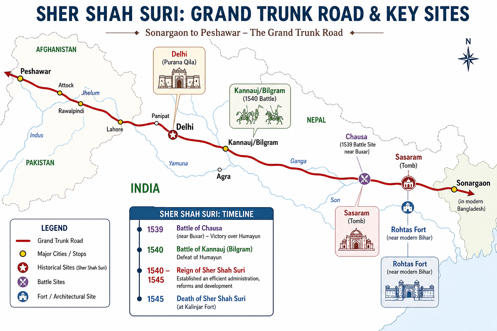

# Topic 8 — Sher Shah Suri
### ★ Complete Source of Truth — No other book/notes needed for this topic

> **Covers syllabus:** Sher Shah Suri | Administration | Revenue Reforms | Road System | Currency Reforms | Military Reforms  
> **Sources baked in:** NCERT *Themes in Indian History Part II*, RS Sharma *Medieval India*, export notes (Struggle for Empire I–II, Government Economy & Society), UPPCS/UPSC PYQs 2018–2025  
> **Exam weight:** ★★★ High — Chausa/Kannauj chronology, Dam–Rupiya–Mohur match, Jarib/Desai traps, Sasaram tomb order, Jayata–Kumpa (Marwar), Akbar currency A/R  
> **Last verified:** July 2026

---

## Quick Revision Box — Raata This First

```
SHER SHAH IDENTITY:
  Farid Khan → Sher Khan (tiger kill) → Sher Shah Suri (Padshah 1540)
  Born Sasaram (Bihar) | Father Hasan Khan Sur | Afghan (Sur) lineage
  Rule: 1540–1545 (only ~5 years) | Died May 1545 Kalinjar siege (gunpowder)

RISE & BATTLES (★★★):
  Served Bahar Khan Lohani (Bihar) → Bengal conquest → vs Humayun
  Chausa 26 June 1539 — Humayun escaped Ganga | Kannauj/Bilgram 17 May 1540 — decisive
  2025 Q79 code: Chausa(4) → Kannauj(2) → Dharmat(3) → Samugarh(1) = C (4-2-3-1)

ADMIN FRAME:
  Sarkar (province) → Pargana (sub-district) | Shiqdar (law/order) + Munshif (accounts)
  Diwan-i-Wazarat (finance) | Diwan-i-Ariz (army) | Diwan-i-Risalat (religion/foreign)
  Espionage system | Strict accountability | Todar Mal learned here → Akbar's zabt

REVENUE (★★★):
  Jarib = measuring rope (NOT tax — 2019 Q87 trap)
  Land → good/medium/bad | Rai = crop rate per bigha | Zabt = measured cash demand
  Patta (state record to peasant) + Qabuliat (peasant acceptance)
  Desai = revenue collector (2019 Q87 B correct)

ROADS & SARAI:
  Grand Trunk Road: Sonargaon (Bengal) → Peshawar (NW frontier)
  Through Delhi, Kannauj, Agra corridor | Sarais every ~12 kos (~20 miles)
  Purana Qila Delhi fortifications | Rohtas Fort (Bihar) — military road link

CURRENCY (★★★):
  Rupiya (silver, 178 grains) | Dam (copper, 1/40 rupiya) | Mohur (gold)
  Standardized weights — model for Akbar (2019 Q12 A/R = A: both true, R explains)
  2019 Q87: Dam=copper ✓ | Desai=revenue ✓ | Jarib=tax ✗ | Diwan=provincial revenue chief ✗

MILITARY & RAJPUT EPISODE:
  Organised infantry + cavalry + elephants | Shiqdar military role | Rohtas Fort
  Battle of Sammel/Giri-Sumel 1544 vs Rao Maldeo (Marwar)
  Jaita (Jayata) & Kumpa — Rathore generals — impressed Sher Shah
  Quote: "Empire of Hindustan for a handful of millets/bajra"

ARCHITECTURE & TOMB:
  Tomb Sasaram (1545) — Indo-Islamic, lake setting | Purana Qila Delhi | Rohtas Fort
  2019 Q91 monuments: Atala Jaunpur → Sher Shah tomb → Humayun → Rabia = IV, II, III, I = B

SUCCESSORS:
  Islam Shah (Jalal Khan) 1545–1553 | Sur dynasty ends → Humayun returns 1555
```

### Must-Know Term Comparisons (very frequently asked)

| Term | One-line difference | Hindi |
|------|---------------------|-------|
| **Farid Khan vs Sher Shah Suri** | **Farid Khan** = birth name; **Sher Shah Suri** = imperial title after Delhi takeover **1540** | फरीद खान / शेर शाह सूरी |
| **Sher Khan vs Sher Shah** | **Sher Khan** = title after killing tiger (Bihar service); **Sher Shah** = Padshah after defeating Humayun | शेर खान / शेर शाह |
| **Chausa vs Kannauj** | **Chausa 1539** — Humayun defeated but **escaped**; **Kannauj 1540** — **decisive** loss, Humayun exiled | चौसा / कन्नौज |
| **Bilgram vs Kannauj** | **Same battle (1540)** — fought near **Bilgram**, traditionally called **Battle of Kannauj** | बिलग्राम / कन्नौज |
| **Jarib vs Rai** | **Jarib** = **measuring rope**; **Rai** = **crop-rate** fixed per measured bigha | जरीब / रै |
| **Patta vs Qabuliat** | **Patta** = state document showing peasant's assessed land; **Qabuliat** = peasant's **written acceptance** of demand | पट्टा / क़बूलियत |
| **Zabt (Sher Shah) vs Zabt (Akbar)** | Both = **measurement-based** assessment; Sher Shah **pioneered**; Akbar **Todar Mal** scaled empire-wide | ज़ब्त (सूरी) / ज़ब्त (अकबर) |
| **Dam vs Rupiya vs Mohur** | **Dam** = copper (smallest); **Rupiya** = silver (standard unit); **Mohur** = gold (highest) | दाम / रुपया / मोहर |
| **Desai vs Amil vs Munshif** | **Desai** = **revenue collector** (regional term); **Amil** = revenue officer at **sarkar/pargana**; **Munshif** = **accountant/auditor** | देसाई / आमिल / मुंशिफ |
| **Shiqdar vs Shiqdar-i-Shiqdaran** | **Shiqdar** = pargana **law & order**; **Shiqdar-i-Shiqdaran** = **head** over all shiqdars in a **sarkar** | शिकदार / शिकदार-ए-शिकदारां |
| **Sarais vs Kos-minar** | **Sarais** = **rest houses** on GT Road (Sher Shah); **kos-minars** = **mile markers** (also attributed to his road system) | सराय / कोस-मीनार |
| **Rohtas Fort vs Purana Qila** | **Rohtas** = hill fort **Bihar** (1540s, vs Humayun); **Purana Qila** = **Delhi** citadel rebuilt by Sher Shah | रोहतास / पुराना किला |
| **Sher Shah vs Islam Shah** | **Sher Shah** 1540–1545 founder; **Islam Shah** (Jalal Khan) son **1545–1553** — weaker successor | शेर शाह / इस्लाम शाह |
| **Sasaram vs Kalinjar** | **Sasaram** = birthplace + **tomb**; **Kalinjar** = fort where Sher Shah **died 1545** during siege | सासाराम / कालिंजर |
| **Marwar vs Mewar (Jayata–Kumpa)** | **Marwar** = Jodhpur/Rathore kingdom of **Rao Maldeo** — home of **Jaita & Kumpa** (2022 Q95) | मारवाड़ / मेवाड़ |
| **Sher Shah interlude vs Mughal restoration** | Sher Shah ruled **1540–1545**; Sur successors till **1553**; Humayun **returns 1555** — not continuous Sur rule till 1555 | सूरी अंतराल / मुगल पुनर्स्थापना |

### Memory Tricks

| Trick | Remembers |
|-------|-----------|
| **CK 39-40** | **C**hausa then **K**annauj — CK Humayun out (1539–40) |
| **5-year wonder** | Sher Shah = **5 years** (1540–45) but permanent reforms |
| **Dam A/R 2019** | **A**kbar **D**am — both true, R explains → **2019 Q12 = A** |
| **Jarib = rope NOT tax** | **J**arib = **J**ute/rope measure — **2019 Q87 D** is the NOT-matched trap |
| **178 silver** | **Rupiya = 178 grains** silver — standard coin |
| **GT Road SE→NW** | **S**onargaon → **P**eshawar — **SP** = Sher Path |
| **Tomb order 2019 Q91** | **A**tala (oldest) → **S**her Shah → **H**umayun → **R**abia = **A-S-H-R** → code **IV, II, III, I = B** |
| **2025 Q79 battles** | Items 4-2-3-1 → option **C** |
| **Jaita-Kumpa Marwar** | **J**aita **K**umpa fought for **M**aldeo **M**arwar — **JK-MM** |
| **Bajra quote** | Sher Shah lost empire-worth for **bajra/millets** — Sammel 1544 valour |

---

## Exam Visuals — High-ROI Images

> **Type priority:** GT Road map → battle/reform chronology. Images stored locally (`images/`) for offline revision.

### 1. Sher Shah — Grand Trunk Road & Key Sites Map



*Raata **GT Road axis** (Sonargaon→Delhi→Kannauj→Peshawar) + **Chausa 1539** + **Kannauj 1540** + **Sasaram tomb** + **Rohtas Fort**. UPPCS loves **chronology** (2025 Q79) and **monument order** (2019 Q91).*
*Source: Study map — generated for UPPCS Sher Shah site matching*

---

## 8.1 Sher Shah Suri — Life, Rise, Reign & Legacy

### Definitions (learn all — exams pick different ones)

| Source | Definition |
|--------|------------|
| **General** | **Sher Shah Suri** (born **Farid Khan**, c. **1472**, **Sasaram**) — Afghan **Sur** chief who seized Delhi (**1540**) and ruled till **1545**; architect of measured revenue, roads, and standardized coinage |
| **NCERT** | Short-lived but **centralised** North Indian state between early Mughal rule of Humayun and Humayun's restoration; reforms **adopted by Akbar** |
| **Exam** | **Sur dynasty interregnum 1540–1553** (Sher Shah + Islam Shah + weak Sur successors) — Humayun returns **1555** |

### Sher Shah Suri — How It Works

- **Origins:** **Farid Khan**, son of **Hasan Khan Sur** (jagirdar of Sasaram); early service under **Bahar Khan Lohani**, governor of **Bihar** — proved administrative and military ability.
- **Sher Khan title:** Legend — killed a **tiger** alone; Bahar Khan gave title **Sher Khan** ("Tiger Lord") — prefigured **Sher Shah**.
- **Bihar–Bengal rise:** After Bahar Khan's death, consolidated **Bihar**; defeated Bengal ruler **Mahmud Shah** — controlled rich eastern revenue base before challenging Mughals.
- **Humayun phase:** Initially cooperated with **Humayun** against Bengal; later turned rival as Sur power grew — classic **shift from ally to imperial contender**.
- **Battle of Chausa (26 June 1539):** On **Ganga** (near Buxar); **Humayun defeated** — escaped by swimming across river on inflated **water skin** — Mughal prestige shattered but not yet destroyed.
- **Battle of Kannauj / Bilgram (17 May 1540):** **Decisive** — Humayun routed; lost empire; fled to **Sind**, then **Marwar**, finally **Safavid Persia** (Kandahar ceded for aid).
- **Imperial title:** Took **Delhi**; assumed title **Sher Shah Suri** — founded **Sur dynasty** rule over Gangetic heartland.
- **Reign 1540–1545:** Only **~5 years** — yet reorganised **administration, revenue, army, roads, currency** — "short rule, long legacy."
- **Death at Kalinjar (May 1545):** During siege of **Kalinjar fort** (Bundelkhand); killed by **gunpowder explosion** in accidental blast — not battle wound.
- **Tomb at Sasaram:** Mausoleum in **Sasaram, Bihar** — lake setting; fine **Indo-Islamic** architecture — **2019 Q91** chronology anchor (~1545).
- **Famous quote context:** After **Sammel (1544)** against **Rao Maldeo** — praised **Jaita & Kumpa** — said he nearly lost **"empire of Hindustan for a handful of millets/bajra."**
- **Successor:** **Islam Shah** (**Jalal Khan**, r. **1545–1553**) — maintained some reforms; Sur decline → **Humayun restored 1555**.

> **Exam note:** **Chausa vs Kannauj** — two-step destruction of Humayun: first escape (1539), then exile (1540). **2025 Q79** lists both — order **Chausa before Kannauj** before Mughal succession battles.

### Exam Facts (raata)

- Birth name **Farid Khan**; birthplace **Sasaram (Bihar)**
- **1539 Chausa** | **1540 Kannauj/Bilgram** vs Humayun
- Rule **1540–1545** — five-year reformer emperor
- Died **1545** at **Kalinjar** fort siege
- Tomb **Sasaram** — chronology after **Atala Masjid Jaunpur**, before **Humayun's Tomb**
- Successor **Islam Shah (Jalal Khan)** 1545–1553
- **Todar Mal** served Sher Shah before Akbar — revenue link
- Afghan **Sur** lineage — not Mughal, not Lodi

### PYQs — Sher Shah Suri (Life & Battles)

1. **(UPPCS 2025, Q79)** Arrange: (1) Kannauj (2) Daurah (3) Samugarh (4) Chausa — chronological order?  
   → **C (4-2-3-1)** — **Chausa 1539** → **Kannauj 1540** → **Dharmat/Daurah 1658** → **Samugarh 1658**. Items 4 and 2 are Sher Shah era.

2. **(UPPCS 2019, Q13)** Arrange: I Sarnul II Bilgram III Dharmat IV Jajau — order?  
   → **A (II, I, III, IV)** — **Bilgram/Kannauj 1540** earliest among listed; then Sarnul; Dharmat 1658; Jajau 1707.

3. **(UPPCS 2019, Q91)** Monuments chronology: I Rabia Daurani II Sher Shah tomb Sasaram III Humayun tomb IV Atala Jaunpur — order?  
   → **B (IV, II, III, I)** — Atala (Sharqi, 15th c.) → Sher Shah (~1545) → Humayun (~1565) → Rabia (17th c.).

4. **(UPPCS 2022, Q95)** Jayata and Kumpa associated with which place?  
   → **C (Marwar)** — Rathore generals under **Rao Maldeo**; Battle of **Sammel 1544**. *(Note: some answer keys circulated **B Malwa** — historiography firmly supports **Marwar**.)*

### Examples (8.1)

| Example | Detail | Exam use |
|---------|--------|----------|
| **Chausa escape** | Humayun crossed Ganga on **inflated skin** after defeat | Distinguishes 1539 from decisive 1540 |
| **Sasaram tomb** | Sher Shah mausoleum in native **Bihar** town | 2019 Q91 monument chronology |
| **Kalinjar death** | Bundelkhand fort — Chandela legacy fort | Death site ≠ tomb site trap |
| **Todar Mal link** | Revenue genius under Sher Shah → Akbar | Cross-topic admin continuity |

---

## 8.2 Administration — Centralised Sur State

### Definitions (learn all — exams pick different ones)

| Source | Definition |
|--------|------------|
| **General** | **Sher Shah's administration** — highly **centralised** monarchy with graded officers, written records, espionage, and clear **sarkar–pargana** hierarchy |
| **NCERT** | Empire divided for **control** and **revenue**; separation of **military**, **revenue**, and **judicial** functions at local level |
| **Exam** | Terms **Shiqdar, Munshif, Amil, Desai, Qazi, Khwan** — match-list favourites |

### Administration — How It Works

- **Centralised kingship:** Sher Shah = **sole sovereign** — no hereditary nobility sharing power like weak Sayyids; **direct oversight** through reports and spies.
- **Sarkar (province):** Highest territorial unit below centre — each **sarkar** grouped several **parganas** — governor-level control through senior officers.
- **Pargana (sub-district):** Basic **administrative–revenue** unit — where land measurement, collection, and local order intersected.
- **Shiqdar (pargana):** **Law and order** + local military duties — arrested disturbers, supported revenue collection — **not** the same as revenue assessor.
- **Munshif (pargana):** **Accountant/auditor** — maintained **financial records** of pargana — checked amils — anti-corruption role.
- **Amil / Desai:** **Revenue collectors** — **Desai** term especially in **2019 Q87** pairing — responsible for **actual collection** after assessment.
- **Khwan-i-Pargana:** **Record writer** — documented assignments, receipts — paperwork backbone.
- **Qazi:** **Judicial officer** — Islamic law matters at pargana/sarkar level — separate from revenue chain.
- **Central departments:** **Diwan-i-Wazarat** (finance/revenue), **Diwan-i-Ariz** (military muster/pay), **Diwan-i-Risalat** (religious grants + foreign correspondence) — Mughal terminology partly inherited from this frame.
- **Shiqdar-i-Shiqdaran & Munshif-i-Munsifan:** **Supervisory heads** at **sarkar** level over all pargana shiqdars/munshifs — hierarchical control.
- **Espionage (barid):** **Secret news writers** reported on amils and shiqdars — fear of surveillance reduced **embezzlement**.
- **Justice & roads link:** Admin efficiency tied to **GT Road**, **sarais**, and **post relays** — state could move information and troops quickly.
- **Continuity to Mughals:** **Akbar's mansabdari** differed in nobility rank, but **pargana revenue machinery** and **measurement** owed much to Sher Shah's template via **Todar Mal**.

> **Exam note:** **2019 Q87** — **Diwan = Revenue Chief of a province** is **NOT correctly matched** — central **Diwan** was **finance minister**, not provincial revenue head (**Amil/Munshif** at pargana/sarkar). Also **Jarib = tax** is false — Jarib is **measuring rope**.

### Exam Facts (raata)

- **Sarkar → Pargana** hierarchy
- **Shiqdar** = law & order | **Munshif** = accounts
- **Amil/Desai** = revenue collection
- **Diwan-i-Wazarat** = finance department
- **Espionage** reduced corruption
- **Qazi** = judge — separate from revenue
- **Khwan** = pargana record-keeper

### PYQs — Administration

1. **(UPPCS 2019, Q87)** Which is NOT correctly matched? A Dam–Copper B Desai–Revenue Collector C Diwan–Revenue Chief of province D Jarib–Type of tax  
   → **C or D both wrong pairings** — standard key: **C** (Diwan misdefined); **Jarib** trap in **D** (measuring rope, not tax).

2. **(UPPCS 2022, Q95)** Jayata & Kumpa — administration/military valour context under **Rao Maldeo** — **Marwar**.

### Examples (8.2)

| Example | Detail | Exam use |
|---------|--------|----------|
| **Pargana triangle** | Shiqdar + Munshif + Amil | Officer role match questions |
| **Diwan-i-Wazarat** | Central finance — not pargana | 2019 Q87 Diwan trap |
| **Desai in Gujarat/Bihar usage** | Regional revenue collector term | 2019 Q87 B correct pair |
| **Barid system** | Spies on amils | Why Sur revenue yield high |

---

## 8.3 Revenue Reforms — Measurement, Rai & Zabt

### Definitions (learn all — exams pick different ones)

| Source | Definition |
|--------|------------|
| **General** | **Sher Shah's revenue system** — **measure land** → classify quality → fix **cash demand** per bigha using **rai** (crop-rate schedule) |
| **NCERT** | Shift toward **direct assessment** on measured area — reduced arbitrary exactions — **patta** and **qabuliat** documented bargain |
| **Exam** | **Jarib** (rope), **rai**, **zabt**, **patta**, **qabuliat** — five-term cluster |

### Revenue Reforms — How It Works

- **Problem before:** Earlier rulers often used **crop-sharing** or rough estimates — peasants vulnerable to **middlemen** and **arbitrary demand**.
- **Land measurement first:** Every cultivated plot measured with **jarib** — standardised **bamboo rope** with **iron rings** at fixed intervals — uniform bigha size.
- **Jarib NOT a tax:** **Critical trap** — jarib is **instrument**, not revenue category — **2019 Q87** lists "Jarib = type of tax" as **false**.
- **Three-fold classification:** Land sorted into **good**, **middle**, **bad** (polaj, parauti, chachar types in later terminology) — different **rai** rates applied.
- **Rai (crop rate):** Schedule fixing **cash value** of expected produce **per bigha** for each crop/class — assessment converted to **money demand**.
- **Zabt (demand fixation):** On measured land, state fixed **annual cash revenue** — **zabti** system — precursor to Akbar's **zabt** scaled empire-wide.
- **Patta:** Document issued to **peasant** showing **measured area** and **demanded revenue** — transparency tool — reduced dispute.
- **Qabuliat:** **Peasant's written acceptance** of assessment — mutual record — both sides held copies — legal clarity.
- **Direct collection oversight:** **Amils** collected but **munshifs** audited — **espionage** checked under-reporting — high **collection efficiency**.
- **No over-taxation rhetoric:** Sher Shah famously warned amils **not to oppress** peasants — balance between **state income** and **agricultural stability**.
- **Todar Mal apprenticeship:** **Raja Todar Mal** learned **measurement/revenue** under Sher Shah — carried **jarib-zabt** logic to **Akbar's dahsala-zabt** synthesis.
- **Legacy:** Mughal **dahsala (10-year average)** built on Sher Shah's **measurement discipline** — UPPCS asks **continuity**, not isolation.

> **Exam note:** Pair **Jarib → measure** | **Rai → rate** | **Zabt → demand** | **Patta/Qabuliat → document**. Never say jarib is a tax.

### Exam Facts (raata)

- **Jarib** = measuring rope with iron rings
- **Good/middle/bad** land classes
- **Rai** = crop-rate per bigha
- **Zabt** = measured cash assessment
- **Patta** to peasant + **Qabuliat** acceptance
- **Todar Mal** learned under Sher Shah
- Akbar later combined with **dahsala**

### PYQs — Revenue Reforms

1. **(UPPCS 2019, Q87)** Jarib listed as "type of tax" — **NOT matched (D wrong statement)** — Jarib = **measuring rope**.

2. **(UPPCS 2019, Q12 A/R)** Akbar regulated currency like Sher Shah — separate subtopic but shows **revenue-currency-admin bundle** continuity.

### Examples (8.3)

| Example | Detail | Exam use |
|---------|--------|----------|
| **Jarib measurement** | Standardised bigha across parganas | Fair assessment base |
| **Patta–Qabuliat pair** | Dual documentation | Peasant protection claim |
| **Todar Mal** | Sher Shah → Akbar revenue minister | Cross-topic continuity |
| **Three-class land** | Different rai for good vs bad soil | Classification question pattern |

---

## 8.4 Road System — Grand Trunk Road & Sarais

### Definitions (learn all — exams pick different ones)

| Source | Definition |
|--------|------------|
| **General** | **Grand Trunk Road (GT Road)** — Sher Shah's **great highway** from **Sonargaon (Bengal)** to **Peshawar (frontier)** — spine of North Indian communication |
| **NCERT** | **Sarais** (rest houses) at intervals; **kos-minars** (mile markers) — integrated **trade + army movement** |
| **Exam** | End points **Sonargaon–Peshawar** — not "Lahore–Delhi" alone |

### Road System — How It Works

- **Strategic purpose:** Unified empire needed **fast troop movement**, **revenue transport**, and **trade security** — roads = **administration in motion**.
- **Grand Trunk Road route:** **Sonargaon** (near Dhaka/Bengal) westward through **Bihar**, **Banaras region**, **Allahabad**, **Kannauj**, **Agra**, **Delhi**, **Punjab** to **Peshawar** — centuries-old route **standardised and maintained**.
- **UP corridor:** GT Road cuts **eastern UP** (Kannauj, parts of Doab) — explains UPPCS interest in **Kannauj battles** + **road geography**.
- **Sarais (rest houses):** Built roughly every **12 kos** (~**20 miles**) — free shelter for **travellers, merchants, couriers, soldiers** — some with **stables and food**.
- **Kos-minars:** **Milestone towers** marking distance — helped **post runners** and army march discipline — still visible near Delhi–Haryana.
- **Purana Qila (Delhi):** Sher Shah rebuilt/fortified **Old Fort** — **Qila-i-Kuhna Masjid** inside — Delhi segment anchor of road system.
- **Rohtas Fort link:** **Rohtas** (Bihar) guarded **eastern approach** — road network tied to **military forts** — not just civilian highway.
- **Postal relays:** **Horse/post stations** on highway — **barid** intelligence used same routes — **news faster than rebellion**.
- **Economic effect:** Reduced **banditry**; boosted **inter-regional trade** (Bengal–Delhi–Kabul corridor) — state revenue from **customs + agriculture**.
- **Mughal–British continuity:** Mughals maintained GT Road; **British** later metalled it — Sher Shah = **modern Indian highway ancestor**.
- **Sarais vs Mughal caravanserais:** Same function — later Mughal **sarai** architecture (e.g. **Akbar's sarai** near Delhi) inherits concept.

> **Exam note:** GT Road endpoints = **Sonargaon (east)** + **Peshawar (west)** — trap options often give **Kabul** or **Multan alone** as single endpoint.

### Exam Facts (raata)

- **GT Road:** Sonargaon → Peshawar
- **Sarais** every ~12 kos (~20 miles)
- **Kos-minars** = mile markers
- **Purana Qila** Delhi — Sher Shah fortification
- **Rohtas Fort** — road-military link Bihar
- Kannauj on GT Road axis — UP relevance

### PYQs — Road System

1. **(UPPCS 2025, Q79)** Chausa/Kannauj on Ganga–GT corridor — chronological battle placement.

2. **(UPPCS 2019, Q91)** Sasaram tomb + Delhi/Humayun tomb — road-linked monument chronology.

### Examples (8.4)

| Example | Detail | Exam use |
|---------|--------|----------|
| **Sonargaon start** | Bengal terminus | East endpoint trap |
| **Kannauj on route** | UP city + 1540 battle | Geography + history |
| **Sarai system** | Free rest for travellers | Admin-welfare link |
| **Purana Qila** | Delhi fort on GT Road | Architecture + roads |

---

## 8.5 Currency Reforms — Rupiya, Dam & Mohur

### Definitions (learn all — exams pick different ones)

| Source | Definition |
|--------|------------|
| **General** | Sher Shah **standardised coinage** — **Rupiya** (silver), **Dam** (copper), **Mohur** (gold) — fixed **weights** |
| **NCERT** | **Rupiya** became **silver standard** for centuries; **Dam** = small change — **Akbar continued** system |
| **Exam** | **2019 Q12 A/R** — Akbar's **Dam** copper coin like Sher Shah — **R explains A** |

### Currency Reforms — How It Works

- **Pre-reform chaos:** Mixed **local coins**, debased metal, varying weights — trade and treasury accounting **unreliable**.
- **Rupiya (silver):** Chief **silver coin** — standard weight around **178 grains** — name survives as **"rupee"** in modern South Asia.
- **Dam (copper):** **Smallest common coin** — **1/40 of a rupiya** — for daily market transactions — **2019 Q12 & Q87** copper pairing.
- **Mohur (gold):** **High-value gold coin** for **large payments**, treasury, elite trade — three-tier **gold–silver–copper** pyramid.
- **Standard weights:** Mint officials enforced **uniform weight and fineness** — fake/debased coin punished — **trust in currency = trade growth**.
- **State monopoly:** **Royal mints** controlled issue — reduced **private debasement** — revenue collected in **standard coin**.
- **Market integration:** Common currency across **Bengal to Punjab** — helped **GT Road trade** — admin matched **road + coin** reforms.
- **Akbar's adoption:** **Akbar retained Dam–Rupiya–Mohur structure** — refined mint network — **2019 Q12** Assertion (**Akbar regulated currency like Sher Shah**) = **TRUE**.
- **Reason in A/R:** **Dam as chief copper coin** in Akbar's time = **TRUE** — same as Sher Shah pattern — **R correctly explains A** → answer **A**.
- **Trap — Dam vs Tanka:** Delhi Sultanate had **silver tanka** — Sher Shah **rupiya** = new standard weight name — don't confuse **tanka** (Iltutmish) with **rupiya** (Sur).
- **Trap — no paper money:** All **metallic** — unlike Muhammad bin Tughlaq **token currency** failure — Sur coins **trusted because full metal value**.

> **Exam note:** **Dam = copper** is among the **most repeated** Sher Shah facts (**2019 Q12, Q87**). **Mohur = gold**, **Rupiya = silver** — complete the trio.

### Exam Facts (raata)

- **Rupiya** = silver (~178 grains)
- **Dam** = copper (1/40 rupiya)
- **Mohur** = gold
- Standardised mint weights
- Akbar continued system — **2019 Q12 A/R = A**
- Dam = copper — **2019 Q87 A correct**

### PYQs — Currency Reforms

1. **(UPPCS 2019, Q12)** A: Akbar like Sher Shah regulated currency. R: Chief copper coin of Akbar's time was Dam.  
   → **A** — Both true; **R explains A**.

2. **(UPPCS 2019, Q87)** Dam–Copper coin — **correctly matched (A)**.

### Examples (8.5)

| Example | Detail | Exam use |
|---------|--------|----------|
| **Dam in markets** | Copper for vegetables/tolls | Smallest unit trap |
| **Rupiya 178 grains** | Silver standard | Weight MCQ |
| **Mohur for nobles** | Gold gifts | Three-tier match |
| **Akbar mint network** | Inherited Sur coin logic | A/R 2019 Q12 |

---

## 8.6 Military Reforms — Army, Forts & Sammel

### Definitions (learn all — exams pick different ones)

| Source | Definition |
|--------|------------|
| **General** | Sher Shah maintained **large standing force** — **cavalry, infantry, elephants** — **fort-based** control and **central pay** |
| **NCERT** | **Shiqdar** military duties at pargana; **Diwan-i-Ariz** for army administration — **Rohtas, Kalinjar, Chunar** forts |
| **Exam** | **Jaita & Kumpa** — **Marwar 1544** — valour quote |

### Military Reforms — How It Works

- **Standing army:** Not purely tribal contingents — **registered soldiers**, **branded horses** (dagh tradition later expanded by Akbar), regular **review and pay**.
- **Diwan-i-Ariz:** Central **military department** — maintained **rolls**, **horses**, **equipment** — parallel to revenue diwan.
- **Shiqdar's military role:** Local **law enforcement** + **troop mobilisation** from pargana — linked **administration to force**.
- **Fort strategy:** Key forts **Rohtas (Bihar)**, **Chunar**, **Kalinjar**, **Ranthambhor** (earlier conquest context) — **road + fort** network secured empire.
- **Rohtas Fort (1540s):** Built against **Humayun** threat — massive **hill fort** — still standing — **UNESCO-level** military architecture.
- **Gunpowder use:** Sur army used **firearms and cannons** — Sher Shah died in **gunpowder accident** at Kalinjar — shows **artillery centrality**.
- **Battle of Chausa & Kannauj:** **Combined arms** — **Afghan cavalry** discipline + **Mughal weakness** after Babur — military peak before Rajput resistance.
- **Sammel / Giri-Sumel (1544):** Sher Shah marched against **Rao Maldeo Rathore** of **Marwar** — massive Afghan army vs Rajputs.
- **Jaita (Jayata) & Kumpa:** Rathore generals — fought after **Maldeo withdrew** (forged letter trick) — **5000 vs 80000** legend — impressed Sher Shah.
- **Famous quote:** **"Empire of Hindustan for a handful of millets/bajra"** — admission Rajput resistance costly — **2022 Q95** context.
- **Maldeo's trick reversed:** Sher Shah used **forged letters** to make Maldeo suspect **Jaita/Kumpa** — king fled — generals stayed and died fighting.
- **Islam Shah continuation:** Son maintained army but **less expansion** — Sur military declined before **Humayun's return**.

> **Exam note:** **Jayata/Jaita & Kumpa = Marwar (Rao Maldeo)**, NOT Mewar (Rana Sanga was earlier, 1527 Khanwa). **2022 Q95** direct ask.

### Exam Facts (raata)

- **Diwan-i-Ariz** = military admin
- **Rohtas Fort** — vs Humayun, Bihar
- **Chausa 1539 | Kannauj 1540** — military defeats of Humayun
- **Sammel 1544** vs **Rao Maldeo (Marwar)**
- **Jaita & Kumpa** — Rathore heroes — **Marwar**
- **Kalinjar 1545** — death during siege
- Dagh/branding tradition — precursor to Mughal chehra-dagh

### PYQs — Military Reforms

1. **(UPPCS 2022, Q95)** Jayata and Kumpa — place associated?  
   → **C (Marwar)** — generals of **Rao Maldeo**; Battle of **Sammel 1544**.

2. **(UPPCS 2025, Q79)** Chausa & Kannauj in battle chronology — Sher Shah military victories.

3. **(UPPCS 2019, Q13)** Bilgram (Kannauj 1540) in battle list — earliest of four.

### Examples (8.6)

| Example | Detail | Exam use |
|---------|--------|----------|
| **Rohtas Fort** | Hill fort Bihar | Military architecture |
| **Sammel quote** | Bajra/millets line | 2022 Q95 context |
| **Jaita & Kumpa** | Stayed when Maldeo fled | Marwar NOT Mewar |
| **Kalinjar death** | Gunpowder explosion | End of reign 1545 |

---

## Consolidated Reference

### Sher Shah — Timeline (Complete)

| Year | Event |
|------|-------|
| c. 1472 | Birth as **Farid Khan**, Sasaram |
| Early 16th c. | Service under **Bahar Khan Lohani** (Bihar) — title **Sher Khan** |
| 1538–39 | Conflict with **Humayun** escalates |
| 26 June **1539** | **Battle of Chausa** — Humayun defeated, escapes |
| 17 May **1540** | **Battle of Kannauj/Bilgram** — Humayun exiled |
| **1540** | Sher Shah takes **Delhi** — Sur empire begins |
| 1540s | **GT Road**, **sarais**, **revenue measurement**, **coin reform**, **Rohtas Fort** |
| **1544** | **Battle of Sammel** vs **Rao Maldeo (Marwar)** — Jaita & Kumpa |
| May **1545** | Dies at **Kalinjar** siege |
| 1545–1553 | **Islam Shah** and weak Sur successors |
| 1555 | **Humayun** recaptures Delhi — Sur interregnum ends |

### Officer — Function Master Table

| Officer | Level | Function |
|---------|-------|----------|
| **Diwan-i-Wazarat** | Central | Finance & revenue department head |
| **Diwan-i-Ariz** | Central | Army administration & muster |
| **Diwan-i-Risalat** | Central | Religious grants, **sadr** functions, foreign letters |
| **Shiqdar-i-Shiqdaran** | Sarkar | Supervises all pargana **shiqdars** |
| **Munshif-i-Munsifan** | Sarkar | Supervises all pargana **munshifs** |
| **Shiqdar** | Pargana | **Law & order**, local military |
| **Munshif** | Pargana | **Accounts/audit** |
| **Amil / Desai** | Pargana | **Revenue collection** |
| **Khwan** | Pargana | **Record-keeping** |
| **Qazi** | Pargana/Sarkar | **Judiciary** (Islamic law) |

### Revenue & Currency Quick Table

| Term | Meaning |
|------|---------|
| **Jarib** | Measuring rope (bigha standard) |
| **Rai** | Crop-rate per bigha (cash schedule) |
| **Zabt** | Fixed measured land revenue demand |
| **Patta** | Peasant's land-revenue document |
| **Qabuliat** | Peasant's acceptance deed |
| **Rupiya** | Silver coin (~178 grains) |
| **Dam** | Copper coin (1/40 rupiya) |
| **Mohur** | Gold coin |

### Architecture & Sites

| Site | Builder / Reign | Note |
|------|-----------------|------|
| **Tomb, Sasaram** | Sher Shah (~1545) | Bihar — 2019 Q91 |
| **Purana Qila, Delhi** | Sher Shah | Qila-i-Kuhna Masjid |
| **Rohtas Fort** | Sher Shah (~1540s) | Bihar hill fort |
| **GT Road sarais** | Sher Shah | Every ~12 kos |
| **Kalinjar** | Siege site 1545 | Death — Bundelkhand |

### UP Focus — Sher Shah & Uttar Pradesh

| Element | Detail | PYQ / trap link |
|---------|--------|-----------------|
| **Kannauj / Bilgram** | **1540 battle** on Ganga plain — UP heartland | 2019 Q13, 2025 Q79 |
| **GT Road through UP** | Passes **Kannauj**, Doab, toward **Delhi** | Geography-admin link |
| **Chausa (near Buxar)** | Bihar–UP border region battle 1539 | Chronology before Kannauj |
| **Kalinjar fort** | Bundelkhand (Banda, UP) — death site | Not Sasaram tomb trap |
| **Delhi Purana Qila** | NCR — Sher Shah fortification | Capital control |
| **Pre-Mughal Kannauj significance** | Ancient capital → medieval battle site again | Cross-era UP importance |
| **Humayun exile route** | Through **Sind**, **Marwar**, **Persia** — not UP stay | Contrast with Kannauj defeat location |

### Important Dates

| Item | Date |
|------|------|
| Battle of Chausa | 26 June **1539** |
| Battle of Kannauj/Bilgram | 17 May **1540** |
| Sher Shah takes Delhi | **1540** |
| Battle of Sammel | **1544** |
| Sher Shah dies (Kalinjar) | May **1545** |
| Islam Shah reign | **1545–1553** |
| Humayun restores Mughal rule | **1555** |
| Atala Masjid, Jaunpur (chronology) | 15th c. (Sharqi) |
| Humayun's Tomb | ~**1565** |
| Rabia Daurani Tomb, Aurangabad | 17th c. |

---

## Practice Zone — UPPCS Format Questions

> **Answers hidden** — click *Show answer* under each question to reveal.

**Q1.** Consider the following statements about **Sher Shah Suri**:

1. His original name was Farid Khan.
2. He was born at Sasaram in Bihar.

Which is/are correct?

Options:
A. Only 1
B. Only 2
C. Both 1 and 2
D. Neither 1 nor 2

<details>
<summary>Show answer</summary>

**Ans: C** — Both facts correct — core identity raata.

</details>

**Q2.** Arrange the following events in chronological order:

1. Battle of Kannauj (Bilgram)
2. Battle of Chausa
3. Death of Sher Shah at Kalinjar
4. Battle of Sammel

Options:
A. 2, 1, 4, 3
B. 1, 2, 4, 3
C. 2, 4, 1, 3
D. 4, 2, 1, 3

<details>
<summary>Show answer</summary>

**Ans: A (2-1-4-3)** — Chausa **1539** → Kannauj **1540** → Sammel **1544** → Kalinjar death **1545**.

</details>

**Q3.** Given below are two statements:

**Assertion (A):** Akbar, like Sher Shah, tried to regulate the currency of the state.

**Reason (R):** As in Sher Shah's currency, the chief copper coin of Akbar's time was the Dam.

Options:
A. Both (A) and (R) are true and (R) is the correct explanation of (A)
B. Both (A) and (R) are true but (R) is not the correct explanation of (A)
C. (A) is true but (R) is false
D. (A) is false but (R) is true

<details>
<summary>Show answer</summary>

**Ans: A** — UPPCS **2019 Q12** exact pattern.

</details>

**Q4.** Which of the following is **NOT** correctly matched?

Options:
A. Dam — Copper coin
B. Desai — Revenue collector
C. Jarib — Measuring rope
D. Jarib — Type of land tax

<details>
<summary>Show answer</summary>

**Ans: D** — Jarib is **measuring instrument**, not tax category — **2019 Q87** trap.

</details>

**Q5.** The **Grand Trunk Road** built/restored by Sher Shah connected:

Options:
A. Delhi and Lahore only
B. Sonargaon and Peshawar
C. Agra and Kabul
D. Multan and Patna

<details>
<summary>Show answer</summary>

**Ans: B** — East **Sonargaon (Bengal)** to west **Peshawar** — full spine.

</details>

**Q6.** Match List-I with List-II:

| List-I | List-II |
|--------|---------|
| A. Rupiya | 1. Gold coin |
| B. Dam | 2. Silver coin |
| C. Mohur | 3. Copper coin |
| D. Jarib | 4. Measuring rope |

Options:
A. 2 3 1 4
B. 2 1 3 4
C. 3 2 1 4
D. 1 2 3 4

<details>
<summary>Show answer</summary>

**Ans: A (2-3-1-4)** — Rupiya-silver, Dam-copper, Mohur-gold, Jarib-rope.

</details>

**Q7.** From which place were **Jayata and Kumpa** associated, who impressed Sher Shah with their valour?

Options:
A. Bundelkhand
B. Malwa
C. Marwar
D. Mewar

<details>
<summary>Show answer</summary>

**Ans: C (Marwar)** — Rathore generals under **Rao Maldeo** — **2022 Q95**.

</details>

**Q8.** Consider the following about Sher Shah's **administration**:

1. The empire was divided into sarkars and parganas.
2. The Munshif was responsible for maintaining accounts at the pargana level.

Which is/are correct?

Options:
A. Only 1
B. Only 2
C. Both 1 and 2
D. Neither 1 nor 2

<details>
<summary>Show answer</summary>

**Ans: C** — Sarkar–pargana hierarchy + **Munshif = accountant**.

</details>

**Q9.** Which officer was responsible for **law and order** at the pargana level under Sher Shah?

Options:
A. Amil
B. Munshif
C. Shiqdar
D. Diwan-i-Wazarat

<details>
<summary>Show answer</summary>

**Ans: C** — **Shiqdar** = local order; Amil = revenue; Munshif = accounts.

</details>

**Q10.** Arrange the following **monuments** in chronological order:

1. Humayun's Tomb, Delhi
2. Atala Mosque, Jaunpur
3. Sher Shah's Tomb, Sasaram
4. Rabia Daurani's Tomb, Aurangabad

Options:
A. 2, 3, 1, 4
B. 3, 2, 1, 4
C. 2, 1, 3, 4
D. 4, 3, 2, 1

<details>
<summary>Show answer</summary>

**Ans: A (2-3-1-4)** — Same as **2019 Q91 = B** when coded IV, II, III, I.

</details>

**Q11.** Assertion (A): Sher Shah's revenue system was based on measurement of land.

Reason (R): The jarib was used as a standard rope for measuring land.

Options:
A. Both true; R explains A
B. Both true; R does not explain A
C. A true; R false
D. A false; R true

<details>
<summary>Show answer</summary>

**Ans: A** — Measurement core; **jarib** = tool implementing it.

</details>

**Q12.** Which pair is correctly matched?

Options:
A. Patta — Peasant's acceptance deed
B. Qabuliat — Record of measured land given to peasant
C. Rai — Crop rate schedule
D. Zabt — Measuring rope

<details>
<summary>Show answer</summary>

**Ans: C** — **Rai** = crop rate. Patta = peasant record; Qabuliat = acceptance; Zabt = demand.

</details>

**Q13.** Sher Shah died in 1545 during:

Options:
A. Battle of Chausa
B. Battle of Kannauj
C. Siege of Kalinjar
D. Battle of Sammel

<details>
<summary>Show answer</summary>

**Ans: C** — **Gunpowder explosion** at **Kalinjar** — not in open battle.

</details>

**Q14.** Consider the following statements:

1. Rohtas Fort was built by Sher Shah in Bihar.
2. Purana Qila in Delhi was fortified under Sher Shah.

Which is/are correct?

Options:
A. Only 1
B. Only 2
C. Both 1 and 2
D. Neither 1 nor 2

<details>
<summary>Show answer</summary>

**Ans: C** — Both major Sur military/architecture sites.

</details>

**Q15.** Who among the following served Sher Shah and later became Akbar's revenue minister?

Options:
A. Birbal
B. Raja Todar Mal
C. Raja Man Singh
D. Abdur Rahim Khan-i-Khana

<details>
<summary>Show answer</summary>

**Ans: B** — **Todar Mal** — revenue continuity Sher Shah → Akbar.

</details>

**Q16.** Match List-I (Battle) with List-II (Year):

| List-I | List-II |
|--------|---------|
| A. Chausa | 1. 1544 |
| B. Kannauj | 2. 1539 |
| C. Sammel | 3. 1540 |
| D. Kalinjar (death) | 4. 1545 |

Options:
A. 2 3 1 4
B. 3 2 1 4
C. 2 1 3 4
D. 1 2 3 4

<details>
<summary>Show answer</summary>

**Ans: A (2-3-1-4)** — Chausa-1539, Kannauj-1540, Sammel-1544, Kalinjar-1545.

</details>

**Q17.** Which statements about **Sarais** are correct?

1. They were rest houses on Sher Shah's highways.
2. They were built at intervals of roughly 12 kos.

Options:
A. Only 1
B. Only 2
C. Both 1 and 2
D. Neither 1 nor 2

<details>
<summary>Show answer</summary>

**Ans: C** — Both standard facts on road system.

</details>

**Q18.** Arrange the following battles in chronological order (UPPCS 2019 pattern):

1. Battle of Sarnul
2. Battle of Bilgram
3. Battle of Dharmat
4. Battle of Jajau

Options:
A. II, I, III, IV
B. II, III, IV, I
C. III, II, I, IV
D. III, I, II, IV

<details>
<summary>Show answer</summary>

**Ans: A** — **2019 Q13** — Bilgram (1540) earliest.

</details>

**Q19.** Sher Shah's successor Islam Shah ruled approximately during:

Options:
A. 1530–1539
B. 1540–1545
C. 1545–1553
D. 1555–1565

<details>
<summary>Show answer</summary>

**Ans: C** — After Sher Shah's death till Sur decline.

</details>

**Q20.** Which is **NOT** correctly matched?

Options:
A. Diwan-i-Ariz — Military department
B. Diwan-i-Wazarat — Finance
C. Shiqdar — Revenue collection
D. Munshif — Accounts

<details>
<summary>Show answer</summary>

**Ans: C** — **Shiqdar** = law/order, not revenue (**Amil/Desai** collect).

</details>

**Q21.** Consider the following about the **Battle of Sammel (1544)**:

1. It was fought between Sher Shah and Rao Maldeo.
2. Jaita and Kumpa were Rajput generals who fought bravely.

Which is/are correct?

Options:
A. Only 1
B. Only 2
C. Both 1 and 2
D. Neither 1 nor 2

<details>
<summary>Show answer</summary>

**Ans: C** — **Marwar** context — **2022 Q95**.

</details>

**Q22.** The silver coin standardised by Sher Shah, adopted later by Mughals, was called:

Options:
A. Tanka
B. Rupiya
C. Dinar
D. Shashani

<details>
<summary>Show answer</summary>

**Ans: B** — **Rupiya** (~178 grains silver). Tanka = earlier Sultanate.

</details>

**Q23.** Arrange per **UPPCS 2025 Q79** pattern:

1. Battle of Kannauj
2. Battle of Samugarh
3. Battle of Chausa
4. Battle of Dharmat

Options:
A. 3, 4, 2, 1
B. 3, 1, 4, 2
C. 3, 1, 2, 4
D. 1, 3, 4, 2

<details>
<summary>Show answer</summary>

**Ans: B (3-1-4-2)** — Chausa → Kannauj → Dharmat → Samugarh — coded **4-2-3-1** in 2025 paper = option **C** there; here direct order **3,1,4,2**.

</details>

**Q24.** Which statements about **zabt** under Sher Shah are correct?

1. It involved fixation of revenue on measured land.
2. It required classification of land into good, middle, and bad categories.

Options:
A. Only 1
B. Only 2
C. Both 1 and 2
D. Neither 1 nor 2

<details>
<summary>Show answer</summary>

**Ans: C** — Both pillars of Sur revenue reform.

</details>

**Q25.** Assertion (A): Sher Shah ruled for nearly fifteen years over Delhi.

Reason (R): He defeated Humayun at Kannauj in 1540.

Options:
A. Both true; R explains A
B. Both true; R does not explain A
C. A true; R false
D. A false; R true

<details>
<summary>Show answer</summary>

**Ans: D** — **A false** — ruled only **1540–1545 (~5 years)**; R true.

</details>

**Q26.** Match List-I with List-II:

| List-I | List-II |
|--------|---------|
| A. Patta | 1. Peasant acceptance |
| B. Qabuliat | 2. State record to peasant |
| C. Rai | 3. Crop rate |
| D. Zabt | 4. Revenue demand on measured land |

Options:
A. 2 1 3 4
B. 1 2 3 4
C. 2 3 1 4
D. 3 2 1 4

<details>
<summary>Show answer</summary>

**Ans: A (2-1-3-4)** — Standard revenue document matching.

</details>

**Q27.** Who built the **Purana Qila** (Old Fort) citadel in Delhi in its Sur form?

Options:
A. Humayun
B. Sher Shah Suri
C. Firoz Shah Tughlaq
D. Alauddin Khalji

<details>
<summary>Show answer</summary>

**Ans: B** — Sher Shah rebuilt/fortified; Humayun later added structures.

</details>

**Q28.** Which of the following is **NOT** associated with Sher Shah Suri?

Options:
A. Grand Trunk Road
B. Tomb at Sasaram
C. Din-i-Ilahi
D. Standardisation of Dam and Rupiya

<details>
<summary>Show answer</summary>

**Ans: C** — **Din-i-Ilahi** = **Akbar 1582** — classic cross-topic trap.

</details>

**Q29.** Consider the following:

1. Sher Shah was of Afghan (Sur) origin.
2. He defeated Ibrahim Lodi at Panipat.

Which is/are correct?

Options:
A. Only 1
B. Only 2
C. Both 1 and 2
D. Neither 1 nor 2

<details>
<summary>Show answer</summary>

**Ans: A** — Statement 2 = **Babur**, not Sher Shah.

</details>

**Q30.** The famous statement about losing the empire of Hindustan for a "handful of millets" is associated with:

Options:
A. Battle of Khanwa
B. Battle of Sammel
C. Battle of Chausa
D. Battle of Tarain

<details>
<summary>Show answer</summary>

**Ans: B** — After **Jaita & Kumpa** valour at **Sammel 1544**.

</details>

**Q31.** With reference to Sher Shah's **coinage**, consider the following statements:

1. The Mohur was the gold coin.
2. One Dam was equal to one-fortieth of a Rupiya.

Which is/are correct?

Options:
A. Only 1
B. Only 2
C. Both 1 and 2
D. Neither 1 nor 2

<details>
<summary>Show answer</summary>

**Ans: C** — **Mohur = gold**; **Dam = copper** at **1/40 rupiya** — standard Sur trio.

</details>

**Q32.** Consider the following statements about Sher Shah's **roads and forts**:

1. Sarais were built at intervals of about 12 kos on major highways.
2. Rohtas Fort was built in Rajasthan to guard the Marwar frontier.

Which is/are correct?

Options:
A. Only 1
B. Only 2
C. Both 1 and 2
D. Neither 1 nor 2

<details>
<summary>Show answer</summary>

**Ans: A** — Statement 1 correct; **Rohtas Fort is in Bihar**, not Rajasthan — statement 2 false.

</details>

---

## Complete PYQ Bank — UPPCS & RO-ARO (2018–2025)

> Full question text from `pyq/` files. Answers in hidden blocks.

### UPPCS Prelims 2019

**Q12.** Given below are two statements, one labelled as Assertion (A) and the other as Reason (R).

**Assertion (A):** Akbar, like Shershah, tried to regulate the currency of the state.

**Reason (R):** As in Shershah's currency, the chief copper coin of Akbar's time was the Dam.

Select the correct answer from the codes given below:

Options:
A. Both (A) and (R) are true and (R) is the correct explanation of (A)
B. Both (A) and (R) are true, but (R) is not the correct explanation of (A)
C. (A) is true, but (R) is false
D. (A) is false, but (R) is true

<details>
<summary>Show answer</summary>

**Ans: A** — Akbar retained **Dam–Rupiya–Mohur** system pioneered by Sher Shah; **Dam = copper** in both — R explains A.

</details>

**Q13.** Arrange the following battles in chronological order and select the correct answer from the codes given below:

I. Battle of Sarnul  
II. Battle of Bilgram  
III. Battle of Dharmat  
IV. Battle of Jajau

Options:
A. II, I, III, IV
B. II, III, IV, I
C. III, II, I, IV
D. III, I, II, IV

<details>
<summary>Show answer</summary>

**Ans: A (II, I, III, IV)** — **Bilgram/Kannauj 1540** (Sher Shah) first among list.

</details>

**Q87.** Which of the following is NOT correctly matched?

Options:
A. Dam — Copper coin
B. Desai — Revenue Collector
C. Diwan — Revenue Chief of a province
D. Jarib — A type of tax

<details>
<summary>Show answer</summary>

**Ans: C** — **Diwan** was **central finance minister**, not provincial revenue chief; **D** also false (Jarib = rope) but single best key **C**.

</details>

**Q91.** Arrange the following monuments in chronological order and select the correct answer from the codes given below:

I. Rabia Daurani's Tomb, Aurangabad  
II. Shershah Suri's Tomb, Sasaram  
III. Humayun's Tomb, Delhi  
IV. Atala Mosque, Jaunpur

Options:
A. I, II, IV, III
B. IV, II, III, I
C. II, I, III, IV
D. III, IV, II, I

<details>
<summary>Show answer</summary>

**Ans: B (IV, II, III, I)** — Atala (15th c.) → Sher Shah tomb (~1545) → Humayun (~1565) → Rabia (17th c.).

</details>

### UPPCS Prelims 2022

**Q95.** From which place were Jayata and Kumpa associated, who impressed Sher Shah with their valour?

Options:
A. Bundelkhand
B. Malwa
C. Marwar
D. Mewar

<details>
<summary>Show answer</summary>

**Ans: C (Marwar)** — **Jaita & Kumpa** served **Rao Maldeo Rathore** — Battle of **Sammel 1544**. Historically **Marwar**; verify official key if re-contested.

</details>

### UPPCS Prelims 2025

**Q79.** Arrange the following events in correct chronological order.

1. Battle of Kannauj  
2. Battle of Daurah  
3. Battle of Samugarh  
4. Battle of Chausa

Select the correct answer from the code given below:

Options:
A. 2, 4, 3, 1
B. 4, 2, 1, 3
C. 4, 2, 3, 1
D. 2, 4, 1, 3

<details>
<summary>Show answer</summary>

**Ans: C (4-2-3-1)** — **Chausa 1539** → **Kannauj 1540** → **Dharmat/Daurah 1658** → **Samugarh 1658**.

</details>

---

## Common Traps — Sher Shah Suri (≥10)

1. **Jarib = tax** — **FALSE** — Jarib = **measuring rope** (**2019 Q87**).
2. **Dam = silver** — **FALSE** — **Dam = copper**; **Rupiya = silver** (**2019 Q12, Q87**).
3. **Chausa = decisive exile** — **FALSE** — Chausa **1539** = escape; **Kannauj 1540** = decisive defeat.
4. **Sher Shah ruled 15 years** — **FALSE** — **1540–1545** (~5 years) as Padshah.
5. **Jayata–Kumpa = Mewar** — **FALSE** — **Marwar** (Rao Maldeo), not Rana Sanga's Mewar (**2022 Q95**).
6. **Panipat 1526 = Sher Shah** — **FALSE** — **Babur vs Ibrahim Lodi**; Sher Shah vs **Humayun**.
7. **Din-i-Ilahi = Sher Shah** — **FALSE** — **Akbar 1582**.
8. **GT Road = Delhi–Lahore only** — **FALSE** — **Sonargaon to Peshawar** full span.
9. **Shiqdar = revenue collector** — **FALSE** — **Shiqdar = law/order**; **Amil/Desai** collect revenue.
10. **Diwan = provincial revenue chief** — **FALSE** — Central **Diwan-i-Wazarat**; provincial = **Amil/Munshif** (**2019 Q87**).
11. **Sasaram = death place** — **FALSE** — **Tomb at Sasaram**; died at **Kalinjar**.
12. **Patta vs Qabuliat swap** — **Trap** — **Patta** = state to peasant; **Qabuliat** = peasant acceptance.
13. **Monument order** — Must know **Atala → Sher Shah tomb → Humayun → Rabia** (**2019 Q91 = B**).
14. **2025 battle code** — **Chausa–Kannauj before Mughal succession battles** — **Q79 = C**.
15. **Islam Shah vs Sher Shah dates** — Sher Shah ends **1545**; Islam Shah **1545–1553** — don't merge reigns.
