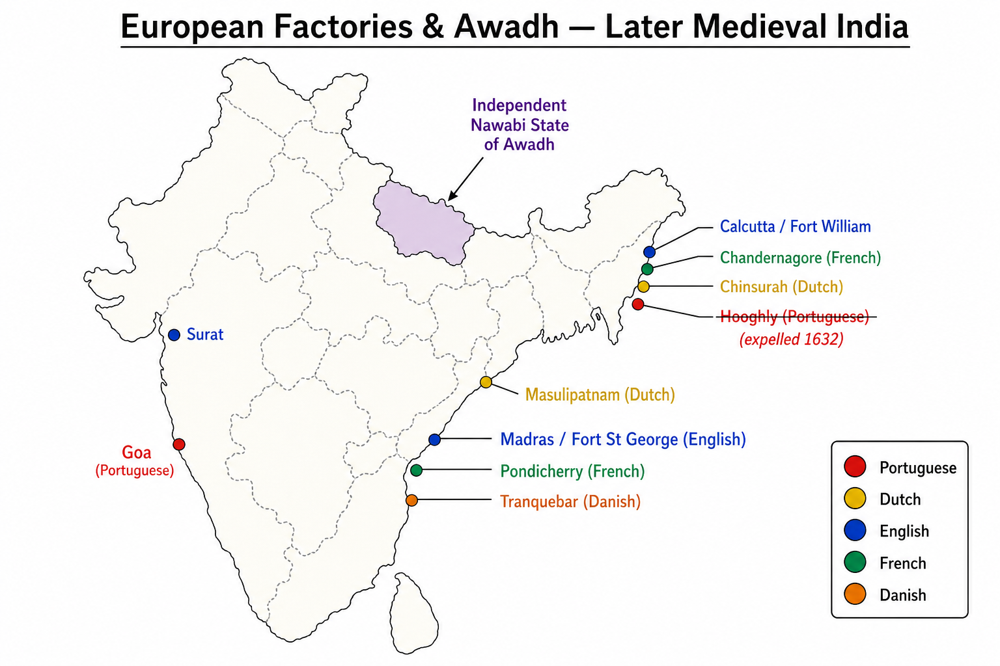

# Topic 12 — Later Medieval India
### ★ Complete Source of Truth — No other book/notes needed for this topic

> **Covers syllabus:** Independent State of Awadh | British East India Company: Arrival | Arrival of British Travellers | European Trading Companies | Portuguese | Dutch | English | French | Danish  
> **Sources baked in:** NCERT *Themes in Indian History Part III*, RS Sharma *Medieval India*, export notes (Decline of Mughals, Advent of Europeans), UPPCS/UPSC PYQs 2018–2025  
> **Exam weight:** ★★★ High — Hawkins/Roe chronology, traveller order (2021 Q75), Carnatic War/Aix-la-Chapelle (2025 Q67), company–settlement match, Awadh Nawabs  
> **Last verified:** July 2026

---

## Quick Revision Box — Raata This First

```
EUROPEAN ARRIVAL ORDER (★★★):
  Portuguese 1498 (Vasco da Gama) → Dutch 1602 (VOC) → English 1600 (EIC) → Danish 1616 → French 1664

PORTUGuese:
  Goa 1510 (Albuquerque) | Cochin, Daman, Diu | Cartaze system | Hooghly expelled 1632 (Shah Jahan)

DUTCH:
  VOC 1602 | Surat, Pulicat, Masulipatnam, Chinsurah (Bengal) | Spice trade | Beat Portuguese at Hooghly

ENGLISH (EIC):
  Charter 1600 | Surat factory 1612 | Hawkins 1608 | Roe 1615–19 (Jahangir)
  Madras (Fort St George 1640) | Bombay 1668 | Calcutta/Fort William 1698

FRENCH:
  Pondicherry (Puducherry) 1674 | Chandernagore Bengal | Dupleix | Carnatic Wars
  2025 Q67: Aix-la-Chapelle 1748 — 1st Carnatic War ended + Madras to English = C

DANISH:
  Tranquebar (Tamil Nadu) 1620 | Serampore (Bengal) — sold to British later

TRAVELLERS CHRONOLOGY (2021 Q75 = A):
  Ralph Fitch (1585) → William Hawkins (1608) → Nicholas Downton (1614) → Thomas Roe (1615–19)
  2023 Q31 Hawkins: James I envoy + Turkish versed = C (both true)

AWADH NAWABS (★★★ UP):
  Saadat Khan 1722 (first Nawab) → Safdar Jung → Shuja-ud-Daula (Panipat III)
  → Asaf-ud-Daula (Lucknow culture) → Wajid Ali Shah → British annexation 1856
  2025 Q127: Awadh acquisition in modern chronology sets
```

### Must-Know Term Comparisons (very frequently asked)

| Term | One-line difference | Hindi |
|------|---------------------|-------|
| **Portuguese vs English arrival** | **Portuguese 1498** sea route first; **English EIC 1600** charter — **~100 years later** | पुर्तगाली / अंग्रेज़ |
| **Hawkins vs Thomas Roe** | **Hawkins 1608** — trader-envoy at **Jahangir** court; **Roe 1615–19** — **ambassador** with formal farmans | हॉकिन्स / थॉमस रो |
| **Surat vs Madras vs Calcutta** | **Surat** = first **English factory (1612)**; **Madras 1640**; **Calcutta/Fort William 1698** | सूरत / मद्रास / कलकत्ता |
| **Pondicherry vs Chandernagore** | Both **French** — **Pondicherry** = main Coromandel capital; **Chandernagore** = **Bengal** factory | Pondicherry / Chandernagore |
| **Tranquebar vs Serampore** | Both **Danish** — **Tranquebar (1620)** Tamil Nadu; **Serampore** Bengal | Tranquebar / Serampore |
| **VOC vs EIC** | **VOC** = **Dutch** (1602); **EIC** = **English** (1600) — rival trading companies | VOC / EIC |
| **Cartaze vs Farman** | **Cartaze** = **Portuguese** pass/tax on Indian Ocean trade; **Farman** = **Mughal** imperial grant | कार्टाज़ / फ़रमान |
| **Carnatic War vs Anglo-Mysore** | **Carnatic Wars** = ** Anglo-French** in **Coromandel (1740s–60s)**; Mysore wars later with **Hyder/Tipu** | Karnatak युद्ध / मैसूर युद्ध |
| **Dupleix vs Clive** | **Dupleix** = **French** governor — **Carnatic** strategy; **Clive** = **English** — **Arcot/Plassey** era | Duplex / Clive |
| **Saadat Khan vs Shuja-ud-Daula** | **Saadat Khan** = **founder Nawab Awadh 1722**; **Shuja-ud-Daula** = **Panipat III** Nawab mid-18th c. | सआदत खान / शुजा-उद-दौला |
| **Awadh vs Bengal Nawabs** | **Awadh** = **Lucknow** line (Saadat Khan); **Bengal** = **Murshidabad** (Murshid Quli) — separate states | अवध / बंगाल |
| **Fitch vs Bernier** | **Fitch 1580s** — **merchant traveller** pre-EIC; **Bernier 1650s–60s** — **Aurangzeb court** intellectual | Fitch / Bernier |
| **Independent Awadh vs Mughal subah** | **1722+** Nawabs **semi-independent**; still **nominal Mughal suzerainty** till British | स्वतंत्र अवध / मुगल सубा |
| **Aix-la-Chapelle 1748 vs Paris 1763** | **1748** = **1st Carnatic War** end (**2025 Q67**); **1763 Paris** = **Seven Years' War** — French lost Canada/India footholds | Aix-la-Chapelle / Paris |
| **Hooghly vs Goa** | **Hooghly** = **Portuguese Bengal** factory (expelled 1632); **Goa** = **Portuguese capital in India** | Hugli / Goa |
| **Annexation 1856 vs 1765** | **1856** = **Awadh annexed** (Wajid Ali); **1765** = **Bengal Diwani** — different events | अवध 1856 / बंगाल 1765 |

### Memory Tricks

| Trick | Remembers |
|-------|-----------|
| **P-D-E-F-Da** | **P**ortuguese → **D**utch → **E**nglish → **F**rench → **Da**nish (rough arrival wave) |
| **2021 Q75 F-H-D-R** | **F**itch → **H**awkins → **D**ownton → **R**oe = **A (II,I,IV,III)** |
| **2023 Q31 Hawkins** | Both statements true → **C** |
| **2025 Q67 Carnatic** | Both 1 & 2 true → **C** (War ended + Madras returned) |
| **1600-1602-1616-1664** | EIC **1600**, VOC **1602**, Danish **1616**, French **1664** |
| **Goa 1510** | **A**lbuquerque **G**oa — **15-10** |
| **Awadh 1722** | **Saadat** starts **22** |
| **Tranquebar 1620** | **D**anish **20** |
| **Roe 1615** | **R**oe **15** teens |
| **Pondicherry French** | **P-P** French Puducherry |

---

## Exam Visuals — High-ROI Images

> **Type priority:** European settlements map → traveller/company timeline. Images stored locally (`images/`) for offline revision.

### 1. European Factories & Awadh — Settlement Map



*Raata **Portuguese Goa** → **English Surat-Madras-Calcutta axis** → **French Pondicherry** → **Danish Tranquebar** + **Awadh/Lucknow** Nawabi zone.*
*Source: Study map — generated for UPPCS European India settlements*

---

## 12.1 Later Medieval India — European Trading Companies (Frame)

### Definitions (learn all — exams pick different ones)

| Source | Definition |
|--------|------------|
| **General** | **Later Medieval/Early Modern transition** — Mughal decline + **European chartered companies** trading via **sea** — shift from **Central Asia land routes** |
| **NCERT** | **Factory system** — **warehouse + fort + agency** — not full colony initially — **farmans** from Mughals regulated trade |
| **Exam** | Five syllabus companies: **Portuguese, Dutch, English, French, Danish** — know **founding date + main settlement** |

### European Companies — How It Works

- **Why Europeans came:** **Spice demand**, **bullion trade**, **textile exports** (Indian cotton/silk), **decline of overland Silk Route** after **Ottoman** control — **sea route** imperative.
- **Chartered companies:** **State-backed monopolies** — **EIC (1600)**, **VOC (1602)** — armies, treaties, coins — **company-rule** precursor.
- **Factory ("factoire"):** **Trading post** with **godowns, agents, guards** — **Surat, Masulipatnam, Hooghly** — not territory annexation at first.
- **Mughal context:** **Akbar–Jahangir–Shah Jahan** granted **farmans** — Europeans needed **imperial permission** — paid **customs** at **Surat** port.
- **Portuguese monopoly broken:** **16th c. Portuguese** dominance on **Indian Ocean** ended by **Dutch/English** naval competition **17th c.**
- **Competition pattern:** **Portuguese** (1500s) → **Dutch/English** (1600s) → **French** join **1660s** → **Danish** minor — **multi-European rivalry** on Indian coasts.
- **Carnatic Wars:** **Anglo-French** fight through **Indian allies** (Nizam, Nawabs, Carnatic nobles) — **proxy wars** — **2025 Q67** First War ends **1748**.
- **Transition to empire:** **1757 Plassey**, **1761 Panipat**, **1764 Buxar** — English **from traders to territorial power** — end of "factory-only" era.
- **UP angle:** **Awadh** Nawabs in **Doab/Gangetic plain** interacted with **English/French** diplomacy — **Lucknow** independent culture centre.
- **Trap — all Europeans same century:** **FALSE** — **Portuguese 1498** vs **French company 1664** — **170 years apart**.
- **Trap — EIC ruled India from 1600:** **FALSE** — **1600 charter** = **trade**; **diwani/territory** much later (**1765** Bengal).

> **Exam note:** Match question pattern: **Company ↔ headquarters in Europe ↔ first Indian factory** — e.g. **EIC ↔ London ↔ Surat 1612**.

### European Companies — Master Table

| Company | Country | Founded | Key Indian settlements |
|---------|---------|---------|------------------------|
| **Estado da Índia** | **Portuguese** | **1498** (Gama) | **Goa**, Cochin, Daman, Diu, Hooghly |
| **VOC** | **Dutch** | **1602** | Surat, **Pulicat**, Masulipatnam, Chinsurah |
| **EIC** | **English** | **1600** | **Surat 1612**, **Madras 1640**, **Bombay 1668**, **Calcutta 1698** |
| **French EIC** | **French** | **1664** | **Pondicherry**, Chandernagore, Karikal, Mahe |
| **Danish EIC** | **Danish** | **1616** | **Tranquebar**, Serampore |

### Exam Facts (raata)

- **1498** Vasco da Gama — first European sea arrival
- **1600** EIC | **1602** VOC
- **Factory** = trading post
- **Farmans** from Mughals
- **1740s Carnatic Wars** Anglo-French
- Five companies in syllabus

### PYQs — European Frame

1. **(UPPCS 2025, Q67)** First Carnatic War + **Aix-la-Chapelle 1748** — Anglo-French rivalry frame.

2. **(UPPCS 2025, Q26)** **Second Anglo-French War** in chronology with other Anglo wars — company rivalry context.

### Examples (12.1)

| Example | Detail | Exam use |
|---------|--------|----------|
| **Surat customs** | Mughal port | All companies traded |
| **1748 treaty** | 2025 Q67 | Carnatic War end |
| **1600 vs 1498 gap** | EIC after Portuguese | Chronology trap |

---

## 12.2 Portuguese — First European Sea Power in India

### Definitions (learn all — exams pick different ones)

| Source | Definition |
|--------|------------|
| **General** | **Portuguese** — first Europeans to establish **lasting Indian Ocean empire** — **Afonso de Albuquerque** model |
| **NCERT** | **Cartaze system**, **missionary activity**, **Goan capital** — **16th c. monopoly** broken by rivals |
| **Exam** | **1498 Gama**, **1510 Goa**, **1632 Hooghly expulsion** |

### Portuguese — How It Works

- **1498 Vasco da Gama:** Reached **Calicut** (Kozhikode) — **Zamorin** court — opened **direct Europe–India sea trade** — bypassed **Arab/Ottoman** middlemen.
- **1500s expansion:** **Cochin**, **Goa**, **Daman**, **Diu** — **Albuquerque (1510)** captured **Goa** — became **capital of Portuguese India (Estado da Índia)**.
- **Indian Ocean control:** **Ormuz**, **Malacca**, **East African ports** — **string of fortresses** — **cartaze** (pass) required on ships — **maritime toll** system.
- **Trade goods:** **Spices** (pepper), **horses** to Deccan sultans, **textiles**, **diamonds** — **silver** from Americas paid for Asian goods.
- **Hooghly factory (Bengal):** **Slave trade, saltpetre, textiles** — **Shah Jahan** expelled Portuguese **1632** — **Shaista Khan** campaign — ended **Bengal Portuguese** foothold.
- **Decline factors:** **Dutch/English** naval superiority, **Mughal** pressure, **small population**, **overextension** — **17th c. retreat** to **Goa, Daman, Diu**.
- **Cultural legacy:** **Goan architecture, churches, creole** — **St. Francis Xavier** mission — exam **Goa = Portuguese** match.
- **Conflict with Mughals:** **Jahangir** allowed **English/Dutch** partly to **counter Portuguese** — strategic Mughal diplomacy.
- **Trap — Portuguese ruled all India:** **FALSE** — **coastal fortresses** only — never **Delhi/Agra** empire.
- **Trap — Vasco da Gama conquered Goa:** **FALSE** — **Albuquerque 1510** took **Goa**; Gama **1498** Calicut voyage only.

> **Exam note:** **Goa 1510** + **Hooghly expelled 1632** — pair **Portuguese rise/fall** dates.

### Exam Facts (raata)

- **1498** Gama at Calicut
- **1510** Goa — Albuquerque
- **Cartaze** pass system
- **Hooghly expelled 1632**
- Capital **Goa**
- Declined **17th c.**

### PYQs — Portuguese

1. **(UPSC 2019 pattern)** Which European power first established trading factories in India? → **Portuguese**.

2. **(UPPCS 2023, Q64 — indirect)** **Hollanders** credited in Philippines agriculture — European colonial powers comparison — **Portuguese/Spanish** vs **Dutch** colonial domains.

### Examples (12.2)

| Example | Detail | Exam use |
|---------|--------|----------|
| **Goa capital** | Estado da Índia | Match Portuguese |
| **Hooghly 1632** | Shah Jahan | Bengal expulsion |
| **Cartaze** | Ocean pass tax | Trade control |

---

## 12.3 Dutch — VOC & Spice Trade

### Definitions (learn all — exams pick different ones)

| Source | Definition |
|--------|------------|
| **General** | **Dutch East India Company (VOC)** — **1602** — world's first **joint-stock** mega-company — focused **spices + textiles** |
| **NCERT** | **Surat, Pulicat, Bengal** factories — defeated **Portuguese** — replaced by **English** in **18th c. Bengal** |
| **Exam** | **VOC 1602** — not 1600 (EIC) |

### Dutch — How It Works

- **VOC charter 1602:** **United Provinces** monopoly — could **wage war, coin money, treat** — company as **state-actor**.
- **Anti-Portuguese strategy:** Captured **Portuguese forts** — **Malacca, Ceylon (Sri Lanka), Indonesian spices** — **Indian factories** secondary to **Spice Islands**.
- **Indian settlements:** **Pulicat (Coromandel)**, **Surat**, **Masulipatnam**, **Chinsurah (Hugli)** — **textile export** to Europe.
- **Surat presence:** Competed with **English EIC** at **Mughal port** — **mutual rivalry** at Jahangir/Shah Jahan courts.
- **Bengal trade:** **Saltpetre, muslin, silk** — **Dutch factory Chinsurah** — economic importance for **gunpowder** ingredient export.
- **Decline in India:** **18th c.** — **English** dominated **Bengal/Bihar** after **Plassey**; Dutch kept **Spice Islands** longer — **India posts minor** by 1800s.
- **Anglo-Dutch wars:** **17th–18th c.** naval conflicts — **English** gradually **supplanted** Dutch in **Coromandel/Bengal**.
- **Trap — Dutch founded Goa:** **FALSE** — **Portuguese Goa**; Dutch **Pulicat/Chinsurah**.
- **Trap — VOC = English:** **FALSE** — **VOC Dutch**, **EIC English**.

> **Exam note:** **Pulicat + Chinsurah** = **Dutch** — common match-list distractor with **Pondicherry (French)**.

### Exam Facts (raata)

- **VOC 1602**
- **Pulicat, Chinsurah, Surat**
- Spice + textile trade
- Beat **Portuguese** at sea
- Declined vs **English 18th c.**

### PYQs — Dutch

1. **(UPPCS 2023, Q64)** **Hollanders (Dutch)** — colonial/agricultural credit in Philippines question — identifies **Dutch** as distinct European colonial power.

2. **(UPSC 2020 pattern)** Dutch East India Company was established in **1602** — **True**.

### Examples (12.3)

| Example | Detail | Exam use |
|---------|--------|----------|
| **Chinsurah Bengal** | Dutch factory | vs Chandernagore French |
| **Pulicat** | Coromandel | Dutch not English |
| **VOC 1602** | After EIC 1600 | Date trap |

---

## 12.4 English — British East India Company Arrival

### Definitions (learn all — exams pick different ones)

| Source | Definition |
|--------|------------|
| **General** | **English East India Company (EIC)** — **royal charter 1600** — **Surat 1612** first factory — evolved into **colonial power** |
| **NCERT** | **Hawkins 1608**, **Roe 1615–19** at **Jahangir's court** — **farmans** — **Madras, Bombay, Calcutta** triangle |
| **Exam** | **1600, 1612 Surat, 1640 Madras, 1698 Calcutta** |

### English EIC — How It Works

- **Charter 31 Dec 1600:** **Queen Elizabeth I** — **London** merchants monopoly on **East Indies** — **joint-stock** capital model.
- **First voyage 1608:** **William Hawkins** aboard **Hector** — reached **Surat** — presented at **Jahangir's court (Agra)** — sought **trade farman**.
- **Surat factory 1612:** After **Jahangir's farman** (post Hawkins/Roe diplomacy) — **first permanent English factory** in India — **customs** paid to Mughals.
- **Thomas Roe 1615–19:** **Ambassador of James I** — formal **Mughal treaty** — English **equal footing** with **Portuguese** at Surat — **embassy not conquest**.
- **Madras (1640):** **Francis Day** — **Fort St George** — **Coromandel** textile hub — later **capital of Madras Presidency**.
- **Bombay (1668):** **Charles II** received from **Portugal ( dowry)** — **leased to EIC** — **western port** gateway.
- **Calcutta (1698–1700):** **Fort William** — **Bengal** trade — **textiles, saltpetre** — became **capital of British India** later.
- **From trade to rule:** **1740s Carnatic Wars**, **1757 Plassey**, **1764 Buxar**, **1765 Diwani** — syllabus Topic 12 covers **arrival**; territorial rule bleeds modern history.
- **Mughal relationship:** **Jahangir farmans** → **Aurangzeb** renewed with conditions → **18th c.** **weak emperors** → EIC **dictated terms**.
- **Trap — EIC conquered Delhi 1608:** **FALSE** — **Hawkins** came for **trade permission**, not empire.
- **Trap — Roe before Hawkins:** **FALSE** — **Hawkins 1608**, **Roe 1615** (**2021 Q75** chronology).

> **Exam note:** **2023 Q31 Hawkins** — came **1611 as James I envoy** (also 1608 voyage) + **Turkish language** skill → **C both true** — at **Jahangir** court, **not Akbar**.

### Exam Facts (raata)

- **EIC charter 1600**
- **Surat factory 1612**
- **Hawkins 1608** | **Roe 1615–19**
- **Madras 1640** | **Bombay 1668** | **Calcutta 1698**
- **Jahangir farmans**
- Trade → rule later

### PYQs — English EIC

1. **(UPPCS 2023, Q31)** Hawkins — James I envoy + Turkish language → **C (both true)**.

2. **(UPPCS 2021, Q75)** Travellers — Hawkins before Roe → **A (II, I, IV, III)** with Fitch first.

### Examples (12.4)

| Example | Detail | Exam use |
|---------|--------|----------|
| **Hector 1608** | Hawkins ship | First EIC envoy |
| **Fort St George** | Madras | 1640 date |
| **2023 Q31** | Jahangir court | Not Akbar trap |

---

## 12.5 French — Pondicherry & Carnatic Wars

### Definitions (learn all — exams pick different ones)

| Source | Definition |
|--------|------------|
| **General** | **French East India Company (1664)** — **Pondicherry (Puducherry)** headquarters — **Dupleix** era **Carnatic Wars** vs **English** |
| **NCERT** | **Anglo-French rivalry** in **Deccan/Coromandel** through **Indian allies** — **1740s–1763** |
| **Exam** | **2025 Q67** — **Aix-la-Chapelle 1748** ended **First Carnatic War**; **Madras returned to English** |

### French — How It Works

- **Company 1664:** **Louis XIV** era — **Colbert** — late entrant vs **Portuguese/Dutch/English** — focused **Pondicherry** base.
- **Pondicherry (1674):** **Francois Martin** developed — **Fort Louis** — **French capital in India** — still **Union Territory** today.
- **Other factories:** **Chandernagore (Bengal)**, **Karikal, Mahe, Yanam** — **coastal enclaves** like Portuguese **Goa model** smaller scale.
- **Joseph-Francois Dupleix (1742–1754):** Governor — **Carnatic strategy** — supported **Chanda Sahib** vs **Anwaruddin/Nizam** — **proxy Indian wars**.
- **First Carnatic War (1740–48):** Linked **War of Austrian Succession** in Europe — **French captured Madras 1746** — ended **Treaty of Aix-la-Chapelle 1748** — **Madras returned to English** — **2025 Q67 both statements true → C**.
- **Second Carnatic War (1749–54):** **Dupleix** vs **Clive** — **Arcot** campaign — French power **checked**.
- **Third Carnatic War (1758–63):** Part of **Seven Years' War** — **Battle of Wandiwash 1760** — **English** decisive — **Treaty of Paris 1763** — **French** kept **factories** but **no political role**.
- **Bengal angle:** **Chandernagore** — **1757 Plassey** period **English** captured it — French **Bengal trade** ended politically.
- **Trap — Dupleix won Carnatic permanently:** **FALSE** — **recalled 1754**; **English** won **Third War**.
- **Trap — Pondicherry = Dutch:** **FALSE** — **French** — geography MCQ favourite.

> **Exam note:** **2025 Q67 = C** — Statement 1: **First Carnatic War ended 1748** ✓ | Statement 2: **Madras to English** ✓.

### Exam Facts (raata)

- **French company 1664**
- **Pondicherry 1674** HQ
- **Dupleix** — Carnatic Wars
- **1748 Aix-la-Chapelle** — 2025 Q67
- **Wandiwash 1760** — English win
- **Paris 1763** — French political defeat

### PYQs — French

1. **(UPPCS 2025, Q67)** Treaty of Aix-la-Chapelle (1748) — First Carnatic War ended + Madras to English → **C (both 1 and 2)**.

2. **(UPPCS 2025, Q26)** Second Anglo-French War in Anglo-war chronology — **1740s–48** Carnatic context.

### Examples (12.5)

| Example | Detail | Exam use |
|---------|--------|----------|
| **Madras 1746 capture** | French | Returned 1748 |
| **Chandernagore** | Bengal French | vs Chinsurah Dutch |
| **2025 Q67** | Aix-la-Chapelle | Direct PYQ |

---

## 12.6 Danish — Minor European Presence

### Definitions (learn all — exams pick different ones)

| Source | Definition |
|--------|------------|
| **General** | **Danish East India Company (1616)** — **minor** trader — **Tranquebar** main settlement |
| **NCERT** | **Missionary activity** (Serampore) later — **sold to British** — smallest syllabus company |
| **Exam** | **Tranquebar 1620** Tamil Nadu coast |

### Danish — How It Works

- **Company 1616:** **Danish-Norwegian** monarchy charter — **small capital** — could not compete with **VOC/EIC** scale.
- **Tranquebar (Tharangambadi) 1620:** **Coromandel coast** — **Fort Dansborg** — **only significant Danish territory** in India — **Tamil Nadu**.
- **Serampore (Frederiksnagore):** **Bengal** — **mission press**, **Serampore College** — **Baptist missionaries** (Carey, Ward, Marshman) — **19th c.** sold to **British**.
- **Trade scope:** **Textiles, pepper** — **limited volume** — **neutral** in many Anglo-French wars — **minor diplomatic role**.
- **Why exam tests Denmark:** **Negative matching** — **NOT French/Portuguese** — **Tranquebar** unique identifier.
- **Decline:** **1845** Tranquebar sold to **British** — **company dissolved** — no lasting empire.
- **Trap — Serampore = French:** **FALSE** — **Danish** then **missionary/British**.
- **Trap — Danish company 1600:** **FALSE** — **1616** (after EIC 1600, VOC 1602).

> **Exam note:** **Tranquebar = Danish** — **one-line raata** enough for most MCQs on smallest company.

### Exam Facts (raata)

- **Danish EIC 1616**
- **Tranquebar 1620** — Fort Dansborg
- **Serampore** Bengal — missions
- Sold to **British 1845**
- Smallest European presence

### PYQs — Danish

1. **(UPSC 2018 pattern)** Tranquebar on Coromandel coast was a trading post of — **Denmark**.

2. **(Statement-based)** Serampore missionaries Carey and Ward operated under **Danish** protection in Bengal — **True**.

### Examples (12.6)

| Example | Detail | Exam use |
|---------|--------|----------|
| **Fort Dansborg** | Tranquebar | Danish ID |
| **Serampore press** | Bible translation | Mission link |
| **1845 sale** | To British | End Danish India |

---

## 12.7 Arrival of British Travellers — Envoys, Merchants & Chroniclers

### Definitions (learn all — exams pick different ones)

| Source | Definition |
|--------|------------|
| **General** | **British travellers** — **merchants, ambassadors, diarists** who documented **Mughal India** and opened **EIC diplomacy** |
| **NCERT** | **Hawkins, Roe** = **official**; **Fitch, Bernier, Tavernier, Manucci** = **observers** |
| **Exam** | **2021 Q75 chronology** + **2023 Q31 Hawkins** |

### British Travellers — How It Works

- **Ralph Fitch (1585–91):** **Merchant** — visited **Agra, Banaras, Bengal** — **before EIC factory** — earliest **English** India account in syllabus chronology — **first in 2021 Q75**.
- **William Hawkins (1608–11):** **EIC captain** — **Jahangir's court** — knew **Turkish** ( Ottoman service earlier) — **James I envoy** — **2023 Q31 both statements true**.
- **Nicholas Downton (1614):** **EIC commander** — **Surat** — secured **trade against Portuguese** — between Hawkins and Roe.
- **Sir Thomas Roe (1615–19):** **Ambassador** — **Jahangir court** — **Persian correspondence** — obtained **farmans** for **Surat/Ahmedabad** — **not subservient** to Mughals but **diplomatic parity** sought.
- **Francois Bernier (1656–68):** **French physician** but **key Mughal chronicle** — **Aurangzeb court** — **economic critique** of **jagirdari decay** — often asked as **traveller** not French politics.
- **Jean-Baptiste Tavernier (1640s–1660s):** **Jeweller/merchant** — **six voyages** — **diamonds, trade routes** — **Aurangzeb** audience.
- **Niccolao Manucci (1650s–1700s):** **Venetian** — **Storia do Mogor** — lived **Goa, Delhi, Madras** — **Shivaji, Aurangzeb** eyewitness.
- **Why travellers matter:** **Primary sources** for **UPPCS** + **farmans** evidence for **EIC legitimacy**.
- **2021 Q75 order:** **Fitch (II) → Hawkins (I) → Downton (IV) → Roe (III)** = **A (II, I, IV, III)**.
- **Trap — Bernier = English:** **FALSE** — **French** doctor; wrote in **French**.
- **Trap — Roe 1608:** **FALSE** — **Hawkins 1608**, **Roe 1615**.

> **Exam note:** **Hawkins vs Roe** — both **Jahangir** — never **Akbar** (**2023 Q31** trap option mentally).

### Travellers — Complete Table

| Traveller | Period | Role | Court/Ruler |
|-----------|--------|------|-------------|
| **Ralph Fitch** | 1585–1591 | Merchant | Akbar era |
| **William Hawkins** | 1608–1611 | EIC envoy | **Jahangir** |
| **Nicholas Downton** | 1614 | EIC naval commander | Surat |
| **Thomas Roe** | 1615–1619 | Ambassador (James I) | **Jahangir** |
| **Bernier** | 1656–1668 | Physician-chronicler | **Aurangzeb** |
| **Tavernier** | 1640s–1660s | Jeweller-traveller | Mughal India |
| **Manucci** | 1650s–1700s | Venetian writer | Shah Jahan/Aurangzeb |

### Exam Facts (raata)

- **Fitch earliest** English traveller listed
- **Hawkins 1608** — Jahangir
- **Roe 1615–19** — ambassador
- **2021 Q75 = A**
- **2023 Q31 = C**
- **Bernier** — Aurangzeb

### PYQs — Travellers

1. **(UPPCS 2023, Q31)** Hawkins — James I envoy + Turkish → **C**.

2. **(UPPCS 2021, Q75)** Arrange Hawkins, Fitch, Roe, Downton → **A (II, I, IV, III)**.

### Examples (12.7)

| Example | Detail | Exam use |
|---------|--------|----------|
| **2021 Q75** | Fitch first | Chronology |
| **Hawkins Turkish** | 2023 Q31 | Statement 2 |
| **Roe farmans** | Surat trade | EIC legal basis |

---

## 12.8 Independent State of Awadh — Nawabs & British Annexation

### Definitions (learn all — exams pick different ones)

| Source | Definition |
|--------|------------|
| **General** | **Awadh (Oudh)** — **Gangetic plain** kingdom centred **Lucknow/Faizabad** — **semi-independent Nawabi state** from **1722** till **British annexation 1856** |
| **NCERT** | Broke from **weak Mughal centre** — **Nawabs** as **subahdars** became **hereditary kings** — **Shia court culture** |
| **Exam** | **Saadat Khan 1722** founder — **UPPCS UP focus** — **2025 Q127** Awadh acquisition chronology |

### Awadh — How It Works

- **Mughal subah:** **Awadh** province included **Lucknow, Banaras, Allahabad** region — rich **agricultural Doab** — strategic for **Delhi/Bengal**.
- **Saadat Khan Burhan-ul-Mulk (1722):** Appointed **subahdar** — founded **Nawabi line** — **semi-independent** revenue and army — **Mughal emperor nominal head**.
- **Safdar Jung (1739–1754):** **Wazir of Mughal Empire** also — **Awadh power peak** early — conflict with **Marathas** and **Rohillas**.
- **Shuja-ud-Daula (1754–1775):** **Third Battle of Panipat 1761** — allied **Abdali** vs **Marathas** — defeated near **Banaras** region conflicts also — **Treaty of Allahabad 1765** after **Buxar** weakened Awadh vs **English**.
- **Asaf-ud-Daula (1775–1797):** Shifted capital **Lucknow** — **Faizabad-Lucknow** culture — **Bara Imambara**, **Shia festivals** — **British subsidiary alliance** — **Resident at Lucknow**.
- **Later Nawabs:** **Ghazi-ud-Din, Nasir-ud-Din, Wajid Ali Shah** — **declining power** — **British control** increased — **1856 annexation** on **misgovernance** charge — **Wajid Ali** exiled to **Calcutta**.
- **1857 connection:** **Lucknow siege** — **Begum Hazrat Mahal** led revolt after **Wajid Ali** removed — brief cross-note only.
- **Cultural legacy:** **Kathak, Urdu, Awadhi tehzeeb**, **Lucknow gharana** — exam **culture match** separate from political dates.
- **2025 Q127:** **Awadh acquisition** chronology among **Indigo Revolt, Ilbert Bill, Afghan War** — **1856 annexation** date anchor.
- **Trap — Awadh independent from Akbar:** **FALSE** — **Nawabi independence 18th c.** not Mughal founding era.
- **Trap — Saadat Khan = Bengal:** **FALSE** — **Awadh/Lucknow** line.

> **Exam note:** **Awadh = UP heartland** — **Lucknow, Faizabad, Banaras** — UPPCS **state-specific** priority.

### Nawab — Period Table

| Nawab | Period | Key note |
|-------|--------|----------|
| **Saadat Khan** | from **1722** | Founder |
| **Safdar Jung** | 1739–1754 | Mughal Wazir |
| **Shuja-ud-Daula** | 1754–1775 | Panipat III ally |
| **Asaf-ud-Daula** | 1775–1797 | Lucknow culture |
| **Wajid Ali Shah** | 1847–1856 | Last Nawab; annexed |

### Exam Facts (raata)

- **1722** Saadat Khan
- Capital **Lucknow**
- **Semi-independent** Nawabi
- **Shuja-ud-Daula** — Panipat 1761
- **British annexation 1856**
- **2025 Q127** chronology

### PYQs — Awadh

1. **(UPPCS 2025, Q127)** Acquisition of Awadh by British — chronology with **Indigo Revolt, Ilbert Bill, Second Anglo-Afghan War**.

2. **(UPSC 2018 pattern)** Who founded the autonomous Nawabi state of Awadh? → **Saadat Khan Burhan-ul-Mulk (1722)**.

### Examples (12.8)

| Example | Detail | Exam use |
|---------|--------|----------|
| **Bara Imambara** | Asaf-ud-Daula | Lucknow culture |
| **1856 annexation** | Wajid Ali | 2025 Q127 |
| **Panipat III Shuja** | Abdali ally | Cross Topic 11 |

---

## Consolidated Reference

### European Settlements — Complete Match Table

| Power | Main settlements | Year (approx.) |
|-------|------------------|----------------|
| **Portuguese** | Goa, Cochin, Daman, Diu, Hooghly | Goa **1510** |
| **Dutch** | Pulicat, Surat, Chinsurah, Masulipatnam | VOC **1602** |
| **English** | Surat, Madras, Bombay, Calcutta | EIC **1600**; Surat **1612** |
| **French** | Pondicherry, Chandernagore, Karikal | Company **1664** |
| **Danish** | Tranquebar, Serampore | Company **1616**; Tranquebar **1620** |

### Carnatic Wars — Quick Table

| War | Period | Outcome (exam) |
|-----|--------|----------------|
| **First** | 1740–1748 | **Aix-la-Chapelle 1748** — Madras to English (**2025 Q67**) |
| **Second** | 1749–1754 | Dupleix recalled; English gain |
| **Third** | 1758–1763 | **Wandiwash 1760** — English supremacy; **Paris 1763** |

### UP Focus — Later Medieval India & Uttar Pradesh

| Element | Detail | Exam use |
|---------|--------|----------|
| **Awadh/Lucknow** | Nawabi capital — **1722+** | Topic 12.8 core |
| **Banaras/Allahabad** | In Awadh/Mughal orbit | Geography |
| **Doab** | Maratha chauth + EIC expansion zone | Cross Topic 11 |
| **Faizabad** | Early Nawabi capital | Before Lucknow peak |
| **1856 annexation** | Wajid Ali Shah | 2025 Q127 |
| **Roe/Hawkins** | Mughal court **Agra/Delhi** — not UP-specific but north India |

### Important Dates

| Item | Date |
|------|------|
| Vasco da Gama reaches India | **1498** |
| Albuquerque captures Goa | **1510** |
| EIC charter | **1600** |
| VOC founded | **1602** |
| William Hawkins at Jahangir court | **1608** |
| Surat English factory | **1612** |
| Danish company | **1616** |
| Thomas Roe embassy | **1615–1619** |
| Tranquebar (Danish) | **1620** |
| Portuguese expelled Hooghly | **1632** |
| Fort St George (Madras) | **1640** |
| French company | **1664** |
| Pondicherry HQ | **1674** |
| Bombay to EIC | **1668** |
| Fort William (Calcutta) | **1698** |
| Saadat Khan Nawab Awadh | **1722** |
| Treaty of Aix-la-Chapelle | **1748** |
| Battle of Wandiwash | **1760** |
| Third Battle of Panipat | **1761** |
| British annex Awadh | **1856** |

---

## Practice Zone — UPPCS Format Questions

> **Answers hidden** — click *Show answer* under each question to reveal.

**Q1.** The Maratha claim of revenue for protection is called **Chauth** — which European power first opened a sea route to India?

Options:
A. English
B. Portuguese
C. French
D. Dutch

<details>
<summary>Show answer</summary>

**Ans: B** — **1498 Vasco da Gama** — before all other syllabus companies.

</details>

**Q2.** With reference to **Captain Hawkins**, which statements is/are correct?

1. He came to India in 1611 as an envoy of James I.
2. He was very well versed in the Turkish language.

Options:
A. Only 1
B. Only 2
C. Both 1 and 2
D. Neither 1 nor 2

<details>
<summary>Show answer</summary>

**Ans: C** — **2023 Q31** exact pattern.

</details>

**Q3.** Arrange the following foreign travellers in chronological order of arrival in India:

1. William Hawkins
2. Ralph Fitch
3. Sir Thomas Roe
4. Nicholas Downton

Options:
A. 2, 1, 4, 3
B. 1, 3, 2, 4
C. 4, 2, 1, 3
D. 3, 2, 4, 1

<details>
<summary>Show answer</summary>

**Ans: A (2-1-4-3)** — **2021 Q75 = A (II, I, IV, III)**.

</details>

**Q4.** With reference to the **Treaty of Aix-la-Chapelle (1748)**, which statements is/are correct?

1. The First Carnatic War ended.
2. Madras was returned to the English.

Options:
A. Only 2
B. Neither 1 nor 2
C. Both 1 and 2
D. Only 1

<details>
<summary>Show answer</summary>

**Ans: C** — **2025 Q67** — both true.

</details>

**Q5.** Match List-I with List-II:

| List-I | List-II |
|--------|---------|
| A. Pondicherry | 1. Danish |
| B. Tranquebar | 2. French |
| C. Goa | 3. Portuguese |
| D. Chinsurah | 4. Dutch |

Options:
A. 2 1 3 4
B. 1 2 4 3
C. 2 1 4 3
D. 3 2 1 4

<details>
<summary>Show answer</summary>

**Ans: A (2-1-3-4)** — Pondicherry-French; Tranquebar-Danish; Goa-Portuguese; Chinsurah-Dutch.

</details>

**Q6.** The English East India Company received its charter in:

Options:
A. 1498
B. 1600
C. 1664
D. 1616

<details>
<summary>Show answer</summary>

**Ans: B** — **1600** — Queen Elizabeth I.

</details>

**Q7.** Consider the following about **Awadh**:

1. Saadat Khan founded the Nawabi state around 1722.
2. The capital was always Delhi.

Which is/are correct?

Options:
A. Only 1
B. Only 2
C. Both 1 and 2
D. Neither 1 nor 2

<details>
<summary>Show answer</summary>

**Ans: A** — Capital **Lucknow/Faizabad**, not Delhi.

</details>

**Q8.** Who among the following was the English ambassador at Jahangir's court?

Options:
A. Ralph Fitch
B. William Hawkins
C. Sir Thomas Roe
D. Francois Bernier

<details>
<summary>Show answer</summary>

**Ans: C** — **Roe 1615–19** — formal ambassador.

</details>

**Q9.** Assertion (A): The Portuguese were expelled from Hooghly in 1632.

Reason (R): Shah Jahan opposed their misuse of trade privileges in Bengal.

Options:
A. Both true; R explains A
B. Both true; R does not explain A
C. A true; R false
D. A false; R true

<details>
<summary>Show answer</summary>

**Ans: A** — **1632** Bengal expulsion under **Shah Jahan**.

</details>

**Q10.** Arrange Peshwa-unrelated but **European company founding** order:

1. Dutch VOC
2. English EIC
3. French company
4. Danish company

Options:
A. 2, 1, 4, 3
B. 1, 2, 3, 4
C. 2, 4, 1, 3
D. 4, 2, 1, 3

<details>
<summary>Show answer</summary>

**Ans: A (2-1-4-3)** — **1600 EIC → 1602 VOC → 1616 Danish → 1664 French**.

</details>

**Q11.** Which settlement was **Danish**?

Options:
A. Serampore
B. Chandernagore
C. Daman
D. Masulipatnam only

<details>
<summary>Show answer</summary>

**Ans: A** — **Serampore + Tranquebar** — Danish (Serampore listed).

</details>

**Q12.** Consider the following statements:

1. Albuquerque captured Goa in 1510.
2. Vasco da Gama captured Goa in 1498.

Which is/are correct?

Options:
A. Only 1
B. Only 2
C. Both 1 and 2
D. Neither 1 nor 2

<details>
<summary>Show answer</summary>

**Ans: A** — Gama reached **Calicut 1498**, not Goa.

</details>

**Q13.** The first permanent English factory in India was established at:

Options:
A. Calcutta
B. Madras
C. Surat
D. Pondicherry

<details>
<summary>Show answer</summary>

**Ans: C** — **1612 Surat**.

</details>

**Q14.** Match traveller — ruler:

| List-I | List-II |
|--------|---------|
| A. Bernier | 1. Jahangir |
| B. Hawkins | 2. Aurangzeb |
| C. Roe | 3. Jahangir |

Options:
A. 2 3 1
B. 2 1 3
C. 1 2 3
D. 3 1 2

<details>
<summary>Show answer</summary>

**Ans: B (2-1-3)** — Bernier-Aurangzeb; Hawkins-Jahangir; Roe-Jahangir.

</details>

**Q15.** Shuja-ud-Daula, Nawab of Awadh, is associated with:

Options:
A. First Carnatic War
B. Third Battle of Panipat (1761)
C. Treaty of Purandar 1665
D. Plassey 1757 directly as victor

<details>
<summary>Show answer</summary>

**Ans: B** — **Abdali ally** at **Panipat III**.

</details>

**Q16.** Arrange the following **Awadh Nawabs** in chronological order:

1. Saadat Khan
2. Asaf-ud-Daula
3. Shuja-ud-Daula
4. Wajid Ali Shah

Options:
A. 1, 3, 2, 4
B. 4, 1, 2, 3
C. 1, 2, 3, 4
D. 3, 1, 4, 2

<details>
<summary>Show answer</summary>

**Ans: A (1-3-2-4)** — **1722 → 1754 → 1775 → 1847**.

</details>

**Q17.** **Dupleix** was associated with:

Options:
A. Portuguese India
B. French Carnatic policy
C. Dutch VOC
D. Danish Tranquebar

<details>
<summary>Show answer</summary>

**Ans: B** — **French** governor — Carnatic Wars.

</details>

**Q18.** Assertion (A): Ralph Fitch visited India before the establishment of the English factory at Surat.

Reason (R): Fitch travelled in the late 1580s.

Options:
A. Both true; R explains A
B. Both true; R does not explain A
C. A true; R false
D. A false; R true

<details>
<summary>Show answer</summary>

**Ans: A** — Fitch **1585** before **Surat 1612**.

</details>

**Q19.** Which pair is **NOT** correctly matched?

Options:
A. Goa — Portuguese
B. Pondicherry — French
C. Tranquebar — Dutch
D. Fort St George — English

<details>
<summary>Show answer</summary>

**Ans: C** — **Tranquebar = Danish**, not Dutch.

</details>

**Q20.** The Dutch East India Company (VOC) was founded in:

Options:
A. 1602
B. 1600
C. 1664
D. 1616

<details>
<summary>Show answer</summary>

**Ans: A** — **1602** — two years after EIC.

</details>

**Q21.** Consider the following about **Carnatic Wars**:

1. They were fought between the English and the French.
2. The Third Carnatic War was part of the Seven Years' War.

Options:
A. Only 1
B. Only 2
C. Both 1 and 2
D. Neither 1 nor 2

<details>
<summary>Show answer</summary>

**Ans: C** — Both standard facts.

</details>

**Q22.** British annexation of Awadh took place in:

Options:
A. 1765
B. 1856
C. 1757
D. 1722

<details>
<summary>Show answer</summary>

**Ans: B** — **1856** — **Wajid Ali Shah** — **2025 Q127** anchor.

</details>

**Q23.** Arrange chronologically:

1. Thomas Roe's embassy
2. Vasco da Gama's arrival
3. EIC charter
4. Capture of Goa by Portuguese

Options:
A. 2, 4, 3, 1
B. 4, 2, 1, 3
C. 2, 3, 4, 1
D. 3, 2, 4, 1

<details>
<summary>Show answer</summary>

**Ans: A (2-4-3-1)** — 1498 → 1510 → 1600 → 1615–19.

</details>

**Q24.** **Cartaze** system was linked to:

Options:
A. Mughal jagirdari
B. Portuguese maritime trade control
C. Maratha chauth
D. Awadh Nawabi revenue

<details>
<summary>Show answer</summary>

**Ans: B** — **Portuguese** ocean pass/tax.

</details>

**Q25.** Consider the following:

1. Chandernagore was a French settlement.
2. Chinsurah was a Dutch settlement.

Which is/are correct?

Options:
A. Only 1
B. Only 2
C. Both 1 and 2
D. Neither 1 nor 2

<details>
<summary>Show answer</summary>

**Ans: C** — Both Bengal factory matches correct.

</details>

**Q26.** Who founded the independent Nawabi state of Awadh?

Options:
A. Murshid Quli Khan
B. Saadat Khan Burhan-ul-Mulk
C. Alivardi Khan
D. Shuja-ud-Daula

<details>
<summary>Show answer</summary>

**Ans: B** — **1722** — not Bengal/Murshid Quli.

</details>

**Q27.** Assertion (A): William Hawkins visited Akbar's court.

Reason (R): Hawkins arrived in India in 1608.

Options:
A. Both true; R explains A
B. Both true; R does not explain A
C. A true; R false
D. A false; R true

<details>
<summary>Show answer</summary>

**Ans: D** — **A false** — **Jahangir** court; **R true** on date.

</details>

**Q28.** Match company — founding year:

| List-I | List-II |
|--------|---------|
| A. English EIC | 1. 1664 |
| B. French | 2. 1600 |
| C. Dutch VOC | 3. 1602 |

Options:
A. 2 1 3
B. 1 2 3
C. 3 2 1
D. 2 3 1

<details>
<summary>Show answer</summary>

**Ans: A (2-1-3)** — English-1600; French-1664; Dutch-1602.

</details>

**Q29.** Consider the following events (2025 Q127 pattern subset):

1. Acquisition of Awadh by the British
2. First English factory at Surat
3. Treaty of Aix-la-Chapelle

Options arranged earliest to latest — correct order codes:

A. 2, 3, 1
B. 3, 2, 1
C. 2, 1, 3
D. 1, 2, 3

<details>
<summary>Show answer</summary>

**Ans: A (2-3-1)** — Surat **1612** → Aix-la-Chapelle **1748** → Awadh annexation **1856**.

</details>

**Q30.** **Fort William** is associated with:

Options:
A. Madras
B. Bombay
C. Calcutta
D. Surat

<details>
<summary>Show answer</summary>

**Ans: C** — **Calcutta 1698** — Bengal headquarters.

</details>

---

## Complete PYQ Bank — UPPCS (2018–2025)

> Full question text from `pyq/` files. Answers in hidden blocks.

### UPPCS Prelims 2021

**Q75.** Arrange the following foreign travelers in chronological order of their arrival in India:

I. William Hawkins  
II. Ralph Fitch  
III. Sir Thomas Roe  
IV. Nicholas Downton

Options:
A. II, I, IV and III
B. IV, II, I and III
C. I, III, II and IV
D. III, II, IV and I

<details>
<summary>Show answer</summary>

**Ans: A (II, I, IV, III)** — Fitch (1585) → Hawkins (1608) → Downton (1614) → Roe (1615–19).

</details>

### UPPCS Prelims 2020

**Q18.** With reference to the Treaty of Aix-la-Chapelle (1748), which of the following statements is/are correct?

1. The First Carnatic War ended.
2. Madras was returned to the English.

Options:
A. 1 only
B. 2 only
C. Both 1 and 2
D. Neither 1 nor 2

<details>
<summary>Show answer</summary>

**Ans: C** — Same core as **2025 Q67** — both statements correct.

</details>

### UPPCS Prelims 2023

**Q31.** With reference to Captain Hawkins, which of the following statement(s) is/are correct?

1. He came to India in 1611 as an envoy of James I.
2. He was very well versed in the Turkish language.

Options:
A. Only 1
B. Only 2
C. Both 1 and 2
D. Neither 1 nor 2

<details>
<summary>Show answer</summary>

**Ans: C** — Both statements correct — **Jahangir's court**.

</details>

### UPPCS Prelims 2025

**Q67.** With reference to the Treaty of Aix-la-Chapelle (1748), which of the following statements is/are correct?

1. The First Carnatic War ended.
2. Madras was returned to the English.

Options:
A. Only 2
B. Neither 1 nor 2
C. Both 1 and 2
D. Only 1

<details>
<summary>Show answer</summary>

**Ans: C** — Both statements correct.

</details>

**Q127.** Consider the following events and arrange them in correct chronological order:

1. Acquisition of Awadh by the British
2. Ilbert Bill Controversy
3. Indigo Revolt
4. Second Anglo-Afghan War

Options:
A. 1, 3, 4, 2
B. 3, 1, 2, 4
C. 3, 1, 4, 2
D. 1, 3, 2, 4

<details>
<summary>Show answer</summary>

**Ans: A (1, 3, 4, 2)** — Awadh annexation **1856** → Indigo Revolt **1859–60** → Second Anglo-Afghan War **1878–80** → Ilbert Bill **1883**.

</details>

---

## Common Traps — Later Medieval India (≥10)

1. **Roe 1608 / Akbar court** — **FALSE** — **Hawkins 1608, Jahangir**; **Roe 1615–19**.
2. **Gama captured Goa** — **FALSE** — **Albuquerque 1510**; Gama **1498 Calicut**.
3. **Tranquebar = Dutch** — **FALSE** — **Danish 1620**.
4. **Pondicherry = Portuguese** — **FALSE** — **French 1674**.
5. **EIC charter 1498** — **FALSE** — **1600**; **1498 = Gama**.
6. **First factory Calcutta** — **FALSE** — **Surat 1612** first English.
7. **Bernier = English** — **FALSE** — **French** physician at **Aurangzeb** court.
8. **2021 Q75 order** — **Fitch before Hawkins** — **A (II,I,IV,III)**.
9. **2025 Q67** — Both statements on **Aix-la-Chapelle** true → **C**.
10. **Saadat Khan = Bengal Nawab** — **FALSE** — **Awadh 1722**.
11. **Awadh capital Delhi** — **FALSE** — **Lucknow/Faizabad**.
12. **Dupleix = English** — **FALSE** — **French** Carnatic Wars.
13. **VOC = English** — **FALSE** — **Dutch 1602**.
14. **Hooghly Portuguese till 1856** — **FALSE** — expelled **1632**.
